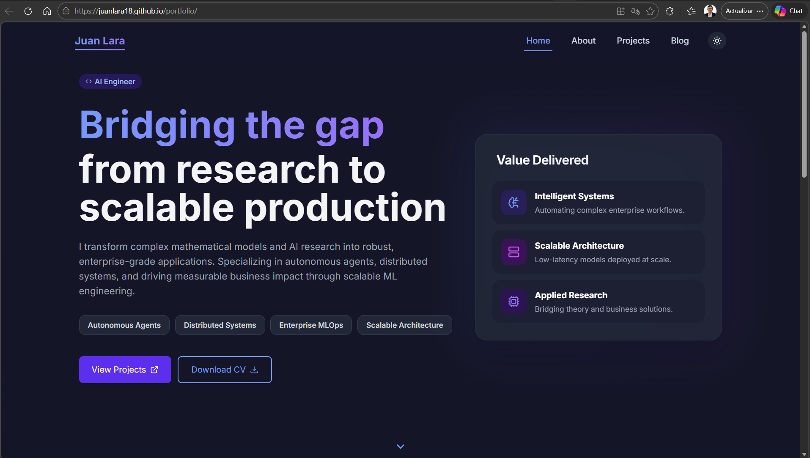

<div align="center">

# Juan Lara — Portfolio & Blog

**Computer Scientist · Applied Mathematician · ML Engineer**

[](https://juanlara18.github.io/portfolio)
[](LICENSE)
[](https://github.com/JuanLara18/portfolio/actions)

[larajuand@outlook.com](mailto:larajuand@outlook.com) · [LinkedIn](https://www.linkedin.com/in/julara/)

<br/>



</div>

---

Personal site built to share research, algorithmic analysis, and mathematical proofs — not just a resume. Features a custom Markdown blog engine with full LaTeX rendering, Mermaid diagrams, optional narrated audio in English and Spanish, dark mode, and animated UI.

## Stack

| Layer | Tech |
|---|---|
| Frontend | React 18, React Router 6 |
| Styling | Tailwind CSS, Framer Motion |
| Blog engine | react-markdown · remark-math · KaTeX · Mermaid |
| Audio | edge-tts (EN/ES voices) · Ollama + gemma4 for ES translation |
| Deploy | GitHub Actions → GitHub Pages |

## Blog — 67 posts across 3 categories

**Curiosities** — Mathematical results that break intuition
`Collatz Conjecture` · `Gödel's Incompleteness` · `Tetris is NP-Complete` · `1+2+3+... = -1/12`

**Field Notes** — Engineering & ML in practice
`Docker` · `Reinforcement Learning` · `ML Infrastructure` · `Production LLMs`

**Research** — Paper breakdowns
`Attention Is All You Need` · `The Manifold Hypothesis` · `Embeddings: Geometry of Meaning`

## Run locally

```bash
git clone https://github.com/JuanLara18/portfolio.git
cd portfolio/front
npm install
npm start
```

The blog manifest (`blogData.json`) is generated automatically before each build via `prebuild`.

## Adding a post

Create a `.md` file in `front/public/blog/posts/<category>/` with YAML frontmatter, then commit and push — GitHub Actions handles the rest.

To also generate narrated audio (EN + ES) for the new post, run the one-shot
wrapper (requires Python + Ollama for Spanish — see scripts README):

```bash
./front/scripts/generate_audio.sh          # bash / WSL / git-bash
.\front\scripts\generate_audio.ps1         # Windows PowerShell
```

## Tooling

All build-time scripts (blog data generation, image optimization, Mermaid
validation, PDF export, audio narration pipeline) are documented in
[`front/scripts/README.md`](front/scripts/README.md). For a dev-oriented
walkthrough of the React app, see [`front/README.md`](front/README.md).

## License

MIT — see [LICENSE](LICENSE)
