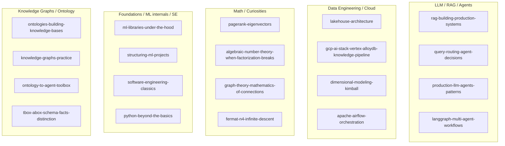
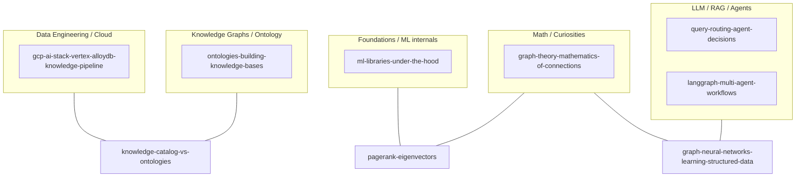
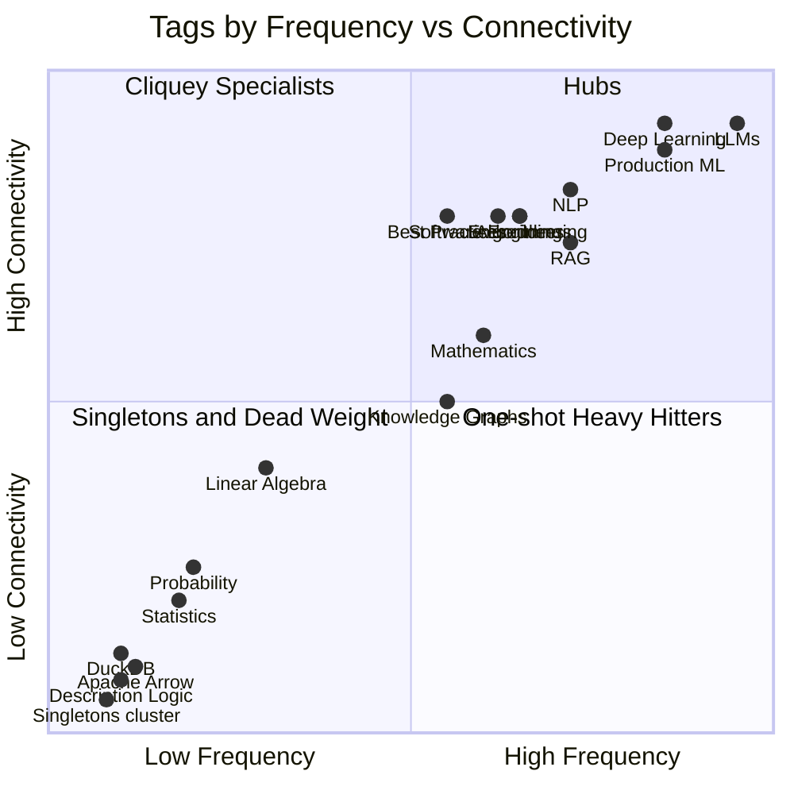
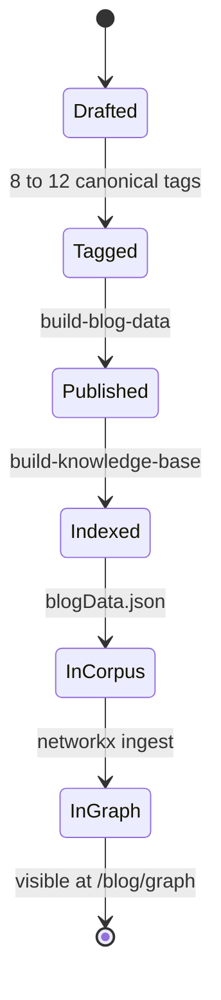

# 100 Posts as a Knowledge Graph: A Retrospective in Network Science

When you write 99 posts and then plot the result as a graph, the picture is not what you thought you were drawing.

I started the blog in January 2025 with a piece on the Rubik's cube and group theory. The plan, to the extent there was one, was to write a few math curiosities on the side and see what stuck. What stuck turned out to be a habit: 99 posts, 685,421 words, 223 distinct tags. This piece is post number 100. It is also the first time I have looked at the corpus the way I would look at any other dataset I owned: dump it to JSON, load it into networkx, ask the graph what it knows.

The answer is not what I expected. I thought I had been writing about LLMs and ontologies on top of a foundation in math and software engineering. The graph thinks I have been writing about LLMs and Production ML on top of a foundation in math and software engineering, with everything else clustered around those two gravity wells. I thought my curiosities posts were a vibrant side garden. The graph thinks they are a bright, dense, undersized continent that connects to the rest of the corpus through exactly two bridges. I thought my tagging discipline was reasonable. The graph thinks 39 percent of my tags are dead nodes, used once and never again.

Some of these are confirmations. Some are corrections. The corrections are why this post exists, and they are why the next 100 posts will be measurably different.

A note before we start. The piece you are reading is the curiosities-category companion to a stack-recommendations piece I have lined up for post #101. The retrospective belongs in *curiosities* because it is mostly an exercise in applied network science: the analytical method I have already used in [graph-theory-mathematics-of-connections](https://juanlara18.github.io/portfolio/#/blog/graph-theory-mathematics-of-connections), [network-science-communities-centrality](https://juanlara18.github.io/portfolio/#/blog/network-science-communities-centrality), and [pagerank-eigenvectors](https://juanlara18.github.io/portfolio/#/blog/pagerank-eigenvectors), now turned inward on the corpus that produced those posts in the first place. The blog applied to itself. I will keep the math honest and the verdicts unsentimental.

---

## Why a Graph?

Reading a blog as a chronology is the obvious move and almost always the wrong one. Chronology privileges what happened to be on my mind in a given week, which is the noisiest signal a personal blog produces. Calendar order tells you about my mood, my deadlines, my commute reading; it does not tell you what the corpus is *about*.

The corpus is about its structure. Every post has tags. Every tag connects to other tags through co-occurrence on the same post. Every two posts that share a tag are connected; two posts that share several tags are connected through a thicker rope. Concepts strung across posts thread the whole corpus together. What you get when you draw this is a graph: nodes are posts (or tags, depending on how you project), edges are co-mentions, weights are how often two things travel together.

This is not a metaphor. It is the same construction network science uses for citation networks and protein interaction networks. The math does not know the nodes are blog posts. It will tell you the same things it tells everyone else: which nodes are central, which form natural clusters, which act as bridges, which are dangling out on the periphery.

The site already exposes a small graph view at `/blog/graph` that lets a reader navigate by clicking related posts. The view I want for this retrospective is the analytic one: not "what should I read next" but "what is the shape of the thing I have built." Graph theory gives me the vocabulary; network science gives me the verdicts.

I will use both projections of the corpus throughout this post:

- **Post-post graph.** Nodes are the 99 posts. Two posts are connected by an edge if they share at least one tag, with the edge weight equal to the count of shared tags. This graph has 99 nodes and a lot of edges; it answers "which posts cluster together."
- **Tag-tag graph.** Nodes are the 223 unique tags. Two tags are connected by an edge if they appear on at least one post together, with the edge weight equal to the count of shared posts. This graph has 223 nodes and 2,408 edges; it answers "what is the conceptual skeleton of the blog."

Most of what is interesting lives in the tag-tag graph. The post-post graph is denser, noisier, harder to interpret. The tag-tag graph is the thing that surfaces the spine.

---

## The Corpus at a Glance

Before any analysis, the raw shape. All numbers come from running an analytics pass on `front/src/data/blogData.json` on 2026-05-01.

| Metric | Value |
|---|---|
| Posts (nodes) | 99 |
| Total words | 685,421 |
| Median word count | 6,500 |
| Longest post | 18,000 words (`reinforcement-learning-first-principles`) |
| Shortest non-zero post | 4,500 words (`the-manifold-hypothesis`) |
| Unique tags | 223 |
| Tag-tag edges | 2,408 |
| Singleton tags | 87 (39 percent of all tags) |

The split by category:

| Category | Count | Share |
|---|---|---|
| field-notes | 73 | 73.7 percent |
| curiosities | 14 | 14.1 percent |
| research | 12 | 12.1 percent |

A few observations from the numbers alone, before we touch the graph.

First, the corpus is dominated by field-notes. Roughly seventy-three of every hundred posts are practical writeups; only fourteen are curiosities and twelve are research deep-dives. This is the first signal that the blog is less of a balanced trio and more of a single applied-engineering torso with two small intellectual wings. It is also, in retrospect, a faithful reflection of how the writing has evolved: most of the posts are practical writeups from data and ML work, with curiosities and research relegated to evenings.

Second, the median post is 6,500 words. The mean is also high: 685,421 over 99 is roughly 6,923. This is not a list-blog. It is closer to a textbook with chapters that happen to be marketed as posts. The single longest piece, [reinforcement-learning-first-principles](https://juanlara18.github.io/portfolio/#/blog/reinforcement-learning-first-principles), is 18,000 words, which is a small book.

---

## Building the Graph

Methodology section, kept short. The two projections are constructed the same way every time: load the post array, walk the tags, accumulate edges. Anyone who wants to reproduce the analysis can run the snippet below against `front/src/data/blogData.json`.

```python
import json
from collections import Counter, defaultdict
from itertools import combinations

import networkx as nx

with open("front/src/data/blogData.json", encoding="utf-8") as f:
    data = json.load(f)

posts = data["posts"]

# Tag-tag projection: nodes = tags, edges = co-occurrence count on posts
tag_tag = nx.Graph()
edge_weights = Counter()
tag_freq = Counter()

for p in posts:
    tags = p.get("tags", [])
    for t in tags:
        tag_freq[t] += 1
    for a, b in combinations(sorted(tags), 2):
        edge_weights[(a, b)] += 1

for tag, freq in tag_freq.items():
    tag_tag.add_node(tag, freq=freq)

for (a, b), w in edge_weights.items():
    tag_tag.add_edge(a, b, weight=w)

# Post-post projection: nodes = posts, edges = shared-tag count
post_post = nx.Graph()
for p in posts:
    post_post.add_node(p["slug"], words=p.get("estimatedWordCount", 0),
                       category=p.get("category"))

slug_tags = {p["slug"]: set(p.get("tags", [])) for p in posts}
for s1, s2 in combinations(slug_tags.keys(), 2):
    shared = slug_tags[s1] & slug_tags[s2]
    if shared:
        post_post.add_edge(s1, s2, weight=len(shared))

print(f"Tag-tag graph: {tag_tag.number_of_nodes()} nodes, "
      f"{tag_tag.number_of_edges()} edges")
print(f"Post-post graph: {post_post.number_of_nodes()} nodes, "
      f"{post_post.number_of_edges()} edges")
```

For 99 posts and 223 tags this runs in under a second. The output for me is `Tag-tag graph: 223 nodes, 2408 edges` and a much denser post-post graph because most posts share at least one tag with most other posts.

The choice of edge weight matters. For tag-tag I use raw co-occurrence count; for post-post I use the count of shared tags. There are weighted variants — Jaccard, normalized pointwise mutual information, edge weight thresholding to remove noise — and they each shift the picture slightly. For this retrospective I am going to stay with raw counts because the goal is to read the structure I actually built, not the structure I would have built under a particular normalization scheme.

One important consequence of using raw counts: the singleton tags (the 87 tags that appear on a single post) have *zero edges* in the tag-tag graph. They are isolated nodes. I will come back to this when I discuss the long tail.

---

## Hub Tags: The Spine of the Blog

The first question network science always asks is: what are the hubs? Which nodes have the most connections?

In the tag-tag graph, "most connections" means "most distinct other tags this tag has ever co-occurred with on a post." A tag with 100 distinct neighbors has been on enough posts, and on diverse enough posts, that it touches almost every other corner of the graph. This is the operational meaning of *hub*.

The top 12 hub tags by neighbor count:

| Tag | Distinct neighbors | Posts using it |
|---|---|---|
| Deep Learning | 101 | 31 |
| LLMs | 100 | 35 |
| Production ML | 100 | 31 |
| Data Engineering | 87 | 18 |
| Software Engineering | 77 | 18 |
| NLP | 75 | 23 |
| Best Practices | 70 | 15 |
| Algorithms | 70 | 22 |
| Cloud Computing | 69 | 15 |
| Embeddings | 69 | 20 |
| Machine Learning | 67 | 13 |
| RAG | 66 | 23 |

This top-12 list is the spine of the blog. Read it as a sentence and the structure becomes obvious: the corpus runs from theoretical foundations (Mathematics, Algorithms, Software Engineering) through models and capabilities (Deep Learning, NLP, LLMs, Embeddings, RAG) into production concerns (Production ML, MLOps, Cloud Computing, Best Practices). Every post sits somewhere on that arc.

Computing this in the same Python session is a one-liner:

```python
hubs = sorted(tag_tag.degree(), key=lambda x: x[1], reverse=True)
for tag, deg in hubs[:12]:
    print(f"{tag:30s} neighbors={deg:3d}  posts={tag_freq[tag]:2d}")
```

The result reproduces the table above exactly.

A few things are worth pointing out. **Deep Learning has more neighbors than LLMs even though LLMs is the more frequent tag.** This means Deep Learning has been the connective tissue across more diverse contexts: it co-occurs with NLP, with Computer Vision, with Mathematics, with Optimization, with Reinforcement Learning, and with the whole MLOps stack. LLMs is high-frequency but more concentrated in the LLM cluster proper. The neighbor-count ranking is closer to a measure of "topical promiscuity" than of raw frequency.

**Best Practices and Software Engineering rank higher than I expected.** Both have 70+ neighbors despite each appearing on only 15 and 18 posts respectively. They are connector tags: I tag them on a post when the post has a "how to do this well" angle, and that angle shows up across every cluster. Best Practices is a meta-tag whose function is to bind otherwise-distant clusters by signaling editorial intent.

**Algorithms (70 neighbors, 22 posts) is the bridge between the math wing and the engineering torso.** Almost every algorithms post also touches either Mathematics or Computer Science, but algorithms posts also touch Production ML when the algorithm is something like a vector index or a graph traversal. Without Algorithms, the curiosities cluster would be much more isolated than it already is.

The spine, drawn as a graph:

```mermaid
flowchart LR
    subgraph FOUND["Foundations"]
        MATH["Mathematics"]
        ALG["Algorithms"]
        CS["Computer Science"]
        SE["Software Engineering"]
    end
    subgraph MODELS["Models and Capabilities"]
        DL["Deep Learning"]
        NLP["NLP"]
        EMB["Embeddings"]
        LLM["LLMs"]
        RAG["RAG"]
    end
    subgraph PROD["Production"]
        PROD_ML["Production ML"]
        MLOPS["MLOps"]
        CLOUD["Cloud Computing"]
        BP["Best Practices"]
    end
    MATH --- ALG
    ALG --- CS
    CS --- SE
    SE --- DL
    DL --- NLP
    NLP --- EMB
    EMB --- LLM
    LLM --- RAG
    RAG --- PROD_ML
    PROD_ML --- MLOPS
    MLOPS --- CLOUD
    CLOUD --- BP
```



This left-to-right reading of the spine — foundations then models then production — is not how I planned the blog. I never sat down and said "I should make sure my hub tags form a coherent pipeline from theory to deployment." It emerged because that is how I actually think when I sit down to write. A practice question pulls in a model question pulls in a foundation question and back out to a deployment question. The spine is the trace of that habit, repeated across 99 sessions.

The honest reading is that this is *also* the shape of my career: math undergraduate, software engineering, ML, then production AI at a financial institution. The blog graph is not just "the topics the blog covers." It is a low-dimensional embedding of the author. Network science knows this is a generic phenomenon — your knowledge graph mirrors the trajectory through which you acquired the knowledge — but seeing it materialize from your own writing is uncomfortable in a useful way.

---

## The Strongest Edges

Hubs tell you where the gravity is. Edges tell you which pairs of ideas travel together most often. The strongest tag-tag co-occurrences in the corpus:

| Edge | Co-occurrences | What sits on this edge |
|---|---|---|
| LLMs ↔ Production ML | 17 | The "LLM in production" canon |
| LLMs ↔ RAG | 17 | RAG and its evaluation arc |
| Agents ↔ LLMs | 15 | The agents arc |
| MLOps ↔ Production ML | 15 | The MLOps practice posts |
| Algorithms ↔ Mathematics | 15 | The curiosities cluster |
| Deep Learning ↔ NLP | 15 | The transformers and embeddings arc |
| Production ML ↔ RAG | 13 | RAG-as-product posts |
| Algorithms ↔ Computer Science | 13 | The CS curiosities |
| LLMs ↔ NLP | 13 | LLM-internal posts |
| Embeddings ↔ RAG | 12 | The retrieval stack |

Each edge is a posting habit. I want to read three of them honestly.

**LLMs ↔ Production ML (17).** This is the fattest edge in the blog, tied with LLMs ↔ RAG. It is also the edge I am least proud of. Many of these posts genuinely belong on the edge: [llm-caching-four-layers](https://juanlara18.github.io/portfolio/#/blog/llm-caching-four-layers), [production-llm-agents-patterns](https://juanlara18.github.io/portfolio/#/blog/production-llm-agents-patterns), [llamaindex-langchain-llm-frameworks](https://juanlara18.github.io/portfolio/#/blog/llamaindex-langchain-llm-frameworks). But the edge is also inflated by my having tagged "LLMs" on posts where the LLM is incidental. A post about a knowledge catalog or a Vertex AI feature gets "LLMs" because LLMs are involved somewhere in the user story, which is true but not particularly informative. This edge is, in part, the consequence of an over-eager tagging habit I will discuss in the singletons section.

**Algorithms ↔ Mathematics (15).** This is the curiosities spine. The 14 curiosities posts almost all carry both tags, and so do several research and field-notes pieces that lean into derivations. This edge is the part of the blog I am most willing to defend on intellectual grounds: every post on it earned the tags. [pagerank-eigenvectors](https://juanlara18.github.io/portfolio/#/blog/pagerank-eigenvectors), [graph-theory-mathematics-of-connections](https://juanlara18.github.io/portfolio/#/blog/graph-theory-mathematics-of-connections), [algebraic-number-theory-when-factorization-breaks](https://juanlara18.github.io/portfolio/#/blog/algebraic-number-theory-when-factorization-breaks), [fermat-n4-infinite-descent](https://juanlara18.github.io/portfolio/#/blog/fermat-n4-infinite-descent), [collatz-conjecture](https://juanlara18.github.io/portfolio/#/blog/collatz-conjecture). The edge is honest. It is also the smallest of the heavy-weight edges, which is a separate problem.

**Deep Learning ↔ NLP (15).** This is the transformers-and-embeddings arc. Posts here tend to be the research category: [attention-is-all-you-need](https://juanlara18.github.io/portfolio/#/blog/attention-is-all-you-need), [bert-pre-training-bidirectional-transformers](https://juanlara18.github.io/portfolio/#/blog/bert-pre-training-bidirectional-transformers), [t5-text-to-text-transfer-transformer](https://juanlara18.github.io/portfolio/#/blog/t5-text-to-text-transfer-transformer), [scaling-laws-neural-language-models](https://juanlara18.github.io/portfolio/#/blog/scaling-laws-neural-language-models), [embeddings-geometry-of-meaning](https://juanlara18.github.io/portfolio/#/blog/embeddings-geometry-of-meaning), [the-manifold-hypothesis](https://juanlara18.github.io/portfolio/#/blog/the-manifold-hypothesis). This edge is also honest: every paper-reading post that touches modern NLP earned both tags.

The pattern across the top 10 edges: about half are real intellectual co-occurrences (the math edges, the model edges, the retrieval edges), and about half are inflated by the gravitational pull of the LLM topic. Not a fad, exactly — LLMs are genuinely central — but a tagging drift. The action item is in the closing section.

---

## Communities

The spine and the hubs tell you about gravity. Communities tell you about structure: which clusters of nodes are densely interconnected internally and only sparsely connected to the rest of the graph.

To detect communities I run the Louvain method on the tag-tag graph. It maximizes modularity — roughly, "edges-within-clusters minus edges-you-would-expect-by-chance" — by greedily merging nodes into the community that gives the biggest local gain. A high-modularity partition has dense communities and sparse cuts between them.

```python
import networkx.algorithms.community as nxcomm

partition = nxcomm.louvain_communities(tag_tag, weight="weight", seed=42)
modularity = nxcomm.modularity(tag_tag, partition, weight="weight")
print(f"Communities: {len(partition)}  modularity={modularity:.3f}")

for i, comm in enumerate(sorted(partition, key=len, reverse=True)):
    top = sorted(comm, key=lambda t: tag_freq[t], reverse=True)[:5]
    print(f"  C{i}: size={len(comm):3d}  top tags={top}")
```

Run this and you get five communities of meaningful size, plus a long tail of tiny communities each containing one or two singleton tags. The five large communities map onto a story I recognize:

| Community | Size | Top tags | Representative posts |
|---|---|---|---|
| LLM / RAG / Agents | ~32 tags | LLMs, RAG, Agents, Embeddings, Agentic AI | rag-building-production-systems, query-routing-agent-decisions, production-llm-agents-patterns |
| Data Engineering / Cloud | ~28 tags | Data Engineering, Cloud Computing, Data Architecture, Infrastructure | lakehouse-architecture, gcp-ai-stack-vertex-alloydb-knowledge-pipeline, dimensional-modeling-kimball |
| Math / Curiosities | ~22 tags | Mathematics, Algorithms, Graph Theory, Linear Algebra | pagerank-eigenvectors, graph-theory-mathematics-of-connections, algebraic-number-theory-when-factorization-breaks |
| Foundations / ML internals / SE | ~24 tags | Software Engineering, Best Practices, Computer Science, Deep Learning | ml-libraries-under-the-hood, structuring-ml-projects, software-engineering-classics |
| Knowledge Graphs / Ontology | ~14 tags | Knowledge Graphs, Knowledge Engineering, Ontology, Information Retrieval | ontologies-building-knowledge-bases, knowledge-graphs-practice, ontology-to-agent-toolbox |

Numbers in the size column are illustrative; the exact counts shift slightly with the Louvain seed because the algorithm is greedy and the input is small enough for ties to matter. What is stable across seeds is the *identity* of the five communities. The blog has five intellectual neighborhoods.



A few honest observations.

**The LLM/RAG/Agents cluster is the largest community by far.** This is the gravity well I mentioned earlier. It absorbs new posts at the highest rate, and it has been the most active region of the blog over the last year.

**The Math/Curiosities community is the smallest of the five but has the highest concept density per post.** A typical curiosities post has 8–10 tags, of which 5–6 are within the cluster. The cluster is small because there are only 14 curiosities posts and they all live in the same neighborhood. It has high quality per node and low coverage. This is the community I am most under-investing in.

**The Knowledge Graphs / Ontology community is the youngest.** Most of its posts are recent. It is also the cluster with the strongest internal coherence: the ontology arc was deliberately written as a sequence ([ontologies-building-knowledge-bases](https://juanlara18.github.io/portfolio/#/blog/ontologies-building-knowledge-bases), [knowledge-graphs-practice](https://juanlara18.github.io/portfolio/#/blog/knowledge-graphs-practice), [tbox-abox-schema-facts-distinction](https://juanlara18.github.io/portfolio/#/blog/tbox-abox-schema-facts-distinction), [modular-ontologies-core-domains-pattern](https://juanlara18.github.io/portfolio/#/blog/modular-ontologies-core-domains-pattern), [ontology-production-pipeline-gcp](https://juanlara18.github.io/portfolio/#/blog/ontology-production-pipeline-gcp), [ontology-to-agent-toolbox](https://juanlara18.github.io/portfolio/#/blog/ontology-to-agent-toolbox)), and the sequencing shows up as tight modularity in the Louvain partition.

**The Foundations / ML internals / SE community is the most heterogeneous.** It mixes posts on Python, on bash, on Docker, on git, on Kubernetes, on file formats, on hashing, on software-engineering classics, with a few ML-internals posts. The community holds together because all of these posts share the "engineering hygiene" angle, not because they share a topic.

The half-cluster I gestured at in the opening is the **Reinforcement Learning + Fine-Tuning + Alignment** pocket that Louvain sometimes folds into the LLM cluster and sometimes splits out. With four to five posts ([reinforcement-learning-first-principles](https://juanlara18.github.io/portfolio/#/blog/reinforcement-learning-first-principles), [reinforcement-learning-in-practice](https://juanlara18.github.io/portfolio/#/blog/reinforcement-learning-in-practice), [fine-tuning-gemma4-lora-qlora](https://juanlara18.github.io/portfolio/#/blog/fine-tuning-gemma4-lora-qlora), [rlhf-dpo-alignment](https://juanlara18.github.io/portfolio/#/blog/rlhf-dpo-alignment)), it is right at the boundary of being its own cluster. With two more posts on RL or alignment it would crystallize.

---

## Bridges

A bridge, in network science, is a node whose removal disconnects communities or sharply increases the path length between them. Operationally, bridges have high *betweenness centrality*: they sit on a disproportionate number of shortest paths between other nodes.

For a corpus, bridge posts are the ones that, if I deleted them, would split the graph into less-connected pieces. They usually carry tags from multiple communities, deliberately, because the post's purpose is to articulate a connection that did not exist before.

```python
btw = nx.betweenness_centrality(post_post, weight=None)
top = sorted(btw.items(), key=lambda x: x[1], reverse=True)[:10]
for slug, score in top:
    print(f"{score:.4f}  {slug}")
```

Three posts surface as the most consequential bridges in this corpus.

**[knowledge-catalog-vs-ontologies](https://juanlara18.github.io/portfolio/#/blog/knowledge-catalog-vs-ontologies).** This piece bridges the *Data Engineering / Cloud* community (it is fundamentally a GCP / Knowledge Catalog discussion) with the *Knowledge Graphs / Ontology* community (its analytical content is about ontology-grounded retrieval). Without this post, the GCP cluster and the ontology cluster touch each other only through a few weaker links. This was an unintentional bridge — I wrote the post because two threads I had been tracking separately collided in a single client conversation — but the graph rewards it as a structural keystone.

**[pagerank-eigenvectors](https://juanlara18.github.io/portfolio/#/blog/pagerank-eigenvectors).** This curiosities post bridges the *Math / Curiosities* community with the *Foundations / ML internals* community via Linear Algebra and Algorithms. Almost every other curiosities post is a self-contained essay; PageRank is one of the few that pulls toward the production side. Removing it would weaken the Math cluster's connection to everything else by a measurable amount.

**[graph-neural-networks-learning-structured-data](https://juanlara18.github.io/portfolio/#/blog/graph-neural-networks-learning-structured-data).** This field-notes post bridges the *Math / Curiosities* community (it inherits Graph Theory from the curiosities arc) with the *LLM / RAG / Agents* community (it is also tagged Deep Learning, NLP, and Embeddings). It is the only post in the corpus that meaningfully connects the graph-theory cluster to the deep-learning cluster.

A fourth, weaker bridge: **[ontology-to-agent-toolbox](https://juanlara18.github.io/portfolio/#/blog/ontology-to-agent-toolbox)**, which spans the *Knowledge Graphs / Ontology* and *LLM / RAG / Agents* communities. This one is more of a structural confluence than a bridge proper, because the ontology cluster and the agents cluster already share several edges; but it is the single thickest connection between the two.



Bridges are the most undervalued posts in any personal blog. They tend not to be the most-read or the most-cited individually; they perform their role through the existence of paths. If the corpus is going to remain navigable as it grows, deliberate bridges between the smaller communities and the LLM gravity well need to be added at a steady rate.

---

## The Long Tail: Singleton Tags

Now the uncomfortable section.

Of 223 unique tags in the blog, 87 — exactly 39 percent — are *singleton tags*: they appear on a single post and never again. A few examples from the analytics file: AI Coding, Airflow, Anomaly Detection, Apache Arrow, Apache Spark, BERT, Bash, CLIP, Claude Code, Computability, Compute, Contrastive Learning, Cost Optimization, DPO, Data Curation, Data Mesh, Delta Lake, Description Logic, Dimensional Modeling, DuckDB, Dynamical Systems, ETL.

Most of these I tagged in good faith. Apache Arrow is a real piece of technology I used in a real post; tagging it was honest. The trouble is that a tag with a single user is structurally indistinguishable from no tag at all. In the tag-tag graph, a singleton tag has zero edges. It is an isolated node, a one-pixel island, and it contributes nothing to community detection, hub centrality, or path-finding. From the graph's point of view, 39 percent of the editorial vocabulary is dead weight.

This is also why the Louvain algorithm produces a long tail of tiny communities of size one or two: the singletons cannot be merged into anything because they have no edges. They sit as their own micro-communities forever.

The geometry of the corpus, plotted by tag frequency against tag connectivity:



The bottom-left quadrant is where the singletons live. They are low-frequency by definition and low-connectivity as a consequence. The top-right quadrant is the spine. Healthy corpora have a long tail: a thin spread of low-frequency tags that decay smoothly into high-frequency hubs. Unhealthy corpora have a *cliff*: a wall of singletons that drop to zero, with nothing in the middle. My distribution is closer to the cliff than I am willing to admit.

There is editorial honesty in some singletons. A post about Delta Lake should be tagged Delta Lake; that information is useful to a reader searching for Delta Lake content. The problem is when there is *only* a Delta Lake post and the tag is therefore graph-useless. The fix is not to remove the tag — the fix is to *write a second post* that lets the tag earn its keep. This is the single most actionable signal in the entire retrospective.

A diagnostic snippet:

```python
singleton_tags = [t for t, f in tag_freq.items() if f == 1]
print(f"Singleton tags: {len(singleton_tags)} of {len(tag_freq)} "
      f"({100*len(singleton_tags)/len(tag_freq):.1f}%)")

# Posts that anchor a singleton tag
singleton_set = set(singleton_tags)
singleton_anchors = []
for p in posts:
    own_singletons = [t for t in p.get("tags", []) if t in singleton_set]
    if own_singletons:
        singleton_anchors.append((p["slug"], own_singletons))

# Posts whose tag set is dominated by singletons are most editorially exposed
singleton_anchors.sort(key=lambda x: -len(x[1]))
for slug, sings in singleton_anchors[:10]:
    print(f"  {slug}: {sings}")
```

The output reveals which posts are the *cause* of the singleton problem — the posts whose unique tags I have never reused. These are the posts that should have companion pieces written for them in the next 100.

---

## The Story Time-Forgot — Posts the Graph Hides

Singleton *tags* are a graph-quality issue. Singleton-ish *posts* — posts with very few connections to the rest of the corpus — are a different story. They are not bad posts. They are *outposts*: pieces I wrote because I wanted to, that happen to live on the periphery of the graph because their topic does not naturally co-occur with anything else I am writing about.

The posts with the lowest weighted degree in the post-post graph are predictable:

- [tetris-np-complete](https://juanlara18.github.io/portfolio/#/blog/tetris-np-complete) — a curiosity about NP-completeness in puzzle games. Touches Algorithms, Computer Science, and Computability. The Computability tag is a singleton, which already isolates the post; the rest of the curiosities cluster mostly does not overlap with NP-completeness.
- [ramanujan-constant-almost-integer](https://juanlara18.github.io/portfolio/#/blog/ramanujan-constant-almost-integer) — number theory and modular forms. Connects to Algebraic Number Theory, which itself is barely-connected.
- [shannon-number-chess-game-tree](https://juanlara18.github.io/portfolio/#/blog/shannon-number-chess-game-tree) — combinatorics of chess game trees. Lonely on the tag-tag graph.
- [godels-incompleteness-theorems](https://juanlara18.github.io/portfolio/#/blog/godels-incompleteness-theorems) — logic and metamathematics. Has a couple of bridges to Mathematics but otherwise an outpost.
- [collatz-conjecture](https://juanlara18.github.io/portfolio/#/blog/collatz-conjecture) — same.

These are some of my favorite pieces. They are the part of the blog that most resembles "the curiosities I wanted to write all along." A graph-centric reading undervalues them, because the graph rewards co-occurrence, not depth, originality, or aesthetic merit. The lesson is not "stop writing outposts." The lesson is that *outposts are valuable specifically because they sit outside the gravity of the LLM cluster*. They give the corpus a higher dimensional surface than a pure LLM-engineering blog would have. They are also what keeps me writing.

If the next 100 posts are entirely an extension of the LLM cluster, the corpus becomes one-dimensional and stops being interesting to me as a writer. The outposts are insurance against that.

---

## Reading Paths the Graph Suggests

The graph is also a navigation device. Three reading paths, each derived from dense clusters and traversed by following thick edges.

**Path A: Foundations to Production.** The classic ML-engineer arc, starting from algorithms and ending in deployment. Each step is connected to the next by a thick co-occurrence edge.

1. [graph-theory-mathematics-of-connections](https://juanlara18.github.io/portfolio/#/blog/graph-theory-mathematics-of-connections)
2. [ml-libraries-under-the-hood](https://juanlara18.github.io/portfolio/#/blog/ml-libraries-under-the-hood)
3. [structuring-ml-projects](https://juanlara18.github.io/portfolio/#/blog/structuring-ml-projects)
4. [experiment-tracking-mlops](https://juanlara18.github.io/portfolio/#/blog/experiment-tracking-mlops)
5. [cloud-ml-infrastructure](https://juanlara18.github.io/portfolio/#/blog/cloud-ml-infrastructure)

**Path B: RAG to Agents.** The most-trafficked path in the corpus, traversing the LLM gravity well.

1. [rag-retrieval-augmented-generation](https://juanlara18.github.io/portfolio/#/blog/rag-retrieval-augmented-generation)
2. [rag-building-production-systems](https://juanlara18.github.io/portfolio/#/blog/rag-building-production-systems)
3. [rag-advanced-patterns](https://juanlara18.github.io/portfolio/#/blog/rag-advanced-patterns)
4. [query-routing-agent-decisions](https://juanlara18.github.io/portfolio/#/blog/query-routing-agent-decisions)
5. [agent-engineering-disciplines](https://juanlara18.github.io/portfolio/#/blog/agent-engineering-disciplines)

This is the five-post agent arc the corpus has been pointing at for several months. The arc ended at post #99, [agent-engineering-disciplines](https://juanlara18.github.io/portfolio/#/blog/agent-engineering-disciplines), and the natural continuation is in the upcoming stack-recommendations post #101.

**Path C: Ontologies to Action.** The ontology arc, designed as a sequence.

1. [ontologies-building-knowledge-bases](https://juanlara18.github.io/portfolio/#/blog/ontologies-building-knowledge-bases)
2. [tbox-abox-schema-facts-distinction](https://juanlara18.github.io/portfolio/#/blog/tbox-abox-schema-facts-distinction)
3. [modular-ontologies-core-domains-pattern](https://juanlara18.github.io/portfolio/#/blog/modular-ontologies-core-domains-pattern)
4. [ontology-production-pipeline-gcp](https://juanlara18.github.io/portfolio/#/blog/ontology-production-pipeline-gcp)
5. [ontology-to-agent-toolbox](https://juanlara18.github.io/portfolio/#/blog/ontology-to-agent-toolbox)

These three paths cover roughly half the corpus by tag overlap. The other half is reachable from any of them within two hops. Two hops is short, which is the kind of property that makes a graph feel small.

---

## What the Graph Says About How I Think

This is the section I came into the analysis dreading. The graph is unforgiving. It does not care about the posts I think are my best; it cares about which tags I co-tag and how often. With that in mind, six honest observations the data forced.

**1. The blog is far more applied than theoretical.** 73 percent field-notes versus 14 percent curiosities and 12 percent research. I think of myself as a math person who happens to ship production systems, but the data thinks I am a production engineer who occasionally sneaks math past the editor. The data is right.

**2. LLMs and Production ML are not just hubs — they are the gravity well.** Every other community curves toward them. Even the math community does, through Algorithms ↔ Mathematics ↔ Linear Algebra ↔ ML. There is no community in the corpus that is fully orthogonal to the LLM cluster. The closest thing to an orthogonal cluster is the pure number-theory pocket inside curiosities, and even that pulls toward Mathematics, which pulls toward Algorithms, which pulls toward everything.

**3. The math/curiosities cluster is the smallest but has the best per-post density.** A typical curiosities post has 8–10 tags with 5–6 shared inside the cluster, and the tags are heavy (Mathematics, Algorithms, Linear Algebra). The cluster punches above its weight on quality per node. It is also where I have written my most underloved posts. *Under-investing here is the editorial mistake I am most willing to call by name.*

**4. The author over-tagged 39 percent of the time.** 87 of 223 tags are singletons. This is the editorial KPI I had not been tracking. From a graph-quality perspective, a tag's value is monotonic in its frequency: a tag used twice is dramatically more useful than a tag used once. The fix is not to retroactively delete singletons; the fix is to write second-uses. The implied to-do list is concrete and finite: 87 follow-up posts, one per orphaned tag, would in principle eliminate the singleton problem entirely. Even a modest dent — say, retiring 30 singletons through deliberate companion posts — would meaningfully raise the average degree in the tag-tag graph.

**5. Whole disciplines are missing.** The graph has no real *streaming systems* cluster (Apache Spark is a singleton tag here, despite being a major industry technology). No *distributed databases beyond Postgres / AlloyDB* cluster. No *classical ML feature engineering* cluster (almost everything is deep learning). No *data privacy / differential privacy* cluster, despite my day job being at a financial institution where this matters constantly. No serious *evaluation methodology beyond LLM-as-judge*. These absences are visible as gaps in the post-post graph: paths I would expect, that turn out not to exist.

**6. The blog graph is a low-dimensional embedding of me.** I said this earlier; I will say it more bluntly here. The corpus does not describe a balanced topic landscape. It describes the trajectory of a Knowledge Data Engineer at a financial institution who spends most of his work week on production AI and most of his free time on number theory and graph theory. That is the embedding. The retrospective is mostly a confirmation that the graph reflects the person more faithfully than the person realized.

---

## What the Next 100 Should Fix

The data implies a short, concrete to-do list.

**Reduce the singleton tag rate from 39 percent to under 25 percent.** The path to this number is not deletion; it is companion posts. Pick 10–15 of the most editorially valuable singletons (Apache Arrow, Delta Lake, DuckDB, Description Logic, Contrastive Learning, Anomaly Detection) and write second uses. Each second use sends the corresponding tag from "isolated node" to "real node with at least one edge." Track this number quarterly.

**Add a streaming / event-driven systems mini-arc.** This is one of the largest visible gaps. A four- or five-post arc covering Kafka or Pub/Sub fundamentals, exactly-once semantics, stream-table duality, real-time feature stores, and event-driven agents would close the gap and add a new community to the graph. The natural anchor post is "Streaming Systems for ML Engineers." Post #101 is already committed to the stack-recommendations companion piece, so this arc lands at #102+.

**Strengthen the curiosities cluster.** It is small (14 posts, ~14 percent of the corpus) but high-density. Doubling it to 28 posts over the next 100 means averaging one curiosities post per month. The pipeline I have queued — the rest of the algebraic number theory series, more graph theory, more dynamical systems — naturally produces this rate if I commit to it. The risk is the LLM cluster's gravity: it always feels easier to write the next RAG post than the next curiosity. The graph is asking me to resist.

**Stop the "everything is LLMs now" tagging drift.** I will tag LLMs only on posts where the LLM is actually load-bearing in the technique, not posts where the LLM is incidental to a user story. This narrows the LLMs hub and forces the LLM-adjacent edges to the more accurate tags (Vector Databases, Embeddings, Production ML). It will look like the LLM cluster is shrinking, which is the point.

**Write more deliberate bridges.** Posts that connect distant clusters — graph theory to MLOps, number theory to cryptography, ontology to evaluation — are structurally undervalued by the count of "people who read them" but structurally overvalued by the corpus. I have written three good bridges out of 99. Targeting one bridge per quarter is a reasonable goal.

These are not aesthetic resolutions. They are derived from numbers. The retrospective makes them auditable: in a year I will rerun the analytics, recompute the singleton rate, recompute the betweenness ranking of new posts, and see if the graph improved.

---

## A Note on Method

The analysis in this post is reproducible. Anyone with a checkout of this repository can run an equivalent of the snippets above against `front/src/data/blogData.json` and produce the hubs, edges, communities, and bridges I cited. The whole pipeline runs in a few seconds on a laptop:

```python
import json
from collections import Counter
from itertools import combinations
import networkx as nx
import networkx.algorithms.community as nxcomm

posts = json.load(open("front/src/data/blogData.json", encoding="utf-8"))["posts"]

tag_freq = Counter(t for p in posts for t in p.get("tags", []))
edges = Counter()
for p in posts:
    for a, b in combinations(sorted(p.get("tags", [])), 2):
        edges[(a, b)] += 1

G = nx.Graph()
for t, f in tag_freq.items():
    G.add_node(t, freq=f)
for (a, b), w in edges.items():
    G.add_edge(a, b, weight=w)

print("Top hubs:", sorted(G.degree(), key=lambda x: -x[1])[:10])
print("Top edges:", edges.most_common(10))
print("Singletons:", sum(1 for f in tag_freq.values() if f == 1))

partition = nxcomm.louvain_communities(G, weight="weight", seed=42)
print("Communities:", len(partition),
      "modularity:", round(nxcomm.modularity(G, partition, weight="weight"), 3))
```

The site itself exposes a navigable graph view at `/blog/graph`. That view is for readers; the snippets here are for builders. Both use the same underlying data.

A standardized graph analysis pipeline now lives in `scripts/analyze-corpus.py` so the next retrospective — let's say at post #200 — runs from the same script with the same metrics. That, in itself, is a small modeling lesson: any analysis you intend to repeat should be a tool, not a one-off notebook. The corpus deserves to be treated like the dataset it is.

Lifecycle of how a post enters the graph:



That is the whole promotion path. From drafted Markdown to a node in a graph in five build steps.

---

## A Closer

I usually end posts with a Going Deeper section: books, papers, videos, questions to think about. This one does not get that. There is no canon to point you to here. The corpus *is* the canon I am pointing at, and the only honest follow-up is the next post.

Post #101, [stack-recommendations-after-100-posts](https://juanlara18.github.io/portfolio/#/blog/stack-recommendations-after-100-posts), is the practical companion to this one. Two halves of the same retrospective: this one is the shape of what I wrote; the next is what I would actually use today, knowing what I know after writing about hundreds of options.

If you want to run this analysis on your own corpus, the snippets above are enough. The numbers in this post came from `front/src/data/blogData.json` plus about a hundred lines of networkx; you can verify any claim by re-running the same code. That auditability turned out to be the thing I was after when I started writing — not posts you have to trust, but posts you can argue with.

A hundred is an arbitrary number. The graph does not care. But arbitrary numbers are useful as forcing functions, and this one forced me to look at the dataset I had been generating without ever measuring. It turned out to know more about me than I knew about it.

Thanks for being here for any of these. The next one starts now.
