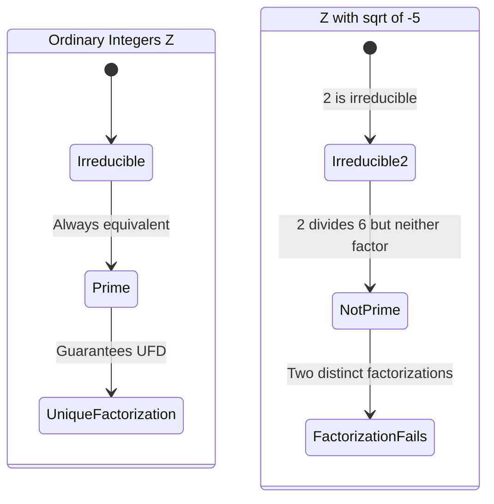
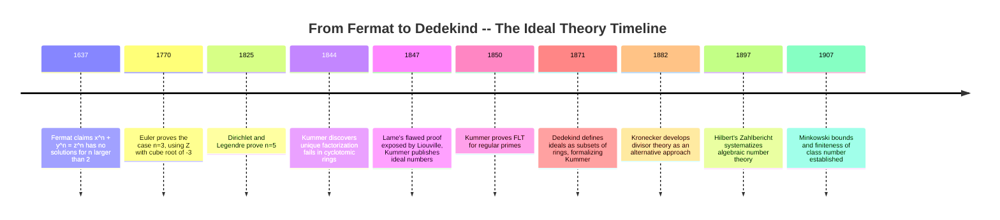
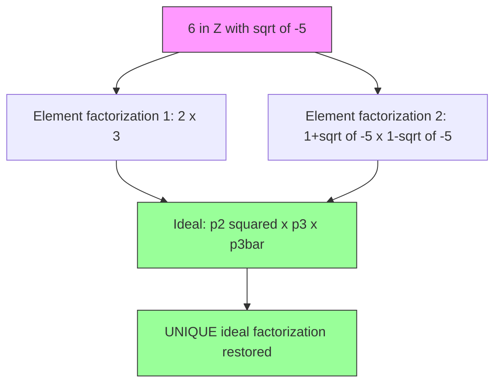
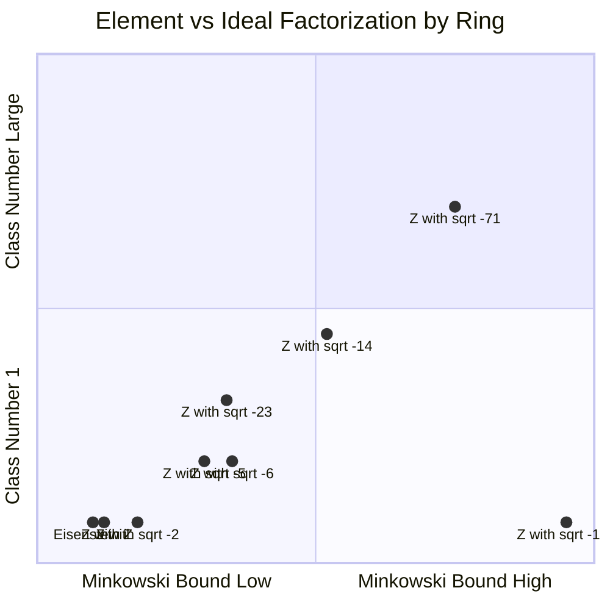

# Algebraic Number Theory: When Unique Factorization Breaks

*This is Part 1 of a three-part series on algebraic number theory. This post lays the foundations: algebraic integers, rings, norms, the failure of unique factorization, and Dedekind's rescue through ideals. Part 2 will use these tools to prove Fermat's Last Theorem for the exponent $n=4$ via infinite descent and Gaussian integers. Part 3 will explain why $e^{\pi\sqrt{163}}$ is almost an integer -- connecting Heegner numbers, class fields, and modular forms.*

---

## The Assumption You Never Questioned

Here is a fact you probably internalized so deeply that it feels like breathing: every positive integer greater than 1 can be written as a product of primes, and that factorization is unique up to the order of the factors.

$60 = 2^2 \times 3 \times 5$.

There is no other way. You cannot factor 60 into a different collection of primes. This is the **Fundamental Theorem of Arithmetic**, and it is so basic that most mathematics curricula introduce it without fanfare -- a fact too obvious to question.

Euclid proved the existence part around 300 BCE. The uniqueness part relies on a subtler property: if a prime $p$ divides a product $ab$, then $p$ divides $a$ or $p$ divides $b$. This is sometimes called **Euclid's lemma**, and its proof requires the Euclidean algorithm -- the ability to perform division with remainder in the integers.

Now here is the shock. Extend your notion of "integer" just slightly -- adjoin $\sqrt{-5}$ to the ordinary integers, forming the ring $\mathbb{Z}[\sqrt{-5}]$ -- and unique factorization **dies**:

$$6 = 2 \times 3 = (1 + \sqrt{-5})(1 - \sqrt{-5})$$

These are two genuinely different factorizations into irreducible elements. Neither 2 nor 3 divides either of the factors on the right. Neither $(1+\sqrt{-5})$ nor $(1-\sqrt{-5})$ divides 2 or 3. The factorization is not unique, and there is no way to refine it into one that is.

This is not a curiosity. This failure nearly derailed attempts to prove Fermat's Last Theorem, and repairing it required inventing an entirely new kind of mathematical object. The story of that repair -- Kummer's "ideal numbers," Dedekind's formalization, and the class number that measures how badly things break -- is the story of algebraic number theory itself.

---

## From Integers to Algebraic Integers

To understand what goes wrong, we need to understand what "integer" means in a more general setting.

### Algebraic Numbers

A complex number $\alpha$ is **algebraic** (over $\mathbb{Q}$) if it satisfies some polynomial equation with rational coefficients:

$$a_n \alpha^n + a_{n-1} \alpha^{n-1} + \cdots + a_1 \alpha + a_0 = 0, \quad a_i \in \mathbb{Q}, \quad a_n \neq 0$$

For example, $\sqrt{2}$ is algebraic because it satisfies $x^2 - 2 = 0$. The golden ratio $\phi = \frac{1+\sqrt{5}}{2}$ is algebraic because it satisfies $x^2 - x - 1 = 0$. Every rational number $\frac{p}{q}$ is algebraic because it satisfies $qx - p = 0$.

Numbers that are not algebraic are called **transcendental**. Proving a number is transcendental is typically very hard -- Lindemann proved $\pi$ is transcendental in 1882, and Hermite proved $e$ is transcendental in 1873.

### Minimal Polynomials

Among all polynomials satisfied by an algebraic number $\alpha$, there is a unique one of smallest degree with leading coefficient 1 (monic) and rational coefficients. This is the **minimal polynomial** of $\alpha$, and its degree is called the **degree** of $\alpha$.

For $\sqrt{2}$, the minimal polynomial is $x^2 - 2$ (degree 2). For $\sqrt[3]{7}$, it is $x^3 - 7$ (degree 3). For $i = \sqrt{-1}$, it is $x^2 + 1$ (degree 2).

The minimal polynomial is always irreducible over $\mathbb{Q}$ -- it cannot be factored into polynomials of lower degree with rational coefficients.

### Algebraic Integers

An algebraic number $\alpha$ is an **algebraic integer** if its minimal polynomial has integer coefficients. Equivalently, $\alpha$ is an algebraic integer if it satisfies some **monic** polynomial with integer coefficients:

$$\alpha^n + c_{n-1}\alpha^{n-1} + \cdots + c_1\alpha + c_0 = 0, \quad c_i \in \mathbb{Z}$$

The key word is **monic**: the leading coefficient must be 1. This is what distinguishes algebraic integers from general algebraic numbers.

| Number | Minimal polynomial | Monic with $\mathbb{Z}$-coefficients? | Algebraic integer? |
|--------|-------------------|--------------------------------------|-------------------|
| $3$ | $x - 3$ | Yes | Yes |
| $\sqrt{2}$ | $x^2 - 2$ | Yes | Yes |
| $\frac{1+\sqrt{5}}{2}$ | $x^2 - x - 1$ | Yes | Yes |
| $i = \sqrt{-1}$ | $x^2 + 1$ | Yes | Yes |
| $\frac{1}{2}$ | $x - \frac{1}{2}$, or $2x - 1$ | No | No |
| $\frac{1+\sqrt{3}}{3}$ | $9x^2 - 6x - 2$ (after clearing) | No | No |

Notice the surprise: $\frac{1+\sqrt{5}}{2}$ is an algebraic integer even though it "looks" like a fraction. The notion of "integer" in the algebraic setting is subtler than divisibility of the numerator and denominator.

**Theorem.** The set of all algebraic integers forms a ring -- it is closed under addition and multiplication. This is not obvious; it requires showing that if $\alpha$ and $\beta$ are roots of monic integer-coefficient polynomials, so are $\alpha + \beta$ and $\alpha \beta$.

---

## Number Fields and Their Rings

### Number Fields

A **number field** $K$ is a finite-degree extension of $\mathbb{Q}$. Concretely, $K = \mathbb{Q}(\alpha)$ for some algebraic number $\alpha$: the smallest field containing $\mathbb{Q}$ and $\alpha$, which consists of all expressions of the form

$$a_0 + a_1\alpha + a_2\alpha^2 + \cdots + a_{n-1}\alpha^{n-1}, \quad a_i \in \mathbb{Q}$$

where $n$ is the degree of $\alpha$'s minimal polynomial. The degree of the number field is $[K:\mathbb{Q}] = n$.

### Quadratic Fields

The simplest non-trivial number fields are **quadratic fields**: $K = \mathbb{Q}(\sqrt{d})$ where $d$ is a squarefree integer (not divisible by any perfect square other than 1). These have degree 2, and every element looks like $a + b\sqrt{d}$ with $a, b \in \mathbb{Q}$.

The ring of integers $\mathcal{O}_K$ of a quadratic field depends on $d$ modulo 4:

$$\mathcal{O}_K = \begin{cases} \mathbb{Z}[\sqrt{d}] = \{a + b\sqrt{d} : a, b \in \mathbb{Z}\} & \text{if } d \equiv 2, 3 \pmod{4} \\ \mathbb{Z}\!\left[\frac{1+\sqrt{d}}{2}\right] = \left\{\frac{a + b\sqrt{d}}{2} : a, b \in \mathbb{Z}, \; a \equiv b \pmod{2}\right\} & \text{if } d \equiv 1 \pmod{4} \end{cases}$$

Why the split? When $d \equiv 1 \pmod{4}$, the element $\frac{1+\sqrt{d}}{2}$ satisfies $x^2 - x + \frac{1-d}{4} = 0$, which is monic with integer coefficients since $d \equiv 1 \pmod 4$ makes $\frac{1-d}{4} \in \mathbb{Z}$. So $\frac{1+\sqrt{d}}{2}$ is an algebraic integer -- the ring of integers is larger than you might naively expect.

```python
# Compute rings of integers for several quadratic fields
def ring_of_integers_basis(d):
    """Return basis description for O_K where K = Q(sqrt(d))."""
    # d must be squarefree
    if d % 4 == 1:
        return f"Z[(1+sqrt({d}))/2]: elements (a + b*sqrt({d}))/2 with a ≡ b (mod 2)"
    else:
        return f"Z[sqrt({d})]: elements a + b*sqrt({d}) with a, b in Z"

# The discriminant of the number field
def discriminant(d):
    """Discriminant of Q(sqrt(d))."""
    if d % 4 == 1:
        return d
    else:
        return 4 * d

examples = [-5, -3, -1, 2, 3, 5, -7, 13]
for d in examples:
    print(f"d = {d:>3}: disc = {discriminant(d):>4},  O_K = {ring_of_integers_basis(d)}")

# Output:
# d =  -5: disc =  -20,  O_K = Z[sqrt(-5)]: elements a + b*sqrt(-5) with a, b in Z
# d =  -3: disc =   -3,  O_K = Z[(1+sqrt(-3))/2]: elements (a + b*sqrt(-3))/2 with a ≡ b (mod 2)
# d =  -1: disc =   -4,  O_K = Z[sqrt(-1)]: elements a + b*sqrt(-1) with a, b in Z
# d =   2: disc =    8,  O_K = Z[sqrt(2)]: elements a + b*sqrt(2) with a, b in Z
# d =   3: disc =   12,  O_K = Z[sqrt(3)]: elements a + b*sqrt(3) with a, b in Z
# d =   5: disc =    5,  O_K = Z[(1+sqrt(5))/2]: elements (a + b*sqrt(5))/2 with a ≡ b (mod 2)
# d =  -7: disc =   -7,  O_K = Z[(1+sqrt(-7))/2]: elements (a + b*sqrt(-7))/2 with a ≡ b (mod 2)
# d =  13: disc =   13,  O_K = Z[(1+sqrt(13))/2]: elements (a + b*sqrt(13))/2 with a ≡ b (mod 2)
```

The **discriminant** $\Delta_K$ is an integer that encodes arithmetic information about the field. For quadratic fields, $\Delta_K = d$ if $d \equiv 1 \pmod{4}$ and $\Delta_K = 4d$ otherwise. The discriminant governs how primes split, ramify, or remain inert in the extension.

---

## The Norm: Measuring Size in New Worlds

In the ordinary integers, the absolute value gives you a notion of "size" that interacts well with multiplication: $|ab| = |a| \cdot |b|$. We need an analogue for algebraic integers.

### The Field Norm

For a number field $K = \mathbb{Q}(\alpha)$ of degree $n$, the **norm** of an element $\beta \in K$ is defined as the product of $\beta$ over all $n$ embeddings of $K$ into $\mathbb{C}$:

$$N_{K/\mathbb{Q}}(\beta) = \prod_{i=1}^{n} \sigma_i(\beta)$$

where $\sigma_1, \ldots, \sigma_n$ are the distinct field embeddings $K \hookrightarrow \mathbb{C}$.

For quadratic fields $\mathbb{Q}(\sqrt{d})$, there are exactly two embeddings: $\sigma_1(\sqrt{d}) = \sqrt{d}$ and $\sigma_2(\sqrt{d}) = -\sqrt{d}$. So the norm of $a + b\sqrt{d}$ is:

$$N(a + b\sqrt{d}) = (a + b\sqrt{d})(a - b\sqrt{d}) = a^2 - db^2$$

### Key Properties

The norm has three properties that make it indispensable:

1. **Multiplicativity**: $N(\alpha\beta) = N(\alpha) \cdot N(\beta)$ for all $\alpha, \beta \in \mathcal{O}_K$
2. **Integrality**: If $\alpha \in \mathcal{O}_K$, then $N(\alpha) \in \mathbb{Z}$
3. **Unit detection**: $\alpha$ is a unit in $\mathcal{O}_K$ (i.e., has a multiplicative inverse in $\mathcal{O}_K$) if and only if $N(\alpha) = \pm 1$

Property 3 is crucial: it gives us a concrete test for whether an element is a unit. In $\mathbb{Z}[\sqrt{-5}]$, the norm of $a + b\sqrt{-5}$ is $a^2 + 5b^2$. This is always positive, and equals 1 only when $a = \pm 1, b = 0$. So the only units are $\pm 1$ -- the same as in $\mathbb{Z}$.

### Using Norms to Detect Irreducibility

Norms let us prove that elements cannot be factored further. An element $\alpha \in \mathcal{O}_K$ is **irreducible** if $\alpha = \beta\gamma$ implies one of $\beta, \gamma$ is a unit.

By multiplicativity, if $\alpha = \beta\gamma$ then $N(\alpha) = N(\beta) \cdot N(\gamma)$. So if $N(\alpha)$ cannot be written as a product of two norm values both different from $\pm 1$, then $\alpha$ is irreducible.

```python
def norm_zsqrt_neg5(a, b):
    """Norm in Z[sqrt(-5)]: N(a + b*sqrt(-5)) = a^2 + 5*b^2."""
    return a**2 + 5 * b**2

# Check which integers arise as norms of elements of Z[sqrt(-5)]
print("Possible norms a^2 + 5b^2 up to 20:")
norm_values = set()
for a in range(-5, 6):
    for b in range(-3, 4):
        n = norm_zsqrt_neg5(a, b)
        if 0 < n <= 20:
            norm_values.add(n)
print(sorted(norm_values))
# Output: [1, 4, 5, 6, 9, 11, 14, 16, 19, 20]

# Key observation: 2 and 3 do NOT appear as norms!
print(f"\nN(2) = {norm_zsqrt_neg5(2, 0)}")   # 4
print(f"N(3) = {norm_zsqrt_neg5(3, 0)}")     # 9
print(f"N(1 + sqrt(-5)) = {norm_zsqrt_neg5(1, 1)}")  # 6
print(f"N(1 - sqrt(-5)) = {norm_zsqrt_neg5(1, -1)}") # 6

# Is 2 irreducible? If 2 = alpha * beta, then N(alpha)*N(beta) = 4.
# Possible splits: 1*4, 2*2, 4*1. But 2 is NOT a norm value!
# So the only factorization has one factor with norm 1 (a unit).
# Therefore 2 is irreducible in Z[sqrt(-5)].
print("\n2 is not a norm => 2 is irreducible in Z[sqrt(-5)]")
print("3 is not a norm => 3 is irreducible in Z[sqrt(-5)]")
print("6 = N(1+sqrt(-5)) = N(1-sqrt(-5)) and 6 is not 'prime-splittable'")
print("=> (1+sqrt(-5)) and (1-sqrt(-5)) are also irreducible")
```

The gap in the norm values is the fingerprint of failure. The integer 2 is not a norm in $\mathbb{Z}[\sqrt{-5}]$, so any factorization $2 = \beta\gamma$ forces one factor to have norm 1 -- a unit. Therefore 2 is irreducible. The same argument works for 3. And $(1+\sqrt{-5})$ has norm 6, which can only split as $1 \times 6$, $2 \times 3$, $3 \times 2$, or $6 \times 1$ -- but 2 and 3 are not norms, so $(1+\sqrt{-5})$ is irreducible too.

---

## When Factorization Fails

Now we can state the failure precisely.

### The Classic Example

In $\mathbb{Z}[\sqrt{-5}]$, consider the factorizations of 6:

$$6 = 2 \times 3 = (1 + \sqrt{-5})(1 - \sqrt{-5})$$

We proved above that 2, 3, $(1+\sqrt{-5})$, and $(1-\sqrt{-5})$ are all irreducible. Are these factorizations genuinely different? Yes -- they are not related by units. The only units in $\mathbb{Z}[\sqrt{-5}]$ are $\pm 1$, so the only associates of 2 are $\pm 2$, neither of which equals $\pm(1 \pm \sqrt{-5})$.

We have two **distinct** factorizations of 6 into irreducible elements. Unique factorization fails in $\mathbb{Z}[\sqrt{-5}]$.

### What Exactly Goes Wrong?

The deeper issue is that **irreducible does not imply prime** in $\mathbb{Z}[\sqrt{-5}]$.

In $\mathbb{Z}$, these are equivalent: if $p$ is irreducible (cannot be factored non-trivially) and $p \mid ab$, then $p \mid a$ or $p \mid b$. This equivalence is what makes unique factorization work.

But in $\mathbb{Z}[\sqrt{-5}]$, the element 2 divides $6 = (1+\sqrt{-5})(1-\sqrt{-5})$, yet 2 divides neither factor:
- If $2 \mid (1+\sqrt{-5})$, there exists $a + b\sqrt{-5}$ with $2(a + b\sqrt{-5}) = 1 + \sqrt{-5}$, so $2a = 1$ -- impossible for integer $a$.

So 2 is irreducible but **not prime**. This gap between irreducibility and primality is exactly where unique factorization breaks.

**Theorem (Fundamental).** In an integral domain, unique factorization holds if and only if every irreducible element is prime.

The proof of uniqueness in $\mathbb{Z}$ fundamentally uses the Euclidean algorithm to establish that irreducibles are prime (Euclid's lemma). Rings like $\mathbb{Z}[\sqrt{-5}]$ lack a Euclidean algorithm, and the implication fails.



### A Landscape of Failure and Success

Not all rings of integers fail. Here is the picture for imaginary quadratic fields $\mathbb{Q}(\sqrt{d})$ with $d < 0$:

| $d$ | Ring $\mathcal{O}_K$ | Unique factorization? | Class number $h$ |
|-----|----------------------|----------------------|-------------------|
| $-1$ | $\mathbb{Z}[i]$ (Gaussian integers) | Yes | 1 |
| $-2$ | $\mathbb{Z}[\sqrt{-2}]$ | Yes | 1 |
| $-3$ | $\mathbb{Z}\!\left[\frac{1+\sqrt{-3}}{2}\right]$ (Eisenstein integers) | Yes | 1 |
| $-5$ | $\mathbb{Z}[\sqrt{-5}]$ | **No** | 2 |
| $-7$ | $\mathbb{Z}\!\left[\frac{1+\sqrt{-7}}{2}\right]$ | Yes | 1 |
| $-11$ | $\mathbb{Z}\!\left[\frac{1+\sqrt{-11}}{2}\right]$ | Yes | 1 |
| $-13$ | $\mathbb{Z}\!\left[\frac{1+\sqrt{-13}}{2}\right]$ | **No** | 2 |
| $-14$ | $\mathbb{Z}[\sqrt{-14}]$ | **No** | 4 |
| $-19$ | $\mathbb{Z}\!\left[\frac{1+\sqrt{-19}}{2}\right]$ | Yes | 1 |
| $-23$ | $\mathbb{Z}\!\left[\frac{1+\sqrt{-23}}{2}\right]$ | **No** | 3 |
| $-43$ | $\mathbb{Z}\!\left[\frac{1+\sqrt{-43}}{2}\right]$ | Yes | 1 |
| $-67$ | $\mathbb{Z}\!\left[\frac{1+\sqrt{-67}}{2}\right]$ | Yes | 1 |
| $-163$ | $\mathbb{Z}\!\left[\frac{1+\sqrt{-163}}{2}\right]$ | Yes | 1 |

A remarkable theorem, proved by Heegner (1952), Baker (1966), and Stark (1967): the values $d = -1, -2, -3, -7, -11, -19, -43, -67, -163$ are the **only** negative squarefree integers for which the ring of integers of $\mathbb{Q}(\sqrt{d})$ has unique factorization. There are exactly nine such fields. The largest, $d = -163$, will play a starring role in Part 3 of this series, where it explains why $e^{\pi\sqrt{163}} \approx 262537412640768744$ is so absurdly close to an integer.

---

## Kummer's Dream, Dedekind's Fix

The failure of unique factorization is not a modern curiosity -- it nearly derailed one of the most famous problems in mathematics.

### Kummer and Fermat's Last Theorem

In the 1840s, Ernst Eduard Kummer was working on Fermat's Last Theorem: the claim that $x^n + y^n = z^n$ has no positive integer solutions for $n > 2$. A natural approach factors the left side over a larger ring. For an odd prime $p$, let $\zeta = e^{2\pi i/p}$ be a primitive $p$-th root of unity. Then:

$$x^p + y^p = (x + y)(x + \zeta y)(x + \zeta^2 y) \cdots (x + \zeta^{p-1} y) = z^p$$

If the ring $\mathbb{Z}[\zeta]$ had unique factorization, one could argue that each factor on the left must itself be (essentially) a $p$-th power, leading to a descent argument and a contradiction. Gabriel Lame announced exactly this proof to the Paris Academy in 1847.

Joseph Liouville immediately objected: how do you know $\mathbb{Z}[\zeta]$ has unique factorization? Kummer, who had already been studying this question for years, wrote to say that it does not -- not for all primes $p$. He had discovered the failure independently in 1844, and he knew that $\mathbb{Z}[\zeta_{23}]$ was the first cyclotomic ring to fail.

But Kummer did not give up. Instead, he invented **ideal numbers** -- phantom elements that, when adjoined to the ring, restored unique factorization. He could not point to these ideal numbers as concrete elements of the ring. They were ghosts that made the arithmetic work. Kummer proved Fermat's Last Theorem for all **regular primes** -- primes $p$ for which the class number of $\mathbb{Q}(\zeta_p)$ is not divisible by $p$ -- which includes all primes up to 100 except 37, 59, and 67.



### Dedekind's Formalization

Kummer's ideal numbers worked, but they were ad hoc -- defined differently for each cyclotomic ring, and hard to extend to general number fields. In 1871, Richard Dedekind accomplished something remarkable: he replaced Kummer's phantom numbers with a purely set-theoretic concept.

Instead of factoring **elements**, Dedekind proposed factoring **ideals** -- certain subsets of the ring. An ideal $I$ of a ring $R$ is a subset that is closed under addition and under multiplication by any ring element:

1. If $a, b \in I$, then $a + b \in I$
2. If $a \in I$ and $r \in R$, then $ra \in I$

Every element $\alpha \in R$ generates a **principal ideal** $(\alpha) = \{\alpha r : r \in R\}$. In a ring with unique factorization, every ideal is principal. The converse is the key insight: when unique factorization of elements fails, it is precisely because there exist non-principal ideals.

---

## Ideals and Unique Factorization of Ideals

### Prime Ideals

An ideal $\mathfrak{p}$ is **prime** if $\mathfrak{p} \neq R$ and whenever $ab \in \mathfrak{p}$, either $a \in \mathfrak{p}$ or $b \in \mathfrak{p}$. This directly generalizes the definition of a prime number.

### Ideal Multiplication

For two ideals $I$ and $J$, their product $IJ$ is the ideal generated by all products $ab$ where $a \in I, b \in J$:

$$IJ = \left\{ \sum_{k=1}^{n} a_k b_k : a_k \in I, b_k \in J, n \geq 1 \right\}$$

This multiplication is commutative and associative, with $R$ itself as the identity.

### The Rescue: Dedekind Domains

**Theorem (Dedekind, 1871).** In the ring of integers $\mathcal{O}_K$ of any number field $K$, every nonzero proper ideal factors uniquely as a product of prime ideals:

$$I = \mathfrak{p}_1^{e_1} \mathfrak{p}_2^{e_2} \cdots \mathfrak{p}_r^{e_r}$$

and this factorization is unique up to the order of the factors.

This is the rescue. Unique factorization of **elements** may fail, but unique factorization of **ideals** always holds in rings of integers of number fields. Such rings are called **Dedekind domains**.

### The Example Revisited

Let us see how this works for $6$ in $\mathbb{Z}[\sqrt{-5}]$. The element 6 generates the principal ideal $(6)$. We need to factor this into prime ideals.

Define the following ideals:

$$\mathfrak{p}_2 = (2, 1+\sqrt{-5}), \quad \mathfrak{p}_3 = (3, 1+\sqrt{-5}), \quad \overline{\mathfrak{p}}_3 = (3, 1-\sqrt{-5})$$

where $(a, b)$ denotes the ideal generated by $a$ and $b$: all elements of the form $ra + sb$ with $r, s \in \mathbb{Z}[\sqrt{-5}]$.

One can verify (by direct computation of the ideal products) that:

$$\mathfrak{p}_2^2 = (2), \quad \mathfrak{p}_2 \cdot \mathfrak{p}_3 = (1+\sqrt{-5}), \quad \mathfrak{p}_2 \cdot \overline{\mathfrak{p}}_3 = (1-\sqrt{-5}), \quad \mathfrak{p}_3 \cdot \overline{\mathfrak{p}}_3 = (3)$$

Now the two "different" factorizations of 6 become the **same** factorization of the ideal $(6)$:

$$(6) = (2)(3) = \mathfrak{p}_2^2 \cdot \mathfrak{p}_3 \cdot \overline{\mathfrak{p}}_3$$

$$(6) = (1+\sqrt{-5})(1-\sqrt{-5}) = (\mathfrak{p}_2 \cdot \mathfrak{p}_3)(\mathfrak{p}_2 \cdot \overline{\mathfrak{p}}_3) = \mathfrak{p}_2^2 \cdot \mathfrak{p}_3 \cdot \overline{\mathfrak{p}}_3$$

The ambiguity in element factorization vanishes completely at the level of ideals. The element 2 is irreducible but not prime; the ideal $\mathfrak{p}_2$ is a genuine prime ideal. Dedekind's ideals are the "correct" atoms of arithmetic.

```python
# Verifying ideal arithmetic in Z[sqrt(-5)]
# We represent elements as (a, b) meaning a + b*sqrt(-5)

def mul(x, y):
    """Multiply two elements of Z[sqrt(-5)]."""
    a, b = x
    c, d = y
    return (a*c - 5*b*d, a*d + b*c)

def norm(x):
    """Norm of a + b*sqrt(-5)."""
    a, b = x
    return a**2 + 5*b**2

# The two factorizations of 6
print("Factorization 1: 2 * 3 =", mul((2,0), (3,0)))         # (6, 0)
print("Factorization 2: (1+sqrt(-5)) * (1-sqrt(-5)) =",
      mul((1,1), (1,-1)))                                      # (6, 0)

# Both give (6, 0), confirming 6 = 6.

# Verify norms
print(f"\nN(2) = {norm((2,0))}")         # 4
print(f"N(3) = {norm((3,0))}")           # 9
print(f"N(1+sqrt(-5)) = {norm((1,1))}")  # 6
print(f"N(1-sqrt(-5)) = {norm((1,-1))}") # 6
print(f"N(6) = {norm((6,0))}")           # 36 = 4*9 = 6*6 (both ways)

# Check that 2 does not divide (1+sqrt(-5))
# If (1+sqrt(-5)) = 2*(a+b*sqrt(-5)), then 1 = 2a, impossible for integer a
print("\n2 does not divide (1+sqrt(-5)): 1 = 2a has no integer solution")
print("=> 2 is irreducible but NOT prime in Z[sqrt(-5)]")
```



---

## The Class Number: Measuring the Failure

Dedekind's theorem says ideals always factor uniquely. But how far are we from unique factorization of **elements**? The answer is a single number.

### The Ideal Class Group

Two ideals $I$ and $J$ are in the same **ideal class** if there exist nonzero elements $\alpha, \beta \in \mathcal{O}_K$ such that $(\alpha)I = (\beta)J$. Equivalently, $I$ and $J$ are equivalent if the "fractional ideal" $IJ^{-1}$ is principal.

The set of ideal classes forms a group under multiplication, called the **ideal class group** $\text{Cl}(K)$.

The **class number** $h_K = |\text{Cl}(K)|$ is the size of this group. It is always finite -- a deep theorem that uses Minkowski's geometry of numbers.

### The Fundamental Dichotomy

**Theorem.** The ring of integers $\mathcal{O}_K$ is a unique factorization domain if and only if $h_K = 1$ -- that is, if and only if every ideal is principal.

When $h_K = 1$, every ideal is generated by a single element, so ideal factorization and element factorization coincide. When $h_K > 1$, there exist non-principal ideals, and the gap between ideal and element factorization is measured precisely by $h_K$.

For $\mathbb{Z}[\sqrt{-5}]$, the class number is $h = 2$. The class group is $\mathbb{Z}/2\mathbb{Z}$, with two classes: the principal ideals, and the class containing $\mathfrak{p}_2 = (2, 1+\sqrt{-5})$. Since $\mathfrak{p}_2^2 = (2)$ is principal, squaring any ideal in the non-trivial class gives a principal ideal.

### Computing the Class Number

The Minkowski bound gives an upper limit on the norms of ideals one must check. For a number field $K$ of degree $n$ with discriminant $\Delta_K$, every ideal class contains an ideal of norm at most:

$$M_K = \frac{n!}{n^n}\left(\frac{4}{\pi}\right)^{r_2} \sqrt{|\Delta_K|}$$

where $r_2$ is the number of pairs of complex embeddings.

For $\mathbb{Q}(\sqrt{-5})$: $n = 2$, $r_2 = 1$, $\Delta_K = -20$, so:

$$M_K = \frac{2!}{4} \cdot \frac{4}{\pi} \cdot \sqrt{20} = \frac{1}{2} \cdot \frac{4}{\pi} \cdot 2\sqrt{5} \approx 2.85$$

So we only need to check ideals of norm 1 and 2. The ideal $\mathfrak{p}_2 = (2, 1+\sqrt{-5})$ has norm 2 and is not principal (since no element of $\mathbb{Z}[\sqrt{-5}]$ has norm 2). Therefore $h = 2$.

```python
import math

def minkowski_bound(n, r2, disc):
    """Compute the Minkowski bound for a number field.
    n: degree, r2: number of complex embedding pairs, disc: discriminant."""
    return (math.factorial(n) / n**n) * (4 / math.pi)**r2 * math.sqrt(abs(disc))

# Imaginary quadratic fields: n=2, r2=1
examples = [
    (-1, -4, "Q(sqrt(-1)): Gaussian integers"),
    (-2, -8, "Q(sqrt(-2))"),
    (-3, -3, "Q(sqrt(-3)): Eisenstein integers"),
    (-5, -20, "Q(sqrt(-5))"),
    (-6, -24, "Q(sqrt(-6))"),
    (-14, -56, "Q(sqrt(-14))"),
    (-23, -23, "Q(sqrt(-23))"),
]

print(f"{'Field':<40} {'Mink. bound':>12} {'Norms to check':>15}")
print("-" * 70)
for d, disc, name in examples:
    M = minkowski_bound(2, 1, disc)
    check_up_to = int(M)
    print(f"{name:<40} {M:>12.3f} {check_up_to:>15}")

# Output:
# Field                                    Mink. bound   Norms to check
# ----------------------------------------------------------------------
# Q(sqrt(-1)): Gaussian integers                 1.273               1
# Q(sqrt(-2))                                    1.801               1
# Q(sqrt(-3)): Eisenstein integers                1.103               1
# Q(sqrt(-5))                                    2.847               2
# Q(sqrt(-6))                                    3.120               3
# Q(sqrt(-14))                                   4.764               4
# Q(sqrt(-23))                                   3.054               3
```

When the Minkowski bound is less than 2, there are no non-trivial ideals to check, and the class number is automatically 1. This immediately proves that $\mathbb{Z}[i]$, $\mathbb{Z}[\sqrt{-2}]$, and $\mathbb{Z}[\frac{1+\sqrt{-3}}{2}]$ have unique factorization.



The outlier at the bottom right is $\mathbb{Z}[\frac{1+\sqrt{-163}}{2}]$: large discriminant, large Minkowski bound, and yet class number 1. It is the last of the nine imaginary quadratic fields with unique factorization, and its peculiar properties connect to modular forms, elliptic curves, and the near-integer $e^{\pi\sqrt{163}}$ that we will explore in Part 3.

---

## Why It Matters: From Fermat to Cryptography

### The Fermat Connection

Kummer's work on ideal numbers directly led to the proof of Fermat's Last Theorem for all regular primes -- an enormous advance in the 1850s. When Andrew Wiles finally proved the full theorem in 1995, his proof used the modern descendant of Kummer's ideas: the theory of Galois representations over number fields, where the arithmetic of ideals and class groups plays a central role.

In Part 2 of this series, we will prove the $n = 4$ case of FLT using a more elementary approach -- infinite descent in the Gaussian integers $\mathbb{Z}[i]$ -- demonstrating how the unique factorization of this particular ring (class number 1) makes the argument possible.

### RSA and Integer Factorization

Modern public-key cryptography rests on the difficulty of factoring integers -- a problem whose structure is illuminated by algebraic number theory. The RSA cryptosystem works because factoring $n = pq$ (a product of two large primes) is computationally hard, while multiplying $p \times q$ is easy. The number field sieve, the fastest known classical algorithm for integer factorization, works by constructing a number field $K = \mathbb{Q}(\alpha)$ and searching for elements whose norms factor smoothly. The algebraic side of the sieve directly uses the theory of norms and ideal factorization that Dedekind developed.

### Post-Quantum Cryptography and Lattices

The connection runs deeper into the future. Lattice-based cryptography -- a leading candidate for post-quantum security, standardized by NIST in 2024 -- uses **ideal lattices** constructed from rings of integers of number fields. The Ring-LWE (Learning With Errors) problem, which underlies schemes like CRYSTALS-Kyber, is defined over the ring of integers of cyclotomic number fields -- exactly the rings Kummer studied in the 1840s.

The hardness assumptions in these cryptographic schemes are intimately related to the algebraic structure of these rings: their ideals, their geometry as lattices, and the computational difficulty of finding short vectors in them. Algebraic number theory, born from a 19th-century attempt to factor integers in exotic rings, now protects the communication channels of the 21st century.

### The Broader Landscape

The ideas introduced in this post -- rings of integers, norms, ideals, class groups -- form the foundation of modern arithmetic geometry. The Langlands program, one of the deepest research programs in contemporary mathematics, seeks to connect the arithmetic of number fields (via Galois representations and L-functions) to automorphic forms. The class number formula, relating the class number to special values of L-functions, was one of the earliest instances of this connection, and its generalizations remain at the frontier of mathematical research.

---

## Going Deeper

**Books:**
- Marcus, D. A. (2018). *Number Fields.* Springer Universitext (2nd edition).
  - The standard introduction to algebraic number theory at the advanced undergraduate level. Self-contained, with exercises that build the theory from scratch. The treatment of unique factorization of ideals and the class group is particularly clear.
- Stewart, I. & Tall, D. (2015). *Algebraic Number Theory and Fermat's Last Theorem.* CRC Press (4th edition).
  - Traces the historical path from Fermat through Kummer to Wiles. Excellent for understanding the motivations behind the theory. Accessible to readers with modest abstract algebra background.
- Neukirch, J. (1999). *Algebraic Number Theory.* Springer Grundlehren der mathematischen Wissenschaften, Vol. 322.
  - The definitive graduate reference. Treats algebraic number theory from the modern perspective of Dedekind domains, valuations, and local-global principles. Dense but rewarding.
- Samuel, P. (1970). *Algebraic Theory of Numbers.* Dover.
  - A concise, elegant introduction. Proves unique factorization of ideals in Dedekind domains in under 100 pages. The Dover edition makes it one of the most affordable introductions to the subject.

**Online Resources:**
- [Keith Conrad's Expository Papers](https://kconrad.math.uconn.edu/blurbs/) -- A treasure trove of clearly written notes on every topic in this post: norms, quadratic fields, ideal factorization, class groups, and more. Start with "Factoring in Quadratic Fields."
- [J.S. Milne's Algebraic Number Theory Course Notes](https://www.jmilne.org/math/CourseNotes/ANT.pdf) -- Complete lecture notes freely available. Covers everything from basic number fields through class field theory.
- [Stanford Crypto Notes: Unique Factorization of Ideals](https://crypto.stanford.edu/pbc/notes/numberfield/unique.html) -- A compact treatment focused on the unique factorization theorem for ideals, with connections to cryptography.
- [Brilliant Wiki: Algebraic Number Theory](https://brilliant.org/wiki/algebraic-number-theory/) -- An interactive introduction with worked examples, good for building initial intuition before diving into full textbooks.

**Videos:**
- [Introduction to Number Theory (Berkeley Math 115)](https://www.youtube.com/playlist?list=PL8yHsr3EFj53L8sMbzIhhXSAOpuZ1Fov8) by Richard Borcherds -- A complete lecture series from a Fields Medalist covering number theory foundations including algebraic integers, quadratic fields, and unique factorization.
- [Algebraic Number Theory](https://www.michael-penn.net/courses) by Michael Penn -- Clear, proof-driven lectures walking through rings of integers, norms, ideals, and class groups with worked examples at each step.

**Academic Papers:**
- Kummer, E. E. (1847). "Zur Theorie der complexen Zahlen." *Journal fur die reine und angewandte Mathematik*, 35, 319-326.
  - The paper that introduced ideal numbers to rescue unique factorization in cyclotomic fields. A foundational document in algebraic number theory.
- Dedekind, R. (1871). "Supplement X" to Dirichlet's *Vorlesungen uber Zahlentheorie* (2nd edition).
  - Where Dedekind first defined ideals as subsets of rings, replacing Kummer's ad hoc ideal numbers with the elegant set-theoretic framework still used today.
- Lenstra, H. W. (1992). ["Algorithms in Algebraic Number Theory."](https://www.ams.org/journals/bull/1992-26-02/S0273-0979-1992-00284-7/) *Bulletin of the American Mathematical Society*, 26(2), 211-244.
  - A survey of computational aspects: computing rings of integers, factoring ideals, determining class groups. Bridges the theoretical and algorithmic perspectives.

**Questions to Explore:**
- If there are exactly nine imaginary quadratic fields with class number 1, how many real quadratic fields have class number 1? (This is an open problem -- it is conjectured that infinitely many do, but this is unproven.)
- The class number formula connects $h_K$ to special values of $L$-functions. What does the *analytic* class number formula tell us that the algebraic definition cannot?
- Unique factorization fails in $\mathbb{Z}[\sqrt{-5}]$ but holds in $\mathbb{Z}[i]$. Both are rings of algebraic integers. What *geometric* property of the lattice $\mathbb{Z}[i] \subset \mathbb{C}$ makes it a Euclidean domain while $\mathbb{Z}[\sqrt{-5}]$ is not?
- Kummer needed unique factorization for Fermat's Last Theorem. If every cyclotomic ring had been a UFD, would the theorem have been proved a century earlier?
- Post-quantum cryptography relies on the hardness of lattice problems in rings of integers. Could a breakthrough in computing class groups break these cryptosystems?
