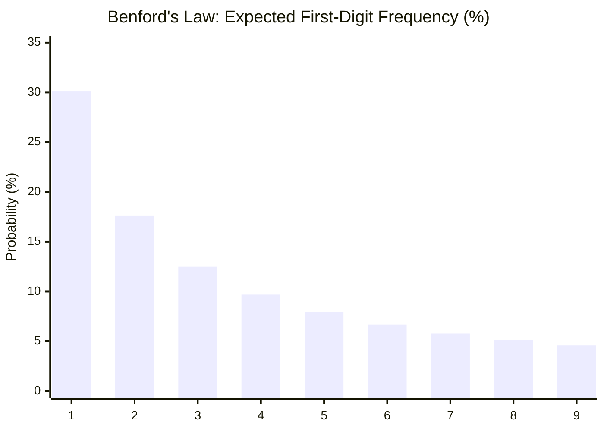

# Benford's Law: The Strange Dominance of the Number One

## A Suspicious Pattern in Dusty Books

In 1881, the astronomer Simon Newcomb noticed something peculiar about the logarithm tables in his university's library. These were physical reference books—massive volumes that scientists used daily to look up the logarithms of numbers before electronic calculators existed.

The first pages of these books—the ones containing logarithms of numbers starting with 1—were visibly dirtier and more worn than the rest. The pages for numbers starting with 8 and 9 were practically pristine.

This meant that scientists, across disciplines, were looking up numbers starting with 1 *far more often* than numbers starting with higher digits. Newcomb, being a mathematician, didn't dismiss this as a library curiosity. He wrote a short paper proposing a formula: the probability of a number having first digit $d$ was:

$$P(d) = \log_{10}\left(1 + \frac{1}{d}\right)$$

No one paid attention.

Fifty-seven years later, in 1938, the physicist Frank Benford rediscovered the same pattern. But Benford did what Newcomb did not: he tested it obsessively. He gathered 20,229 observations from 20 different datasets—areas of rivers, populations of U.S. cities, molecular weights, numbers from *Reader's Digest* articles, street addresses, death rates, baseball statistics, even the specific heat of chemical compounds.

Across all of them, the pattern held:

| First Digit | Expected (Uniform) | Observed (Benford) |
|:-----------:|:-------------------:|:-------------------:|
| 1 | 11.1% | **30.1%** |
| 2 | 11.1% | 17.6% |
| 3 | 11.1% | 12.5% |
| 4 | 11.1% | 9.7% |
| 5 | 11.1% | 7.9% |
| 6 | 11.1% | 6.7% |
| 7 | 11.1% | 5.8% |
| 8 | 11.1% | 5.1% |
| 9 | 11.1% | **4.6%** |

The number 1 appeared as the first digit **30% of the time**—nearly one in three. The number 9 appeared less than 5% of the time. The distribution wasn't even close to uniform. It was steeply logarithmic.

Benford's name stuck. The law of anomalous numbers became **Benford's Law**.

## The Intuition: Why Counting is Logarithmic

### The Growth Argument

The most natural way to build an intuition for Benford's Law is to think about how quantities grow.

Imagine tracking the population of a city that starts at 100,000. It grows at some rate—say, 5% per year. Watch the leading digit as the population increases:

- At 100,000, the first digit is **1**
- It stays at 1 through 100,000 → 199,999 (a span of 100,000)
- At 200,000, the first digit becomes **2** (stays through 200,000 → 299,999, a span of 100,000)
- ...
- At 900,000, the first digit becomes **9** (stays through 900,000 → 999,999, a span of 100,000)

So far, each digit has an equal "span" of 100,000. No Benford's Law yet.

But now, what happens with proportional growth (percentage growth, compound interest)? The city doesn't add a flat 100,000 people per year. It grows by a *percentage*. To go from 100,000 to 200,000 (first digit 1 → 2), the population must *double*. But to go from 900,000 to 1,000,000 (first digit 9 → back to 1), the population only needs to increase by ~11%.

The time spent with first digit 1 is **much longer** than the time spent with first digit 9, because getting from $1 \times 10^k$ to $2 \times 10^k$ requires doubling, while getting from $9 \times 10^k$ to $10 \times 10^k$ requires only a ~11% increase.

In logarithmic terms:
- The interval from 1 to 2 on a log scale has width $\log_{10}(2) - \log_{10}(1) = 0.301$
- The interval from 9 to 10 has width $\log_{10}(10) - \log_{10}(9) = 0.046$

The ratio is about 6.5 to 1. The leading digit 1 occupies **30.1%** of the logarithmic scale; the digit 9 occupies **4.6%**.

This is Benford's formula: $P(d) = \log_{10}(1 + 1/d)$.

### The Scale Invariance Argument

There is an even more elegant way to see why this law must be true. It is an argument from **scale invariance**.

Imagine you measure the lengths of all the rivers in the world in kilometers and compute the distribution of first digits. Now convert everything to miles (multiply by 0.621). If the first-digit distribution were uniform, this multiplication would scramble it. But if the distribution follows Benford's Law, it is preserved under multiplication by any constant.

In fact, Benford's distribution is the **only** first-digit distribution that is invariant under changes of measurement scale. If a law about first digits is to be universal—applying whether you measure in meters, feet, light-years, or parsecs—it *must* be Benford's distribution.

This was proven rigorously by Theodore Hill in 1995. He showed that if you pick "random" distributions and sample from them, the aggregate distribution of first digits converges to Benford's Law. It is an attractor—a mathematical inevitability for data that spans multiple orders of magnitude.

## The Formal Mathematics

### The Logarithmic Distribution

Let $D_1$ be the random variable representing the first significant digit of a number drawn from a Benford-distributed dataset. Then:

$$P(D_1 = d) = \log_{10}\left(1 + \frac{1}{d}\right), \quad d \in \{1, 2, \ldots, 9\}$$

The resulting distribution is heavily skewed toward small digits:



This generalizes to the first *two* digits. The probability that the first two digits are $d_1 d_2$ (e.g., 31) is:

$$P(D_1 D_2 = d) = \log_{10}\left(1 + \frac{1}{d}\right), \quad d \in \{10, 11, \ldots, 99\}$$

For example, the probability that a number starts with "31" is $\log_{10}(1 + 1/31) \approx 0.0139$, or about 1.4%.

### Which Datasets Obey Benford's Law?

Not all datasets follow Benford's Law. Datasets that do typically share these characteristics:

1. **They span multiple orders of magnitude.** City populations range from hundreds to tens of millions. River lengths range from kilometers to thousands of kilometers. If your data only lives within a single order of magnitude (e.g., human heights in centimeters, from ~50 to ~250), Benford's Law won't apply.

2. **They arise from multiplicative processes.** Stock prices, compound interest, population growth, radioactive decay—any process where the rate of change is proportional to the current value generates Benford-distributed data.

3. **They are not artificially constrained.** Phone numbers, Social Security numbers, and lottery draws are assigned by design, not by nature. They do not follow Benford's Law.

4. **They emerge from combining many different sources.** A country's financial records combine millions of transactions of vastly different sizes. This mixing across scales naturally produces Benford-distributed first digits—Hill's theorem in action.

## Benford's Law as a Forensic Weapon

### Catching Fraud with First Digits

Here is where Benford's Law becomes genuinely powerful in practice. If naturally occurring financial data follows Benford's distribution, then **fabricated data often does not**.

When a human invents numbers—fake invoices, fraudulent expense reports, manipulated earnings—they tend to distribute digits uniformly. Our intuition says "random numbers should have all digits equally likely." We unconsciously avoid starting too many numbers with 1 (feels repetitive) and sprinkle in numbers starting with 5, 6, 7 more than nature would.

This discrepancy is detectable.

In the 1990s, Mark Nigrini, an accounting researcher, pioneered the use of Benford's Law in forensic accounting. His work showed that the first-digit distribution of financial data is one of the most reliable signals for detecting manipulation. Today, Benford analysis is:

- **Used by the IRS** and tax authorities worldwide as a first-pass filter on tax returns
- **Standard practice in forensic accounting** and fraud investigations
- **Built into audit software** (like IDEA and ACL) as an automated detection tool
- **Applied to election forensics** to flag suspicious vote counts (though with significant caveats about its reliability in that context)
- **Used in scientific fraud detection** to identify fabricated data in research papers

### The Chi-Squared Test: Quantifying Deviation

To formally test whether a dataset follows Benford's Law, we use Pearson's chi-squared goodness-of-fit test.

Given observed counts $O_d$ for each first digit $d$ and expected counts $E_d = N \cdot P(d)$ where $N$ is the total number of observations:

$$\chi^2 = \sum_{d=1}^{9} \frac{(O_d - E_d)^2}{E_d}$$

Under the null hypothesis that the data follows Benford's Law, this statistic follows a chi-squared distribution with 8 degrees of freedom. A large $\chi^2$ value (small p-value) indicates the data deviates significantly from Benford's distribution—a red flag for potential manipulation.

## Seeing It in Code

### Verifying Benford's Law on Real Data

```python
import numpy as np
from collections import Counter

def first_digit(n):
    """Extract the first significant digit of a number."""
    s = f"{abs(n):.10e}"
    return int(s[0])

def benford_expected(d):
    """Benford's Law: P(first digit = d)."""
    return np.log10(1 + 1 / d)

def benford_analysis(data, label="Dataset"):
    """
    Perform Benford's Law analysis on a dataset.
    Returns observed vs expected frequencies and chi-squared statistic.
    """
    digits = [first_digit(x) for x in data if x != 0]
    N = len(digits)
    counts = Counter(digits)
    
    print(f"\n{'='*60}")
    print(f"Benford Analysis: {label} (N={N:,})")
    print(f"{'='*60}")
    print(f"{'Digit':>6} {'Observed':>10} {'Expected':>10} {'Deviation':>10}")
    print(f"{'-'*46}")
    
    chi_squared = 0.0
    for d in range(1, 10):
        observed = counts.get(d, 0) / N
        expected = benford_expected(d)
        deviation = observed - expected
        chi_squared += N * (observed - expected) ** 2 / expected
        print(f"{d:>6} {observed:>10.3f} {expected:>10.3f} {deviation:>+10.3f}")
    
    print(f"\nChi-squared statistic: {chi_squared:.2f}")
    print(f"Critical value (α=0.05, df=8): 15.51")
    print(f"Verdict: {'CONSISTENT' if chi_squared < 15.51 else 'DEVIATES'} with Benford's Law")
    
    return chi_squared


# Multiplicative process: compound growth
np.random.seed(42)
prices = [100.0]
for _ in range(50_000):
    daily_return = np.random.normal(0.0002, 0.015)
    prices.append(prices[-1] * (1 + daily_return))

benford_analysis(prices, "Simulated Stock Prices")


# Exponential growth across orders of magnitude
populations = 10 ** np.random.uniform(2, 8, size=10_000)
benford_analysis(populations, "Simulated Populations")


# Fabricated data: uniformly distributed (what a fraudster might produce)
fake_invoices = np.random.uniform(1000, 9999, size=10_000)
benford_analysis(fake_invoices, "Fake Invoices (Uniform)")
```

The output reveals the pattern immediately. The stock prices and populations follow Benford's Law almost perfectly ($\chi^2$ well below the critical value). The fake invoices deviate massively—the first digit distribution is nearly flat, screaming "these numbers were invented."

### Visualizing the Gap

The distance between Benford's prediction and the observed distribution of fabricated data is visually striking. A bar chart comparing the two distributions would show the natural logarithmic decay of Benford's Law against the suspicious flatness of made-up numbers. This visual gap is what forensic accountants look for.

## Benford's Law in the Wild

### Financial Data and Corporate Fraud

In 2001, Enron's financial statements were analyzed using Benford's Law. The revenue figures showed significant deviations from the expected distribution—deviations that, in hindsight, were consistent with the massive accounting fraud that would be uncovered shortly after. While Benford analysis alone cannot prove fraud (there are legitimate reasons for deviation), it is a powerful first-pass filter that directs auditors' attention to the right places.

### Election Forensics

After contested elections, analysts sometimes apply Benford's Law to precinct-level vote counts. If the first-digit distribution of vote tallies in certain regions deviates significantly from Benford's prediction while neighboring regions conform, it raises questions worth investigating.

However, election data is nuanced. Small precincts with similar sizes can violate Benford's Law for perfectly legitimate reasons (the data doesn't span enough orders of magnitude). The second-digit test is often more appropriate for election data. Benford analysis is a flag, not a verdict.

### Scientific Fraud

Research data should follow Benford's Law when the underlying measurements span orders of magnitude. In 2016, researchers analyzed published scientific papers and found that fabricated datasets frequently violated Benford's distribution in their reported measurements. This has led to Benford analysis being incorporated into some journal review processes.

### Macroeconomic Data

In 2011, researchers tested whether countries' reported macroeconomic statistics (GDP, trade figures, government spending) followed Benford's Law. The data from countries with less transparent institutions showed more deviation—consistent with the suspicion that some national statistics are "managed" rather than accurately reported.

## The Deeper Mathematics: Why Benford's Law is Inevitable

### The Mantissa Distribution

Every positive real number $x$ can be written as:

$$x = 10^{m} \cdot f$$

where $m$ is an integer (the order of magnitude) and $1 \leq f < 10$ is the **significand** (or mantissa). The first digit of $x$ is simply $\lfloor f \rfloor$.

Benford's Law is equivalent to saying that $\log_{10}(f)$ is uniformly distributed on $[0, 1)$. If $\log_{10}(f) \sim \text{Uniform}(0,1)$, then:

$$P(D_1 = d) = P(d \leq f < d+1) = \log_{10}(d+1) - \log_{10}(d) = \log_{10}\left(1 + \frac{1}{d}\right)$$

This is exactly Benford's formula. The deep question is: **why should the mantissa be logarithmically distributed?**

### Hill's Theorem (1995)

Theodore Hill provided the most satisfying answer. He proved that if you have a collection of distributions (each possibly different) and you sample randomly from randomly chosen distributions, the resulting aggregate data converges to Benford's distribution.

More precisely: **Benford's distribution is the unique probability distribution on significant digits that is base-invariant.** If you want a first-digit law that doesn't depend on whether you measure in base 10, base 2, or any other base, Benford's is the only option.

This is why the law is so universal. It is not a property of any particular dataset—it is a property of how numbers work when you mix many different scales together. It is, in a sense, the natural "background radiation" of numerical data.

### Connection to Information Theory

From an information-theoretic perspective, Benford's distribution is the **maximum entropy distribution** on first digits, subject to the constraint that the distribution is scale-invariant. It is the distribution that assumes the least about the data while respecting the fundamental symmetry of measurement scales.

This connects Benford's Law to deep principles in both physics and information theory—the same mathematical machinery that underlies thermodynamics and data compression.

## The Limits of Benford

Benford's Law is powerful, but it is not magic. It fails when:

- **Data is constrained to a narrow range.** Human heights, IQ scores, and temperature readings in Celsius do not follow Benford's Law because they don't span multiple orders of magnitude.
- **Numbers are assigned, not measured.** Telephone numbers, ZIP codes, and Social Security numbers are assigned by convention and have no reason to follow any natural distribution.
- **Sample sizes are too small.** You need hundreds or thousands of observations for a meaningful Benford test. A dataset of 30 numbers tells you nothing.
- **The generating process is additive, not multiplicative.** Sums of random variables (Central Limit Theorem territory) tend toward normal distributions, which may or may not follow Benford's Law depending on their variance relative to their mean.

Understanding when and why the law applies—and when it does not—is what separates a thoughtful application from cargo-cult statistics.

## The Beauty of an Inevitable Truth

Benford's Law is one of those rare mathematical facts that bridges the gap between abstract number theory and the messy reality of human data. It tells us something profound: the universe counts logarithmically, not linearly. Growth, decay, and the accumulation of quantities across scales all conspire to make the digit 1 dominant—not by design, but by mathematical necessity.

It is a law that was hiding in plain sight for a century, noticed first in the worn pages of library books, and now deployed in courtrooms, audit firms, and intelligence agencies. It catches fabricators because they think like humans—distributing digits uniformly, "fairly"—while nature distributes them logarithmically, unevenly, beautifully.

The next time you look at a column of numbers, notice how many start with 1. If it's roughly 30%, the data is telling you: *I am real.* If it's 11%, the data might be telling you something else entirely.

---

## Going Deeper

**Books:**

- Berger, A., & Hill, T. P. (2015). *An Introduction to Benford's Law.* Princeton University Press.
  - The definitive mathematical treatment. Covers the theory from first principles through Hill's theorem and beyond. Rigorous but accessible.

- Nigrini, M. J. (2012). *Benford's Law: Applications for Forensic Accounting, Auditing, and Fraud Detection.* Wiley.
  - The practical bible. If you want to apply Benford's Law to real audit data, this is where you start.

**Online Resources:**

- [Testing Benford's Law](https://testingbenfordslaw.com/) — An interactive tool where you can paste your own datasets and instantly see the first-digit distribution compared to Benford's prediction.
- [Benford Online Bibliography](https://www.benfordonline.net/) — A comprehensive, maintained database of every known paper, article, and application of Benford's Law across disciplines.
- [Wolfram MathWorld: Benford's Law](https://mathworld.wolfram.com/BenfordsLaw.html) — Concise mathematical summary with derivations and references.

**Videos:**

- ["Why do Biden's votes not follow Benford's Law?"](https://www.youtube.com/watch?v=etx0k1nLn78) by Stand-up Maths (Matt Parker) — An excellent breakdown of why naive applications of Benford's Law to election data are misleading, and what the law actually requires to apply.
- ["Benford's Law - Why the Universe Loves the Number 1"](https://www.youtube.com/watch?v=XXjlR2OK1kM) by Veritasium — A well-produced introduction to the law with real-world examples.

**Academic Papers:**

- Newcomb, S. (1881). ["Note on the frequency of use of the different digits in natural numbers."](https://www.jstor.org/stable/2369148) *American Journal of Mathematics*, 4(1), 39–40.
  - The original observation, decades before Benford.

- Hill, T. P. (1995). ["A Statistical Derivation of the Significant-Digit Law."](https://projecteuclid.org/journals/statistical-science/volume-10/issue-4/A-Statistical-Derivation-of-the-Significant-Digit-Law/10.1214/ss/1177009869.full) *Statistical Science*, 10(4), 354–363.
  - The proof that Benford's distribution is the unique scale-invariant distribution on significant digits.

- Benford, F. (1938). "The Law of Anomalous Numbers." *Proceedings of the American Philosophical Society*, 78(4), 551–572.
  - The empirical study of 20,229 observations across 20 datasets that gave the law its name.

**Key Question for Contemplation:**

Why does nature count logarithmically? Is Benford's Law a property of the numbers themselves, or a property of the processes that generate them? And what does it mean that the simplest statistical test can distinguish human fabrication from natural data?
