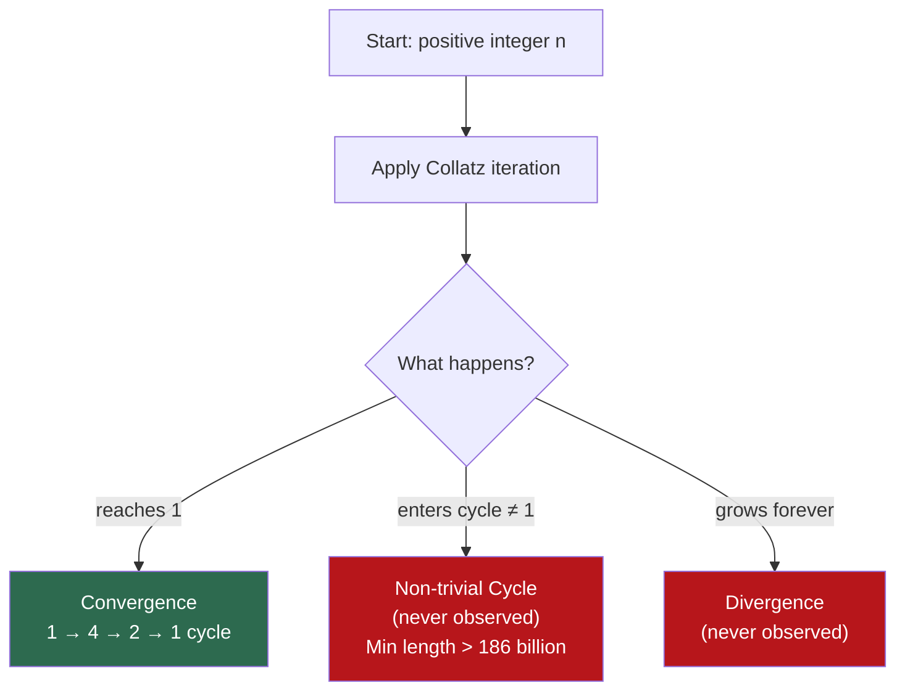

# The Collatz Conjecture: The Simplest Problem No One Can Solve

## Three Lines of Code, Infinite Mystery

Here is a function. It is perhaps the simplest nontrivial function in all of mathematics:

$$T(n) = \begin{cases} n / 2 & \text{if } n \text{ is even} \\ 3n + 1 & \text{if } n \text{ is odd} \end{cases}$$

Pick any positive integer. Apply $T$. Apply it again. Keep going. Watch the sequence.

Start with $n = 6$:

$$6 \to 3 \to 10 \to 5 \to 16 \to 8 \to 4 \to 2 \to 1$$

Eight steps. Lands on 1.

Start with $n = 27$:

$$27 \to 82 \to 41 \to 124 \to 62 \to 31 \to 94 \to 47 \to 142 \to 71 \to 214 \to 107 \to 322 \to \ldots$$

The sequence rockets upward, reaching a peak of **9232** before eventually, after **111 steps**, collapsing down to 1.

The **Collatz Conjecture** states: for every positive integer $n$, the sequence eventually reaches 1.

That is the entire conjecture. A child can understand the rule. A few lines of code can verify it for any number you choose. And yet, after nearly ninety years, no one has been able to prove it—or disprove it.

## The Algorithm

```python
def collatz_sequence(n):
    """Generate the Collatz sequence starting from n."""
    sequence = [n]
    while n != 1:
        if n % 2 == 0:
            n = n // 2
        else:
            n = 3 * n + 1
        sequence.append(n)
    return sequence

seq = collatz_sequence(27)
print(f"Starting value: 27")
print(f"Steps to reach 1: {len(seq) - 1}")
print(f"Maximum value reached: {max(seq)}")
print(f"Sequence: {seq[:20]}...")
```

```
Starting value: 27
Steps to reach 1: 111
Maximum value reached: 9232
Sequence: [27, 82, 41, 124, 62, 31, 94, 47, 142, 71, 214, 107, 322, 161, 484, 242, 121, 364, 182, 91]...
```

The number 27 is small. It fits on a napkin. But its Collatz journey is absurdly volatile—soaring to 9232 before finally submitting to the inevitable descent to 1. This contrast between the simplicity of the input and the chaos of the trajectory is the essence of why the conjecture is so difficult.

A simpler starting value like 10 makes the oscillation visible:


Even this short path — 6 steps — shows the pattern: odd numbers jump up, even numbers halve back down. The conjecture says every number eventually lands on 1.

## A Brief History of Obsession

### Lothar Collatz (1937)

The conjecture is named after **Lothar Collatz**, a German mathematician who first proposed it in 1937, though it circulated informally in mathematical circles for decades before receiving wide attention. Collatz studied the iteration of arithmetic functions and noticed the pattern, but he could not prove it.

### The Folklore and the Warnings

Over the decades, the problem accumulated a legendary reputation in the mathematical community. It is said (perhaps apochretically) that during the Cold War, the conjecture was suspected to be a Soviet plot to slow down American mathematics by diverting researchers into an unsolvable problem.

Paul Erdős, one of the most prolific mathematicians in history, famously said of the Collatz Conjecture:

> "Mathematics is not yet ready for such problems."

He offered $500 for a solution—a significant bounty by Erdős standards, reserved for problems he considered genuinely difficult. The prize remains unclaimed.

Jeffrey Lagarias, who has studied the problem extensively, wrote in 2010: "This is an extraordinarily difficult problem, completely out of reach of present-day mathematics."

These are not casual warnings. These are the assessments of mathematicians who dedicated years to the problem and came away humbled.

## Why Does It Seem True?

### The Probabilistic Argument

There is a compelling heuristic argument for why the conjecture should be true—an argument that is not a proof, but illuminates the structure.

Consider what happens to a "typical" large odd number $n$ when we apply the rule. We compute $3n + 1$, which is even, so we immediately divide by 2, getting $(3n+1)/2 \approx 3n/2$. This is a *net multiplication by approximately $3/2$*.

But roughly half of all integers are even, and each even step is a division by 2 (a multiplication by $1/2$). So in the long run, we alternate:

- Odd step: multiply by $\approx 3/2$
- Even step: multiply by $1/2$

If odd and even numbers appeared with roughly equal probability in the sequence, the average multiplicative factor per step would be approximately:

$$\left(\frac{3}{2}\right)^{1/2} \cdot \left(\frac{1}{2}\right)^{1/2} = \sqrt{\frac{3}{4}} = \frac{\sqrt{3}}{2} \approx 0.866$$

Since $0.866 < 1$, the sequence should, *on average*, decrease. Over many steps, the expected behavior is a slow drift downward toward 1.

This probabilistic reasoning suggests that the conjecture is true for "almost all" starting values. And indeed, computational evidence overwhelmingly supports this: the conjecture has been verified for all integers up to $2^{68}$ (approximately $2.95 \times 10^{20}$).

### Why the Heuristic Is Not a Proof

The probabilistic argument has a fatal flaw: it assumes that the parity (odd/even) of numbers in a Collatz sequence behaves like a random coin flip. It does not. The sequence is completely deterministic—each value is determined by the previous one. The parity at step $k$ is correlated with the parity at step $k-1$ in ways that are extremely difficult to characterize.

It is theoretically possible that there exist numbers whose Collatz sequences *never* reach 1—either because they enter a cycle that does not include 1, or because they diverge to infinity. The probabilistic argument says such numbers should be extraordinarily rare. "Extraordinarily rare" is not the same as "nonexistent." And in mathematics, the gap between "almost surely true" and "proven true" is the gap between a conjecture and a theorem.

## The Three Possible Behaviors

For any starting value $n$, the Collatz sequence can exhibit exactly one of three behaviors:

1. **Convergence**: The sequence eventually reaches 1, then enters the cycle $1 \to 4 \to 2 \to 1$.
2. **Non-trivial cycle**: The sequence enters a cycle that does not include 1. No such cycle has ever been found. It has been proven that any non-trivial cycle must have length greater than 186 billion.
3. **Divergence**: The sequence grows without bound, heading to infinity. No divergent trajectory has ever been observed.

The conjecture asserts that behavior (1) is the only possibility. Disproving the conjecture would require finding a single example of behavior (2) or (3). The fact that no such example has been found after checking $2.95 \times 10^{20}$ numbers is strong *evidence* but not *proof*.



## The Stopping Time: Measuring the Journey

### Definition

The **stopping time** of a number $n$ is the number of steps required to reach a value less than $n$ for the first time. The **total stopping time** is the number of steps to reach 1.

```python
def stopping_time(n):
    """Total number of steps to reach 1."""
    steps = 0
    current = n
    while current != 1:
        if current % 2 == 0:
            current //= 2
        else:
            current = 3 * current + 1
        steps += 1
    return steps

# Explore stopping times for the first 10,000 numbers
import numpy as np

N = 10_000
times = [stopping_time(n) for n in range(1, N + 1)]
print(f"Maximum stopping time for n ≤ {N}: {max(times)}")
print(f"Achieved by n = {np.argmax(times) + 1}")
print(f"Average stopping time: {np.mean(times):.1f}")
print(f"Median stopping time: {np.median(times):.1f}")
```

The stopping times are wildly unpredictable. Small numbers can have long trajectories (27 takes 111 steps). Large numbers can have short trajectories (1024 = $2^{10}$ takes exactly 10 steps). There is no simple formula relating $n$ to its stopping time.

### The Distribution of Stopping Times

If you plot stopping times for $n = 1$ to $n = 100{,}000$, you see a distinctive pattern: the data points fill a roughly triangular region, bounded above by a curve that grows approximately as $\log(n)$. Most numbers have modest stopping times, but occasional outliers shoot much higher—these are the numbers whose sequences take wild detours before descending.

The distribution of stopping times has been studied statistically. The *logarithm* of the stopping time appears to follow an approximately normal distribution, consistent with the probabilistic model where each step is a random multiplicative perturbation. But "approximately" and "appears to" are the operative words. The precise distribution remains uncharacterized.

## The Structure Nobody Can Crack

### The Collatz Graph

Every positive integer has a unique successor under the Collatz function. This means the Collatz iteration defines a **directed graph** on the positive integers: each node $n$ has an edge pointing to $T(n)$. The conjecture states that this graph is a single tree rooted at 1.

We can also think about the **inverse** problem: given a number $m$, which numbers map *to* $m$?

If $m$ is reached via the "divide by 2" rule, then $2m$ maps to $m$.
If $m$ is reached via the "$3n+1$" rule, then $(m-1)/3$ maps to $m$—but only if $(m-1)/3$ is a positive odd integer.

This inverse mapping generates the **Collatz tree**: a tree rooted at 1, branching upward. Every positive integer should appear exactly once in this tree (if the conjecture is true).

```python
def collatz_inverse(m, depth=5):
    """
    Generate the inverse Collatz tree starting from m.
    Returns all numbers that eventually reach m.
    """
    tree = {m}
    frontier = {m}
    
    for _ in range(depth):
        new_frontier = set()
        for node in frontier:
            # Every node n has 2n as a predecessor (even rule)
            new_frontier.add(2 * node)
            
            # If (node - 1) / 3 is a positive odd integer, it is also a predecessor
            if (node - 1) % 3 == 0:
                pred = (node - 1) // 3
                if pred > 0 and pred % 2 == 1:
                    new_frontier.add(pred)
        
        tree.update(new_frontier)
        frontier = new_frontier
    
    return sorted(tree)

predecessors = collatz_inverse(1, depth=12)
print(f"Numbers reachable within 12 inverse steps of 1: {len(predecessors)}")
print(f"First 30: {predecessors[:30]}")
```

The tree branches unevenly. Some paths are dense; others are sparse. The structure is reminiscent of a fractal—self-similar at different scales, yet resisting any compact mathematical description.

### Why Is It So Hard?

The fundamental difficulty of the Collatz Conjecture lies in the **interplay between multiplication and addition with division**.

Modern number theory has powerful tools for analyzing purely multiplicative structures (the Fundamental Theorem of Arithmetic, the theory of primes, p-adic analysis) and purely additive structures (Fourier analysis on groups, the circle method). But the Collatz function mixes these structures in a way that neutralizes most existing techniques.

The "$3n + 1$" step combines multiplication by 3 (a multiplicative operation) with addition of 1 (an additive operation), followed by division by a power of 2 (another multiplicative operation). This mixing of arithmetic operations means that the behavior of the sequence depends on the *binary representation* of numbers in ways that are intimately connected to their *ternary representation*—and the relationship between binary and ternary representations is one of the deepest unsolved problems in number theory.

To put it concretely: knowing whether a number is divisible by 2 tells you about its last binary digit. Knowing whether $3n + 1$ is divisible by 4 (allowing two divisions) tells you about the last *two* binary digits. But the Collatz iteration mixes these local properties across all digit positions, creating long-range correlations that resist analysis.

## Partial Results: What We Do Know

Despite the conjecture remaining open, mathematicians have not been idle. Several significant partial results have been established:

### Terence Tao (2019)

In 2019, **Terence Tao**—widely regarded as one of the greatest living mathematicians—proved the strongest result to date on the Collatz Conjecture:

> Almost all Collatz orbits attain almost bounded values.

More precisely, Tao showed that for "almost all" positive integers $n$ (in the sense of logarithmic density), the Collatz sequence starting at $n$ eventually drops below any prescribed function $f(n)$ that goes to infinity, no matter how slowly.

This means, for example, that the set of numbers whose Collatz sequences never drop below $\sqrt[100]{n}$ has density zero. Almost every number eventually gets *dramatically* smaller. This is the strongest evidence yet that the conjecture is true, but it falls short of proving that every sequence reaches exactly 1.

The gap between "almost all numbers satisfy the conjecture" and "all numbers satisfy the conjecture" is precisely the gap that current mathematics cannot bridge.

### Other Known Results

- **No non-trivial cycles of length < 186 billion** exist (Eliahou, 1993). If a counterexample cycle exists, it must be astronomically large.
- **The conjecture holds for all $n < 2^{68}$** (verified computationally). This is roughly $2.95 \times 10^{20}$—far beyond what any human could check by hand.
- **The lowest element of any non-trivial cycle must exceed $10^{10}$** (Simons & de Weger, 2003). Any counterexample must involve very large numbers.
- **The set of integers that eventually reach 1 has positive density** (Krasikov & Lagarias, 2003). In fact, at least 99.99% of integers below any given bound eventually reach 1.

Each of these results chips away at the possibility of a counterexample—but none eliminates it entirely.

## Connections to Other Mathematics

### Dynamical Systems

The Collatz function is a **discrete dynamical system**: a rule that maps the positive integers to themselves, iterated repeatedly. The conjecture asserts that this dynamical system has a single **attractor**—the cycle $\{1, 2, 4\}$—and that every orbit converges to it.

In continuous dynamical systems (differential equations), understanding attractors is already profoundly difficult (see: the Lorenz attractor and chaos theory). Discrete dynamical systems on the integers add another layer of complexity because the domain is not continuous—you cannot use calculus directly.

### The 5n + 1 Problem

To appreciate how delicate the Collatz Conjecture is, consider the seemingly minor variant: replace $3n + 1$ with $5n + 1$.

$$T_5(n) = \begin{cases} n / 2 & \text{if } n \text{ is even} \\ 5n + 1 & \text{if } n \text{ is odd} \end{cases}$$

For this variant, cycles *other than 1* are known to exist. For example, starting from $n = 13$:

$$13 \to 66 \to 33 \to 166 \to 83 \to 416 \to 208 \to 104 \to 52 \to 26 \to 13$$

The sequence cycles without ever reaching 1. There are also numbers in the $5n+1$ problem whose sequences appear to diverge to infinity.

The change from $3n + 1$ to $5n + 1$ transforms the problem from "probably always converges" to "demonstrably doesn't always converge." This sensitivity to the coefficient is exactly why the problem is so difficult: the special properties of the number 3 that make the Collatz Conjecture (presumably) true are subtle and poorly understood.

### p-adic Analysis and the 2-adic Integers

One of the more sophisticated approaches to the Collatz Conjecture uses **p-adic numbers**—an alternative number system based on a different notion of distance.

In the 2-adic integers $\mathbb{Z}_2$, two numbers are "close" if they agree on many trailing binary digits. The Collatz function turns out to be well-behaved in the 2-adic topology: it is continuous on the 2-adic integers and can be extended to a function on all of $\mathbb{Z}_2$.

Analyzing the Collatz function 2-adically reveals beautiful structure—fractal patterns, measure-theoretic properties—but has not yet yielded a proof. The 2-adic perspective illuminates *why* the binary representation matters, but translating 2-adic results into statements about ordinary integers remains an open challenge.

## The Beauty of the Unresolved

### A Meditation on Mathematical Humility

The Collatz Conjecture occupies a unique place in mathematics. It is not hiding behind abstraction—there are no prerequisites to understand the statement. A ten-year-old can check cases. A first-year programmer can write the algorithm.

And yet the proof—or disproof—has resisted Erdős, Tao, and every other mathematician who has attempted it. The problem sits at the intersection of number theory, dynamical systems, ergodic theory, and computability, drawing on tools from each but yielding to none.

There is something deeply humbling about this. Mathematics is not a hierarchy where harder-sounding problems are harder to solve. Sometimes the deepest mysteries wear the simplest masks.

### What Would a Proof Look Like?

If the conjecture is true, a proof would likely require a fundamentally new technique—a way to control the interplay between binary and ternary structure in the integers, or a new type of dynamical-systems argument that handles discrete, non-continuous maps on $\mathbb{N}$.

If the conjecture is false, a disproof would require finding a specific counterexample: a number whose sequence cycles without reaching 1, or diverges to infinity. Given that all numbers up to $2^{68}$ have been checked, such a counterexample would be unimaginably large—too large to find by brute computation, requiring instead a structural argument for its existence.

Either outcome would be revolutionary. A proof would introduce powerful new mathematical machinery. A disproof would shatter one of the strongest conjectures in number theory and force a fundamental rethinking of how arithmetic functions behave under iteration.

Until then, the blocks keep falling. The sequences keep climbing and crashing. And the simplest problem in mathematics remains, stubbornly, unsolved.

---

## Going Deeper

**Books:**

- Lagarias, J. C. (2010). *The Ultimate Challenge: The 3x+1 Problem.* American Mathematical Society.
  - The authoritative collection. Contains survey articles, original research, and Lagarias' famous annotated bibliography. If you want to seriously study the problem, start here.

- Chamberland, M. (2015). *Single Digits: In Praise of Small Numbers.* Princeton University Press.
  - A broader exploration of surprising properties of small numbers, with an excellent chapter on the Collatz Conjecture in the context of other deceptively simple problems.

**Online Resources:**

- [The Collatz Conjecture — Wikipedia](https://en.wikipedia.org/wiki/Collatz_conjecture) — A surprisingly thorough and well-maintained article with detailed history, partial results, and computational records.
- [OEIS A006577: Number of steps for n to reach 1 in the 3x+1 problem](https://oeis.org/A006577) — The stopping times sequence in the Online Encyclopedia of Integer Sequences. Explore related sequences and see how the Collatz function connects to other integer sequences.
- [Collatz Conjecture Visualization](https://www.jasondavies.com/collatz-graph/) — An interactive visualization of the Collatz tree by Jason Davies. Watch the branching structure of the inverse map in real time.
- [Terrence Tao's blog post on his 2019 result](https://terrytao.wordpress.com/2019/09/10/almost-all-collatz-orbits-attain-almost-bounded-values/) — Tao's own accessible explanation of his breakthrough result, written for a mathematically literate audience.

**Videos:**

- ["The Simplest Math Problem No One Can Solve"](https://www.youtube.com/watch?v=094y1Z2wpJg) by Veritasium — An excellent visual introduction to the conjecture with animations of the trajectories and stopping times.
- ["Collatz Conjecture in Color"](https://www.youtube.com/watch?v=LqKpkdRRLZw) by Numberphile — A visual approach showing the fractal-like structure of the Collatz tree.
- ["The 3x+1 Problem and its Generalizations"](https://www.youtube.com/watch?v=dQWn0MXAO3I) by Fields Medalist Timothy Gowers — A lecture-level treatment of the problem and why it resists proof.

**Academic Papers:**

- Tao, T. (2019). ["Almost all orbits of the Collatz map attain almost bounded values."](https://arxiv.org/abs/1909.03562) arXiv:1909.03562.
  - The strongest result to date. Tao proves that almost all starting values produce sequences that eventually drop below any slowly growing function.

- Lagarias, J. C. (2003). ["The 3x + 1 Problem: An Annotated Bibliography."](https://arxiv.org/abs/math/0309224) arXiv:math/0309224.
  - Over 100 pages cataloguing every known result, attempt, and variant. An extraordinary document of mathematical obsession.

- Chamberland, M. (1996). "A continuous extension of the 3x + 1 problem to the real line." *Dynamics of Continuous, Discrete and Impulsive Systems*, 2(4), 495–509.
  - Extends the Collatz function to the real numbers, revealing beautiful fractal structures and connections to dynamical systems.

**For Computational Exploration:**

- Write a program that generates the Collatz tree (inverse map) and visualize it as a graph. Notice the fractal branching.
- Compute stopping times for $n = 1$ to $n = 1{,}000{,}000$ and plot the distribution. The scattered, cloud-like pattern is one of the most distinctive visualizations in mathematics.
- Implement the $5n + 1$ variant and find cycles. Compare its behavior to $3n + 1$. What changes when you alter the coefficient?

**Key Question for Contemplation:**

If the Collatz Conjecture is true but unprovable in our current axiomatic systems—a genuine possibility, given what we know about Gödel's theorems and the arithmetic complexity of the statement—what would that mean for the relationship between truth and proof? Can a fact be true, empirically verified beyond all reasonable doubt, and yet forever beyond the reach of formal demonstration?
