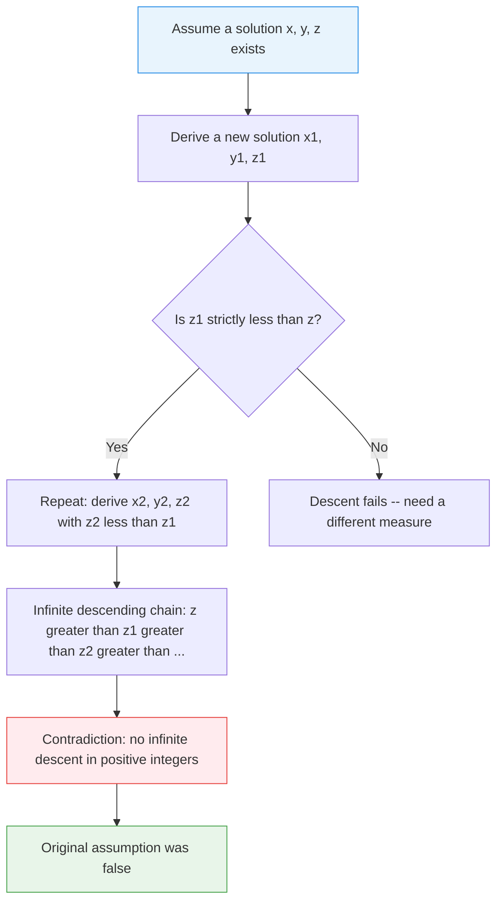
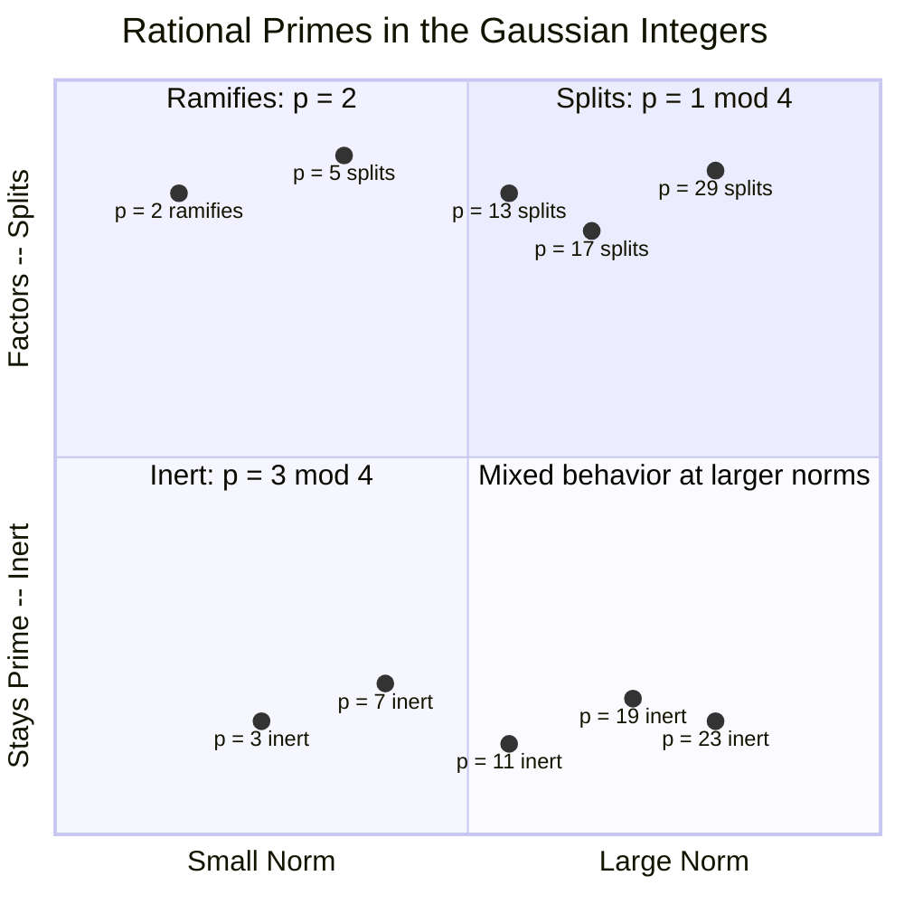
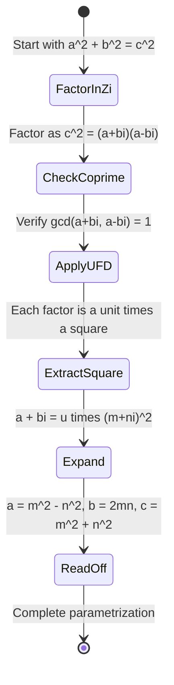

# Fermat's Last Theorem for n=4: Infinite Descent and Gaussian Integers

*This is Part 2 of a three-part series on algebraic number theory. [Part 1](/blog/algebraic-number-theory-when-factorization-breaks) laid the foundations: algebraic integers, norms, the failure of unique factorization, and Dedekind's rescue through ideals. This post puts those tools to work on a concrete theorem. [Part 3](/blog/ramanujan-constant-almost-integer) will take the story in a different direction entirely -- explaining why $e^{\pi\sqrt{163}}$ is almost an integer.*

---

## The Only Case Fermat Actually Proved

Here is one of mathematics' great ironies. Pierre de Fermat claimed around 1637 that the equation $x^n + y^n = z^n$ has no positive integer solutions for $n \geq 3$. He scribbled in the margin of his copy of Diophantus' *Arithmetica* that he had "a truly marvelous demonstration" but the margin was too narrow to contain it. That claim haunted mathematics for 358 years, until Andrew Wiles finally proved it in 1995 using the full machinery of 20th-century algebraic geometry.

But Fermat himself proved exactly one case: $n = 4$.

Not $n = 5$ (that was Dirichlet and Legendre, 1825). Not $n = 3$ (Euler, 1770, with a gap later filled). Just $n = 4$. And the proof technique he used -- **infinite descent** -- was entirely his own invention. It remains one of the most elegant proof strategies in all of number theory.

What makes this story even richer is that the $n = 4$ case can be re-proved using **Gaussian integers** $\mathbb{Z}[i]$, the ring of complex numbers with integer parts. This second proof is shorter, more structural, and showcases exactly the kind of algebraic number theory we explored in [the previous post on unique factorization](/blog/algebraic-number-theory-when-factorization-breaks). The key: $\mathbb{Z}[i]$ is a unique factorization domain. That single fact does most of the heavy lifting.

Let's see both proofs. Every step, every line of argument.

## Infinite Descent: Fermat's Secret Weapon

Before diving into the proof itself, we need to understand the proof technique. Infinite descent is a form of proof by contradiction, but with a specific flavor.

The idea: suppose some Diophantine equation has a solution in positive integers. From that solution, construct a *strictly smaller* solution (in some well-defined measure). But then from that smaller solution, construct an even smaller one. And again. And again. You get an infinite strictly decreasing sequence of positive integers.

That is impossible. Every non-empty set of positive integers has a least element (the well-ordering principle). An infinite strictly decreasing sequence has no least element. Contradiction. Therefore, no solution exists.



The technique is deceptively powerful. Fermat used it to prove several results in number theory, including that no right triangle with integer sides has an area that is a perfect square -- which, as we will see, is essentially the $n = 4$ case of FLT in disguise.

The critical challenge in any descent proof is finding the right "measure" that decreases. You need to show that some positive integer associated with the solution gets strictly smaller at each step. For FLT with $n = 4$, the measure will be the value of $z$.

## The Classical Proof: $x^4 + y^4 = z^2$

### The Stronger Statement

Here is a crucial observation: to prove $x^4 + y^4 = z^4$ has no positive integer solutions, it suffices to prove the **stronger** statement that

$$x^4 + y^4 = z^2$$

has no positive integer solutions. Why? Because any solution to $x^4 + y^4 = z^4$ would give $x^4 + y^4 = (z^2)^2$, which is a solution to the stronger equation with $z$ replaced by $z^2$.

This stronger statement is actually easier to prove by descent, because it gives us more room to work with. Let's do it.

### Pythagorean Triples: The Foundation

The equation $x^4 + y^4 = z^2$ can be rewritten as $(x^2)^2 + (y^2)^2 = z^2$. This has the shape of a Pythagorean equation $a^2 + b^2 = c^2$, with $a = x^2$, $b = y^2$, $c = z$.

We need the classical parametrization of **primitive Pythagorean triples**. A triple $(a, b, c)$ with $a^2 + b^2 = c^2$ and $\gcd(a, b, c) = 1$ must have one of $a, b$ even and the other odd. Assuming $b$ is even, there exist positive integers $m > n$ with $\gcd(m, n) = 1$ and $m \not\equiv n \pmod{2}$ such that:

$$a = m^2 - n^2, \quad b = 2mn, \quad c = m^2 + n^2$$

This parametrization goes back to Euclid. Every primitive Pythagorean triple arises this way.

### The Descent Argument

**Theorem.** The equation $x^4 + y^4 = z^2$ has no solutions in positive integers.

*Proof.* Suppose, for contradiction, that solutions exist. Among all solutions, choose one with $z$ minimal and positive. Write the equation as $(x^2)^2 + (y^2)^2 = z^2$.

We may assume $\gcd(x, y) = 1$ (if not, divide out the common factor and get a smaller solution). Then $\gcd(x^2, y^2) = 1$, so $(x^2, y^2, z)$ is a primitive Pythagorean triple.

**Step 1: Apply the parametrization.** Since $x^2$ is odd (one of $x^2, y^2$ must be odd, and we can assume it is $x^2$ by relabeling), there exist coprime integers $m > n > 0$ of opposite parity such that:

$$x^2 = m^2 - n^2, \quad y^2 = 2mn, \quad z = m^2 + n^2$$

**Step 2: Analyze $y^2 = 2mn$.** Since $\gcd(m, n) = 1$ and $m, n$ have opposite parity, exactly one of $m, n$ is even. Since $y^2 = 2mn$ and $\gcd(m, n) = 1$, we need $2mn$ to be a perfect square.

If $m$ is even, write $m = 2s$. Then $y^2 = 4sn$, so $sn = (y/2)^2$. Since $\gcd(m, n) = 1$ implies $\gcd(2s, n) = 1$ implies $\gcd(s, n) = 1$, both $s$ and $n$ must individually be perfect squares: $s = u^2$, $n = v^2$, so $m = 2u^2$.

If $n$ is even, write $n = 2t$. Then $y^2 = 4mt$, and similarly $m = u^2$, $t = v^2$, so $n = 2v^2$.

**Step 3: Analyze $x^2 = m^2 - n^2$.** In the case $m$ even: $m = 2u^2$, $n = v^2$, and

$$x^2 = (2u^2)^2 - (v^2)^2 = 4u^4 - v^4$$

This gives $x^2 + v^4 = 4u^4 = (2u^2)^2$, another equation of a similar form. But let us look at the other case, which leads to a cleaner descent.

In the case $n$ even: $m = u^2$, $n = 2v^2$, and

$$x^2 = (u^2)^2 - (2v^2)^2 = u^4 - 4v^4$$

So $x^2 + 4v^4 = u^4$, giving $x^2 + (2v^2)^2 = (u^2)^2$. This is again a Pythagorean triple equation.

**Step 4: Second application of the parametrization.** The triple $(x, 2v^2, u^2)$ is primitive (since $\gcd(m, n) = 1$ and some careful analysis). With $2v^2$ even, there exist coprime $p > q > 0$ with opposite parity such that:

$$x = p^2 - q^2, \quad 2v^2 = 2pq, \quad u^2 = p^2 + q^2$$

From $2v^2 = 2pq$ we get $v^2 = pq$. Since $\gcd(p, q) = 1$, both $p$ and $q$ are perfect squares: $p = \alpha^2$, $q = \beta^2$.

**Step 5: The descent.** Now $u^2 = p^2 + q^2 = \alpha^4 + \beta^4$. This is the original equation $x^4 + y^4 = z^2$ with $(\alpha, \beta, u)$ replacing $(x, y, z)$.

But what is $u$ compared to $z$? We have:

$$u^2 = p^2 + q^2 \leq m = u^2 \leq m < m^2 + n^2 = z$$

More precisely, $u \leq m$ (since $u^2 = m$, actually $m = u^2$, so $u^2 = m$ and $u < m$ when $u > 1$). And $m < m^2 + n^2 = z$. So $u < z$.

We have produced a new solution $(\alpha, \beta, u)$ with $u < z$, contradicting the minimality of $z$. $\blacksquare$

### Verifying the Descent Computationally

Let's verify the key algebraic identities and check that the Pythagorean triple parametrization works:

```python
from math import gcd, isqrt

def is_perfect_square(n):
    """Check if n is a perfect square."""
    if n < 0:
        return False
    s = isqrt(n)
    return s * s == n

def primitive_pythagorean_triples(limit):
    """Generate all primitive Pythagorean triples with c <= limit."""
    triples = []
    for m in range(2, isqrt(limit) + 1):
        for n in range(1, m):
            if (m - n) % 2 == 1 and gcd(m, n) == 1:
                a = m**2 - n**2
                b = 2 * m * n
                c = m**2 + n**2
                if c <= limit:
                    triples.append((min(a, b), max(a, b), c))
    return sorted(set(triples))

# Verify: no solution to x^4 + y^4 = z^2 for small values
print("Checking x^4 + y^4 = z^2 for x, y in [1, 500]...")
solutions_found = 0
for x in range(1, 501):
    for y in range(x, 501):
        val = x**4 + y**4
        if is_perfect_square(val):
            solutions_found += 1
            print(f"  Solution: x={x}, y={y}, z={isqrt(val)}")

print(f"Solutions found: {solutions_found}")
# Output: Solutions found: 0

# Show some primitive Pythagorean triples from the parametrization
print("\nFirst 10 primitive Pythagorean triples:")
for a, b, c in primitive_pythagorean_triples(100):
    print(f"  ({a}, {b}, {c})  -- {a}^2 + {b}^2 = {a**2} + {b**2} = {c**2} = {c}^2")

# Verify the parametrization identity
print("\nVerifying m^2-n^2, 2mn, m^2+n^2 identity:")
for m in range(2, 8):
    for n in range(1, m):
        a, b, c = m**2 - n**2, 2*m*n, m**2 + n**2
        assert a**2 + b**2 == c**2, "Identity failed!"
print("All identities verified.")
```

## Enter the Gaussian Integers

The classical proof works, but it feels like a wrestling match -- at each step you parametrize, factor, argue about coprimality, and force your way to the descent. There is a cleaner approach. It uses the **Gaussian integers**, and it illustrates exactly why algebraic number theory was invented.

As we saw in [the previous post](/blog/algebraic-number-theory-when-factorization-breaks), the central question in algebraic number theory is: *does unique factorization hold in a given ring of algebraic integers?* When it does, problems become tractable. When it doesn't, you need Dedekind's ideal theory to recover the structure.

The Gaussian integers are the ring

$$\mathbb{Z}[i] = \{a + bi : a, b \in \mathbb{Z}\}$$

where $i = \sqrt{-1}$. This ring lives inside the complex numbers, and it has a multiplicative **norm**:

$$N(a + bi) = a^2 + b^2$$

The norm is multiplicative: $N(\alpha \beta) = N(\alpha) N(\beta)$ for all $\alpha, \beta \in \mathbb{Z}[i]$. This is the key algebraic property that makes everything work.

### Units of $\mathbb{Z}[i]$

An element $\alpha \in \mathbb{Z}[i]$ is a **unit** if it has a multiplicative inverse in $\mathbb{Z}[i]$. Since $N(\alpha) N(\alpha^{-1}) = N(1) = 1$ and norms are non-negative integers, we need $N(\alpha) = 1$. The solutions to $a^2 + b^2 = 1$ in integers are $(\pm 1, 0)$ and $(0, \pm 1)$, giving the four units:

$$\mathbb{Z}[i]^\times = \{1, -1, i, -i\}$$

Two elements that differ by multiplication by a unit are called **associates**. For example, $3 + 2i$ and $-2 + 3i = i(3 + 2i)$ are associates.

### Why $\mathbb{Z}[i]$ Is a UFD

This is the crucial fact. The Gaussian integers form a **Euclidean domain** with the norm $N$ as the Euclidean function. That means: for any $\alpha, \beta \in \mathbb{Z}[i]$ with $\beta \neq 0$, there exist $q, r \in \mathbb{Z}[i]$ such that

$$\alpha = q\beta + r, \quad N(r) < N(\beta)$$

The proof is geometric. Divide $\alpha / \beta$ in $\mathbb{C}$ to get a complex number. Round the real and imaginary parts to the nearest integers to get $q$. The remainder $r = \alpha - q\beta$ satisfies $N(r) \leq \frac{1}{2} N(\beta) < N(\beta)$.

Every Euclidean domain is a principal ideal domain (PID), and every PID is a unique factorization domain (UFD). So $\mathbb{Z}[i]$ has unique factorization into Gaussian primes.

This chain of implications deserves a diagram:


Compare this with the ring $\mathbb{Z}[\sqrt{-5}]$ from [the previous post](/blog/algebraic-number-theory-when-factorization-breaks), where $6 = 2 \cdot 3 = (1 + \sqrt{-5})(1 - \sqrt{-5})$ gave two distinct factorizations. That ring is *not* a UFD -- and that failure of unique factorization is exactly what makes number theory in general rings so hard. The Gaussian integers are the good case.

## Primes in $\mathbb{Z}[i]$

To use unique factorization, we need to know what the primes look like. A non-zero, non-unit element $\pi \in \mathbb{Z}[i]$ is a **Gaussian prime** if whenever $\pi = \alpha \beta$, one of $\alpha, \beta$ must be a unit.

The norm gives us a powerful criterion. Since $N$ is multiplicative, if $\pi$ is prime, then $N(\pi)$ is either a rational prime $p$, or $p^2$ for some rational prime $p$.

The classification of Gaussian primes depends on the rational prime $p$:

| Rational Prime $p$ | Behavior in $\mathbb{Z}[i]$ | Gaussian Primes | Example |
|:---:|:---:|:---:|:---:|
| $p = 2$ | **Ramifies**: $2 = -i(1+i)^2$ | $1 + i$ (up to units) | $N(1+i) = 2$ |
| $p \equiv 1 \pmod{4}$ | **Splits**: $p = \pi \bar{\pi}$ | $\pi$ and $\bar{\pi}$ | $5 = (2+i)(2-i)$ |
| $p \equiv 3 \pmod{4}$ | **Stays inert**: $p$ remains prime | $p$ itself | $3, 7, 11, \ldots$ |

The splitting criterion comes from Fermat's theorem on sums of two squares: a prime $p$ is a sum of two squares $a^2 + b^2$ if and only if $p = 2$ or $p \equiv 1 \pmod{4}$. When $p = a^2 + b^2$, we get $p = (a + bi)(a - bi) = \pi \bar{\pi}$, and $\pi, \bar{\pi}$ are non-associate primes.



Let's verify some of these factorizations computationally:

```python
def gaussian_norm(a, b):
    """Norm of a + bi in Z[i]."""
    return a**2 + b**2

def find_gaussian_factorization(p):
    """For a prime p = 1 mod 4 or p = 2, find a + bi with N(a+bi) = p."""
    for a in range(0, p):
        for b in range(1, p):
            if a**2 + b**2 == p:
                return (a, b)
    return None

# Classify small primes in Z[i]
primes = [2, 3, 5, 7, 11, 13, 17, 19, 23, 29, 31, 37, 41]
print("Classification of rational primes in Z[i]:\n")
for p in primes:
    if p == 2:
        print(f"  p = {p}: RAMIFIES  -- 2 = -i * (1+i)^2, since N(1+i) = 2")
    elif p % 4 == 1:
        factors = find_gaussian_factorization(p)
        a, b = factors
        print(f"  p = {p}: SPLITS    -- {p} = ({a}+{b}i)({a}-{b}i), "
              f"since {a}^2 + {b}^2 = {a**2 + b**2}")
    else:
        print(f"  p = {p}: INERT     -- {p} remains prime in Z[i], "
              f"since {p} mod 4 = {p % 4}")

# Output:
#   p = 2: RAMIFIES  -- 2 = -i * (1+i)^2, since N(1+i) = 2
#   p = 3: INERT     -- 3 remains prime in Z[i], since 3 mod 4 = 3
#   p = 5: SPLITS    -- 5 = (1+2i)(1-2i), since 1^2 + 2^2 = 5
#   p = 7: INERT     -- 7 remains prime in Z[i], since 7 mod 4 = 3
#   p = 11: INERT    -- 11 remains prime in Z[i], since 11 mod 4 = 3
#   p = 13: SPLITS   -- 13 = (2+3i)(2-3i), since 2^2 + 3^2 = 13
#   ...
```

## The Gaussian Proof of FLT for n=4

Now we re-prove the theorem using the algebraic structure of $\mathbb{Z}[i]$. The strategy is fundamentally different: instead of parametrizing Pythagorean triples, we **factor** the equation in $\mathbb{Z}[i]$ and use unique factorization to force a contradiction.

**Theorem.** The equation $x^4 + y^4 = z^2$ has no solutions in positive integers.

*Proof.* We actually prove a key lemma first.

### Lemma: Characterization of Pythagorean Triples via $\mathbb{Z}[i]$

**Lemma.** If $a^2 + b^2 = c^2$ with $\gcd(a, b) = 1$ and $b$ even, then there exists $\alpha = m + ni \in \mathbb{Z}[i]$ such that

$$c + ai = u \cdot \alpha^2$$

for some unit $u \in \{1, -1, i, -i\}$, and $b = 2mn$, $a = m^2 - n^2$, $c = m^2 + n^2$.

*Proof of lemma.* In $\mathbb{Z}[i]$, the equation becomes:

$$c^2 = a^2 + b^2 = (a + bi)(a - bi)$$

We claim that $\gcd(a + bi, a - bi) = 1$ in $\mathbb{Z}[i]$ (up to units). If a Gaussian prime $\pi$ divides both $a + bi$ and $a - bi$, then $\pi$ divides their sum $2a$ and their difference $2bi$. Since $\gcd(a, b) = 1$, we can show $\pi$ must divide $2$, so $\pi$ is an associate of $1 + i$. But $N(1+i) = 2$, and $(1+i)$ dividing $a + bi$ would mean $2 \mid N(a+bi) = a^2 + b^2 = c^2$, hence $2 \mid c$, hence $2 \mid a$ (since $b$ is even), contradicting $\gcd(a,b) = 1$ with $a$ odd.

So $a + bi$ and $a - bi$ are coprime in $\mathbb{Z}[i]$. Their product is $c^2$, a perfect square. By **unique factorization** in $\mathbb{Z}[i]$, each factor must itself be a perfect square (up to units):

$$a + bi = u \cdot (m + ni)^2$$

for some unit $u$ and integers $m, n$. Expanding:

$$(m + ni)^2 = m^2 - n^2 + 2mni$$

Taking $u = 1$ (absorbing the unit into the choice of $m, n$), we get $a = m^2 - n^2$ and $b = 2mn$. Then $c^2 = a^2 + b^2 = (m^2+n^2)^2$, so $c = m^2 + n^2$. $\square$

### The Main Proof

Now suppose $x^4 + y^4 = z^2$ with $x, y, z$ positive integers and $\gcd(x, y) = 1$. Choose a solution with $z$ minimal.

**Step 1: Factor in $\mathbb{Z}[i]$.** Rewrite as $(x^2)^2 + (y^2)^2 = z^2$. By the lemma (with $a = x^2$, $b = y^2$, assuming $y$ is even), there exist coprime $m, n$ of opposite parity with:

$$x^2 = m^2 - n^2, \quad y^2 = 2mn, \quad z = m^2 + n^2$$

**Step 2: Factor $x^2 = m^2 - n^2$ in $\mathbb{Z}[i]$.** We have:

$$x^2 = (m - n)(m + n)$$

Since $\gcd(m, n) = 1$ and $m, n$ have opposite parity, $\gcd(m-n, m+n) = 1$. Both factors are positive (since $m > n > 0$). Since their product is a perfect square and they are coprime, each is a perfect square:

$$m + n = s^2, \quad m - n = t^2$$

for some positive integers $s > t$ with $s, t$ coprime and of opposite parity. Then:

$$m = \frac{s^2 + t^2}{2}, \quad n = \frac{s^2 - t^2}{2}$$

Wait -- $s^2 + t^2$ must be even, so $s, t$ must have the same parity. But $m, n$ have opposite parity, which forces some constraints. Let's be more careful. Since $m + n$ and $m - n$ are both odd (as $m, n$ have opposite parity), $s$ and $t$ are both odd, and $m = (s^2 + t^2)/2$, $n = (s^2 - t^2)/2$.

**Step 3: Analyze $y^2 = 2mn$.** With $n$ even (say), write things in terms of $s, t$. From $y^2 = 2mn$ and the expressions for $m, n$:

Going back to the coprimality argument: since $\gcd(m, n) = 1$ and $y^2 = 2mn$, with $n$ even we write $n = 2k$, giving $y^2 = 4mk$, so $(y/2)^2 = mk$. Since $\gcd(m, k) = 1$ (from $\gcd(m, n) = 1$), both $m$ and $k$ are perfect squares: $m = \alpha^2$, $k = \beta^2$, so $n = 2\beta^2$.

**Step 4: Apply the lemma again.** Now $x^2 = m^2 - n^2 = \alpha^4 - 4\beta^4$, which gives:

$$x^2 + (2\beta^2)^2 = (\alpha^2)^2$$

This is a new Pythagorean triple. By the lemma (from the Gaussian integer factorization), there exist coprime $p, q$ with:

$$x = p^2 - q^2, \quad 2\beta^2 = 2pq, \quad \alpha^2 = p^2 + q^2$$

So $\beta^2 = pq$ with $\gcd(p, q) = 1$, forcing $p = r^2$, $q = s^2$ for some integers $r, s$.

**Step 5: The descent.** Now:

$$\alpha^2 = p^2 + q^2 = r^4 + s^4$$

This is the original equation with $(r, s, \alpha)$ replacing $(x, y, z)$. And:

$$\alpha^2 = m = \alpha^2 \implies \alpha \leq m < m^2 + n^2 = z$$

So $\alpha < z$, and we have a strictly smaller solution. This contradicts the minimality of $z$. $\blacksquare$

The Gaussian integer approach is doing the same work as the classical proof, but the **conceptual framework** is cleaner. Instead of wrestling with Pythagorean triple parametrizations from scratch, we factor in $\mathbb{Z}[i]$, invoke unique factorization, and the parametrization falls out automatically. The algebra does the bookkeeping for us.

### Computational Verification

Let's verify that the Gaussian integer factorization works correctly on some concrete examples:

```python
def gaussian_multiply(a1, b1, a2, b2):
    """Multiply (a1 + b1*i) * (a2 + b2*i)."""
    return (a1*a2 - b1*b2, a1*b2 + b1*a2)

def gaussian_square(a, b):
    """Square (a + bi)."""
    return gaussian_multiply(a, b, a, b)

# Verify: squaring Gaussian integers gives Pythagorean triples
print("Pythagorean triples from Gaussian integer squares:\n")
print(f"{'(m + ni)':>10} | {'(m+ni)^2':>18} | {'Triple (a,b,c)':>18} | {'Check'}")
print("-" * 72)

for m in range(1, 8):
    for n in range(1, m):
        if gcd(m, n) == 1 and (m - n) % 2 == 1:
            real, imag = gaussian_square(m, n)
            # real = m^2 - n^2, imag = 2mn
            a = abs(real)
            b = abs(imag)
            c = m**2 + n**2
            check = a**2 + b**2 == c**2
            print(f"  ({m}+{n}i)  |  {real:>4} + {imag:>4}i  "
                  f"|  ({a:>3}, {b:>3}, {c:>3})  |  {check}")

# Verify coprimality in Z[i]:
# gcd(a+bi, a-bi) should be 1 for primitive triples
print("\nVerifying coprimality of a+bi and a-bi:")
for m, n in [(2,1), (3,2), (4,1), (4,3), (5,2), (5,4)]:
    a = m**2 - n**2
    b = 2*m*n
    c = m**2 + n**2
    # N(a+bi) = a^2 + b^2 = c^2
    # If they shared a common Gaussian prime factor pi,
    # then N(pi)^2 | c^2, and N(pi) | gcd(2a, 2b)
    g = gcd(2*a, 2*b)
    print(f"  m={m}, n={n}: triple=({a},{b},{c}), "
          f"gcd(2a,2b)={g}, N(a+bi)={a**2+b**2}")
```

## Pythagorean Triples: A Beautiful Byproduct

One of the rewards of the Gaussian integer approach is that the complete classification of Pythagorean triples falls out as a corollary. Here is the elegant version.

**Theorem.** The primitive Pythagorean triples are exactly the triples

$$(m^2 - n^2, \; 2mn, \; m^2 + n^2)$$

where $m > n > 0$, $\gcd(m, n) = 1$, and $m \not\equiv n \pmod{2}$.

*Proof via Gaussian integers.* Start with $a^2 + b^2 = c^2$, $\gcd(a,b) = 1$. In $\mathbb{Z}[i]$:

$$(a + bi)(a - bi) = c^2$$

The factors are coprime in $\mathbb{Z}[i]$ (as shown in the lemma above). By unique factorization, each factor is a unit times a perfect square:

$$a + bi = u(m + ni)^2 = u(m^2 - n^2 + 2mni)$$

Choosing the unit appropriately: $a = m^2 - n^2$, $b = 2mn$, and $c = N(m + ni) = m^2 + n^2$. $\square$

This is the cleanest proof of the Pythagorean triple classification. The entire parametrization is a *consequence of unique factorization* in $\mathbb{Z}[i]$. Nothing more.

The connection runs deep. Every Pythagorean triple corresponds to a factorization $c = \pi \bar{\pi}$ where $\pi = m + ni$ is a Gaussian integer of norm $c$. The triple is primitive exactly when $\pi$ and $\bar{\pi}$ are coprime. The algebra encodes the geometry perfectly.



Let's enumerate and verify some triples:

```python
from math import gcd, isqrt

def generate_pythagorean_triples(max_c):
    """Generate all primitive Pythagorean triples via Gaussian integers."""
    triples = []
    for m in range(2, isqrt(max_c) + 1):
        for n in range(1, m):
            if gcd(m, n) == 1 and (m - n) % 2 == 1:
                a = m**2 - n**2
                b = 2 * m * n
                c = m**2 + n**2
                if c <= max_c:
                    triples.append((min(a,b), max(a,b), c))
    return sorted(triples, key=lambda t: t[2])

triples = generate_pythagorean_triples(200)
print(f"Primitive Pythagorean triples with c <= 200: {len(triples)} found\n")
for a, b, c in triples[:15]:
    print(f"  {a:>3}^2 + {b:>3}^2 = {a**2:>5} + {b**2:>5} = {c**2:>5} = {c:>3}^2")

# Verify completeness: check all c <= 200 for Pythagorean triples
# and confirm they appear in our list
print("\nCompleteness check:")
from_parametrization = set(triples)
from_brute_force = set()
for a in range(1, 200):
    for b in range(a, 200):
        c2 = a**2 + b**2
        c = isqrt(c2)
        if c * c == c2 and c <= 200 and gcd(a, gcd(b, c)) == 1:
            from_brute_force.add((min(a,b), max(a,b), c))

print(f"  From Gaussian integer parametrization: {len(from_parametrization)}")
print(f"  From brute force search: {len(from_brute_force)}")
print(f"  Sets are equal: {from_parametrization == from_brute_force}")
```

## Why n=4 Was the Easy Case

So we have proved FLT for $n = 4$ -- twice. Why does this case work so cleanly?

The answer connects directly to the theme of [our series on algebraic number theory](/blog/algebraic-number-theory-when-factorization-breaks). The proof for $n = 4$ works because we factor the equation in $\mathbb{Z}[i]$, and $\mathbb{Z}[i]$ is a UFD. Unique factorization does all the heavy lifting.

What happens for other exponents?

**For $n = 3$:** The natural ring to work in is $\mathbb{Z}[\omega]$ where $\omega = e^{2\pi i/3}$ is a primitive cube root of unity. The equation $x^3 + y^3 = z^3$ factors as:

$$x^3 + y^3 = (x + y)(x + \omega y)(x + \omega^2 y)$$

Fortunately, $\mathbb{Z}[\omega]$ is also a UFD (it is a Euclidean domain with the norm). So Euler's proof works, though the argument is more intricate because the unit group $\{1, -1, \omega, -\omega, \omega^2, -\omega^2\}$ has six elements instead of four.

**For $n = 5$:** We would want to work in $\mathbb{Z}[\zeta_5]$ where $\zeta_5 = e^{2\pi i/5}$. This ring *is* still a UFD (its class number is 1). Dirichlet and Legendre proved the $n = 5$ case, though the proof requires additional ideas beyond simple descent.

**For $n = 23$:** The ring $\mathbb{Z}[\zeta_{23}]$ has class number 3. Unique factorization **fails**. This is exactly the kind of failure we described in the previous post. It was Kummer's discovery of this failure in the 1840s that led him to develop the theory of "ideal numbers" -- the precursor to Dedekind's ideal theory.

| Exponent $n$ | Ring | Class Number | UFD? | Proof Method |
|:---:|:---:|:---:|:---:|:---:|
| 4 | $\mathbb{Z}[i]$ | 1 | Yes | Descent in $\mathbb{Z}[i]$ |
| 3 | $\mathbb{Z}[\omega]$ | 1 | Yes | Descent in $\mathbb{Z}[\omega]$ |
| 5 | $\mathbb{Z}[\zeta_5]$ | 1 | Yes | Descent + extra arguments |
| 7 | $\mathbb{Z}[\zeta_7]$ | 1 | Yes | Kummer's methods |
| 23 | $\mathbb{Z}[\zeta_{23}]$ | 3 | No | Ideal theory needed |
| 37 | $\mathbb{Z}[\zeta_{37}]$ | 37 | No | Deeply irregular prime |
| General $n$ | --- | --- | --- | Wiles 1995 |

The pattern is clear: as $n$ grows, the relevant cyclotomic rings become more complex, and unique factorization fails more often. The primes $n$ for which $\mathbb{Z}[\zeta_n]$ is *not* a UFD are called **irregular primes** (when $n$ divides the class number of $\mathbb{Z}[\zeta_n]$). The first irregular prime is 37.

Kummer proved FLT for all **regular** primes -- those where $\mathbb{Z}[\zeta_p]$ has class number coprime to $p$. That covered infinitely many cases, but not all. The irregular primes required entirely new methods, culminating in Wiles' proof using modular forms and elliptic curves -- mathematics that Fermat could not have imagined.

The $n = 4$ case, with its clean descent in a UFD, is the beginning of a story that took 350 years to finish. Fermat started it. The algebraic number theorists -- Kummer, Dedekind, Hilbert -- carried it forward. Wiles ended it.

But class numbers do more than determine which rings have unique factorization. In [Part 3 of this series](/blog/ramanujan-constant-almost-integer), we will see how the class number being exactly 1 for the field $\mathbb{Q}(\sqrt{-163})$ forces the transcendental expression $e^{\pi\sqrt{163}}$ to miss an integer by a mere $7.5 \times 10^{-13}$ -- a result where analysis, algebra, and geometry converge on a single numerical fact.

## Going Deeper

**Books:**
- Ireland, K. and Rosen, M. (1990). *A Classical Introduction to Modern Number Theory.* Springer.
  - Chapter 17 covers the Gaussian integers in depth, including the proof of FLT for $n = 4$. One of the best graduate-level introductions to algebraic number theory.
- Stewart, I. and Tall, D. (2015). *Algebraic Number Theory and Fermat's Last Theorem.* 4th ed. CRC Press.
  - Traces the historical arc from Fermat through Kummer to Wiles, with complete proofs for small exponents and an accessible treatment of ideal theory.
- Hardy, G.H. and Wright, E.M. (2008). *An Introduction to the Theory of Numbers.* 6th ed. Oxford University Press.
  - Chapter 13 covers Pythagorean triples and the descent proof. Chapter 12 treats Gaussian integers. A classic that every number theorist should own.
- Singh, S. (1997). *Fermat's Enigma.* Walker and Company.
  - The popular account of the full FLT story. Not a math textbook, but superb narrative history from Fermat to Wiles.

**Online Resources:**
- [Keith Conrad's Notes on Gaussian Integers](https://kconrad.math.uconn.edu/blurbs/ugradnumthy/Zinotes.pdf) -- Comprehensive, self-contained treatment of $\mathbb{Z}[i]$ including the Euclidean algorithm, primes, and applications. Excellent exposition.
- [Proof of FLT for Specific Exponents (Wikipedia)](https://en.wikipedia.org/wiki/Proof_of_Fermat%27s_Last_Theorem_for_specific_exponents) -- Detailed article with complete proofs for $n = 3, 4, 5$ and references.
- [Ben Lynn's Notes: FLT n=4](https://crypto.stanford.edu/pbc/notes/numberfield/fermatn4.html) -- Concise treatment of the $n = 4$ case using algebraic number theory, from Stanford.
- [Brilliant: Fermat's Method of Infinite Descent](https://brilliant.org/wiki/general-diophantine-equations-fermats-method-of/) -- Interactive introduction to the descent technique with worked examples.

**Videos:**
- [Euler's and Fermat's Last Theorems, the Simpsons and CDC6600](https://www.youtube.com/@Mathologer) by Mathologer -- A 32-minute exploration that includes the proof of the $n = 4$ case with visual explanations and connections to popular culture. Search "Mathologer Fermat" on YouTube.
- [Fermat's Last Theorem](https://www.youtube.com/watch?v=qiNcEguuFSA) by BBC Horizon (Simon Singh / Andrew Wiles documentary) -- The definitive 45-minute documentary on the full FLT story, from Fermat's margin note to Wiles' proof. Features Wiles himself describing the moment of breakthrough.

**Academic Papers:**
- Wiles, A. (1995). ["Modular Elliptic Curves and Fermat's Last Theorem."](https://doi.org/10.2307/2118559) *Annals of Mathematics*, 141(3), 443-551.
  - The paper that settled FLT completely. Technical, but the introduction is accessible and gives a roadmap of the proof strategy.
- Kummer, E. (1850). ["Allgemeiner Beweis des Fermat'schen Satzes."](https://doi.org/10.1515/crll.1850.40.130) *Journal fur die reine und angewandte Mathematik*, 40, 130-138.
  - Kummer's proof of FLT for regular primes, using his theory of ideal numbers. A landmark in the history of algebraic number theory.

**Questions to Explore:**
- Fermat claimed a proof for the general case. Could he have had a valid argument using only 17th-century mathematics, or was he almost certainly mistaken?
- The Gaussian integers $\mathbb{Z}[i]$ are a UFD, but $\mathbb{Z}[\sqrt{-5}]$ is not. Is there a geometric or visual way to "see" why one lattice admits unique factorization and the other does not?
- Infinite descent and mathematical induction are logically equivalent (both rely on well-ordering of the natural numbers). Why does descent feel like a fundamentally different proof strategy than induction?
- If $\mathbb{Z}[\zeta_p]$ had class number 1 for all primes $p$, would FLT have been proved in the 19th century? What other obstacles would remain?
- The proof for $n = 4$ implies there are no rational points on the curve $X^4 + Y^4 = 1$ other than the trivial ones. What does this curve look like, and how does its genus relate to the nonexistence of rational points?
