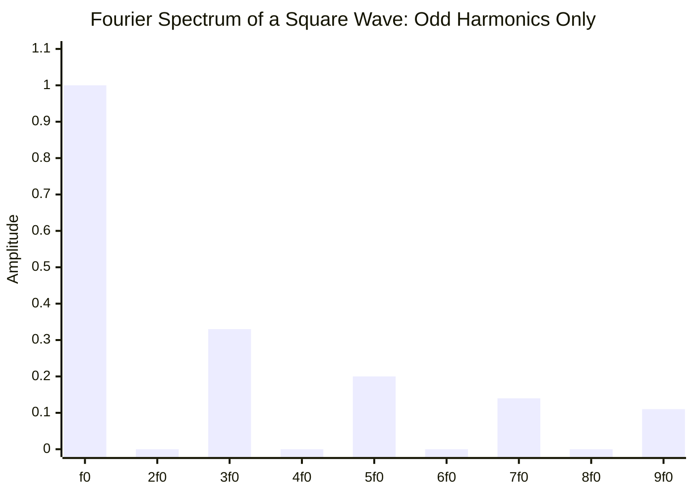
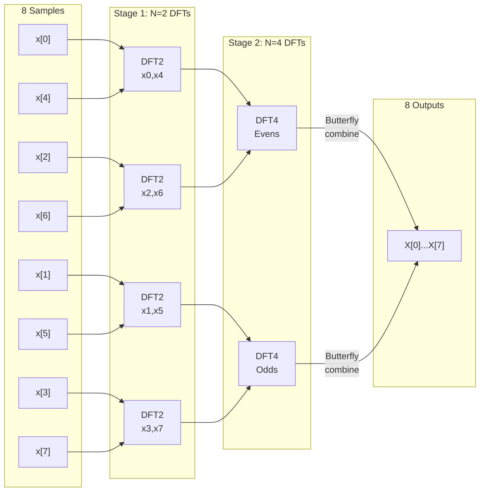
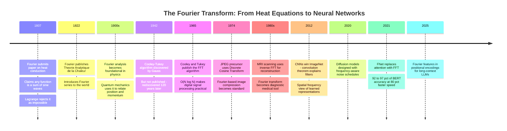

# The Fourier Transform: Every Signal Is a Sum of Sine Waves

In 1807, a French mathematician named Joseph Fourier submitted a paper to the Paris Academy of Sciences claiming that *any* function — no matter how complicated, no matter how jagged — could be written as an infinite sum of sine waves. The Academy rejected it. Joseph-Louis Lagrange, the greatest mathematician of his generation, said the claim was impossible. Fourier was wrong, Lagrange insisted, or at least recklessly imprecise about convergence.

Fourier was right. Not entirely, not without qualifications, but right enough that his idea reshaped physics, engineering, and ultimately computation. The claim feels almost mystical: take any signal — a voice recording, a heartbeat, an image, a temperature curve — and it contains, hidden inside it, a complete description of the sine waves that would reproduce it. The Fourier transform is the process of finding those waves.

Two centuries later, Fourier's idea is embedded everywhere. Your JPEG images are compressed using Fourier-adjacent techniques. MRI machines reconstruct tissue images by inverting a Fourier transform of electromagnetic signals. The noise schedules in diffusion models are designed in frequency space. The FFT — the fast algorithm for computing the Fourier transform — is one of the most important algorithms ever discovered. And in 2020, Google published FNet, showing that replacing attention in a transformer with Fourier transforms loses only 1-4% of accuracy while running 80% faster — hinting that whatever transformers are learning, frequency is part of it.

This post is about where the Fourier transform comes from, why the formula looks the way it does, and what it tells you about a signal that time-domain analysis can't.

---

## The Observation That Started Everything

Begin with a simpler claim: a plucked guitar string vibrates at a fundamental frequency — the note you hear — but also at integer multiples of that frequency (overtones), which are what makes a guitar sound different from a flute playing the same note.

This is a physical observation, and it has a mathematical structure. If the fundamental vibrates at frequency $f_0$ (say, 440 Hz for concert A), then the string also contains contributions at $2f_0$, $3f_0$, $4f_0$, and so on — each with a different amplitude that determines the instrument's "timbre." The sound you hear is not a single pure tone. It's a *superposition* of many pure tones.

Fourier's generalization was radical: this isn't a special property of vibrating strings. It's a universal property of *all* periodic functions. Take any periodic signal with period $T$, and you can write it as a sum of cosines and sines whose frequencies are integer multiples of $\frac{1}{T}$:

$$f(t) = \frac{a_0}{2} + \sum_{n=1}^{\infty} \left[ a_n \cos\!\left(\frac{2\pi n t}{T}\right) + b_n \sin\!\left(\frac{2\pi n t}{T}\right) \right]$$

This is the **Fourier series**. The question is: given $f(t)$, how do you find the coefficients $a_n$ and $b_n$? The answer is what makes the whole thing work.

---

## Finding the Coefficients: Orthogonality

The key insight is **orthogonality**. Two functions are orthogonal (over an interval) if their inner product is zero. For functions, the inner product is an integral:

$$\langle g, h \rangle = \int_0^T g(t) \, h(t) \, dt$$

Now notice something remarkable about sine and cosine functions at different frequencies. If you integrate the product of $\cos(2\pi n t / T)$ and $\cos(2\pi m t / T)$ over one period, you get:

$$\int_0^T \cos\!\left(\frac{2\pi n t}{T}\right) \cos\!\left(\frac{2\pi m t}{T}\right) dt = \begin{cases} 0 & \text{if } n \neq m \\ T/2 & \text{if } n = m \end{cases}$$

Sines and cosines at different frequencies are orthogonal. They don't "overlap" — each one is invisible to the others in integral terms. This is exactly what we need.

To find $a_n$, multiply both sides of the Fourier series by $\cos(2\pi n t / T)$ and integrate over one period. Every term in the sum vanishes except the one matching frequency $n$:

$$\int_0^T f(t) \cos\!\left(\frac{2\pi n t}{T}\right) dt = a_n \cdot \frac{T}{2}$$

$$\boxed{a_n = \frac{2}{T} \int_0^T f(t) \cos\!\left(\frac{2\pi n t}{T}\right) dt}$$

Similarly for $b_n$. What this formula says in plain language: to find how much of frequency $n$ is in the signal, **correlate the signal with a pure tone at that frequency**. If the signal contains a lot of frequency $n$, the product $f(t) \cdot \cos(2\pi n t/T)$ is mostly positive over the interval and the integral is large. If the signal has nothing at frequency $n$, the product oscillates between positive and negative and the integral cancels to near zero.

This correlation-based extraction is the heartbeat of everything that follows.

---

## Complex Notation: Euler's Formula Does the Heavy Lifting

The sine/cosine form is intuitive but algebraically unwieldy. The standard formulation uses complex exponentials via **Euler's formula**:

$$e^{i\theta} = \cos\theta + i\sin\theta$$

where $i = \sqrt{-1}$. This isn't just notational convenience — it unifies cosine and sine into a single rotating vector in the complex plane. At angle $\theta$, $e^{i\theta}$ points at an angle $\theta$ from the positive real axis. The real part is $\cos\theta$, the imaginary part is $\sin\theta$.

With this, the Fourier series collapses to a single sum:

$$f(t) = \sum_{n=-\infty}^{\infty} c_n \, e^{i 2\pi n t / T}$$

$$c_n = \frac{1}{T} \int_0^T f(t) \, e^{-i 2\pi n t / T} \, dt$$

Note the sign flip: $e^{-i 2\pi n t / T}$ in the analysis formula (finding the coefficient) vs $e^{+i 2\pi n t / T}$ in the synthesis formula (reconstructing the signal). This sign convention matters deeply — the minus sign in the exponent is the "correlation" with the target frequency, the inner product that picks out the matching component.

Why does the sum now run from $-\infty$ to $+\infty$? Negative frequencies. In the complex representation, a cosine at frequency $f$ decomposes as $\cos(2\pi f t) = \frac{1}{2}(e^{i 2\pi f t} + e^{-i 2\pi f t})$ — two counter-rotating complex exponentials at $+f$ and $-f$. For real-valued signals, the negative-frequency coefficients are the complex conjugates of the positive ones ($c_{-n} = c_n^*$), so no information is lost or doubled — negative frequencies are just the mathematical consequence of using complex notation for real signals.

---

## From Series to Transform: Sending the Period to Infinity

The Fourier series handles periodic functions. But most interesting signals — a spoken word, a seismic tremor, a camera exposure — aren't periodic. They happen once and stop.

The trick: treat a non-periodic signal as the limit of a periodic signal whose period $T \to \infty$. As $T$ grows, the fundamental frequency $\frac{1}{T}$ shrinks toward zero. The discrete harmonics $\frac{n}{T}$ fill in more and more densely. In the limit, the sum over integer frequencies becomes an integral over all frequencies, and the Fourier coefficient $c_n$ becomes a continuous function of frequency.

After taking this limit carefully — tracking how the spacing $\Delta\xi = \frac{1}{T}$ shrinks — the Fourier series becomes the **continuous Fourier transform**:

$$\hat{f}(\xi) = \int_{-\infty}^{\infty} f(t) \, e^{-i 2\pi \xi t} \, dt$$

$$f(t) = \int_{-\infty}^{\infty} \hat{f}(\xi) \, e^{i 2\pi \xi t} \, d\xi$$

The first integral is the **analysis** equation: given the signal $f(t)$ in time, compute its spectrum $\hat{f}(\xi)$ in frequency. The second is **synthesis**: given the spectrum, reconstruct the signal.

$\hat{f}(\xi)$ is generally a complex number for each frequency $\xi$. Its **magnitude** $|\hat{f}(\xi)|$ tells you how strongly frequency $\xi$ is present in the signal. Its **phase** $\angle\hat{f}(\xi)$ tells you where in its cycle that frequency component starts — a detail that turns out to be as important as amplitude for reconstructing signals correctly (especially images).

The transform is a perfect decomposition: no information is lost. The original signal and its Fourier transform carry exactly the same information, just described in different coordinate systems. One describes *when* things happen; the other describes *what frequencies* are present.

---

## What the Frequency Domain Tells You

Thinking in frequency is a genuinely different way of seeing a signal. A few intuitions that help:

**A pure tone is a spike.** A single sine wave $\sin(2\pi f_0 t)$ contains exactly one frequency. Its Fourier transform is two Dirac delta functions — spikes at $+f_0$ and $-f_0$, infinitely thin and infinitely tall, with zero energy at every other frequency.

**A square wave spreads across odd harmonics.** A signal that is $+1$ for half its period and $-1$ for the other half — a square wave — has sharp edges. Sharp edges require high-frequency components. The Fourier series of a square wave with period $T$ contains only odd harmonics: $f_0, 3f_0, 5f_0, \ldots$ with amplitudes $1, \frac{1}{3}, \frac{1}{5}, \ldots$ The more harmonics you include, the sharper the edges become (though Gibbs phenomenon — an overshoot near the discontinuity — never fully disappears).

**Smooth signals are low-frequency.** A function that changes slowly contains mostly low frequencies. A function with rapid oscillations or sharp transitions contains high frequencies. This is why *smoothing a signal is equivalent to removing high frequencies* — the two descriptions are dual views of the same operation.

**White noise fills all frequencies equally.** A signal with equal energy at all frequencies looks like random noise in the time domain. Its power spectrum is flat. This is the defining property of Gaussian white noise — the noise added and subtracted in diffusion model forward and reverse processes.



---

## The Discrete Fourier Transform: Bringing It to a Computer

Real signals are discrete — sampled at finite intervals by an ADC, a microphone, a camera sensor. A continuous Fourier transform cannot be computed directly; we need a discrete version.

Given $N$ samples $x[0], x[1], \ldots, x[N-1]$ taken at uniform intervals, the **Discrete Fourier Transform (DFT)** produces $N$ complex frequency coefficients:

$$X[k] = \sum_{n=0}^{N-1} x[n] \, e^{-i 2\pi k n / N}, \quad k = 0, 1, \ldots, N-1$$

$X[k]$ is the amplitude and phase at the $k$-th frequency bin, which corresponds to physical frequency $\frac{k}{N} \cdot f_s$ where $f_s$ is the sampling rate. The inverse DFT reconstructs the original samples:

$$x[n] = \frac{1}{N} \sum_{k=0}^{N-1} X[k] \, e^{i 2\pi k n / N}$$

Computing the DFT naively — using the formula directly — requires multiplying each of $N$ output frequencies by each of $N$ input samples: $O(N^2)$ operations. For $N = 10^6$ samples (one second of CD-quality audio), that's $10^{12}$ multiplications. Even at a billion operations per second, this takes 1,000 seconds. Completely impractical.

---

## The Fast Fourier Transform: O(N log N) via Divide and Conquer

The **FFT** — Fast Fourier Transform, specifically the Cooley-Tukey algorithm published in 1965 — reduces $O(N^2)$ to $O(N \log N)$ by exploiting structure hidden in the DFT formula. For $N = 10^6$, that's the difference between $10^{12}$ operations and $2 \times 10^7$ — fifty thousand times faster.

The key observation: when $N$ is even, the DFT of $N$ points can be split into two DFTs of $N/2$ points each — one for even-indexed samples, one for odd-indexed samples.

Define:
- $E[k]$: the DFT of even-indexed samples $x[0], x[2], x[4], \ldots, x[N-2]$
- $O[k]$: the DFT of odd-indexed samples $x[1], x[3], x[5], \ldots, x[N-1]$

Then the full DFT is:

$$X[k] = E[k] + e^{-i 2\pi k / N} \cdot O[k] \quad \text{for } k = 0, \ldots, \frac{N}{2} - 1$$

$$X\!\left[k + \frac{N}{2}\right] = E[k] - e^{-i 2\pi k / N} \cdot O[k] \quad \text{for } k = 0, \ldots, \frac{N}{2} - 1$$

The factor $W_N^k = e^{-i 2\pi k / N}$ is called the **twiddle factor** — a complex rotation that adjusts the phase of the odd-indexed contribution. Notice that $X[k]$ and $X[k + N/2]$ share the same $E[k]$ and $O[k]$ — only the sign of the twiddle factor changes. This is the **butterfly**: each pair of outputs is computed from the same pair of inputs with a single complex multiplication and two additions.

Apply this decomposition recursively. $N$ splits into two groups of $N/2$; each group splits into two groups of $N/4$; continue until you reach groups of size 1 (trivial DFT: $X[0] = x[0]$). The recursion has $\log_2 N$ levels, and each level does $N$ operations. Total: $O(N \log N)$.



The bit-reversal pattern in the input (0, 4, 2, 6, 1, 5, 3, 7 — the binary representations of 0-7 bit-reversed) is a consequence of the recursive even-odd splitting. NumPy and SciPy's `fft()` implementations handle this automatically in optimized C/Fortran code that can run at near-hardware-maximum throughput.

```python
import numpy as np

# Generate a signal: sum of 50 Hz and 120 Hz sine waves
sampling_rate = 1000  # Hz
t = np.linspace(0, 1, sampling_rate, endpoint=False)
signal = np.sin(2 * np.pi * 50 * t) + 0.5 * np.sin(2 * np.pi * 120 * t)

# Compute FFT
spectrum = np.fft.rfft(signal)          # rfft for real signals: half the frequencies
frequencies = np.fft.rfftfreq(len(t), d=1/sampling_rate)
magnitudes = np.abs(spectrum)

# The spectrum will have two spikes: at 50 Hz (amplitude ~500) and 120 Hz (amplitude ~250)
# Peak detection
peaks = frequencies[magnitudes > 100]
print(peaks)  # [50. 120.]
```

`rfft` (real FFT) exploits the conjugate symmetry of real signals — it only computes the positive-frequency half of the spectrum, halving computation again. For a real signal of length $N$, `rfft` returns $N/2 + 1$ complex values.

---

## The Convolution Theorem: Why Frequency Multiplication Is Magic

The Fourier transform has one property that, once you see it, you can't stop noticing it everywhere.

**Convolution** in the time domain is defined as:

$$(f * g)(t) = \int_{-\infty}^{\infty} f(\tau) \, g(t - \tau) \, d\tau$$

This is a sliding weighted average: for each output point $t$, you flip $g$, slide it across $f$, and integrate the product. Computationally, naive convolution is $O(N^2)$ — for every output sample, you touch every input sample.

The Fourier transform turns convolution into pointwise multiplication:

$$\mathcal{F}\{f * g\}(\xi) = \hat{f}(\xi) \cdot \hat{g}(\xi)$$

To convolve two signals of length $N$: compute their FFTs ($O(N \log N)$ each), multiply pointwise ($O(N)$), and inverse FFT ($O(N \log N)$). Total: $O(N \log N)$ instead of $O(N^2)$. For $N = 10^6$, that's another factor of fifty thousand.

But the convolution theorem is more than a computational trick. It explains what convolution *means* in frequency terms:

- **Audio equalizer**: an equalizer is a convolution with a carefully designed filter. Boosting bass means amplifying low frequencies. In frequency space, this is just multiplying $\hat{f}(\xi)$ by a function that is large at low frequencies and small at high ones. The convolution theorem says applying an equalizer in the time domain is the same as shaping the spectrum in the frequency domain.

- **Image blurring**: Gaussian blur is a convolution with a Gaussian kernel. In frequency space, a Gaussian kernel has a Gaussian spectrum — it attenuates high frequencies (edges) while leaving low frequencies (smooth regions) intact. Blurring = low-pass filtering.

- **Convolutional neural networks**: a CNN's convolutional layer is literally applying convolution to feature maps. The convolution theorem means each convolutional filter is learning a frequency selector — what patterns of spatial frequency to amplify. Filters that respond to edges are learning to amplify high-frequency content; filters that respond to large blobs are learning low-frequency content. The frequency-domain view is an alternative — and often more intuitive — way to understand what CNN filters do.

---

## Applications in Machine Learning

Fourier's idea shows up in modern ML in ways both obvious and subtle.

### JPEG and DCT

JPEG doesn't use the DFT directly — it uses the **Discrete Cosine Transform (DCT)**, a variant that uses only cosines (no complex numbers) and is better suited for images because it avoids the Gibbs-phenomenon ringing at edges that can afflict the DFT.

The process: divide the image into 8×8 pixel blocks; apply the DCT to each block (transforming 64 pixel values into 64 frequency coefficients); quantize the high-frequency coefficients aggressively (they contribute little to perceived quality) and fine-grained low-frequency ones; entropy-code the result.

JPEG compression is lossy *precisely because* of the quantization step. When you save a JPEG at quality 30, you're throwing away almost all the high-frequency detail. The blocky artifacts you see at low quality are the 8×8 blocks becoming visible — each block independently reconstructed from too few frequency components to hide the boundary.

### MRI Reconstruction

MRI machines don't measure tissue directly. They excite hydrogen nuclei in the body with radio waves and measure the electromagnetic signals they emit as they return to equilibrium. Crucially, by applying magnetic field gradients, the machine can make different spatial locations emit at different frequencies. The raw data from an MRI scan is the **k-space**: a 2D array of Fourier coefficients of the tissue density function.

Reconstructing an MRI image is an inverse Fourier transform. This is why modern MRI techniques like compressed sensing (acquiring fewer k-space measurements and recovering the image via sparsity priors) are so powerful: they exploit the known structure of the Fourier transform to reconstruct diagnostically adequate images with significantly fewer measurements — shorter scan times, less discomfort for patients.

### Diffusion Model Noise Schedules

Diffusion models (DALL-E, Stable Diffusion, Sora) work by progressively adding noise to training images and learning to denoise. The noise schedule — how much noise to add at each diffusion step — determines convergence speed and sample quality.

A key observation: when you add Gaussian noise to an image, you're adding energy uniformly across all frequencies. But human visual perception is not uniform across frequencies — we're much more sensitive to mid-range spatial frequencies than to very high or very low ones. **Perception-prioritized noise schedules** are designed in frequency space: add noise in a way that respects the perceptual importance of each frequency band. The result is faster convergence and better perceptual quality at the same number of diffusion steps.

More directly, the forward diffusion process can be understood in frequency space. Adding noise at each step preferentially destroys high-frequency (fine) details before low-frequency (coarse) structure — which is why the reverse process (generation) first sketches the coarse structure and then fills in fine details. This frequency-to-coarse correspondence is not coincidental; it's baked into the mathematics of Gaussian diffusion.

### FNet and Fourier Self-Attention

In 2021, Google published FNet: a transformer variant that replaces the self-attention sublayer with a simple 2D FFT. No learned weights in the mixing layer — just a Fourier transform applied to the sequence, which mixes token representations via frequency-domain linear combinations.

The result was surprising: on downstream NLP tasks (GLUE, SuperGLUE), FNet recovered 92-97% of BERT's accuracy while being 80% faster on GPU and 70% faster on TPU. Attention has $O(N^2)$ complexity in sequence length; the FFT has $O(N \log N)$.

This doesn't mean attention and Fourier transforms are the same. But it suggests that the *mixing* function — what token positions communicate with what other positions — matters less than the depth and nonlinearity of the model. The Fourier transform provides a cheap, parameter-free mixing mechanism that captures enough global interaction to support downstream classification. Whether future architectures lean more on Fourier mixing or other linear mixing operators remains an open question.



---

## The Deeper Structure: Fourier as Inner Product

All of this — Fourier series, Fourier transform, DFT, FFT — is built on one mathematical structure: the **inner product**.

A function space is a vector space where the vectors are functions. The inner product of two functions $f$ and $g$ over an interval is $\langle f, g \rangle = \int f(t) g(t)^* \, dt$ (with conjugation for complex functions). The sine and cosine functions at different frequencies form an **orthogonal basis** for this space — they're the coordinate axes of function space.

Computing the Fourier coefficient $c_n$ is exactly computing the coordinate of $f$ along the $n$-th basis vector $e^{i 2\pi n t / T}$:

$$c_n = \langle f, e^{i 2\pi n t / T} \rangle = \frac{1}{T} \int_0^T f(t) \, e^{-i 2\pi n t / T} \, dt$$

The Fourier transform is change of basis in infinite-dimensional function space. This is why it's an isomorphism — both representations carry exactly the same information, just in different coordinate systems. Parseval's theorem formalizes this: the total energy in the time domain equals the total energy in the frequency domain:

$$\int_{-\infty}^{\infty} |f(t)|^2 \, dt = \int_{-\infty}^{\infty} |\hat{f}(\xi)|^2 \, d\xi$$

This connects to the self-attention mechanism in transformers more directly than FNet does. Self-attention computes dot products between query and key vectors — inner products between learned representations. These inner products measure similarity in the same way that the Fourier coefficient measures overlap between $f$ and $e^{i 2\pi n t / T}$. Both are decomposing a signal (or a representation) into components along a set of directions and weighting the contribution of each.

The difference: Fourier's basis vectors are fixed (they're the exponentials); attention's basis vectors are learned per-layer. Fourier's transform is linear; attention is data-dependent. But the structural parallel — "decompose into components, weight, recompose" — is exact.

---

## Uncertainty: You Can't Have It Both Ways

One of the Fourier transform's most important theorems is also one of its most counterintuitive. The **uncertainty principle** says:

$$\sigma_t \cdot \sigma_\xi \geq \frac{1}{4\pi}$$

where $\sigma_t$ is the standard deviation of the signal in time and $\sigma_\xi$ is the standard deviation of its Fourier transform in frequency. You cannot simultaneously know exactly *when* something happens and exactly *at what frequency*. Concentrating a signal in time necessarily spreads its spectrum, and vice versa.

This is not a measurement limitation — it's a mathematical property of the Fourier transform. A pure tone (infinitely narrow spectrum: a spike at one frequency) lasts forever in time. A pulse that lasts only an instant (infinitely narrow in time: a Dirac delta) contains all frequencies equally. Every practical signal sits somewhere in between.

This is why musical notes sustain in time — a tone that lasted only one sample would be a click, not a note. It's why radar systems must choose between range resolution (needs a short pulse — wide spectrum) and Doppler resolution (needs a narrow spectrum — long pulse). It's why spectrogram analysis uses windowed Fourier transforms: a compromise that gives moderate time *and* frequency resolution, at the cost of being perfect at neither.

The uncertainty principle is also Heisenberg's uncertainty principle from quantum mechanics. In quantum mechanics, position and momentum are Fourier transform pairs — the wavefunction in position space and its Fourier transform in momentum space. The mathematical theorem that says you can't localize a signal in both time and frequency simultaneously is the same theorem that says you can't simultaneously know a particle's position and momentum with perfect precision.

---

## Going Deeper

**Books:**
- Bracewell, R. N. (2000). *The Fourier Transform and Its Applications, Third Edition.* McGraw-Hill.
  - The classic engineering reference. Comprehensive treatment from basic Fourier series through 2D transforms and applications.
- Körner, T. W. (1988). *Fourier Analysis.* Cambridge University Press.
  - More mathematical than Bracewell. Excellent treatment of convergence questions that Lagrange worried about, with historical context.
- Stein, E. M., & Shakarchi, R. (2003). *Fourier Analysis: An Introduction.* Princeton University Press.
  - Part of the Princeton Lectures in Analysis series. Rigorous and beautiful. Best for understanding the measure-theoretic foundations.
- Smith, J. O. (2011). *Mathematics of the Discrete Fourier Transform with Audio Applications.* W3K Publishing.
  - Free online. Uniquely practical — builds from first principles to audio applications with running Python examples.

**Online Resources:**
- [3Blue1Brown — "But what is the Fourier Transform? A visual introduction."](https://www.youtube.com/watch?v=spUNpyF58BY) — The best visual intuition available. The "winding machine" diagram makes the correlation interpretation immediately clear.
- [Paul Bourke — Fourier Analysis and Synthesis](http://paulbourke.net/miscellaneous/dft/) — Short, clear derivation of the DFT and FFT with numerical examples.
- [NumPy FFT documentation](https://numpy.org/doc/stable/reference/routines.fft.html) — Practical reference with normalization conventions explained carefully.

**Videos:**
- [3Blue1Brown — "But what is the Fourier Transform? A visual introduction."](https://www.youtube.com/watch?v=spUNpyF58BY) — 20 minutes. Watch this first if you haven't. The winding machine is the best visual of the correlation integral ever made.
- [Veritasium — "How JPEG Works"](https://www.youtube.com/watch?v=0me3guauqOU) — Excellent walkthrough of DCT-based compression with visual demonstrations.
- [MIT 18.065 — Fourier Transforms and Applications](https://www.youtube.com/playlist?list=PLUl4u3cNGP63oTpyxCMLKt6JmB7E9gIeF) — Gilbert Strang's lectures. Formal but illuminating.

**Academic Papers:**
- Cooley, J. W., & Tukey, J. W. (1965). ["An Algorithm for the Machine Calculation of Complex Fourier Series."](https://www.ams.org/journals/mcom/1965-19-090/S0025-5718-1965-0178586-1/) *Mathematics of Computation*, 19(90), 297-301.
  - The paper that launched digital signal processing. Two pages. Remarkably readable.
- Lee, H., & Kang, J. (2021). ["FNet: Mixing Tokens with Fourier Transforms."](https://arxiv.org/abs/2105.03824) *NAACL 2022.*
  - Demonstrates that replacing self-attention with a 2D FFT recovers 92-97% of BERT accuracy at 80% faster speed.
- Tancik, M. et al. (2020). ["Fourier Features Let Networks Learn High Frequency Functions in Low Dimensional Domains."](https://arxiv.org/abs/2006.10739) *NeurIPS.*
  - Shows why networks fail to learn high-frequency functions without explicit Fourier feature input — spectral bias toward low frequencies.

**Questions to Explore:**
- The Fourier transform uses complex exponentials as its basis because they're eigenfunctions of differentiation ($\frac{d}{dt} e^{i 2\pi \xi t} = i 2\pi \xi \cdot e^{i 2\pi \xi t}$). What other transforms use different bases for different reasons — and what does each basis "see" that the others miss?
- The FFT runs in $O(N \log N)$. Is this optimal? Are there algorithms for the DFT that run faster, even in theory?
- Wavelets are an alternative to Fourier transforms for time-frequency analysis — they give variable resolution in both time and frequency rather than a fixed resolution in frequency. When are wavelets strictly better than the STFT (windowed Fourier), and why haven't they displaced Fourier in most applications?
- The uncertainty principle says time-frequency localization is bounded. But diffusion models seem to gradually resolve both coarse structure and fine detail during sampling. Does this violate the uncertainty principle, or is the sampling process exploiting the principle in a clever way?
- FNet recovers most of BERT's accuracy using a fixed, parameter-free Fourier transform instead of learned attention. What does this tell us about how much of a transformer's capacity is "doing computation" vs "routing information"? And if a zero-parameter Fourier transform works almost as well as attention, what is attention actually adding?
