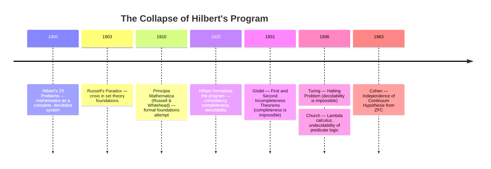
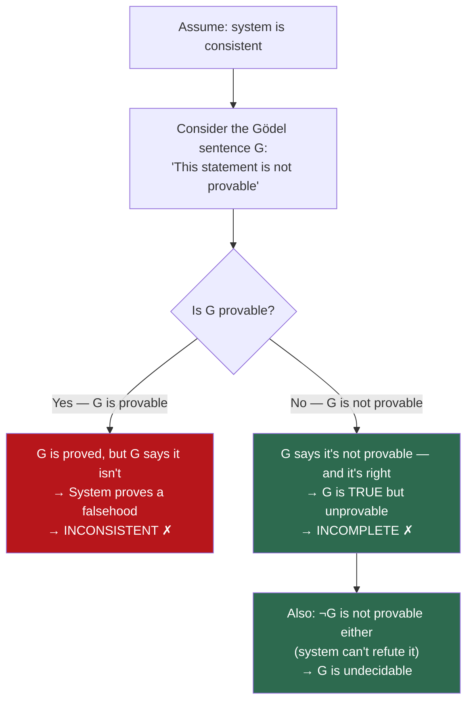
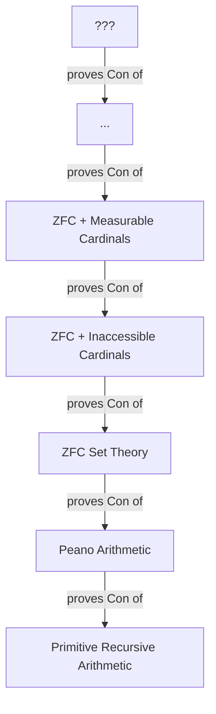

# Gödel's Incompleteness Theorems: The Day Mathematics Discovered Its Own Limits

## The Dream of a Perfect System

At the turn of the 20th century, mathematics was in crisis.

The discovery of paradoxes in set theory—most famously Russell's Paradox ("Does the set of all sets that do not contain themselves contain itself?")—had shaken the foundations of the entire discipline. If the basic language of mathematics could generate contradictions, how could anyone trust a proof?

In response, **David Hilbert**, the most influential mathematician of his era, proposed an audacious program. Hilbert's vision was to place all of mathematics on an unshakable foundation. His program had three core demands:

1. **Consistency**: Mathematics should never produce a contradiction. It should be impossible to prove both a statement $P$ and its negation $\neg P$ within the same system.
2. **Completeness**: Every true mathematical statement should be provable. There should be no "gaps"—no truths that the system acknowledges but cannot reach.
3. **Decidability**: There should exist a mechanical procedure—an algorithm—that can determine, for any given statement, whether it is true or false. Mathematics should be, in principle, automatable.

Hilbert's program was not idle philosophy. It was an engineering specification for the ultimate formal system: a symbolic machine that could, given enough time, derive every mathematical truth and never produce a falsehood.

Many of the greatest minds of the early 20th century worked toward this goal. The project felt achievable. Logic had been formalized by Frege, refined by Russell and Whitehead in *Principia Mathematica*, and axiomatized by Zermelo and Fraenkel. The machinery was in place. What remained, it seemed, was merely to verify that the machinery worked.

In 1931, Kurt Gödel—a quiet, 25-year-old logician from Vienna—destroyed the dream.



## The Language of Formal Systems

Before we can understand what Gödel proved, we need to understand the stage on which the proof takes place: **formal systems**.

### What Is a Formal System?

A formal system is, at its core, a game of symbols. It consists of four components:

1. **An alphabet**: A finite set of symbols. In arithmetic, these might include $0, S, +, \times, =, \neg, \land, \lor, \forall, \exists, (, )$ and variables $x, y, z, \ldots$
2. **A grammar (formation rules)**: Rules that define which strings of symbols are well-formed formulas (wffs). The string $\forall x (x + 0 = x)$ is well-formed; the string $) + \forall \neg ($ is not.
3. **Axioms**: A set of well-formed formulas that are accepted as true without proof. These are the starting points, the assumptions the system takes for granted.
4. **Inference rules**: Rules that allow you to derive new well-formed formulas from existing ones. For example, *modus ponens*: from $P$ and $P \implies Q$, derive $Q$.

A **proof** within a formal system is a finite sequence of well-formed formulas, where each formula is either an axiom or follows from previous formulas by an inference rule. The last formula in the sequence is the **theorem**—the statement being proved.

A **theorem** is any statement that has a proof. A statement can be *true* (in the intended interpretation) without being a theorem—this distinction is the heart of incompleteness.

### Peano Arithmetic: The Minimal System

The formal system most relevant to Gödel's proof is **Peano Arithmetic (PA)**, which captures the basic truths about the natural numbers $\{0, 1, 2, 3, \ldots\}$.

Peano Arithmetic is built from a small set of axioms:

1. $0$ is a natural number.
2. For every natural number $n$, $S(n)$ (the successor of $n$) is also a natural number.
3. There is no natural number $n$ such that $S(n) = 0$ (zero is not a successor).
4. If $S(n) = S(m)$, then $n = m$ (the successor function is injective).
5. **The axiom schema of induction**: If a property holds for $0$, and if whenever it holds for $n$ it also holds for $S(n)$, then it holds for all natural numbers.

From these axioms, combined with definitions of addition and multiplication, you can derive an extraordinary amount of mathematics: the commutativity and associativity of addition, the distributive law, the fundamental theorem of arithmetic (unique prime factorization), and much more.

PA is powerful enough to talk about numbers, addition, multiplication, primes, divisibility, and exponentiation. It is, for all practical purposes, the formal backbone of arithmetic.

Gödel's insight was that PA is powerful enough to talk about *itself*.

## Gödel Numbering: When Mathematics Becomes Self-Referential

### Encoding Syntax as Numbers

The most brilliant technical move in Gödel's proof is the invention of **Gödel numbering**—a scheme that assigns a unique natural number to every symbol, formula, and proof in the formal system.

The idea: since the formal system is built from a finite alphabet of symbols, and formulas are finite strings of symbols, and proofs are finite sequences of formulas, everything in the system can be encoded as a natural number.

The specific encoding uses the Fundamental Theorem of Arithmetic (every natural number has a unique prime factorization). Assign a number to each symbol:

| Symbol | Gödel Number |
|:------:|:------------:|
| $0$ | 1 |
| $S$ | 2 |
| $+$ | 3 |
| $\times$ | 4 |
| $=$ | 5 |
| $($ | 6 |
| $)$ | 7 |
| $\neg$ | 8 |
| $\forall$ | 9 |
| $x$ | 10 |

A formula like $\forall x (x = x)$ is a sequence of symbols: $\forall, x, (, x, =, x, )$. Its Gödel number is:

$$\ulcorner \forall x (x = x) \urcorner = 2^9 \cdot 3^{10} \cdot 5^{6} \cdot 7^{10} \cdot 11^{5} \cdot 13^{10} \cdot 17^{7}$$

This is a very large number, but it is unique—no other formula produces the same number, because prime factorization is unique.

A proof, being a sequence of formulas, gets encoded similarly: the Gödel numbers of the individual formulas are used as exponents of successive primes. Every proof has a unique Gödel number. Every theorem (the conclusion of a proof) corresponds to a number that is the last element of a sequence whose Gödel number encodes a valid proof.

### The Self-Reference Machine

Here is the critical consequence: **statements about the formal system become statements about natural numbers**.

- "Formula $\phi$ is well-formed" becomes a property of the natural number $\ulcorner \phi \urcorner$.
- "The sequence encoded by number $p$ is a valid proof of formula $\phi$" becomes a *numerical relation* between $p$ and $\ulcorner \phi \urcorner$.
- "Formula $\phi$ is provable" becomes "$\exists p$ such that $p$ encodes a valid proof of $\phi$"—an *arithmetic statement*.

And since Peano Arithmetic can express statements about natural numbers, it can express statements about *its own proofs*. 

The formal system can talk about itself. This is the key.

## The First Incompleteness Theorem

### The Gödel Sentence

Using Gödel numbering and a sophisticated technique called the **diagonalization lemma** (a generalization of Cantor's diagonal argument), Gödel constructed a specific sentence $G$ in the language of Peano Arithmetic with the following remarkable property:

$$G \iff \neg \text{Provable}(\ulcorner G \urcorner)$$

In plain language, $G$ says: **"I am not provable."**

Read that again. The sentence $G$ is a well-formed formula of Peano Arithmetic. It is a statement about natural numbers. But through the encoding of Gödel numbering, it simultaneously asserts its own unprovability.

This is not vague philosophical hand-waving. $G$ is a concrete formula. $\text{Provable}(\ulcorner G \urcorner)$ is a specific arithmetic predicate that says "there exists a natural number that encodes a valid proof of the formula whose Gödel number is $\ulcorner G \urcorner$." The negation says no such number exists.

### The Proof: A Dilemma with No Escape

Now we reason about $G$. Assume the system is **consistent** (it never proves both $P$ and $\neg P$).

**Case 1: Suppose $G$ is provable.**
Then there exists a proof of $G$. But $G$ says "I am not provable." So $G$ is false. But we just proved it—we derived a false statement. This means the system is **inconsistent** (it proves a falsehood). Contradiction with our assumption.

**Case 2: Suppose $\neg G$ is provable.**
Then we can prove "it is not the case that $G$ is unprovable," which means we can prove "$G$ is provable." But if $G$ is provable, by Case 1, the system is inconsistent. Contradiction again.

Wait—there's a subtlety. If $\neg G$ is provable, that means the system asserts "$G$ is provable" (i.e., there exists a proof of $G$). But there is no actual proof of $G$ (we assumed the system is consistent, so Case 1 doesn't apply). The system would be asserting the existence of a proof that doesn't exist—it would be **$\omega$-inconsistent** (a technical form of inconsistency about the natural numbers).

Gödel's original proof assumed $\omega$-consistency. J. Barkley Rosser later strengthened the result in 1936, showing that mere consistency suffices.

**Conclusion:**

If Peano Arithmetic (or any sufficiently powerful consistent formal system) is consistent, then:

1. $G$ is **not provable** (the system cannot prove $G$).
2. $\neg G$ is **not provable** (the system cannot prove $\neg G$ either).
3. $G$ is **true** (in the standard model of natural numbers, because $G$ says "I am not provable," and indeed it is not).

There exists a true arithmetic statement that the system **can never prove**. The system is **incomplete**.

The dilemma has only two exits, and both destroy something we want:



### The Formal Statement

**Gödel's First Incompleteness Theorem**: For any consistent formal system $F$ that is capable of expressing basic arithmetic, there exist statements in the language of $F$ that are true (in the standard model of $\mathbb{N}$) but not provable in $F$.

No matter how many axioms you add, no matter how you strengthen the system, as long as it remains consistent and can express arithmetic, there will always be truths beyond its reach.

## The Second Incompleteness Theorem

### The System Cannot Vouch for Itself

The Second Incompleteness Theorem is, in some ways, even more devastating than the first.

Gödel showed that the consistency of a formal system can be expressed as an arithmetic statement within the system itself. Using Gödel numbering, "the system is consistent" translates to: "there is no natural number that encodes a proof of $0 = 1$." This is the statement $\text{Con}(F)$:

$$\text{Con}(F) \iff \neg \exists p : \text{Proof}(p, \ulcorner 0 = 1 \urcorner)$$

Gödel proved that:

**Gödel's Second Incompleteness Theorem**: If $F$ is a consistent formal system capable of expressing basic arithmetic, then $F$ cannot prove its own consistency. That is, $\text{Con}(F)$ is not a theorem of $F$.

The formal system cannot prove that it will never produce a contradiction. If it *could* prove its own consistency, it would be inconsistent (a beautiful, terrifying circularity).

This was the fatal blow to Hilbert's program. Hilbert wanted to prove the consistency of mathematics using only "safe," finitary methods—methods that could themselves be formalized within a system like PA. Gödel showed that this is impossible. To prove the consistency of PA, you need a *stronger* system. But then you need an even stronger system to prove the consistency of *that* system. The chain never ends.

## The Axiomatic Landscape

### Peano Arithmetic (PA)

PA is the natural habitat of Gödel's theorems. It is strong enough to express all of basic number theory, yet—as Gödel showed—it cannot prove all truths about the natural numbers.

PA has specific, well-known Gödel sentences. One of the most celebrated is the **Paris-Harrington theorem** (1977): a statement about combinatorics that is true in the standard model of $\mathbb{N}$ but unprovable in PA. It was the first "natural" (non-self-referential) mathematical statement shown to be independent of PA.

### Zermelo-Fraenkel Set Theory with Choice (ZFC)

**ZFC** is the standard axiomatic foundation of modern mathematics. Almost all of mathematics—analysis, algebra, topology, measure theory—can be formalized within ZFC.

ZFC is far more powerful than PA. It can prove the consistency of PA (since it can construct a model of PA within set theory). But by Gödel's Second Theorem, ZFC cannot prove its own consistency.

ZFC has its own famous independent statements—truths that are neither provable nor disprovable within the system:

- **The Continuum Hypothesis (CH)**: "There is no set whose cardinality is strictly between that of the natural numbers and the real numbers." Gödel himself showed (1940) that CH is *consistent* with ZFC. Paul Cohen later showed (1963) that the negation of CH is also consistent with ZFC. The Continuum Hypothesis is **independent** of ZFC—it is neither provable nor disprovable.

- **The Axiom of Choice (AC)**: If we work in ZF (without Choice), the Axiom of Choice is independent. You can consistently add it or its negation. Mathematics branches depending on this choice.

- **Large Cardinal Axioms**: Statements asserting the existence of extremely large infinite sets (inaccessible cardinals, measurable cardinals, etc.) are independent of ZFC. They form a hierarchy of progressively stronger systems, each capable of proving the consistency of the ones below it, but never its own.

### The Hierarchy of Consistency Strength

Gödel's theorems create a beautiful and disturbing hierarchy:



Each system can prove the consistency of the systems below it, but never its own. There is no "final" system that can certify its own soundness. The tower of consistency proofs extends upward without end.

This is not a limitation of our cleverness. It is a **theorem**. No amount of ingenuity can circumvent it.

### Alternative Foundations

The independence results have led some mathematicians to explore alternative axiomatic frameworks:

**Constructive Mathematics (Intuitionism)**: Rejects the law of excluded middle ($P \lor \neg P$). In constructive math, to prove that something exists, you must exhibit it—you cannot merely show that its non-existence leads to a contradiction. Gödel's theorems still apply, but the philosophical interpretation changes.

**New Foundations (NF)**: Proposed by Quine, NF takes a different approach to avoiding Russell's Paradox. It has an unusual relationship with ZFC—some versions of NF have been shown to be consistent relative to ZFC (Randall Holmes, 2024), while others remain open.

**Homotopy Type Theory (HoTT)**: A modern foundation inspired by algebraic topology and computer science. It replaces sets with "types" and equality with "paths." While HoTT is subject to Gödel's theorems (any sufficiently powerful system is), it offers a different perspective on what foundations should look like.

Each of these systems makes different choices about which axioms to accept, and each lives with its own version of incompleteness. The choice of foundation is not a purely technical decision—it carries philosophical weight about what "proof" and "truth" mean.

## The Connection to Computability: Turing and the Halting Problem

### From Gödel to Turing

In 1936, five years after Gödel's paper, Alan Turing independently attacked the third pillar of Hilbert's program: **decidability**. Hilbert had asked: is there an algorithm that can determine, for any mathematical statement, whether it is true or false? This was the *Entscheidungsproblem* (decision problem).

Turing first had to define what an "algorithm" was. He invented the **Turing Machine**—a mathematical model of computation that captures exactly what it means for a process to be mechanical and deterministic.

Then he proved something that echoes Gödel perfectly:

**The Halting Problem**: There is no Turing Machine that can determine, for every program-input pair, whether the program halts (terminates) or runs forever.

The proof is strikingly similar to Gödel's:

1. **Assume** a halting oracle $H(P, I)$ exists that returns `true` if program $P$ halts on input $I$, and `false` otherwise.
2. **Construct** a new program $D$ that, given a program $P$ as input, does the following: if $H(P, P)$ says $P$ halts on itself, then $D$ loops forever. If $H(P, P)$ says $P$ loops, then $D$ halts.
3. **Ask**: what does $H(D, D)$ return?
   - If $H(D, D) = \text{true}$ (claims $D$ halts on $D$), then by construction, $D$ loops forever. Contradiction.
   - If $H(D, D) = \text{false}$ (claims $D$ loops on $D$), then by construction, $D$ halts. Contradiction.
4. **Conclusion**: $H$ cannot exist.

The structure is identical to Gödel's: self-reference creates a dilemma that the system cannot resolve. Gödel used a sentence that says "I am not provable." Turing used a program that does the opposite of what the oracle predicts.

### The Deep Equivalence

Gödel's incompleteness and Turing's undecidability are not merely analogous—they are mathematically equivalent. Gödel showed that there are true statements that no formal system can prove. Turing showed that there are questions about programs that no algorithm can answer.

Both results demonstrate the same fundamental limitation: **self-referential systems cannot fully analyze themselves**.

```python
def halting_oracle(program, input_data):
    """
    This function cannot exist.
    
    If it did, we could construct a paradox:
    """
    pass  # Impossible to implement

def diagonalizer(program):
    """
    The paradoxical program:
    If the oracle says I halt, I loop.
    If the oracle says I loop, I halt.
    """
    if halting_oracle(program, program):
        while True:  # Loop forever
            pass
    else:
        return  # Halt immediately

# What happens when we call diagonalizer(diagonalizer)?
# - If the oracle says it halts → it loops. Contradiction.
# - If the oracle says it loops → it halts. Contradiction.
# Therefore, the oracle cannot exist.
```

This is not merely a theoretical curiosity. The undecidability of the Halting Problem has concrete consequences for software engineering. It means:

- No program can reliably detect all infinite loops in other programs.
- No compiler can determine, for all programs, whether they will terminate.
- No static analysis tool can guarantee the absence of all bugs.

Every time you see a "this may take a while..." spinner, you are confronting undecidability.

## What Incompleteness Does Not Say

Gödel's theorems are among the most misunderstood results in all of mathematics. It is worth being explicit about what they do **not** say.

**Incompleteness does not mean mathematics is unreliable.** The vast majority of mathematical statements we care about are provable in standard systems. Gödel sentences are exotic, self-referential constructions. The theorems do not cast doubt on the correctness of proven results.

**Incompleteness does not mean "anything goes."** A consistent system cannot prove contradictions. Incompleteness means there are truths it cannot reach—not that it can reach falsehoods.

**Incompleteness does not apply to all formal systems.** It applies specifically to systems that are (a) consistent, (b) capable of expressing basic arithmetic, and (c) effectively axiomatized (there is an algorithm to determine whether a given formula is an axiom). Weaker systems—like propositional logic or Presburger arithmetic (arithmetic without multiplication)—are complete and decidable.

**Incompleteness does not mean human minds transcend formal systems.** This is a popular but contentious philosophical claim (advanced by Roger Penrose, among others). The argument goes: "Gödel showed that no formal system can prove all truths, but humans can 'see' that the Gödel sentence is true, therefore human minds are not formal systems." The flaw is that we "see" the truth of $G$ only by assuming the consistency of the system—an assumption we cannot prove within the system. Our "seeing" may itself be a meta-level operation that is subject to its own limitations.

**Incompleteness does not mean mathematics is subjective.** The Gödel sentence is objectively true in the standard model of the natural numbers. It is only unprovable *within a specific formal system*. Stronger systems can prove it—but they generate their own unprovable truths.

## The Philosophical Reverberations

### Platonism vs. Formalism

Gödel himself was a mathematical **Platonist**. He believed that mathematical objects (like the natural numbers) exist independently of human thought, and that mathematical truth is objective. Incompleteness, for Gödel, was evidence that truth transcends provability—that the mathematical world is richer than any formal system can capture.

**Formalists** (followers of Hilbert) interpret incompleteness differently. For them, mathematics *is* the formal system. If a statement is not provable, it is simply not a theorem. The notion of "truth" independent of provability is, for the formalist, either meaningless or metaphysical.

The debate is unresolved. Incompleteness does not settle the philosophy of mathematics—it deepens it.

### The Influence on Computer Science

Gödel's work, together with Turing's and Church's, laid the intellectual foundation for computer science. The concept of a formal system—a finite set of rules operating on symbols—is precisely the concept of a program. Gödel numbering—encoding structures as numbers—is precisely the concept of data representation.

When you write a program that manipulates other programs (a compiler, an interpreter, a debugger), you are using Gödel numbering in practice. When you encounter a problem that no algorithm can solve (the Halting Problem, Rice's Theorem, the Post Correspondence Problem), you are encountering incompleteness in computational form.

The incompleteness theorems taught us that there are fundamental limits to what symbolic manipulation can achieve. This lesson is as relevant to AI and machine learning as it is to pure mathematics. Any AI system that reasons formally—that manipulates symbols according to rules—is subject to Gödel's constraints.

## The Eternal Incompleteness

In the end, Gödel's theorems tell us something about the nature of knowledge itself. Any sufficiently rich system of thought—one capable of reflecting on its own structure—will inevitably encounter questions it cannot answer from within. This is not a defect. It is a feature of systems powerful enough to be interesting.

Hilbert wanted a fortress—an impenetrable, self-certifying foundation for all of mathematics. What Gödel showed is that the mathematical universe is not a fortress. It is an open landscape, extending beyond any wall we can build. Every formal system is a window into that landscape—revealing an extraordinary view, but never the entire panorama.

The truths are out there. No single system can reach them all. And that, perhaps, is the most profound mathematical truth of all.

---

## Going Deeper

**Books:**

- Nagel, E., & Newman, J. R. (2001). *Gödel's Proof.* New York University Press.
  - The most accessible book-length treatment of the proof. If you read one book on Gödel, make it this one.

- Smith, P. (2013). *An Introduction to Gödel's Theorems.* 2nd edition. Cambridge University Press.
  - The thorough, rigorous treatment. Covers all the technical details including the diagonalization lemma, Gödel numbering, and the derivability conditions. For those who want the full formal machinery.

- Franzén, T. (2005). *Gödel's Theorem: An Incomplete Guide to Its Use and Abuse.* A K Peters.
  - A brilliant corrective to the many misinterpretations of incompleteness in philosophy, AI, and popular culture. Essential reading for anyone who wants to cite Gödel correctly.

- Hofstadter, D. R. (1979). *Gödel, Escher, Bach: An Eternal Golden Braid.* Basic Books.
  - The legendary exploration of self-reference, recursion, and consciousness through the lens of Gödel's theorems, Escher's art, and Bach's music. Not a textbook—a work of art.

**Online Resources:**

- [Peter Smith's Gödel Without (Too Many) Tears](https://www.logicmatters.net/igt/) — Free lecture notes and supplementary materials from the author of *An Introduction to Gödel's Theorems*. An excellent starting point.
- [Stanford Encyclopedia of Philosophy: Gödel's Incompleteness Theorems](https://plato.stanford.edu/entries/goedel-incompleteness/) — A thorough, peer-reviewed philosophical treatment with full bibliography.
- [Wolfram MathWorld: Gödel's Incompleteness Theorem](https://mathworld.wolfram.com/GoedelsIncompletenessTheorem.html) — Concise mathematical summary with formal statements.
- [The Hilbert Program](https://plato.stanford.edu/entries/hilbert-program/) — Stanford Encyclopedia entry on the program that Gödel destroyed.

**Videos:**

- ["Gödel's Incompleteness Theorem"](https://www.youtube.com/watch?v=O4ndIDcDSGc) by Veritasium — A well-produced visual walkthrough of the proof's core ideas, including Gödel numbering and self-reference.
- ["Math's Fundamental Flaw"](https://www.youtube.com/watch?v=HeQX2HjkcNo) by Veritasium — A broader narrative connecting Hilbert's program, Gödel, Turing, and the limits of computation.
- ["Gödel's Incompleteness (extra footage)"](https://www.youtube.com/watch?v=mccoBBf0VDM) by Numberphile — Marcus du Sautoy explains the theorems with characteristic clarity.

**Original Papers:**

- Gödel, K. (1931). ["Über formal unentscheidbare Sätze der Principia Mathematica und verwandter Systeme I."](https://link.springer.com/article/10.1007/BF01700692) *Monatshefte für Mathematik und Physik*, 38, 173–198.
  - The paper that changed everything. Available in English translation in van Heijenoort's *From Frege to Gödel*.

- Turing, A. M. (1936). ["On Computable Numbers, with an Application to the Entscheidungsproblem."](https://www.cs.virginia.edu/~robins/Turing_Paper_1936.pdf) *Proceedings of the London Mathematical Society*, 42(1), 230–265.
  - Turing's response to the Entscheidungsproblem, introducing the Turing Machine and proving the undecidability of the Halting Problem.

- Cohen, P. J. (1963). "The independence of the continuum hypothesis." *Proceedings of the National Academy of Sciences*, 50(6), 1143–1148.
  - The forcing technique that completed the independence proof of CH from ZFC.

**Key Question for Contemplation:**

If every sufficiently powerful formal system is incomplete, and we can always build a stronger system to prove what the weaker one cannot—but the stronger system generates its own blind spots—does mathematical truth have a fixed, objective landscape that we are exploring piece by piece? Or are we constructing an infinite tower that we can never see from above?
