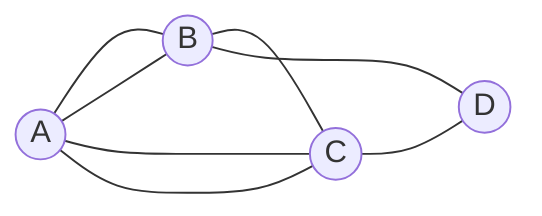
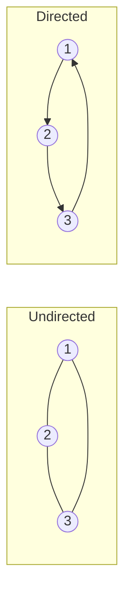
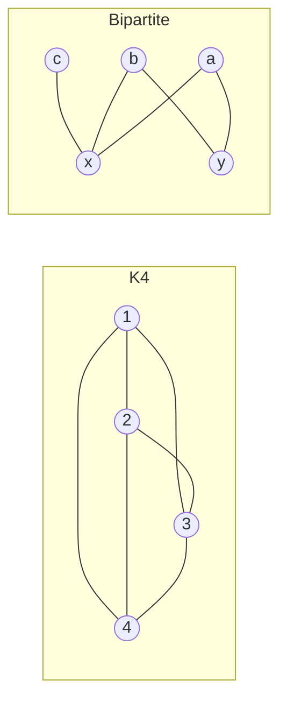
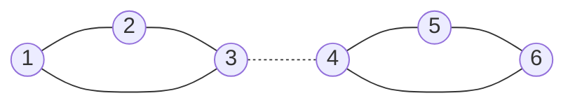

# Graph Theory: The Mathematics of Connections

In the summer of 1736, Leonhard Euler wrote a letter about a puzzle that the residents of Konigsberg, Prussia, had been arguing over for years. The city sat on the Pregel River, which split around two large islands. Seven bridges connected the islands to each other and to the mainland. The question was simple: could a citizen walk through the city, crossing each bridge exactly once, and return home?

Euler solved it -- not by trying all possible routes, but by proving that no solution could exist. His argument was extraordinary not for what it calculated, but for what it *ignored*. He threw away distances, angles, the shapes of the islands, the lengths of the bridges. All that mattered was which landmasses were connected and how many connections each had. In doing so, he invented a new kind of mathematics.

That mathematics is graph theory. It is the study of objects (vertices) and the connections between them (edges). It is the language spoken by Google's PageRank algorithm, by social network analysis, by molecular biology, by circuit design, by neural networks that learn on structured data. If you have read the posts on [PageRank and eigenvectors](/blog/pagerank-eigenvectors) or [graph neural networks](/blog/graph-neural-networks-learning-structured-data) on this blog, you have already been using graph theory -- those posts assumed you knew the fundamentals. This post builds that foundation from scratch.

---

## Seven Bridges

Konigsberg had four landmasses -- two riverbanks (call them $A$ and $D$) and two islands ($B$ and $C$). The seven bridges connected them as follows: two bridges from $A$ to $B$, two from $A$ to $C$, one from $B$ to $C$, one from $B$ to $D$, and one from $C$ to $D$.

Here is the structure as a graph. Each landmass becomes a node. Each bridge becomes an edge:



Euler's insight was purely structural. He observed that when you walk across a bridge and arrive at a landmass, you "use up" one bridge entering and will need another to leave. So for any landmass that is not your starting or ending point, the number of bridges touching it must be even -- you enter and leave in pairs.

Count the bridges (edges) touching each node:
- $A$: 5 bridges (odd)
- $B$: 3 bridges (odd)
- $C$: 3 bridges (odd)
- $D$: 2 bridges (even)

Wait -- $D$ has only 2 bridges. But $A$, $B$, and $C$ each have an odd number. For a walk crossing every bridge exactly once to exist, at most two nodes can have odd degree (those would be the start and end of the walk). With *three* odd-degree nodes, the walk is impossible.

This argument -- clean, structural, requiring no computation beyond counting -- was the birth of graph theory. The key object was not a map but a **graph**: a collection of vertices connected by edges, stripped of all geometric information. What matters is the pattern of connections, nothing else.

### Euler's Theorem on Traversability

Euler's result generalizes neatly. Let $G$ be a connected graph (every vertex can reach every other vertex through some path).

**Theorem (Euler, 1736).** A connected graph $G$ has a walk that traverses every edge exactly once if and only if $G$ has at most two vertices of odd degree. If $G$ has exactly zero vertices of odd degree, the walk is a *circuit* (it returns to its starting point). If $G$ has exactly two vertices of odd degree, the walk is a *path* from one odd-degree vertex to the other.

The "only if" direction follows from Euler's parity argument above. The "if" direction requires a constructive proof -- showing that you can always build such a walk when the degree condition holds -- which was completed rigorously by Carl Hierholzer in 1873.

---

## The Language of Graphs

Let us now formalize the vocabulary that Euler's problem introduced informally.

### Vertices and Edges

A **graph** $G = (V, E)$ consists of a finite set $V$ of **vertices** (also called nodes) and a set $E$ of **edges**, where each edge connects a pair of vertices. In an **undirected graph**, the edge between $u$ and $v$ is the same as the edge between $v$ and $u$. In a **directed graph** (or digraph), edges have direction: $(u, v)$ means "from $u$ to $v$," and $(v, u)$ is a different edge.



### Degree

The **degree** of a vertex $v$, written $\deg(v)$, is the number of edges incident to $v$. In a directed graph, we distinguish **in-degree** (edges arriving at $v$) and **out-degree** (edges leaving $v$).

### Adjacency

Two vertices are **adjacent** if an edge connects them. The **adjacency matrix** $A$ of a graph on $n$ vertices is the $n \times n$ matrix where $A_{ij} = 1$ if vertices $i$ and $j$ are adjacent, and $A_{ij} = 0$ otherwise. For undirected graphs, $A$ is symmetric. This matrix is the entry point for spectral methods -- eigenvalue analysis of $A$ reveals deep structural properties of the graph, as explored in the [PageRank post](/blog/pagerank-eigenvectors).

### Special Graph Types

A **weighted graph** attaches a numerical weight to each edge (representing cost, distance, capacity, or strength). A **bipartite graph** has vertices that can be divided into two disjoint sets such that every edge connects a vertex in one set to a vertex in the other -- no edges within the same set. Recommendation systems are fundamentally bipartite graphs (users on one side, items on the other). A **multigraph** allows multiple edges between the same pair of vertices -- like the Konigsberg bridge graph, which had two bridges between $A$ and $B$.

A **complete graph** $K_n$ on $n$ vertices has every possible edge: each vertex connects to every other vertex. $K_n$ has $\binom{n}{2} = \frac{n(n-1)}{2}$ edges.



---

## Paths, Walks, and Cycles

The language of "getting from here to there" in a graph requires precision.

A **walk** in a graph is a sequence of vertices where consecutive vertices are connected by edges. Vertices and edges may repeat. A **trail** is a walk with no repeated edges. A **path** is a walk with no repeated vertices (and therefore no repeated edges). A **cycle** is a path that returns to its starting vertex.

These distinctions matter. Euler's question was about trails (no repeated edges but vertices may repeat). A different question -- can you visit every *vertex* exactly once? -- leads to a completely different problem.

### Eulerian Paths and Circuits

We have already stated Euler's theorem: a connected graph has an Eulerian trail if and only if it has zero or two odd-degree vertices. The algorithmic version (Hierholzer's algorithm) runs in $O(|E|)$ time -- linear in the number of edges. This is efficient. You can find an Eulerian circuit in a million-edge graph in milliseconds.

Let us verify this computationally on a small example:

```python
import networkx as nx

# Build the Konigsberg bridge graph (multigraph)
G = nx.MultiGraph()
G.add_edges_from([
    ('A', 'B'), ('A', 'B'),   # two bridges A-B
    ('A', 'C'), ('A', 'C'),   # two bridges A-C
    ('B', 'C'),                # one bridge B-C
    ('B', 'D'),                # one bridge B-D
    ('C', 'D'),                # one bridge C-D
])

# Count odd-degree vertices
odd_degree = [v for v in G.nodes() if G.degree(v) % 2 != 0]
print(f"Odd-degree vertices: {odd_degree}")
print(f"Count: {len(odd_degree)}")
print(f"Eulerian path exists: {len(odd_degree) in [0, 2]}")
# Output:
# Odd-degree vertices: ['A', 'B', 'C']
# Count: 3
# Eulerian path exists: False
```

Three odd-degree vertices. No Eulerian path. Euler was right.

### Hamiltonian Paths: The Hard Version

A **Hamiltonian path** visits every *vertex* exactly once. A **Hamiltonian cycle** does so and returns to the start. Unlike Eulerian paths, there is no simple degree-based criterion for Hamiltonicity. Determining whether a graph has a Hamiltonian path is NP-complete.

This is a striking contrast. Two questions that sound similar -- "visit every edge once" versus "visit every vertex once" -- sit on opposite sides of one of the deepest divides in computational complexity. The first is solvable in linear time. The second is in the same complexity class as the Traveling Salesman Problem, Boolean satisfiability, and [offline Tetris](/blog/tetris-is-np-complete-hard-math-in-a-classic-game). If you could solve one of them efficiently, you could solve all of them, and you would have proved P = NP.

---

## Trees: Graphs Without Cycles

Remove all the loops and redundancy from a graph, and what remains -- if you keep everything connected -- is a **tree**.

**Definition.** A **tree** is a connected, acyclic graph. An equivalent definition: a tree on $n$ vertices is a connected graph with exactly $n - 1$ edges. Another equivalent: a tree is a graph where there is exactly one path between any pair of vertices.

These three characterizations are all equivalent, and proving their equivalence is a standard exercise in graph theory. The intuition is that a connected graph needs at least $n - 1$ edges (otherwise some vertex is isolated from the rest), and each additional edge beyond $n - 1$ necessarily creates a cycle.

### Properties of Trees

| Property | Statement |
|----------|-----------|
| Edge count | A tree on $n$ vertices has exactly $n - 1$ edges |
| Unique paths | Between any two vertices, there is exactly one path |
| Leaf existence | Every tree with $n \geq 2$ has at least two leaves (degree-1 vertices) |
| Edge removal | Removing any edge disconnects the tree |
| Edge addition | Adding any edge creates exactly one cycle |

### Spanning Trees

A **spanning tree** of a graph $G$ is a subgraph that is a tree and includes every vertex of $G$. It is the minimal connected subgraph -- the skeleton of the graph with all redundancy stripped away.

Every connected graph has a spanning tree. Finding one is straightforward: start with all vertices and no edges, then add edges one by one, skipping any edge that would create a cycle. This is essentially what Kruskal's algorithm does when finding a *minimum* spanning tree (one that minimizes total edge weight).

### Cayley's Formula

How many labeled trees can you build on $n$ vertices? The answer, proved by Arthur Cayley in 1889, is unexpectedly elegant.

**Theorem (Cayley).** The number of labeled trees on $n$ vertices is $n^{n-2}$.

For $n = 2$: $2^0 = 1$ tree (the single edge connecting them). For $n = 3$: $3^1 = 3$ trees. For $n = 4$: $4^2 = 16$ trees. The growth is rapid -- for $n = 10$, there are $10^8 = 100{,}000{,}000$ different labeled trees.

The most elegant proof uses **Prufer sequences**: a bijection between labeled trees on $n$ vertices and sequences of length $n - 2$ from the alphabet $\{1, 2, \ldots, n\}$. Since there are exactly $n^{n-2}$ such sequences, the formula follows.

```python
# Verify Cayley's formula for small n
import networkx as nx
from itertools import combinations

def count_labeled_trees(n):
    """Count spanning trees of the complete graph K_n (= labeled trees on n vertices)."""
    K = nx.complete_graph(n)
    # Kirchhoff's matrix tree theorem: any cofactor of the Laplacian
    import numpy as np
    L = nx.laplacian_matrix(K).toarray().astype(float)
    # Delete row 0 and col 0, take determinant
    cofactor = np.linalg.det(L[1:, 1:])
    return int(round(cofactor))

for n in range(2, 8):
    count = count_labeled_trees(n)
    cayley = n ** (n - 2)
    print(f"n={n}: counted={count}, Cayley={cayley}, match={count == cayley}")
# Output:
# n=2: counted=1, Cayley=1, match=True
# n=3: counted=3, Cayley=3, match=True
# n=4: counted=16, Cayley=16, match=True
# n=5: counted=125, Cayley=125, match=True
# n=6: counted=1296, Cayley=1296, match=True
# n=7: counted=16807, Cayley=16807, match=True
```

Trees are everywhere in computer science: file systems, decision trees in machine learning, parse trees in compilers, spanning tree protocols in network switches, and the hierarchical structure of HTML documents. They are the simplest connected graphs, yet they encode the concept of hierarchy itself.

---

## Planarity and the Four Color Theorem

Can you draw a graph on a flat surface without any edges crossing? If so, the graph is **planar**.

This sounds like a drawing problem, but it is a structural one. Planarity is an intrinsic property of the graph, not of any particular drawing. The complete graph $K_4$ is planar (you can draw it as a triangle with a vertex in the center). The complete graph $K_5$ is not -- no matter how cleverly you rearrange the vertices, at least two edges must cross.

### Euler's Polyhedron Formula

For any connected planar graph drawn in the plane (with no edge crossings), the relationship between vertices ($V$), edges ($E$), and faces ($F$, the regions bounded by edges, including the unbounded exterior face) satisfies:

$$V - E + F = 2$$

This is **Euler's formula for planar graphs**, and it is one of the most beautiful identities in mathematics. Originally discovered in the context of polyhedra (where vertices, edges, and faces have their geometric meaning), it extends perfectly to planar graphs.

**Example.** A triangle: $V = 3$, $E = 3$, $F = 2$ (interior and exterior). Indeed, $3 - 3 + 2 = 2$.

**Corollary.** For a simple, connected, planar graph with $V \geq 3$: $E \leq 3V - 6$.

*Proof.* Each face is bounded by at least 3 edges, and each edge borders at most 2 faces, so $2E \geq 3F$. Substituting $F \leq \frac{2E}{3}$ into Euler's formula: $V - E + \frac{2E}{3} \geq 2$, which gives $E \leq 3V - 6$. $\square$

This corollary immediately proves that $K_5$ is non-planar: $K_5$ has $V = 5$ and $E = 10$, but $3(5) - 6 = 9 < 10$.

```python
# Verify Euler's formula for planar graphs
examples = [
    ("Triangle", 3, 3, 2),
    ("Square", 4, 4, 2),
    ("Tetrahedron (K4)", 4, 6, 4),
    ("Cube", 8, 12, 6),
    ("Petersen? K5", 5, 10, None),  # Non-planar
]

for name, V, E, F in examples:
    if F is not None:
        euler = V - E + F
        print(f"{name}: V={V}, E={E}, F={F}, V-E+F={euler}")
    else:
        max_edges = 3 * V - 6
        print(f"{name}: V={V}, E={E}, max planar edges={max_edges}, "
              f"planar={'Yes' if E <= max_edges else 'No'}")
# Output:
# Triangle: V=3, E=3, F=2, V-E+F=2
# Square: V=4, E=4, F=2, V-E+F=2
# Tetrahedron (K4): V=4, E=6, F=4, V-E+F=2
# Cube: V=8, E=12, F=6, V-E+F=2
# K5: V=5, E=10, max planar edges=9, planar=No
```

### Kuratowski's Theorem

In 1930, Kazimierz Kuratowski found the complete characterization of planarity.

**Theorem (Kuratowski, 1930).** A graph is planar if and only if it contains no subgraph that is a subdivision of $K_5$ (complete graph on 5 vertices) or $K_{3,3}$ (complete bipartite graph with 3 vertices on each side).

A **subdivision** of a graph replaces edges with paths -- inserting new vertices along edges. So a graph is non-planar precisely when it "contains" $K_5$ or $K_{3,3}$ in disguise, possibly with extra vertices along the edges.

$K_{3,3}$ is the graph underlying the classic "three utilities" puzzle: connect three houses to three utilities (water, gas, electricity) without any wires crossing. It cannot be done -- $K_{3,3}$ is non-planar. The Euler formula corollary for triangle-free graphs (where each face has at least 4 edges) gives $E \leq 2V - 4$. For $K_{3,3}$: $V = 6$, $E = 9$, but $2(6) - 4 = 8 < 9$.

### The Four Color Theorem

In 1852, Francis Guthrie noticed that he could color the counties of a map of England with just four colors such that no two adjacent counties shared the same color. He conjectured that four colors suffice for *any* map.

This conjecture resisted proof for 124 years. Augustus De Morgan, Arthur Cayley, Alfred Kempe, and Percy Heawood all worked on it. Kempe published a "proof" in 1879 that stood for eleven years before Heawood found a flaw in 1890. (Heawood did salvage Kempe's argument to prove the Five Color Theorem -- five colors always suffice.)

The resolution came in 1976, when Kenneth Appel and Wolfgang Haken at the University of Illinois proved the theorem using a computer. Their proof reduced the problem to 1,936 configurations, each of which had to be checked by machine -- over 1,000 hours of computation. It was the first major theorem whose proof required a computer, and it ignited a philosophical debate that still simmers: does a proof that no human can verify in a lifetime count as a proof?

**Theorem (Appel and Haken, 1976).** Every planar graph is 4-colorable.

The computer-assisted nature of the proof troubled many mathematicians. In 1997, Robertson, Sanders, Seymour, and Thomas published a simpler proof reducing the cases to 633. In 2005, Georges Gonthier formally verified the theorem using the Coq proof assistant, putting to rest most lingering doubts about correctness.

The Four Color Theorem is really a statement about graphs, not maps. A map becomes a **planar graph** by treating each region as a vertex and connecting two vertices if their regions share a border. Coloring the map is then coloring the graph -- assigning colors to vertices such that no two adjacent vertices share a color.

---

## Graph Coloring

The Four Color Theorem is a special case of a broader problem: **graph coloring**.

A **proper coloring** of a graph assigns a color (or label) to each vertex such that no two adjacent vertices share the same color. The **chromatic number** $\chi(G)$ of a graph $G$ is the minimum number of colors needed for a proper coloring.

Computing $\chi(G)$ exactly is NP-hard in general, but for specific graph families we know the answer:
- A tree: $\chi(T) = 2$ (bipartite -- alternate two colors along the tree)
- A cycle of even length: $\chi(C_{2k}) = 2$
- A cycle of odd length: $\chi(C_{2k+1}) = 3$
- A complete graph: $\chi(K_n) = n$ (every vertex is adjacent to every other)
- Any planar graph: $\chi(G) \leq 4$ (the Four Color Theorem)

### Greedy Coloring

The simplest coloring algorithm is greedy: process vertices in some order, and assign each vertex the smallest color not already used by its neighbors. This never uses more than $\Delta(G) + 1$ colors, where $\Delta(G)$ is the maximum degree. Brooks' theorem tightens this: if $G$ is connected and not a complete graph or an odd cycle, then $\chi(G) \leq \Delta(G)$.

### Applications of Graph Coloring

Graph coloring is not an abstract exercise. It solves real problems under a thin disguise:

| Problem | Graph Model | Coloring Means |
|---------|-------------|---------------|
| Exam scheduling | Exams are vertices, edges connect exams with shared students | Time slots |
| Register allocation | Variables are vertices, edges connect variables alive at the same time | CPU registers |
| Frequency assignment | Transmitters are vertices, edges connect those that would interfere | Radio frequencies |
| Map coloring | Regions are vertices, edges connect bordering regions | Colors |

In each case, "no two adjacent vertices share a color" translates to "no two conflicting entities share a resource."

---

## Degree Sequences and the Handshaking Lemma

One of the most elementary yet useful results in graph theory concerns the sum of vertex degrees.

**Theorem (Handshaking Lemma).** In any undirected graph $G = (V, E)$:

$$\sum_{v \in V} \deg(v) = 2|E|$$

*Proof.* Each edge $\{u, v\}$ contributes 1 to $\deg(u)$ and 1 to $\deg(v)$, for a total contribution of 2 to the sum. Summing over all edges gives $2|E|$. $\square$

**Corollary.** Every graph has an even number of odd-degree vertices.

*Proof.* The total degree sum $2|E|$ is even. The sum of degrees from even-degree vertices is even. Therefore the sum of degrees from odd-degree vertices must also be even. Since each odd-degree vertex contributes an odd number, there must be an even count of them. $\square$

This is why Euler could count to three odd-degree vertices in the Konigsberg graph and immediately know the walk was impossible -- a single odd-degree vertex beyond two is enough to rule it out.

### The Erdos-Gallai Theorem

Given a sequence of numbers, can it be the degree sequence of some graph? Not every sequence works -- the Handshaking Lemma already tells us the sum must be even. But more conditions are needed.

**Theorem (Erdos and Gallai, 1960).** A non-increasing sequence $d_1 \geq d_2 \geq \cdots \geq d_n$ of non-negative integers is the degree sequence of a simple graph if and only if the sum is even and for each $k \in \{1, \ldots, n\}$:

$$\sum_{i=1}^{k} d_i \leq k(k-1) + \sum_{i=k+1}^{n} \min(d_i, k)$$

The left side is the total degree demanded by the $k$ highest-degree vertices. The right side is the maximum degree they could have: $k(k-1)$ comes from connecting all $k$ vertices to each other, and the second sum accounts for how many additional connections the remaining $n - k$ vertices can provide.

```python
def is_graphic_sequence(seq):
    """Check if a degree sequence is realizable (Erdos-Gallai)."""
    seq = sorted(seq, reverse=True)
    n = len(seq)
    if sum(seq) % 2 != 0:
        return False
    for k in range(1, n + 1):
        left = sum(seq[:k])
        right = k * (k - 1) + sum(min(d, k) for d in seq[k:])
        if left > right:
            return False
    return True

# Test cases
sequences = [
    ([3, 3, 3, 3], "K4"),
    ([2, 2, 2, 2, 2], "C5"),
    ([4, 3, 2, 1], "sum is odd"),
    ([3, 3, 3, 1], "even sum, but is it graphic?"),
    ([5, 1, 1, 1, 1, 1], "star graph"),
]

for seq, label in sequences:
    result = is_graphic_sequence(seq)
    print(f"{seq} ({label}): {'graphic' if result else 'not graphic'}")
# Output:
# [3, 3, 3, 3] (K4): graphic
# [2, 2, 2, 2, 2] (C5): graphic
# [4, 3, 2, 1] (sum is odd): not graphic
# [3, 3, 3, 1] (even sum, but is it graphic?): not graphic
# [5, 1, 1, 1, 1, 1] (star graph): graphic
```

---

## Connectivity and Components

Not all graphs are in one piece. A graph may consist of several **connected components** -- maximal subgraphs where every vertex can reach every other vertex through some path.

### Bridges and Cut Vertices

Some edges and vertices are more important than others for keeping a graph connected.

A **bridge** is an edge whose removal disconnects the graph (increases the number of connected components). A **cut vertex** (or articulation point) is a vertex whose removal -- along with all its incident edges -- disconnects the graph.



In the diagram above, the dotted edge between vertices 3 and 4 is a bridge -- removing it splits the graph into two components. Vertex 3 and vertex 4 are both cut vertices.

### Menger's Theorem

How "well-connected" are two vertices? Karl Menger answered this in 1927 with a theorem that connects two seemingly different measures of connectivity.

**Theorem (Menger, 1927).** The minimum number of vertices whose removal disconnects two non-adjacent vertices $u$ and $v$ equals the maximum number of internally vertex-disjoint paths between $u$ and $v$.

There is an analogous edge version: the minimum number of edges whose removal disconnects $u$ from $v$ equals the maximum number of edge-disjoint paths between $u$ and $v$.

This duality between "minimum cuts" and "maximum flows" is one of the most powerful ideas in combinatorial optimization. It generalizes to the Max-Flow Min-Cut Theorem, which underpins network routing, matching algorithms, and even image segmentation in computer vision.

### $k$-Connectivity

A graph is **$k$-vertex-connected** if it remains connected after removing any $k - 1$ vertices. A graph is **$k$-edge-connected** if it remains connected after removing any $k - 1$ edges. Higher connectivity means greater resilience -- the internet's physical topology is designed with high edge-connectivity so that cutting a few cables does not partition the network.

---

## The Adjacency Spectrum

We mentioned that a graph's adjacency matrix $A$ is a powerful representation. The eigenvalues of $A$ -- the **spectrum** of the graph -- encode structural information that is invisible to local inspection.

The largest eigenvalue $\lambda_1$ is related to the maximum degree. The second-largest eigenvalue $\lambda_2$ controls the expansion properties of the graph -- how well-connected it is. The number of zero eigenvalues relates to the number of connected components (via the Laplacian matrix $L = D - A$, where $D$ is the diagonal degree matrix).

This spectral perspective is exactly what powers the PageRank algorithm. As discussed in the [PageRank post](/blog/pagerank-eigenvectors), Google models the web as a directed graph and finds the dominant eigenvector of a modified adjacency matrix. The eigenvector entries become importance scores for web pages. The entire algorithm -- one of the most economically consequential algorithms in history -- is a spectral graph theory computation.

The connection to machine learning runs even deeper. [Graph neural networks](/blog/graph-neural-networks-learning-structured-data) learn functions on graphs by passing messages along edges and aggregating information from neighborhoods -- operations that can be understood as parameterized spectral filters on the graph Laplacian. The "message passing" framework of GNNs is, at its core, a learnable generalization of spectral graph theory.

---

## Where Graphs Go Next

This post has covered the classical foundations -- the definitions, theorems, and structural results that form the bedrock of graph theory. But graphs are far from a finished subject. Here is where the threads lead from here.

**Spectral methods and ranking.** The adjacency matrix and its eigenvalues connect graph structure to linear algebra. This is the territory explored in the [PageRank post](/blog/pagerank-eigenvectors), where the dominant eigenvector of a stochastic matrix produces a global ranking of nodes -- turning a local property (who links to whom) into a global one (who matters most).

**Learning on graphs.** When graphs carry feature vectors on their nodes and edges, classical algorithms give way to neural approaches. [Graph neural networks](/blog/graph-neural-networks-learning-structured-data) generalize convolution from grids to arbitrary graph topologies, enabling predictions on molecular structures, social networks, and knowledge graphs.

**Network science.** Real-world graphs -- social networks, biological networks, infrastructure networks -- exhibit statistical regularities that random graphs do not: heavy-tailed degree distributions, high clustering coefficients, small-world properties, and community structure. Understanding *why* these patterns emerge, and how to detect communities within them, is the subject of network science.

**Algorithmic graph theory.** Many of the theorems here have algorithmic counterparts: finding shortest paths (Dijkstra, Bellman-Ford), computing maximum flows (Ford-Fulkerson), detecting cycles, testing planarity in linear time (the Hopcroft-Tarjan algorithm). The interplay between structural theorems and efficient algorithms is what makes graph theory indispensable in practice.

From a puzzle about bridges in an 18th-century Prussian city to the mathematics powering billion-node social networks and molecular design, graph theory provides the formal language for reasoning about connections. It is, in a precise sense, the mathematics of structure itself.

---

## Going Deeper

**Books:**
- Diestel, R. (2017). *Graph Theory.* 5th edition. Springer.
  - The standard graduate reference. Freely available online from the author. Covers everything from basic definitions through the Robertson-Seymour theorem.
- West, D. B. (2001). *Introduction to Graph Theory.* 2nd edition. Prentice Hall.
  - The most widely used undergraduate textbook. Exceptional problem sets and clear exposition of coloring, planarity, and matchings.
- Bondy, J. A. and Murty, U. S. R. (2008). *Graph Theory.* Springer.
  - A comprehensive modern treatment with excellent coverage of structural results and extremal graph theory.
- Wilson, R. J. (2010). *Introduction to Graph Theory.* 5th edition. Pearson.
  - A gentler introduction suitable for self-study. Strong on historical context and applications.

**Online Resources:**
- [Graph Theory - Brilliant.org](https://brilliant.org/wiki/graph-theory/) -- Interactive problems that build intuition for graph concepts
- [D3 Graph Theory](https://d3gt.com/) -- Visual, interactive lessons on graph theory fundamentals using D3.js animations
- [Graph Theory Tutorial - GeeksforGeeks](https://www.geeksforgeeks.org/graph-data-structure-and-algorithms/) -- Comprehensive reference for algorithmic implementations of graph algorithms
- [Spectral Graph Theory - Dan Spielman's Yale Course](http://www.cs.yale.edu/homes/spielman/561/) -- Lecture notes connecting graph structure to linear algebra

**Videos:**
- [The Seven Bridges of Konigsberg](https://www.youtube.com/watch?v=W18FDEA1jRQ) by Numberphile -- Cliff Stoll walks through Euler's original problem with infectious enthusiasm
- [The Four Color Map Theorem](https://www.youtube.com/watch?v=NgbK43jB4rQ) by Numberphile -- The history and significance of the first computer-assisted proof in mathematics
- [A Breakthrough in Graph Theory](https://www.youtube.com/watch?v=Tnu_Ws7Llo4) by Numberphile -- The resolution of Hedetniemi's conjecture after 50 years

**Academic Papers:**
- Euler, L. (1736). ["Solutio problematis ad geometriam situs pertinentis."](https://scholarlycommons.pacific.edu/euler-works/53/) *Commentarii academiae scientiarum Petropolitanae*, 8, 128-140.
  - The paper that started it all. Euler's original solution to the Konigsberg bridge problem, widely considered the first paper in graph theory and topology.
- Appel, K. and Haken, W. (1977). ["Every planar map is four colorable. Part I: Discharging."](https://doi.org/10.1215/ijm/1256049011) *Illinois Journal of Mathematics*, 21(3), 429-490.
  - The first half of the landmark computer-assisted proof. A case study in how computational methods can settle long-standing conjectures.
- Erdos, P. and Gallai, T. (1960). "Grafok eloirt fokszamu pontokkal." *Matematikai Lapok*, 11, 264-274.
  - The original paper characterizing graphic degree sequences. Foundational for understanding which degree patterns are realizable.

**Questions to Explore:**
- If the Four Color Theorem required a computer to prove, and no human can verify the full proof by hand, what does this mean for our definition of mathematical certainty? Is a proof that is correct but incomprehensible still a proof?
- Euler's key insight was that *position does not matter, only connections*. What other domains might benefit from this same abstraction -- stripping away continuous geometry to reveal discrete structure?
- The contrast between Eulerian paths (polynomial time) and Hamiltonian paths (NP-complete) shows that superficially similar questions can have vastly different computational complexity. What makes the "visit every edge" structure so much more tractable than "visit every vertex"?
- Cayley's formula says the number of labeled trees on $n$ vertices is $n^{n-2}$. This grows much faster than the number of labeled graphs on $n$ vertices that are connected. What does this say about how "special" the tree structure is within the space of all graphs?
- Graph theory began with a question about bridges. What modern infrastructure problems -- internet routing, power grid resilience, supply chain design -- are fundamentally graph problems waiting for better theorems?
