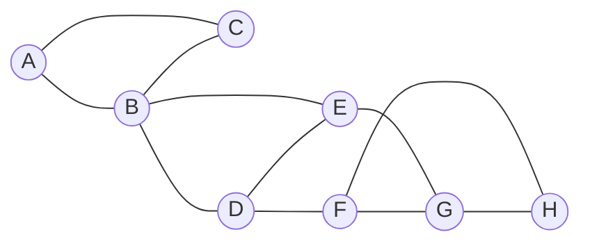
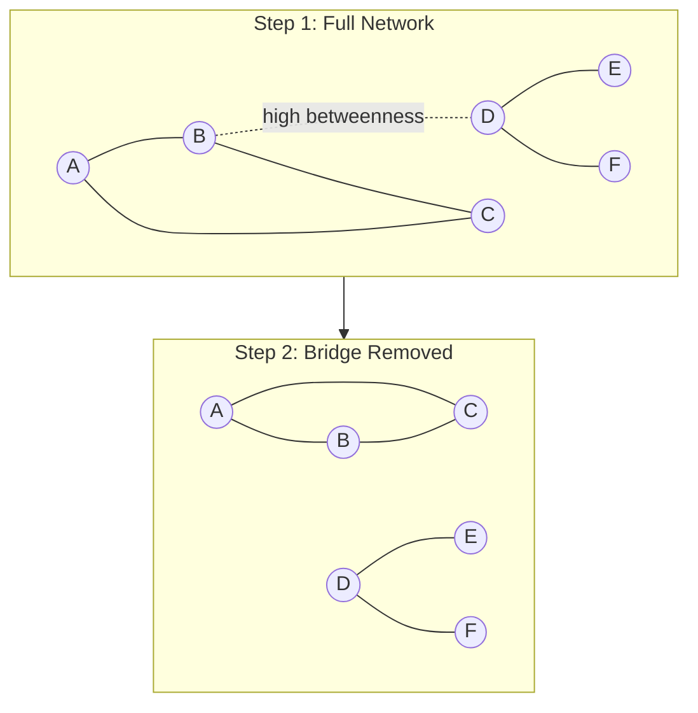
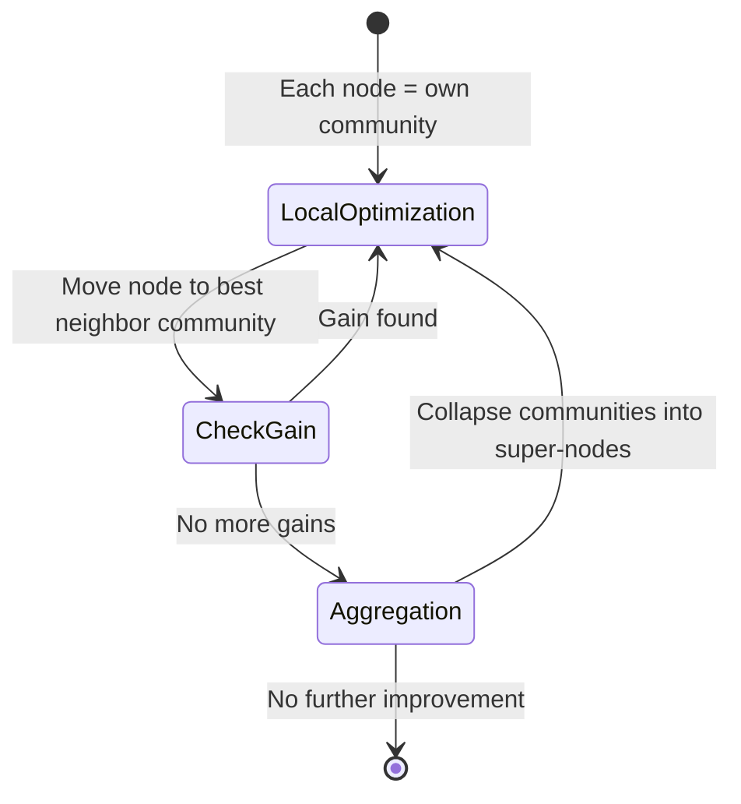
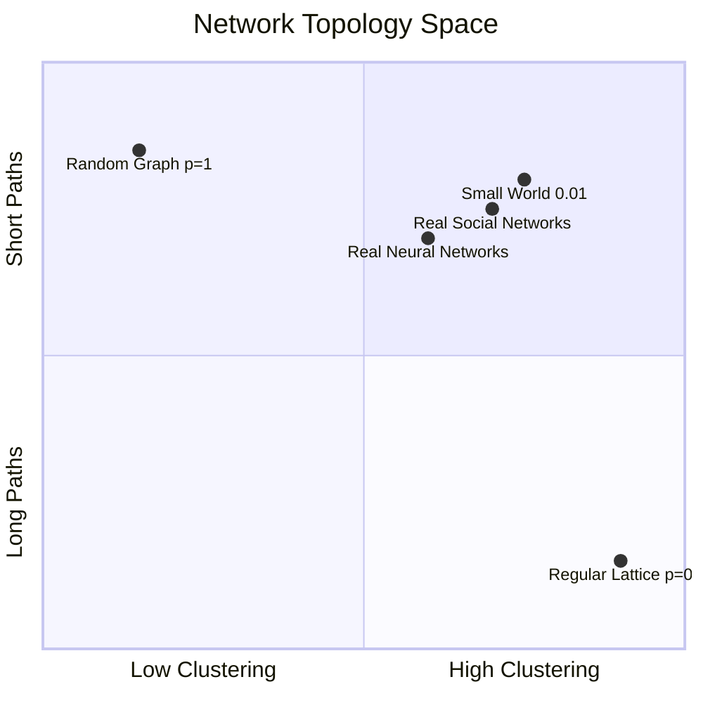

# Network Science: Communities, Centrality, and Small Worlds

## The Strength of Weak Ties

In 1973, a young sociologist named Mark Granovetter asked a deceptively simple question: how do people find jobs? He surveyed 282 professional workers in the Boston area who had recently changed positions. The answer upended common sense. The vast majority had found their new job not through close friends or family, but through acquaintances -- people they saw rarely, people on the periphery of their social lives.

Granovetter called this *the strength of weak ties*, and it became one of the most cited papers in social science history. The logic is elegant. Your close friends know mostly the same people you do. They read the same news, attend the same events, hear about the same job openings. Your acquaintances, on the other hand, move in different circles. They are *bridges* -- connections that span the gaps between tightly-knit social clusters.

This insight, that the structure of a network determines the flow of information through it, is the founding observation of network science. In our [companion post on graph theory](/blog/graph-theory-mathematics-of-connections), we built the mathematical vocabulary: vertices, edges, paths, connectivity, coloring. That language is necessary but insufficient. Knowing that a graph is connected tells you nothing about *how* information actually flows, who controls that flow, or why certain structures appear again and again across domains as different as neuroscience and the internet.

Network science asks the next question: given a graph's structure, what can you *infer* about the system it represents? Who holds power? Where will information flow fastest? Which components, if removed, would cause the whole system to fail? The tools we are about to explore -- centrality, community detection, random graph models, and their real-world descendants -- form the analytical core of this discipline.

## Centrality: Who Matters Most?

Not all nodes are created equal. In any network -- social, biological, technological -- some nodes are more important than others. But "important" can mean very different things depending on what you care about. Network science formalizes this through *centrality measures*, each capturing a different notion of importance.

Let us work with a single small network so you can compare all four measures on the same structure.



This network has eight nodes and eleven edges. Node B sits between two densely connected groups. Nodes A and C form a triangle on the left; D, E, F, G, H form a denser cluster on the right. Now watch how each centrality measure highlights a different "important" node.

### Degree Centrality: The Popular One

The simplest notion of importance: how many connections does a node have?

$$C_D(v) = \frac{\deg(v)}{n - 1}$$

In our graph, B and D both have degree 3, while F and G also have degree 3. Degree centrality says they are all equally important. This is fine for a first approximation, but it misses something crucial: *position*. A node can have few connections and still be structurally vital.

### Betweenness Centrality: The Gatekeeper

Betweenness measures how often a node lies on the shortest path between *other* pairs of nodes:

$$C_B(v) = \sum_{s \neq v \neq t} \frac{\sigma_{st}(v)}{\sigma_{st}}$$

where $\sigma_{st}$ is the total number of shortest paths from $s$ to $t$, and $\sigma_{st}(v)$ is the number of those paths passing through $v$.

In our example, node B has the highest betweenness centrality by a wide margin. Every shortest path from the left cluster (A, C) to the right cluster (D, E, F, G, H) must pass through B. Remove B, and the network splits in two. Betweenness identifies *bridges* and *gatekeepers* -- exactly the structural role Granovetter described for weak ties.

### Closeness Centrality: The Well-Connected

Closeness measures how quickly a node can reach every other node:

$$C_C(v) = \frac{n - 1}{\sum_{u \neq v} d(v, u)}$$

where $d(v, u)$ is the shortest path distance. Nodes with high closeness are not necessarily popular, but they are *close to everything*. In our network, D and E score well on closeness because they sit at the junction of the right cluster and can reach B (and through it, A and C) in just two hops.

### Eigenvector Centrality: The Well-Connected to the Well-Connected

Eigenvector centrality says: it is not just how many connections you have, but *who* you are connected to. A node is important if its neighbors are important. This recursive definition leads to the eigenvector equation:

$$\mathbf{A}\mathbf{x} = \lambda \mathbf{x}$$

where $\mathbf{A}$ is the adjacency matrix and $\mathbf{x}$ is the centrality vector corresponding to the largest eigenvalue $\lambda$. If this sounds familiar, it should -- this is precisely the mathematical foundation behind Google's PageRank algorithm, which we explored in detail in our [post on PageRank and eigenvector centrality](/blog/pagerank-eigenvectors). PageRank adds a damping factor and handles directed graphs, but the core insight is identical: importance is inherited from your neighbors.

### Computing Centrality in Practice

Here is a minimal example using NetworkX to compute all four measures on our example graph:

```python
import networkx as nx

G = nx.Graph()
edges = [
    ("A","B"), ("A","C"), ("B","C"), ("B","D"), ("B","E"),
    ("D","E"), ("D","F"), ("E","G"), ("F","G"), ("F","H"), ("G","H")
]
G.add_edges_from(edges)

print("Degree:      ", {v: round(c, 3) for v, c in nx.degree_centrality(G).items()})
print("Betweenness: ", {v: round(c, 3) for v, c in nx.betweenness_centrality(G).items()})
print("Closeness:   ", {v: round(c, 3) for v, c in nx.closeness_centrality(G).items()})
print("Eigenvector: ", {v: round(c, 3) for v, c in nx.eigenvector_centrality(G).items()})
```

The output reveals what no single measure captures alone: B dominates betweenness, but D and E score higher on eigenvector centrality because they are embedded in the denser cluster. Centrality is not a property -- it is a *perspective*.

| Node | Degree | Betweenness | Closeness | Eigenvector |
|------|--------|-------------|-----------|-------------|
| A    | Low    | Low         | Low       | Low         |
| B    | Medium | **Highest** | Medium    | Medium      |
| D    | Medium | Medium      | **High**  | **High**    |
| E    | Medium | Medium      | **High**  | **High**    |
| H    | Low    | Low         | Low       | Low         |

## Communities: Who Belongs Together?

Look at any real social network and you will see *clusters*: groups of nodes more densely connected to each other than to the rest of the network. Your college friends, your work colleagues, your family -- each forms a tightly-knit group with only a few bridges (those weak ties again) connecting them.

Identifying these clusters algorithmically is the problem of *community detection*, and it is one of the most important tasks in network science.

### Modularity: Measuring Community Quality

Before we can find communities, we need a way to measure whether a partition is any good. The standard measure is *modularity*, defined by Newman and Girvan:

$$Q = \frac{1}{2m} \sum_{ij} \left[ A_{ij} - \frac{k_i k_j}{2m} \right] \delta(c_i, c_j)$$

where $m$ is the total number of edges, $A_{ij}$ is the adjacency matrix, $k_i$ is the degree of node $i$, $c_i$ is the community assignment of node $i$, and $\delta$ is the Kronecker delta. The term $\frac{k_i k_j}{2m}$ is the expected number of edges between $i$ and $j$ in a random graph with the same degree sequence. Modularity measures how much the actual edge density within communities exceeds what you would expect by chance.

$Q$ ranges from $-0.5$ to $1$. Values above $0.3$ typically indicate significant community structure.

### Girvan-Newman: Removing Bridges

The Girvan-Newman algorithm (2002) finds communities by *removing* edges rather than grouping nodes. The insight is brilliant: edges with high betweenness centrality are the ones that connect communities. Remove them, and the communities emerge as connected components.

The algorithm proceeds iteratively:

1. Compute edge betweenness for all edges
2. Remove the edge with highest betweenness
3. Recalculate betweenness (because removal changes paths)
4. Repeat until the desired number of communities emerges



The algorithm is elegant but expensive -- $O(m^2 n)$ time complexity on sparse graphs -- making it impractical for networks with more than a few thousand nodes.

### Louvain: Scaling to Millions

For large networks, the Louvain algorithm (Blondel et al., 2008) takes a different approach: greedy modularity optimization. It operates in two phases that repeat hierarchically:

**Phase 1 -- Local optimization.** Each node starts as its own community. For each node, evaluate the modularity gain of moving it to each neighbor's community. Make the move that produces the largest gain. Repeat until no move improves modularity.

**Phase 2 -- Network aggregation.** Collapse each community into a single super-node. Edges between communities become weighted edges between super-nodes. Return to Phase 1 on this coarsened network.

This hierarchical coarsening is what makes Louvain fast -- $O(n \log n)$ in practice -- and capable of handling networks with millions of nodes. The Leiden algorithm (Traag et al., 2019) later improved upon Louvain by guaranteeing that all discovered communities are well-connected internally, fixing a subtle flaw where Louvain could sometimes produce disconnected communities.



## Random Graphs: The Erdos-Renyi Baseline

To understand what makes real networks special, you need a baseline: what would a "structureless" network look like? The answer is the Erdos-Renyi random graph model, $G(n, p)$, where each possible edge between $n$ nodes exists independently with probability $p$.

Random graphs have beautiful mathematical properties. The degree distribution follows a Poisson distribution:

$$P(k) = \binom{n-1}{k} p^k (1-p)^{n-1-k} \approx \frac{e^{-\langle k \rangle} \langle k \rangle^k}{k!}$$

where $\langle k \rangle = p(n-1)$ is the average degree. This means most nodes have roughly the same number of connections, with exponentially decaying tails. There are no hubs.

The model also predicts a spectacular *phase transition*: when the average degree crosses 1 (that is, when $p > 1/n$), a giant connected component suddenly emerges, absorbing a constant fraction of all nodes. Below this threshold, the graph is a collection of small fragments. Above it, almost everything is connected. This sharp threshold is one of the earliest and most elegant results in random graph theory, proven by Erdos and Renyi in 1959.

But here is the problem: real networks look almost nothing like $G(n, p)$. Real networks have:

- **High clustering** -- your friends tend to be friends with each other (forming triangles), while $G(n, p)$ has vanishingly low clustering for large $n$
- **Heavy-tailed degree distributions** -- a few nodes have vastly more connections than the average, while Poisson tails decay too fast to produce hubs
- **Community structure** -- dense local clusters connected by sparse bridges, which $G(n, p)$ cannot produce

The Erdos-Renyi model is not wrong -- it is the *null hypothesis*. Everything interesting about real networks is what deviates from it.

## Small World Networks

### Milgram's Six Degrees

The small-world model explains the most counterintuitive property of large networks: they are simultaneously *local* (your friends know each other) and *global* (you can reach anyone in a few hops). Before mathematicians formalized this, a psychologist demonstrated it with nothing more than postage stamps.

In 1967, Stanley Milgram, a social psychologist at Harvard, mailed 296 letters to randomly selected people in Omaha, Nebraska, and Wichita, Kansas. Each letter contained the name of a "target person" in Boston -- a stockbroker Milgram knew personally. The instructions were simple: if you know the target, mail the letter directly to him. If you do not, mail it to someone you know on a first-name basis who you think might be closer to the target.

Of the letters that completed the chain, the average number of intermediaries was about 5.5 -- roughly six steps from a random person in the American Midwest to a specific individual in Boston. Milgram never used the phrase "six degrees of separation" (that came from playwright John Guare in 1990), but the result captivated the public imagination. It suggested that even in a nation of 200 million people, any two individuals were connected by a remarkably short chain of acquaintances.

The result was replicated in 2001 by Watts and colleagues using email chains across 166 countries: again, about six steps. In 2011, a study of the entire Facebook graph (721 million users at the time) found an average distance of 4.74. The world, it seems, really is small.

But *why*? How can a network be simultaneously clustered (your friends know each other) and compact (any two nodes are only a few hops apart)? These two properties seem contradictory: clustering creates local neighborhoods, which should make long-range travel slow.

### The Watts-Strogatz Model

In 1998, Duncan Watts and Steven Strogatz published a landmark paper in *Nature* that resolved this paradox with an elegantly simple model. Start with a ring lattice: $n$ nodes arranged in a circle, each connected to its $k$ nearest neighbors. This graph has high clustering (your neighbors are neighbors of each other) but long path lengths (to reach the other side, you must traverse half the ring).

Now comes the magic trick: *rewire* each edge with probability $p$. With probability $p$, disconnect one end of an edge and reconnect it to a randomly chosen node anywhere in the network.

For $p = 0$, you have a perfectly regular lattice: high clustering, long paths.
For $p = 1$, you have an Erdos-Renyi random graph: low clustering, short paths.

The revelation is what happens in between. For surprisingly small values of $p$ -- rewiring just 1 or 2 percent of edges -- the average path length collapses dramatically while the clustering coefficient barely decreases. A handful of random long-range connections act as shortcuts that connect distant parts of the ring.

This is the small-world regime: high clustering *and* short path lengths, produced by adding just a few random bridges to an otherwise structured network. It is the mathematical formalization of Granovetter's weak ties -- those few acquaintances who connect your local cluster to the wider world are disproportionately responsible for making the world small.



The small-world property has been found in systems ranging from the neural network of the roundworm *C. elegans* (the first biological network Watts and Strogatz studied) to the power grid of the western United States, to the collaboration graph of film actors.

Why does this matter beyond academic curiosity? Because the small-world property governs how fast things *spread*. Epidemics on small-world networks reach the entire population much faster than on lattices, because the random shortcuts allow the disease to "jump" across the network. The same applies to rumors, innovations, financial contagion, and computer viruses. Understanding the small-world structure of a network is the first step toward predicting -- and potentially controlling -- cascading dynamics on it.

## Scale-Free Networks

### The Rich Get Richer

The small-world model explains *why* paths are short, but it does not explain another striking feature of real networks: their degree distributions are wildly unequal. In the World Wide Web, most pages have a handful of links, but a few pages (Google, Wikipedia, YouTube) have millions. In citation networks, most papers are cited once or twice, but a few landmarks accumulate thousands of citations. In airline networks, most airports serve a few routes, but a few hubs (Atlanta, London Heathrow, Dubai) connect to hundreds of destinations.

This pattern -- a few nodes with enormously many connections and a long tail of nodes with very few -- follows a *power law*:

$$P(k) \sim k^{-\gamma}$$

where $P(k)$ is the probability that a node has degree $k$, and $\gamma$ typically falls between 2 and 3. Unlike the Poisson distribution of random graphs, a power law has no characteristic scale -- there is no "typical" number of connections. Hence the name: *scale-free* networks.

In 1999, Albert-Laszlo Barabasi and Reka Albert proposed a mechanism that generates scale-free networks from two simple ingredients:

1. **Growth.** The network starts small and grows over time. New nodes are added one at a time.
2. **Preferential attachment.** A new node connects to an existing node $i$ with probability proportional to $i$'s current degree:

$$\Pi(k_i) = \frac{k_i}{\sum_j k_j}$$

Nodes that already have many connections attract more new connections -- the rich get richer, a phenomenon sometimes called the Matthew effect. This positive feedback loop produces hubs: nodes whose degree grows as $k \sim t^{1/2}$ while latecomers struggle to catch up.

The Barabasi-Albert model was a revelation because it showed that complex macroscopic structure (power-law degree distributions, hub-and-spoke topology) could emerge from microscopic rules of astonishing simplicity.

### Robustness and Vulnerability

Scale-free networks have a remarkable and paradoxical property: they are simultaneously *robust* and *fragile*.

**Robust to random failure.** If you randomly remove nodes from a scale-free network, it stays connected far longer than a random graph would. The reason is statistical: most nodes have very few connections, so a random removal almost certainly hits a low-degree node that nobody depends on. The network barely notices.

**Fragile to targeted attack.** If an adversary deliberately targets the highest-degree hubs, the network disintegrates rapidly. Removing just a few percent of hubs can shatter a scale-free network into disconnected fragments. This is the Achilles' heel of hub-and-spoke architectures -- from airline networks (a snowstorm at Atlanta cripples the entire system) to the internet (a DDoS attack on major DNS servers can take down vast swaths of connectivity).

This robustness-fragility tradeoff has profound implications for infrastructure design, epidemiology (hubs are super-spreaders), and cybersecurity. During the COVID-19 pandemic, epidemiological models that incorporated scale-free contact networks predicted the disproportionate role of super-spreader events far more accurately than models assuming homogeneous mixing. The 80/20 pattern -- where roughly 20% of infected individuals cause 80% of secondary infections -- is a direct consequence of the heavy-tailed degree distribution of human contact networks.

It is worth noting that the "scale-free" label has been debated. A 2019 study by Broido and Clauset tested nearly 1,000 real-world networks and found that only a minority exhibited strong evidence for power-law degree distributions. Many networks are better described by log-normal, stretched exponential, or other heavy-tailed distributions. The distinction matters mathematically, but the core insight survives: real networks have far more heterogeneous degree distributions than random graphs predict, with hubs playing an outsized structural role regardless of the exact functional form.

## The Network Zoo

The same mathematical lens reveals strikingly different structures across domains. Here is a brief tour of the network zoo, highlighting what structural property matters most in each case.

**Social networks** are defined by their community structure. Humans organize into overlapping groups -- family, colleagues, hobby communities -- creating networks with high clustering, strong community boundaries, and the small-world property. The key structural insight: weak ties between communities drive information diffusion.

**Biological networks** exhibit scale-free properties at multiple levels. Protein-protein interaction networks have hub proteins (often essential for survival). Metabolic networks have hub metabolites (like ATP and water). Neural networks in the brain combine small-world topology with modular, hierarchical community structure. The key structural insight: hubs are functional bottlenecks.

**Transportation networks** are spatially embedded, meaning geography constrains which connections are possible. Airline networks are scale-free (hub airports), but road networks are nearly regular (most intersections have 3-4 connections). The key structural insight: spatial constraints impose fundamentally different topologies.

**The internet** at the router level is approximately scale-free with notable robustness to random failure. The World Wide Web as a directed graph has power-law distributions for both in-degree and out-degree, with different exponents. The key structural insight: the topology was not designed but *emerged* from preferential attachment.

**Citation networks** are directed acyclic graphs (no paper can cite a future paper) with heavy-tailed degree distributions. Highly-cited papers act as hubs that define research fields. The key structural insight: preferential attachment in citation follows a "first mover" advantage -- early papers in a new field accumulate citations faster simply because they have been available longer, a temporal version of the rich-get-richer effect.

**Financial networks** connect institutions through lending, derivatives, and ownership relationships. The 2008 financial crisis revealed that these networks are not only scale-free but contain dangerous feedback loops -- a failure at one hub (Lehman Brothers) can cascade through the entire system. Central bank stress testing now explicitly models network topology to identify systemically important financial institutions.

| Network Type | Typical Topology | Key Property | Hub Role |
|---|---|---|---|
| Social | Small-world, clustered | Community structure | Information brokers |
| Protein interaction | Scale-free | Hub essentiality | Functional bottlenecks |
| Airline routes | Scale-free, spatial | Geographic hubs | Connection routing |
| Internet routers | Scale-free | Robustness | Traffic aggregation |
| Citation graphs | Directed, power-law | Preferential attachment | Field definition |
| Brain connectome | Small-world, modular | Hierarchical modules | Integration centers |
| Financial system | Scale-free, feedback | Systemic risk | Contagion amplifiers |

## From Structure to Learning

Everything in this post -- centrality, communities, degree distributions, small-world properties -- amounts to *handcrafted features* that researchers have designed to extract meaning from graph structure. They work well, but they require human insight to select and combine.

Graph Neural Networks take a fundamentally different approach. Instead of manually defining structural features, GNNs *learn* them directly from data. The key mechanism is *message passing*: at each layer, every node aggregates information from its neighbors, transforms it, and passes the result forward. If you think about it, this is a learnable form of *diffusion on graphs* -- information spreading outward from each node, shaped by the network's topology.

The connection to network science is deep and direct:

- **Degree centrality** is what a GNN "sees" after one layer of message passing -- a node's representation reflects its immediate neighborhood.
- **Betweenness and closeness** emerge after multiple layers, as information propagates through bridges and bottlenecks.
- **Community structure** manifests as similar learned representations for nodes within the same cluster -- the GNN discovers communities without being told they exist.
- **Eigenvector centrality** is particularly telling: recall that it solves $\mathbf{A}\mathbf{x} = \lambda\mathbf{x}$, and a GNN's message-passing operation is essentially a learned, nonlinear version of multiplying by the adjacency matrix.

We explored this in depth in our [post on Graph Neural Networks](/blog/graph-neural-networks-learning-structured-data), where message passing and neighborhood aggregation are the core operations. The structural features that network scientists spent decades defining by hand -- centrality, clustering coefficients, community membership -- are what GNNs learn to approximate automatically when given enough data and the right task.

Even this blog has a knowledge graph. Every post is a node; shared tags create edges. The graph has community structure (field-notes posts about data engineering cluster together, curiosities about mathematics form another cluster). It has hub nodes (posts that bridge multiple topics). It has its own small-world property. Network science is not just a subject we write about -- it is the architecture of the writing itself.

## Going Deeper

**Books:**
- Newman, M. E. J. (2018). *Networks.* Oxford University Press.
  - The definitive textbook on network science -- comprehensive, rigorous, and accessible. Covers everything from random graphs to epidemics on networks.
- Barabasi, A.-L. (2016). *Network Science.* Cambridge University Press.
  - Freely available at [networksciencebook.com](http://networksciencebook.com/). Beautifully illustrated, with interactive visualizations for every chapter.
- Watts, D. J. (2003). *Six Degrees: The Science of a Connected Age.* W. W. Norton.
  - A narrative account by one of the creators of the small-world model. Less technical, more focused on the sociological implications.
- Easley, D. and Kleinberg, J. (2010). *Networks, Crowds, and Markets.* Cambridge University Press.
  - Bridges computer science, economics, and sociology. Excellent treatment of game theory on networks and information cascades.

**Online Resources:**
- [Network Science by Barabasi (free online textbook)](http://networksciencebook.com/) -- Full textbook with interactive figures covering scale-free networks, communities, and spreading phenomena
- [Stanford SNAP: Large Network Dataset Collection](https://snap.stanford.edu/data/) -- Real-world network datasets for social, communication, citation, and biological networks
- [NetworkX Documentation](https://networkx.org/documentation/stable/) -- Python library for creating, analyzing, and visualizing complex networks
- [Gephi](https://gephi.org/) -- Open-source network visualization and exploration tool for large graphs

**Videos:**
- [The Science of Six Degrees of Separation](https://www.youtube.com/watch?v=TcxZSmzPw8k) by Veritasium -- Derek Muller explores the history and science behind Milgram's experiment, then runs his own version with viewers
- [Stanford CS224W: Machine Learning with Graphs](https://www.youtube.com/playlist?list=PLoROMvodv4rPLKxIpqhjhPgdQy7imNkDn) by Jure Leskovec -- Full Stanford course covering network analysis, community detection, and graph neural networks

**Academic Papers:**
- Granovetter, M. S. (1973). ["The Strength of Weak Ties."](https://www.jstor.org/stable/2776392) *American Journal of Sociology*, 78(6), 1360-1380.
  - The paper that launched network sociology. Still essential reading for anyone working with social networks.
- Watts, D. J. and Strogatz, S. H. (1998). ["Collective dynamics of 'small-world' networks."](https://www.nature.com/articles/30918) *Nature*, 393(6684), 440-442.
  - The paper that formalized the small-world property. One of the most cited papers in all of science.
- Barabasi, A.-L. and Albert, R. (1999). ["Emergence of Scaling in Random Networks."](https://www.science.org/doi/10.1126/science.286.5439.509) *Science*, 286(5439), 509-512.
  - Introduced preferential attachment and the scale-free model. Transformed our understanding of network growth.

**Questions to Explore:**
- If social networks are optimized for information flow through weak ties, what does the algorithmic curation of social media (which strengthens strong ties and filters out weak ones) do to a society's collective ability to discover new information?
- The brain is a small-world network with modular community structure. Is consciousness an emergent property of this specific topology, or could a different network architecture produce the same phenomenon?
- Scale-free networks are robust to random failure but fragile to targeted attack. As our critical infrastructure (power, internet, finance) becomes increasingly networked, are we systematically building systems with a hidden catastrophic failure mode?
- Community detection algorithms assume communities exist. But in some networks, the boundaries are genuinely fuzzy or hierarchical. When does forcing a partition onto a network obscure more than it reveals?
- If GNNs can learn centrality and community structure automatically, does that make the classical measures of network science obsolete -- or do they remain essential as interpretable baselines?
