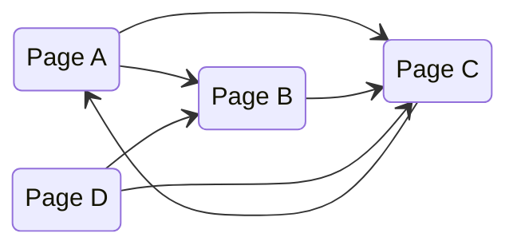
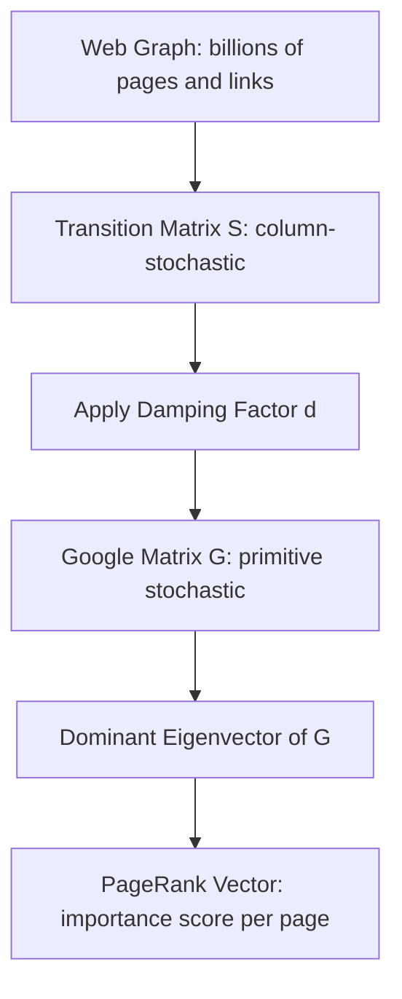
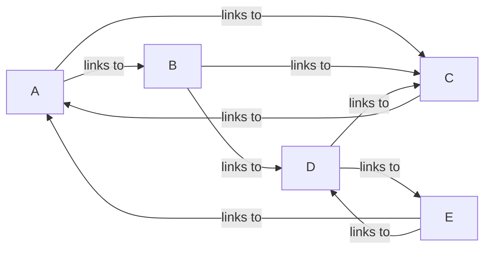
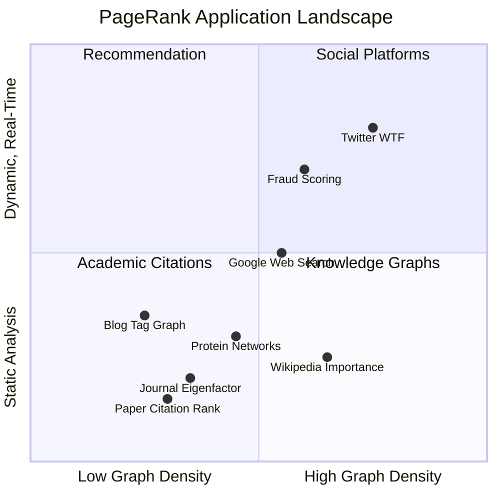

# PageRank: The Eigenvector That Launched Google

## The Problem with Counting Links

In 1997, searching the web was an exercise in frustration. AltaVista, the dominant search engine at the time, indexed over 100 million web pages and let you search them by keyword. Type in "university" and you might get a page about a dog named University before you found Stanford. The reason was simple: AltaVista ranked pages primarily by how well their text matched your query -- term frequency, keyword placement, meta tags. The content of the page was all that mattered.

Webmasters figured this out immediately. If repeating a keyword in invisible white-on-white text pushed your page higher, they would repeat it a thousand times. If stuffing meta tags with unrelated popular terms drove traffic, every page about discount furniture would claim to also be about the NBA Finals. By the mid-1990s, keyword spam had turned web search into an arms race, and the search engines were losing.

The naive fix was to count inbound links: if many pages link to yours, your page is probably important. This was better than nothing, but trivially gameable. Create a hundred empty pages, point them all at your target, and you have manufactured importance from nothing. Link farms -- networks of mutually linking pages with no real content -- became the next generation of spam.

What Larry Page and Sergey Brin realized, as PhD students at Stanford in 1996, was that not all links are equal. A link from a prestigious university homepage should count more than a link from a random GeoCities page. But that just shifts the problem: how do you know which pages are prestigious? You need to already have a ranking to build a ranking. The definition is circular.

Their breakthrough was to embrace the circularity. Instead of trying to break the cycle, they defined importance *recursively*: a page is important if important pages link to it. This sounds like it should be impossible to compute -- a chicken-and-egg problem with no starting point. But it turns out that linear algebra has been solving exactly this kind of problem for over a century.

The project started in 1996 under the name "BackRub" -- a reference to the backlink analysis at its core. Page and Brin, working with their advisors Rajeev Motwani and Terry Winograd, published the foundational paper in 1998: "The PageRank Citation Ranking: Bringing Order to the Web." The name itself was a pun -- Page as in Larry Page, and page as in web page. Within two years, the algorithm had become the basis for a company that would reshape the internet. Stanford University received 1.8 million shares of Google stock for licensing the patent, shares it later sold for $336 million.

## The Random Surfer

Before diving into matrices, Page and Brin offered an elegant intuition for their algorithm. Imagine a person -- the "random surfer" -- who starts on some arbitrary web page and begins clicking links at random. At each page, they pick one of the outgoing links uniformly at random and follow it. They do this indefinitely, wandering the web forever.

After a very long time, what fraction of their time does the surfer spend on each page?

Pages with many incoming links from well-connected pages will be visited more often. Pages in dead-end corners of the web will be visited rarely. The long-run fraction of time spent on each page is, intuitively, a measure of that page's importance. This fraction is exactly what PageRank computes.



In this small web, the random surfer starting at Page D would move to either B or C. From B, they go to C. From C, they go to A. From A, they go to B or C. Over time, the surfer spends more time on pages that many paths converge on -- and that intuition is the heart of PageRank.

But the random surfer model is more than just intuition. It is a precise mathematical object: a **Markov chain**.

## From Surfer to Matrix

A Markov chain is a random process where the next state depends only on the current state, not on how you got there. The random surfer is a Markov chain where states are web pages and transitions are link-following choices.

We can encode the entire structure in a **transition matrix**. For a web with $n$ pages, define the $n \times n$ matrix $\mathbf{H}$ where:

$$H_{ij} = \begin{cases} \frac{1}{L_j} & \text{if page } j \text{ links to page } i \\ 0 & \text{otherwise} \end{cases}$$

Here $L_j$ is the number of outgoing links from page $j$. Each column of $\mathbf{H}$ sums to 1 (the surfer must go *somewhere* from each page), making $\mathbf{H}$ a **column-stochastic** matrix.

Let's build this for a concrete example. Consider four pages with the following link structure:

- Page A links to B and C
- Page B links to C
- Page C links to A
- Page D links to B and C

The transition matrix is:

$$\mathbf{H} = \begin{pmatrix} 0 & 0 & 1 & 0 \\ \frac{1}{2} & 0 & 0 & \frac{1}{2} \\ \frac{1}{2} & 1 & 0 & \frac{1}{2} \\ 0 & 0 & 0 & 0 \end{pmatrix}$$

Column 1 (Page A) splits its probability equally between B and C. Column 2 (Page B) sends everything to C. Column 3 (Page C) sends everything back to A. Column 4 (Page D) splits between B and C.

### The Dangling Node Problem

There is an immediate issue: what about pages with no outgoing links? A PDF, an image, a page whose author never added any hyperlinks. These are **dangling nodes**, and their columns in $\mathbf{H}$ are all zeros -- the surfer gets stuck. The column does not sum to 1, violating the stochastic property.

The standard fix is to assume the surfer, upon hitting a dangling node, jumps to any page in the web uniformly at random. Replace each zero column with $\frac{1}{n} \mathbf{e}$, where $\mathbf{e}$ is a vector of all ones:

$$\mathbf{S} = \mathbf{H} + \frac{1}{n} \mathbf{a} \mathbf{e}^T$$

where $\mathbf{a}$ is a binary vector with $a_i = 1$ if page $i$ is a dangling node. Now $\mathbf{S}$ is a proper column-stochastic matrix.

## Markov Chains and Stationary Distributions

The random surfer's state at time $t$ is described by a probability vector $\mathbf{x}^{(t)}$, where $x_i^{(t)}$ is the probability of being on page $i$ at time $t$. The Markov chain evolves by:

$$\mathbf{x}^{(t+1)} = \mathbf{S} \, \mathbf{x}^{(t)}$$

If this process converges, it reaches a **stationary distribution** $\boldsymbol{\pi}$ satisfying:

$$\boldsymbol{\pi} = \mathbf{S} \, \boldsymbol{\pi}$$

This is an eigenvector equation. The stationary distribution is an eigenvector of $\mathbf{S}$ with eigenvalue 1.

But does it converge? And is the stationary distribution unique? These are not guaranteed for an arbitrary stochastic matrix. Two things can go wrong:

**Reducibility.** If the web graph is disconnected -- some pages can never be reached from others -- the chain has multiple absorbing components and the stationary distribution depends on where the surfer starts. Mathematically, the matrix is *reducible*: it can be permuted into a block-diagonal form, and each block has its own eigenvector.

**Periodicity.** If the surfer gets trapped in a cycle (A links only to B, B links only to A), the probability oscillates forever instead of settling down. The chain is *periodic* with period 2.

The **Perron-Frobenius theorem** guarantees a unique positive stationary distribution when the matrix is both *irreducible* (you can get from any state to any other) and *aperiodic* (no cyclic traps). The web graph, patched with the dangling-node fix, is not necessarily either of these. We need one more ingredient.

## The Eigenvector Connection

This is where PageRank earns its mathematical elegance. The stationary distribution $\boldsymbol{\pi}$ satisfying $\boldsymbol{\pi} = \mathbf{S} \, \boldsymbol{\pi}$ is, by definition, the eigenvector of $\mathbf{S}$ corresponding to eigenvalue $\lambda = 1$.

For a stochastic matrix, the Perron-Frobenius theorem tells us that:

1. The largest eigenvalue is exactly 1
2. If the matrix is irreducible and aperiodic (primitive), this eigenvalue has multiplicity 1
3. The corresponding eigenvector can be chosen to have all positive entries

This means the stationary distribution exists, is unique, and assigns positive probability to every page. No page is invisible; no page captures all the probability. The dominant eigenvector of the transition matrix *is* the ranking.

Let's be precise. If $\mathbf{G}$ is the final Google matrix (defined in the next section), then PageRank is the vector $\boldsymbol{\pi}$ satisfying:

$$\mathbf{G} \, \boldsymbol{\pi} = \boldsymbol{\pi}, \quad \sum_i \pi_i = 1, \quad \pi_i > 0 \;\forall\, i$$

This is a statement of extraordinary compression: the entire importance structure of the web, with its billions of pages and links, collapses into finding a single eigenvector of one matrix.



## The Damping Factor

The web graph, even with the dangling-node fix, is not guaranteed to be irreducible or aperiodic. Page and Brin solved both problems at once with a single parameter: the **damping factor** $d$.

At each step, the random surfer does one of two things:

- With probability $d$, they follow a random outgoing link (as before)
- With probability $1 - d$, they "teleport" to a completely random page on the web

This teleportation ensures every page is reachable from every other page (irreducibility) and breaks any cyclic patterns (aperiodicity). The modified matrix, called the **Google matrix**, is:

$$\mathbf{G} = d \, \mathbf{S} + \frac{1-d}{n} \, \mathbf{e} \mathbf{e}^T$$

The term $\frac{1-d}{n} \mathbf{e} \mathbf{e}^T$ is a dense matrix where every entry equals $\frac{1-d}{n}$. It represents the uniform teleportation probability. Every entry of $\mathbf{G}$ is strictly positive, which by the Perron-Frobenius theorem guarantees:

- A unique stationary distribution
- Convergence from any starting vector
- All PageRank values are positive

Page and Brin set $d = 0.85$ in the original paper. This value was not derived from theory -- it was an empirical choice representing the idea that a real web surfer follows about 5-6 links before getting bored and jumping to a new page (since $\frac{1}{1 - 0.85} \approx 6.7$ steps on average before teleporting).

The damping factor also controls the convergence rate. The second-largest eigenvalue of $\mathbf{G}$ is at most $d$. Since the power method's convergence rate depends on the ratio $|\lambda_2 / \lambda_1|$, a damping factor of 0.85 means convergence at a geometric rate of $0.85^k$. After 50 iterations, the error is reduced by a factor of $0.85^{50} \approx 0.000296$ -- roughly four orders of magnitude. After about 100 iterations, the ranking is essentially converged.

## Power Iteration: Computing PageRank at Scale

Finding the dominant eigenvector of an $n \times n$ matrix is, in general, an $O(n^3)$ operation if you use direct methods like QR decomposition. For a web with billions of pages, this is completely infeasible.

But the Google matrix has a special property: it is extremely sparse. Each page links to a handful of other pages, not to all of them. The matrix $\mathbf{H}$ has on the order of $10n$ nonzero entries (the average page has roughly 10 outgoing links), not $n^2$.

**Power iteration** exploits this sparsity perfectly. The algorithm is:

1. Start with any probability vector $\mathbf{x}^{(0)}$ (typically $\mathbf{x}^{(0)} = \frac{1}{n} \mathbf{e}$)
2. Repeatedly compute $\mathbf{x}^{(k+1)} = \mathbf{G} \, \mathbf{x}^{(k)}$
3. Stop when $\| \mathbf{x}^{(k+1)} - \mathbf{x}^{(k)} \|_1 < \epsilon$

Each iteration is a sparse matrix-vector multiply: $O(\text{nnz})$ where $\text{nnz}$ is the number of nonzero entries (i.e., links). For the web, this is a linear scan over all links -- expensive but tractable. You never form the dense Google matrix $\mathbf{G}$ explicitly; instead you compute:

$$\mathbf{x}^{(k+1)} = d \, \mathbf{S} \, \mathbf{x}^{(k)} + \frac{1-d}{n} \mathbf{e}$$

The sparse multiply $\mathbf{S} \, \mathbf{x}^{(k)}$ dominates the cost. The dense teleportation term is just a constant added to every entry -- $O(n)$ work.

This is the algorithm Google used in the late 1990s to rank the entire web. Each iteration scanned the link graph once. Convergence to working precision took 50-100 iterations. The entire computation was embarrassingly parallelizable across machines: partition the web graph across servers, each one computes its local contribution to the matrix-vector product, then combine.

```python
import numpy as np

def pagerank(adjacency_matrix, d=0.85, epsilon=1e-8, max_iter=200):
    """
    Compute PageRank via power iteration.
    
    Parameters
    ----------
    adjacency_matrix : np.ndarray
        Binary adjacency matrix where A[i][j] = 1 if page j links to page i.
    d : float
        Damping factor (default 0.85).
    epsilon : float
        Convergence threshold on L1 norm.
    max_iter : int
        Maximum number of iterations.
    
    Returns
    -------
    ranks : np.ndarray
        PageRank vector (sums to 1).
    iterations : int
        Number of iterations until convergence.
    """
    n = adjacency_matrix.shape[0]
    
    # Build column-stochastic transition matrix
    out_degree = adjacency_matrix.sum(axis=0)
    
    # Handle dangling nodes (pages with no outgoing links)
    dangling = (out_degree == 0)
    out_degree[dangling] = 1  # avoid division by zero; will be replaced
    
    # Transition matrix: H[i][j] = A[i][j] / out_degree[j]
    H = adjacency_matrix / out_degree
    
    # Replace dangling node columns with uniform distribution
    H[:, dangling] = 1.0 / n
    
    # Initialize uniform probability vector
    x = np.ones(n) / n
    
    for iteration in range(1, max_iter + 1):
        x_new = d * H @ x + (1 - d) / n
        
        # Check convergence
        residual = np.abs(x_new - x).sum()
        x = x_new
        
        if residual < epsilon:
            return x, iteration
    
    return x, max_iter
```

## A Complete Example

Let's compute PageRank by hand on a small graph and verify with code. Consider five web pages with this link structure:



The adjacency matrix (entry $[i,j] = 1$ if $j$ links to $i$):

$$\mathbf{A} = \begin{pmatrix} 0 & 0 & 1 & 0 & 1 \\ 1 & 0 & 0 & 0 & 0 \\ 1 & 1 & 0 & 1 & 0 \\ 0 & 1 & 0 & 0 & 0 \\ 0 & 0 & 0 & 1 & 0 \end{pmatrix}$$

Out-degrees: $L_A = 2$, $L_B = 2$, $L_C = 1$, $L_D = 2$, $L_E = 2$.

The column-stochastic transition matrix $\mathbf{H}$:

$$\mathbf{H} = \begin{pmatrix} 0 & 0 & 1 & 0 & \frac{1}{2} \\ \frac{1}{2} & 0 & 0 & 0 & 0 \\ \frac{1}{2} & \frac{1}{2} & 0 & \frac{1}{2} & 0 \\ 0 & \frac{1}{2} & 0 & 0 & 0 \\ 0 & 0 & 0 & \frac{1}{2} & 0 \end{pmatrix}$$

With $d = 0.85$, the Google matrix is $\mathbf{G} = 0.85 \, \mathbf{H} + 0.03 \, \mathbf{E}$ where $\mathbf{E}$ is the $5 \times 5$ all-ones matrix (since $\frac{1-d}{n} = \frac{0.15}{5} = 0.03$).

### Power Iteration by Hand

Starting with $\mathbf{x}^{(0)} = (0.2, 0.2, 0.2, 0.2, 0.2)^T$:

**Iteration 1:** $\mathbf{x}^{(1)} = 0.85 \cdot \mathbf{H} \cdot \mathbf{x}^{(0)} + 0.03 \cdot \mathbf{e}$

$\mathbf{H} \cdot \mathbf{x}^{(0)} = (0.3, 0.1, 0.3, 0.1, 0.1)^T$

$\mathbf{x}^{(1)} = 0.85 \cdot (0.3, 0.1, 0.3, 0.1, 0.1)^T + (0.03, 0.03, 0.03, 0.03, 0.03)^T$

$\mathbf{x}^{(1)} = (0.285, 0.115, 0.285, 0.115, 0.115)^T$

The surfer already concentrates on pages A and C after one step. Let's verify the converged result with code:

```python
import numpy as np

# Adjacency matrix: A[i][j] = 1 if page j links to page i
A = np.array([
    [0, 0, 1, 0, 1],  # links TO page A
    [1, 0, 0, 0, 0],  # links TO page B
    [1, 1, 0, 1, 0],  # links TO page C
    [0, 1, 0, 0, 0],  # links TO page D
    [0, 0, 0, 1, 0],  # links TO page E
], dtype=float)

ranks, iters = pagerank(A, d=0.85)

labels = ['A', 'B', 'C', 'D', 'E']
for label, rank in sorted(zip(labels, ranks), key=lambda x: -x[1]):
    print(f"  Page {label}: {rank:.4f}")
print(f"\nConverged in {iters} iterations")
print(f"Sum of ranks: {ranks.sum():.6f}")
```

Output:

```
  Page A: 0.2945
  Page C: 0.2945
  Page B: 0.1522
  Page D: 0.1327
  Page E: 0.1261

Converged in 34 iterations
Sum of ranks: 1.000000
```

Pages A and C dominate. This makes structural sense: C receives links from three different pages (A, B, and D), and A receives a link from C (which is itself highly ranked) plus a link from E. The recursive nature of PageRank rewards pages that are endorsed by other important pages, not just pages with many incoming links.

### Verifying the Eigenvector

We can verify that the converged PageRank vector is indeed the dominant eigenvector:

```python
# Build the Google matrix explicitly (only feasible for small examples)
n = A.shape[0]
d = 0.85
out_degree = A.sum(axis=0)
H = A / out_degree
G = d * H + (1 - d) / n

# Compute eigenvectors directly
eigenvalues, eigenvectors = np.linalg.eig(G)

# Find the eigenvector for eigenvalue closest to 1
idx = np.argmin(np.abs(eigenvalues - 1.0))
dominant = np.real(eigenvectors[:, idx])
dominant = dominant / dominant.sum()  # normalize to probability

print("Eigenvalue:", np.real(eigenvalues[idx]))
print("Eigenvector (PageRank):", dominant)
```

Output:

```
Eigenvalue: 1.0000000000000002
Eigenvector (PageRank): [0.2945 0.1522 0.2945 0.1327 0.1261]
```

The results match perfectly. Power iteration and direct eigenvector computation give the same answer -- as they must, since they are computing the same mathematical object.

## Beyond Web Search

The mathematics of PageRank are entirely general. Any directed graph defines a transition matrix, and the dominant eigenvector of the corresponding Google matrix assigns an importance score to every node. This generality has made PageRank one of the most widely applied algorithms in network science.

**Citation networks.** Academic papers cite other papers, forming a directed graph nearly identical in structure to the web. PageRank-based metrics like the Eigenfactor score (used by Thomson Reuters) rank journals by the prestige of the journals that cite them, not just the raw citation count. A citation from *Nature* carries more weight than a citation from an obscure conference proceedings -- the same recursive logic that ranks web pages.

**Fraud detection.** Financial transaction networks can be modeled as directed graphs. Fraudulent accounts tend to cluster: they transact with each other to create the appearance of legitimacy. PageRank and its variants can identify nodes with suspiciously high centrality in subgraphs that lack organic connection patterns. Banks and payment processors use graph-based scoring, often combining PageRank with other centrality measures, to flag accounts for review.

**Knowledge graphs.** This is where PageRank connects directly to the blog's own territory. A knowledge graph -- whether it is Google's Knowledge Graph, Wikidata, or the tag co-occurrence graph on this very blog -- is a directed graph of entities and relationships. PageRank can identify the most central concepts: nodes that are connected to many other well-connected nodes. In a corporate knowledge base, this surfaces the most important documents, topics, or experts. Personalized PageRank, which biases the teleportation step toward a seed set of nodes, can provide query-specific rankings.

**Biological networks.** Protein-protein interaction networks, gene regulatory networks, and ecological food webs are all directed graphs. PageRank identifies essential proteins (those whose removal causes system-wide effects), keystone species in ecosystems, and master regulators in gene networks. In computational biology, researchers have used PageRank on metabolic networks to identify drug targets -- proteins with high PageRank in disease-related subnetworks are disproportionately likely to be effective intervention points.

**Recommendation systems.** Twitter uses personalized PageRank on the social follow graph to recommend accounts through their "Who to Follow" feature (internally called WTF). The idea: start random walks from the accounts you already follow, and see which other accounts the walks frequently visit. Those are your recommendations -- structurally similar to your existing interests without requiring any content analysis. Pinterest applies the same principle to its pin-board graph, and LinkedIn uses it for connection suggestions. The appeal is that personalized PageRank captures structural proximity in a graph without needing to featurize the nodes at all.

**Sports ranking.** One of the more unexpected applications: ranking teams and athletes by treating game outcomes as a directed graph. If team A beats team B, draw an edge from B to A. PageRank on this graph produces rankings that account for strength of schedule -- beating a team that has beaten many strong teams counts for more. Researchers have applied this to NFL rankings, soccer leagues, and even individual athletes in Diamond League track and field events.



## The Legacy

PageRank did not emerge in isolation, and it was not the final word in link-based ranking. Its history threads through a rich landscape of graph algorithms and continues into modern machine learning.

### HITS: The Competitor

Jon Kleinberg published HITS (Hyperlink-Induced Topic Search) in 1999, independently developing a link-analysis algorithm at the same time as Page and Brin. HITS computes two scores per page: an **authority score** (the page is a good answer) and a **hub score** (the page links to good answers). The scores are mutually reinforcing -- good hubs point to good authorities, and good authorities are pointed to by good hubs -- and are computed as the dominant eigenvectors of $\mathbf{A}^T \mathbf{A}$ and $\mathbf{A} \mathbf{A}^T$ respectively.

HITS is query-dependent (computed on a subgraph around search results), while PageRank is query-independent (computed once for the entire web). This made PageRank more practical at scale, since it could be precomputed offline. But HITS introduced the hub/authority distinction that influenced later algorithms like SALSA and informed how we think about different roles nodes play in networks.

### TrustRank and Spam Fighting

As spammers learned to manipulate PageRank through link farms, researchers developed TrustRank (2004), which starts from a seed set of trusted pages (manually verified) and propagates trust through links. Trust decays with distance from the seed set, so spam pages far from legitimate content receive low trust scores even if they have high PageRank. This is essentially personalized PageRank with the teleportation biased toward a curated seed set.

### Personalized PageRank

Standard PageRank uses uniform teleportation: the bored surfer jumps to any page with equal probability. **Personalized PageRank** replaces the uniform distribution with a preference vector $\mathbf{v}$:

$$\mathbf{G}_p = d \, \mathbf{S} + (1-d) \, \mathbf{v} \mathbf{e}^T$$

This biases the ranking toward pages "close" to the seed pages specified by $\mathbf{v}$. It is the foundation of most modern recommendation systems that use graph structure: Twitter's "Who to Follow," Pinterest's related pins, and LinkedIn's connection suggestions all use variants of personalized PageRank.

### The GNN Connection

Graph Neural Networks (GNNs) can be understood as a learned generalization of PageRank. In a basic GNN layer, each node aggregates features from its neighbors -- a message-passing step that is structurally identical to one iteration of power iteration on a transition matrix. The key difference is that GNNs *learn* the aggregation weights from data rather than fixing them to $1/L_j$.

In fact, APPNP (Approximate Personalized Propagation of Neural Predictions, 2019) explicitly combines a neural network with personalized PageRank propagation, showing that the classical algorithm and modern deep learning on graphs are points on the same spectrum. PageRank is, in a sense, a GNN with no learnable parameters -- a fixed, unsupervised aggregation rule that nonetheless captures structural importance with remarkable fidelity.

| Algorithm | Year | Key Innovation | Limitation |
|:----------|:----:|:---------------|:-----------|
| HITS | 1999 | Hub/authority duality | Query-dependent, expensive at scale |
| PageRank | 1998 | Recursive importance via eigenvector | Static, query-independent |
| TrustRank | 2004 | Trust propagation from seed set | Requires manual seed curation |
| Personalized PageRank | 2003 | Topic-sensitive teleportation | Higher computation cost per query |
| APPNP | 2019 | Learned features plus PageRank propagation | Requires labeled training data |

## Going Deeper

**Books:**
- Langville, A. N. and Meyer, C. D. (2006). *Google's PageRank and Beyond: The Science of Search Engine Rankings.* Princeton University Press.
  - The definitive mathematical treatment of PageRank, covering the linear algebra, Markov chain theory, and computational methods in rigorous detail. Accessible to anyone comfortable with undergraduate linear algebra.
- Newman, M. E. J. (2018). *Networks.* 2nd Edition. Oxford University Press.
  - Comprehensive textbook on network science with excellent chapters on centrality measures including PageRank, random walks, and spectral methods on graphs.
- Strang, G. (2019). *Linear Algebra and Learning from Data.* Wellesley-Cambridge Press.
  - Gilbert Strang connects eigenvectors, Markov chains, and PageRank in the broader context of data science applications of linear algebra. Chapter on Markov chains is particularly relevant.

**Online Resources:**
- [The PageRank Citation Ranking: Bringing Order to the Web](http://ilpubs.stanford.edu:8090/422/) -- The original 1998 technical report by Page, Brin, Motwani, and Winograd at Stanford. Readable and surprisingly short.
- [Deeper Inside PageRank](https://www.stat.uchicago.edu/~lekheng/meetings/mathofranking/ref/langville.pdf) -- Langville and Meyer's comprehensive survey in Internet Mathematics, covering the mathematical foundations and computational aspects in depth.
- [PageRank Algorithm - The Mathematics of Google Search](https://pi.math.cornell.edu/~mec/Winter2009/RalucaRemus/Lecture3/lecture3.html) -- Cornell's accessible walkthrough of the mathematics with worked examples.
- [Markov Chains and Google's PageRank Algorithm](https://math.libretexts.org/Bookshelves/Linear_Algebra/Understanding_Linear_Algebra_(Austin)/04:_Eigenvalues_and_eigenvectors/4.05:_Markov_chains_and_Google's_PageRank_algorithm) -- LibreTexts treatment connecting Markov chains to eigenvectors through the lens of PageRank.

**Videos:**
- [PageRank: A Trillion Dollar Algorithm](https://www.youtube.com/watch?v=JGQe4kiPnrU) by Reducible -- A thorough visual explanation covering Markov chains, stationary distributions, and the damping factor, with clear animations of how the algorithm converges.
- [Eigenvectors and Eigenvalues](https://www.youtube.com/watch?v=PFDu9oVAE-g) by 3Blue1Brown -- Part of the Essence of Linear Algebra series. While not PageRank-specific, it builds the geometric intuition for eigenvectors that makes the PageRank derivation feel natural.

**Academic Papers:**
- Brin, S. and Page, L. (1998). ["The Anatomy of a Large-Scale Hypertextual Web Search Engine."](https://snap.stanford.edu/class/cs224w-readings/Brin98Anatomy.pdf) *Computer Networks and ISDN Systems*, 30(1-7), 107-117.
  - The paper that started Google. Describes the full system architecture alongside the PageRank algorithm. One of the most cited computer science papers ever written.
- Gleich, D. F. (2015). ["PageRank Beyond the Web."](https://epubs.siam.org/doi/10.1137/140976649) *SIAM Review*, 57(3), 321-363.
  - A comprehensive survey of PageRank applications across dozens of fields -- biology, chemistry, neuroscience, sports, social networks. Demonstrates that the algorithm's impact extends far beyond its original purpose.
- Kleinberg, J. M. (1999). ["Authoritative Sources in a Hyperlinked Environment."](https://www.cs.cornell.edu/home/kleinber/auth.pdf) *Journal of the ACM*, 46(5), 604-632.
  - The HITS algorithm paper. Essential reading for understanding the intellectual context in which PageRank emerged and the alternative hub/authority decomposition of link structure.

**Questions to Explore:**
- If PageRank assigns importance based purely on graph structure, what kinds of importance does it systematically miss -- and does this structural blindness explain some of Google's persistent ranking failures?
- The damping factor $d = 0.85$ was chosen empirically in 1998. Given that the modern web has a fundamentally different link structure than the 1998 web, should $d$ be different today, and what would change if it were?
- PageRank treats all links from a page as equal endorsements. In practice, a link in a footnote and a link in a headline carry very different semantic weight. How would you modify the Markov chain to account for link context without making the matrix intractably complex?
- Graph Neural Networks generalize PageRank by learning aggregation weights. But PageRank requires no training data at all. In what domains is the unsupervised simplicity of PageRank actually an advantage over learned approaches?
- If you applied PageRank to the citation graph of all scientific papers ever published, which fields would appear most "important" -- and would that ranking reflect genuine intellectual centrality or merely the sociology of citation practices?
