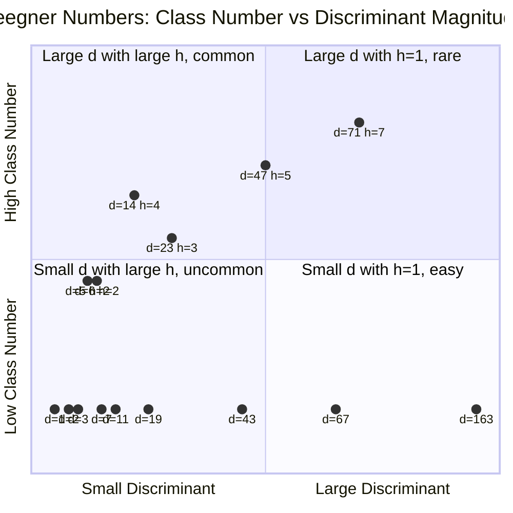
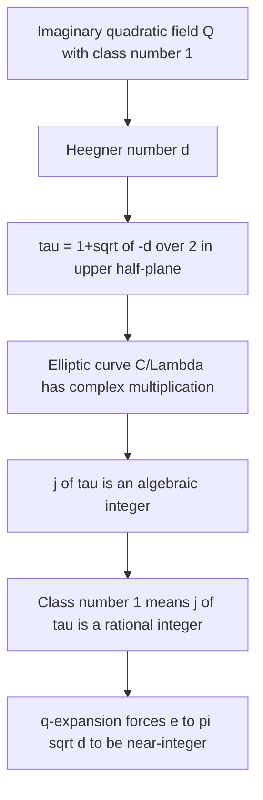
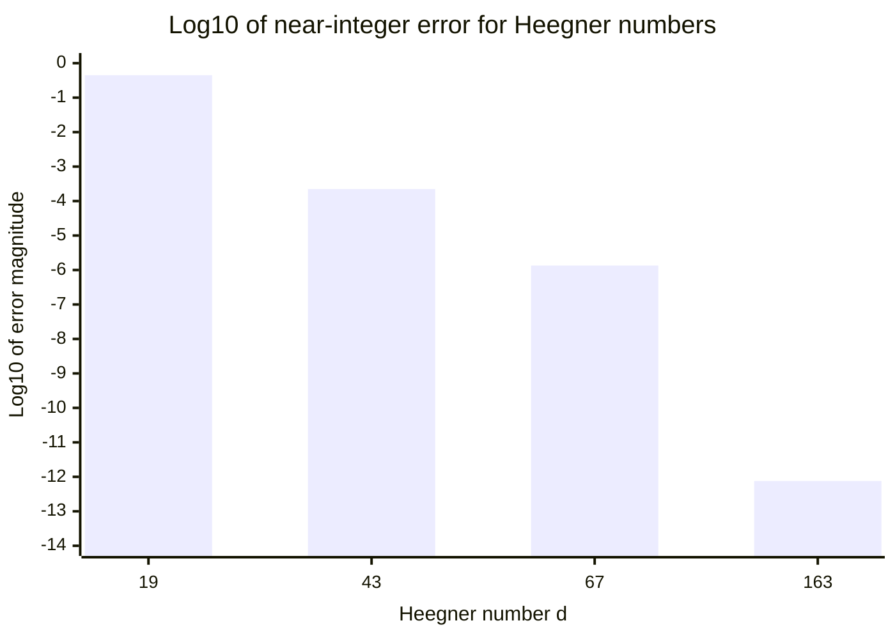
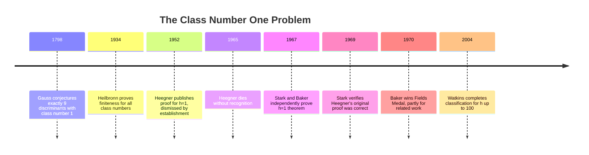

# Ramanujan's Constant: Why $e^{\pi\sqrt{163}}$ Is Almost an Integer

## A Number That Shouldn't Be Almost an Integer

Compute $e^{\pi\sqrt{163}}$. Go ahead, use as many digits as your software will give you:

$$e^{\pi\sqrt{163}} = 262537412640768743.99999999999925\ldots$$

That number misses being an integer by roughly $7.5 \times 10^{-13}$. Not $10^{-2}$, not $10^{-5}$ -- thirteen decimal places of nines before any deviation from an integer.

Your first instinct should be suspicion. There are infinitely many real numbers, and the probability of a "random" transcendental expression landing this close to an integer is vanishingly small. This demands an explanation.

And the explanation is one of the most satisfying in all of mathematics. It connects analytic objects ($e$, $\pi$) to the deepest structures of algebraic number theory -- the same class numbers and rings of integers we explored in [Algebraic Number Theory: When Unique Factorization Breaks](/blog/algebraic-number-theory-when-factorization-breaks). The number 163 is not arbitrary. It is the largest **Heegner number**, the final entry in a list of exactly nine integers with a property so special that it forces $e^{\pi\sqrt{163}}$ to be almost an integer. And proving that this list is complete took the combined efforts of Heegner, Stark, and Baker across two decades of controversy.

Let's compute it ourselves, just to feel the weight of the claim:

```python
from mpmath import mp, mpf, exp, pi, sqrt

# Set precision to 50 decimal places
mp.dps = 50

value = exp(pi * sqrt(mpf(163)))
print(f"e^(pi*sqrt(163)) = {value}")
print(f"Nearest integer:    {round(float(value))}")
print(f"Difference:         {value - 262537412640768744}")
```

```
e^(pi*sqrt(163)) = 262537412640768743.99999999999925007259719818568888...
Nearest integer:    262537412640768744
Difference:         -7.4992740280181431e-13
```

This is Post 3 in our algebraic number theory series. In [Post 1](/blog/algebraic-number-theory-when-factorization-breaks), we saw how unique factorization can fail in rings of algebraic integers, and how the class number measures the extent of that failure. In [Post 2](/blog/fermat-n4-infinite-descent), we used these ideas to prove Fermat's Last Theorem for $n = 4$ via infinite descent. Now we arrive at the payoff: a result where the class number being exactly 1 produces something that looks like pure magic.

---

## The Usual Suspects: Heegner Numbers

### Class Number 1 Revisited

Recall from [Post 1](/blog/algebraic-number-theory-when-factorization-breaks) that for a squarefree positive integer $d$, the imaginary quadratic field $\mathbb{Q}(\sqrt{-d})$ has a ring of integers $\mathcal{O}_K$. The **class number** $h(-d)$ measures how far $\mathcal{O}_K$ is from being a unique factorization domain. When $h(-d) = 1$, the ring of integers has unique factorization -- the ideals are all principal, and arithmetic works as cleanly as it does in $\mathbb{Z}$.

A **Heegner number** is a squarefree positive integer $d$ such that $\mathbb{Q}(\sqrt{-d})$ has class number 1. There are exactly nine of them:

$$d = 1, 2, 3, 7, 11, 19, 43, 67, 163$$

That this list is finite and complete is a deep theorem. That it ends at 163 is the reason $e^{\pi\sqrt{163}}$ is almost an integer.

### What Makes These Nine Special

For small $d$, the class number 1 property is relatively easy to verify. The ring of integers of $\mathbb{Q}(\sqrt{-1})$ is the Gaussian integers $\mathbb{Z}[i]$, which we know is a UFD -- as we discussed in detail in [Post 1](/blog/algebraic-number-theory-when-factorization-breaks). Similarly, $\mathbb{Z}[\sqrt{-2}]$ is a Euclidean domain (you can perform division with remainder using the norm), hence a principal ideal domain, hence a UFD.

But as $d$ grows, class number 1 becomes increasingly rare. The reason is essentially geometric: the class number is related to the number of reduced binary quadratic forms of discriminant $-d$, and this number tends to grow with $d$. By the Minkowski bound, the class number of $\mathbb{Q}(\sqrt{-d})$ is bounded below by a function that grows roughly as $\sqrt{d}$. More precisely, if $h(-d)$ denotes the class number, then Dirichlet's class number formula relates it to a special value of an $L$-function:

$$h(-d) = \frac{w \sqrt{|\Delta|}}{2\pi} L(1, \chi_\Delta)$$

where $\Delta$ is the discriminant, $w$ is the number of roots of unity in $\mathcal{O}_K$, and $\chi_\Delta$ is the Kronecker symbol. For $h(-d) = 1$, the $L$-function value must be small enough to compensate for $\sqrt{|\Delta|}$, and this becomes impossible for large $d$.

Finding a large $d$ with class number 1 is like finding a large prime in some sense -- it becomes progressively harder, and 163 is the last one.

Here is the complete list with the associated discriminants and $j$-invariant values we will need later:

| $d$ | Discriminant $\Delta$ | Ring of integers $\mathcal{O}_K$ | $j$-invariant |
|-----|----------------------|----------------------------------|---------------|
| 1 | $-4$ | $\mathbb{Z}[i]$ | $1728$ |
| 2 | $-8$ | $\mathbb{Z}[\sqrt{-2}]$ | $8000$ |
| 3 | $-3$ | $\mathbb{Z}\!\left[\frac{1+\sqrt{-3}}{2}\right]$ | $0$ |
| 7 | $-7$ | $\mathbb{Z}\!\left[\frac{1+\sqrt{-7}}{2}\right]$ | $-3375$ |
| 11 | $-11$ | $\mathbb{Z}\!\left[\frac{1+\sqrt{-11}}{2}\right]$ | $-32768$ |
| 19 | $-19$ | $\mathbb{Z}\!\left[\frac{1+\sqrt{-19}}{2}\right]$ | $-884736$ |
| 43 | $-43$ | $\mathbb{Z}\!\left[\frac{1+\sqrt{-43}}{2}\right]$ | $-884736000$ |
| 67 | $-67$ | $\mathbb{Z}\!\left[\frac{1+\sqrt{-67}}{2}\right]$ | $-147197952000$ |
| 163 | $-163$ | $\mathbb{Z}\!\left[\frac{1+\sqrt{-163}}{2}\right]$ | $-262537412640768000$ |

Notice that the $j$-invariant values grow enormously. The value for $d = 163$ is $j = -640320^3 = -262537412640768000$. Keep that number in mind.



---

## The $j$-Invariant: A Bridge Between Worlds

### What Is the $j$-Invariant?

The $j$-invariant is one of the most remarkable functions in mathematics. It is a **modular function** -- a function on the upper half of the complex plane $\mathcal{H} = \{\tau \in \mathbb{C} : \operatorname{Im}(\tau) > 0\}$ that is invariant under the action of the modular group $\mathrm{SL}_2(\mathbb{Z})$.

Concretely, $j(\tau)$ satisfies:

$$j\!\left(\frac{a\tau + b}{c\tau + d}\right) = j(\tau) \quad \text{for all } \begin{pmatrix} a & b \\ c & d \end{pmatrix} \in \mathrm{SL}_2(\mathbb{Z})$$

This means $j$ is periodic: $j(\tau + 1) = j(\tau)$, and it satisfies the more exotic symmetry $j(-1/\tau) = j(\tau)$.

The $j$-invariant classifies **elliptic curves** over $\mathbb{C}$. Two elliptic curves are isomorphic over $\mathbb{C}$ if and only if they have the same $j$-invariant. It is a complete invariant -- it captures everything about the curve's complex structure in a single number. Its special values include:

$$j(i) = 1728, \qquad j\!\left(\frac{1 + \sqrt{-3}}{2}\right) = 0$$

These correspond to elliptic curves with extra symmetry (the square lattice and the hexagonal lattice, respectively).

### Why Should This Connect to Number Theory?

Here is the bridge: every lattice $\Lambda$ in $\mathbb{C}$ defines an elliptic curve $\mathbb{C}/\Lambda$. We can normalize any lattice to the form $\Lambda = \mathbb{Z} + \mathbb{Z}\tau$ for some $\tau$ in the upper half-plane. The elliptic curve $\mathbb{C}/\Lambda$ has **complex multiplication** (CM) if the lattice has extra endomorphisms beyond the obvious multiplication-by-$n$ maps. This happens precisely when $\tau$ is a quadratic irrationality -- that is, when $\tau$ lies in an imaginary quadratic field $\mathbb{Q}(\sqrt{-d})$.

The fundamental theorem of complex multiplication states:

> If $\tau$ is an algebraic number lying in an imaginary quadratic field $K$, then $j(\tau)$ is an **algebraic integer**. Moreover, the degree $[K(j(\tau)):K]$ equals the class number $h(K)$.

When $h(K) = 1$, this simplifies dramatically: $j(\tau)$ is not just an algebraic integer, but a **rational integer**. An honest element of $\mathbb{Z}$.

This is the key. For Heegner numbers, $j$ takes integer values. Not algebraic integers of some complicated degree, not quadratic irrationalities, not roots of high-degree polynomials -- actual elements of $\mathbb{Z}$. The class group being trivial forces the Hilbert class field to collapse, and $j(\tau)$ has nowhere to go but the rationals.

To appreciate how strong this is: for $d = 5$ (which has class number 2), the value $j\!\left(\frac{1+\sqrt{-5}}{2}\right)$ is a root of a quadratic polynomial over $\mathbb{Q}$. For $d = 23$ (class number 3), it is a root of a cubic. The degree of $j(\tau)$ over $\mathbb{Q}$ is exactly the class number, so class number 1 is the only case where $j(\tau)$ is rational -- and being an algebraic integer that is also rational, it must be an honest integer.



---

## The $q$-Expansion That Explains Everything

### The Laurent Series of $j$

Because $j(\tau + 1) = j(\tau)$, the function $j$ is periodic with period 1 and can be expanded as a Fourier series in the variable $q = e^{2\pi i \tau}$:

$$j(\tau) = q^{-1} + 744 + 196884q + 21493760q^2 + 864299970q^3 + \cdots$$

Every coefficient is a positive integer (after the constant term). This is the **$q$-expansion** of $j$, and its coefficients have deep connections to the representation theory of the Monster group -- but that is another story entirely.

The crucial observation is structural: $j(\tau) = q^{-1} + 744 + (\text{terms that vanish as } \operatorname{Im}(\tau) \to \infty)$.

When $\operatorname{Im}(\tau)$ is large, $|q| = e^{-2\pi \operatorname{Im}(\tau)}$ is exponentially small, and the higher-order terms in the $q$-expansion become negligible. So:

$$j(\tau) \approx q^{-1} + 744$$

### Setting Up for 163

For a Heegner number $d$ (with $d \equiv 3 \pmod{4}$, so that the ring of integers has the form $\mathbb{Z}\!\left[\frac{1+\sqrt{-d}}{2}\right]$), we set:

$$\tau = \frac{1 + \sqrt{-d}}{2}$$

Then:

$$q = e^{2\pi i \tau} = e^{2\pi i \cdot \frac{1+\sqrt{-d}}{2}} = e^{\pi i(1 + \sqrt{-d})} = e^{\pi i} \cdot e^{-\pi\sqrt{d}} = -e^{-\pi\sqrt{d}}$$

So $q^{-1} = -e^{\pi\sqrt{d}}$, and the $q$-expansion gives:

$$j(\tau) = -e^{\pi\sqrt{d}} + 744 + 196884 \cdot (-e^{-\pi\sqrt{d}}) + \cdots$$

Rearranging:

$$e^{\pi\sqrt{d}} = -j(\tau) + 744 - 196884 \cdot e^{-\pi\sqrt{d}} + \cdots$$

Since $j(\tau)$ is an integer (because $d$ is a Heegner number), and since the tail $196884 \cdot e^{-\pi\sqrt{d}} + \cdots$ is exponentially small when $d$ is large, we get:

$$e^{\pi\sqrt{d}} \approx \text{integer} + (\text{exponentially small error})$$

That is the entire mechanism. The class number being 1 forces $j(\tau)$ to be an integer, and the $q$-expansion forces $e^{\pi\sqrt{d}}$ to be close to that integer. The larger $d$ is, the smaller $|q|$ is, and the better the approximation.

Let's quantify the error more carefully. The dominant correction term is $196884q = 196884 \cdot (-e^{-\pi\sqrt{d}})$. For $d = 163$, we have $e^{-\pi\sqrt{163}} \approx 3.8 \times 10^{-18}$, so the correction is about $7.5 \times 10^{-13}$. The next term in the $q$-expansion contributes $21493760 q^2 = 21493760 \cdot e^{-2\pi\sqrt{163}} \approx 3.1 \times 10^{-31}$, which is entirely negligible. Each successive term shrinks by an additional factor of $e^{-\pi\sqrt{163}} \approx 10^{-17.4}$, so the series converges with extraordinary speed.

This rapid convergence is why 163 produces such a spectacular near-miss. The $q$-expansion of $j$ has integer coefficients that grow, but the exponential decay of $|q|$ overwhelms this growth completely.

---

## Why 163 Wins

### The Computation

For $d = 163$:

$$\tau = \frac{1 + \sqrt{-163}}{2}, \qquad q = -e^{-\pi\sqrt{163}}$$

The $j$-invariant evaluates to:

$$j\!\left(\frac{1 + \sqrt{-163}}{2}\right) = -640320^3 = -262537412640768000$$

From the $q$-expansion:

$$j(\tau) = -e^{\pi\sqrt{163}} + 744 - 196884 e^{-\pi\sqrt{163}} + \cdots$$

Therefore:

$$e^{\pi\sqrt{163}} = -j(\tau) + 744 - 196884 e^{-\pi\sqrt{163}} + \cdots$$

$$= 262537412640768000 + 744 - 196884 e^{-\pi\sqrt{163}} + \cdots$$

$$= 262537412640768744 - 196884 e^{-\pi\sqrt{163}} + \cdots$$

Now, $e^{-\pi\sqrt{163}} \approx 3.805 \times 10^{-18}$, so $196884 \times 3.805 \times 10^{-18} \approx 7.499 \times 10^{-13}$. The next term in the expansion is on the order of $10^{-31}$, completely negligible.

This gives:

$$e^{\pi\sqrt{163}} = 262537412640768744 - 7.499\ldots \times 10^{-13}$$

The near-miss is not a coincidence. It is a **theorem**. The error is computable to arbitrary precision, and it comes directly from the tail of the $q$-expansion.

### The Factorization

The integer $640320$ factors as:

$$640320 = 2^6 \cdot 3 \cdot 5 \cdot 23 \cdot 29$$

This highly composite structure is characteristic of CM $j$-invariants. The factorizations become smoother (more small prime factors) as $d$ increases -- another reflection of the deep arithmetic at work.

```python
from mpmath import mp, mpf, exp, pi, sqrt

mp.dps = 60

# The key computation
d = 163
tau_im = sqrt(mpf(d)) / 2  # imaginary part of tau
q_abs = exp(-pi * sqrt(mpf(d)))  # |q| = e^(-pi*sqrt(d))

j_value = -640320**3  # Known j-invariant

# Reconstruct from q-expansion
e_pi_sqrt_163 = exp(pi * sqrt(mpf(d)))
predicted = -j_value + 744  # = 262537412640768744
error_term = 196884 * q_abs

print(f"e^(pi*sqrt(163))    = {e_pi_sqrt_163}")
print(f"-j(tau) + 744       = {predicted}")
print(f"First error term    = {error_term}")
print(f"Actual difference   = {e_pi_sqrt_163 - predicted}")
print(f"|q| = e^(-pi*sqrt(163)) = {q_abs}")
```

```
e^(pi*sqrt(163))    = 262537412640768743.99999999999925007259719818...
-j(tau) + 744       = 262537412640768744
First error term    = 7.49927402801814313e-13
Actual difference   = -7.49927402801814313e-13
|q| = e^(-pi*sqrt(163)) = 3.80513820802115862e-18
```

---

## The Other Heegner Numbers

The mechanism works for all nine Heegner numbers, but the approximation quality depends on $d$. Let's compute the near-miss for each:

```python
from mpmath import mp, mpf, exp, pi, sqrt

mp.dps = 50

# Heegner numbers and their j-invariant values
heegner_data = [
    (1,   1728),
    (2,   8000),
    (3,   0),
    (7,   -3375),
    (11,  -32768),
    (19,  -884736),
    (43,  -884736000),
    (67,  -147197952000),
    (163, -262537412640768000),
]

print(f"{'d':>4} | {'e^(pi*sqrt(d))':>45} | {'Nearest int diff':>20}")
print("-" * 78)

for d, j_val in heegner_data:
    val = exp(pi * sqrt(mpf(d)))
    nearest = round(float(val))
    diff = float(val - nearest)
    print(f"{d:>4} | {float(val):>45.12f} | {diff:>20.10e}")
```

```
   d |                          e^(pi*sqrt(d)) |     Nearest int diff
------------------------------------------------------------------------------
   1 |                           23.140692632... |     1.4069263278e-01
   2 |                           85.019699437... |     1.9699437495e-02
   3 |                          180.805340498... |    -1.9465950249e-01
   7 |                         4827.490926145... |    -5.0907385528e-01
  11 |                        33506.143029813... |     1.4302981341e-01
  19 |                       885479.777680154... |    -2.2231984604e-01
  43 |                   884736743.999777466... |    -2.2253358e-04
  67 |                147197952743.999999866... |    -1.3379e-06
 163 |            262537412640768743.999999999... |    -7.4993e-13
```

The pattern is unmistakable. For small Heegner numbers ($d = 1, 2, 3, 7, 11, 19$), the near-integer phenomenon is barely present -- the exponential $e^{-\pi\sqrt{d}}$ is not small enough to suppress the tail of the $q$-expansion. But as $d$ grows through $43, 67, 163$, the approximation improves by orders of magnitude each time.

For the three largest Heegner numbers, the values factor as perfect cubes plus 744:

$$e^{\pi\sqrt{43}} \approx 960^3 + 744 - 0.00022\ldots$$

$$e^{\pi\sqrt{67}} \approx 5280^3 + 744 - 0.0000013\ldots$$

$$e^{\pi\sqrt{163}} \approx 640320^3 + 744 - 0.00000000000075\ldots$$

The cubes $960$, $5280$, $640320$ are exactly $\sqrt[3]{|j(\tau)|}$ for the corresponding Heegner numbers. This is the $q$-expansion at work: $e^{\pi\sqrt{d}} \approx |j(\tau)| + 744$.

Why cubes? The $j$-invariant values for these Heegner numbers factor as $j = -(a)^3$ for integers $a$. This cubic structure is not a coincidence -- it reflects the fact that $j(\tau)$ can be expressed as a cube of a simpler modular function (related to the Weber modular functions). The factorizations are:

$$960 = 2^6 \cdot 3 \cdot 5, \qquad 5280 = 2^5 \cdot 3 \cdot 5 \cdot 11, \qquad 640320 = 2^6 \cdot 3 \cdot 5 \cdot 23 \cdot 29$$

Notice how each cube root is divisible by small primes. This smoothness is connected to the arithmetic of the corresponding elliptic curves and their reduction modulo primes. The number $640320$ itself appears in the Chudnovsky brothers' famous formula for $\pi$:

$$\frac{1}{\pi} = 12 \sum_{k=0}^{\infty} \frac{(-1)^k (6k)! (13591409 + 545140134k)}{(3k)!(k!)^3 \cdot 640320^{3k+3/2}}$$

This is not a coincidence either -- the Chudnovsky formula is derived from Ramanujan-type series that use the same CM theory we have been discussing. The number $640320^3 = |j(\tau)|$ for $d = 163$ appears because this Heegner number provides the fastest-converging series of its type.



---

## The Class Number One Problem

### Gauss's Question

In 1798, Carl Friedrich Gauss published his *Disquisitiones Arithmeticae*, where he classified binary quadratic forms and introduced what we now recognize as class numbers. In Section 303, he observed that the negative discriminants $-3, -4, -7, -8, -11, -19, -43, -67, -163$ seemed to be the only ones giving class number 1, and he conjectured this list was complete.

Gauss could not prove it. Nor could anyone else for over 150 years.

### Heegner's Controversial Proof

In 1952, Kurt Heegner -- a German high school teacher and radio engineer, not a professional academic mathematician -- published a proof that Gauss's list was complete. His proof used the theory of modular functions, specifically Weber's results on singular moduli (values of modular functions at CM points).

The mathematical establishment was skeptical. Heegner's paper was dense, relied on results from Weber's *Algebra* that few mathematicians of the 1950s had mastered (the field of modular functions had fallen out of fashion for nearly half a century), and contained what appeared to be a gap. Bryan Birch later wrote: "Unhappily, in 1952 there was no one left who was sufficiently expert in Weber's Algebra to appreciate Heegner's achievement."

Heegner died in 1965, his proof largely dismissed.

### Stark's Resolution

In 1967, Harold Stark published an independent proof of the class number one theorem, using a different approach based on modular functions and $L$-functions. Around the same time, Alan Baker gave a proof using his work on linear forms in logarithms -- a completely different technique that earned him a Fields Medal in 1970.

Crucially, Stark also went back and examined Heegner's original proof. He found that the supposed "gap" was not a gap at all -- Heegner's argument was essentially correct, modulo a minor computational issue that was easily fixed. Heegner had been right all along.

The injustice was compounded by the fact that Heegner's method -- using Weber's modular equations and the arithmetic of singular moduli -- was arguably more elegant than the later proofs. It went directly to the heart of why the class number one problem is connected to modular functions. Heegner deserved recognition not just for being first, but for choosing the most illuminating approach.

The result is now known as the **Stark-Heegner theorem**:

> The imaginary quadratic fields $\mathbb{Q}(\sqrt{-d})$ with class number 1 correspond exactly to $d = 1, 2, 3, 7, 11, 19, 43, 67, 163$.

### Beyond Class Number 1

The class number problem did not end with $h = 1$. Gauss also asked: for any given class number $h$, are there only finitely many imaginary quadratic fields with that class number?

In 1934, Hans Heilbronn proved that the answer is yes: for every $h$, the list of discriminants with class number $h$ is finite. But his proof was ineffective -- it gave no bound on the size of the largest discriminant. Making the bound effective required decades of further work. The complete list for $h = 2$ was determined by Baker and Stark in the 1970s. The general problem (finding all discriminants for a given $h$) was solved algorithmically by Mark Watkins in 2004 for all $h \leq 100$.



---

## Complex Multiplication: The Deep Why

### Why Does Class Number 1 Force $j$ to Be an Integer?

We have used the fact that $j(\tau)$ is an integer when $\tau$ generates a field with class number 1, but we have not explained *why*. The explanation comes from the theory of **complex multiplication** (CM), one of the grand unifying frameworks of algebraic number theory.

An elliptic curve $E$ over $\mathbb{C}$ has CM if its endomorphism ring $\mathrm{End}(E)$ is strictly larger than $\mathbb{Z}$. For a curve $E = \mathbb{C}/(\mathbb{Z} + \mathbb{Z}\tau)$, having CM means there exists an algebraic integer $\alpha$ (not in $\mathbb{Z}$) such that $\alpha \cdot (\mathbb{Z} + \mathbb{Z}\tau) \subseteq \mathbb{Z} + \mathbb{Z}\tau$. This forces $\tau$ to satisfy a quadratic equation over $\mathbb{Q}$, placing it in an imaginary quadratic field.

The CM theory tells us:

1. If $\tau$ is in an imaginary quadratic field $K = \mathbb{Q}(\sqrt{-d})$, then $j(\tau)$ is an algebraic integer of degree $h(K)$ over $\mathbb{Q}$, where $h(K)$ is the class number.

2. The Galois group of $K(j(\tau))/K$ is isomorphic to the class group of $K$.

3. The field $K(j(\tau))$ is the **Hilbert class field** of $K$ -- the maximal unramified abelian extension.

When $h(K) = 1$, the class group is trivial, the Hilbert class field equals $K$ itself, and $j(\tau)$ has degree 1 over $\mathbb{Q}$. In other words, $j(\tau) \in \mathbb{Q}$. Combined with the fact that $j(\tau)$ is always an algebraic integer, we conclude $j(\tau) \in \mathbb{Z}$.

This is the deep reason. The class number measures the complexity of the class field theory of $K$. When it is 1, there is no complexity -- the Hilbert class field collapses, and $j$ is forced to be rational, hence an integer.

### The Chain of Logic

Let's trace the complete argument one more time, from start to finish:

1. $d = 163$ is squarefree and $\mathbb{Q}(\sqrt{-163})$ has class number 1 (the Stark-Heegner theorem).
2. By CM theory, $j\!\left(\frac{1+\sqrt{-163}}{2}\right)$ is an integer. In fact, it equals $-640320^3$.
3. The $q$-expansion gives $j(\tau) = -e^{\pi\sqrt{163}} + 744 + O(e^{-\pi\sqrt{163}})$.
4. Since $j(\tau)$ is an integer and the error is of order $10^{-13}$, the expression $e^{\pi\sqrt{163}}$ is within $10^{-12}$ of the integer $-j(\tau) + 744 = 262537412640768744$.

Analysis ($e$, $\pi$) "knows" about number theory (class numbers) because modular forms are the bridge. The $j$-invariant lives in both worlds simultaneously -- it is an analytic function defined by a Fourier series, and its special values are algebraic integers governed by class field theory. This duality is not a coincidence; it is one of the organizing principles of modern number theory, central to the Langlands program and the proof of Fermat's Last Theorem.

### The Grand Synthesis

Step back and appreciate what has happened. We started with a purely analytic expression -- $e^{\pi\sqrt{163}}$, built from the transcendental constants $e$ and $\pi$ and the square root of an integer. We ended with an explanation rooted in:

- **Algebraic number theory**: the class number of $\mathbb{Q}(\sqrt{-163})$
- **Algebraic geometry**: elliptic curves with complex multiplication
- **Class field theory**: the Hilbert class field and the action of the class group
- **Analysis**: the Fourier expansion of a modular function

These four threads converge on a single numerical fact. The explanation requires all four simultaneously -- remove any one and the argument collapses. This kind of structural inevitability is what makes the result feel magical. It is not an accident that $e^{\pi\sqrt{163}}$ is almost an integer. It *must* be, because of the architecture of modern number theory.

### A Historical Note on the Name

The constant $e^{\pi\sqrt{163}}$ is called "Ramanujan's constant," but the attribution is somewhat misleading. The near-integer property was first noticed by Charles Hermite in 1859, decades before Ramanujan was born. The name became popular after Martin Gardner's April Fools' Day column in *Scientific American* (April 1975), where Gardner jokingly claimed Ramanujan had conjectured the number was exactly an integer. The joke was convincing enough that some readers took it seriously.

Ramanujan did work extensively with similar expressions and was aware of related properties -- he studied modular equations, singular moduli, and class invariants in his notebooks. But the specific association with 163 owes more to Gardner's humor than to Ramanujan's published work. Nonetheless, the name has stuck, and it captures something true about the spirit of the result: it has the character of a Ramanujan formula, combining unlikely precision with hidden depth.

---

## Going Deeper

**Books:**
- Cox, David A. (2013). *Primes of the Form $x^2 + ny^2$: Fermat, Class Field Theory, and Complex Multiplication.* 2nd ed., Wiley.
  - The definitive reference connecting class numbers, modular functions, and CM theory. Includes a complete treatment of the class number one problem.
- Silverman, Joseph H. (2009). *The Arithmetic of Elliptic Curves.* 2nd ed., Springer.
  - The standard graduate text on elliptic curves, including complex multiplication and the $j$-invariant.
- Zagier, Don. (2008). *Elliptic Modular Forms and Their Applications.* In: The 1-2-3 of Modular Forms, Springer.
  - A masterful introduction to modular forms with many examples, including the $j$-invariant and its $q$-expansion.
- Hardy, G. H. and Wright, E. M. (2008). *An Introduction to the Theory of Numbers.* 6th ed., Oxford University Press.
  - Classic reference for the number-theoretic background, including quadratic forms and class numbers.

**Online Resources:**
- [Heegner Number -- Wikipedia](https://en.wikipedia.org/wiki/Heegner_number) -- Comprehensive overview with the near-miss computations for all Heegner numbers
- [Ramanujan Constant -- Wolfram MathWorld](https://mathworld.wolfram.com/RamanujanConstant.html) -- Concise mathematical summary with formulas and references
- [The Gauss Class Number Problem -- Dorian Goldfeld](https://www.math.columbia.edu/~goldfeld/GaussProblem.pdf) -- Excellent survey of the history and resolution of the class number problem
- [Modular Curves and the Class Number One Problem -- Jeremy Booher](https://people.clas.ufl.edu/jeremybooher/files/class_number_one.pdf) -- Clear exposition of how modular functions resolve the class number one problem

**Videos:**
- [163 and Ramanujan Constant - Numberphile](https://www.numberphile.com/videos/163-and-ramanujan-constant) by Alex Clark -- Accessible introduction to why 163 is special
- [The Stark-Heegner Theorem -- Fields Institute](https://www.fields.utoronto.ca/video-archive) by various lecturers -- Advanced lectures on the proof and its generalizations

**Academic Papers:**
- Stark, H. M. (1967). "A Complete Determination of the Complex Quadratic Fields of Class-Number One." *Michigan Mathematical Journal*, 14(1), 1-27.
  - The paper that independently proved and also vindicated Heegner's result
- Gross, B. H. and Zagier, D. B. (1986). "Heegner Points and Derivatives of L-Series." *Inventiones Mathematicae*, 84, 225-320.
  - Landmark paper connecting Heegner points to L-functions, with deep implications for the Birch and Swinnerton-Dyer conjecture

**Questions to Explore:**
- Why do the $j$-invariant values for Heegner numbers always factor as perfect cubes (up to sign)? Is this a consequence of CM theory or a separate phenomenon?
- The coefficients of the $j$-invariant $q$-expansion ($1, 744, 196884, \ldots$) are connected to the Monster group via "monstrous moonshine." Is there a direct link between the Monster group and the near-integer property of $e^{\pi\sqrt{163}}$?
- If we replace $e^{\pi\sqrt{d}}$ with other transcendental expressions involving Heegner numbers, do similar near-integer phenomena appear? What about $\pi^{\sqrt{163}}$ or $e^{e^{\sqrt{163}}}$?
- The Stark-Heegner theorem settles class number 1. What is the current state of the art for the class number $h$ problem for general $h$? How large is the largest known discriminant with class number 2?
- In [Part 2](/blog/fermat-n4-infinite-descent) we saw that unique factorization in $\mathbb{Z}[i]$ powers the proof of FLT for $n=4$. Here, unique factorization (class number 1) in $\mathbb{Q}(\sqrt{-163})$ powers the near-integer phenomenon. Are there other surprising consequences of class number 1 that are neither Diophantine nor transcendental?
- Complex multiplication connects number theory to the geometry of elliptic curves. The Langlands program aims to vastly generalize these connections. What would a "Ramanujan's constant" look like for higher-dimensional analogues?
