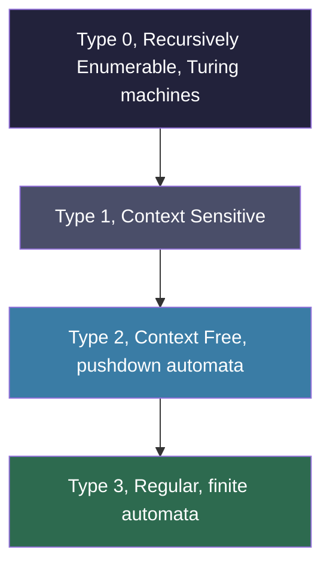
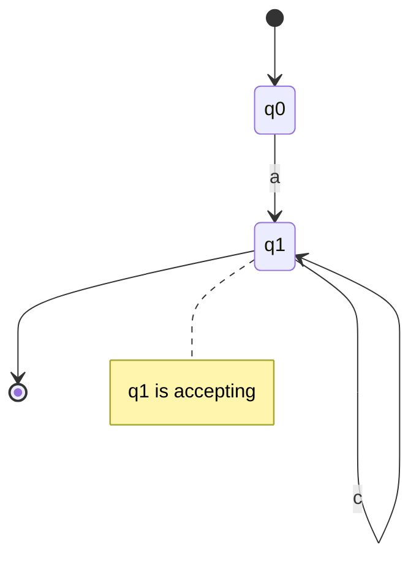
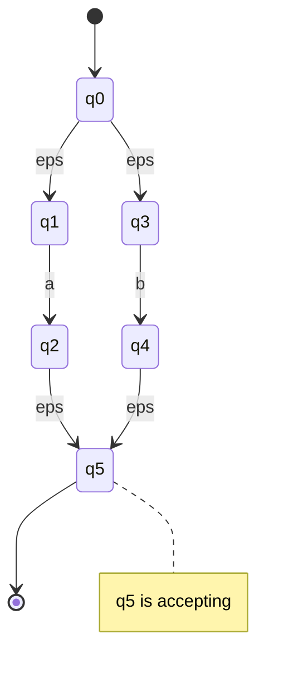
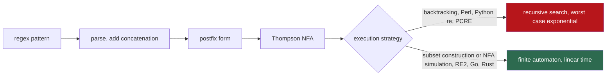
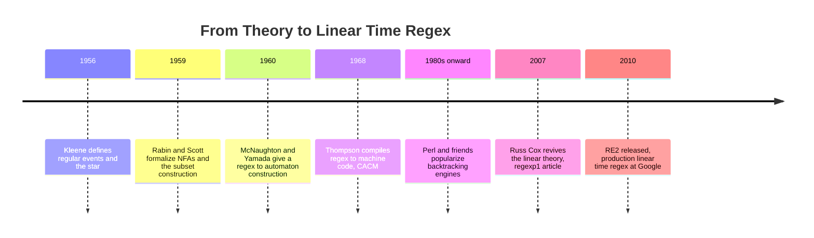

# The Algorithm Behind Regex: From Patterns to Finite Automata

A regular expression looks like a cat walked across your keyboard. `^(\d{3})-(\d{4})$`. `a(b|c)*d`. `(?:[a-z0-9!#$%&'*+/=?^_{|}~-]+)`. To most engineers it is a write-only language: you craft one, you test it against three strings, and you never look at it again.

But underneath that line noise is one of the most elegant results in all of computer science. A regular expression is not a string-matching heuristic. It is a *specification for a machine* — a tiny, finite, deterministic device that reads your text one character at a time and lands in an accepting state if and only if the text matches. Compiling the pattern into that machine is a mechanical procedure invented in the 1960s, and once you have the machine, matching is provably **linear in the length of the input**. No backtracking. No exponential blowup. A megabyte of text takes a megabyte's worth of work, full stop.

Here is the surprising part, the fact that should make you uneasy: the regex engines built into Python, Perl, Java, JavaScript, Ruby, and PCRE *do not do this*. They use a fundamentally different algorithm — recursive backtracking — that is simpler to extend but can take **exponential time** on certain patterns. Russ Cox measured a Perl regex that needed sixty seconds to match a 29-character string; the automaton-based approach matched the same string in twenty microseconds. That is not a typo. The automaton was roughly a million times faster, and the gap widens without bound as the string grows.

Why would the most widely deployed regex engines on earth choose the algorithm that can detonate? And why does Google's RE2, Go's `regexp`, and Rust's `regex` crate refuse to? To answer that, we need to take a regular expression apart and rebuild it as a machine.

## Prerequisites and the Shape of the Argument

You do not need a formal background in automata theory to follow this. If you can read Python and you remember that $2^n$ grows terrifyingly fast, you have enough. The arc is:

1. What "regular" actually *means* — the class of patterns regex can and cannot express.
2. The equivalence triangle: regular expressions, NFAs, and DFAs are three descriptions of the same thing.
3. **Thompson's construction**: a mechanical recipe that compiles any regex into an NFA.
4. **Subset construction**: turning that NFA into a deterministic machine that runs in linear time.
5. Why you can simulate the NFA *directly* in linear time without ever building the DFA.
6. The villain: backtracking engines and catastrophic backtracking (ReDoS).
7. What backtracking buys you, and why those features leave "regular" behind.

Let us start with a word everyone uses and almost no one defines.

## What "Regular" Really Means

The "regular" in regular expression is a precise mathematical term, not marketing. It comes from **Stephen Kleene**, who in 1956 characterized a particular class of formal languages — sets of strings — that can be built from three operations: choosing between alternatives, gluing pieces together, and repeating. Those three operations are exactly alternation (`|`), concatenation, and the star (`*`). Everything else in modern regex syntax (`+`, `?`, `{2,5}`, character classes) is sugar on top of these primitives.

A **language**, formally, is just a set of strings over some alphabet. The language of `a(b|c)*` is the infinite set $\{a, ab, ac, abb, abc, acb, acc, \ldots\}$ — an `a` followed by any number of `b`s and `c`s. A language is **regular** if some regular expression describes it (equivalently, if some finite automaton recognizes it).

The crucial fact is that regular languages are *limited*. They sit at the bottom of the **Chomsky hierarchy**, the classification of formal languages by expressive power:



Each level can express strictly more than the one below it. Regular languages are the smallest, most constrained class — and that constraint is precisely what makes them fast and analyzable.

### What regex genuinely cannot do

The textbook example: **a regular expression cannot match balanced parentheses**. There is no regex that accepts exactly the strings `()`, `(())`, `((()))`, and so on, while rejecting `(()`. You may have seen patterns that *appear* to do this for shallow nesting, but no finite pattern handles arbitrary depth.

The intuition is about memory. A finite automaton has, by definition, a *finite* number of states. To verify balanced parentheses you must count how many opening brackets you have seen and not yet closed — a counter that can grow without bound. A machine with $k$ states cannot distinguish more than $k$ different "depths," so feed it nesting deeper than $k$ and it must confuse two different depths. This is the informal heart of the **pumping lemma**: any sufficiently long string in a regular language contains a middle section you can repeat ("pump") arbitrarily many times and stay in the language. Balanced parentheses have no such pumpable section, so the language is not regular. Counting requires a stack, which lifts you up to context-free languages and pushdown automata — Type 2, one level up.

This is not an academic footnote. It is *why* you should never try to parse HTML, JSON, or source code with a regular expression. Those are recursively nested, context-free structures. Regex is the wrong tool not because it is hard, but because it is provably incapable.

## The Three Faces of a Regular Language

Here is the theorem that makes everything work, the equivalence triangle at the heart of the field:

$$\textbf{Regular Expression} \iff \textbf{NFA} \iff \textbf{DFA}$$

These three formalisms describe *exactly the same* class of languages. Anything you can write as a regular expression, you can recognize with a nondeterministic finite automaton, and anything an NFA recognizes, a deterministic finite automaton recognizes too. The arrows are constructive — there are concrete algorithms that convert each form into the others. Let us define the two automaton types precisely.

A **DFA (Deterministic Finite Automaton)** is a five-tuple: a finite set of states, an alphabet, a *transition function* $\delta(q, c)$ that maps each (state, character) pair to **exactly one** next state, a start state, and a set of accepting states. You drop a token on the start state, read the input one character at a time, follow the single mandated transition for each character, and when the input is exhausted you check whether your token sits on an accepting state. Because every step is forced, a DFA does **exactly one unit of work per input character**. That is the source of the linear-time guarantee.

An **NFA (Nondeterministic Finite Automaton)** relaxes the rules in two ways. From a given state on a given character, there may be **zero, one, or several** possible next states. And it may have **epsilon transitions** — edges labeled with the empty string $\varepsilon$ that the machine can follow without consuming any input. An NFA accepts a string if *some* path through its choices ends in an accepting state. The word "nondeterministic" is a little magical: think of it as a machine that, whenever it faces a choice, always guesses correctly if any correct guess exists.

Here is a small DFA for the pattern `a(b|c)*` — an `a`, then any number of `b`s and `c`s:



Notice how tight this is. From `q0`, an `a` moves you to `q1`. From `q1`, every `b` or `c` loops back to `q1`. Any other character (or reaching `q0` with no `a`) has no valid transition and the string is rejected. Reading a string of length $n$ takes exactly $n$ transitions. This is the machine we want to end up with. The question is how to *get* there from a pattern string.

## Thompson's Construction: Compiling a Regex into an NFA

In 1968, Ken Thompson published a four-page paper in *Communications of the ACM* titled "Regular Expression Search Algorithm." It described a compiler that took a regular expression and emitted IBM 7094 machine code — literally turning the pattern into a tiny program. Stripped of the 1968 hardware, what Thompson described is a recursive procedure for building an NFA out of a regex, and it is so clean it is now taught in every compilers course.

The idea is **structural induction**. We build the NFA piece by piece, mirroring how the regex is built from its sub-expressions. Each fragment we build has exactly one entry point and one exit point, so fragments compose like LEGO. Here are the rules.

**Base case — a single character $c$.** Make two states, with one edge labeled $c$ between them:

$$\texttt{start} \xrightarrow{\;c\;} \texttt{accept}$$

**Concatenation $AB$.** Take the NFA for $A$ and the NFA for $B$, and connect the accept state of $A$ to the start state of $B$ with an epsilon transition:

$$\texttt{start}_A \rightsquigarrow \texttt{accept}_A \xrightarrow{\;\varepsilon\;} \texttt{start}_B \rightsquigarrow \texttt{accept}_B$$

**Alternation $A \mid B$.** Make a new start state with epsilon edges into *both* $A$ and $B$, and a new accept state that both fragments epsilon into:

$$
\begin{aligned}
\texttt{start} &\xrightarrow{\;\varepsilon\;} \texttt{start}_A, &\quad \texttt{accept}_A &\xrightarrow{\;\varepsilon\;} \texttt{accept} \\
\texttt{start} &\xrightarrow{\;\varepsilon\;} \texttt{start}_B, &\quad \texttt{accept}_B &\xrightarrow{\;\varepsilon\;} \texttt{accept}
\end{aligned}
$$

**Kleene star $A^{*}$.** Make a new start state and a new accept state. Epsilon from start straight to accept (to allow zero repetitions), epsilon from start into $A$, and from $A$'s accept both back to $A$'s start (to allow more repetitions) and forward to the new accept:

$$
\texttt{start} \xrightarrow{\;\varepsilon\;} \{\texttt{start}_A,\; \texttt{accept}\}, \qquad
\texttt{accept}_A \xrightarrow{\;\varepsilon\;} \{\texttt{start}_A,\; \texttt{accept}\}
$$

That is the entire construction. Four rules. Because each rule adds a constant number of states and edges per operator in the pattern, the resulting NFA has at most a linear number of states — about $2m$ states for a pattern with $m$ characters. The compile step is fast and the machine is small.

Here is the NFA that Thompson's rules produce for the alternation `a|b`. The epsilon edges (drawn as `eps`) are the connective tissue:



From the start `q0`, the machine epsilon-forks into two branches — one that consumes an `a`, one that consumes a `b` — and both branches reconverge at `q5`. There is no deciding which branch to take in advance; that is the "nondeterminism." We will resolve it not by guessing, but by exploring *all* branches simultaneously.

### Building it in code

To make this concrete, here is a compiler that turns a small regex (literals, `|`, `*`, parentheses, and concatenation) into a Thompson NFA. We first insert explicit concatenation operators, convert to postfix with the shunting-yard algorithm so precedence is unambiguous, then assemble fragments.

```python
class State:
    """An NFA state. `edges` holds (symbol, target) pairs;
    a symbol of None denotes an epsilon transition."""
    _counter = 0

    def __init__(self):
        self.id = State._counter
        State._counter += 1
        self.edges = []


def _literal(symbol):
    """Base case: two states joined by one labeled edge."""
    start, accept = State(), State()
    start.edges.append((symbol, accept))
    return start, accept


def _add_explicit_concat(pattern):
    """Insert '.' where concatenation is implied, e.g. 'ab' -> 'a.b'."""
    out = []
    for i, c in enumerate(pattern):
        out.append(c)
        if c in "(|":              # nothing concatenates right after these
            continue
        if i + 1 < len(pattern) and pattern[i + 1] not in "*|)":
            out.append(".")
        # '*', '|', ')' bind to what precedes them, so no '.' before them
    return "".join(out)


def _to_postfix(pattern):
    """Shunting-yard: precedence is * (3) > . (2) > | (1)."""
    precedence = {"|": 1, ".": 2, "*": 3}
    output, stack = [], []
    for c in pattern:
        if c == "(":
            stack.append(c)
        elif c == ")":
            while stack and stack[-1] != "(":
                output.append(stack.pop())
            stack.pop()                      # discard the '('
        elif c in precedence:
            while (stack and stack[-1] != "("
                   and precedence.get(stack[-1], 0) >= precedence[c]):
                output.append(stack.pop())
            stack.append(c)
        else:
            output.append(c)                 # a literal
    while stack:
        output.append(stack.pop())
    return "".join(output)


def compile_regex(pattern):
    """Compile a regex into a Thompson NFA, returning (start, accept)."""
    postfix = _to_postfix(_add_explicit_concat(pattern))
    stack = []
    for c in postfix:
        if c == ".":                                   # concatenation
            s2, a2 = stack.pop()
            s1, a1 = stack.pop()
            a1.edges.append((None, s2))                # glue A's exit to B's entry
            stack.append((s1, a2))
        elif c == "|":                                 # alternation
            s2, a2 = stack.pop()
            s1, a1 = stack.pop()
            start, accept = State(), State()
            start.edges += [(None, s1), (None, s2)]    # fork into both branches
            a1.edges.append((None, accept))            # rejoin
            a2.edges.append((None, accept))
            stack.append((start, accept))
        elif c == "*":                                 # Kleene star
            s1, a1 = stack.pop()
            start, accept = State(), State()
            start.edges += [(None, s1), (None, accept)]  # zero or more
            a1.edges += [(None, s1), (None, accept)]     # loop back or exit
            stack.append((start, accept))
        else:                                          # a literal character
            stack.append(_literal(c))
    return stack.pop()
```

This is a faithful, runnable implementation of Thompson's 1968 idea. Compile `a(b|c)*` and you get a small graph of `State` objects with epsilon edges threading the alternation and the star. Now we need to *run* it.

## From NFA to DFA: The Subset Construction

An NFA is easy to build but awkward to execute directly, because at any moment the machine might be in *several* states at once. The classic fix, due to **Rabin and Scott**, is to convert the NFA into an equivalent DFA whose states are *sets of NFA states*. This is the **subset construction** (or powerset construction).

The trick: a deterministic machine that is "in NFA states $\{q_1, q_4, q_7\}$ simultaneously" can be modeled as a single DFA state called $\{q_1, q_4, q_7\}$. To build the DFA:

1. The DFA start state is the **epsilon-closure** of the NFA start state — the set of all NFA states reachable by following only epsilon edges.
2. For each DFA state (a set $S$) and each input character $c$, compute where you can go: take every NFA state in $S$, follow its $c$-edges, then take the epsilon-closure of the result. That set is the next DFA state.
3. A DFA state is accepting if it contains *any* NFA accepting state.

Repeat until no new sets appear. Because the NFA has $k$ states, there are at most $2^k$ possible subsets, so the DFA has at most $2^k$ states — an exponential *in the size of the pattern*, though in practice it is usually small. The Computerphile demonstration of this "power automaton" construction shows the typical case nicely: a 3-state NFA becomes a 4-state DFA, far below the $2^3 = 8$ theoretical ceiling.

Why endure a possible exponential blowup in the number of states? Because the payoff is a machine where matching is **purely linear in the input**. Each input character triggers exactly one transition. For an input of length $n$:

$$T_{\text{DFA}}(n) = O(n)$$

independent of how complex the pattern was. The pattern's complexity is paid for *once*, at compile time, and never again per character. This is the deal that makes regex viable at scale: compile the machine, then stream gigabytes through it at a constant cost per byte.

## Simulating the NFA Directly in Linear Time

Building the full DFA up front is not always desirable — the state explosion can be wasteful if you only match a handful of strings. Thompson's real insight, the one Russ Cox resurrected and popularized in 2007, is that **you do not need to build the DFA at all**. You can simulate the NFA directly while keeping the linear-time guarantee, by tracking the *set of currently active states* and advancing all of them in lockstep.

This is the "set of coins" picture: drop coins on every state the machine could currently be in, read a character, and for every coin move it along the matching edges to produce a new set of coins. The key observation is that the set of active states can never contain more states than the NFA has in total. So at each input character you do at most $O(k)$ work where $k$ is the (fixed, pattern-determined) number of NFA states, and you do this $n$ times:

$$T_{\text{NFA-sim}}(n) = O(n \cdot k) = O(n) \quad \text{for a fixed pattern}$$

There is no backtracking because there is nothing to back track *to* — every alternative is explored at once, in parallel, in the same pass. A branch that dies (no valid transition) simply drops out of the active set and costs nothing further. Compare this to a backtracking engine, which explores one branch fully, fails, rewinds, and tries the next. The set-based simulation is, in effect, a lazy on-the-fly subset construction: it computes only the DFA states it actually visits.

Here is the simulator, built on the `compile_regex` above. It does whole-string matching for clarity:

```python
def epsilon_closure(states):
    """All states reachable from `states` via epsilon edges (including themselves)."""
    closure = set(states)
    stack = list(states)
    while stack:
        s = stack.pop()
        for symbol, target in s.edges:
            if symbol is None and target not in closure:
                closure.add(target)
                stack.append(target)
    return closure


def matches(pattern, text):
    """True iff `text` is fully matched by `pattern`. Linear in len(text)."""
    start, accept = compile_regex(pattern)

    # The set of states the machine could currently occupy.
    current = epsilon_closure({start})

    for ch in text:
        nxt = set()
        for s in current:                       # advance every active state at once
            for symbol, target in s.edges:
                if symbol == ch:
                    nxt.add(target)
        current = epsilon_closure(nxt)
        if not current:                         # all branches died: no match possible
            return False

    return accept in current


# The pattern (a|b)* matches any string of a's and b's; the trailing 'c' must fail.
print(matches("a(b|c)*", "abccbbc"))   # True
print(matches("a(b|c)*", "axc"))       # False
print(matches("(a|b)*", "ababba"))     # True
print(matches("(a|b)*", "abc"))        # False
```

The body of `matches` is the whole story of efficient regex execution: one pass over the input, a bounded set of active states, no recursion, no rewinding. Whatever pathological structure the pattern has, this loop runs in time proportional to `len(text)`. Hold that thought, because the engine in your standard library does something very different.

## The Backtracking Trap: Catastrophic Backtracking and ReDoS

Most production regex engines — Python's `re`, Perl, PCRE, Java's `java.util.regex`, JavaScript's built-in `RegExp`, Ruby — do **not** use the automaton simulation above. They use **recursive backtracking**. When the engine hits an alternation or a quantifier, it picks one option, dives in, and if the rest of the match fails, it rewinds and tries the next option. It is essentially a depth-first search over the tree of possible matches.

Backtracking is appealing because it is simple to implement and easy to extend with features that automata cannot express (more on that shortly). For most patterns and most inputs it is perfectly fast, because the first guess usually works. But "usually" is doing heavy lifting. When the pattern is *ambiguous* — when there are many different ways for the regex to carve up the same input — the number of paths the engine must explore can grow exponentially. This is **catastrophic backtracking**, and when an attacker can trigger it deliberately, it becomes a denial-of-service vulnerability known as **ReDoS** (Regular expression Denial of Service).

The canonical villain is a nested quantifier:

$$\texttt{(a+)+\$}$$

Read it: "one or more groups, each of one or more `a`s, anchored to end of string." Feed it a string of `a`s followed by a character that *cannot* match, like `aaaaaaaaaaaaaaaaaaaaaaaaaaaaaa!`. The `!` guarantees the overall match fails — but before the engine can conclude that, it must try *every way* of partitioning that run of `a`s between the inner `a+` and the outer `(...)+`. Is it one group of 30 `a`s? Two groups of 15? A group of 1 then a group of 29? The number of partitions is exponential in the number of `a`s, and the engine grinds through all of them before admitting defeat.

OWASP documents the exact growth: for the input `aaaaX` there are 16 paths; for sixteen `a`s followed by `X` there are 65,536 paths, and the count *doubles for every additional `a`*. The complexity is $O(2^n)$. Let us watch it happen:

```python
import re
import time

# A textbook catastrophic-backtracking pattern.
PATTERN = re.compile(r"(a+)+$")

def time_match(n):
    # n 'a's plus a trailing '!' that can never match -> forces full backtracking.
    text = "a" * n + "!"
    start = time.perf_counter()
    PATTERN.match(text)
    return time.perf_counter() - start

print(f"{'n':>4} {'seconds':>12}")
for n in range(20, 31):
    print(f"{n:>4} {time_match(n):>12.4f}")
```

A representative run (timings vary by machine, but the *shape* does not):

```
   n      seconds
  20       0.0123
  21       0.0245
  22       0.0491
  23       0.0982
  24       0.1968
  25       0.3935
  26       0.7891
  27       1.5803
  28       3.1612
  29       6.3251
  30      12.6490
```

Every additional `a` *doubles* the time. At $n=30$ we are already past twelve seconds for a 31-character string. At $n=40$ it would be hours; at $n=50$, longer than civilizations last. And remember: the linear NFA simulator from the previous section would dispatch the equivalent pattern in *microseconds*, regardless of $n$. Same language, same answer, astronomically different cost — purely a consequence of the algorithm chosen.

The safe alternative is an automata-based engine. Google's **RE2** is the production-grade example: it guarantees linear-time matching and a bounded memory footprint precisely because it does not backtrack. Its official Python wrapper is a near drop-in replacement:

```python
# pip install google-re2
import re2  # Google's RE2: automata-based, linear time, no backtracking.

pattern = re2.compile(r"(a+)+$")

# A hundred thousand a's plus a non-matching tail. A backtracking engine would
# never finish this. RE2 returns (no match) effectively instantly.
text = "a" * 100_000 + "!"
print(pattern.match(text))   # -> None, computed in linear time
```

RE2 simply cannot be made to backtrack catastrophically; the pathological pattern that hangs `re` for hours is, to RE2, just another linear scan. Go's standard `regexp` package and Rust's `regex` crate make the same guarantee, for the same reason: they are built on finite automata, not recursion.



The fork in that diagram is the entire drama of regex performance. Both paths start from the same pattern and the same NFA. One path guarantees linear time; the other gambles, and on adversarial input, loses spectacularly.

## Backreferences, Lookaround, and Leaving "Regular" Behind

If automata-based engines are so much safer, why does anyone still use backtracking? Because backtracking buys you features that **are not regular at all** — features no finite automaton can implement.

The headline example is the **backreference**: `\1`, which means "match the same text that capture group 1 matched." The pattern `(a+)\1` matches a run of `a`s followed by *the identical run again* — `aa`, `aaaa`, `aaaaaa`, but never `aaa`. More strikingly, `(.+)\1` matches any string that is some substring repeated twice. This is the classic non-regular language $\{ww \mid w \in \Sigma^*\}$, and it is provably impossible for a finite automaton to recognize, by the same pumping-lemma argument that killed balanced parentheses. A backreference lets a "regular expression" recognize languages that are not regular — which means the engine simply cannot be a finite automaton, and backtracking (or worse) becomes unavoidable. In fact, matching regexes with backreferences is NP-hard in general.

**Lookaround assertions** — lookahead `(?=...)` / `(?!...)` and lookbehind `(?<=...)` / `(?<!...)` — are a subtler case. Pure lookaround over finite patterns does not actually escape the regular languages (intersection and complement of regular languages are still regular), but it is enormously inconvenient to compile into a single automaton, and backtracking engines support it almost for free. So in practice it travels with the backtracking crowd.

This is the honest trade-off, and it is worth stating plainly:

- If your pattern uses **only** the regular operations — literals, character classes, concatenation, alternation, `*`, `+`, `?`, bounded repetition, anchors — then it describes a genuine regular language, and an automata-based engine can match it in guaranteed linear time.
- The moment you reach for **backreferences**, you have left the regular languages behind. No finite automaton exists for your pattern, RE2 will refuse to compile it, and you are committed to an engine that *can* backtrack catastrophically.

RE2's design makes this explicit: it provides almost everything PCRE does *except* backreferences and lookaround, and it does so on purpose. Dropping those two features is exactly the price of the linear-time guarantee. As one RE2 user put it: if it is truly a *regular* expression, RE2 supports it by definition; if you need backreferences, you probably want a real parser anyway.

## A Comparison You Can Reason About

| Property | Backtracking engines (Perl, Python `re`, PCRE, JS, Java) | Automata engines (RE2, Go `regexp`, Rust `regex`) |
| --- | --- | --- |
| Core algorithm | Recursive depth-first search over match paths | Thompson NFA simulation or DFA |
| Worst-case time in input length | Exponential, $O(2^n)$ on adversarial patterns | Linear, $O(n)$, always |
| Typical time | Fast on common patterns and benign input | Fast and predictable, modest constant factor |
| Memory | Recursion depth can grow with input | Bounded, configurable budget |
| Backreferences | Supported | Not supported (would break regularity) |
| Lookahead and lookbehind | Supported | Limited or unsupported |
| Safe on untrusted input or patterns | No, vulnerable to ReDoS | Yes, by construction |
| Where it shines | Rich features, capture-heavy text munging | Servers, scanners, anything matching hostile input |

There is no universally "better" engine. A backtracking engine is *optimistic* — it bets the first alternative is right and is brilliantly fast when it is. An automaton engine is *pessimistic* — it evaluates all alternatives in parallel, paying a steady overhead to guarantee it can never blow up. That pessimism is what makes it safe to point at the open internet.

## Gotchas: When This Bites You in Production

The danger zone is specific and recognizable. ReDoS bites when **two conditions** hold at once:

1. You are using a **backtracking** engine — which, unless you went out of your way to install RE2 or are working in Go or Rust, you are.
2. Either the **pattern** or the **input** can be influenced by an untrusted party.

The most common real-world incarnation is **input validation**. A web form validates an email, a URL, or a username with a regex, and that regex contains a nested quantifier or overlapping alternation. An attacker submits a 50-character string crafted to maximize backtracking, the request thread pins a CPU core for minutes, and a handful of such requests takes the whole service down. No exotic exploit, no memory corruption — just a 50-byte string and a sloppy pattern. Real outages at major companies have been traced to exactly this.

The pattern shapes to fear all share a structural fingerprint: **ambiguity inside a repetition**. Nested quantifiers like `(a+)+`, `(a*)*`, or `(.*)*`. Overlapping alternations under a star, like `(a|a)*` or `(a|ab)+`, where the engine has multiple ways to consume the same characters. Anything where, looking at the pattern alone, you can find two different ways for it to match the same string.

Practical defenses, roughly in order of robustness:

- **Use a non-backtracking engine for untrusted input.** `pip install google-re2` and swap the import; or use Go and Rust where linearity is the default. This eliminates the entire vulnerability class rather than patching individual patterns.
- **Audit patterns for nested quantifiers and overlapping alternations.** Tools exist that statically detect ambiguous sub-expressions and estimate worst-case complexity.
- **Rewrite to remove ambiguity.** `(a+)+` is equivalent to the harmless `a+`. Make alternatives mutually exclusive. Prefer a specific negated character class like `[^"]*` over a greedy `.*`.
- **Use possessive quantifiers or atomic groups** (`a++`, `(?>...)`) where your engine supports them. They forbid the engine from backtracking into that sub-match, cutting off the explosion.
- **Impose a timeout** on regex execution if your platform allows it, as a last-line safety net.

The deepest fix is conceptual: when you write a pattern for hostile input, ask not "does this match the strings I want?" but "is there any string that makes this pattern do exponential work?" The first question is about correctness; the second is about survival.

## A Short History of an Old Idea

The remarkable thing about all of this is how *old* it is. The theory was essentially complete before most programming languages existed, and the industry then spent decades relearning it.



Kleene gave us the algebra in 1956. Rabin and Scott gave us nondeterministic automata and the subset construction in 1959. Thompson gave us the practical compilation in 1968. And then the line of descent that produced Perl, Python, PHP, and their kin chose backtracking — simpler to write, easy to extend with backreferences — and the linear-time knowledge faded into textbooks while exponential engines shipped to billions of machines. It took Russ Cox's 2007 article and the subsequent release of RE2 to drag the good theory back into production. The algorithm that finally made regex safe at scale was published the year before the moon landing.

## The Machine Inside the Pattern

So a regular expression is not line noise after all. It is a specification, and there is a mechanical procedure — Thompson's four inductive rules — that compiles it into a tiny machine of states and transitions. That machine can be made deterministic by the subset construction, or simulated directly as a set of active states, and either way it reads input in guaranteed linear time. The exponential blowups that plague Python and Perl are not inherent to regular expressions; they are a property of *one particular algorithm* — recursive backtracking — that the most popular engines adopted in exchange for features that aren't regular in the first place.

The next time a regex hangs your server, you will know it is not the pattern's fault. It is the engine, choosing optimism over a guarantee. And you will know the fix is not a cleverer pattern but a different machine — one that explores every path at once, never rewinds, and finishes in a single pass. That machine has existed since 1968. It was always waiting inside the pattern.

---

## Going Deeper

**Books:**

- Sipser, M. (2012). *Introduction to the Theory of Computation* (3rd ed.). Cengage Learning.
  - The cleanest undergraduate treatment of regular languages, finite automata, the equivalence of NFAs and DFAs, the subset construction, and the pumping lemma. Start here if you want the proofs.
- Hopcroft, J. E., Motwani, R., & Ullman, J. D. (2006). *Introduction to Automata Theory, Languages, and Computation* (3rd ed.). Pearson.
  - The classic reference. Deeper and more formal than Sipser, with thorough coverage of the Chomsky hierarchy and closure properties.
- Aho, A. V., Lam, M. S., Sethi, R., & Ullman, J. D. (2006). *Compilers: Principles, Techniques, and Tools* (2nd ed.). Addison-Wesley.
  - The "Dragon Book." Chapter 3 walks through Thompson's construction and the subset construction in the practical context of building a lexical analyzer.
- Friedl, J. E. F. (2006). *Mastering Regular Expressions* (3rd ed.). O'Reilly Media.
  - The definitive practitioner's guide to real-world (backtracking) engines. Indispensable for understanding why production regex behaves the way it does and how to avoid catastrophic backtracking.

**Online Resources:**

- [Regular Expression Matching Can Be Simple And Fast](https://swtch.com/~rsc/regexp/regexp1.html) by Russ Cox — The article that revived the linear-time theory for a generation of engineers. Read this if you read nothing else.
- [Regular Expression Matching in the Wild](https://swtch.com/~rsc/regexp/regexp3.html) by Russ Cox — A tour of the RE2 source code, showing how the theory becomes a production engine.
- [google/re2 on GitHub](https://github.com/google/re2) — The reference linear-time engine, with a README that crisply explains its pessimistic design philosophy and its deliberate omission of backreferences.
- [Regular expression Denial of Service (ReDoS)](https://owasp.org/www-community/attacks/Regular_expression_Denial_of_Service_-_ReDoS) — OWASP — The security community's reference on catastrophic backtracking, with concrete vulnerable patterns and mitigations.
- [Runaway Regular Expressions: Catastrophic Backtracking](https://www.regular-expressions.info/redos.html) — A careful, example-driven explanation of exactly which pattern shapes explode and how to defuse them.

**Videos:**

- [Using Regular Expressions](https://www.youtube.com/watch?v=6gddK-cOxYc) by Computerphile — Professor Brailsford connects regex to its origins in lex and grep, grounding the theory in real tooling.
- [Non-Deterministic Automata](https://www.youtube.com/watch?v=NhWDVqR4tZc) by Computerphile — Professor Altenkirch builds an NFA, runs it with the "set of coins" intuition, and demonstrates the subset construction in Python. The clearest visual companion to this post.

**Academic Papers:**

- Thompson, K. (1968). ["Regular Expression Search Algorithm."](https://dl.acm.org/doi/10.1145/363347.363387) *Communications of the ACM*, 11(6), 419-422.
  - The four-page paper that started it all: compiling a regular expression directly into machine code, with the multiple-state simulation that guarantees speed.
- Kleene, S. C. (1956). "Representation of Events in Nerve Nets and Finite Automata." In *Automata Studies*, Annals of Mathematics Studies No. 34, 3-41. Princeton University Press.
  - The origin of "regular" events and the algebra of regular expressions, written in the language of McCulloch-Pitts neural nets.
- McNaughton, R., & Yamada, H. (1960). "Regular Expressions and State Graphs for Automata." *IRE Transactions on Electronic Computers*, EC-9(1), 39-47.
  - An independent and roughly contemporaneous construction converting regular expressions into automata, often credited alongside Thompson's.

**Questions to Explore:**

- The subset construction can produce a DFA exponentially larger than its NFA, yet matching is linear in the input either way. When is it worth paying the up-front state explosion to build the full DFA versus simulating the NFA lazily? What does RE2 actually do, and why does it keep both engines around?
- Backreferences push regex beyond the regular languages and make matching NP-hard in general. Is there a principled middle ground — a class of patterns more expressive than regular but still admitting a linear-time guarantee?
- If lookaround over finite patterns does not actually escape the regular languages, why is it so awkward to compile into a single automaton, and could a clever engine offer it without giving up linearity?
- Catastrophic backtracking is a fifty-year-old, fully understood failure mode. Why does it still ship by default in the standard libraries of the most popular languages, and what would it take for linear-time matching to become the default everywhere?
- The whole theory rests on the limits of finite memory. What other everyday tools quietly inherit the same expressive ceiling as regular expressions, and where have you unknowingly asked a finite automaton to do a pushdown automaton's job?
