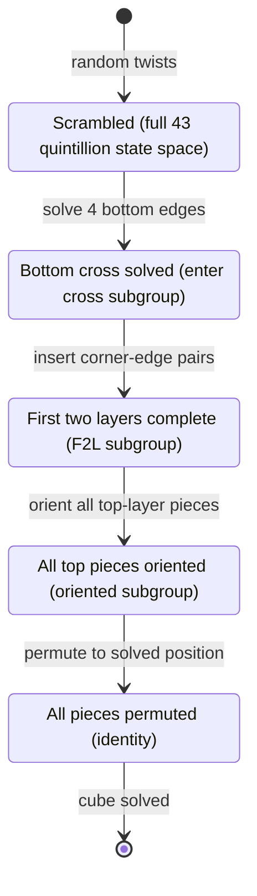
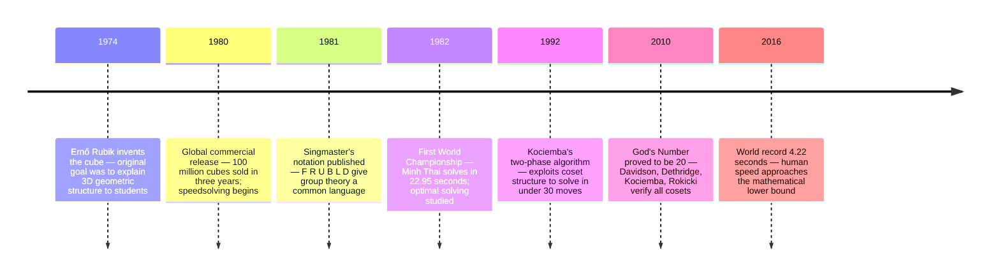

# Solving the Rubik's Cube Using Group Theory

## The Unexpected Beauty of Twisting Colors

The Rubik's cube: satisfying clicks of rotation, the frustration of scrambling it beyond recognition, and that fundamental question—*Is there a pattern hiding beneath this chaos?*

Abstract algebra reveals the answer: **the Rubik's cube is a physical manifestation of group theory**. Every twist, every algorithm, every solution is navigating through an elegant mathematical structure with over 43 quintillion elements.

This isn't just about solving the cube faster. It's about understanding *why* certain move sequences work, *how* algorithms were discovered, and the profound connection between abstract mathematics and tangible reality.

## From Plastic Toy to Mathematical Universe

### When Intuition Meets Structure

The Rubik's cube puzzle provides a perfect bridge between the concrete and the abstract. When you rotate a face of the cube, you're not just moving colored stickers—you're performing a **group operation** on a set of permutations. This realization transforms how we approach the puzzle entirely.

### The Cube Group: A Universe in Your Hands

Think of the Rubik's cube as a universe with laws. In mathematics, we call such structured universes **groups**. The cube group $G$ has remarkable properties:

- **Each element** is a unique configuration—one specific arrangement of all those colored squares
- **The operation** is simply "do one configuration, then another" (composition of moves)
- **The identity** is your goal: the pristine, solved state
- **Every scramble has an antidote**: every configuration has an inverse that undoes it

But here's the remarkable fact: the total number of possible configurations is:

$$|G| = \frac{8! \times 3^7 \times 12! \times 2^{11}}{12} = 43,252,003,274,489,856,000$$

That's **43 quintillion** possible states—more than the number of grains of sand on all Earth's beaches. Yet they're all organized into a single, coherent mathematical structure.

### Decoding the Formula: Why These Numbers?

Let's break down this remarkable formula piece by piece—each term represents a fundamental constraint imposed by the cube's physical structure:

**$8!$ - Corner Permutations**  
There are 8 corner pieces, and they can be arranged in $8!$ (40,320) different ways. Each corner can sit in any of the 8 corner positions.

**$3^7$ - Corner Orientations**  
Each corner has 3 possible orientations (which of its three colored faces points up). You might expect $3^8$, but here's the catch: once you've oriented 7 corners, the 8th corner's orientation is *determined* by the constraint that the total twist must be zero (mod 3). You can't arbitrarily twist just one corner—the physics won't allow it.

**$12!$ - Edge Permutations**  
There are 12 edge pieces that can be arranged in $12!$ ways (about 479 million arrangements).

**$2^{11}$ - Edge Orientations**  
Each edge can be flipped or not flipped (2 orientations). But again, once you've oriented 11 edges, the 12th is determined—you can't flip a single edge in isolation.

**÷ 12 - The Parity Constraint**  
This is the most subtle part. The division by 12 comes from two independent constraints:
- **÷ 2**: You cannot perform a single swap of two pieces (odd permutation). Every legal move performs an even permutation. This eliminates half of all theoretically possible configurations.
- **÷ 3**: There's a hidden constraint linking corner and edge positions. The total permutation parity of corners, combined with the total permutation parity of edges, must satisfy specific mathematical relationships.
- **÷ 2**: An additional constraint on corner permutations when edges are fixed.

These aren't arbitrary rules—they're mathematical *necessities* that emerge from the cube's mechanical construction. If you disassemble a cube and reassemble it randomly, you have only a 1-in-12 chance of creating a solvable configuration.

If you started at the solved state and randomly twisted the cube once per second, you'd need over a trillion years to visit every configuration once. The universe in your hands is vast, yet beautifully ordered.

## The Language of Cube Manipulation

### Generators: The Alphabet of Movement

Imagine you could speak only six words, but with them, you could describe every journey through that 43-quintillion-state universe. Those six words are the **generators** of the cube group:

- **F** (Front): Rotate the front face clockwise
- **B** (Back): Rotate the back face clockwise  
- **R** (Right): Rotate the right face clockwise
- **L** (Left): Rotate the left face clockwise
- **U** (Up): Rotate the top face clockwise
- **D** (Down): Rotate the bottom face clockwise

Each generator is a complete sentence on its own, and they follow a beautiful rule: **four quarter-turns bring you home**. Mathematically, $X^4 = e$ where $e$ is the identity (the solved state). Turn any face four times, and you're back where you started—a fundamental symmetry.

But the real magic happens when we combine these generators into longer sequences. Just as letters form words and words form sentences, basic moves combine into algorithms that tell sophisticated stories.

### Commutators: The Surgery Tools

Here's where group theory becomes a practical superpower. A **commutator** is a specific sequence of moves defined by $[A, B] = ABA^{-1}B^{-1}$. It reads like a recipe: "Do operation A, do operation B, undo A, undo B."

In everyday operations like addition, this would return you exactly to where you started: $(+5)(+3)(-5)(-3) = 0$. But the cube's structure is **non-commutative**—the order matters. This creates something remarkable: **controlled, localized changes**.

**Practical Example: The Corner 3-Cycle**

Let's look at a real-world example used in blindfolded solving. We want to cycle three corners without messing up the rest of the cube. This is the foundation of advanced solving methods.

Let:
- $A = R U R'$ (Insert-extract move: affects the front-right-top corner)
- $B = D$ (Rotates the bottom layer, repositioning which corners A will affect)

Now, apply the commutator $[A, B] = ABA^{-1}B^{-1}$:

1. **$A$**: `R U R'` — Move a top corner into the bottom-right position
2. **$B$**: `D` — Rotate the bottom layer (now a *different* corner is in that position)
3. **$A^{-1}$**: `R U' R'` — Undo the first move (but now it affects a different corner!)
4. **$B^{-1}$**: `D'` — Restore the bottom layer

**Result:** Three corners have cycled positions (UFR → DFR → DBR → UFR). Everything else returns to its original state. It's surgical precision—the mathematical equivalent of performing heart surgery while keeping the rest of the body perfectly still.

This is how you perform "surgery" on the cube—isolating specific pieces while leaving the rest of the patient (the cube) stable. Every advanced solving method—from blindfolded solving to FMC (Fewest Moves Challenge)—relies heavily on commutators.

### Conjugation: Moving the Operating Room

If commutators are the scalpel, **conjugation** is the ability to move your operating room. The formula $XYX^{-1}$ means: "set up, operate, undo setup."

**Example:**
Suppose you know the commutator `[R U R', D]` swaps three specific corners. But what if you need to swap three *different* corners?

**Solution:** Use conjugation.
- $X = U$ (rotates the top layer, changing *which* corners will be affected)
- $Y = [R U R', D]$ (the commutator we know)
- $X^{-1} = U'$ (undoes the setup)

The sequence $U [R U R', D] U'$ now performs the *same operation* (a 3-cycle) but on a *different set* of corners. Same tool, different location—conjugation lets you transplant your surgical technique anywhere on the cube.

## The Law of Parity: Why Some Scrambles Are Impossible

Have you ever reassembled a cube after cleaning it, only to find it impossible to solve? You're one move away, but that last piece just won't cooperate. You've violated the **Law of Parity**.

### The Mathematical Proof

In group theory, every permutation can be classified as either **even** (composed of an even number of transpositions) or **odd** (odd number).

**Observation:** A single quarter-turn of any face moves 4 edges and 4 corners. A 4-cycle can be decomposed into 3 transpositions (swaps):
- Cycle (A B C D) = Swap(A,B) + Swap(B,C) + Swap(C,D)

So one face turn involves:
- Edge 4-cycle: 3 transpositions
- Corner 4-cycle: 3 transpositions  
- **Total: 6 transpositions (an even number)**

**Conclusion:** Every valid cube move performs an *even* permutation of the pieces.

### Why You Can't Flip One Edge

A single flipped edge would require exactly *one* swap of its two colored facelets. But 1 is an odd number, and we just proved that every legal move must perform an even permutation.

**Therefore:** It is mathematically impossible to flip a single edge using valid moves.

If your cube has a single flipped edge, you must take it apart to fix it. The mathematics doesn't lie—you've entered a parallel universe of unsolvable configurations, one of the $(12 \times$ total positions) that aren't in the legal cube group.

### The 1-in-12 Mystery

Remember that ÷12 in our formula? Here's what it means practically:

If you disassemble a cube and randomly reassemble it:
- 50% chance: odd permutation of pieces (unsolvable)
- 33% of remaining: wrong corner orientation sum (unsolvable)
- 50% of remaining: wrong edge orientation sum (unsolvable)
- Additional 2× constraint from corner-edge permutation relationship

**Result:** Only 1 in 12 random reassemblies creates a legally solvable cube. The other 11 configurations are mathematically banished from the cube group—you can never reach them by turning faces.

## Algorithms: Paths Through the Group

### The "Sune": A Case Study in Elegance

Let's dissect one of the most famous algorithms in cubing: the **Sune** → `R U R' U R U2 R'`

Speedcubers use this to orient three corners on the top layer. But *why* does it work?

**Group-Theoretic Analysis:**

The Sune is fundamentally a clever combination of commutators and conjugates. If we look at its structure:
- It involves primarily $R$ and $U$ moves—two generators that don't commute
- The sequence has order 6: performing it 6 times returns you to solved
- It's actually closely related to the commutator $[R, U]$ but refined to affect *only* corner orientations while preserving everything else

The algorithm cycles three corners and twists them, but crucially:
- **Edge positions:** Unchanged
- **Edge orientations:** Unchanged  
- **Bottom two layers:** Completely preserved
- **Top corner positions:** Unchanged
- **Top corner orientations:** Three corners twisted

It isolates the "corner orientation" subgroup of the top layer—a brilliant exploitation of the cube's mathematical structure. Every algorithm in CFOP, Roux, ZZ, or any other method is a carefully discovered element of the cube group, chosen because it navigates precisely to the subgroup we need.

## Subgroups: Solving by Layers of Structure

The cube group isn't just a massive, formless blob of 43 quintillion elements. It has **internal structure**—smaller groups nested inside the larger one.

### Examples of Subgroups

**1. The $\langle U, D \rangle$ Subgroup**  
If you only turn the top and bottom faces, you can never affect the middle layer edges. The set of all configurations reachable with just $U$ and $D$ moves forms a subgroup—much smaller than the full group, but still a valid group with all the required properties.

**2. The "Edges-Only" Subgroup**  
Imagine all corners are solved, and you can only move edges. This forms a subgroup. Layer-by-layer methods exploit this: solve corners first (reach the corners-solved subgroup), then solve edges within that constraint.

**3. The "Superflip" Subgroup**  
All edges flipped in place, corners solved. This configuration has **order 2**—do it twice and you're back to solved. It generates a subgroup containing only two elements: $\{e, \text{superflip}\}$. Simple, yet this configuration requires exactly 20 moves—it's maximally distant from the identity.

### Exploiting Subgroups in Solving Methods

**Beginner's Layer-by-Layer Method:**
1. Solve bottom layer (enter the "bottom-solved" subgroup)
2. Solve middle layer (enter smaller "two-layers-solved" subgroup)
3. Solve top layer (reach identity element)

Each step restricts you to a smaller and smaller subgroup, like Russian nesting dolls of mathematical structure.

**CFOP Method:**  
Explicitly separates the group into:
1. Cross + F2L: Build the first two layers
2. OLL: Orient all pieces (enter the "all-pieces-oriented" subgroup)
3. PLL: Permute pieces (navigate within oriented subgroup to identity)

This separation is only possible because orientation and permutation form different subspaces of the cube group.

The state diagram below maps the CFOP solving stages as a sequence of transitions through progressively smaller subgroups—each step reducing the search space until only the identity remains.



## God's Number: The Diameter of the Universe

### Twenty Moves to Anywhere

Imagine you're lost in that 43-quintillion-state universe. What's the farthest you could possibly be from home?

For the 3×3×3 Rubik's cube, **God's Number is 20**.

No matter how scrambled your cube appears—whether it's been randomly twisted for hours or carefully arranged to maximize distance—there exists a sequence of *at most 20 moves* that solves it.

### The Cayley Graph: Visualizing the Group

In group theory, we can visualize a group's structure as a **Cayley graph**:
- Each **node** represents one configuration (one of the 43 quintillion)
- Each **edge** connects configurations differing by a single generator move ($R$, $U$, $F$, etc.)
- The **diameter** is the longest shortest path between any two nodes

God's Number is the diameter of this graph. Finding it required:
- Splitting the problem into billions of subproblems (using cosets)
- Exploiting symmetry to reduce computation
- Thousands of hours of CPU time on Google's computers
- A 2010 breakthrough by Davidson, Dethridge, Kociemba, and Rokicki

The path from toy to theorem spans nearly four decades of incremental mathematical and computational progress.



### The Superflip: An Antipode

The **Superflip** is one of the few known configurations requiring the full 20 moves. In this state:
- Every edge is flipped in place
- All corners are solved
- It looks eerily organized, yet it's maximally distant

The superflip represents an **antipode** in the Cayley graph—a point on the opposite "side" of the group structure from the identity. Its algorithm is:
```
U R2 F B R B2 R U2 L B2 R U' D' R2 F R' L B2 U2 F2
```

Twenty moves. Not nineteen, not twenty-one. Exactly twenty. The mathematics determines this with absolute certainty.

## Bringing Group Theory to Life: Implementation

One of the most satisfying aspects of this mathematical framework is how naturally it translates to code. We can represent the cube not as a 3D array of colors, but as **permutation vectors**—the native language of group theory.

### Encoding the Group in Python

```python
import numpy as np

class RubiksCube:
    """
    Represents the Rubik's Cube as elements of a permutation group.
    State is encoded as a permutation of the 48 movable facelets.
    """
    
    def __init__(self):
        # Identity element: solved state
        self.state = np.arange(48)
    
    def apply_move(self, move_permutation):
        """
        Group operation: composition of permutations.
        This is the fundamental operation of the cube group.
        """
        self.state = self.state[move_permutation]
        return self
    
    def inverse_move(self, move_permutation):
        """
        Every element has an inverse.
        Applying a move three times is equivalent to its inverse.
        """
        inverse = np.empty_like(move_permutation)
        inverse[move_permutation] = np.arange(len(move_permutation))
        return self.apply_move(inverse)
    
    def is_solved(self):
        """Check if we've reached the identity element."""
        return np.array_equal(self.state, np.arange(48))

def calculate_order(move_permutation):
    """
    Calculate the ORDER of a group element:
    How many times must we apply this move to return to identity?
    
    This is a fundamental property of group elements.
    """
    state = np.arange(48)
    count = 0
    
    while True:
        state = state[move_permutation]
        count += 1
        if np.array_equal(state, np.arange(48)):
            return count
        if count > 1260:  # Maximum possible order for cube
            return float('inf')

# Example: Define R move as a permutation
R_move = [0, 1, 2, 3, 4, 5, ...]  # 48-element permutation

# Order of R: should be 4 (R^4 = identity)
print(f"Order of R: {calculate_order(R_move)}")

# Order of Sune: should be 6
sune = compose(R, U, R_inv, U, R, U, U, R_inv)
print(f"Order of Sune: {calculate_order(sune)}")
```

### Why This Representation Matters

This isn't just convenient notation—it's **mathematics speaking through code**. When you implement moves as permutations:
- Composition becomes array indexing
- Inverses are mathematically guaranteed to exist
- Element order is computable
- Subgroups can be identified algorithmically
- Cayley graphs can be constructed

The code *is* the group theory, made executable.

### Kociemba's Two-Phase Algorithm: Cosets in Action

Herbert Kociemba's famous solving algorithm uses an advanced group theory concept: **cosets**.

The idea:
1. **Phase 1:** Get to the subgroup $H$ where:
   - Edge orientation is correct
   - E-slice edges are in E-slice (though possibly permuted)
   
2. **Phase 2:** Solve within subgroup $H$ using only moves from $\langle U, D, R2, L2, F2, B2 \rangle$

Why does this work? The full group $G$ can be partitioned into **cosets** of $H$: disjoint sets of configurations that are "equally far" from $H$. Phase 1 navigates to $H$, then Phase 2 navigates within $H$ to the identity.

This reduces the search space dramatically and is how optimal solvers achieve their speed.

## The Profound in the Playful

### What the Cube Teaches Us

The Rubik's cube is more than a puzzle—it's a **bridge between abstract mathematics and tangible reality**. It proves that some of humanity's deepest intellectual achievements aren't locked away in textbooks but can be held in your hands, twisted with your fingers, and understood through play.

Group theory doesn't just explain *why* solving methods work—it reveals the *inevitability* of those methods. The algorithms we discover aren't arbitrary tricks; they're natural paths through a mathematical landscape that exists whether we acknowledge it or not.

We didn't invent the cube group—we merely discovered it, packaged in colored plastic.

### The Broader Lesson

This pattern repeats throughout mathematics and science:
- **Crystallography**: The 230 space groups that describe all possible crystal structures
- **Quantum Mechanics**: Symmetry groups determine particle properties and conservation laws  
- **Cryptography**: The RSA algorithm relies on group properties of modular arithmetic
- **Chemistry**: Molecular symmetry groups predict reaction mechanisms

Behind every system with structure and symmetry, there's often a group. The Rubik's cube is just the most colorful, playful example—a $10 toy that encodes graduate-level mathematics.

### Your Turn

Next time you pick up a Rubik's cube, pause before that first twist. You're not just moving colored stickers—you're:
- Performing a group operation in a 43-quintillion-element space
- Navigating a Cayley graph with diameter 20
- Respecting parity constraints that eliminate 11/12 of all theoretical configurations
- Composing generators into carefully chosen group elements
- Exploiting commutators for localized changes
- Using conjugation to reposition your operations

The mathematics was always there, in every twist you ever made. Now you can see it.

---

## Going Deeper: Practical Exercises

**Exercise 1: Verify Element Order**  
Take a solved cube and perform the sequence `R U R' U'` exactly 6 times. You should return to solved. This demonstrates that this commutator has order 6 in the cube group.

**Exercise 2: Explore Parity**  
Try to devise a sequence that swaps exactly two corners and nothing else. You'll find it impossible—this would violate the parity constraint. Any two-corner swap must be accompanied by a two-edge swap.

**Exercise 3: Build Your Own Commutator**  
Choose two moves that don't commute much (like $R$ and $F$). Try the commutator $[R, F] = R F R' F'$. What pieces does it affect? How localized is the change?

**Exercise 4: Conjugation Practice**  
Learn a simple algorithm (like the Sune). Then conjugate it with a $U$ move: $U (\text{Sune}) U'$. Notice how it performs the *same operation* on *different pieces*.

**Exercise 5: Subgroup Exploration**  
Scramble only with $U$ and $D$ moves. Can you solve it using only $U$ and $D$ moves? You're exploring the $\langle U, D \rangle$ subgroup.

## Going Deeper

**Books:**

- Joyner, D. (2008). *Adventures in Group Theory: Rubik's Cube, Merlin's Machine, and Other Mathematical Toys.* 2nd ed. Johns Hopkins University Press. — The definitive book written specifically for this intersection. Covers group theory through the lens of puzzles, with full mathematical rigor. The Rubik's cube chapters are the most accessible introduction to abstract algebra available.

- Carter, N. (2009). *Visual Group Theory.* Mathematical Association of America. — Makes abstract algebra visual through software-generated Cayley diagrams and group tables. If abstract algebra feels opaque, this book is the antidote. [The companion software](http://groupexplorer.sourceforge.net/) lets you explore groups interactively.

- Dummit, D.S., & Foote, R.M. (2003). *Abstract Algebra.* 3rd ed. Wiley. — The comprehensive graduate-level reference. Overkill for understanding the cube group, but invaluable if the material here sparks a deeper interest in algebra.

**Videos:**

- ["Group Theory and the Rubik's Cube"](https://www.youtube.com/watch?v=SCnilXbxfMo) by Mathologer — The best mathematical treatment of the cube on YouTube. Covers the group structure, commutators, conjugates, and parity with beautiful animations. An hour well spent.

- ["Why You Can't Flip One Edge"](https://www.youtube.com/watch?v=7a40O_LXPV4) by J Perm — A focused video on the parity constraint that eliminates 11/12 of all apparent configurations. Clear, short, and visually compelling.

- ["Abstract Algebra — Group Theory"](https://www.youtube.com/playlist?list=PLi01XoE8jYoi3SgnnGorR_XOW3IcK-TP6) by Socratica — A well-produced lecture series that covers all the algebra you need to fully understand the cube group: groups, subgroups, homomorphisms, cosets, and Lagrange's theorem.

**Online Resources:**

- [GAP — Groups, Algorithms, Programming](https://www.gap-system.org/) — A free computer algebra system specialized for computational group theory. You can define the Rubik's cube group in GAP and compute its order, center, derived series, and subgroup lattice. The documentation includes Rubik's cube examples.
- [Cube20.org](http://www.cube20.org/) — The original site announcing the proof that God's Number is 20. Explains the computational approach and the 35 CPU-years it required.
- [Speedsolving.com Wiki](https://www.speedsolving.com/wiki/) — Extensive database of algorithms with group-theoretic explanations of why they work.

**Key Papers:**

- Rokicki, T., Kociemba, H., Davidson, M., & Dethridge, J. (2010). ["God's Number is 20."](http://www.cube20.org/) — The proof that every Rubik's cube position can be solved in 20 moves or fewer (half-turn metric). The most famous result in competitive cubing mathematics, achieved through a combination of group theory and distributed computation using 35 CPU-years donated by Google.

- Singmaster, D. (1981). *Notes on Rubik's Magic Cube.* Enslow Publishers. — The original mathematical treatment by the person who developed the standard cube notation (R, L, U, D, F, B). Singmaster's notation is what every cuber and every algorithm uses today.

**Questions to Explore:**

What is the center of the Rubik's cube group—the set of elements that commute with everything—and what does it correspond to physically? How does the group change if you allow center piece rotation (which the standard model ignores)? What other physical puzzles have been analyzed with group theory, and which are harder than the Rubik's cube?
