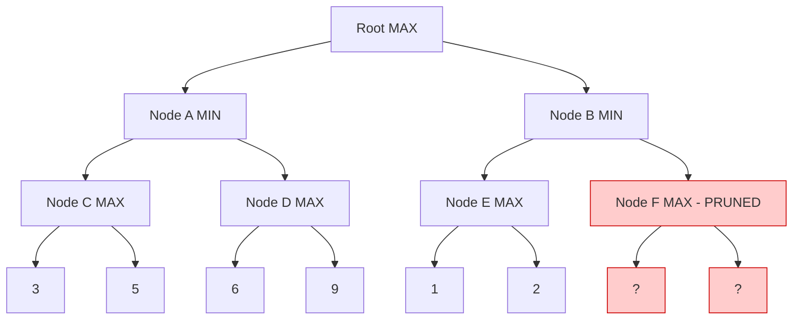
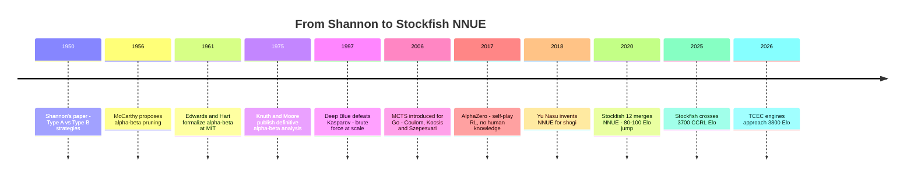

# Shannon's Number: Why Chess Is "Uncomputable" and Why Computers Beat Us Anyway

There is a number so large that if every atom in the observable universe were a computer, and each of those computers had been running since the Big Bang, they still would not have finished counting to it. That number describes the game of chess. Not some exotic mathematical construction, not a hypothetical monster dreamed up to break a proof. Chess. The thing you played with your grandfather on rainy afternoons.

The number is roughly $10^{120}$, and the man who first wrote it down was Claude Shannon, the father of information theory, in a paper published in March 1950. Shannon was not trying to solve chess. He was trying to think clearly about what it would take for a machine to play it. In doing so he drew a map of a wilderness so vast that no computer will ever cross it completely — and then, almost as an afterthought, sketched the path that machines would eventually use to win anyway.

This is the story of that number, the impossibility it represents, and the profoundly clever trick that renders the impossibility irrelevant.

## The Paper That Started Everything

In 1950, Claude Shannon published "Programming a Computer for Playing Chess" in *The Philosophical Magazine*. It was, as far as anyone knows, the first serious technical paper on computer chess. Shannon was working at Bell Telephone Laboratories, and the paper reads less like a research contribution than like a letter from the future — methodical, calm, laying out ideas that would take decades to fully implement.

Shannon's central observation was simple. Chess is a game of perfect information with a finite number of positions. In principle, a sufficiently powerful machine could calculate the optimal move from any position by examining every possible continuation to the end of the game. The game tree — the branching structure of all possible move sequences — is finite. Therefore chess is, in theory, solvable.

And then Shannon did the arithmetic.

## Deriving the Number

Shannon's estimate starts from two observations about a "typical" chess game:

1. At any given position, there are roughly **30 legal moves** available.
2. A typical game lasts about **80 plies** (a ply is a half-move — one player's turn — so 80 plies means 40 moves by each side).

The game tree, then, has approximately:

$$
30^{80} \approx 10^{118} \approx 10^{120}
$$

nodes. Shannon rounded to $10^{120}$, and the number stuck.

Let's be precise about where this comes from. The branching factor $b = 30$ is an average — in the opening there are 20 legal first moves for White, in complex middlegame positions there can be 40 or more, and in endgames the number drops. Shannon chose 30 as a reasonable geometric mean. The depth $d = 80$ is likewise an average game length, measured in plies.

The total number of leaf nodes in a uniform tree of branching factor $b$ and depth $d$ is:

$$
N = b^d = 30^{80}
$$

To convert to a power of 10:

$$
\log_{10}(30^{80}) = 80 \cdot \log_{10}(30) = 80 \times 1.477 = 118.16
$$

So $N \approx 10^{118}$, which Shannon rounded to $10^{120}$ to account for the fact that some positions have more than 30 legal moves and some games last longer than 80 plies. The number has been called **Shannon's number** ever since.

### How big is $10^{120}$?

The observable universe contains roughly $10^{80}$ atoms. Shannon's number is $10^{40}$ times larger — that is, you would need $10^{40}$ copies of the observable universe to have one atom for each node in the chess game tree. Written out, $10^{40}$ is:

$$
10{,}000{,}000{,}000{,}000{,}000{,}000{,}000{,}000{,}000{,}000{,}000{,}000{,}000
$$

The age of the universe in nanoseconds is about $4.3 \times 10^{26}$. If a computer evaluated one billion positions per nanosecond — far beyond anything currently built — it could examine roughly $4.3 \times 10^{35}$ positions in the lifetime of the universe. That is $10^{85}$ times too few.

No brute-force search of the full game tree will ever be completed. Not by any machine that obeys the laws of physics as we understand them. Shannon knew this in 1950. The question, then, was what to do instead.

## Minimax: The Idea That Makes Trees Manageable

Shannon's answer was the **minimax algorithm**, an idea borrowed from von Neumann's game theory. The insight is that chess is a zero-sum, two-player game: whatever is good for White is bad for Black, and vice versa. So you can model rational play as:

- White picks the move that **maximizes** the position's value.
- Black picks the move that **minimizes** it.

If you could evaluate every terminal position (checkmate, stalemate, draw), you could work backward from the leaves of the game tree to the root, alternating between max and min at each level. The result would be the theoretically perfect move.

Of course, you cannot reach the leaves — the tree is $10^{120}$ nodes deep. So Shannon proposed a practical compromise: search the tree to some fixed depth $d$, then evaluate the positions at depth $d$ using a **static evaluation function** — a formula that estimates how good a position is without searching further.

Here is a minimal Python implementation for a toy game tree. The "game" has a branching factor of 2 and a depth of 3, with known leaf values:

```python
def minimax(node, depth, is_maximizing, tree):
    """Minimax on a binary tree stored as a dict of lists."""
    if depth == 0 or node not in tree:
        return node  # leaf: the node IS the value

    children = tree[node]
    if is_maximizing:
        return max(minimax(c, depth - 1, False, tree) for c in children)
    else:
        return min(minimax(c, depth - 1, True, tree) for c in children)

# A toy tree: root -> two children -> four grandchildren -> eight leaves
game_tree = {
    "root": ["A", "B"],
    "A": ["C", "D"],   "B": ["E", "F"],
    "C": [3, 5],        "D": [6, 9],
    "E": [1, 2],        "F": [0, -1],
}

best_value = minimax("root", 3, True, game_tree)
print(f"Minimax value at root: {best_value}")  # 3
```

In this tree, White (maximizing) starts at the root. Black (minimizing) plays at the next level. White plays again at the level after that. The minimax value at the root turns out to be 3 — the best outcome White can guarantee against perfect Black play.

The problem: minimax visits every node in the tree. For a tree of branching factor $b$ and depth $d$, that is $O(b^d)$ evaluations. We have not gained anything over brute force — we have merely deferred the problem to shallower depth.

## Alpha-Beta Pruning: The Square Root Trick

The breakthrough came from a deceptively simple observation. As you work through the tree, you can sometimes prove that a branch cannot possibly influence the final result, and skip it entirely.

The idea was independently discovered by multiple researchers in the late 1950s and early 1960s. John McCarthy proposed the concept around 1956 at the Dartmouth workshop and recommended it to Alex Bernstein. Arthur Samuel developed a version for his checkers program. Allen Newell and Herbert Simon used an approximation in 1958. The algorithm was independently formulated by Daniel Edwards and Timothy Hart at MIT in 1961, and by Alexander Brudno in the Soviet Union in 1963. As Newell and Simon noted, alpha-beta "appears to have been reinvented a number of times." Donald Knuth and Ronald Moore published the definitive analysis in 1975.

### How it works

Alpha-beta pruning maintains two values during the search:

- **Alpha ($\alpha$)**: the best value the maximizing player can guarantee so far.
- **Beta ($\beta$)**: the best value the minimizing player can guarantee so far.

If at any point $\alpha \geq \beta$, the current branch can be pruned — the minimizing player already has a better option elsewhere, so this branch will never be chosen.



Walk through it. Node C returns max(3,5) = 5. Node D returns max(6,9) = 9. Node A picks min(5,9) = 5. Now alpha at the root is 5 — White can guarantee at least 5 by choosing branch A. When we examine Node E, it returns max(1,2) = 2. Node B will pick min over its children, and since 2 is already less than alpha = 5, it does not matter what Node F returns. White will never choose branch B. Node F is pruned, and we never examine it.

### The complexity bound

In the worst case, alpha-beta examines the same $O(b^d)$ nodes as plain minimax. But in the **best case** — when moves happen to be ordered from best to worst — it examines only:

$$
O(b^{d/2}) = O\left(\sqrt{b^d}\right)
$$

This is extraordinary. Alpha-beta, under ideal move ordering, takes the square root of the original search space. If a position requires examining $10^{120}$ nodes with minimax, alpha-beta with perfect ordering needs roughly $10^{60}$ — still incomprehensibly large, but the reduction from $b^d$ to $b^{d/2}$ is the single most important idea in the history of computer chess.

In practice, good (but not perfect) move ordering achieves something close to $O(b^{3d/4})$, which is why chess programmers invest heavily in heuristics like the **killer move** heuristic, **history table**, and **iterative deepening** — techniques that improve move ordering and push performance toward the best-case bound.

## Shannon's Two Strategies

Shannon himself foresaw the distinction between two fundamentally different approaches:

**Type A (brute force):** Search the tree to a fixed depth, evaluating every position at that depth. The advantage is simplicity and completeness within the search horizon. The disadvantage is that depth is severely limited by the exponential blowup.

**Type B (selective):** Search only the "interesting" lines — forcing moves, captures, checks — and prune away quiet branches. The advantage is much greater effective depth. The disadvantage is that the selection criteria might miss a critical move.

Nearly all early chess programs followed Type A, because it was easier to implement correctly. Shannon predicted that Type B would eventually be necessary for truly strong play. He was half right: the strongest modern engines use a hybrid, searching all moves to a base depth (Type A) but extending selectively along forcing lines (Type B instincts layered onto a Type A backbone).

## The Evaluation Function: The Hack That Makes Everything Work

Minimax and alpha-beta tell you how to search the tree. But they need a number at the leaves — a score that says "this position is good for White" or "this position is good for Black." In the rare cases where the leaf is checkmate, the answer is obvious. But at typical search depths of 10-20 plies, the leaf position is an ordinary middlegame.

The **evaluation function** is the heuristic that assigns a numerical score to any chess position. Shannon's original proposal was a weighted sum of features:

$$
E(p) = w_1 \cdot \text{material} + w_2 \cdot \text{mobility} + w_3 \cdot \text{king safety} + w_4 \cdot \text{pawn structure} + \ldots
$$

Material is the simplest: count piece values (pawn = 1, knight = 3, bishop = 3, rook = 5, queen = 9). Mobility counts how many legal moves are available. King safety penalizes exposed kings. Pawn structure rewards connected pawns and penalizes doubled or isolated ones.

For decades, this hand-crafted approach defined computer chess. The evaluation function was where human chess knowledge entered the program. Grandmasters were consulted. Weights were tuned by playing thousands of games. The function grew from Shannon's handful of terms to hundreds or thousands of carefully calibrated features.

The evaluation function is a deliberate lie. It claims to know how good a position is without actually searching to the end of the game. But it is a lie that works, because combined with deep search, even a crude evaluation function produces strong play. The search corrects the evaluation's errors by looking further ahead, and the evaluation gives the search something meaningful to optimize.

## Deep Blue: Brute Force at Scale

On May 11, 1997, IBM's Deep Blue defeated world champion Garry Kasparov in a six-game match in New York City, winning 3.5 to 2.5. It was the first time a reigning world champion lost a match to a computer under standard tournament conditions.

Deep Blue was the apotheosis of Shannon's Type A strategy. Its specifications were staggering for the era:

| Component | Specification |
|---|---|
| Processors | 30 RS/6000 processors + 480 custom chess chips |
| Search speed | ~200 million positions per second |
| Search depth | 12-30 plies (with selective extensions) |
| Evaluation | ~8,000 hand-tuned features |
| Opening book | 4,000 positions, prepared by GM Joel Benjamin |

Deep Blue's approach was simple in concept: search deeper and faster than anything else, using a massively parallel hardware architecture purpose-built for alpha-beta search. Each custom VLSI chip evaluated positions in hardware, bypassing the overhead of software evaluation.

The match was controversial. Kasparov accused IBM of cheating after a mysterious move in Game 2 that appeared to show deep positional understanding. IBM refused a rematch and dismantled the machine. The controversy has never been fully resolved, but Deep Blue's victory was legitimate: it demonstrated that raw search depth, combined with a hand-crafted evaluation function and enormous hardware, could overcome the best human player in the world.

What Deep Blue did not do was understand chess. It searched. It evaluated. It selected. But every piece of chess knowledge it possessed was hand-coded by humans. The evaluation function's 8,000 features were the crystallized intuition of grandmasters, translated into arithmetic. Deep Blue was a telescope, not an eye — it saw further, but only because humans pointed it in the right direction.

## Monte Carlo Tree Search: When You Cannot Search Everything

For games with even larger branching factors than chess — Go has a branching factor of roughly 250 — the alpha-beta approach breaks down. You cannot search 20 plies deep when each ply branches 250 ways.

**Monte Carlo Tree Search (MCTS)** takes a fundamentally different approach. Instead of systematically expanding the tree level by level, MCTS builds the tree selectively by playing thousands of random games (called **rollouts** or **playouts**) from the current position. The key insight is the **UCB1 formula** (Upper Confidence Bound), which balances exploration of unknown branches against exploitation of branches that have performed well:

$$
\text{UCB1}(v_i) = \overline{X}_i + C \sqrt{\frac{\ln N}{n_i}}
$$

where $\overline{X}_i$ is the average reward from child $i$, $N$ is the total number of visits to the parent, $n_i$ is the number of visits to child $i$, and $C$ is an exploration constant. The first term favors moves that have won often. The second term favors moves that have been tried less — it shrinks as $n_i$ grows, ensuring every branch gets explored eventually.

MCTS converges to the minimax value in the limit but does not require an evaluation function at all — in its purest form, it plays random games to the end and counts wins. The catch is that pure random playouts are weak. The breakthrough came from combining MCTS with learned evaluation.

## AlphaZero: Learning the Evaluation

In December 2017, DeepMind published "Mastering Chess and Shogi by Self-Play with a General Reinforcement Learning Algorithm" (arXiv:1712.01815). The paper described **AlphaZero**, a system that learned to play chess, shogi, and Go at superhuman level starting from nothing but the rules of each game.

AlphaZero replaced every hand-crafted component:

- The **evaluation function** was a deep neural network that took a board position as input and output both a value (who is winning) and a policy (which moves are promising).
- The **search** was a modified MCTS that used the neural network's policy output to guide which branches to explore, and the value output as a learned replacement for random rollouts.
- The **training** was pure self-play reinforcement learning. AlphaZero played millions of games against itself, updating the neural network to better predict who would win from each position and which moves it would eventually choose.

After just four hours of training on 5,000 TPUs, AlphaZero defeated Stockfish 8 in a 100-game match (28 wins, 72 draws, 0 losses). After nine hours, it defeated the strongest shogi engine. After 34 hours, it defeated the strongest Go engine.

The result was shocking not just because of the margin of victory, but because of the style. AlphaZero played creative, dynamic chess that grandmasters described as beautiful. It sacrificed material for long-term positional advantages. It played openings that human theory had dismissed as inferior — and won with them. Former world champion Garry Kasparov called it "a style that reflects the truth" about chess positions.

The conceptual shift was profound. Shannon's 1950 framework assumed that the evaluation function would be designed by humans. AlphaZero learned its own evaluation from scratch. The search was no longer compensating for a crude heuristic — it was guided by a function that had internalized chess knowledge at a depth no human could specify by hand.



## Where We Are in 2026: Stockfish NNUE, Leela, and the 3700 Frontier

The story since AlphaZero has been about reconciling two approaches: the deep-search, alpha-beta tradition (Stockfish) and the neural-network-guided MCTS approach (Leela Chess Zero, the open-source recreation of AlphaZero's ideas).

The decisive moment came in August 2020, when the Stockfish team merged **NNUE** (Efficiently Updatable Neural Network) into the engine. NNUE was invented by Yu Nasu in 2018 for the Japanese shogi engine YaneuraOu, and ported to chess by Hisayori "Nodchip" Noda earlier that year. The key insight of NNUE is architectural: the network is structured so that when a single piece moves, only a small fraction of the network's activations need to be recomputed. This makes evaluation nearly as fast as the old hand-crafted code, while being dramatically more accurate.

Stockfish 12, released on September 2, 2020, incorporated NNUE and showed a gain of 80-100 Elo points over the previous version — a colossal leap in a field where 10 Elo is considered significant progress.

The result is a hybrid that Shannon might have appreciated. Stockfish uses:

- **Alpha-beta search** (Type A backbone) with enormous search depth
- **NNUE evaluation** (learned, not hand-crafted) replacing the old feature-based evaluation
- **Classical search enhancements**: iterative deepening, null-move pruning, late move reductions, transposition tables
- **Self-play training** of the NNUE weights, updated continuously by the Fishtest distributed testing framework

By April 2025, Stockfish crossed the 3700 Elo mark on the CCRL rating list. Leela Chess Zero, following the pure MCTS + neural network approach, reached a similar milestone shortly after. In the Top Chess Engine Championship (TCEC), Stockfish and Leela dominate, with Stockfish winning 18 seasons (11 consecutive) and Leela serving as the perennial runner-up. Current TCEC ratings place Stockfish near 3800 and Leela near 3750.

To put this in perspective: Magnus Carlsen's peak rating was 2882. The gap between the strongest human and the strongest engine is roughly 800-900 Elo, which translates to the engine winning well over 99% of decisive games. A modern laptop running Stockfish plays stronger chess than any human who has ever lived.

### Transposition Tables and Iterative Deepening

Two techniques deserve mention because they address the core problem — the tree is too large — in complementary ways.

**Transposition tables** exploit the fact that different move sequences can reach the same position. The game tree is not actually a tree; it is a directed acyclic graph (DAG) with many merging paths. A transposition table is a hash map that stores previously evaluated positions and their scores. When the search encounters a position it has already evaluated, it reuses the stored result instead of re-searching the subtree. In a typical middlegame position, transposition tables reduce the effective search space by a factor of 2-5.

**Iterative deepening** searches to depth 1, then depth 2, then depth 3, and so on, using the results of each shallower search to order moves for the next deeper search. This sounds wasteful — why search depth 5 if you are going to search depth 6 anyway? The answer is that the cost of the deeper search dominates. In a tree of branching factor 30, depth 6 has roughly 30 times as many nodes as depth 5. The total work of iterative deepening (1 + 30 + 900 + ...) is at most about $\frac{b}{b-1}$ times the cost of the final iteration — a factor of roughly 1.03 for $b = 30$. You lose 3% of your time but gain dramatically better move ordering, which pushes alpha-beta toward its best-case $b^{d/2}$ bound.

## What "Solved" Means: The EXPTIME Footnote

All of this discussion assumes we are talking about chess on an $8 \times 8$ board with the standard rules. What if we generalize?

In 1981, Aviezri Fraenkel and David Lichtenstein published "Computing a Perfect Strategy for $n \times n$ Chess Requires Time Exponential in $n$" in the *Journal of Combinatorial Theory, Series A*. They proved that the generalized version of chess — played on an $n \times n$ board with a natural extension of the standard rules — is **EXPTIME-complete**.

EXPTIME is the complexity class of decision problems solvable in time $O(2^{p(n)})$ for some polynomial $p$. EXPTIME-complete means generalized chess is among the hardest problems in EXPTIME: if you could solve it in less than exponential time, you could solve every problem in EXPTIME in less than exponential time.

This is a stronger statement than NP-completeness. Unlike the P vs NP question, it is known that $\text{P} \neq \text{EXPTIME}$ — this is provable, not merely conjectured. There is no conceivable algorithm that solves generalized chess in polynomial time. The exponential blowup is a mathematical certainty, not an open question.

For the standard $8 \times 8$ board, the classification is subtler. The game tree is finite and fixed-size, so in principle you could solve it with a constant (albeit astronomically large) amount of computation. The game is "finite" in the complexity-theoretic sense — it doesn't scale with input size. What matters practically is that the constant is $10^{120}$, which is large enough that the distinction between "exponential in $n$" and "a really large constant" is academic.

Chess endgames with up to 7 pieces have been completely solved using **endgame tablebases** — databases that store the theoretically optimal move from every legal position with that many pieces. The 7-piece Syzygy tablebases contain about 549 trillion positions. The full game, with up to 32 pieces, remains far beyond reach.

So: is chess "solvable"? In the mathematical sense, yes — it is a finite, deterministic, perfect-information game, so in principle one of three statements is true: White can force a win, Black can force a win, or both sides can force a draw. Most experts conjecture it is a draw with optimal play from both sides. But proving that conjecture is computationally infeasible by a margin so vast it borders on philosophical.

## The Reconciliation

Shannon's number says the chess tree has $10^{120}$ nodes. The EXPTIME-completeness result says the generalized problem is provably intractable. And yet a GPU on your desk — not a supercomputer, not a warehouse of custom chips, a consumer GPU — runs an engine that plays stronger chess than every human who has ever lived, combined.

The reconciliation is the core lesson: **you don't need to search the whole tree.**

Alpha-beta pruning takes the square root of the search space. Evaluation functions replace the leaves with heuristic estimates. Transposition tables collapse redundant paths. Iterative deepening improves move ordering toward the best-case bound. NNUE replaces hand-crafted evaluation with learned knowledge that captures patterns no human could specify. MCTS replaces exhaustive search with intelligent sampling.

Each of these techniques is a form of the same insight: the structure of chess — the fact that most moves are bad, that good positions have recognizable features, that many transpositions converge — makes the effective search space vastly smaller than the theoretical one. The game tree has $10^{120}$ nodes, but the actually-relevant subtree, the part you need to explore to play better than any human, has perhaps $10^{10}$ or $10^{12}$ — well within reach of modern hardware.

This is not unique to chess. It is the central insight of all practical AI: the theoretical space is enormous, but the structure of real problems concentrates the important information into a tiny, navigable fraction of it. Neural networks work because natural images live on a low-dimensional manifold within pixel space. Language models work because natural language is far more structured than random sequences of tokens. Chess engines work because good chess positions are a vanishingly small fraction of all legal positions, and good moves are a tiny fraction of all legal moves.

Shannon's number is still $10^{120}$. Generalized chess is still EXPTIME-complete. And a laptop still beats Magnus Carlsen. There is no contradiction. There is only the difference between the size of the map and the length of the path.

---

## Going Deeper

Shannon's paper launched seventy-six years of work at the intersection of combinatorics, artificial intelligence, and the philosophy of computation. These resources will take you from the original 1950 text to the frontiers of what we know about games, search, and machine intelligence.

**Books:**

- Shannon, C. E. (1950). "Programming a Computer for Playing Chess." *The Philosophical Magazine*, 41(314), 256-275.
  - The founding document. Remarkably readable, and shorter than most blog posts. Shannon's Type A/Type B distinction and his evaluation function proposal still frame how we think about game-playing programs.
- Knuth, D. E., & Moore, R. W. (1975). "An Analysis of Alpha-Beta Pruning." *Artificial Intelligence*, 6(4), 293-326.
  - The definitive mathematical analysis of alpha-beta, proving the $O(b^{d/2})$ best-case bound. Dense but elegant, and essential reading for anyone who wants to understand why move ordering matters so much.
- Newborn, M. (1997). *Kasparov versus Deep Blue: Computer Chess Comes of Age.* Springer.
  - The best technical account of the 1997 match by a computer chess researcher who was there. Covers both the chess and the engineering in detail.
- Russell, S. J., & Norvig, P. (2020). *Artificial Intelligence: A Modern Approach.* 4th ed. Pearson.
  - Chapter 5 covers adversarial search (minimax, alpha-beta, MCTS) with the clarity you would expect from the standard AI textbook. The best single reference for the conceptual framework underlying all game-playing programs.

**Online Resources:**

- [Chessprogramming Wiki](https://www.chessprogramming.org/) — A vast, community-maintained encyclopedia of every technique used in computer chess, from alpha-beta to NNUE to Syzygy tablebases. If a concept was mentioned in this post, it has a dedicated page here with implementation details.
- [Stockfish source code](https://github.com/official-stockfish/Stockfish) — The strongest open-source chess engine, written in clean C++. Reading the search and evaluation code is the best way to understand how modern engines actually work.
- [Leela Chess Zero](https://lczero.org/) — The open-source AlphaZero-style engine. The training infrastructure, network architecture, and match results are all publicly documented.
- [Shannon's original paper (full text)](https://www.pi.infn.it/~carosi/chess/shannon.txt) — The complete text of the 1950 paper, freely available. Read it before you read anything else on this list.

**Videos:**

- [The Man vs. Machine Chess Match](https://www.youtube.com/watch?v=KF6sLCeBj0s) by Gotham Chess — Accessible walkthrough of the Kasparov vs. Deep Blue match, with analysis of the critical moments.
- [How Do Chess Engines Work?](https://www.youtube.com/watch?v=w4FFX_otR-4) by Sebastian Lague — A beautifully animated explanation of minimax, alpha-beta, and evaluation functions, built by implementing a chess engine from scratch.
- [AlphaZero: Shedding New Light on Chess](https://www.youtube.com/watch?v=7L2sUGcOgh0) by DeepMind — DeepMind's own presentation of AlphaZero's chess results, including the games that made grandmasters reconsider openings they had dismissed for centuries.

**Academic Papers:**

- Silver, D., Hubert, T., Schrittwieser, J., et al. (2017). ["Mastering Chess and Shogi by Self-Play with a General Reinforcement Learning Algorithm."](https://arxiv.org/abs/1712.01815) *arXiv:1712.01815*.
  - The AlphaZero paper. Describes the architecture, training procedure, and match results against Stockfish 8, Elmo, and AlphaGo Zero. The supplementary games are worth playing through.
- Silver, D., Schrittwieser, J., Simonyan, K., et al. (2017). ["Mastering the Game of Go without Human Knowledge."](https://www.nature.com/articles/nature24270) *Nature*, 550, 354-359.
  - The AlphaGo Zero paper that preceded AlphaZero. Established that pure self-play reinforcement learning could surpass all prior approaches, including the human-knowledge-augmented AlphaGo.
- Fraenkel, A. S., & Lichtenstein, D. (1981). ["Computing a Perfect Strategy for n x n Chess Requires Time Exponential in n."](https://www.sciencedirect.com/science/article/pii/0097316581900169) *Journal of Combinatorial Theory, Series A*, 31(2), 199-214.
  - The EXPTIME-completeness proof for generalized chess. The construction is clever — it encodes a Turing machine computation into a chess position — and the result is one of the sharpest complexity-theoretic statements about any natural game.
- Nasu, Y. (2018). "Efficiently Updatable Neural-Network-based Evaluation Functions for Computer Shogi." *The Computer Shogi Association Journal*.
  - The paper that introduced NNUE for shogi, which was later adapted for Stockfish and transformed computer chess. The key architectural insight — incremental updates — is what makes neural evaluation fast enough for alpha-beta search.

**Questions to Explore:**

- Shannon's number assumes average branching factor and average game length. But real chess games cluster heavily around a much smaller set of "reasonable" positions. What is the effective branching factor of master-level chess, and how does it compare to Shannon's estimate of 30?
- Chess endgame tablebases have solved all positions with 7 or fewer pieces. The jump from 7 to 8 pieces is estimated to require petabytes of storage. Is there a theoretical argument that full 32-piece tablebases are impossible, or is it "merely" an engineering problem that future storage technology could solve?
- AlphaZero learned chess in four hours and played a style that grandmasters called beautiful. But it was trained on the standard rules. If you changed one rule — say, allowing pawns to move backward — would AlphaZero rediscover beauty, or does the aesthetic quality of chess depend on the specific constraints of its rule set?
- The EXPTIME-completeness of generalized chess means no polynomial-time algorithm exists. But quantum computers can provide quadratic speedups on unstructured search (Grover's algorithm). Could a quantum chess engine meaningfully reduce the $10^{120}$ barrier, or is the square root of an impossibility still an impossibility?
- If chess is almost certainly a theoretical draw with perfect play, and engines are approaching that perfect play, will competitive computer chess eventually become uninteresting — all draws, no drama? Or does the structure of chess ensure that even near-perfect play produces decisive games at a meaningful rate?
