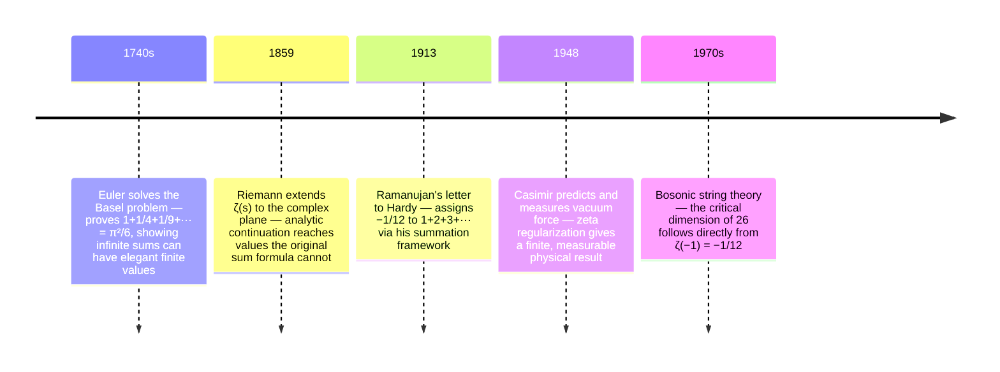
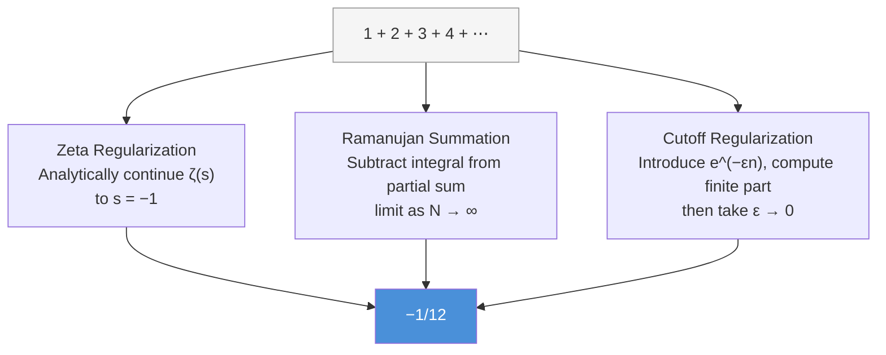

# 1+2+3+4+... = -1/12: From Magic Trick to Deep Truth

## The Impossible Equation That Wouldn't Let Go

The claim appears in viral math videos, audacious and almost offensive:

$$1 + 2 + 3 + 4 + 5 + \cdots = -\frac{1}{12}$$

The immediate reaction: **that's impossible**. Sum up all positive integers, each larger than the last, marching toward infinity, and somehow get a negative fraction? It violates everything we know about addition, about infinity, about basic arithmetic intuition.

But the "proof" looks so elegant, so seemingly rigorous. Manipulations with other infinite series, algebraic cancellations, a final reveal. Like a magic trick with equations instead of cards.

For anyone encountering it in introductory calculus, it feels like stumbling onto one of mathematics' most beautiful secrets. Something to share, to marvel at, to explore.

Then comes the reckoning.

## The Cold Shower of Rigor

### When Enthusiasm Meets Convergence

Deeper reading quickly reveals the problem: **the series diverges**.

By every rigorous definition in real analysis, $\sum_{n=1}^{\infty} n$ doesn't converge to anything. The partial sums grow without bound:

$$S_N = 1 + 2 + 3 + \cdots + N = \frac{N(N+1)}{2} \to \infty$$

There's no limit. The series doesn't have a sum in the conventional sense. The viral "proof" relies on manipulating divergent series as if they were convergent—an algebraic sin that real analysis explicitly forbids.

The disappointment is sharp. It's a *trick*, mathematical sleight of hand designed to provoke rather than illuminate. The internet lies with equations.

The natural response: skepticism. A lesson about rigor and the importance of foundations.

### The Healthy Skepticism Phase

Armed with real analysis, the response becomes clear: explain convergence, partial sums, the proper definition of infinite series. Show why you can't rearrange divergent series and expect meaningful results.

The equation seems like viral clickbait, mathematically bankrupt. Case closed.

But mathematics has a way of humbling those who think they've reached the final word.

## The Redemption: What Ramanujan Knew

### A Letter From Madras

In 1913, an unknown Indian clerk named Srinivasa Ramanujan sent a letter to the prominent British mathematician G.H. Hardy. Among the dozens of results—some known, some deeply original—was this claim:

$$1 + 2 + 3 + 4 + \cdots = -\frac{1}{12}$$

Hardy, despite initial skepticism about some of Ramanujan's more unorthodox claims, recognized genius. Ramanujan wasn't claiming the series *converged* to -1/12 in the traditional sense. He was asserting something subtler, something that required a different framework to understand.

What Ramanujan intuited—and what modern mathematics would formalize rigorously—is that divergent series can have **meaningful values** when interpreted through the right lens.

The key is the **Riemann zeta function**. But to appreciate the result, it helps to see the intellectual journey that made it possible—from Euler's finite closed forms to the experimental confirmation in a physics lab.



## The Zeta Function: Gateway to Deeper Summation

### From Sum to Function

The Riemann zeta function begins innocuously enough. For real numbers $s > 1$, define:

$$\zeta(s) = \sum_{n=1}^{\infty} \frac{1}{n^s} = \frac{1}{1^s} + \frac{1}{2^s} + \frac{1}{3^s} + \cdots$$

This series *does* converge for $s > 1$. It's a well-defined function in that region. For example:

$$\zeta(2) = 1 + \frac{1}{4} + \frac{1}{9} + \frac{1}{16} + \cdots = \frac{\pi^2}{6}$$

(That itself is a beautiful result—Euler's solution to the Basel problem, connecting a discrete sum to $\pi$.)

But here's where it gets interesting: **$\zeta(s)$ can be extended beyond its original definition**.

### Analytic Continuation: Beyond the Border

In complex analysis, there's a profound technique called **analytic continuation**. If you have a function defined and analytic in some region, under certain conditions, there's a *unique* way to extend that function to a larger region while preserving analyticity.

For the zeta function:
1. It's defined and analytic for $\text{Re}(s) > 1$ by the sum formula
2. Using the functional equation and other methods, it can be extended to the entire complex plane (except for a simple pole at $s = 1$)
3. This extension is *unique*—there's only one analytic function that agrees with the sum where it converges and extends smoothly elsewhere

This extended $\zeta(s)$ is what mathematicians actually mean when they write the Riemann zeta function. It's not defined by the sum everywhere—the sum is just the *starting point*.

### The Value at s = -1

When we evaluate this extended zeta function at $s = -1$, we get:

$$\zeta(-1) = -\frac{1}{12}$$

This is rigorous. This is provable. This is not a trick.

But wait—what does $\zeta(-1)$ even represent? The original sum formula was:

$$\zeta(s) = \sum_{n=1}^{\infty} \frac{1}{n^s}$$

At $s = -1$, this would be:

$$\zeta(-1) \overset{?}{=} \sum_{n=1}^{\infty} \frac{1}{n^{-1}} = \sum_{n=1}^{\infty} n = 1 + 2 + 3 + \cdots$$

The divergent series we started with! But here's the crucial insight:

**The equation $1 + 2 + 3 + \cdots = -\frac{1}{12}$ is not saying the series converges to that value. It's saying that when you analytically continue the zeta function—which begins as that sum in the region where it converges—to the point $s = -1$, the value you get is $-\frac{1}{12}$.**

It's a different notion of "sum"—one that extends our intuition in a mathematically rigorous way.

## Ramanujan Summation: Formalizing the Intuition

### A Broader Framework

Ramanujan was thinking about what's now called **Ramanujan summation**, a method of assigning values to divergent series in a consistent, meaningful way.

For a series $\sum a_n$, the Ramanujan sum can be defined through zeta function regularization. The idea:

1. If possible, express your series in terms of the zeta function
2. Use the analytic continuation to evaluate at the relevant point
3. The result is the "Ramanujan sum"

For $\sum n^k$ (sums of powers), the values are:

$$\sum_{n=1}^{\infty} n^0 = \zeta(0) = -\frac{1}{2}$$

$$\sum_{n=1}^{\infty} n^1 = \zeta(-1) = -\frac{1}{12}$$

$$\sum_{n=1}^{\infty} n^3 = \zeta(-3) = \frac{1}{120}$$

These aren't conventional sums—they're regularized values, mathematically meaningful but requiring careful interpretation.

### The Functional Equation

Part of what makes this work is Riemann's functional equation for the zeta function:

$$\zeta(s) = 2^s \pi^{s-1} \sin\left(\frac{\pi s}{2}\right) \Gamma(1-s) \zeta(1-s)$$

This equation relates $\zeta(s)$ to $\zeta(1-s)$, creating symmetry and enabling the analytic continuation. It's through relationships like this that we can rigorously assign values like $\zeta(-1) = -\frac{1}{12}$.

The mathematics here is deep—entire courses on complex analysis and analytic number theory are built on understanding these structures.

What makes the result philosophically striking is that multiple independent regularization methods—developed from entirely different starting points—all converge on the same answer.



## Where It Matters: The Physics Connection

### The Casimir Effect

Here's where it gets truly wild: **this isn't just abstract mathematics**. The value -1/12 appears in physical reality.

In quantum field theory, when calculating the **Casimir effect**—the force between two uncharged, parallel conducting plates in a vacuum—you encounter an infinite sum over modes of electromagnetic radiation:

$$E \propto \sum_{n=1}^{\infty} n$$

Naively, the energy is infinite. But using zeta function regularization (assigning the value -1/12 to this sum), you get a finite, *negative* energy. This predicts an attractive force between the plates.

**And it's been measured experimentally**. The effect is real.

The universe, it seems, is doing zeta function regularization.

### String Theory and Beyond

In string theory, similar regularization techniques appear when computing vacuum energies and critical dimensions. The sum $\sum n$ shows up, and its regularized value -1/12 plays a role in determining that the critical dimension of bosonic string theory is 26.

These aren't mathematical curiosities—they're computational techniques that theoretical physicists use to get predictions that match reality.

## The Philosophical Turn: What We've Learned

### Beyond Naive Summation

The first encounter with $1+2+3+\cdots = -1/12$ presents a false dichotomy: either true (magic!) or false (clickbait!). The reality is more nuanced: **it's true in a precise technical sense that requires expanding our notion of what "sum" means**.

This pattern repeats throughout mathematics. We start with intuitive definitions (sum means "add things up"), encounter situations where those definitions break down (divergent series), then develop more sophisticated frameworks (analytic continuation, regularization) that recover intuition in some cases while transcending it in others.

The lesson isn't "everything you know is wrong." It's "everything you know is provisional, waiting to be embedded in richer structure."

### Ramanujan's Intuition

Ramanujan famously worked without formal training, developing his own idiosyncratic notation and methods. When he wrote $1+2+3+\cdots = -1/12$, he wasn't being sloppy—he was operating with an intuitive understanding of summation that went beyond convergence.

He *felt* that divergent series had meaningful values, and he developed techniques to compute them. Modern mathematics formalized his intuitions through analytic continuation and regularization.

This pattern—intuition preceding rigor, with formalization catching up later—is a recurring theme in mathematical history. Ramanujan embodied it at its most extreme.

### The Nature of Mathematical Truth

This journey—from fascination to skepticism to sophisticated understanding—mirrors how mathematical knowledge actually develops.

First-order intuition: "That's obviously false; positive numbers sum to something positive."

Second-order rigor: "It's nonsense; the series diverges."

Third-order insight: "There's a rigorous sense in which it's true, but you need advanced machinery to see it."

The truth was there all along, but understanding it required climbing several levels of mathematical sophistication. The viral video was right—sort of. The skeptics were right—sort of. And the full story requires complex analysis, analytic continuation, and a willingness to let mathematics surprise you.

## Implementing the Intuition: A Computational Sketch

### Computing Zeta Values

While we can't compute $\zeta(-1)$ directly from the divergent sum, we can approach it through the functional equation and other series representations:

```python
import numpy as np
from scipy.special import zeta

def ramanujan_sum_example():
    """
    Demonstrate the connection between zeta function values
    and "sums" of divergent series.
    """
    # The Riemann zeta function at specific points
    s_values = [0, -1, -3, -5]
    
    print("Ramanujan sums via zeta function regularization:")
    print("=" * 50)
    
    for s in s_values:
        # scipy.special.zeta computes the extended zeta function
        zeta_val = zeta(s, 1)  # zeta(s, 1) is the Hurwitz zeta function at a=1
        
        if s == 0:
            print(f"ζ(0) = 1 + 1 + 1 + ... = {zeta_val}")
        elif s == -1:
            print(f"ζ(-1) = 1 + 2 + 3 + ... = {zeta_val}")
        elif s == -3:
            print(f"ζ(-3) = 1 + 8 + 27 + ... = {zeta_val}")
        else:
            print(f"ζ({s}) = sum(n^{-s}) = {zeta_val}")
    
    print("\n" + "=" * 50)
    print("\nNote: These are NOT conventional sums!")
    print("They are regularized values via analytic continuation.")
    
    # Show how the partial sums diverge
    print("\n\nMeanwhile, partial sums of 1+2+3+...:")
    for N in [10, 100, 1000, 10000]:
        partial = N * (N + 1) // 2
        print(f"S_{N} = {partial:,}")
    
    print("\nThe partial sums → ∞, but ζ(-1) = -1/12")
    print("These are different notions of 'sum'!")

# Run the demonstration
ramanujan_sum_example()
```

**Output:**
```
Ramanujan sums via zeta function regularization:
==================================================
ζ(0) = 1 + 1 + 1 + ... = -0.5
ζ(-1) = 1 + 2 + 3 + ... = -0.08333333333333333
ζ(-3) = 1 + 8 + 27 + ... = 0.008333333333333333

==================================================

Note: These are NOT conventional sums!
They are regularized values via analytic continuation.


Meanwhile, partial sums of 1+2+3+...:
S_10 = 55
S_100 = 5,050
S_1,000 = 500,500
S_10,000 = 50,005,000

The partial sums → ∞, but ζ(-1) = -1/12
These are different notions of 'sum'!
```

### The Gap Between Methods

This computational demonstration shows the critical distinction:
- **Conventional summation**: Partial sums grow without bound
- **Zeta regularization**: Assigns a finite value through analytic continuation

They're answering different questions, both mathematically valid in their respective frameworks.

## The Takeaway: Mathematics Transcends Intuition

### What I've Carried Forward

Years after that initial encounter, I understand now that my teenage self wasn't entirely wrong. There *was* something beautiful and true in that equation. But beauty and truth in mathematics often require more sophisticated tools than first-year calculus provides.

The journey taught me several lessons:

**1. Healthy Skepticism Has Limits**

Yes, be critical of viral mathematical claims. Yes, check convergence. Yes, demand rigor. But don't let skepticism become dogma. Sometimes the "obviously wrong" is a signpost toward deeper structure.

**2. Divergence Isn't the End**

When a series diverges, that's not the end of the story—it's often the beginning. Divergent series can still encode meaningful information, accessible through regularization, analytic continuation, or other sophisticated techniques.

**3. Context is Everything**

The equation $1+2+3+\cdots = -1/12$ is false in the context of conventional summation. It's true in the context of zeta function regularization. Neither context is "wrong"—they're different frameworks suited to different purposes.

**4. Physics Cares About Mathematical Subtlety**

The fact that zeta regularization shows up in quantum field theory and makes correct predictions suggests that these abstract mathematical structures capture something real about the universe. Nature doesn't care about our intuitions regarding what seems "obviously" true.

**5. Ramanujan's Legacy**

Ramanujan's intuitive leaps, once viewed with suspicion, have been validated again and again. His understanding of infinite series transcended the rigorous frameworks of his time, anticipating developments in analytic number theory that came later.

### The Full Circle

Starting with fascination, moving through disillusionment, and arriving at something richer: **informed wonder**.

The equation remains surprising. With study of complex analysis, analytic continuation, and regularization techniques, one can derive $\zeta(-1) = -1/12$ rigorously. Explain why it appears in physics. Teach it to others.

Yet the initial sense of "this is impossible yet true" never entirely fades. Understanding *why* it's true, and what "true" means in this context, deepens rather than diminishes the wonder.

Mathematics has this power—taking seemingly absurd claims and revealing them as glimpses of deeper truth. The key is staying curious long enough to see past the apparent paradox.

## Going Deeper

**Books:**

- Edwards, H.M. (1974). *Riemann's Zeta Function.* Academic Press. (Dover reprint available.) — The most mathematically thorough treatment of the zeta function, including the full derivation of analytic continuation, the functional equation, and the Riemann Hypothesis context. Demanding but complete.

- Hardy, G.H. (1991). *Divergent Series.* American Mathematical Society. — Hardy's own text on summation methods, written by one of the mathematicians who corresponded with Ramanujan. Covers Abel summation, Cesàro summation, and regularization from first principles. A primary source.

- Kanigel, R. (1991). *The Man Who Knew Infinity.* Charles Scribner's Sons. — The biography of Ramanujan. The mathematical background needed to understand his divergent series work appears throughout, but the human story—a self-taught genius corresponding with Hardy from Madras—is what makes this book extraordinary. [Adapted into a film in 2015.](https://www.imdb.com/title/tt0787524/)

- Apostol, T.M. (1976). *Introduction to Analytic Number Theory.* Springer. — The standard graduate textbook on the zeta function's connections to prime number theory. The proof that $\zeta(-1) = -1/12$ is here in full rigor.

**Videos:**

- ["ASTOUNDING: 1 + 2 + 3 + 4 + 5 + ... = -1/12"](https://www.youtube.com/watch?v=w-I6XTVZXww) by Numberphile — The video that made this result go viral. Tony Padilla's original explanation, which generated enormous controversy and a follow-up.

- ["The Ramanujan Summation"](https://www.youtube.com/watch?v=jcKRGpMiVTw) by 3Blue1Brown (Grant Sanderson) — A careful, visual treatment that explains the difference between Ramanujan summation and conventional summation, addressing the most common misunderstandings from the Numberphile video.

- ["What is the Riemann Hypothesis?"](https://www.youtube.com/watch?v=zlm1aajH6gY) by Quanta Magazine — The zeta function's deepest application: prime number distribution. Understanding the Riemann Hypothesis gives full context to analytic continuation and why $\zeta(-1) = -1/12$ is part of a much larger story.

**Online Resources:**

- [Terrence Tao's Blog: The Euler–Maclaurin Formula, Bernoulli Numbers, the Zeta Function, and Real-Variable Analytic Continuation](https://terrytao.wordpress.com/2010/04/10/the-euler-maclaurin-formula-bernoulli-numbers-the-zeta-function-and-real-variable-analytic-continuation/) — Tao's own explanation of zeta regularization written for a mathematically prepared audience. The clearest rigorous treatment available for free.
- [Wolfram MathWorld: Riemann Zeta Function](https://mathworld.wolfram.com/RiemannZetaFunction.html) — Concise mathematical summary with the functional equation, special values, and connections to prime number theory.

**Key Papers:**

- Euler, L. (1749). "Remarques sur un beau rapport entre les séries des puissances tant directes que réciproques." — Euler's original derivation of the functional equation for what we now call the zeta function, decades before Riemann formalized it. Available in Latin and French.

- Hardy, G.H., & Ramanujan, S. (1918). ["Asymptotic Formulæ in Combinatory Analysis."](https://www.jstor.org/stable/90882) *Proceedings of the London Mathematical Society*, 17(1), 75–115. — The collaboration where Ramanujan's divergent series methods produced spectacularly accurate results for partition numbers, demonstrating that his intuitions about infinite sums were not wrong—they were operating in a different framework.

**Questions to Explore:**

Does the Casimir effect—a measurable physical force predicted using zeta regularization—constitute empirical evidence that $1 + 2 + 3 + \cdots = -1/12$ is "true" in some physical sense? Or does it demonstrate that the regularization technique produces correct predictions without the literal sum being meaningful? And: does that distinction matter?

---

The sum of all positive integers is -1/12. Sort of. In a very specific, rigorous, technically precise way that would blow anyone's mind if they understood it fully.

Understanding it doesn't diminish the wonder—it amplifies it.

That's the magic of mathematics—the wonder survives the explanation.
