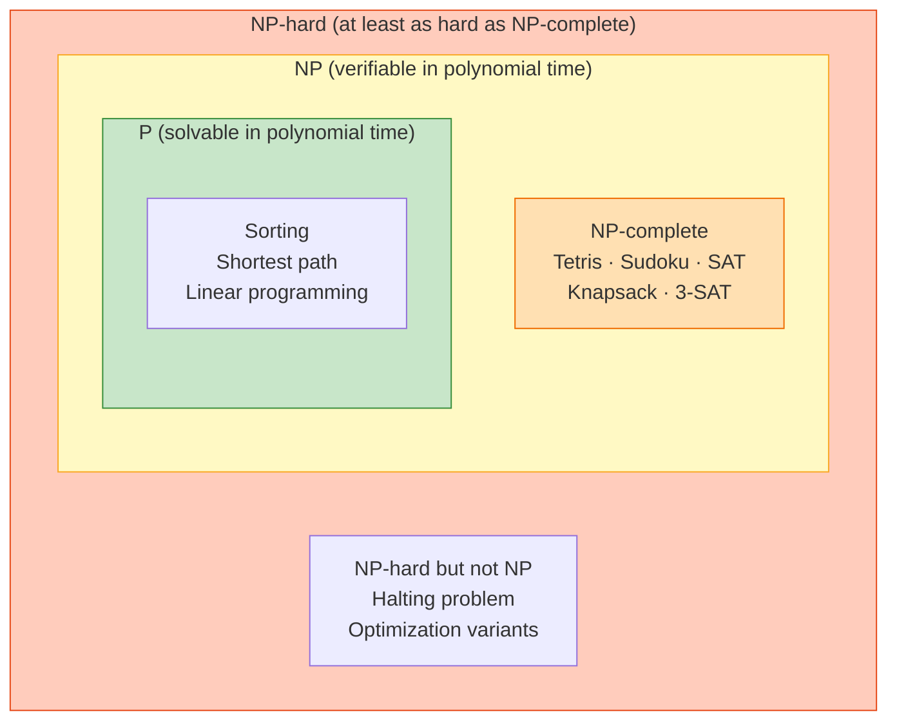
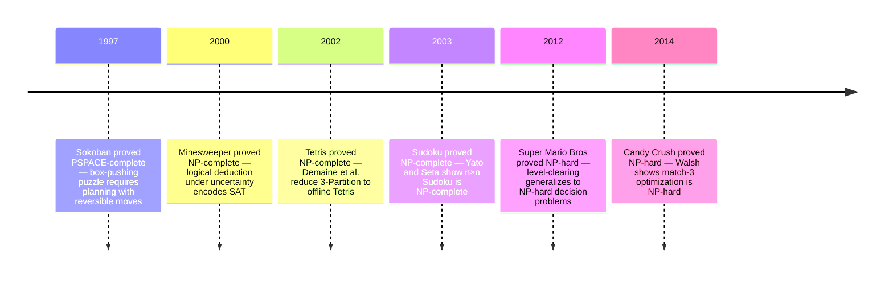

## When Falling Blocks Meet Fundamental Limits

You know Tetris. Everyone knows Tetris. Rotate a piece, slide it left or right, drop. Clear lines. The gameplay loop is hypnotic, almost meditative. The rules fit on a napkin.

Yet lurking beneath those falling blocks is a profound mathematical truth: **perfect offline Tetris is NP-complete**—one of the hardest classes of problems that computer scientists know [1][2]. This isn't just a curiosity. It places Tetris in the same computational complexity class as Sudoku, Minesweeper, protein folding, and countless optimization problems that define the limits of what computers can efficiently solve.

How did a casual puzzle game become a window into one of mathematics' deepest questions?

## The Hardness Hiding in Plain Sight

### Why Complexity Matters

Here's the uncomfortable truth that every software engineer eventually confronts: **some problems fundamentally resist fast, always-correct algorithms**. Not because we haven't been clever enough, but because of their intrinsic mathematical structure.

The class **NP** (nondeterministic polynomial time) encompasses problems where a proposed solution can be *verified* quickly, even if *finding* that solution might require exploring exponentially many possibilities. Crucially, if *any* NP-complete problem had a reliably fast (polynomial-time) algorithm, then *every* problem in NP would too. This is the **P vs NP** question—one of the Clay Mathematics Institute's seven Millennium Prize Problems, worth $1 million [6].

Most computer scientists believe P ≠ NP, meaning some problems are fundamentally harder than others. But we can't prove it. This unproven conjecture underlies much of modern cryptography, optimization, and computational theory.

### Tetris as an Elegant Gateway

Tetris provides a surprisingly elegant entry point into this abstract territory. The everyday experience resonates deeply: **one wrong placement cascades into chaos**. That intuitive sense of combinatorial explosion—where small mistakes compound into unsolvable situations—mirrors precisely the mathematical phenomenon that complexity theory formalizes.

When you play Tetris and face that sinking moment where you realize there's no escape from an impending game over, you're experiencing computational hardness firsthand. The game is teaching you complexity theory through frustration.

## The Puzzle That Breaks Computers

### Offline Tetris: A Thought Experiment

Imagine a different version of Tetris—call it "puzzle mode." You're given:
- A partially filled board with some cells already occupied
- A complete, finite sequence of pieces that will arrive
- A binary challenge: **clear every line, or fail**

No time pressure. No random pieces. You can see the entire future. You have perfect information—unlimited time to plan the optimal sequence of placements.

Surely, with perfect foresight, you could just calculate the solution?

### The Exponential Thicket

Here's what happens in practice. The first few pieces feel manageable—you see clear choices. But each decision branches the possibility space. By the tenth piece, the tree of plausible placement sequences has grown dense. By the twentieth, it's a combinatorial forest.

This is the signature of NP-completeness: **branching choices that multiply exponentially** ($b^N$) rather than polynomially ($N^k$). Each new piece doesn't just add a few more cases—it multiplies the entire search space by the number of placements.

Researchers proved what intuition suggested: **deciding whether an offline Tetris instance can clear the board is NP-complete** [1][2]. Even with perfect information and unlimited time to think, the problem remains as hard as any problem in NP.

Your phone can't save you. Neither can a supercomputer. The hardness is fundamental.

## The Language of Complexity: A Field Guide

Before we dive deeper, let's establish our vocabulary. Complexity theory has precise terminology, and understanding it transforms abstract concepts into concrete tools:

**Decision Problem**: A computational question with a yes/no answer. Example: "Can this piece sequence clear the board?" Not "What's the best solution?" but simply "Does a solution exist?"

**P (Polynomial time)**: Problems solvable *quickly* as input grows—specifically, in time polynomial in the input size ($O(n^k)$ for some constant $k$). Sorting a list: polynomial. Finding the shortest path in a graph: polynomial. We can solve these efficiently, even for large inputs.

**NP (Nondeterministic Polynomial time)**: Problems where a proposed solution can be *verified* quickly. If someone hands you a Sudoku solution, you can check it efficiently. But *finding* that solution might require trying many possibilities. 

**NP-hard**: At least as hard as the hardest problems in NP. If you could solve an NP-hard problem efficiently, you could solve *every* NP problem efficiently (via reductions).

**NP-complete**: The "boss level"—problems that are both in NP (verifiable) *and* NP-hard (as hard as anything in NP). These are the canonical hard problems. If one NP-complete problem has a polynomial-time solution, then P = NP, and a million-dollar prize awaits.

**Reduction**: A translation showing "if you can solve problem B, you can solve problem A." Reductions let us transfer hardness: if A reduces to B and A is hard, then B must be at least as hard.

### The Common Confusion

A crucial point: **NP doesn't mean "hard to verify"—it means easy to verify but potentially hard to find**. The asymmetry is what makes these problems fascinating. Checking a solution: fast. Finding one: potentially requiring exponential search.

The diagram below shows how the classes nest: P sits inside NP, NP-complete problems are the hardest problems *within* NP, and NP-hard extends the notion of hardness even to problems where solutions may not be verifiable in polynomial time.



For a rigorous treatment, see the Clay Mathematics Institute's description of the P vs NP problem [6].

## The Proof: How Tetris Encodes Hardness

### The Result in One Line

**Offline Tetris is NP-complete**: even with perfect knowledge of every piece that will arrive, deciding whether you can clear the board is as hard as any problem in NP [1].

### The Construction: Translating 3-Partition into Falling Blocks

Here's where computational complexity theory shows its power. To prove Tetris is NP-complete, researchers didn't analyze Tetris directly—they performed a **reduction**. They took a known NP-complete problem called **3-Partition** and showed how to translate any instance of it into a Tetris puzzle such that solving the Tetris puzzle solves the 3-Partition problem.

**The 3-Partition Problem**: Given a multiset of positive integers, can you partition them into triplets where each triplet sums to exactly the same value?

Example: Can you partition {4, 5, 6, 7, 8} into triplets summing to 15?
- {4, 5, 6} = 15, {7, 8, ?} — doesn't work, we don't have a 0
- Try different groupings... it's not obvious, and it gets exponentially harder with more numbers

**The Brilliant Translation**:

Researchers built a Tetris board where:
1. Each integer becomes a **bundle of tetromino placements** whose combined height equals that integer
2. The board's geometry creates vertical **"bins"** (columns or compartments) enforced by pre-placed pieces
3. **Only** a grouping into equal-sum triplets fills all bins to exactly the same height
4. If and only if such a partition exists, all lines clear perfectly

Think of it like this: the board is a set of weighing scales, the numbers are weights, and only the right grouping of trios balances every scale simultaneously. If you can solve the Tetris puzzle (clear all lines), you've found a valid 3-Partition. If you can't, no such partition exists.

This equivalence is the heart of the proof—it transfers 3-Partition's hardness directly to Tetris [1][2].

### Beyond Entertainment: Why Game Hardness Matters

This isn't just about Tetris. The pattern repeats across countless domains:

**Scheduling**: Assigning tasks to processors, classes to time slots, flights to gates—all involve local choices that interact globally. Small changes cascade.

**Routing**: Finding optimal paths through networks, delivering packages efficiently, routing network traffic—local congestion affects global flow.

**Packing**: Fitting items into containers, allocating memory, scheduling computational resources—constraints propagate.

**Resource Allocation**: Distributing limited resources under constraints appears everywhere from cloud computing to supply chain management.

Complexity theory delivers a sobering message: **expect trade-offs, not magic bullets**. If your problem reduces to an NP-complete core, you won't find a fast algorithm that always works. You'll need heuristics, approximations, or constraints to make it tractable.

#### The Hardness Zoo: A Comparison

Tetris isn't alone. Many familiar games harbor computational hardness:

| Puzzle/Game           | Complexity Class | Key Insight | Source |
|-----------------------|------------------|-------------|--------|
| **Tetris** (offline)  | NP-complete      | Bin-packing with constraints | Demaine et al. (2002) [1] |
| **Sudoku**            | NP-complete      | Constraint satisfaction | Yato & Seta (2003) |
| **Minesweeper**       | NP-complete      | Logical deduction with uncertainty | Kaye (2000) [4] |
| **Candy Crush**       | NP-hard          | Combinatorial optimization | Walsh (2014) [3] |
| **Sokoban**           | PSPACE-complete  | Planning with reversibility | Culberson (1997) |

The casual puzzles hiding fundamental complexity aren't exceptions—they're the rule. The timeline of these proofs shows how quickly the field matured once the right proof technique became clear.



## Anatomy of a Reduction: The Deep Dive

### What We're Proving

To show Tetris is NP-complete, we need to demonstrate a **polynomial-time reduction** from a known NP-complete problem (3-Partition) to Tetris. Specifically: given any instance of 3-Partition, we can construct—in polynomial time—a Tetris board and piece sequence such that:

**The Tetris puzzle can be fully cleared ↔ The 3-Partition instance is solvable**

This equivalence is everything. It means solving our constructed Tetris puzzle solves the original 3-Partition problem. Since 3-Partition is NP-complete, this proves Tetris is at least as hard—hence NP-complete.

### The Ingenious Construction

The reduction hinges on three clever components:

**1. Bins (Vertical Compartments)**

The board is pre-filled with carefully placed pieces that create distinct vertical "bins"—columns or compartments that are isolated from each other. Pieces can be dropped into bins, but not moved between them.

**2. Number Gadgets (Height Encodings)**

Each integer $n$ from the 3-Partition instance gets encoded as a specific subsequence of tetrominoes. When optimally placed in a bin, this subsequence consumes exactly $n$ cells of height. The gadget's design ensures you can't cheat—you get exactly $n$ height contribution, no more, no less.

**3. Line-Clear Logic (The Equivalence)**

Here's the brilliant constraint: rows clear only when **all bins reach exactly the same height**. If bins have mismatched heights, some cells remain filled, preventing complete board clearance.

### The Proof's Two Directions

**Forward direction** (3-Partition solution → Tetris solution):  
If a valid 3-partition exists, group the number gadgets accordingly—place the three bundles corresponding to each equal-sum triplet into the same bin. Since each triplet sums to the same value, all bins reach exactly the same height. All rows clear. ✓

**Reverse direction** (Tetris solution → 3-Partition solution):  
If the Tetris puzzle can be cleared, all bins must reach equal height. The number gadgets placed in each bin correspond to integers whose sum equals that bin's height. Since all bins are equal, we've found equal-sum triplets—a valid 3-partition. ✓

The reduction is robust—it handles rotations, piece dropping constraints, and various rule tweaks. Tetris's hardness isn't a technicality; it's fundamental [1].

### Visualizing the Flow

The diagram below captures how hardness transfers from one problem to another:

```mermaid
flowchart LR
  A[3-Partition instance] -->|poly-time transform| B[Tetris board + piece list]
  B -->|play with perfect info| C{All lines cleared?}
  C -- yes --> D[Equal-sum triplets exist]
  C -- no  --> E[No valid equal-sum triplets]
````

*Accessibility note: The flow diagram shows that solving the constructed Tetris puzzle directly answers the original 3-Partition yes/no question—a perfect equivalence.*

### Why Brute Force Fails: The Exponential Wall

Even knowing the proof, you might wonder: "Can't we just try all possibilities?" Let's see why that doesn't work:

````python
def canClear(board, pieces):
    """
    Naive recursive solver: try every possible placement.
    Theoretically correct, practically hopeless.
    """
    # Base case: no pieces left
    if not pieces:
        return board.is_empty()
    
    # Try every legal placement of the first piece
    for placement in generate_placements(board, pieces[0]):
        new_board = drop_and_clear(board, placement)
        if canClear(new_board, pieces[1:]):
            return True
    
    return False
````

**The Combinatorial Explosion**:
- Each piece has roughly $b$ legal placements (various positions and rotations)
- With $N$ pieces, we explore up to $b^N$ complete placements sequences
- For $b = 10$ and $N = 20$: that's $10^{20}$ possibilities—more than the number of seconds since the Big Bang

**The Key Insight**: NP-completeness doesn't say no algorithm exists—it says no *polynomial-time* algorithm exists (unless P = NP). Brute force works, but it takes exponential time. For large instances, exponential means "heat death of the universe before completion."

That's the essence of computational hardness [1][6].

## Limits, Risks, and Trade-offs

* **Model scope.** The NP-completeness applies to *offline*, finite-sequence Tetris. The everyday infinite stream differs but still resists “perfect forever” play; hardness and even inapproximability results persist in related objectives \[1]\[2]. ([arXiv][1], [Scientific American][3])
* **Variant behavior.** Tight boards (very few columns) or trivial pieces (monominoes) can be easy; **standard tetrominoes on reasonable widths** restore hardness. Small rule changes rarely save you from complexity \[1]. ([arXiv][1])
* **Beyond NP.** A theoretical variant with pieces generated by a finite automaton hits **undecidable** territory: no algorithm decides in general whether some generated sequence clears the board \[5]. This is not regular gameplay; it shows how tiny modeling shifts can jump classes. ([Leiden University][4])
* **Practical implication.** For hard puzzles, “optimal” is often impractical. Designers and engineers rely on heuristics, approximations, or constraints to keep problems human-solvable.

## Practical Checklist / Quick Start

* **Spot the signs.** Exponential branching ($b^N$) and tightly coupled constraints are red flags for NP-hardness.
* **Don’t chase unicorns.** For NP-complete tasks, aim for *good*, not guaranteed-optimal.
* **Use heuristics with guardrails.** In Tetris-like packing, score placements on height, holes, and surface roughness; test against diverse seeds.
* **Constrain the world.** Narrow widths, piece sets, or time limits can push a hard problem back into tractable territory.
* **Cite the canon.** When teams doubt hardness, point to formal results (e.g., Tetris \[1], Candy Crush \[3], Minesweeper \[4]) and to P vs NP context \[6]. ([arXiv][1], [academic.timwylie.com][5], [Clay Mathematics Institute][2])

## The Profound Lesson in Falling Blocks

### What Tetris Teaches Us About Computational Limits

We began with a simple question: how hard is Tetris? The answer revealed something far deeper—**some problems resist efficient solution not because we lack cleverness, but because of their fundamental mathematical structure**.

Tetris is NP-complete [1][2]. That places it alongside protein folding, optimal scheduling, circuit design, and countless other problems that define the practical limits of computation. These aren't curiosities—they're the boundaries where theory meets reality.

### Key Insights to Carry Forward

**Hardness is Everywhere**: From casual mobile games to industrial optimization, NP-complete problems appear constantly. Tetris, Candy Crush, Minesweeper, Sudoku—the playful masks hide deep complexity.

**Verification ≠ Solution**: NP-complete problems are easy to *check* but hard to *solve*. This asymmetry is fundamental. If someone claims a Tetris puzzle is unsolvable, proving them wrong (by exhibiting a solution) is far easier than proving them right.

**Reductions Reveal Structure**: The reduction from 3-Partition to Tetris isn't just a proof technique—it's a lens showing how abstract mathematical problems manifest in concrete scenarios. Understanding reductions is understanding how complexity propagates.

**Pragmatism Over Perfection**: In practice, we live with NP-hardness by using heuristics, approximations, and constraints. "Good enough" isn't settling—it's wisdom. Perfect optimization is often a mirage.

**Theory Validates Engineering**: When someone insists there *must* be a fast, always-correct algorithm for your problem, complexity theory provides your defense. Some problems are provably hard, and recognizing that saves effort better spent on effective heuristics.

### The Bigger Picture

Next time you play Tetris and feel that mounting pressure as pieces pile up and choices narrow, remember: you're experiencing a computational phenomenon that computer scientists have formalized, studied, and proven fundamental. The frustration you feel is hardness made tangible.

The blocks keep falling. The problems keep coming. And now you understand why some will always be hard—and why that's not a failure of imagination, but a truth about the universe we compute in.

---

## Going Deeper

Tetris opened a door. On the other side is one of the most beautiful and consequential branches of mathematics — complexity theory — where questions like “what can computers do in principle?” turn out to be as deep as anything in physics or philosophy. These resources will take you from falling blocks to the frontier of theoretical computer science.

**Books:**

- **[Introduction to the Theory of Computation](https://www.google.com/search?q=Sipser+Introduction+Theory+of+Computation) — Michael Sipser**
  - The clearest, most approachable textbook on computability and complexity ever written. Sipser explains P, NP, NP-completeness, reductions, and the P vs NP problem with a level of care that makes these ideas feel inevitable rather than arbitrary. Chapter 7 covers NP-completeness in full.
- **[Computers and Intractability: A Guide to the Theory of NP-Completeness](https://www.google.com/search?q=Garey+Johnson+Computers+Intractability) — Michael Garey & David Johnson**
  - The NP-completeness bible, published in 1979 and still authoritative. The appendix alone — a catalog of NP-complete problems spanning scheduling, graph theory, packing, games — is extraordinary. This is the book you cite when you need to prove a problem is hard.
- **[The Algorithm Design Manual](https://www.google.com/search?q=Skiena+Algorithm+Design+Manual) — Steven Skiena**
  - Deeply practical: here’s a problem, here’s why it’s hard, here’s what you do about it. The “War Stories” chapters — real consulting engagements where Skiena faced NP-hard problems — are some of the best writing in all of computer science.
- **[Computational Complexity: A Modern Approach](https://www.google.com/search?q=Arora+Barak+Computational+Complexity) — Sanjeev Arora & Boaz Barak**
  - For readers who want to go further. Covers complexity classes beyond NP — the polynomial hierarchy, randomized computation, circuit complexity, cryptographic hardness. Freely available as a draft on Arora’s website.

**Videos:**

- **[The P vs NP Problem](https://www.youtube.com/results?search_query=P+vs+NP+Numberphile) — Numberphile**
  - An accessible, non-technical introduction to the million-dollar question. Uses clear analogies to explain why checking solutions is easier than finding them, and why the gap between P and NP seems real even though nobody has proven it.
- **[P vs. NP — The Biggest Unsolved Problem in Computer Science](https://www.youtube.com/results?search_query=P+vs+NP+biggest+unsolved+problem) — Quanta Magazine / various**
  - Several high-quality explainers from Quanta and affiliated channels connecting complexity theory to real mathematics.
- **[Erik Demaine’s MIT Lectures on Algorithms (6.046)](https://ocw.mit.edu/courses/6-046j-design-and-analysis-of-algorithms-spring-2015/) — MIT OpenCourseWare**
  - Erik Demaine — the Tetris hardness paper’s lead author — teaches algorithms at MIT. His lectures on NP-completeness and reductions are precise and energetic. Watching the person who proved Tetris is hard explain how such proofs work is a special experience.
- **[NP-Hard Problems in Puzzle Games](https://www.youtube.com/results?search_query=NP+hard+puzzle+games+Computerphile) — Computerphile**
  - Several excellent videos on complexity theory using games as entry points. Their treatment of Minesweeper, Sudoku, and related puzzles connects abstract theory to concrete play in ways that stick.

**Online Resources:**

- [Complexity Zoo](https://complexityzoo.net/) — Scott Aaronson’s comprehensive reference for complexity classes. P, NP, co-NP, PSPACE, EXPTIME, BPP, and hundreds more, each with formal definitions and known relationships.
- [Clay Mathematics Institute — P vs NP](https://www.claymath.org/millennium/p-vs-np/) — The official problem statement for the $1,000,000 Millennium Prize. Reading it gives you an appreciation for exactly what would need to be proved and why the question resists resolution.
- [Games and Puzzles Are Hard (Survey)](https://erikdemaine.org/papers/GamesSurvey_TCS/) — Erik Demaine maintains a running survey of complexity results for games and puzzles. Tetris, Mario, Zelda, Donkey Kong, Pokémon — the list of proven-hard games grows every year.

**Papers That Started It All:**

- **Demaine, E. D., Hohenberger, S., & Liben-Nowell, D. (2002). *Tetris is Hard, Even to Approximate*. [arXiv:cs/0210020](https://arxiv.org/abs/cs/0210020)**
  - The paper this post is built around. The reduction from 3-Partition is technically careful and surprisingly readable. The “even to approximate” part is the deeper result — not only can’t you solve Tetris optimally, you can’t even get within a constant factor of optimal.
- **Kaye, R. (2000). *Minesweeper is NP-Complete*. *The Mathematical Intelligencer*, 22(2), 9–15.**
  - A beautiful short paper. The gadgets used — wires, logic gates, signals propagated through Minesweeper grids — are elegant and memorable. A model of how recreational mathematics can produce serious theory.
- **Walsh, T. (2014). *Candy Crush is NP-hard*. [arXiv:1403.1911](https://arxiv.org/abs/1403.1911)**
  - A reminder that this is an active research area. Walsh’s treatment uses similar reduction machinery to Tetris and Minesweeper, proving that the genre of casual puzzle games systematically generates computationally hard problems.
- **Cook, S. A. (1971). *The Complexity of Theorem-Proving Procedures*. STOC 1971.**
  - The founding paper of NP-completeness, in which Cook proved that SAT is NP-complete — the first such result, and the one that set the entire framework in motion. Every NP-completeness proof since, including Tetris, traces its lineage back here.

**A Question to Sit With:**

P vs NP is usually framed as a question about computation, but it is equally a question about the nature of creativity. If P = NP, then finding proofs would be no harder than checking them — the “aha” moment of discovery would be mechanizable. Mathematicians could be automated. Is the difficulty of *finding* answers an accident of the tools we use, or something deeper about the structure of knowledge itself? What would it mean for human ingenuity if the answer turned out to be P ≠ NP — that some forms of search are irreducibly hard?