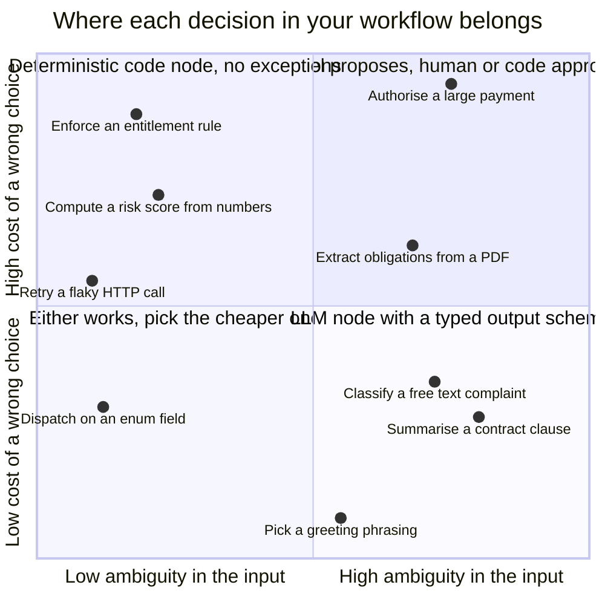
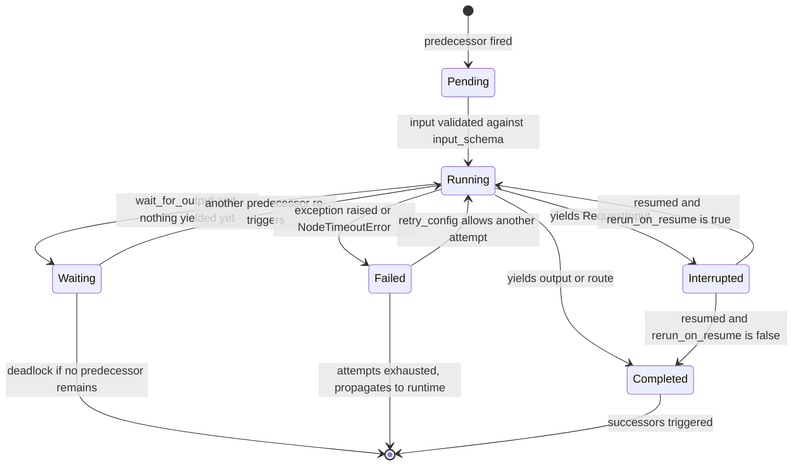
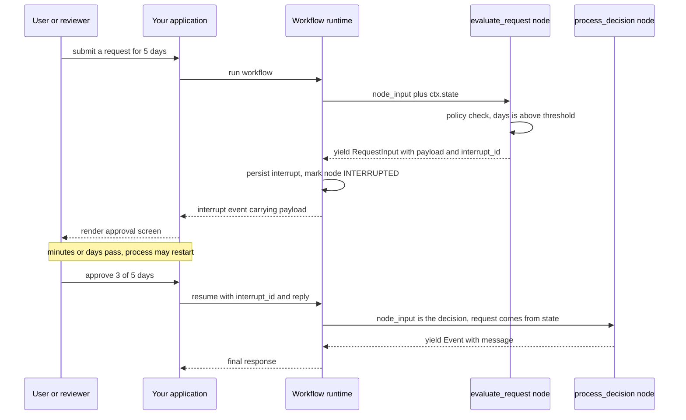
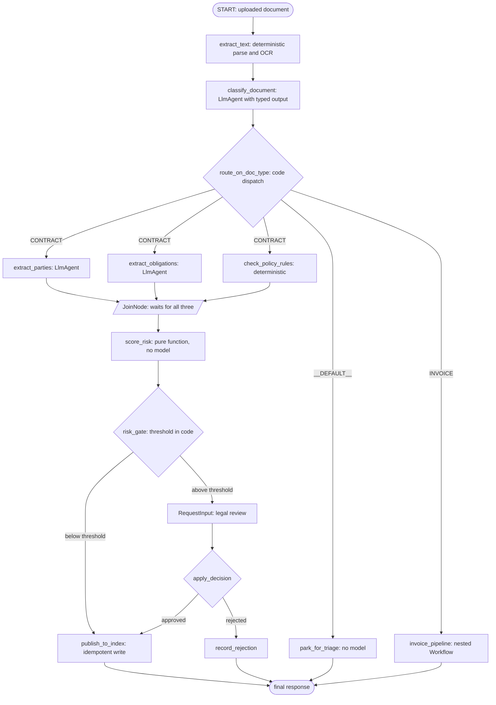

# Graph Workflows in ADK 2.0: Putting Control Flow Back in Code

In a Victorian railway signal box there is a frame of steel levers, and underneath the floor there is a lattice of bars and notched plates called the locking bed. When the signalman pulls a lever to set a route across a junction, the bars slide, and certain other levers become physically immovable. Not discouraged. Not flagged with a warning label. Immovable. You cannot clear a signal onto a track whose points are set against you, because the metal will not let you complete the pull.

The engineers who built those frames were not trying to make routing convenient. They were trying to make one specific class of accident *unrepresentable*. A signalman who is tired, distracted, or simply wrong can still make mistakes, but he cannot make that one.

That is the distinction I want in your head for the rest of this post, because it is the actual difference between two ways of orchestrating an agent. If your control flow lives in a prompt, a bad path is *discouraged*. You have written "always check the refund policy before issuing a refund" in an instruction block, and a sufficiently confident model will skip it anyway, on a Tuesday, for a customer whose message happened to be phrased unusually. If your control flow lives in a graph compiled from code, that path is *impossible*. There is no edge. The metal will not let you complete the pull.

ADK 2.0, which went GA for Python on May 19 2026 and for Go on June 30 2026, is Google's decision to give agent developers a locking bed. I have written about ADK before on this blog, and both of those posts describe ADK 1.x: an agent hierarchy where orchestration meant nesting `SequentialAgent`, `ParallelAgent`, and `LoopAgent`, or handing routing to an LLM coordinator with `sub_agents` and hoping the descriptions were good enough. Those patterns still exist and are still supported. But they are no longer the substrate. Underneath them now is a graph runtime, and once you can see the graph, a lot of prior ADK advice reads as a workaround for its absence.

This post is about that runtime. Everything here was checked against `google-adk` **2.6.3**, released August 7 2026, on a bi-weekly cadence; the 1.x line is still maintained in parallel at **1.38.0**. I read the source for the parts the documentation does not spell out, and I will say so explicitly wherever Python and Go diverge, because they diverge more than the docs admit.

---

## Four Ways LLM-Owned Control Flow Fails

Google's own framing for why they rebuilt the runtime is unusually blunt for a vendor blog: autonomous agents "can get stuck in infinite loops, bypass key business logic due to hallucinations, or fail without raising clean exceptions." That sentence is a bill of indictment with four counts, and each one has a distinct shape in production. It is worth separating them, because a graph fixes them for different reasons.

**Count one: unbounded loops.** An LLM deciding "am I done?" is running a termination check with no formal decreasing measure. There is nothing in the loop that must shrink. A `LoopAgent` with `max_iterations=5` bounds the damage, but bounding is not the same as terminating: you have replaced non-termination with silent truncation, and now your workflow finishes in a state that is neither success nor failure. In a graph, the loop is an edge you drew, and the exit condition is a comparison in Python that either evaluates to `True` or does not.

**Count two: skipped business logic.** This is the one that gets people fired. Your instruction says to verify entitlement before granting access. Ninety-nine times in a hundred the model calls the entitlement tool. The hundredth time, the user's phrasing pulls the model into a different mode and it answers directly from context. There is no prompt engineering fix for this, only prompt engineering *mitigation*, because you are trying to enforce an invariant using a mechanism that is statistical by construction. A graph node that is not reachable except through the entitlement check gives you the invariant.

**Count three: failure without a clean exception.** A tool raises, the model sees an error string in the tool result, apologises, and produces a plausible final answer built on nothing. Your monitoring records a successful invocation. This is the worst failure mode because it is invisible: the system does not degrade loudly, it degrades politely. Graph nodes propagate exceptions to a runtime that has an opinion about them, which means a failure can be retried, timed out, or surfaced, instead of being narrated away.

**Count four: cost, latency, and variance on decisions that do not need a model.** "Which of these three handlers should run" is a dispatch. Paying two thousand prompt tokens and eight hundred milliseconds of time-to-first-token for a dispatch is not a trade-off, it is an accounting error. Worse, it is a *variable* accounting error: the same routing decision costs differently on different inputs, so your p99 latency is hostage to how verbose a user was. Google reports roughly 50% fewer tokens and roughly 20% better latency for deterministic business processes moved from a vanilla LLM agent onto the workflow runtime. Those numbers are vendor numbers and your mileage will differ, but the direction is not in dispute, and the variance reduction matters more than the mean.

There is a fifth problem that is really a consequence of the first four, and ADK's designers name it directly: **context accumulation**. In an LLM-orchestrated system, every tool output lands in the conversation history, because the conversation history *is* the data bus. Sixty turns in, the model is attending over a transcript containing four stale database dumps, and you get what the ADK team calls performance and attention degradation, plus execution derailment where the agent skips steps because the relevant instruction is now buried under twelve kilobytes of JSON. A graph does not have this problem, not because it is cleverer about context, but because it does not use the transcript as a data bus at all. Node outputs travel along edges, not through the prompt.

Here is the honest summary of the thesis, and it is more modest than the marketing: **a graph workflow does not make your agent smarter. It lets you decide, per node, whether a decision is made by a model or by a compiler.** In ADK 1.x you effectively made that choice once, for the whole system, when you picked between an `LlmAgent` coordinator and a `SequentialAgent`. Now it is a per-node choice, and most real workflows want a mix.



Read the top edge of that chart carefully. Everything expensive to get wrong ends up either in code or behind an approval gate. That is not an anti-LLM position; it is the same position a bank takes about which decisions a junior analyst may make unsupervised.

---

## The Structural Change: `BaseAgent` Became a Node

Before any syntax, the one architectural fact that explains all of it. In ADK 2.0, `BaseAgent` subclasses `BaseNode`. Agents are no longer executors that contain other agents; they are nodes evaluated inside a workflow graph engine. So are tools. So are plain Python functions.

That unification is why the API feels small. There is no separate vocabulary for "an agent step" versus "a code step". A node is anything with a name, an optional input schema, an optional output schema, and an async generator that yields events. `LlmAgent` is a node that happens to call a model. `FunctionNode` is a node that happens to call your function. `JoinNode` is a node that happens to wait. `Workflow` is itself a node, which is how nesting works.

Reading `google/adk/workflow/_base_node.py` in 2.6.3, every node carries the same configuration surface:

| Field | Type | What it controls |
| --- | --- | --- |
| `name` | `str` | Unique in the graph. Must be a valid Python identifier. |
| `description` | `str` | Human-readable; also what a coordinator agent reads when a node is exposed as a tool. |
| `input_schema` | schema or `None` | Validated and coerced before the node body runs. |
| `output_schema` | schema or `None` | Validated and coerced on the way out. |
| `state_schema` | Pydantic model or `None` | Validates `ctx.state` mutations at runtime. Inherited by child nodes. |
| `retry_config` | `RetryConfig` or `None` | Exponential backoff policy for exceptions. |
| `timeout` | `float` or `None` | Seconds before the node is cancelled and treated as failed. |
| `rerun_on_resume` | `bool` | Whether the node body re-executes after an interrupt. |
| `wait_for_output` | `bool` | Whether the node only completes on yielding output or a route. |

If you have used ADK 1.x, notice what is not there: no `_run_async_impl` contract driving execution, and no safe way to append to `context.session.events` yourself. Both were removed deliberately. Custom lifecycle logic now goes through `BeforeAgentCallback` and `AfterAgentCallback`, and events must be *yielded* so the framework can own persistence, routing, and streaming. The `Event` model itself gained `output` and `node_info` fields in Python (Go gained five: `Output`, `NodeInfo`, `Routes`, `RequestedInput`, and `IsolationScope`). If you wrote a custom `BaseSessionService` against a rigid relational schema, that is your migration work. If you stored events as JSON blobs, you are fine.

One cross-language trap to get out of the way now, because the docs blur it. **Python has no `NodeConfig` class.** Configuration lives directly on the node, or as keyword arguments to the `@node` decorator. `NodeConfig` is a Go struct, and Go's `RerunOnResume` is a `*bool` with three meaningful states rather than Python's plain `bool`. If you are reading a Go example and translating it, translate `workflow.NodeConfig{...}` into decorator arguments, not into an imaginary Python type.

---

## The `Workflow` Class and the Edge List

A workflow is a name and a list of edges. That is the whole surface.

```python
from google.adk import Agent, Event, Workflow
from pydantic import BaseModel

city_generator_agent = Agent(
    name="city_generator_agent",
    model="gemini-flash-latest",
    instruction="Return the name of a random city. Return only the name.",
    output_schema=str,
)


class CityTime(BaseModel):
    time_info: str
    city: str


def lookup_time_function(node_input: str):
    """A deterministic node. No model is invoked here."""
    return CityTime(time_info="10:10 AM", city=node_input)


city_report_agent = Agent(
    name="city_report_agent",
    model="gemini-flash-latest",
    input_schema=CityTime,
    instruction="Output this line: It is {CityTime.time_info} in {CityTime.city} right now.",
    output_schema=str,
)


def completed_message_function(node_input: str):
    return Event(message=f"{node_input}\nWORKFLOW COMPLETED.")


root_agent = Workflow(
    name="root_agent",
    edges=[
        (
            "START",
            city_generator_agent,
            lookup_time_function,
            city_report_agent,
            completed_message_function,
        )
    ],
)
```

Four things in that snippet deserve attention.

**`"START"` is reserved.** It is a virtual node standing for the incoming user request. You never define a node called `start`; the string is understood by the graph builder. In the source it exists as a sentinel `BaseNode(name='__START__')` exported from `google.adk.workflow`, and `Workflow._seed_start_triggers` bypasses it entirely and seeds triggers for its successors. You can import and use the sentinel, but every official example uses the string, and so will I.

**A single tuple with N entries is a chain of N minus 1 edges.** `("START", a, b, c)` means START to `a`, `a` to `b`, `b` to `c`. This is the sequential form, and it replaces `SequentialAgent` for most purposes.

**Plain functions are nodes without ceremony.** `lookup_time_function` is not decorated, not registered, not wrapped. The graph builder sees a callable in an edge position and wraps it in a `FunctionNode`. Its return value becomes the next node's input. Zero tokens were spent.

**A node's return value is normalised.** Reading `BaseNode.run`, the rules are exact: `None` is skipped, an `Event` passes through (with `output` validated against `output_schema` if one is set), a `RequestInput` is converted into an interrupt event, and anything else is validated and wrapped as `Event(output=value)`. So `return "sunny"`, `return CityTime(...)`, and `return Event(output="sunny")` are three spellings of the same thing, and you only reach for the explicit `Event` when you need to set something other than `output`.

---

## Routes: Conditional Dispatch

Sequential chains are the easy half. The interesting half is branching, and ADK's model for it is small enough to hold in your head: **a node yields an `Event` carrying a route label, and an edge maps labels to destination nodes.**

Here is the canonical shape, from the ADK samples, with a classifier agent producing a typed enum and a two-line router doing the dispatch:

```python
from typing import Literal

from google.adk import Agent, Event, Workflow
from pydantic import BaseModel


class InputCategory(BaseModel):
    category: Literal["question", "statement", "other"]


def process_input(node_input: str):
    # Publish the raw input into session state under the key "input".
    return Event(state={"input": node_input})


classify_input = Agent(
    name="classify_input",
    instruction="Based on this input, decide which category it belongs to: {input}",
    output_schema=InputCategory,
    output_key="category",
)


def route_on_category(category: InputCategory):
    """Yields an Event carrying a route label. No model call."""
    yield Event(route=category.category)


answer_question = Agent(name="answer_question", instruction="Answer the question: {input}")
comment_on_statement = Agent(
    name="comment_on_statement", instruction="Comment on the statement: {input}"
)


def handle_other():
    yield Event(message="Sorry, I can only answer questions or comment on statements.")


root_agent = Workflow(
    name="root_agent",
    edges=[
        ("START", process_input, classify_input, route_on_category),
        (
            route_on_category,
            {
                "question": answer_question,
                "statement": comment_on_statement,
                "other": handle_other,
            },
        ),
    ],
)
```

The division of labour here is the whole point of the post in miniature. The *classification* is genuinely ambiguous, so a model does it, but its output is constrained by `output_schema=InputCategory`, whose `category` field is a `Literal` of three strings. The *dispatch* is not ambiguous at all, so a function does it, and that function cannot route anywhere the edge dictionary does not name. A hallucinated fourth category cannot produce a fourth branch, because there is no fourth branch to produce. Locking bed.

A few refinements the documentation scatters across pages:

**Routes can be a list, and dispatch fans out.** If a router yields `Event(route=["BUG", "LOGISTICS"])`, both matching successors are triggered. The docs' own multi-label example splits a comma-separated classification and returns the list directly, which is how you get a message routed to two handlers at once.

**There is a fallback label.** `google.adk.workflow` exports `DEFAULT_ROUTE`, whose value is the literal string `"__DEFAULT__"`. An edge keyed on it catches any route the dictionary does not match, which is how you avoid a workflow that silently stalls because a model produced `"Bug"` instead of `"BUG"`. Add it. Always add it. It is the cheapest incident you will ever prevent.

**An edge can point a node back at itself, and that is a legal loop.** The `loop_self` sample does exactly this:

```python
def guess_number(target_number: int):
    guess = random.randint(0, 10)
    yield Event(message=f"Guessing {guess}...")
    if guess == target_number:
        yield Event(message="Correct!")
    else:
        yield Event(route="guessed_wrong")


root_agent = Workflow(
    name="root_agent",
    edges=[
        ("START", validate_input, guess_number),
        (guess_number, {"guessed_wrong": guess_number}),
    ],
)
```

Note the termination logic. The node yields a route *only* when it wants to continue. Yielding no route ends that path. This is the inversion that makes graph loops safe: continuation is the explicit act, not the default.

**Go's route matching is typed and richer.** Where Python matches string keys, Go offers `workflow.StringRoute("BUG")`, `workflow.IntRoute(n)`, `workflow.MultiRoute[int]{1, 2, 3}`, `workflow.BoolRoute(true)`, and `workflow.Default`, wired through a `workflow.NewEdgeBuilder()`. If you are choosing a language for a heavily branched workflow, Go's version catches more of your mistakes at compile time.

---

## Data Handling: Three Channels, Deliberately Separated

This is the part I would put on a poster if I ran an agent platform team, because it is where ADK 1.x hurt most and where the fix is least visible from the outside.

In ADK 1.x, passing data between steps meant session state. Agent A wrote `output_key="draft"`, agent B interpolated `{draft}` into its instruction. It worked, and it had two chronic diseases. First, everything you wrote became part of the ambient context that later prompts could see, so state grew, prompts bloated, and attention degraded. Second, there were no boundaries: any agent could read any key, so nothing was ever encapsulated, and refactoring one agent could break another through a channel nobody had documented.

ADK 2.0 splits data into three named channels with different scopes and different costs.

**`output`** is the edge payload. It goes to the next node and nowhere else. One per node execution. This is the default channel, and the one you should reach for by reflex.

**`message`** is content for the user. It is what surfaces in the response stream.

**`state`** is the session-wide key-value store, persisted across nodes via events. It still exists, it is still useful, and it is now the exception rather than the rule.

The framework's phrasing is precise: a step writes its output to a named event field, and the next step receives it as its typed input. The transport is still an `Event`, so it is still observable, replayable, and auditable. What changed is that being on the bus no longer implies being in the prompt.

Schemas are how you make this stick. `input_schema` and `output_schema` accept Pydantic models, generic aliases like `list[str]`, and raw dict schemas, and validation runs centrally in the node runner *before* your node body is entered. Which means coercion is free:

```python
class TopicDetails(BaseModel):
    title: str
    description: str
    category: str


generate = Agent(
    name="generate_pydantic_output",
    instruction="Generate a creative topic based on the following input.",
    output_schema=TopicDetails,
)


def consume(node_input: TopicDetails):
    # node_input is already a TopicDetails. The framework coerced the model's
    # JSON into the Pydantic instance before this function was called.
    return f"{node_input.title} [{node_input.category}]: {node_input.description}"
```

There is a second binding mechanism that is easy to miss and very pleasant once you know it. By default the `@node` decorator uses `parameter_binding='state'`, which means **named parameters are resolved from `ctx.state`, while the parameter literally named `node_input` receives the incoming edge payload.** That is how this signature from the human-in-the-loop sample works:

```python
def process_decision(request: TimeOffRequest, node_input: TimeOffDecision):
    # `request` came from ctx.state, published earlier by an agent with
    # output_key="request". `node_input` is the human's decision arriving
    # along the edge. Two channels, one signature, no dictionary lookups.
    ...
```

Set `parameter_binding='node_input'` instead and parameters bind from the incoming dict, with `input_schema` and `output_schema` inferred from the function signature. That mode exists mainly so a node can be handed to an agent as a tool.

Two guardrails worth adopting on day one. Use `state_schema` on your root workflow: it declares the state keys and types you expect and validates mutations at runtime, and child nodes inherit it, so you get a typed contract on the one genuinely shared mutable surface in your system. And keep state small. The Go docs put it bluntly and it applies everywhere: do not use it to persist large payloads such as file contents or binary data. Put the blob in object storage and pass an identifier. Go additionally offers explicit lifetime prefixes on state keys, `app:`, `user:`, and `temp:`, and those prefixes bypass schema validation.

---

## Fan-Out and `JoinNode`

Parallelism in a static graph is two edges leaving the same node, and a barrier where they meet. The barrier is `JoinNode`.

```python
from typing import Any

from google.adk import Event, Workflow
from google.adk.workflow import JoinNode


def make_uppercase(node_input: str):
    return node_input.upper()


def count_characters(node_input: str):
    return len(node_input)


def reverse_string(node_input: str):
    return node_input[::-1]


join_node = JoinNode(name="join_for_results")


async def aggregate(node_input: dict[str, Any]):
    yield Event(
        message=(
            f"Uppercase: {node_input['make_uppercase']}\n\n"
            f"Character Count: {node_input['count_characters']}\n\n"
            f"Reversed: {node_input['reverse_string']}\n\n"
        ),
    )


root_agent = Workflow(
    name="root_agent",
    edges=[
        (
            "START",
            (make_uppercase, count_characters, reverse_string),
            join_node,
            aggregate,
        )
    ],
)
```

The tuple-inside-a-tuple is the fan-out: those three nodes are triggered concurrently from START. The `JoinNode` then hands the downstream node **a dict keyed by node name**, which is far better than a positional list because adding a fourth branch does not silently shift your indices.

Mechanically, `JoinNode` overrides `_requires_all_predecessors` to return `True`, which is what makes the runtime hold it until every incoming edge has fired. If `input_schema` is set on a `JoinNode`, it validates each trigger's payload individually rather than the merged dict, which is the behaviour you want and not the one you would guess.

And now the gotcha that will bite you in production, straight from the barrier semantics: **if any upstream branch fails to produce output, the join waits forever.** The workflow stops. There is no default timeout on a `JoinNode` unless you set one. So every node feeding a join needs a failsafe path that yields *something*, even a sentinel meaning "I could not do this". Combine that with a `timeout` on the join itself and you have a barrier that degrades instead of deadlocking:

```python
join_node = JoinNode(name="join_for_results", timeout=30.0)
```

The same field is available on every node, and it is the single highest-leverage line of configuration in the whole runtime.

---

## Resilience: Retries, Timeouts, and Not Catching Exceptions

`RetryConfig` is a Pydantic model in `google.adk.workflow`, and its fields are these, with the defaults the runtime applies when a field is left unset:

| Field | Default | Meaning |
| --- | --- | --- |
| `max_attempts` | 5 | Total attempts including the original. `0` or `1` means no retries. |
| `initial_delay` | 1.0 | Seconds before the first retry. |
| `max_delay` | 60.0 | Ceiling on any single delay. |
| `backoff_factor` | 2.0 | Multiplier applied per attempt. |
| `jitter` | 1.0 | Randomness factor. Set `0.0` to make delays deterministic. |
| `exceptions` | `None` | Which exceptions to retry. `None` retries on all of them. |

The delay before attempt $n$ is the standard truncated exponential:

$$
d_n = \min\!\left(\texttt{max\_delay},\; \texttt{initial\_delay} \cdot \texttt{backoff\_factor}^{\,n-1}\right)
$$

with a random offset added within those bounds when `jitter` is nonzero. The `exceptions` field is worth a note: its validator accepts either exception classes or their names as strings, and normalises both to class names internally. So `exceptions=[HTTPError]` and `exceptions=["HTTPError"]` are equivalent, and the string form is what lets you configure retries in YAML without importing anything.

Attaching a policy is one decorator argument, and the current attempt is available on the context:

```python
import random
from urllib.error import HTTPError

from google.adk import Context, Event, Workflow
from google.adk.workflow import node, RetryConfig


@node(retry_config=RetryConfig(max_attempts=5, initial_delay=1), timeout=10.0)
def get_weather(ctx: Context) -> str:
    """A task that fails intermittently. The runtime owns the retry loop."""
    yield Event(message=f"Getting weather... attempt {ctx.attempt_count}")
    if random.random() < 0.7:
        raise HTTPError(
            url="http://mock-api.example.com",
            code=500,
            msg="Internal Server Error",
            hdrs={},
            fp=None,
        )
    yield "sunny"


def report_weather(node_input: str):
    yield Event(message=f"The weather is {node_input}")


root_agent = Workflow(
    name="root_agent",
    edges=[("START", get_weather, report_weather)],
)
```

`timeout` and `retry_config` compose the way you would hope: a node that exceeds its timeout is cancelled, raises `NodeTimeoutError`, and that counts as a failure eligible for retry. So `timeout=10.0` with `max_attempts=5` gives you a bounded worst case rather than a hang.

Three hard-won notes.

**Do not write `except Exception:` around your node body.** This is now an anti-pattern rather than defensive hygiene. A broad catch swallows the very exception the runtime needs to see in order to apply your retry policy, and you end up with a node that returns a `None` or an error string and a retry config that never fires. Let it propagate. That is the interface.

**Never catch `BaseException`.** It traps `NodeInterruptedError`, which is the mechanism by which human-in-the-loop pauses work. Catch it and your approval gates stop pausing, which will look like a bizarre logic bug rather than an exception-handling bug, and you will spend an afternoon on it.

**Retry counts do not survive a resume.** This is documented and easy to miss: if a workflow is interrupted and later resumed, a node's attempt counter is *not* persisted, and restarts at 1. For an idempotent read, harmless. For a node that charges a card, this is the thing that turns a resume into a double billing. Make write nodes idempotent with your own key, or gate them behind a state check, and do not rely on the attempt count as your safety net.

The node lifecycle is worth seeing as a state machine, because `WAITING` in particular is not obvious from the API surface:



The two edges into terminal `[*]` from `Waiting` and `Failed` are your production incidents. The first is a join with a starved branch. The second is a genuine failure, which is the good outcome, because it is *visible*.

---

## Human in the Loop: Two Mechanisms, One Confusion

ADK gives you two ways to put a human in the path, and mixing them up is the most common design error I see. They operate at different layers.

### `RequestInput`: pausing the graph

A node yields a `RequestInput` and the workflow suspends. The runtime persists the interrupt, emits an event carrying it, and returns control to your application. When a human answers, the workflow resumes from that point. No model is involved in collecting the input, which is exactly what you want for an approval gate.

The minimal form is three lines:

```python
from google.adk import Workflow
from google.adk.events import RequestInput


def step1():
    yield RequestInput(message="Enter a number:")


def step2(node_input):
    return node_input * 2


root_agent = Workflow(name="root_agent", edges=[("START", step1, step2)])
```

The realistic form carries structured data for the reviewer to look at and declares the shape of the answer you expect:

```python
from typing import Optional

from google.adk import Agent, Event, Workflow
from google.adk.events import RequestInput
from pydantic import BaseModel, Field


class TimeOffRequest(BaseModel):
    days: int = Field(description="Number of days requested.")
    reason: str = Field(description="Reason for the time off.")


class TimeOffDecision(BaseModel):
    approved: bool = Field(description="Whether the time off is approved.")
    approved_days: Optional[int] = Field(default=None)


process_request = Agent(
    name="process_request",
    instruction="Extract the number of days and the reason from the request.",
    output_schema=TimeOffRequest,
    output_key="request",
)


def evaluate_request(request: TimeOffRequest):
    """Deterministic policy. Small requests auto-approve; large ones escalate."""
    if request.days <= 1:
        return TimeOffDecision(approved=True)
    return RequestInput(
        interrupt_id="manager_approval",
        message="Please review this time off request.",
        payload=request,
        response_schema=TimeOffDecision,
    )


def process_decision(request: TimeOffRequest, node_input: TimeOffDecision):
    if node_input.approved:
        granted = node_input.approved_days or request.days
        yield Event(message=f"Approved: {granted} of {request.days} days granted.")
    else:
        yield Event(message="Time off denied.")


root_agent = Workflow(
    name="request_input_advanced",
    edges=[("START", process_request, evaluate_request, process_decision)],
)
```

Look at `evaluate_request` closely, because it demonstrates something the API makes elegant and the docs undersell: **the same node can either answer or escalate.** Return a `TimeOffDecision` and the graph proceeds. Return a `RequestInput` and the graph pauses. The escalation threshold is a comparison in Python, which means your approval policy is reviewable, testable, and diffable, rather than being a sentence in a prompt.

Now the gotcha that has caught me and will catch you. **`response_schema` is not enforced.** The documentation is explicit that the response is not auto-formatted and the human must supply a correctly structured reply. `response_schema` is a *hint* for whatever UI you build on top, not a validator on the way back in. Validate the resumed payload yourself before you act on it. Treat `response_schema` the way you treat an OpenAPI spec on an endpoint you do not control: documentation, not defence.

Resume semantics hinge on `rerun_on_resume`, and the field means precisely what the base class says: if `True`, the node reruns from scratch; if `False`, it completes immediately using the resuming input as its output. Leaf nodes that just ask a question want `False`. Orchestrator nodes that call `ctx.run_node` want `True`, and this is mandatory, not stylistic, because the orchestrator body must re-enter to deliver cached child results.

Go models this as `NodeConfig.RerunOnResume *bool` with three states, and the tri-state matters: `&true` is re-entry mode, `&false` is handoff mode where the resume payload is routed straight to the successor, and `nil` defaults differently per node type. `workflow.NewDynamicNode` promotes `nil` to `&true`; `workflow.NewFunctionNode` leaves it as `nil`, which the engine treats as handoff. The Go HITL idiom is `workflow.ResumeOrRequestInput` inside a `workflow.NewEmittingFunctionNode`: on the first pass it emits a `session.RequestInput` event and returns `ErrNodeInterrupted`, and after the reply the node reruns from the top and the same call returns the human's answer directly.



### Tool confirmation: a yes or no inside an agent

The second mechanism is entirely different. Tool confirmation lives *inside* an LLM agent's tool-calling loop and gives you a yes-or-no gate on a single tool invocation, without touching the graph. In Go you either set `RequireConfirmation: true` in the tool's config, or you call `ctx.RequestConfirmation(hint, nil)` from inside the tool body and inspect `ctx.ToolConfirmation()` when it re-enters.

The distinction that matters when you are designing: **tool confirmation gates one action; `RequestInput` gates a transition in your process.** If the question is "may I send this email", that is tool confirmation. If the question is "should this claim proceed to payout or go back for rework", that is a graph pause, because the answer determines which branch of your process runs next. Use tool confirmation for actions, `RequestInput` for control flow.

---

## Dynamic Workflows: When a Static Graph Is the Wrong Shape

Static graphs are the right default and the wrong tool for maybe a fifth of real workflows. The moment you want recursion, a `while` loop whose bound depends on runtime data, or a fan-out whose *width* is not known until you have looked at the input, an edge list starts fighting you. You can encode a loop with a self-edge, as we saw, but a recursive tree walk with a depth limit is genuinely awkward.

Dynamic workflows are ADK's answer: write the control flow in Python, and let the runtime observe it.

```python
from google.adk import Context, Workflow
from google.adk.workflow import node


@node(name="hello_node")
def my_node(node_input):
    return "Hello World"


@node(rerun_on_resume=True)
async def my_workflow(ctx: Context, node_input: str) -> str:
    # run_node executes a node and returns its output directly.
    result = await ctx.run_node(my_node, node_input="hello")
    return result


root_agent = Workflow(name="root_agent", edges=[("START", my_workflow)])
```

`ctx.run_node` returns the child's output as a value. No state keys, no event plumbing, no `output_key` dance. Which means ordinary Python composes:

```python
@node
async def city_workflow(ctx: Context):
    city = await ctx.run_node(city_generator_agent)
    city_time = await ctx.run_node(city_time_function, city)
    return await ctx.run_node(city_report_agent, city_time)
```

And loops are loops:

```python
@node
async def code_workflow(ctx: Context, user_request: str):
    code = await ctx.run_node(coder_agent, user_request)
    check = await ctx.run_node(compile_lint_check, code)

    while check.findings:
        yield Event(state={"code": code, "findings": check.findings})
        code = await ctx.run_node(fixer_agent, {"code": code, "findings": check.findings})
        check = await ctx.run_node(compile_lint_check, code)

    return code
```

Read that `while` condition. The loop terminates when a *linter* says there are no findings. That is a decreasing measure enforced by a tool, not a model's self-assessment of doneness, and it is the difference between a refinement loop that converges and one that argues with itself until `max_iterations`.

Parallelism is `asyncio.gather`, because `ctx.run_node` returns an awaitable you can hold:

```python
import asyncio


@node(rerun_on_resume=True)
async def orchestrator(ctx: Context, node_input: str) -> str:
    topics = [t.strip() for t in node_input.split(",") if t.strip()]
    yield Event(message=f"Processing {len(topics)} topics in parallel.")

    tasks = [
        ctx.run_node(generator, node_input=topic, use_sub_branch=True)
        for topic in topics
    ]
    results = await asyncio.gather(*tasks)

    table = "| Topic | Headline |\n| :--- | :--- |\n"
    for topic, headline in zip(topics, results):
        table += f"| {topic} | {headline} |\n"
    yield Event(message=table)
```

`use_sub_branch=True` gives each parallel activation its own branch path, which keeps their event streams and context isolated from one another. There is also a declarative form: `@node(parallel_worker=True, max_parallel_workers=8)` wraps a node so it runs concurrently across a list input with a concurrency cap, which is the Python analogue of Go's `workflow.NewParallelWorker`.

### The feature that justifies the whole design: automatic checkpointing

Here is what makes dynamic workflows more than syntactic sugar. **Dynamic workflows track every node execution, and successful sub-nodes are automatically skipped when the workflow resumes.**

Think about what that buys. An orchestrator fans out to forty document-processing nodes. Thirty-seven succeed. Three fail on a rate limit. The workflow is interrupted, or the pod is evicted, or a human approval in the middle takes two days. On resume, the orchestrator body re-executes from the top, hits the same forty `ctx.run_node` calls, and the runtime recognises thirty-seven of them as already complete and returns their cached results without re-running them. Only the three failures actually execute. The framework guarantees this for parallel workers too: only failed or interrupted workers are re-executed.

That is durable execution, and it is why the orchestrator must set `rerun_on_resume=True`. The body re-running is not waste, it is the replay mechanism. If you have used Temporal or Restate, this is a familiar bargain, and it comes with the familiar constraint: your orchestrator body should be deterministic with respect to the sequence of `run_node` calls it makes, because that sequence is the identity of the work.

Which brings us to execution IDs. ADK generates deterministic child IDs from the parent ID and a counter, and those IDs are how it decides what to skip. Auto-generated IDs are sequential integers rendered as strings, starting at `"1"`. You may override with `run_id=`:

```python
task = ctx.run_node(process_order, order, run_id=f"order-{order.order_id}")
```

Custom IDs must contain at least one non-numeric character to avoid colliding with the auto-generated ones, which is why that example prefixes with `order-`. And the documentation carries an explicit warning that I will repeat: avoid custom execution IDs. They are for genuinely reorderable inputs, where positional counting would misidentify work across runs. If your list is stable, let the counter do its job.

---

## Worked Example: Contract Intake

Enough pieces. Here is a workflow that mixes all of them: deterministic ingestion, an LLM classifier feeding a code router, a parallel fan-out over extraction tasks, a `JoinNode` barrier, a deterministic risk computation, a conditional human approval gate, and an idempotent write.

The domain is contract intake for a corporate knowledge base, which is a real shape of problem: documents arrive, they must be classified, structured facts must be extracted, a policy decides whether a human signs off, and only then does anything get published.



Note where the diamonds are. Every branch point in that graph is a code node. The LLM nodes are all leaves that produce typed data. That is the pattern to internalise.

```python
"""Contract intake workflow. ADK 2.6.x."""

from __future__ import annotations

from typing import Any, Literal, Optional

from google.adk import Agent, Context, Event, Workflow
from google.adk.events import RequestInput
from google.adk.workflow import DEFAULT_ROUTE, JoinNode, RetryConfig, node
from pydantic import BaseModel, Field

# ---------------------------------------------------------------- schemas

class RawDocument(BaseModel):
    doc_id: str
    text: str
    page_count: int


class DocType(BaseModel):
    doc_type: Literal["CONTRACT", "INVOICE", "UNKNOWN"]
    confidence: float = Field(ge=0.0, le=1.0)


class Parties(BaseModel):
    counterparty: str
    signatories: list[str] = Field(default_factory=list)


class Obligations(BaseModel):
    items: list[str] = Field(default_factory=list)
    auto_renews: bool = False


class PolicyFlags(BaseModel):
    unlimited_liability: bool = False
    non_standard_governing_law: bool = False
    failed: bool = False  # failsafe marker, see note on JoinNode starvation


class IntakeDecision(BaseModel):
    approved: bool
    reviewer: str
    note: Optional[str] = None


class WorkflowState(BaseModel):
    """Declared state contract. Inherited by every child node."""

    document: Optional[RawDocument] = None
    risk_score: Optional[float] = None


# ------------------------------------------------- deterministic ingestion

@node(
    retry_config=RetryConfig(max_attempts=4, initial_delay=0.5, exceptions=["IOError"]),
    timeout=60.0,
)
def extract_text(node_input: dict[str, Any]) -> RawDocument:
    """Parse the uploaded artifact. Pure I/O, no model, retried on transient
    storage errors. Returns the text on the edge and publishes the document
    into state so later nodes can bind it by parameter name."""
    doc = _parse_from_object_store(node_input["gcs_uri"])  # your code
    return RawDocument(doc_id=node_input["doc_id"], text=doc.text, page_count=doc.pages)


# ------------------------------------------------------- classification

classify_document = Agent(
    name="classify_document",
    model="gemini-flash-latest",
    input_schema=RawDocument,
    output_schema=DocType,
    output_key="doc_type",
    instruction=(
        "Classify the document. Return CONTRACT for agreements creating "
        "obligations between parties, INVOICE for payment demands, and "
        "UNKNOWN if you are not confident. Report calibrated confidence."
    ),
)


def route_on_doc_type(doc_type: DocType):
    """Code owns the dispatch. Low confidence is a routing decision, not a
    prompting problem, so it is expressed as an inequality."""
    if doc_type.confidence < 0.75:
        yield Event(route=DEFAULT_ROUTE)
        return
    yield Event(route=doc_type.doc_type)


def park_for_triage(node_input: Any):
    yield Event(message="Document parked for manual triage.")


# --------------------------------------------------- parallel extraction

extract_parties = Agent(
    name="extract_parties",
    model="gemini-flash-latest",
    output_schema=Parties,
    instruction="Extract the counterparty name and all signatories.",
)

extract_obligations = Agent(
    name="extract_obligations",
    model="gemini-flash-latest",
    output_schema=Obligations,
    instruction="List the obligations this document places on us. Flag auto-renewal.",
)


@node(timeout=20.0)
def check_policy_rules(document: RawDocument) -> PolicyFlags:
    """Deterministic clause checks. A regex is a better auditor than a model
    for rules that are literally written down. Never raises: a failure here
    must not starve the JoinNode."""
    try:
        return PolicyFlags(
            unlimited_liability=_has_unlimited_liability(document.text),
            non_standard_governing_law=_governing_law_is_nonstandard(document.text),
        )
    except Exception:  # noqa: BLE001 - deliberate: this node feeds a barrier
        return PolicyFlags(failed=True)


contract_join = JoinNode(name="contract_join", timeout=120.0)


# ------------------------------------------------------ scoring and gate

def score_risk(node_input: dict[str, Any]) -> float:
    """JoinNode hands us a dict keyed by node name. Pure arithmetic, so the
    score is reproducible and unit-testable."""
    parties = Parties.model_validate(node_input["extract_parties"])
    obligations = Obligations.model_validate(node_input["extract_obligations"])
    flags = PolicyFlags.model_validate(node_input["check_policy_rules"])

    score = 0.0
    score += 0.45 if flags.unlimited_liability else 0.0
    score += 0.20 if flags.non_standard_governing_law else 0.0
    score += 0.15 if obligations.auto_renews else 0.0
    score += 0.10 * min(len(obligations.items) / 10.0, 1.0)
    score += 0.30 if flags.failed else 0.0  # unknown is treated as risky
    score += 0.10 if not parties.signatories else 0.0

    yield Event(state={"risk_score": min(score, 1.0)})
    yield Event(output=min(score, 1.0))


REVIEW_THRESHOLD = 0.40


def risk_gate(node_input: float):
    """Either answer or escalate. The threshold is code, so it is reviewable
    in a pull request and covered by a test."""
    if node_input < REVIEW_THRESHOLD:
        return IntakeDecision(approved=True, reviewer="auto", note="below threshold")
    return RequestInput(
        interrupt_id="legal_review",
        message=f"Contract risk score {node_input:.2f} requires legal review.",
        payload={"risk_score": node_input},
        response_schema=IntakeDecision,
    )


def apply_decision(node_input: Any):
    # response_schema is NOT enforced on the way back in. Validate here.
    decision = IntakeDecision.model_validate(node_input)
    yield Event(route="APPROVED" if decision.approved else "REJECTED")
    yield Event(state={"decision_reviewer": decision.reviewer})


# ------------------------------------------------------------- terminals

@node(retry_config=RetryConfig(max_attempts=3), timeout=30.0)
def publish_to_index(document: RawDocument, risk_score: float):
    """Idempotent by construction. Retry attempt counters do not survive a
    resume, so the write itself must tolerate being replayed."""
    _upsert(key=document.doc_id, payload={"risk_score": risk_score})
    yield Event(message=f"Published {document.doc_id} at risk {risk_score:.2f}.")


def record_rejection(document: RawDocument):
    _upsert(key=document.doc_id, payload={"status": "rejected"})
    yield Event(message=f"Rejected {document.doc_id}.")


# -------------------------------------------------------------- the graph

root_agent = Workflow(
    name="contract_intake",
    state_schema=WorkflowState,
    edges=[
        ("START", extract_text, classify_document, route_on_doc_type),
        (
            route_on_doc_type,
            {
                "CONTRACT": (extract_parties, extract_obligations, check_policy_rules),
                "INVOICE": invoice_workflow,   # a nested Workflow is just a node
                DEFAULT_ROUTE: park_for_triage,
            },
        ),
        (extract_parties, contract_join),
        (extract_obligations, contract_join),
        (check_policy_rules, contract_join),
        (contract_join, score_risk, risk_gate, apply_decision),
        (apply_decision, {"APPROVED": publish_to_index, "REJECTED": record_rejection}),
    ],
)
```

Walk the properties this graph has that a prompt-orchestrated equivalent does not.

`publish_to_index` is reachable only through `apply_decision`, which is reachable only through `risk_gate`. There is no edge that skips the gate. A high-risk contract cannot be published without a human decision, and that is a structural property of the edge list, provable by inspection, not a behavioural tendency you sample-test.

The threshold is `REVIEW_THRESHOLD = 0.40`, a module-level constant. Changing it is a diff. Changing it in a prompt is a vibe.

`score_risk` is a pure function of three typed inputs. You can property-test it. You can replay six months of historical contracts through it in a second and plot the distribution of scores against your review capacity. Try that with a scoring rule embedded in an instruction block.

`check_policy_rules` swallows exceptions, and I flagged it in the comment because it contradicts advice I gave earlier. That contradiction is deliberate and it is the interesting kind. Nodes feeding a `JoinNode` must not starve the barrier, so this node converts failure into a `failed=True` flag that `score_risk` then treats as *risk-increasing*. The failure is not hidden; it is promoted into the domain model and routed toward a human. That is the shape a swallowed exception is allowed to take.

Three of the seven compute nodes call a model. The classifier and the two extractors. Everything else is arithmetic, comparisons, and I/O. That ratio is what the token and latency numbers actually come from.

---

## LangGraph, Honestly

If you know LangGraph, most of this looked familiar, and it should: LangGraph got to the graph-as-primary-abstraction position around two years earlier, and I have written about it separately. The models are close cousins with genuinely different bets. A full five-framework comparison is a separate post; here is the part that is specifically about the graph.

| Dimension | ADK 2.0 `Workflow` | LangGraph `StateGraph` |
| --- | --- | --- |
| Data model | Typed payload per edge via `Event.output`; `state` is a separate, optional channel | One shared state object, a `TypedDict` with reducer annotations, threaded through every node |
| Node contract | Node returns a value; framework validates against `output_schema` and wraps it | Node returns a partial state dict; reducers merge it into the shared state |
| Branching | Router node yields `Event(route=...)`; edge dict maps labels to nodes | `add_conditional_edges` with a routing function returning a node name or key |
| Fan-in | Explicit `JoinNode` barrier, dict keyed by node name | Implicit via reducers, typically `operator.add` on a list field |
| Loops | Self-edge, or a `while` in a dynamic node | First-class cycles in the graph, plus `recursion_limit` |
| HITL | `RequestInput` with `payload` and `response_schema`; `rerun_on_resume` controls replay | `interrupt()` and `Command(resume=...)` against a checkpointer |
| Durability | Automatic per-node checkpointing in dynamic workflows | Checkpointer is explicit and pluggable, Postgres or SQLite or memory |
| Deployment | Agent Runtime, Cloud Run, GKE, or self-host | LangGraph Platform, or self-hosted LangGraph Server |
| Observability | Event stream, Cloud Trace, Agent Observability | Event stream, LangSmith |

The substantive difference is the data model, and it cuts both ways.

LangGraph's shared state is more expressive. Any node can read anything, reducers let you accumulate across parallel branches without a barrier node, and map-reduce is a couple of annotations. The cost is exactly the cost ADK 1.x had: the shared state is a shared mutable surface, and disciplining it is on you. Which is why the standard LangGraph production advice is "keep documents out of state, store a reference" — the same advice ADK now gives about `state`, for the same reason.

ADK 2.0's per-edge typed payload is more constrained and more encapsulated. A node declares what it consumes and produces, and the runtime validates it. You get better locality, better refactorability, and Pydantic coercion for free. You pay for it with more explicit plumbing: `JoinNode` where LangGraph would use a reducer, and edges where LangGraph would use a state read.

On checkpointing, LangGraph is more configurable, ADK is more automatic. LangGraph makes you choose and wire a checkpointer, which is friction and also control. ADK's dynamic workflows checkpoint every node execution by default, which is less friction and less control.

Where I would actually pick each, from having shipped both: **LangGraph** when the workflow is research-shaped, when you want cycles and accumulating state as the natural idiom, when you are already in the LangChain tool ecosystem, or when you need to run the same code on three clouds without arguing. **ADK 2.0** when the workflow is process-shaped with auditable gates, when you are already on GCP and want Agent Runtime and Cloud Trace without integration work, when you want typed contracts between steps enforced by the framework, or when you need Go or Java rather than Python. And LangGraph is still the more mature graph: more patterns documented, more failure modes written up by strangers on the internet, three more years of people finding the sharp edges. ADK 2.0's graph is four releases past a bi-weekly GA. That is not a knock, it is a schedule.

---

## When Not to Use a Graph

The failure mode of a good abstraction is applying it to everything. Some honest counter-indications, starting with the ones Google documents.

**Live streaming is not supported.** Graph-based workflows are explicitly incompatible with live streaming. If you are building bidirectional voice or a low-latency streaming UI, that is a hard stop, and you stay on `LlmAgent`.

**Some third-party integrations do not work.** The docs say so without enumerating them, which means you verify your specific integrations before committing. Assume nothing.

**Features requiring continuous AI-driven decision-making without defined structure.** This is the documented one that people gloss over, and it is the real boundary. If the value of your system *is* that it improvises, a graph is the wrong tool. An open-ended research agent that decides what to investigate based on what it just learned does not have a process you can draw. You should not draw it. Use a collaborative or coordinator workflow and invest in evals and guardrails instead.

Beyond the documented limits, three of my own.

**Do not build a graph for a workflow with one to three steps and no branching.** A `SequentialAgent` or a plain `LlmAgent` with tools is less code and less to learn. The graph earns its keep at branching and at gates.

**Do not build a graph when the process genuinely is not known.** Graphs encode decisions. If you are still discovering what the workflow *is*, encoding it prematurely means you will spend your exploration budget refactoring an edge list. Prototype with an autonomous agent, watch the traces, extract the graph from what actually happened. This is the right order and almost nobody does it.

**Do not build a graph to compensate for a model that is too small.** If your classifier is wrong 15% of the time, a `DEFAULT_ROUTE` catches the misroutes but does not make the classification correct. Fix the classifier: better schema, few-shot examples, a bigger model on that one node. The graph makes failures *visible and containable*, which is a precondition for fixing them, not a substitute.

---

## Prerequisites and Known Gotchas

**Prerequisites.** Python 3.10 or newer and `pip install google-adk` for 2.x, or `pip install "google-adk~=1.0"` if you are pinning to 1.x. Go users move imports from `google.golang.org/adk` to `google.golang.org/adk/v2`; the major-version path change is mandatory. Working Pydantic knowledge is not optional here, because schemas are the interface. Comfort with `async`/`await` and `asyncio.gather` is required for dynamic workflows. If you are new to ADK entirely, read [the ADK deep dive](https://juanlara18.github.io/portfolio/#/blog/google-adk-agent-development-deep-dive) first for runners, sessions, tools, and callbacks; and [agent architecture and orchestration](https://juanlara18.github.io/portfolio/#/blog/agent-architecture-and-orchestration) for the framework-neutral vocabulary of routers, topologies, and cycles.

**Node names must be valid Python identifiers.** The validator on `BaseNode.name` calls `str.isidentifier()`. No hyphens, no spaces, no leading digits. This fails at construction with a clear message, which is the good kind of failure.

**`"START"` is reserved.** Do not define a node named `start`. The graph builder treats the string specially.

**A starved `JoinNode` deadlocks silently.** Every branch feeding a join must yield something on every path, including its error paths. Set a `timeout` on the join as a backstop.

**`except Exception:` breaks retries.** Broad catches hide failures from `retry_config`. Let exceptions propagate.

**`except BaseException:` breaks human-in-the-loop.** It traps `NodeInterruptedError`. Never write it.

**Retry attempt counts reset on resume.** Not persisted. Make write-side nodes idempotent.

**`response_schema` on `RequestInput` is advisory.** Responses are not automatically validated. Call `model_validate` yourself on the resumed payload.

**Orchestrator nodes calling `ctx.run_node` must set `rerun_on_resume=True`.** Without it, interruption handling and the checkpoint-skip behaviour do not work.

**Custom `run_id` values need a non-numeric character.** Auto-generated IDs are sequential integers as strings; a purely numeric custom ID can collide. And prefer not to set them at all.

**`NodeConfig` is Go-only.** Python configures nodes through `@node` arguments and node fields.

**Keep `state` small.** It is persisted and it is shared. Large payloads go to object storage; pass a reference.

**Migrating from 1.x: stop appending events.** `context.session.events.append()` is no longer safe. Yield events from your node so the framework owns persistence and routing. Custom `BaseSessionService` implementations with rigid schemas need columns for `output` and `node_info`.

**Terminology.** Vertex AI was rebranded **Gemini Enterprise Agent Platform**, announced at Cloud Next in April 2026 and GA on April 22 2026, and **Agent Engine is now Agent Runtime** — with long-running operations up to seven days, sub-second cold starts, and custom container support. My earlier ADK post says "Agent Engine" throughout. It was correct when written. Write "Agent Runtime" now, and never "Vertex AI Agent Engine".

---

## Closing: The Locking Bed

The thing I keep coming back to about mechanical interlocking is that it was not an intelligence upgrade. The signalmen of 1890 were not worse at their jobs after the frames were installed. What changed was the *category* of mistake available to them. Some errors stopped being possible, and the attention that had been spent avoiding those errors became available for the judgements that actually required a human.

That is the correct way to read ADK 2.0's graph runtime, and the reason I think the framing matters more than the syntax. Nothing here makes a model reason better. What it does is let you take the decisions that were never judgement calls — dispatch on an enum, a threshold comparison, retry on a 500, do not publish without approval — and move them from a domain where they are statistical to a domain where they are mechanical. What remains for the model is the part that was genuinely ambiguous all along: reading the unstructured thing and turning it into a typed value.

You do not have to choose once, for the whole system. That is the actual gift, and it is worth restating as the last line of the post: you choose per node. Some nodes get a model. Most nodes, in most real business processes, do not need one, and were only getting one because the framework did not offer you a way to say so.

---

## Going Deeper

**Books:**

- Kleppmann, M. (2017). *Designing Data-Intensive Applications.* O'Reilly.
  - Chapters 8 through 12 are the best available treatment of why exactly-once delivery is a lie, why idempotency is the real primitive, and what "durable execution" costs. Read this before you trust any checkpointing mechanism, including ADK's.
- Nygard, M. T. (2018). *Release It!* (2nd ed.). Pragmatic Bookshelf.
  - The source of the vocabulary for timeouts, circuit breakers, bulkheads, and the failure cascades that node-level `timeout` and `RetryConfig` exist to contain. The chapter on stability antipatterns describes a starved `JoinNode` under a different name.
- Hohpe, G., and Woolf, B. (2003). *Enterprise Integration Patterns.* Addison-Wesley.
  - Content-based router, splitter, aggregator, scatter-gather. ADK's route dispatch and `JoinNode` are direct implementations of patterns catalogued here twenty-three years ago, and the aggregator chapter's discussion of completeness conditions is exactly the join-starvation problem.
- Vaughn, V. (2013). *Implementing Domain-Driven Design.* Addison-Wesley.
  - Relevant for the underrated question the graph forces on you: what are the bounded contexts between your nodes, and what is the published contract at each boundary. `input_schema` and `output_schema` are only as good as the domain thinking behind them.
- Petzold, C. (2000). *Code: The Hidden Language of Computer Hardware and Software.* Microsoft Press.
  - For the interlocking metaphor taken seriously. The chapters on relays and logic gates are the clearest explanation of how physical constraint becomes computational guarantee.

**Online Resources:**

- [Graph-based agent workflows](https://adk.dev/graphs/) — The canonical reference for the `Workflow` class, edge syntax, node types, and the documented incompatibilities. Start here.
- [Graph routes](https://adk.dev/graphs/routes/) — Conditional dispatch in depth, including Go's typed route matchers and the default fallback.
- [Dynamic workflows](https://adk.dev/graphs/dynamic/) — `@node`, `ctx.run_node`, loops, parallelism, checkpointing, and execution IDs. The section on resume behaviour repays a slow read.
- [Human input in workflows](https://adk.dev/graphs/human-input/) — `RequestInput`, payloads, response schemas, and the distinction from tool confirmation.
- [Why we built ADK 2.0](https://developers.googleblog.com/why-we-built-adk-20/) — Google's own account of the failure modes, plus the token and latency numbers. Unusually candid for a launch post.
- [Welcome to ADK 2.0](https://adk.dev/2.0/) — The migration guide. The breaking-changes list is short and every item matters.
- [ADK 2 orchestration codelab](https://codelabs.developers.google.com/adk2/instructions) — Hands-on build covering graph, collaborative, and dynamic workflows, including recursive dynamic nodes and parallel workers.
- [google/adk-python on GitHub](https://github.com/google/adk-python) — Read `contributing/samples/workflows/`. Twenty-three runnable samples covering routes, joins, retries, request-input, parallel workers, and nested workflows. This is where I verified everything in this post.

**Videos:**

- [ADK Community Call (Mar 2026) - ADK 2.0 alpha, Workflows, Agent Modes, Restate Integration](https://www.youtube.com/watch?v=bPngDY7EuOQ) — The ADK team walking through the workflow runtime while it was still alpha, including the design rationale and the Restate durable-execution integration. Watch this one for the "why".
- [ADK Community Call (May 2026) - Python 2.0 GA, Kotlin & Android, Agents CLI, Skills](https://www.youtube.com/watch?v=vbqKmK0rArI) — The GA call. Covers what shipped versus what was proposed in March, which is a useful calibration on how much the API moved.
- [Intro to multi-agent systems with ADK](https://www.youtube.com/watch?v=0Z0GUDakR_A) — Background on the multi-agent primitives that graph workflows now sit underneath. Useful if the coordinator and sub-agent vocabulary is new to you.

**Academic Papers:**

- Garcia-Molina, H., and Salem, K. (1987). ["Sagas."](https://dl.acm.org/doi/10.1145/38713.38742) *Proceedings of the 1987 ACM SIGMOD International Conference on Management of Data*, 249-259.
  - The origin of long-running transactions decomposed into steps with compensating actions. Every durable workflow engine, ADK's included, is a descendant. Read it to understand why "retry" and "compensate" are different tools and why a graph gives you a place to put both.
- Yao, S., Zhao, J., Yu, D., Du, N., Shafran, I., Narasimhan, K., and Cao, Y. (2023). ["ReAct: Synergizing Reasoning and Acting in Language Models."](https://arxiv.org/abs/2210.03629) *ICLR 2023*.
  - The paper that established the interleaved reason-act loop, which is precisely the pattern ADK 2.0 lets you *stop* using for the deterministic parts of a workflow. Understanding what ReAct does well clarifies where it is being overapplied.
- Shinn, N., Cassano, F., Gopinath, A., Narasimhan, K., and Yao, S. (2023). ["Reflexion: Language Agents with Verbal Reinforcement Learning."](https://arxiv.org/abs/2303.11366) *NeurIPS 2023*.
  - Self-critique loops and their convergence behaviour. Read alongside the `code_workflow` loop above and note the difference: Reflexion's signal is the model's own reflection, while a linter is an external oracle. Which one terminates reliably is not a close call.
- Sumers, T. R., Yao, S., Narasimhan, K., and Griffiths, T. L. (2024). ["Cognitive Architectures for Language Agents."](https://arxiv.org/abs/2309.02427) *Transactions on Machine Learning Research*.
  - A framework separating an agent's memory, action space, and decision procedure. It gives you the vocabulary to argue about which parts of a decision procedure belong in weights and which belong in code, which is the argument this whole post is having.
- Akidau, T., Bradshaw, R., Chambers, C., Chernyak, S., Fernández-Moctezuma, R. J., Lax, R., McVeety, S., Mills, D., Perry, F., Schmidt, E., and Whittle, S. (2015). ["The Dataflow Model."](https://dl.acm.org/doi/10.14778/2824032.2824076) *Proceedings of the VLDB Endowment*, 8(12), 1792-1803.
  - On completeness, triggers, and when a barrier is allowed to fire on incomplete input. The most rigorous available thinking on the exact question a `JoinNode` faces, from people who had to answer it at planetary scale.

**Questions to Explore:**

- The graph makes bad paths unrepresentable, but somebody still wrote the graph. Have we eliminated a class of error, or relocated it from runtime to authoring time where it is harder to observe and slower to fix? What would a locking bed for the graph itself look like?
- If a coding agent can generate an ADK `Workflow` from a prose description of a business process, the edge list becomes a compilation target rather than a source artifact. Does the reviewability argument for deterministic control flow survive that, and what exactly is being reviewed?
- Automatic checkpointing means an orchestrator body must be deterministic in the sequence of `run_node` calls it makes. But its branches may depend on LLM outputs, which are not deterministic. Where precisely is the seam, and what does a replay guarantee actually promise when a cached branch decision came from a model that would now decide differently?
- Every threshold in the worked example is a constant a human chose. A model could learn `REVIEW_THRESHOLD` from historical review outcomes. At what point does a learned threshold stop being deterministic control flow and become the LLM-driven routing we moved into code to escape?
- ADK 2.0 and LangGraph converged on the graph from opposite directions, one from an agent hierarchy and one from a state machine, and landed on materially different data models. Is one of them wrong, or are per-edge typed payloads and shared reducer state genuinely suited to different classes of workflow? What experiment would settle it?
