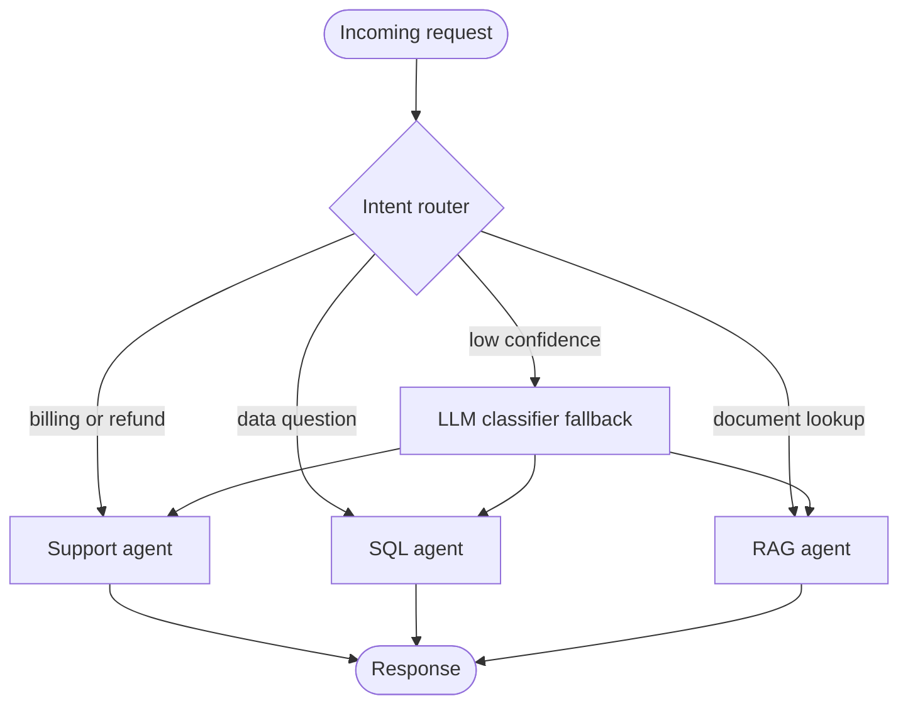
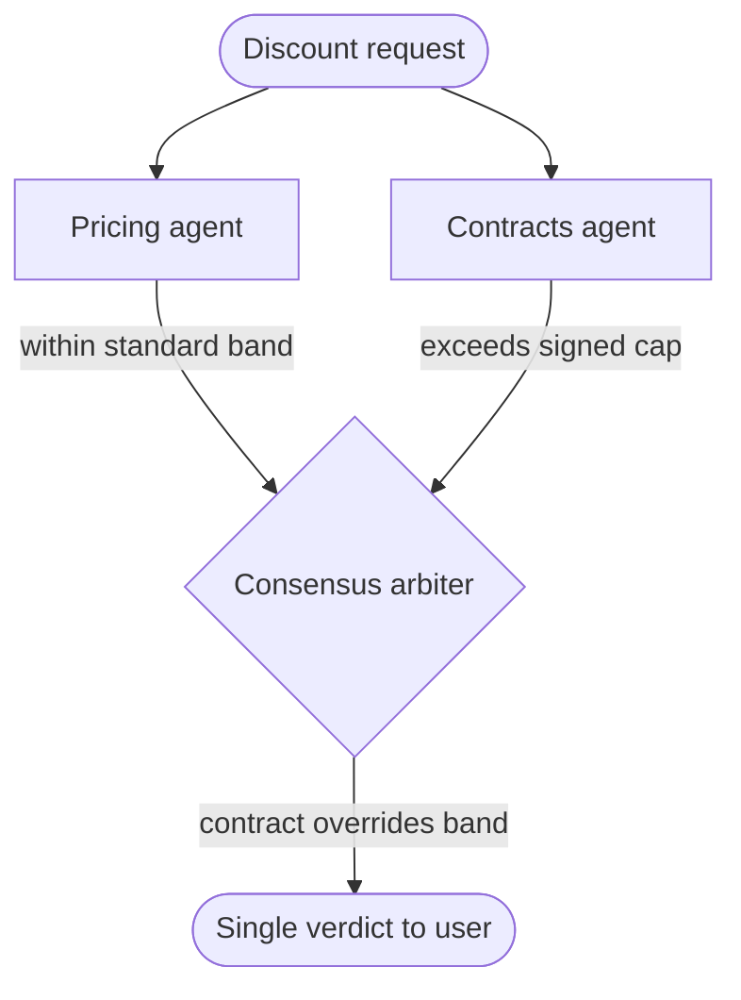
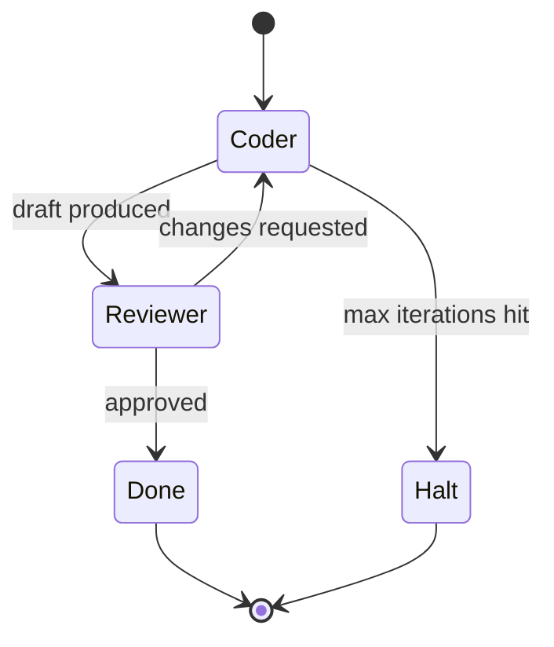

# Agent Architecture and Orchestration: Routers, Graphs, and Multi-Agent Workflows

## Two Agents, One Question, Two Answers

A team I worked with shipped a "deal desk assistant." Ask it whether a discount is approved and it consults two specialists: a pricing agent that knows the margin floor, and a contracts agent that knows the signed terms. One afternoon a salesperson asked a simple question, "can I give this customer 18 percent off?" and the assistant replied, verbatim, with both answers stapled together: "Yes, 18 percent is within the standard band. No, this account's master agreement caps discounts at 15 percent." Two confident sentences. Directly contradictory. The interface had no opinion about which one was true, because nobody had built a part of the system whose job was to *have* an opinion.

That bug is not a model bug. A bigger model would have produced two equally confident, equally contradictory sentences. It is an architecture bug. The system had specialists but no mechanism to reconcile them, no node that read both verdicts and applied the obvious business rule that the signed contract wins. The fix was not to delete the pricing agent or to write a sterner prompt. The fix was to add a layer of control flow that the original design simply lacked.

This is the recurring theme of agent engineering once you get past the demo: the hard problems are control flow problems. *When does work happen, in what order, who decides what comes next, and what reconciles disagreement.* The model is the easy part. The wiring is where systems live or die.

This post is the second in a six-part series on building agentic systems end to end, and it is about that wiring. We will treat control flow as a first-class design problem rather than an afterthought. We will start with routing, the reception desk that sends each request to the right specialist. We will walk the topologies, single agent, router, hierarchical supervisor, and the consensus layer that the deal desk was missing. We will go down a level into the cyclic graph that sits underneath modern agents, because the difference between a chain and a graph is the difference between a pipeline and a system that can critique its own work. Then the unglamorous but decisive parts: durability and human checkpoints, loop control so your agent does not spin forever burning tokens, and the tooling layer that connects all of it to the real world without welding you to one vendor.

It is self-contained. You do not need the other posts in the series to follow it. Where a topic deserves its own deep dive, I will point you to one rather than re-derive it here. If you have already read [Agent Architectures: What Makes an Agent Productive](https://juanlara18.github.io/portfolio/#/blog/agent-architectures-productive-patterns), think of this as the companion that zooms in on orchestration specifically, with running code instead of a survey.

## The Reception Desk: Routing and Dispatch

Before any agent does work, something has to decide which agent should do it. That something is a **router**, and it is worth being precise about the word because it is overloaded. A router here is not a network device and it is not your logging middleware. It is an intent classifier that reads an incoming request, figures out what kind of request it is, and dispatches it to the right specialist sub-agent or tool. The mental model is a reception desk at a large office. You walk in, say a few words about why you are there, and the receptionist sends you to the right floor. The receptionist does not do your taxes or fix your laptop. Their entire job is correct dispatch.

This single responsibility is what makes routing such a clean first pattern. A good router does no domain work at all. It looks at "my flight was canceled and I need a refund" and sends it to the support flow. It looks at "what is the integral of x squared" and sends it to the math tool. It looks at "summarize this PDF" and sends it to the document agent. The specialists each see a narrow, well-scoped request, which means their prompts stay short, their tool lists stay small, and their behavior stays predictable.

There are two ways to build the classifier inside the router, and the choice is a real engineering trade-off. The first is **semantic routing**: you keep a handful of example utterances per route, embed the incoming query, and pick the route whose examples are closest in vector space. This is fast and cheap because no generative model runs, and it is the right default for high-volume entry points. The second is **LLM routing**: you give a small, fast model the list of available routes and let it pick. This handles ambiguity and novel phrasings that the embedding nearest-neighbor approach misses, at the cost of a model call. The pragmatic design is layered. Try semantic routing first, and fall back to an LLM only when the top similarity score is below a confidence threshold.



The thing to internalize is that routing decouples *recognition* from *execution*. The router recognizes; the specialist executes. When you keep those two jobs in separate components you can change one without disturbing the other. You can add a new specialist by adding a route and a node, with no edits to existing specialists. You can swap a slow LLM classifier for a fast embedding one without touching downstream logic. Conflate the two, put routing logic inside a do-everything agent, and every change ripples. Routing is the cheapest structure you can add to an agent system and often the highest leverage.

## Topologies: From One Agent to a Team

Routing is the entry pattern. Once requests are dispatched, the question becomes how the agents themselves are arranged. There is a small set of topologies that cover most real systems, and choosing among them is mostly about matching the shape of the system to the shape of the problem.

### Single agent

The simplest topology is one agent: one model, one prompt, one tool list, running a reason-act-observe loop until it decides it is done. This is the right choice more often than the multi-agent enthusiasts admit. If a task needs one to three tool calls and lives in a single domain, a single agent is faster, cheaper, and far easier to debug than anything fancier. The failure mode is well known and predictable. As you pile on tools and stuff more competing instructions into one prompt, the model's attention smears across conflicting directives and accuracy collapses. When a single agent starts picking the wrong tool or forgetting the original goal halfway through, that is your signal to split it, not to write a longer prompt.

### Hierarchical supervisor: manager and workers

When one agent buckles under breadth, the standard answer is a hierarchy. A **supervisor** (also called a manager or orchestrator) sits on top. Critically, the supervisor does *not* do the work itself. Its job is decomposition and delegation: read the incoming task, break it into sub-tasks, hand each one to the specialist best suited for it, and consolidate the results into a coherent final answer. The workers are narrow specialists, a research worker with web tools, a data worker with database access, a writing worker with none. Each one sees a clean, single-domain prompt and a small tool set, so each one behaves sharply.

The mistake people make here is building a "supervisor" that quietly does everything and only nominally delegates, calling a worker for one trivial subtask and handling the rest itself. That defeats the purpose. The whole reason the hierarchy works is that it simulates a mixture-of-experts at the application layer: when the data worker runs, its context contains nothing but data tokens, so its attention is undivided. A supervisor that hoards the work reintroduces exactly the attention dilution you were trying to escape. The supervisor's tools should be the workers, and little else. I walk through the productive version of this pattern, and the enterprise tooling around it, in [Agent Architectures: What Makes an Agent Productive](https://juanlara18.github.io/portfolio/#/blog/agent-architectures-productive-patterns); the implementation in LangGraph specifically is covered in [LangGraph: Orchestrating Multi-Agent Workflows](https://juanlara18.github.io/portfolio/#/blog/langgraph-multi-agent-workflows).

### When specialists disagree: the consensus layer

Now back to the deal desk from the opening. The moment you have more than one specialist that can speak to the same question, you inherit the possibility that they disagree, and you have to design for it. The naive thing, the thing the broken assistant did, is to concatenate every specialist's answer and hand the pile to the user. When the specialists agree this looks fine. When they conflict it produces exactly the incoherent "yes, but also no" that destroyed trust in that tool.

The fix is a **consensus or voting layer**: a dedicated step whose only job is to turn multiple verdicts into one verdict. There are a few flavors. The simplest is majority vote when you have several agents answering the same factual question and you trust the wisdom of the crowd. More common in business systems is a superior arbiter agent that reads all the verdicts and applies explicit business rules to resolve them, the rule "a signed contract overrides the standard discount band" is not something you discover by voting, it is policy you encode. The arbiter reads the pricing verdict and the contracts verdict and returns the single correct answer, with the dissenting view either suppressed or surfaced as context, never as a competing conclusion.

The non-obvious part is what the fix is *not*. It is not deleting the dissenting agent. The contracts agent was right; removing it would have made the system confidently wrong instead of confusingly contradictory. Disagreement between specialists is signal, it often means the question genuinely sits at a boundary between two policies. The consensus layer's job is to resolve that signal into a decision, not to silence the source of it.



The table below lines up these topologies by what they cost and what they buy. The pattern is monotonic: every step up in coordination buys you breadth and robustness at the price of latency, tokens, and debugging surface.

| Topology | Coordination cost | Best when | Main failure mode |
|---|---|---|---|
| Single agent | None | One domain, few tool calls | Attention dilution as tools grow |
| Router plus specialists | One dispatch step | Distinct request types, narrow specialists | Misrouting on ambiguous input |
| Hierarchical supervisor | Manager plus message passing | Broad multi-step tasks needing several skills | Supervisor that hoards the work |
| Supervisor plus consensus | Manager plus arbiter | Multiple specialists can answer the same question | Naive concatenation of conflicting answers |

## Sequential or Parallel: Order Is a Design Decision

Once you have multiple workers, you have to decide whether they run one after another or all at once. This sounds like a performance tuning detail. It is actually a correctness decision, and getting it wrong is one of the most common and most baffling agent bugs.

Here is the scenario. You build a content crew: a researcher that gathers facts and a writer that turns them into prose. You want it fast, so you kick both off at the same time, asynchronously. The output is garbage. The writer produces a confident article based on nothing, because it started before the researcher had found anything to write about. You stare at the prompts, you swap models, you add instructions like "wait for the research," and none of it helps. The model cannot wait for data that the orchestrator never routed to it. This is a control flow bug masquerading as a quality bug.

The writer *depends* on the researcher's output. Dependency means order. When task B needs the output of task A as context, B cannot start until A finishes, and no amount of prompt engineering changes that. The right structure is a **sequential** one, where each task's output is passed forward as context to the next. Parallel execution is correct only when tasks are genuinely independent, fetch the weather and fetch the stock price, run two retrievers over two different corpora. Fan those out and join the results. But the instant one task consumes another's output, parallelism becomes a bug.

CrewAI makes this distinction explicit through its `Process` types. The current framework exposes a `Process.sequential` and a `Process.hierarchical` mode. In `Process.sequential`, tasks execute in the order you list them, and the output of each task is automatically threaded into the next task as context. That single property is the fix for the researcher-writer bug: you stop trying to run them concurrently and instead declare the dependency by ordering the tasks.

```python
from crewai import Agent, Task, Crew, Process

researcher = Agent(
    role="Research Analyst",
    goal="Find accurate, current facts on the requested topic",
    backstory="A meticulous analyst who never reports a claim without a source.",
    allow_delegation=False,
)

writer = Agent(
    role="Technical Writer",
    goal="Turn researched facts into a clear, well structured brief",
    backstory="A writer who works only from verified material.",
    allow_delegation=False,
)

# Order encodes the dependency: research first, then write.
research_task = Task(
    description="Research the current state of {topic}. Return key facts with sources.",
    expected_output="A bulleted list of verified facts, each with a source.",
    agent=researcher,
)

write_task = Task(
    description="Using the research findings, write a one page brief on {topic}.",
    expected_output="A polished one page brief in Markdown.",
    agent=writer,  # receives research_task output as context automatically
)

crew = Crew(
    agents=[researcher, writer],
    tasks=[research_task, write_task],
    process=Process.sequential,  # tasks run in listed order, output feeds forward
)

result = crew.kickoff(inputs={"topic": "vector database cost models in 2026"})
```

The mental shortcut: parallel buys latency, sequential buys correctness when there is a dependency, and dependencies are not negotiable. The skill is recognizing which tasks actually depend on each other. A good rule is to draw the data flow before you write any code. If an arrow runs from A's output into B's input, A and B are sequential, full stop. Only the tasks with no arrows between them are candidates for running concurrently. CrewAI's `hierarchical` process adds a manager LLM that decides delegation and order dynamically, which is the framework-level expression of the supervisor topology from the previous section.

## The Graph Underneath

Routers, supervisors, and sequential crews are all patterns. Underneath the patterns is a single primitive that most production agent frameworks have converged on: the **stateful graph**. CrewAI gives you a high-level role-and-task abstraction; LangGraph gives you the graph itself, exposed directly. Understanding the graph is worth the effort because it is the substrate everything else compiles down to, and because the explicit version makes the design decisions visible instead of hidden behind a friendly API.

### State is a strict schema, not a scratchpad

The center of a LangGraph application is its **state**: a single shared object that every node reads from and writes to. The first thing to get right is that this state is a *strict schema*, declared up front as a `TypedDict` or a Pydantic model. It is the single source of truth for the entire run, and nodes only touch the keys that schema declares.

```python
from typing import TypedDict, Annotated
from langgraph.graph import StateGraph, START, END
from langchain_core.messages import BaseMessage
import operator


class ReviewState(TypedDict):
    # The full conversation, append only thanks to the operator.add reducer.
    messages: Annotated[list[BaseMessage], operator.add]
    code: str            # the latest draft of code under review
    review: str          # the reviewer's most recent feedback
    iterations: int      # how many revise cycles we have done
    approved: bool       # has the reviewer signed off
```

The discipline this enforces is the whole point. A node receives the state, reads the keys it cares about, and returns a partial update for the keys it changes. If a node needs the conversation history to do its job and you forgot to declare a `messages` key, the graph does not quietly reconstruct it for you. It is not there. Depending on how you access it, you either get a `KeyError` or you silently operate on missing context and produce nonsense. LangGraph does *not* infer state you did not declare. This is a feature, not a limitation. The schema is a contract, and the contract is what makes a multi-step run debuggable, you can inspect the exact state at any node and know precisely what each node was allowed to see and change. The `Annotated[list, operator.add]` on `messages` is a *reducer*: it tells the graph to append updates rather than overwrite, which is what you want for an accumulating history. Omit the reducer and each node's return clobbers the previous value.

### Cycles are the difference between a chain and a graph

A classic chain is a forward-only pipeline, A to B to C, a directed acyclic graph. Data flows one direction and never comes back. That is perfect for a fixed pipeline like load, then chunk, then embed, then store. It is useless for the behavior that makes agents interesting: acting, then evaluating the result, then deciding whether to try again. That requires a **cycle**, an edge that loops back to an earlier node.

The canonical example is a coder-reviewer loop. A coding node writes a draft. A reviewer node critiques it. If the review finds problems, control loops *back* to the coder to revise, and the cycle repeats until the reviewer approves. A DAG literally cannot express this, there is no legal backward edge. A cyclic graph expresses it naturally. This is why agent frameworks moved from chains to graphs: reflection, retry, and self-correction are all cycles.



### Edges: fixed versus conditional

Two kinds of edges connect nodes. A fixed edge, `add_edge(source, target)`, always goes from one node to the next, unconditionally. A conditional edge is where the routing logic lives. The signature is `add_conditional_edges(source, routing_fn, mapping)`. The `routing_fn` is a plain Python function that reads the current state and returns a string. The `mapping` is a dictionary that resolves that string to the next node. So the function decides *which* label applies, and the mapping decides *where* that label goes. That separation lets you reuse a routing function across graphs by swapping the mapping.

A note on the API, because this trips people up: the real methods are `add_edge` and `add_conditional_edges`. There is no `add_branch`, no `set_path`, no `add_decision`. If you find yourself reaching for a method with one of those names, you are misremembering, the entire branching vocabulary of LangGraph is those two calls plus the entry and finish points.

Here is the coder-reviewer cycle as a real graph, with a conditional edge driving the loop, a cycle back to the coder, and a checkpointer for durability (which the next section unpacks):

```python
from typing import TypedDict, Annotated
from langgraph.graph import StateGraph, START, END
from langgraph.checkpoint.sqlite import SqliteSaver
from langchain_core.messages import BaseMessage, HumanMessage
from langchain_openai import ChatOpenAI
import operator

llm = ChatOpenAI(model="gpt-4o", temperature=0)

MAX_ITERATIONS = 4


class ReviewState(TypedDict):
    messages: Annotated[list[BaseMessage], operator.add]
    code: str
    review: str
    iterations: int
    approved: bool


def coder_node(state: ReviewState) -> dict:
    """Write or revise code based on the latest review feedback."""
    prompt = f"Task and history:\n{state['messages'][-1].content}\n"
    if state.get("review"):
        prompt += f"\nRevise to address this review:\n{state['review']}"
    draft = llm.invoke([HumanMessage(content=prompt)]).content
    return {"code": draft, "iterations": state.get("iterations", 0) + 1}


def reviewer_node(state: ReviewState) -> dict:
    """Critique the current draft and decide whether it is acceptable."""
    verdict = llm.invoke([HumanMessage(content=(
        "Review this code. Reply with APPROVE if it is correct and clean, "
        "otherwise list concrete required changes.\n\n" + state["code"]
    ))]).content
    return {"review": verdict, "approved": verdict.strip().startswith("APPROVE")}


def route_after_review(state: ReviewState) -> str:
    """Read state, return a label. The mapping resolves it to a node."""
    if state["approved"]:
        return "done"
    if state["iterations"] >= MAX_ITERATIONS:
        return "halt"   # loop control, see the section below
    return "revise"


builder = StateGraph(ReviewState)
builder.add_node("coder", coder_node)
builder.add_node("reviewer", reviewer_node)

builder.add_edge(START, "coder")          # fixed edge: always start at coder
builder.add_edge("coder", "reviewer")     # fixed edge: coder always hands to reviewer
builder.add_conditional_edges(            # conditional edge: routing_fn plus mapping
    "reviewer",
    route_after_review,
    {"revise": "coder", "done": END, "halt": END},
)

with SqliteSaver.from_conn_string("checkpoints.sqlite") as checkpointer:
    graph = builder.compile(checkpointer=checkpointer)
    config = {"configurable": {"thread_id": "review-session-1"}}
    final = graph.invoke(
        {"messages": [HumanMessage(content="Write a function to merge two sorted lists.")],
         "iterations": 0, "approved": False, "code": "", "review": ""},
        config=config,
    )
```

The `{"revise": "coder", ...}` mapping is where the cycle is born: the `revise` label points *back* to `coder`, closing the loop. That one entry is the entire difference between a forward-only chain and a self-correcting agent.

## Durability and the Human in the Loop

An agent that loses everything when the process restarts is a prototype. Production agents run for a while, sometimes minutes, sometimes across days when a human has to approve something in the middle. They survive crashes. They pause for review and resume cleanly. All of that rests on one mechanism: the **checkpointer**.

### Checkpointers: state that survives

A checkpointer snapshots the graph state after every node executes and writes it to durable storage. You saw it in the code above, `SqliteSaver`, passed into `compile`. The available backends scale with your deployment: an in-memory saver for development, `SqliteSaver` for single-process production, and `PostgresSaver` (with an async variant) for distributed deployments where multiple workers share state. The thread ID in the config is what ties a sequence of invocations together into one durable conversation.

This single mechanism buys three things at once. **Durable memory**: the conversation history and intermediate state persist, so a multi-turn session picks up exactly where it left off. **Fault tolerance**: if a node throws or the process dies, you re-invoke with the same thread ID and execution resumes from the last good checkpoint instead of starting over, you do not re-run the expensive nodes that already succeeded. **Pause and resume**: because the full state is serialized after every node, you can stop the graph entirely, let it sit consuming zero compute, and wake it up later. That third property is what makes human-in-the-loop practical.

### Breakpoints and human approval

The hallmark of a mature agent is that it knows when *not* to act autonomously. Sending an email, issuing a refund, deleting a record, these deserve a human's sign-off. LangGraph gives you two ways to insert that pause, and it is worth knowing both.

The static way is a **breakpoint**: compile the graph with `interrupt_before=["send_email"]` and the graph halts right before that sensitive node runs. Because the checkpointer has already saved state, the run is suspended durably, not held in memory. A human reviews whatever the graph produced, and you resume by invoking again with the same thread ID. This is the cleanest way to gate one specific dangerous node.

```python
graph = builder.compile(
    checkpointer=checkpointer,
    interrupt_before=["send_email"],   # pause before this node, wait for a human
)

# Runs up to the breakpoint, then stops with state saved.
graph.invoke(initial_state, config=config)

# A human reviews the draft out of band, approves, then we resume.
graph.invoke(None, config=config)      # None means "continue from the checkpoint"
```

The dynamic way, which the current LangGraph docs recommend for production human-in-the-loop, is the `interrupt()` function called from inside a node. It pauses at any point you choose, conditioned on application logic, surfaces a payload to the caller, and resumes when you re-invoke with a `Command(resume=value)`. The resume value becomes the return of the `interrupt()` call, so the human's decision flows straight back into the node. The sequence-diagram walkthrough of that full cycle, client to graph to human and back, lives in [LangGraph: Orchestrating Multi-Agent Workflows](https://juanlara18.github.io/portfolio/#/blog/langgraph-multi-agent-workflows), so I will not redraw it here.

The point that matters is conceptual, and it is one people get wrong. A human-in-the-loop pause is *not* shutting down the container, it is not a random conditional edge that happens to wait, and it is absolutely not a `while True` polling loop burning CPU while it waits for a click. It is a native, first-class pause: the graph serializes its state, releases its resources, and genuinely sleeps until a human action wakes it. The checkpointer is what makes that possible, which is why durability and HITL are the same topic. You cannot pause for a human without somewhere durable to put the paused state.

## Do Not Run Forever

Cycles are the feature that makes agents powerful. They are also the feature most likely to bankrupt you. A coder-reviewer loop where the reviewer is never quite satisfied will spin forever, each iteration a fresh model call, each model call real money, until something external stops it. I have watched a misconfigured reflection loop run a few hundred iterations overnight and turn a trivial task into a four-figure API bill. The cycle was working exactly as designed. The design just had no brake.

The non-negotiable rule: **termination is a software guarantee, not a prompt hope.** It is tempting to believe that a stricter prompt ("you have at most three tries, then stop") or a smarter model will make the loop terminate. It will not, not reliably. The model is a probabilistic component, and you cannot prove a probabilistic component will halt. Convergence belongs in the deterministic software around the model, where you can actually guarantee it.

In practice this means two complementary controls. The first is a **max-iterations cap**. You saw it in the coder-reviewer graph: the state carries an `iterations` counter, every pass through the coder increments it, and the routing function checks it. The moment the counter hits the ceiling, the router returns the `halt` label and the graph exits cleanly, regardless of whether the reviewer ever approved. The cap lives in the routing logic, which is exactly where it belongs, because the routing function is the deterministic gatekeeper that decides whether the cycle continues.

```python
def route_after_review(state: ReviewState) -> str:
    if state["approved"]:
        return "done"
    if state["iterations"] >= MAX_ITERATIONS:   # hard ceiling, no exceptions
        return "halt"
    return "revise"
```

The second control is a **wall-clock timeout**. A node can hang on a slow external API even if your iteration count is low, so you bound how long any single node may run. LangGraph does not impose node-level timeouts for you, so you wrap nodes yourself, typically with `asyncio.wait_for` around an async node body. If the node exceeds its budget, you catch the timeout, write an error into state, and route to a graceful failure path rather than letting the run dangle.

```python
import asyncio


async def with_timeout(coro, seconds: int):
    try:
        return await asyncio.wait_for(coro, timeout=seconds)
    except asyncio.TimeoutError:
        return {"error": f"node exceeded {seconds}s", "status": "timeout"}
```

Use both. The iteration cap protects you from a loop that keeps making progress but never finishes; the timeout protects you from a single step that gets stuck. Together they turn "this cycle terminates" from a wish into a property of the system. An agent that can loop must also be an agent that is guaranteed to stop, and that guarantee is yours to build, not the model's to promise.

## The Tooling Layer

All of the orchestration above is plumbing for one purpose: getting a model to take useful actions in the real world. That happens through tools, and through the connectors that feed the model its data. This layer has its own set of conventions worth knowing precisely, because the difference between a system you can maintain and one you rewrite every quarter often comes down to choices made here.

### Defining a tool: the `@tool` decorator

In LangChain, the canonical way to turn a Python function into something a model can call is the `@tool` decorator. What makes it ergonomic is that it introspects the function you already wrote. It reads the function *name* and uses it as the tool name. It reads the *docstring* and uses it as the tool's description, the text the model reads to decide when and how to call this tool. And it reads the *type hints* to build the argument schema, optionally a full Pydantic model, so the model knows exactly what arguments to supply and in what shape.

```python
from langchain_core.tools import tool


@tool
def get_order_status(order_id: str, include_history: bool = False) -> dict:
    """Look up the current status of a customer order.

    Use this when a user asks where their order is or whether it shipped.
    Returns the status, carrier, and optionally the full status history.
    """
    record = orders_db.fetch(order_id)
    result = {"status": record.status, "carrier": record.carrier}
    if include_history:
        result["history"] = record.history
    return result
```

From that one function the decorator derives a tool named `get_order_status`, a description taken straight from the docstring, and an argument schema with a required string `order_id` and an optional boolean `include_history`. This is why the docstring is not decoration, it is the instruction the model actually reads, so a vague docstring produces a tool the model misuses. Write it like a spec.

One correctness note, since the names matter: the real decorator is `@tool`. There is no `@agent_action`, no `@langchain_function`, no `@langchain_tool`. Those are plausible-sounding inventions that do not exist. If you want a tool, it is `@tool` from `langchain_core.tools`, or subclassing `BaseTool` when you need more control.

### LCEL and the Runnable protocol

Tools, prompts, models, and chains in modern LangChain all implement a single common interface, the **Runnable** protocol, which is the foundation of the LangChain Expression Language (LCEL). Because everything is a Runnable, everything exposes the same four core methods: `invoke` for a single synchronous call, `ainvoke` for the async version, `stream` for streaming output token by token, and `batch` for running many inputs efficiently. Learn those four and you can drive any component the same way.

```python
chain = prompt | model | output_parser   # LCEL composition, the | operator

chain.invoke({"topic": "checkpointers"})        # one input, blocking
await chain.ainvoke({"topic": "checkpointers"}) # one input, async
chain.batch([{"topic": "a"}, {"topic": "b"}])   # many inputs, parallelized
for chunk in chain.stream({"topic": "tools"}):  # streamed output
    print(chunk, end="")
```

If you find documentation telling you to call `.run()`, `.call()`, or `.execute()` on a chain, you are looking at pre-LCEL material. Those were the old methods on the legacy `Chain` classes. The Runnable protocol replaced them, and `invoke`, `ainvoke`, `stream`, and `batch` are the vocabulary going forward.

### Ingestion: LlamaIndex connectors

Tools let an agent act; connectors let an agent *read*. This is where LlamaIndex earns its place in the stack. Its strength is ingestion and indexing, pulling messy real-world documents into a form an agent can query. The workhorse is `SimpleDirectoryReader`, which loads a directory of mixed files, PDF, Word, HTML, Markdown, and more, and turns each into a `Document` object in a few lines.

```python
from llama_index.core import SimpleDirectoryReader, VectorStoreIndex

documents = SimpleDirectoryReader("./contracts").load_data()   # PDF, docx, html, md
index = VectorStoreIndex.from_documents(documents)             # chunk, embed, index
query_engine = index.as_query_engine()
answer = query_engine.query("What is the discount cap in the master agreement?")
```

Beyond the built-in reader, LlamaHub is a registry of hundreds of connectors for Notion, Slack, S3, databases, almost any source you would need to ingest. The thing to be clear about is what this layer is *for*. LlamaIndex's strength is ingestion, indexing, and retrieval. It is not a fine-tuning framework and it is not a quantization toolkit, reaching for it to compress a model or train weights is a category error. Use it to get your data in. The fuller comparison of where LlamaIndex and LangChain overlap and where each is the better tool is in [LlamaIndex vs LangChain: Choosing Your LLM Framework](https://juanlara18.github.io/portfolio/#/blog/llamaindex-langchain-llm-frameworks).

### The abstraction layer: do not weld yourself to one vendor

Here is the architectural mistake that quietly costs teams the most. You build everything directly against one provider's SDK, every model call, every embedding, every parameter shaped to that one vendor. Six months later a competitor ships a model that is cheaper or smarter, or your vendor changes pricing, and switching means a rewrite that touches every file. The error has a name: **lack of abstraction**.

The fix is to introduce an abstraction layer between your application and any specific provider. You can build it yourself with the Adapter pattern, a thin interface your code calls, with provider-specific implementations behind it. More often you lean on a framework that already provides the abstraction: LangChain and LlamaIndex both let you swap the underlying model with a one-line change, and a router like LiteLLM presents a single uniform API across dozens of providers so that switching from one to another is a configuration change, not a code change. Either way the principle is the same. The provider should be a config value, not an assumption baked into your call sites. Designing the abstraction so the model is pluggable, including the agent runtime itself, is a theme I pick up from a different angle in [Google ADK: An Agent Development Deep Dive](https://juanlara18.github.io/portfolio/#/blog/google-adk-agent-development-deep-dive). And when your tools are themselves drawn from a structured domain model, the discipline of designing that toolbox is its own subject, covered in [From Ontology to Agent Toolbox](https://juanlara18.github.io/portfolio/#/blog/ontology-to-agent-toolbox).

## Prerequisites and Known Gotchas

A few things are worth having straight before you build, and a few traps are worth naming so you can avoid them.

**Prerequisites worth having first.** You want to be comfortable with Python type hints and `TypedDict` or Pydantic, because the entire LangGraph state model is built on them and the schema is where your correctness lives. You want a working mental model of the reason-act-observe loop that a single agent runs, since every topology here is a way of arranging or constraining that loop. And it helps to have at least built one single agent end to end before you build a hierarchy, the failure modes of the simple case are what motivate the complex ones, and skipping straight to multi-agent tends to produce systems whose complexity you cannot justify.

**Gotcha: forgetting a reducer on an accumulating key.** If a state field should grow over the run, the message history above all, it needs a reducer like `Annotated[list, operator.add]`. Forget it and each node silently overwrites the field, so your agent loses its history and you spend an afternoon wondering why it has amnesia.

**Gotcha: undeclared state.** The graph only knows the keys in your schema. A node that reads a key you never declared does not get a helpful default, it gets a `KeyError` or, worse, operates on missing context. When a node behaves as if it cannot see something, check the schema first.

**Gotcha: parallelizing a dependency.** Revisit the researcher-writer bug whenever output quality is mysteriously bad in a multi-agent system. If a downstream agent produces confident nonsense, check whether it started before its input was ready. Draw the data-flow arrows; any arrow between two tasks means they are sequential.

**Gotcha: a cycle with no brake.** Every cyclic graph needs an iteration cap and ideally a timeout, enforced in the routing function, not in the prompt. If you are about to ship a reflection or retry loop, the cap is not optional polish, it is the thing standing between you and an unbounded bill.

**Gotcha: inventing API names.** The framework surface is smaller than it feels. The edges are `add_edge` and `add_conditional_edges`. The tool decorator is `@tool`. The Runnable methods are `invoke`, `ainvoke`, `stream`, `batch`. When you reach for a method whose name sounds right but you have never actually seen, you have probably invented it, check the docs before trusting your memory.

**Gotcha: vendor lock-in by default.** The path of least resistance is calling one provider's SDK directly everywhere, and it is a trap that only springs months later. Put an abstraction in from the start. Future-you, mid-migration, will be grateful.

## Closing: Control Flow Is the Architecture

Step back and the through-line is simple. The model is interchangeable; the control flow is the architecture. The deal desk gave contradictory answers not because its models were weak but because it had no consensus layer. The content crew failed not because the writer was bad but because it ran in parallel when the dependency demanded sequence. The overnight bill happened not because the loop was wrong but because it had no brake. In every case the cure was structure, a router, an arbiter, an ordering, a cap, deterministic software wrapped around a probabilistic core.

That is the discipline this post has been arguing for. Choose the smallest topology that fits the problem: a single agent when one will do, a router when requests split cleanly, a supervisor when breadth demands specialists, a consensus layer when specialists can disagree. Reach for a cyclic graph when the work involves acting and then re-evaluating, and accept the responsibility that cycles bring, durable state, a human checkpoint where the stakes warrant one, and a guaranteed way to stop. Keep the tooling layer honest with clear tool definitions and an abstraction that lets the provider be a config value. None of this is the glamorous part of agent engineering. It is the part that decides whether your system survives contact with production.

## Going Deeper

**Books:**
- Huyen, C. (2024). *AI Engineering: Building Applications with Foundation Models.* O'Reilly.
  - The most complete current treatment of building on top of foundation models, with strong chapters on orchestration, evaluation, and the systems concerns around the model rather than the model itself.
- Kleppmann, M. (2017). *Designing Data-Intensive Applications.* O'Reilly.
  - Not about agents, but the canonical text on state, durability, and fault tolerance. Checkpointers and resumable workflows are exactly the problems this book formalizes.
- Newman, S. (2021). *Building Microservices, 2nd Edition.* O'Reilly.
  - Multi-agent systems are distributed systems wearing a new hat. The chapters on service boundaries, coordination, and failure map almost directly onto supervisor and consensus topologies.
- Hohpe, G., and Woolf, B. (2003). *Enterprise Integration Patterns.* Addison-Wesley.
  - Routing, message passing, and orchestration as formal patterns. The router and aggregator patterns here are the intellectual ancestors of the agent topologies in this post.

**Online Resources:**
- [LangGraph Documentation](https://langchain-ai.github.io/langgraph/) — The authoritative reference for StateGraph, conditional edges, checkpointers, and interrupts.
- [CrewAI Processes Documentation](https://docs.crewai.com/en/concepts/processes) — The current spec for sequential and hierarchical process types and how task context flows forward.
- [LangChain Tools Documentation](https://docs.langchain.com/oss/python/langchain/tools) — How the `@tool` decorator derives schema from docstrings and type hints, and how tools participate in the Runnable protocol.
- [LlamaHub](https://llamahub.ai/) — The registry of data connectors that makes ingestion a few lines instead of a custom integration.

**Videos:**
- [LangChain on YouTube](https://www.youtube.com/@LangChain) — The official channel; the LangGraph deep-dive sessions walk through state, edges, and human-in-the-loop with live code.
- [CrewAI on YouTube](https://www.youtube.com/@crewAIInc) — Official walkthroughs of crews, processes, and the sequential-versus-hierarchical distinction.
- [Andrew Ng: What's next for AI agentic workflows (Sequoia)](https://www.youtube.com/watch?v=sal78ACtGTc) — A concise, influential talk framing why agentic workflows and design patterns like reflection and planning matter more than raw model capability.

**Academic Papers:**
- Yao, S., et al. (2022). ["ReAct: Synergizing Reasoning and Acting in Language Models."](https://arxiv.org/abs/2210.03629) *arXiv:2210.03629.*
  - The reason-act-observe loop that every single-agent topology in this post is a variation on.
- Shinn, N., et al. (2023). ["Reflexion: Language Agents with Verbal Reinforcement Learning."](https://arxiv.org/abs/2303.11366) *arXiv:2303.11366.*
  - The formal case for the act-then-critique cycle, the coder-reviewer loop is Reflexion in miniature.
- Wu, Q., et al. (2023). ["AutoGen: Enabling Next-Gen LLM Applications via Multi-Agent Conversation."](https://arxiv.org/abs/2308.08155) *arXiv:2308.08155.*
  - The research behind conversational multi-agent coordination, useful contrast to the structured-graph approach.

**Questions to Explore:**
- If termination must be guaranteed in software rather than the prompt, is there a principled way to set a max-iterations cap, or is it always a hand-tuned magic number? What would an adaptive budget that scales with task difficulty look like?
- A consensus arbiter encodes business rules to resolve disagreement. As those rules accumulate, at what point has the arbiter become the actual decision system and the specialist agents become mere feature extractors feeding it?
- When does explicit graph orchestration stop paying for itself? If models get reliable enough at planning, does the hand-built graph become legacy scaffolding, or is deterministic structure permanently necessary for systems that must be audited?
- Multi-agent systems trade tokens and latency for predictability. Is there a measurable crossover where a single agent with a very large context window and perfect retrieval beats a hierarchy on both cost and accuracy?
