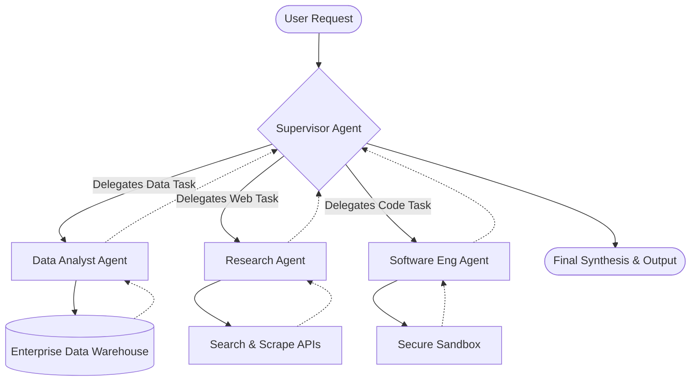
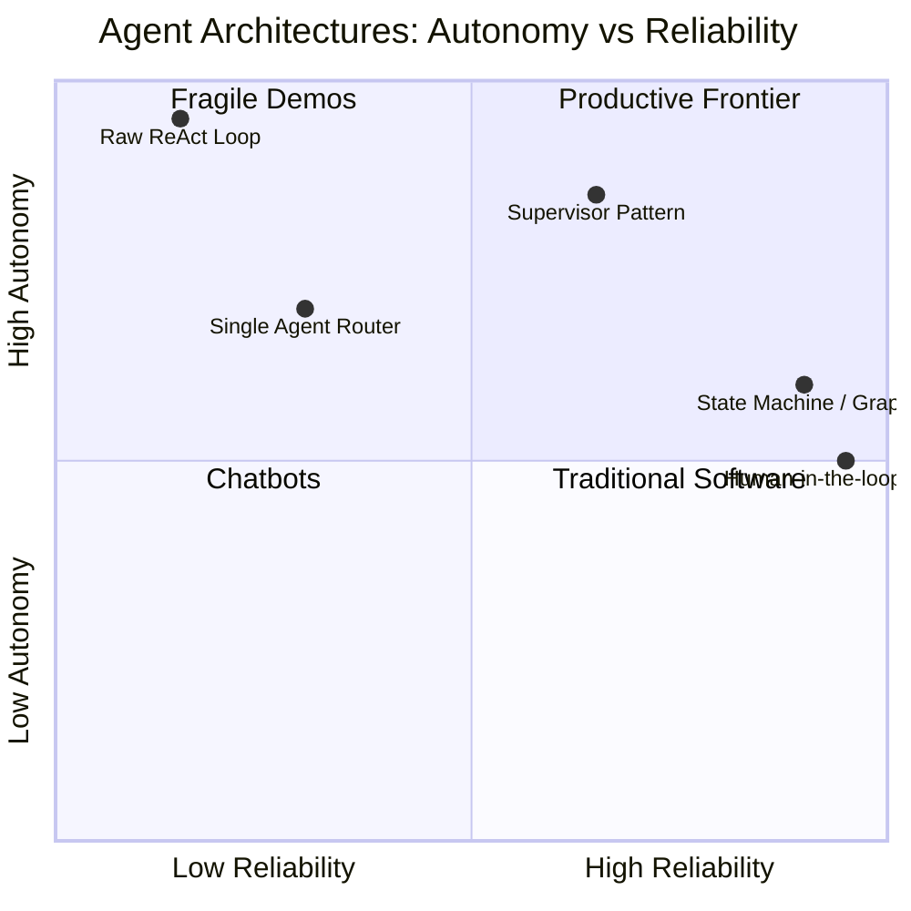

# Agent Architectures: What Makes an Agent Productive

## The Engine Is Not the Car

In late 2023, the industry collectively built its first set of autonomous agents. The recipe seemed deceptively simple: you took a Large Language Model (LLM), wrapped it in a `while` loop, injected a list of functions it could call, and instructed it to "solve the user's problem." For the first five minutes of any demonstration, it felt like profound magic. The model reasoned through ambiguity, decided independently to search the web, parsed the raw HTML result, recognized it needed more context, queried an internal database, and finally formulated a perfectly synthesized answer.

Then, inevitably, teams tried to deploy these systems into production. And the magic evaporated under the friction of reality.

In production environments, the agents hallucinated tool arguments. They got stuck in infinite observation-action loops, stubbornly retrying a failed API call until they hit a hard rate limit. They forgot the original user request by step five because the context window had filled up with irrelevant log data. When an agent failed, it failed either silently or spectacularly, with almost zero determinism and no easy way for a platform engineer to debug the execution trace. We quickly learned a harsh, expensive lesson of the generative AI era: **an LLM is an engine, but a loop with tools is not a car.**

To build an autonomous system that actually gets work done reliably—that is genuinely *productive*—you need a chassis, a steering column, brakes, and a comprehensive dashboard. You need an **architecture**.

This post is a deep, comprehensive tour through the practical engineering of agent architectures. We will deliberately move past the theoretical definitions of "agency" and the philosophical debates about AGI, and instead look at the actual structural wiring of modern enterprise AI systems. What surrounds the LLM? What are the core orchestration patterns—from simple routers to complex multi-agent supervisor hierarchies? What are the industry-standard tools, managed cloud services, and open-source frameworks that power these systems? And critically, what are the architectural constraints—memory stores, guardrails, and restricted action spaces—that keep these agents securely on the rails? If you are an AI engineer or systems architect tasked with building autonomous systems that handle real workloads, this is the map of the territory.

## The Anatomy of an Agentic System

When we colloquially talk about an "agent," we are almost always casually conflating the brain with the body. The LLM is just the brain—and strictly speaking, it is merely a stateless reasoning and token-prediction engine. A productive agent, however, is a composite system made of several non-negotiable architectural components.

If you omit any of these components, you are not building an agent; you are building a fragile script that happens to use natural language as its control flow.

### 1. The Reasoning Engine (The LLM)

At the core sits the foundation model. Its job is not to store facts or to act as a database. Its primary architectural responsibility is **planning and reasoning**. It receives an observation, considers the available actions, and decides what to do next. 

In production architectures, we are increasingly seeing a shift away from using a single monolithic model for everything. Instead, the "reasoning engine" is often a routing layer that employs different models depending on the task. A massive, high-latency model (like GPT-4, Claude 3.5 Sonnet, or Gemini 1.5 Pro) might be used for the complex initial planning phase, while smaller, much faster, and cheaper models (like Llama 3 8B, Haiku, or specialized fine-tunes) are used for discrete sub-tasks like formatting JSON output or extracting entities from a specific tool result.

### 2. The Action Space (Tools and Plugins)

An LLM confined entirely to text generation is a chatbot. An LLM that can mutate the world and fetch its own data is an agent. The action space is the defined set of external functions, APIs, and services the agent is permitted to invoke.

The biggest architectural mistake engineering teams make in their first iteration is giving the agent too broad an action space. If you provide an agent with a generic SQL execution tool and access to your production database, you are relying entirely on the model's zero-shot reasoning to ensure it doesn't accidentally drop a critical table or expose PII. Productive agents require **constrained, highly specific, and idempotent action spaces**.

Instead of giving the agent a generic "database query tool," the architecture should expose highly opinionated tools like "get_customer_order_status" or "refund_transaction". The complexity of ensuring database safety, validating input parameters, and handling specific SQL dialect quirks is shifted from the LLM's prompt (where it is probabilistic) into traditional software engineering middleware (where it is deterministic). 

In modern architectures, the integration of tools is becoming standardized. The **Model Context Protocol (MCP)** and OpenAPI specifications are increasingly used to define tool contracts, allowing agents to dynamically discover and securely interact with enterprise APIs (like Salesforce, Jira, or Snowflake) without needing custom integration code for every new tool.

### 3. The Memory System (State Management)

A raw foundation model is entirely stateless. Every API call to an LLM starts with total amnesia. The agent's memory system is the architectural component responsible for maintaining the illusion of continuity, context, and identity across an interaction that might span dozens of turns or even months of time.

Enterprise agent architectures typically split memory into three distinct tiers:

- **Short-Term Memory (The Context Window):** This is the immediate, highly volatile scratchpad. It holds the current user request, the immediate trace of recent tool calls, and the agent's internal monologue. Managing short-term memory is fundamentally an exercise in context eviction and token budgeting. If an agent reads a 10,000-word financial report, the architecture cannot afford to inject all 10,000 words into every subsequent prompt without pushing critical system instructions out of the model's effective attention span.
- **Long-Term Memory (Vector and Graph Stores):** This is the externalized state. When an agent learns a user's preference or discovers a fact that will be relevant next week, it must persist this to a database. Vector databases (like Pinecone, Qdrant, or Milvus) are standard for semantic retrieval, while Graph databases (like Neo4j) are increasingly used to store structured relationships between entities the agent discovers.
- **Managed Agentic Memory (Services):** Building the bridge between short-term and long-term memory is difficult. You have to decide when to write to the database, when to retrieve from it, and how to summarize older conversations to save space. Because of this complexity, specialized memory-as-a-service platforms have emerged. Tools like **Mem0** and **Zep** are specifically designed to act as the memory layer for agents, automatically handling entity extraction, summarization, temporal decay of relevance, and contextual injection.

### 4. The Control Flow (Orchestration)

If the LLM is the brain and the tools are the hands, the control flow is the central nervous system. How does the agent decide what to do next? When does it know it has finished the task? How does it recover from an HTTP 500 error returned by a tool?

In the early days of agent experimentation, the control flow was entirely entrusted to the LLM itself via the pure ReAct (Reason + Act) prompting strategy. The system would simply loop, constantly asking the LLM: "What is your next thought, and what is your next action?" 

In modern, robust production architectures, the control flow is heavily structured and abstracted away from the LLM. The architecture uses explicit state machines, Directed Acyclic Graphs (DAGs), or strict hierarchical supervisors. The LLM is invoked only to make specific, bounded routing decisions or to generate content, not to manage the `while` loop itself. This distinction is the primary difference between a brittle prototype and an enterprise-grade agent.

## Foundational Architecture Patterns

There is no single "correct" agent architecture. The right architectural choice is entirely dependent on the complexity of the task, the latency budget, and the degree of autonomy the business is comfortable granting to the system. 

We can map the landscape of agent architectures into four distinct patterns, progressively increasing in complexity and autonomy.

### Pattern 1: The Semantic Router

This is the baseline architecture, often used as the entry point for an agentic system. In a routing architecture, you have a single entry node that receives the user's request and decides which downstream system (or sub-agent) should handle it. 

Crucially, in high-performance architectures, the top-level router is often **not an LLM at all**. Using an LLM to simply route a query is expensive and slow. Instead, teams use Semantic Routing. 

**How it works:**
The system maintains a set of "routes," each defined by a few example queries. When a user sends a request, the system rapidly generates an embedding of the query and calculates the cosine similarity against the defined routes. If the query is "My flight was canceled, I need a refund," the semantic router instantly maps this to the "Customer Support Flow" without ever invoking a generative model. If the query is complex and doesn't match any pre-defined route, it falls back to an LLM to make a dynamic routing decision.

**Tools and Services:**
Open-source libraries like `semantic-router` are explicitly built for this pattern. It provides massive latency reductions and cost savings, serving as the ultra-fast dispatch layer before the heavy, slower agentic reasoning kicks in.

### Pattern 2: The Single Agent ReAct Loop

This is the classic agent architecture. You have one LLM, a specific set of tools, and a system prompt defining the agent's persona and constraints. The agent operates in a continuous loop: it observes the user input, reasons about what to do, calls a tool, observes the result, and repeats until it determines it has enough information to synthesize a final answer.

**When to use it:**
When the task is relatively linear, well-defined, and requires only 1 to 3 tool calls. A great example is a data-fetching agent whose only job is to translate natural language into a GraphQL query, execute it, and summarize the returned JSON.

**Why it fails at scale:**
As the number of available tools grows beyond a dozen, or as the task requires more than a few steps, the LLM's attention begins to violently dilute. The prompt becomes saturated with tool descriptions. The agent starts hallucinating arguments, picking the wrong tool for the job, or losing track of the original goal. Single-agent architectures hit a hard complexity ceiling very quickly.

### Pattern 3: The State Machine / Graph Architecture

When a single agent is too brittle, the architecture must enforce structure. The Graph Architecture (or State Machine) is arguably the most important pattern in enterprise AI today. 

In this pattern, the workflow is defined as a Directed Acyclic Graph (DAG) or a cyclical state machine. The nodes of the graph represent specific actors—these can be LLMs, completely deterministic Python functions, or API calls. The edges of the graph define the conditional logic of how data flows from one node to the next.

**How it works:**
Instead of a single agent trying to do everything, the workflow is broken down. 
1. Node A (an LLM) generates a draft of an email.
2. The state transitions to Node B (a deterministic function) which checks the email against a company policy database.
3. The state transitions to Node C (an LLM acting as a reviewer). If Node C finds an issue, it routes the state *back* to Node A to rewrite it.
4. If Node C approves, the state transitions to Node D (a Human-in-the-Loop checkpoint) waiting for a user to click "Send."

In this architecture, the LLM is treated as a pure functional unit inside a node. It receives `State(N)`, mutates it to `State(N+1)`, and returns it. The overarching framework handles the actual execution flow.

**Tools and Services:**
This pattern is completely dominated by frameworks like **LangGraph** (from the creators of LangChain) and **LlamaIndex Workflows**. These frameworks allow architects to define cycles, state persistence, and complex routing logic in code, ensuring that the agent's behavior is highly constrained and predictable. 

This is the most robust architecture for production because it allows engineers to inject deterministic code (like a syntax checker or a database permission guard) directly into the agentic loop. You don't have to *hope* the LLM remembers to check permissions; the graph topology guarantees that the permission-check node is visited before the database-execution node.

### Pattern 4: Multi-Agent Orchestration (Supervisors and Swarms)

When tasks become incredibly complex—like "research this new competitor, analyze their pricing model, write a competitive briefing document, and email it to the sales team"—even a complex graph can become unwieldy. The solution is Multi-Agent Orchestration.

Instead of one agent with 50 tools, you build a hierarchy of highly specialized agents. 

- **The Supervisor (Orchestrator):** This is the master agent. Its *only* job is to plan the overarching strategy, break the task into sub-tasks, and delegate them. It has no access to external tools like web search or databases; its only "tools" are the endpoints to trigger sub-agents.
- **The Worker Agents:** These are narrow, specialized agents. You might have a `DataAnalystAgent` whose prompt is entirely focused on SQL and data visualization, and whose toolset is restricted to database access. You might have a `ResearcherAgent` whose prompt is optimized for web scraping and summarization.

**Why this works fundamentally:**
The success of multi-agent systems relies on the geometry of the embedding space and attention mechanisms within the Transformer architecture. When you stuff a single prompt with instructions to "be a data analyst, and also a web researcher, and also a copywriter," the LLM's attention matrix smears across conflicting directives. 

By splitting the persona into three distinct sub-agents, you enforce a hard constraint on the context window. When the `DataAnalystAgent` is invoked, its prompt contains nothing but data-related tokens. Its attention matrix is extremely sharp, focusing entirely on the database schema and SQL syntax. We are effectively simulating a **Mixture of Experts (MoE)** architecture at the application layer rather than the neural layer. It costs more tokens (due to the overhead of message passing between agents), but it buys massive predictability and accuracy.

**Tools and Services:**
**Microsoft AutoGen** was the pioneer of the conversational multi-agent pattern, allowing agents to essentially "chat" with each other to solve a problem. **CrewAI** took this concept and made it heavily role-based, where agents are assigned specific roles, goals, and backstories, making it incredibly intuitive to model corporate team structures. On the cloud provider side, **AWS Bedrock Agents** and **GCP Vertex AI Agent Builder** both offer managed infrastructure to build and host these hierarchical multi-agent setups, handling the complex state management and infrastructure scaling automatically.

## The Enterprise Tooling and Services Ecosystem

Building the architecture on a whiteboard is the easy part. Implementing it securely, scaling it to thousands of concurrent users, and integrating it with legacy enterprise systems requires a deep, mature tooling ecosystem. The landscape has evolved rapidly from the disjointed Python scripts of 2023 to robust, managed enterprise services in 2027.

### Managed Cloud Agent Services

For many enterprises, managing the infrastructure of a complex state-machine or a multi-agent swarm is undesirable. The major cloud providers have stepped in with fully managed Agent platforms.

**AWS Bedrock Agents:**
Amazon's approach is deeply integrated with their broader ecosystem. Bedrock Agents allow you to define an agent's goal, point it to a set of foundation models, and connect it directly to AWS Lambda functions (as tools) and Amazon Knowledge Bases (for RAG memory). The critical architectural advantage of Bedrock is its managed secure execution environment. When the agent decides to execute a tool, it invokes a Lambda function within your VPC, respecting all existing IAM roles and network boundaries. This solves one of the hardest problems in agent architecture: secure tool execution.

**Google Cloud Vertex AI Agent Builder:**
Google's Vertex AI takes a slightly different, highly visual approach. It allows architects to design agent flows using a drag-and-drop interface, visually defining the state machine, the intents, and the tool integrations. It natively integrates with Google Search as a heavily optimized grounding tool, and allows seamless connection to BigQuery and Google Workspace tools. It is particularly strong for customer-facing agents and conversational commerce architectures.

**Azure AI Foundry & OpenAI Assistants API:**
Microsoft's ecosystem offers a dual approach. For developers building directly against OpenAI's models, the Assistants API abstracts away the complexity of managing conversation threads, context window truncation, and basic tool retrieval (like Code Interpreter). For deeper enterprise integration, Azure AI Foundry provides a comprehensive environment to build, evaluate, and deploy custom agents, with deep hooks into Microsoft 365, SharePoint, and Azure SQL via the Semantic Kernel framework.

### Frameworks for the Builders

For teams that need maximum control and are willing to manage their own infrastructure, the open-source framework ecosystem is vast.

**LangChain and LangGraph:**
LangChain is the undisputed heavyweight of the LLM application layer. While the core LangChain library provides the basic integrations and primitives (prompts, tool wrappers, document loaders), **LangGraph** is where the actual agent architecture is built. LangGraph is built entirely around the concept of modeling agentic workflows as graphs. It natively supports cyclical flows, persistent checkpointing (saving the state of the graph to a database after every node), and "time travel" (the ability to pause an agent, rewind its state, modify a bad decision, and resume execution).

**LlamaIndex Workflows:**
While LlamaIndex originally started as a pure data framework for RAG, it has evolved into a powerhouse for agent architectures. Its Workflows feature provides an event-driven approach to agent orchestration. Instead of a rigid graph, agents in LlamaIndex Workflows emit and listen to events. This publish-subscribe (Pub/Sub) architectural pattern is incredibly powerful for highly decoupled, asynchronous multi-agent systems where sub-agents might be operating on entirely different timescales.

**CrewAI and AutoGen:**
As discussed in the multi-agent section, these frameworks specialize in swarm architectures. CrewAI focuses on rigid, process-oriented delegation (e.g., sequential processes where Agent A must finish before Agent B starts), while AutoGen excels in highly dynamic, conversational negotiation between agents (e.g., Agent A and Agent B debating the best approach to a problem until they reach a consensus).

### Memory and Storage Infrastructure

Agents need places to store their thoughts, retrieve enterprise data, and persist user profiles.

- **Vector Databases:** The bedrock of semantic memory. Pinecone, Weaviate, Milvus, and Qdrant provide the infrastructure to store billions of embeddings and retrieve the most relevant context in milliseconds. The architectural trend here is moving toward Serverless Vector Databases that scale to zero, heavily reducing the cost of maintaining agent memory for sparse workloads.
- **Agentic Memory Services:** Tools like **Mem0** provide a higher-level abstraction over raw vector stores. They automatically manage the lifecycle of a memory. If a user tells an agent "I am moving to New York," Mem0 doesn't just store the vector; it extracts the entity, updates the user's profile graph, and handles the conflict resolution if the user later says "I moved to Chicago."
- **Caching Layers:** Agents are expensive. If two users ask an agent to perform the exact same complex analysis, running the multi-agent swarm twice is a waste of compute. **GPTCache** and enterprise caching layers like **Redis Enterprise** provide semantic caching. Before the agent orchestrator is invoked, the system checks if a semantically identical request was recently processed and serves the cached result, drastically cutting latency and API costs.

## Enterprise Considerations: Guardrails and Observability

A productive agent architecture is not just about getting the agent to succeed; it is equally about ensuring it fails safely and transparently. In an enterprise environment, deploying an agent without strict guardrails and deep observability is architectural negligence.

### Guardrails: The Brakes of the System

When an LLM is given tools, the potential blast radius of a hallucination or a prompt injection attack increases exponentially. Guardrails are the deterministic rules enforced around the probabilistic model.

Architecturally, guardrails sit as proxy layers between the user and the agent, or between the agent and its tools. 

- **Input Guardrails:** Before the user's prompt ever reaches the orchestrator, it passes through an input guardrail. This layer checks for prompt injection attacks, jailbreak attempts, or requests for highly restricted topics (e.g., asking a banking agent for political opinions). Frameworks like **NeMo Guardrails** (from NVIDIA) or **Llama Guard** (a specialized safety model from Meta) are used to classify and block malicious input instantly.
- **Output Guardrails:** Before the agent's final response is shown to the user, it is checked for tone, PII leakage, or hallucinations. An output guardrail might cross-reference the agent's answer against the originally retrieved source documents to ensure the agent didn't invent a statistic.
- **Tool Guardrails:** This is the most critical layer for agents. When an agent requests to call a tool, the middleware intercepts the request. It validates that the parameters match the expected schema, checks if the agent's current authenticated session has the Role-Based Access Control (RBAC) permissions to execute that specific function, and flags anomalies. If an agent suddenly tries to execute 50 database queries in one second, the tool guardrail trips a circuit breaker and halts the execution.

### Observability: Debugging the Black Box

Traditional APM (Application Performance Monitoring) tools like New Relic or Datadog are designed to track microsecond latency and HTTP status codes. They are fundamentally unsuited for debugging a multi-agent system where a single "request" might involve thirty LLM invocations, a dozen vector searches, and a prolonged internal debate between sub-agents.

**LLM Observability** requires specialized architecture.

When an agent fails, the engineering team needs to see the complete execution trace: what was the user's prompt, what context was retrieved from the vector database, exactly what system prompt was used for the Orchestrator, what tools did it decide to call, what were the raw JSON outputs of those tools, and how did the sub-agents communicate?

Tools like **LangSmith** (tightly integrated with LangChain), **Arize Phoenix**, and **Langfuse** provide this deep visibility. They visualize the agent's execution as a waterfall trace, identical to how distributed tracing works in microservices. 

Crucially, these observability platforms also enable continuous evaluation. You can define specific metrics (e.g., "Did the agent use a polite tone?" or "Did the agent successfully invoke the CRM tool within 3 steps?"). The platform runs an "LLM-as-a-judge" asynchronously over the execution traces, scoring the agent's performance and alerting the team if the success rate drops after a new prompt deployment.

### Human-in-the-Loop (HITL)

The ultimate safety mechanism in any agent architecture is a deterministic, biological fallback: a human.

In a productive, highly reliable agent architecture, the graph is explicitly designed with suspension points. Certain nodes in the state machine are configured to halt execution, serialize the entire state of the agent, and persist it to a database while waiting for an external state change (usually an API webhook triggered by a UI button click). 

For example, an agent might be tasked with researching a prospective client, drafting a personalized outreach email, and updating the CRM. The transitions between the research, drafting, and CRM update nodes are fully autonomous. However, the transition from the `Draft` node to the `Send_Email` node requires a human approval token. 

This is not a failure of agency; it is the hallmark of a mature production system. By architecting the system as a persistent state machine (using frameworks like LangGraph), pausing for Human-in-the-Loop is trivial. The agent goes to sleep, consuming zero compute resources. An executive reviews the draft on a dashboard, clicks "Approve," the webhook fires, the state is deserialized, and the agent resumes execution to send the email.

## Closing Thoughts: The Assembly Line of the Future

We are rapidly moving past the fragile, magical demo phase of Agentic AI. The early days of 2023 were defined by seeing exactly how much an unconstrained LLM could do entirely on its own with a loose `while` loop. The production era of today is defined by seeing how tightly, securely, and reliably we can box the LLM in so it performs complex, multi-step enterprise workflows without failing.

A productive enterprise agent is less like a brilliant, unpredictable human employee, and much more like the central processing unit of a highly automated, heavily monitored industrial assembly line. 

The LLM is the reasoning CPU. The enterprise tools and APIs are the robotic arms. The Graph architecture is the conveyor belt that moves the task forward. The vector databases are the filing cabinets. The observability platforms are the factory floor cameras, and the guardrails are the emergency stop buttons.

If your agent system is failing in production—if it is hallucinating, looping, or crashing—do not just tweak the system prompt or throw a larger, more expensive foundation model at the problem. Look at the architecture. Constrain the action space, formalize the workflow into a state machine, implement strict hierarchical supervisors, and give the reasoning engine the resilient, observable chassis it needs to actually drive.

## Going Deeper

**Academic Papers and Research:**
- Yao, S., et al. (2022). ["ReAct: Synergizing Reasoning and Acting in Language Models."](https://arxiv.org/abs/2210.03629) *arXiv:2210.03629.*
  - The foundational paper that defined the thought-action-observation loop that birthed the modern agent.
- Shinn, N., et al. (2023). ["Reflexion: Language Agents with Verbal Reinforcement Learning."](https://arxiv.org/abs/2303.11366) *arXiv:2303.11366.*
  - The core research behind error injection, self-correction, and letting agents learn from failed tool calls.
- Wu, Q., et al. (2023). ["AutoGen: Enabling Next-Gen LLM Applications via Multi-Agent Conversation."](https://arxiv.org/abs/2308.08155) *arXiv:2308.08155.*
  - The theory and framework behind Microsoft's conversational multi-agent swarm architecture.

**Online Resources and Documentation:**
- [LangGraph Documentation](https://python.langchain.com/docs/langgraph) — The definitive starting point for understanding how to model agentic workflows as persistent state machines.
- [Anthropic: Prompt Engineering for Agents and Tool Use](https://docs.anthropic.com/claude/docs/tool-use) — A masterful, practical deep dive into how to format tool descriptions so the model actually uses them correctly and securely.
- [Lilian Weng's Blog: LLM Powered Autonomous Agents](https://lilianweng.github.io/posts/2023-06-23-agent/) — The canonical high-level survey of the agent landscape from OpenAI's Head of Safety Systems; still highly relevant for the core conceptual architecture.
- [AWS Bedrock Agents Documentation](https://docs.aws.amazon.com/bedrock/latest/userguide/agents.html) — Excellent reading for understanding how managed cloud services approach secure tool execution and RAG integration.

**Questions to Explore:**
- If we constrain an agent's action space entirely and enforce a rigid graph workflow, at what point does an "agent" cease to be autonomous and simply become a traditional software script with a natural language interface? Is "agency" just a spectrum of non-determinism?
- Hierarchical multi-agent architectures incur massive token overhead and latency due to constant message passing. Could a sufficiently large context window (e.g., 2 million tokens) combined with perfect, instantaneous retrieval make multi-agent systems obsolete by securely putting all tools and personas back into a single prompt?
- How do we mathematically prove bounds on the success rate and safety of a non-deterministic ReAct loop? Is it theoretically possible to guarantee convergence for an LLM-based agent, or will enterprise architectures always require deterministic circuit breakers?
