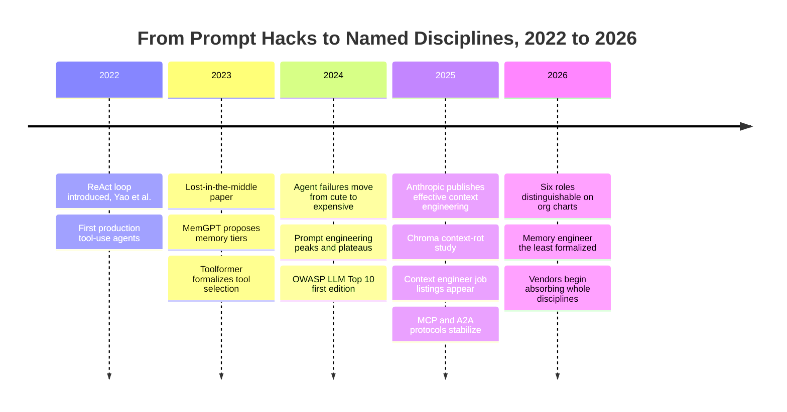
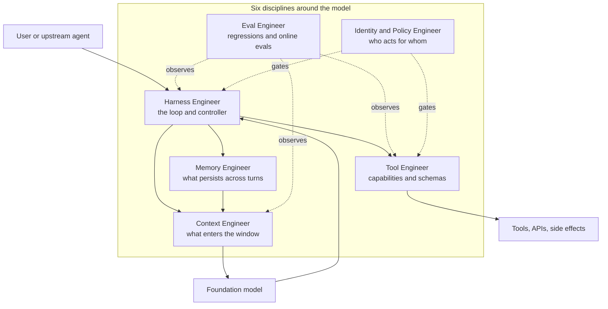
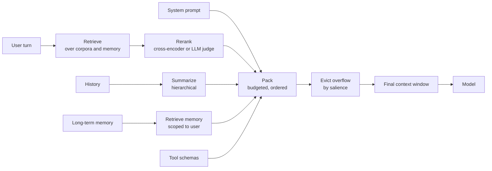
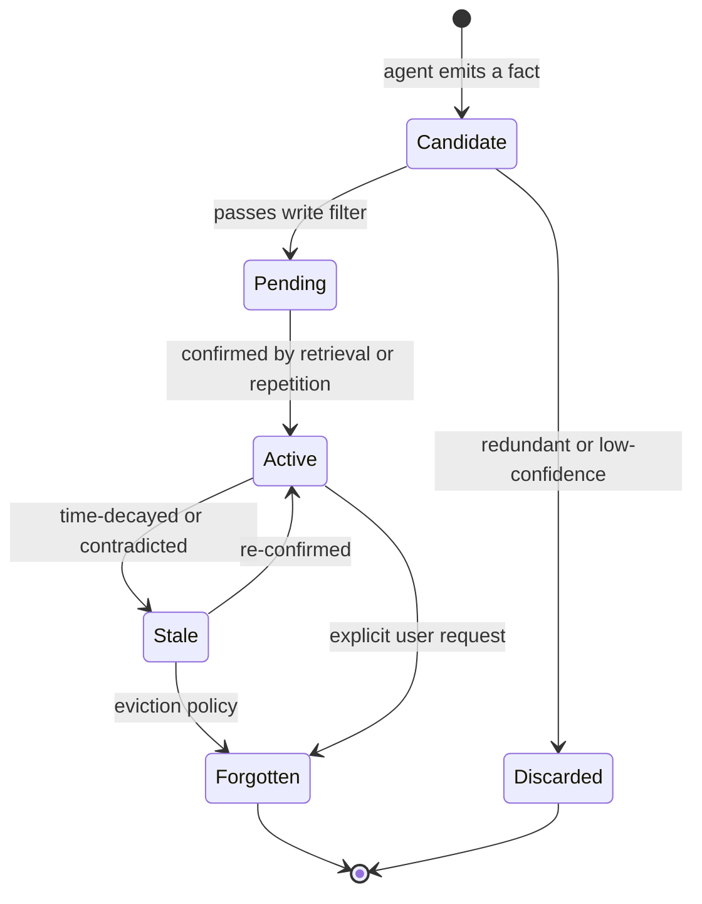
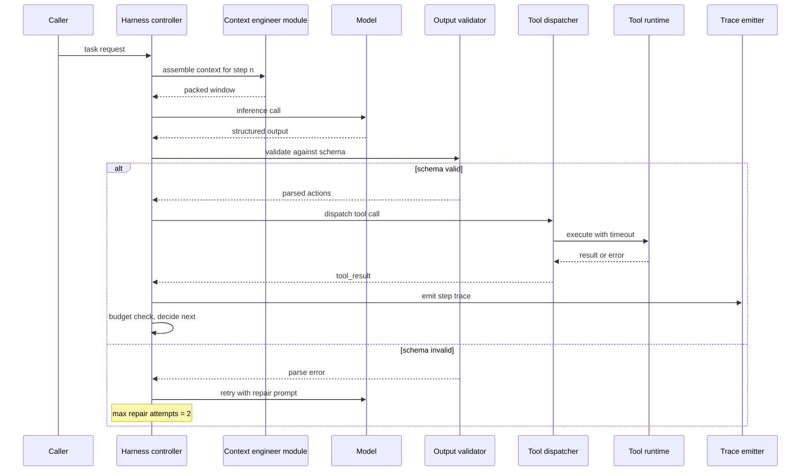
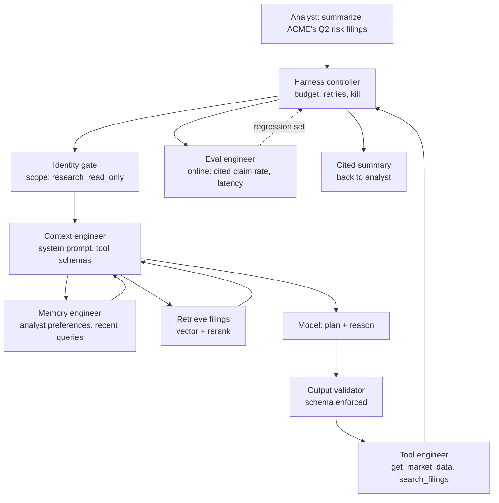

# Agent Engineering as a Discipline: Six Roles That Just Got Names

The room was full of senior engineers, and someone was trying to put a name on the work. The team had spent the previous quarter rebuilding their flagship agent for the third time. Each rebuild had a different villain. The first had failed because retrieval was returning irrelevant chunks and the agent confidently quoted them. The second had failed because the agent's memory across sessions had begun bleeding user A's preferences into user B's transcripts. The third had failed because the orchestration loop kept wedging on a particular tool error and burning two thousand dollars a day in unbounded retries. Each time, the post-mortem ended with the same sentence: "We need better engineering around this." Each time, "this" pointed at a different thing.

What the team was learning, painfully, is what most senior agent practitioners learned across 2025 and 2026: the surface area between a foundation model and a production agent is not one job. It is at least six. The pieces that go wrong are shaped differently, evolve on different timelines, fail under different load, and reward different specializations. A team that staffs only "AI engineers" without distinguishing the work loses the same fights I just described, in roughly that order, every time.

This post is the tour I wish I had on day one of staffing an agent program in 2026. We have covered, over the last several posts in this arc, what to put around an agent: the [field guide to guardrails](https://juanlara18.github.io/portfolio/#/blog/agent-guardrails-field-guide), the [Cloud Next 2026 agent-native stack](https://juanlara18.github.io/portfolio/#/blog/google-cloud-next-2026-agent-native-stack), the [Knowledge Catalog deep dive](https://juanlara18.github.io/portfolio/#/blog/gemini-enterprise-knowledge-catalog-deep-dive), and the [Catalog versus ontologies confluence](https://juanlara18.github.io/portfolio/#/blog/knowledge-catalog-vs-ontologies). Now the question turns inward: who actually does this work, and what does the work look like when you draw a job description around it?

I will be opinionated. Some of these roles are real and load-bearing. Some are LinkedIn rebrands of work that already had a name. Some are still half-formed and will, within eighteen months, either consolidate or vanish. The honest projection at the end of this post tries to draw those lines.

A note on framing before we start. "Agent engineering" gets used in three different ways in industry, and the conflation does damage. The first usage is *the practice*: the activity of building, deploying, and operating LLM-driven agents, regardless of who does it. The second is *the discipline*: a body of knowledge, patterns, and named effects that has cohered enough to be taught and evaluated. The third is *the role*: a job title attached to a person on an org chart. We are mostly talking about the second and third here. The first is just what we have been doing for three years.

---

## Why a New Discipline at All?

The agent disasters of 2024 were not, mostly, model-quality disasters. The models were already good enough. By the second half of that year, GPT-4-class systems and the early Claude 3 family could answer hard questions, decompose plans, write code, and call tools with the kind of competence that would have looked like science fiction in 2022. What broke production agents was not the model. It was the seven hundred decisions that surrounded the model and that nobody had been hired to make.

What enters the context window? Who decides? On what budget? What gets evicted when the budget is tight, and according to which policy? What persists across sessions and what evaporates at end-of-call? When the model produces a plan, who validates it before it touches a tool? When the same tool errors three times in a row, who decides whether to back off, escalate, or kill the run? When a token in the output looks like a customer's email address, who redacts it before it ships? When a regression in the safety classifier raises the refusal rate from one percent to four, who notices?

In 2023 these decisions were ad hoc. Whoever was nearest the keyboard made them. In 2024 the same decisions were starting to be encoded in shared modules, but the people who owned each module were still loosely titled "AI engineer" or "ML engineer" or sometimes just "the AI guy." In 2025 the work began to differentiate. By 2026 a senior practitioner staffing a new agent program could write, with a straight face, a job description that read "Senior Memory Engineer" or "Staff Context Engineer" and watch qualified candidates apply. Anthropic's [Effective context engineering for AI agents](https://www.anthropic.com/engineering/effective-context-engineering-for-ai-agents) post, published September 2025, was the moment when context engineering crossed from informal practice to capitalized term. The Interview Guys' January 2026 piece [What Is a Context Engineer?](https://blog.theinterviewguys.com/what-is-a-context-engineer/) tracked the role's appearance in serious enterprise listings.

The pain that birthed each role is operationally specific. Lost-in-the-middle, identified by [Liu et al. 2023](https://arxiv.org/abs/2307.03172), is what happens when nobody owns context ordering. Memory bleed, where one user's preferences surface for another, is what happens when nobody owns memory lifecycle. Runaway loops, tool flooding, plan-action divergence — these are what happens when nobody owns the harness. A Chroma Research study from July 2025 found that LLMs do not use long contexts uniformly, and that even on trivial tasks performance degraded as input length grew. That paper, and the Anthropic harness post a few months later, are the citations everyone uses now to justify the discipline split. The honest summary is that the field discovered, expensively, that agent reliability is a function of how much *of the thing between the model and the world* is owned with intent.



---

## The Six Disciplines: A Map

Before any of the deep dives, the map. The six disciplines do not fit into a clean hierarchy; they sit alongside each other in a ring around the model, each owning a different slice of the surface between the inference call and the world. The diagram below is the one I draw on whiteboards now, in the first hour of a new engagement, to anchor the rest of the conversation.



A few things to notice. The harness engineer sits at the center because the harness is the only piece that touches every other piece; everything routes through the loop. The context engineer feeds the model on every turn. The memory engineer is upstream of the context engineer because memory becomes context the moment it is loaded into a window. The tool engineer is downstream of the harness because tools are what the harness dispatches to. The eval engineer is the only role that observes from outside the request path; eval is structurally a sidecar. The identity and policy engineer is the only role that gates rather than produces; their artifact is a refusal as often as it is an approval.

A short tour of each, before we go deep on the three the brief asked us to spend the most time on.

**Context Engineer.** Owns what enters the model's working memory on each turn. System prompt design, retrieval pipelines, packing and ordering, summarization, eviction. Deliverables: a context-assembly module, a budget policy, a salience metric, a retrieval-then-rerank pipeline, a packing strategy that handles overflow gracefully. Adjacent to traditional prompt engineering but is to it what platform engineering is to writing a Bash script.

**Memory Engineer.** Owns what persists across turns and sessions: short-term scratchpads, long-term user-scoped facts, episodic logs, semantic stores, procedural skill caches. Deliverables: a memory schema, a write-read-update-forget API, an eviction policy, a per-tenant isolation guarantee, a forget-me path that survives audit. The least formalized of the six. The role most often staffed by a database engineer in disguise.

**Harness Engineer.** Owns the deterministic shell around the non-deterministic model: the loop, the planner, retries, fan-out, tool dispatch, observability hooks, cancellation. Deliverables: a controller state machine, a structured-output validator, a step budget, a kill-switch path, a trace emitter compatible with the org's observability stack. Anthropic's [Effective harnesses for long-running agents](https://www.anthropic.com/engineering/effective-harnesses-for-long-running-agents) post made "harness" a capitalized term in late 2025; before that the work was called "agent runtime" or, more often, "the loop."

**Tool Engineer.** Owns the catalog of capabilities the agent can call: tool boundaries, schema discipline, idempotency, error semantics, governance, the distinction between tools that read and tools that write. Deliverables: a tool registry, signed schemas, an idempotency layer, a description-as-prompt-engineering practice, MCP-compatible servers where appropriate.

**Eval Engineer.** Owns the test harness for the whole system: golden sets, regression guards, online evals, drift monitors. Deliverables: an offline test suite that runs on every change, an online eval pipeline that scores live traffic, a labeled regression set per failure mode, a refusal-rate dashboard. Closest to traditional MLOps; in many orgs the same person wears both hats.

**Identity and Policy Engineer.** Owns the question of who the agent is, who it acts for, and what it can touch. Deliverables: agent identity issuance, scoped tokens, blast-radius budgets, audit-log shape, the policy engine that gates irreversible actions. Cross-references the [guardrails field guide](https://juanlara18.github.io/portfolio/#/blog/agent-guardrails-field-guide) directly; this is the role that owns layer 5 of that post's stack.

A small comparison table for orientation. Read the columns first; the rows will land afterward.

| Discipline | Primary artifact | Failure shows up as | Closest pre-2024 role |
|---|---|---|---|
| Context Engineer | Context-assembly pipeline | Wrong answer despite right docs in store | Prompt engineer |
| Memory Engineer | Memory schema and lifecycle | User A's facts surface for user B | Database engineer |
| Harness Engineer | Controller state machine | Runaway loop, silent failure, billing event | Backend engineer |
| Tool Engineer | Tool registry and schemas | Hallucinated tool, idempotency violation | API platform engineer |
| Eval Engineer | Offline and online eval suites | Regression ships unnoticed | ML platform engineer |
| Identity and Policy Engineer | Agent identity and policy gate | Blast radius incident | Security engineer |

The next three sections take Context, Memory, and Harness in turn. The rest get briefer treatment. They deserve their own posts; this is the survey.

---

## Context Engineering — Deep Dive

The context engineer's job is to decide, on every model turn, what configuration of tokens will most likely produce the desired behavior. That definition comes nearly verbatim from [Anthropic's effective context engineering essay](https://www.anthropic.com/engineering/effective-context-engineering-for-ai-agents), and it is the right framing because it gets the scope correct. Context is not the prompt. The prompt is one slice. Context is everything the model sees on a given turn: system instructions, tool descriptions, retrieved documents, conversation history, summaries of older history, schema hints, examples, and increasingly the agent's own scratchpad. A working context is an assembled artifact, and the assembly is an engineering problem.

The hardest fact about context engineering is that the budget is fixed and the demand is unbounded. A 200K-token model lets you stuff in ten times more material than a 20K-token model, and the result is, very often, ten times worse. The Chroma context-rot study from July 2025 tested eighteen models and found that even on trivial retrieval tasks, performance degraded as input length grew, in roughly the same direction across families. [Lost in the Middle](https://arxiv.org/abs/2307.03172) had already shown the positional version of this in 2023: models attend best at the start and end of a window, with a measurable trough in the middle. The honest implication is that more tokens is not more context. More relevant, salient, well-ordered tokens is more context. The job is to do that engineering.

### The Packing Problem

Context assembly has the shape of a constrained optimization. Given a token budget B, a candidate set of items each with a relevance score r and a token cost c, choose a subset that maximizes some utility function U subject to the sum of c being at most B. In practice the items are not independent — a retrieved chunk is more useful next to its neighbor, an older summary is more useful when it precedes the recent turns it summarizes — so the problem is closer to a sequence-aware knapsack than a clean optimization. The team that does this well typically has a small explicit policy that ranks classes of content (system prompt, current turn, recent history, relevant retrieval, older summary, examples) and assigns a budget per class with overflow rules.

A working context-assembly pipeline. The names of the stages are roughly the same across teams; the implementations differ.



A minimum-viable context-packer in code. The interface is what matters; the heuristics inside will evolve.

```python
# Context-assembly helper. The point is that every class of content
# has a budget, a salience score, and an explicit order. Overflow is
# handled by deterministic eviction, not by hoping the model will
# figure it out.

from dataclasses import dataclass
from typing import Callable

@dataclass
class ContextItem:
    kind: str              # "system" | "history" | "retrieval" | "memory" | "tool_schema" | "example"
    text: str
    tokens: int
    salience: float        # 0..1, higher = more important
    order_hint: int        # lower = earlier in window

# Per-class budget as a fraction of the total. Tune empirically.
DEFAULT_BUDGETS = {
    "system":      0.10,
    "tool_schema": 0.08,
    "memory":      0.10,
    "retrieval":   0.45,
    "history":     0.20,
    "example":     0.07,
}

def pack_context(items: list[ContextItem], total_budget: int,
                 budgets: dict[str, float] = None) -> list[ContextItem]:
    budgets = budgets or DEFAULT_BUDGETS
    by_kind: dict[str, list[ContextItem]] = {}
    for it in items:
        by_kind.setdefault(it.kind, []).append(it)

    chosen: list[ContextItem] = []
    for kind, frac in budgets.items():
        bucket = sorted(by_kind.get(kind, []),
                        key=lambda i: -i.salience)
        kind_budget = int(total_budget * frac)
        used = 0
        for it in bucket:
            if used + it.tokens <= kind_budget:
                chosen.append(it)
                used += it.tokens

    # Final ordering: system first, then memory, then summarized
    # history, then retrieved docs (most salient last to land near
    # the question - the lost-in-the-middle mitigation), then current
    # turn, then tool schemas.
    chosen.sort(key=lambda i: (i.order_hint, -i.salience))
    return chosen
```

The two design choices to notice are the per-class budgets and the final-ordering rule. Per-class budgets prevent the most common failure: a flood of retrieval results crowds out the system prompt, the history, or the tool schemas, and the agent loses the plot. Final ordering exists because [Liu et al.](https://arxiv.org/abs/2307.03172) showed the model attends best to the head and tail; load-bearing material belongs at one of those poles.

### The Named Effects

Five effects every context engineer learns to name and mitigate:

- **Lost-in-the-middle** ([Liu et al. 2023](https://arxiv.org/abs/2307.03172)): models attend best to the head and tail of a context window, with a measurable trough between. Mitigation: put load-bearing items at one of the poles; reduce the window when possible; use rerankers that score for likely retrieval position.
- **Context rot** ([Chroma Research, July 2025](https://redis.io/blog/context-rot/)): performance degrades non-linearly as context grows, even with relevant content present. Mitigation: ruthless trimming, hierarchical summarization, sliding windows.
- **Prompt drift** ([Comet research, 2025](https://www.comet.com/site/blog/prompt-drift/)): the same prompt produces gradually different outputs over time as model versions, sampling, or upstream tooling shift. Mitigation: pinned model versions, eval-on-every-change, prompt versioning with diff review.
- **Example contamination**: a few-shot example in the prompt is mistakenly treated by the model as content to reason over rather than as a pattern to follow. Mitigation: strong delimiters, explicit instruction that examples are illustrative, separate channels (tool descriptions vs. examples vs. retrieved content).
- **Token amnesia**: the model forgets an instruction given early in a long window because attention has decayed by the time the answer is generated. Mitigation: re-issue critical instructions near the question; treat the system prompt as advisory and the immediate-pre-question instruction as load-bearing.

### Patterns and Anti-Patterns

The patterns that earn their keep:

- **Hierarchical summarization**: turn-level transcripts compress into session summaries, sessions compress into user summaries. The full transcript stays in cold storage; the summary is what enters the window.
- **Retrieve-then-rerank**: a cheap recall stage pulls candidates; a more expensive rerank stage orders them. Skipping the rerank is the single most common reason "RAG looks fine in the demo and fails in production."
- **Sliding window with anchored head**: keep the system prompt and the most recent turns; evict everything in between by salience score. The anchored head is the workaround for token amnesia.
- **Semantic compression**: rewrite long retrieved documents into denser, question-conditional summaries before they enter the window.
- **RAG-on-chat-history**: treat conversation turns as a retrievable corpus, not as a list to be linearly truncated. This is the pattern that makes long-running agents survive past the context window.

The anti-patterns that ship every quarter:

- **The kitchen-sink dump**: retrieve fifty chunks, paste them all in, hope the model figures it out. It will not. It will get worse, not better, as the chunk count grows.
- **No reranker**: the recall stage is treated as the final ranking. Recall is tuned for breadth; ranking is tuned for relevance. They are different jobs.
- **Critical instruction at the bottom**: the most important instruction in the prompt sits twenty thousand tokens from the question. Token amnesia eats it.
- **Instruction-tuning the user prompt**: putting "you must always..." instructions in the user channel rather than the system channel. They mix with retrieved content and become invisible to the model.
- **Treating summaries as free**: summarizing is a model call. It costs tokens, takes latency, and introduces its own hallucinations. A bad summary can be worse than a truncated transcript.

The honest test of whether a team has a context engineer is not whether someone has the title. It is whether someone, when asked "what is in the window on a typical turn, and why," can answer in three minutes with a diagram and a per-class token budget.

---

## Memory Engineering — Deep Dive

Memory is the discipline that has cohered the least. Three years into the LLM-agent era, "memory" is still a word that means at least four different things depending on who is at the whiteboard. That confusion is the single largest reason memory engineering is, in mid-2026, the most expensive seat to staff and the one most often left empty.

The taxonomy that has earned consensus, drawing from the [MemGPT paper](https://arxiv.org/abs/2310.08560) (Packer et al. 2023), the cognitive-science literature it borrowed from, and the harness-engineering practice that emerged in 2025, slices memory along three orthogonal axes:

- **Time horizon**: working memory (the current turn's scratchpad), short-term memory (this session), long-term memory (across sessions, persisted indefinitely).
- **Content type**: episodic (what happened — transcripts, traces), semantic (facts about the world or the user — preferences, profile data), procedural (how to do things — learned skills, cached plans).
- **Scope**: agent-scoped (visible to one agent), user-scoped (visible to all of one user's sessions across agents), session-scoped (visible only to the current run), tenant-scoped (organizational facts).

Every piece of memory in a production system has a coordinate in that three-axis space. A team that does not draw the cube will, eventually, write the same fact into three different stores under three different scopes and discover the inconsistency on the day it leaks.

### The Memory Lifecycle

A working memory tier has four operations: write, read, update, forget. Each has a policy. The diagram below is the state machine I sketch when reviewing memory designs.



A minimum interface for a memory tier. The interface is what survives across providers; the storage choice is implementation detail.

```python
# Memory tier interface. Three storage backends typically sit behind
# this: a vector store (semantic), a structured store (facts), and an
# event log (episodic). The point of the interface is that the agent
# never knows which is which.

from dataclasses import dataclass
from typing import Literal, Protocol

Scope = Literal["session", "user", "agent", "tenant"]
Kind  = Literal["episodic", "semantic", "procedural"]

@dataclass
class MemoryRecord:
    id: str
    scope: Scope
    kind: Kind
    content: str
    confidence: float    # 0..1
    written_at: float
    last_seen: float
    ttl_seconds: int | None

class MemoryTier(Protocol):
    def write(self, owner: str, scope: Scope, kind: Kind,
              content: str, confidence: float = 0.7,
              ttl_seconds: int | None = None) -> str: ...

    def read(self, owner: str, scope: Scope, kind: Kind | None,
             query: str, limit: int = 5) -> list[MemoryRecord]: ...

    def update(self, record_id: str, content: str | None = None,
               confidence: float | None = None) -> None: ...

    def forget(self, record_id: str | None = None,
               owner: str | None = None,
               reason: str = "user_request") -> int: ...
```

The four operations have different policies and different failure profiles. Write needs deduplication and confidence calibration. Read needs scope checks (the most common production breach is a missing scope filter on a vector search). Update needs to handle contradiction (the user's preferred name *changed*; the old fact must be archived, not overwritten silently). Forget needs to survive an audit; if a regulator asks whether user X's data was deleted, the answer must be defensible at the storage level, not at the application level.

### The Named Effects

Five effects every memory engineer learns to fear:

- **Memory bleed**: facts written under one user's scope surface under another user's scope. Almost always a missing filter on a vector retrieval, occasionally an embedding collision, occasionally a shared cache that should have been per-tenant. Mitigation: scope filters at the storage layer (not the application layer), per-tenant indexes, an integration test that explicitly looks for bleed.
- **Stale-context confidence**: the agent retrieves a six-month-old fact and acts on it as if it were current. The fact is *technically* correct as of when it was written; it is operationally wrong. Mitigation: write-time TTLs, time-decayed scoring, freshness as a first-class field in retrieval.
- **Memory poisoning**: an adversary or a hallucinating earlier turn writes a false fact into long-term memory; subsequent turns retrieve and act on it as if it were ground truth. Mitigation: write filters that gate by source provenance, confidence calibration, periodic eval against a golden ground-truth set.
- **Eviction starvation**: nothing ever gets evicted, the store grows monotonically, retrieval quality degrades as the corpus dilutes. Mitigation: explicit TTLs, importance-weighted decay, periodic compaction.
- **Conflation of memory and cache**: a team treats a cache (whose contents are recoverable from a source of truth) the same as memory (whose contents are *the* source of truth). When the cache misbehaves, data is lost; when memory is treated as a cache, the team neglects backup and audit. Mitigation: keep them separate at the API boundary; never let a cache miss silently demote memory.

### Patterns and Anti-Patterns

The patterns that work:

- **Write-once-read-many fact store**: long-term semantic facts go in a structured store with append-only semantics. Updates are new rows with supersedes-pointer to the old row. Forget is a tombstone, not a delete.
- **Vector store for retrieval, structured store for assertion**: the vector index helps you *find* a fact; the structured store is what you *trust*. Treating the vector store as the source of truth is the most common failure pattern.
- **MemGPT-style paged memory**: main-context (in-window) and external-context (out-of-window) tiers, with explicit move-to-context and evict-from-context operations. The [MemGPT paper](https://arxiv.org/abs/2310.08560) is still the cleanest write-up of the pattern.
- **Hierarchical summaries with anchors**: turn → session → user, with each level keeping a pointer to the level below. When a user asks "what did we discuss last month," the agent retrieves the session summary, not the transcript.
- **Time-decayed retrieval**: scoring that discounts older facts unless they have been re-confirmed. A fact written six months ago and never seen since should not surface ahead of one written yesterday.

The anti-patterns:

- **Storing raw transcripts as the memory primitive**: the transcript is the audit log; memory is the curated, deduplicated, confidence-calibrated extract. Conflating them produces an unbounded corpus that fails on retrieval.
- **No eviction policy**: memory grows monotonically; six months in, every retrieval is buried in noise.
- **No consent path**: when a user asks to be forgotten, the team has no procedure that survives a regulator's audit. This is increasingly an EU AI Act issue, not a nice-to-have.
- **Implicit scope**: the storage layer does not enforce per-user or per-tenant filtering; the application layer is supposed to. The application layer eventually forgets, and you ship a memory bleed.

Memory is the role most often left unstaffed because the work overlaps with database engineering, and the org assumes "we already have a database team." The reason that fails is that the lifecycle policies — TTL, decay, contradiction, forget — are agent-specific, and the database team will not write them. They will give you a vector index. The rest is on the memory engineer to specify.

---

## Harness Engineering — Deep Dive

The harness is the deterministic shell around the non-deterministic model. If the model is the engine, the harness is the chassis: the loop, the controller, the dispatcher, the timeout-and-retry-and-cancel logic, the trace emitter, the structured-output validator, the kill switch. [Anthropic's effective harnesses post](https://www.anthropic.com/engineering/effective-harnesses-for-long-running-agents), published November 2025, was the moment "harness" stopped being slang. Before that, the work was called "the agent loop" or "the orchestration layer" or, with a kind of weary affection, "the part nobody owns until it breaks."

The defining property of a good harness is that the same agent, running the same task with the same model, behaves the same way twice. That sounds obvious. It is, in practice, the hardest property to achieve and the one whose absence is most expensive. A harness that is itself stochastic — because retries are uncapped, parser is fragile, timeouts are ad hoc, and trace emission is best-effort — produces an agent whose every failure is a unique snowflake nobody can debug.

### One Harness Iteration



The interesting part of this diagram is the loop-back on schema-invalid output. A free-form parser would silently coerce a malformed response into something runnable; a strict validator forces a repair turn or a hard fail. The repair turn is bounded — typically two attempts — because an unbounded repair loop is one of the named harness anti-patterns we will get to in a moment.

### A Minimum-Viable Harness Loop

```python
# Harness loop. Five things this implements that ad hoc loops usually do
# not: a step budget, structured output with retry-on-schema-fail, a
# per-step timeout, deterministic tool dispatch via a registry, and a
# trace emission per step.

import json, time
from dataclasses import dataclass, field
from typing import Callable

@dataclass
class StepBudget:
    max_steps: int = 20
    max_seconds: float = 180.0
    max_dollars: float = 2.0
    used_steps: int = 0
    used_dollars: float = 0.0
    started: float = field(default_factory=time.time)

    def exceeded(self) -> str | None:
        if self.used_steps >= self.max_steps: return "steps"
        if time.time() - self.started >= self.max_seconds: return "wallclock"
        if self.used_dollars >= self.max_dollars: return "dollars"
        return None

def harness_loop(task: str, *, model_call: Callable, tool_registry: dict,
                 validator: Callable, trace_sink: Callable,
                 budget: StepBudget) -> dict:
    history: list[dict] = [{"role": "user", "content": task}]
    while True:
        cap = budget.exceeded()
        if cap:
            trace_sink({"kind": "halt", "reason": f"budget:{cap}"})
            return {"status": "halted", "reason": cap}

        raw, cost = model_call(history)
        budget.used_steps += 1
        budget.used_dollars += cost

        try:
            action = validator(raw)         # raises on invalid schema
        except ValueError as e:
            history.append({"role": "system",
                            "content": f"Your last output was invalid: {e}. "
                                       "Please retry with a schema-conformant response."})
            continue                         # one repair turn; counted in budget

        trace_sink({"kind": "step", "n": budget.used_steps, "action": action})

        if action["type"] == "final":
            return {"status": "ok", "answer": action["content"]}

        if action["type"] == "tool_call":
            tool = tool_registry.get(action["name"])
            if tool is None:
                history.append({"role": "tool",
                                "content": f"Tool {action['name']} not found. "
                                           f"Available: {sorted(tool_registry)}."})
                continue
            try:
                result = tool(action["args"], timeout=action.get("timeout", 10))
            except TimeoutError:
                result = {"is_error": True, "content": "tool_timeout"}
            history.append({"role": "tool", "content": json.dumps(result)})
```

Five properties of this loop are worth pointing out, because they are the ones missing from the agent loops I have inherited most often. First, the budget is checked at the *top* of every iteration, before the model call, not at the bottom; an overrun is detected before it becomes an overrun. Second, schema-invalid output is handled with a bounded repair turn rather than a permissive parser. Third, tool dispatch goes through a registry; a hallucinated tool name produces a deterministic "tool not found" message rather than an exception. Fourth, every step emits a trace before any side effect happens; an incident's audit log is correct even if the next step crashes. Fifth, a missing or unknown action `type` falls through to nothing — the loop refuses to act on outputs it does not recognize, rather than guessing.

### The Named Effects

Six effects every harness engineer learns to recognize:

- **Runaway loop / capability creep**: the agent iterates without converging, or accumulates capabilities across turns until it can do far more than the original task required. Mitigation: hard step budget, dollar budget, capability scoping per step.
- **Tool flooding**: the model is presented with too many tools and degrades. The empirical rule of thumb is the [7±2 working-memory bound](https://en.wikipedia.org/wiki/The_Magical_Number_Seven,_Plus_or_Minus_Two); production agents with more than nine visible tools start showing increased miss rates. Mitigation: tool catalogs gated by retrieval (the agent sees only the tools relevant to the current task), tool grouping under aggregator tools.
- **Plan-action divergence**: the agent emits a plan, then takes an action that does not match. The classic indirect-prompt-injection signature. Mitigation: plan-then-critic-then-execute pattern, the action validator must derive from the plan.
- **Silent failure**: the agent reports task complete; the side effects show otherwise. Mitigation: never trust the agent's "I'm done" text — derive completion from the audit log of side effects.
- **Harness brittleness**: a small prompt change breaks the parser; an updated model produces a slightly different output shape and the harness crashes. Mitigation: schema-validated outputs; parser as a versioned contract, not a hand-rolled regex.
- **Eval-by-eyeballing**: the only test of the harness is "I ran it once and it looked right." Mitigation: see the eval engineering section.

### Patterns and Anti-Patterns

The patterns that work:

- **ReAct loop variants**: the foundational pattern from [Yao et al. 2022](https://arxiv.org/abs/2210.03629), with the planner-executor split and the explicit thought trace. Most production harnesses are ReAct with bounded budget.
- **Plan-and-execute**: emit a full plan up front, validate it, then execute step by step with checkpointing. Better for tasks where the plan is stable and the steps are mechanical.
- **Supervisor pattern**: a top-level agent delegates to specialist sub-agents; the supervisor owns budget and can preempt. Maps well onto A2A.
- **Hierarchical agents**: a planner emits goals, sub-planners emit sub-goals, executors carry out leaves. Useful for genuinely multi-day tasks; expensive to set up.
- **Deterministic shell, stochastic core**: every wrapping concern (retries, timeouts, dispatch, parsing, logging) is deterministic code; only the inference call is stochastic. The Anthropic harness post is essentially a long argument for this property.
- **Structured outputs with retry-on-schema-fail**: bounded repair turns rather than permissive parsing.

The anti-patterns:

- **Free-form "let the agent figure it out"**: the loop has no schema, no parser, no budget, no kill switch. Survives demos. Dies in production.
- **Ad hoc string parsing**: the model's output is parsed by regex or string-match; tiny prompt changes break the harness.
- **No per-step timeouts**: a slow tool call hangs the loop indefinitely; the budget check is at the top of the loop and never fires.
- **No kill-switch path**: the only way to stop a misbehaving agent is to redeploy the service. Layer 5 of the [guardrails post](https://juanlara18.github.io/portfolio/#/blog/agent-guardrails-field-guide) covers what to do instead.
- **Trusting `"I'm done"`**: completion is detected by parsing the agent's claim of completion rather than by inspecting the audit log of side effects. Silent-failure breeding ground.
- **The harness as a prompt**: the controller's logic lives entirely inside the system prompt. The model is asked to police itself. It will not.

The single most useful test of a harness is whether you can replay any past run. If yes, you have a harness. If no, you have a loop.

---

## The Other Three: Tool, Eval, Identity

A briefer survey of the three roles that the brief gave shorter treatment to. Each deserves its own post; this is the orientation.

### Tool Engineer

Tools are the agent's hands, and tool engineering is the practice of making sure those hands are well-shaped, well-labeled, and bounded by the system rather than by the model's good intentions. The deliverables are a tool registry, a schema for each tool that is strict enough to validate by code, idempotency wrappers for any tool that mutates state, and tool descriptions written *as prompt engineering* — because the description is part of the prompt the model reads on every turn.

[Toolformer](https://arxiv.org/abs/2302.04761) (Schick et al. 2023) was the first paper to argue that tool selection itself is a learnable behavior, and the lineage of the tool-engineering discipline runs through it to the modern tool-use APIs.

The 7±2 rule for visible tools is empirical and load-bearing. Production agents with more than nine tools in a single registry start showing measurable selection-error rates. Two patterns mitigate: hierarchical tool catalogs (the agent sees a top-level menu, drills into a sub-menu when relevant) and retrieval-gated tool exposure (the orchestrator decides which tools are visible on each turn based on the task).

A short tool-schema validator that earns its keep:

```python
# Tool schema validator. Pydantic does the parsing; the layer here is
# the business-rule check that pydantic alone cannot express.

from pydantic import BaseModel, Field, ValidationError, field_validator

class TransferArgs(BaseModel):
    from_account: str = Field(pattern=r"^acct_[A-Z0-9]{8}$")
    to_account:   str = Field(pattern=r"^acct_[A-Z0-9]{8}$")
    amount_cents: int = Field(ge=1, le=10_000_00)   # max $10k per call
    idempotency_key: str = Field(min_length=16)

    @field_validator("to_account")
    @classmethod
    def not_self_transfer(cls, v, info):
        if v == info.data.get("from_account"):
            raise ValueError("self-transfer not allowed")
        return v

def validate_tool_call(name: str, raw: dict) -> dict:
    schemas = {"transfer": TransferArgs}
    schema = schemas.get(name)
    if schema is None:
        return {"ok": False, "error": f"unknown tool: {name}"}
    try:
        parsed = schema.model_validate(raw)
        return {"ok": True, "args": parsed.model_dump()}
    except ValidationError as e:
        return {"ok": False, "error": e.errors()[:2]}
```

The honest test of tool engineering is whether a new tool can be added to the registry by writing a schema and a description, with no changes to the loop. If adding a tool means editing the harness, the tool engineer and the harness engineer have the same backlog and you have one role pretending to be two.

### Eval Engineer

Evals are the only thing that makes the rest of agent engineering tractable. Without them, every change is a gamble. With them, the team can move at a real cadence. The discipline has three layers:

- **Offline goldens**: a curated set of inputs with expected behaviors; runs on every change. The set grows as new failure modes are discovered. The role of the eval engineer is partly archaeological — incidents become test cases.
- **Online evals**: live traffic is sampled and scored, either by a smaller LLM-judge model or by a deterministic checker. Refusal rate, tool-error rate, cost per task, plan-action divergence rate — these become dashboards.
- **Capability evals vs safety evals**: capability evals measure whether the agent does its job; safety evals measure whether it refuses to do things it should not. They are different test sets, and a single number that conflates them is a number that lies.

```python
# Eval golden-set runner. The shape that survives across teams is a
# labeled case, an actual run, a deterministic scorer, and a per-category
# aggregation.

from dataclasses import dataclass
from typing import Callable

@dataclass
class Case:
    id: str
    input: str
    expected: dict       # {"final_action": "...", "must_call": [...], "must_not_call": [...]}
    category: str        # "capability" | "safety" | "regression"

def run_goldens(cases: list[Case], agent: Callable[[str], dict],
                judge: Callable[[Case, dict], bool]) -> dict:
    by_cat: dict[str, dict] = {}
    failures: list[tuple[Case, dict]] = []
    for c in cases:
        out = agent(c.input)
        ok = judge(c, out)
        cat = by_cat.setdefault(c.category, {"total": 0, "pass": 0})
        cat["total"] += 1
        if ok:
            cat["pass"] += 1
        else:
            failures.append((c, out))
    return {
        "by_category": {k: v["pass"] / max(v["total"], 1) for k, v in by_cat.items()},
        "failures": [(c.id, out) for c, out in failures[:20]],
    }
```

The eval flywheel — incidents become tests, tests catch regressions, regressions never ship — is the operational discipline the role exists to enforce. By 2026 most mature teams had landed on a split where eval engineers own offline goldens and online evals jointly with MLOps; the boundary varies but the work is the same.

### Identity and Policy Engineer

The identity and policy engineer's job is to answer two questions on every action: *who* is taking this action, and *what blast radius is acceptable for the answer to that question*. The first is plumbing: agent identity, scoped tokens, audit trail. The second is judgement: an irreversible action against a high-value resource gets a different gate than a read against a public corpus.

This is the role that lives at the boundary between agent engineering and security engineering, and the [guardrails field guide](https://juanlara18.github.io/portfolio/#/blog/agent-guardrails-field-guide) is the long version of the playbook. The minimum-viable artifact is a policy gate that runs before any tool dispatch:

```python
# Identity-and-policy gate. Runs between the harness and the dispatcher.
# Returns one of approve / require_confirmation / require_human / refuse.

from dataclasses import dataclass

@dataclass
class AgentPrincipal:
    agent_id: str
    on_behalf_of: str        # human user or service
    scopes: set[str]

def policy_gate(principal: AgentPrincipal, tool_name: str, args: dict,
                blast_radius: float, autonomy_level: str) -> str:
    if tool_name not in principal.scopes:
        return "refuse"
    if blast_radius >= 0.8:
        return "require_human"
    if blast_radius >= 0.5 and autonomy_level != "high":
        return "require_confirmation"
    return "approve"
```

Identity and policy is where agent engineering meets the org's existing security and compliance reality. The role is not optional in regulated environments. Anywhere financial, medical, or legal, the identity-and-policy engineer is the one whose absence shows up in the next breach review.

---

## A Worked Example: A Financial-Research Assistant

Six disciplines is a lot of pieces. The way they fit together is easier to see on a single concrete feature. Suppose you are building a financial-research assistant that, given an analyst's question, retrieves filings and market data, reasons over them, and produces a cited summary. The user is logged in; the agent acts on their behalf; the answer must be auditable.



Each named box maps to a discipline. The harness owns the controller and the budget. The identity-and-policy gate verifies the agent is acting in a read-only research scope and refuses any tool call that is not in that scope. The context engineer assembles the window — system prompt, tool schemas, recent analyst-specific preferences from memory, retrieved-and-reranked filings. The memory engineer owns the analyst-preference store and the cached recent-query summaries. The tool engineer owns the schemas for `get_market_data` and `search_filings` and the idempotency on any side-effecting calls (here, mostly logging). The eval engineer owns the online metrics that catch the case where, six weeks in, the rate of cited claims drops because the rerankers degraded silently after a model upgrade.

The point of the worked example is that the failures are role-shaped. If retrieval is returning the wrong filings, that is a context-engineering bug. If the analyst's preferences from last week are bleeding into another analyst's session, that is a memory-engineering bug. If the agent loops on a tool error and burns budget, that is a harness-engineering bug. If the cited-claim rate drops without anyone noticing, that is an eval-engineering bug. If a refund tool that never should have been in scope shows up in the registry, that is an identity-and-policy bug. A single "AI engineer" tasked with all five owns nothing well.

---

## Named Effects Glossary

Every discipline above has its named failure modes. Pulled together, the glossary the field has converged on by mid-2026:

| Effect | Discipline | One-line definition | One-line mitigation |
|---|---|---|---|
| Lost-in-the-middle | Context | Models attend best to head and tail; trough in the middle | Put load-bearing items at one of the poles |
| Context rot | Context | Performance degrades non-linearly as context grows | Trim hard, hierarchical summaries, sliding windows |
| Prompt drift | Context | Same prompt produces gradually different outputs over time | Pinned models, eval-on-every-change, prompt versioning |
| Persona drift | Context | The agent's voice or stance shifts mid-session | Re-issue persona near the question; persona evals |
| Instruction collision | Context | Two instructions in the window contradict each other | Single source of truth for instructions; lint pass |
| Token amnesia | Context | Critical instruction issued early is forgotten by answer time | Re-issue near the question; treat the system as advisory |
| Example contamination | Context | Few-shot examples reasoned over, not patterned from | Strong delimiters; explicit illustrative-only framing |
| Memory bleed | Memory | One user's facts surface for another | Scope filters at storage, per-tenant indexes, bleed tests |
| Stale-context confidence | Memory | Old fact acted on as if current | TTLs, time-decayed scoring, freshness as first-class |
| Memory poisoning | Memory | False fact written then trusted on retrieval | Write-time provenance gates; periodic ground-truth eval |
| Eviction starvation | Memory | Nothing evicted; corpus grows; quality dilutes | Explicit TTLs, importance-decay, periodic compaction |
| Runaway loop | Harness | Loop iterates without converging | Hard step / wallclock / dollar budget; top-of-loop check |
| Capability creep | Harness | Agent accumulates capabilities across turns | Per-step capability scoping; explicit re-grant required |
| Tool flooding | Harness | Too many tools degrade selection | Hierarchical catalogs; retrieval-gated tool exposure |
| Plan-action divergence | Harness | Plan looks fine; action carries injected payload | Plan-critic-execute; action derives from plan |
| Silent failure | Harness | Agent reports done; side effects say otherwise | Derive completion from audit log, not the agent's text |
| Harness brittleness | Harness | Tiny prompt change breaks the parser | Schema-validated outputs; parser as versioned contract |
| Cost spiral | Harness | Per-task cost grows without alarm | Per-task moving average, three-sigma alert, kill |
| Eval drift | Eval | Goldens stop matching production distribution | Refresh goldens from sampled live traffic monthly |
| Golden-set rot | Eval | Old goldens still pass even though product changed | Annual full re-curation; treat goldens as versioned |
| Observability blind-spot | Eval / Harness | A class of failures emits no useful trace | Trace schema review; explicit "must emit" fields |
| Identity sprawl | Identity | Too many agents share too few principals | One principal per agent; quarterly cleanup |

This is the table I print and tape next to my desk. When something goes wrong, the first question is always "which row is this?" If the team cannot locate the row, the failure is novel and the row is about to be added. If they can, the discipline that owns the row also owns the fix.

---

## A Maturity Model

A four-level maturity model, applied per discipline. The rows tell you what each role looks like at each level. The honest use of this table is diagnostic: pick your discipline, find your level, look at the next column, and that is where the next year's investment goes.

| Level | Context | Memory | Harness | Tool | Eval | Identity |
|---|---|---|---|---|---|---|
| Ad-hoc | One big system prompt; retrieval if any is unranked | Raw transcripts; no scope, no eviction | Unbounded loop in a notebook; no budget | Tools added by editing the loop | "It worked when I tried it" | Service account; no audit |
| Reactive | Per-class budgets exist; rerank in place; some eviction | A vector store; per-user filter applied at app layer | Step budget; manual retries; trace in logs | Tool registry; some schemas | A handful of regression cases run on release | Per-agent service account; logs to BigQuery |
| Disciplined | Salience-driven packing; hierarchical summarization; named effects mitigated | Three-axis taxonomy (time, content, scope); TTL and decay; forget path | Plan-critic-execute; bounded repair; structured outputs; kill switch | Versioned schemas; idempotency; hierarchical catalogs | Offline goldens by category; online evals; refusal-rate dashboard | First-class agent identity; capability tokens; policy gate; HITL for high blast radius |
| Programmatic | Context-as-code with lint; per-task context profiles; A/B on packing | Memory-as-product with SLA; cross-tenant isolation tests; consent UX | Replayable traces; deterministic-shell-stochastic-core enforced in CI | Tool catalog as separate product; MCP-compatible by default | Eval flywheel: incidents become tests automatically; goldens versioned; capability vs safety split | Policy-as-code; blast-radius budgets; cross-cloud federation |

The thing to notice is the shape of the typical trajectory. Most teams in mid-2026 are in *Reactive* across the board, with one or two disciplines pushed up to *Disciplined* by whatever recent incident motivated the investment. *Programmatic* across the board is a multi-year project; it is also what separates the agent-platform teams at Anthropic, OpenAI, Google, and a handful of large enterprises from everyone else. The honest consultancy answer to "where should we invest next" is usually "lift your weakest discipline by one level," not "leapfrog to programmatic in the strongest one."

---

## The State of the Practice: A Critical Projection

Five honest observations a practitioner should hold onto in mid-2026.

**First, three of these roles are real and load-bearing; three are still half-formed.** Context engineering, harness engineering, and eval engineering are now full-time jobs at any team running production agents at scale. The artifacts are concrete, the failure modes are named, the patterns are converging. Tool engineering is real but in many orgs lives inside the harness team. Memory engineering is the least formalized; the people doing the work are calling themselves three different things. Identity-and-policy engineering is real but, in most orgs, lives inside the security team and is not a separate seat.

**Second, vendor capture is happening unevenly.** Identity and policy is being absorbed fastest: Gemini Enterprise's Agent Identity, AWS Bedrock Agents' IAM integration, Azure AI Foundry's identity plane all push toward making identity-and-policy a configuration concern rather than an engineering one. Memory is being absorbed by managed services: Memory Bank in Gemini Enterprise, Bedrock Sessions, the early "memory primitives" in OpenAI's API. Eval is being absorbed by third parties: LangSmith, Arize, Braintrust, Patronus. Context engineering is the discipline that is *not* being absorbed; it remains the part where each team's craft matters most, because what enters the window is the most product-specific decision a team makes. Harness engineering sits in the middle: managed runtimes (Agent Runtime, Bedrock AgentCore) are taking the boilerplate, but the controller logic stays with the team.

**Third, two consolidations are likely within eighteen months.** Tool plus Eval will probably merge under a single "Capability Engineer" role, because tool design and tool evaluation are tightly coupled and most of the artifacts (schemas, descriptions, tests) overlap. Memory plus Context will probably merge under a "Context-Memory Engineer" role, because the boundary between "what is in the window now" and "what was in the window last week" is a TTL question, not a discipline question. The remaining four roles (Context-Memory, Harness, Capability, Identity) is, I suspect, the stable taxonomy by 2028.

**Fourth, the LinkedIn theater is real and corrosive.** "Senior AI Engineer" became a meaningless title in 2024; "Senior Context Engineer" is at risk of meaning nothing in 2026 if the trend holds. The signal-to-noise on titles is bad and getting worse. The honest filter, in a hiring loop, is to ignore the title and ask the candidate to draw the diagram from this post on a whiteboard. If they can locate where they have personally owned the work, the title is real for them. If they cannot, it is a LinkedIn rebrand and you should price that in.

**Fifth, the role taxonomy is not a job-design recommendation; it is a competency map.** A small team should not staff six roles. A large team should not pretend one role does the work of six. The right read of this post is that, *in any given week*, a Senior Agent Engineer wears each of these hats at different times, and the question is whether they have the language to know which hat they are wearing and which named effect they are fighting. The roles are vocabulary; the org design is downstream.

The skeptical take, drawn through the long view: of the six disciplines, three (Context, Harness, Eval) will be on every senior practitioner's resume by 2028 with names roughly recognizable to today's reader. Two (Tool, Memory) will exist mostly as practices inside other roles. One (Identity and Policy) will live where it always lived, in the security org, with an agent-specific dotted line. The capitalized job titles will mostly evaporate; the work they pointed at will not. The taxonomy is real even when the org chart pretends it is not.

---

## Going Deeper

**Books:**

- Huyen, C. (2024). *AI Engineering: Building Applications with Foundation Models.* O'Reilly.
  - The closest thing to a textbook for the practice this post tries to taxonomize. Chapters on evaluation, RAG, agent design, and inference optimization map onto multiple disciplines here.
- Kleppmann, M. (2017). *Designing Data-Intensive Applications.* O'Reilly.
  - Memory engineering is, structurally, a data-systems problem; the chapters on derived data, replication, and event sourcing apply directly to memory tier design.
- Russell, S. and Norvig, P. (2021). *Artificial Intelligence: A Modern Approach, 4th Ed.* Pearson.
  - The chapters on agents (Chapters 2 and 25 in the 4th ed) provide the conceptual scaffolding for what we are now calling harness engineering.
- Goodside, R. and Willison, S. (2025). *Adversarial AI: Practical Defenses for LLM-Powered Systems.* O'Reilly.
  - Pairs naturally with the identity-and-policy section; the threat model the book covers is exactly the surface a policy engineer defends against.
- Newman, S. (2021). *Building Microservices, 2nd Ed.* O'Reilly.
  - The harness diagrams in this post borrow heavily from microservices control-plane patterns; this book is the source.

**Online Resources:**

- [Effective context engineering for AI agents](https://www.anthropic.com/engineering/effective-context-engineering-for-ai-agents) — Anthropic's September 2025 essay; the moment context engineering became a capitalized term.
- [Effective harnesses for long-running agents](https://www.anthropic.com/engineering/effective-harnesses-for-long-running-agents) — Anthropic's November 2025 piece; established "harness" as a discipline name.
- [Context Engineering for Agents](https://rlancemartin.github.io/2025/06/23/context_engineering/) — Lance Martin's June 2025 essay; one of the early treatments of context-as-engineering-discipline.
- [What Is a Context Engineer?](https://blog.theinterviewguys.com/what-is-a-context-engineer/) — January 2026 piece tracking the role's appearance in serious enterprise listings, with salary data.
- [Context rot explained](https://redis.io/blog/context-rot/) — Redis's accessible writeup of the Chroma context-rot study.
- [Prompt Drift: The Hidden Failure Mode Undermining Agentic Systems](https://www.comet.com/site/blog/prompt-drift/) — Comet's treatment of one of the core named effects.
- [MemGPT project page](https://research.memgpt.ai/) — The reference implementation and ongoing research thread on tiered LLM memory.

**Videos:**

- [Context Engineering for Agents](https://www.youtube.com/watch?v=_IlTcWciEC4) by Lance Martin (LangChain) — The companion talk to the essay; the most accessible video introduction to the discipline.
- [What Even Is An Agent](https://www.youtube.com/watch?v=pBBe1pk8hf4) by Simon Willison — A skeptic's framing for what agents are and the failure modes that follow from definitions.

**Academic Papers:**

- Liu, N. F., Lin, K., Hewitt, J., Paranjape, A., Bevilacqua, M., Petroni, F., and Liang, P. (2023). ["Lost in the Middle: How Language Models Use Long Contexts."](https://arxiv.org/abs/2307.03172) *arXiv:2307.03172.*
  - The foundational paper for one of the most-cited named effects in context engineering. Establishes the positional bias of attention in long contexts.
- Yao, S., Zhao, J., Yu, D., Du, N., Shafran, I., Narasimhan, K., and Cao, Y. (2022). ["ReAct: Synergizing Reasoning and Acting in Language Models."](https://arxiv.org/abs/2210.03629) *arXiv:2210.03629.*
  - The harness pattern that almost every production agent loop is a variant of. The thought-action-observation interleaving is now table stakes.
- Packer, C., Wooders, S., Lin, K., Fang, V., Patil, S. G., Stoica, I., and Gonzalez, J. E. (2023). ["MemGPT: Towards LLMs as Operating Systems."](https://arxiv.org/abs/2310.08560) *arXiv:2310.08560.*
  - The clearest formalization of memory tiers for LLMs; main-context vs external-context, page in and page out. The reference architecture for memory engineering.
- Schick, T., Dwivedi-Yu, J., Dessì, R., Raileanu, R., Lomeli, M., Zettlemoyer, L., Cancedda, N., and Scialom, T. (2023). ["Toolformer: Language Models Can Teach Themselves to Use Tools."](https://arxiv.org/abs/2302.04761) *arXiv:2302.04761.*
  - The paper that argued tool selection is itself a learnable behavior. Foundational for the tool-engineering discipline.

**Questions to Explore:**

- If memory engineering is the least formalized of the six disciplines today, what is the canonical paper of 2027 likely to look like — a unifying taxonomy, a benchmark, or a reference implementation? What would have to be true about the failure landscape for one of those three to dominate?
- The blast-radius idea from the guardrails post applies cleanly to identity-and-policy engineering. Does it generalize to a continuous "reversibility budget" that agents can spend over time, and what is the right way to expose that budget to a context engineer who has to communicate it to the model?
- Vendor capture of identity, memory, and eval is happening unevenly. What are the second-order effects on the open-source agent ecosystem if three of the six disciplines become primarily configuration concerns inside cloud platforms?
- Most of the named effects in the glossary were discovered by post-mortem rather than by theory. Is there a principled framework that would have predicted lost-in-the-middle, context rot, or memory bleed before they were observed in production, and what would such a framework take as inputs?
- The maturity model treats each discipline as an independent axis. Are there pairwise dependencies that mean a team cannot reach Disciplined on one axis without first reaching it on another? In particular, can harness engineering reach Disciplined while context engineering is still Reactive, or are the two structurally coupled?
