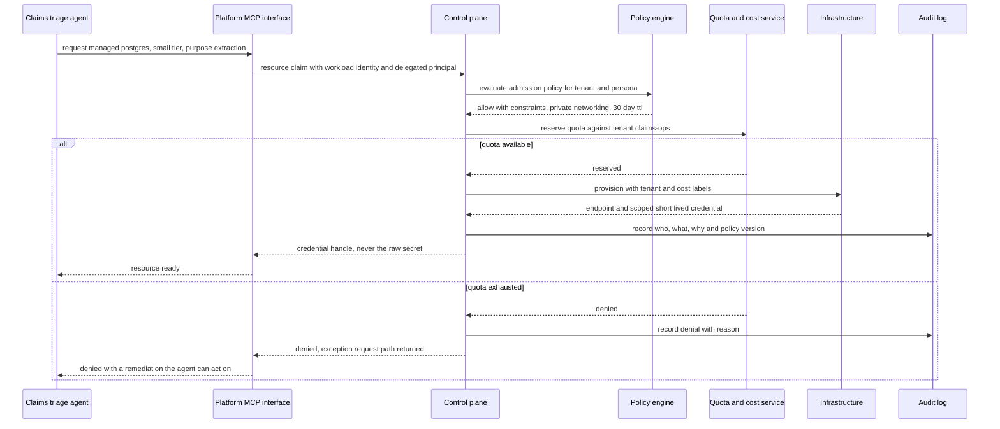
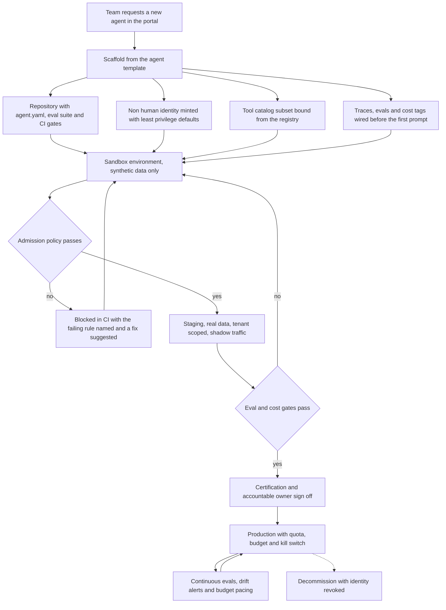
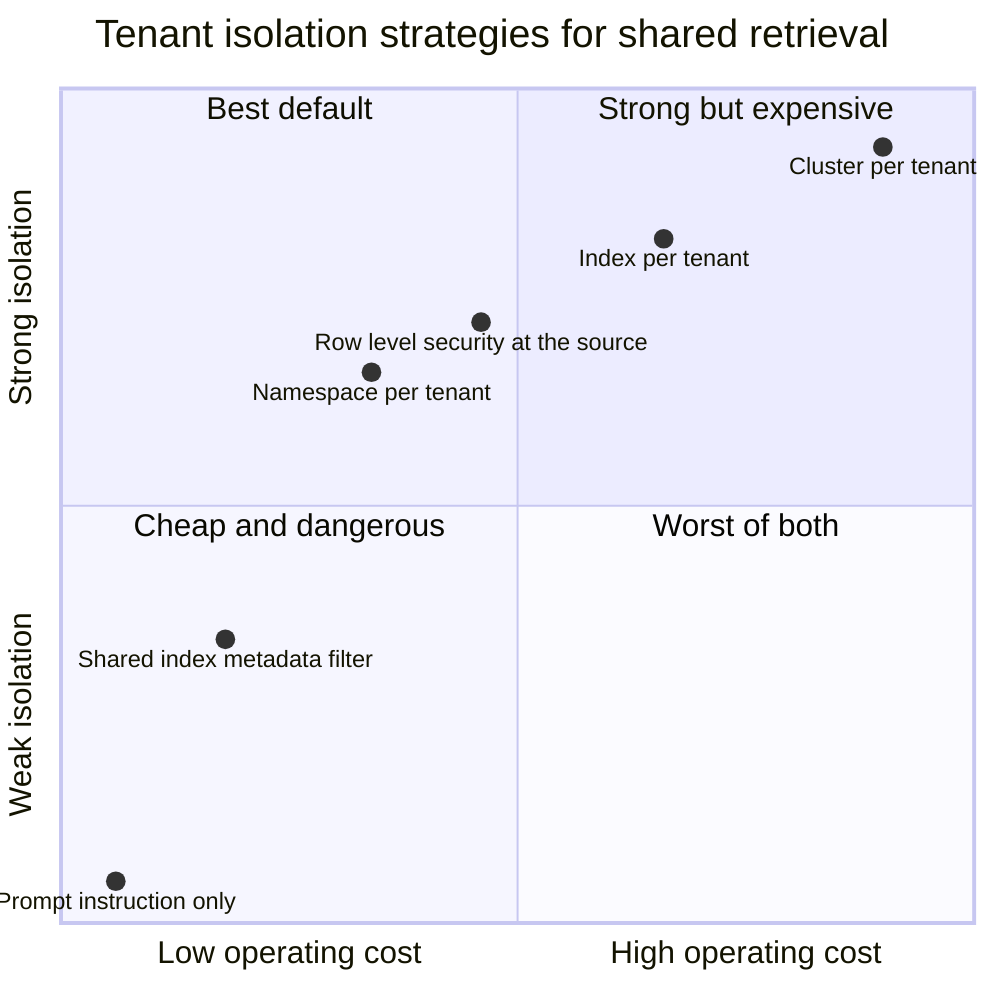
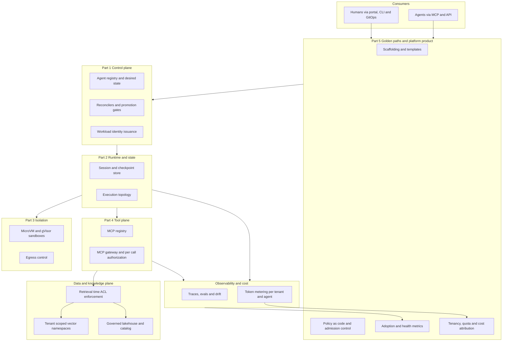

# Golden Paths for Agents: Multi-Tenancy, Self-Service, and the Platform as Product

## The Largest Mandate Platform Engineering Has Ever Held

The request came in through the normal channel, which was the first surprising thing about it.

A ticket in the platform team's queue: provision a managed Postgres instance, small tier, in the claims project. The template was filled correctly, the cost centre was valid, and the justification was more coherent than most. The only unusual thing was the requester, which was not a person. It read `agent://claims/document-triage`, and it had opened the ticket because an insurer had dumped forty thousand scanned PDFs into an intake bucket and the agent had reasoned, correctly, that it needed somewhere structured to put the extracted fields.

Nobody had designed for this. The provisioning template assumed a human would read the confirmation email. The approval step assumed a manager would recognise the requester's name. The quota model assumed requests arrived at human frequency, four or five a quarter per team. And the audit trail, the part that mattered, recorded a service account that eleven different agents shared, because when the identity was created six months earlier nobody had imagined there would be eleven.

The team's first instinct was to block it. Their second, which was correct, was to notice that the agent had done exactly the right thing: it wanted a database, so it asked the platform for one, through the front door, with a justification and a cost centre. That is the behaviour you spend years trying to teach human engineers. What was missing was not the agent's discipline. It was the platform's.

For roughly a decade, platform engineering has had one mandate: make it easy for developers to do the right thing. That produced golden paths, paved roads, internal developer platforms, and the whole vocabulary of shifting security left so it arrives as a default rather than a rejection. It worked. It made compliance a side effect of convenience rather than a tax on velocity.

That mandate has just been handed a much larger scope. The organisation now wants agents everywhere: claims, finance, the lakehouse, the service desk, the code review pipeline. Every one will need compute, credentials, data, tools, budget, observability, and a way to be turned off. Every one will be built by a team that has never built one before. And every one will, if left alone, invent its own answer to all of it.

The teams that built golden paths for developer autonomy are now being handed the keys to enterprise-wide agentic autonomy. This is the largest mandate platform engineering has ever held, and it arrived with almost no warning. The [PlatformCon 2026 keynote](https://platformengineering.org/blog/platformcon-2026-wrap-up-no-ai-at-scale-without-platform-engineering) put it bluntly: there is no usage of AI in the enterprise at scale without platform engineering. I would put it more sharply. Every organisation is going to get an agent platform. The only question is whether it is one designed on purpose, or forty that emerged by accident and share nothing but a cloud bill.

This is the fifth and final part of *The Agent Platform*. [Part 1](https://juanlara18.github.io/portfolio/#/blog/agent-platform-control-plane-data-plane) split the world into a control plane and a data plane. [Part 2](https://juanlara18.github.io/portfolio/#/blog/agent-runtime-sessions-state-topology) built the runtime, with its sessions, state, and execution topology. [Part 3](https://juanlara18.github.io/portfolio/#/blog/sandboxing-agents-microvm-gvisor) put the untrusted parts inside microVMs and gVisor. [Part 4](https://juanlara18.github.io/portfolio/#/blog/mcp-registry-gateway-tool-plane) built the tool plane out of an MCP registry and a gateway.

Those are components, and a pile of components is not a platform. What turns them into one is the subject of this post: the product discipline, the tenancy model, the policy enforcement, and the paved road that makes all of it the easiest thing a team can do.

---

## Platform as Product, and What Does Not Change

Start with the reassuring part. Almost nothing about the core discipline changes.

Platform engineering's foundational ideas were never artefacts of the container era. They answer a durable organisational problem: how do you let many autonomous teams move fast without each of them independently solving networking, identity, deployment, and compliance badly? The answers were, and remain:

**Platform as product.** The platform has users, and those users can leave. It has a roadmap, a backlog, a support burden, and someone who owns the user experience rather than just the SLOs. Skelton and Pais built this into *Team Topologies* as the defining property of a platform team: it exists to reduce the cognitive load of the stream-aligned teams it serves, and its success is measured by their flow, not its own feature count.

**Golden paths.** Spotify's [original formulation](https://engineering.atspotify.com/2020/08/how-we-use-golden-paths-to-solve-fragmentation-in-our-software-ecosystem) is still the best: the golden path is "the opinionated and supported path to build something." Opinionated, so there is a default. Supported, so choosing the default buys you something concrete. The second half is the one organisations forget.

**Developer productivity as the north star.** Not utilisation, not standardisation for its own sake. Time from intent to running system, with the failure modes designed out along the way.

**Shift-left security.** Controls that arrive as a scaffolded default cost nothing. The same controls arriving as a review comment three weeks before launch cost a sprint and a relationship.

**Self-service with guardrails.** Make the safe action the fast action, so nobody has to choose between shipping and complying.

What changes is not the principles. It is **who the consumers are**, and that changes a great deal downstream. The [Platform Engineering 2.0 framing](https://www.cncf.io/blog/2026/07/06/evolving-platform-engineering-for-ai-native-workloads/) makes the multi-persona point explicitly: a platform now serves developers, data scientists, ML engineers, FinOps practitioners, security teams, and AI agents themselves, each with distinct self-service needs and governance requirements. The same source names the other structural shifts: first-class GPU and TPU allocation, model serving, MCP gateways, agentic guardrails, and cost intelligence that moves "from bolt-on reporting to provisioning-time decisioning."

That last phrase is the pattern in miniature. Cost reporting was always a platform concern; what changes when your consumers are agents is that reporting after the fact is too slow, because the thing that spent the money is not a human who can be asked about it next Tuesday. Stable principles, new consumers, large consequences. Hold that shape for the rest of the post.

---

## Agents as a New, Non-Human Platform Persona

Here is the conceptual heart of the whole thing.

Platform engineering has, since its inception, served exactly one persona seriously; everything else was an accommodation. The internal developer platform is shaped around an application developer: a portal they can read, a template they can fill in, a pull request they can open, a dashboard they can interpret. Cognitive load, the metric the whole discipline optimises, is a property of a human nervous system.

Agents are a genuinely new persona, and they break specific assumptions rather than vague ones. Five matter.

**An agent has no eyes.** Every interface a platform team is proud of, the portal, the wizard, the diagram, the well-designed error page, is invisible to an agent. The [Platform Engineering 2.0 material](https://platformengineering.org/reports/platform-engineering-2-0-an-evolution-for-the-ai-era) states the requirement precisely: agents need the same golden paths, role-based access control, and audit trail as developers, "just exposed through machine interfaces like MCP, not a user interface." A portal-only platform is, from an agent's perspective, no platform at all, and an agent that cannot use yours will use `curl` and a long-lived API key instead.

**An agent has no employment record.** A human's identity is created by a process that predates the platform, owned by HR and IAM, and expires when they leave. Agents have none of that. Their identity must be minted, scoped, attested, and expired by the platform itself, which is usually the only system that knows the agent exists. This is the argument for workload identity: cryptographically attested, short-lived credentials issued at startup rather than static keys pasted into config. SPIFFE and SPIRE are the mature cloud native answer, and the emerging consensus is that agent identity is workload identity plus delegated authorization, not a new invention. The practical implication is simpler than the standards debate: **the identity must be created by the scaffold, not requested afterwards**, because every identity requested afterwards is created in a hurry by someone who needs it working today.

**An agent operates at machine frequency.** Six engineers might file twenty provisioning requests a year. A fleet of agents can file twenty in an afternoon, and unlike the engineers, they will not get discouraged and give up. Any step with a synchronous human approver becomes a queue, then a bottleneck, then a bypass. The consequence is not to remove human judgement but to relocate it: humans set policy in advance, machines evaluate it per request, and human review is reserved for the exceptions policy explicitly routes to them.

**An agent is almost always acting for someone else.** This is the subtlest one and the source of the worst incidents. A human developer acts on their own behalf; their identity is the whole story. An agent acts for a user, a team, a scheduled job, or another agent. There are always at least two identities in play: the agent's workload identity, which says what code is running, and the delegated principal, which says whose authority it is exercising. Collapsing them is how you get an agent that is technically well-scoped and still answers a contractor's question using a document only the board can see. The question is never "can this agent read the HR corpus." It is "can this agent read the HR corpus **on behalf of this particular person, right now**." That distinction is the hinge on which the whole data isolation problem turns.

**An agent does not learn from a bad experience.** A human who files a malformed request gets an error, mutters, and fixes it. An agent will file the identical request again, and again, at whatever rate its retry policy allows, until something upstream changes. Deny-by-default and hard quotas are not paranoia here; they are the only things standing between a misclassified error and a very expensive night.

### The design rule that follows

All five converge on one rule, and it is the most important sentence in this post.

**An agent requesting a database, an environment, a dataset, or a deployment should route through the same policy-aware golden path a human would.** Same control plane, same policy engine, same quota accounting, same audit trail. Different interface, identical path.

The CNCF's [agentic enterprise](https://www.cncf.io/blog/2026/07/21/platform-engineering-for-the-agentic-enterprise-managing-applications-resources-and-ai-agents/) framing lands in the same place: applications, resources, and agents all become first-class managed platform objects, and each actor, human or agent, gets "a distinct identity, scoped permissions, and a clear audit trail." Their reference implementation, OpenChoreo, exposes the same capabilities through portals, CLI, APIs, and GitOps for humans and through MCP servers for agents, deliberately keeping one governance model behind two interfaces.

The alternative is seductive because it is faster in week one. You build a small side channel so the agent team can get moving: a service account with broad permissions, a direct Terraform path, a Slack bot that provisions things. Six months later it carries more traffic than the front door, has none of the policy evaluation, and is invisible to every dashboard you own. **A second provisioning path for agents is not a shortcut, it is a shadow platform**, and it will be the one that has the incident.

Here is what the front door looks like when an agent uses it.



Two details are load-bearing. The agent receives a **credential handle**, not a secret, so the secret never enters a context window or a trace. And the denial returns **a remediation the agent can act on**, because an error message written for a human is a dead end for a non-human consumer. Machine-readable failures are an accessibility requirement for this persona.

Draw the full persona map for your own organisation. The second column is where most platforms discover a gap.

| Persona | Primary interface | Self-serves | Governed by |
|---|---|---|---|
| Application developer | Portal, CLI, GitOps | Services, environments, pipelines | RBAC, code review, admission policy |
| Data scientist | Notebook, SDK, catalog | Datasets, compute, feature stores | Data classification, access grants |
| Agent engineer | Scaffold, CLI, eval harness | Agents, tools, eval suites, budgets | Admission policy, certification gate |
| Security engineer | Policy repo, findings queue | Policy bundles, exceptions | Change control, audit |
| FinOps practitioner | Cost dashboards, budget API | Budgets, quotas, showback rules | Finance approval |
| **AI agent** | **MCP, API, GitOps** | **Resources, tools, data, deployments** | **Workload identity plus delegated principal, quota, policy** |

---

## What a Golden Path for an Agent Team Actually Contains

Let us be concrete. A team gets funding to build a claims triage agent. They have built services before, never an agent. They open the portal, pick "new agent," and answer four questions: what is it for, which tenant owns it, what data classification does it touch, and who is accountable for it.

Ninety seconds later, seven things exist that did not exist before.

**1. A scaffolded repository.** Not an empty repo with a README. A repo containing an agent manifest, a working hello-world agent that already returns an answer, an eval suite with seeded cases and a harness that runs them, a CI pipeline with the policy, eval, and cost gates already wired, a Dockerfile matched to the platform's runtime contract, and a runbook stub with the kill switch procedure filled in. The scaffold is not documentation about doing things correctly. It is a repository already doing them.

**2. A pre-wired runtime.** The session store, checkpointing, and execution topology from [Part 2](https://juanlara18.github.io/portfolio/#/blog/agent-runtime-sessions-state-topology) are configured, with the sandbox profile from [Part 3](https://juanlara18.github.io/portfolio/#/blog/sandboxing-agents-microvm-gvisor) applied by default. The team does not choose an isolation model; they inherit a good one and can request a different one through an exception. Very few will.

**3. A registered non-human identity with least-privilege defaults.** Minted at scaffold time, scoped to the tenant, with zero standing privilege beyond reading its own configuration. Every additional permission is an explicit, reviewable diff against a baseline of nothing. The ordering matters enormously: create the identity first and permissions are legible additions; create the permissions first and scoping never happens.

**4. A curated tool catalog subset.** The MCP registry from [Part 4](https://juanlara18.github.io/portfolio/#/blog/mcp-registry-gateway-tool-plane) contains hundreds of tools. This agent is bound to eleven, selected by the data classification it declared. The gateway enforces the binding; the agent cannot reach a twelfth by guessing its name. Curation is the cheapest guardrail on the platform, and at scaffold time it is free.

**5. Observability and an eval harness wired from day one.** Traces flow to the platform collector before the team writes their first prompt, and the eval suite runs on every commit. That is the difference between a team that instruments because a post-incident review demanded it and a team for whom instrumentation was simply how the repository arrived.

**6. Cost attribution tagged automatically.** Tenant, agent, environment, and cost centre labels are minted with the identity and stamped by the gateway onto every model call. Nobody remembers to add a tag, because nobody adds tags. This is the structural version of the metering discipline in [FinOps for AI Agents](https://juanlara18.github.io/portfolio/#/blog/finops-llm-agents-token-economics), and its whole value is that it is not voluntary.

**7. A defined promotion path.** Sandbox with synthetic data only, then staging with real tenant-scoped data and shadow traffic, then production with a quota, a budget, and a kill switch. Each transition has a named gate, and each gate is a CI step rather than a meeting.

All seven collapse into one declarative artefact: the file the scaffold writes and every downstream control reads.

```yaml
# agents/claims-document-triage/agent.yaml
# Written by the scaffold. Reviewed like code. Read by admission control,
# the gateway, the quota service, and the cost meter.
apiVersion: platform.agents/v1
kind: Agent
metadata:
  name: claims-document-triage
  tenant: claims-ops                 # namespace, quota pool and cost centre
  owner: claims-platform-team
  accountable: head-of-claims-ops@bank.example
spec:
  purpose: >
    Extracts structured fields from scanned claim documents and files
    them into the claims lakehouse. Read heavy, one write tool.
  dataClassification: confidential   # drives tool binding and sandbox profile
  model:
    primary: workhorse-model
    pinnedUntil: "2029-02-01"
  runtime:
    topology: single-agent-loop      # Part 2
    sandboxProfile: microvm-strict   # Part 3
    egress: deny-all-except-gateway
  identity:
    workload: spiffe://bank/ns/claims-ops/agent/document-triage
    delegation: required             # must carry an end-user principal
    standingPrivileges: []           # everything below is an explicit grant
  tools:                             # bound subset of the MCP registry, Part 4
    - id: claims.document.fetch
      scope: read
    - id: claims.extraction.write
      scope: write
      requiresHumanApproval: false
      idempotencyKey: required
  knowledge:
    - product: kp-claims-policy-manual
      isolation: namespace-per-tenant
      aclMode: enforce-at-retrieval   # never enforce-in-prompt
  budgets:
    monthlyUsd: 4000
    perTaskUsd: 0.35
    alertAtPacePercent: 60
  quotas:
    tokensPerMinute: 120000
    concurrentSessions: 40
  eval:
    suite: eval/claims-document-triage
    minPassRate: 0.94
    runOn: [commit, promotion, weekly]
  promotion:
    path: [sandbox, staging, production]
    gates: [admission, eval, cost, certification]
  observability:
    traceSink: platform-collector
    killSwitch: platform.agents.kill/claims-document-triage
```

And here is the journey the team actually experiences.



Drawing it as a journey rather than an architecture makes the real point: **the golden path's product is elapsed time**, not capability. A platform that can theoretically do all of this in six weeks of tickets has not built a golden path, it has built a catalogue of services with a long form in front of it. What you are selling is that a team with no agent experience reaches a governed sandbox before lunch.

Getting there is counter-intuitive for most platform teams: **make the defaults correct rather than the options rich**. Every configurable knob is a decision handed back to a team that does not want it and is not qualified to make it. Team Topologies calls the target a thinnest viable platform, and what it demands is the discipline of deleting options.

One more observation, the highest-leverage thing in this section. **The scaffold is the enforcement point.** Anything present at scaffold time is simply how things are; nobody argues with it, removes it, or experiences it as a control. Anything introduced later is a negotiation with a team that has a deadline. Security in the template is free; the identical security in a review is a conflict. Put everything you care about in the template.

---

## Multi-Tenancy: Quota, Isolation, and the Shared Knowledge Base

Multi-tenancy is where agent platforms stop resembling application platforms, and it is where I have seen the worst incidents. It decomposes into four problems of escalating danger.

### Namespace and quota per tenant

The easy layer. Every tenant, meaning a team or business line, gets a namespace: its own agents, environments, identity prefix, quota pool, and cost centre. Standard multi-tenant platform work, and the cloud native ecosystem has good answers. The agent-specific twist is the quota unit. You are not primarily rationing CPU. You are rationing **tokens per minute, concurrent sessions, tool calls per minute, and dollars per month**, and those four are only loosely correlated. A tenant can sit well within its dollar budget while saturating your entire provider throughput allocation with cheap calls.

### Noisy neighbours on shared model capacity

This is the layer most teams discover in production. Your organisation has a negotiated throughput allocation with a model provider, or a fixed fleet of GPUs, or both. That capacity is shared. And unlike a Kubernetes cluster, where a noisy pod is throttled by a scheduler that understands the resource, a noisy agent tenant consumes a quota enforced at the provider boundary, far outside your platform, and returns 429s to everybody.

The controls that actually work:

- **Per-tenant token-per-minute and request-per-minute ceilings at the gateway**, set below the aggregate so no single tenant can consume the whole allocation. The single most valuable one.
- **Priority classes.** Interactive customer traffic outranks batch enrichment, so when capacity is scarce the batch tenant queues and the customer does not notice.
- **Fair queueing rather than first-come-first-served** when the gateway backs up, so a tenant that submitted ten thousand requests in one burst does not starve a tenant that submitted three.
- **Route batch work to the batch tier.** Roughly half the price and, more relevantly here, an entirely separate capacity pool.
- **Per-task spend ceilings inside the runtime**, because tenant quotas bound the blast radius of a fleet while per-task ceilings bound the blast radius of one pathological loop.

### Per-tenant secret scoping

Secrets are where a tenancy model quietly fails. The pattern to avoid is a platform-wide secret store where any agent identity can read any path, protected only by the fact that agents do not usually guess paths. Scope secrets to the tenant namespace, inject them into the runtime rather than the context window, and keep them short-lived. The agent receives a handle it presents to the gateway; the gateway resolves it. An agent that never holds a raw credential cannot leak one through a trace, a log line, a summary, or a prompt-injected exfiltration.

### Data isolation on a shared knowledge base

Now the dangerous one, where the worst incidents in enterprise agent programs happen. They follow a consistent shape: multiple tenants share one vector store, isolation is enforced somewhere other than the query, and one day a retrieval returns a document to a principal who should never have seen it.

**Start with the pattern choice.** There are three, and the tradeoffs are well understood. Pinecone's [multi-tenancy guidance](https://www.pinecone.io/learn/series/vector-databases-in-production-for-busy-engineers/vector-database-multi-tenancy/) is representative: prefer **one namespace per tenant** unless you specifically need to query across tenants. Namespaces physically partition records, so a query touches one tenant's data and no other; you get performance isolation, so one tenant's burst does not slow another's queries; and offboarding becomes a single delete rather than a filtered sweep. A **shared index with metadata filtering** keeps cross-tenant querying possible but shares compute and storage, makes per-tenant cost attribution hard, and means one filter bug is a full cross-tenant read. **An index or cluster per tenant** gives the strongest isolation at the highest operational cost, and is what regulated tiers usually buy for their most sensitive corpora.

The synthesis: **namespaces for tenant separation, metadata filters for sub-tenant document-level access control.** They answer different questions and you need both.



**Now the part that actually matters: enforce at retrieval, never at prompt.** The most common enterprise RAG vulnerability is a system prompt containing a sentence like "only use documents belonging to the current user's tenant." That is not access control. It is a polite request to a probabilistic system, trivially defeated by an indirect prompt injection sitting inside one of the documents you retrieved. The correct approach is ACL-aware retrieval: access control enforced as a filter **applied during the nearest-neighbour query itself**, before any content reaches the model. Retrieve-then-check is better than nothing but still leaks through result counts, latency, and citation metadata. Check-then-retrieve is the only version that holds.

Three refinements separate a design that works from one that mostly works:

**Chunk-level, not document-level, permissions.** Chunk a document with mixed sensitivity and, if every chunk inherits the top-level ACL, the confidential appendix becomes retrievable by anyone allowed to see the public summary. Permissions must be evaluated per chunk, which means ingestion has to preserve section-level access metadata rather than flattening it.

**Pre-filter, not post-filter.** For large corpora with a low positive hit rate for a given principal, post-filtering forces enormous over-fetching and still risks returning nothing useful. Pre-filtering inside the ANN query is faster and safer.

**Derived artefacts inherit nothing.** This is the leak nobody audits. Your vector store has an ACL model. Your **trace store, response cache, agent memory, summarisation checkpoints, and eval datasets do not**, and every one is a copy of tenant data. I have seen an organisation with an immaculate retrieval ACL model whose observability backend let any platform engineer read the full text of every retrieved passage across every tenant, because traces were treated as telemetry rather than as data. Every derived store is a tenancy boundary. Label it, scope it, expire it.

Here is the enforcement in code. The goal is that an unscoped query is **impossible to express**, not merely discouraged.

```python
"""Tenant-scoped, ACL-aware retrieval for a shared knowledge plane.

Design invariants:
  1. Every query is bound to exactly one tenant namespace.
  2. Every query carries the delegated end-user principal, not just the agent.
  3. Filters are applied inside the ANN search, never after it.
  4. Missing or empty authorization context fails closed, always.
"""

from __future__ import annotations

import logging
from dataclasses import dataclass, field
from typing import Protocol, Sequence

logger = logging.getLogger("retrieval.guard")


class RetrievalAuthorizationError(RuntimeError):
    """Raised when a query cannot be safely scoped. Never downgrade to a warning."""


@dataclass(frozen=True)
class AgentIdentity:
    """The workload identity of the calling agent. Says what code is running."""
    spiffe_id: str
    tenant: str
    allowed_knowledge_products: frozenset[str]


@dataclass(frozen=True)
class DelegatedPrincipal:
    """Whose authority the agent is exercising. Says what may be seen."""
    subject_id: str
    tenant: str
    group_ids: frozenset[str]          # resolved from the IdP, not from the prompt
    clearance: str                     # public | internal | confidential | restricted

    def __post_init__(self) -> None:
        if not self.subject_id or not self.group_ids:
            raise RetrievalAuthorizationError(
                "Delegated principal has no subject or no resolved groups; "
                "refusing to build a retrieval filter."
            )


CLEARANCE_ORDER = ["public", "internal", "confidential", "restricted"]


@dataclass(frozen=True)
class Chunk:
    id: str
    text: str
    source_uri: str
    classification: str
    acl_group_ids: frozenset[str]


class VectorIndex(Protocol):
    """Minimal contract. The namespace argument is mandatory by construction."""

    def query(
        self,
        namespace: str,
        embedding: Sequence[float],
        top_k: int,
        metadata_filter: dict,
    ) -> list[Chunk]: ...


@dataclass
class TenantScopedRetriever:
    index: VectorIndex
    embedder: object
    audit_sink: logging.Logger = field(default=logger)

    def retrieve(
        self,
        query: str,
        agent: AgentIdentity,
        principal: DelegatedPrincipal,
        knowledge_product: str,
        top_k: int = 8,
    ) -> list[Chunk]:
        # --- Gate 1: the agent and the principal must be in the same tenant. ---
        # Cross-tenant delegation is a legitimate pattern but must be explicit,
        # granted by policy, and is deliberately unsupported on this code path.
        if agent.tenant != principal.tenant:
            raise RetrievalAuthorizationError(
                f"Cross-tenant retrieval refused: agent tenant {agent.tenant} "
                f"does not match principal tenant {principal.tenant}."
            )

        # --- Gate 2: the agent must be bound to this knowledge product. ---
        if knowledge_product not in agent.allowed_knowledge_products:
            raise RetrievalAuthorizationError(
                f"Agent {agent.spiffe_id} is not bound to {knowledge_product}."
            )

        # --- Gate 3: build the pre-filter. Chunk level, not document level. ---
        max_clearance = CLEARANCE_ORDER.index(principal.clearance)
        metadata_filter = {
            "knowledge_product": {"$eq": knowledge_product},
            "classification": {
                "$in": CLEARANCE_ORDER[: max_clearance + 1]
            },
            # Chunk ACLs intersected with the principal's resolved groups.
            "acl_group_ids": {"$in": sorted(principal.group_ids)},
        }

        # --- Gate 4: namespace is positional and required. An unscoped query
        # is not expressible through this interface, which is the entire point.
        namespace = f"tenant::{principal.tenant}"

        hits = self.index.query(
            namespace=namespace,
            embedding=self.embedder.embed(query),
            top_k=top_k,
            metadata_filter=metadata_filter,
        )

        # --- Gate 5: defence in depth. The filter should have been sufficient;
        # verify anyway, and treat any violation as an incident, not a miss.
        for chunk in hits:
            if not chunk.acl_group_ids & principal.group_ids:
                self.audit_sink.error(
                    "acl_violation namespace=%s chunk=%s principal=%s",
                    namespace, chunk.id, principal.subject_id,
                )
                raise RetrievalAuthorizationError(
                    "Retrieved chunk failed post-hoc ACL verification; "
                    "the index filter is not being applied correctly."
                )

        self.audit_sink.info(
            "retrieval namespace=%s product=%s principal=%s agent=%s hits=%d",
            namespace, knowledge_product, principal.subject_id,
            agent.spiffe_id, len(hits),
        )
        return hits
```

Four things are deliberate. `namespace` is a required argument, so an unscoped query is not something a tired engineer can write. `DelegatedPrincipal` raises in its constructor when groups are empty, so an unresolved identity fails closed instead of matching everything. Gate 5 re-verifies what Gate 3 enforced and treats a mismatch as a filter-implementation incident rather than a retrieval miss, because a silently non-applied filter is the exact failure you will never otherwise notice. And every retrieval emits an audit line carrying both identities, because "which agent read this on whose behalf" is the question you will be asked and cannot reconstruct later.

---

## Cost Attribution and Why Unattributed Spend Kills Platforms

I covered token metering, budgets, and unit economics at length in [FinOps for AI Agents](https://juanlara18.github.io/portfolio/#/blog/finops-llm-agents-token-economics), so I will not re-derive the cost equation. What belongs in *this* post is the platform-political argument, which platform teams consistently underweight.

The requirement is simple: **every token traceable to a tenant, an agent, and ideally a business outcome.** Tenant tells you whose budget it is. Agent tells you which workload to fix. Business outcome, the resolved ticket or processed claim, tells you whether the spend was worth anything. Most platforms achieve the first, some the second, almost none the third, and the third is what wins budget arguments.

Here is why it is existential rather than merely tidy. An agent platform is a shared cost centre. In year one it is funded on enthusiasm. In year two, finance looks at a seven-figure line item labelled "AI platform" and asks which business unit is consuming it. If the answer is a shrug, exactly one thing happens: the platform becomes the owner of the cost rather than the broker of it. And a cost centre that cannot decompose its spend is the easiest thing in any organisation to cut, because nobody can prove they depend on it.

Attribution inverts this. Once every dollar has a tenant on it, the platform stops being a large unexplainable expense and becomes a **metering utility**: it costs what its consumers consume, its consumers are visible, and its consumers now have their own incentive to be efficient. That is the difference between a team that justifies its existence every budget cycle and a team whose bill is somebody else's problem to optimise.

Two design consequences follow.

**Attribution must be structural, not voluntary.** A tag developers are asked to add lands on sixty percent of traffic, which is worse than useless because the gap is invisible and non-random. Labels minted with the identity at scaffold time and stamped by the gateway on every call land on all of it, because no code path omits them. Same argument as putting security in the scaffold, applied to money.

**Cost belongs at provisioning time, not month end.** Platform Engineering 2.0 calls this moving cost intelligence "from bolt-on reporting to provisioning-time decisioning," and for agents it is not optional. Showing a team the price of the flagship model *in the scaffold*, while they are choosing, changes the choice. The same number in a report on the third of next month changes nothing, because the decision is three weeks cold and the code already works.

Showback first, chargeback when the organisation is ready. Behaviour changes on showback alone, and fast, because engineers are not indifferent to spend, only unaware of it.

---

## Policy as Code: Admission Control for Agents

Guardrails that live in a wiki exist only for the people who read the wiki, which at 6pm on a Friday is nobody. The platform's job is to convert intent into enforcement, and the mechanism is policy as code: rules in a versioned repository, reviewed like code, evaluated by an engine, applied identically to every request without anyone remembering to apply them.

The design question that matters is **what gets blocked at deploy time versus at runtime**, and there is a clean rule.

> Block at deploy time anything that is a property of the **configuration**. Enforce at runtime anything that is a property of the **request**.

Deploy-time denial is cheap: it happens in CI, to an engineer, in the context of a change they are actively making. Runtime denial is expensive: it happens to a user, in production, as a failure. Push everything decidable statically into admission control, and reserve runtime enforcement for what cannot be known until the request arrives.

| Enforced at deploy time (admission) | Enforced at runtime |
|---|---|
| Model is on the approved list and pinned | Per-call authorization at the MCP gateway |
| Every declared tool exists in the registry | Retrieval ACL against the delegated principal |
| Identity is scoped, no standing privileges | Token and request rate limits per tenant |
| Sandbox profile matches data classification | Per-task and per-tenant budget enforcement |
| Eval suite exists and meets the pass bar | Prompt injection and output filtering |
| Budget and quota declared | Human approval for irreversible actions |
| Accountable owner exists and is reachable | Kill switch |
| Write tools declare idempotency | Anomaly detection on cost and behaviour |

Here is admission control as an OPA policy. It is deny-by-default, it names the failing rule, and it is deliberately readable by the security engineer who owns it rather than only by the platform engineer who wired it.

```rego
package platform.agents.admission

# Deny-by-default admission control for agent deployments.
# Input is the rendered agent.yaml plus platform context: the approved model
# list, the tool registry, the tenant's quota headroom and the eval report.

import future.keywords.if
import future.keywords.in

default allow := false

allow if {
	count(deny) == 0
}

# --- Ownership -------------------------------------------------------------

deny contains msg if {
	not input.agent.metadata.accountable
	msg := "no accountable owner declared; agents without owners become orphans"
}

deny contains msg if {
	not input.agent.metadata.tenant in data.platform.tenants
	msg := sprintf("unknown tenant %q; tenancy drives quota, cost and isolation", [input.agent.metadata.tenant])
}

# --- Model governance ------------------------------------------------------

deny contains msg if {
	not input.agent.spec.model.primary in data.platform.approved_models
	msg := sprintf("model %q is not on the approved list", [input.agent.spec.model.primary])
}

deny contains msg if {
	not input.agent.spec.model.pinnedUntil
	msg := "model is not pinned; an unpinned model is an unauthorized behaviour change"
}

# --- Tool plane ------------------------------------------------------------
# Every declared tool must exist in the MCP registry (Part 4) and must be
# permitted for this agent's data classification.

deny contains msg if {
	some tool in input.agent.spec.tools
	not tool.id in data.registry.tools
	msg := sprintf("tool %q is not in the MCP registry", [tool.id])
}

deny contains msg if {
	some tool in input.agent.spec.tools
	tool.scope == "write"
	tool.idempotencyKey != "required"
	msg := sprintf("write tool %q does not require an idempotency key; retries will double act", [tool.id])
}

deny contains msg if {
	input.agent.spec.dataClassification in {"confidential", "restricted"}
	some tool in input.agent.spec.tools
	data.registry.tools[tool.id].egress == "public-internet"
	msg := sprintf("tool %q egresses to the public internet and is not permitted at classification %q", [tool.id, input.agent.spec.dataClassification])
}

# --- Identity and isolation ------------------------------------------------

deny contains msg if {
	count(input.agent.spec.identity.standingPrivileges) > 0
	msg := "standing privileges are not permitted; grant scoped, short lived credentials instead"
}

deny contains msg if {
	input.agent.spec.dataClassification in {"confidential", "restricted"}
	input.agent.spec.identity.delegation != "required"
	msg := "agents touching confidential data must carry a delegated end user principal"
}

deny contains msg if {
	input.agent.spec.dataClassification in {"confidential", "restricted"}
	input.agent.spec.runtime.sandboxProfile != "microvm-strict"
	msg := "confidential workloads require the strict microVM sandbox profile"
}

# --- Knowledge access ------------------------------------------------------
# The single most important rule in this bundle.

deny contains msg if {
	some kp in input.agent.spec.knowledge
	kp.aclMode != "enforce-at-retrieval"
	msg := sprintf("knowledge product %q enforces access somewhere other than retrieval; prompt level access control is not access control", [kp.product])
}

# --- Evaluation and cost ---------------------------------------------------

deny contains msg if {
	input.target_environment == "production"
	input.eval_report.pass_rate < input.agent.spec.eval.minPassRate
	msg := sprintf("eval pass rate %.3f is below the declared bar %.3f", [input.eval_report.pass_rate, input.agent.spec.eval.minPassRate])
}

deny contains msg if {
	not input.agent.spec.budgets.perTaskUsd
	msg := "no per task budget declared; agents choose their own request count and must be bounded"
}

deny contains msg if {
	input.agent.spec.quotas.tokensPerMinute > data.platform.tenant_headroom[input.agent.metadata.tenant].tokensPerMinute
	msg := "requested throughput exceeds tenant headroom; raise the tenant quota or lower the request"
}

# --- Escape hatch ----------------------------------------------------------
# Exceptions are legitimate. Undocumented exceptions are not. An exception
# must be registered, unexpired, owned, and carry a compensating control.

allow if {
	some ex in data.platform.exceptions
	ex.agent == input.agent.metadata.name
	ex.expires_after > input.now
	ex.approved_by != ""
	ex.compensating_control != ""
	count(deny - {m | some m in ex.waives}) == 0
}
```

Two things deserve emphasis. The `enforce-at-retrieval` rule is the one I would keep if I could keep only one, because it is the difference between a data isolation model and a data isolation aspiration. And the escape hatch is *in the policy file*, which is the whole argument of the next section: an exception is a first-class, expiring, owned, compensated object, not something that happens when someone quietly stops using the platform.

---

## The Paved Road Versus the Walled Garden

Everything above can be built correctly and still fail. This is the failure mode platform engineering has been rediscovering for fifteen years, and agents exempt nobody.

The platform team, handed a governance mandate and a genuine fear of what an ungoverned agent might do, makes the golden path **mandatory** and then makes it **narrow**. Only approved models. Only registry tools. Only these two topologies. Exceptions by committee, monthly. The intent is reasonable. The result is that the path stops being a path and becomes a fence, and engineers do to fences what water does to a dam: they find the lowest point.

What happens next is worse than what the fence prevented. A team with a deadline provisions a project in a corner of the cloud estate, gets a personal API key, builds a genuinely useful agent, and connects it to production data. No identity model, no eval suite, no cost attribution, no kill switch, not in any inventory. That is shadow AI, and it is not a discipline problem. It is a **product failure by the platform team**, and it should be diagnosed as one.

Spotify's original framing had the right incentive structure in a single sentence: "If you are an adventurer you can of course leave the Golden Path and do your own thing, but then you will not have the same support." Leaving is permitted. Leaving is expensive. Nobody is stopped; everybody is nudged. The [platformengineering.org guidance](https://platformengineering.org/blog/what-are-golden-paths-a-guide-to-streamlining-developer-workflows) puts the target negatively: the goal is not to build a "golden cage."

For agents the tension is sharper than it was for services, because the stakes are higher. An off-path microservice is a maintenance problem; an off-path agent with production credentials and no kill switch is an incident waiting for a Tuesday. So the honest position is not "never mandate anything." It is:

**Some things are genuinely mandatory, and the list must be short and defensible.** Identity, data isolation, kill switch, cost attribution, inventory registration. Five things, each explainable to an engineer in one sentence about what goes wrong without it. If the mandatory list has thirty items, nobody knows which five matter and the whole list reads as bureaucracy.

**Everything else is a default, not a requirement.** Model choice, topology, memory strategy, evaluation depth: opinions with defaults. Teams that want to deviate should be able to, and the platform should be measurably more convenient for teams that do not.

**The escape hatch is documented, owned, and expiring.** That is what the exception block in the Rego policy is for: an approver, a compensating control, an expiry date. A registered object, not the absence of one. The register is also your product backlog. When six teams register the same exception, you have not found six rule-breakers, you have found a missing golden path.

**Off-path usage is a product signal, not a compliance finding.** The instinct when a team goes around the platform is to escalate. The productive response is to ask what they needed that the path did not provide, and treat the answer as a requirement. Every off-path agent is a user research interview you did not have to schedule.

And here is the honest part, which no amount of good engineering removes: **this is a product and organisational problem far more than a technical one.** You can build a technically excellent agent platform that nobody uses. What determines adoption is uncomfortable for most platform teams. Is there someone who owns the developer experience and talks to users weekly? Are the docs good enough to self-serve at 11pm? When a team hits a wall, does someone show up and pair with them, or do they get a ticket number? Is the roadmap driven by user demand or by the platform team's architectural taste?

Gregor Hohpe's line at PlatformCon 2026 is the right warning to close on: GenAI does not make your problems go away, it amplifies your dysfunctions. If your platform team already had a strained relationship with its consumers, the agentic mandate will not repair it. It will scale it.

---

## Measuring Whether the Platform Is Working

Platform teams are notoriously bad at measuring themselves, usually because they measure the wrong noun: capabilities shipped, services onboarded, uptime of the platform's own components. None of those tell you whether the platform is making anything better.

The CNCF's Platform Engineering Maturity Model assesses across five dimensions, Investment, Adoption, Interfaces, Operations, and Measurement, and notes explicitly that reaching the highest level is not itself the goal. That framing helps here because the two dimensions that fail first are Adoption and Measurement, and they fail together: nobody measures adoption, so nobody notices it is low.

Borrow the deeper caution from the SPACE framework: productivity is multi-dimensional, no single metric captures it, and any metric promoted to a target gets gamed. The table below is a dashboard, not a scorecard, and the diagnostic value is in the relationships between rows.

| Metric | Question it answers | How to compute | What good looks like |
|---|---|---|---|
| **Golden path adoption rate** | Are teams choosing the path? | Production agents scaffolded from the template / all production agents | Rising quarter on quarter, above 80 percent at maturity |
| **Time to first agent in sandbox** | Is onboarding actually fast? | p50 and p90 hours from portal request to first governed run | p50 under one day, p90 under three |
| **Time to first agent in production** | Does the path go all the way? | p50 days from scaffold to certified production | p50 under six weeks, and shrinking |
| **Paved road coverage** | Are on-path agents still compliant? | Production agents passing all admission rules with no active exception / all production agents | Above 90 percent, with the gap explained |
| **Self-service ratio** | Is the platform a product or a ticket queue? | Requests fulfilled without platform team involvement / all requests | Above 90 percent |
| **Incidents per agent per quarter, on-path vs off-path** | Is the path actually safer? | Incidents attributed per agent, split by path | On-path materially lower, and the gap visible |
| **Cost attribution coverage** | Can you decompose the bill? | Token spend with a valid tenant and agent label / total token spend | 100 percent, and treat anything else as a bug |
| **Cross-tenant access violations** | Is isolation holding? | ACL verification failures and audit exceptions per quarter | Zero, and alarming on the first |
| **Throttle attribution** | Are neighbours noisy? | Requests throttled because of another tenant's burst / all throttles | Near zero after per-tenant ceilings |
| **Eval coverage** | Are agents still being tested? | Production agents with a passing suite and unexpired certification | 100 percent, enforced by admission |
| **Exception register age** | Are waivers permanent? | Median age of open exceptions, count past expiry | Median under one quarter, zero expired |
| **Platform satisfaction** | Would they choose you? | Quarterly survey of consuming teams, one honest open question | Trending up, with named complaints you act on |

Three rows carry most of the diagnostic weight.

**Incidents per agent, on-path versus off-path**, justifies the platform's existence. If agents built on the golden path are not measurably safer than agents built off it, the path is ceremony, and you want to find that out now rather than after the first incident review. It is the hardest number here to collect and the most valuable one to have.

**Time to first agent in production**, tracked as a distribution rather than a mean, tells you whether the path goes all the way. Many platforms get a team to a sandbox in an hour and then strand them for two months in front of a certification process nobody owns. A fast p50 with a terrible p90 is the signature of a path paved for the easy case and a dirt track for everything else.

**Exception register age** is the early warning for the walled garden. Exceptions that never expire mean the rule was wrong and nobody fixed it, and a register that grows monotonically is the leading indicator of a shadow platform arriving next quarter.

---

## The Five Parts, Assembled

Five posts, one architecture. Here it is whole.



Read the diagram top to bottom and the series reads back at you.

**Part 1** established the split that makes everything else tractable: a control plane holding desired state, identity, and reconciliation, and a data plane that executes. Agents are declarative objects before they are running processes, which is what makes them governable at all.

**Part 2** built the runtime underneath the data plane: sessions, durable state, checkpointing, and execution topology. This is where an agent stops being a request and becomes a process with a lifetime, which is where the hard operational problems appear.

**Part 3** put untrusted execution inside real isolation boundaries, microVMs and gVisor, with controlled egress. An agent that runs generated code without a sandbox is not an architecture, it is a remote code execution service you built for an attacker.

**Part 4** made tools a plane rather than a pile: a registry that knows what exists, and a gateway that decides per call whether this agent, on this principal's behalf, may invoke this tool right now.

**Part 5**, this post, is the discipline that makes the other four usable by people who did not build them. Golden paths so a team reaches a governed sandbox in an afternoon. Multi-tenancy so those teams share capacity and a knowledge base without leaking into each other. Policy as code so guardrails are enforced rather than documented. Cost attribution so the platform survives budget season. And the product discipline to keep the path genuinely the easiest way to do the right thing, with an escape hatch that is registered rather than improvised.

The whole series in one sentence: **components make agents possible, and the platform makes them safe to have a hundred of.** The lifecycle governance wrapping each individual agent is in [Curating and Governing an Enterprise Agent](https://juanlara18.github.io/portfolio/#/blog/enterprise-agent-governance-lifecycle); the organisational and security frame around the programme is in [Enterprise Agents: Governance, Security, and Business](https://juanlara18.github.io/portfolio/#/blog/enterprise-agents-governance-security-business); the economics are in [FinOps for AI Agents](https://juanlara18.github.io/portfolio/#/blog/finops-llm-agents-token-economics). This series is the substrate all three assume.

The platform team handed the agentic mandate is being asked to do what it has always done, at a scale it has never done it, for a consumer that cannot read its documentation. That is a hard assignment and the most consequential platform engineering work available right now. The organisations that get it right will have a hundred governed agents and a bill they can explain. The ones that do not will have four hundred ungoverned ones and an audit finding.

Pave the road. Make it obviously the best way through. Leave the gate open, write down who went around, and go ask them why.

---

## Going Deeper

**Books:**

- Skelton, M. & Pais, M. (2019). *Team Topologies: Organizing Business and Technology Teams for Fast Flow.* IT Revolution Press.
  - The origin of platform-as-product, plus team cognitive load and the thinnest viable platform. Every argument here about deleting options traces back to it.
- Fournier, C. & Nowland, I. (2024). *Platform Engineering: A Guide for Technical, Product, and People Leaders.* O'Reilly Media.
  - The most practical treatment of running a platform as a product organisation: staffing, roadmapping, adoption, and the failure modes of platforms built by architects for architects.
- Forsgren, N., Humble, J., & Kim, G. (2018). *Accelerate: The Science of Lean Software and DevOps.* IT Revolution Press.
  - The empirical grounding for why measuring flow beats measuring activity, and the ancestor of the metrics table above.
- Hohpe, G. (2020). *The Software Architect Elevator.* O'Reilly Media.
  - Carrying technical decisions up and down an organisation, which is most of what an agent platform lead does. The control-versus-autonomy chapters are the walled garden problem in general form.
- Kleppmann, M. (2017). *Designing Data-Intensive Applications.* O'Reilly Media.
  - The partitioning and derived-data chapters sit under the shared knowledge base section, including the point that every derived store is its own access problem.

**Online Resources:**

- [Evolving platform engineering for AI-native workloads](https://www.cncf.io/blog/2026/07/06/evolving-platform-engineering-for-ai-native-workloads/) — CNCF on Platform Engineering 2.0: AI-native support, multi-persona experience, embedded FinOps, security, composability. The source of the multi-persona argument here.
- [Platform engineering for the agentic enterprise](https://www.cncf.io/blog/2026/07/21/platform-engineering-for-the-agentic-enterprise-managing-applications-resources-and-ai-agents/) — Applications, resources, and agents as first-class managed objects behind one governance model, with the OpenChoreo reference implementation.
- [How we use Golden Paths to solve fragmentation in our software ecosystem](https://engineering.atspotify.com/2020/08/how-we-use-golden-paths-to-solve-fragmentation-in-our-software-ecosystem) — Spotify's original post. Still the best statement of "opinionated and supported" with a deliberate escape hatch.
- [CNCF Platform Engineering Maturity Model](https://tag-app-delivery.cncf.io/whitepapers/platform-eng-maturity-model/) — Investment, Adoption, Interfaces, Operations, Measurement, with the warning that maximum maturity is not the goal.
- [Multi-Tenancy in Vector Databases](https://www.pinecone.io/learn/series/vector-databases-in-production-for-busy-engineers/vector-database-multi-tenancy/) — Namespace per tenant versus metadata filtering, with the isolation, cost, and offboarding tradeoffs spelled out.
- [PlatformCon 2026 wrap-up](https://platformengineering.org/blog/platformcon-2026-wrap-up-no-ai-at-scale-without-platform-engineering) — The agentic development platform framing, context as code, and the theme that AI amplifies organisational dysfunction rather than removing it.

**Videos:**

- [Webinar: Platform as a Product - Latest Insights & Updates from Manuel Pais & Matthew Skelton](https://www.youtube.com/watch?v=DKeAIpBciq0) by Team Topologies — The authors on what platform-as-product means in practice, including thinnest viable platform and team interaction modes.
- [Matthew Skelton and Manuel Pais on Team Topologies](https://www.youtube.com/watch?v=XhPm0iNLpdU) by InfoQ — Cognitive load, team types, and why platform teams fail when they optimise for their own architecture rather than their consumers' flow.
- [Architecting Agentic Development Platforms](https://www.youtube.com/watch?v=jfM9aNBAX-o) by Platform Engineering (Mallory Haigh & Ajay Chankramath, PlatformCon 2026) — The IDP-to-ADP evolution and a maturity model for how much autonomy agents should get at each stage.

**Academic Papers:**

- Jin, Y., Wu, Y., Hu, W., Maggs, B. M., Zhang, X., & Zhuo, D. (2024). ["Curator: Efficient Indexing for Multi-Tenant Vector Databases."](https://arxiv.org/abs/2401.07119) *arXiv:2401.07119.*
  - The systems research behind the isolation tradeoff: tenant-specific clustering trees encoded as sub-trees of a shared structure, chasing low memory overhead and per-tenant query performance at once. Read it before concluding that per-tenant indexes are the only safe option.
- Forsgren, N., Storey, M.-A., Maddila, C., Zimmermann, T., Houck, B., & Butler, J. (2021). ["The SPACE of Developer Productivity: There's more to it than you think."](https://dl.acm.org/doi/10.1145/3454122.3454124) *ACM Queue, 19(1).*
  - The methodological warning underneath the metrics table: productivity is multi-dimensional, and any single number promoted to a target will be gamed.
- Greshake, K., Abdelnabi, S., Mishra, S., Endres, C., Holz, T., & Fritz, M. (2023). ["Not What You've Signed Up For: Compromising Real-World LLM-Integrated Applications with Indirect Prompt Injection."](https://arxiv.org/abs/2302.12173) *arXiv:2302.12173.*
  - The formal reason prompt-level access control is not access control. If retrieved content can rewrite the model's instructions, any isolation rule stated in the prompt is advisory.

**Questions to Explore:**

- If agents are a platform persona with their own identity, quota, and golden path, are they eventually a *tenant* in their own right rather than a workload inside a human team's tenant? What breaks first in your tenancy model when an agent starts spawning sub-agents that need their own budgets?
- The exception register is described here as a product backlog. What is the right rate of exception creation for a healthy platform? Zero exceptions probably means the platform is too permissive or nobody is trying anything hard; a monotonically growing register means the policy has drifted from reality. Where is the equilibrium, and what would tell you that you had left it?
- Retrieval-time ACL enforcement solves the read path. What is the equivalent discipline for the *write* path, when an agent's output becomes tomorrow's retrieved context and inherits whatever classification the writing agent happened to declare?
- Golden paths reduce cognitive load by removing decisions. Agents are themselves decision-removal machines. If an agent can navigate arbitrary complexity on a team's behalf, does the economic case for an opinionated golden path weaken, or does it strengthen because now the complexity is being navigated at machine speed with no human noticing the wrong turn?
- Platform adoption has always been measured on humans who can choose. If most of your platform's consumers are agents configured by a handful of engineers, adoption rate stops measuring persuasion and starts measuring configuration. What should replace it as the honest signal that the platform is genuinely serving its users?
