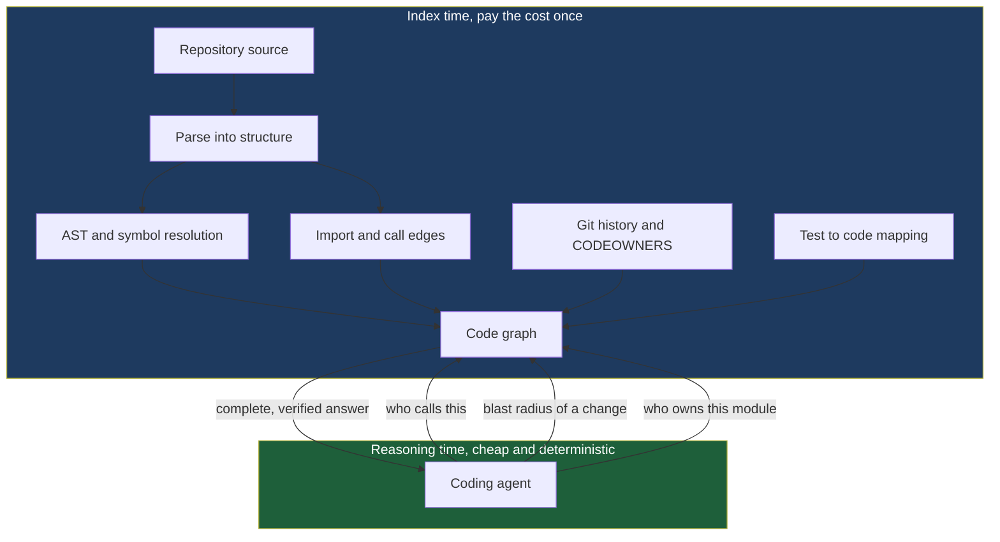
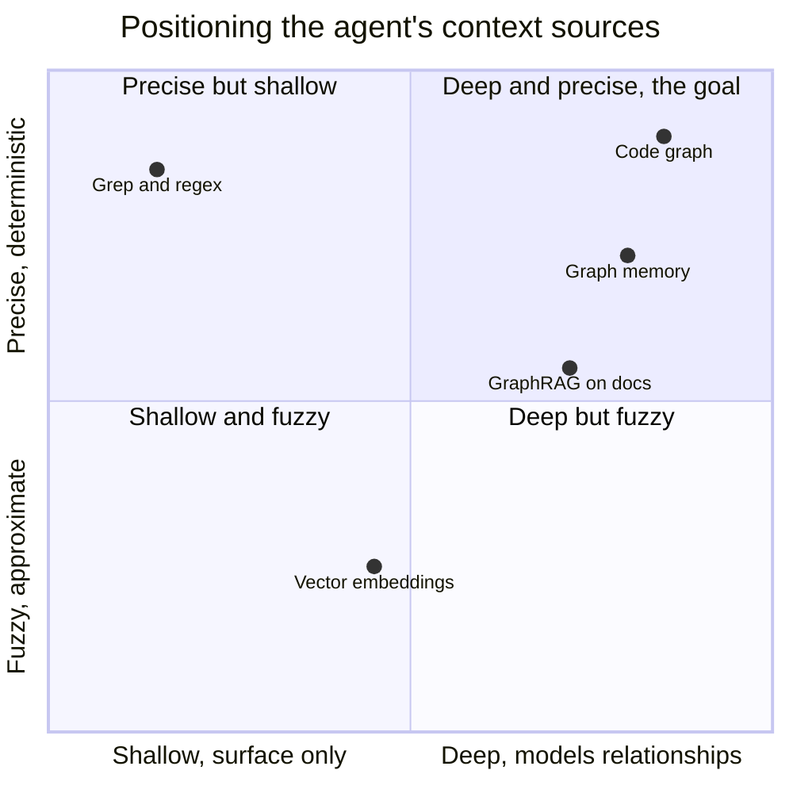
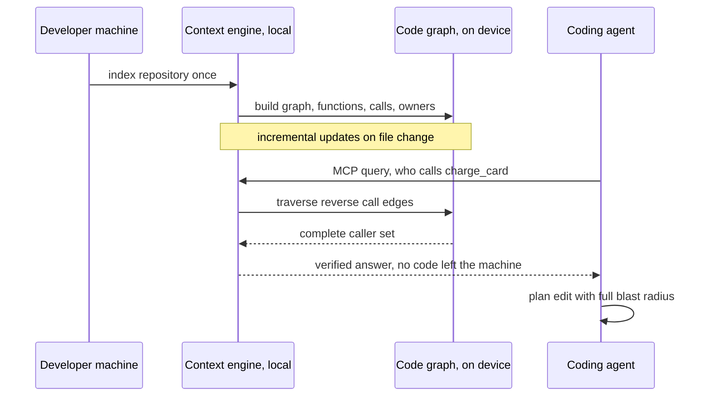

# The Graph Layer for Agents: Why Grep and Embeddings Stopped Being Enough

The agent was confident, and it was wrong, and the two facts were connected.

The task looked routine: rename a configuration field, `retry_limit` to `max_retries`, across a mid-sized Python service. The agent grepped for `retry_limit`, found nine hits in four files, edited all nine, ran the unit tests in the module it had touched, watched them pass, and reported success. It was, by its own account, done.

What it never saw was the tenth reference. A sibling service read the same field out of a shared JSON schema, deserializing it by string key in a file that did not contain the token `retry_limit` in any form the grep matched, because the key was assembled at runtime from a prefix constant and a suffix. There was also an eleventh: a database migration that populated a column named after the old field, referenced through an ORM attribute the agent's lexical search had no way to connect to the config object. The tests passed because the tests, too, only covered the module the agent had edited. Three days later a downstream job failed in production reading a field that no longer existed, and the person debugging it spent an afternoon discovering that a "simple rename" had quietly split a system in two.

The agent did not make a reasoning error. Given what it could see, its plan was correct. The failure was epistemic: it edited the codebase it could observe, and the codebase it could observe was a flat sea of text plus a cloud of fuzzy semantic neighbors. It never saw the *call graph*. It never asked the one question a competent senior engineer asks reflexively before any rename, *what else touches this*, because the tools it had, grep and vector search, are structurally incapable of answering it.

This post opens a five-part series called **The Graph Layer for Agents**. The thesis of the whole series is that coding agents have outgrown their two original senses, lexical search and semantic similarity, and that the industry's answer, arriving in a rush across 2025 and 2026, is to give agents a third sense: a pre-computed, queryable **graph** of the codebase, its dependencies, its call structure, its ownership, and its history, served to the agent as a first-class context source. People are calling the thing that produces and serves this graph a **context engine**.

You do not need to be a graph-database expert to read this. You are, I am assuming, a senior-level developer who now has Claude Code or Cursor or Codex open all day and who has started to feel the specific texture of their failures, the confident wrong edit, the missed caller, the refactor that looked complete and was not. This series is about the judgment those tools quietly assume you still have, and the infrastructure the ecosystem is building so the tools can start to have some of it too.

Part one is the map. I will lay out why grep and embeddings hit a ceiling, what a context engine actually is, and the three families of tools that people constantly confuse, code graphs, GraphRAG, and graph memory. The later parts drill in: part two on how a repo becomes a graph (AST parsing versus LLM extraction), part three on querying that graph (blast radius, localization, PageRank on code), part four on graph memory (temporal graphs for agents), and part five on running the graph layer in production (MCP, local-first, build versus buy). Here, we draw the territory.

---

## What the Agent Actually Sees

Before diagnosing the ceiling, be precise about the two senses an agent has today, because most people are fuzzy about what each one can and cannot do, and the fuzziness is exactly where the confident-wrong-edit lives.

### Grep: Lexical, and O of Surface

The first sense is lexical search: grep, ripgrep, and the file-globbing tools every agent harness ships with. When Claude Code searches your repo, a large fraction of what it does is, underneath, some form of "find the literal string, or the regex, and show me the lines." This is fast, deterministic, and genuinely powerful. Regex is a real query language, and a good agent uses it well.

But grep answers exactly one kind of question: *where does this sequence of characters appear on the surface of the text?* That is its entire universe. It is, in a phrase worth keeping, **O of surface**, its power is bounded by what is literally written where you look. It cannot follow a reference. It cannot tell you that the function `charge_card` defined in `billing.py` is the same `charge_card` imported under an alias `bill` in `checkout.py` and called as `bill(order)`. To grep, `charge_card` and `bill` are two unrelated strings. It cannot see that a method is invoked through a variable, dispatched dynamically, wired up by a dependency-injection framework, or referenced in a string that gets `getattr`'d at runtime. Every one of those is invisible to lexical matching, and every one of those is where the missed caller hides.

Grep also cannot count, rank, or reason about *structure*. Ask it "which function in this repo is depended on by the most other functions," and there is no query you can write, because that fact is not on the surface of any single file. It is a property of the *relationships between* files, and relationships are precisely what a flat text search discards.

### Embeddings: Similarity, and Only Similarity

The second sense is semantic search over vector embeddings, the retrieval half of RAG. I wrote at length about the mechanics in [RAG: Retrieval-Augmented Generation](https://juanlara18.github.io/portfolio/#/blog/rag-retrieval-augmented-generation) and about the agent-specific version in [Agent Memory and Retrieval](https://juanlara18.github.io/portfolio/#/blog/agent-memory-and-retrieval-embeddings-to-rag), so I will be brief on how it works and pointed about what it cannot do.

An embedding turns a chunk of code or text into a point in a high-dimensional space such that things with *similar meaning* land near each other. This buys the agent something grep cannot: the ability to find code that is *about* the thing you asked, even when it shares no tokens with your query. Ask "where do we handle failed payments," and semantic search can surface a function called `on_transaction_declined` that grep would never have connected to the words "failed payments." That is a real and important capability. It is why every serious agent harness now indexes your repo into vectors.

But embeddings answer exactly one kind of question too: *what is semantically similar to this?* That is *their* entire universe. And similarity is a treacherous proxy for the questions agents actually need answered. Two functions can be semantically near-identical, `validate_email_v1` and `validate_email_v2`, and one of them is dead code that nothing calls, a distinction that lives in the call graph, not in the vectors, so cosine similarity cannot tell them apart. Two functions can be semantically *distant*, a low-level byte-buffer allocator and a high-level user-facing upload endpoint, and yet one directly depends on the other through three hops of calls, a dependency that is load-bearing and completely invisible to similarity, because similarity is not what connects them.

Here is the compression worth remembering: **grep tells you where a string is; embeddings tell you what a chunk resembles. Neither tells you how anything is connected.** And "how things are connected" is the substance of almost every non-trivial question you ask about a codebase.

---

## The Questions Neither Can Answer

Let me make the ceiling concrete by listing the questions a senior engineer asks constantly, and that neither lexical nor semantic search can answer, not because the tools are immature, but because the questions are about a structure the tools do not model.

**Multi-hop reachability.** "If I change the return type of this function, what eventually breaks?" The answer is a transitive closure over the call graph: the direct callers, then *their* callers, then theirs, until you reach the surface of the system. Grep gives you the direct textual references, if you are lucky and nothing is aliased. Embeddings give you semantically similar code, which is not the same set at all. Neither can walk the chain, because neither has a chain to walk.

**Blast radius.** The rename story from the opening is a blast-radius failure. "What is the complete set of things affected if I touch this symbol" is *the* question you want answered before any edit, and it is a graph query, specifically the set of nodes reachable from a given node along dependency edges. This question is so central that part three of this series is largely about computing it well.

**Ownership and boundaries.** "Whose code is this, and am I about to cross a team boundary?" In a large organization the answer determines whether your change is a two-line fix or a cross-team negotiation. It lives in the relationship between files, directories, CODEOWNERS entries, and commit history, none of which a similarity search represents.

**Reverse dependencies, the "who calls this" question.** Grep finds forward references passably. It is far worse at the reverse, "give me every caller of this function," because callers use aliases, wrappers, and indirection. Yet "who calls this" is the single most common question during any refactor, and getting it *complete* rather than *approximate* is the whole game.

**Deterministic grounding.** This is the subtle one, and it matters more as agents get more autonomous. When an agent acts on grep or embedding results, it is acting on an *approximation*, a best-effort text match or a similarity ranking with no guarantee of completeness. There is no way to say "these are provably all the callers." A graph built from the actual syntax of the code can offer exactly that: a deterministic, complete answer to a structural query, the same answer every time, that the agent can *trust* rather than *guess at*. The difference between "here are some probably-relevant results" and "here is the complete, verified set" is the difference between an assistant and a colleague.

Notice the shape of all five. They are relational. They are about edges, not nodes; about how things connect, not what things resemble or where strings sit. You cannot answer a question about edges with a tool that only sees nodes. That is the ceiling, stated plainly. It is not a tuning problem, a bigger-model problem, or a longer-context problem. It is a *representation* problem, and you fix a representation problem by changing the representation.

---

## Enter the Context Engine

The fix has a name that crystallized across the industry in 2025 and 2026: the **context engine**. Sourcegraph, whose entire business is code intelligence at scale, frames its platform as the "shared intelligence layer for both developers and AI agents," and the framing has spread because it names something real. A context engine is the component that turns your codebase from a bag of files into a **pre-analyzed, queryable model of how the code is connected**, and then serves that model to the agent on demand.

The word *pre-analyzed* is doing heavy lifting. The core move of a context engine is to pay the cost of understanding structure *once, at index time*, so the agent can ask cheap, fast, deterministic questions at *reasoning time*. Instead of the agent grepping and guessing on every turn, it queries a graph that already knows the answers. What does that graph contain? Concretely, a mature context engine pre-computes:

- **Dependency chains.** The directed graph of what imports what, what calls what, what inherits from what. This is the backbone.
- **Blast-radius maps.** For any symbol, the transitive set of things that would be affected by changing it, ready to return without walking the graph live.
- **Test-coverage relationships.** Which tests exercise which code paths, so the agent knows whether its edit is actually covered or whether the passing tests are irrelevant to what it changed, exactly the trap in the opening story.
- **Ownership boundaries.** Which team, module, or service owns a region of code, derived from directory structure, CODEOWNERS, and commit history.



The economic logic here is the same one that makes any index worthwhile, and it is worth stating because it explains *why now*. Grep is O of surface at query time, cheap per call but shallow, and it re-does its work on every single call. Walking a dependency chain live, by repeatedly grepping and parsing, is prohibitively expensive to do on every agent turn, and agents take many turns. A context engine amortizes: it does the expensive structural analysis once when the code changes, stores the result as a graph, and then every query is a fast graph lookup. The agent gets deep answers at shallow cost, which is exactly the trade you want when the consumer is a model that will ask hundreds of questions per task and is billed by the token for every one.

There is a second, quieter reason the context engine matters, and it is about the finiteness of context windows. An agent's context window is a scarce, expensive resource, and dumping raw files into it is wasteful. If the agent can ask a graph a precise structural question and get back *just* the seven functions in the actual blast radius, rather than grepping and stuffing forty semantically-adjacent files into the prompt hoping the right one is in there, it spends its limited attention on signal instead of noise. The context engine is, among other things, a way to keep the context window dense. Sourcegraph's own measurements on adding a graph-backed MCP server to coding agents showed large jumps in retrieval precision and dramatic drops in the number of tool calls and wall-clock time needed to complete refactors, precisely because the agent stopped flailing through files and started asking the graph.

---

## The Three Families: A Map

Here is where most conversations about "graphs for AI" go sideways. People hear "graph" and "AI" and "agent" and collapse three genuinely different technologies into one blurry concept. They are not the same, they solve different problems, and confusing them leads to reaching for the wrong tool. Let me separate them cleanly, because getting this taxonomy right is the single most useful thing this post can give you.

### Family One: Code Graphs (repo becomes graph)

A **code graph** models the structure of *source code itself*. Nodes are code entities, functions, classes, modules, variables. Edges are code relationships, calls, imports, inheritance, references. The input is a repository; the output is a graph you can traverse to answer the structural questions from the last section. This is the family that fixes the opening rename disaster.

This is the corner of the map that exploded most visibly in late 2025 and 2026. A cluster of tools appeared, all with the same shape, index a repo into a graph, serve it to a coding agent, usually over MCP. [CodeGraphContext](https://github.com/CodeGraphContext/CodeGraphContext) is representative: an MCP server plus CLI that indexes local code into a graph database, supports a couple dozen languages, watches files to keep the graph live, and lets the agent query relationships instead of grepping for them. [Potpie](https://github.com/potpie-ai/potpie) takes a broader swing, turning "codebase and software development lifecycle into a living context graph," folding in structure, source history, and team knowledge. Others in the same family, CodeGraph and GitNexus among them, grew rapidly enough over 2025 and 2026 to become some of the most-starred projects in the category, though I would treat any specific star count you read as a moving target rather than a fact. Part two of this series dissects *how* these tools build the graph, and the central fork in the road, deterministic AST parsing versus LLM-based extraction. Part three covers *querying* it.

### Family Two: GraphRAG (documents become graph)

**GraphRAG** models the structure of *knowledge in documents*, not code. Microsoft introduced the approach and open-sourced its implementation in July 2024, and it has become the reference point for the whole family. The move is: run an LLM over a document corpus to *extract entities and the relationships between them*, assemble those into a knowledge graph, cluster the graph into communities, summarize each community, and then answer questions by traversing the graph rather than by pure vector similarity.

The problem GraphRAG solves is the multi-hop question whose answer is split across documents that share no vocabulary, "which compliance officer approved the vendor that processes our EMEA payroll," where the vendor-to-payroll fact lives in one document and the vendor-to-officer fact in another, and plain vector search can never connect them because they are not similar, they are *related*. I covered GraphRAG's mechanics in the [Agent Memory and Retrieval](https://juanlara18.github.io/portfolio/#/blog/agent-memory-and-retrieval-embeddings-to-rag) post; the thing to hold here is that GraphRAG operates on *prose*, its entities are people, vendors, concepts, and its purpose is question-answering over a document corpus. It is not about your call graph. A team building a coding agent and a team building a policy-document Q and A bot might both say "we use a graph," and they would be talking about entirely different systems.

### Family Three: Graph Memory (agent experience becomes graph)

**Graph memory** models the structure of an *agent's accumulated experience over time*. This is the newest and, in some ways, the most conceptually interesting family. The problem it solves is that an agent's memory is not static, it is a stream of interactions, facts learned, preferences stated, decisions made, and crucially, facts that were true then and are not true now. A user said they lived in Berlin in January; in June they moved to Madrid. A flat vector store of memories has no way to represent that the Berlin fact was valid in a *window* that has now closed.

The graph-memory family, [Graphiti](https://github.com/getzep/graphiti), Zep, Cognee, Mem0, and others, builds a **temporal knowledge graph** where edges carry validity intervals, so the graph knows not just *what* is true but *when* it was true, and can answer "where did the user live in February" differently from "where does the user live now." The Zep paper (Rasmussen et al., 2025) reports substantial gains over prior memory systems on long-horizon, temporally-sensitive benchmarks precisely because time is a first-class dimension of the graph rather than an afterthought. Part four of this series is dedicated to this family: temporal graphs, bi-temporal edges, and why "when was this true" turns out to be the hard part of agent memory.

### The Comparison, and the Positioning

Here is the map as a table, and then as a picture.

| Dimension | Code graphs | GraphRAG | Graph memory |
|---|---|---|---|
| Input | A source repository | A document corpus | An agent's interaction stream |
| Nodes | Functions, classes, modules | Entities, people, concepts | Facts, episodes, entities over time |
| Edges | Calls, imports, inheritance | Extracted relationships | Relationships with time validity |
| Primary question | What is connected to this code | What relates these facts across docs | What was true, and when |
| How built | Mostly AST parsing, deterministic | LLM extraction over prose | LLM extraction over interactions |
| Representative tools | CodeGraphContext, Potpie, Sourcegraph | Microsoft GraphRAG | Graphiti, Zep, Cognee, Mem0 |
| Series part | Parts 2 and 3 | Referenced throughout | Part 4 |

The positioning against the *old* tools is what makes the case for graphs at all. Grep is high-precision and shallow, it gives you exactly the string you asked for and nothing about structure. Embeddings are broad and fuzzy, they give you the neighborhood of meaning but no relationships and no guarantees. Code graphs sit where you actually want to be for structural questions: deep in relationships *and* precise, because a graph query returns the complete, deterministic answer. Graph memory occupies the analogous corner for the *temporal* dimension of an agent's own history.



Read the quadrant carefully, because it encodes the whole argument. Grep lives top-left, precise but shallow, it tells you the truth about a very small question. Embeddings live bottom, deep-ish in coverage but fuzzy, they gesture at meaning without certainty. The graph families climb toward the top-right, the corner where an agent can ask a hard relational question and get a *trustworthy* answer. That top-right corner is what the context engine is reaching for, and it is the corner grep and embeddings can never reach, no matter how much you tune them, because their positions are set by what they fundamentally model.

---

## Why Now: The Cambrian Explosion and the Winning Pattern

Graphs of code are not a new idea. Language servers, IDEs, and static analyzers have built call graphs and symbol tables for decades; that is how "go to definition" works in your editor. So why did an entire tool category erupt in 2025 and 2026, rather than in 2015?

Three forces converged, and naming them explains the timing.

**First, the consumer changed.** A human developer with a call graph gets a nice "find references" button. An *agent* with a call graph gets something categorically more valuable, because the agent is autonomous, tireless, and dangerous in proportion to how blind it is. A human refactoring a symbol will pause, feel uncertain, and go check the callers manually. An agent will confidently edit and move on, which is exactly how the opening disaster happens. The value of structured context scales with the autonomy of the thing consuming it, and agents pushed that autonomy past the threshold where "approximately right" stopped being good enough. The demand for deterministic grounding is a demand created by agents.

**Second, context windows are finite and expensive.** Even as windows grew to hundreds of thousands of tokens, the economics did not change: you are billed per input token on every call, an agent makes many calls per task, and attention degrades over long contexts anyway, the lost-in-the-middle effect. Stuffing whole directories into the prompt is both costly and counterproductive. A graph lets the agent retrieve the *precise* structural slice it needs, keeping the window dense and the bill bounded. The finiteness of context is what makes pre-computed, queryable structure economically necessary rather than merely nice.

**Third, MCP standardized the plumbing.** Before the [Model Context Protocol](https://juanlara18.github.io/portfolio/#/blog/model-context-protocol), every tool that wanted to feed context to an agent had to integrate with each agent harness separately, an N-times-M mess. MCP, which became the dominant standard for connecting agents to external tools and data across 2025 and 2026, collapsed that to N-plus-M: a context engine implements an MCP server once, and *every* MCP-compatible agent, Claude Code, Cursor, Codex, and the rest, can query it. That standardization is the substrate the whole explosion grew on. It is not a coincidence that nearly every tool in the code-graph family ships as an MCP server; MCP is what made "build a graph and serve it to any agent" a weekend project instead of a quarter-long integration effort.

Out of the explosion, a **winning pattern** has emerged with striking consistency, and it is worth stating because it is the shape part five of this series examines in depth. The pattern is: **local-first, pre-computed on-device, served over MCP, with no code egress.** Break it down:

- **Local-first / on-device.** The graph is built and stored on the developer's machine or inside the organization's own infrastructure. This is partly performance, a local graph query is milliseconds, and largely trust.
- **No code egress.** For most companies, shipping their entire source tree to a third-party SaaS to be indexed is a non-starter for security and IP reasons. A tool that builds the graph locally and never sends code off the machine sidesteps the entire procurement and legal fight. This single property explains a lot of why the local-first tools spread faster than cloud ones.
- **Pre-computed.** The graph is built at index time and incrementally updated as files change, so query-time is cheap, per the amortization argument above.
- **Served over MCP.** The transport is the standard, so the graph is agent-agnostic.



That sequence is the winning pattern in one picture: the expensive work happens once and locally, the agent asks precise questions over a standard transport, and nothing sensitive leaves the developer's control. Part five gets into the harder production questions this raises, incremental re-indexing at scale, the build-versus-buy decision, and where a hosted platform like Sourcegraph earns its keep over a local tool despite the egress cost.

---

## A Worked Mental Model: A Tiny Call Graph in Python

Abstractions are easier to trust once you have built the smallest possible version yourself. So let us build a real, if tiny, context engine, one that parses Python source into a call graph and answers a blast-radius query, using nothing but the standard library's `ast` module. This is the deterministic, AST-based approach in miniature, the thing part two expands into a full treatment.

The idea is direct. Python's `ast` module parses source into an abstract syntax tree, the same structured representation the interpreter uses. We walk that tree to find two things: every function *definition* (these become nodes) and every function *call* (these become edges, from the enclosing function to the callee). Once we have the graph, "blast radius" is just a reverse traversal, start at the changed function and walk *backwards* along call edges to find everything that transitively depends on it.

```python
import ast
from collections import defaultdict, deque
from dataclasses import dataclass, field


@dataclass
class CallGraph:
    """A minimal code graph: functions are nodes, calls are directed edges."""

    # forward[f] = set of functions that f calls
    forward: dict[str, set[str]] = field(default_factory=lambda: defaultdict(set))
    # reverse[f] = set of functions that call f  (the callers)
    reverse: dict[str, set[str]] = field(default_factory=lambda: defaultdict(set))
    defined: set[str] = field(default_factory=set)

    def add_edge(self, caller: str, callee: str) -> None:
        self.forward[caller].add(callee)
        self.reverse[callee].add(caller)


class _CallCollector(ast.NodeVisitor):
    """Walks one module's AST, recording function defs and the calls inside them.

    We track the *enclosing* function as we descend, so each call we see can be
    attributed to the function it lives in. This is what turns a flat list of
    calls into directed edges."""

    def __init__(self, graph: CallGraph):
        self.graph = graph
        self._scope: list[str] = []  # stack of enclosing function names

    def visit_FunctionDef(self, node: ast.FunctionDef) -> None:
        self.graph.defined.add(node.name)
        self._scope.append(node.name)
        self.generic_visit(node)  # descend into the body
        self._scope.pop()

    # async defs are functions too; treat them identically.
    visit_AsyncFunctionDef = visit_FunctionDef

    def visit_Call(self, node: ast.Call) -> None:
        callee = self._callee_name(node.func)
        if callee and self._scope:
            # Attribute the call to the innermost enclosing function.
            self.graph.add_edge(self._scope[-1], callee)
        self.generic_visit(node)

    @staticmethod
    def _callee_name(func: ast.expr) -> str | None:
        # Plain call: foo()
        if isinstance(func, ast.Name):
            return func.id
        # Method or attribute call: obj.foo() -> we record "foo"
        if isinstance(func, ast.Attribute):
            return func.attr
        return None


def build_call_graph(sources: dict[str, str]) -> CallGraph:
    """Parse every source file and merge into one call graph.

    `sources` maps a filename to its source text. In a real context engine this
    is the whole repo, re-parsed incrementally as files change."""
    graph = CallGraph()
    for filename, code in sources.items():
        try:
            tree = ast.parse(code, filename=filename)
        except SyntaxError:
            # A real engine logs and skips unparseable files rather than dying.
            continue
        _CallCollector(graph).visit(tree)
    return graph


def blast_radius(graph: CallGraph, target: str) -> set[str]:
    """Every function that transitively depends on `target`.

    This is a reverse breadth-first search over call edges: who calls target,
    who calls them, and so on to the surface of the system. This single query
    is the one the opening rename disaster needed and grep could not give."""
    affected: set[str] = set()
    queue: deque[str] = deque([target])
    while queue:
        current = queue.popleft()
        for caller in graph.reverse.get(current, ()):
            if caller not in affected:
                affected.add(caller)
                queue.append(caller)  # keep walking up the chain
    return affected
```

Now exercise it on a small program with a dependency chain deliberately built so that the impact of a change is *not* obvious from any single file.

```python
sources = {
    "billing.py": """
def charge_card(order):
    return _call_gateway(order)

def _call_gateway(order):
    return True
""",
    "checkout.py": """
from billing import charge_card

def complete_purchase(cart):
    return charge_card(cart)

def one_click_buy(item):
    return complete_purchase([item])
""",
    "api.py": """
from checkout import complete_purchase, one_click_buy

def checkout_endpoint(request):
    return complete_purchase(request.cart)

def express_endpoint(request):
    return one_click_buy(request.item)
""",
}

graph = build_call_graph(sources)

# "What breaks if I change charge_card?"
impact = blast_radius(graph, "charge_card")
print(sorted(impact))
# ['checkout_endpoint', 'complete_purchase', 'express_endpoint', 'one_click_buy']
```

Sit with that output. A change to `charge_card` reaches *four* other functions, including two HTTP endpoints in a file, `api.py`, that never mentions `charge_card` at all. Grepping for `charge_card` would have found the definition and its one direct caller and stopped, missing `one_click_buy`, `checkout_endpoint`, and `express_endpoint` entirely, the exact class of miss that took down the service in the opening story. The graph found them because it walked the *relationships*, not the *text*.

I want to be honest about how much this toy leaves out, because the honesty is the point of part two. This tiny engine matches callees by bare name, so two different functions both named `save` would be conflated, real engines resolve symbols to their actual definitions using scope and import information. It cannot follow calls made through variables, higher-order functions, or dynamic dispatch, the same dynamic-reference blind spot that grep has, and closing it is genuinely hard. It ignores imports as edges, classes, inheritance, and cross-language calls. A production context engine handles all of this, which is why building one well is a real engineering effort and why an ecosystem of tools sprang up to do it for you rather than everyone rolling their own. But the *shape* is exactly right: parse to structure, record nodes and edges, answer relational questions by traversal. That shape is the whole idea, and now you have built it.

One more connection worth drawing, because it foreshadows part three. Once you have the graph, you are not limited to reachability queries. You can run graph algorithms on it. Ranking functions by how many others depend on them, to find the load-bearing core of a codebase, is essentially [PageRank](https://juanlara18.github.io/portfolio/#/blog/pagerank-eigenvectors) applied to the call graph, the same eigenvector-centrality idea that ranks web pages, pointed at code. The mathematics of why that works, and why a graph is the natural object for these questions, is the subject of [Graph Theory: The Mathematics of Connections](https://juanlara18.github.io/portfolio/#/blog/graph-theory-mathematics-of-connections). A code graph is not a metaphor. It is a graph, and the whole toolbox of graph theory becomes available the moment you build it.

---

## When You Do Not Need This

A series arguing for a new layer of infrastructure has an obligation to say when the layer is overkill, because senior judgment is as much about what you *skip* as what you adopt. The context engine is not free, it costs indexing time, storage, incremental-update machinery, and a dependency on another moving part, and there are real cases where grep and embeddings are simply the right tools.

**Small repositories.** If your whole codebase fits comfortably in the agent's context window, a few thousand lines, the agent can just read all of it. When the entire structure is visible at once, there is nothing for a graph to pre-compute that the model cannot infer on the spot. The context engine earns its keep on codebases too large to hold in the head, or the window, at once. Below that threshold, it is machinery in search of a problem.

**Greenfield and short-lived code.** A brand-new project, a prototype, a throwaway script, the graph you build today is stale tomorrow because the code is churning too fast to have stable structure worth indexing. Blast radius is a meaningful question only when there is an established web of dependencies to have a radius *through*. Early on, there is not.

**Genuinely local edits.** If the change is self-contained, fixing a typo in a log message, adjusting a constant, editing a comment, there is no blast radius to compute because nothing structural is changing. Reaching for a graph query here is like consulting a map to walk across your own living room. Grep finds the line, you fix it, done.

**When the honest answer is "it depends on how it is called."** Sometimes the dynamic blind spot is the whole problem, the code is so reflection-heavy, so plugin-driven, so runtime-assembled, that even a good static graph cannot capture the real call structure. In those cases the graph gives false confidence, and the senior move is to know that runtime tracing or actual tests, not static analysis, are what will tell you the truth.

The through-line of this whole series, and of the [companion series on senior judgment in the age of AI coding](https://juanlara18.github.io/portfolio/#/blog/senior-infrastructure-distributed-systems-failure-networking), is that the tools are getting extraordinary and the judgment about *when and how* to use them is what stays scarce. A context engine is a powerful lever. Knowing that your five-file project does not need one, and that your two-million-line monorepo cannot function safely without one, is exactly the kind of judgment the tools still assume you bring. If you want the fuller picture of how these agents work and where their edges are, the [complete guide to Claude Code](https://juanlara18.github.io/portfolio/#/blog/claude-code-complete-guide) is the ground-level companion to this bird's-eye map.

---

## Where the Series Goes From Here

Step back and hold the map. Coding agents began with two senses, lexical search that is precise but shallow, and semantic search that is broad but fuzzy, and neither can answer the relational questions, blast radius, reverse dependencies, ownership, deterministic grounding, that dominate real engineering work. The industry's answer, arriving in a rush across 2025 and 2026 on the back of finite context windows, autonomous agents, and the MCP standard, is the context engine: a pre-computed, queryable graph of the codebase, served to the agent, usually local-first with no code egress. And the word "graph" hides three distinct families, code graphs for source structure, GraphRAG for document knowledge, and graph memory for an agent's temporal experience, that solve different problems and must not be confused.

That is the territory. The rest of the series walks it. Part two opens the hood on how a repo becomes a graph, and the consequential choice between deterministic AST parsing, fast, precise, and blind to dynamism, and LLM-based extraction, flexible, semantic, and non-deterministic. Part three is about *querying* the graph well, computing blast radius efficiently, localizing bugs, and running PageRank-style centrality to find the code that matters most. Part four turns to graph memory, temporal graphs, bi-temporal edges, and why "when was this true" is the hard part of remembering. And part five confronts production: incremental indexing at scale, the local-first-over-MCP pattern in the wild, and the build-versus-buy decision every team now faces. The rename that split a service in two, from the opening, was not a model failure. It was a missing sense. The graph layer is how agents grow it.

---

## Going Deeper

**Books:**
- Robinson, I., Webber, J., & Eifrem, E. (2015). *Graph Databases* (2nd ed.). O'Reilly.
  - The practical grounding for how graphs are stored and queried at scale, the substrate every code-graph and graph-memory tool sits on. Free to read from Neo4j.
- Newman, M. (2018). *Networks* (2nd ed.). Oxford University Press.
  - The rigorous treatment of graph structure and centrality, PageRank included, that explains *why* a code graph is the right object for the questions in this post.
- Nygard, M. (2018). *Release It! Design and Deploy Production-Ready Software* (2nd ed.). Pragmatic Bookshelf.
  - Not about graphs, but the definitive treatment of blast radius and failure propagation, the same concept this series applies to code dependencies rather than infrastructure.
- Kleppmann, M. (2017). *Designing Data-Intensive Applications.* O'Reilly.
  - The chapters on graph-like data models and on indexing, the amortize-at-write-time logic that makes a context engine economically sane.

**Online Resources:**
- [Context Engineering: A Practical Guide for AI Agents](https://sourcegraph.com/blog/context-engineering) by Sourcegraph — the clearest industry statement of the context-engine idea and why code structure beats pure retrieval for agents.
- [Microsoft GraphRAG on GitHub](https://github.com/microsoft/graphrag) — the reference open-source implementation of the documents-to-graph family, open-sourced July 2024.
- [CodeGraphContext](https://github.com/CodeGraphContext/CodeGraphContext) — a representative local-first, MCP-served code-graph tool you can run against your own repo today.
- [Graphiti](https://github.com/getzep/graphiti) — the open-source temporal knowledge graph engine behind the graph-memory family, worth reading before part four.

**Videos:**
- [Microsoft GraphRAG: Graphing Text and Chatting with it for free](https://www.youtube.com/watch?v=K8upgeKUrQo) — a hands-on walk through the documents-to-graph pipeline, useful for seeing GraphRAG concretely.
- [Agentic RAG with Knowledge Graphs Explained, AI Agents Conference 2025](https://www.youtube.com/watch?v=Z9d_lznEoQY) by Neo4j — how graph traversal and retrieval combine for agents, the bridge between the GraphRAG and code-graph families.

**Academic Papers:**
- Edge, D. et al. (2024). ["From Local to Global: A Graph RAG Approach to Query-Focused Summarization."](https://arxiv.org/abs/2404.16130) *arXiv:2404.16130.*
  - The Microsoft GraphRAG paper. Read it for the extract-then-cluster-then-summarize pipeline that defines the documents-to-graph family.
- Rasmussen, P. et al. (2025). ["Zep: A Temporal Knowledge Graph Architecture for Agent Memory."](https://arxiv.org/abs/2501.13956) *arXiv:2501.13956.*
  - The graph-memory paper this series builds part four on, with the temporal-edge design and the benchmark case for time as a first-class dimension.

**Questions to Explore:**
- If a code graph can give an agent deterministic, complete answers about structure, how much of what we currently call "model capability" in coding agents is actually a deficit of context that better tooling, not bigger models, will close?
- The winning pattern is local-first with no code egress. What happens to that pattern as codebases span dozens of repositories and languages, where no single local machine can hold the whole graph, and does the egress fight reopen?
- AST parsing is precise but blind to dynamic dispatch; LLM extraction is flexible but non-deterministic. Is there a stable equilibrium between them, or will every context engine forever be a negotiated trade between the two?
- Grep, embeddings, and graphs are three different representations of the same codebase. Are there a fourth and fifth representation we have not built yet, and what questions would they answer that none of these three can?
- If an agent's judgment is bounded by what its context sources can represent, then whoever designs the context engine is quietly designing the agent's worldview. Who should own that decision, the tool vendor, the platform, or the team whose code it models?
