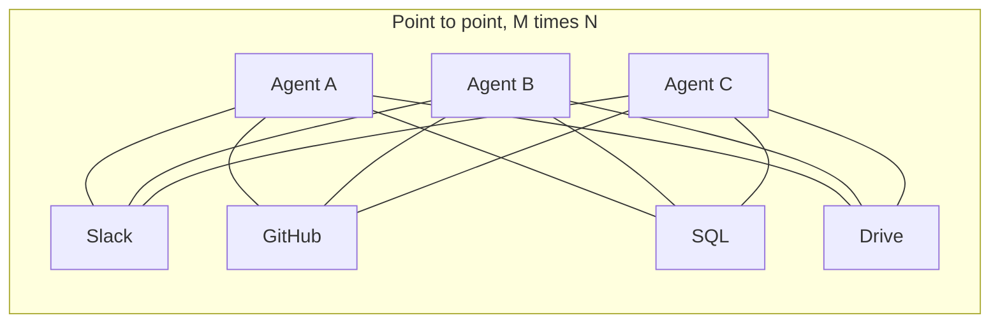
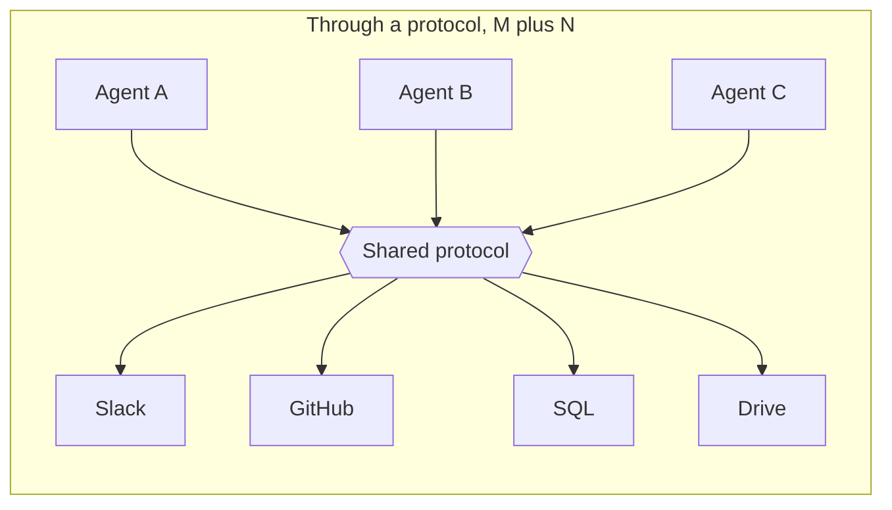
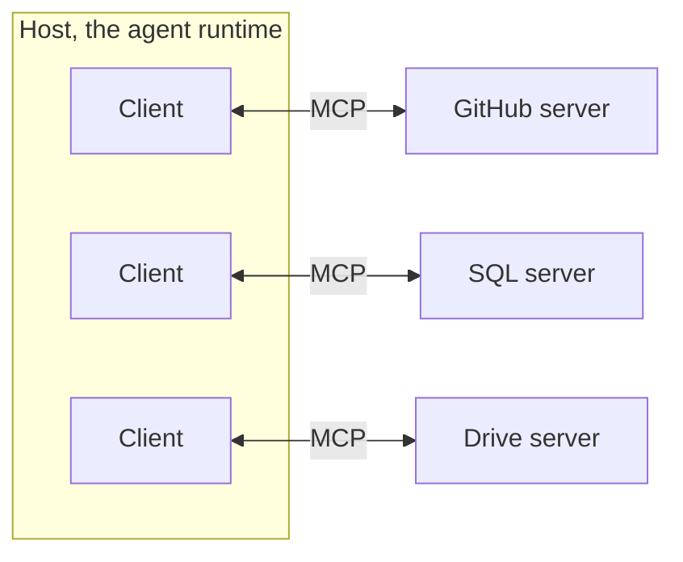
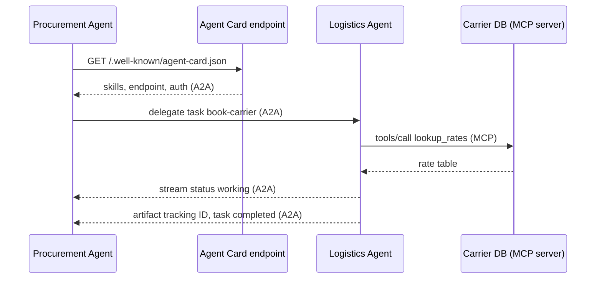

# Integration Protocols: How Agents Talk to the World and to Each Other

## The Integration Tax

Picture two agents that should obviously be able to work together.

One is a procurement agent built by your finance vendor. It knows your purchase orders, your approved suppliers, your budget thresholds. The other is a logistics agent from a different vendor entirely. It knows shipping windows, carrier rates, customs paperwork. A human procurement officer and a human logistics coordinator would solve a late shipment with a two-minute conversation. The two agents, sitting in the same company, on the same cloud, cannot exchange a single message.

Not because the problem is hard. Because they have no shared way to talk. The procurement agent speaks one vendor's function-calling dialect. The logistics agent speaks another's. Neither knows the other exists, what it can do, or how to ask it for help. So an engineer is dispatched to build a bridge: a custom adapter that translates one agent's requests into the other's API, handles the auth, normalizes the schemas, and breaks the first time either vendor ships an update.

That bridge is the **integration tax**. You pay it every time two systems that were not designed to talk to each other are forced to. And in agentic engineering, you pay it constantly, because an agent's entire job is to reach beyond itself: into your databases, your SaaS tools, your file stores, and increasingly, into other agents.

This is the fourth post in a six-part series on building agentic systems end to end. The earlier posts treated a single agent as the unit of work: how it reasons, plans, and calls tools. This one zooms out to the layer between agents and the world. It is the shortest post in the series, and deliberately so, because the lesson is simple even though its consequences are enormous: **the way agents connect is an infrastructure problem, and infrastructure problems are solved by protocols, not by cleverness.**

We will not build an MCP server here. That ground is covered in depth elsewhere, and I will point you there repeatedly. This post is about the why: why standard protocols exist, what specifically they collapse, and why the obvious alternatives quietly fail.

## The M×N Problem

Start with the shape of the cost, because the shape is what justifies a protocol.

Suppose you have a set of agents — call it M of them — and a set of capabilities each agent needs to reach: data sources, tools, services. Call those N. Slack, GitHub, a SQL warehouse, Google Drive, Jira, a payments API. A coding agent, a support agent, an analytics agent, an ops agent.

If every connection is bespoke — one custom integration per agent-capability pair — then the number of integrations you must build and maintain is M times N. Five agents and six tools is thirty connectors. Each connector has its own authentication flow, its own data format, its own error handling, its own brittle assumptions about how the other side behaves. Add one tool and you owe M new connectors, one per agent. Add one agent and you owe N. The cost does not grow with your ambition; it grows with the *product* of your ambitions.

This is not a new problem. It is the oldest problem in systems integration, and we have watched it get solved before.

Hardware lived it for decades. Every peripheral had its own port and its own driver: parallel ports for printers, PS/2 for keyboards, SCSI for drives, serial for modems. Adding a device meant adding an interface. Then USB defined one protocol any device could implement, and the cost of a new peripheral collapsed from *design a new interface* to *implement a known one*. The port stopped being the problem.

The web lived it too. Before HTTP and REST, every networked service exposed its own remote-procedure dialect. After them, any client could talk to any service that spoke the same verbs over the same transport. SQL did it for databases: one query language across wildly different storage engines.

The pattern is always the same. You insert a standard in the middle. Instead of M times N point-to-point links, you get M plus N connections to a shared protocol. Every agent learns the protocol once. Every tool exposes itself through the protocol once. The explosion collapses into a hub.





Count the lines. The first diagram has twelve edges for three agents and four tools, and it gets denser combinatorially. The second has seven, and it grows linearly. That difference — quadratic versus linear — is the entire economic argument for a protocol. Everything else is detail.

The detail, though, is where the engineering lives. A protocol is only useful if it standardizes the *right* things: how a tool advertises what it can do, how an agent invokes it, how results and errors come back, how trust is scoped. Get that wrong and you have a standard nobody adopts. Two standards have gotten it right enough to win the market, and they sit at two different layers. The rest of this post is about both.

One more property of the hub deserves a moment, because it is the part teams underestimate. The protocol does not merely reduce the *number* of connections — it changes who owns the cost of change. In the point-to-point world, every integration is a private agreement between two parties, and when either side changes, someone has to renegotiate it by hand. In the hub world, the contract is public and singular. When a tool evolves, it evolves its protocol-conformant interface once, and every consumer either keeps working or fails in a uniform, detectable way. The maintenance burden does not just shrink; it relocates from N×M brittle pairwise relationships to one well-specified surface. That relocation is what makes large agent ecosystems possible at all. You are not maintaining integrations anymore. You are conforming to a standard, which is a fundamentally cheaper activity.

## MCP: The Standard for Agent-to-Tool

The first layer is the connection between an agent and everything that is *not* an agent: tools, data, context. This is what the **Model Context Protocol (MCP)** standardizes.

MCP is an open standard, introduced by Anthropic in late 2024 and open-sourced, that gives any AI application a uniform way to discover and use external capabilities. As of 2026 it has become the default. The official registry holds on the order of ten thousand published servers; SDK downloads crossed roughly 97 million per month; and in December 2025 Anthropic donated the protocol to a vendor-neutral Agentic AI Foundation under the Linux Foundation, with OpenAI, Microsoft, Google, AWS, and others participating in governance. When a protocol's stewardship sits next to Kubernetes and Node.js rather than inside one company's product roadmap, integrating with it stops being a bet on a vendor and becomes a bet on an industry.

The cleanest way to understand MCP is the USB analogy, and it is not loose. USB defined a physical connector and a protocol so that any compliant device could plug into any compliant host. MCP defines a software protocol so that any compliant capability can plug into any compliant agent. Each data source or tool exposes an **MCP Server**. Any **MCP Client** — Claude Desktop, an IDE assistant, your own agent framework — connects to it with the same protocol. No custom code per source. Write the GitHub server once, and every MCP-speaking agent on earth can use it. Write your agent's client once, and it can reach every MCP server ever published.

### The roles, conceptually

MCP names three roles, and the only thing you need to hold onto here is who plays which part.

The **Host** is the application the user actually interacts with — the agent runtime, the desktop app, the IDE. It owns the conversation, coordinates many connections at once, and enforces security policy. It is the orchestrator and the trust boundary.

A **Client** lives inside the host and maintains a dedicated, one-to-one connection to a single server. The host can run many clients simultaneously, each isolated from the others.

A **Server** is a lightweight service that exposes a focused set of capabilities — a GitHub repo, a Postgres database, a file system, a model registry — through the protocol.



That is as deep as I will go on architecture, because the mechanics — the JSON-RPC wire format, the five primitives (tools, resources, prompts, roots, sampling), the local versus remote transports, the OAuth flows — are covered thoroughly in two companion posts. If you want to *build* one of these servers, go there:

- The conceptual and hands-on introduction to MCP, including the five primitives and a complete FastMCP server, is in [The Model Context Protocol: How AI Learned to Use Tools](https://juanlara18.github.io/portfolio/#/blog/model-context-protocol).
- The production concerns — OAuth 2.1, per-tool scopes, audit logging, multi-tenant isolation, gateways — are in [Building Enterprise MCP Servers: From Prototype to Production](https://juanlara18.github.io/portfolio/#/blog/mcp-production-enterprise).
- A concrete end-to-end build, turning natural language into Power BI dashboards through an MCP server, is in [Building an MCP Server: Natural Language to Power BI Dashboards](https://juanlara18.github.io/portfolio/#/blog/mcp-server-nl-to-powerbi-dashboard).

For this post, the architecture is just enough scaffolding to answer the real question: why a protocol, and not one of the things people reach for instead.

## Why a Protocol Beats the Alternatives

When teams first hit the M×N wall, they rarely reach for a protocol. They reach for something that feels simpler and turns out not to be. Four alternatives come up again and again. Each solves a piece of the problem and leaves the hard part untouched.

**The monolithic super-agent.** Why coordinate many agents when you can build one agent that does everything? Give it every tool, every integration, every domain. The trouble is that a super-agent couples unrelated concerns into one codebase and one context window. The procurement logic and the logistics logic and the analytics logic all share one prompt, one set of tools, one failure surface. Change anything and you risk everything. The context window fills with tools the agent does not need for the task at hand, degrading its tool selection. And you have not actually solved integration — you have just moved all M times N connectors inside one unmaintainable process. Monoliths lose to services for the same reasons in agents as in software generally: independent deployment, independent failure, independent reasoning.

**Force everyone onto one foundational model.** If every agent ran on the same LLM, surely they would interoperate? No. The model is not the incompatibility. The incompatibility is in the APIs, schemas, and tools each system exposes. Two agents on identical models still face the same Slack API, the same Jira schema, the same auth quirks. Standardizing the brain does nothing for the plumbing. And it is strategically fragile: you have made your entire architecture hostage to one vendor's pricing, availability, and roadmap.

**A shared central vector database.** Put everything everyone might need into one big retrieval store and let every agent query it. This is genuinely useful — for *static knowledge*. It is how you share documents, history, embeddings. But it shares the wrong layer. A vector DB shares *what is known*; it does not share *what can be done*. It has no concept of an agent invoking another agent's capability, managing control flow, negotiating a task at runtime, or streaming partial results back. Retrieval is a read against a snapshot. Integration is a live, two-way, operational relationship. You cannot delegate a task to a vector database.

**Bespoke REST microservices.** The most defensible alternative, and the one experienced engineers gravitate to: wrap each capability in a clean REST service. This is good practice and worth doing — but it stops short of a *semantic* standard. REST standardizes the transport (HTTP verbs, status codes) and nothing above it. Every endpoint still has its own bespoke request schema, its own response shape, its own conventions for errors and pagination and auth. An agent connecting to ten REST services must learn ten schemas. There is no uniform way to *discover* what a service offers or how to call it. MCP sits on top of exactly this kind of infrastructure and adds the missing layer: a standard way to list capabilities, a standard way to describe each one's inputs in machine-readable schema, a standard envelope for results and errors. REST gets the bytes there. MCP makes the bytes self-describing to an LLM.

Here is the comparison in one view.

| Approach | What it shares | What it misses | Where it breaks |
|---|---|---|---|
| Monolithic super-agent | One codebase, one context | Separation of concerns; the M×N work is still there, just hidden inside | Coupling, context bloat, all-or-nothing failure |
| One foundational model | A common reasoning engine | The actual incompatibility is in APIs and schemas, not the model | Vendor lock-in; plumbing still bespoke |
| Shared central vector DB | Static knowledge and context | The operational layer: invocation, control flow, task negotiation | You cannot delegate a task to a snapshot |
| Bespoke REST microservices | The transport (HTTP) | A shared semantic standard; capability discovery | Every agent relearns every endpoint's schema |
| A protocol (MCP / A2A) | Transport plus self-describing capabilities and discovery | (this is the layer the others miss) | The remaining work is governance and security |

The pattern across the failures is consistent: each alternative standardizes a layer *below* the one that hurts. The model, the storage, the transport — all useful, none sufficient. The expensive part is the *semantic contract*: a uniform, machine-readable description of what a capability is, how to call it, and what comes back. That is precisely what a protocol provides and the alternatives do not.

It is worth being honest about why teams keep choosing the alternatives anyway, because the reasons are rational in the small and wrong in the large. Each alternative is *locally* simpler. Adding one more tool to a super-agent is one more import. Standing up one more REST endpoint is an afternoon. Pointing every agent at the vector DB you already run requires no new infrastructure. The protocol, by contrast, asks you to adopt a standard, run servers that speak it, and learn a model that feels like overhead until the third or fourth integration. The crossover is real: for an M and N of one or two, bespoke usually wins. The mistake is extrapolating that intuition past the crossover, where the quadratic term takes over and the afternoon-each connectors become a full-time job nobody signed up for. Protocols are an investment that pays off precisely when the system gets big enough to matter, which is also exactly when it is most painful to retrofit them. The discipline is to adopt the standard before you can prove you need it.

## Tools as a Contract

To see why the semantic contract is the load-bearing idea, look at what actually happens when an LLM uses a tool.

The model does not call functions. It emits text. What makes "tool use" work is a convention: the model is shown a set of tool *definitions* — each a name, a natural-language description, and a JSON Schema for its arguments — and in response it emits a structured object naming a tool and its arguments. Something outside the model — the host — parses that object, executes the real function, and feeds the result back. The LLM proposes; the host disposes. This is **function-calling-as-protocol**, and it is the grounding mechanism that lets a probabilistic text generator reliably operate deterministic systems.

The schema is the contract. It is what lets the model select the right capability and fill in valid arguments. A tool definition looks like this:

```json
{
  "name": "create_shipment",
  "description": "Create a shipment for an approved purchase order. Use only when the PO status is APPROVED. Returns a tracking ID. Does not modify the purchase order itself.",
  "inputSchema": {
    "type": "object",
    "properties": {
      "purchase_order_id": {
        "type": "string",
        "description": "The approved PO identifier, e.g. PO-2028-04417."
      },
      "carrier": {
        "type": "string",
        "enum": ["ground", "air", "freight"],
        "description": "Shipping method. Use 'freight' for orders over 500kg."
      }
    },
    "required": ["purchase_order_id", "carrier"]
  }
}
```

Two things make this a contract rather than mere documentation. First, the `description` fields are read by the *model*, not by a human — they are the operating manual the LLM consults to decide whether and how to call the tool. "Use only when the PO status is APPROVED" is a guardrail the model can actually honor. Vague descriptions produce hallucinated arguments and tools fired at the wrong moment. Second, the schema is machine-checkable: the host can validate the model's output against it before executing anything, rejecting malformed calls deterministically instead of hoping the model got the shape right.

Now connect this back to the M×N argument. Without a standard, every framework invents its own way to express this contract — its own definition format, its own result envelope, its own error convention. An agent built for one framework cannot read another's tool definitions. MCP standardizes the contract itself: `tools/list` returns definitions in one agreed shape, `tools/call` invokes them in one agreed shape, results and errors come back in one agreed envelope. That is why an MCP server written once works with every MCP client. The standardized schema is not a convenience feature. It is the thing that makes the protocol a protocol.

A subtle but important caveat: MCP standardizes the *interface*, not the *semantics*. Two servers can both expose a `search` tool with valid schemas and return wildly different data in wildly different shapes. The protocol guarantees you can discover and call any tool uniformly; it does not guarantee two tools that sound alike behave alike. Closing that gap — semantic standardization on top of protocol standardization — is one of the open frontiers, and we will return to it.

## Agent-to-Agent: The Second Layer

MCP solves the connection between an agent and its tools. It does not solve the connection between an agent and *another agent*. Those are different problems, and conflating them is a common mistake.

A tool is passive. It waits to be called, does one thing, returns a result. An agent is active. It reasons, plans, takes multiple steps, asks clarifying questions, runs long, and may itself orchestrate other tools and agents. When the procurement agent needs the logistics agent's help, it is not "calling a function." It is *delegating a task* to a peer that will work autonomously, possibly for a while, possibly coming back to ask for more information, possibly streaming progress as it goes. That interaction needs its own protocol.

That protocol is **A2A (Agent2Agent)**, an open standard Google announced in April 2025 and transferred to the Linux Foundation in mid-2025 for vendor-neutral governance. By 2026 it has passed 150 supporting organizations — Google, Microsoft, AWS, Salesforce, SAP, ServiceNow, Workday, IBM among them — with production enterprise deployments and a 0.3 spec adding gRPC support and signed agent cards. Like MCP, it rides on familiar plumbing: HTTP, JSON-RPC 2.0, and Server-Sent Events for streaming, with support for synchronous request/response, streaming, and asynchronous push notifications for long-running work.

### Capability discovery: the Agent Card

The first problem in agent-to-agent collaboration is the one our two agents had at the start of this post: they do not know the other exists or what it can do. A2A solves this with the **Agent Card** — a JSON document an agent publishes describing its identity, capabilities, skills, service endpoint, and authentication requirements. By convention it lives at a well-known path so other agents can find it automatically: `/.well-known/agent-card.json`.

An Agent Card is to an agent what an MCP tool definition is to a tool: a machine-readable advertisement of what is on offer and how to ask for it. A sketch:

```json
{
  "name": "Logistics Coordinator",
  "description": "Plans shipments, books carriers, and tracks deliveries.",
  "version": "0.3.0",
  "url": "https://logistics.example.com/a2a",
  "capabilities": {
    "streaming": true,
    "pushNotifications": true
  },
  "skills": [
    {
      "id": "book-carrier",
      "name": "Book a carrier",
      "description": "Selects and books a carrier for an approved shipment.",
      "tags": ["shipping", "logistics"]
    }
  ],
  "securitySchemes": {
    "oauth2": { "type": "oauth2" }
  }
}
```

The procurement agent fetches this card, reads the `skills`, sees that `book-carrier` exists, notes the endpoint and the auth scheme, and now knows exactly how to delegate. No engineer built a custom bridge. Discovery happened through a standard.

### Tasks, not function calls

Once two agents have found each other, A2A frames their interaction around **tasks**, not single calls. A task has a lifecycle: it is submitted, moves to working, and ends in completed, failed, canceled, or rejected — and along the way it may enter input-required (the worker needs more from the requester) or auth-required (it needs credentials before proceeding). Agents exchange **messages**, and the worker returns **artifacts** — text, files, structured JSON — as the deliverables of the task. Streaming over SSE lets the requester watch progress; push notifications let a long task report back without holding a connection open.

This task-and-artifact model is exactly what a vector database cannot provide and a tool call is too thin to express. It is a live, stateful, possibly long-running negotiation between two autonomous parties. That is the operational layer.

### MCP and A2A are complementary, not competing

The single most important thing to internalize: **MCP and A2A are not rivals.** They sit at different layers and you will usually want both. The clean mental model, echoed in both projects' own framing:

- **MCP** is how an agent reaches down to its **tools and context** — the USB-C port between an agent and the non-agent world.
- **A2A** is how an agent reaches across to **other agents** — the network cable between peers that lets them discover, delegate, and collaborate.

A realistic system uses them together. An orchestrating agent uses A2A to delegate a subtask to a specialist agent; that specialist, doing its work, uses MCP internally to query a database, fetch a document, or call a model. Vertical edges are MCP. Horizontal edges are A2A.



Read that diagram as the whole post in one picture. The horizontal conversation between the two agents — discovery, delegation, streaming, the returned artifact — is A2A. The single vertical hop where the logistics agent grounds itself against a real data source is MCP. Two protocols, two layers, one collaboration. Here is the same division stated plainly.

| Dimension | MCP | A2A |
|---|---|---|
| Connects | Agent to tools and context | Agent to agent |
| Other side is | Passive capability | Autonomous peer |
| Unit of interaction | Tool call (request/response) | Task (stateful, long-running) |
| Discovery via | Tool definitions (`tools/list`) | Agent Card (`/.well-known/agent-card.json`) |
| Returns | Tool result | Artifacts, streamed status |
| Analogy | USB-C port | Network cable |
| Governance | Linux Foundation (Agentic AI Foundation) | Linux Foundation (A2A project) |

## Where This Is Going

Two protocols winning is the start of a standardization wave, not the end of one. A few directions are already visible in 2026 and worth watching as you design systems meant to last.

**Registries and the agentic web.** Once tools and agents are discoverable by standard, the natural next step is a place to discover *them*. MCP now has an official server registry holding thousands of entries; A2A's Agent Card convention plus catalogs of cards point toward the same thing for agents. The endgame is an "agentic web": a network where an agent that needs a capability it lacks can search a registry, find a server or a peer, read its self-describing contract, and start using it — at runtime, without a human writing a connector. We are early, but the primitives now exist.

**Maturing specs.** MCP's largest revision since launch landed in 2026, moving toward a stateless core that scales on ordinary HTTP, server-rendered UIs, long-running work, and authorization aligned with OAuth and OpenID Connect. A2A's 0.3 added gRPC and signed agent cards. Both are converging on the same enterprise concerns: identity, security, and operations at scale.

**Semantic standardization.** The open frontier flagged earlier. Protocol standardization makes capabilities *callable*; it does not make them *comparable*. Two `search` tools, two `book-carrier` skills, can mean different things. The next layer — shared ontologies, capability taxonomies, semantic schemas on top of the syntactic ones — is where a lot of the remaining value lives, and it is mostly unbuilt. If you want to get ahead of the curve, this is the part of the stack to think hard about.

The throughline of this series is that agentic systems are systems, governed by the same forces that govern all distributed software. Integration is the clearest example. The reason your agents will talk to your tools and to each other is not that someone will write enough bridges. It is that the industry converged on protocols, the cost of connection collapsed from quadratic to linear, and the bridges stopped needing to be written by hand.

## Prerequisites and Known Gotchas

**Prerequisites.** This post assumes you are comfortable with how a single agent uses tools — function calling, structured arguments, the host executing on the model's behalf. If that is shaky, read the MCP concept post first. It also assumes a working mental model of REST and JSON-RPC; you do not need to be an expert, but you should know that JSON-RPC is a thin request/response convention over a transport, not a heavyweight framework.

**Gotchas worth internalizing before you commit to this layer:**

- **A protocol standardizes syntax, not meaning.** Two MCP servers with valid schemas can return incompatible data; two agents with valid Agent Cards can interpret the same skill name differently. Discovery does not imply compatibility. Test against the actual server or agent, never against the spec alone.
- **The trust boundary moves outward.** Every capability you expose through a protocol is reachable by anything that speaks the protocol. MCP's host owns approval and auditing; A2A's Agent Card declares auth schemes. Treat tool results and agent messages as *untrusted input* — prompt injection rides in on returned data. The enterprise MCP post covers the defenses; do not deploy without them.
- **Long-running tasks are a different failure model.** A tool call either returns or errors. An A2A task can sit in working for minutes, enter input-required, or fail halfway. If your orchestration assumes synchronous tool semantics for what is actually a long-running delegation, it will hang or drop work. Design for the full task lifecycle.
- **Discovery is not free at runtime.** Fetching Agent Cards and listing tools on every invocation adds latency and surface area. Cache capability metadata, and re-validate on a schedule rather than per call.
- **Versioning is your problem too.** Servers and agents evolve. A skill or tool you depend on can change shape under you. Pin versions where the protocol allows, and watch for the signed-card and identity-verification features the specs are adding precisely for this reason.

## Going Deeper

**Books:**
- Kleppmann, M. (2017). *Designing Data-Intensive Applications.* O'Reilly.
  - Chapter 4 on encoding and evolution is the best treatment anywhere of why protocol design — schemas, versioning, backward compatibility — is hard. Every gotcha in the section above is a special case of something in this chapter.
- Newman, S. (2021). *Building Microservices.* 2nd ed. O'Reilly.
  - The super-agent-versus-services argument is the monolith-versus-microservices argument with a new vocabulary. Newman's treatment of coupling, contracts, and independent deployability transfers almost line for line to multi-agent design.
- Russell, S., & Norvig, P. (2020). *Artificial Intelligence: A Modern Approach.* 4th ed. Pearson.
  - Part V on communicating, perceiving, and acting, and the multi-agent chapters, give the theoretical grounding for why agent-to-agent coordination is a first-class problem rather than an engineering afterthought.

**Online Resources:**
- [Model Context Protocol documentation](https://modelcontextprotocol.io) — the canonical spec, architecture, and registry. Start at the architecture page.
- [A2A Protocol specification and project](https://a2a-protocol.org/latest/specification/) — the Agent Card schema, task lifecycle, and transport bindings, under Linux Foundation governance.
- [A2A on GitHub](https://github.com/a2aproject/A2A) — SDKs, samples, and the evolving spec; the README's framing of how A2A complements MCP is worth reading directly.
- [A2A vs MCP: complementary protocols for the agent ecosystem](https://blog.logto.io/a2a-mcp) — a clear, current walkthrough of the two-layer model with concrete architecture examples.

**Videos:**
- ["Introducing MCP"](https://www.youtube.com/watch?v=dxqEjRJiYTY) by Anthropic — the original announcement; motivation, architecture, and the ecosystem vision in twenty minutes.
- ["Simon Willison on the Model Context Protocol"](https://www.youtube.com/watch?v=9-8O8bPEDBk) — practical patterns and security considerations from a sharp, skeptical practitioner.

**Specs and Papers:**
- Anthropic. (2024). [Model Context Protocol announcement and specification.](https://modelcontextprotocol.io) — the primary source for the protocol's design rationale and the M×N framing.
- Google / Linux Foundation. (2025). [Agent2Agent (A2A) protocol specification.](https://a2a-protocol.org/latest/specification/) — the primary source for Agent Cards, tasks, and agent-to-agent transport.
- Yao, S. et al. (2022). ["ReAct: Synergizing Reasoning and Acting in Language Models."](https://arxiv.org/abs/2210.03629) *ICLR 2023.* — the reasoning-and-acting loop that sits underneath every agent that invokes a tool or delegates a task.
- Schick, T. et al. (2023). ["Toolformer: Language Models Can Teach Themselves to Use Tools."](https://arxiv.org/abs/2302.04761) *NeurIPS 2023.* — the AI-side foundation for why standardized tool schemas are the thing that makes grounding reliable.

**Questions to Explore:**
- Protocols standardize *how* to call a capability but not *what* it means. What would a semantic layer on top of MCP and A2A look like — a shared ontology of skills, a capability taxonomy, contract tests? Who would govern it?
- If agents discover and invoke each other at runtime through registries, how do you reason about a behavior whose participants were not known when the system was designed? What does testing even mean for an open agentic web?
- MCP's host is the trust boundary for tools. In a peer-to-peer A2A collaboration there is no single host. Where does the trust boundary live, and how do signed Agent Cards and identity verification change the threat model?
- The super-agent fails on coupling, the single model fails on plumbing, the vector DB fails on the operational layer. Is there a fifth alternative to a protocol that none of us has thought of yet — or is "insert a standard in the middle" simply the only move that has ever worked?
- When does the cost of adopting a protocol exceed the M×N cost it removes? For how small an M and N is bespoke integration still the right call?
