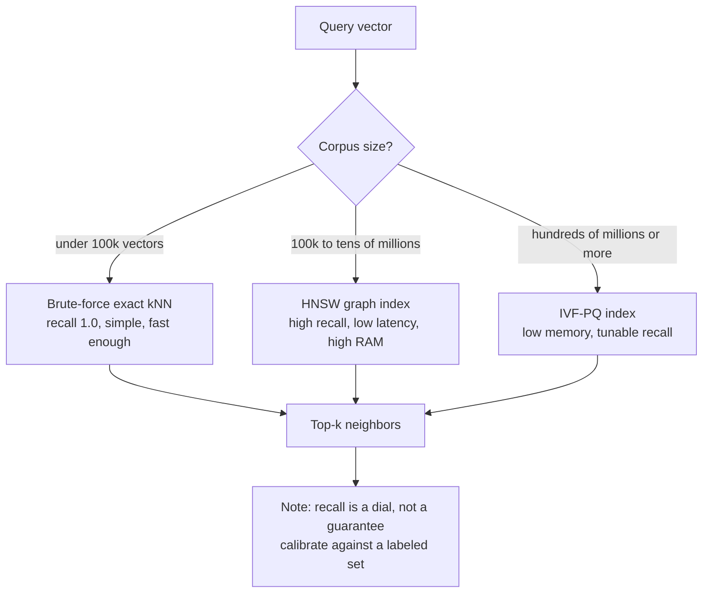
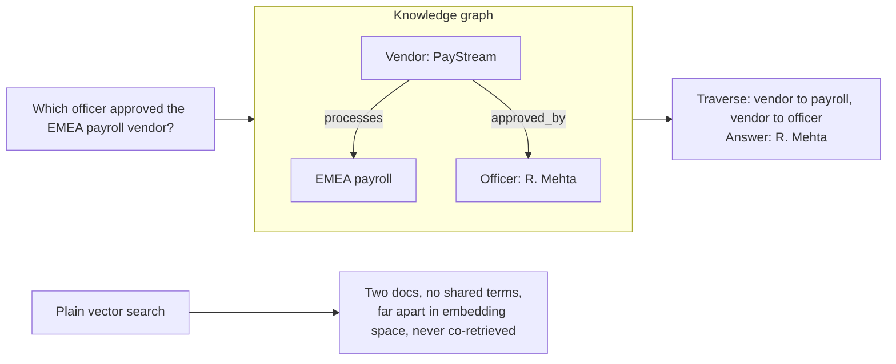
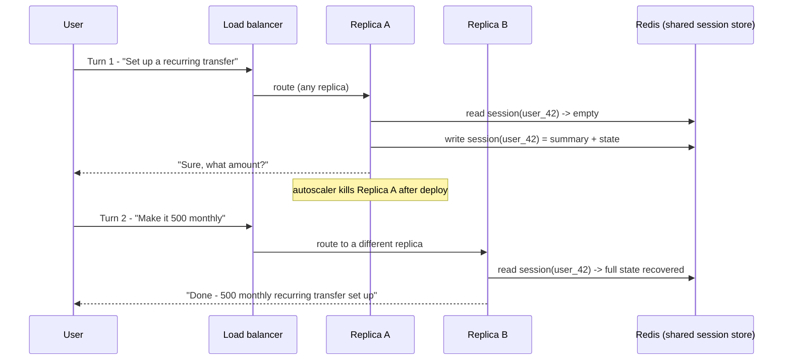

# Agent Memory and Retrieval: From Embeddings to Production RAG

## The Agent That Remembered the Wrong Thing

A support agent at a mid-sized fintech went live on a Monday. By Wednesday it had told three customers, with total confidence, that a feature deprecated eighteen months ago was still the recommended way to set up recurring transfers. The model was current. The system prompt explicitly said "always reference the latest documentation." The engineers had even fine-tuned the model on the company's tone of voice. None of that mattered, because the retriever — the part of the system that actually decides which sentences the model gets to read — kept handing the agent a chunk from a 2026 onboarding PDF that was semantically a perfect match for the question and factually obsolete.

A week later a different ghost appeared. A user invoked their right to deletion under GDPR. The engineer ran `DELETE FROM users WHERE id = ...`, confirmed the row was gone, closed the ticket. Two days afterward the agent cheerfully surfaced that user's old support conversation to answer someone else's question. The SQL row was deleted. The *embeddings* derived from that user's data were still sitting in the vector index, still being retrieved, still very much alive.

Both incidents are the same lesson wearing different clothes. **An agent's apparent intelligence is, to a first approximation, the quality of its context system** — what it can remember from earlier in a conversation, and what it can pull in from the world outside its weights. The reasoning model on top is interchangeable and improving monthly. The memory-and-retrieval layer underneath is where your engineering actually lives, and where it actually fails.

This is the third post in the *Agentic AI Engineering, end to end* series, and it is deliberately about that layer. It treats memory and retrieval as **one design surface** rather than two unrelated features. Embeddings and vector search are the substrate. Chunking, advanced retrieval, time-awareness, and conversation memory are how you make that substrate behave in production. The earlier RAG posts in the catalog cover the full pipeline mechanics — [Building RAG Systems](https://juanlara18.github.io/portfolio/#/blog/rag-building-production-systems), [Advanced RAG Patterns](https://juanlara18.github.io/portfolio/#/blog/rag-advanced-patterns), and [Vector Databases Demystified](https://juanlara18.github.io/portfolio/#/blog/vector-databases-indexes-to-vertex-search). I will lean on them hard and point you there for depth rather than re-deriving. What this post adds is the framing the agent imposes: the context system as the agent's working memory plus its library card, and the specific things that break when an agent — not a one-shot Q&A endpoint — is the consumer.

## Embeddings: Coordinates of Meaning

Start at the substrate, because everything downstream is a consequence of it.

An **embedding** is a function that turns a piece of text into a dense vector — a fixed-length list of real numbers, typically 384 to 3072 of them — such that texts with similar *meaning* land near each other in that space, even when they share no words at all. "How do I cancel my subscription?" and "What's the process for terminating my plan?" have almost no lexical overlap. A good embedding model places them within a whisker of each other anyway, because it was trained on enough language to learn that *cancel/terminate* and *subscription/plan* occupy nearby regions of meaning.

This is the single property that makes the entire enterprise work, so it is worth being precise about what an embedding is **not**:

- It is **not a relational row**. A row in a database is a tuple of named fields you query by exact key. An embedding has no fields. You cannot ask it "what is the customer ID" — you can only ask "what other vectors point in roughly the same direction."
- It is **not a hash**. A hash is designed so that similar inputs produce *wildly different* outputs — that is the whole point of a hash. An embedding is the exact opposite: similar inputs produce *nearby* outputs. Hashing destroys the structure embeddings are built to preserve.
- It is **not a summary**. A summary is human-readable text. An embedding is a point in geometric space, meaningful only relative to other points. You cannot read it; you can only measure distances from it.

If the geometry of all this feels hand-wavy, [Embeddings: The Geometry of Meaning](https://juanlara18.github.io/portfolio/#/blog/embeddings-geometry-of-meaning) builds the intuition from first principles, and I will assume that level of comfort from here on. The one thing to internalize: embeddings convert the slippery question "are these two pieces of text about the same thing?" into the crisp, computable question "are these two vectors close?"

### How "Close" Gets Measured

"Close" needs a metric. For dense embeddings the standard is **cosine similarity** — the cosine of the angle between two vectors. It ranges from $-1$ (opposite meaning) through $0$ (unrelated) to $1$ (identical direction):

$$
\text{cos}(\mathbf{a}, \mathbf{b}) = \frac{\mathbf{a} \cdot \mathbf{b}}{\|\mathbf{a}\|\, \|\mathbf{b}\|}
$$

Cosine cares about *direction*, not magnitude. Two documents that say the same thing — one long, one short — point the same way even though their raw vector lengths differ, and cosine correctly reports them as similar. That magnitude-invariance is precisely why it became the default for semantic search.

It helps to see what cosine is replacing, because the alternatives fail in instructive ways:

- **Levenshtein (edit) distance** counts literal character insertions, deletions, and substitutions. "cancel my subscription" and "cancl my subscriptions" are one or two edits apart — great for catching typos, useless for meaning. "cancel my subscription" and "terminate my plan" are an enormous edit distance apart despite being synonyms. Levenshtein sees letters, not concepts.
- **TF-IDF** scores documents by how often query words appear, weighted by how rare those words are across the corpus. It is lexical: it can only match words that literally co-occur. Ask "heart attack" of a corpus that only ever says "myocardial infarction" and TF-IDF returns nothing, because the strings never overlap. This is the vocabulary-mismatch failure that semantic embeddings exist to fix.

Cosine over dense embeddings bridges the synonym gap that both of those miss. But "bridges" is not "eliminates," and the gap it leaves is the source of your first calibration knob. When retrieval returns a plausible-but-wrong neighbor, the usual culprit is a **similarity threshold** set too loose — you are accepting vectors at cosine 0.62 when the genuinely relevant ones for your corpus sit above 0.78. Calibrating that threshold against a labeled query set is unglamorous and is the difference between a retriever that knows when it has found nothing and one that confidently serves garbage.

### kNN and the `top_k` Knob

Given a query vector, retrieval is **k-Nearest-Neighbors search**: find the $k$ stored vectors closest to the query under cosine similarity, and return them. The `k` (often spelled `top_k`) is the number of neighbors you pull. Set it to 3 and you get a tight, high-precision context but risk missing the one chunk that mattered. Set it to 50 and you flood the model's context window with marginally-relevant text — which, as we will see, actively *degrades* answers because of how attention behaves over long inputs. `top_k` is the first dial on the dashboard, and the right value is empirical, not a default.

Those vectors live in a **vector database** (Pinecone, Weaviate, Qdrant, Milvus, pgvector, Vertex AI Vector Search), not a relational one. A relational DB indexes for exact-match and range queries on scalar columns; it has no native notion of "nearest in 1536-dimensional space." A vector DB is purpose-built for exactly that. Here is the whole idea in code — embed, score by cosine, take the top $k$:

```python
import numpy as np
from openai import OpenAI

client = OpenAI()

def embed(texts: list[str]) -> np.ndarray:
    """Return an (n, d) matrix of L2-normalized embeddings."""
    resp = client.embeddings.create(
        model="text-embedding-3-small",  # 1536-dim
        input=texts,
    )
    vecs = np.array([d.embedding for d in resp.data], dtype=np.float32)
    # Normalize so a plain dot product equals cosine similarity.
    vecs /= np.linalg.norm(vecs, axis=1, keepdims=True)
    return vecs

corpus = [
    "To cancel your subscription, open Settings and choose Billing.",
    "Our refund window is 30 days from the date of purchase.",
    "Recurring transfers can be scheduled from the Payments tab.",
    "The fastest way to reach a human is the in-app chat widget.",
]
corpus_vecs = embed(corpus)  # build once, store in a vector DB

def top_k(query: str, k: int = 3) -> list[tuple[float, str]]:
    q = embed([query])[0]                 # (d,)
    scores = corpus_vecs @ q              # cosine, since everything is normalized
    idx = np.argsort(-scores)[:k]         # k highest-scoring neighbors
    return [(float(scores[i]), corpus[i]) for i in idx]

for score, text in top_k("how do I stop paying for my plan?", k=2):
    print(f"{score:.3f}  {text}")
# 0.61x  To cancel your subscription, open Settings and choose Billing.
# 0.4xx  Our refund window is 30 days from the date of purchase.
```

The query shares not a single content word with the top result. Cosine over embeddings found it anyway. That `corpus_vecs @ q` line is the conceptual heart of every RAG system on earth. It is also, at scale, the thing that will quietly destroy you.

## Finding Neighbors When There Are Millions

That `@` is a brute-force scan. It computes the query's distance to *every* stored vector. With four documents it is instant. With ten million 1536-dimensional vectors it is roughly fifteen billion multiply-adds per query — on the order of seconds on a CPU core, before you account for a single concurrent user. That is the **kNN wall**, and it is the constraint from which the entire vector-index field emerges. (The [Vector Databases](https://juanlara18.github.io/portfolio/#/blog/vector-databases-indexes-to-vertex-search) post derives this in full; here I just need the shape of it.)

A reflex worth killing early: this is not a storage problem, so storage tricks do not fix it. Putting the vectors on a faster SSD does not help — the bottleneck is CPU arithmetic and RAM bandwidth, not disk reads. Gzipping the vectors does not help — you have to decompress them to do math, and the math is the cost. The problem is *computational*, and the only real fix is to **stop comparing against most of the data**.

That is what an **Approximate Nearest Neighbor (ANN)** index does. It pre-structures the vectors at build time so that, at query time, you can examine a tiny, cleverly-chosen subset and still find *almost* all the true nearest neighbors. You trade a sliver of **recall** — the fraction of true top-$k$ neighbors you actually return — for orders of magnitude in speed. Going from seconds to single-digit milliseconds while keeping 95%+ recall is a trade nearly every production system accepts gladly.

Three index families dominate, and each is a different stance on the recall/latency/memory triangle:

| Index | How it skips work | Strength | Cost |
|---|---|---|---|
| **HNSW** (graph) | Builds a navigable small-world graph; greedily hops toward the query through layered shortcuts | Highest recall at lowest latency; the default for in-RAM workloads | Memory-hungry; the whole graph lives in RAM |
| **IVF** (inverted file) | Clusters vectors into cells; at query time probes only the few nearest cells | Tunable speed via the number of cells probed; good for very large sets | Recall depends on how many cells you probe; boundary misses |
| **PQ** (product quantization) | Compresses each vector into a short code, approximating distances on the codes | Massive memory savings; billions of vectors fit on one machine | Lossy; lower recall, usually paired with IVF as IVF-PQ |

These compose. IVF-PQ — cluster, then compress — is the workhorse for billion-scale corpora that must fit in a memory budget. The mental model that keeps the zoo legible: HNSW buys recall and speed with RAM; IVF-PQ buys low memory with some recall; on-disk variants buy low memory and recall with latency.



For an agent specifically, the index choice has a behavioral consequence people miss: an agent often issues *many* retrievals per user turn — a planning step, a tool-selection step, a fact-checking step. The per-query latency you tolerated for a single Q&A endpoint gets multiplied by the agent's reasoning depth. A 200ms retrieval is fine once; it is brutal eight times in a loop. ANN is not a nice-to-have for agents, it is load-bearing.

There is a second consequence that is easy to learn the hard way. ANN recall is not a fixed property of your index — it is a tunable that drifts as the corpus changes. Both HNSW and IVF expose search-time parameters (HNSW's `ef_search`, IVF's `nprobe`) that trade recall for latency on every query, and the right setting for a 100k-vector index is wrong for the same index at 10M vectors. Worse, incremental writes degrade an HNSW graph over time: months of upserts and deletes leave the navigable graph lumpier than the one you built, and recall quietly erodes while your dashboards show green. The discipline that prevents this is the same one that prevents the threshold problem — a small, stable, labeled query set that you replay against the index on a schedule, watching recall@k as a tracked metric rather than an assumption. An agent that silently loses three points of recall does not throw an error; it just gets a little dumber, and you find out from a user.

## Getting Documents In Without Destroying Them

Retrieval can only return what ingestion preserved. Two ingestion failures account for a disproportionate share of "the right answer exists but the agent can't find it" bugs.

### Chunking and the Boundary Problem

Documents are too long to embed whole, so you split them into **chunks** — usually a few hundred tokens each. The trouble is that meaning does not respect arbitrary boundaries. Split a document every 512 tokens and you will eventually slice a sentence — or worse, a clause whose two halves only mean something together — across two chunks. "The refund is available only if" lands at the end of chunk 7; "the request is filed within 30 days of purchase" starts chunk 8. Each chunk is individually retrievable and individually misleading. The model gets one half and confidently completes the wrong thought.

The fix is **chunk overlap**: let consecutive chunks share a transition zone, so the boundary content appears intact in at least one chunk. With 512-token chunks and 64-token overlap, the last 64 tokens of chunk 7 are also the first 64 of chunk 8 — the clause that straddled the boundary now lives whole inside chunk 8.

```python
def chunk_with_overlap(tokens: list[int], size: int = 512, overlap: int = 64):
    """Slide a window of `size` with `overlap` shared tokens between neighbors."""
    step = size - overlap
    assert step > 0, "overlap must be smaller than chunk size"
    return [tokens[i : i + size] for i in range(0, len(tokens), step)]
```

Overlap is not free — it inflates your index and can surface near-duplicate chunks for the same query — but a small overlap buys cheap insurance against boundary mutilation. The opposite mistake is just as real: chunks that are *too small* fragment a single idea into pieces that each look semantically thin, so none of them scores well enough to be retrieved. There is no universal size; it is a property of your documents, and you tune it against a labeled query set. The [Building RAG Systems](https://juanlara18.github.io/portfolio/#/blog/rag-building-production-systems) post goes deep on chunking strategies per document type.

### Structured Documents: The Table Massacre

Here is a failure no chunk-size knob can fix. Feed a financial PDF with a five-column rate table into a naive plaintext extractor and watch it *linearize* the table — flatten the two-dimensional grid into a single stream of text, reading left to right, top to bottom. The row/column relationships that made the table mean anything are gone. "Tier 2 | $50 | 2.9% | EMEA | active" becomes "Tier 2 50 2.9 EMEA active Tier 3 75 ..." and the embedding of that soup is meaningless. The model retrieves it and hallucinates which number goes with which tier, because the structure that disambiguated them was destroyed *before embedding ever happened*.

You cannot recover this with bigger chunks, a better embedding model, or fine-tuning. The information was lost at parse time. The fix is a **layout-aware / vision parser** that understands document structure and converts tables to Markdown or JSON *before* embedding — preserving the grid. As of 2025–2026 the production options are mature: [LlamaParse](https://www.llamaindex.ai/insights/best-llm-document-parser-2025) (multimodal, reports ~92% F1 on complex PDFs, emits clean Markdown), [Unstructured](https://unstructured.io/) (broad file-type coverage, built-in chunking), and [Azure AI Document Intelligence](https://learn.microsoft.com/azure/ai-services/document-intelligence/) (enterprise layout extraction tuned for dense financial and regulatory tables).

```python
# A layout-aware parser keeps tables as tables, so the embedding sees structure.
from llama_parse import LlamaParse

parser = LlamaParse(
    result_type="markdown",          # tables come back as Markdown grids, not soup
    parsing_instruction=(
        "Preserve every table as a Markdown table. "
        "Keep section headers so each chunk knows where it came from."
    ),
)
docs = parser.load_data("rate_card_2028.pdf")
# Now chunk and embed `docs` — each row/column relationship survives into the vector.
```

The rule of thumb: if your corpus is mostly prose, a good text splitter is enough; the moment tables, forms, or multi-column layouts carry the answers, a layout-aware parser stops being optional.

## Retrieval That Actually Works

You have a calibrated metric, an ANN index, and clean chunks. Naive top-$k$ still fails in four characteristic ways for agents, each with a known fix.

### HyDE: Search With an Answer, Not a Question

Queries and documents live in *different neighborhoods* of embedding space. A question — short, interrogative, colloquial ("how does aspirin work?") — sits near other questions. A document — long, declarative, technical ("Aspirin inhibits cyclooxygenase, reducing prostaglandin synthesis...") — sits near other documents. Even a good embedding model leaves a gap between the two, and that gap costs you recall.

**HyDE** (Hypothetical Document Embeddings, [Gao et al. 2022](https://arxiv.org/abs/2212.10496)) closes it with a beautiful trick: ask the LLM to *generate a hypothetical answer* to the query, then embed and search with **that** instead of the question. The hypothetical answer lives in document-space — it uses the vocabulary and shape of real documents — so its embedding lands in the right neighborhood. It does not matter that the hypothetical answer may be factually wrong; you are not showing it to anyone. You are using it as a *better-shaped query vector*. The encoder's bottleneck filters out the fabricated specifics and the real documents nearby get retrieved.

```python
def hyde_search(question: str, k: int = 5):
    """Generate a hypothetical answer, embed THAT, search with it."""
    hypothetical = client.chat.completions.create(
        model="gpt-4o-mini",
        temperature=0.0,
        messages=[{
            "role": "user",
            "content": (
                "Write a short, factual documentation passage that would directly "
                f"answer this question. Do not hedge; just write the passage.\n\n{question}"
            ),
        }],
    ).choices[0].message.content

    q_vec = embed([hypothetical])[0]      # embed the answer-shaped text, not the question
    scores = corpus_vecs @ q_vec
    idx = np.argsort(-scores)[:k]
    return [corpus[i] for i in idx]
```

The cost is one extra LLM call (~200–400ms). For technical corpora queried in plain language — exactly the support-agent case — it is one of the highest-return moves available.

### GraphRAG: When the Answer Is Split Across Disconnected Documents

Some questions cannot be answered by *any* single chunk, because the facts needed live in documents that share no vocabulary and therefore sit far apart in embedding space. "Which compliance officer approved the vendor that processes our EMEA payroll?" needs *(payroll vendor for EMEA)* from one document and *(who approved that vendor)* from another. Vector similarity cannot connect them — they have no terms in common, so they are not near each other, so no `top_k`, no reranking, and no amount of bigger chunks will bridge the gap. The connection is *relational*, and relations are not what cosine similarity measures.

This is the multi-hop problem, and the fix is structural: build a **knowledge graph** where entities are nodes and relationships are edges, then *traverse* it. The vendor links to EMEA-payroll via one edge and to the approving officer via another; the answer is a two-hop walk, not a similarity lookup. Microsoft's **GraphRAG** ([Edge et al. 2024](https://arxiv.org/abs/2404.16130)) formalizes this: an LLM extracts entities and relations from every chunk to build the graph, clusters it into communities, and summarizes each community — enabling both local entity-neighborhood queries and global "what are the themes across the whole corpus?" questions that plain RAG cannot touch.



GraphRAG is expensive to build — an LLM call per chunk during ingestion — so it earns its keep on stable corpora with genuine relational structure, not as a default. The [Advanced RAG Patterns](https://juanlara18.github.io/portfolio/#/blog/rag-advanced-patterns) post covers the local-vs-global query modes and the cost structure in detail.

### Reranking and the Lost-in-the-Middle Effect

Suppose retrieval returns the right chunk — but at position 14 of 20. Does the model use it? Often not. [Liu et al. 2023](https://arxiv.org/abs/2307.03172) — the *Lost in the Middle* paper — showed that LLMs attend most strongly to information at the **beginning and end** of their context and degrade sharply for information buried in the **middle**, even in models explicitly built for long contexts. The performance curve is a U: a relevant fact at the edges is used; the same fact in the middle is frequently ignored. Position in the context window is not cosmetic. It changes the answer.

This makes **ordering** a first-class concern, and the tool is a **reranker**. The vector index uses a *bi-encoder* — query and documents embedded separately, compared by cosine — which is fast but coarse. A reranker is a *cross-encoder*: it feeds the query and a candidate chunk through the model *together*, so attention runs across every query token against every document token, producing a far more accurate relevance score. It is too slow to run over millions of vectors, so you use it as a second stage: retrieve 50 candidates cheaply with ANN, rerank them precisely, keep the best handful, and — critically — *place the very best chunks at the start and end* of the context to dodge the middle. Production options in 2025–2026 are [Cohere Rerank](https://docs.cohere.com/docs/rerank) (managed, multilingual cross-encoder) and the open-source [BGE-reranker-v2-m3](https://huggingface.co/BAAI/bge-reranker-v2-m3) (self-hostable, 8k context).

```python
import cohere

co = cohere.Client()

def retrieve_then_rerank(query: str, candidates: list[str], keep: int = 4):
    """ANN gives many cheap candidates; the cross-encoder reorders precisely."""
    ranked = co.rerank(
        model="rerank-v3.5",
        query=query,
        documents=candidates,        # the ~50 ANN candidates
        top_n=keep,
    )
    ordered = [candidates[r.index] for r in ranked.results]
    # Defeat lost-in-the-middle: best chunks at the two ends, weakest in the center.
    best, *rest = ordered
    return ([best] + rest[1:] + [rest[0]]) if rest else [best]
```

### Time-Aware Retrieval: The Deprecated-Policy Trap

Back to the opening incident. The old policy and the new policy are *semantically near-identical* — they describe the same feature — so cosine similarity ranks them as near-equal neighbors. Pure semantic retrieval has no way to prefer the current one, because recency is not a semantic property. It lives in **metadata**: a version number, an effective date, a deprecation flag. And a system-prompt instruction like "always be current" is powerless here, because the instruction operates on text the model can see, while the problem is *which text the retriever physically injected*. You cannot prompt your way out of having handed the model the wrong document.

The fix is a metadata **filter** applied at retrieval time: attach `effective_date` and `status` to every chunk, and exclude deprecated documents before scoring.

```python
def current_policy_search(query: str, k: int = 5, as_of="2028-01-13"):
    """Semantic similarity, but only over documents active as of a given date."""
    q_vec = embed([query])[0]
    return vector_db.search(
        vector=q_vec,
        top_k=k,
        filter={
            "status": {"$eq": "active"},            # never retrieve deprecated docs
            "effective_date": {"$lte": as_of},      # in force on the query date
        },
    )
```

For an agent this is not a nicety — it is correctness. The agent will state retrieved content as fact. If the retriever feeds it a deprecated policy, the agent will confidently misinform a customer, and no downstream prompt or fine-tune can repair what the retrieval physically delivered.

## RAG vs Fine-Tuning vs the Giant Context Window

A recurring question: if I want my agent to know something new, should I retrieve it, fine-tune it in, or just paste everything into the prompt? The answer depends entirely on *what kind* of new thing it is.

To inject **fresh factual knowledge** — a product launched yesterday, a price changed this morning — the answer is RAG: **ingest it into the vector store** and it is available on the very next query, with citations, instantly. Fine-tuning is the wrong tool for facts. Fine-tuning (including LoRA) reshapes *behavior* — tone, format, domain idiom, the style of "correct" output for your domain. It is slow and costly to run, it bakes knowledge into weights that cannot be updated without another training run, and it cannot cite a source. Use fine-tuning to teach the agent *how to write*; use RAG to give it *what to write about*.

And the seductive third option — skip retrieval, paste the entire manual into a giant context window every call — fails for two compounding reasons. The first is **FinOps**: you are billed per input token on *every single call*, and an agent makes many calls per task. Resending a 200-page manual on every reasoning step is a line-item that scales with your traffic and bankrupts you at volume. The second is technical: attention cost and latency grow with context length, and *lost-in-the-middle* means most of that giant context is being underused anyway. You pay full price to bury the relevant sentences in the dead zone of the model's attention. RAG sidesteps both — it injects only the few chunks that matter, keeping cost flat and the relevant text in the high-attention region.

| Dimension | RAG (update the index) | Fine-tuning / LoRA | Giant context window |
|---|---|---|---|
| Fresh facts (launched yesterday) | Immediate on next query | Needs a training run; slow | Possible but billed every call |
| What it actually changes | Knowledge available to retrieve | Tone, format, behavior | Nothing persistent |
| Per-query cost | Low, only relevant chunks | Low at inference | High and grows with length |
| Provenance / citations | Native | None | Possible but lost-in-middle |
| Updating knowledge | Re-ingest, minutes | Re-train, hours to days | Re-paste every call |

The honest summary: **RAG for knowledge, fine-tuning for behavior, and the giant context window almost never as a substitute for either.** The [RAG vs fine-tuning section of the Advanced Patterns post](https://juanlara18.github.io/portfolio/#/blog/rag-advanced-patterns) develops the decision matrix further, including the "do both" case.

## Memory: How an Agent Remembers a Conversation

Retrieval pulls knowledge from outside. **Memory** is the agent's record of the conversation itself — and it has its own short-term/long-term split. Short-term memory is the current dialogue: what the user said three turns ago, the constraint they stated, the decision already made. Long-term memory is what persists across sessions — durable user preferences, prior resolutions — and is itself often implemented *as retrieval* over an embedded store of past interactions. Memory and retrieval are, again, one surface.

The naive approach to short-term memory is **ConversationBufferMemory**: keep the full raw transcript and resend all of it on every turn. It is perfectly faithful and it does not scale. Token usage grows linearly with conversation length; a long session blows straight through the context window, and you are paying (per the FinOps argument above) to resend the entire history on every single turn.

**ConversationSummaryMemory** trades fidelity for flatness: an LLM progressively *summarizes* the conversation so far, so the agent carries a compact running gist instead of the raw transcript. Token usage stays roughly flat as the dialogue grows. You lose verbatim detail — a real cost when an exact figure matters — which is why production systems often run a hybrid: keep the last few turns verbatim *and* a rolling summary of everything older.

```python
class SummaryMemory:
    """Keep recent turns verbatim; fold older turns into a running summary."""

    def __init__(self, llm, keep_recent: int = 4):
        self.llm = llm
        self.keep_recent = keep_recent
        self.summary = ""
        self.recent: list[dict] = []

    def add(self, role: str, content: str) -> None:
        self.recent.append({"role": role, "content": content})
        if len(self.recent) > self.keep_recent:
            oldest = self.recent.pop(0)              # evict and fold into the summary
            self.summary = self.llm.complete(
                f"Current summary:\n{self.summary}\n\n"
                f"Fold in this older turn, keeping any concrete facts and decisions:\n"
                f"{oldest['role']}: {oldest['content']}\n\nUpdated summary:"
            )

    def context(self) -> str:
        """Flat token cost: one summary + a fixed window of recent turns."""
        recent = "\n".join(f"{m['role']}: {m['content']}" for m in self.recent)
        return f"[Summary of earlier conversation]\n{self.summary}\n\n[Recent]\n{recent}"
```

### Where State Has to Live

Here is the production trap that catches teams the first time they autoscale. A real agent service runs as a *stateless, horizontally-scaled* fleet: several identical replicas behind a load balancer, and any given user turn might hit any replica. If you store conversation state — the buffer, the summary, the graph state — in a replica's **local RAM**, then turn two (routed to replica B) cannot see what turn one (handled by replica A) established. The agent develops amnesia between sentences.

The instinct is to patch this with **sticky sessions** — pin a user to one replica. It papers over the problem and reintroduces it the moment that replica is killed by an autoscaler scale-down, an OOM, or a routine deploy. The user's entire conversation vanishes mid-sentence. A **local disk file** on the replica fails identically: it dies with the replica and is invisible to the others.

The only correct place for conversation and graph state in a horizontally-scaled service is an **external distributed store** — Redis for hot session state, Postgres for durable state — that *every* replica can read and write. State lives outside the compute; replicas become genuinely interchangeable; killing one loses nothing. And note what does *not* solve this: resending the full chat history on each call moves the *text* around but does not persist *structural* state like an agent's accumulated plan, tool-call results, or graph cursor. Those have to be written somewhere durable and shared.



The replica that handled turn one is gone, and turn two still works, because the state was never *in* the replica. That is the whole design goal: stateless compute over shared state.

The split between Redis and Postgres in that diagram is worth making deliberate rather than reflexive. Redis holds the *hot* path — the current session's summary, the recent-turns window, the agent's in-progress plan and tool results — because reads and writes happen on every turn and must be single-digit milliseconds. Postgres holds the *durable* record — long-term memory, the full conversation log for audit, the per-user metadata you will need for deletion — because it must survive a Redis flush and support the relational queries (and the GDPR purge) that a key-value store cannot. Many teams collapse this into one store early and regret it: either they put durable data in a Redis instance configured for eviction and lose it, or they put hot session reads through Postgres and watch p99 latency balloon under concurrency. The two-tier split is not over-engineering; it is matching each kind of state to a store whose guarantees fit it. And for graph-shaped agent state specifically — a partially-traversed knowledge graph, a multi-step plan with dependencies — serialize the structure explicitly and write it to the shared store between steps. The agent's "train of thought" is data, and like all the data in this post, it belongs somewhere durable and shared rather than trapped in the RAM of a replica that is one deploy away from disappearing.

## Compliance Corner: The Right to Be Forgotten in a RAG Stack

Return to the second opening ghost, because it is a legal exposure, not just a bug. Under GDPR (and CCPA, and similar regimes), a user can demand erasure of their personal data. The reflex — delete the SQL row — is *insufficient and dangerous* in a RAG system, because that user's data was also **embedded into vectors** during ingestion, and those vectors persist in the index after the row is gone. They keep getting retrieved. The agent keeps surfacing the "deleted" user's information to answer other people's questions. You have deleted the original and kept a derived copy that is arguably more exposed, because it is actively served.

**Right to be forgotten in a RAG stack means purging the vectors too.** Every vector derived from a user's data must carry that user's ID in its metadata at ingestion time, so deletion can target them. Then erasure is a three-part operation: delete the SQL rows, delete the vectors filtered by `user_id`, and — because ANN graphs (HNSW especially) can leave tombstoned nodes that still influence traversal — schedule a re-index to physically compact them out.

```python
def forget_user(user_id: str) -> None:
    """GDPR erasure across the whole stack, not just the relational row."""
    sql.execute("DELETE FROM users WHERE id = %s", (user_id,))
    sql.execute("DELETE FROM conversations WHERE user_id = %s", (user_id,))

    # The vectors are the part everyone forgets. They must be deletable by user.
    vector_db.delete(filter={"user_id": {"$eq": user_id}})

    # Tombstoned nodes can linger in an ANN graph and still steer traversal.
    # Compact them out so the data is gone in fact, not just flagged.
    vector_db.compact(collection="conversations")
```

The design lesson is to plan for deletion at ingestion: **no vector should ever enter the index without the metadata needed to find and remove it later.** Retrofitting user-scoped deletion onto an index built without per-user metadata is, in practice, a re-index of the entire corpus — exactly the kind of forced downtime you do not want to discover during a regulator's deadline.

## Prerequisites and Known Gotchas

**Prerequisites.** You should be comfortable with what an embedding is and why cosine captures semantic relatedness ([Embeddings: The Geometry of Meaning](https://juanlara18.github.io/portfolio/#/blog/embeddings-geometry-of-meaning)), the shape of a basic RAG pipeline ([RAG: Retrieval-Augmented Generation](https://juanlara18.github.io/portfolio/#/blog/rag-retrieval-augmented-generation)), and ideally the vector-index trade-offs ([Vector Databases Demystified](https://juanlara18.github.io/portfolio/#/blog/vector-databases-indexes-to-vertex-search)). This post assumes those and focuses on the agent's context system on top.

**Gotchas that will bite you:**

- **A loose similarity threshold serves confident garbage.** Calibrate it against a labeled set; do not trust the default. A retriever that returns nothing is better than one that returns a plausible-but-wrong neighbor an agent will state as fact.
- **`top_k` too high is not "more context," it is worse answers.** Lost-in-the-middle means flooding the window buries the good chunks. Retrieve broadly, rerank, keep few.
- **Storage tricks never fix the kNN wall.** Faster SSDs and compression do nothing for a CPU/RAM-bound scan. Use an ANN index.
- **Naive table parsing is silent and fatal.** Tables linearize into meaningless soup before embedding. A bigger chunk or a better model cannot recover what the parser destroyed. Use a layout-aware parser.
- **"Be current" in the system prompt cannot override the retriever.** Recency is metadata; filter on it. The model can only reason over text it was physically given.
- **Local RAM plus sticky sessions is amnesia waiting for an autoscaler.** Put session and graph state in Redis or Postgres so any replica can serve any turn.
- **Deleting the SQL row leaves the vectors.** GDPR erasure must purge user-scoped vectors and re-index. Tag every vector with its user ID at ingestion or you cannot comply later without a full rebuild.

## Going Deeper

**Books:**

- Huyen, C. (2022). *Designing Machine Learning Systems.* O'Reilly.
  - The operational chapters on data, deployment, and feedback loops map directly onto running a retrieval system in production.
- Jurafsky, D. & Martin, J. H. (2024). *Speech and Language Processing* (3rd ed. draft, free online). Stanford.
  - The information-retrieval chapters ground TF-IDF, BM25, and ranking so you understand *why* dense retrieval and hybrid search behave as they do.
- Kleppmann, M. (2017). *Designing Data-Intensive Applications.* O'Reilly.
  - Not about RAG, but the definitive treatment of why distributed state belongs in a shared store and what stateless services actually buy you — the backbone of the memory section here.
- Liu, Z. et al. (2024). *Building LLM Applications.* (Manning / current editions vary).
  - Practical end-to-end coverage of retrieval, memory, and agent loops with running code.

**Online Resources:**

- [Microsoft GraphRAG (GitHub)](https://github.com/microsoft/graphrag) — the open-source implementation, prompts, and indexing pipeline behind the paper.
- [Cohere Rerank docs](https://docs.cohere.com/docs/rerank) — the cleanest production reference for two-stage retrieve-then-rerank.
- [LlamaIndex: Best LLM Document Parsers 2025](https://www.llamaindex.ai/insights/best-llm-document-parser-2025) — current, benchmarked comparison of layout-aware parsers.
- [BAAI BGE-reranker-v2-m3](https://huggingface.co/BAAI/bge-reranker-v2-m3) — the strongest self-hostable open reranker, with usage examples.

**Videos:**

- [Andrej Karpathy — Intro to Large Language Models](https://www.youtube.com/watch?v=zjkBMFhNj_g) — the mental model of weights-as-memory versus context-as-memory that motivates why we retrieve at all.
- [Jerry Liu (LlamaIndex) — Building Production-Ready RAG](https://www.youtube.com/watch?v=TRjq7t2Ms5I) — practitioner talk on ingestion, retrieval, and the failures that show up at scale.

**Academic Papers:**

- Gao, L., Ma, X., Lin, J., & Callan, J. (2022). ["Precise Zero-Shot Dense Retrieval without Relevance Labels."](https://arxiv.org/abs/2212.10496) *arXiv:2212.10496.*
  - The HyDE paper. Short, clear, and the canonical fix for query/document mismatch.
- Edge, D. et al. (2024). ["From Local to Global: A Graph RAG Approach to Query-Focused Summarization."](https://arxiv.org/abs/2404.16130) *arXiv:2404.16130.*
  - Microsoft GraphRAG. Read the ablations to see which graph stages actually move the numbers.
- Liu, N. F. et al. (2023). ["Lost in the Middle: How Language Models Use Long Contexts."](https://arxiv.org/abs/2307.03172) *arXiv:2307.03172.*
  - The empirical basis for reranking and chunk ordering. The U-shaped attention curve is the single most actionable result in retrieval engineering.

**Questions to Explore:**

- If long-term memory is just retrieval over embedded past interactions, where is the real boundary between "the agent remembers" and "the agent looks it up" — and does that distinction matter to the user?
- As context windows grow toward millions of tokens, does RAG become obsolete, or does the FinOps argument keep it permanently relevant? At what token price would "paste everything" win?
- A reranker can reorder the truth into the high-attention zone, but it cannot create a fact the retriever missed. Where should you spend your next engineering hour — better retrieval, or better reranking?
- GDPR erasure forces vector deletion. What is the equivalent obligation for *summarized* memory, where a user's data has been folded irreversibly into a running summary that no longer cites its sources?
- If an agent's intelligence is mostly its context system, how much of "model progress" that we attribute to the LLM is actually progress in retrieval and memory engineering around it?
