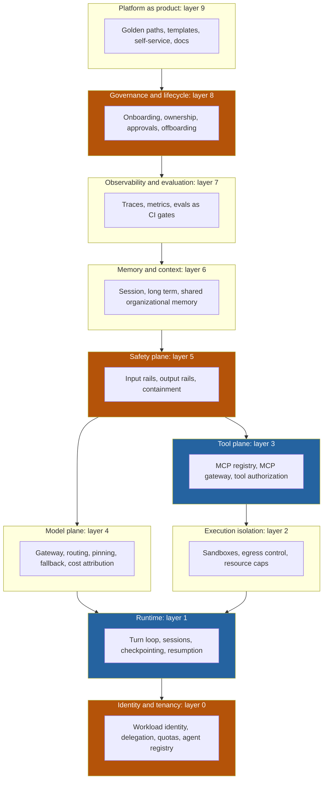
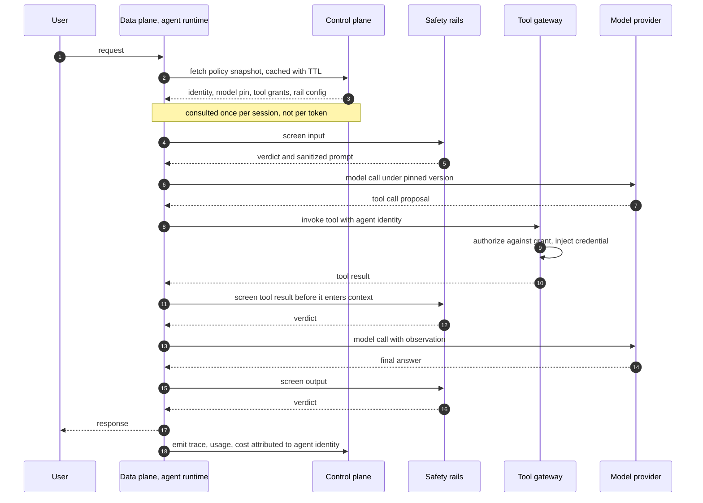
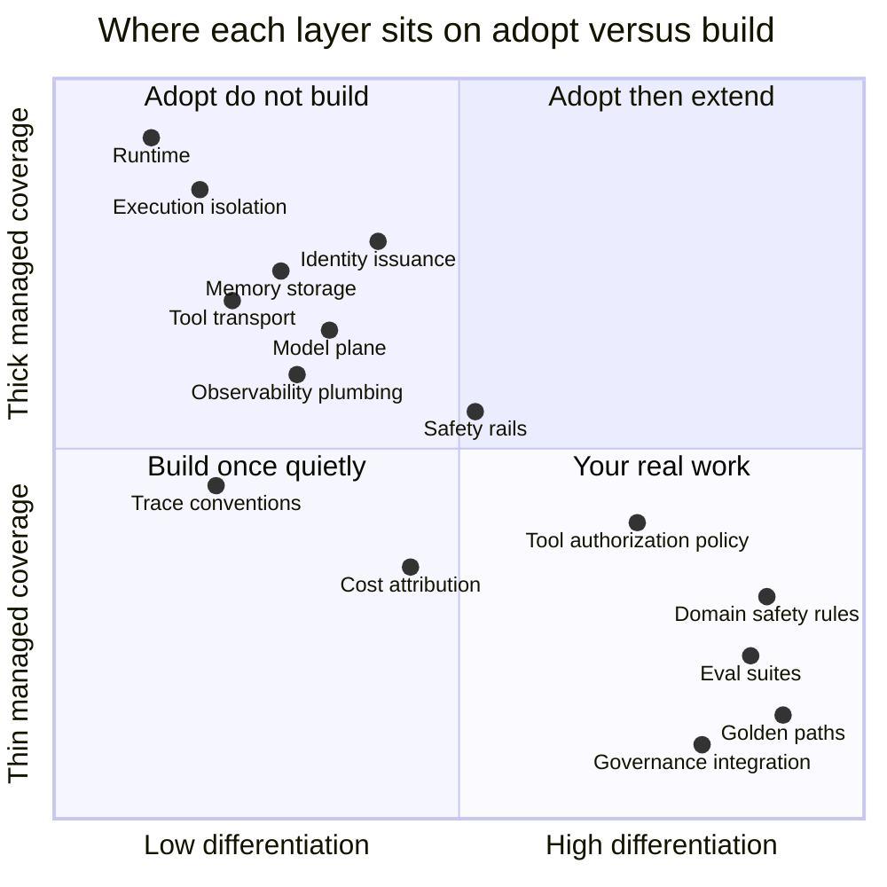
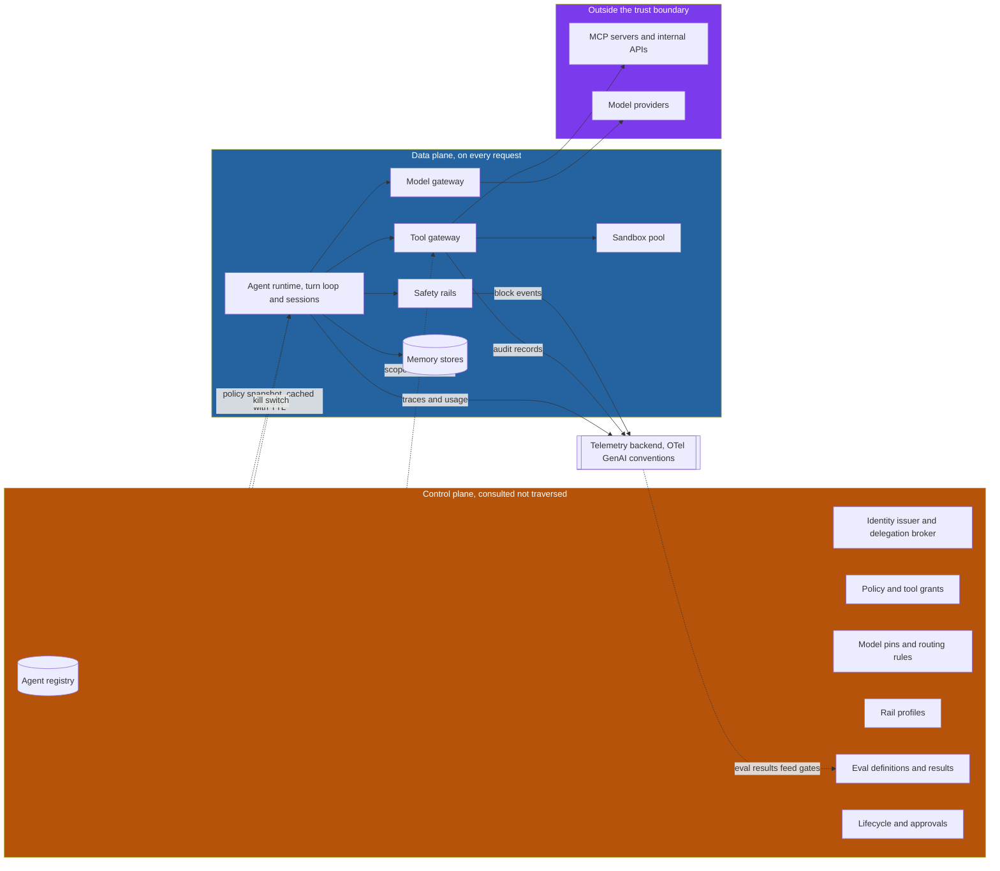

# The Agent Platform: Control Plane, Data Plane, and Everything You Have to Own

## The Ticket That Said "Host The Agents"

The ticket was one line long. *Onboard the agent workloads to the internal platform by end of quarter.* It landed in the queue of a four-person platform team that ran the company's Kubernetes estate, its CI, its secret manager, and its service catalog. They had onboarded hundreds of services. They were good at this. The estimate they gave was two sprints.

It took eleven months, and the reason it took eleven months is the reason this series exists.

The first week went exactly as expected. Six product teams had shipped agent prototypes over the previous two quarters. Each one was a container. Containers were solved. The platform team wrote a Helm chart, wired the existing ingress, pointed everything at the shared model endpoint, and declared victory on a Thursday.

Then the questions started arriving, and none of them had anything to do with containers.

Legal asked which identity the agent used when it read a customer record, because "the service account for the agent platform" was not an acceptable answer for a regulated data access log. The security team asked what happened when a document uploaded by a customer contained text instructing the agent to email its context window to an external address. The FinOps team asked why the model spend line item had tripled and which of the six teams owned which fraction of it, and nobody could answer because every call went out under one API key. A product team asked why their agent, which had worked perfectly for three weeks, started failing after the shared model endpoint was silently upgraded to a newer snapshot. Another team asked whether their agent could execute the Python it generated, and the platform team said yes before understanding the question. The compliance team asked for a list of every agent running in production, who owned it, what it could reach, and when it was last reviewed. That list did not exist. There was no place for it to exist.

And an engineer on one of the product teams, three months in, asked the question that reframed the whole project: *"Whose job is it to notice when an agent starts behaving differently?"*

Nobody had an answer, because nobody had named the layer that answer would live in.

That is the shape of the problem. The platform team had not been asked to run six containers. They had been asked to build a substrate that many teams' autonomous, tool-using, credential-holding, long-running programs would execute on top of, and to do it with the same operational guarantees the company expected from any other tier-one system. The container was the least interesting part. Everything the ticket did not mention was the project.

This post is the first of five. The series has a specific and, I think, underserved point of view.

## A Different Seat

There is an enormous amount of good writing about agents, on this blog and elsewhere. Almost all of it, including most of what I have written, is authored from the seat of someone **building** an agent: how to structure the loop, choose a topology, write the tools, evaluate the output. That is the builder's seat, and it is where most engineers sit.

This series is written from the other seat: the **platform engineer who operates the substrate that many teams' agents run on**. That shift is the entire point, and it changes almost every question.

The builder asks "which model should my agent use." The platform engineer asks "how do I let sixty agents choose models independently while still being able to pin, roll back, attribute cost, and gate an upgrade behind an evaluation suite." The builder asks "how do I give my agent access to the CRM." The platform engineer asks "how do I let any agent request access to any system, get it approved by that system's owner, receive a scoped credential it never sees the raw value of, and have all of it revoked automatically at decommission." The builder asks "how do I stop prompt injection." The platform engineer asks "what is my containment posture *given* that prompt injection will succeed."

These are not the same discipline. The builder optimizes one agent; the platform engineer makes the hundredth agent as cheap and as safe as the first. If you have done platform engineering for microservices you know this distinction already. What is new is that almost none of the received wisdom about agent engineering is written for you.

So let us start where that wisdom starts, and show why it stops too early.

## Two Answers Out of Ten

Ask a competent engineer what an agent platform consists of and you will usually get some version of this: *the agent lives in an agent runtime, and its tools are MCP servers.*

That answer is correct. It is also radically incomplete, in the specific way that "a web application is a process listening on a port that talks to a database" is correct and incomplete. It names two real layers and implies that the rest is detail. In practice the rest is where the eleven months went.

Here is the honest count. An agent platform has roughly ten layers. "Runtime" is one of them. "Tool plane" is another. The other eight are the ones that generated every question in that ticket queue.



The two blue boxes are the answer most people give. The orange ones are where the incidents come from.

I am numbering from zero deliberately. Identity is not the first layer, it is the layer beneath the first, because every other layer's policy decisions are expressed in terms of *which identity is asking*. Get identity wrong and nothing above it can be made correct later. You can retrofit an eval harness. You cannot retrofit the answer to "which agent read this record in March."

Let us walk all ten, with the question that matters for each: what does the platform own, and what does the agent team own? That line is the single most useful artifact a platform team can produce in its first month, and the single most common thing to leave implicit until an incident forces it into the open.

## The Ten Layers

### Layer 0: Identity and tenancy

Start here, because everything else is downstream.

The default state of a young agent platform is that every agent runs as the same service account. It is nearly always how it begins, because the first agent needed a credential and someone made one. By the sixth agent that shared principal has accumulated the union of every permission any agent ever needed, which means agent number six can reach the payroll system because agent number two needed it in March. This is precisely **ASI03, Agent Identity and Privilege Abuse**, in the OWASP Top 10 for Agentic Applications 2026, and it is the most common structural flaw I encounter.

The correction is a **workload identity per agent instance**, not per platform and not per team. Each agent gets its own principal, its own least-privilege grants, its own audit trail. The three hyperscalers have all converged on this and it is worth noting how strongly: Microsoft issues every deployed agent its own **Entra Agent ID**, a service principal with its own lifecycle that appears in the Entra directory alongside human users. Google introduced **Agent Identity** as a native IAM type built on open standards, explicitly to enforce least privilege and to make every agent action attributable. AWS ships **AgentCore Identity**, with identity-aware authorization and a vault for refresh tokens. When three competitors independently build the same primitive, the primitive is not optional.

The second half of this layer is **delegation**, and it is subtler than it looks. There are two distinct modes an agent can act in, and conflating them causes real damage. An agent can act **as itself**, using its own permissions, which is right for a nightly reconciliation job. Or it can act **on behalf of a user**, carrying that user's authority for the duration of a request, which is right for an assistant answering a specific person's question. The failure mode is an agent that acts as itself while *appearing* to act for a user: the user asks a question they are not entitled to have answered, and the agent, running with its own broader grants, answers it. The platform has to make the on-behalf-of path the easy one, which in practice means an OAuth token exchange broker sitting in the control plane rather than each team implementing delegation by hand.

Then there is tenancy: per-tenant secret scoping so agent A's credentials are unreachable from agent B's process, and per-tenant quotas so one runaway loop cannot exhaust the shared model capacity for everyone. And finally the **agent registry**, which is the inventory of who owns what. Not a wiki page. A queryable system of record listing every agent, its owner, its identity, its permitted tools, its model pins, its data classification, and its last review date. Google ships this as **Agent Registry**, a centralized catalog for MCP servers, tools, and agents. If you build nothing else on day one, build this, because it is the join key for every other layer.

### Layer 1: Runtime

The runtime is the turn loop and everything that makes a turn loop survivable: session management, checkpointing so a long task can resume rather than restart, cancellation so an operator can stop a misbehaving agent mid-flight, and the execution topology that determines whether the agent runs as a request-scoped process, a long-lived worker, or a durable workflow.

Two properties separate a real runtime from a `while` loop. The first is **duration**. AgentCore Runtime supports sessions up to eight hours, which sounds like a specification detail until you realize that everything in a normal request-serving stack, load balancer idle timeouts, connection pools, deployment rollouts, HPA scale-down, assumes requests measured in seconds. A runtime that holds state for hours is an entirely different operational animal, and the platform owns making it survive a deploy.

The second is **resumption**. If your agent dies at tool call fourteen of twenty, does it resume at fourteen or start over? Starting over is not merely expensive, it is *incorrect* when the first thirteen calls had side effects. This drags in idempotency keys, effect logs, and the same durability machinery that workflow engines have used for a decade.

Part 2 of this series is entirely about this layer.

### Layer 2: Execution isolation

The moment an agent can execute code it generated, you are running arbitrary untrusted code on your infrastructure. Not "potentially untrusted." Untrusted, by construction, because the code was written by a model whose input included text from sources you do not control. OWASP names this **ASI05, Unexpected Code Execution**.

The platform owns the sandbox: the image, the syscall filter, the filesystem boundary, the resource caps, and above all the **egress policy**, since exfiltration is the interesting attack, not CPU theft. AWS ships AgentCore Code Interpreter and Browser as managed sandboxes; Azure offers hosted agents with bring-your-own VNet. The agent team owns exactly one decision here: whether their agent needs code execution at all. A surprising number do not, and the cheapest sandbox is the one you never provision.

Part 3 covers this layer in depth.

### Layer 3: Tool plane

This is MCP, and it is the layer people most often think they understand. If the protocol itself is new to you, [The Model Context Protocol](https://juanlara18.github.io/portfolio/#/blog/model-context-protocol) is the primer.

The platform-relevant insight is a distinction that MCP tutorials skip entirely: a **registry** is not a **gateway**. A registry is a catalog — what tools exist, who owns them, what they do, what schema they take. A gateway is a data-path proxy — every tool call flows through it, and it injects credentials, enforces authorization, applies rate limits, and writes the audit record. A registry answers "what can I use." A gateway answers "you may not do that." Teams routinely build one and believe they have the other, which is how you end up with a beautiful tool catalog and no idea what was actually invoked. Google's split is instructive here: Agent Registry and Agent Gateway are separate products at separate maturity levels. AWS's AgentCore Gateway sits squarely on the data path, connecting to existing MCP servers and turning APIs and Lambda functions into agent-callable tools.

Part 4 is about this layer.

### Layer 4: Model plane

The model plane is the abstraction between an agent and the providers it calls, and it exists to solve five problems that only appear at platform scale.

**Provider abstraction and routing.** Agents should request a capability, not a vendor endpoint, so you can send cheap classification to a small model and hard reasoning to a large one without touching agent code.

**Fallback.** Providers have outages. If sixty agents each implement their own retry-and-degrade logic, you have sixty subtly different behaviors under stress and no coherent story about what the system does when a provider is down.

**Version pinning.** The failure from the opening — an agent that worked for three weeks and then broke — is almost always an unpinned model. Prompts are fitted to model behavior whether you intended that or not. Make the default *pinned*, expose the pin in the registry, and treat a version change as a deployment rather than a Tuesday.

**Eval gates on upgrade.** A model upgrade changes the behavior of every agent using it, so the platform should replay each agent's evaluation suite against the candidate and report deltas *before* the switch. This is the single highest-leverage thing a platform team can build, because it converts "we are afraid to upgrade" into a routine, evidence-backed operation.

**Cost attribution.** Every model call should carry the requesting agent's identity into billing metadata. Not the platform's identity, not the team's. Otherwise your FinOps conversation is a spreadsheet of guesses, and the agent that quietly retries five times on failure never gets found.

### Layer 5: Safety plane

Input rails and output rails: screening what goes into the model and what comes out. This layer gets its own section below, including the part most vendor material leaves out.

### Layer 6: Memory and context

Memory has three distinct scopes and they have wildly different risk profiles.

**Session memory** is the current conversation. It is short-lived and its blast radius is one interaction. **Long-term memory** persists across sessions for one user or one agent. Google's Memory Bank, generally available since December 2025, scopes memories to a specific identity so an agent can recall a user's preferences across sessions. AgentCore Memory offers self-managed strategies where you control the extraction and consolidation pipeline. **Shared organizational memory** is the interesting and dangerous one: a store that many agents read from and write to, so that what one agent learns is available to the next.

That third scope is where **ASI06, Memory and Context Poisoning**, lives, and it is a threat class rather than a bug. If an attacker can get a single false statement written into shared memory, they have compromised every future agent that reads it, asynchronously, with no attack traffic at the time of exploitation. It is stored cross-agent scripting. The platform mitigations are structural: memory writes carry provenance, memory is scoped by default rather than shared by default, promotion from agent-local to organizational memory is an explicit reviewed action, and every stored fact is attributable to the turn that produced it. The agent team decides what is worth remembering; the platform decides who can see it and how it is proven.

### Layer 7: Observability and evaluation

Standard APM does not survive contact with an agent. A trace of an agent turn is not a call graph, it is a *transcript with a call graph inside it*, and the interesting question is usually not "which span was slow" but "why did it choose that tool."

The good news is that the ecosystem converged faster than expected. The **OpenTelemetry GenAI semantic conventions** now give you a vendor-neutral vocabulary: `gen_ai.operation.name`, agent spans, tool spans, model spans, with naming conventions such as `create_agent {gen_ai.agent.name}`. Client spans exited experimental status in early 2026; agent and framework spans remain experimental but have been stable in practice, and `OTEL_SEMCONV_STABILITY_OPT_IN` lets you dual-emit during a migration. Adopt them, or each of your six teams invents its own attribute names and your traces do not join.

The evaluation half is what platform teams underestimate. **Evals are CI gates**, not a research activity. The platform owns the harness, the golden dataset storage, the pipeline wiring, and the enforcement that a regression blocks a deploy. The agent team owns the test cases, because only they know what correct means for their domain. Getting this division wrong in either direction is fatal: a platform that writes the evals writes shallow ones, and an agent team that has to build the harness never gets around to it.

### Layer 8: Governance and lifecycle

An agent is a thing that gets created, changes hands, drifts, and should eventually be destroyed. Almost nobody builds the last part.

The lifecycle the platform owns is: onboarding with a named human owner, periodic review, approval workflows for privilege escalation, and **offboarding that actually revokes**. That last one deserves emphasis. The agent that nobody remembers deploying, still holding a valid credential to a production database, still running its schedule, with an owner who left the company eight months ago, is **ASI10, Rogue Agents**, and it is not exotic. It is the default outcome of a platform without a lifecycle.

The OWASP Top 10 for Agentic Applications 2026, published on December 9, 2025 with contributions from more than a hundred practitioners, is the most useful shared vocabulary available for this conversation. Its value to a platform team is not the individual mitigations, it is that it gives you and your security counterparts *the same words*. When a product team says "we handle prompt injection" and you can ask "which of ASI01 and ASI06, and what is your containment story for the residual," the conversation gets sharper immediately.

| ID | Risk | The layer that owns the primary mitigation |
|---|---|---|
| ASI01 | Agent Goal Hijack | Safety plane, plus tool-level authorization |
| ASI02 | Tool Misuse and Exploitation | Tool plane gateway |
| ASI03 | Agent Identity and Privilege Abuse | Identity and tenancy |
| ASI04 | Agentic Supply Chain Compromise | Governance, plus tool registry provenance |
| ASI05 | Unexpected Code Execution | Execution isolation |
| ASI06 | Memory and Context Poisoning | Memory and context |
| ASI07 | Insecure Inter-Agent Communication | Identity, plus transport in the tool plane |
| ASI08 | Cascading Agent Failures | Runtime, plus observability |
| ASI09 | Human-Agent Trust Exploitation | Product surface and safety plane |
| ASI10 | Rogue Agents | Governance and lifecycle |

Read that table as a platform engineer and something jumps out: **eight of the ten map primarily to layers outside the agent's own code**. That is the argument for the platform in a single view.

### Layer 9: Platform as product

The last layer is not technology. It is the recognition that a platform nobody adopts is a hobby.

This means golden paths: an opinionated, well-lit, boringly documented route from empty repository to production agent that handles ninety percent of cases. It means self-service, because a platform that requires a ticket per agent does not scale past its team's calendar. And it means treating **agents as a new platform persona**. The CNCF's July 2026 writing on evolving platform engineering for AI-native workloads makes this explicit, listing AI agents alongside developers, data scientists, security teams, and business leaders as platform consumers, and noting that "AI-powered systems may increasingly become consumers of platform services and therefore require governance, access controls, and operational guardrails similar to those applied to human users."

That last clause is the whole idea. Your platform's users are no longer only humans. Some of them are programs that read your docs, call your APIs, and file your tickets. Part 5 is about what that does to platform design.

### The ownership line

Here is the artifact. Print it, argue about it with your first three tenant teams, and revise it — the argument is more valuable than the table.

| Layer | Platform owns | Agent team owns |
|---|---|---|
| 0. Identity and tenancy | Workload identity issuance, delegation broker, secret scoping, quotas, the agent registry | Declaring what access is needed and why; keeping the registry entry honest |
| 1. Runtime | Turn loop, session store, checkpointing, resumption, cancellation, scaling | The agent's own graph and topology inside the loop |
| 2. Execution isolation | Sandbox images, egress policy, filesystem and network boundaries, resource caps | Whether the agent needs code execution at all |
| 3. Tool plane | Gateway, registry, transport, credential injection, tool-level authorization | Tool selection, tool descriptions, when to call what |
| 4. Model plane | Provider abstraction, routing, fallback, version pinning, rate limits, cost attribution | Model choice per node, prompt content, per-turn token budget |
| 5. Safety plane | Rail deployment, policy templates, block and audit pipeline, incident response | Domain rules the generic rails cannot know |
| 6. Memory and context | Session store, long-term memory service, tenant isolation, retention and deletion | What is worth remembering, how memory is written and read |
| 7. Observability and evaluation | Trace collection, semantic conventions, retention, dashboards, eval harness and CI wiring | Writing the evals; defining what correct means here |
| 8. Governance and lifecycle | Onboarding and offboarding workflow, ownership records, approval gates, audit export | Naming a human owner, responding to reviews, retiring dead agents |
| 9. Platform as product | Golden paths, templates, docs, self-service surface, support | Following the golden path, or justifying the exception |

## Control Plane and Data Plane, Applied to Agents

Now the architectural spine.

Networking figured this out decades ago, and Kubernetes made the vocabulary universal. The **control plane** decides. It holds configuration, policy, identity, and desired state. It is consulted, not traversed. The **data plane** does. It carries the actual traffic, executes the actual work, and it is on the critical path of every request. The control plane can be briefly unavailable without stopping traffic. The data plane cannot.

Apply this to agents and the ten layers sort themselves cleanly.

**The control plane holds:** the agent registry, identity issuance and delegation brokering, policy definitions, quota allocation, model pins and routing rules, tool grants, safety rail configuration, eval definitions and results, approval workflows, and the lifecycle state machine. Notice that these are all *nouns and rules*. They change on human timescales — a deploy, a review, an approval — measured in minutes to weeks.

**The data plane holds:** the turn loop, the model call, the tool invocation, the sandbox execution, memory reads and writes, the rail evaluation on an actual prompt, and trace emission. These are all *verbs*. They happen thousands of times a minute and every one of them is on a user's latency budget.



Look at step 2 and the note beneath it. That is the entire design in one line: **the control plane is consulted to produce a snapshot, and the data plane executes against the snapshot.** The control plane is not in the loop of every token. If it were, your agent's p99 would be the sum of your policy service's p99 and your model's, and a control plane deploy would take down every running conversation.

### The mistake, and what it costs

The most common platform mistake is conflating the two, and it happens in both directions.

**Direction one: putting control-plane logic on the data path.** A policy service that is queried synchronously before every tool call. A registry lookup on every model call. An approval check that makes a network hop mid-turn. Each one seems harmless in isolation. Together they add hundreds of milliseconds to every step of a loop that may run twenty steps, and they couple your agents' availability to your policy service's availability. The failure looks like this: someone deploys the policy service on a Wednesday afternoon, and every long-running agent session across the company fails at whatever step it happened to be on, because a config service went away for ninety seconds. Long-running sessions make this worse than it would be for microservices — an eight-hour session has eight hours of exposure to every control-plane wobble.

**Direction two, which is worse: putting data-plane state in the control plane.** Session state written to the same store that holds policy. Conversation transcripts in the registry. Per-turn counters incremented in the configuration database. Now your control plane, which should handle tens of writes per minute, is taking thousands per second, and it degrades. When the control plane degrades you cannot issue identities, cannot revoke a compromised agent, and cannot read the registry to find out what is running. You have lost your ability to *respond to an incident* precisely when you are having one.

The rule that keeps you honest: **the control plane must remain readable and writable during a data plane emergency.** If you cannot revoke an agent's identity while that agent is saturating your infrastructure, the separation is wrong.

Here is what the control plane's shape looks like in code. Note that everything in this module is configuration and policy — no request ever executes here.

```python
"""Control plane: the system of record for what may run and under what rules.

Nothing in this module sits on a request path. It answers one question,
"what is the current policy for agent X", and it answers it into a snapshot
that the data plane caches and executes against.
"""

from __future__ import annotations

from dataclasses import dataclass, field
from datetime import datetime, timedelta, timezone
from enum import Enum
from typing import Mapping, Sequence


class Lifecycle(str, Enum):
    DRAFT = "draft"
    ACTIVE = "active"
    DEPRECATED = "deprecated"
    REVOKED = "revoked"


class DelegationMode(str, Enum):
    """Whether the agent acts with its own authority or the caller's."""

    AS_SELF = "as_self"
    ON_BEHALF_OF_USER = "on_behalf_of_user"


@dataclass(frozen=True)
class ToolGrant:
    """One tool the agent is permitted to call, and under whose authority."""

    tool_id: str                      # stable ID in the tool registry
    delegation: DelegationMode
    requires_human_approval: bool = False
    max_calls_per_turn: int = 10


@dataclass(frozen=True)
class ModelPin:
    """A pinned provider snapshot. Unpinned models are a change you did not review."""

    logical_name: str                 # what the agent asks for, e.g. "reasoning-large"
    provider: str
    version: str                      # an exact snapshot, never a floating alias
    fallback: str | None = None       # logical name to route to on provider failure
    max_tokens_per_turn: int = 32_000


@dataclass(frozen=True)
class AgentRecord:
    """The registry entry. This is the join key for every other layer."""

    agent_id: str
    owner_email: str                  # a human, not a distribution list
    team: str
    lifecycle: Lifecycle
    workload_identity: str            # per-agent principal, never shared
    data_classification: str          # drives which rails and which stores apply
    model_pins: Sequence[ModelPin]
    tool_grants: Sequence[ToolGrant]
    rail_profile: str                 # named safety configuration
    memory_scope: str                 # "session", "agent", or "org" — org needs review
    last_reviewed: datetime
    eval_suite_id: str | None = None
    labels: Mapping[str, str] = field(default_factory=dict)

    def is_stale(self, max_age: timedelta = timedelta(days=90)) -> bool:
        return datetime.now(timezone.utc) - self.last_reviewed > max_age


@dataclass(frozen=True)
class PolicySnapshot:
    """What the control plane hands the data plane. Immutable, versioned, cacheable."""

    agent_id: str
    revision: str                     # bump on any policy change; used for cache busting
    workload_identity: str
    model_pins: Mapping[str, ModelPin]
    tool_grants: Mapping[str, ToolGrant]
    rail_profile: str
    memory_scope: str
    issued_at: datetime
    ttl_seconds: int = 300            # short enough that revocation lands fast


class ControlPlane:
    """Resolves registry records into snapshots. Deliberately boring."""

    def __init__(self, registry: Mapping[str, AgentRecord]) -> None:
        self._registry = registry

    def resolve(self, agent_id: str) -> PolicySnapshot:
        record = self._registry[agent_id]

        # Lifecycle is enforced here, at admission, not scattered through the runtime.
        if record.lifecycle in (Lifecycle.REVOKED, Lifecycle.DRAFT):
            raise PermissionError(
                f"agent {agent_id} is {record.lifecycle.value} and may not run"
            )
        if record.is_stale():
            # Stale review is a warning, not a hard block: failing closed on a
            # governance timer takes down production for a paperwork reason.
            _emit_governance_signal("agent_review_overdue", agent_id=agent_id)

        return PolicySnapshot(
            agent_id=record.agent_id,
            revision=_revision_of(record),
            workload_identity=record.workload_identity,
            model_pins={p.logical_name: p for p in record.model_pins},
            tool_grants={g.tool_id: g for g in record.tool_grants},
            rail_profile=record.rail_profile,
            memory_scope=record.memory_scope,
            issued_at=datetime.now(timezone.utc),
        )
```

Two decisions in that code are worth defending.

First, `PolicySnapshot` has a TTL rather than being pushed on change. Push is tempting, but it makes the control plane responsible for reaching every data plane instance, which is a distributed systems problem you do not need. A three-hundred-second TTL means a revocation takes at most five minutes to propagate, which is fast enough for everything except an active compromise — and for active compromise you want a separate, deliberately simple kill switch that the data plane checks cheaply. Do not make your normal path carry your emergency path's requirements.

Second, a stale review emits a signal rather than blocking. I have watched a platform take down a production agent because a quarterly review checkbox expired, and the resulting political damage set the governance program back a year. Fail closed on security. Fail open, loudly, on paperwork.

Now the data plane. Notice how little it decides.

```python
"""Data plane: the turn loop. Executes against a cached snapshot, decides nothing."""

from __future__ import annotations

import time
from collections import Counter
from typing import Any, Callable, Mapping


class SnapshotCache:
    """Holds control plane decisions so the request path does not depend on them."""

    def __init__(self, control_plane: ControlPlane) -> None:
        self._cp = control_plane
        self._cache: dict[str, tuple[PolicySnapshot, float]] = {}

    def get(self, agent_id: str) -> PolicySnapshot:
        now = time.monotonic()
        cached = self._cache.get(agent_id)
        if cached is not None:
            snapshot, expires_at = cached
            if now < expires_at:
                return snapshot

        snapshot = self._cp.resolve(agent_id)
        self._cache[agent_id] = (snapshot, now + snapshot.ttl_seconds)
        return snapshot


class TurnLoop:
    """One agent turn. Every authorization question is answered by the snapshot."""

    def __init__(
        self,
        snapshots: SnapshotCache,
        model_gateway: Callable[..., Any],
        tool_gateway: Callable[..., Any],
        rails: "SafetyPlane",
        tracer: Any,
    ) -> None:
        self._snapshots = snapshots
        self._model = model_gateway
        self._tools = tool_gateway
        self._rails = rails
        self._tracer = tracer

    def run(
        self,
        agent_id: str,
        session_id: str,
        user_message: str,
        user_token: str | None = None,
        max_steps: int = 20,
    ) -> str:
        snapshot = self._snapshots.get(agent_id)
        calls_this_turn: Counter[str] = Counter()

        with self._tracer.start_as_current_span(f"invoke_agent {agent_id}") as span:
            # OpenTelemetry GenAI semantic conventions: use the standard names so
            # traces from six different teams actually join in one backend.
            span.set_attribute("gen_ai.operation.name", "invoke_agent")
            span.set_attribute("gen_ai.agent.id", agent_id)
            span.set_attribute("gen_ai.conversation.id", session_id)
            span.set_attribute("agent.policy.revision", snapshot.revision)

            screened = self._rails.screen_input(user_message, snapshot.rail_profile)
            if screened.blocked:
                span.set_attribute("agent.blocked_by", "input_rail")
                return screened.safe_message

            messages: list[dict[str, Any]] = [
                {"role": "user", "content": screened.text}
            ]

            for step in range(max_steps):
                pin = snapshot.model_pins["reasoning-large"]
                response = self._model(
                    provider=pin.provider,
                    version=pin.version,          # pinned, always
                    fallback=pin.fallback,
                    messages=messages,
                    max_tokens=pin.max_tokens_per_turn,
                    # Cost lands on the agent's identity, not the platform's.
                    attribution={"agent_id": agent_id, "identity": snapshot.workload_identity},
                )

                if not response.tool_calls:
                    out = self._rails.screen_output(response.text, snapshot.rail_profile)
                    span.set_attribute("agent.steps", step + 1)
                    return out.safe_message if out.blocked else out.text

                for call in response.tool_calls:
                    result = self._invoke_tool(call, snapshot, calls_this_turn, user_token)
                    messages.append({"role": "tool", "content": result})

            return "This task exceeded its step budget and was stopped."

    def _invoke_tool(
        self,
        call: Any,
        snapshot: PolicySnapshot,
        calls_this_turn: Counter[str],
        user_token: str | None,
    ) -> str:
        grant = snapshot.tool_grants.get(call.tool_id)
        if grant is None:
            # Denial is data, not an exception: the model should see it and adapt.
            return f"DENIED: this agent has no grant for tool {call.tool_id}."

        calls_this_turn[call.tool_id] += 1
        if calls_this_turn[call.tool_id] > grant.max_calls_per_turn:
            return f"DENIED: per-turn call budget exhausted for {call.tool_id}."

        if grant.requires_human_approval:
            return _request_approval_and_park(call, snapshot)

        if grant.delegation is DelegationMode.ON_BEHALF_OF_USER:
            if user_token is None:
                return "DENIED: this tool requires user delegation and no user token is present."
            identity_context = {"on_behalf_of": user_token}
        else:
            identity_context = {"as_self": snapshot.workload_identity}

        raw = self._tools(tool_id=call.tool_id, args=call.args, identity=identity_context)

        # Tool output is untrusted input. Screen it before it enters the context window.
        screened = self._rails.screen_tool_result(raw, snapshot.rail_profile)
        return screened.safe_message if screened.blocked else screened.text
```

Three things in the data plane deserve a callout.

The `_invoke_tool` method returns denial strings instead of raising. This is a deliberate choice: a denial that reaches the model as an observation lets the agent adapt, apologize, or try a permitted alternative. A denial that raises kills the turn and produces a stack trace the user cannot act on. Authorization failures are *normal operating conditions* in an agent system, not exceptions.

The delegation branch is where on-behalf-of stops being a diagram and becomes code. If the grant says user delegation and there is no user token, the call is refused. This is the mechanism that prevents the agent from quietly answering a question the user was not entitled to have answered.

And tool results get screened before entering the context window. This is the single most under-implemented control in the entire stack. Everyone screens the user's message. Far fewer screen the retrieved document, the API response, the web page, which is exactly where the injection actually arrives.

## The Safety Plane, and the Honest Limits of an LLM Firewall

Now the part where I have to be careful, because this is where platform teams are most often sold certainty.

Google Cloud's **Model Armor** is a good concrete example of the category, and I use it as the example precisely because it is one of the better ones. It is a model-agnostic LLM firewall that screens both prompts and responses. It detects prompt injection and jailbreak attempts. It applies responsible-AI filters for hate speech, harassment, sexually explicit and dangerous content, with CSAM detection applied by default. It integrates with **Sensitive Data Protection** to find credit card numbers, US Social Security numbers, financial account numbers, ITINs, Google Cloud credentials, and API keys, with template support for additional infotypes. It checks URLs for maliciousness, scanning up to the first forty in a payload. It screens documents — PDF, CSV, DOCX, PPTX, XLSX, plain text — up to four megabytes, and has image screening with OCR in preview. Detection sensitivity is tunable across three confidence tiers: *high* for near-certainty of a violation, *medium and above* for a balanced posture, and *low and above* to flag even a slight indication.

Crucially for a platform team, it is exposed as a **REST API** and is both model-agnostic and cloud-agnostic: it works with Gemini, OpenAI, Anthropic, Llama, and anything else your teams pick, running anywhere, as long as the caller can make an HTTPS request. It also offers no-code inline integration with Apigee, Agent Gateway, LangChain, and the Gemini Enterprise Agent Platform. One API, every provider, every cloud — put it behind your model gateway and every tenant gets rails without changing a line of their code.

Now the honest part.

In October 2025, a team from Google DeepMind, OpenAI, Anthropic, and ETH Zurich published *The Attacker Moves Second: Stronger Adaptive Attacks Bypass Defenses Against LLM Jailbreaks and Prompt Injections* (arXiv:2510.09023, subsequently presented at USENIX Security '26). Their argument is methodological: defenses are typically evaluated against fixed attack strings or weak optimization, which measures the wrong thing, because a real attacker sees the defense and adapts to it. So the authors built adaptive attacks — gradient descent, reinforcement learning, random search, and human-guided exploration, tuned and scaled with real effort — and pointed them at twelve published defenses.

They bypassed most of them with attack success rates above ninety percent. Nearly all of those defenses had originally reported success rates near zero.

Model Armor was one of the twelve. Their search-based adaptive attack achieved an attack success rate above ninety percent against it. The methodological caveat matters and I want to state it precisely rather than let it be lost: the strongest results came in a setting where the attacker receives the detector's confidence score and detection flag as feedback, letting the search climb the gradient of the filter's own verdict. That is a strong assumption. It is also not an unrealistic one, because any filter exposed as an API that returns a verdict leaks exactly that signal to whoever can call it.

Other results in the same paper are worth internalizing for calibration. Circuit Breakers fell to a reinforcement-learning attack at one hundred percent. RPO fell at ninety-eight percent. Spotlighting and prompt sandwiching fell around ninety-five percent. PIGuard held better, at seventy-one percent, and MELON landed in a range from seventy-six to ninety-five percent depending on the threat model. **No defense held.** The distribution is between "bad" and "somewhat less bad."

So what does a platform engineer do with this?

Not "skip the filter" — that is the lesson people take when they read a single number. Adaptive attacks require iteration, feedback, and intent. A filter that stops the opportunistic ninety-five percent of attempts while failing against a determined adversary spending real compute is still enormously valuable; it is the same bargain we accept from every WAF ever deployed. Rails also catch a large volume of *non-adversarial* problems: accidental PII in a prompt, a model emitting a credential it read from a config file, a user pasting a customer's SSN into a chat. Those are the majority of real incidents.

The correct lesson is about **where the filter sits in your architecture**. Treat it as one layer of defense in depth, never as the boundary. A layer that reduces the volume and cost of attacks, and buys you detection signal, is not the same thing as a layer that makes an attack impossible. Concretely:

- **The filter is not the authorization boundary.** The tool gateway is. If the only thing between a prompt-injected agent and a wire transfer is a classifier, you do not have a security architecture. If the agent holds no grant for the payments tool, the injection succeeds and accomplishes nothing.
- **Assume injection succeeds and design containment.** What is the worst outcome if an attacker controls the model's output for one turn? If the answer is an embarrassing message, fine. If it is an irreversible action against a production system, you have a design problem no filter will fix.
- **Screen tool output as aggressively as user input**, since that is where injection actually arrives in a retrieval-heavy or browsing agent.
- **Make blocks observable, and fail asymmetrically.** Every block is a detection event; a tenant whose block rate jumps tenfold overnight is telling you something. Fail open with an alarm on the input path and closed on high-risk outputs, because full fail-closed makes your safety vendor's availability your product's availability, and outages teach teams to route around the rails.

```python
"""Safety plane: defence in depth, with explicit assumptions about what it does not do.

Contract: this layer reduces the frequency and cost of attacks and generates
detection signal. It is NOT an authorization boundary. Authorization lives in
the tool gateway, which is enforced regardless of what this layer concludes.
"""

from __future__ import annotations

from dataclasses import dataclass
from typing import Protocol, Sequence


@dataclass(frozen=True)
class Verdict:
    blocked: bool
    text: str
    safe_message: str = "I cannot help with that request."
    matched: tuple[str, ...] = ()
    degraded: bool = False       # true when a screener failed and we failed open


class Screener(Protocol):
    """Any input or output rail. Model Armor is one implementation among several."""

    name: str

    def screen(self, text: str, profile: str, direction: str) -> Verdict: ...


class SafetyPlane:
    """Composes screeners. Order matters: cheap and local first, network last."""

    def __init__(
        self,
        input_screeners: Sequence[Screener],
        output_screeners: Sequence[Screener],
        fail_open_on_input: bool = True,
        fail_open_on_output: bool = False,
    ) -> None:
        self._in = input_screeners
        self._out = output_screeners
        self._fail_open_in = fail_open_on_input
        self._fail_open_out = fail_open_on_output

    def screen_input(self, text: str, profile: str) -> Verdict:
        return self._run(self._in, text, profile, "input", self._fail_open_in)

    def screen_output(self, text: str, profile: str) -> Verdict:
        return self._run(self._out, text, profile, "output", self._fail_open_out)

    def screen_tool_result(self, text: str, profile: str) -> Verdict:
        # Tool and retrieval output is the highest-yield injection surface and the
        # most commonly unscreened one. It runs the input rails, not the output ones.
        return self._run(self._in, text, profile, "tool_result", self._fail_open_in)

    def _run(
        self,
        screeners: Sequence[Screener],
        text: str,
        profile: str,
        direction: str,
        fail_open: bool,
    ) -> Verdict:
        degraded = False
        for screener in screeners:
            try:
                verdict = screener.screen(text, profile, direction)
            except Exception as exc:
                # A screener outage must not silently become a security decision.
                _emit_security_signal(
                    "screener_unavailable",
                    screener=screener.name,
                    direction=direction,
                    error=str(exc),
                )
                if fail_open:
                    degraded = True
                    continue
                return Verdict(blocked=True, text="", matched=(screener.name,), degraded=True)

            if verdict.blocked:
                # Every block is a detection event. Emit before returning.
                _emit_security_signal(
                    "rail_block",
                    screener=screener.name,
                    direction=direction,
                    matched=verdict.matched,
                )
                return verdict

        return Verdict(blocked=False, text=text, degraded=degraded)


class ModelArmorScreener:
    """Thin adapter over the Model Armor REST API.

    Model-agnostic by design: the LLM being protected does not need to run on
    Google Cloud, and neither does the application calling this.
    """

    name = "model_armor"

    def __init__(self, client, template_by_profile: dict[str, str]) -> None:
        self._client = client
        self._templates = template_by_profile

    def screen(self, text: str, profile: str, direction: str) -> Verdict:
        template = self._templates[profile]
        if direction == "output":
            result = self._client.sanitize_model_response(template=template, text=text)
        else:
            result = self._client.sanitize_user_prompt(template=template, text=text)

        findings = tuple(result.triggered_filters)
        return Verdict(blocked=bool(findings), text=text, matched=findings)
```

The comment at the top of that module is the most important line in it. Write your assumptions into the code, because six months from now someone will read `SafetyPlane` and assume it means safe.

For a deeper treatment of rail design itself, [Guardrails for Agent Systems: A Field Guide](https://juanlara18.github.io/portfolio/#/blog/agent-guardrails-field-guide) goes layer by layer, and [Bank-Grade Agent Security](https://juanlara18.github.io/portfolio/#/blog/bank-grade-agent-security-iam-gateways) covers the IAM and gateway side in a regulated setting.

## What a Managed Runtime Buys, and What It Leaves You

Between October 2025 and mid-2026, all three hyperscalers shipped enterprise-grade managed agent platforms. If you are standing up an agent platform now, this changes the build-versus-buy calculation materially, and it is worth being precise about what each one actually covers rather than arguing from vibes.

**AWS Bedrock AgentCore** went generally available on October 13, 2025, as a set of composable modules: Runtime, Memory, Gateway, Browser, Code Interpreter, Identity, and Observability. Runtime supports sessions up to eight hours and speaks the A2A protocol. Gateway connects to existing MCP servers and turns APIs and Lambda functions into agent-callable tools. Identity provides identity-aware authorization and a secure vault for refresh tokens so agents can act on behalf of users or as themselves. GA brought VPC, PrivateLink, CloudFormation, and resource tagging across all modules; quality evaluations and policy controls followed.

**Google** took a longer path. Vertex AI Agent Engine reached GA in early 2025, with Sessions and Memory Bank following on December 16, 2025. In April 2026 the whole thing was reframed as the **Gemini Enterprise Agent Platform**, spanning Agent Studio, agent-to-agent orchestration, Agent Runtime, Memory Bank, Agent Observability, and a governance pillar of Agent Identity, Agent Registry, and Agent Gateway. Notably, the registry and gateway are at different maturity levels — registry in public preview, gateway in private preview at announcement — which is itself an honest signal about how hard that layer is.

**Microsoft Foundry Agent Service** reached GA on June 16, 2025, with hosted agents, observability, and the portal reaching GA subsequently. Its distinguishing move is identity: every deployed agent receives an **Entra Agent ID**, a first-class service principal with its own lifecycle, appearing in the same directory as human users. It supports bring-your-own VNet and multiple authentication modes for tool access, and Foundry Observability provides latency, throughput, usage, and quality metrics plus trace logs of each agent's reasoning steps and tool calls.

| Layer | AWS Bedrock AgentCore | Gemini Enterprise Agent Platform | Microsoft Foundry Agent Service |
|---|---|---|---|
| 0. Identity | AgentCore Identity, token vault, OAuth | Agent Identity, native IAM type | Entra Agent ID, service principal per agent |
| 1. Runtime | AgentCore Runtime, up to 8 hour sessions | Agent Runtime with Agent Sessions | Foundry Hosted Agents |
| 2. Isolation | Code Interpreter and Browser sandboxes | Managed execution | Hosted agents with bring your own VNet |
| 3. Tool plane | AgentCore Gateway plus MCP connectivity | Agent Gateway and Agent Registry | Tool connections with several auth modes |
| 4. Model plane | Bedrock model access | Model selection across the platform | Foundry model catalog |
| 5. Safety | Policy controls | Model Armor integration | Runtime guardrails |
| 6. Memory | AgentCore Memory, self managed strategies | Memory Bank, identity scoped | Threads and agent state |
| 7. Observability | AgentCore Observability | Agent Observability | Foundry Observability |
| 8. Governance | Tagging, CloudFormation, evaluations | Agent Registry and governance pillar | Entra directory and lifecycle |
| 9. Product surface | AgentCore SDK and quick starts | Agent Studio | Foundry portal and SDK |

Read that table and the honest conclusion is that a managed platform gets you a long way. Every column has something in every row. Adopting one is, for most organizations, the correct default.

And then here is what it still leaves you.

**Your policy is yours.** The platform gives you a mechanism for tool grants. It does not know that your fraud team may read customer records but your marketing agents may not, or that any tool touching the ledger requires two-person approval. Encoding your organization's actual rules is your work, permanently.

**Your evals are yours.** Every platform now offers an evaluation harness. None can tell you whether an answer is correct for your domain. The golden datasets, the graders, the thresholds that block a deploy — yours.

**Your golden paths are yours.** A cloud provider gives you a hundred capabilities. Your teams need the opinionated ten-percent subset with your defaults baked in. Nobody builds that for you, and it is the highest-leverage thing your platform team will ship.

**Your seams are yours.** The moment you pair one vendor's runtime with another's models, or inherit a second cloud through an acquisition, the joins are your problem — as is joining the agent registry to your CMDB, your access review cycle, your incident process, and your data catalog. Every one of those integrations is bespoke.

**The residual risk is yours.** All of it. No managed runtime accepts liability for what your agent does.



The shape of that chart is the strategy. Everything in the upper left you should adopt and stop thinking about. Everything in the lower right is the actual job — it is where your organization differs from every other organization, which is exactly why no vendor can ship it. Teams get into trouble by inverting this: building a bespoke runtime, which is upper-left work, while leaving eval suites and tool authorization policy, which is lower-right work, undone. I wrote about that specific inversion in [Anatomy of an Agent Harness](https://juanlara18.github.io/portfolio/#/blog/agent-harness-build-fork-adopt-yc-qm) from the builder's side; the platform side of the same argument is this chart.

## A Reference Architecture

Pulling it together, here is the shape I would defend in a design review.



The dotted lines are the discipline. Every arrow from the control plane into the data plane is dotted, meaning asynchronous, cached, and tolerant of the control plane being briefly unreachable. Every solid line is on a request path. If you find yourself drawing a solid arrow from the control plane into a request path, stop and ask what breaks when that service is redeploying.

Three properties are worth naming explicitly.

**The tool gateway is the trust boundary, not the safety rails.** Rails are on the data path but they are advisory in the architectural sense. The gateway is where a request either is or is not permitted, and it enforces that using the grant from the snapshot regardless of what any classifier concluded. This is what makes the ninety-percent bypass number survivable rather than catastrophic.

**Telemetry flows one way and then feeds back through the control plane.** Traces go to the backend, eval results are computed from them, and those results gate deployments through the control plane. The data plane never reads from observability on a request path. That loop closes on the timescale of a deploy, not a turn.

**Memory sits inside the data plane but is scoped by control plane policy.** The `memory_scope` field in the registry record decides whether an agent's writes are visible to itself only or to the organization. Promotion to organizational scope is a reviewed action, which is your structural answer to memory poisoning.

If you are coming at this from the builder's side, [Agent Architecture and Orchestration](https://juanlara18.github.io/portfolio/#/blog/agent-architecture-and-orchestration) covers what happens *inside* the runtime box — routers, supervisors, cyclic graphs. This post is deliberately silent on that, because from the platform's seat, the contents of that box are the tenant's business. That silence is the point. A good platform is indifferent to your topology and uncompromising about your identity.

## Where This Series Goes

Four posts follow, each taking one layer down to implementation depth.

**Part 2, the runtime**, is about the turn loop as an operational object: sessions, checkpointing, resumption after failure, cancellation semantics, and how execution topology changes when a single request lives for hours.

**Part 3, execution isolation**, is about running model-generated code without running model-generated code on your network: sandbox technology choices, egress control, and what a realistic threat model looks like.

**Part 4, the tool plane**, takes the registry-versus-gateway distinction seriously and builds both, including tool-level authorization, credential injection, and MCP server supply chain.

**Part 5, platform as product**, is about adoption: golden paths, self-service, measuring whether the platform is working, and the strange new discipline of designing a platform whose users include programs.

The through-line is the seat. Everything here is written for the engineer who will be asked, at some point, to host other people's agents, and who would like to know the shape of the problem before the ticket arrives rather than eleven months after.

## Going Deeper

**Books:**
- Burns, B., Beda, J., Hightower, K., & Evenson, L. (2022). *Kubernetes: Up and Running* (3rd ed.). O'Reilly Media.
  - The clearest working treatment of control plane and data plane separation in a system most engineers already have intuitions about. Read it as the analogy this post is built on rather than as a Kubernetes manual.
- Fong-Jones, L., Majors, C., & Miranda, G. (2022). *Observability Engineering: Achieving Production Excellence.* O'Reilly Media.
  - Why high-cardinality, event-based telemetry beats aggregate metrics. Agent traces are the highest-cardinality data most platforms will ever handle, and the arguments here transfer directly.
- Fowler, S. J. (2016). *Production-Ready Microservices.* O'Reilly Media.
  - The ownership question this post's central table asks — what does the platform guarantee versus what does the service owner guarantee — was worked out here for microservices. The agent version is the same negotiation with higher stakes.
- Kleppmann, M. (2017). *Designing Data-Intensive Applications.* O'Reilly Media.
  - For the durability half of the runtime layer. Checkpointing, resumption, idempotency, and exactly-once semantics are old problems, and long-running agent sessions are a new place to meet them.
- Skelton, M., & Pais, M. (2019). *Team Topologies.* IT Revolution Press.
  - The platform-as-product argument in its original form, including why a platform team that cannot say no to bespoke requests stops being a platform team.

**Online Resources:**
- [OWASP Top 10 for Agentic Applications 2026](https://genai.owasp.org/resource/owasp-top-10-for-agentic-applications-for-2026/) — Released December 9, 2025 with more than a hundred contributors. Use it as shared vocabulary with your security counterparts, not as a checklist.
- [OpenTelemetry GenAI semantic conventions](https://opentelemetry.io/docs/specs/semconv/registry/attributes/gen-ai/) — The attribute registry. Adopt these names before your teams invent six incompatible schemas.
- [Model Armor overview, Google Cloud](https://docs.cloud.google.com/security-command-center/docs/model-armor-overview) — Filter categories, confidence levels, document and image screening limits, and integration surfaces, from the source.
- [Amazon Bedrock AgentCore documentation](https://docs.aws.amazon.com/bedrock-agentcore/latest/devguide/release-notes.html) — Release notes are the most honest description of any managed platform. Read them chronologically to see which layers were hardest.
- [Evolving platform engineering for AI-native workloads, CNCF](https://www.cncf.io/blog/2026/07/06/evolving-platform-engineering-for-ai-native-workloads/) — The argument for agents as a non-human platform persona, and the capability list that follows from it.
- [Introducing Gemini Enterprise Agent Platform, Google Cloud](https://cloud.google.com/blog/products/ai-machine-learning/introducing-gemini-enterprise-agent-platform) — Useful mainly for how explicitly it separates the governance pillar from the build pillar.

**Videos:**
- [AWS re:Invent 2025 - Agents in the enterprise: Best practices with Amazon Bedrock AgentCore, AIM3310](https://www.youtube.com/watch?v=w5XJxCpUADY) by AWS Events — Enterprise architecture patterns for moving agents from proof of concept to production, presented by the AgentCore product and engineering leads.
- [AWS re:Invent 2025 - Improve agent quality in production with Bedrock AgentCore Evaluations, AIM3348](https://www.youtube.com/watch?v=Gcje6pRGr1g) by AWS Events — The eval-as-a-gate argument made concretely against a managed platform, which is the layer-7 half of this post.

**Academic Papers:**
- Nasr, M., Carlini, N., Sitawarin, C., Schulhoff, S., Hayes, J., Ilie, M., Pluto, J., Song, S., Chaudhari, H., Shumailov, I., Thakurta, A., Xiao, K. Y., Terzis, A., & Tramèr, F. (2025). ["The Attacker Moves Second: Stronger Adaptive Attacks Bypass Defenses Against LLM Jailbreaks and Prompt Injections."](https://arxiv.org/abs/2510.09023) *arXiv:2510.09023*; USENIX Security '26.
  - Twelve defenses, most bypassed above ninety percent attack success rate, including Model Armor. The paper that should end the sentence "we handle prompt injection" in your organization.
- Debenedetti, E., Shumailov, I., Fan, T., Hayes, J., Carlini, N., Fabian, D., Kern, C., Shi, C., Terzis, A., & Tramèr, F. (2025). ["Defeating Prompt Injections by Design."](https://arxiv.org/abs/2503.18813) *arXiv:2503.18813*.
  - The CaMeL design, which pursues the containment argument this post makes architecturally: constrain what the agent can do with untrusted data rather than trying to detect the untrusted data.
- Greshake, K., Abdelnabi, S., Mishra, S., Endres, C., Holz, T., & Fritz, M. (2023). ["Not What You've Signed Up For: Compromising Real-World LLM-Integrated Applications with Indirect Prompt Injection."](https://arxiv.org/abs/2302.12173) *arXiv:2302.12173*.
  - The paper that named indirect prompt injection. Still the clearest statement of why tool output, not user input, is the surface that matters.

**Questions to Explore:**
- If the control plane must remain available during a data plane emergency, and agent sessions can run for eight hours, what is the correct revocation semantics for a session already in flight? Kill it, let it finish under stale policy, or something in between — and does the answer change when the agent is mid-transaction?
- Cost attribution assumes an agent's spend is meaningfully its own. What happens to that assumption when agents call other agents? Does the cost belong to the caller, the callee, or the human who started the chain, and which choice produces the right incentives?
- The ownership table draws a line between platform and agent team. Where does that line move as the platform matures — does the platform absorb more, as it did with microservices, or does agent behavior stay so domain-specific that the line holds?
- If no defense survives an adaptive attacker, does the entire category of prompt-level filtering eventually reduce to a detection and rate-limiting function, with all real security living in authorization and containment? What would a platform designed on that premise look like from day one?
- Agents are now platform consumers that read documentation and call APIs. If a meaningful fraction of your platform's traffic comes from programs rather than people, what does a good developer experience even mean — and should your docs be written for the model or the human?
