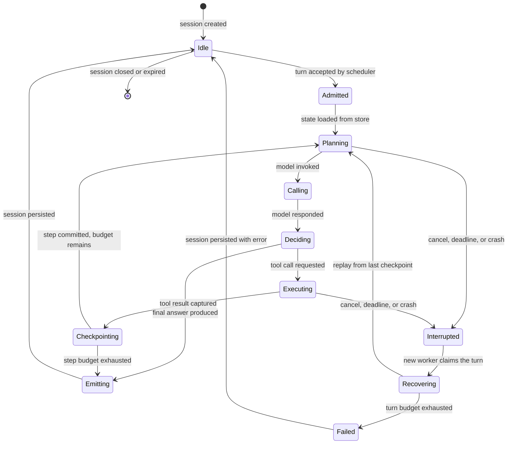
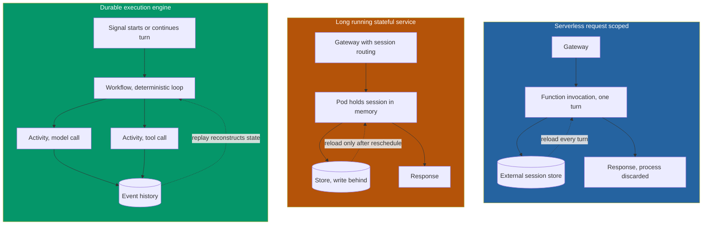
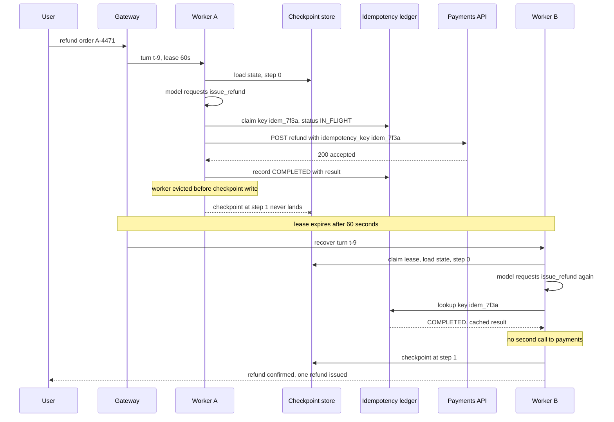
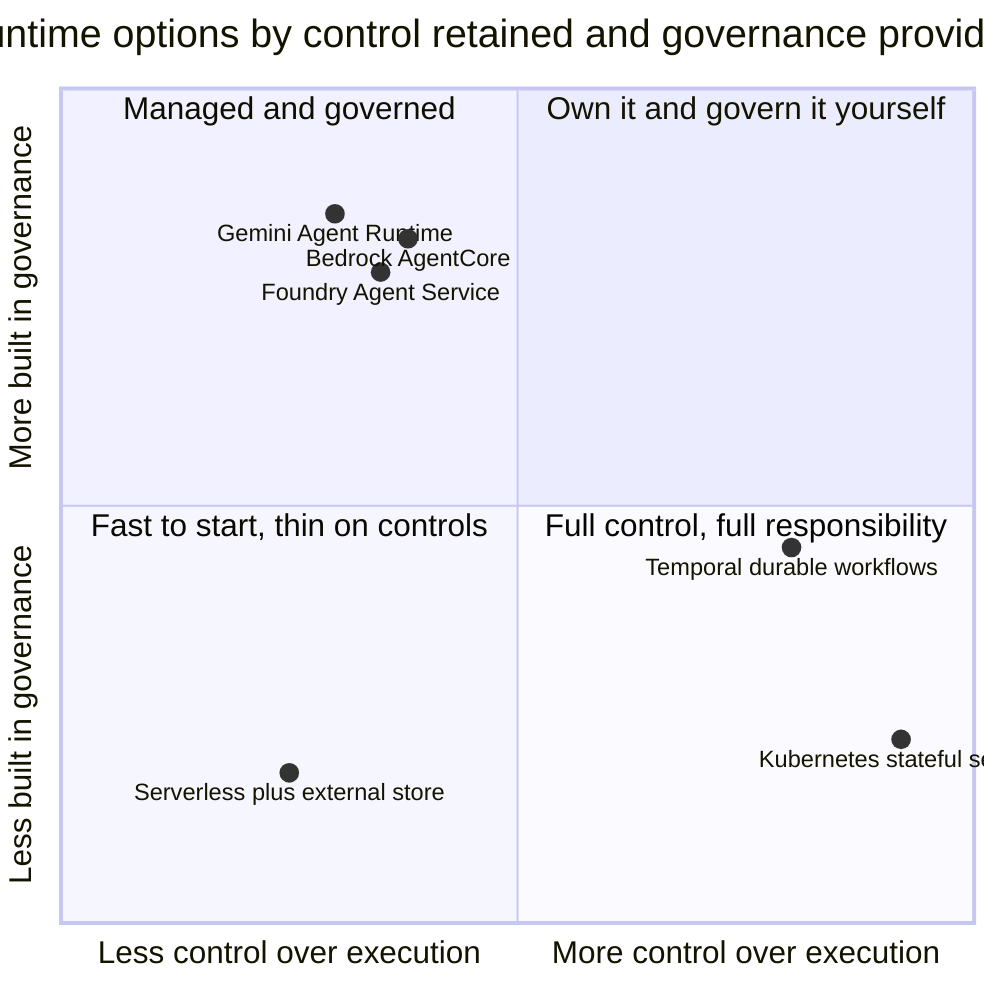

# The Agent Runtime: Sessions, State, and Where the Turn Loop Actually Executes

The incident report was four lines long, which is usually a sign that nobody understood what happened.

A document-review agent, deployed for the credit-risk team, had spent eleven minutes working through a loan file. It had pulled the borrower's filings, cross-referenced three internal systems, drafted a summary of covenant exceptions, and asked the analyst which fiscal year to treat as the baseline. The analyst answered. And the agent replied: *"Hello. I can help you review loan documents. Which file would you like to start with?"*

Eleven minutes of work, gone. Not corrupted. Not partially recovered. Gone, with no trace in the application logs, because from the application's point of view nothing had failed. A request arrived, a fresh conversation began, a greeting was returned. Status 200.

What happened is visible only one layer down. During a routine node pool upgrade, Kubernetes had drained the node holding the pod that owned that conversation. The pod received `SIGTERM`, finished its in-flight request, and exited cleanly inside the grace period. Every dashboard stayed green. The replacement pod came up elsewhere, the service picked it up, and the analyst's next message landed there. The new pod had never heard of this analyst, this loan file, or those eleven minutes. Its conversation store was a Python dictionary keyed by session ID, initialized empty at process start.

Somebody had written `sessions: dict[str, list[Message]] = {}` and shipped it, and everyone who reviewed the code read past that line as though it were boilerplate.

That is the subject of this post. Not the framework. Not the prompt. The **runtime** — the thing that executes the turn loop, holds the session between turns, and decides what survives when the machine underneath it goes away.

This is part two of *The Agent Platform*. [Part one](https://juanlara18.github.io/portfolio/#/blog/agent-platform-control-plane-data-plane) drew the line between the control plane, which decides what an agent is allowed to be, and the data plane, which executes it. The runtime is the load-bearing beam of that data plane, and it is the component teams spend the least time choosing and the most time regretting.

---

## What a Runtime Actually Does

Let's be precise, because "runtime" gets used to mean everything from a Docker image to a cloud product SKU.

A **framework** gives you abstractions for composing agent behavior: nodes, edges, typed state, handoffs. LangGraph and the Agent Development Kit are frameworks. A **harness** is a program that runs an agent for a user — Claude Code, Codex, an internal Slack bot. I spent a whole post on [when to build, fork, or adopt one](https://juanlara18.github.io/portfolio/#/blog/agent-harness-build-fork-adopt-yc-qm).

A **runtime** is the execution substrate underneath both. It answers a narrower and more physical set of questions: on what machine does the loop iterate, what happens to its state between iterations, what happens when the machine dies mid-iteration, and how do a thousand concurrent loops share one finite pool of model tokens.

Strip an agent down and the loop is genuinely small:

1. Receive input.
2. Ask the model what to do.
3. If it asked for a tool, execute the tool.
4. Fold the result back into context.
5. Repeat until the model answers, a budget is exhausted, or something goes wrong.
6. Emit the output and persist the state.

That is fifty lines of Python. What makes a runtime a runtime is not the loop; it is the set of guarantees wrapped around it. There are six that matter, and they compose into the actual contract:

**Durability.** If the process running step 4 dies, step 5 must still be reachable. The state that existed at the end of step 3 must be recoverable from somewhere other than that process's heap. This is the guarantee the credit-risk agent lacked, and it is the one most often assumed rather than implemented.

**Idempotency on retry.** Steps 3 and 5 have side effects. If the runtime retries a turn after a partial failure, it must not re-execute a tool call that already succeeded. "Retry the turn" and "issue the payment twice" must not be the same instruction.

**Cancellation.** A user closes the tab. A supervisor kills a subagent. A budget guard trips. The runtime needs a path from "stop" to actually stopping — including the tool that is currently mid-flight, and including the locks and reservations the turn was holding.

**Timeouts, at three different scales.** The per-model-call timeout, which is a network concern. The per-tool timeout, which is a dependency concern. And the per-turn deadline, which is a product concern — the point at which the agent should give the user *something* rather than keep grinding. Different numbers, different owners, and teams routinely configure only the first.

**Bounded iteration.** Without a hard cap on loop iterations, a model stuck in a tool-call cycle will burn your quota until someone notices. Every production agent needs a `max_steps`, and the interesting question is what happens when it trips: a hard error, or a forced summarization turn that at least tells the user where it got to.

**Observable progress.** Not tracing for its own sake — progress specifically. A turn that has been running for four minutes is either working or wedged, and the runtime is the only component positioned to know which.

Here is the lifecycle those guarantees describe. Notice how much of it is not the happy path.



Two things there are worth dwelling on. `Checkpointing` sits between every tool execution and the next planning step — not an occasional operation, part of the loop. And `Recovering` re-enters at `Planning`, not at `Admitted`. Recovery is not "run the turn again." It is "resume the turn from where it stopped," and the difference between those two sentences is most of this post.

---

## State Is the Whole Problem

Here is the uncomfortable structural fact: **an agent session is a long-lived stateful object, and every layer of modern cloud infrastructure has spent fifteen years optimizing for the opposite.**

Horizontal autoscaling assumes instances are interchangeable. Rolling deployments assume you can kill any pod. Load balancers assume requests are independent. Spot instances assume workloads tolerate eviction. Serverless assumes execution is request-scoped. Every one of those assumptions is excellent, and every one is false for a conversation that has been running for forty minutes and holds a partially-built plan.

You do not get to opt out of this tension. You only get to decide where you pay for it.

### What must actually be persisted

Teams usually persist the message list and call it done. The message list is the smallest and least interesting part of agent state. The full inventory:

| State element | What it is | Why losing it hurts |
|---|---|---|
| **Conversation** | Ordered user, assistant, and system messages | The obvious one. Losing it means the agent forgets the user |
| **Tool call ledger** | Every tool invocation, its arguments, its result, its status | Losing it means you cannot tell whether a side effect already happened |
| **Scratchpad** | Intermediate reasoning, extracted entities, working notes | Losing it means re-deriving work the model already paid for |
| **Plan** | The current decomposition of the task and which steps are done | Losing it means an autonomous agent restarts a six-hour job |
| **Budgets** | Tokens spent, steps taken, wall-clock consumed, dollars burned | Losing it means budgets reset on every crash, so they bound nothing |
| **Cursor** | Where in the loop the turn currently is | Losing it means you can only restart, never resume |
| **External handles** | Sandbox IDs, file handles, open transactions, reservation tokens | Losing it means orphaned resources you pay for and never reclaim |

The last two rows are what separate a runtime from a chat backend. A chat backend persists the conversation. A runtime persists the *cursor* and the *handles*, because a runtime has to be able to pick a turn back up.

### Checkpointing granularity

Once you accept that state must live outside the process, the next question is how often you write it. This is a genuine trade-off, not a best practice with one right answer.

Write too rarely and your recovery point objective is bad: crash at step 9 with a checkpoint from step 2 and you re-execute seven steps, which for an agent means re-paying for seven model calls and re-running seven tool invocations, some of which had side effects. Write too often and you have added a synchronous database round-trip to the inside of your hot loop.

The three defensible granularities:

**Per turn.** Persist once when the turn ends. Simple, fast, appropriate when turns are short and tools are read-only. Recovery means re-running the whole turn. This is where almost every team starts and where many should stay.

**Per step.** Persist after every model call and every tool result. This is the granularity that makes resumption meaningful, because the cursor is always at most one step stale. It is the right default for anything long-running or side-effecting.

**Per step, with intra-step writes.** Persist the outputs of individual parallel branches as they complete, before the step as a whole commits. LangGraph does exactly this, and it is the detail most people miss in the persistence docs. LangGraph checkpoints at *super-step* boundaries — a super-step being one tick of the graph in which all scheduled nodes run, possibly in parallel — but as each node finishes, its output is written separately as a pending write linked to the still-in-progress checkpoint. When one node in a parallel fan-out fails, the resume path skips the nodes that already succeeded. If your fan-out is three expensive retrieval calls and one times out, that is the difference between paying once and paying twice.

LangGraph exposes the trade-off directly as a durability setting with three values: `"exit"` writes only when the graph finishes, `"async"` writes concurrently with the next step, and `"sync"` writes before proceeding. Those are exactly the three points on the curve — throughput, a small crash-during-write window, and full durability — and it is worth noticing that the framework refuses to pick for you.

### Making it concrete

Here is a checkpointer with the properties I would actually defend in review. It is deliberately not tied to a framework, because the shape is what matters.

```python
from __future__ import annotations

import json
import time
import uuid
from dataclasses import dataclass, field, asdict
from typing import Any, Protocol


@dataclass
class TurnState:
    """Everything needed to resume a turn on a different machine.

    This is the contract. If a field is not in here, it does not survive
    a pod reschedule, no matter how carefully the code manages it in memory.
    """

    session_id: str
    turn_id: str
    step: int                                  # the cursor
    messages: list[dict[str, Any]]             # conversation
    tool_ledger: list[dict[str, Any]]          # every call, its key, its status
    scratchpad: dict[str, Any] = field(default_factory=dict)
    plan: list[dict[str, Any]] = field(default_factory=list)
    tokens_spent: int = 0
    steps_taken: int = 0
    deadline_epoch: float = 0.0
    handles: dict[str, str] = field(default_factory=dict)  # sandbox, file, txn ids
    status: str = "running"                    # running, done, failed, cancelled


class Checkpointer(Protocol):
    def save(self, state: TurnState, *, expected_step: int) -> None: ...
    def load(self, session_id: str, turn_id: str) -> TurnState | None: ...
    def claim(self, session_id: str, turn_id: str, worker_id: str,
              lease_seconds: int) -> bool: ...


class PostgresCheckpointer:
    """Append-only checkpoints with optimistic concurrency and worker leases.

    Two properties do the real work here:

    1. `expected_step` makes the write a compare-and-set. Two workers that
       both believe they own the turn cannot both advance it; the loser gets
       a StaleCheckpoint and stops. This is what prevents a network partition
       from producing two divergent copies of the same conversation.

    2. Checkpoints are INSERTs, never UPDATEs. The history of a turn is the
       audit trail, and it is also what makes time-travel debugging possible.
    """

    def __init__(self, pool) -> None:
        self._pool = pool

    def save(self, state: TurnState, *, expected_step: int) -> None:
        with self._pool.connection() as conn, conn.transaction():
            row = conn.execute(
                "SELECT step FROM turn_checkpoints "
                "WHERE session_id = %s AND turn_id = %s "
                "ORDER BY step DESC LIMIT 1 FOR UPDATE",
                (state.session_id, state.turn_id),
            ).fetchone()
            current = row[0] if row else -1
            if current != expected_step:
                raise StaleCheckpoint(
                    f"turn {state.turn_id} is at step {current}, "
                    f"this worker believed it was at {expected_step}"
                )
            conn.execute(
                "INSERT INTO turn_checkpoints "
                "(session_id, turn_id, step, payload, written_at) "
                "VALUES (%s, %s, %s, %s, now())",
                (state.session_id, state.turn_id, state.step,
                 json.dumps(asdict(state))),
            )

    def load(self, session_id: str, turn_id: str) -> TurnState | None:
        with self._pool.connection() as conn:
            row = conn.execute(
                "SELECT payload FROM turn_checkpoints "
                "WHERE session_id = %s AND turn_id = %s "
                "ORDER BY step DESC LIMIT 1",
                (session_id, turn_id),
            ).fetchone()
        return TurnState(**json.loads(row[0])) if row else None

    def claim(self, session_id: str, turn_id: str, worker_id: str,
              lease_seconds: int) -> bool:
        """Take ownership of a turn whose previous owner died.

        The lease is what makes recovery safe without a consensus protocol.
        A worker may only advance a turn it currently holds a live lease on,
        and leases expire, so a crashed worker's turn becomes claimable
        without anyone having to detect the crash explicitly.
        """
        with self._pool.connection() as conn, conn.transaction():
            updated = conn.execute(
                "UPDATE turn_leases SET worker_id = %s, "
                "expires_at = now() + make_interval(secs => %s) "
                "WHERE session_id = %s AND turn_id = %s "
                "AND (expires_at < now() OR worker_id = %s)",
                (worker_id, lease_seconds, session_id, turn_id, worker_id),
            ).rowcount
        return updated == 1


class StaleCheckpoint(RuntimeError):
    """Another worker advanced this turn. Stop immediately, do not retry."""
```

The lease is the piece teams skip, and it is the piece that turns "we store state in Postgres" into an actual runtime. Without it, recovery is a race: a pod that is slow rather than dead wakes up, finishes its tool call, and writes a checkpoint on top of the turn a healthy worker has already advanced. With a lease and a compare-and-set on `step`, the zombie worker's write fails loudly and it exits. That is a much better failure than a conversation that quietly forks.

---

## Three Execution Topologies

Now the actual architectural decision. There are three shapes a turn loop can take, and they differ less in capability than in *which hard problem you inherit*.



### Serverless, request-scoped

One turn equals one function invocation. Load state at the top, save it at the bottom, discard the process.

The appeal is real. You scale to zero, which matters enormously for the long tail of internal agents used nine times a week. You pay per turn. You inherit the platform's availability. And the topology *forces* discipline: because the process definitively dies after every turn, you cannot accidentally depend on in-process state. Correctness by construction is a rare gift.

The costs are equally real. Every turn reloads the full session — for a long conversation with a large scratchpad, a fixed latency and bandwidth tax paid on every interaction. Cold starts land on user-visible latency at exactly the wrong moments. Long turns fight the platform's execution ceiling, and agents produce long turns routinely; a fifteen-step research loop with three slow tool calls is not exotic. And crucially, mid-turn recovery is generally not available: if the invocation dies at step 7, the platform retries from step 0, which brings us straight to the idempotency section below.

Choose this when turns are short and mostly read-only, traffic is bursty or sparse, and the agent is conversational rather than autonomous.

### Long-running stateful service

Pods on Kubernetes that hold sessions in memory and treat the store as a write-behind cache.

The appeal is control. You own the memory model, so you keep hot session state resident and skip the reload tax. You own the concurrency model, so you implement your own fairness. You can hold warm connections, warm sandboxes, warm caches. Latency is the best of the three by a wide margin.

The cost is that you have signed up to own scheduling. Not "configure autoscaling" — *own* it. Sessions are sticky, which means load is not evenly distributable, which means a horizontal pod autoscaler driven by CPU will make decisions that are wrong for you. Scale-down evicts sessions. Rolling deploys evict sessions. Node upgrades evict sessions. Spot reclamation evicts sessions. Every one of those is a routine, healthy cluster operation, and every one is a session-loss event unless you have built the drain path.

The drain path is the whole game and it is more work than it sounds. On `SIGTERM` you must stop accepting new turns, finish or checkpoint in-flight turns, flush state, and release leases — all inside `terminationGracePeriodSeconds`, which defaults to thirty and is frequently not enough for an agent mid-tool-call. If your `preStop` hook does not exist, your graceful shutdown is a coin flip.

Choose this when latency is a first-class product requirement, when you need warm per-session resources, or when you already operate a mature Kubernetes platform and this is marginal rather than novel work.

### Durable execution

The turn loop written as a replayable workflow. Temporal is the canonical implementation; Azure's Durable Functions occupy adjacent territory.

The model is event sourcing applied to control flow. Your orchestration code — the loop, the conditionals, the sequencing — lives in a *workflow*, which must be deterministic. Everything non-deterministic and side-effecting — model calls, tool invocations, HTTP requests — lives in *activities*, whose results are recorded in an event history. When a worker dies, a new one replays the workflow code against that history: the loop re-executes, but every activity result is served from history rather than re-invoked. The agent does not re-ask the model for a decision it already made.

This solves resumption more elegantly than anything else on offer, and it throws in several things you would otherwise hand-build: durable timers that survive restarts, workflows that wait days for a human approval without holding a process open, automatic activity retries with backoff, and a queryable execution history that doubles as an audit log.

The cost is that determinism constrains how you write code. No `datetime.now()` in the workflow. No `random`. No direct I/O. No iterating a dictionary whose order might differ between runs. Changing workflow code while workflows are in flight requires versioning discipline, because a replay against new code that branches differently is a non-determinism error. Teams new to this hit that wall around week three.

One subtlety deserves stating plainly, because it is why people wrongly rule this out: **the model's output is nondeterministic, but it is not re-generated on replay.** The decision the model made is a recorded activity result, and replay is deterministic *given* that history. The nondeterminism is quarantined on the activity side of the boundary, which is exactly where the design puts it.

Choose this when turns are long, when tools have side effects that must not double-fire, when human-in-the-loop pauses last hours or days, or when you need an execution history that satisfies an auditor.

### The comparison, honestly

| Dimension | Serverless request-scoped | Stateful service on Kubernetes | Durable execution |
|---|---|---|---|
| Where the loop runs | A fresh process per turn | A long-lived pod | A worker replaying a workflow |
| State between turns | Fully external, reloaded | In memory, backed by a store | Event history, replayed |
| Mid-turn recovery | Usually restart from zero | Whatever you built | Native, from last activity |
| Cost at low traffic | Near zero | You pay for idle pods | You pay for workers and the cluster |
| Tail latency | Cold starts plus reload | Best | Replay adds overhead on recovery |
| Long turns | Fights the platform ceiling | Fine | The design target |
| Human-in-the-loop pauses | Awkward, needs external wakeup | Needs a parking mechanism | Native, durable timers |
| Constraint on your code | Keep turns short | Build the drain path | Determinism in workflow code |
| What you inherit as a problem | Session affinity and reload cost | Scheduling and eviction | Determinism and versioning |
| Operational surface | Smallest | Largest | Medium, plus a new system to run |

Read those last two rows together. The choice is not "which is best" — it is "which of these three problems does my team already know how to solve." A team with deep Kubernetes muscle will make option two work and find option three alien. A team already running Temporal for order fulfillment will find option three obvious. There is no topology-independent right answer, and vendors who tell you otherwise are selling.

---

## The Session Affinity Trap

The failure at the top of this post has a name, and it recurs in a dozen disguises.

Naive agent services break because they *accidentally* depend on session affinity while *appearing* to be stateless. The code looks like a normal request handler. It passes review. It works in development, where there is one process. It works in staging, where there is one replica. It works in production for two weeks, until someone scales to three replicas or a node gets drained — and then it produces a bug that is nearly impossible to reproduce: intermittent amnesia, correlated with deploys, affecting a fraction of users, invisible in error rates.

The mechanism is always the same. Turn one lands on instance A, which builds state in memory. Turn two lands on instance B, which has none and starts over. If you are lucky, the user complains. If you are unlucky, the agent has *partial* state — a message list loaded from a store, but no tool ledger — and silently repeats a side effect it already performed.

The instinctive fix is to make the affinity real: sticky sessions at the load balancer, consistent hashing on session ID, a `StatefulSet` with stable network identity. This works, and it is a trap, because it converts a correctness bug into an availability coupling. Now the loss of one pod is the loss of every session pinned to it. Now you cannot scale down without dropping conversations. Now a rolling deploy is a scheduled outage for a subset of users. You have taken the problem and made it harder to see.

The correct fix inverts the relationship:

> **Instance memory is a cache. The store is the truth. Every turn must be servable by any instance, from the store alone.**

Affinity then becomes a *performance optimization* rather than a correctness requirement. Route to the instance that has the session warm, because that is faster. If that instance is gone, any other instance reloads from the store and continues, and the user notices nothing except a slightly slower turn.

It is instructive that the managed runtimes converged on exactly this. AWS Bedrock AgentCore routes requests to the same microVM using a session header — `X-Amzn-Bedrock-AgentCore-Runtime-Session-Id` for HTTP and A2A, `Mcp-Session-Id` for MCP — and the documentation is explicit that without a consistent session ID, requests may land on a new microVM and pay a cold start. That is affinity framed as latency, not correctness. AgentCore is equally explicit that the microVM's own filesystem and memory are ephemeral: anything that must outlive the compute goes to configured session storage or to AgentCore Memory. Stickiness makes it fast; the external store makes it correct.

The implementation discipline is a single rule you can enforce in code review:

```python
class SessionCache:
    """Instance-local cache with a store fallback. Never a source of truth.

    The invariant: `get` is total. It always returns usable state, from memory
    when warm and from the store when cold. A caller cannot distinguish a warm
    instance from a cold one except by latency, so correctness never depends
    on routing, and eviction can never lose data.
    """

    def __init__(self, checkpointer: Checkpointer, max_entries: int = 512) -> None:
        self._checkpointer = checkpointer
        self._hot: dict[tuple[str, str], TurnState] = {}
        self._max_entries = max_entries

    def get(self, session_id: str, turn_id: str) -> TurnState:
        key = (session_id, turn_id)
        cached = self._hot.get(key)
        if cached is not None:
            return cached

        # Cold path. Not an error condition; it is Tuesday.
        loaded = self._checkpointer.load(session_id, turn_id)
        if loaded is None:
            raise UnknownTurn(f"{session_id}/{turn_id} has no checkpoint")
        self.put(loaded)
        return loaded

    def put(self, state: TurnState) -> None:
        if len(self._hot) >= self._max_entries:
            self._hot.pop(next(iter(self._hot)), None)
        self._hot[(state.session_id, state.turn_id)] = state


class UnknownTurn(KeyError):
    pass
```

There is a test that proves you got this right, and it belongs in CI:

```python
def test_turn_is_servable_by_a_cold_instance(checkpointer, agent_factory):
    """Simulate a pod reschedule between turn two and turn three."""
    hot = agent_factory(SessionCache(checkpointer))
    session = hot.start_session(user_id="analyst-7")
    hot.run_turn(session, "Review the covenant section of loan 8841.")
    hot.run_turn(session, "Use fiscal year 2027 as the baseline.")

    # A brand new instance with an empty cache. Nothing is shared.
    cold = agent_factory(SessionCache(checkpointer))
    reply = cold.run_turn(session, "What did you conclude about clause 4b?")

    assert "8841" in reply.grounding_ids
    assert reply.turn_index == 3
    assert "fiscal year 2027" in reply.assumptions
```

If that test does not exist, you do not know whether your agent survives a deploy. And "we haven't seen the problem in production" is not evidence, because the problem's signature is a user shrugging and retyping their question.

---

## Idempotency, Retries, and the Double-Charged Customer

Now the failure mode that turns an annoying bug into an incident with a regulator on the call.

An agent is halfway through a turn. It has called `issue_refund(order_id="A-4471", amount=249.00)`. The payments API processed it and returned 200. Before the runtime could checkpoint that result, the worker was evicted. The platform, doing exactly what it is designed to do, retries the turn. The replayed loop reaches the same decision point, calls `issue_refund` with the same arguments, and the customer receives $498.

Nothing malfunctioned. The retry was correct, the tool was correct, the model was consistent. The system was wrong because nobody told the runtime that `issue_refund` is not a function you may call twice.

I wrote about this at length in [The Grid Doesn't Care About Your Retry Loop](https://juanlara18.github.io/portfolio/#/blog/senior-infrastructure-distributed-systems-failure-networking), where the failure mode is retry storms and the fix is idempotency. Agent runtimes make it harder for three reasons. The retry decision is often made by infrastructure you do not control. The "request" being retried is a *loop*, not a call, so a naive retry re-executes an unbounded number of side effects. And worst: the model may not reproduce the same tool call on replay, so you cannot rely on positional matching to detect duplicates.

### Safe and unsafe tools are different objects

The foundational move is to stop treating tools as a uniform category. A runtime must know, structurally, which tools it may re-execute freely.

| Class | Definition | Retry behavior | Examples |
|---|---|---|---|
| **Safe** | No observable side effect. Re-execution is free apart from cost | Retry freely | Search, read a document, query a warehouse, compute |
| **Idempotent-by-key** | Has a side effect, but accepts a caller-supplied key that collapses duplicates | Retry with the same key | Payment APIs with idempotency keys, upserts, `PUT` |
| **Naturally idempotent** | Side effect, but re-application converges to the same state | Retry freely | Set a status to `approved`, write a file with fixed content |
| **Unsafe** | Side effect that compounds on repetition, with no dedup mechanism | Never auto-retry. Escalate | Send an email, append to a ledger, POST to a partner API |

That fourth row is where the incidents live, and the honest answer for unsafe tools is not "retry more carefully." It is: **the runtime must not retry them at all.** It must record that a call was attempted with unknown outcome and surface that to a human or a reconciliation process. An agent runtime that silently retries an unsafe tool is a machine for generating duplicate side effects, and the fact that it does so rarely is what makes it dangerous.

### The dedup ledger

The mechanism is a claim-before-execute ledger keyed on something stable — and "stable" is the subtle part, because a monotonically increasing step counter is not stable across a replay in which the model made a different choice.

```python
import hashlib
import json
from enum import Enum


class ToolSafety(Enum):
    SAFE = "safe"                       # no side effect
    IDEMPOTENT_BY_KEY = "keyed"         # dedups if we pass a key
    NATURALLY_IDEMPOTENT = "convergent" # re-application is a no-op
    UNSAFE = "unsafe"                   # never auto-retry


def idempotency_key(session_id: str, turn_id: str,
                    tool: str, args: dict) -> str:
    """Derive a key from intent, not from position in the loop.

    Deliberately excludes the step index. On replay, the model may reach the
    same decision at a different step, and a position-derived key would treat
    the same intended action as a new one. Hashing the canonical arguments
    means 'refund A-4471 for 249.00' has one key regardless of when it is
    reached, which is precisely the property we need.

    The trade-off is explicit: a genuine second refund of the same amount for
    the same order will be suppressed. For unsafe financial operations that
    is the correct bias, and where it is not, the caller passes an explicit
    disambiguator in `args`.
    """
    canonical = json.dumps(args, sort_keys=True, separators=(",", ":"))
    digest = hashlib.sha256(
        f"{session_id}|{turn_id}|{tool}|{canonical}".encode()
    ).hexdigest()
    return f"idem_{digest[:32]}"


class IdempotentDispatcher:
    """Claim, execute, record. In that order, always.

    The ordering is the whole design. Claiming before execution means a crash
    between claim and completion leaves a visible IN_FLIGHT row, which is an
    honest statement of 'we do not know whether this happened' rather than a
    silent gap that a retry will paper over.
    """

    def __init__(self, ledger, registry, clock) -> None:
        self._ledger = ledger        # durable, transactional
        self._registry = registry    # tool name -> ToolSafety, callable
        self._clock = clock

    def call(self, state: TurnState, tool: str, args: dict) -> dict:
        spec = self._registry[tool]
        key = idempotency_key(state.session_id, state.turn_id, tool, args)

        if spec.safety is ToolSafety.SAFE:
            return spec.fn(**args)   # no ledger, no claim, no cost beyond tokens

        prior = self._ledger.lookup(key)
        if prior is not None:
            if prior.status == "COMPLETED":
                # The canonical replay case: it already happened. Return the
                # recorded result so the loop proceeds identically.
                return prior.result
            if prior.status == "IN_FLIGHT":
                # Someone claimed this and did not finish. Whether the side
                # effect landed is genuinely unknown.
                if spec.safety is ToolSafety.UNSAFE:
                    raise NeedsReconciliation(
                        f"{tool} key={key} was claimed at {prior.claimed_at} "
                        f"with no recorded outcome. Human review required."
                    )
                # Convergent or keyed tools may be safely re-driven.
            if prior.status == "FAILED" and not spec.retryable:
                raise ToolFailedPermanently(prior.error)

        self._ledger.claim(key, tool=tool, args=args, at=self._clock.now())
        try:
            if spec.safety is ToolSafety.IDEMPOTENT_BY_KEY:
                # Push the key down to the dependency so its own dedup
                # window protects us even if our ledger write is lost.
                result = spec.fn(**args, idempotency_key=key)
            else:
                result = spec.fn(**args)
        except Exception as exc:
            self._ledger.record_failure(key, error=repr(exc))
            raise
        self._ledger.record_success(key, result=result)
        state.tool_ledger.append(
            {"key": key, "tool": tool, "status": "COMPLETED"}
        )
        return result


class NeedsReconciliation(RuntimeError):
    """The runtime does not know whether a side effect occurred. Say so."""


class ToolFailedPermanently(RuntimeError):
    pass
```

Two design choices there are worth defending explicitly.

**Pushing the key down.** When the dependency supports idempotency keys, pass yours. Now there are two independent dedup layers. If your ledger write is lost in exactly the wrong microsecond, their dedup window still catches the duplicate.

**Refusing to guess.** `NeedsReconciliation` is the most important line in the module. Every runtime eventually reaches a state where it cannot know whether a side effect landed. The mature response is to say so loudly and stop, not to pick the option that produces fewer alerts. A duplicate refund is worse than a stuck turn, and a system that never surfaces uncertainty is a system that resolves uncertainty by guessing.

Here is recovery end to end — the picture I would draw to explain why the ledger has to be durable and transactional:



Notice where the durability boundary sits. The checkpoint was lost; the ledger entry was not. That asymmetry is intentional and it is the reason the ledger must be a separate, synchronously-written, transactional store rather than a field inside the checkpoint payload. If both live in the same write, both are lost together and the whole mechanism evaporates at exactly the moment you need it.

---

## Concurrency, Quota, and Per-Tenant Fairness

The last runtime concern only appears at scale, and then appears all at once.

You have one model quota. You have many sessions. They do not have equal claim on the quota, they do not consume it evenly, and one of them is about to try to consume all of it.

The pathology is **head-of-line blocking with a very long head**. In a conventional web service, a slow request occupies a worker for perhaps two seconds. In an agent runtime, a single autonomous turn can occupy a worker for twenty minutes and issue two hundred model calls. If your concurrency model is a fixed worker pool and your queue is FIFO, one tenant kicking off five long research jobs starves every interactive user behind them. Latency for everyone else goes from two seconds to twenty minutes, while your dashboard shows healthy CPU, healthy error rates, and a queue-depth graph nobody has an alert on.

Three mechanisms address this, and you need all three.

**Separate the classes.** Interactive turns and batch turns should not share a queue. This is the highest-leverage change available and it is mostly a routing decision. An interactive turn has a human waiting and a deadline measured in seconds; a background research job has neither. Separate pools with separate concurrency limits mean a batch surge degrades batch latency, which is the correct blast radius.

**Make quota a first-class reservation.** Token quota is a shared, replenishing resource, and the runtime should treat it the way a database treats connections: acquired before work begins, released after, admission refused when unavailable. The detail specific to agents is that you reserve against an *estimate* — you do not know how many tokens a turn will consume until it is over. Reserve a bound, reconcile after, and treat consistent underestimation as a bug.

**Enforce fairness across tenants, not across requests.** Round-robin over requests is not fairness when one tenant submits a hundred times as many. You want weighted fair queuing over tenants, where each tenant's share is proportional to its weight and independent of how many turns it has queued.

```python
import heapq
import threading
from dataclasses import dataclass, field


@dataclass(order=True)
class _Entry:
    virtual_finish: float
    seq: int
    tenant: str = field(compare=False)
    turn: object = field(compare=False)


class FairTurnScheduler:
    """Weighted fair queuing over tenants, with a token-quota admission gate.

    Virtual-time fair queuing: each queued turn is stamped with a virtual
    finish time computed from its tenant's accumulated service divided by
    the tenant's weight. Dequeuing the minimum stamp means a tenant that has
    consumed more than its share waits behind one that has consumed less,
    regardless of queue depth. A tenant that floods the queue delays only
    itself.
    """

    def __init__(self, weights: dict[str, float], quota_tokens_per_min: int,
                 max_in_flight: int) -> None:
        self._weights = weights
        self._heap: list[_Entry] = []
        self._virtual_now = 0.0
        self._service: dict[str, float] = {}
        self._seq = 0
        self._lock = threading.Lock()
        self._quota = TokenBucket(rate_per_sec=quota_tokens_per_min / 60.0,
                                  capacity=quota_tokens_per_min)
        self._slots = threading.BoundedSemaphore(max_in_flight)

    def submit(self, tenant: str, turn, estimated_tokens: int) -> None:
        with self._lock:
            weight = self._weights.get(tenant, 1.0)
            consumed = max(self._service.get(tenant, 0.0), self._virtual_now)
            finish = consumed + estimated_tokens / weight
            self._service[tenant] = finish
            self._seq += 1
            heapq.heappush(
                self._heap, _Entry(finish, self._seq, tenant, turn)
            )

    def next_turn(self, timeout: float) -> object | None:
        """Admit the fairest eligible turn, or None if quota is unavailable.

        Order matters: take the concurrency slot first, then quota. Reversing
        it lets a turn hold scarce tokens while waiting for a worker slot,
        which is how you build a deadlock that only appears under load.
        """
        if not self._slots.acquire(timeout=timeout):
            return None
        with self._lock:
            if not self._heap:
                self._slots.release()
                return None
            entry = self._heap[0]

        if not self._quota.try_consume(entry.turn.estimated_tokens,
                                       timeout=timeout):
            self._slots.release()
            return None                    # backpressure, not failure

        with self._lock:
            entry = heapq.heappop(self._heap)
            self._virtual_now = entry.virtual_finish
        return entry.turn

    def complete(self, tenant: str, actual_tokens: int,
                 estimated_tokens: int) -> None:
        """Reconcile the estimate. Persistent skew means bad admission control."""
        self._quota.settle(actual_tokens - estimated_tokens)
        with self._lock:
            weight = self._weights.get(tenant, 1.0)
            self._service[tenant] += (actual_tokens - estimated_tokens) / weight
        self._slots.release()
```

Three operational notes that are not obvious from the code.

Returning `None` from `next_turn` is **backpressure**, not an error. It should propagate to the caller as a queued state with an honest estimate, not as a 500 and not as a silent retry. An agent platform that converts quota exhaustion into client retries has built a retry-storm generator, and you will discover this during your first traffic spike.

The `complete` reconciliation is the piece teams omit. If estimates run consistently low, admission control is systematically over-admitting and your quota protection is decorative. Track actual-to-estimated tokens per tenant as a first-class metric.

And per-turn deadlines must be enforced by the scheduler, not just by the loop. A turn whose deadline expires while queued should be rejected at admission rather than admitted, executed for four minutes, and then discarded. Executing work whose result nobody will read is the purest form of waste in this system.

---

## The Managed Runtimes

Between October 2025 and the first quarter of 2026, all three hyperscalers shipped enterprise-grade managed agent runtimes. "Managed runtime" covers a wide range of ambition, so it is worth being specific about what each provides.

**Amazon Bedrock AgentCore** went generally available on **October 13, 2025**, after a July preview. Its Runtime is the most explicitly opinionated of the three about isolation: every user session gets a dedicated microVM with isolated CPU, memory, and filesystem, and when the session ends the microVM is terminated and its memory sanitized. Sessions run up to **eight hours** per compute lifecycle, with a default idle timeout of **fifteen minutes**, after which the session moves to `Stopped` and the compute is torn down — but the session itself remains valid and transitions back to `Active` on the next invocation with fresh compute. Session IDs are client-supplied and must be at least 33 characters, and AWS is explicit that it does not maintain the user-to-session mapping for you. Filesystem state is ephemeral unless you configure session storage; structured long-term state goes to AgentCore Memory. The GA covered Runtime, Memory, Gateway, Identity, and Observability. It is framework-agnostic by design — CrewAI, LangGraph, LlamaIndex, Google ADK, and the OpenAI Agents SDK — and model-agnostic, including models outside Bedrock.

**Google's offering** is the one that changed names. Vertex AI Agent Engine's sessions and Memory Bank moved to general availability, and in **April 2026** Google announced the **Gemini Enterprise Agent Platform**, absorbing Vertex AI, which is no longer delivered as a standalone service. Agent Runtime is a fully managed, deliberately opinionated substrate — no Dockerfile, source packaged and deployed — with **sub-second cold starts** and support for **long-running agents that run autonomously for days**. Sessions store conversation history as `SessionEvents` and support custom session IDs so you can map them to your own CRM or database records, plus bidirectional WebSocket streaming. Memory Bank uses Gemini to extract facts and preferences from session history and consolidate them, resolving contradictions as new information arrives. Every agent gets a unique cryptographic Agent Identity for auditability. Framework support is tiered: full integration for ADK, SDK-level for LangChain, LangGraph, AG2, and LlamaIndex, templates for CrewAI and custom frameworks. The observability story is unusually broad — visual tracing, multi-turn autoraters scoring live traffic, simulation against synthetic users, and an optimizer that clusters production failures into suggested instruction changes.

**Microsoft Foundry Agent Service** has the most complicated history. The classic Azure AI Foundry Agent Service reached GA in May 2025; those classic agents are now deprecated, with retirement scheduled for March 31, 2027. The rebuilt service was announced GA at Ignite in November 2025 and completed its rollout on **March 16, 2026**, adding private networking, Entra Agent Identity, and enterprise evaluations. Its runtime is wire-compatible with the OpenAI Responses API — a genuinely distinctive positioning choice, since code written against Responses runs on Foundry with minimal changes. The state model is threads, runs, and messages. Threads persist until explicitly deleted, hold up to **100,000 messages**, truncate automatically to fit the model context, and — crucially for regulated environments — are stored in **your own Azure Cosmos DB account** in the Standard setup. Runs expose an explicit status enum: `queued`, `in_progress`, `requires_action`, `completed`, `failed`, `cancelled`, `expired`. Networking at GA is aggressive: no public egress, VNet injection, private connectivity to MCP servers and data tools. Hosted agents — deploying Microsoft Agent Framework, LangGraph, CrewAI, or OpenAI Agents SDK code without managing containers — remain in public preview. For durability, Microsoft pairs Azure Durable Functions with the Agent Framework, which is durable execution by a different name.

| | Bedrock AgentCore | Gemini Enterprise Agent Platform | Microsoft Foundry Agent Service |
|---|---|---|---|
| **Enterprise GA** | October 13, 2025 | Sessions and Memory Bank GA; platform announced April 2026 | Ignite November 2025, completed March 16, 2026 |
| **Isolation model** | Dedicated microVM per session, sanitized on teardown | Managed runtime plus Agent Sandbox for code execution | Managed service, project-scoped |
| **Max turn duration** | 8 hours per compute lifecycle | Long-running agents, documented as days | Not published as a single figure |
| **Idle behavior** | 15 minute default, session resumable on new compute | Sub-second cold starts on the revamped runtime | Threads persist until deleted |
| **Session state** | Ephemeral microVM plus optional session storage | Sessions with `SessionEvents`, custom session IDs | Threads, up to 100,000 messages, auto-truncated |
| **Long-term memory** | AgentCore Memory | Memory Bank with Gemini-driven consolidation | Thread history plus your own retrieval |
| **State residency** | AWS-managed | Google-managed | Your Cosmos DB in Standard setup |
| **Identity** | AgentCore Identity, token vault, OAuth | Cryptographic Agent Identity per agent | Entra Agent Identity |
| **Framework support** | CrewAI, LangGraph, LlamaIndex, ADK, OpenAI SDK | ADK full, LangChain, LangGraph, AG2, LlamaIndex via SDK | Responses API wire-compatible; hosted agents in preview |
| **Observability** | CloudWatch dashboards and traces | Tracing, autoraters, simulation, optimizer | Azure Monitor Application Insights |
| **Distinctive strength** | Hardest isolation boundary | Deepest evaluation and memory tooling | State stays in your subscription |

### About lock-in

Be clear-eyed rather than cynical, because the lock-in profile differs by layer.

**Your agent code is the most portable layer.** All three explicitly support third-party frameworks. If you write LangGraph, you can plausibly move it — a meaningful improvement over the previous generation of managed AI services.

**Your session and memory data is the least portable layer.** Session events, extracted memories, and consolidated user profiles live in provider-specific structures with provider-specific extraction semantics. Google's Memory Bank uses Gemini to decide what is worth remembering and how to resolve contradictions; that curation is not a data format you can export and replay elsewhere with equivalent results. Microsoft's decision to put threads in your Cosmos DB is genuinely differentiated here, and if data residency or exit strategy is a board-level concern, it deserves weight.

**Your operational tooling sits in between.** Traces, evaluations, and dashboards are provider-specific but reconstructible. OpenTelemetry helps.

**The lock-in nobody prices is organizational.** Once your runbooks, incident taxonomy, capacity planning, and security review process are shaped around one provider's runtime, the migration cost is not in the code. It is in retraining everyone who operates the thing — invisible in an architecture review and dominant in a migration.

My own work is on GCP, and I will say plainly what that biases. It makes me fluent in ADK and Agent Engine ergonomics and correspondingly slower to appreciate what AgentCore's microVM boundary buys — which, on reflection, is the strongest isolation story of the three and the one I would want for agents executing untrusted code. Foundry's Cosmos DB residency answer is the one I have most often wished I could offer in a data-governance review. None of the three is behind; they are optimizing for different anxieties.



The empty top-right corner is not an oversight. Full control *and* full built-in governance is the combination that does not exist, because governance you did not build is governance somebody else's abstraction is enforcing. You get their controls or your control. Teams that insist on both end up building a governance layer on top of Kubernetes — a defensible choice, and a multi-quarter project, and precisely what part one called owning your control plane.

---

## Matching the Runtime to the Agent Pattern

Here is the rule of thumb I would actually give someone, compressed.

**If the agent executes model-generated code, choose the hardest isolation boundary available.** MicroVM-per-session or an equivalent sandbox. Not a container, not a subprocess, not a restricted Python interpreter. The threat model is arbitrary code from a probabilistic source, and the correct response is a hypervisor boundary. AgentCore's per-session microVM and Google's Agent Sandbox target this; a `StatefulSet` running `exec` does not.

**If the agent runs long and autonomously, choose durable execution.** Multi-hour jobs, multi-day workflows, approvals that pause for a weekend, plans with dozens of side-effecting steps. Temporal-style replay solves resumption in a way hand-rolled checkpointing approximates at ten times the effort and half the correctness. Pay the determinism tax.

**If governance dominates, choose the hyperscaler runtime you are already governed by.** When the binding constraint is data residency, audit retention, identity integration, or getting through a security review this quarter, the managed runtime that inherits your existing identity provider, network controls, and compliance posture will reach production faster than a better-architected system that must be certified from scratch. For a large share of enterprise agents this is the correct engineering answer, not a compromise.

**If the agent is conversational, short-turned, and internal, use the boring thing.** Serverless with an external session store. Cheap, scales to zero, correct by construction. Most internal agents live here and are badly served by ambitious infrastructure.

The failure mode to avoid is picking a runtime for the agent you hope to build in a year rather than the one you are shipping this quarter. Runtimes migrate more easily than they feel — the loop is portable, the state schema is portable, and the parts that are not portable are the parts you should be minimizing anyway.

---

## Prerequisites and Known Gotchas

Things I would want written on a whiteboard before this design review starts:

- **Your grace period is probably too short.** Kubernetes defaults `terminationGracePeriodSeconds` to 30. An agent mid-tool-call needs more, plus a `preStop` hook that stops admission before shutdown begins. Test the drain path by actually draining a node, not by reading the manifest.
- **Session ID generation is a security decision.** Guessable session IDs mean one user can address another user's session. AgentCore's 33-character minimum is a hint. Use real entropy, and authorize on every turn rather than treating possession of the ID as ownership.
- **Provisioning races return retryable errors.** AgentCore returns HTTP 409 `RetryableConflictException` when a second operation targets a session being provisioned or torn down. Handle it with short exponential backoff. Any runtime with per-session compute has an equivalent window.
- **`thread_id` has length limits.** LangGraph recommends keeping it under 255 characters to avoid PostgresSaver errors. If you compose IDs from tenant, user, and conversation identifiers, you will hit this.
- **Checkpoint size grows without bound.** A long session's payload includes the full message list and scratchpad. Serializing 400 KB on every step is a real cost. Store large tool results by reference, not inline.
- **Determinism errors surface late.** In durable execution, a workflow code change that alters control flow breaks in-flight workflows on replay, not at deploy time. Version workflows from the first deployment, not from the first incident.
- **"Managed" does not mean "your state is safe."** Every managed runtime distinguishes ephemeral session compute from durable memory. AgentCore is explicit that microVM disk and memory vanish at session end. Read that page before you assume persistence.

---

## The Least Glamorous Choice

I keep returning to that four-line incident report, because of what it reveals about how these decisions get made.

Nobody chose to lose that conversation. There was no design review where somebody argued that agent state should live in a process dictionary. There was a framework choice, made carefully over two weeks with a comparison matrix. There was a model choice, made carefully with an evaluation harness. And there was a runtime, which was not chosen at all — it was inherited from whatever deployment template the team already had, and the state model was whatever the tutorial's `main.py` did.

That is the pattern. The runtime gets decided by default, and defaults are how a system acquires properties nobody intended.

The decision is genuinely tractable once you ask the right question. Not "which framework" and not "which cloud," but: *where does the loop run, what survives when that place disappears, and who runs next when everyone wants to run at once.* Answer those three, write the answers down, and test them by killing something. The rest of the platform is easier than it looks once the runtime underneath it is honest about what it guarantees.

Part three goes one layer down: sandboxing, and what it actually costs to let a model run code.

## Going Deeper

**Books:**
- Kleppmann, M. (2017). *Designing Data-Intensive Applications.* O'Reilly.
  - The chapters on exactly-once semantics, idempotence, and fault-tolerant consensus are the theoretical backing for the checkpointing and idempotency sections. An agent runtime is a distributed system in a costume.
- Nygard, M. (2018). *Release It! Design and Deploy Production-Ready Software* (2nd ed.). Pragmatic Bookshelf.
  - Bulkheads, circuit breakers, and backpressure are the vocabulary the fairness section is written in. The stability patterns map onto turn scheduling with almost no translation.
- Burns, B., Beda, J., Hightower, K., & Evenson, L. (2022). *Kubernetes: Up and Running* (3rd ed.). O'Reilly.
  - Read the material on pod lifecycle, graceful termination, and StatefulSets with the session-affinity trap in mind. The drain path is where stateful agent services live or die.
- Beyer, B., Jones, C., Petoff, J., & Murphy, N. R. (2016). *Site Reliability Engineering.* O'Reilly.
  - The chapters on handling overload and cascading failures are the operational counterpart to the quota and admission-control section, and are free to read online.

**Online Resources:**
- [Use isolated sessions for agents](https://docs.aws.amazon.com/bedrock-agentcore/latest/devguide/runtime-sessions.html) — AWS's AgentCore Runtime session documentation. The clearest published statement of a per-session microVM model, including lifecycle states, timeouts, and the session-header stickiness contract.
- [Agent Platform Sessions and Memory Bank](https://docs.cloud.google.com/vertex-ai/generative-ai/docs/agent-engine/memory-bank/overview) — Google's documentation on session events, memory generation, and consolidation in the Gemini Enterprise Agent Platform.
- [Threads, Runs, and Messages in Foundry Agent Service](https://learn.microsoft.com/en-us/azure/ai-foundry/agents/concepts/threads-runs-messages) — Microsoft's state model, including run status values and the Cosmos DB thread-storage arrangement.
- [LangGraph checkpointers](https://docs.langchain.com/oss/python/langgraph/checkpointers) — Super-step granularity, pending writes, `StateSnapshot` fields, and the three durability modes. The best free explanation of checkpointing trade-offs in an agent framework.
- [The definitive guide to Durable Execution](https://temporal.io/blog/what-is-durable-execution) — Temporal's own framing of the workflow-activity boundary and event-history replay.
- [Of course you can build dynamic AI agents with Temporal](https://temporal.io/blog/of-course-you-can-build-dynamic-ai-agents-with-temporal) — Directly addresses the objection that LLM nondeterminism is incompatible with deterministic replay.

**Videos:**
- [Why Every AI Agent Needs Durable Execution](https://www.youtube.com/watch?v=w4spcXq5uCw) by Temporal, with Samar Abbas — The argument for durable execution as the default agent runtime substrate, from the person who built the engine.
- [Amazon Bedrock AgentCore Deep dive series: Runtime](https://www.youtube.com/watch?v=wizEw5a4gvM) on AWS Show and Tell — A walkthrough of launching and scaling agents on AgentCore Runtime, including the session and isolation model.
- [AWS re:Invent 2025 - Architecting scalable and secure agentic AI with Bedrock AgentCore (AIM431)](https://www.youtube.com/watch?v=wqmeZOT6mmc) — The technical deep dive, including how the loop maps onto AgentCore's execution model.

**Academic Papers:**
- Helland, P. (2007). ["Life beyond Distributed Transactions: an Apostate's Opinion."](https://www.cidrdb.org/cidr2007/papers/cidr07p15.pdf) *CIDR 2007.*
  - The foundational argument for entity-scoped state and at-least-once messaging with idempotent handlers. Every agent runtime that externalizes session state and dedups tool calls is rediscovering this paper.
- Yao, S., Zhao, J., Yu, D., Du, N., Shafran, I., Narasimhan, K., & Cao, Y. (2022). ["ReAct: Synergizing Reasoning and Acting in Language Models."](https://arxiv.org/abs/2210.03629) arXiv:2210.03629.
  - The turn loop this entire post is built around. Worth rereading to notice how many of the runtime's obligations are absent from the original formulation.
- Yang, J., Jimenez, C. E., Wettig, A., Lieret, K., Yao, S., Narasimhan, K., & Press, O. (2024). ["SWE-agent: Agent-Computer Interfaces Enable Automated Software Engineering."](https://arxiv.org/abs/2405.15793) arXiv:2405.15793.
  - Evidence that the execution environment measurably changes agent capability holding the model fixed — the strongest available argument that runtime is a capability decision, not just an ops decision.
- Verma, A., Pedrosa, L., Korupolu, M., Oppenheimer, D., Tune, E., & Wilkes, J. (2015). ["Large-scale cluster management at Google with Borg."](https://research.google/pubs/large-scale-cluster-management-at-google-with-borg/) *EuroSys 2015.*
  - The scheduling and fairness section is a small, specialized instance of the problems this paper describes. Its treatment of priority, quota, and preemption is directly transferable.

**Questions to Explore:**
- If agent sessions are long-lived stateful entities and cloud infrastructure is optimized for stateless ephemerality, is the right long-term answer a better agent runtime — or a different scheduler that treats stateful workloads as first-class?
- Durable execution requires deterministic orchestration code. As more agent control flow is itself generated by models, does the determinism boundary hold, or does it need to move?
- Memory Bank uses a model to decide what is worth remembering. What does data portability even mean when the curation itself is a model output that another provider's model would not reproduce?
- If the runtime must know which tools are unsafe to retry, who declares that — the tool author, the platform team, or a policy engine? What happens the first time someone gets it wrong in a tool registry with two thousand entries?
- Fair queuing assumes tenants have comparable claims on shared quota. When one tenant's agent generates ten times the business value per token, is fairness the right objective, or is it just the easiest one to defend in a meeting?
