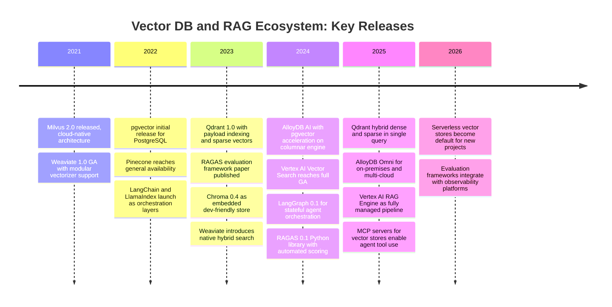
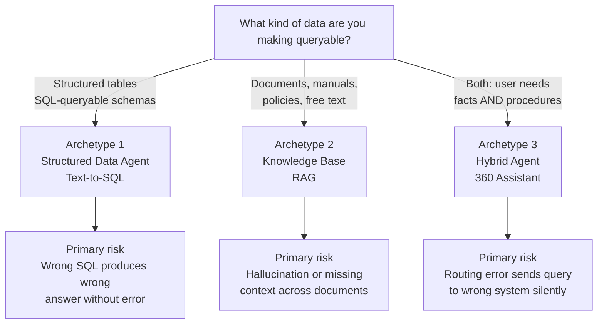
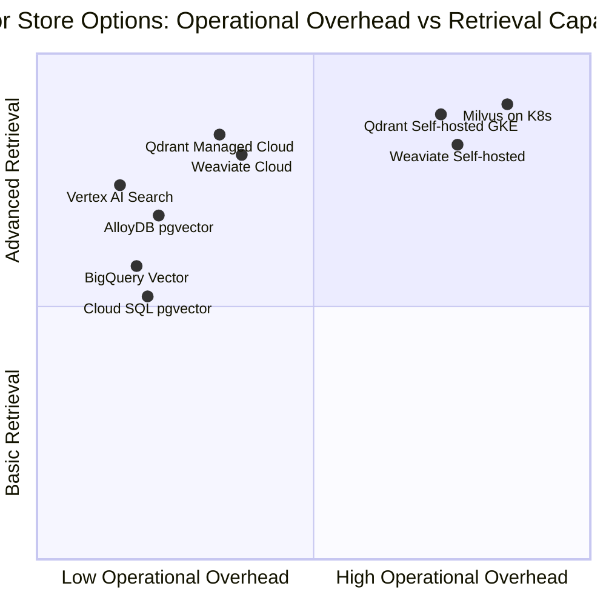
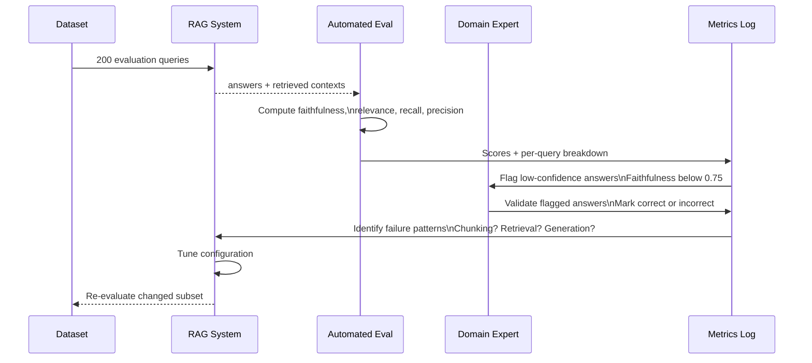
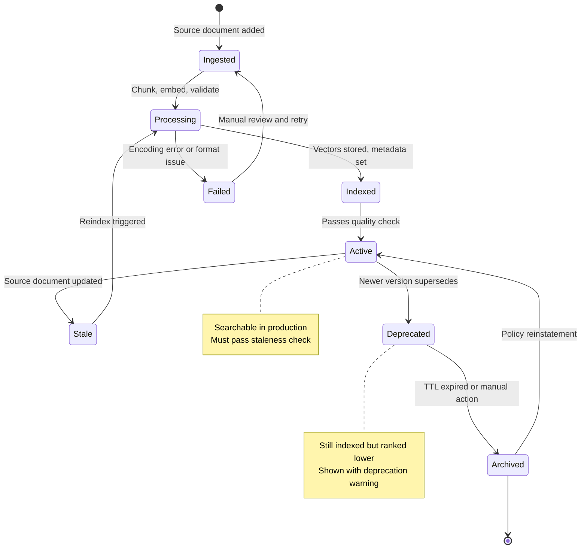
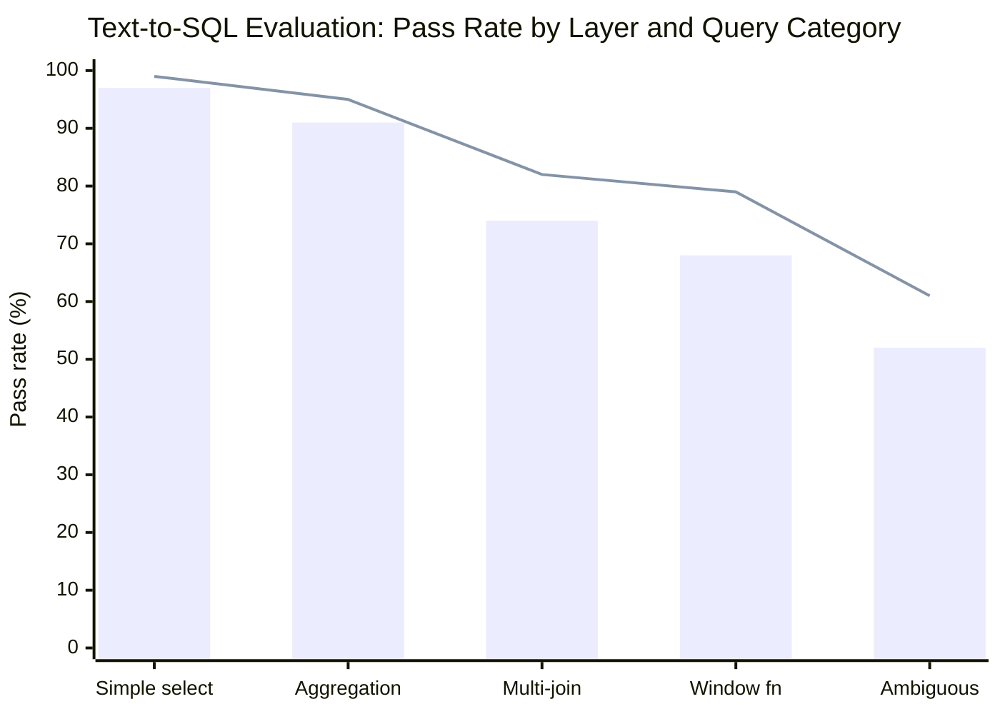

# Enterprise AI PoCs: From Vendor Demos to Decisions You Can Defend

There is a particular kind of meeting that happens in large organizations six months after an AI proof of concept concludes. Someone asks: "Based on this PoC, which system should we go with?" And the room goes quiet, because the PoC didn't actually answer that question. It demonstrated that the technology worked under favorable conditions. It did not determine whether it would work under real conditions, at real scale, operated by real people, in a regulatory environment that wasn't designed with AI in mind.

Most AI PoCs are designed to impress. A few are designed to inform. The difference is not in the talent of the people running them — it's in how the question was framed at the start.

This post is about framing the question correctly. It covers the three major archetypes of enterprise AI projects — structured data agents (text-to-SQL), unstructured knowledge bases (RAG over documents), and hybrid conversational systems — and builds a framework for evaluating each rigorously. The framework assumes you're working in a context with real constraints: existing infrastructure, a regulated industry, a team with a specific skill profile, multiple competing options, and a budget that makes "try everything and see" impractical.

---

## Why AI PoCs Fail at the Decision Stage

A PoC that fails technically is obvious: the model hallucinated, the retrieval was wrong, the latency was unacceptable. A PoC that fails at the decision stage is harder to see. It looks like success until the moment you have to commit to something.

These are the patterns that produce decision-paralysis:

**Evaluating on cleaned data.** The PoC used a curated dataset of clean, well-formatted documents or properly normalized tables. Production data has duplicates, contradictions, sparse fields, encoding issues, and schemas that evolved over five years without documentation. The PoC looked great because it never met the real problem.

**Measuring the wrong metrics.** Semantic similarity scores are not business outcomes. A RAG system that answers "What is the process for opening a term deposit?" with 85% semantic accuracy might still give customers wrong information about required documentation. The metric that matters is: how often does a domain expert say "yes, that's correct and complete"?

**Testing the best case.** Vendor demonstrations, and PoCs run by a vendor's team, naturally converge toward cases where the technology shines. A good PoC tests for failure: where does retrieval break down? What queries cause hallucination? What happens when the underlying data changes?

**Ignoring the total cost of ownership.** A vector database that requires a dedicated cluster to run may be technically superior to a managed option, but if your team can't operate it without hiring a specialist, the real cost includes six months of onboarding and every 2 AM incident. The PoC measured query latency; the deployment measured career risk.

**Not defining success before starting.** The most common failure. The evaluation criteria were defined after the PoC, shaped by which system performed best. This is not evaluation — it is rationalization.

The fix for all of these is the same: define what you're testing, how you'll measure it, and what counts as "good enough" *before* you write a line of code.

---

## The Ecosystem You're Navigating

Before choosing what to evaluate, it helps to understand how the tooling arrived at its current state. The vector database ecosystem grew fast and in several directions simultaneously, which is why the category today contains everything from PostgreSQL extensions to purpose-built distributed systems to fully managed cloud services.



The practical lesson from this timeline: the tools released before 2023 were designed without the agent and RAG use cases in mind. Metadata filtering, hybrid search, and update efficiency were afterthoughts. Tools built or redesigned after 2023 treat these as first-class features. When evaluating, check the release date of the feature you care about — not just whether the feature exists.

---

## The Three Archetypes

Enterprise AI projects that involve data and knowledge tend to fall into three patterns. Each has a different failure mode, a different evaluation methodology, and a different production readiness story.

The diagram below shows the three archetypes and their primary risk. Note that the risk is not "it doesn't work" — it's a specific failure mode that won't surface unless you design the evaluation to look for it.



### Archetype 1: Structured Data Agent (Text-to-SQL)

The user asks a question in natural language. A system generates SQL, executes it against your database, and presents the result — possibly rendered as a chart or table.

This is one of the most commercially promising AI applications for data-heavy organizations. It is also one of the most dangerous. A SQL query that retrieves wrong data doesn't fail loudly — it returns results that look correct. "What was the average account balance last month?" answered with a number that's off by 20% because the SQL grouped by the wrong dimension is worse than an error, because no one catches it.

The failure modes that matter: syntactic errors (SQL that won't execute — easy to detect), semantic errors (SQL that executes but answers the wrong question — hard to detect), schema hallucination (the model invents column names), and ambiguity collapse (the model picks one interpretation of an ambiguous question silently).

### Archetype 2: Knowledge Base / RAG

The user asks about documents — policies, procedures, manuals, regulations. A RAG system retrieves relevant chunks and the model synthesizes an answer.

Classic RAG failures: retrieval failure (the right document wasn't retrieved), irrelevant retrieval (a related-but-wrong document was), hallucination beyond context (the model adds information not in the documents), stale context (the retrieved document is outdated), and cross-document contradiction (two retrieved documents disagree and the model picks one without noting the conflict).

### Archetype 3: Hybrid Conversational Agent

The user converses with a system drawing on both structured data and documents. "What's my current balance?" (structured) and "What do I need to open a savings account?" (document) might appear in the same conversation.

The additional failure mode is routing: a data question sent to the document retrieval system returns policy text, and the model confabulates a number from it. Routing errors are invisible unless you explicitly test for them with queries that cross the boundary.

---

## Phase 1: Define Before You Build

The first deliverable in any AI PoC should be a one-page document — written before you install anything. Call it the "PoC contract." It has five parts.

**The query distribution.** What are the actual questions this system will answer? Not hypothetical questions — real ones, sourced from support tickets, analyst request logs, search history, or expert interviews. This is the hardest part of the document to write, and the most important. A system that handles 80% of real queries at 90% quality is more valuable than one that handles 20% of cherry-picked queries at 99%.

**The success criteria.** What does "good enough" look like, stated quantitatively? Define this before you run a single evaluation. For a knowledge base: "Domain experts rate at least 85% of answers as correct and complete on our evaluation set." For text-to-SQL: "At least 90% of queries produce semantically correct SQL on the first attempt, with zero incorrect results among the remainder." These numbers should come from a business conversation — what failure rate would cause a user to stop trusting the system? — not from vendor benchmarks.

**The data inventory.** What data actually exists? Structured: how many tables, what volume, how normalized, how well documented. Unstructured: how many documents, what formats, what update frequency, what access controls. There's a temptation to design for the data you wish you had. The PoC must work with the data you have today, or it will never reach production.

**The failure tolerance.** In a regulated environment, different failure modes have different costs. A knowledge base that gives a customer incorrect information about required loan documentation has different consequences than one that gives an analyst an imprecise summary of internal procedures. Map your failure modes to their real-world consequences before deciding how hard to optimize against each. Some failures require automated safeguards; others can be caught with a human-in-the-loop review stage.

**The operational constraints.** Who runs this on a Sunday? A team that knows PostgreSQL can operate a PostgreSQL-based vector store. A team that has never managed a Kubernetes cluster should not be designing a PoC that assumes one. The deployment environment is not a detail to figure out after the technical evaluation — it's a constraint that should eliminate half the options upfront.

---

## Phase 2: Vector Database Evaluation

If your PoC includes evaluating a vector database — and most AI data PoCs do — the dimensions that actually drive your choice differ substantially from what vendor benchmarks emphasize. Vendor benchmarks optimize for raw query throughput and ANN recall at high dimensionality. At the scale of most enterprise PoCs — millions of vectors, not billions — these are rarely the binding constraint.

The dimensions that matter:

**Hybrid search quality.** Dense retrieval (semantic similarity) and sparse retrieval (keyword/BM25) find different things. A query for "Article 45, paragraph 3" is answered by sparse retrieval. A query for "how do I dispute a charge" is answered by dense retrieval. Systems combining both consistently outperform either alone. Not all vector stores offer true hybrid search natively — some require running two systems and merging results, which has real maintenance cost.

**Metadata filtering accuracy.** Enterprise queries almost always need scoping: "find this policy, but only the version in effect for retail clients, not corporate." Pre-filtering (filter *before* the vector search, reducing the search space) is more accurate and faster than post-filtering (filter after). Test this explicitly, with realistic filter combinations that match your actual query distribution.

**Update and deletion latency.** Policies change. Procedures are revised. Regulations are updated. A vector store that requires rebuilding its index to incorporate changes, or that has eventual consistency for deletes, is problematic in compliance contexts where outdated information must be promptly unreachable. Run this test explicitly: insert a document, query for it, delete it, verify it no longer appears, measure the delay.

**Operational burden under failure.** Kill the process. How long does restart take? Does it re-index on startup? Does data get corrupted? Then: increase query load until the system falls behind. What degrades gracefully? What fails hard? These reveal operational reality more than any benchmark.

The chart below positions the major options across the two dimensions that most affect enterprise adoption. The "right" quadrant depends on your team — move right only if you have the engineering capacity to operate it.



### The Evaluation Dataset

Build the evaluation dataset before building anything else. It should contain:

- **Representative queries**: 50–200 queries reflecting your actual query distribution, sourced from real users or domain experts
- **Ground truth answers**: What the system *should* produce, verified by a domain expert — not what any candidate system actually returns
- **Edge cases**: Queries crossing document boundaries, requiring negation ("what is NOT permitted"), referencing deprecated content, or genuinely ambiguous
- **Known-hard queries**: Cases you expect the system to struggle with, surfaced through domain knowledge

This dataset is the most valuable artifact the PoC produces. It outlives the technology decision and becomes the regression suite for production monitoring.

---

## Phase 3: RAG Quality Measurement

Evaluating a RAG system requires separating two questions: "Did we retrieve the right context?" and "Did the model synthesize it correctly?" The RAGAS framework maps four metrics to these questions.

```python
# Install: pip install ragas langchain-openai
from ragas import evaluate
from ragas.metrics import (
    faithfulness,
    answer_relevancy,
    context_recall,
    context_precision,
)
from datasets import Dataset

# Evaluation dataset structure:
# question: the user's query
# answer: what the RAG system produced
# contexts: list of retrieved chunks (strings) used for generation
# ground_truth: the correct answer, validated by a domain expert
eval_data = {
    "question": [
        "What documents are required to open a business account?",
        "What is the penalty for early withdrawal from a term deposit?",
    ],
    "answer": [
        "You need a government-issued ID, proof of business registration, and a tax identification number.",
        "Early withdrawal incurs a 30-day interest penalty, regardless of when in the term it occurs.",
    ],
    "contexts": [
        ["Section 4.2: Business account opening requirements include: valid government-issued ID for all signatories, "
         "certificate of incorporation or equivalent business registration document, and tax ID number. "
         "Additional documents may be required for regulated industries."],
        ["Term Deposit Product Sheet, v2.3: Early withdrawal is permitted subject to a penalty equivalent to "
         "30 days of interest calculated at the contracted rate. The penalty applies irrespective of the "
         "point in the term at which withdrawal occurs."],
    ],
    "ground_truth": [
        "Business account opening requires a government-issued ID, business registration certificate, and tax ID. "
        "Additional documents may apply for regulated industries.",
        "Early withdrawal from a term deposit incurs a penalty of 30 days interest at the contracted rate, "
        "regardless of when in the term the withdrawal occurs.",
    ],
}

dataset = Dataset.from_dict(eval_data)
result = evaluate(dataset=dataset, metrics=[
    faithfulness,
    answer_relevancy,
    context_recall,
    context_precision,
])

print(result)
# faithfulness       0.92  — answers contain only claims from context
# answer_relevancy   0.87  — answers address the question asked
# context_recall     0.84  — context contains the information needed
# context_precision  0.79  — retrieved chunks are relevant (not noisy)
```

**Faithfulness** (did the model stay within context?) is the hallucination detector. Below 0.80 means the model is regularly adding information not in the retrieved documents — a critical failure in regulated contexts.

**Context Recall** (did retrieval find what was needed?) below 0.75 means retrieval is the bottleneck: the right documents exist but aren't being found. Fix: adjust chunk size, switch to hybrid search, or improve metadata.

**Context Precision** (is the retrieved content relevant?) below 0.70 means noise is entering the context window and confusing generation. Fix: tighten metadata filters, add a reranking step.

**Answer Relevancy** (does the answer address the question?) below 0.80 often signals ambiguous question handling or instruction-following issues in the model.

The evaluation loop below shows how to use these metrics iteratively during PoC development — not just as a final scorecard.



Use automated evaluation for rapid iteration across configuration variants (chunking strategies, retrieval parameters, reranking thresholds). Reserve human evaluation for the final comparison between the top 2–3 configurations and for any query category involving regulatory or compliance content.

### Chunking Strategy Is Not a Detail

How you split documents before indexing determines what information is co-located and what is separated — it has more impact on retrieval quality than which vector database you choose.

**Fixed-size chunking** (overlapping 512-token windows): Simple, predictable, poor for structured documents where a key constraint might span two windows and appear in neither.

**Semantic chunking** (split at natural boundaries — paragraphs, sections): Better for prose, but requires preprocessing maintained as documents update.

**Hierarchical chunking** (parent-child): Index fine-grained chunks for precise retrieval, return their parent chunk for synthesis context. The right default for most knowledge bases. LlamaIndex's `HierarchicalNodeParser` implements this pattern cleanly.

**Metadata injection into every chunk**: Always include document title, section heading, date, and source in each chunk's text and metadata. A chunk that says "The minimum balance is $500" is ambiguous. A chunk that says "Product: Premium Savings | Section: Account Requirements | Effective: 2026-01 | The minimum balance is $500" is not. This single practice eliminates a large fraction of context recall failures.

---

## Phase 4: Document Lifecycle — The Operational Problem Nobody Plans For

One of the most underestimated problems in enterprise knowledge bases is not retrieval quality on day one — it's maintaining retrieval quality over time as documents change.

A knowledge base without a document lifecycle policy becomes a graveyard. Old policies sit alongside new ones. Expired procedures are retrieved with the same confidence as current ones. A regulatory change is captured in a new document, but the old document is still indexed and occasionally wins the retrieval.

The document lifecycle has four states that must be explicitly managed:



The production system must handle every one of these transitions. When the source document is updated (Stale → Processing), the old vectors must be deleted — not just the new ones added — before the reindexed version goes live. In a compliance context, the window between "old policy deleted" and "new policy indexed" must be minimized and logged.

This lifecycle design needs to be part of the PoC scope, not an afterthought for production. The vector database choice should be evaluated against it: which stores support efficient targeted deletions? Which have atomic update semantics? Which can mark vectors as deprecated without deleting them (useful for showing users that a document is outdated rather than simply not returning it)?

---

## Phase 5: Text-to-SQL Evaluation

Text-to-SQL evaluation is more tractable than RAG evaluation because correctness is often programmatically verifiable: does the generated SQL execute, and does it return the right result?

Build the evaluation in three layers, each progressively harder to check:

```python
import json
import asyncio
from dataclasses import dataclass, field
from typing import Any

import sqlglot  # SQL parsing and validation
import asyncpg


@dataclass
class EvalQuery:
    question: str
    reference_sql: str          # Human-written correct SQL
    expected_output: list[dict] # Expected result set
    category: str               # 'simple', 'aggregation', 'multi-join', 'ambiguous'
    ambiguity_note: str = ""    # What the ambiguity is, if any


@dataclass
class EvalResult:
    question: str
    generated_sql: str
    layer1_pass: bool = False   # Syntactically valid SQL
    layer2_pass: bool = False   # Returns the correct rows
    layer3_pass: bool | None = None  # Handles ambiguity correctly (human-judged)
    error: str = ""
    row_count_match: bool = False


async def evaluate_text_to_sql(
    queries: list[EvalQuery],
    sql_generator,  # Your text-to-SQL function: question -> SQL string
    db_pool: asyncpg.Pool,
) -> list[EvalResult]:
    results = []

    for query in queries:
        result = EvalResult(question=query.question, generated_sql="")

        # --- Layer 1: Syntactic validity ---
        try:
            generated_sql = await sql_generator(query.question)
            result.generated_sql = generated_sql

            # sqlglot validates SQL syntax without executing it
            parsed = sqlglot.parse(generated_sql, dialect="postgres")
            if parsed and not any(isinstance(n, sqlglot.exp.Command) for node in parsed for n in node.walk()):
                result.layer1_pass = True
        except Exception as e:
            result.error = f"Generation failed: {e}"
            results.append(result)
            continue

        # --- Layer 2: Result correctness ---
        if result.layer1_pass:
            try:
                async with db_pool.acquire() as conn:
                    # Wrap in a transaction that always rolls back — read-only safety
                    async with conn.transaction():
                        rows = await conn.fetch(generated_sql)
                        actual_output = [dict(r) for r in rows]
                        await conn.execute("ROLLBACK")

                # Compare row count and spot-check first row structure
                result.row_count_match = len(actual_output) == len(query.expected_output)
                if result.row_count_match and actual_output:
                    # Check key columns match (not all columns — some may be aliases)
                    expected_keys = set(query.expected_output[0].keys())
                    actual_keys = set(actual_output[0].keys())
                    result.layer2_pass = expected_keys.issubset(actual_keys)

            except asyncpg.PostgresError as e:
                result.error = f"Execution failed: {e.pgcode}"

        results.append(result)

    return results


def summarize_evaluation(results: list[EvalResult]) -> dict[str, Any]:
    n = len(results)
    by_category: dict[str, dict] = {}

    for r in results:
        cat = getattr(r, "category", "unknown")
        if cat not in by_category:
            by_category[cat] = {"total": 0, "layer1": 0, "layer2": 0}
        by_category[cat]["total"] += 1
        if r.layer1_pass:
            by_category[cat]["layer1"] += 1
        if r.layer2_pass:
            by_category[cat]["layer2"] += 1

    return {
        "total": n,
        "layer1_pass_rate": sum(r.layer1_pass for r in results) / n,
        "layer2_pass_rate": sum(r.layer2_pass for r in results) / n,
        "by_category": by_category,
    }
```

The most revealing output from this harness isn't the overall pass rate — it's the per-category breakdown. A system with 90% overall Layer 2 correctness that scores 55% on `multi-join` queries has a specific, fixable failure mode. A system with 85% overall that scores consistently across all categories is more reliable in production.

The chart below shows a typical distribution of pass rates across layers for a production text-to-SQL system, using indicative figures from real deployment patterns:



*Bar: Layer 1 (syntactic validity). Line: Layer 2 (result correctness). The gap between the two bars narrows for simple queries and widens for complex ones — which is where schema context injection matters most.*

The most common text-to-SQL failure is schema hallucination: the model writes `SELECT customer_segment FROM customers` when the actual column is `segment_code` in a separate `customer_segments` table. The fix is schema context injection — retrieving relevant schema fragments as context for each query rather than stuffing the entire database schema into every prompt.

---

## Phase 6: Infrastructure in Regulated Environments

Enterprise AI PoCs exist in a context that most benchmarks don't model: data residency requirements, network security policies, change management processes, and audit requirements that apply to any system touching sensitive data.

Before your PoC touches real data, you need answers to four questions:

**Can the data leave the corporate network?** Many regulated institutions cannot send data to external APIs — including a cloud embedding API. Options: on-premises embedding models (Ollama, vLLM on internal infra), cloud-provider-native services within a private VPC (data stays within your cloud tenant), or private connectivity solutions.

**What is the audit trail requirement?** Every vector search, LLM call, and tool execution needs to be logged in a compliance-compatible format. Managed cloud services often provide this built-in; self-hosted solutions require you to build and maintain it.

**What does change management look like here?** In regulated institutions, software touching production data requires a formal change process. A Docker container running a vector store on a developer's workstation cannot directly access production data. Build the PoC infrastructure to reflect production constraints — or you'll discover the gap during migration.

**Is there a model risk management process?** AI systems that influence decisions in financial services and healthcare may require model risk validation: documentation, independent review, and periodic monitoring. Design for this from the start — the technical system is one artifact; the governance documentation is another.

### The Deployment Decision

Three levels of operational ownership, each with different cost profiles:

| Option | Operational Burden | Data Residency Control | Right For |
|---|---|---|---|
| **Serverless / managed cloud** | Minimal | Cloud-tenant level | PoCs, internal tools, variable load |
| **Managed container orchestration** | Moderate | VPC-level isolation | Production systems, stable load |
| **Self-hosted on K8s** | High | Full control | Strict residency requirements, very high volume |

The total cost of ownership for each option should include team time. A self-hosted Qdrant cluster on Kubernetes has zero licensing cost and a non-trivial operations cost. Model that realistically over a 3-year horizon before presenting the comparison.

---

## Phase 7: From Benchmark to Decision

The PoC produces data. Translating that data into a decision requires a framework that separates technical performance from organizational fit.

The decision process has two tiers:

**Tier 1 — Hard requirements** (pass/fail before scoring anything else):
- Does it meet data residency requirements?
- Does it integrate with your existing IAM?
- Can the current team operate it without new hiring?
- Does it pass your security review?

Any option that fails a Tier 1 requirement is eliminated regardless of technical performance. This sounds obvious, but it's common to discover a Tier 1 failure late in a PoC when the team is already emotionally invested in a solution.

**Tier 2 — Weighted scoring** (applied to options that pass Tier 1):

| Dimension | Weight | Rationale |
|---|---|---|
| Retrieval quality on your dataset | 30% | Primary technical function |
| Operational burden | 20% | Underweighted in most evaluations |
| Latency at realistic query volume (p99) | 15% | p99 determines user experience |
| Total cost at production scale (3yr) | 15% | Include team time, not just infra |
| Migration path / vendor lock-in | 10% | Exit costs have real probability |
| Team skill alignment | 10% | Adoption determines realized value |

Make the weights explicit and justify them in the recommendation document. A team evaluating a customer-facing system weights latency higher. A team with strong DevOps capacity weights operational burden lower. The weights are a design decision, not a discovery — own them.

### The Recommendation Document

The output of a PoC is a document that a technical leader can act on, not a slide deck. It must contain:

1. **The decision**: Clearly stated. "We recommend X for the following reasons."
2. **The evaluation methodology**: What was tested, how it was measured, and what the success criteria were — stated before the test, not after.
3. **The results**: Quantitative performance on your evaluation dataset for each option. Not vendor numbers — your numbers, on your data.
4. **The failure analysis**: Where did each option fail, and how? This section is more valuable than the success analysis because it reveals the risks of the recommendation.
5. **The total cost estimate**: Infrastructure plus operational burden over a realistic horizon.
6. **The minority view**: If the team disagreed, document the alternative position. Future readers may encounter conditions where it would have been correct.
7. **The decision triggers**: What would cause you to re-open this decision? A volume milestone, a regulatory change, a team capability shift, a technology breakthrough.

---

## What the PoC Doesn't Tell You

Even a well-executed PoC has blind spots. Understanding them determines how much confidence to place in the recommendation.

**Scale behavior at P99, not average.** Benchmarks measure mean latency. Users experience worst cases. A system with 50ms average and 2s P99 latency will feel slow to users half the time — and that's what they'll remember.

**Long-term data drift.** A knowledge base that performs well on day one may degrade as documents accumulate contradictions, receive partial updates, or as the query distribution shifts. Plan monitoring before launch, not after.

**The cold start problem.** When a new document type, a new user segment, or a new query category appears, how does the system behave? PoCs rarely test first-time behavior explicitly.

**Integration complexity in the real system.** A PoC connects the AI system directly to test data. The production system connects through an existing API layer, an identity provider, a logging system, and a change management process. The integration surface is where most production delays occur.

**Team adoption.** The best AI system the team doesn't trust is less valuable than a mediocre system they use confidently. Plan a rollout phase with human review in the loop, explainability for unexpected results, and a feedback mechanism that routes corrections back into the evaluation dataset. The feedback loop is not a feature — it's the mechanism by which the system improves after launch.

---

## Going Deeper

**Books:**
- Kleppmann, M. (2017). *Designing Data-Intensive Applications.* O'Reilly.
  - Chapters 1–3 on reliability and scalability form the conceptual foundation for any infrastructure evaluation. The taxonomy of failure modes maps directly to the hard questions about vector store operational behavior.
- Huyen, C. (2022). *Designing Machine Learning Systems.* O'Reilly.
  - Chapter 6 on model development and evaluation covers the dataset construction and evaluation methodology that translates directly to both RAG and text-to-SQL evaluation pipelines.
- Reis, J., & Housley, M. (2022). *Fundamentals of Data Engineering.* O'Reilly.
  - The lifecycle management and data quality chapters inform the document lifecycle problem — how to think about data freshness, provenance, and retirement in a knowledge system.

**Online Resources:**
- [RAGAS Documentation](https://docs.ragas.io) — The standard evaluation framework for RAG systems. Start with `faithfulness`, `answer_relevancy`, and `context_recall` before adding more metrics. The docs include worked examples on real datasets.
- [LangSmith Evaluation Guide](https://docs.smith.langchain.com/evaluation) — Practical guide to building LLM evaluation pipelines combining automated and human feedback. Shows how to build the feedback loop that keeps a system improving post-launch.
- [Qdrant Vector Search Benchmarks](https://qdrant.tech/benchmarks/) — The most transparent published vector database benchmark, covering recall and latency across multiple dataset sizes. Useful for calibrating performance expectations before running your own benchmark.
- [Spider Text-to-SQL Benchmark](https://yale-lily.github.io/spider) — The standard research benchmark for text-to-SQL. Running a candidate system on Spider gives you numbers comparable to published research, which helps calibrate whether your domain-specific results are reasonable.
- [AlloyDB AI — Working with Embeddings](https://cloud.google.com/alloydb/docs/ai/work-with-embeddings) — AlloyDB's pgvector integration, including the columnar engine acceleration for vector operations and hybrid search patterns using sparse + dense vectors together.

**Videos:**
- [LlamaIndex — Production RAG Patterns (2025)](https://www.youtube.com/results?search_query=llamaindex+production+rag+patterns+2025) — Jerry Liu and the LlamaIndex team covering evaluation methodologies and failure patterns not addressed in introductory tutorials.
- [Weaviate — Vector Database Fundamentals](https://www.youtube.com/results?search_query=weaviate+vector+database+fundamentals+hybrid+search) — Covers HNSW, hybrid search architecture, and filtering — the concepts that matter most for enterprise evaluation.

**Academic Papers:**
- Es, S. et al. (2023). ["RAGAS: Automated Evaluation of Retrieval Augmented Generation."](https://arxiv.org/abs/2309.15217) *arXiv.*
  - The paper behind the RAGAS framework. Defines faithfulness, answer relevance, context recall, and context precision, and explains their computation. Required reading before designing a RAG evaluation.
- Yu, T. et al. (2018). ["Spider: A Large-Scale Human-Labeled Dataset for Complex and Cross-Domain Semantic Parsing and Text-to-SQL Task."](https://arxiv.org/abs/1809.08887) *EMNLP.*
  - The foundational text-to-SQL benchmark. Understanding its evaluation methodology — execution accuracy vs exact match vs test-suite accuracy — informs how to build a domain-specific evaluation with the right properties.
- Barnett, S. et al. (2024). ["Seven Failure Points When Engineering a Retrieval Augmented Generation System."](https://arxiv.org/abs/2401.05856) *arXiv.*
  - Systematic taxonomy of RAG failure points from practitioners — directly maps to the evaluation scenarios you should explicitly include in your golden dataset.

**Questions to Explore:**
- A PoC is a bounded experiment, but enterprise AI systems need to evolve continuously — new documents, new tables, new query patterns. How do you design the PoC so the evaluation infrastructure scales into production monitoring? What has to be true about the golden dataset for it to remain useful six months after launch?
- Regulated industries often require that AI decisions be explainable. For a RAG system, "the answer came from this document" is one level of explanation — but if the synthesis step adds information or makes inferences, is that explainable? How does the faithfulness metric relate to the legal concept of explainability?
- Most vector database evaluations measure recall and latency on a single language. In an organization that serves customers in multiple languages, or where documents are written in a different language than user queries, embedding quality across languages becomes the binding constraint. How would you add multilingual robustness testing to a standard PoC?
- A knowledge base with contradictory information — an old policy and a new one, both indexed — will retrieve both and let the model choose. What does a production knowledge base need beyond a vector store to handle information lifecycle correctly? What does that imply for the architecture?
- PoCs are run by people invested in their success. How do you design the evaluation process to be robust to confirmation bias, especially when the vendor is also participating? What structural safeguards — blind evaluation, independent holdout set, third-party review — are worth the cost in an enterprise context?
