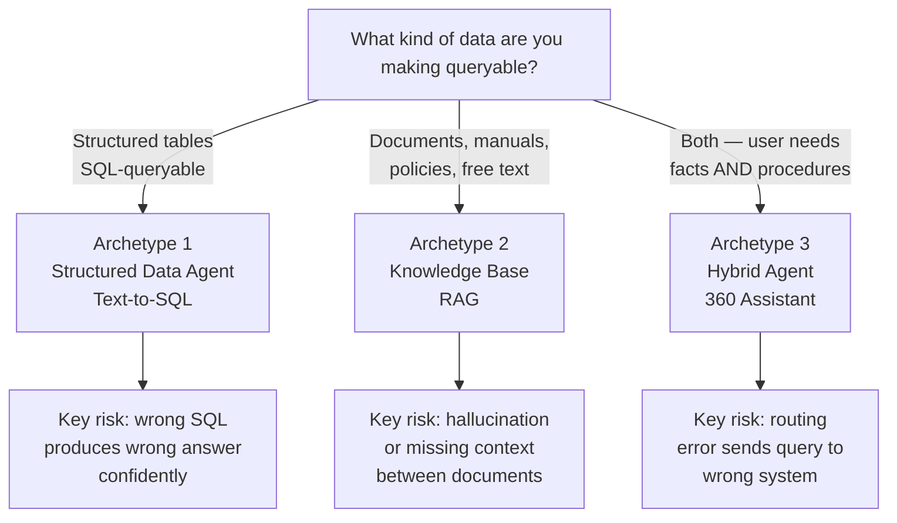
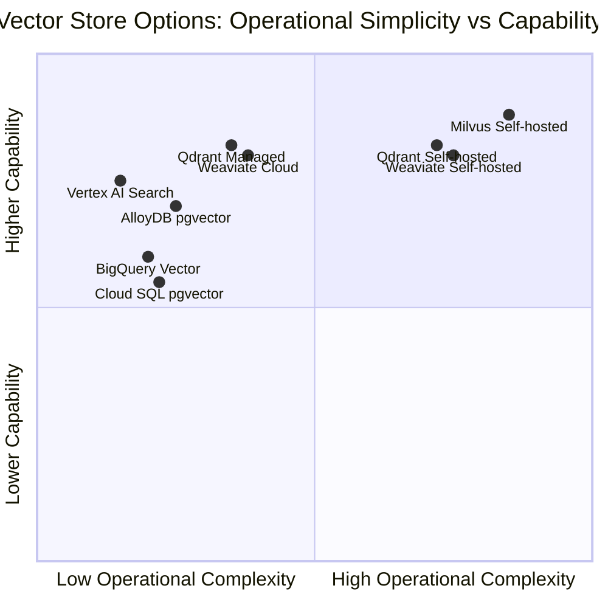
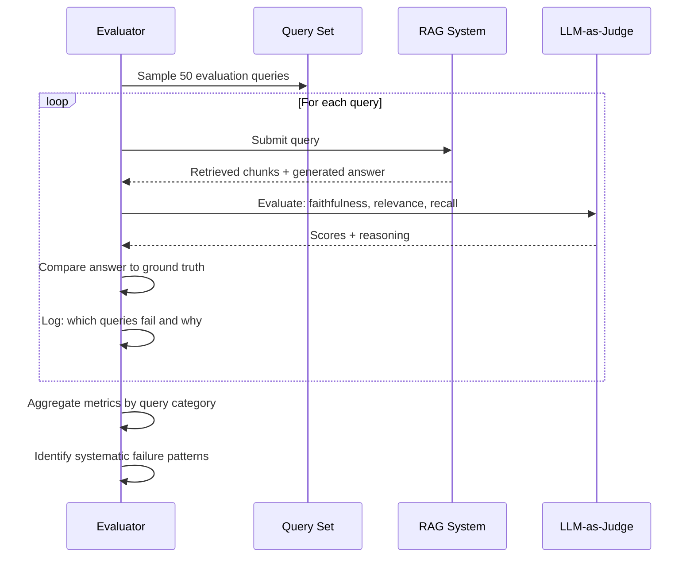

# Running AI PoCs That Actually Decide Something

There is a particular kind of meeting that happens in large organizations six months after an AI proof of concept concludes. Someone asks: "Based on this PoC, which system should we go with?" And the room goes quiet, because the PoC didn't actually answer that question. It demonstrated that the technology worked under favorable conditions. It did not determine whether it would work under real conditions, at real scale, operated by real people, in a regulatory environment that wasn't designed with AI in mind.

Most AI PoCs are designed to impress. A few are designed to inform. The difference is not in the talent of the people running them — it's in how the question was framed at the start.

This post is about framing the question correctly. It covers the three major archetypes of enterprise AI projects — structured data agents (text-to-SQL), unstructured knowledge bases (RAG over documents), and hybrid conversational systems — and builds a framework for evaluating each rigorously. The framework assumes you're working in a context with real constraints: existing infrastructure, a regulated industry, a team with a specific skill profile, multiple competing options, and a budget that makes "try everything and see" impractical.

---

## Why AI PoCs Fail at the Decision Stage

A PoC that fails technically is obvious: the model hallucinated, the retrieval was wrong, the latency was unacceptable. A PoC that fails at the decision stage is harder to see. It looks like success until the moment you have to commit to something.

These are the patterns that produce decision-paralysis:

**Evaluating on cleaned data**: The PoC used a curated dataset of clean, well-formatted documents or properly normalized tables. Production data has duplicates, contradictions, sparse fields, encoding issues, and schemas that evolved over five years without documentation. The PoC looked great because it never met the real problem.

**Measuring the wrong metrics**: Semantic similarity scores are not business outcomes. A RAG system that answers "What is the process for opening a term deposit?" with 85% semantic accuracy might still give customers wrong information about required documentation. The metric that matters is: how often does a domain expert say "yes, that's correct and complete"?

**Testing the best case**: Vendor demonstrations, and PoCs run by the vendor's team, naturally converge toward cases where the technology shines. A good PoC tests for failure: Where does retrieval break down? What queries cause hallucination? What happens when the underlying data changes?

**Ignoring the total cost of ownership**: A vector database that requires a dedicated cluster to run may be technically superior to a managed option, but if your team can't operate it without hiring a specialist, the real cost includes six months of onboarding and every 2 AM incident. The PoC measured query latency; the deployment measured career risk.

**Not defining success before starting**: The most common failure. The evaluation criteria were defined after the PoC, shaped by which system performed best. This is not evaluation — it is rationalization.

The fix for all of these is the same: define what you're testing, how you'll measure it, and what counts as "good enough" *before* you write a line of code.

---

## The Three Archetypes

Enterprise AI projects that involve data and knowledge tend to fall into three patterns. Each has a different failure mode, a different evaluation methodology, and a different production readiness story.

### Archetype 1: Structured Data Agent (Text-to-SQL)

The user asks a question in natural language. A system generates SQL, executes it against your database, and presents the result — possibly rendered as a chart or table.

This is one of the most commercially promising AI applications for data-heavy organizations. It is also one of the most dangerous. A SQL query that retrieves wrong data doesn't fail loudly — it returns results that look correct. "What was the average account balance last month?" answered with a number that's off by 20% because the SQL grouped by the wrong dimension is worse than an error, because no one catches it.

The failure modes that matter:
- **Syntactic errors**: SQL that won't execute (easy to detect, easy to measure)
- **Semantic errors**: SQL that executes but answers the wrong question (hard to detect, dangerous)
- **Schema hallucination**: The model invents column names that don't exist (common with poor schema context injection)
- **Ambiguity collapse**: "Average balance" could mean many things depending on how your data model is structured; the model picks one interpretation silently

### Archetype 2: Knowledge Base / RAG

The user asks a question about documents — policies, procedures, manuals, regulations. A RAG system retrieves relevant chunks and the model synthesizes an answer.

The classic RAG failures:
- **Retrieval failure**: The right document exists but wasn't retrieved (recall problem)
- **Irrelevant retrieval**: A document was retrieved that seems related but doesn't answer the question (precision problem)
- **Hallucination beyond context**: The model adds information not in the retrieved documents
- **Stale context**: The retrieved document is outdated; the current policy is different
- **Cross-document contradiction**: Two retrieved documents say different things; the model picks one without acknowledging the conflict

### Archetype 3: Hybrid Conversational Agent

The user converses with a system that can draw on both structured data and documents. "What's my current balance?" (structured) and "What do I need to open a savings account?" (document) might appear in the same conversation.

The additional failure mode is routing: sending a data question to the document retrieval system returns policy text instead of numbers, and the model confabulates a number from that text. Routing errors are invisible unless you specifically test for them.

---

## Phase 1: Problem Definition Before Technology

The first deliverable in any AI PoC should be a one-page document that defines:

**1. The query distribution**: What are the actual questions this system will answer? Not hypothetical questions — real ones, sourced from support tickets, analyst requests, search logs, or expert interviews. A system that handles 80% of real queries at 90% quality is more valuable than one that handles 20% of cherry-picked queries at 99%.

**2. The success criteria**: What does "good enough" look like? Define this quantitatively before you run a single evaluation. For a knowledge base: "Domain experts rate ≥85% of answers as correct and complete." For text-to-SQL: "≥90% of queries produce semantically correct SQL on the first attempt, with no incorrect results among the remainder." These numbers should come from a business conversation, not from benchmarks.

**3. The data inventory**: What data actually exists? Structured: how many tables, what volume, how normalized, how documented. Unstructured: how many documents, what formats, what update frequency, what access controls. The data you have is the constraint; the data you wish you had is irrelevant.

**4. The failure tolerance**: In a regulated environment, different failure modes have different costs. A knowledge base that gives a customer incorrect information about required documentation for a loan application has different consequences than one that gives an analyst a slightly imprecise summary of internal procedures. Map your failure modes to their real-world consequences before deciding how hard to optimize against each.

**5. The operational constraints**: Who runs this? A team that knows PostgreSQL can operate a PostgreSQL-based vector store. A team that has never managed a Kubernetes cluster should not be designing a PoC that assumes one. The deployment environment is not a detail to figure out after the technical evaluation — it's a constraint that should eliminate half the options upfront.

---

## Phase 2: Vector Database Evaluation — What You're Actually Testing

If your PoC includes evaluating a vector database (and most AI data PoCs do), the evaluation dimensions that matter differ substantially from what vendor benchmarks emphasize.

Vendor benchmarks optimize for: raw query throughput, ANN recall at high dimensionality, ingestion speed. These matter at scale. At the scale of most enterprise PoCs — millions of vectors, not billions — they are rarely the binding constraint.

The dimensions that actually determine your choice:

**Hybrid search quality** — Dense retrieval (semantic similarity) and sparse retrieval (keyword/BM25) find different things. A query for "Article 45, paragraph 3, subsection b" is better answered by sparse retrieval. A query for "what is the process for disputing a charge" is better answered by dense retrieval. A system that combines both — hybrid search — consistently outperforms either alone. Not all vector stores offer true hybrid search natively; some require you to run two separate systems and merge results yourself. This complexity has real maintenance cost.

**Metadata filtering accuracy** — In enterprise settings, queries almost always need to be scoped: "find this policy, but only the version in effect for retail clients, not corporate." The ability to filter by metadata (document type, date range, segment, geography, regulatory jurisdiction) *before* or *during* vector search — not after — is critical for both performance and correctness. Pre-filtering reduces the search space and improves accuracy; post-filtering can miss relevant results if the search returns fewer than k results after filtering.

**Update and deletion latency** — Policies change. Procedures are revised. Regulations are updated. A vector store that requires rebuilding its index to incorporate changes, or that has eventual consistency for deletes, is problematic in a compliance context where outdated information must be promptly unreachable. Test this explicitly: insert a document, query for it, delete it, verify it no longer appears in results, measure how long each step takes.

**Schema and data model flexibility** — Can you store structured metadata alongside vectors and query both with a single operation? Can you add metadata fields without re-ingesting all vectors? A system that requires a fixed schema at collection creation time will become a bottleneck as your understanding of the data model evolves.

**Operational burden under failure** — Run the following test during your PoC: kill the process or container running the vector store. How long does restart take? Does it re-index? Does it corrupt? Then: increase query volume until the system falls behind. What degrades gracefully? What fails hard? The answers reveal operational reality.

The quadrant you want to be in depends on your team. A team with strong Kubernetes expertise can operate self-hosted Qdrant or Milvus and get top-tier capability. A team without that expertise should stay left — AlloyDB or a managed cloud option. The PoC should validate *both* dimensions, not just capability.

### The Evaluation Dataset

Build the evaluation dataset before you build anything else. It should contain:

- **Representative queries**: 50-200 queries that reflect your actual query distribution, sourced from real users or domain experts, not invented by engineers
- **Ground truth answers**: For each query, the correct answer verified by a domain expert — not what the system produces, but what it *should* produce
- **Edge cases**: Queries that cross document boundaries, require negation ("what is NOT permitted"), reference deprecated policies, or are intentionally ambiguous
- **Known-hard queries**: Queries you expect the system to struggle with, based on domain knowledge

This dataset is the most valuable artifact the PoC produces. It outlives the technology decision and becomes the regression suite for production monitoring.

---

## Phase 3: RAG Quality Measurement

Evaluating a RAG system requires separating two questions: "Did we retrieve the right context?" and "Did the model synthesize it correctly?"

The RAGAS framework provides four metrics that map to these questions:

**Context Recall**: Of the information needed to answer the question, what fraction was present in the retrieved chunks? Low context recall means the retrieval system is missing relevant documents. The fix is in the retrieval configuration (more chunks, different chunking strategy, hybrid search).

**Context Precision**: Of the retrieved chunks, what fraction was actually relevant to the question? Low context precision means you're retrieving noise that confuses the model. The fix is in filtering and ranking.

**Faithfulness**: Does the generated answer contain only claims that are supported by the retrieved context? Low faithfulness is the hallucination signal. The model is adding information beyond what was retrieved.

**Answer Relevance**: Does the answer actually address the question that was asked? A faithful answer to the wrong interpretation of the question has high faithfulness and low answer relevance.

Computing these metrics at scale requires either a human evaluation team (expensive, slow) or an LLM-as-judge approach (fast, cheap, less reliable on domain-specific content). In regulated industries, **human evaluation is not optional for the final validation** — an LLM judge can catch obvious failures but will miss domain-specific errors that only an expert would catch.

A practical approach: use automated evaluation for rapid iteration during development (hundreds of configuration variants), then run human evaluation on the top 2-3 configurations before making the final recommendation.

### Chunking Strategy Is Not a Detail

How you split documents before indexing has more impact on retrieval quality than which vector database you choose. The chunking strategy determines what information is co-located and what is separated. Get it wrong and the system will consistently retrieve chunks that are adjacent to the right answer but don't contain it.

The dimensions to test:

**Fixed-size chunking** (overlapping 512-token windows): Simple, predictable, terrible for structured documents like policies where a key constraint might span two windows and appear in neither.

**Semantic chunking** (split at natural boundaries — paragraphs, sections, headers): Better for prose, but requires preprocessing that must be maintained as documents update.

**Hierarchical chunking** (parent-child): Index fine-grained chunks for retrieval, but return their parent chunk for context. Balances retrieval precision with synthesis context. The right default for most knowledge base applications.

**Document-level metadata injection**: Always inject the document title, section heading, date, and source into each chunk as metadata. A chunk that says "The minimum balance is $500" is ambiguous. A chunk that says "Product: Savings Account Pro | Section: Account Requirements | Date: 2026-01 | The minimum balance is $500" is not.

---

## Phase 4: Text-to-SQL Evaluation

Text-to-SQL evaluation is more tractable than RAG evaluation because the ground truth is verifiable programmatically: does the generated SQL execute without error, and does it return the correct result?

Build the evaluation in three layers:

**Layer 1 — Execution correctness** (automated): Does the generated SQL execute without syntax errors? This is binary and cheap to check. Any system worth deploying should achieve >95% here on clean, unambiguous queries.

**Layer 2 — Result correctness** (semi-automated): Does the SQL return the correct rows? This requires a reference dataset: a set of queries paired with the correct expected output. Build this with your data team — take 100 real analyst queries, have the analyst write the correct SQL, execute it, and record the result. The PoC system's output is correct if the result matches.

**Layer 3 — Semantic correctness under ambiguity** (human): For queries where multiple interpretations are possible ("show me active customers" — active by what definition?), does the system handle ambiguity correctly? Does it ask for clarification, or does it silently pick one interpretation? This layer requires human evaluation.

The most common text-to-SQL failure is schema hallucination: the model writes `SELECT customer_segment FROM customers` when the actual column is `segment_code` in a separate `customer_segments` table. The fix is schema context injection — explicitly providing the relevant table and column schemas as part of the prompt — combined with a retrieval mechanism that finds the right schema fragments for each query.

A well-designed schema resource (as in MCP, or as a RAG retrieval over your data catalog) solves this: instead of injecting the entire database schema into every prompt (which doesn't fit for large databases), you retrieve the most relevant schema fragments dynamically. Test this retrieval step separately from the SQL generation step — you need to know if failures are happening at the schema lookup stage or the generation stage.

---

## Phase 5: Infrastructure Decision in Regulated Environments

Enterprise AI PoCs exist in a context that most open-source benchmarks don't model: data residency requirements, network security policies, change management processes, and audit requirements that apply to any system touching customer data.

Before your PoC touches real data, you need answers to:

**Data residency**: Can the data leave the corporate network? Many regulated institutions cannot send data to external APIs — including the embedding API of a cloud provider. Options: on-premises embedding models (Ollama, vLLM), cloud-provider-native services within a VPC (the data stays inside your cloud tenant), or private connectivity solutions (VPC peering, private service access).

**Audit trail**: Who accessed what, when, with what result? Vector database queries, LLM calls, and tool executions all need to be logged in a way that satisfies compliance requirements. Managed cloud services often provide this built-in; self-hosted solutions require you to build it.

**Change management**: In regulated institutions, software that touches production data requires a change management process. A Docker container running Qdrant on a developer's workstation cannot directly access production data. The PoC infrastructure must reflect production constraints — or you'll discover the gap during the production migration, not during the PoC.

**Model governance**: In financial services and healthcare, AI systems that influence decisions may require model risk management processes: documentation, validation by a separate team, periodic review. Design the PoC with this in mind — the technical system is one artifact; the governance documentation is another.

### Serverless vs Managed vs Self-Hosted

The decision matrix has three levels:

**Serverless** (Cloud Run, Cloud Functions, managed cloud vector stores): Lowest operational burden, highest cost at sustained load, simplest security model. Right for: PoCs, internal tools with variable load, small-to-medium production systems where operational simplicity outweighs cost optimization.

**Managed** (GKE Autopilot, AlloyDB, managed vector services): Moderate operational burden, predictable cost, good security controls. Right for: production systems with stable load, teams with some platform engineering capacity.

**Self-hosted on container orchestration** (GKE, on-premises Kubernetes): Highest operational burden, lowest cost at scale, full control over data residency. Right for: systems with very strict data residency requirements, very high query volumes, or organizations with strong platform engineering teams.

A PoC that recommends a self-hosted solution without accounting for the operational cost is recommending a solution that will be expensive to run in practice, regardless of the benchmark numbers. The PoC report should include a realistic operational cost estimate for each option over a 3-year horizon, including team time.

---

## Phase 6: From Benchmark to Decision

The PoC produces data. Translating that data into a decision requires a framework that accounts for both technical performance and organizational fit.

The decision matrix should have two tiers:

**Tier 1 — Hard requirements** (pass/fail before scoring anything else):
- Does it meet data residency requirements?
- Does it integrate with your existing identity and access management?
- Can the team operate it without new hiring?
- Does it pass your security review?

Any option that fails a Tier 1 requirement is eliminated regardless of technical performance. This sounds obvious, but it's common to discover a Tier 1 failure late in a PoC when the team is already emotionally invested in a solution.

**Tier 2 — Weighted scoring** (applied to options that pass Tier 1):

| Dimension | Weight | Why |
|---|---|---|
| Retrieval quality (measured on your dataset) | 30% | The primary technical function |
| Operational burden | 20% | Underweighted in most evaluations |
| Latency at realistic load | 15% | p99, not average |
| Total cost at production scale (3yr) | 15% | Include team time |
| Migration path (exit strategy) | 10% | Vendor lock-in has a cost |
| Team skill alignment | 10% | Adoption determines realized value |

Weight these dimensions according to your context. A team evaluating a customer-facing system weights latency higher. A team with strong DevOps capability weights operational burden lower. Make the weights explicit and justify them in the recommendation document.

### The Recommendation Document

The output of a PoC is not a slide deck. It is a recommendation document that a technical leader or committee can act on. It should contain:

1. **The decision**: Clearly stated — "We recommend X for the following reasons."
2. **The evaluation methodology**: What was tested, how it was measured, what the success criteria were (stated before the test, not after).
3. **The results**: Quantitative performance on your evaluation dataset for each option. Not vendor benchmark numbers — your numbers, on your data, with your query distribution.
4. **The failure analysis**: Where did each option fail, and how? This section is more valuable than the success analysis because it reveals the risks of the recommended option.
5. **The total cost estimate**: Technical infrastructure + operational burden over a realistic time horizon.
6. **The minority view**: If the team disagreed, document the alternative position and why it was not selected. Future readers may encounter circumstances where the alternative would have been correct.
7. **The decision triggers**: What would cause you to re-open the decision? Technology change, volume milestone, regulatory change, team capability shift.

---

## What the PoC Doesn't Tell You

Even a well-executed PoC has blind spots that only production experience reveals.

**Scale behavior at P99, not average**: Benchmarks measure mean latency. Production systems are measured by their worst cases. A system with 50ms average latency and 2s P99 latency will feel slow to users half the time.

**Long-term data drift**: A knowledge base that performs well on day one may degrade as documents accumulate contradictions, are partially updated, or as the query distribution shifts. Build monitoring for this before launch, not after.

**The cold start problem**: When a new user, new document type, or new query category appears for the first time, how does the system behave? PoCs rarely test the cold start case explicitly.

**Integration complexity in the real system**: A PoC connects the AI system directly to test data. The production system connects through an existing API layer, an identity provider, a logging system, and a change management process. The integration surface is where most production delays occur.

**Team adoption**: The best AI system that the team doesn't trust is less valuable than a mediocre system they use confidently. Plan for a rollout phase with human review in the loop, explainability for unexpected results, and a feedback mechanism that routes corrections back into the evaluation dataset.

---

## Going Deeper

**Books:**
- Kleppmann, M. (2017). *Designing Data-Intensive Applications.* O'Reilly.
  - Chapters 1-3 on reliability and scalability form the conceptual foundation for any infrastructure evaluation. The "things that can go wrong" taxonomy is directly applicable to vector store selection.
- Huyen, C. (2022). *Designing Machine Learning Systems.* O'Reilly.
  - Chapter 6 on model development and evaluation covers the dataset construction and evaluation methodology that translates directly to RAG and text-to-SQL evaluation.
- Fowler, M. (2018). *Refactoring: Improving the Design of Existing Code.* Addison-Wesley.
  - An unexpected reference: the discipline of making incremental improvements while maintaining behavior applies directly to the PoC-to-production migration phase.

**Online Resources:**
- [RAGAS Documentation](https://docs.ragas.io) — The standard evaluation framework for RAG systems. Start with `faithfulness`, `answer_relevance`, and `context_recall` before adding more metrics.
- [LangSmith Evaluation Guide](https://docs.smith.langchain.com/evaluation) — Practical guide to building LLM evaluation pipelines with human + automated feedback.
- [AlloyDB AI Documentation](https://cloud.google.com/alloydb/docs/ai/work-with-embeddings) — AlloyDB pgvector integration, including columnar engine for vector acceleration and hybrid search patterns.
- [Qdrant Evaluation Benchmarks](https://qdrant.tech/benchmarks/) — The most transparent vector database benchmark published, covering recall and latency across multiple dataset sizes.
- [Text-to-SQL Benchmark: Spider](https://yale-lily.github.io/spider) — The standard research benchmark for text-to-SQL. Running your system on Spider gives you a baseline that's comparable across papers and tools.

**Videos:**
- ["Building Production RAG Systems"](https://www.youtube.com/results?search_query=building+production+rag+systems+2025) — Jerry Liu (LlamaIndex) and others covering production pitfalls not covered in introductory tutorials.
- ["Evaluating LLM Applications"](https://www.youtube.com/results?search_query=evaluating+llm+applications+ragas+2025) — RAGAS-based evaluation tutorial showing the full pipeline from dataset to metrics.

**Academic Papers:**
- Es, S. et al. (2023). ["RAGAS: Automated Evaluation of Retrieval Augmented Generation."](https://arxiv.org/abs/2309.15217) *arXiv.*
  - The paper behind the RAGAS framework. Defines the four core metrics and their computation methodology — required reading before designing any RAG evaluation.
- Yu, T. et al. (2018). ["Spider: A Large-Scale Human-Labeled Dataset for Complex and Cross-Domain Semantic Parsing and Text-to-SQL Task."](https://arxiv.org/abs/1809.08887) *EMNLP.*
  - The foundational text-to-SQL benchmark. Understanding its evaluation methodology informs how to build your own domain-specific evaluation.
- Guo, J. et al. (2019). ["Towards Complex Text-to-SQL in Cross-Domain Database with Intermediate Representation."](https://arxiv.org/abs/1905.08205) *ACL.*
  - Covers the intermediate representation approach that most modern text-to-SQL systems use — understanding it helps you debug systematic failure patterns.

**Questions to Explore:**
- A PoC is a bounded experiment. But enterprise AI systems need to evolve continuously — new documents, new tables, new query patterns. How do you design the PoC so the evaluation infrastructure scales into production monitoring? What would have to be true for the golden dataset to remain useful six months after launch?
- Regulated industries often require that AI systems be explainable — a model that says "the customer doesn't qualify" needs to be able to explain why. How does explainability interact with RAG architectures? Is "the answer came from this document" sufficient explainability, or does the synthesis step also need to be auditable?
- Most vector database evaluations measure recall and latency. But in a multilingual organization — or one that serves customers who communicate differently than the document authors — embedding quality across language variation is the binding constraint. How would you add cross-lingual robustness testing to a standard PoC?
- A knowledge base that contains contradictory information (an old policy and a new one, both indexed) will retrieve both and let the model decide which to follow. How should a production knowledge base handle the lifecycle of information — versioning, expiration, contradiction detection — and what does that imply for the vector store choice?
- The PoC is run by people who are invested in the outcome — they chose the approach, they ran the tests, they wrote the document. How do you design a PoC process that is robust to confirmation bias, especially in a context where the vendor is also involved in the evaluation?
