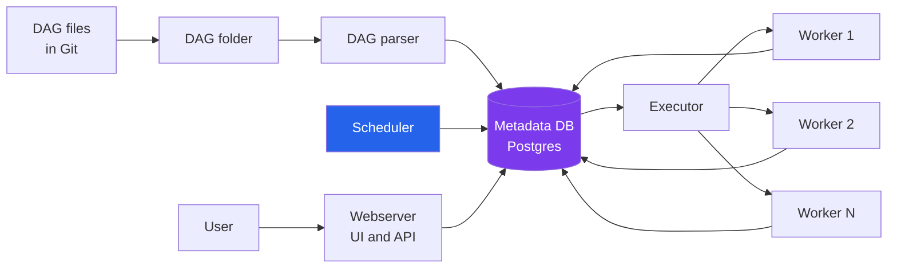
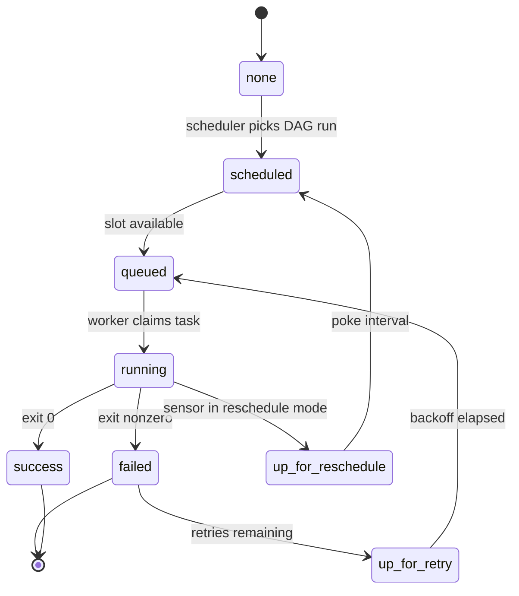
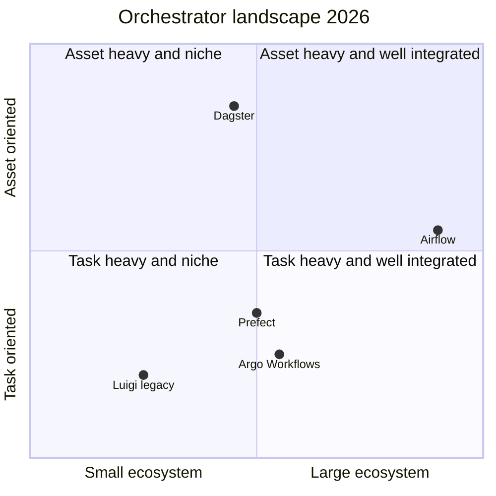

# Apache Airflow: The Orchestrator That Runs the Data World

Every data team eventually has the same fight. Somebody runs a script on their laptop at 7am to refresh a dashboard. Somebody else runs three SQL jobs on a cron on a bastion host. A third person has a Python notebook that nobody is sure is scheduled but there's a calendar reminder on a former employee's account. Things work — until they don't, and then nobody can tell what ran, what failed, or what depended on what.

The first time I watched that dynamic get solved, it was by an Airflow install that one of the senior engineers stood up in a weekend. Three months later, every scheduled thing at the company ran through it, and "what happened last night?" became a link to a graph instead of a two-hour detective story. That's the quiet value of orchestration — it's invisible when it's working, and it's the difference between a team that ships reliably and one that's always recovering from the last incident.

This post is a working guide to Apache Airflow as it stands in late 2026, after the Airflow 3.0 release turned some long-standing pain points into resolved questions. We'll cover what Airflow actually is (not the slide-deck version — the actual moving parts), the mental model you need to stop writing DAGs that surprise you, the TaskFlow API and when the classic operators still beat it, Assets and event-driven scheduling, DAG versioning, the three executors and when to pick each, the hard-won best practices around idempotency and XComs, the honest comparison with Prefect and Dagster, and the parts where Airflow is still not the right answer. By the end you should be able to decide whether it fits your problem and ship something non-trivial if it does.

## What Airflow Actually Is

Airflow started at Airbnb in 2014, was open-sourced in 2015, joined the Apache Foundation in 2016, and hit 1.0 in 2017. Ten years in, it's the orchestrator that runs more production data pipelines than all of its competitors combined. There's a reason. It's not that Airflow is the most elegant system anyone has ever built — it isn't — but it has the widest ecosystem, the deepest bench of integrations (providers for AWS, GCP, Snowflake, dbt, Kubernetes, Databricks, and nearly every database and SaaS you've heard of), and the largest pool of engineers who have already debugged the same problem you're about to hit.

At the core, Airflow is four things talking to a database:

- A **scheduler** that decides what should run next.
- An **executor** that actually runs tasks (locally, on Celery workers, on Kubernetes pods).
- A **webserver** that serves the UI.
- A **metadata database** that stores the state of every DAG, task, and run.

Everything else — DAGs, operators, plugins, providers, sensors, assets — is a user-facing abstraction on top of those four moving parts.



The thing to internalize from this diagram is that **the metadata database is the truth**. The scheduler reads it, the executor writes to it, the workers update it, the UI queries it. If you understand that Airflow is really a state machine whose state lives in Postgres, a lot of surprising behavior stops being surprising. Tasks can fail because the database was slow. DAGs can "get stuck" because the scheduler couldn't advance the state. Parallelism is bounded not just by workers but by the metadata database's ability to handle concurrent writes. This is the hidden bottleneck of every Airflow deployment that outgrows its default config.

## The Core Abstractions You Need to Know

Airflow has a small vocabulary that you have to get right, because using a word loosely will bite you later. Four terms matter most:

**DAG** (Directed Acyclic Graph) — a Python file that defines a set of tasks and their dependencies. A DAG is a *template*, not an execution. When you write `my_daily_pipeline.py`, you're describing what should happen; you're not running anything.

**DAG run** — a single execution of a DAG at a specific logical date. If your DAG runs daily, each day is one DAG run. DAG runs have their own state (queued, running, success, failed) independent of the DAG itself.

**Task** — a node in the DAG. A task is, again, a template: "run this Python function" or "execute this SQL query" or "spin up this Kubernetes pod." Tasks become task instances when the DAG runs.

**Task instance** — one execution of one task in one DAG run. This is what actually runs. Task instances have retries, logs, durations, and states. When you debug Airflow, 90% of the time you are looking at task instances.

The mental model that makes everything else click: **Airflow compiles your DAG file to a set of task templates, the scheduler stamps out DAG runs at the right moments, and each DAG run spawns task instances that the executor dispatches to workers**. Once you see it that way, questions like "why is my task running on a date that's not today?" resolve themselves. The task is running for a *logical date* that the scheduler picked, which might be backfilling yesterday or catching up on a missed interval.

### The task instance state machine

Task instances move through a specific set of states, and knowing the transitions saves you hours of debugging.



A few states confuse people. `queued` means the executor has accepted the task but no worker has picked it up yet — if you see tasks stuck here, the issue is usually worker capacity or executor misconfiguration. `up_for_reschedule` is unique to sensors running in reschedule mode: instead of holding a worker slot while polling, the task releases the slot and gets re-scheduled later. It's the difference between a sensor that costs you a slot for hours and one that costs you nothing between pokes.

## TaskFlow vs Classic Operators

Airflow supports two styles of writing DAGs, and they coexist rather than compete. The choice is less ideological than it sounds.

**Classic operators** are the original Airflow API. You instantiate an operator class (`PythonOperator`, `BashOperator`, `PostgresOperator`, `SparkSubmitOperator`) and pass its arguments to configure what it does. Dependencies are wired up with the `>>` bitshift operator or explicit `set_downstream` calls.

```python
from airflow import DAG
from airflow.operators.python import PythonOperator
from datetime import datetime

def extract():
    # pull data from source
    return 42

def transform(**context):
    value = context["ti"].xcom_pull(task_ids="extract")
    return value * 2

with DAG(
    dag_id="classic_example",
    start_date=datetime(2026, 1, 1),
    schedule="@daily",
    catchup=False,
) as dag:
    t1 = PythonOperator(task_id="extract", python_callable=extract)
    t2 = PythonOperator(task_id="transform", python_callable=transform)
    t1 >> t2
```

**TaskFlow** is the 2.0-era (and now default in 3.x) decorator-based API. You write plain Python functions decorated with `@task`, and Airflow figures out the dependency graph from how your functions call each other.

```python
from airflow.decorators import dag, task
from datetime import datetime

@dag(start_date=datetime(2026, 1, 1), schedule="@daily", catchup=False)
def taskflow_example():
    @task
    def extract():
        return 42

    @task
    def transform(value: int):
        return value * 2

    transform(extract())

taskflow_example()
```

The TaskFlow version is shorter, the data flow is explicit (you pass values between functions; XComs happen under the hood), and the type hints work. For 80% of DAGs, TaskFlow is the right choice in 2026.

The 20% where classic operators win: when you're using a specialized operator that wraps a real external system (SnowflakeOperator, KubernetesPodOperator, DbtRunOperator, SparkSubmitOperator). Wrapping these in `@task` adds noise without value; just instantiate the operator directly. The modern pattern is "TaskFlow for Python tasks, classic operators for external-system tasks, in the same DAG." That mixing is supported and encouraged.

## Assets: Event-Driven Scheduling

In Airflow 2.4, the project introduced "Datasets" — a way to express that a DAG produces some logical artifact and that other DAGs should run when that artifact is updated. In Airflow 3.0, Datasets were renamed to **Assets** and the concept was expanded into a first-class scheduling primitive.

Here's the problem Assets solve. In the old model, every DAG had a time-based schedule: `@daily`, `0 6 * * *`, `@hourly`. If DAG B depended on DAG A's output, you had to pick a schedule for B that was after A "usually" finished, and hope A didn't run long. When A was late, B ran on stale data. When A was early, B ran at the old time and wasted a window. The whole industry had elaborate workarounds: `ExternalTaskSensor`, `TriggerDagRunOperator`, cron offsets chosen by vibes.

Assets replace all of that. You declare that a task *produces* an Asset and another DAG *consumes* it:

```python
from airflow.datasets import Asset
from airflow.decorators import dag, task
from datetime import datetime

orders_snapshot = Asset("s3://warehouse/orders_snapshot.parquet")

@dag(start_date=datetime(2026, 1, 1), schedule="@daily")
def extract_orders():
    @task(outlets=[orders_snapshot])
    def snapshot_orders():
        # ... write the file ...
        pass
    snapshot_orders()

@dag(start_date=datetime(2026, 1, 1), schedule=[orders_snapshot])
def downstream_analysis():
    @task
    def compute_metrics():
        pass
    compute_metrics()
```

When `snapshot_orders` finishes successfully, Airflow marks the Asset as updated. Any DAG with that Asset in its schedule runs automatically. No cron offsets, no sensors, no elaborate orchestration tricks. This is the single biggest ergonomic improvement in the 3.0 line, and it's the feature Dagster has been (correctly) pointing at for years. Airflow now has it.

You can combine Assets with time schedules, conjunctions of multiple Assets (`schedule=[asset_a, asset_b]` triggers when *any* updates; use `AssetAll(a, b)` for *both*), and even external events via the new event-driven scheduling interface that lets external systems mark Assets updated via the API.

## DAG Versioning: The Feature People Had Been Begging For

If you've run Airflow at any scale, you've hit this. You change a DAG file, it runs, a task fails, you look at the logs, and the logs refer to a task name that no longer exists because you renamed it in the same commit. Or: a backfill runs against the current DAG code, not the code that was active when the logical date you're backfilling happened. The whole "DAGs are Python files that Airflow re-parses every few seconds" architecture meant that the DAG was always *the current version*, which wreaked havoc on audit trails, backfills, and anyone trying to reason about "what did this pipeline look like last month?"

Airflow 3.0 finally fixed this with **DAG versioning**. Every DAG run is now tied to a specific version of the DAG code, typically a Git commit. When you look at a historical run in the UI, you see the task graph, the code, and the logs as they existed when that run happened. Backfills run against the code version you specify. Audit trails work.

The mechanics: Airflow 3 stores DAG code snapshots keyed by a version hash (usually the commit SHA you deploy with). The scheduler records the version at DAG run creation time. The UI pulls the matching snapshot when rendering. From a user's perspective it just works — you write DAGs the same way, but time travel now tells the truth.

This is a bigger deal than it sounds. It unlocks compliance use cases that were previously painful, it makes debugging historical failures straightforward, and it means the old "never rename a task unless you're ready to break three months of history" rule is finally gone.

## Executors: Picking the Right Engine

The executor is how Airflow actually runs tasks, and it's the configuration choice that most affects your operational experience. There are three you should know.

**LocalExecutor** runs tasks as subprocesses of the scheduler on the same machine. It's dead simple, has no external dependencies beyond the metadata database, and works well for single-node deployments up to maybe a few thousand task instances per day. Start here if you're unsure. If it turns out to be enough, don't complicate your life.

**CeleryExecutor** uses Celery — a Python distributed task queue backed by Redis or RabbitMQ — to dispatch tasks to a pool of worker processes that can live on any number of machines. It's the horizontally scalable option and has been the production default for years. Tradeoffs: you're now running Redis and a fleet of workers in addition to the scheduler and webserver, and you have to think about worker sizing, queue configuration, and failover.

**KubernetesExecutor** skips the long-running worker pool and instead spawns a fresh Kubernetes pod for every task. Each task runs in its own container, with its own CPU/memory limits, its own Python environment if needed, and its own lifecycle. Tradeoffs: pod startup adds 10-30 seconds of latency per task, which is fine for hour-long tasks and terrible for one-second tasks. It's the right choice when you're already on Kubernetes, when tasks have wildly different resource needs, or when you want strong isolation between tasks.

There's a fourth option worth mentioning — the **CeleryKubernetesExecutor** — which is a hybrid that routes some tasks to Celery workers (for low-latency tasks) and others to Kubernetes pods (for heavy, isolated, or dynamically-resourced tasks). It's the most flexible option and the one I see in larger production deployments.

| Executor | Best for | Latency | Complexity | Scaling |
|---|---|---|---|---|
| **LocalExecutor** | Single node, low volume | Lowest | Minimal | Vertical only |
| **CeleryExecutor** | Horizontal scale, mixed workloads | Low | Moderate, needs Redis | Horizontal |
| **KubernetesExecutor** | K8s-native, isolated tasks | Higher (pod startup) | Higher, needs K8s | Excellent, per-task |
| **CeleryKubernetes** | Mixed: fast tasks + heavy tasks | Mixed | Highest | Best of both |

Pick LocalExecutor until it hurts, then pick CeleryExecutor unless you're already deep in Kubernetes, in which case pick KubernetesExecutor. That recipe covers 95% of real deployments.

## The Golden Rule: Idempotency

If you take one operational principle from this post, take this: **every Airflow task must be idempotent**. Running it twice with the same inputs must produce the same result as running it once.

The reason is simple and unforgiving. Airflow will retry failed tasks. Airflow will backfill historical dates. You will manually re-run a task because you changed something upstream. You will clear a task because a data quality check caught a bug. In every one of those cases, the task runs again. If running it again creates duplicate rows, doubles financial totals, or sends a second email, you have a production incident waiting to happen.

Concrete rules that enforce idempotency in practice:

**Never use `INSERT` in a task that might be re-run.** Use `UPSERT`, `MERGE`, `INSERT ... ON CONFLICT`, or delete-then-insert bounded by the logical date. The task must be safe to run twice.

**Partition writes by logical date.** Write to `s3://bucket/table/dt=2026-12-03/` not `s3://bucket/table/latest/`. The first is a specific partition that can be overwritten idempotently; the second is a moving target that different runs will race to corrupt.

**Don't send external side effects without a dedupe key.** Webhooks, emails, Slack messages, Stripe charges — all of these need an idempotency key derived from the task and the logical date. Without it, a retry silently doubles your spend.

**Keep state out of the task itself.** A task that reads a counter, increments it, and writes it back is the canonical non-idempotent pattern. Use external state (a database row with an explicit primary key, or an Airflow Variable if truly tiny) and make updates deterministic from inputs.

**Prefer `execution_date` parameters to `now()`.** A task that uses `datetime.now()` is non-idempotent by construction — every run computes a different boundary. Use the logical date Airflow provides (`{{ ds }}`, or `logical_date` in TaskFlow) so that running the task for 2026-12-03 always processes the same window.

Breaking any of these is a bug. The bugs don't show up until a retry or a backfill, and then they show up as "the pipeline ran fine but the numbers are wrong," which is worse than a crash because you can't tell anything happened.

## XComs: Small Is Beautiful

XCom ("cross-communication") is how Airflow tasks share data. A task can push a value to XCom; downstream tasks can pull it. It's the mechanism TaskFlow uses under the hood when you pass return values between `@task` functions.

The rule is simple: **XComs are for metadata, not data**. A file path is metadata. A row count is metadata. A list of URLs to process is metadata. A 50 MB dataframe is *not* metadata, and putting it in an XCom will work for a while and then slowly suffocate your metadata database as the history accumulates.

For actual data, pass references instead: write the data to object storage or a table, push only the pointer to XCom, and have the downstream task read it. This is the 90% pattern for real pipelines.

```python
from airflow.decorators import dag, task
from datetime import datetime
import pandas as pd
import pyarrow.parquet as pq

@dag(start_date=datetime(2026, 1, 1), schedule="@daily", catchup=False)
def etl_example():
    @task
    def extract(logical_date: str) -> str:
        # Pull data, write to partitioned storage, return the path
        df = pd.read_sql("select * from orders where date = %(dt)s",
                          con=engine, params={"dt": logical_date})
        path = f"s3://warehouse/orders/dt={logical_date}/data.parquet"
        df.to_parquet(path, index=False)
        return path  # path is small, safe as an XCom

    @task
    def transform(path: str) -> str:
        df = pd.read_parquet(path)
        df["total"] = df["price"] * df["quantity"]
        out_path = path.replace("/orders/", "/orders_enriched/")
        df.to_parquet(out_path, index=False)
        return out_path

    @task
    def load(path: str):
        # UPSERT into warehouse
        pass

    load(transform(extract("{{ ds }}")))

etl_example()
```

Airflow 3 does support "XCom backends" that transparently write large XComs to S3 or another blob store instead of the metadata database, which makes it possible to pass larger payloads through the `@task` interface without bloating Postgres. Use them if you need the ergonomics. But the "pass pointers, not data" pattern is still cleaner and more portable.

## Testing DAGs Without Running Airflow

One of the longest-standing complaints about Airflow was that you needed a running Airflow to test anything. This has gotten much better, but it's worth knowing what's genuinely testable without infrastructure.

**Unit-test the task logic, not the DAG.** If your task is a Python function (TaskFlow or classic), it's just a function. Call it in a pytest test with fake inputs and assert on the output. Most of the value of your DAG code lives in these pure functions, and they should be tested like any other Python code.

**Lint the DAG file for import and parse errors.** A simple test that imports every DAG file and asserts it parses without errors catches 80% of the bugs that would otherwise be discovered at deploy time. The Astronomer `astro dev parse` command and the open-source `pytest-airflow` plugin both do this.

**Use `airflow dags test`** to run a single DAG end-to-end against a local metadata DB without involving the scheduler. This is the fastest way to validate that dependencies fire correctly and that the DAG runs green. It won't catch problems that only appear under real scheduler pressure, but it catches most structural bugs.

**Integration tests** against a containerized Airflow deployment are worth writing for your most critical pipelines but expensive to maintain. Reserve them for the handful of DAGs that cannot fail silently.

The golden testing pattern: **extract your task logic into plain Python functions in a separate module, unit-test those to death, and keep the DAG file thin**. A DAG file should mostly be plumbing. If your `@task` function has 200 lines of business logic, you're testing the wrong unit.

## The Orchestrator Landscape

Airflow is not the only choice in 2026, and pretending otherwise would be dishonest. The two real competitors are Prefect and Dagster, and they're each interesting for different reasons.

**Prefect** bets on Python-first ergonomics. Writing a Prefect flow feels like writing plain Python with decorators; there's less scaffolding and the local dev experience is excellent. Prefect Cloud's architecture is genuinely different from Airflow's: the orchestration layer is SaaS, your code runs wherever you deploy it, and the coordination happens via a lightweight agent. This is great for teams that want orchestration-as-a-service without running Postgres and Redis themselves.

**Dagster** bets on the asset as the primary abstraction. Where Airflow still thinks in terms of tasks with Assets bolted on, Dagster is asset-native: every piece of your pipeline is a data asset, the lineage is tracked automatically, and the system can skip unnecessary work by noticing that upstream assets haven't changed. Dagster is the right choice when your problem is genuinely "materialize these data products correctly" and you want strong lineage and testability from day one.



My honest read after watching all three in production:

- **Pick Airflow** if you need the widest integration ecosystem, your team already has Airflow experience, or you're operating in an enterprise environment where "boring and battle-tested" is a feature, not a bug. 90% of the teams I work with land here and don't regret it.
- **Pick Prefect** if your team is small, your workflows are highly dynamic (conditional branching, runtime-shaped graphs), and you value local dev ergonomics over ecosystem depth.
- **Pick Dagster** if data lineage and asset materialization are the core of your problem, if you want pipeline code to feel like well-tested software, and if you're willing to invest in the asset-first mental model.

The truth that vendors won't tell you: for most production workloads, the choice doesn't actually determine success. How rigorously you enforce idempotency, how cleanly you separate business logic from orchestration, and how seriously you take monitoring are all more load-bearing than which tool you pick.

## Observability: What "Working" Actually Looks Like

A production Airflow deployment needs more than a green UI. The questions you need to be able to answer at 3am, in order of urgency:

1. **Did anything fail in the last run?** The UI tells you this, and there should be an alert channel (Slack, PagerDuty) fed by task failure callbacks.
2. **Is the scheduler keeping up?** The scheduler has metrics for queue depth, DAG parse time, and loop duration. If parse time exceeds scheduling interval, you're compounding a backlog and the UI will *look* fine until everything is suddenly late.
3. **Is the metadata database healthy?** Postgres CPU, connection count, and slow query logs. The metadata DB is the single point of failure for Airflow and the most common cause of "everything is mysteriously slow."
4. **How long did each task take compared to its historical baseline?** Task duration trends catch performance regressions days or weeks before they become incidents.
5. **Are there any zombie tasks or orphaned jobs?** Airflow will occasionally lose track of a task whose worker died; these need cleanup or they accumulate.

Astronomer's observability product, the Airflow REST API, and OpenTelemetry integration in Airflow 3 cover most of this out of the box. If you're rolling your own, Prometheus + Grafana with the `airflow-exporter` gives you enough to spot the big problems.

## When Airflow Is Not the Right Answer

Airflow is the safe default for most data orchestration. It is not the right tool for:

**Streaming data.** Airflow is a batch scheduler. If you need to process events with sub-second latency, reach for Flink, Spark Structured Streaming, or Kafka Streams, not Airflow.

**ML model serving.** Airflow can trigger model training, but serving is not its job. Use Triton, KServe, or a cloud-native model server.

**Application workflows.** Sending user-facing emails, processing payments, coordinating microservices — these need millisecond latency and task-level retries that don't fit Airflow's batch model. Use Temporal, AWS Step Functions, or a dedicated workflow engine.

**Ad-hoc data science.** Jupyter notebooks and Airflow DAGs are different tools. Don't force exploratory work into a DAG; it'll slow you down without adding value. Productionize notebooks *into* Airflow once they stabilize.

**Simple cron.** If you have three jobs that run independently every night and never fail, cron is fine. Airflow's overhead is worth it once you have dependencies, retries, and visibility requirements — not before.

## Closing Thoughts

Airflow is a mature, opinionated, occasionally frustrating piece of infrastructure that runs more of the data world than any alternative. Its value isn't that it's the most elegant orchestrator — it isn't — but that it's the one where every problem you'll hit has been hit and solved by a thousand teams before you. That's underrated in a field that loves novelty.

The 3.0 release fixed the issues that had been making me recommend "Airflow, but grudgingly" for years: DAG versioning makes history honest, Assets make event-driven scheduling first-class, and the UI rewrite finally feels modern. In 2026, "use Airflow" is advice I give without reservations.

The things that make an Airflow deployment actually work are unglamorous: idempotent tasks, thin DAG files with logic extracted into testable modules, XComs that carry pointers not payloads, and an executor that matches your scale. Get those right and you have a pipeline fleet that runs for years. Get them wrong and no amount of new features will save you.

## Going Deeper

**Books:**
- Harenslak, B. P., & de Ruiter, J. R. (2021). *Data Pipelines with Apache Airflow.* Manning.
  - Still the most practical Airflow book. Written before 3.0 so a few chapters are dated, but the DAG design patterns and production-hardening advice remain the best available in book form.
- Kleppmann, M. (2017). *Designing Data-Intensive Applications.* O'Reilly.
  - Not Airflow-specific, but the chapters on batch processing, idempotency, and consistency are exactly the conceptual grounding you need to write Airflow DAGs that don't corrupt your warehouse.
- Reis, J., & Housley, M. (2022). *Fundamentals of Data Engineering.* O'Reilly.
  - Places orchestration in the broader data engineering lifecycle and explains why the tool you pick matters less than the practices you enforce around it.
- Beyer, B., Jones, C., Petoff, J., & Murphy, N. R. (2016). *Site Reliability Engineering.* O'Reilly.
  - The SRE book's chapters on on-call, postmortems, and monitoring apply directly to running Airflow in production. Reading it changed how I think about pipeline reliability.

**Online Resources:**
- [Airflow Official Documentation](https://airflow.apache.org/docs/) — The docs have improved dramatically since 2.0. The "Best Practices" page and the "Core Concepts" section are essential reading.
- [Astronomer Learn](https://www.astronomer.io/docs/learn/) — Astronomer is the company behind much of modern Airflow. Their tutorials and guides are the highest-quality free resource on the tool, and they cover 3.x features first.
- [Airflow Providers Index](https://airflow.apache.org/docs/apache-airflow-providers/packages-ref.html) — The full catalog of provider packages. Bookmark this; when you need to integrate with anything (AWS, GCP, Snowflake, dbt, Slack), check here before writing custom code.
- [Awesome Airflow GitHub](https://github.com/jghoman/awesome-apache-airflow) — Community-curated list of Airflow resources, plugins, and tutorials. Good for finding niche patterns.

**Videos:**
- [Airflow Summit Talks](https://www.youtube.com/@ApacheAirflow) on the Apache Airflow YouTube channel — The annual Summit is the best source of real-world production stories and deep dives into new features. The "How X runs Airflow" talks are especially valuable.
- [Marc Lamberti's Airflow tutorials](https://www.youtube.com/@MarcLamberti) — Long-running, well-paced tutorial series that stays up to date with current versions. A good starting point if you prefer video learning.

**Academic and Industry Papers:**
- Gorakala, S. K., Ghotekar, A., & others. (2024). ["Modern Data Orchestration: A Comparative Analysis of Workflow Management Systems."](https://arxiv.org/abs/2410.11234) *arXiv:2410.11234.*
  - A systematic comparison of Airflow, Prefect, Dagster, and Argo Workflows with benchmarks on throughput, latency, and developer experience.
- Beauchemin, M. (2017). ["The Rise of the Data Engineer."](https://medium.com/free-code-camp/the-rise-of-the-data-engineer-91be18f1e603) Free Code Camp.
  - Written by Airflow's original author, this essay explains why orchestration became a distinct discipline and the philosophical choices behind Airflow's design.

**Questions to Explore:**
- If Assets are the future, does it make sense for Airflow's core abstraction to remain the task, or will the next major version make the asset primary and the task secondary? What does Airflow look like if that refactor happens?
- DAG versioning finally tied runs to code snapshots, but what about the data? Should an orchestrator also version the input and output datasets of each run, creating a fully time-machine-able history of the pipeline? Is that a feature or a storage nightmare?
- The executor model (one pool of workers serving all tasks) dates from an era when tasks were small and homogeneous. In a world where tasks are increasingly LLM calls, dbt runs, and Spark jobs with wildly different profiles, should the executor become per-task by default?
- Most Airflow outages are caused by the metadata database, yet the metadata database is treated as an implementation detail. Should the Airflow community invest in making the metadata layer pluggable (e.g., a Raft-backed key-value store) to move the scaling ceiling?
- What does orchestration look like when every pipeline is triggered by an LLM agent making tool calls rather than a cron? Do existing orchestrators survive that transition, or does a new category emerge?
