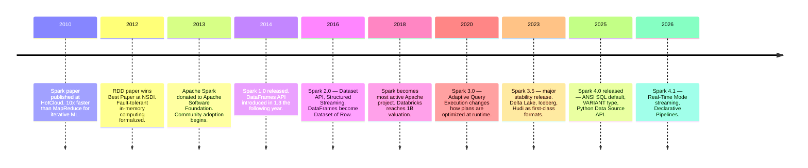
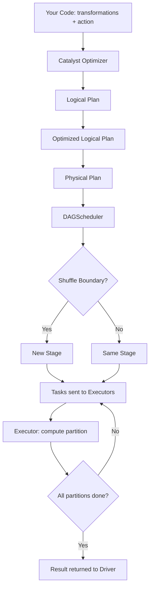
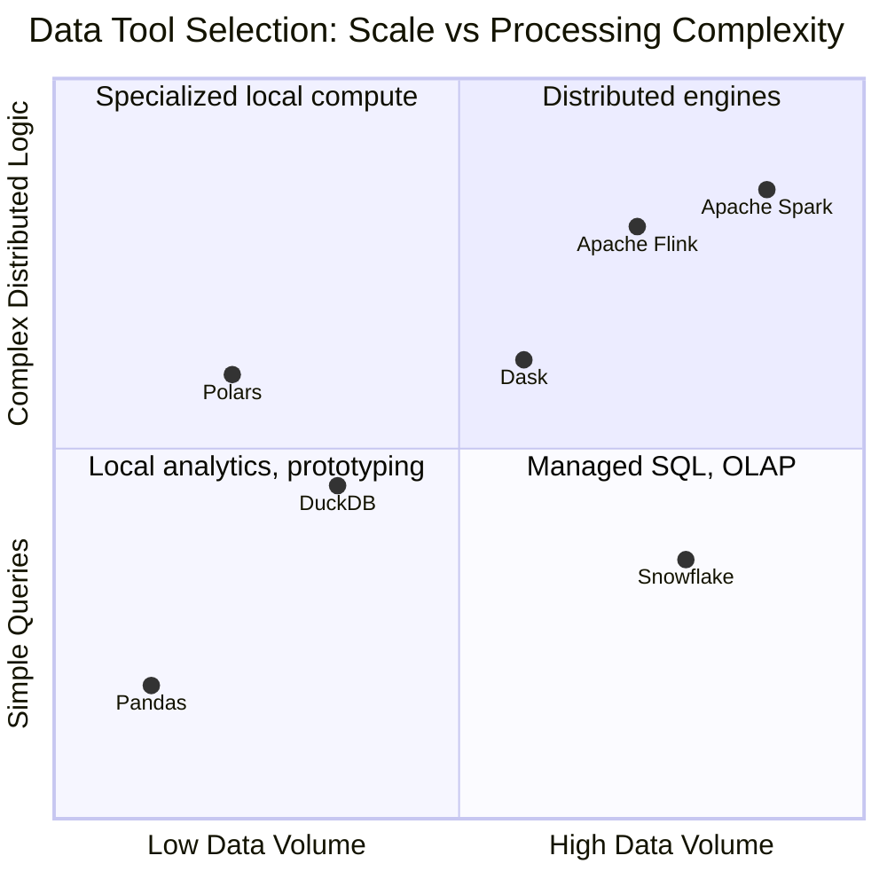

# Apache Spark: From a PhD Paper to the Backbone of the Modern Data Stack

In 2010, a graduate student at UC Berkeley named Matei Zaharia sat down with a genuinely irritating problem. He was working on a Hadoop MapReduce job for a machine learning algorithm. Machine learning means iteration — run the model, check the error, adjust the weights, run again. Do this a hundred times. But Hadoop MapReduce was designed for a different world: one pass over the data, write results to disk, start the next job. Every iteration of his algorithm required reading the same dataset from HDFS, processing it, writing intermediate results back to disk, and starting again. The disk I/O alone was killing performance. More fundamentally, the entire paradigm was wrong for what he was trying to do.

His answer was Spark. And the insight at its core was almost embarrassingly simple: what if intermediate data stayed in memory across computation steps instead of being flushed to disk between each one?

That single idea — in-memory cluster computing — became the foundation of most of the world's large-scale data processing infrastructure.

## The Problem Spark Was Built to Solve

To understand Spark, you need to understand what came before it.

Hadoop MapReduce, at its peak in the early 2010s, was genuinely revolutionary. It made distributed computation over commodity hardware accessible. You could write a `map` function and a `reduce` function, and Hadoop would figure out how to run those across a hundred machines, handle failures, and give you results. The underlying HDFS (Hadoop Distributed File System) gave you reliable, redundant storage across a cluster.

But MapReduce had two deep structural limitations.

The first was iterative algorithms. Any algorithm that needs to make multiple passes over the same data — gradient descent in machine learning, graph algorithms, k-means clustering — suffered badly. Each MapReduce job reads its input from disk and writes its output to disk. So a 100-iteration training loop doesn't just process the data once; it reads and writes it 100 times. On large datasets, this means hours where minutes should suffice.

The second was interactive analysis. If you wanted to explore a dataset interactively — query it, filter it, inspect results, refine your query — MapReduce's batch model forced you to launch a separate job for every query, each one paying the full cost of reading from disk and starting the JVM. This made interactive data exploration over large datasets essentially unusable.

Zaharia's 2010 paper, "Spark: Cluster Computing with Working Sets," presented a system that could execute iterative machine learning algorithms 10x faster than Hadoop by keeping data in memory across iterations. The 2012 follow-up, "Resilient Distributed Datasets: A Fault-Tolerant Abstraction for In-Memory Cluster Computing," won the Best Paper Award at NSDI and formalized the RDD abstraction that made this possible. Both papers share the same core authors: Zaharia, Chowdhury, Franklin, Shenker, and Stoica — a research group that went on to found Databricks.



## The RDD: A Distributed Dataset That Can Survive Failures

The core abstraction Zaharia invented was the **Resilient Distributed Dataset** — an immutable, partitioned collection of objects distributed across a cluster, with enough information to reconstruct any partition if a node fails.

The "resilient" part is what made this work in practice. If you're keeping data in memory across a cluster of commodity hardware, node failures are not edge cases — they're expected. MapReduce handled this by writing everything to disk (hence the performance problem). Spark's answer was lineage: instead of storing the data itself on multiple nodes, Spark stores the sequence of transformations that created it. If a partition is lost, Spark recomputes just that partition from its source, tracing back through the lineage graph. The cost of a failure is proportional to the cost of recomputing the lost partition, not the cost of reading everything from disk.

RDDs give you a functional API: `map`, `filter`, `flatMap`, `reduceByKey`, `groupByKey`. Transformations are lazy — calling `.map()` doesn't execute anything; it adds a step to the computation graph. Only an **action** (`.count()`, `.collect()`, `.saveAsTextFile()`) triggers actual computation.

But RDDs have a critical weakness: they're opaque to the optimizer. When you write:

```scala
// Scala — RDD API
val rdd = sc.textFile("hdfs://warehouse/transactions.csv")
val filtered = rdd.filter(line => line.split(",")(2).toDouble > 1000.0)
val result = filtered.map(line => (line.split(",")(0), line.split(",")(2).toDouble))
result.saveAsTextFile("hdfs://warehouse/high_value_transactions")
```

Spark has no idea what's in your CSV. It doesn't know that column 2 is a price field, that you're filtering on it before selecting column 0, or that there might be a smarter way to execute this. The lambda functions are black boxes. Spark executes exactly what you told it to, in exactly the order you told it to.

## Why Scala? The Language Choice That Shaped an Ecosystem

Spark was written in Scala, and this was not an arbitrary choice.

Scala runs on the JVM, which in 2010 meant immediate access to the entire Hadoop ecosystem — HDFS, YARN, and all the Java libraries that the data engineering world was built on. Java itself was too verbose for the kind of functional, data-transformation-heavy code that a distributed computing framework needs. Python lacked the JVM integration and, at the time, the performance characteristics needed for a cluster computing framework.

Scala gave Spark three things: JVM compatibility, a type system sophisticated enough to express distributed data operations safely, and native functional programming idioms — immutable data structures, higher-order functions, pattern matching — that map naturally onto the map/filter/reduce model of distributed computation.

For users, this has two important consequences.

First, the **Dataset API** in Scala (and Java) gives you compile-time type safety. A `Dataset[Transaction]` is not just a collection of rows — it's a typed collection where the compiler knows the schema and can catch type errors before you ever run the job:

```scala
// Scala — typed Dataset API
case class Transaction(
  customerId: String,
  productId: String,
  amount: Double,
  timestamp: java.sql.Timestamp
)

val transactions: Dataset[Transaction] = spark
  .read
  .schema(Encoders.product[Transaction].schema)
  .parquet("gs://data-lake/transactions/")

// This line would fail at compile time if 'amount' didn't exist
// or wasn't numeric — not at runtime on a 10TB job
val highValue: Dataset[Transaction] = transactions
  .filter(_.amount > 1000.0)
  .orderBy("timestamp")
```

This matters in production. A type error caught at compile time on your laptop is infinitely cheaper than a runtime exception discovered at 3am on a production cluster processing 10TB of data.

Second, Python users working through **PySpark** pay a translation cost. PySpark exposes the Spark API through Python bindings, but underneath, computation happens on the JVM. Objects cross a serialization boundary between the Python process and the JVM — and this boundary has historically been a significant performance penalty, especially for user-defined functions (UDFs) written in Python.

The modern mitigation is **Apache Arrow**: a columnar in-memory format that allows data to move between Python and the JVM efficiently, in batches, without row-by-row serialization. When you write a Pandas UDF today, Arrow is what makes it performant:

```python
# PySpark — Pandas UDF with Arrow (production-quality)
from pyspark.sql.functions import pandas_udf
from pyspark.sql.types import DoubleType
import pandas as pd

# Arrow batches the data — this UDF runs on vectors, not row-by-row
@pandas_udf(DoubleType())
def apply_risk_score(amounts: pd.Series, tenors: pd.Series) -> pd.Series:
    # Custom business logic that benefits from vectorized pandas operations
    base_score = amounts.clip(upper=10_000) / 10_000
    tenor_adjustment = tenors.apply(lambda t: 1.2 if t > 365 else 1.0)
    return base_score * tenor_adjustment

# Enable Arrow-based execution — critical for UDF performance
spark.conf.set("spark.sql.execution.arrow.pyspark.enabled", "true")

df = spark.read.parquet("gs://risk-data/exposures/")
scored = df.withColumn(
    "risk_score",
    apply_risk_score(df["notional_amount"], df["tenor_days"])
)
```

The performance gap between PySpark and Scala Spark has narrowed substantially since Arrow was introduced. For DataFrame and SQL operations — which go through Spark's Catalyst optimizer regardless of language — the gap is minimal. For iterative algorithms and heavy UDF usage, Scala still wins by a meaningful margin.

## From RDDs to DataFrames: Giving Spark Eyes

The second major evolution in Spark's history was the introduction of the **DataFrame API** in Spark 1.3 (2015).

The key idea: if Spark knows the schema of your data — the column names, their types — it can optimize your computation in ways it can't with opaque RDDs. The **Catalyst optimizer** uses this schema information to apply transformations automatically:

- **Predicate pushdown**: If you filter on a column before a join, move the filter as early as possible — ideally into the file reader itself, so you never read data you're going to discard.
- **Column pruning**: Only read the columns you'll actually use, not every column in a wide table.
- **Join reordering**: If your query joins three tables, rearrange the join order to minimize intermediate data size.
- **Partition pruning**: If your data is partitioned by date and you're querying a single month, skip the other partitions entirely.

None of these optimizations are possible with RDDs, because Spark has no idea what your data looks like or what your lambdas are doing. With DataFrames, Spark can look at your query plan, understand its structure, and rewrite it to run faster — often significantly faster, without any changes to your code.

The **Spark 2.0 unification** (2016) completed this picture: Dataset and DataFrame became the same thing. A DataFrame is `Dataset[Row]` — a typed Dataset where the type is a generic Row. This gave Scala/Java users the option of full compile-time typing (`Dataset[MyType]`) while keeping a dynamically-typed API (`DataFrame`) for Python, SQL, and cases where runtime flexibility matters more than static guarantees.

## How Spark Actually Runs Your Code

Understanding Spark's execution model turns debugging from guesswork into a systematic process.

When you call an action on a DataFrame, the following sequence happens:



The key concept is the **stage**. Spark's DAGScheduler divides a job into stages at every shuffle boundary. A **shuffle** is any operation that requires data to move between partitions across the network — joins (usually), `groupBy`, `repartition`, `distinct`. Within a stage, each partition is processed independently in parallel. Between stages, the shuffle happens: data from all partitions is reorganized by key and sent to the partitions in the next stage.

Shuffles are the dominant cost in most Spark jobs. Every byte of data that crosses the network in a shuffle is a byte your cluster had to serialize, send, and deserialize. This is why understanding your data's distribution matters: if you join two large tables on a skewed key (where one value appears much more frequently than others), you'll end up with one massive partition doing all the work while the rest of your cluster sits idle. **Adaptive Query Execution** (AQE), introduced in Spark 3.0, helps here by measuring actual runtime statistics and adjusting partition counts and join strategies on the fly — but it can't eliminate skew in fundamentally unequal data.

The practical implication for production code:

```python
from pyspark.sql import SparkSession
from pyspark.sql import functions as F

spark = SparkSession.builder \
    .appName("customer-risk-aggregation") \
    .config("spark.sql.adaptive.enabled", "true") \       # let Spark adjust plans at runtime
    .config("spark.sql.shuffle.partitions", "400") \      # start here; AQE will optimize down
    .getOrCreate()

customers = spark.read.parquet("gs://risk-data/customers/")
transactions = spark.read.parquet("gs://risk-data/transactions/")

# Broadcast the smaller table to avoid a shuffle entirely
# This is the single most impactful optimization for large/small joins
from pyspark.sql.functions import broadcast

result = customers.join(
    broadcast(transactions.filter(F.col("status") == "ACTIVE")),
    on="customer_id",
    how="left"
) \
.groupBy("customer_id", "segment") \
.agg(
    F.sum("amount").alias("total_exposure"),
    F.countDistinct("product_id").alias("product_count"),
    F.max("event_date").alias("last_activity")
) \
.filter(F.col("total_exposure") > 50_000)

result.write \
    .mode("overwrite") \
    .partitionBy("segment") \
    .parquet("gs://risk-data/risk-aggregates/")
```

The `broadcast()` hint tells Spark: replicate this small DataFrame to every executor, so we can do the join locally without any network shuffling. If `transactions.filter(status == 'ACTIVE')` fits in memory on each executor (typically under a few GB), this can be the difference between a 20-minute job and a 3-minute job.

## The Ecosystem: Where Spark Becomes a Platform

Spark's true strength in 2026 isn't the engine alone — it's the ecosystem that has built around it. Understanding these integrations is what makes the difference between using Spark as a tool and using Spark as a platform.

### Delta Lake, Iceberg, and Hudi: The Lakehouse Layer

Object storage (S3, GCS, Azure ADLS) is cheap and effectively unlimited. But raw object storage has a problem: no ACID transactions. If your Spark job fails halfway through writing a table, you end up with partial data — some partitions from the new version, some from the old one. Concurrent readers and writers step on each other. Schema changes are risky. There's no way to query last week's version of a table.

This is the problem that **Delta Lake**, **Apache Iceberg**, and **Apache Hudi** solve — collectively known as "open table formats." All three sit on top of Parquet files in object storage and add a transaction log that enables ACID semantics, time travel, and schema evolution.

**Delta Lake** (from Databricks, now Apache) is the dominant choice when you're in a Spark-centric stack. Its transaction log is itself stored in Parquet, and it integrates seamlessly with Spark's DataFrame API:

```python
# Write with Delta format — ACID-safe, supports concurrent writers
result.write \
    .format("delta") \
    .mode("overwrite") \
    .option("overwriteSchema", "true") \
    .partitionBy("segment", "event_date") \
    .save("gs://risk-data/delta/risk-aggregates/")

# Time travel: read the table as it was 3 versions ago
# Essential for debugging, auditing, and ML experiment reproducibility
historical = spark.read \
    .format("delta") \
    .option("versionAsOf", 3) \
    .load("gs://risk-data/delta/risk-aggregates/")

# Or travel by timestamp — what did the table look like yesterday?
snapshot = spark.read \
    .format("delta") \
    .option("timestampAsOf", "2026-08-30T09:00:00") \
    .load("gs://risk-data/delta/risk-aggregates/")
```

**Apache Iceberg** (from Netflix) takes a different approach: instead of a Databricks-specific format, it's a truly open specification that any engine can implement independently. Spark, DuckDB, Trino, Flink, and Snowflake all have native Iceberg implementations. Its standout features are partition evolution (change how data is partitioned without rewriting the entire table) and schema evolution that's genuinely seamless. If you need to query the same tables from multiple engines — Spark for batch, Trino for interactive queries, Flink for streaming ingestion — Iceberg's multi-engine support is a strong argument.

**Apache Hudi** (from Uber) was designed for a specific problem: high-frequency streaming upserts into a data lake. Uber's use case was processing millions of ride events per second and needing those changes to be queryable within seconds. Hudi's Merge-on-Read (MoR) mode handles this by appending incremental change logs quickly and deferring the cost of merging them with the base data to query time. If your primary workload is CDC (Change Data Capture) synchronization from a transactional database at high frequency, Hudi is worth considering.

### Kafka and Structured Streaming

Spark's streaming story is called **Structured Streaming**, and its key insight is elegant: treat a stream as an unbounded table. New data arriving from a Kafka topic is just rows being appended to a table that never ends. You write the same SQL or DataFrame operations you'd write for a batch job, and Spark figures out how to execute them incrementally as data arrives:

```python
# Structured Streaming: Kafka source → aggregation → Delta sink
# The same API as batch — Spark handles the incremental execution
from pyspark.sql.functions import from_json, col, window
from pyspark.sql.types import StructType, DoubleType, StringType, TimestampType

event_schema = StructType() \
    .add("customer_id", StringType()) \
    .add("amount", DoubleType()) \
    .add("event_time", TimestampType()) \
    .add("event_type", StringType())

# Read from Kafka — this returns a streaming DataFrame, not a static one
raw_stream = spark.readStream \
    .format("kafka") \
    .option("kafka.bootstrap.servers", "kafka-broker:9092") \
    .option("subscribe", "payment-events") \
    .option("startingOffsets", "latest") \
    .load()

parsed = raw_stream.select(
    from_json(col("value").cast("string"), event_schema).alias("data"),
    col("timestamp").alias("kafka_ts")
).select("data.*", "kafka_ts")

# Windowed aggregation with watermark — tells Spark when to drop late data
# Without a watermark, stateful operations leak memory indefinitely
windowed_totals = parsed \
    .withWatermark("event_time", "10 minutes") \
    .groupBy(
        window("event_time", "5 minutes"),
        "customer_id"
    ) \
    .agg(F.sum("amount").alias("window_total"))

# Write to Delta Lake — queryable by batch jobs immediately
query = windowed_totals.writeStream \
    .format("delta") \
    .outputMode("append") \
    .option("checkpointLocation", "gs://checkpoints/payment-windows/") \
    .start("gs://risk-data/delta/payment-windows/")

query.awaitTermination()
```

The **watermark** in this example is critical. Without it, Spark must keep state for every window indefinitely in case late events arrive — and state accumulates without bound. The watermark `"10 minutes"` tells Spark: events that arrive more than 10 minutes late relative to the maximum event time seen can be dropped. Once a window is watermarked, Spark can purge its state and free memory.

Spark 4.1 (December 2025) introduced **Real-Time Mode (RTM)** — a continuous processing mode targeting sub-second end-to-end latency for cases where micro-batch's few-hundred-millisecond latency floor isn't sufficient.

### MLlib: Machine Learning Where the Data Lives

MLlib is Spark's built-in machine learning library. The core value proposition is simple: when your training data is already on a Spark cluster, running ML without moving the data is dramatically more efficient than exporting it to a single machine and training there.

MLlib provides classification (logistic regression, random forests, gradient boosted trees), regression, clustering (k-means, bisecting k-means, Gaussian mixtures), collaborative filtering, and a pipeline API that mirrors scikit-learn's design:

```python
from pyspark.ml import Pipeline
from pyspark.ml.feature import VectorAssembler, StandardScaler
from pyspark.ml.classification import GBTClassifier
from pyspark.ml.evaluation import BinaryClassificationEvaluator

# Build a feature vector from the columns Spark already knows about
assembler = VectorAssembler(
    inputCols=["total_exposure", "product_count", "days_since_activity", "segment_encoded"],
    outputCol="raw_features"
)
scaler = StandardScaler(inputCol="raw_features", outputCol="features")
gbt = GBTClassifier(featuresCol="features", labelCol="default_label", maxIter=50)

pipeline = Pipeline(stages=[assembler, scaler, gbt])

train_df, test_df = labeled_data.randomSplit([0.8, 0.2], seed=42)
model = pipeline.fit(train_df)

evaluator = BinaryClassificationEvaluator(labelCol="default_label")
auc = evaluator.evaluate(model.transform(test_df))
print(f"Test AUC: {auc:.4f}")

# Save the full pipeline — includes feature transformers + model
model.write().overwrite().save("gs://ml-models/credit-default-gbt/v3")
```

MLlib is not a replacement for PyTorch or scikit-learn for most ML work. It's the right tool when your dataset is genuinely too large to fit on a single machine's memory — multi-terabyte datasets where distributed feature computation and model training are necessary. For most datasets under a few hundred GB, you'll get faster iteration and more flexibility with scikit-learn on a well-provisioned single machine.

### Running on Kubernetes

Spark has supported native Kubernetes deployments since version 2.3 (2018), and in 2026 it's a mature, production-ready option. Kubernetes brings container-native execution, auto-scaling, and resource isolation. Each executor runs in its own pod. The Kubeflow Spark Operator manages job lifecycle:

```yaml
# spark-job.yaml — submit a Spark job to Kubernetes
apiVersion: sparkoperator.k8s.io/v1beta2
kind: SparkApplication
metadata:
  name: risk-aggregation-daily
  namespace: data-engineering
spec:
  type: Python
  pythonVersion: "3"
  mode: cluster
  image: "gcr.io/myproject/spark:4.0.0-py3.11"
  mainApplicationFile: "gs://jobs/risk_aggregation.py"
  sparkVersion: "4.0.0"
  driver:
    cores: 2
    memory: "4g"
  executor:
    cores: 4
    memory: "16g"
    instances: 10
```

The main consideration with Spark on Kubernetes is **dynamic allocation**: having executors spin up and down as needed rather than holding a fixed number of pods. Kubernetes is better suited to this than YARN in many environments, since pod scheduling is a native capability. The trade-off is startup latency — cold-starting executors takes time, which matters for low-latency or interactive use cases.

## When Spark Is Not the Answer

Honest benchmarks from 2025-2026 are clear about something Spark practitioners sometimes resist: for data that fits on a single machine, **DuckDB and Polars beat Spark significantly** — not slightly.

A real example: a 500GB stock trade dataset analyzed for aggregations and joins:
- Spark on a 4-node cluster: ~14 minutes
- DuckDB on a single 16-core, 128GB VM: ~4 minutes

DuckDB operates entirely in-process — no cluster, no network, no JVM startup overhead. Its columnar execution engine and aggressive vectorization outperform Spark's distributed overhead when the data fits in memory. TPC-H benchmarks at the SF-10 and SF-100 scale factors consistently show DuckDB and Polars orders of magnitude faster than PySpark for single-machine workloads.

Here's the honest tool selection map:



The honest answer is: Spark is the right tool when data volume crosses the threshold where single-machine processing stops being viable, and when you need distributed iterative computation, complex stateful streaming, or a unified batch + streaming + ML platform across a large engineering organization. Below that threshold — which is higher than most people assume, given how fast modern single-machine tools have become — the simpler, faster local alternative is probably the better call.

## Production Pitfalls

Three failure modes account for the majority of Spark performance problems in production:

**Data skew.** One partition has 50GB of data while the other 199 have 500MB each. The entire job runs at the speed of the slowest task. Root cause: joining on a skewed key (like joining on a `status` field where 80% of rows have `status = 'ACTIVE'`). Mitigation: broadcast the smaller table if possible, enable AQE (`spark.sql.adaptive.skewJoin.enabled = true`), or apply key salting for very severe cases.

**The small files problem.** A pipeline that runs daily and writes 200 Parquet files per day produces 73,000 files after a year. HDFS and object storage metadata operations degrade, directory listings become slow, and downstream jobs reading those files pay the overhead of opening thousands of tiny files instead of a few large ones. The fix is coalescing before writing — `df.coalesce(20).write.parquet(...)` — or running a periodic compaction job that merges small files into larger ones. Delta Lake automates this with its `OPTIMIZE` command.

**Shuffle spill.** When the data participating in a shuffle exceeds executor memory, Spark writes temporary files to local disk (spill). The job doesn't fail — it just becomes dramatically slower, because disk I/O replaces memory access. Indicator: the Spark UI shows `Spill (Disk) > 0` for shuffle stages. Solutions: increase executor memory, reduce the number of records participating in the shuffle (filter earlier, push predicates closer to sources), or increase `spark.sql.shuffle.partitions` to distribute load across more, smaller partitions.

## Spark 4.0 and 4.1: What Changed

Spark 4.0 (May 2025) introduced several changes worth noting for teams upgrading:

**ANSI SQL mode is now default.** Spark previously used Hive-compatible SQL semantics, which handle some null cases and type coercions differently from the SQL standard. With 4.0, Spark follows the standard. This breaks code that depended on Hive's quirks — worth auditing before upgrading.

**The VARIANT data type.** Native support for semi-structured JSON data. Instead of storing JSON as a string column and parsing it with `from_json()` at query time, `VARIANT` stores parsed JSON in a columnar format that's 8x faster to query. If your pipelines handle event data, clickstreams, or API responses stored as JSON, this is a significant upgrade.

**Spark Connect is now lightweight.** The PySpark client can now be installed at 1.5MB (versus the full 355MB package) and connects to a remote Spark server. This changes the operational model: the Spark runtime lives on the cluster, not on the client machine. Interactive development, notebook environments, and CI/CD pipelines become cleaner.

**Spark 4.1** (December 2025) added Real-Time Mode for Structured Streaming — continuous processing with sub-second latency for cases where micro-batch's latency floor is too high — and **Spark Declarative Pipelines**, a higher-level abstraction for defining data transformation pipelines that handles dependency resolution, incremental execution, and error recovery automatically.

## The Bigger Picture

Spark's position in 2026 is that of an established, mature platform — not a new technology proving itself, but a load-bearing piece of infrastructure for most organizations processing data at meaningful scale. It's worth understanding deeply not because it's the newest or fastest tool for every job, but because it's likely already in your stack, or in the stack of whatever organization you join.

The investment in understanding it — really understanding how DAG execution works, why shuffles are expensive, what Catalyst does for your query plan, how Delta Lake's transaction log enables ACID semantics on object storage — pays off consistently. These concepts transfer: the shuffle cost in Spark maps directly to network cost in any distributed system. Lazy evaluation appears in dbt's model graph, in query planners everywhere. Watermarks in Structured Streaming are the same concept as watermarks in Apache Flink. The mental model Spark teaches you is more general than Spark itself.

## Going Deeper

**Books:**

- Chambers, B., & Zaharia, M. (2018). *Spark: The Definitive Guide.* O'Reilly Media.
  - Written by Spark's creator and a Databricks engineer. The authoritative text on Spark internals, the DataFrame API, Structured Streaming, and MLlib. Still largely relevant despite predating Spark 4.0.

- Perrin, J. (2024). *Learning Spark, 2nd Edition.* O'Reilly Media.
  - Updated coverage of Spark 3.x with modern patterns: Delta Lake, Spark Connect, Structured Streaming. Good for practitioners who want depth without going into Spark internals.

- Kleppmann, M. (2017). *Designing Data-Intensive Applications.* O'Reilly Media.
  - Not about Spark specifically, but the foundational context for understanding everything Spark is built on: stream vs. batch processing, fault tolerance, distributed state, exactly-once semantics.

- Huyen, C. (2022). *Designing Machine Learning Systems.* O'Reilly Media.
  - The chapter on feature stores and data pipelines gives essential context for understanding where Spark MLlib fits in the broader ML engineering landscape.

**Online Resources:**

- [Apache Spark Official Documentation](https://spark.apache.org/docs/latest/) — The Structured Streaming Programming Guide and SQL Performance Tuning section are the two most practical references for production work.

- [Databricks Engineering Blog](https://www.databricks.com/blog/category/engineering) — Research and engineering posts from the Spark creators. The posts on Adaptive Query Execution, Delta Lake internals, and Photon (Databricks' C++ vectorized engine) are particularly useful.

- [Delta Lake Documentation](https://docs.delta.io/latest/index.html) — Concise and well-organized. The section on table maintenance (OPTIMIZE, VACUUM, Z-Ordering) is essential for production Delta deployments.

- [Coiled TPC-H Benchmark: Spark vs Polars vs DuckDB vs Dask](https://docs.coiled.io/blog/tpch.html) — The most rigorous public comparison of distributed and local data tools across different data sizes. Essential reading for tool selection decisions.

**Videos:**

- [Apache Spark 3.0 Technical Overview](https://www.youtube.com/watch?v=l6SuXvhorDY) by Databricks — Matei Zaharia and the Spark team presenting the Adaptive Query Execution system, Spark Connect, and the direction of the platform.

- [Structuring Apache Spark 2.0](https://www.youtube.com/watch?v=1a4pgYzeFwE) by Michael Armbrust — The talk from Spark Summit 2016 that introduced Structured Streaming. Still the best explanation of the "streaming as an unbounded table" model and why it simplifies the API so dramatically.

**Academic Papers:**

- Zaharia, M., Chowdhury, M., Franklin, M. J., Shenker, S., & Stoica, I. (2010). ["Spark: Cluster Computing with Working Sets."](https://www.usenix.org/conference/hotcloud-10/spark-cluster-computing-working-sets) *HotCloud '10.*
  - The original Spark paper. Short (6 pages), readable, and historically important. The benchmark comparing Spark to Hadoop for iterative ML is the founding argument for the entire platform.

- Zaharia, M., Chowdhury, M., Das, T., Dave, A., Ma, J., McCauley, M., Franklin, M. J., Shenker, S., & Stoica, I. (2012). ["Resilient Distributed Datasets: A Fault-Tolerant Abstraction for In-Memory Cluster Computing."](https://www.usenix.org/conference/nsdi12/technical-sessions/presentation/zaharia) *NSDI '12.* Best Paper Award.
  - The formalization of the RDD abstraction. Explains the lineage-based fault tolerance model that makes in-memory distributed computing practical.

- Armbrust, M., Ghodsi, A., Xin, R., & Zaharia, M. (2022). ["Lakehouse: A New Generation of Open Platforms that Unify Data Warehousing and Advanced Analytics."](https://www.cidrdb.org/cidr2021/papers/cidr2021_paper17.pdf) *CIDR '22.*
  - The formal definition of the lakehouse architecture. Understanding this paper clarifies why Delta Lake, Iceberg, and Hudi exist and what problem they solve at the architectural level.

**Questions to Explore:**

- Spark's lazy evaluation model means computation doesn't happen until an action is called — which enables Catalyst to optimize the full query plan before running anything. But it also makes debugging harder: exceptions appear at action time, not at the line where the transformation was defined. How do you reconcile the optimization benefits of lazy evaluation with the need for traceable, debuggable code?

- DuckDB and Polars are demonstrably faster than Spark for datasets that fit on a single machine. Given that hardware continues to improve — 128GB RAM is commodity server pricing in 2026, 1TB+ servers are available — what's the actual threshold where Spark becomes the better tool? Does that threshold keep rising as single-machine capacity grows?

- Spark's shuffle is the core performance bottleneck for most large-scale jobs. Architecturally, the shuffle is a consequence of Spark's data model: partitioned, distributed, with no shared memory between partitions. Is there a fundamentally different distributed data model that avoids the shuffle bottleneck, or is it an inherent cost of horizontal scaling?

- The lakehouse table formats (Delta Lake, Iceberg, Hudi) all solve the same problem — ACID semantics on object storage — but with different design philosophies and trade-offs. As each format adds support for the features of the others (Hudi adding Iceberg support, Delta Lake adding UniForm for interoperability), are they converging into a single standard or will ecosystem fragmentation persist?

- Spark Connect separates the Spark client from the Spark runtime — your PySpark code on a laptop talks to a Spark cluster over a network connection. This changes the operational model significantly: you can upgrade the cluster without changing client code, route workloads across multiple clusters, and build lightweight client integrations. What new architectures does this enable that weren't practical before?
