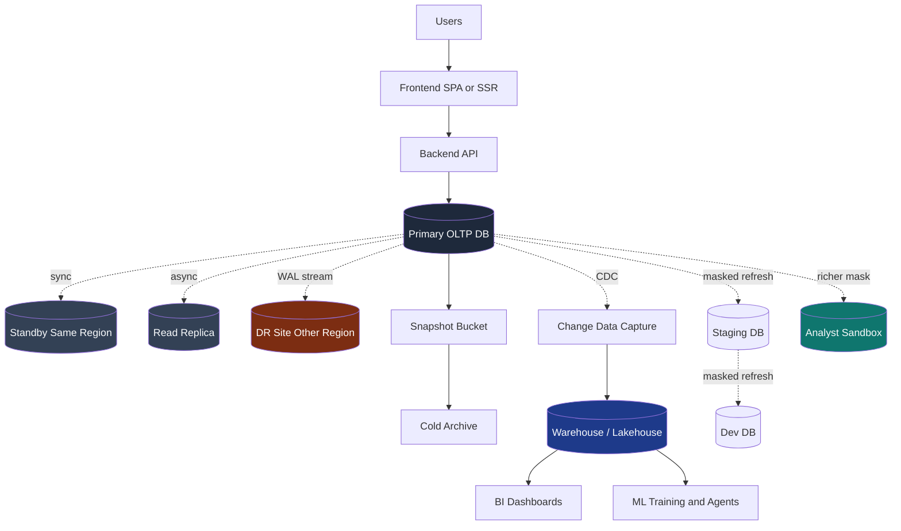
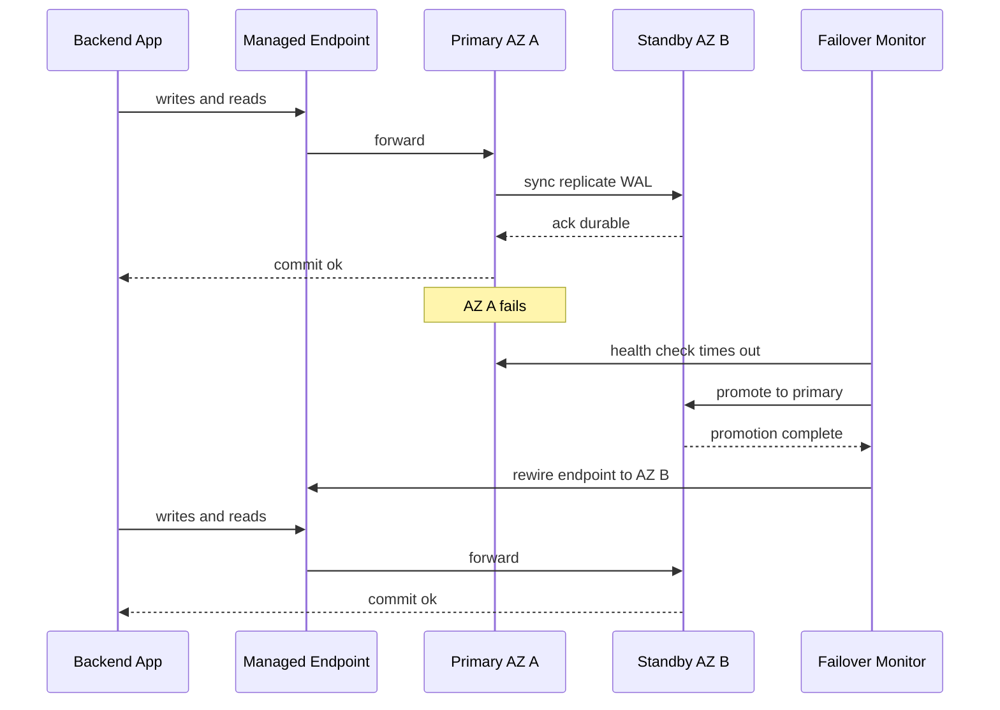
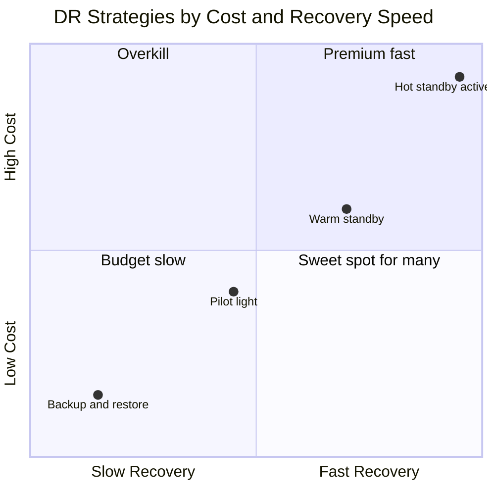

# The Forgotten Half of Your App: How Data Actually Flows Between Front, Back, and Backups

The whiteboard interview goes well for the first ten minutes. The candidate draws three boxes. A frontend on the left. A backend in the middle. A database on the right. Arrows in between. They explain authentication, request validation, caching, the ORM, indexing strategy. It is a competent answer.

Then the interviewer leans back and asks the question that quietly separates engineers who have shipped serious systems from those who have not.

"What about the backups?"

A pause. "We use, uh, automated backups."

"How often? What is the recovery window? What happens if your primary region goes down at three in the morning? Where do your analysts query from? How do you refresh staging without leaking production user data? What happens during a schema migration when the app is still running the old code?"

The pause gets longer.

This is not a gotcha. It is the most underdeveloped part of most engineers' mental model. The bootcamp diagram stops at the database. The framework tutorial stops at the database. But in production, the database is just one node in a much larger graph: a primary, one or more read replicas, a synchronous standby, an automated backup pipeline, a point in time recovery log, a disaster recovery site, a change data capture stream feeding a warehouse, a sanitized clone refreshing dev every Monday, and a richer temporary replica that the analytics and ML teams beat on without touching production.

The frontend and the backend are the visible half of the application. This second half, the lifecycle of bytes once they leave the request response loop, is the **data plane**. It is where production maturity lives, and for most app developers it is a blind spot.

This post is the map. Vocabulary defined, trade offs named, a default architecture you can copy, a decision tree for what you actually need.

---

## Naming The Gap

Pick any application you have built and ask three questions.

1. If the database disappears right now, how much data do you lose, and how long until you are back online?
2. Where does the analytics team get their numbers, and what happens to your application's tail latency when they run a six way join at end of quarter?
3. Your dev environment talks to a database. What is in that database, and how did it get there?

If any of those answers is "I don't know," you have located the gap.

The gap exists because the request response cycle is concrete. A click, a POST, a row insert, a 200 back. You can hold it in your head. The data plane is not concrete in the same way. It is mostly invisible during normal operation. Backups run at night. Replication lag is sub second. The DR site sits warm and unused. None of it shows up in the application logs the developer reads every morning. It only becomes concrete when something breaks, and by then the questions you should have answered six months ago are now incident questions.

Here is what the full picture actually looks like.



The frontend and backend live at the top. Everything below the primary database is the data plane. Each arrow has its own latency, its own consistency guarantee, its own failure mode, its own cost. The rest of this post walks through them.

---

## The Taxonomy: Replicas, Backups, Snapshots, Archives

Half the confusion in this area comes from words that sound interchangeable but mean different things. Before anything else, get the vocabulary straight.

A **replica** is a continuously updated copy of a database, kept in sync with the primary by streaming changes. A replica is a live system. You can query it. It has a process running. Its purpose is high availability, read scalability, geographic locality, or some combination.

A **snapshot** is a point in time, byte exact image of a database's storage, captured atomically. A snapshot is not a live database. You cannot query it directly. To use a snapshot you restore it into a new database instance. Modern cloud snapshots are typically incremental at the block level, which makes them cheap to take frequently.

A **backup** is a snapshot, or a chain of snapshots plus transaction logs, stored somewhere durable and isolated from the primary. The distinguishing feature of a backup is not its format but its **isolation**. A backup that lives in the same account, same region, same blast radius as the primary is not a backup. It is a convenience copy. A real backup survives the failure of the system it backs up.

An **archive** is a long term, infrequently accessed copy. Archives are the regulatory tail, the seven year retention obligation, the cold storage that costs almost nothing per terabyte but takes hours to retrieve. Archives are not for recovery. Archives are for compliance.

These four are not interchangeable. Replicas do not protect against logical errors, because the bad UPDATE replicates instantly. Snapshots do not protect against region failures unless they are copied out of region. Backups do not protect against the application losing data between snapshot intervals unless paired with continuous log shipping. Archives protect against nothing operational.

| Concept | Purpose | Granularity | Liveness | Survives primary failure | Survives logical error |
|---|---|---|---|---|---|
| Replica | HA, read scaling, geo locality | Continuous | Live, queryable | Only if cross region or via failover | No, the error replicates |
| Snapshot | Restorable point in time image | Periodic, often hourly or daily | Cold, must restore to use | Only if stored separately | Yes, if old enough |
| Backup | Disaster recovery and rollback | Snapshot plus log chain | Cold, must restore to use | Yes, if isolated | Yes |
| Archive | Compliance, long retention | Periodic, often monthly | Cold, slow retrieval | Yes | Yes |

Internalize this table. It is the most common source of confusion in postmortems. "We had a replica" is not the same as "we had a backup," and an engineer who treats them as equivalent is going to lose data the day a DELETE without a WHERE makes it through code review.

---

## Read Replicas: The First Step Past A Single Database

Once an application gets enough traffic, the read load alone is enough to make a single database wobble. Long running analyst queries collide with user facing transactions. The connection pool runs out. Tail latency starts climbing. The pragmatic answer is to add a **read replica**: a copy of the primary that accepts read traffic but rejects writes.

Replicas can be **synchronous** or **asynchronous**. The distinction is the single most important thing to understand about replication, because it determines what guarantees you can offer your users.

In synchronous replication, the primary does not acknowledge a transaction as committed until the replica has acknowledged that it has received and durably stored the change. The application sees better consistency at the cost of write latency. The primary cannot commit faster than the slowest synchronous replica.

In asynchronous replication, the primary acknowledges the commit immediately and ships the change to the replica in the background. Writes are fast, the primary is decoupled from the replica's health, but readers on the replica may see slightly stale data. AWS RDS read replicas, GCP Cloud SQL read replicas, and the standard PostgreSQL streaming replica are all asynchronous by default. AWS RDS Multi AZ standbys, on the other hand, use synchronous replication, which is why they are positioned as a high availability feature rather than a read scaling feature.

| | Synchronous | Asynchronous |
|---|---|---|
| Write latency | Higher, bounded by slowest replica | Same as standalone primary |
| Replica freshness | Effectively current at commit | Lagging by milliseconds to seconds |
| Failover data loss | None, RPO of zero | Up to the replication lag at failure time |
| Primary throughput sensitivity | High, replica health matters | Low, primary keeps moving |
| Typical role | HA standby, financial systems | Read scaling, analytics offload |

The lag in asynchronous replication is the part most engineers underestimate. Under steady load it is sub second. Under burst load, during a long running transaction on the primary, during a network blip, lag can spike to minutes. If your application reads its own writes from the replica, the user can submit a form, see "saved," refresh, and watch their changes vanish because the read hit the replica before the change replicated. This is the classic **read your own writes** anomaly, and it is why most production systems route reads from a freshly written user to the primary for a short window.

Routing reads to a replica is a read pattern decision, not an infrastructure decision. The application has to know which queries are safe to send to the replica. Reports, dashboards, search results, anything where staleness of a few seconds is harmless: replica. The user's own profile right after they edited it: primary. SQLAlchemy makes this explicit with bind keys.

```python
# Route most reads to the replica, writes and read-your-writes to the primary
from sqlalchemy import create_engine
from sqlalchemy.orm import sessionmaker, Session

engines = {
    "primary": create_engine(PRIMARY_URL, pool_size=20, pool_pre_ping=True),
    "replica": create_engine(REPLICA_URL, pool_size=40, pool_pre_ping=True),
}

class RoutingSession(Session):
    def get_bind(self, mapper=None, clause=None, **kw):
        # Writes always go to the primary
        if self._flushing or kw.get("force_primary"):
            return engines["primary"]
        # Reads default to the replica
        return engines["replica"]

SessionFactory = sessionmaker(class_=RoutingSession)

def fetch_user_dashboard(user_id: int):
    with SessionFactory() as s:
        # Safe to read from replica, slightly stale is fine for a dashboard
        return s.query(Activity).filter_by(user_id=user_id).limit(50).all()

def fetch_user_profile_after_edit(user_id: int):
    with SessionFactory() as s:
        # Force primary so the user sees their own edit
        return s.query(User).populate_existing().with_for_update(read=True)\
                .execution_options(force_primary=True).get(user_id)
```

Replication lag is also something you must monitor. A replica that is silently three hours behind is worse than no replica at all, because your dashboards lie. The cheapest sanity check is a small heartbeat table that the primary writes to every few seconds, and a query that compares the latest heartbeat on the replica to wall clock.

```python
import time, psycopg
from datetime import datetime, timezone

def write_heartbeat(primary_dsn: str):
    with psycopg.connect(primary_dsn, autocommit=True) as conn:
        conn.execute(
            "INSERT INTO replication_heartbeat (id, ts) VALUES (1, %s) "
            "ON CONFLICT (id) DO UPDATE SET ts = EXCLUDED.ts",
            (datetime.now(timezone.utc),),
        )

def replica_lag_seconds(replica_dsn: str) -> float:
    with psycopg.connect(replica_dsn) as conn:
        row = conn.execute("SELECT ts FROM replication_heartbeat WHERE id = 1").fetchone()
    return (datetime.now(timezone.utc) - row[0]).total_seconds()

# Alert if lag exceeds 10 seconds for more than a minute
if replica_lag_seconds(REPLICA_DSN) > 10:
    raise RuntimeError("replica is falling behind")
```

This reveals problems your DBaaS dashboard will eventually surface, but typically much later, after the lag has already corrupted a report.

---

## High Availability And Failover: The Standby Replica

A read replica scales reads. It does not, by itself, give you high availability, because asynchronous replication means a primary failure can lose the unreplicated tail of writes. For HA you want a **synchronous standby**, a different beast.

The synchronous standby is a hot copy of the primary that does not serve reads at all. Every committed write is durable on both nodes before the application sees the acknowledgment. When the primary fails, the orchestration layer promotes the standby to primary, the application's connection string is repointed (often via a managed DNS endpoint that does not change), and the system continues with no data loss.

In AWS, this is Multi AZ for RDS and Aurora. In GCP, it is Cloud SQL HA configuration and AlloyDB's redundant zonal nodes. The mechanics differ in detail (Aurora and AlloyDB have shared storage layers, Cloud SQL and traditional RDS do not), but the contract is the same: zero data loss on a same region zone failure, automated failover within a small number of minutes.

The sequence of an HA failover is worth seeing in detail. It is the kind of dance that looks magical when it works and reveals every assumption in your system when it does not.



A few things in this picture matter for application code. First, the connection at the moment of failover is broken; the application must retry, with liveness checks and bounded backoff. Second, the brief window during the failover, often 30 to 90 seconds in a managed service, is a write outage. Degrade gracefully: queue writes if the workload allows, return clear errors otherwise, never silently drop. Third, committed transactions are intact, in flight ones are not. The application must be idempotent on retry, because a write that timed out may have been committed on the now promoted standby.

The most common mistake here is to treat failover as transparent. It is not. It is brief and bounded, but the application has to know it can happen.

---

## Backups And Point In Time Recovery: RPO, RTO, And The Numbers That Matter

Replicas protect you against hardware and infrastructure failure. They do not protect you against the **logical** failure: the bad migration, the runaway DELETE, the forgotten WHERE clause, the bug that quietly corrupts data over a week. For those, you need a copy of the data as it was before the corruption happened. You need backups.

Two numbers describe a backup strategy.

**RPO**, recovery point objective, is the maximum amount of data you are willing to lose. If you take a snapshot once a day, your RPO is 24 hours. If you continuously archive transaction logs, your RPO can be seconds.

**RTO**, recovery time objective, is the maximum amount of time you are willing to be down. If restoring from snapshot takes four hours, your RTO is at least four hours.

Both numbers should be **business decisions**, not infrastructure preferences. A consumer photo sharing app and a bank's core ledger have radically different tolerances for both numbers, and the right strategy is different. The most common failure I see is teams who never wrote down their target RPO and RTO, which means they have no way to evaluate whether their current setup meets the bar, because there is no bar.

| Strategy | Typical RPO | Typical RTO | Cost | When it fits |
|---|---|---|---|---|
| Daily snapshot only | 24 hours | Hours | Low | Internal tools, dev, sandboxes |
| Hourly snapshot | 1 hour | Hours | Low | Small business apps, low data velocity |
| Snapshot plus continuous log shipping (PITR) | Seconds to minutes | Hours | Medium | Most production apps |
| Snapshot plus PITR plus async cross region replica | Seconds | Tens of minutes | Medium high | Regulated, customer facing |
| Synchronous multi region replica | Near zero | Minutes | High | Financial, healthcare, regulated critical |

**Point in time recovery** is the technique that makes second level RPO affordable. The idea: take periodic full snapshots, and continuously ship the database's transaction log (the WAL in PostgreSQL, the binlog in MySQL) to durable storage. To recover to any moment in the retention window, restore the most recent snapshot before that moment, then replay the log forward to the exact target time. AWS RDS, Aurora, Cloud SQL, and AlloyDB all expose this as a managed feature. Self managed PostgreSQL achieves it with `archive_command` and a tool like pgBackRest or Barman.

A self managed `pg_dump` cron is a fine starting point for a small system. It is not a substitute for PITR once the data starts to matter. Here is the minimum viable nightly logical dump, encrypted, with retention.

```python
# /opt/scripts/nightly_dump.py, run by cron at 02:30 UTC
import os, subprocess, datetime, pathlib, gnupg

BUCKET = "s3://mycompany-db-backups/postgres/"
RETAIN_DAYS = 30
GPG_RECIPIENT = "ops@mycompany.example"

def run():
    today = datetime.date.today().isoformat()
    out = pathlib.Path(f"/var/backups/db-{today}.sql.gz.gpg")
    cmd = (
        "pg_dump --format=custom --compress=9 "
        f"--dbname=$DATABASE_URL "
        f"| gpg --batch --yes --encrypt --recipient {GPG_RECIPIENT} "
        f"--output {out}"
    )
    subprocess.check_call(cmd, shell=True)
    subprocess.check_call(["aws", "s3", "cp", str(out), BUCKET])
    out.unlink()

if __name__ == "__main__":
    run()
```

This is the floor, not the ceiling. It is also not a backup until you have **tested the restore**. An untested backup is a hope, not a plan. The single most useful operational discipline in this entire space is a quarterly restore drill: take the latest snapshot, restore it into a fresh instance, run a sanity script that checks row counts, foreign key integrity, and a few business level invariants, and tear it down. Drills find the bugs nobody is paying attention to: the forgotten extension, the role that does not exist on the restored instance, the WAL chain with a one hour gap nobody noticed.

---

## Disaster Recovery: The Cost Ladder

Backups protect against logical failure. Replicas protect against zone failure. Neither protects against the failure mode every cloud architect dreads and most never face: an entire **region** going down. For that you need a disaster recovery strategy in a different region.

The DR strategy ladder is well captured by the AWS terminology, which has become industry vocabulary regardless of the cloud you use. Each rung trades cost for recovery speed.

**Backup and restore (cold).** Backups are copied to the DR region. There is no infrastructure running. On disaster, you provision everything from scratch and restore from backup. RTO is hours to a day. RPO is the snapshot interval. Cheap, and acceptable for many internal systems.

**Pilot light.** The data layer is replicated to the DR region and kept warm. Application infrastructure is not running but is fully defined as infrastructure as code. On disaster, scripts spin up the application stack against the existing data replica. RTO is tens of minutes. RPO is the replication lag, often seconds.

**Warm standby.** A scaled down version of the application is always running in the DR region against the replicated data. On disaster, you scale it up and shift traffic. RTO is minutes. RPO is the replication lag.

**Hot standby (multi site active active).** Both regions are full sized and serving traffic, with bidirectional or partitioned writes. On disaster, you simply shift traffic. RTO is the time to detect the failure and update DNS or load balancer routing. This is the most expensive option by far, and the only one that requires deep thought about conflict resolution and data partitioning.

A useful mental model is to plot the strategies on a cost vs resilience plane and pick the cheapest point that meets your business RTO and RPO targets. Going further than the business requires is a waste. Going short of it is a gamble.



Most production applications belong somewhere between pilot light and warm standby. Going to hot standby is a serious architectural commitment that touches application code, not just infrastructure. Skipping straight to it because it sounds best is a classic over engineering trap. Most regulators and most SLAs are satisfied with warm standby and a documented runbook that has been actually drilled.

---

## Environments And The Refresh Problem

The other half of the data plane that nobody draws on the whiteboard is the **non production environments**. Staging, QA, dev. They all have databases. Where does their data come from? What is in it? Who is responsible for keeping it useful?

The naive answer is "we restore a snapshot of production into staging once a week." This is a privacy and security disaster waiting to happen. A staging database with raw production user records is a production database for the purposes of every regulator on earth. It contains real names, emails, addresses, and in most apps, secrets. A breach of staging is a breach.

The mature answer is a sanitized refresh pipeline. The pipeline takes a recent production snapshot, applies a deterministic masking transformation that destroys identifying information while preserving statistical and structural properties, and lands the result in staging. Done well, this gives developers realistic data shapes (cardinalities, distributions, foreign key densities) without any actual PII.

```python
# Sanitization step in a refresh pipeline. Runs in an isolated VPC with no inbound access.
import hashlib, psycopg
from psycopg import sql

PEPPER = open("/run/secrets/refresh-pepper", "rb").read()  # rotated per refresh

def hash_email(value: str) -> str:
    if not value:
        return value
    domain = value.split("@")[-1]
    h = hashlib.blake2b(value.encode() + PEPPER, digest_size=8).hexdigest()
    return f"user-{h}@example-test.com"

def mask_phone(value: str) -> str:
    return "+10000000000" if value else value

def sanitize_users(conn):
    with conn.cursor() as cur:
        cur.execute("SELECT id, email, phone FROM users")
        for uid, email, phone in cur.fetchall():
            cur.execute(
                sql.SQL("UPDATE users SET email=%s, phone=%s, password_hash=%s WHERE id=%s"),
                (hash_email(email), mask_phone(phone), "BCRYPT_DISABLED", uid),
            )
        cur.execute("UPDATE users SET ssn = NULL, dob = NULL WHERE 1=1")

def main():
    with psycopg.connect(STAGING_DSN, autocommit=False) as conn:
        sanitize_users(conn)
        # ... sanitize other tables: support_tickets free text, payment_methods, etc.
        conn.commit()
```

A few rules experience teaches.

The refresh pipeline runs **isolated**. Production data crosses into staging only through it. Engineers do not pull production snapshots to laptops. The pipeline's account has read on the production snapshot bucket and write on staging, and that is all.

The transformation is **comprehensive**. Every PII column in every table, every free text column that might contain an email or phone, every JSONB column with user data. A sample audit before going live catches most leaks; the remainder need regular review as the schema evolves.

Some teams skip this and use **synthetic data**: generated, statistically realistic but entirely fictional records. Strictly safer and worth doing for highly regulated systems. The cost is realism. Synthetic data rarely captures the long tail of weird real world states. For most systems, masked production is the right balance.

The dev database is one more refresh hop downstream. Staging refreshes weekly from sanitized production; dev refreshes weekly from staging. Dev is small, fast, and disposable. Engineers should expect that any data they put in dev will be gone next Monday, which is exactly the discipline you want.

---

## The Richer Temporary Replica: Where Analytics And Agents Belong

In a financial institution where I have spent the last few years, one pattern keeps proving its weight: the **richer-but-temporary replica** of production. It is not staging. It is not the warehouse. It is a managed copy of recent production data, masked, with longer retention than production, that the analytics, ML, and agent teams beat on without ever touching the OLTP system.

The shape:

- **Source**: a CDC stream from production into a warehouse or lakehouse, plus periodic bulk loads of historical tables that change rarely.
- **Masking**: applied at the boundary, identical in spirit to the staging refresh. PII is hashed or removed. Quasi identifiers are bucketed.
- **Refresh cadence**: continuous for high velocity tables, daily or weekly for slow ones.
- **Isolation**: a separate project or account with its own IAM, its own audit log, and no path back to production write endpoints.
- **Retention**: typically longer than production, because production has a duty to age out data and analytics has a duty to retain it for trend analysis.
- **Compute**: cheap analytical compute (BigQuery, Snowflake, Redshift, a Spark cluster on a lakehouse), not OLTP compute.

This pattern is the right home for nearly everything that is not a user facing transaction. End of quarter reports, ML feature engineering, RAG corpora for internal agents, ad hoc analyst questions, regulatory reports. The OLTP database does not see any of it. Its throughput stays predictable, its tail latency stays low, and the analyst who writes a six way join with a Cartesian product as a Friday afternoon experiment is not going to take down the application.

If you work at a startup and this sounds like over engineering, it is. But the moment the analytics queries start affecting application latency, the moment you are afraid to give a data scientist read access to prod, the moment legal asks where the model training data came from, this is the answer.

---

## CDC And The OLTP To OLAP Bridge

Building the richer replica requires bridging two different paradigms. **OLTP** systems are optimized for short, point lookups and small transactional writes. **OLAP** systems (warehouses and lakehouses) are optimized for long, scan heavy queries over large fact tables. Different storage layouts (row vs columnar), different indexing, different concurrency models. Pointing your BI tool at the production database and expecting both worlds to work is one of the most consistent ways teams introduce production incidents on Friday afternoons.

The bridge is **change data capture**, or CDC. CDC reads the database's own transaction log (the same WAL or binlog that drives replication) and emits a stream of row level change events: this row was inserted, updated, or deleted at this moment, with these values. The stream is durable, ordered per source table, and lossless if the consumer processes it correctly.

The dominant open source CDC tool is **Debezium**, which runs as a Kafka Connect connector and supports PostgreSQL, MySQL, SQL Server, Oracle, MongoDB, and others. The cloud equivalents are AWS DMS, GCP Datastream, and Azure Data Factory's CDC connectors. They all do roughly the same thing: tap the transaction log, emit change events, land them somewhere queryable.

A minimal Debezium connector configuration for a PostgreSQL source looks like this:

```python
# debezium_postgres_connector.json — POST to your Kafka Connect cluster
import json, requests

config = {
    "name": "prod-orders-cdc",
    "config": {
        "connector.class": "io.debezium.connector.postgresql.PostgresConnector",
        "database.hostname": "prod-replica.internal",
        "database.port": "5432",
        "database.user": "debezium",
        "database.password": "${file:/run/secrets/db_password:value}",
        "database.dbname": "orders",
        "topic.prefix": "prod_orders",
        "plugin.name": "pgoutput",
        "publication.name": "debezium_pub",
        "slot.name": "debezium_slot",
        "table.include.list": "public.orders,public.order_items,public.customers",
        "snapshot.mode": "initial",
        "heartbeat.interval.ms": "10000",
        "tombstones.on.delete": "true",
    },
}

requests.post("http://kafka-connect:8083/connectors", json=config).raise_for_status()
```

Two configuration choices deserve a comment. First, the connector is pointed at a **read replica** (`prod-replica.internal`), not the primary. CDC has a small but nonzero overhead on the source. Putting it on a replica isolates the warehouse pipeline from the OLTP write path. Second, the **heartbeat interval** is set explicitly. Debezium needs heartbeats to advance the replication slot's position in the WAL. Without them, a quiet table can cause the replication slot to retain WAL files indefinitely until disk fills. This is one of the most common production CDC incidents, and it is entirely preventable with a sensible heartbeat configuration.

From the Kafka topics, downstream consumers land the events in the warehouse. Iceberg tables, BigQuery, Snowflake, all support continuous merge strategies that turn the change stream into a current view of each table. The warehouse becomes an eventually consistent mirror of OLTP, lagging by seconds in steady state, with the entire history retained as the change log itself.

---

## Schema Migrations: The Hidden Footgun

Even with a perfect data plane, the most common cause of self inflicted production damage is a schema migration that ran against a live system without thought. The naive pattern is to add a NOT NULL column with a default, drop a column, or rename a column, all in a single deployment.

Each is dangerous in a different way. Adding a NOT NULL column with a non constant default forces PostgreSQL to rewrite the entire table. Dropping a column whose application code still references it breaks the old version mid rolling deploy. Renaming a column breaks every CDC consumer and every report that referenced the old name.

The discipline that solves this is the **expand and contract** migration pattern, also called parallel change. Never make a breaking change in a single step. Split every change into two phases: an expand phase that adds the new structure alongside the old, and a contract phase, run later, that removes the old structure once nothing references it.

A column rename from `legacy_name` to `display_name` becomes a sequence:

1. **Expand**: Add `display_name`, nullable. Deploy.
2. **Backfill**: Run an idempotent batch that copies `legacy_name` into `display_name` where the latter is null. Verify counts match.
3. **Dual write**: Update application code to write both columns. Deploy.
4. **Switch reads**: Update application code to read from `display_name`. Deploy.
5. **Stop writing the old**: Remove writes to `legacy_name`. Deploy.
6. **Contract**: Drop `legacy_name`. Deploy.

It looks like overhead. It feels like overhead. It is overhead. It is also the only way to do schema changes against a live production database with consumers (CDC, replicas, the application's own old version mid rolling deploy) without breaking something. The steps can be days or weeks apart in a regulated system, and that is fine. Rollback at any step is trivial because the old structure is still there.

For PostgreSQL specifically, the online operations toolbox is well established. `CREATE INDEX CONCURRENTLY` builds an index without a write lock. `ALTER TABLE ... ADD CONSTRAINT ... NOT VALID` adds a constraint without immediate verification, then `VALIDATE CONSTRAINT` checks it in the background. Open source tools like pgroll automate expand and contract for common cases.

The migration pipeline itself wants to be a first class citizen of CI/CD, not a script someone runs by hand. Migrations are versioned, idempotent, applied automatically by the deploy, and reviewed alongside application code. A migration that has not been run on a copy of production data before merging is a migration whose blast radius nobody has measured.

---

## Observing The Data Plane

Whatever you build, you cannot operate it without observing it. The application metrics most teams have (request latency, error rate, saturation) describe the request response loop. They say almost nothing about the data plane. The data plane has its own metrics, and they are the ones that tell you whether your backups are real, your replicas are healthy, and your DR plan is anything more than a slide deck.

The list, in priority order:

- **Replication lag**, on every replica, with alerts at multiple thresholds. Sub second is healthy. A few seconds is worth investigating. Minutes means an open ticket. Hours means a page.
- **Backup success and recency**. The most recent successful backup time, by tier (snapshot, log archive, cross region copy). Alert if any tier has not had a successful run in twice its expected interval.
- **Restore drill cadence**. A runbook timestamp that records when you last did an end to end restore from backup, validated the data, and tore it down. If this number is older than your stated DR test interval, you do not have a DR plan, you have a DR document.
- **Replication slot lag** on the source database. Specific to PostgreSQL CDC: how far behind the consumer is in the WAL stream. Unbounded growth here means imminent disk fill on the primary.
- **Schema drift across environments**. A scheduled diff that compares the schema of staging and dev against production. If they diverge, your tests are not testing what you think they are.
- **Storage growth rate**. The most underrated leading indicator. A sudden change in growth almost always reflects an upstream behavior change that nobody reported.

Most of these are cheap to instrument and cheap to alert on. None of them are usually instrumented in a system that is two years old, because the team has been busy shipping features. This is exactly the kind of debt that is invisible until it isn't.

---

## A Reference Architecture You Can Copy

The honest answer to "what do I really need" depends on the size and stage of the team, the value of the data, and the regulatory environment. Three reference points for a small, mid, and large team. None of these are unique. All of them are battle tested.

**Small team, internal app, dozens to hundreds of users.**

A managed PostgreSQL or MySQL with HA enabled. Automated daily snapshots and PITR with a 7 to 14 day retention. One read replica if reads are heavy or analytics colocate with the OLTP. Backups copied to a different region weekly. Staging is refreshed manually from a sanitized snapshot when needed. Dev runs in Docker on each laptop with a small synthetic dataset.

Cost is single digit thousands per month. Operational burden is one engineer's part time attention. RPO is single minutes via PITR, RTO is hours.

**Mid sized SaaS, thousands to tens of thousands of users, possibly regulated.**

OLTP with HA, plus two read replicas: one for hot reads, one dedicated to CDC. Hourly snapshots, PITR with 30 day retention. Cross region async replica for DR. Continuous CDC into a warehouse. Staging refreshed weekly via a sanitization pipeline; dev refreshed weekly from staging. A separate richer temporary replica for analytics and ML, masked at the boundary. Pilot light DR in a second region. Quarterly restore drills. Schema migrations always expand and contract. Observability of replication lag, backup success, slot lag, schema drift.

Cost is tens of thousands per month. RPO is seconds, RTO is tens of minutes.

**Regulated, large team, financial or healthcare.**

Synchronous multi region or managed equivalent. Two layers of replicas (local HA tier, cross region warm standby). Continuous log shipping to a separately accounted backup vault with immutability and long retention. CDC into a governed lakehouse with column level masking and row level access. Multiple isolated environments (dev, staging, UAT, performance), each refreshed by a managed sanitization pipeline. Dedicated analyst and ML sandboxes with audit logged access. Warm to hot standby DR. Monthly restore drills. Schema migrations strictly expand and contract, reviewed by a DBA, run by automation. Full observability integrated into the SOC.

Operational burden is a dedicated platform team. RPO and RTO are negotiated with the regulator and tested quarterly.

Most apps land at the second tier. The first tier is correct for early stage products and internal tools. The third is correct only if the regulatory or business case forces it.

---

## A Decision Tree For What You Need

If you are reading this and trying to figure out where to start, the decision tree is short.

**Do you have automated backups, off the same machine, in a different region from your primary, and have you tested a restore in the last quarter?** If no, this is the first thing. No new feature is more important. This week.

**Is your RPO and RTO written down, agreed with the business, and do your current backups meet it?** If no, write them down. The conversation with the business is more important than the technology you pick after it.

**When the analyst team runs a long query, does application latency change?** If yes, you need a read replica or a warehouse, depending on whether the queries are operational or analytical. If you are not sure, route them through a replica first; promote to a warehouse when complexity grows.

**Does your dev or staging database contain real PII?** If yes, you have a privacy problem and should treat it like a production breach risk until fixed. The sanitization pipeline is a project, not a script.

**Has every engineer on the team run a `DROP TABLE` or `DELETE` against the wrong database at least once in their career?** Statistically yes. Your migration discipline, your environment naming, your shell prompts, and your CI pipelines should assume this. Every fence (read only roles in prod, distinct color schemes per environment, required PR review on migrations, expand and contract for any breaking change) is justified.

**Do you have a reason to believe an entire region will fail to your business in a way that matters?** If no, pilot light DR is fine. If yes, start with warm standby and move toward hot only if the business case is real. Hot standby active active is rarely the right answer.

The shape of the conversation when a startup says "we will figure out backups later" is straightforward. Two questions, asked separately. First: if your database disappeared right now, how long before your business is in serious trouble? The answer is almost always "minutes to hours." Second: how long would it take you to recover, today, from the most recent backup, on a fresh instance, with the existing application code? If the team cannot answer the second question with confidence, the gap between what they have and what they need is exactly the work of building a real data plane. It is rarely glamorous and it is never optional, only deferred.

---

## Going Deeper

**Books:**

- Kleppmann, M. (2017). *Designing Data Intensive Applications.* O'Reilly.
  - The reference for everything in this post and most of what is not. The chapters on replication, partitioning, and consistency models are the canonical introductions.
- Shasha, D., & Bonnet, P. (2002). *Database Tuning: Principles, Experiments, and Troubleshooting Techniques.* Morgan Kaufmann.
  - The mental model for diagnosing the kinds of failures that show up only in the data plane: lock contention, replication lag spikes, snapshot induced freezes.
- Fowler, M. (2002). *Patterns of Enterprise Application Architecture.* Addison Wesley.
  - The origin of the read your own writes problem in pattern form, and many of the routing strategies for primary versus replica traffic.
- Petrov, A. (2019). *Database Internals: A Deep Dive into How Distributed Data Systems Work.* O'Reilly.
  - The complement to Kleppmann at the engine level. WAL, B trees, replication protocols, consensus, presented with enough detail to actually reason about what your managed service is doing under the hood.

**Online Resources:**

- [AWS Disaster Recovery whitepaper](https://docs.aws.amazon.com/whitepapers/latest/disaster-recovery-workloads-on-aws/disaster-recovery-options-in-the-cloud.html) — The canonical articulation of the cold to hot DR ladder, with explicit cost and RTO RPO trade offs.
- [GCP Cloud SQL high availability documentation](https://cloud.google.com/sql/docs/postgres/high-availability) — The mechanics of synchronous standby, automatic failover, and PITR on GCP, with the exact numbers cited in production SLAs.
- [PostgreSQL replication chapter](https://www.postgresql.org/docs/current/different-replication-solutions.html) — The official comparison of physical, logical, streaming, and hot standby replication, written by the people who built it.
- [Debezium documentation](https://debezium.io/documentation/) — Configuration, operational concerns, and pitfalls for change data capture from every major OLTP database.
- [Prisma's expand and contract guide](https://www.prisma.io/dataguide/types/relational/expand-and-contract-pattern) — A concise walkthrough of the parallel change pattern with PostgreSQL specific guidance.
- [pgroll](https://github.com/xataio/pgroll) — Open source tool that automates expand and contract migrations for PostgreSQL, useful as a reference even if you do not adopt it.

**Videos:**

- [How Discord Stores Trillions of Messages](https://www.youtube.com/watch?v=xynXjChKkJc) by Discord engineering — A real world walkthrough of OLTP scaling, replication, and migration decisions at scale, with the kind of detail this post abstracts.
- [Aurora Deep Dive (AWS re:Invent)](https://www.youtube.com/watch?v=fJxgi49IQwE) by AWS — The architectural reasoning behind Aurora's storage layer, why log shipping replaces page writes, and what that means for replication and recovery.

**Academic Papers:**

- Verbitski, A., Gupta, A., Saha, D., Brahmadesam, M., Gupta, K., Mittal, R., Krishnamurthy, S., Maurice, S., Kharatishvili, T., & Bao, X. (2017). ["Amazon Aurora: Design Considerations for High Throughput Cloud Native Relational Databases."](https://pages.cs.wisc.edu/~yxy/cs764-f20/papers/aurora-sigmod-17.pdf) *SIGMOD '17*.
  - The definitive description of the "log is the database" architecture and how it changes the economics of replication, snapshots, and recovery in a cloud native setting.
- Verbitski, A., Gupta, A., Saha, D., Corey, J., Gupta, K., Brahmadesam, M., Mittal, R., Krishnamurthy, S., Maurice, S., Kharatishvili, T., Bao, X. (2018). ["Amazon Aurora: On Avoiding Distributed Consensus for I/Os, Commits, and Membership Changes."](https://pages.cs.wisc.edu/~yxy/cs764-f20/papers/aurora-sigmod-18.pdf) *SIGMOD '18*.
  - The follow up paper, focused on how Aurora avoids paying full distributed consensus cost on the hot path while preserving durability guarantees.
- Corbett, J. C., et al. (2012). ["Spanner: Google's Globally Distributed Database."](https://research.google/pubs/spanner-googles-globally-distributed-database-2/) *OSDI '12*.
  - The reference for what synchronous, multi region, externally consistent replication actually looks like, and the engineering cost (TrueTime, Paxos groups) that it requires.

**Questions to Explore:**

- What does it mean for a system to be "highly available" if every component is highly available individually but the runbook for failover has never been executed? Where does the actual reliability live, in the components or in the practice?
- The expand and contract pattern adds days or weeks to schema changes. In a startup with weekly velocity, when is that overhead worth it, and when does it cross from prudence into ritual?
- If your warehouse is an eventually consistent mirror of OLTP via CDC, what queries are unsafe to run there, and how do you teach the analyst team to recognize them without retraining everyone?
- Synthetic data is provably safer than masked production data. Why has it not won the refresh problem? What does masked production give you that generators do not?
- A backup that has never been restored is not a backup. By the same logic, what would it mean to take other forms of preparedness seriously the same way: chaos drills for failover, deliberately corrupted data to test detection, scheduled outages of the secondary region?
