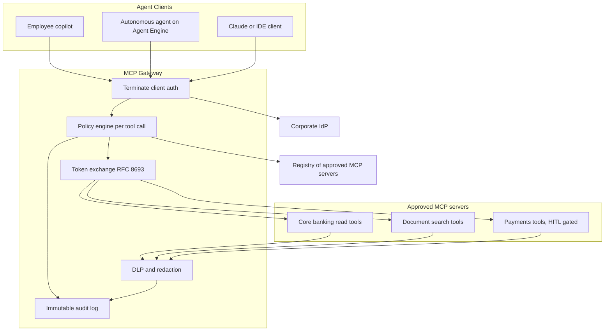
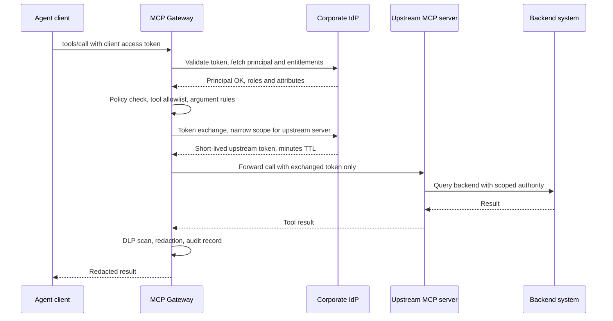
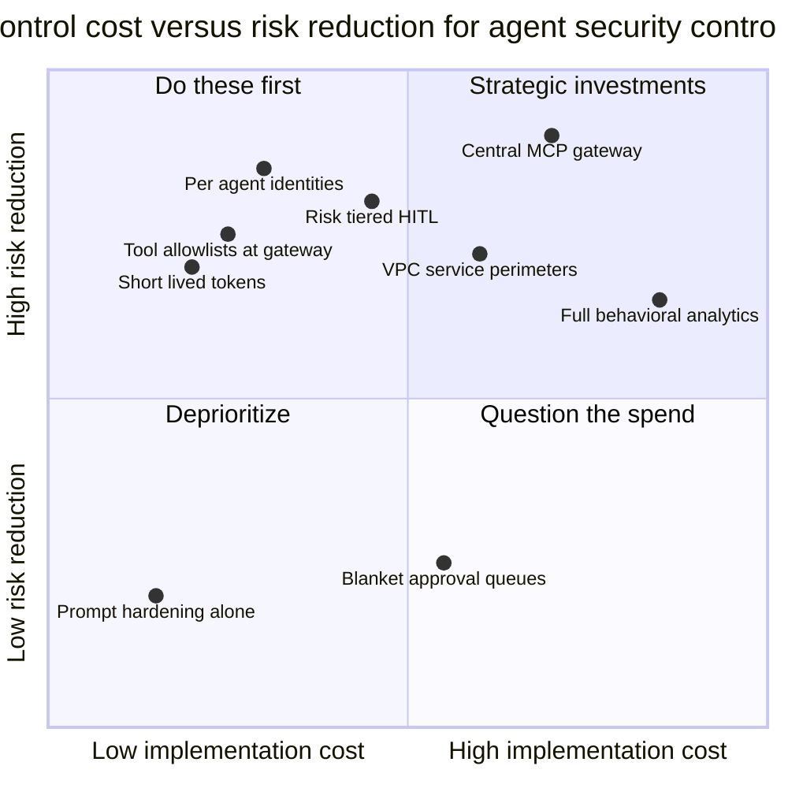

# Bank-Grade Agent Security: IAM, MCP Gateways, and Zero Trust at Enterprise Scale

In [part 1](/#/blog/agent-authentication-oauth-mcp-identity) we followed the same AI agent into two companies: a twelve-person startup and a bank. The startup got the full treatment — OAuth 2.1, the MCP authorization spec, dynamic client registration, a managed identity provider, and a security posture you can stand up in a week. The protocols were the whole story there, because at startup scale the protocols *are* the security model.

This post walks into the bank. Same agent, same protocols, radically different posture. The bank holds customer financial data, answers to regulators who can fine it or pull its license, employs thousands of people any of whom could be compromised or malicious, and treats a single leaked token as a reportable incident rather than a Tuesday. Everything from part 1 still applies — OAuth doesn't stop working when you get big. What changes is everything wrapped around it: identity architecture, network architecture, the mandatory service in the middle of every MCP conversation, and an audit trail built to survive a subpoena.

If you haven't read part 1, the OAuth and MCP-auth mechanics live there; I won't re-teach grant types here. What you need for this post: OAuth issues tokens with scopes, MCP servers act as OAuth resource servers, and agents authenticate as OAuth clients. From that foundation, let's build a bank.

**Prerequisites:** comfort with OAuth 2.x concepts (tokens, scopes, clients, resource servers), basic familiarity with MCP (see [the MCP and A2A protocols post](/#/blog/agent-integration-protocols-mcp-and-a2a) if you need it), and some exposure to cloud IAM. GCP examples assume you know what a service account and an IAM role binding are.

---

## What Changes at Bank Scale

The startup's threat model is mostly external: attackers on the internet trying to get in. The bank's threat model is dominated by three things the startup barely thinks about.

### Insider risk becomes the main event

A bank with ten thousand employees statistically employs people who will, at some point, misuse access — through malice, coercion, or a phished laptop. Decades of financial-sector security practice are built around this: segregation of duties, maker-checker approval flows, mandatory vacations (a classic fraud-detection control — schemes that need daily tending collapse when the schemer is forced offline for two weeks), and access reviews.

Now add agents. An agent with over-broad access is an insider threat that works at machine speed. A rogue employee exfiltrating customer records is limited by human throughput and by the fear of getting caught. An agent that has been prompt-injected into exfiltration mode has no fear, no fatigue, and an API rate limit as its only speed bump. The controls that took banking a century to develop for humans — least privilege, dual control, behavioral monitoring — all apply to agents, and they apply *harder*, because the blast radius per unit time is larger.

### Lateral movement gets a new vehicle

Traditional lateral movement: an attacker compromises one machine, harvests credentials, moves to the next. Agents introduce a variant that doesn't require compromising any machine at all — the **confused deputy**. An agent holds legitimate, powerful credentials. An attacker who can influence the agent's *inputs* (a poisoned document in the RAG corpus, a malicious email the agent summarizes, a manipulated tool description) can direct that legitimate power toward illegitimate ends. The agent isn't hacked; it's *persuaded*.

The canonical escalation path looks like this: prompt injection lands in the agent's context → the agent, following the injected instruction, calls a tool it's authorized to call → the tool does something the *user* never intended — mail a spreadsheet externally, query records outside the user's remit, approve a transaction. Every link in that chain is individually legitimate. That's what makes it nasty, and it's why [the guardrails field guide](/#/blog/agent-guardrails-field-guide) treats tool-call mediation, not model behavior, as the enforcement point that matters. At a bank, this pattern isn't a curiosity — it's the top entry on the threat model, because the deputy is standing next to the vault.

### Regulation turns security failures into existential events

At a startup, a breach costs you customers and a painful postmortem. At a bank, it costs you regulatory fines calibrated in percentages of revenue, mandatory disclosure, consent orders that constrain the business for years, and in the limit, your license to operate. Three consequences flow from this:

1. **Audit trails are a legal requirement, not a nice-to-have.** "The agent did something and we're not sure why" is not an acceptable sentence in a regulator's conference room.
2. **Controls must be demonstrable.** It's not enough to be secure; you must be able to *prove* you were secure, continuously, with evidence.
3. **Change is slow on purpose.** Every new agent capability passes through risk review. This frustrates engineers and it is working as intended.

Keep these three shifts — insider risk, confused-deputy lateral movement, regulatory exposure — in mind. Every architectural decision in the rest of this post is downstream of them.

---

## Enterprise IAM Foundations for Agents

Before touching any agent-specific machinery, get the identity fundamentals right, because agents inherit every pathology of your existing IAM estate and amplify it.

### Workforce identity vs workload identity

Enterprises manage two distinct identity populations:

- **Workforce identity**: humans. Provisioned through HR systems, authenticated via SSO with MFA, governed by joiner-mover-leaver processes. When Alice moves from Payments to Risk, her access changes; when she leaves, it ends.
- **Workload identity**: software. Services, jobs, pipelines — and now agents. No password, no MFA prompt, no offboarding date. Authenticated by possession of a credential or by attestation of the platform they run on.

The single most common enterprise agent-security mistake is smearing these categories together: an agent running under a human's credentials (now the audit log lies about who acted), or a human debugging in production with a service account key (now a workload credential is on a laptop). The rule that prevents both:

> **Every agent is a first-class principal with its own identity. An agent never shares a human's identity, and never shares another agent's.**

This sounds obvious and is violated constantly, usually for convenience: "the agent just uses the team service account." Then five agents share one identity, the audit log can't distinguish them, revoking one means breaking all, and least privilege becomes the union of five jobs' permissions. One agent, one identity, no exceptions.

### Service accounts and their pathologies

The classic workload identity mechanism is the service account with a long-lived key — a JSON file or client secret that anyone possessing can use, from anywhere, until someone remembers to rotate it. At enterprise scale this produces **key sprawl**: hundreds of keys in CI variables, config repos, developer laptops, and that one S3 bucket from 2019. Every security team that has run a credential-scanning exercise on its own organization has come away needing a drink.

The modern fix is to make credentials **short-lived and derived**, not long-lived and stored:

- **Short-lived tokens**: access tokens minted on demand, valid for minutes to an hour. Stolen token, bounded damage.
- **Workload identity federation**: the workload proves who it is using an identity it *already has* — the OIDC token of its Kubernetes service account, the attestation of its VM, its CI runner's identity — and exchanges that proof for a cloud access token. No exportable key ever exists. GCP, AWS, and Azure all support this pattern natively; on GCP it's Workload Identity Federation, and it should be the default for every agent that runs outside the cloud provider's own runtime.

For agents this matters doubly, because agents are exactly the kind of long-running, tool-wielding process whose stolen key is most valuable. **A bank-grade rule: no agent authenticates with a static exportable secret. Ever.** If your agent's identity can be copied into a text file, your agent's identity will eventually *be* copied into a text file.

### RBAC, ABAC, and where each earns its keep

Two authorization models dominate:

| | RBAC | ABAC |
|---|---|---|
| Grants based on | Role membership | Attributes of principal, resource, context |
| Example | "Agents in role `payments-reader` can read payment records" | "An agent may read a record if the record's region matches the agent's assigned region AND the request arrives during business hours AND the risk score is low" |
| Strength | Auditable, explainable, maps to org structure | Fine-grained, contextual, fewer roles |
| Weakness | Role explosion; coarse | Policy sprawl; harder to answer "who can access X?" |
| Bank usage | Baseline entitlements, recertification | Contextual conditions layered on top |

Banks in practice run RBAC as the auditable skeleton — regulators like being able to enumerate who holds which role — with ABAC-style conditions layered on for context: source network, time, data classification, transaction amount. Cloud IAM systems reflect this: GCP's IAM is role-based at its core, with **IAM Conditions** adding attribute logic (resource name prefixes, request time, access levels) to individual bindings.

### Least privilege is a process, not a setting

Everyone endorses least privilege; almost nobody knows what an agent's least privilege *is* on day one. Treat it as a lifecycle:

1. **Start narrow, in staging.** Grant the minimal plausible set and watch what fails.
2. **Permission mining in production.** Cloud providers analyze actual usage against granted permissions — GCP's IAM Recommender flags bindings the principal hasn't used in 90 days. For agents this is gold: agents have far more regular access patterns than humans, so unused permissions stand out sharply.
3. **Scheduled access reviews.** Every agent's entitlements are re-justified by a human owner on a fixed cadence, exactly like employee access recertification. An agent whose owner left the company and whose permissions nobody can explain is a finding, not a footnote.
4. **Expiry by default.** Grants for pilots and experiments carry expiration dates. Permanent access is the exception that requires paperwork, not the default that requires cleanup.

This process framing matters because agents change. The agent that only needed read access in Q1 gets a write tool in Q3, and without a review loop, nobody re-examines whether the Q1 grants still make sense alongside the new power. [The enterprise agent governance lifecycle post](/#/blog/enterprise-agent-governance-lifecycle) covers the organizational side of this loop; here I'll just insist that the loop exists.

---

## Agent Identity on Google Cloud: Gemini Enterprise and Agent Engine

Theory established, let's look at how one major cloud actually implements agent identity — Google's stack, because it's the one I work with and because Google has pushed further than most on making agents first-class IAM principals. (Fair warning: Google has renamed this stack more than once — Agentspace became **Gemini Enterprise**, and Agent Builder/Agent Engine documentation now lives under the Gemini Enterprise Agent Platform umbrella. I'll use current names; if you're reading docs, check the date.)

### The pieces

- **Vertex AI Agent Engine** (the runtime formerly discussed under Reasoning Engine): Google's managed runtime for deploying agents — typically built with the Agent Development Kit (ADK) — handling scaling, sessions, and infrastructure.
- **Gemini Enterprise**: the employee-facing product where agents, connectors to enterprise data, and search live; it's where a bank's workforce actually meets its agents.
- **Agent Gateway**: the managed ingress that sits in front of deployed agents, handling authentication and credential mediation.

### Service agents: the baseline

At the infrastructure level, Agent Engine runs under a Google-managed **service agent** — the AI Platform Reasoning Engine Service Agent, `service-PROJECT_NUMBER@gcp-sa-aiplatform-re.iam.gserviceaccount.com`, holding the `roles/aiplatform.reasoningEngineServiceAgent` role. This is standard GCP workload identity: Google provisions it, no exportable key exists, and you grant it additional roles if your agent needs to touch BigQuery, Cloud Storage, or anything else. The pathology to avoid is obvious once stated: if *all* your agents in a project run under the *one* service agent, you've recreated the shared-service-account problem with extra steps. Which is why Google built the next layer.

### Agent Identity: agents as first-class principals

The newer **Agent Identity** system gives each deployed agent its own strongly attested, per-agent identity — not a shared service account. Mechanically:

- Each agent receives a unique **SPIFFE identity** — a URI of the form `spiffe://TRUST_DOMAIN/resources/aiplatform/projects/NUM/locations/REGION/reasoningEngines/AGENT` — plus an auto-provisioned **X.509 certificate**, valid 24 hours and rotated automatically. No key file, nothing to leak.
- The certificate enables mTLS to Google APIs and supports proof-of-possession binding of access tokens: a token stolen off the wire is useless without the agent's private key. Google calls these double-bound credentials.
- You grant IAM roles **directly to the agent** using a principal identifier: `principal://TRUST_DOMAIN/resources/aiplatform/.../reasoningEngines/my-agent` in an ordinary IAM binding. The agent appears in IAM policy like any user or service account — reviewable, recertifiable, revocable individually.
- An **auth manager** acts as a credentials vault for the agent's third-party needs — API keys, OAuth client credentials, delegated end-user tokens. Notably, when routed through Agent Gateway, end-user credentials are encrypted by the auth manager and only decrypted *at the gateway*, so the agent process itself never sees the raw credential. Read that again: the agent can act on your behalf without ever holding your token. That is exactly the property a bank wants.

### Per-agent vs per-user authority

The recurring design decision — the same one from part 1, now with enterprise machinery behind it:

- **Agent acts as itself** (its own SPIFFE/service identity): right for agent-owned resources — its vector store, its state, shared reference data. Authorization question: "what is this agent allowed to do?"
- **Agent acts for a user** (delegated three-legged OAuth, end-user credentials flowing through the auth manager and gateway): right whenever results must respect a human's entitlements. The BigQuery query runs *as Alice*, so Alice's row-level security applies and the audit log records both identities: user → agent → resource.

The bank-grade default is delegation. An agent that answers questions about customer accounts using its *own* broad read access is a data-leak machine with a chat interface — anyone who can talk to it inherits its access. An agent that queries with the *user's* authority can never show a user anything the user couldn't already see. Reserve as-itself authority for genuinely user-independent work, and keep that authority narrow.

### Perimeters and conditions

Two GCP controls complete the picture:

- **VPC Service Controls**: service perimeters that block data movement between your Google Cloud services and anything outside the perimeter — the primary anti-exfiltration control. Agent Engine supports VPC-SC; inside a perimeter, a deployed agent keeps access to in-perimeter APIs (BigQuery, Vertex AI) while public internet egress is blocked. Two operational gotchas from the docs that will bite you: the project must be in the perimeter *before* you deploy the agent (deploy first and the agent sits outside the walls, happily internet-connected), and you need an ingress rule allowing the Reasoning Engine Service Agent to reach Cloud Storage and Artifact Registry or deployments fail mysteriously.
- **IAM Conditions**: attribute logic on individual role bindings — restrict an agent's role to resources with a given prefix, to request times, to access levels defined in Access Context Manager. This is the ABAC layer on GCP's RBAC skeleton, and per-agent identities make it usable: conditions attach to *this agent's* binding, not to a shared account used by twelve things.

Everything above lands in **Cloud Audit Logs** — admin activity logged always, data access logged when you enable it (enable it; for a bank this is not optional), with the delegation chain visible when agents act for users.

### A2A in one paragraph

When agents call other agents, Google's **Agent2Agent (A2A) protocol** covers discovery and interop: each agent publishes an Agent Card declaring capabilities and — relevantly here — its supported authentication schemes, aligned with OpenAPI security scheme definitions (API keys, OAuth 2.0, OpenID Connect). The spec deliberately delegates credential management to implementers, which means the enterprise burden — verifying that an Agent Card is authentic, that the agent behind it is the agent it claims to be — is yours. The practitioner consensus is converging on mTLS with workload identities (SPIFFE again) plus signed cards, and the same gateway-mediation logic we're about to apply to MCP applies to A2A traffic too: inter-agent calls at a bank go through an authenticated, policy-enforcing intermediary, not directly agent-to-agent across the network.

---

## MCP in the Enterprise: Always a Service in the Middle

Here is the central architectural claim of this post, and if you take one sentence back to your bank, make it this one:

> **At enterprise scale, no client ever talks to an MCP server directly. There is always a service in the middle.**

At the startup in part 1, Claude Desktop connects straight to your MCP server; the server validates tokens and enforces scopes, and that's proportionate. At a bank, direct connection fails on every axis that matters: you can't attach org-wide policy to fifty independently built servers, you can't produce one coherent audit trail from fifty log formats, you can't revoke a compromised client's access everywhere at once, and you can't stop a developer from standing up MCP server number fifty-one that does none of the above. The topology itself is the vulnerability.

### The MCP gateway pattern

The fix is a **gateway**: a central proxy that every MCP conversation traverses. This is the same architectural move API management made fifteen years ago — nobody exposes raw internal APIs to partners; an API gateway terminates auth, enforces policy, and meters usage. MCP is APIs for agents, and it gets the same treatment. I sketched the light version of this in [the enterprise MCP servers post](/#/blog/mcp-production-enterprise); here's the full bank-grade job description. The gateway:

1. **Terminates client authentication.** Clients authenticate to the gateway, and only to the gateway, against the corporate IdP. MCP servers never see a client credential.
2. **Performs token exchange.** The client's broad token is exchanged (RFC 8693) for a narrowly scoped, short-lived token minted for the *specific upstream server*. The upstream token can't be replayed against any other service; a compromised MCP server holds nothing that opens other doors.
3. **Enforces policy per tool call.** Not per connection — per call. Is this principal allowed this tool, with these arguments, at this hour, from this context? The gateway evaluates before anything is forwarded.
4. **Allowlists tools and sanitizes schemas.** The gateway intercepts `tools/list` and returns the *approved* list, ignoring whatever the backend advertises — and blocks `tools/call` for anything off-list. This kills tool-poisoning attacks where a compromised server smuggles malicious instructions into tool descriptions: the descriptions that reach the model's context are the reviewed ones, period.
5. **Logs everything.** Every call, every argument (redacted per data-classification policy), every result status, every identity in the chain, to an append-only store.
6. **Applies DLP and redaction.** Responses pass through data-loss-prevention inspection before returning to the client. An agent that queries a legitimate table and receives card numbers gets those numbers masked at the gateway, regardless of what the upstream server thought was fine.
7. **Rate limits and circuit-breaks.** Per principal, per tool. An agent making 400 customer-record reads a minute gets throttled and flagged; machine-speed insider threat, meet machine-speed tripwire.

And beside the gateway sits its bureaucratic twin, the **registry**: the catalog of *approved* MCP servers — owner, security review date, data classification, allowed tools, allowed client populations. The gateway routes only to registered servers. A team's unreviewed MCP server isn't reachable through the gateway, which — combined with network policy blocking direct MCP traffic — means it isn't reachable at all. Shadow tools become a network impossibility instead of a policy plea.



### Token exchange, concretely

The sequence for a single tool call, with the trust boundaries visible:



Note what the upstream server receives: a token scoped to itself, with minutes of lifetime, naming the full principal chain. It never sees the client's original token. Note also what the client receives: a result that has passed DLP. Both directions are mediated.

Here's the heart of a gateway in code — a policy-enforcing middleware with RFC 8693 token exchange. Production systems add caching, circuit breakers, and a real policy engine (OPA, Cerbos, or cloud-native), but the skeleton is honest:

```python
import time
import httpx
from dataclasses import dataclass


@dataclass(frozen=True)
class Principal:
    user_id: str | None      # human on whose behalf we act, if delegated
    agent_id: str            # the agent identity, always present
    entitlements: frozenset[str]


class PolicyDecision:
    def __init__(self, allowed: bool, reason: str, requires_hitl: bool = False):
        self.allowed = allowed
        self.reason = reason
        self.requires_hitl = requires_hitl


class GatewayPolicy:
    """Per-tool-call policy enforcement. Deny by default."""

    def __init__(self, registry: dict):
        # registry: approved servers -> approved tools -> rules
        self.registry = registry

    def check(self, principal: Principal, server: str, tool: str,
              arguments: dict) -> PolicyDecision:
        server_entry = self.registry.get(server)
        if server_entry is None:
            return PolicyDecision(False, f"server {server} not registered")

        tool_rules = server_entry["tools"].get(tool)
        if tool_rules is None:
            return PolicyDecision(False, f"tool {tool} not on allowlist")

        required = tool_rules["required_entitlement"]
        if required not in principal.entitlements:
            return PolicyDecision(False, f"missing entitlement {required}")

        # Argument-level rules: e.g. cap export sizes, block wildcards
        for arg_check in tool_rules.get("argument_checks", []):
            if not arg_check(arguments):
                return PolicyDecision(False, "argument policy violation")

        # Risk-tiered human-in-the-loop, not blanket
        hitl = tool_rules.get("risk_tier") in ("high", "critical")
        return PolicyDecision(True, "allowed", requires_hitl=hitl)


async def exchange_token(idp_token_url: str, client_token: str,
                         upstream_audience: str, scope: str) -> str:
    """RFC 8693 token exchange: broad client token -> narrow upstream token.

    The upstream MCP server never sees the client's original token."""
    async with httpx.AsyncClient(timeout=5.0) as http:
        resp = await http.post(idp_token_url, data={
            "grant_type": "urn:ietf:params:oauth:grant-type:token-exchange",
            "subject_token": client_token,
            "subject_token_type": "urn:ietf:params:oauth:token-type:access_token",
            "audience": upstream_audience,   # bound to ONE upstream server
            "scope": scope,                  # narrowest scope for this call
        })
        resp.raise_for_status()
        payload = resp.json()
        assert payload.get("expires_in", 3600) <= 600, "refuse long-lived tokens"
        return payload["access_token"]
```

The two load-bearing details: `audience` binds the exchanged token to exactly one upstream server, and the assert refuses to accept a token that lives longer than ten minutes. Everything else is plumbing.

### The gateway landscape

You can buy this or build it, and the market has matured fast:

| Approach | Examples | Trade-off |
|---|---|---|
| Open-source MCP gateways | Microsoft `mcp-gateway` (Envoy-based, Kubernetes-native), agentic-community `mcp-gateway-registry` (gateway plus registry, Keycloak/Entra integration) | Full control, you own the operations and the hardening |
| API-gateway vendors adding MCP support | Kong AI MCP Proxy, Azure API Management MCP gateway with Entra ID, Tyk | Rides your existing API-management estate, policies and audit in one place; MCP feature depth varies |
| Cloud-native managed | Google's Agent Gateway in the Gemini Enterprise stack, AWS Bedrock AgentCore Gateway | Deep platform integration, least operational burden, most lock-in |
| Identity-vendor mediation | Token-exchange and agent-auth offerings from the IdP vendors covered in part 1 | Strong on the token flows, thinner on DLP/registry/routing |

I won't pick a winner — the honest answer is that a bank already running Apigee or APIM should extend that estate, a Kubernetes-heavy shop should evaluate the Envoy-based open source, and anyone on one cloud's agent runtime should start from that cloud's managed gateway. What is *not* optional is the pattern. Evaluate products against the seven-function job description above; anything that only does auth termination and routing is an ingress, not a gateway.

---

## Zero Trust for Agents

Zero trust, per NIST SP 800-207, in one sentence: no implicit trust from network location; every access is verified, every time, based on identity and context. Banks were early zero-trust adopters for their human workforce. Agents force the same discipline onto the workload population, with some agent-specific twists.

### Identity between services, not networks between services

Inside the perimeter-based worldview, service A trusts service B because B's traffic comes from the right subnet. In the zero-trust worldview, A trusts B because B *proves its identity cryptographically* on every connection — mTLS with short-lived certificates issued against a workload identity standard. This is what **SPIFFE** (with its reference implementation SPIRE) provides: each workload gets an SVID, a short-lived X.509 certificate or JWT naming its `spiffe://` identity, automatically rotated, with no static secret to steal. You've already seen this pattern once in this post — Google's Agent Identity issues SPIFFE identities with 24-hour certificates. That's not a coincidence; it's the industry converging.

For agent stacks: agent-to-gateway, gateway-to-server, server-to-backend — every hop is mTLS between named workload identities. "The call came from inside the cluster" stops being an authorization argument anywhere in the chain.

### Continuous verification, because agents drift

Zero trust's "assume breach" maps naturally onto agents' failure mode: assume *the agent's context is breached* — that at some point, injected instructions will steer it. Controls therefore can't be front-loaded at session start; they run continuously:

- Per-call policy checks (the gateway again — this is why policy is per tool call, not per connection).
- Behavioral baselines: this agent normally reads 30 documents an hour from one collection; it's now reading 3,000 across ten. Sessions get risk-scored and can be stepped down or terminated mid-flight.
- Short credential lifetimes everywhere, so a hijacked session's authority decays in minutes without explicit revocation.

### Egress is the exfiltration surface

An underappreciated point: **any tool that can fetch a URL is an exfiltration channel.** A prompt-injected agent with a web-fetch tool can encode stolen data into query strings of requests to an attacker's domain. No malware, no compromised host — just a legitimate tool pointed somewhere hostile. Bank-grade egress control for agents means: default-deny outbound network access from agent runtimes; explicit allowlists of reachable domains per agent; VPC Service Controls or equivalent blocking data movement out of the perimeter; and DLP inspection on whatever egress is permitted. If your agent needs the open internet, that need is a risk-acceptance decision someone signs, not a default.

### Human-in-the-loop as a risk-tiered control

The lazy version of HITL is a blanket "a human approves everything," which collapses immediately — approvals become rubber stamps because 99% of what crosses the queue is trivial, and reviewer attention is exhausted precisely when the 1% arrives. The zero-trust version keys review depth to **action risk**:



A workable tiering:

- **Tier 0, autonomous**: read-only, low-sensitivity, reversible. Logged, never queued.
- **Tier 1, notify**: moderate actions execute immediately with human notification and an undo window.
- **Tier 2, approve**: high-risk actions — payments above thresholds, external data transmission, permission changes — block on explicit approval, maker-checker style, with the approver seeing full context and the approval itself audit-logged.
- **Tier 3, prohibited**: some actions no agent performs, full stop. Deleting audit logs. Modifying its own permissions. Approving its own Tier 2 requests.

The tier assignment lives in the gateway's registry (that `risk_tier` field in the code above), which means it's enforced at the mediation point rather than trusted to the agent's own judgment — the difference between a guardrail and a suggestion.

---

## Audit, Compliance, and Governance

Everything so far prevents bad outcomes. This section is about *proving* things — to auditors, regulators, and your own incident-response team at 2 a.m.

### The identity chain is the audit atom

A bank-grade audit record for an agent action answers, immutably: **which user** (if delegated) asked **which agent** to invoke **which tool** against **which resource**, with what arguments, what policy decision, what result, and what approvals. The chain user → agent → tool → resource is the atom; break any link and the record can't answer a regulator's actual question, which is never "what did the system do" and always "who is accountable for what the system did."

```python
from datetime import datetime, timezone
from pydantic import BaseModel, Field


class AgentAuditRecord(BaseModel):
    """One immutable record per tool invocation. Write-once storage:
    Cloud Logging with locked retention, WORM object storage, or both."""

    event_id: str                      # UUIDv7: time-ordered, globally unique
    timestamp: datetime = Field(default_factory=lambda: datetime.now(timezone.utc))

    # The identity chain -- the part regulators actually read
    on_behalf_of_user: str | None      # workforce identity, None if agent-owned task
    agent_id: str                      # SPIFFE ID or per-agent principal
    agent_version: str                 # model + prompt + config hash
    session_id: str                    # groups the multi-step task

    # The action
    mcp_server: str                    # registry name of upstream server
    tool_name: str
    arguments_digest: str              # SHA-256 of args; raw args stored
                                       # separately under data-class controls
    resource_refs: list[str]           # accounts, tables, documents touched

    # The controls that fired
    policy_decision: str               # allowed | denied | allowed_with_hitl
    policy_version: str                # which policy bundle made the call
    hitl_approver: str | None          # workforce identity of approver
    dlp_findings: list[str]            # redactions applied to the response

    # The outcome
    outcome: str                       # success | error | timeout | killed
    latency_ms: int
    upstream_token_jti: str            # ties record to the exchanged token
```

Design notes that survive contact with auditors: hash the arguments into the main record and store raw arguments under the same access controls as the data they reference (audit logs full of customer PII become their own breach surface); record the **policy version**, because "was this allowed *at the time*" is a question you will be asked; and include the token's `jti` so every log line joins to every token issuance — the full story of any incident reconstructs from logs alone.

### Explainability for regulators, via model risk management

Banks already have a discipline for opaque decision systems: **model risk management** (in the US, the Federal Reserve's SR 11-7 guidance), which for years has governed credit models and fraud scores. Agents slot into this framing — an agent is a model with actuators — and the framework asks familiar questions: What is it for? What are its limits? How was it validated? Who monitors it? What's the fallback when it misbehaves?

The honest wrinkle: you generally cannot explain *why* an LLM produced a specific output, and pretending otherwise burns credibility. What you can do — and what the audit architecture above delivers — is explain **what happened and under whose authority**: complete action traces, the inputs in context, the policies evaluated, the approvals given. Regulators dealing with agentic systems are, in practice, converging on demanding exactly this — traceability and control evidence — rather than mechanistic interpretability. Design for the demand you'll actually get. The broader business framing lives in [the enterprise agent governance post](/#/blog/enterprise-agents-governance-security-business); the point here is the machinery.

### Recertification and kill switches

Two controls close the loop:

**Access recertification for agents.** Quarterly (or whatever cadence your human access reviews run), every agent's existence and entitlements are re-attested by a named human owner: still needed, still correctly scoped, permission-mining report reviewed, unused grants dropped. Agents whose owners left the company get frozen, not inherited by default. If your IGA tooling can treat agents as reviewable identities, use it; the review must exist either way.

**Kill switches, plural, rehearsed.** When an agent misbehaves you need graduated stops, each executable in minutes and each *tested* before the incident: revoke the agent's tokens and refuse new issuance (strands it within one token TTL — another argument for short lifetimes); disable it at the gateway (one registry flag removes every tool from reach — the gateway earning its keep again); suspend its runtime identity (on GCP, remove the IAM bindings on its `principal://` identity or disable the underlying resource); and network isolation as the blunt last resort. A kill switch nobody has rehearsed is a hypothesis, not a control.

---

## Gotchas

Hard-won specifics that don't fit neatly above:

- **VPC-SC ordering matters.** Add the project to the service perimeter *before* deploying to Agent Engine. An agent deployed first sits outside the perimeter with internet access, and nothing warns you.
- **The shared service agent is a trap at scale.** The default Reasoning Engine Service Agent is fine for one agent per project. Ten agents sharing it equals ten agents sharing an identity. Use per-agent identities (Agent Identity) or per-agent projects.
- **Token exchange TTLs default too long.** Many IdPs mint exchanged tokens with hour-plus lifetimes unless told otherwise. Configure and *verify* minutes-scale TTLs for upstream tokens; the assert in the code above is not decoration.
- **`tools/list` is attacker-controlled content.** Treat tool names and descriptions from any MCP server as untrusted input into your model's context. The gateway's fixed allowlist response — ignore what the backend advertises — is the fix.
- **DLP on responses, not just requests.** Most teams inspect what agents send out and forget that the *response* path is where customer data actually flows toward the model and the user.
- **Audit logs containing raw arguments are themselves sensitive.** Classify and protect them like the data they describe, or your audit trail becomes finding number two in the breach report.
- **Blanket HITL fails silently.** Approval queues that are 99% noise produce reviewers who approve on reflex. Measure your approval rate; if it's above roughly 95%, your tiers are wrong and your control is theater.

---

## Startup vs Bank: The Two Postures

Closing the series analogy with the comparison the two posts have been building toward:

| Dimension | Startup (part 1) | Bank (this post) |
|---|---|---|
| Identity provider | Managed IdP (Auth0-class), default configs | Enterprise IdP integrated with HR-driven workforce identity; workload identity platform for agents |
| Agent identity | OAuth client per app, often shared | First-class principal per agent: SPIFFE/per-agent identity, never shared, never human |
| Token lifetime | Hours; refresh tokens for convenience | Minutes for anything touching data; proof-of-possession binding where available |
| Secrets | Client secrets in a secrets manager | No static exportable secrets; workload identity federation and auto-rotated certificates |
| MCP deployment | Clients connect directly to servers | Never direct: gateway in the middle, registry of approved servers, token exchange per hop |
| Tool governance | Server's own scope checks | Gateway allowlists, argument policy, schema sanitization, DLP on responses |
| HITL policy | Confirmation dialogs for destructive ops | Risk-tiered control framework: autonomous / notify / approve / prohibited, maker-checker on high tiers |
| Network | TLS to public endpoints | mTLS between workload identities; VPC service perimeters; default-deny egress |
| Audit | Application logs, best effort | Immutable identity-chain records, policy versioning, retention mandated by regulation |
| Failure cost | Postmortem and some churn | Fines, consent orders, license risk, front-page news |

Read the table column by column and the series' point emerges: **it's the same discipline at both scales.** The startup and the bank use the same protocols — OAuth, token exchange, MCP auth, workload identity are identical RFCs and specs in both buildings. Nothing in the bank column is a different *kind* of security; it's the same security with more layers, shorter lifetimes, more mediation, and vastly more evidence.

What actually changes between the columns is two numbers: **blast radius** — how much damage one leaked credential or one persuaded agent can do before it's stopped — and **the cost of trust** — what it costs to be wrong about any single assumption. The startup can afford to trust its one MCP server, its hour-long tokens, its developers' laptops, because being wrong costs a bad week. The bank can afford none of those trusts, because being wrong costs things that don't come back. Security architecture, at any scale, is just the honest accounting of what you can afford to trust. The startup's ledger is short. The bank's ledger is the whole post you just read.

---

## Going Deeper

**Books:**

- Rais, R., Morillo, C., Gilman, E., & Barth, D. (2024). *Zero Trust Networks: Building Secure Systems in Untrusted Networks* (2nd ed.). O'Reilly Media.
  - The standard treatment of zero trust architecture — workload identity, mTLS, policy engines — that this post's agent-flavored version stands on.
- Richer, J., & Sanso, A. (2017). *OAuth 2 in Action.* Manning.
  - Still the best deep mechanical treatment of OAuth flows, token handling, and the failure modes that token exchange exists to prevent.
- Wilson, Y., & Hingnikar, A. (2022). *Solving Identity Management in Modern Applications* (2nd ed.). Apress.
  - Covers OIDC, SAML, and enterprise identity architecture — the workforce/workload identity split in production detail.
- Dotson, C. (2023). *Practical Cloud Security* (2nd ed.). O'Reilly Media.
  - IAM, data protection, and perimeter design across cloud providers; good grounding for the GCP-specific mechanics here.

**Online Resources:**

- [Agent Identity overview — Google Cloud documentation](https://docs.cloud.google.com/gemini-enterprise-agent-platform/govern/agent-identity-overview) — Google's own description of per-agent SPIFFE identities, X.509 provisioning, the auth manager, and `principal://` IAM bindings.
- [VPC Service Controls with Vertex AI](https://docs.cloud.google.com/vertex-ai/docs/general/vpc-service-controls) — perimeter configuration for agent workloads, including the ingress rules Agent Engine needs.
- [MCP Authorization specification](https://modelcontextprotocol.io/specification/draft/basic/authorization) — the normative source for MCP's OAuth-based resource-server model, continued from part 1.
- [Advanced authentication and authorization for MCP Gateway — Red Hat Developer](https://developers.redhat.com/articles/2025/12/12/advanced-authentication-authorization-mcp-gateway) — a vendor-engineering walkthrough of RFC 8693 token exchange inside an Envoy-based MCP gateway.
- [Microsoft mcp-gateway on GitHub](https://github.com/microsoft/mcp-gateway) — open-source, Kubernetes-native MCP gateway; a concrete codebase to evaluate against the seven-function job description.
- [SPIFFE documentation](https://spiffe.io/docs/latest/spiffe-about/overview/) — the workload identity standard underlying both SPIRE deployments and Google's Agent Identity.

**Videos:**

- [Securing AI Agents (A2A and MCP) with OAuth2 — Human and Agent Authentication for the Enterprise](https://www.youtube.com/watch?v=yuRUdzPkny4) — enterprise-grade walkthrough of both human-to-agent and agent-to-agent authentication flows.
- [AI Security Series: MCP (Model Context Protocol) Governance — The Agent Gateway](https://www.youtube.com/watch?v=uj_b7_-f0Xw) — the gateway pattern presented from a governance angle, complementing this post's architecture view.
- [Solving Authentication & Authorization Challenges for AI Agents with Auth0](https://www.youtube.com/watch?v=ve7ulU01jI4) — the IdP-side perspective on delegated agent authority, bridging back to part 1's managed-IdP material.

**Papers and RFCs:**

- Jones, M., Nadalin, A., Campbell, B., Bradley, J., & Mortimore, C. (2020). ["OAuth 2.0 Token Exchange."](https://www.rfc-editor.org/rfc/rfc8693) RFC 8693, IETF.
  - The exchange grant type at the heart of the gateway pattern: subject tokens, audience restriction, delegation semantics.
- Rose, S., Borchert, O., Mitchell, S., & Connelly, S. (2020). ["Zero Trust Architecture."](https://nvlpubs.nist.gov/nistpubs/SpecialPublications/NIST.SP.800-207.pdf) NIST Special Publication 800-207.
  - The canonical zero-trust reference; section 3's policy engine / policy enforcement point split maps directly onto the MCP gateway.
- Chandramouli, R., Butcher, Z., & Aradhna, C. (2023). ["A Zero Trust Architecture Model for Access Control in Cloud-Native Applications in Multi-Location Environments."](https://nvlpubs.nist.gov/nistpubs/SpecialPublications/NIST.SP.800-207A.pdf) NIST Special Publication 800-207A.
  - Applies 800-207 to service-mesh and workload-identity architectures — the closest official framing to agent-to-agent zero trust.
- Habler, I., Huang, K., Narajala, V. S., & Kulkarni, P. (2025). ["Building A Secure Agentic AI Application Leveraging A2A Protocol."](https://arxiv.org/abs/2504.16902) arXiv preprint.
  - A MAESTRO-based threat analysis of the A2A protocol with concrete mitigations for agent card tampering and impersonation.

**Questions to Explore:**

- If an agent's authority is always delegated from a user, who is accountable when a prompt-injected agent acts within the user's entitlements but against the user's intent — the user, the agent's owner, or the platform that mediated the call?
- Token lifetimes trade security against latency and IdP load. Is there a principled way to derive the right TTL from an action's blast radius, rather than picking round numbers?
- The gateway is a single point of policy — and a single point of failure and compromise. At what point does the mediation layer itself become the highest-value target in the architecture, and what does defense in depth look like *for the gateway*?
- Access recertification assumes a human owner can meaningfully review an agent's permissions. When agents number in the thousands and compose each other's tools, does human attestation still mean anything — or do we need agents that audit agents, with all the regress that implies?
- Banks accepted decades of friction to make human insider threat manageable. How much agent capability should an institution be willing to forgo — permanently — because the control cost exceeds the value of the capability?
