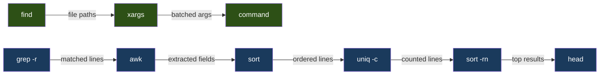
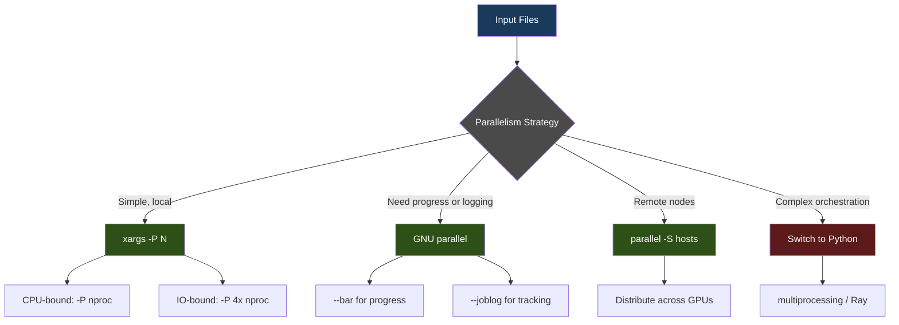
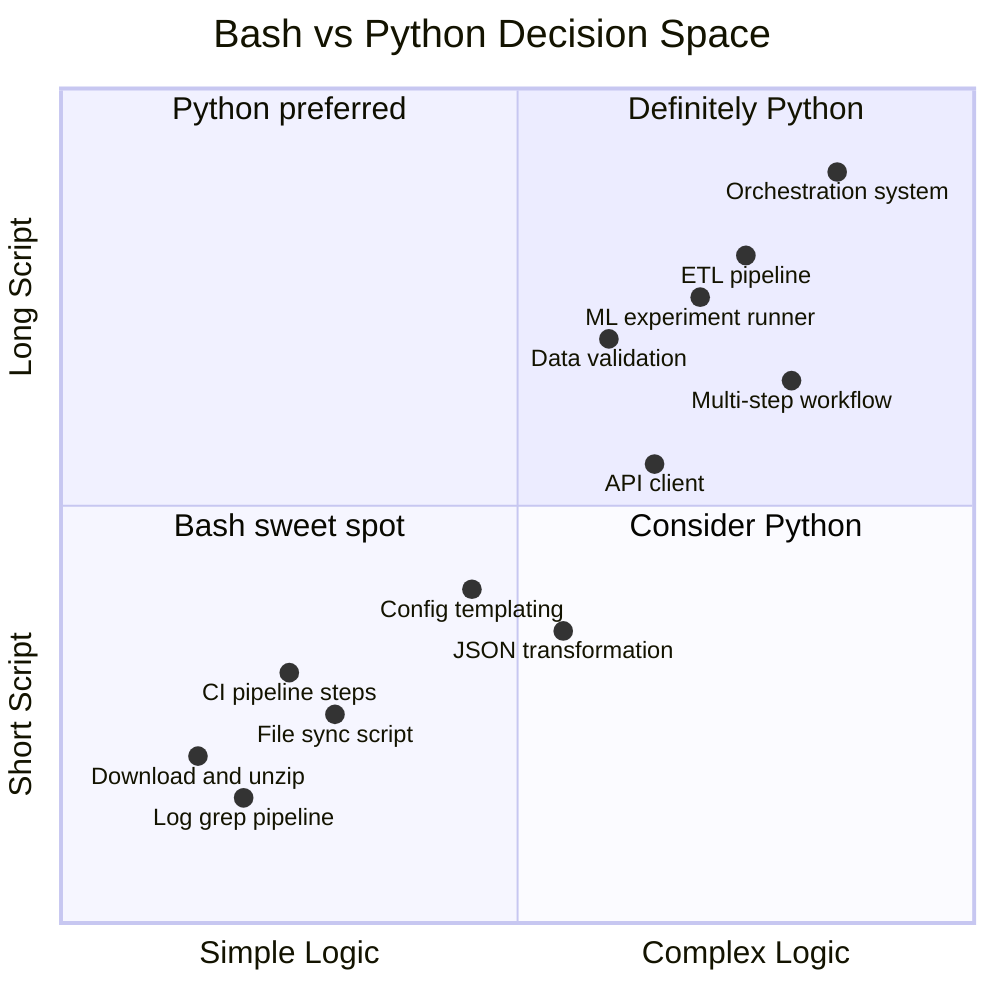
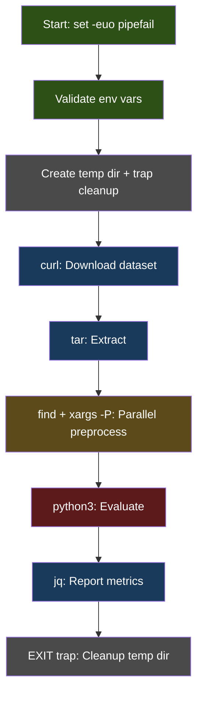

# Bash as a Daily Driver: The Subset an ML Engineer Actually Uses

## Half Duct Tape, Half Landmine

There is a particular moment that every ML engineer knows. You have a GPU node. You have a training script. You need to download data, set environment variables, launch the run, monitor memory, and clean up temp files when it crashes at 3 a.m. You could write a Python orchestrator. You could configure an Airflow DAG. Or you could write twelve lines of bash, pipe a few things together, and be running in two minutes.

You choose bash. And for those twelve lines, bash is perfect. It is the fastest path from "I need this to happen" to "it is happening." No imports, no virtual environments, no type annotations. Just commands, pipes, and the raw power of an operating system that was designed to be scripted.

But then the script grows. It reaches thirty lines, then fifty. You add conditionals. You parse JSON. You handle errors with a tangle of `if` statements that look like they were written during a fire drill. And you realize that bash has become the landmine it was always threatening to be.

This post is about the narrow slice of bash that actually works for ML and data engineers -- the daily-driver commands, the safety patterns, the composition techniques that make shell scripting genuinely powerful. It is also about knowing when to stop. When those twelve lines become thirty, when the logic needs data structures, when error recovery matters more than speed of writing -- that is when Python wins.

The goal is not to make you a bash expert. It is to make you dangerous enough to be effective, and wise enough to know when to switch.

## The Safety Preamble: Stop Trusting Bash's Defaults

Bash's default behavior is insane. An unset variable silently expands to an empty string. A failed command in the middle of a pipeline is ignored. A script keeps running after a command fails. These defaults made sense in 1989 when scripts were three lines long. They are catastrophic in 2027 when your script provisions cloud resources.

Every script you write should start with this:

```bash
#!/usr/bin/env bash
set -euo pipefail
IFS=$'\n\t'
```

Let me break down what each flag does and why it matters.

### set -e: Exit on Error

Without `-e`, bash cheerfully continues executing after a command fails. This means your training data download can fail silently, and your training script will launch on whatever stale data happens to be sitting in the directory.

```bash
# WITHOUT set -e -- disaster
download_dataset  # fails silently, exit code 1
train_model       # runs on stale data, wastes 8 GPU-hours
```

```bash
# WITH set -e -- script stops at the failure
set -e
download_dataset  # fails, script exits immediately
train_model       # never runs
```

There is one well-known pitfall: arithmetic expansion with `((count++))` returns exit code 1 when `count` is 0, because the expression evaluates to 0 (falsy). The fix is `((count++)) || true` or `count=$((count + 1))`.

### set -u: Treat Unset Variables as Errors

This prevents the most dangerous class of bash bugs. Without `-u`, a typo in a variable name silently expands to nothing:

```bash
# Without -u: this silently deletes everything in /
DATA_DIR="/tmp/training_data"
rm -rf "$DAAT_DIR/"*   # typo! DAAT_DIR is empty, so this becomes rm -rf /*
```

With `set -u`, bash will throw an error when it encounters `$DAAT_DIR` instead of treating it as an empty string. This single flag has prevented more catastrophic data loss than any code review process.

When you genuinely need to handle a variable that might be unset, use default values:

```bash
BATCH_SIZE="${BATCH_SIZE:-32}"          # default to 32
MODEL_NAME="${MODEL_NAME:?Must set MODEL_NAME}"  # error if unset
```

### set -o pipefail: Catch Pipeline Failures

Without `pipefail`, the exit code of a pipeline is the exit code of the last command. This means failures in the middle of a pipeline vanish:

```bash
# Without pipefail: curl fails, but wc succeeds, so the pipeline "succeeds"
curl https://data.example.com/dataset.csv | wc -l
echo "Downloaded $(wc -l) lines"  # reports 0 lines, no error
```

With `pipefail`, the pipeline returns the exit code of the rightmost command that failed. There is a subtlety with `SIGPIPE`: if `grep` closes a pipe early (after finding a match with `-m 1`), the upstream command gets killed with `SIGPIPE`, which `pipefail` treats as an error. The fix: `command | head -1 || true` when you expect early pipe closure.

### IFS and trap: The Defensive Perimeter

Setting `IFS=$'\n\t'` changes the Internal Field Separator to only split on newlines and tabs, not spaces. This prevents the classic bug where filenames with spaces break your `for` loops.

The `trap` command is your cleanup mechanism -- the bash equivalent of Python's `try/finally`:

```bash
#!/usr/bin/env bash
set -euo pipefail

TMPDIR=$(mktemp -d)
trap 'rm -rf "$TMPDIR"' EXIT   # runs on exit, error, or Ctrl-C

# download data to TMPDIR, process it...
curl -sL "$DATA_URL" -o "$TMPDIR/data.csv"
python3 preprocess.py --input "$TMPDIR/data.csv" --output ./processed/

# TMPDIR is cleaned up automatically, even if the script fails
```

You can trap multiple signals: `trap 'cleanup' EXIT ERR INT TERM`. For ML workflows, this pattern is essential -- you do not want orphaned temp directories filling up your `/tmp` on a shared GPU node.

## Pipes as Composition: The Real Unix Philosophy

The Unix philosophy -- small programs that do one thing well, connected by pipes -- is not just historical trivia. It is a genuinely powerful composition model, and pipes are where bash excels over Python for ad-hoc data exploration.

### The Mental Model

Think of pipes as function composition, read right to left:

```bash
# "Give me the top 10 most common error types in today's logs"
cat logs/2027-01-28.log | grep "ERROR" | awk '{print $4}' | sort | uniq -c | sort -rn | head -10
```

Each stage transforms the data stream. This is not so different from a pandas chain:

```python
# Python equivalent -- more readable but slower to write for one-off analysis
(df
  .query("level == 'ERROR'")
  .groupby("error_type")
  .size()
  .sort_values(ascending=False)
  .head(10))
```

The bash version is faster to type, requires no imports, and works on a 50 GB log file that would crash pandas. That is the trade-off.

### Real-World Pipe Patterns for ML

**Find which GPU experiments used the most memory:**

```bash
grep "peak_memory" experiments/*/metrics.json \
  | jq -r '.peak_memory_gb' \
  | sort -rn \
  | head -5
```

**Count training examples per class from a JSONL file:**

```bash
cat train.jsonl | jq -r '.label' | sort | uniq -c | sort -rn
```

**Find Python files importing a specific library, sorted by size:**

```bash
rg -l "import transformers" --type py | xargs wc -l | sort -rn | head -20
```

**Aggregate error rates from multiple log files:**

```bash
find logs/ -name "*.log" -mtime -7 \
  | xargs grep -c "ERROR" \
  | awk -F: '{total+=$2; files++} END {printf "%.1f errors/file across %d files\n", total/files, files}'
```

### The find | xargs Pattern

This is the single most useful composition pattern in bash. `find` selects files; `xargs` applies a command to each one:

```bash
# Delete all __pycache__ directories
find . -type d -name "__pycache__" | xargs rm -rf

# Run black on all Python files modified in the last day
find . -name "*.py" -mtime -1 | xargs black

# Count lines across all YAML config files
find configs/ -name "*.yaml" | xargs wc -l | tail -1
```

The danger: filenames with spaces or special characters. Always use null-delimited output:

```bash
find . -name "*.py" -print0 | xargs -0 black
```

The `-print0` flag uses null bytes as delimiters instead of newlines, and `-0` tells `xargs` to expect them. This is not pedantic -- it prevents silent data corruption when someone names a file `my model.py`.



## Process Substitution and Here-Strings

Process substitution is one of bash's most underappreciated features. It lets you treat the output of a command as a file, which is invaluable when a tool requires file inputs but your data is in a pipeline.

### Process Substitution with <()

```bash
# Compare two sorted lists without creating temp files
diff <(sort file1.txt) <(sort file2.txt)

# Compare model configs between two experiments
diff <(jq -S . experiment_v1/config.json) <(jq -S . experiment_v2/config.json)

# Join data from two different commands
paste <(cut -d, -f1 predictions.csv) <(cut -d, -f1 ground_truth.csv) | awk -F'\t' '$1 != $2'
```

The `<(command)` syntax creates a temporary file descriptor that contains the command's output. The calling program sees it as a regular file path (something like `/dev/fd/63`). This avoids creating temporary files and keeps your pipelines clean.

### Here-Strings with <<<

Here-strings feed a string directly to a command's stdin:

```bash
# Parse a JSON string without echo | jq
config='{"lr": 0.001, "epochs": 50}'
jq '.lr' <<< "$config"

# Quick base64 decode
base64 -d <<< "SGVsbG8gV29ybGQ="

# Read a variable into multiple fields
read -r host port <<< "gpu-node-3 8080"
```

This is cleaner than `echo "$config" | jq '.lr'` and avoids spawning an extra process.

## Parallelism Without Losing Your Mind

ML workflows are embarrassingly parallel: preprocess 10,000 images, run inference on 500 files, validate 100 configs. Bash gives you two solid tools for this.

### xargs -P: The Simple Path

The `-P` flag tells `xargs` how many processes to run simultaneously:

```bash
# Resize 10,000 images using 8 parallel workers
find raw_images/ -name "*.jpg" -print0 \
  | xargs -0 -P 8 -I {} convert {} -resize 224x224 processed/{}

# Run inference on multiple files
find inputs/ -name "*.txt" -print0 \
  | xargs -0 -P 4 -I {} python3 predict.py --input {} --output results/{}.json

# Validate all config files in parallel
find configs/ -name "*.yaml" -print0 \
  | xargs -0 -P "$(nproc)" -I {} python3 validate_config.py {}
```

The `$(nproc)` command returns the number of CPU cores, which is a sensible default for CPU-bound tasks. For I/O-bound tasks (downloading, API calls), you can safely use 2-4x the core count.

### GNU parallel: When xargs Is Not Enough

GNU `parallel` adds features that `xargs` lacks: progress bars, job logging, remote execution, and ordered output.

```bash
# Download multiple datasets with a progress bar
cat dataset_urls.txt | parallel --bar -j 8 'wget -q {} -P data/'

# Run experiments across parameter combinations
parallel -j 4 --joblog experiments.log \
  'python3 train.py --lr {1} --batch-size {2}' \
  ::: 0.001 0.01 0.1 \
  ::: 16 32 64

# Process files on remote GPU nodes
parallel -S gpu1,gpu2,gpu3 -j 2 \
  'python3 inference.py --input {} --output {.}_result.json' \
  ::: data/*.json
```

The `--joblog` flag creates a TSV file with timing and exit codes for every job -- invaluable for tracking which experiments succeeded.



### The Parallelism Decision

Use `xargs -P` when you have a list of files and one command to run on each. Use GNU `parallel` when you need combinatorial arguments, remote execution, or structured logging. Use Python's `multiprocessing`, `concurrent.futures`, or Ray when you need shared state, complex error handling, or results aggregation beyond what `sort | uniq -c` can handle.

## Modern Replacements: The Tools That Changed Everything

The traditional Unix tools -- `grep`, `find`, `cat`, `ls` -- were written decades ago. Modern replacements are faster, safer, and more ergonomic. Here are the ones that belong in every ML engineer's toolkit.

### ripgrep (rg): grep, But Fast

ripgrep is not just faster than grep -- it is a different experience. It respects `.gitignore`, uses parallelism, searches recursively by default, and shows results with context and color.

```bash
# Search for a function across the entire codebase
rg "def train_step"

# Search only Python files
rg "import torch" --type py

# Search with context (2 lines before and after)
rg -C 2 "RuntimeError" --type py

# Search for a pattern, replacing matches inline
rg "old_model_name" --files-with-matches | xargs sed -i 's/old_model_name/new_model_name/g'

# Count matches per file
rg -c "TODO" --type py | sort -t: -k2 -rn
```

VS Code uses ripgrep internally for its search functionality. If you are using `grep -r` in 2027, you are leaving performance on the table.

### fd: find for Humans

The `find` command's syntax is notoriously hostile. `fd` fixes this with intuitive defaults:

```bash
# find: verbose and error-prone
find . -type f -name "*.py" -not -path "./.venv/*"

# fd: concise, respects .gitignore automatically
fd -e py

# Find large files (useful for hunting accidental model checkpoints in git)
fd -e pt -e pth -e ckpt --size +100m

# Find recently modified configs
fd -e yaml --changed-within 2h

# Find and delete all .pyc files
fd -e pyc -x rm
```

The `-x` flag in `fd` replaces the `find | xargs` pattern entirely. It handles special characters correctly by default.

### fzf: The Fuzzy Finder That Changes Your Workflow

`fzf` is a general-purpose fuzzy finder. It takes any list of strings and lets you interactively filter them. The integrations are where it shines:

```bash
# Fuzzy search through shell history (usually bound to Ctrl-R)
history | fzf

# Fuzzy-find a file and open it in your editor
vim $(fzf)

# Fuzzy-find a git branch and check it out
git branch | fzf | xargs git checkout

# Preview files while selecting
fzf --preview 'bat --color=always {}'

# Chain with other tools: find a Python file, preview it, open it
fd -e py | fzf --preview 'bat --color=always {}' | xargs code
```

Add this to your `.bashrc` for integration with `Ctrl-R` (reverse search) and `Ctrl-T` (file search):

```bash
# fzf key bindings (install via fzf --bash)
eval "$(fzf --bash)"
```

### bat: cat With Syntax Highlighting

`bat` is a `cat` replacement with syntax highlighting, line numbers, and git integration:

```bash
# View a file with syntax highlighting
bat model.py

# Show only a range of lines
bat -r 50:100 train.py

# Use as a pager for other commands
rg "def forward" --type py -C 5 | bat -l py

# Diff with syntax highlighting
bat --diff file_v1.py file_v2.py
```

### jq and yq: Structured Data on the Command Line

`jq` handles JSON; `yq` handles YAML. For ML engineers who constantly deal with config files and API responses, these are non-negotiable:

```bash
# Extract a field from JSON
curl -s https://api.example.com/models | jq '.models[].name'

# Pretty-print and sort keys (great for diffing configs)
jq -S . config.json

# Modify YAML config values
yq '.training.lr = 0.001' config.yaml

# Convert between formats
yq -o json config.yaml | jq .
cat data.json | yq -P   # JSON to YAML
```

### entr: Run Commands When Files Change

`entr` watches files and re-runs a command when they change. This is incredibly useful for iterative development:

```bash
# Re-run tests when any Python file changes
fd -e py | entr -c pytest tests/

# Re-render a plot when the script changes
echo "plot.py" | entr -c python3 plot.py

# Restart a server when config changes
fd -e yaml | entr -r python3 serve.py

# Re-lint a script as you edit it
ls train.sh | entr -c shellcheck train.sh
```

### Quick One-Liners for Log Triage

When a training run fails at 2 a.m. and you are staring at 500 MB of logs, these one-liners get you to the problem fast:

```bash
# Last 50 lines before the first ERROR
grep -n "ERROR" train.log | head -1 | cut -d: -f1 | xargs -I{} sed -n "$(({}>=50 ? {}-50 : 1)),{}p" train.log

# Unique error messages, sorted by frequency
rg "ERROR" train.log | sed 's/.*ERROR //' | sort | uniq -c | sort -rn | head -20

# Track GPU memory over time from nvidia-smi logs
rg "MiB" gpu_monitor.log | awk '{print $1, $9}' | tail -100

# Find the exact timestamp when OOM happened
rg -B 5 "CUDA out of memory" train.log

# Compare error rates between two log files
diff <(rg -c "ERROR" logs/run_v1.log) <(rg -c "ERROR" logs/run_v2.log)

# Watch a log file with syntax highlighting
tail -f train.log | bat --paging=never -l log
```

These patterns compose. You can pipe any of them into `fzf` for interactive exploration or into `tee` to save the results while viewing them.

### Bash in CI/CD: Where Shell Still Reigns

CI pipelines are bash's natural habitat. Every GitHub Actions step, every Dockerfile `RUN`, every Makefile recipe is shell. Here are patterns that keep CI scripts reliable:

```bash
# CI step: build and push a Docker image only if the model changed
if git diff --name-only HEAD~1 | rg -q "models/"; then
  echo "Model files changed, rebuilding..."
  docker build -t "registry.example.com/inference:$(git rev-parse --short HEAD)" .
  docker push "registry.example.com/inference:$(git rev-parse --short HEAD)"
else
  echo "No model changes, skipping build"
fi

# CI step: run tests with timeout and retry
for attempt in 1 2 3; do
  echo "Attempt $attempt..."
  if timeout 300 pytest tests/ -x -q; then
    echo "Tests passed"
    break
  fi
  if [ "$attempt" -eq 3 ]; then
    echo "Tests failed after 3 attempts"
    exit 1
  fi
  sleep 5
done
```

The key insight: CI scripts should be the simplest possible glue between tools. If your CI step exceeds 20 lines of shell, extract it into a Python script or a Makefile target that the CI step calls.

| Traditional | Modern | Key Advantage |
|---|---|---|
| `grep -r` | `rg` | 2-5x faster, respects .gitignore |
| `find` | `fd` | Intuitive syntax, sane defaults |
| `cat` | `bat` | Syntax highlighting, line numbers |
| `Ctrl-R` | `fzf` | Fuzzy search across anything |
| Manual JSON | `jq` | First-class JSON processing |
| Manual YAML | `yq` | YAML query and modification |
| Manual rerun | `entr` | File-watch triggered execution |

## JSON In and Out of Bash

ML engineering in 2027 means JSON everywhere: experiment configs, API responses, metrics files, model metadata. Bash was not designed for structured data, but with the right tools it handles JSON surprisingly well.

### jq: The Essential Patterns

These are the jq patterns you will actually use daily:

```bash
# Extract nested fields
jq '.training.optimizer.lr' config.json

# Iterate over arrays
jq '.results[] | {name: .model_name, score: .f1}' eval_results.json

# Filter arrays
jq '[.experiments[] | select(.status == "completed")]' tracker.json

# Transform and aggregate
jq '[.metrics[] | .accuracy] | add / length' results.json  # mean accuracy

# Build new objects
jq '{model: .name, params: .num_parameters, size_mb: (.file_size / 1048576)}' model_info.json

# Modify in place (with sponge from moreutils)
jq '.version = "2.0"' config.json | sponge config.json
```

### JSON Without jq: When You Are on a Bare Server

Sometimes you SSH into a production node that has nothing installed. Python is usually available:

```bash
# Pretty-print JSON with Python (almost always available)
python3 -m json.tool < response.json

# Extract a field with Python
python3 -c "import json,sys; print(json.load(sys.stdin)['model_name'])" < config.json

# Quick JSON validation
python3 -c "import json,sys; json.load(sys.stdin) and print('valid')" < config.json 2>/dev/null || echo "invalid"
```

For truly minimal environments, you can parse simple JSON with `grep` and `sed`, but this is fragile and should only be a last resort:

```bash
# Fragile! Only works for simple, single-line values
grep '"model_name"' config.json | sed 's/.*: *"\(.*\)".*/\1/'
```

### Generating JSON from Bash

When your script needs to produce JSON output (for logging, metrics, or API calls), use `jq --null-input` or `jq -n`:

```bash
# Generate a metrics JSON file
jq -n \
  --arg model "$MODEL_NAME" \
  --argjson accuracy "$ACCURACY" \
  --argjson loss "$LOSS" \
  --arg timestamp "$(date -u +%Y-%m-%dT%H:%M:%SZ)" \
  '{model: $model, accuracy: $accuracy, loss: $loss, timestamp: $timestamp}' \
  > metrics.json

# Append to a JSONL file
jq -n -c \
  --arg status "completed" \
  --argjson epoch "$EPOCH" \
  '{status: $status, epoch: $epoch}' >> training_log.jsonl
```

The `--arg` flag creates string values; `--argjson` creates typed values (numbers, booleans). This distinction matters when downstream tools parse the JSON.

## SSH Multiplexing, tmux, and Long-Running Jobs

ML work involves remote machines. A lot. SSH multiplexing and tmux turn painful workflows into smooth ones.

### SSH Multiplexing: Stop Authenticating Repeatedly

Every time you SSH into a remote machine, a new TCP connection is established, keys are exchanged, and authentication happens. If you are running `scp`, `rsync`, and `ssh` commands to the same host in a script, this overhead adds up fast.

SSH multiplexing reuses a single TCP connection for multiple sessions. Add this to your `~/.ssh/config`:

```
Host *
    ControlMaster auto
    ControlPath ~/.ssh/sockets/%r@%h-%p
    ControlPersist 600
```

Then create the sockets directory:

```bash
mkdir -p ~/.ssh/sockets
```

Now the first SSH connection to a host creates a master socket. Every subsequent connection reuses it -- no new TCP handshake, no re-authentication. The `ControlPersist 600` keeps the master alive for 10 minutes after the last session closes.

The impact is dramatic for scripts that make multiple connections:

```bash
# Without multiplexing: 3 TCP handshakes, 3 auth rounds
scp model.pt gpu-node:/models/
ssh gpu-node "python3 inference.py"
scp gpu-node:/results/output.json ./

# With multiplexing: 1 TCP handshake, instant subsequent connections
# Same commands, but 2-3x faster
```

### tmux: The Session That Survives Disconnection

If you are training a model over SSH and your laptop goes to sleep, your training dies. `tmux` solves this by running your session on the server, detached from your SSH connection.

```bash
# Start a named session
tmux new-session -s training

# Detach: Ctrl-b, then d

# Reattach from anywhere (even a different machine)
tmux attach -t training

# List running sessions
tmux list-sessions
```

Essential tmux patterns for ML work:

```bash
# Start a training run in a named tmux session on a remote node
ssh gpu-node 'tmux new-session -d -s train "python3 train.py --config prod.yaml"'

# Check on it later
ssh gpu-node 'tmux capture-pane -t train -p | tail -20'

# Split panes: run training in top, monitor GPU in bottom
# (inside tmux)
# Ctrl-b " to split horizontally
# Top pane: python3 train.py
# Bottom pane: watch -n 1 nvidia-smi
```

### nohup and Background Jobs

For simpler cases where you do not need tmux's session management:

```bash
# Run in background, immune to hangup signals
nohup python3 train.py > train.log 2>&1 &
echo $! > train.pid   # save PID for later

# Check if still running
kill -0 $(cat train.pid) 2>/dev/null && echo "running" || echo "stopped"

# Follow the output
tail -f train.log
```

### rsync Patterns for ML

`rsync` is the correct tool for transferring model files, datasets, and results. Not `scp`.

```bash
# Sync a dataset directory (only transfer changes)
rsync -avz --progress data/ gpu-node:/data/

# Download model checkpoints, excluding optimizer states (save bandwidth)
rsync -avz --include="*.pt" --exclude="optimizer_*" gpu-node:/checkpoints/ ./checkpoints/

# Resume an interrupted transfer
rsync -avz --partial --progress large_model.bin gpu-node:/models/

# Dry run first (see what would be transferred)
rsync -avzn data/ gpu-node:/data/
```

The `-a` flag preserves permissions and timestamps, `-v` is verbose, `-z` compresses data in transit. For large model files, `--partial` lets you resume interrupted transfers instead of starting over.

A practical pattern for keeping a local mirror of remote experiment results:

```bash
# Cron job: sync results every 15 minutes during training
# Add to crontab -e:
# */15 * * * * rsync -az gpu-node:/experiments/current/metrics/ ~/local_metrics/

# Or use watch for ad-hoc monitoring
watch -n 60 'rsync -az gpu-node:/experiments/current/metrics.json /tmp/ && jq . /tmp/metrics.json'
```

## The Switch Point: When Bash Becomes Python

This is the most important section in this post. Bash is powerful, but it has a ceiling. Knowing where that ceiling is saves you from writing unmaintainable scripts.

### Bash Wins: 1 to 10 Lines of Glue

Bash is the right choice when:

- You are gluing existing commands together (download, unzip, run)
- You are on a remote machine with nothing installed
- You are writing CI/CD steps
- The logic is linear (do A, then B, then C)
- You need file operations and text processing
- The script will run in a non-interactive SSH session

```bash
#!/usr/bin/env bash
set -euo pipefail

# Perfect bash: download, extract, process, clean up
TMPDIR=$(mktemp -d)
trap 'rm -rf "$TMPDIR"' EXIT

curl -sL "$DATASET_URL" -o "$TMPDIR/data.tar.gz"
tar xzf "$TMPDIR/data.tar.gz" -C "$TMPDIR"
python3 preprocess.py --input "$TMPDIR/data/" --output ./processed/
echo "Processed $(find ./processed/ -name '*.json' | wc -l) files"
```

### Python Wins: Beyond 30 Lines or When You Need Structure

Switch to Python when:

- The script exceeds 30 lines of logic (not counting comments and blank lines)
- You need data structures (dicts, lists, sets)
- Error recovery is complex (retry with backoff, partial failures)
- You are parsing or generating structured data (JSON, CSV, YAML)
- The logic has branching (more than 2 conditionals)
- You need to test the script
- Multiple people will maintain it

Here is a concrete example of the same task in bash vs Python, showing where bash breaks down:

```bash
# Bash: fine for simple case
for f in results/*.json; do
  score=$(jq '.f1_score' "$f")
  if (( $(echo "$score > 0.9" | bc -l) )); then
    echo "$(basename "$f"): $score"
  fi
done
```

```python
# Python: better when logic grows
from pathlib import Path
import json

results = []
for f in Path("results").glob("*.json"):
    data = json.loads(f.read_text())
    if data["f1_score"] > 0.9:
        results.append({"name": f.stem, "f1": data["f1_score"], "model": data["model"]})

# Now I can sort, filter, aggregate, export...
results.sort(key=lambda r: r["f1"], reverse=True)
for r in results:
    print(f"{r['name']:30s} {r['f1']:.4f}  ({r['model']})")
```

The bash version looks fine until you need to also extract the model name, sort by score, handle missing fields, or output CSV. Each addition makes the bash version exponentially more fragile. The Python version absorbs complexity gracefully.



### The Gray Zone: 10 to 30 Lines

This is where judgment matters. Here are the heuristics:

| Signal | Stay in Bash | Switch to Python |
|---|---|---|
| Conditionals | 1-2 simple checks | Nested or complex logic |
| Data format | Plain text, line-oriented | JSON, CSV, structured |
| Error handling | `set -e` is sufficient | Need retry, partial failure |
| Collaboration | Solo, short-lived | Team, long-lived |
| Dependencies | Standard Unix tools | Need libraries |
| Testing | Not needed | Should be tested |
| State | Stateless | Needs data structures |

### Environment and Secrets Hygiene

One area where bash and Python intersect constantly is environment variable management. Here are the patterns that keep you safe:

```bash
# Load env vars from a .env file (without export leaking to subshells)
set -a
source .env
set +a

# Never log secrets
echo "Connecting to $DB_HOST..."          # OK
echo "Using key $API_KEY"                  # NEVER

# Validate required env vars at script start
: "${DATABASE_URL:?DATABASE_URL must be set}"
: "${API_KEY:?API_KEY must be set}"
: "${MODEL_BUCKET:?MODEL_BUCKET must be set}"

# Use env vars for secrets, config files for everything else
export WANDB_API_KEY="$(vault kv get -field=key secret/wandb)"
```

The `: "${VAR:?message}"` pattern is the cleanest way to validate required environment variables. The `:` is the null command (it does nothing), but the `${VAR:?}` expansion will exit with an error if `VAR` is unset or empty.

## Putting It All Together: A Real ML Workflow

Here is a complete script that demonstrates the patterns from this post. It downloads a dataset, processes it in parallel, runs evaluation, and reports results -- all in bash, staying within bash's sweet spot:

```bash
#!/usr/bin/env bash
set -euo pipefail
IFS=$'\n\t'

# -- Configuration
: "${MODEL_NAME:?Must set MODEL_NAME}"
: "${DATA_URL:?Must set DATA_URL}"
WORKERS="${WORKERS:-$(nproc)}"
RESULTS_DIR="./results/$(date +%Y%m%d_%H%M%S)"

# -- Cleanup
TMPDIR=$(mktemp -d)
trap 'rm -rf "$TMPDIR"; echo "Cleaned up $TMPDIR"' EXIT

# -- Download
echo "Downloading dataset..."
curl -sL "$DATA_URL" -o "$TMPDIR/data.tar.gz"
tar xzf "$TMPDIR/data.tar.gz" -C "$TMPDIR"

# -- Parallel preprocessing
echo "Preprocessing with $WORKERS workers..."
mkdir -p "$RESULTS_DIR"
find "$TMPDIR/data" -name "*.json" -print0 \
  | xargs -0 -P "$WORKERS" -I {} \
    python3 preprocess.py --input {} --output "$RESULTS_DIR/"

# -- Evaluate
echo "Running evaluation on $MODEL_NAME..."
python3 evaluate.py \
  --model "$MODEL_NAME" \
  --data "$RESULTS_DIR" \
  --output "$RESULTS_DIR/metrics.json"

# -- Report
echo "Results:"
jq -r '"  Accuracy: \(.accuracy)\n  F1 Score: \(.f1)\n  Loss:     \(.loss)"' \
  "$RESULTS_DIR/metrics.json"

echo "Full results saved to $RESULTS_DIR/metrics.json"
```

This script is 35 lines but stays within bash's strength zone: it is linear, uses external tools for heavy lifting, and the "logic" is just orchestration. The moment you need to add retry logic, result aggregation, or conditional branching based on metrics -- that is when you rewrite the evaluation step in Python and call it from bash.

### The Duct Tape Philosophy

Bash is duct tape. This is not an insult. Duct tape is one of the most useful tools in existence precisely because it is not specialized. It holds things together long enough for the real solution to arrive, and sometimes the duct tape solution turns out to be the real solution.

The best ML engineers I have worked with share a trait: they are fast with bash and honest about its limits. They can SSH into a broken node, triage logs with a three-stage pipe, fix a config with `jq`, restart a job in tmux, and be back in bed in ten minutes. They also know that the training orchestrator should be Python, the data pipeline should be Airflow or Dagster, and the production inference server should be properly engineered.

Bash fills the gaps between those systems. It is the glue between the download and the preprocessing, the bridge between the CI step and the deployment, the quick check before the formal analysis. It is not the architecture. It is the mortar.

Learn the safety preamble. Learn the pipe patterns. Install the modern tools. Know the switch point. That is the entire philosophy.



## Going Deeper

**Books:**
- Albing, C., Vossen, J.P., and Newham, C. (2022). *bash Cookbook, 2nd Edition.* O'Reilly Media.
  - The definitive reference for practical bash patterns. The sections on safe scripting and portability are essential.
- Barrett, D. (2024). *Efficient Linux at the Command Line.* O'Reilly Media.
  - Focuses on building fluency with command-line composition. Excellent coverage of pipes, process substitution, and tool chaining.
- Shotts, W. (2019). *The Linux Command Line, 5th Edition.* No Starch Press.
  - The best introduction for engineers who learned Python first and bash second. Free PDF available from the author's website.
- Janssens, J. (2021). *Data Science at the Command Line, 2nd Edition.* O'Reilly Media.
  - Specifically addresses using command-line tools for data processing, including modern replacements and pipeline patterns.

**Online Resources:**
- [Greg's Wiki: Bash Pitfalls](https://mywiki.wooledge.org/BashPitfalls) -- The canonical list of bash mistakes. Read this before writing any non-trivial script.
- [ShellCheck](https://www.shellcheck.net/) -- Static analysis for shell scripts. Catches quoting errors, POSIX issues, and common mistakes automatically.
- [jq Manual](https://jqlang.org/manual/) -- The complete reference for jq filters, operators, and built-in functions.
- [The Art of Command Line](https://github.com/jlevy/the-art-of-command-line) -- A curated guide to command-line fluency, from basics to advanced patterns.
- [MIT SIPB: Writing Safe Shell Scripts](https://sipb.mit.edu/doc/safe-shell/) -- Concise guide to defensive shell scripting from MIT's Student Information Processing Board.

**Videos:**
- [Bash in 100 Seconds](https://www.youtube.com/watch?v=I4EWvMFj37g) by Fireship -- Quick, dense overview of bash fundamentals for developers who already know another language.
- [Mastering the Terminal](https://www.youtube.com/watch?v=LbKAmnTVaI4) by ThePrimeagen -- Practical terminal workflows from an engineering perspective, covering tmux, vim, and shell composition.
- [Unix Pipeline Tutorial](https://www.youtube.com/watch?v=bKzonnwoR2I) by Gary Bernhardt -- Classic demonstration of how Unix pipes compose for real data processing tasks.

**Academic Papers:**
- Ritchie, D. and Thompson, K. (1974). ["The UNIX Time-Sharing System."](https://dsf.berkeley.edu/cs262/unix.pdf) *Communications of the ACM*, 17(7).
  - The original paper describing Unix's design philosophy, including the pipe mechanism that remains central to shell scripting fifty years later.
- Spinellis, D. (2017). ["Extending Unix Pipelines to DAGs."](https://ieeexplore.ieee.org/document/7891806) *IEEE Transactions on Computers*, 66(5).
  - Explores how the linear pipeline model can be extended to directed acyclic graphs, formalizing patterns that tools like GNU parallel and make already implement informally.
- Greenberg, A. and Raney, J. (2020). ["An Empirical Investigation of the Prevalence of Shell Script Bugs."](https://dl.acm.org/doi/10.1145/3379597.3387467) *MSR 2020*.
  - Data-driven analysis of common shell script bugs in open-source projects, validating the importance of `set -euo pipefail` and static analysis with ShellCheck.

**Questions to Explore:**
- If the Unix philosophy of "small tools connected by text streams" is so powerful, why did every major data processing framework (Spark, Beam, Dask) rebuild it with typed schemas instead of text? What was lost and gained?
- Shell scripts are notoriously untestable. Is this a fundamental limitation of the text-stream model, or could a shell with first-class data types (like Nushell or PowerShell) bridge the gap?
- As Infrastructure-as-Code tools mature, is there still a role for bash in production systems, or should it be confined to interactive sessions and prototyping?
- The modern replacements (rg, fd, bat) are mostly written in Rust. Is the command-line tool space the best advertisement for Rust's "fast + safe" value proposition, and what does this mean for the next generation of Unix tools?
- If you could design a shell language from scratch for ML engineering workflows, what would you keep from bash and what would you discard?
