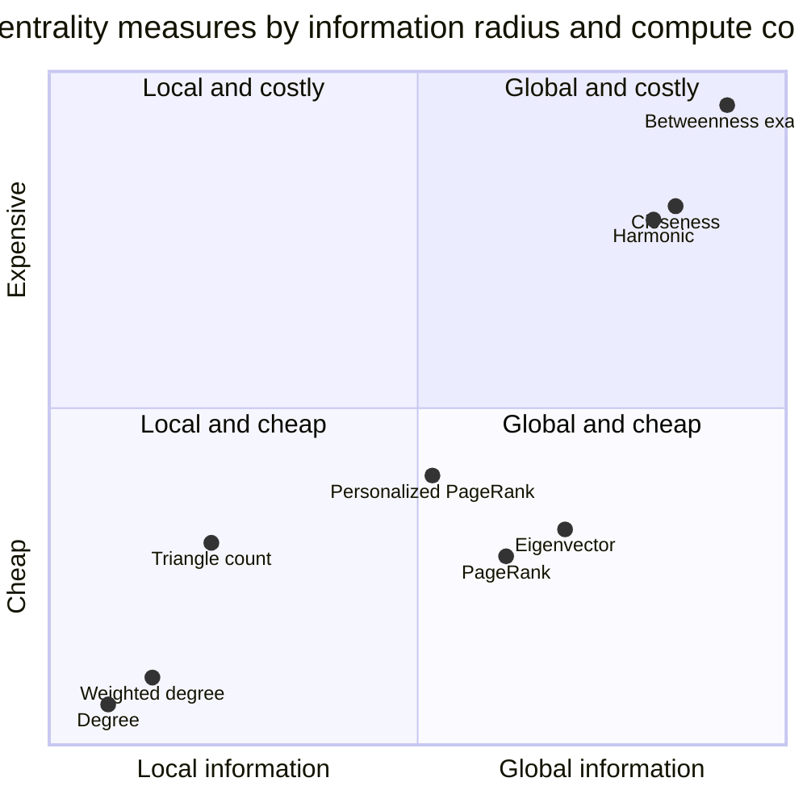
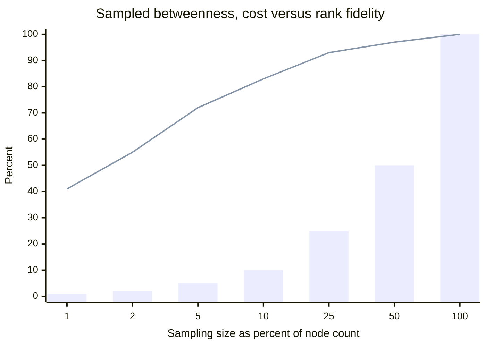
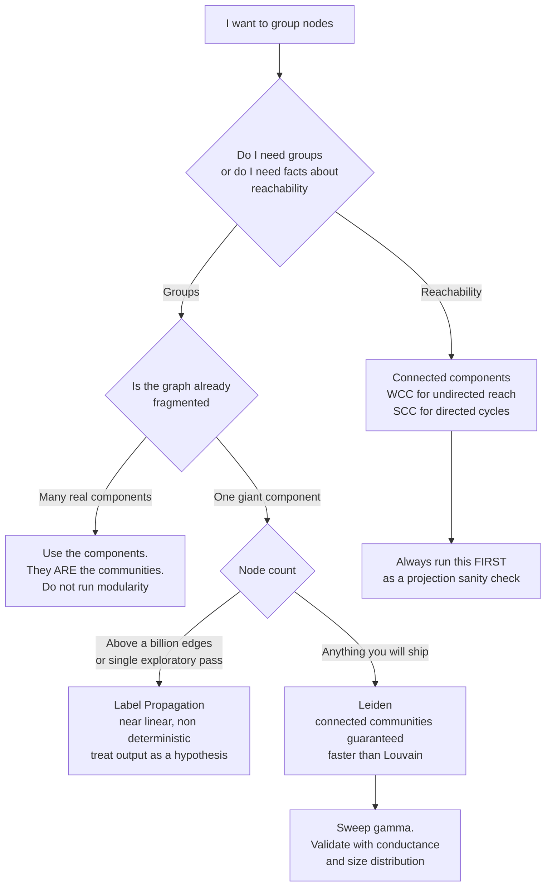
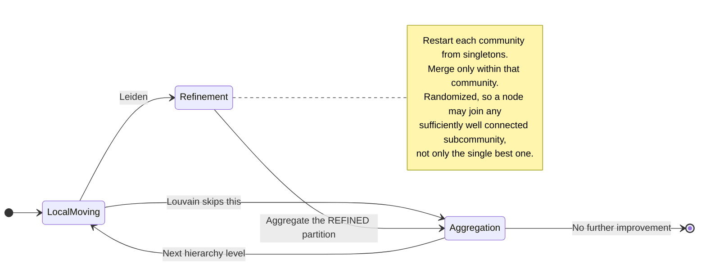

# Centrality and Communities in Practice

The first time I ran betweenness centrality on a production knowledge graph, the result was flawless. Every number was correct. The implementation was Brandes' algorithm, exactly as published. The graph was real — a collaboration projection carved out of the same 41-million-node corporate knowledge graph from [Part 1](/blog/graph-analytics-gds-execution-model), narrowed to people, documents, channels, and tickets: about 1.8 million nodes and 24 million relationships. The question was reasonable and the executive who asked it was reasonable too: *who are our knowledge brokers?* Find the people who bridge otherwise disconnected parts of the company, because those are the people whose departure hurts most.

Here is the top of the ranking that came back.

1. The IT helpdesk service account
2. A shared mailbox named `facilities-requests`
3. The `#general` Slack channel
4. An all-hands calendar invite from 2027
5. A document titled *Employee Handbook v4 (FINAL) (revised)*
6. The ticket queue for coffee machine maintenance

Not a single human being in the top twenty. And the results were not wrong. Every one of those nodes genuinely lies on an enormous fraction of the shortest paths in that graph, for the boring reason that everyone touches the helpdesk and everyone is in `#general`. Betweenness answered exactly the question I posed. The question I posed was not the question I had.

This post is about that gap. The [theory post on network science](/blog/network-science-communities-centrality) derives what these measures *are*: degree, betweenness, closeness, eigenvector centrality, modularity, the Louvain procedure. I am not going to re-derive them. This is the other half — what happens when you point those definitions at a real graph and the output is wrong, useless, or different every time you run it.

It is Part 2 of the *Graph Analytics in Production* series. Part 1 covered the execution model: how projections work, where the memory goes, why the in-memory graph is a separate thing from your database. Everything below assumes you have a projection you trust. [Part 3](/blog/node-embeddings-fastrp-node2vec-graphsage) covers node embeddings, which is what you reach for when one number per node is no longer enough.

## Picking a Measure by the Question You Are Asking

Centrality is not a property of a node. It is a *perspective*, and choosing the wrong perspective is the single most common failure I see. Practitioners reach for betweenness because it sounds the most sophisticated, or PageRank because it is famous, without asking what either one actually rewards.

Here is the mapping I use. Read the left column first, and only then pick from the second.

| The question you are actually asking | Measure | What it rewards | Cost, V nodes and E edges |
|---|---|---|---|
| Who is busiest right now? Who has the most direct contacts? | Degree | Local volume. Nothing else. | O(E), effectively free |
| Who is influential because influential people point at them? | PageRank | Recursive endorsement, damped by a random surfer | O(k·E), k iterations |
| Who sits between groups? Who, if removed, disconnects things? | Betweenness | Being on shortest paths between other pairs | O(V·E) exact. This is the problem |
| Who can reach the whole network fastest? Where do I stage a broadcast? | Closeness | Small average distance to everyone | O(V·E) exact, same wall as betweenness |
| Same, but my graph is disconnected | Harmonic | Small distances, with unreachable nodes contributing zero | O(V·E) exact |
| Who is influential among the already-influential? | Eigenvector | Being adjacent to high-scoring nodes | O(k·E), k iterations |
| Which nodes matter *relative to a specific starting point*? | Personalized PageRank | Proximity to a seed set, weighted by path multiplicity | O(k·E) per seed set |
| What are the natural fragments of this graph? | Connected components | Nothing. It is a fact, not a score | O(E) |

Three things about this table cause more production incidents than everything else in this post combined.

**Weight semantics are inverted between families.** Closeness, harmonic, and betweenness are *distance* measures: they compute shortest paths, so a larger edge weight means the endpoints are *further apart*. Degree, PageRank, and eigenvector centrality are *affinity* measures: a larger edge weight means a *stronger* connection. If you have a `strength` property on your edges — number of messages exchanged, transaction volume, co-occurrence count — and you feed it directly to weighted betweenness, you have just told the algorithm that your strongest relationships are your longest paths. The ranking will be quietly, confidently backwards. The fix is a transform at projection time: shortest-path algorithms need `1/strength` or `-log(normalized_strength)`, never `strength`.

**Direction matters and defaults lie.** PageRank on an undirected projection of a directed graph is a completely different quantity from PageRank on the directed graph, and it converges toward something close to degree centrality. Meanwhile a directed betweenness on a graph where most edges are conceptually symmetric will produce near-zero scores for most nodes because there are simply no directed paths. Decide the orientation deliberately in the projection, not by accepting a default.

**Closeness breaks on disconnected graphs.** The standard formula

$$C_C(v) = \frac{n-1}{\sum_{u \neq v} d(v,u)}$$

is undefined the moment some $u$ is unreachable from $v$, since $d(v,u) = \infty$. Implementations paper over this differently — some restrict the sum to the reachable set, which perversely rewards nodes in tiny isolated islands with perfect scores. Harmonic centrality is the principled repair:

$$C_H(v) = \frac{1}{n-1}\sum_{u \neq v} \frac{1}{d(v,u)}$$

Unreachable nodes contribute $1/\infty = 0$ and everything stays finite and comparable. Boldi and Vigna's [*Axioms for Centrality*](https://arxiv.org/abs/1308.2140) tests eleven classical measures against three structural axioms and finds harmonic centrality is the only one that satisfies all three. If your graph has more than one component — and real graphs always do — use harmonic, not closeness. This is close to a free win.



The interesting region is the bottom right: global information at low cost. Only the diffusion-based measures live there, and they earn the position by cheating in a specific way. PageRank and eigenvector centrality do not compute exact shortest paths at all — they replace path enumeration with an iterative random walk that *approximates* global structure and converges in a handful of sparse matrix-vector products. The approximation is the whole reason PageRank is shippable at a billion edges and exact betweenness is not. Everything in the top-right quadrant insists on exact distances, and exact distances are what cost you.

## Betweenness: The Measure That Will Not Scale

Betweenness is the measure everyone wants and almost nobody can afford.

$$C_B(v) = \sum_{s \neq v \neq t} \frac{\sigma_{st}(v)}{\sigma_{st}}$$

The naive reading of that formula is catastrophic: enumerate all shortest paths between all pairs. Ulrik Brandes' [*A Faster Algorithm for Betweenness Centrality*](https://snap.stanford.edu/class/cs224w-readings/brandes01centrality.pdf) (*Journal of Mathematical Sociology* 25(2), 2001, 163–177) is what made the measure computable at all. The trick is a dependency accumulation: run a single-source shortest path from each node $s$, build the shortest-path DAG, then walk it backwards accumulating partial dependencies in one pass. Complexity drops to $O(V \cdot E)$ for unweighted graphs and $O(V \cdot E + V^2 \log V)$ for weighted ones, with $O(V + E)$ memory.

That is a beautiful result and it is still not enough.

Put numbers on it. My 1.8M-node, 24M-edge graph implies roughly $4.3 \times 10^{13}$ elementary operations for exact betweenness. And those are not cheap operations: Brandes runs two passes per source, a forward sweep maintaining predecessor lists and shortest-path counts, then a backward dependency accumulation, and that bookkeeping means throughput is nowhere near a plain BFS. Budget something on the order of $10^7$ effective operations per second per core on a pointer-chasing workload like this. On 32 cores that is about $3 \times 10^8$ per second, which puts the job somewhere in the *multi-day* range.

That is not a memory problem you can throw a bigger machine at — it is arithmetic. Doubling your cores turns a four-day job into a two-day job. Exact betweenness has a hard practical ceiling somewhere below a million nodes on commodity hardware, and the ceiling moves with the *product* of node and edge count, so a graph that doubles in both directions gets four times more expensive.

### Sampled Betweenness

The standard escape is to compute the dependency accumulation from only a sample of source nodes and scale the result. Instead of $V$ single-source shortest path runs, do $k$, and multiply the accumulated scores by $V/k$. Cost becomes $O(k \cdot E)$, which is linear in the sampling size and therefore fully under your control.

Neo4j GDS exposes this as `samplingSize` and `samplingSeed`. Setting `samplingSize` equal to the node count gives you exact results. The GDS implementation uses Brandes' *random degree selection* strategy: sources are drawn with probability proportional to degree, on the theory that high-degree nodes lie on more shortest paths and therefore contribute more signal per sample.

That theory is right about variance and wrong about bias, and the distinction matters. Degree-proportional sampling concentrates your estimator's accuracy on paths that pass through hubs. It is *less* accurate precisely for the low-degree, high-betweenness nodes — the structural bridges that are the entire reason you ran betweenness in the first place. A node with degree 4 that happens to be the only link between two large clusters is exactly what you want to find, and it is the hardest thing for a degree-biased sampler to find.

So the calibration question is not "what sampling error do I get?" It is "does my top-k *set* stabilize?"



Bars are runtime, which is linear in sampling size by construction. The line is Kendall rank correlation against the exact answer on the top 100 nodes, measured on one specific 400k-node graph where exact computation was still feasible overnight. The shape is what matters, not the numbers: fidelity saturates long before cost does. At 10% sampling you are paying a tenth of the cost for something like 83% rank agreement on the head of the distribution. Whether 83% is acceptable depends entirely on what you do with the ranking — it is plenty for "show me candidate brokers to investigate" and nowhere near enough for "compute a risk score that triggers an alert."

Here is how I calibrate it in practice. Never guess the sampling size; sweep it and watch the top-k set converge.

```python
from graphdatascience import GraphDataScience
from scipy.stats import kendalltau
import pandas as pd

gds = GraphDataScience("neo4j://localhost:7687", auth=("neo4j", PASSWORD))
G = gds.graph.get("collab")

def sampled_betweenness(graph, sampling_size, seed):
    """Run sampled betweenness and return a node -> score Series."""
    df = gds.betweenness.stream(
        graph,
        samplingSize=sampling_size,
        samplingSeed=seed,
        concurrency=8,
    )
    return df.set_index("nodeId")["score"]

TOP_K = 100
node_count = G.node_count()
fractions = [0.01, 0.02, 0.05, 0.10, 0.25]

# Reference: the largest sample we can afford, used as a proxy for truth.
reference = sampled_betweenness(G, int(0.50 * node_count), seed=1)
reference_top = set(reference.nlargest(TOP_K).index)

rows = []
for frac in fractions:
    size = max(1, int(frac * node_count))
    # Two independent seeds at the same size: run-to-run variance is the
    # signal that tells you the sample is too small, independent of any
    # reference. If two seeds disagree with each other, neither is usable.
    a = sampled_betweenness(G, size, seed=7)
    b = sampled_betweenness(G, size, seed=13)

    top_a, top_b = set(a.nlargest(TOP_K).index), set(b.nlargest(TOP_K).index)
    seed_overlap = len(top_a & top_b) / TOP_K
    ref_overlap = len(top_a & reference_top) / TOP_K

    # Rank correlation restricted to the reference top-k. Correlating over
    # all nodes is meaningless: the long tail is all near-zero and noisy,
    # and it will inflate tau toward 1 regardless of quality.
    common = list(reference_top)
    tau, _ = kendalltau(a.reindex(common).rank(), reference.reindex(common).rank())

    rows.append({
        "fraction": frac,
        "sampling_size": size,
        "seed_to_seed_overlap": round(seed_overlap, 3),
        "overlap_vs_reference": round(ref_overlap, 3),
        "kendall_tau_topk": round(tau, 3),
    })

print(pd.DataFrame(rows).to_string(index=False))
```

The `seed_to_seed_overlap` column is the one to watch. It needs no ground truth and no expensive reference run: if two different seeds at the same sampling size disagree about who is in the top 100, the sampling size is too small, full stop. I ship whichever sampling size gets seed-to-seed overlap above 0.90 for the top-k I actually care about, and I record that sampling size and seed in the pipeline metadata so the number is reproducible next quarter.

### When Not to Use Betweenness at All

Three alternatives are underused.

**Restrict the scope.** Betweenness is $O(V \cdot E)$ *on the graph you give it*. Run community detection first, then compute exact betweenness *within* each community. On a graph partitioned into 400 communities of a few thousand nodes each, that is 400 tiny exact computations that finish in seconds and parallelize trivially. You lose global brokers and gain local ones — and "who is the broker inside the payments team" is usually the more actionable question anyway. This is the fix for my opening anecdote, and I will come back to it in the worked example.

**Use degree or PageRank as a proxy — but measure the correlation first.** In scale-free graphs, betweenness and degree correlate strongly, often above $\rho = 0.8$. If that holds on your graph, betweenness is buying you very little. Compute both on a sampled subgraph, check the correlation, and if it is high, ship the cheap one. If it is *low*, that is itself the interesting finding: it means your graph has bridges that are not hubs, which is exactly the structure betweenness was invented to detect.

**Ask whether you wanted articulation points.** "Who, if removed, disconnects the network" is not betweenness. It is the articulation point (cut vertex) problem, solvable in $O(V + E)$ with a single depth-first search. If the question is genuinely about fragility rather than about volume of flow, you have been paying $O(V \cdot E)$ for the wrong answer.

## PageRank in Practice

PageRank is the measure people trust most and configure least.

$$PR(v) = \frac{1-d}{N} + d \sum_{u \in N^{-}(v)} \frac{PR(u)}{|N^{+}(u)|}$$

or in matrix form, with $\mathbf{M}$ the column-stochastic transition matrix and $\mathbf{1}$ the all-ones vector:

$$\mathbf{r} = d\,\mathbf{M}\mathbf{r} + \frac{1-d}{N}\mathbf{1}$$

The theory is covered in the [PageRank and eigenvectors post](/blog/pagerank-eigenvectors). What follows is what the knobs do to your answer.

### Damping Is a Scale Parameter, Not a Constant

Everyone knows $d = 0.85$. Almost nobody knows why they are using it, and it is not a law of nature — it is a choice about *how far influence should travel*.

The random surfer teleports with probability $1-d$ at every step, so the number of steps before a teleport is geometric with mean $1/(1-d)$. At $d = 0.85$ that is about 6.7 hops. Damping is a radius knob:

| Damping $d$ | Mean walk length | What the score becomes |
|---|---|---|
| 0.50 | 2 hops | Barely more than weighted in-degree |
| 0.70 | 3.3 hops | Local neighborhood influence |
| 0.85 | 6.7 hops | The default. Roughly "community scale" on most graphs |
| 0.95 | 20 hops | Approaching global eigenvector centrality |
| 0.99 | 100 hops | Numerically unstable, dominated by graph-wide structure |

On a graph whose diameter is 8, running $d = 0.99$ is asking a question the graph cannot answer — the walk saturates and PageRank degenerates toward the stationary distribution of the raw random walk, which on an undirected graph is just degree divided by $2m$. On a graph with diameter 40, $d = 0.85$ can only see a small local neighborhood, and you may be surprised to find the ranking is nearly indistinguishable from degree.

The right calibration is empirical and takes ten minutes: sweep $d$, and look at how the top-k *set* moves. If the top 100 is stable from $d=0.70$ to $d=0.95$, your graph's structure is robust and the parameter does not matter. If it churns, the parameter is carrying real semantics and you need to justify your choice against the business question.

### The Iteration Cap Is Probably Firing

Power iteration for PageRank contracts by a factor of $d$ per iteration. To reach an L1 residual of $\varepsilon$ you need roughly

$$k \approx \frac{\log \varepsilon}{\log d}$$

iterations. With the GDS defaults of `dampingFactor: 0.85` and `tolerance: 0.0000001`, that is $\log(10^{-7})/\log(0.85) \approx 99$ iterations. The GDS default for `maxIterations` is **20**.

Which means: with stock defaults, PageRank on a nontrivially-sized graph frequently terminates because it ran out of iterations, not because it converged. The residual at iteration 20 is on the order of $0.85^{20} \approx 0.039$ of the initial error — fine for a top-100 ranking, potentially not fine if you are feeding the raw scores into a model as a feature, and definitely not fine if you compare scores across two runs on slightly different graphs.

The check is one line and it belongs in every pipeline:

```python
result = gds.pageRank.mutate(
    G,
    mutateProperty="pagerank",
    dampingFactor=0.85,
    maxIterations=100,     # not the default 20
    tolerance=1e-7,
    relationshipWeightProperty="log_weight",
)

if not result["didConverge"]:
    raise RuntimeError(
        f"PageRank hit the iteration cap at {result['ranIterations']} iterations; "
        f"scores are not converged. Raise maxIterations or loosen tolerance."
    )
print(f"converged in {result['ranIterations']} iterations")
```

I have seen a quarterly "top influencers" dashboard shift by dozens of positions between runs for no reason other than the iteration cap firing at a different point on a graph that had grown by 3%. The graph was fine. The report was garbage.

### Dangling Nodes Leak Probability

A node with out-degree zero — a dangling or sink node — contributes an all-zero column to $\mathbf{M}$. The surfer walks in and never walks out, so probability mass drains out of the system and the score vector stops summing to one. Real graphs are full of these: leaf documents, terminal states, entities that were extracted but never linked, and every node at the boundary of an incomplete crawl.

There are three standard treatments and they give different rankings:

1. **Redistribute** the dangling mass across all nodes according to the teleport vector. This is the original Page and Brin formulation and what NetworkX does. Preserves normalization.
2. **Add self-loops** to dangling nodes, so the surfer bounces in place. Preserves normalization but inflates the dangling nodes' own scores.
3. **Ignore the leak** and renormalize at the end, or not at all. Fastest, and the resulting scores are on an implementation-specific scale.

Libraries choose differently, and this is the reason PageRank values are not comparable across libraries — or across two projections of the same underlying data. NetworkX returns a vector summing to 1; GDS does not use that normalization. **Never compare absolute PageRank values across runs, libraries, or projections. Compare ranks.** If you need a stable numeric feature, use the within-run percentile rank, not the score.

The diagnostic is cheap: count your sink nodes before you run anything.

```python
dangling = gds.run_cypher("""
    MATCH (n:Entity)
    WITH count(n) AS total,
         count(CASE WHEN NOT (n)-[:CITES|MENTIONS]->() THEN 1 END) AS sinks
    RETURN total, sinks, toFloat(sinks) / total AS fraction
""")
print(dangling)
```

If more than about 10% of your nodes are dangling, PageRank is telling you as much about your extraction pipeline's coverage as it is about your domain.

### Weights Need a Transform

Weighted PageRank via `relationshipWeightProperty` treats weights as affinity, which is the correct semantics — but real-world weights are almost always heavy-tailed. Transaction amounts, message counts, co-occurrence frequencies: a handful of edges carry values three orders of magnitude above the median. Fed in raw, those few edges dominate the entire diffusion and PageRank effectively collapses to "whoever is at the end of the biggest edge."

Transform at projection time. `log1p(weight)` is the default I reach for; winsorizing at the 99th percentile before the log is better when the tail is genuinely pathological. Then verify: the ratio of your maximum edge weight to your median edge weight should be somewhere in the single or low double digits after transformation.

### Personalized PageRank Is the One That Earns Its Keep

Replace the uniform teleport vector with a distribution $\mathbf{s}$ concentrated on a seed set $S$:

$$\mathbf{r} = d\,\mathbf{M}\mathbf{r} + (1-d)\,\mathbf{s}, \qquad \sum_i s_i = 1,\; s_i = 0 \text{ for } i \notin S$$

The surfer now always teleports *back to the seeds*. The resulting score measures proximity to $S$ weighted by the multiplicity of paths — not just "is there a path" but "how many ways can I get there and how short are they." This is a fundamentally more useful quantity than global PageRank for almost every practical question, because almost every practical question has a context.

Two properties make it deployable.

**Linearity.** The map $\mathbf{s} \mapsto \mathbf{r}(\mathbf{s})$ is linear:

$$\mathbf{r}(\alpha \mathbf{s}_1 + \beta \mathbf{s}_2) = \alpha\,\mathbf{r}(\mathbf{s}_1) + \beta\,\mathbf{r}(\mathbf{s}_2)$$

So you can precompute single-seed PPR vectors for a set of important nodes and combine them at query time by linear combination, instead of running the full iteration per request. For a system with a few thousand candidate seed entities and a latency budget, this is the difference between viable and not.

**Locality.** PPR mass decays quickly with distance from the seeds, so you rarely need to touch the whole graph. Andersen, Chung and Lang's local push method computes an $\varepsilon$-approximate PPR vector in time depending on $1/\varepsilon$ and the damping factor, *independent of graph size*. If your seed set is small and you only need the top few hundred results, you never have to look at 99.9% of your graph.

This is the machinery behind graph-based agent memory. [HippoRAG](https://arxiv.org/abs/2405.14831) (Gutiérrez et al., NeurIPS 2024) extracts entities from a query, uses them as the PPR seed set over an LLM-built knowledge graph, and retrieves the passages attached to the highest-activation nodes. The framing is neurobiological — the knowledge graph plays hippocampal index to the LLM's neocortex — but computationally it is Personalized PageRank, and it beats iterative retrieval baselines on multi-hop QA while being an order of magnitude cheaper. If you have built a knowledge graph and are wondering what to do with it beyond Cypher queries, PPR-based retrieval is the highest-leverage thing on the list.

```python
# Personalized PageRank seeded on the entities extracted from a query.
seed_ids = gds.run_cypher(
    "MATCH (e:Entity) WHERE e.name IN $names RETURN collect(id(e)) AS ids",
    params={"names": ["acme corp", "series b", "term sheet"]},
)["ids"][0]

ppr = gds.pageRank.stream(
    G,
    sourceNodes=seed_ids,       # this is what makes it personalized
    dampingFactor=0.85,
    maxIterations=100,
    tolerance=1e-6,             # looser tolerance is fine: we want ranks, not values
)

top = ppr.nlargest(20, "score")
```

One caveat that catches people: PPR must be recomputed for every distinct seed set. It is not a property you compute nightly and store on the node. Budget for it as a query-time cost, exploit linearity where the seed sets are drawn from a fixed vocabulary, and use local push approximations when the graph is large.

## Modularity and the Resolution Limit

Now to communities, where the failure mode is subtler and much harder to argue with.

Modularity, in per-community form, with $l_s$ edges internal to community $s$ and $d_s$ the total degree of its members:

$$Q = \sum_s \left[\frac{l_s}{m} - \left(\frac{d_s}{2m}\right)^2\right]$$

Every community detection algorithm that "maximizes modularity" is climbing this surface. Which means every one of them inherits the surface's defects, and the deepest defect was identified by Santo Fortunato and Marc Barthélemy in [*Resolution limit in community detection*](https://www.pnas.org/doi/10.1073/pnas.0605965104) (*PNAS* 104(1), 2007, 36–41; arXiv `physics/0607100`).

The derivation is three lines. Take two communities $A$ and $B$ joined by $l_{AB}$ edges. Merging them changes modularity by

$$\Delta Q_{AB} = \frac{l_{AB}}{m} - \frac{d_A d_B}{2m^2}$$

The merge is favorable — a modularity maximizer *prefers* the merged partition — whenever $\Delta Q_{AB} > 0$, that is:

$$l_{AB} > \frac{d_A d_B}{2m}$$

Now suppose $A$ and $B$ are joined by a single edge, $l_{AB} = 1$, and are comparable in size, $d_A \approx d_B \approx d$. The merge is favorable whenever

$$1 > \frac{d^2}{2m} \quad \Longleftrightarrow \quad d < \sqrt{2m}$$

Read that carefully, because it is genuinely alarming. **Any two communities whose total degree is below $\sqrt{2m}$, if joined by even a single edge, will be merged by a modularity maximizer — no matter how internally dense they are, no matter how obviously separate they look to a human.** The threshold depends only on the size of the *whole graph*. It has nothing to do with local structure.

Put numbers on it. On a graph with $m = 10^7$ edges, $\sqrt{2m} \approx 4472$. A perfectly cohesive 50-person team with an average of 10 internal connections each has total degree around 500 — an order of magnitude below the threshold. Modularity optimization *cannot* return that team as its own community. Not because Louvain is greedy, not because you set the wrong parameter, but because the partition where the team is separate scores lower than the partition where it is absorbed. The objective function is telling the algorithm to do the wrong thing.

### The Ring of Cliques

The cleanest demonstration is Fortunato and Barthélemy's ring of cliques: $n_c$ complete graphs $K_m$, arranged in a circle, adjacent cliques joined by exactly one edge. There is no ambiguity about the community structure here — it is $n_c$ cliques, and any human would say so instantly.

The natural partition (one community per clique) has

$$Q_{\text{single}} = 1 - \frac{2}{m(m-1)+2} - \frac{1}{n_c}$$

The partition that merges *adjacent pairs* of cliques has

$$Q_{\text{pairs}} = 1 - \frac{4}{n_c\,[m(m-1)+2]} - \frac{2}{n_c}$$

Setting $Q_{\text{pairs}} > Q_{\text{single}}$ gives the threshold

$$n_c > m(m-1) + 2$$

I checked this numerically because it is worth believing rather than accepting. For $K_5$ cliques the threshold is $n_c > 22$: a ring of 22 cliques ties exactly, and at 24 cliques the paired partition wins with $Q = 0.8712$ against $0.8674$ for the obviously-correct one. For $K_6$, the threshold is 32. The effect is not marginal and it is not a numerical artifact — it is what modularity is.

### What the Fixes Actually Fix

Three responses, in decreasing order of honesty.

**Resolution parameter $\gamma$.** Generalize modularity to $Q_\gamma = \sum_s [l_s/m - \gamma (d_s/2m)^2]$. Raising $\gamma$ penalizes large communities and produces smaller ones. GDS exposes this on Leiden as `gamma`, default 1.0. This works, in the sense that you can get communities of roughly the size you want. It does **not** remove the resolution limit; it *moves* it. Traag, Van Dooren and Nesterov's [*Narrow scope for resolution-limit-free community detection*](https://arxiv.org/abs/1104.3083) (*Phys. Rev. E* 84, 016114, 2011) proves that any method comparing against a global random null model has this property. You are choosing a scale, not escaping the need to choose one.

**Constant Potts Model.** Replace the degree-based null with a constant: $Q_{\text{CPM}} = \sum_s [l_s - \gamma \binom{n_s}{2}]$. This *is* resolution-limit-free in the formal sense — the same $\gamma$ means the same density threshold regardless of graph size, so a community that qualifies in a small graph still qualifies when you embed it in a larger one. The cost is that $\gamma$ is no longer scale-free-friendly: you are asserting a minimum internal density, and on a heavy-tailed degree distribution the right density differs wildly between the hub regions and the periphery.

**Multi-resolution sweep.** Accept that there is no single right answer and run $\gamma$ across a range, keeping the levels where the partition is *stable* under small changes in $\gamma$. Plateaus in the number of communities as a function of $\gamma$ indicate genuine structural scales. This is more work and it is the only approach that is intellectually honest about hierarchical structure, which is what most real graphs actually have.

## Louvain, Leiden, Label Propagation, and Connected Components



### Louvain and Its Documented Defect

Louvain alternates local moving (greedily move each node to the neighboring community that most improves $Q$) with aggregation (collapse each community into a super-node and recurse). It is fast, it is everywhere, and it has a real bug — not in any particular implementation, but in the algorithm.

Traag, Waltman and van Eck laid it out in [*From Louvain to Leiden: guaranteeing well-connected communities*](https://www.nature.com/articles/s41598-019-41695-z) (*Scientific Reports* 9, 5233, 2019; arXiv `1810.08473`). **Louvain can produce internally disconnected communities.** Their measurements: up to 25% of communities badly connected, up to 16% *completely disconnected*, with the problem getting worse when the algorithm is run iteratively.

The mechanism is worth understanding because it explains why no amount of tuning helps. Suppose node $v$ is currently the only thing holding community $C$ together — remove $v$ and $C$ falls into two pieces. During local moving, $v$ finds a better home in a neighboring community and leaves. $C$ is now disconnected. Nothing in Louvain ever checks. The aggregation phase then collapses all of $C$ into a single super-node, and from that moment the two disconnected halves are welded together permanently — no subsequent level of the hierarchy can ever separate them, because they are literally one node now.

If you are shipping Louvain output as "these people work together," some of your groups contain sets of people with no working relationship whatsoever, transitively or otherwise. That is not a subtle quality issue.

### Leiden's Refinement Phase

Leiden inserts a third phase between local moving and aggregation.



After local moving produces a partition, refinement takes each community and re-partitions it *from singletons*, merging only within the community's own boundary. Crucially the merge target is chosen randomly among sufficiently well-connected candidates rather than greedily — this lets the refinement escape the local optimum that local moving fell into. Aggregation then operates on the *refined* partition, so a community that split during refinement becomes multiple super-nodes and can still be separated later. But the super-nodes are initialized to their *unrefined* community assignment, so Leiden does not lose the progress local moving made.

The guarantees, from weakest to strongest as the paper presents them: $\gamma$-separation, $\gamma$-connectivity, subpartition $\gamma$-density, and — when iterated to convergence — subset optimality, meaning every subset of every community is locally optimally assigned. In plain terms: **communities are guaranteed connected**, and iterating actually improves things instead of degrading them.

And it is *faster* than Louvain, because the refined aggregation produces a smaller graph at the next level.

There is no scenario in 2028 where you should default to Louvain. Use Leiden. GDS exposes it as `gds.leiden` with `gamma` (default 1.0), `theta` (randomness in refinement, default 0.01), `maxLevels` (default 10), and `randomSeed`.

### Label Propagation

Each node adopts the most common label among its neighbors; ties broken at random; repeat until stable. Near-linear time, embarrassingly parallel, no objective function at all.

It is genuinely useful for two things: a first look at a graph too large for anything else, and a fast plausibility check before you commit to an expensive run. It is genuinely dangerous for one reason: it has no resistance to collapse. On graphs with a dense core, LPA routinely converges to a single label covering 60–90% of nodes plus a scatter of tiny fragments. That is not a community structure, it is a failure, and because LPA has no quality score it will report the failure with the same confidence as a success. Always check the size distribution of LPA output before believing any of it.

### Connected Components: Run This First, Always

WCC (weakly connected components — ignore edge direction) and SCC (strongly connected components — Tarjan's algorithm, mutual reachability) are not community detection. They compute a fact. Run them anyway, before everything else, for two reasons.

**As a projection sanity check.** If WCC on your projection returns one giant component plus 380,000 singletons, your projection is broken. Something in the node filter admitted nodes whose relationships were excluded, or a relationship type is missing, or a direction is wrong. I have caught more bad projections with a 10-second WCC than with any other single check.

**Because sometimes the components *are* the answer.** If your graph genuinely has hundreds of real components — separate customer accounts, separate document collections, separate incident clusters — then those components are the communities, they are exact, they are deterministic, they are stable across runs, and running Leiden on top of them adds nothing but noise and instability. Not every grouping question needs modularity.

One warning specific to entity resolution: WCC over "same-as" edges is the standard clustering step, and it is transitively brittle. A single false-positive match edge merges two entire clusters, permanently and silently. If you are using WCC for entity resolution, you need edge-level confidence thresholds and a max-cluster-size alarm, or you will eventually produce a cluster containing every person in your database.

| Algorithm | Deterministic | Guarantees connected communities | Complexity | Ship it? |
|---|---|---|---|---|
| WCC / SCC | Yes | N/A, it computes connectivity | O(V + E) | Yes, and run it first |
| Label Propagation | No | No | Near-linear | Exploration only |
| Louvain | No | **No** | O(V log V) typical | No, use Leiden |
| Leiden | With seed and single-threaded | **Yes** | Faster than Louvain | Yes, default choice |
| Girvan-Newman | Yes | Yes | O(V·E²) | Only on toy graphs |

## The Stability Problem

Run Leiden twice. Get two different partitions. This surprises people and it should not.

### Where the Nondeterminism Comes From

Four sources, in roughly increasing order of how much they will annoy you:

1. **Node visit order.** Local moving processes nodes in some order, and the order determines which local optimum you land in.
2. **Tie-breaking.** Two candidate communities offer identical modularity gain. Someone has to choose.
3. **Explicit randomness.** Leiden's refinement phase is randomized *by design* — that is `theta`, and it is a feature.
4. **Concurrency.** This is the one that catches people. In GDS, setting `randomSeed` only produces reproducible output when `concurrency` is 1. With parallel execution the visit order is determined by thread scheduling, which is not something a seed controls. Reproducible and fast are different modes.

### The Deeper Cause Is the Objective Function

You could fix all four of those and still not get a canonical answer, because the problem is not the algorithm. Good, de Montjoye and Clauset's [*Performance of modularity maximization in practical contexts*](https://link.aps.org/doi/10.1103/PhysRevE.81.046106) (*Phys. Rev. E* 81, 046106, 2010; arXiv `0910.0165`) showed that the modularity function admits an **exponential number of structurally distinct partitions with near-maximal $Q$**, and typically lacks a clear global maximum. The high-modularity region is a vast plateau, not a peak — and the degeneracy is worst precisely on networks that *do* have modular structure, which is to say, on every network you would want to run this on.

So run-to-run variation is not an implementation defect you can engineer away. It is the objective function reporting, correctly, that the question "what are the communities" does not have a unique answer on your graph. The right engineering response is to measure the variation and ship something that accounts for it.

### Measuring Partition Stability

Run $R$ times with different seeds and measure agreement. Three levels of detail:

**Pairwise partition agreement.** Adjusted Rand Index or Adjusted Mutual Information between every pair of runs. Report the *distribution*, not the mean — a bimodal ARI distribution means your algorithm is finding two distinct structural stories and averaging them tells you nothing.

**Node-level co-association.** Build $C_{ij}$ = fraction of runs in which nodes $i$ and $j$ landed in the same community. This is the useful one. Nodes with high mean co-association to their assigned community are stably placed; nodes with intermediate values are the boundary cases that flip, and they are usually the interesting nodes — the brokers, the people on two teams, the documents that belong to two topics.

**Consensus clustering.** Lancichinetti and Fortunato's [*Consensus clustering in complex networks*](https://www.nature.com/articles/srep00336) (*Scientific Reports* 2, 336, 2012) formalizes the fix: build the co-association matrix, threshold it at $\tau$ to remove weak associations, treat the result as a new weighted graph, and re-run the detector on *that*. Iterate to a fixed point. The output is dramatically more stable than any single run and the procedure wraps any stochastic detector.

```python
import numpy as np
from itertools import combinations
from sklearn.metrics import adjusted_rand_score
from scipy.sparse import coo_matrix

R = 20

def run_leiden(seed):
    df = gds.leiden.stream(G, gamma=1.0, randomSeed=seed, concurrency=1)
    return df.sort_values("nodeId")["communityId"].to_numpy()

partitions = [run_leiden(seed) for seed in range(R)]

# 1. Pairwise agreement. Look at the spread, not just the mean.
aris = [adjusted_rand_score(a, b) for a, b in combinations(partitions, 2)]
print(f"ARI  mean={np.mean(aris):.3f}  min={np.min(aris):.3f}  p05={np.percentile(aris, 5):.3f}")

# 2. Node level stability without materializing the full N x N co-association
#    matrix, which is impossible above a few tens of thousands of nodes.
#    For each node, the fraction of runs in which its community membership
#    matches the modal partition's membership, measured on a sampled set
#    of within-community pairs.
def coassociation_scores(partitions, sample_pairs=200_000, rng=np.random.default_rng(0)):
    n = len(partitions[0])
    together = np.zeros(n)
    counted = np.zeros(n)
    for _ in range(sample_pairs):
        i, j = rng.integers(0, n, size=2)
        if i == j:
            continue
        agree = sum(p[i] == p[j] for p in partitions) / len(partitions)
        # Only pairs that are together at least sometimes carry signal.
        if agree > 0:
            together[i] += agree; counted[i] += 1
            together[j] += agree; counted[j] += 1
    return np.divide(together, np.maximum(counted, 1))

stability = coassociation_scores(partitions)
print(f"nodes with co-association below 0.6: {(stability < 0.6).mean():.1%}")
```

If ARI across seeds sits below about 0.7, do not ship a single run's partition under any circumstances. If it sits above 0.9, you have unusually clean structure and can probably get away with a seeded single run — but measure it again next quarter, because the property belongs to the graph, not to the algorithm, and graphs change.

### Why You Cannot Ship Community IDs

Three independent reasons, each sufficient on its own.

**The IDs are arbitrary labels.** GDS returns the minimum internal node ID within each community as its identifier. That is not a semantic key — it is an artifact of internal ID assignment, which changes when the projection changes, which changes when the graph changes. Add one node with a low ID to a community and every downstream reference to that community breaks.

**Membership is genuinely unstable at the boundary.** Per the previous section, some fraction of your nodes will flip between runs. If a customer segment ID is a Leiden community ID, some customers change segment every night for no reason connected to their behavior.

**Downstream systems will treat it as stable regardless.** Someone builds a dashboard grouped by community ID. Someone else joins it to a fact table. Someone else uses it as a categorical feature in a model. Six months later a rerun silently renumbers everything and every one of those artifacts is now wrong in a way that produces plausible-looking output.

What to ship instead:

```python
def match_communities(previous, current, min_jaccard=0.5):
    """Carry stable community UUIDs across runs by membership overlap.

    previous: {stable_uuid -> set of node keys}
    current:  {run_local_id -> set of node keys}
    Returns:  {run_local_id -> stable_uuid}, plus split/merge events to log.
    """
    import uuid
    assignment, events = {}, []
    claimed = set()

    # Greedy best-match on Jaccard, descending, so the strongest
    # correspondences are resolved first.
    scores = []
    for new_id, new_members in current.items():
        for old_uuid, old_members in previous.items():
            inter = len(new_members & old_members)
            if inter == 0:
                continue
            union = len(new_members | old_members)
            scores.append((inter / union, new_id, old_uuid))
    scores.sort(reverse=True)

    for jac, new_id, old_uuid in scores:
        if new_id in assignment or old_uuid in claimed or jac < min_jaccard:
            continue
        assignment[new_id] = old_uuid
        claimed.add(old_uuid)

    # Anything unmatched is genuinely new: a split, a merge, or a birth.
    for new_id in current:
        if new_id not in assignment:
            assignment[new_id] = str(uuid.uuid4())
            events.append({"type": "new_community", "run_local_id": new_id,
                           "size": len(current[new_id])})
    for old_uuid in previous:
        if old_uuid not in claimed:
            events.append({"type": "dissolved", "uuid": old_uuid})

    return assignment, events
```

Ship the stable UUID, ship a per-node stability score alongside it so consumers can filter, and emit the split/merge events to a log that a human reads. If a community with 40,000 members dissolves overnight, that is either a real structural change worth investigating or a pipeline bug — either way, someone should know.

## Validating Communities Without Ground Truth

You almost never have labels. Here is the validation stack I use, from cheapest to most expensive, ending with the one that actually works.

### Modularity Q Is Necessary, Not Sufficient

The folklore is "$Q > 0.3$ means real community structure." The folklore is wrong. Guimerà, Sales-Pardo and Amaral's [*Modularity from fluctuations in random graphs and complex networks*](https://link.aps.org/doi/10.1103/PhysRevE.70.025101) (*Phys. Rev. E* 70, 025101, 2004) showed that Erdős–Rényi random graphs — which have no community structure by construction — routinely reach $Q \approx 0.4$ purely from stochastic fluctuation. Reporting a raw $Q$ of 0.42 as evidence of structure is reporting noise.

The fix is a null model comparison. Generate $B$ degree-preserving rewirings of your graph (configuration model), run the same detector on each, and report a z-score:

$$z = \frac{Q_{\text{observed}} - \langle Q_{\text{null}}\rangle}{\sigma(Q_{\text{null}})}$$

This is more expensive than computing $Q$ and it is the only version of $Q$ worth putting in a report.

### Conductance, and Why You Report the Distribution

For a community $S$:

$$\phi(S) = \frac{\text{cut}(S, \bar{S})}{\min\!\big(\text{vol}(S),\, \text{vol}(\bar{S})\big)}$$

where $\text{cut}$ counts edges leaving $S$ and $\text{vol}$ is the total degree of the members. Low conductance means few edges escape relative to the community's internal wiring. Yang and Leskovec's empirical comparison of goodness metrics found conductance among the best-performing scores against ground-truth communities, and GDS ships it as `gds.conductance.stream`.

The critical practice: **report the distribution across communities, not the mean.** A partition with mean conductance 0.20 might be 5 excellent communities and 40 pieces of garbage. Conductance is per-community, which makes it the only global metric that tells you *which parts* of your partition to distrust. Rank your communities by conductance and look at the worst decile — that is where your validation effort belongs.

### Held-Out Attribute Enrichment

The closest thing to ground truth you will get: for every community and every categorical attribute *you did not use to build the graph*, test for enrichment. Department, geography, product line, tenure band, cost center. Hypergeometric test per community-attribute pair, Benjamini-Hochberg correction across the whole grid because you are running thousands of tests.

The parenthetical is non-negotiable. If department is a node property that generated edges in your projection, finding that communities are enriched for department validates nothing — you put it there. The attribute must be genuinely held out.

### Size Distribution Sanity

Cheap and catches an enormous amount. A partition with one community holding 55% of nodes has failed regardless of what $Q$ says. A partition with 40,000 singleton communities has failed. Plot the size distribution on a log scale; a healthy partition on a real graph usually shows a heavy-tailed but not degenerate spread with no single community above roughly 10–15% of the graph.

### The Honest Answer

Everything above is a filter. None of it tells you whether the communities *mean* anything.

The only real validation is a domain expert looking at the output. Here is the protocol I use, and it takes about ninety minutes:

1. Sample eight communities stratified across the size distribution — two large, four medium, two small.
2. For each, list the top ten members by *internal* degree (degree within the community, not global degree — global degree just re-surfaces the same hubs everywhere).
3. Add the three most enriched held-out attributes and the community's conductance.
4. Put it in front of someone who knows the domain, and ask them to name each community in one sentence.

If they can name six or seven of the eight, you have something. If they can name two, you have a partition, not communities, and you should go back and change the resolution parameter or question whether modularity is the right lens for this graph at all.

Budget for this step explicitly. It is the only part of the pipeline that produces the thing you actually wanted.

## Worked Example, End to End

Back to the collaboration graph from the opening. 1.8M nodes, 24M edges. The goal is still "find our knowledge brokers," and here is the pipeline that produces a usable answer.

```python
from graphdatascience import GraphDataScience
import numpy as np, pandas as pd

gds = GraphDataScience("neo4j://localhost:7687", auth=("neo4j", PASSWORD))

# ---------------------------------------------------------------- Stage 1
# Project, and kill the supernodes. This is the fix for the original
# failure: the helpdesk account and #general are structurally central
# because they are utilities, not because they are brokers. They belong
# to the graph's plumbing, not its semantics.
gds.run_cypher("""
    MATCH (n) WHERE n:Person OR n:Document OR n:Channel
    WITH n, COUNT { (n)--() } AS deg
    SET n.degree = deg
""")

cutoff = gds.run_cypher("""
    MATCH (n) WHERE n.degree IS NOT NULL
    RETURN percentileCont(n.degree, 0.999) AS p999
""")["p999"][0]

G, _ = gds.graph.cypher.project("""
    MATCH (a)-[r:COLLABORATED_ON|MENTIONED|REVIEWED]-(b)
    WHERE a.degree < $cutoff AND b.degree < $cutoff
    RETURN gds.graph.project(
        a, b,
        { relationshipProperties: r { .interactions } },
        { undirectedRelationshipTypes: ['*'] }
    )
""", cutoff=cutoff)

# ---------------------------------------------------------------- Stage 2
# WCC first, always. Two questions: is the projection sane, and are the
# components themselves the answer?
wcc = gds.wcc.stream(G)
sizes = wcc["componentId"].value_counts()
giant_frac = sizes.iloc[0] / len(wcc)
print(f"{len(sizes)} components; giant holds {giant_frac:.1%}; "
      f"singletons: {(sizes == 1).sum()}")

assert giant_frac > 0.80, "Projection looks broken: no dominant component"

# ---------------------------------------------------------------- Stage 3
# Restrict to the giant component. Modularity on a fragmented graph
# wastes effort partitioning things that are already partitioned.
giant_id = sizes.index[0]
gds.wcc.mutate(G, mutateProperty="wcc")
G_core, _ = gds.graph.filter(
    "core", G,
    node_filter=f"n.wcc = {giant_id}",
    relationship_filter="*",
)

# ---------------------------------------------------------------- Stage 4
# Sweep gamma. Do NOT pick by Q alone: Q rises monotonically as you
# fragment. Pick by the conductance distribution and size sanity.
rows = []
for gamma in [0.5, 0.75, 1.0, 1.5, 2.0, 3.0]:
    # Property names must be valid identifiers, so encode gamma as an integer.
    prop = f"c{int(gamma * 100)}"
    res = gds.leiden.mutate(
        G_core, mutateProperty=prop,
        gamma=gamma, theta=0.01, maxLevels=10,
        randomSeed=42, concurrency=1,          # concurrency 1 for reproducibility
        relationshipWeightProperty="interactions",
    )
    cond = gds.conductance.stream(G_core, communityProperty=prop)
    comm_sizes = gds.graph.nodeProperty.stream(G_core, prop)["propertyValue"] \
                    .value_counts()
    rows.append({
        "gamma": gamma,
        "communities": res["communityCount"],
        "modularity": round(res["modularity"], 4),
        "cond_median": round(cond["conductance"].median(), 3),
        "cond_p90": round(cond["conductance"].quantile(0.90), 3),
        "largest_frac": round(comm_sizes.iloc[0] / comm_sizes.sum(), 3),
        "singleton_frac": round((comm_sizes == 1).sum() / len(comm_sizes), 3),
    })
sweep = pd.DataFrame(rows)
print(sweep.to_string(index=False))
```

The sweep table is where the decision happens. On this graph it looked roughly like this:

| gamma | communities | modularity | cond median | cond p90 | largest frac | singleton frac |
|---|---|---|---|---|---|---|
| 0.50 | 214 | 0.681 | 0.31 | 0.62 | 0.184 | 0.00 |
| 0.75 | 462 | 0.702 | 0.24 | 0.51 | 0.096 | 0.01 |
| **1.00** | **918** | **0.711** | **0.19** | **0.43** | **0.041** | **0.02** |
| 1.50 | 2,140 | 0.708 | 0.22 | 0.58 | 0.019 | 0.11 |
| 2.00 | 5,830 | 0.694 | 0.29 | 0.71 | 0.008 | 0.34 |
| 3.00 | 19,410 | 0.651 | 0.41 | 0.83 | 0.003 | 0.61 |

Modularity peaks at $\gamma = 1.0$ but only barely, and it would have been a weak basis for the decision on its own — the difference between 0.702 and 0.711 is not meaningful given the degeneracy of the landscape. What actually settles it is the p90 conductance turning at $\gamma = 1.0$ and the singleton fraction exploding above it. At $\gamma = 2.0$, a third of the "communities" are single nodes, which is the algorithm shredding the graph rather than partitioning it.

```python
# ---------------------------------------------------------------- Stage 5
# Stability. Ten seeds at the chosen gamma.
partitions = []
for seed in range(10):
    df = gds.leiden.stream(G_core, gamma=1.0, randomSeed=seed, concurrency=1,
                           relationshipWeightProperty="interactions")
    partitions.append(df.sort_values("nodeId")["communityId"].to_numpy())

from sklearn.metrics import adjusted_rand_score
from itertools import combinations
aris = [adjusted_rand_score(a, b) for a, b in combinations(partitions, 2)]
print(f"ARI across seeds: mean {np.mean(aris):.3f}, min {np.min(aris):.3f}")
# ARI across seeds: mean 0.847, min 0.791

# ---------------------------------------------------------------- Stage 6
# Centrality WITHIN communities. This is the payoff. Global betweenness
# returned the helpdesk. Per-community betweenness returns the person who
# connects the two halves of the payments team, which is the actual
# question the executive was asking.
brokers = []
community_col = gds.graph.nodeProperty.stream(G_core, "c100")
for cid, group in community_col.groupby("propertyValue"):
    if not (30 <= len(group) <= 5000):      # skip trivial and skip the tail
        continue
    Gc, _ = gds.graph.filter(
        f"sub_{cid}", G_core,
        node_filter=f"n.c100 = {cid}",
        relationship_filter="*",
    )
    # Exact betweenness is cheap here: a few thousand nodes, not 1.8 million.
    bt = gds.betweenness.stream(Gc)          # no sampling needed at this size
    top = bt.nlargest(3, "score").copy()
    top["communityId"] = cid
    brokers.append(top)
    gds.graph.drop(Gc)

brokers = pd.concat(brokers, ignore_index=True)
```

The whole per-community betweenness pass finished in under four minutes on the same hardware where the global version was a multi-day job. Not because of any algorithmic cleverness — the $O(V \cdot E)$ cost is superlinear in graph size, so 918 small problems are genuinely far cheaper than one large one. That is the general lesson, and it is the same lesson [Part 1](/blog/graph-analytics-gds-execution-model) made about projections: partitioning first is not just a modeling choice, it is the performance strategy.

The final ranking contained people. Named individuals, one to three per team, and when we showed the list to the engineering directors they recognized roughly four out of five as exactly who they would have named themselves. The fifth was usually someone the director had not thought about, which is the entire point of running the analysis.

The measures were never wrong. The scope was.

## Going Deeper

**Books:**
- Needham, M. and Hodler, A. E. (2019). *Graph Algorithms: Practical Examples in Apache Spark and Neo4j.* O'Reilly Media.
  - The practitioner's reference for exactly this material. Free from Neo4j, and the chapters on centrality and community detection cover the parameter semantics that the docs assume you already know.
- Newman, M. E. J. (2018). *Networks* (2nd ed.). Oxford University Press.
  - The rigorous foundation. Chapter 14 on community structure derives modularity and its variants properly, including the spectral formulation that explains why the resolution limit exists.
- Coscia, M. (2021). *The Atlas for the Aspiring Network Scientist.* Self-published, freely available.
  - Unusually honest about where standard methods fail. The chapters on community evaluation are the best treatment I know of validation without ground truth.
- Barabási, A.-L. (2016). *Network Science.* Cambridge University Press.
  - Free at [networksciencebook.com](http://networksciencebook.com/). The best intuition-building resource for why degree distributions make betweenness and degree correlate the way they do.

**Online Resources:**
- [Neo4j GDS: Centrality Algorithms](https://neo4j.com/docs/graph-data-science/current/algorithms/centrality/) — Parameter reference including `samplingSize` semantics for betweenness and the full PageRank configuration surface
- [Neo4j GDS Python Client Manual](https://neo4j.com/docs/graph-data-science-client/current/) — The API used throughout this post, including projection, mutate/stream modes, and pipeline catalog management
- [CDlib](https://cdlib.readthedocs.io/) — Python library wrapping 70+ community detection algorithms behind a common interface, with built-in partition comparison and evaluation metrics. The fastest way to run a stability study across *methods*, not just seeds
- [leidenalg](https://leidenalg.readthedocs.io/) — Traag's own reference implementation, with CPM, RB, and Significance objective functions exposed directly
- [The performance of modularity maximization in practical contexts](https://aaronclauset.github.io/modularity/) — Clauset's companion page to the degeneracy paper, with code for exploring the modularity landscape yourself

**Videos:**
- [Stanford CS224W: ML with Graphs, Lecture 13.1 — Community Detection in Networks](https://www.youtube.com/watch?v=KXi4ha79o3s) by Jure Leskovec — Rigorous treatment of modularity, the Louvain procedure, and why the optimization is hard. The right prerequisite if the math in section 5 moved too fast
- [Community detection in graphs](https://www.youtube.com/watch?v=cA_PY1u7pZ4) by Alex Levin, PyData Tel Aviv — A practitioner's talk on choosing between detection algorithms and evaluating the results, closer in spirit to this post than most academic treatments

**Academic Papers:**
- Brandes, U. (2001). ["A Faster Algorithm for Betweenness Centrality."](https://snap.stanford.edu/class/cs224w-readings/brandes01centrality.pdf) *Journal of Mathematical Sociology*, 25(2), 163–177.
  - The algorithm every betweenness implementation uses. Worth reading for the dependency accumulation trick, which is the whole reason the measure is computable at all.
- Fortunato, S. and Barthélemy, M. (2007). ["Resolution limit in community detection."](https://www.pnas.org/doi/10.1073/pnas.0605965104) *PNAS*, 104(1), 36–41. arXiv: `physics/0607100`.
  - Four pages that should be required reading before anyone runs modularity optimization in production. The ring-of-cliques example is worth reproducing yourself.
- Traag, V. A., Waltman, L. and van Eck, N. J. (2019). ["From Louvain to Leiden: guaranteeing well-connected communities."](https://www.nature.com/articles/s41598-019-41695-z) *Scientific Reports*, 9, 5233. arXiv: `1810.08473`.
  - Documents Louvain's disconnected-community defect with measurements, and specifies the refinement phase that fixes it. The reason your default should be Leiden.
- Good, B. H., de Montjoye, Y.-A. and Clauset, A. (2010). ["Performance of modularity maximization in practical contexts."](https://link.aps.org/doi/10.1103/PhysRevE.81.046106) *Physical Review E*, 81, 046106. arXiv: `0910.0165`.
  - The degeneracy result. Explains why two runs disagree, and why that is a property of the objective rather than the algorithm.
- Lancichinetti, A. and Fortunato, S. (2012). ["Consensus clustering in complex networks."](https://www.nature.com/articles/srep00336) *Scientific Reports*, 2, 336.
  - The standard method for extracting a stable partition from a stochastic detector. Wraps any algorithm and costs only a constant factor in runtime.
- Gutiérrez, B. J. et al. (2024). ["HippoRAG: Neurobiologically Inspired Long-Term Memory for Large Language Models."](https://arxiv.org/abs/2405.14831) *NeurIPS 2024*. arXiv: `2405.14831`.
  - Personalized PageRank as the retrieval mechanism over an LLM-constructed knowledge graph. The clearest demonstration that PPR is not a legacy web-search algorithm but a live primitive for agent memory.

**Questions to Explore:**
- The resolution limit says modularity cannot see communities smaller than a scale set by the whole graph's edge count. But real organizations *are* hierarchical, with meaningful structure at every scale simultaneously. Is the demand for a single flat partition the actual error — and if so, what would a production system that ships the full hierarchy, rather than one slice of it, look like to its consumers?
- Modularity's degeneracy means an exponential number of near-optimal partitions exist. We treat that as noise to be averaged away by consensus clustering. What if the distinct high-modularity partitions are each capturing a real and different organizing principle, and consensus is destroying information rather than denoising it?
- Every centrality measure is an implicit theory of how influence flows: shortest paths for betweenness, random walks for PageRank, immediate adjacency for degree. Almost no real process flows either along shortest paths or along uniformly random walks. Would a centrality measure derived from *observed* flow — actual message routing, actual money movement — outrank all of these, and why do we so rarely build one?
- Leiden guarantees connected communities. Nothing guarantees *interpretable* ones. Is there a formalizable notion of interpretability for a partition, or is domain-expert inspection irreducibly the only validation — and if so, what does that imply about fully automated graph analytics pipelines?
- Personalized PageRank makes centrality relative to a context, which is strictly more expressive than a global score. Given that almost every business question has a context, is global PageRank ever the right tool, or is it a habit inherited from web search — a domain where the context genuinely was "the entire web"?
