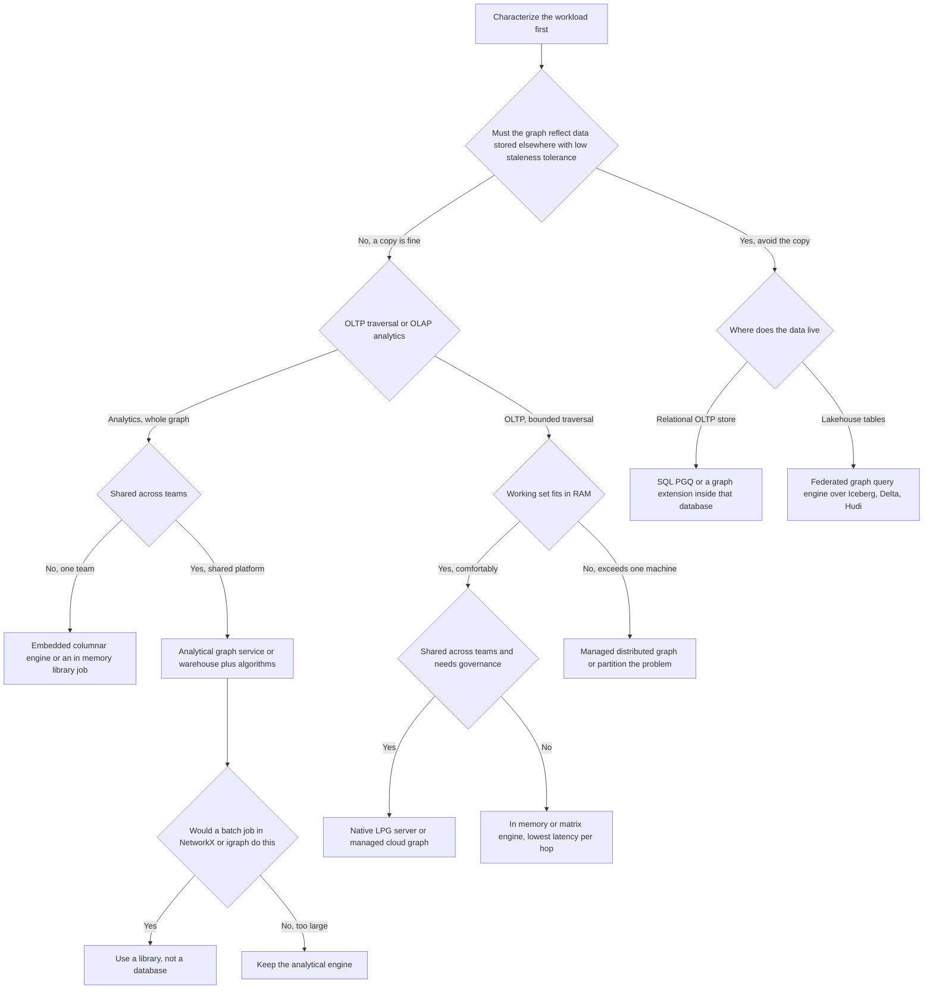
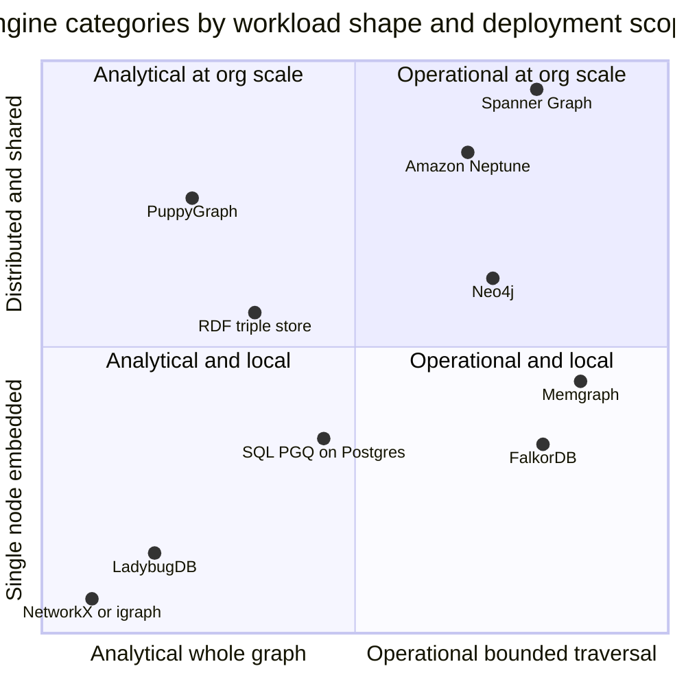
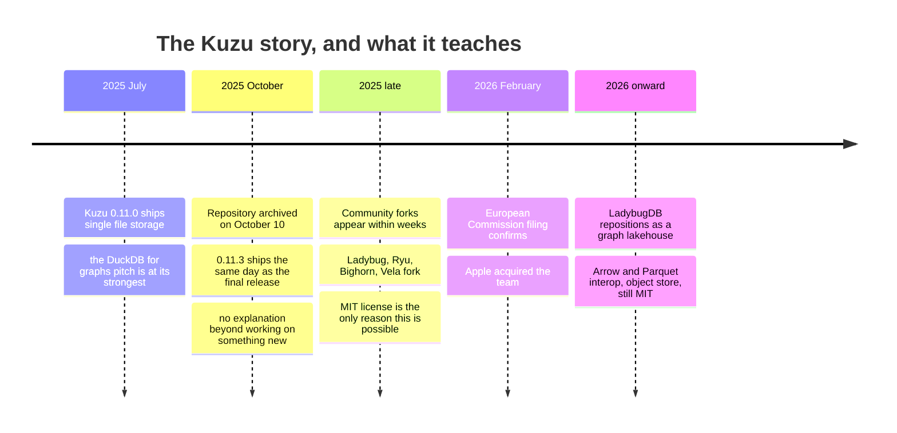
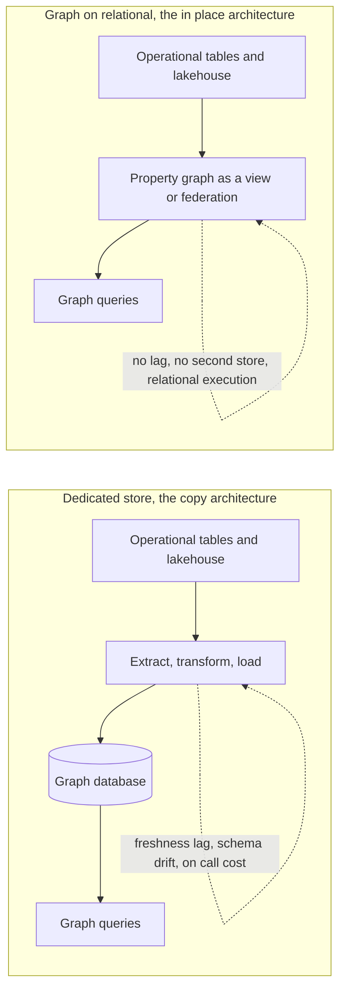

# Choosing a Graph Engine in 2026

A team I know spent eleven months building a fraud-detection platform on a graph database. They picked it in a two-hour meeting. Somebody had read the vendor's benchmark page, somebody else had done a Neo4j tutorial once, and the whiteboard had a picture of a fraud ring on it. The graph was the obvious model — accounts, devices, addresses, shared phone numbers, money moving between them — and nobody argued.

The model was right. The engine was wrong, and the reason had nothing to do with the engine being bad.

Their workload turned out to be almost entirely analytical. Every night a batch job scored the entire account population: community detection over the full graph, centrality measures, then a feature export into a training pipeline. During the day there were maybe forty interactive queries an hour, from a handful of investigators. The engine they picked was tuned within an inch of its life for the opposite profile: thousands of small, low-latency, transactional traversals per second, with strong durability on every write.

So they paid for a highly available three-node cluster to serve forty queries an hour. They paid the write-ahead log and the consensus round trip on every one of the fifty million edges the nightly ingest pushed in, when that ingest was a bulk load that could have been an atomic file swap. And their whole-graph analytics — the actual product — ran on an engine whose storage layout was built for pointer chasing from a known start node, not for scanning every edge eight times in a row. The nightly job took six hours, then nine, at which point they added machines, which made the transactional guarantees more expensive and the analytics no faster. Eighteen months in they migrated to a columnar engine and a nightly Parquet export, and the batch dropped to under forty minutes.

Nothing there is about a bad product. It is a decision made on the wrong axis. They asked "which graph database is best?" when the question that determined the answer was "is my workload transactional or analytical?" — and never asked it out loud.

This is the third and final part of Graph Engines Under the Hood. [Part 1](https://juanlara18.github.io/portfolio/#/blog/graph-engine-internals-index-free-adjacency) covered storage: index-free adjacency, adjacency lists versus sparse matrices, why the physical layout of edges makes a traversal fast or slow. [Part 2](https://juanlara18.github.io/portfolio/#/blog/gql-standard-cypher-sqlpgq) covered the query surface: GQL becoming an ISO standard, how Cypher relates to it, where SQL/PGQ fits. This part turns both into a decision, and it is deliberately not a feature matrix. Feature matrices are how you end up in a two-hour meeting with a whiteboard drawing of a fraud ring.

One disclosure, because you should know where I am standing. I work at a financial institution, primarily on GCP, and I have more production hours on Neo4j than on anything else here. Familiarity is not the same as correctness. Where I have not measured something myself, I say so.

## The four questions that actually decide it

Almost every graph engine decision I have watched go badly went badly because the team compared products before characterizing the workload. Products are easy to compare and workloads are annoying to characterize, so this happens constantly. Answer four questions first, in writing, with numbers where numbers exist, and the shortlist usually collapses to two candidates, sometimes to zero.

### Question 1: does your working set fit in RAM?

Not "does the dataset fit in RAM." The *working set* — the portion of the graph your queries actually touch in a typical hour. These differ by an order of magnitude more often than not; a two-billion-edge graph whose queries only ever touch a recent ninety-day window is not a two-billion-edge memory problem. Estimate it properly: a property graph costs roughly node identity overhead, plus edge adjacency overhead in both directions, plus the properties you store, plus indexes. Engines differ enormously in the constants, but the shape holds.

```python
def estimate_working_set_gb(
    nodes: int,
    edges: int,
    avg_node_props_bytes: int,
    avg_edge_props_bytes: int,
    bytes_per_adjacency_entry: int = 16,   # id plus offset, both directions
    node_overhead_bytes: int = 24,          # id, labels, pointer to first edge
    index_overhead_factor: float = 0.35,    # secondary indexes on lookup keys
) -> float:
    """Order-of-magnitude sizing for a property graph resident in memory.

    The constants are deliberately rough. The point is not precision, it is
    finding out whether you are in the 8 GB regime, the 200 GB regime, or the
    'this will never fit on one machine' regime -- because those three answers
    lead to three different engine categories.
    """
    node_bytes = nodes * (node_overhead_bytes + avg_node_props_bytes)
    # Adjacency is stored from both ends so traversal is symmetric.
    edge_bytes = edges * (2 * bytes_per_adjacency_entry + avg_edge_props_bytes)
    base = node_bytes + edge_bytes
    total = base * (1.0 + index_overhead_factor)
    return total / (1024 ** 3)


# A mid-size customer-and-transactions graph.
print(estimate_working_set_gb(
    nodes=40_000_000, edges=600_000_000,
    avg_node_props_bytes=120, avg_edge_props_bytes=48,
))  # ~64 GB: comfortably a single large machine, in memory
```

Run this before any benchmark. Under a few hundred gigabytes, an in-memory or single-node engine is on the table and the entire distributed-systems conversation is optional. At multiple terabytes of *hot* data you have crossed into a much smaller and much more expensive set of options, and you should know that before anyone opens a pricing page. This question comes first because it eliminates more candidates than anything else: above the RAM line you are choosing between distributed stores and disk-based engines with careful buffer management, paying for it in latency or operational complexity; below it, you get to choose on ergonomics.

### Question 2: is the workload OLTP traversal or OLAP analytics?

This is the question the fraud team never asked. The two profiles pull the engine's design in opposite directions.

**OLTP traversal** means many small queries, each starting from a known node, touching a bounded neighborhood, expected back in single-digit or low double-digit milliseconds, mixed with concurrent writes that must be durable and isolated. A recommendation lookup on a product page, a permission check, a real-time transaction screen. The engine needs index-free adjacency, a tight per-hop constant, a good buffer pool, and honest transaction machinery.

**OLAP analytics** means few queries, each touching most or all of the graph, running for seconds to hours: PageRank, community detection, whole-graph pattern counts, feature extraction. The engine needs columnar storage, vectorized execution, worst-case-optimal join algorithms, and the ability to saturate every core. Transactional durability on individual writes is mostly dead weight, because the write pattern is bulk load, not trickle.

Almost nobody is purely one or the other, but almost everybody is *mostly* one. The failure mode is assuming you are balanced when you are ninety-ten, and paying for the ten percent in the architecture of the ninety. Write down, for a representative week: query count, hops per query, nodes visited per query, write volume and shape, p99 latency requirement. If you cannot produce those numbers you do not yet know enough to choose, and the most valuable thing you can do this month is instrument a prototype rather than read another comparison page. Including this one.

### Question 3: is the graph embedded in one application, or shared across an organization?

An embedded graph lives inside a single process. No network hop, no separate deployment, no cluster, no DBA. You get it by importing a library. That whole category — the one Kuzu defined and LadybugDB now carries — exists because a very large fraction of real graph workloads are one team, one service, one dataset, and the apparatus of a database server is pure overhead for them.

A shared graph is a system of record: multiple readers, several writers, an access-control story, a schema-governance story, a backup story, an on-call rotation, a migration process. Fundamentally different artifact, fundamentally more machinery justified. The mistake happens in both directions — a three-node clustered server for what is genuinely one analyst's notebook, or a library embedded in a service whose data four other teams then want, at which point you are accidentally maintaining an undocumented data platform with no access control.

Ask concretely: how many distinct services will read this in eighteen months, who is allowed to write, and does anyone outside the owning team need it? If the honest answer is "just us," an embedded engine will save you more engineering time than any performance difference on this page.

### Question 4: does the graph need to be co-located with data you already have?

This is the newest of the four, and in 2026 it changes more decisions than it used to.

A dedicated graph store means a copy. Your entities live in a warehouse, a lakehouse, or an operational relational database, and you build a pipeline that extracts them, turns them into nodes and edges, and loads them into a second system. That pipeline is now permanent, with a freshness lag, a failure mode, a schema-drift problem, and an on-call cost. It is also the single most common origin of "the graph and the warehouse disagree" incidents, which are corrosive because they teach the organization not to trust the graph.

The alternative is to query the graph where the data already sits: SQL/PGQ inside your relational database, or a federated engine reading lakehouse tables directly. Both remove the copy, and removing the copy removes a whole category of incident.

So: what staleness can you tolerate, and what does the pipeline actually cost? If the graph must reflect the transaction that committed four milliseconds ago, it belongs in the transactional store. If yesterday is fine, you have far more options than you think, and one of them is not having a graph database.

Here is the whole thing as a decision tree — deliberately opinionated, and a starting shortlist rather than a verdict.



Now the survey. For each category I have tried to state what it is genuinely good at, what it is genuinely bad at, and what changed recently enough that older comparisons are stale.

## Native LPG servers

This is the category most people mean when they say "graph database," and Neo4j is its reference implementation. Understand it whatever else you conclude, because it is the baseline everything else gets measured against.

What "native" buys you is what Part 1 was about: index-free adjacency. A node stores direct references to its adjacent edges, so following a relationship is a pointer dereference rather than an index lookup, and traversal cost is proportional to the subgraph you touch rather than to the size of the database. On deep, selective, from-a-known-start traversals a native engine beats an index-based join plan, and the gap widens with depth.

**Neo4j** in 2026 is mature and on a calendar release cadence — versions look like `2026.04`, with Graph Data Science shipping in lockstep. Two recent changes weaken old objections. `GRAPH TYPE` reached general availability, so you can define and enforce a graph schema at the database level rather than relying on application discipline and hope; "property graphs are schemaless and therefore ungovernable" is a substantially weaker complaint than it was. And `CALL { ... } IN CONCURRENT TRANSACTIONS` gained a `DISJOINT BY` clause for deadlock avoidance in parallel writes, addressing a genuine pain in bulk ingestion.

Genuinely good at: deep OLTP traversal, the most mature graph algorithms library in the category by a wide margin, by far the largest pool of engineers who have used it, excellent tooling, and a Cypher dialect that is the ancestor of ISO GQL. If you need to hire someone who already knows the query language, this is the only entry on this page where that is easy.

Genuinely bad at: whole-graph analytical scans, where the row-oriented pointer-chasing layout fights the access pattern. It is also the category leader in licensing friction. Community Edition is GPLv3 and single-instance — no clustering, no hot backups, no multi-database, no role-based access control. Everything that makes a graph a shared system of record sits in the commercial Enterprise Edition, and self-managed Enterprise pricing is not published. Third-party procurement marketplaces suggest annual list figures in the low tens of thousands for modest deployments and well into six figures for large clustered ones; treat those as directional, not quotable, and start your own quote early, because the licensing conversation routinely takes longer than the technical evaluation. TigerGraph and ArcadeDB sit in this category too, with the same shape of tradeoff.

## In-memory and matrix-based engines

Two engines sit just next to the native LPG category, and both get there by making a strong architectural commitment that pays off when your workload matches it.

**Memgraph** is in-memory first. The graph lives in RAM; durability comes from a write-ahead log plus periodic snapshots, not a disk-resident page structure. An `ON_DISK_TRANSACTIONAL` mode exists for datasets exceeding RAM, so the honest framing is not "it cannot use disk" but "it is designed around the assumption that it will not need to." When the working set genuinely fits, that assumption eliminates the buffer pool and page faults on the hot path, producing very low and very predictable per-hop latency. It is C++, speaks Cypher, and aims at streaming and real-time workloads: continuous ingestion of transactions, telemetry, or clickstream, queried while the graph is mutated constantly.

Memgraph publishes benchmarks against Neo4j showing multiple-x to order-of-magnitude latency advantages on traversal queries. I have not reproduced those, and no vendor's benchmark of a competitor is decision-grade. What I will say is that the *architectural* claim is coherent: an engine that never has to check whether a page is resident should have a tighter latency distribution on a working set that fits. Whether that matters depends on whether you are latency-bound, and most teams are less latency-bound than they believe.

**FalkorDB** takes a genuinely unusual route. Instead of adjacency lists of pointers, it represents the graph as **sparse adjacency matrices** and executes traversals as **linear algebra**, via GraphBLAS — the standardized set of graph operations expressed as sparse matrix algebra. A one-hop expansion from a set of start nodes is a sparse matrix-vector product; two hops is a matrix-matrix product. Not a marketing metaphor, the actual execution model, descended from RedisGraph, which pioneered the approach.

The consequences are specific. Matrix products parallelize across cores naturally, so the engine uses hardware well on multi-hop expansion. Many graphs live in one instance cheaply, making per-tenant isolation practical — one graph per customer, thousands of them, rather than one giant graph with a tenant property on every node. And because a graph is a compact matrix structure rather than a heap of interlinked objects, instantiating one is cheap, which matters for serverless or per-request shapes. FalkorDB is licensed under SSPLv1, which is not OSI-approved; read it carefully if you plan to offer the database itself as a service, and ask your legal team rather than me.

The weakness mirrors the strength. Linear algebra is beautiful for set-at-a-time expansion over a wide frontier; it is less obviously advantageous for a single deep path walk from one node, where there is nothing to amortize. And GraphBLAS is a smaller world than adjacency lists, so debugging a pathological plan is a lonelier activity.



Read the picture as a map of where the design centers sit, not as a scoreboard. Nothing here is bad at the thing it is far from; it is *unoptimized* for it, which is a different and more forgivable statement.

## Embedded and analytical: the Kuzu cautionary tale

The embedded analytical graph engine is the most interesting category on this page, and in 2026 it comes with a story every engineering leader evaluating open source infrastructure should read.

**Kuzu** was, by most accounts, the best-designed thing in this space. It grew out of database research at the University of Waterloo and made a set of unusual, correct choices: columnar rather than row-oriented storage, vectorized execution, worst-case-optimal join algorithms for cyclic patterns, Cypher as the query surface, vector and full-text indexes built in. It was embedded — `pip install kuzu` and you had a graph database inside your Python process, no server, no cluster, no port. The pitch was "DuckDB for graphs," and it was accurate. In July 2025, version 0.11.0 moved it to single-file storage, making it feel even more like DuckDB: a graph database that is a file you can copy.

On **October 10, 2025**, the GitHub repository was archived. Version 0.11.3 shipped the same day as the final release. The repository carried a short note saying the team was working on something new, and that was it.

The reason surfaced later: Apple acquired the company behind Kuzu in what was effectively an acqui-hire, confirmed publicly through a European Commission filing roughly four months after the archival, in early 2026. The community spent a third of a year knowing only that infrastructure it had adopted had gone silent.

The code was MIT licensed, which is the only reason this story has a second half. Within weeks forks appeared: **LadybugDB** (`LadybugDB/ladybug`), **Ryu** (`predictable-labs/ryugraph`), **Bighorn** (`Kineviz/bighorn`, tied to the GraphXR visualization platform), and a fork maintained by Vela Partners aimed at agent memory. Adjacent projects positioned themselves as spiritual successors too, including Lance Graph inside LanceDB.

**LadybugDB** is the one most people now mean by "the successor." It is maintained by a team operating as Ladybug Memory, it is MIT licensed and says it intends to stay that way, and it has shifted the mission in a way more interesting than a straight continuation. Kuzu was a standalone embedded database; LadybugDB positions as a **graph lakehouse** — columnar storage with vectorized execution, Cypher, and interoperability with Arrow, Parquet, and object stores, so the graph participates in your lakehouse rather than being a separate island. That is exactly the direction Question 4 pushes you, and it makes the category more relevant, not less.



The lesson is not "avoid startups" and it is certainly not "avoid open source." The lesson is more specific and more useful:

**The license is your insurance policy, and you should price it as one.** Kuzu was MIT. That single fact is why four viable forks existed within a month. Under a license restricting forking, or a contributor agreement centralizing copyright in a way that complicated continuation, the archival would have been terminal for every downstream user.

**Governance concentration is measurable before you adopt.** Count the contributors with commit rights, then count their employers. If the answer is "twelve people, all the same email domain," you are not adopting a community project, you are adopting a vendor's product that happens to have public source. That may still be right — single-vendor projects are frequently better engineered than committee projects — but make the call knowingly and keep a migration plan.

**Embedded dependencies cannot be quietly patched by someone else.** An acquired managed service usually keeps running under new ownership for a while. An archived library stops receiving security fixes that day, and it is linked into your process. The blast radius of abandonment is different for embedded engines, which argues for the most permissive licenses and the most credible fork ecosystems.

Genuinely good at: analytical graph work by one team with no operational footprint at all. Feature extraction for a model, ad-hoc investigation over a large-but-single-machine graph, agent memory that lives beside the agent, pipeline steps needing graph pattern matching over lakehouse data without standing up a server. In all of these the absence of a server is the feature, not a limitation.

Genuinely bad at: being a shared system of record. No access control model worth the name, no multi-writer concurrency across processes, no backup infrastructure beyond copying a file. The moment a second team needs to write, you are in the wrong category.

## Managed cloud graph services

If the graph is a shared organizational asset and you would rather not run a distributed database yourself, the two obvious candidates are Google's and Amazon's.

**Cloud Spanner Graph** reached general availability at the start of 2025, and I have written about it at length in [Understanding Cloud Spanner: Graphs, Knowledge, and Where Ontologies Fit](https://juanlara18.github.io/portfolio/#/blog/spanner-graph-for-knowledge-and-agents). The short version: it is not a separate graph store, it is a **property graph declared as a view over Spanner tables**. You write `CREATE PROPERTY GRAPH`, map node tables and edge tables, and from then on the same rows answer both SQL and GQL queries. The graph inherits Spanner's externally consistent transactions, horizontal scaling, and multi-region replication for free, and there is no ETL between "the operational data" and "the graph" because they are the same bytes.

The tradeoff is worth restating: a multi-hop traversal is mechanically a chain of key lookups across splits, and if connected nodes live on different splits in different regions, per-hop latency accumulates in a way a single-machine engine avoids. Spanner Graph is built for bounded operational traversal at scale, not deep analytical wandering. Its cost floor is high, because you are renting always-on replicated capacity. It is an excellent answer to "we already run Spanner and want graph queries over that data," and an expensive answer to "we want a graph database."

**Amazon Neptune** is older and broader, and its distinguishing feature is speaking all three major graph query languages: openCypher, Gremlin, and SPARQL for RDF. That trilingualism is genuinely rare and matters if you have assets in more than one of those worlds. Neptune Serverless scales in Neptune Capacity Units, each roughly a couple of gigabytes of memory with associated compute, within a configured range, so you are not provisioning for peak all day. Alongside it, Neptune Analytics is a separate in-memory analytics engine — AWS acknowledging the OLTP/OLAP split explicitly rather than pretending one engine covers both.

I have less production time on Neptune than on the others, so take this as informed reading rather than scar tissue: the recurring theme in practitioner accounts is that operational simplicity is real, query performance is adequate rather than exceptional, and the cost model rewards careful attention to I/O request volume, which is easy to underestimate when your access pattern is traversal-heavy. Check the current pricing page rather than any figure in a blog post, including ones I could have put here.

Either way, what you are buying with managed cloud graph is the elimination of operational burden — a large and underrated purchase — and paying for it in unit cost and a narrower performance envelope than a specialized engine tuned to your workload. For most organizations that is a good trade. For an organization whose product *is* the graph, it usually is not.

## Graph-on-relational: querying graphs where your data already lives

This is where 2026 differs most sharply from 2023, and if you read one section carefully, make it this one.

Most graphs are not born as graphs. They are inferred from relational data that already exists: a `customers` table, an `accounts` table, and a `transfers` table already contain a graph. Turning them into one has historically meant copying them into a second system. The graph-on-relational approach says don't copy, query them as a graph in place.

**SQL/PGQ is landing in PostgreSQL 19.** Peter Eisentraut committed the implementation, developed with Ashutosh Bapat, on March 16, 2026; PostgreSQL 19 reached Beta 2 in July 2026 and is on track for general availability in the autumn. It implements the ISO/IEC 9075-16 standard: `CREATE PROPERTY GRAPH` to declare a graph over existing tables, `GRAPH_TABLE(...)` with `MATCH` and `COLUMNS` to run pattern matches inside an ordinary SQL query, plus catalogs, a `\dG` psql command, and dump/restore support.

The detail that tells you the most about its performance profile: property graphs behave like views, and the graph pattern is **rewritten into a relational query during the rewriter phase**. No new storage layout, no index-free adjacency, no graph-specific operators. A two-hop pattern becomes a two-way join. That is both the strength and the limitation.

```sql
-- Declare a graph over tables that already exist. No copy, no pipeline.
CREATE PROPERTY GRAPH bank_graph
  VERTEX TABLES (
    customers KEY (customer_id) LABEL customer,
    accounts  KEY (account_id)  LABEL account
  )
  EDGE TABLES (
    owns KEY (customer_id, account_id)
      SOURCE KEY (customer_id) REFERENCES customers (customer_id)
      DESTINATION KEY (account_id) REFERENCES accounts (account_id)
      LABEL owns
  );

-- Pattern match inside an ordinary SQL query, joinable to anything else.
SELECT g.account_id, r.risk_score
FROM GRAPH_TABLE (bank_graph
       MATCH (c IS customer WHERE c.segment = 'corporate')
             -[IS owns]-> (a IS account)
       COLUMNS (a.account_id AS account_id)) AS g
JOIN risk_scores r USING (account_id)
WHERE r.risk_score > 0.8;
```

Be clear-eyed. The initial implementation does not support **variable-length paths**, the single feature that most distinguishes graph query languages from SQL joins. A commenter on the announcement put it bluntly: pattern matching is not very interesting until paths can vary in length. And with no graph-specific optimizations, a deep traversal will not beat a well-written recursive CTE, let alone a native engine.

Why it matters anyway: it standardizes the *interface* inside the database everybody already runs. Fixed-length patterns cover an enormous amount of real work — "customers who share a device with a flagged customer," "accounts two hops from this counterparty" — and expressing those as patterns rather than five-way self-joins is a real readability win. Variable-length support will come; the hard part, getting the grammar and catalog machinery into core, just happened.

Two adjacent options round out the category. **Apache AGE** is a Postgres extension adding openCypher-style querying with read and write support, variable-length traversal, and graph algorithms — more capable than the initial SQL/PGQ implementation today, at the cost of being an extension your managed Postgres may refuse to install. **PuppyGraph** is a federated engine connecting directly to lakehouse tables (Iceberg, Delta Lake, Hudi) and relational sources including PostgreSQL, MySQL, and DuckDB, presenting them as one graph without moving anything. Its published multi-hop numbers are vendor benchmarks, so treat them as claims to reproduce, but the architecture targets Question 4 directly.



## RDF and triple stores: when standards matter more than convenience

There is a parallel universe here that property-graph people tend to wave at dismissively, which is a mistake. RDF triple stores answer a different question, and if it is your question, nothing in the property-graph world substitutes. Reach for RDF when you need one of three things.

**Formal reasoning.** An OWL ontology is a set of axioms with model-theoretic meaning, and a description-logic reasoner *derives* facts you never asserted. Declare that every account held by a sanctioned entity is restricted, assert that one entity is sanctioned, and restriction propagates across the graph without you writing a traversal. Declare two classes disjoint and the reasoner finds the instance that violates it. No property graph engine on this page does this; they store what you put in and return what you traverse.

**Global identity and interoperability.** RDF identifies things with IRIs, globally unique by construction. If your data must join with someone else's — a regulator's taxonomy, an industry vocabulary, a public dataset — the join is structural rather than a fuzzy string match. Property graph keys are local to the database and mean nothing outside it.

**Constraint validation as a first-class artifact.** SHACL lets you express shape constraints as data, version them, and validate independently of the application. In a regulated environment that governance model is sometimes the requirement rather than a preference.

The costs are real: SPARQL is less pleasant than Cypher or GQL for path-heavy work, tooling and operational maturity are generally thinner, and few triple stores have a horizontal scaling story comparable to the alternatives.

My practical position, argued more fully in the Spanner post: these are usually not competitors. Keep the schema layer — the TBox, the axioms, the shapes — in a governed ontology artifact where the semantics are first class, and keep the instance data in whatever property graph engine your four answers pointed at. Compile the first into the schema and validators of the second. Two stores with a disciplined seam beats one store doing both jobs badly.

## When you do not need a graph database at all

This section will save more of you time and money than the rest of the post combined. An enormous fraction of workloads described as "we need a graph database" are satisfied by one of two things you already have.

**Option one: a recursive CTE in the database you already run.** PostgreSQL has had `WITH RECURSIVE` since version 8.4. It walks edges iteratively, and with a properly indexed edge table it handles ancestry, reachability, hierarchy, and bounded transitive closure at scales that surprise people.

```sql
-- Bounded reachability from a starting account, with cycle protection.
WITH RECURSIVE reachable AS (
    SELECT t.dst_account AS account_id,
           1 AS depth,
           ARRAY[t.src_account, t.dst_account] AS path
    FROM transfers t
    WHERE t.src_account = %(start)s

    UNION ALL

    SELECT t.dst_account,
           r.depth + 1,
           r.path || t.dst_account
    FROM reachable r
    JOIN transfers t ON t.src_account = r.account_id
    WHERE r.depth < %(max_depth)s
      AND NOT t.dst_account = ANY(r.path)   -- do not revisit, kills cycles
)
SELECT account_id, MIN(depth) AS shortest_hops
FROM reachable
GROUP BY account_id
ORDER BY shortest_hops;
```

Two things make this work: an index on `transfers(src_account)` so each expansion step is an index scan rather than a table scan, and the cycle guard, without which a real financial graph runs forever. The honest limitation is that cost grows with branching factor raised to the depth, so this is a good tool to depth four or five with modest fan-out and a bad tool at depth twelve on a graph with hubs. But "depth four or five with modest fan-out" describes a majority of the queries teams buy graph databases for.

**Option two: pull the subgraph into memory and use a library.** If your graph fits in RAM — and per Question 1, more do than people assume — NetworkX, igraph, or graph-tool will run every classical algorithm on it with no database at all. This is the right answer for analytical work far more often than it is chosen.

```python
import igraph as ig
import psycopg


def load_graph(dsn: str, since: str) -> ig.Graph:
    """Materialize a bounded slice of the edge table as an in-memory graph.

    Note the WHERE clause. This works not because the whole graph fits in
    RAM, but because the *relevant slice* does. Pushing the filter into SQL
    is what makes the difference.
    """
    with psycopg.connect(dsn) as conn, conn.cursor() as cur:
        cur.execute(
            "SELECT src_account, dst_account, amount "
            "FROM transfers WHERE booked_at >= %s",
            (since,),
        )
        edges = cur.fetchall()

    vertices = sorted({v for src, dst, _ in edges for v in (src, dst)})
    index = {v: i for i, v in enumerate(vertices)}

    g = ig.Graph(
        n=len(vertices),
        edges=[(index[s], index[d]) for s, d, _ in edges],
        directed=True,
    )
    g.vs["account_id"] = vertices
    g.es["amount"] = [amt for _, _, amt in edges]
    return g


g = load_graph(DSN, since="2026-05-01")

# Whole-graph analytics that a transactional engine would struggle with.
communities = g.community_infomap(edge_weights=g.es["amount"])
centrality = g.pagerank(weights=g.es["amount"])

top = sorted(zip(g.vs["account_id"], centrality), key=lambda kv: -kv[1])[:20]
```

Ninety seconds to load, seconds to score, zero infrastructure, zero license, zero on-call. If your requirement is "recompute community structure and centrality nightly and write the features to a table," this *is* the architecture, not a prototype of it.

The steelman for actually buying a graph database is narrow: you need low-latency traversal against a continuously mutated graph, or it is too large to slice into memory, or multiple teams need governed concurrent access to it as a system of record, or your query patterns are genuinely variable-depth and exploratory in a way a fixed recursive CTE cannot express. If none of those holds, you are buying operational burden and calling it capability.

Stonebraker and Pavlo's 2024 retrospective is worth sitting with here. Surveying twenty years of data models meant to displace relational, they conclude the relational model keeps absorbing the good ideas and outlasting the challengers. SQL/PGQ landing in PostgreSQL is that thesis playing out live: the graph *query interface* is being absorbed into the relational engine. Whether the specialized graph *storage engine* survives that absorption turns on whether index-free adjacency is a durable advantage or an implementation detail relational engines eventually learn.

## The cost nobody budgets for

Licensing is the cost that appears in the spreadsheet. It is rarely the largest one.

**Operational burden.** A shared graph database is a stateful distributed system, so somebody is on call for it. Somebody handles the upgrade that changes planner behavior. Somebody investigates why p99 tripled after an index rebuild. If your stack already has a relational database, a warehouse, a message bus, and a vector store, you are adding a sixth thing that can wake someone up. That is a real annual cost on no pricing page.

**Backup, restore, and the drill nobody runs.** Ask how long a full restore of your dataset takes and whether the restored database must rebuild indexes before serving traffic. Then actually do it, with production-sized data, on a stopwatch. This exercise changes the decision surprisingly often, because graph restore times are frequently much worse than relational ones and almost nobody measures them before committing.

**People, the expensive one.** The pool of engineers who can write correct Cypher is decent. The pool who can read an execution plan, see why the planner chose a label scan over an index seek, and restructure accordingly is very small. The pool who can do that for Memgraph, reason about a GraphBLAS plan, or debug a Spanner Graph traversal crossing splits is smaller still. Budget for that expertise living in one or two people, and for what happens when one leaves.

**Migration cost if you are wrong.** This is what the fraud team paid. No standard export format preserves a property graph faithfully across engines — GQL standardizes the query language, not the wire format or the physical model. Moving means rewriting queries (dialects differ even among Cypher-ish languages), re-tuning indexes, re-validating results, and running both systems in parallel until you trust the new one. Assume a quarter of engineering time, and let that raise the bar on the initial choice.

**The pipeline, if you took the copy architecture.** ETL is a permanent line item: development, monitoring, backfills, schema-drift handling, and the reconciliation job proving the two stores agree. This is the cost Question 4 exists to surface, and it is routinely underestimated by a factor of two.

Here is the whole survey as one table. The last column is the one to read first.

| Category | Representative engines | Data and execution model | Genuinely good at | Genuinely bad at | Choose it when |
|---|---|---|---|---|---|
| Native LPG server | Neo4j | Index-free adjacency, row oriented, Cypher and GQL | Deep OLTP traversal, mature algorithms, largest talent pool, schema enforcement via GRAPH TYPE | Whole graph analytical scans, licensing friction, cost at cluster scale | Shared operational graph, traversal-heavy, you need hireable skills |
| In-memory server | Memgraph | Graph resident in RAM, WAL and snapshots, C++, Cypher | Lowest and tightest latency when the working set fits, streaming ingestion | Working sets far above RAM, smaller ecosystem than Neo4j | Real-time traversal on a graph that fits in memory and changes constantly |
| Matrix and linear algebra | FalkorDB | Sparse adjacency matrices, GraphBLAS, openCypher | Parallel multi-hop expansion, cheap per-tenant graph isolation, fast instantiation | Single deep path walks, SSPL license review, small expert pool | Many isolated graphs, multi-tenant or serverless shapes, wide frontier expansion |
| Embedded analytical | LadybugDB and Kuzu forks | Columnar, vectorized, worst case optimal joins, Cypher, in process | Analytical graph work with zero ops, lakehouse interop, agent memory, feature extraction | Shared writes, access control, being a system of record | One team, analytical, wants a library not a server |
| Managed cloud | Spanner Graph, Amazon Neptune | Graph over managed distributed storage, GQL or openCypher plus Gremlin and SPARQL | Operational simplicity, scale and replication, no cluster to run | Cost floor, narrower performance envelope, deep analytical traversal | The graph is a shared asset and you would rather buy operations than build them |
| Graph on relational | PostgreSQL 19 SQL PGQ, Apache AGE, PuppyGraph | Property graph as a view or federation, rewritten to relational execution | No copy, no ETL, no second system, standard SQL interop | No graph specific execution, limited or no variable length paths in core PGQ | The data already lives somewhere and the copy is the expensive part |
| RDF triple store | Various W3C stack engines | Triples, IRIs, SPARQL, OWL and SHACL | Formal reasoning, global identity, standards-based validation | Path-heavy querying ergonomics, horizontal scale, tooling depth | You need entailment, interoperability, or SHACL as a governance artifact |
| No database | NetworkX, igraph, recursive CTE | In-memory library or SQL iteration | Zero infrastructure, full algorithm coverage, fastest path to an answer | Continuous low-latency serving, graphs too large to slice, concurrent multi-writer | Batch analytics, bounded-depth traversal, or you have not yet proven you need more |

## Putting it together

Five things to take away.

Characterize the workload before comparing products. The four questions — RAM, OLTP versus OLAP, embedded versus shared, co-located versus copied — eliminate more candidates than any benchmark, and they cost a week rather than a quarter.

The most consequential architectural choice in 2026 is not which graph database, it is whether you copy the data. SQL/PGQ arriving in PostgreSQL 19 and federated engines maturing make the in-place option real in a way it was not two years ago, initial limitations and all.

Licenses are insurance, and Kuzu is the proof. Before adopting any single-vendor open source infrastructure, count the contributors, count their employers, read the license, and write down what you would do if the repository went quiet tomorrow.

The cost that kills you is operational, not licensing: on-call, restore drills, the scarcity of people who can tune the thing, and the migration if you are wrong. Price those explicitly.

And be genuinely willing to conclude that you do not need a graph database. A recursive CTE and an igraph job are not the prototype; for a large fraction of workloads they are the answer, and the fastest way to find out is to build that version first and see what actually breaks.

The engine is the last decision, not the first. Make the first four properly and the last one mostly makes itself.

## Going Deeper

**Books:**

- Robinson, I., Webber, J., & Eifrem, E. (2015). *Graph Databases: New Opportunities for Connected Data* (2nd ed.). O'Reilly.
  - The canonical introduction to the property graph model and index-free adjacency. Written by Neo4j people, so read it for the model rather than the vendor comparisons.
- Needham, M., & Hodler, A. E. (2019). *Graph Algorithms: Practical Examples in Apache Spark and Neo4j.* O'Reilly.
  - Read this while answering Question 2. The algorithm catalog makes the operational-versus-analytical boundary concrete in a way prose cannot.
- Kleppmann, M. (2017). *Designing Data-Intensive Applications.* O'Reilly.
  - Chapter 2 has one of the best short treatments of graph data models beside relational and document ones; the replication and consensus chapters ground the managed cloud section.
- Petrov, A. (2019). *Database Internals: A Deep Dive into How Distributed Data Systems Work.* O'Reilly.
  - Storage engines, buffer management, distributed transactions. What lets you reason about *why* an engine has the envelope it has rather than memorizing benchmark results.
- Bonifati, A., Fletcher, G., Voigt, H., & Yakovets, N. (2018). *Querying Graphs.* Morgan and Claypool.
  - The academic treatment of graph query languages and their evaluation, and where Part 2's vocabulary comes from.

**Online Resources:**

- [LDBC Social Network Benchmark](https://ldbcouncil.org/benchmarks/snb/) — The only vendor-neutral audited benchmark suite here. Its Interactive and Business Intelligence workloads map almost exactly onto the OLTP/OLAP split in Question 2. The audited result list is short and ages quickly, so check dates.
- [Waiting for PostgreSQL 19 - SQL Property Graph Queries](https://www.depesz.com/2026/07/31/waiting-for-postgresql-19-sql-property-graph-queries-sql-pgq/) — Depesz on the committed SQL/PGQ feature, with worked syntax and a comment thread that surfaces the real limitations honestly.
- [From Kuzu to Ladybug](https://thedataquarry.com/blog/from-kuzu-to-ladybug/) and [Kuzu forks](https://szarnyasg.org/posts/kuzu-forks/) — What LadybugDB is becoming, and Gabor Szarnyas cataloguing the full fork landscape. Read both if you are evaluating anything embedded.
- [KuzuDB graph database abandoned, community mulls options](https://www.theregister.com/software/2025/10/14/kuzudb-graph-database-abandoned-community-mulls-options/) — Reporting from the week of the archival, and a useful artifact of what adoption risk feels like from the inside.
- [Spanner Graph overview](https://cloud.google.com/spanner/docs/graph/overview) — The reference for the declare-a-graph-over-tables model that SQL/PGQ generalizes.

**Videos:**

- [What Goes Around Comes Around... And Around...](https://www.youtube.com/watch?v=8Woy5I511L8) by Andy Pavlo — The talk accompanying the SIGMOD Record retrospective. The argument that the relational model keeps absorbing its challengers is the strongest steelman for the "you may not need a graph database" section.
- [Towards GQL 1](https://www.youtube.com/watch?v=z0pN5NwKsgc) by Stefan Plantikow at the LDBC Technical User Community meeting — From the ISO project editor, on what GQL was designed to be, and why query language portability is harder than vendors imply.
- [Property Graph Standards, Process and Timing](https://www.youtube.com/watch?v=ZgFCuzods4g) by Keith Hare, also at LDBC TUC — The standards-process view of how GQL and SQL/PGQ became siblings, which explains why the Postgres implementation looks the way it does.

**Academic Papers:**

- Stonebraker, M., & Pavlo, A. (2024). ["What Goes Around Comes Around... And Around..."](https://dl.acm.org/doi/10.1145/3685980.3685984) *ACM SIGMOD Record*, 53(2), 21-37.
  - Twenty years of data models that were supposed to displace relational, and why they did not. The graph section is short, unsentimental, and worth reading before any procurement meeting.
- Deutsch, A., Francis, N., Green, A., Hare, K., Li, B., Libkin, L., et al. (2022). ["Graph Pattern Matching in GQL and SQL/PGQ."](https://arxiv.org/abs/2112.06217) *Proceedings of SIGMOD 2022.*
  - The definitive treatment of the pattern-matching core shared by both standards, by the people who designed them. The paper behind Part 2 and behind the Postgres implementation.
- Angles, R., Antal, J. B., Averbuch, A., Birler, A., Boncz, P., Búr, M., et al. (2023). ["The Linked Data Benchmark Council (LDBC): Driving competition and collaboration in the graph data management space."](https://arxiv.org/abs/2307.04350) arXiv preprint.
  - How the benchmarks you will be shown are constructed and audited. Read it before believing any performance chart, including honestly produced ones.
- Szárnyas, G., Waudby, J., Steer, B. A., Szakállas, D., Birler, A., Wu, M., et al. (2022). ["The LDBC Social Network Benchmark: Business Intelligence Workload."](https://www.vldb.org/pvldb/vol16/p877-szarnyas.pdf) *PVLDB*, 16(4), 877-890.
  - The analytical half of the suite. If your Question 2 answer was "OLAP," this describes the query shapes you should be testing with.

**Questions to Explore:**

- SQL/PGQ pushes graph pattern matching into the relational engine as rewritten joins, with no graph-specific storage or operators. If relational engines eventually learn the storage tricks too — adjacency-aware layouts, worst-case-optimal join operators — does the specialized graph storage engine have a durable reason to exist, or does it become a feature of Postgres the way JSON did?
- The Kuzu archival was survivable because of an MIT license and a healthy fork ecosystem. What would an honest, quantitative "abandonment risk score" for a dependency look like, and would any organization actually let it block adoption the way a security finding does?
- Question 4 treats the copy as the expensive thing. But a copy is also an isolation boundary: the graph workload cannot degrade the operational database. At what query volume does that isolation benefit outweigh the pipeline cost?
- Every engine here optimizes for a point on the OLTP-to-OLAP spectrum, and every real organization has workloads at both ends. Is the right architecture two engines with a sync seam, or is one engine mediocre at both actually cheaper once you price the seam honestly?
- Property graphs cannot reason and triple stores rarely scale. Both have been true for fifteen years. Is that a fundamental tension between open-world semantics and the closed-world assumptions that make partitioning tractable, or an accident of which communities had funding?
