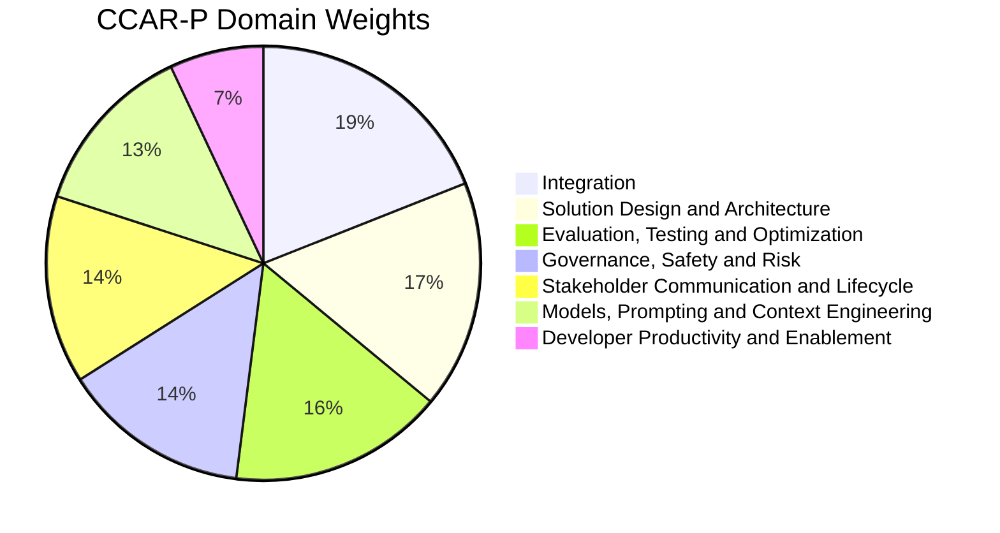
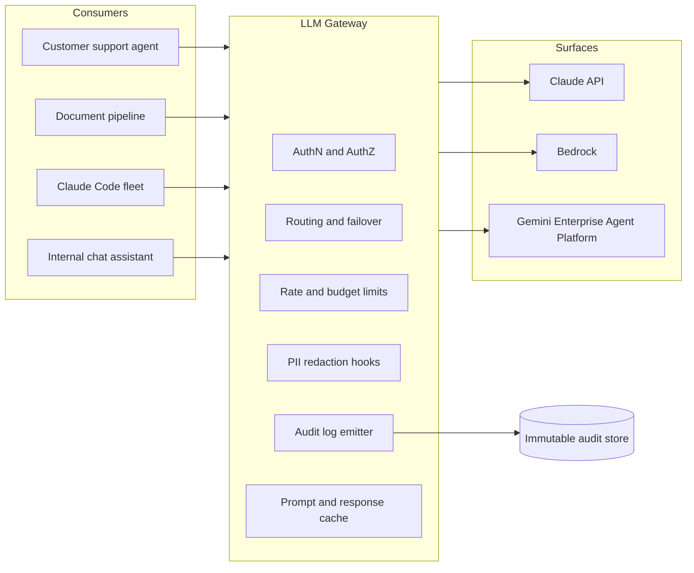
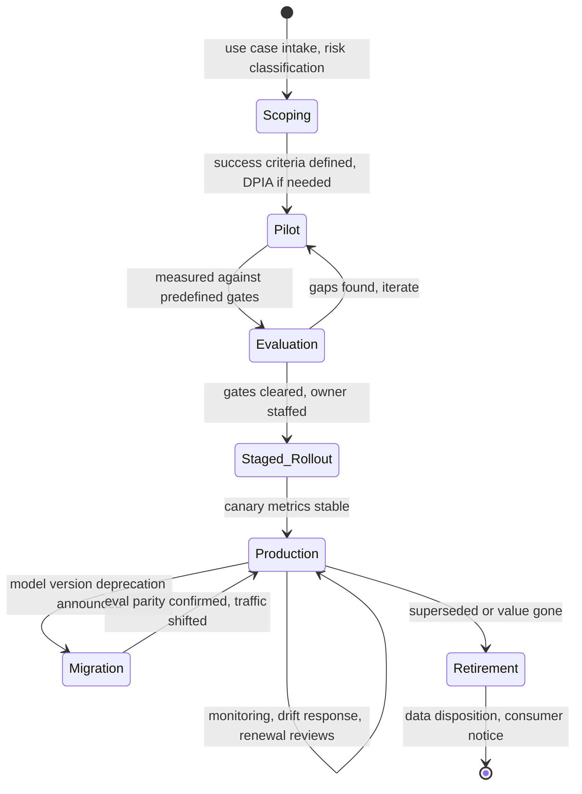
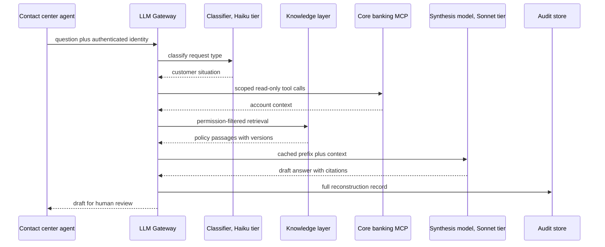

# The Claude Certified Architect Professional Exam (CCAR-P): A Complete Study Guide

Here is the thing nobody tells you about the Claude Certified Architect Professional exam: it is barely about Claude.

The Associate exam tests whether you can use the product well. The Developer exam tests whether you can build with the API. The Architect Professional exam tests whether you can stand in front of a CISO, a head of legal, and a CFO, defend a portfolio of LLM systems, and still be right about it eighteen months later when the model you launched on has been deprecated, the eval suite has caught two regressions, and the auditors want to know why an agent touched a customer record. The exam happens to use Claude as its substrate, but the competency it measures is enterprise systems architecture under uncertainty. That is why it is the hardest credential in the track, and why passing it means something.

This is the third and final post in my series on Anthropic's certification program, launched July 13, 2026. The first covered the [Associate exam](https://juanlara18.github.io/portfolio/#/blog/claude-certified-associate-exam-guide), the entry point for technical-adjacent roles. The second covered the [Developer exam](https://juanlara18.github.io/portfolio/#/blog/claude-certified-developer-exam-guide), the hands-on builder credential. This one covers the summit. My goal is the same as in the first two posts: if you genuinely understand everything in this guide, not memorize it, understand it, you should be able to pass. But this time the material is different in kind. There are fewer facts to memorize and more judgment to internalize. I work as a knowledge data engineer at a large bank, designing exactly the systems this exam describes: governed agents over regulated data, eval pipelines that survive audits, model migrations that cannot break production. I will lean on that experience throughout, because the exam is written by people who have clearly lived the same problems.

## The Architect Track: Foundations vs. Professional

Anthropic's certification program has four credentials across three roles. The Architect role is the only one with two levels, and the distinction matters for deciding where to start.

**Claude Certified Architect, Foundations (CCAR-F)** is the original certification, launched in March 2026 as the "Claude Certified Architect" before the program expanded and the code was retrofitted. It is a $125, 60-question, scenario-based exam covering five domains: agentic architecture and orchestration (27%), Claude Code configuration (20%), prompt engineering and structured output (20%), tool design and MCP integration (18%), and context management (15%). It tests whether you can architect *one* production Claude system correctly: pick the right orchestration pattern, design tool schemas that fail gracefully, isolate context between subagents, enforce financial and safety constraints with programmatic gates rather than prompt instructions.

**Claude Certified Architect, Professional (CCAR-P)** assumes all of that as table stakes and pivots to a different question: can you architect a *portfolio* of systems and operate them across their full lifecycle inside a real organization? The new material is enterprise integration across cloud surfaces, evaluation programs rather than eval scripts, governance frameworks that survive regulators, stakeholder communication, model version migrations, and scaling developer enablement across hundreds of engineers.

Who should skip straight to Professional? Anthropic's stated prerequisites are 3+ years of systems architecture or platform engineering experience plus 6+ months of production Claude experience, and unlike some vendors, these are honest signals rather than gatekeeping. There is no requirement to hold Foundations first. My advice:

| Your profile | Recommended path |
|---|---|
| Senior architect, has shipped at least one production Claude system end to end | Straight to Professional |
| Strong platform engineer, Claude experience mostly experimental | Foundations first, Professional 3 to 6 months later |
| Staff engineer at a partner/consultancy needing tier credit fast | Professional, but budget 6 weeks of prep |
| Team lead who designs but does not operate | Foundations. Professional will punish you on lifecycle and eval operations |

The last row deserves emphasis. The single biggest failure mode I have seen in colleagues attempting Professional-level material is design experience without operations experience. The exam's scenarios routinely continue past launch: the system is live, something drifted, a model is being deprecated, a regulator asked a question. If your experience ends at the demo, half the exam is foreign territory. I wrote about why this design-versus-operations gap sinks enterprise AI projects in [the governance and lifecycle post](https://juanlara18.github.io/portfolio/#/blog/enterprise-agent-governance-lifecycle), and the exam blueprint reads like it was derived from the same incident reports.

## Exam Logistics and the Nature of the Questions

The facts first, verified against Pearson VUE and Anthropic's program pages as of this writing:

| Attribute | Value |
|---|---|
| Exam code | CCAR-P |
| Cost | $175 USD |
| Questions | 63, multiple choice and multiple response |
| Duration | 120 minutes |
| Passing score | 720 on a 100 to 1000 scaled score |
| Delivery | Pearson VUE, online proctored or test center |
| Format | Closed book, no AI assistance, scenario based |
| Validity | 12 months, free renewal assessment |
| Retakes | 14-day wait after first fail, 30 after second, 90 after third, max 4 attempts per rolling 12 months |
| Prerequisites | 3+ years systems architecture, 6+ months production Claude |
| Prep | Anthropic Academy courses plus partner materials |

Two minutes per question sounds generous until you meet the questions. At this level, "scenario based" means each question opens with a paragraph of organizational context: a healthcare provider with HIPAA obligations and a 40-person engineering org is running a claims-summarization agent on Bedrock; leadership wants to expand to member-facing chat; the security team requires X; the current eval suite measures Y. Then the question asks which architecture, which eval strategy, or which rollout sequence is *most appropriate*, and all four options are technically valid. The wrong answers are not wrong because they would not work. They are wrong because they misprice a trade-off given the constraints in the paragraph.

This changes how you prepare. Closed-book at the Foundations level means memorizing API parameters. Closed-book at the Professional level means having internalized decision frameworks deeply enough to apply them to a novel org in ninety seconds. You cannot cram frameworks. You can, however, learn them deliberately, which is what the rest of this guide is for.

The seven domains, ordered by blueprint weight:



Notice what is missing compared to Foundations: there is no domain called "prompt engineering" carrying 20% of the exam, no domain called "MCP". Those skills are folded into larger concerns. Prompting lives inside a 13% domain that is really about context and cost engineering at scale. MCP lives inside Integration. The blueprint itself is telling you the altitude: components are assumed, systems are examined.

Let's take the domains in order of weight.

## Domain 1: Integration (19%)

The heaviest domain, and rightly so. In an enterprise, the model is never the system. The system is the model plus the identity layer, the network boundary, the data residency posture, the gateway in front of it, and the three other clouds your organization already committed to before anyone said the word "agent."

### Deployment surfaces in July 2026

The exam expects fluency with every surface on which Claude ships, because real organizations mix them. As of this writing the current lineup, Claude Fable 5, Claude Opus 4.8, Claude Sonnet 5, and Claude Haiku 4.5, is generally available on five surfaces: the first-party Claude API, the Claude Platform on AWS, Amazon Bedrock, Google Cloud's Gemini Enterprise Agent Platform, and Microsoft Foundry. A note on naming, because the exam will use current names: Google retired the Vertex AI brand at Cloud Next 2026 and consolidated it, together with Agentspace, into the Gemini Enterprise Agent Platform. The API endpoints did not change, but a question that says "Vertex" is describing legacy documentation, and a candidate who only knows the old names will lose easy points.

The decision between surfaces is a classic multi-criteria trade-off, and the exam loves it because there is no universal answer:

| Criterion | Claude API (first party) | Amazon Bedrock | Gemini Enterprise Agent Platform | Microsoft Foundry |
|---|---|---|---|---|
| Newest models and features first | Yes, day one | Days to weeks later | Days to weeks later | Days to weeks later |
| Data residency and regional control | Improving, fewer regions | Strong, region pinning | Strong, region pinning | Strong, region pinning |
| Identity integration | API keys, workspace SSO | IAM roles, STS, PrivateLink | Cloud IAM, service accounts, VPC-SC | Entra ID, managed identity |
| Existing enterprise agreement leverage | Rare | Common via AWS EDP | Common via GCP commit | Common via Azure MACC |
| Egress and network isolation | Public endpoint, IP allowlists | VPC endpoints, no public egress | Private Service Connect | Private endpoints |
| Provisioned throughput or capacity reservations | Priority tiers | Provisioned throughput | Provisioned throughput | Provisioned deployments |
| Operational tooling maturity | Anthropic Console, usage API | CloudWatch, CloudTrail native | Cloud Logging, audit logs native | Azure Monitor native |

The reasoning pattern the exam rewards: **regulatory and network constraints eliminate options first, then commercial terms, then feature velocity breaks ties.** A bank with a hard requirement that inference traffic never traverses the public internet is choosing among the cloud marketplaces regardless of how much the team prefers the first-party API's early feature access. A startup with no compliance constraints inverts the order. When a scenario mentions an existing committed-spend agreement with one cloud, that is not flavor text; it is usually the deciding constraint between two otherwise-equal options.

### The gateway pattern

The single most important integration pattern at this level is the internal LLM gateway: one governed chokepoint between every consuming application and every model surface. I have yet to see a regulated enterprise operate at scale without one, and the exam scenarios assume it implicitly.



Why a gateway rather than direct SDK calls from each application? Because five cross-cutting concerns otherwise get reimplemented five different ways: authentication mapped to workforce identity rather than shared API keys, per-team budget enforcement, centralized audit logging, model routing including failover between surfaces during an outage, and organization-wide redaction or DLP policies. The exam tests this in both directions: when a gateway is the right answer, and when it is overkill. A two-application startup does not need a gateway; it needs to ship. The signal to watch for in scenarios is *multiplicity*: multiple teams, multiple applications, multiple compliance regimes. Multiplicity means chokepoint.

The gateway is also where MCP grows up. At the Foundations level, MCP is about designing one good server. At the Professional level, it is about operating a *registry* of MCP servers: which servers are approved, who reviewed their tool schemas, how credentials are injected without living in prompts, and how tool-call audit trails join the same immutable store as inference logs. I covered the production side of this in [MCP in production](https://juanlara18.github.io/portfolio/#/blog/mcp-production-enterprise), and the exam's integration scenarios overlap heavily with that material: OAuth token exchange for MCP servers, scoping tool access per consuming application, and treating third-party MCP servers as supply-chain risk requiring the same review as any vendor dependency.

### What integration questions actually look like

A representative pattern: "An insurer runs claims processing on Bedrock in eu-central-1 due to data residency requirements. A new use case needs a capability available only on the first-party Claude API. What should the architect recommend?" The trap options let the new use case quietly violate the residency posture or fork the architecture into an ungoverned parallel path. The rewarded answer usually routes the new use case through the existing gateway with an explicit data-classification review: does the new workload actually process resident-restricted data, or did the constraint get cargo-culted from the first workload? Professional-level integration reasoning always returns to *data classification drives placement*, not habit.

## Domain 2: Solution Design and Architecture (17%)

This domain is the Foundations exam's agentic-architecture material raised one level of abstraction: not "how do I orchestrate subagents" but "which class of system should exist at all, and how do its parts fail."

### The workflow-versus-agent spectrum

The most load-bearing decision framework in this domain is choosing the *least* agentic architecture that solves the problem. Anthropic's own guidance on building effective agents has been consistent on this since 2024, and the exam enforces it ruthlessly. The spectrum runs:

1. **Single augmented call.** One model invocation with retrieval and tools available. Right when the task is bounded and single-step.
2. **Workflow: prompt chaining, routing, parallelization.** Code orchestrates a fixed sequence of model calls. Right when the task decomposes into known steps. Deterministic, testable, cheap.
3. **Orchestrator-workers.** A model dynamically decomposes work and delegates to workers, but within a bounded pattern. Right when subtask structure varies per input.
4. **Autonomous agent.** The model plans, acts through tools, observes, and iterates in an open loop. Right only when the path genuinely cannot be enumerated in advance, and worth its cost only when the task value covers the tokens, latency, and failure-mode surface.

The exam question form: a scenario describes a task and an architecture, and asks what is wrong or what to change. The two most common planted errors are an autonomous agent doing what a three-step workflow could do (over-engineering: pay in cost, latency, and debuggability), and a rigid workflow attempting a task whose structure varies per input (under-engineering: pay in accuracy and endless special-casing). If you have read my post on [agent architecture and orchestration](https://juanlara18.github.io/portfolio/#/blog/agent-architecture-and-orchestration), this is the same escalation ladder; the exam adds organizational stakes to each rung.

### Multi-agent design at portfolio scale

Where Foundations asks about context isolation between subagents, Professional asks about *system boundaries between agents owned by different teams*. The distinctions that matter:

| Concern | Single-team multi-agent system | Cross-team agent portfolio |
|---|---|---|
| Interface contract | Task prompts and shared conventions | Versioned tool and MCP contracts, schema review |
| Failure blast radius | One workflow degrades | Cascading cross-system failures |
| Observability | One trace tree | Correlated trace IDs across ownership boundaries |
| Change management | Team decides | Deprecation policy, consumer notification |
| Cost attribution | One budget | Per-consumer metering at the gateway |

A pattern the exam rewards: expose an agent capability to other teams as a *tool* with a stable schema, not as a prompt template they copy. Prompts fork and drift; contracts version. This is the same reasoning that makes microservice interfaces explicit, and candidates with distributed-systems backgrounds will feel at home.

### RAG architecture as a design problem

Professional-level RAG questions are not about chunking strategies. They are about topology: where retrieval sits relative to the agent, who owns the index, and how freshness, permissions, and cost interact.

The three topologies to know cold:

- **Retrieval as preprocessing.** The application retrieves, stuffs context, and makes one call. Cheapest and most predictable. Right for high-volume, low-variance tasks like document summarization pipelines. Permissions enforced at query time by the application.
- **Retrieval as a tool.** The agent decides when and what to search, possibly iteratively. Right for variable, exploratory tasks. Costs more, and, critically for the exam, permission enforcement must live *inside the retrieval tool*, because the agent cannot be trusted to pass the right user identity; the tool must derive it from the authenticated session.
- **Hybrid with a knowledge layer.** A governed knowledge service, often a knowledge graph plus vector index, fronts multiple agents. Right at portfolio scale where five applications should not build five indexes over the same corpus. This is my day job, and the exam's enterprise scenarios lean this way whenever the phrase "multiple teams need access to the same corporate knowledge" appears.

The permission point deserves a highlight because it is the most commonly planted trap across the whole exam: **document-level access control must be enforced in the retrieval layer, at query time, against the end user's identity.** Any option that filters after retrieval, trusts the model to withhold restricted content, or indexes everything into one undifferentiated store for a mixed-permission audience is wrong, every time, regardless of how efficient it sounds.

## Domain 3: Evaluation, Testing and Optimization (16%)

If Integration is the heaviest domain, Evaluation is the one that separates people who have operated LLM systems from people who have launched them. Sixteen percent of the exam, and in my experience the domain where seasoned software architects lose the most points, because traditional testing intuitions transfer incompletely to probabilistic systems.

The exam's mental model is a three-layer evaluation architecture, and questions probe whether you know which layer answers which question:

1. **Offline evals**: versioned datasets run against candidate configurations before anything ships. Answer the question "is this change better?"
2. **Pre-release gates**: evals wired into CI/CD so a prompt, model, or tool change cannot reach production without clearing thresholds. Answer the question "is this change safe to ship?"
3. **Online monitoring**: sampled scoring of live traffic, drift detection, and outcome metrics. Answer the question "is production still healthy?"

The classic planted error is using the wrong layer: an option that proposes catching regressions "through user feedback and support tickets" when the scenario demanded pre-release confidence, or an option that proposes an ever-larger offline suite when the scenario describes input drift that no static dataset can anticipate. I went deep on this architecture in [operating agents at scale](https://juanlara18.github.io/portfolio/#/blog/operating-agents-eval-observability-scale); what follows is the exam-relevant core.

### Offline evals and the grader hierarchy

For any behavior you care about, prefer the cheapest grader that can measure it:

| Grader | Cost | Determinism | Right for |
|---|---|---|---|
| Exact match or regex | Negligible | Full | Classification labels, IDs, structured fields |
| Programmatic checks | Negligible | Full | JSON validity, schema conformance, citation presence, length bounds |
| Embedding similarity | Low | High | Paraphrase-tolerant reference matching |
| LLM as judge | Moderate | Partial | Faithfulness, tone, helpfulness, rubric compliance |
| Human review | High | Low | Calibrating the judges, adjudicating disagreements, high-stakes samples |

Two exam-favorite principles live in this table. First, **never use an LLM judge for something a regex can grade**; it is slower, costlier, and less reliable. Second, **human review does not scale, so its correct role is calibrating the automated graders**, not grading production volume. A question that offers "hire more reviewers" as throughput grows is testing whether you know that answer caps out.

### LLM-as-judge, done properly

Because judge quality is itself an engineering problem, the exam expects you to know the failure modes: position bias when comparing two answers, verbosity bias, self-preference when the judge shares a model family with the system under test, and rubric drift when the judge prompt is vague. The mitigations are mechanical once you know them: randomize or swap comparison order, grade against an explicit rubric rather than "which is better," use a different model family or at least a different model for judging, anchor the scale with worked examples, and measure judge-human agreement on a calibration set before trusting the judge at all.

Here is the skeleton I actually use, compressed to its load-bearing parts:

```python
import json
from dataclasses import dataclass

RUBRIC = """Score the RESPONSE against the SOURCE on faithfulness.
5: every claim is directly supported by the source.
3: claims are supported but with unsupported elaboration.
1: contains claims that contradict or go beyond the source.
Return JSON: {"score": int, "unsupported_claims": [str]}"""

@dataclass
class JudgeResult:
    score: int
    unsupported_claims: list[str]

def judge_faithfulness(client, source: str, response: str) -> JudgeResult:
    msg = client.messages.create(
        model="claude-sonnet-5",          # different tier than the system under test
        max_tokens=500,
        temperature=0.0,                  # judges should be as deterministic as possible
        system=RUBRIC,
        messages=[{"role": "user", "content":
            f"SOURCE:\n{source}\n\nRESPONSE:\n{response}"}],
    )
    data = json.loads(msg.content[0].text)
    return JudgeResult(data["score"], data["unsupported_claims"])

def run_eval(client, dataset: list[dict], threshold: float = 4.2) -> bool:
    """CI gate: returns False if mean faithfulness drops below threshold."""
    scores = [judge_faithfulness(client, ex["source"], ex["response"]).score
              for ex in dataset]
    mean = sum(scores) / len(scores)
    # Report segmented, not just aggregate: the exam cares about this.
    by_type: dict[str, list[int]] = {}
    for ex, s in zip(dataset, scores):
        by_type.setdefault(ex["doc_type"], []).append(s)
    for doc_type, vals in sorted(by_type.items()):
        print(f"{doc_type}: {sum(vals)/len(vals):.2f} (n={len(vals)})")
    return mean >= threshold
```

The comment about segmentation is not decoration. A recurring exam pattern, inherited from the Foundations blueprint, is that **aggregate accuracy hides failure modes**: a 97% overall score with 60% accuracy on one document type is not a system you can reduce human review for. Always segment by input type, and in scenario questions, prefer any option that segments over any option that reports a single number.

### Drift, and what monitoring actually watches

Online, four things drift and the exam distinguishes them: **input drift** (the traffic changes: new document formats, new user intents), **behavior drift** (same inputs, different outputs, usually after a model version change or a silent dependency change), **quality drift** (judge-scored samples decline), and **outcome drift** (business metrics decline even though quality scores look stable, meaning your evals measure the wrong thing). Each has a different response: input drift feeds new cases back into the offline dataset; behavior drift triggers the version-pinning and migration playbook from Domain 5; quality drift triggers rollback; outcome drift triggers eval redesign. A question that describes rising latency and cost with stable quality is pointing at a fifth kind of regression, operational, and the answer usually involves caching, routing to a cheaper model tier, or trimming context, which belongs to Domain 6.

### Optimization

The optimization third of this domain is about ordering. Given a quality gap, the exam's preferred escalation is: improve the prompt and context first, then add retrieval or tools, then change models, then fine-tune, and only then consider architectural surgery. Given a cost gap: measure per-request token composition first, then cache (prompt caching for stable prefixes, response caching for repeated queries), then route (cheap model for easy inputs, expensive model for hard ones, with a confidence-based escalation path), then renegotiate capacity. Options that jump to fine-tuning or model swaps before cheaper interventions are almost always the planted trap, mirroring real organizations where fine-tuning is proposed weekly and justified rarely.

## Domain 4: Governance, Safety and Risk Management (14%)

This is the domain where my day job and the exam blueprint overlap almost completely, and I will say plainly what I wrote at length in [enterprise agents: governance, security, and the business](https://juanlara18.github.io/portfolio/#/blog/enterprise-agents-governance-security-business): governance is not the tax you pay to deploy AI, it is the thing that makes deployment repeatable. Organizations that treat it as paperwork produce one heroic pilot and then stall. Organizations that build governance as infrastructure ship their tenth use case faster than their first.

The exam tests four clusters.

### Risk classification and proportionality

Not every system deserves the same scrutiny, and over-governing is a real failure mode the exam punishes alongside under-governing. The framework: classify each use case by **data sensitivity** (public, internal, confidential, regulated), **decision authority** (drafts for human review, acts with human approval, acts autonomously), and **audience** (internal experts, internal general, external customers). Controls scale with the classification. An internal documentation assistant reading public docs needs logging and an acceptable-use policy. An agent that can move money needs everything in this domain. When a scenario asks "which controls are appropriate," first locate the use case on those three axes; wrong answers usually apply maximum controls everywhere (paralysis) or copy the previous project's controls (misfit).

### Audit trails that survive an auditor

Regulated industries do not ask "did you log it?" They ask "can you reconstruct, for any output the system produced, exactly what happened and why?" That means capturing, immutably and with retention policies matched to the regulation: the full request context (who asked, through which application, with which permissions), the exact model identifier and version, the system prompt and tool definitions in effect (by content hash, with the content stored), retrieved documents and their versions, every tool call and result, the response, and any human actions taken on it. The exam phrase to internalize is **reconstructability**: an audit trail is sufficient when an auditor can replay the decision. Logging the response alone, or logging to a store the application team can modify, fails that test, and options describing such setups are wrong even when they mention the word "logging" prominently.

### Safety controls in depth

The exam expects layered controls, and the ordering logic from the Foundations exam still applies: **anything that must never happen gets a programmatic control, not a prompt instruction.** Prompts shape behavior; they do not enforce policy. The layers, from outermost in:

| Layer | Control | Example |
|---|---|---|
| Identity | AuthN, AuthZ, scoped credentials | Agent's database credential can read, never write |
| Input | Classification, injection screening, PII redaction | Strip account numbers before inference where feasible |
| Model | System prompt, refusal behavior, model choice | Constitution-level behavior, not enforcement |
| Tools | Schema validation, allowlists, approval gates | Payments tool requires human approval token |
| Output | Programmatic validation, judge screening | Block responses containing unverified claims to customers |
| Process | Red teaming, incident response, review boards | Quarterly adversarial testing with documented findings |

Prompt injection gets special attention: any scenario where model context includes content from untrusted sources (customer emails, web pages, retrieved documents) is a scenario where tool access must be constrained *as if the untrusted party were issuing the commands*, because in the worst case they are. The rewarded designs limit blast radius structurally: read-only credentials, human approval for consequential actions, and separation between the agent that reads untrusted content and the agent that holds powerful tools.

### Regulatory context

You do not need to be a lawyer, but the exam assumes fluency with the shape of the landscape: the EU AI Act's risk tiers and what "high-risk" classification implies for documentation and human oversight; GDPR-style requirements for data protection impact assessments before processing personal data in new ways; sector regimes like HIPAA and financial-services model risk management, which in banks pulls LLM systems into the same model inventory, validation, and periodic-review machinery as credit models. The exam does not test article numbers. It tests whether you know that a DPIA happens *before* the pilot touches personal data, that model risk management requires an independent validation function, and that "we will document it after launch" is never the right answer in a regulated scenario.

## Domain 5: Stakeholder Communication and Lifecycle Management (14%)

The domain that makes this a *professional* certification. Fourteen percent of the exam is about work that produces no artifacts a compiler can check: setting executive expectations, sequencing rollouts, managing model migrations, and communicating incidents.

### From pilot to production, honestly

The exam's lifecycle model will be familiar if you have read my post on [evaluating AI PoCs in the enterprise](https://juanlara18.github.io/portfolio/#/blog/ai-poc-enterprise-evaluation): the pilot's job is not to impress, it is to *measure*, and the criteria for graduating to production are defined before the pilot starts. Scenario questions probe the transitions: a pilot showed 85% accuracy and leadership wants to launch next week; what does the architect do? The rewarded answers convert enthusiasm into gates: define the launch metric and its threshold, run the eval on production-realistic data, staff the operational owner, and stage the rollout. The trap answers either block ("we need six more months") or capitulate ("launch with a disclaimer"). Professional judgment lives between.



### Model version migrations

This is the most operationally concrete topic in the domain and a near-certain exam appearance, because every organization running Claude in production lives through it: Anthropic ships new model versions on a cadence measured in months and deprecates old ones on a published schedule. The playbook the exam expects:

1. **Pin versions in production.** Never point production at an alias that silently moves. Every behavior change should be one you chose.
2. **Track deprecation timelines as operational calendar items**, with migration work scheduled well before forced cutover.
3. **Migrate through evals, not vibes.** Run the full offline suite against the candidate model. Expect behavior changes even when quality improves: output length, formatting habits, tool-calling patterns. Downstream parsers are where migrations break silently.
4. **Shadow, then canary, then shift.** Run the new model on mirrored traffic without serving it; then serve a small slice with automated rollback triggers; then ramp.
5. **Keep the rollback path warm** until the old version's actual retirement date, after which rollback means something different and harder.

A scenario that says "the team upgraded the model and customer complaints rose, but the eval suite passed" is testing whether you recognize eval coverage gaps: the suite measured what the old failure modes were, and the correct response feeds the new complaints back into the dataset before re-attempting, not reverting forever.

### Communicating with the people who fund you

Stakeholder questions are the ones architects with purely technical backgrounds fear, but they follow learnable patterns. The exam's implicit rubric for any communication answer: match the content to the audience's decision, quantify honestly including uncertainty, and never let a technical metric stand in for a business outcome. An executive deciding whether to expand a program does not need the faithfulness score distribution; they need cost per resolved ticket, deflection rate, error cost, and trend. Conversely, a security review board does not want the business case; they want the threat model and the controls. Wrong answers on these questions almost always present the right information to the wrong audience.

Incident communication has its own pattern: acknowledge fast with what is known, distinguish confirmed facts from hypotheses, state user impact in user terms, and commit to a follow-up time. The postmortem that follows belongs to lifecycle: incidents feed eval datasets, control gaps feed the governance backlog, and the exam rewards answers that close that loop rather than ending at "the bug was fixed."

## Domain 6: Claude Models, Prompting and Context Engineering (13%)

The most "Claude-specific" domain, and even here the altitude is architectural: not "write a good prompt" but "engineer the context and cost profile of a system that makes millions of calls."

### The model lineup and routing logic

As of July 2026, the current family spans four tiers, and the exam expects you to reason about placement, not recite benchmarks:

| Model | Position | Typical enterprise role |
|---|---|---|
| Claude Fable 5 | Frontier tier above Opus | Hardest reasoning, complex agentic work, low volume |
| Claude Opus 4.8 | High capability, moderating cost | Primary tier for demanding production agents |
| Claude Sonnet 5 | Workhorse, strong capability per dollar | Default for most production workloads |
| Claude Haiku 4.5 | Fast and cheap | Classification, routing, extraction, high volume |

The architectural pattern this table exists to serve is **tiered routing**: classify or triage with Haiku, serve the bulk with Sonnet, escalate to Opus or Fable on detected difficulty or high stakes, and measure the escalation rate as a first-class metric. The exam's cost-engineering scenarios almost always resolve to some combination of tiered routing, prompt caching, and context diet. Note also that model choice is a *reversible* decision when your evals are good and a *terrifying* one when they are not, which is why this domain and Domain 3 are secretly the same domain.

### Context engineering at scale

At the single-application level, context engineering means putting the right things in the window. At the portfolio level, it means managing the economics and failure modes of context across systems:

- **Stable-prefix discipline.** Structure prompts so system instructions, tool definitions, and reference material form a byte-stable prefix, then let prompt caching do its work. Cache-aware prompt layout routinely cuts inference cost by half or more on agentic workloads, and the exam treats knowing this as basic literacy.
- **Context budgets as SLOs.** Long context is a capability and a liability: cost scales with it, latency scales with it, and attention quality degrades over very long windows. Mature systems set per-request context budgets and treat sustained growth as a regression.
- **Compaction and memory.** For long-running agents, the exam expects familiarity with summarization-based compaction, structured memory outside the window (files, databases, knowledge graphs) with retrieval back in, and the trade-off between them: compaction is lossy and cheap; external memory is faithful and adds moving parts.
- **Position effects.** Instructions at the start, task-critical material near the end, and nothing important buried in the middle of a 100k-token window.

Prompting proper appears mostly as governance: system prompts under version control, prompt changes flowing through the same eval gates as code changes, and a bias toward structured outputs with programmatic validation over free text whenever a machine consumes the result.

## Domain 7: Developer Productivity and Operational Enablement (7%)

The smallest domain, but do not skip it: at 7% of 63 questions it is still four or five questions, and they are cheap points for anyone who has actually deployed Claude Code across an organization.

The core scenario is fleet deployment: an organization wants Claude Code in the hands of hundreds of engineers, and the architect must make it productive *and* governed. The levers:

- **Managed settings and policy.** Organization-level settings that individual developers cannot override: which tools are permitted, which MCP servers are approved, network and permission policies. The Foundations distinction between personal configuration (never shared) and project configuration (version-controlled team infrastructure) extends here to a third tier: managed organizational policy that outranks both.
- **Shared assets as infrastructure.** Project-level CLAUDE.md files, custom skills, and hooks are team infrastructure and belong in version control with code review, exactly like CI configuration. Path-scoped rules keep monorepo guidance relevant to the code being touched.
- **An internal enablement function.** The organizations that get compounding returns treat enablement as a product: a maintained internal template repo, an approved MCP server registry, office hours, and measurement. The exam rewards measuring enablement with outcome metrics (cycle time, review pass rates, incident rates on AI-assisted changes) over vanity metrics (seats activated, tokens consumed).
- **Guardrails for autonomous use.** As teams adopt more autonomous workflows, hooks that gate dangerous operations, sandboxed execution, and audit logging of agent actions in developer environments stop being paranoia and start being table stakes, especially anywhere SOC 2 or similar attestations apply.

If you run Claude Code seriously yourself, this domain is nearly free. If you have only used it casually, the Anthropic Academy Claude Code courses cover the configuration surface the questions draw from.

## A Worked Scenario: The Regulated Assistant

Let me tie the seven domains together the way the exam does: with one organization and a cascade of decisions. This composite is close to systems I have worked on, sanitized to the pattern.

**The setup.** A retail bank wants an assistant for its 2,000 contact-center agents: it should answer policy and product questions from internal documentation and summarize the customer's situation from core-banking data. Regulators require full auditability. The bank has a large existing GCP commitment and an on-premises identity provider. Leadership wants a pilot in one quarter and, if it works, all agents within a year.

**Integration (Domain 1).** The GCP commitment plus the residency and network posture points to Claude on the Gemini Enterprise Agent Platform, fronted by the bank's internal LLM gateway, with workforce identity federated from the on-prem IdP. Core-banking access goes through an MCP server owned by the core-banking team, exposing three narrow read-only tools rather than a SQL interface. No inference traffic leaves the private network.

**Design (Domain 2).** This is not an autonomous agent; it is a routed workflow. A Haiku-tier classifier splits incoming questions into "documentation lookup" and "customer situation." Documentation questions run retrieval-as-preprocessing against a governed knowledge layer with document-level permissions enforced at query time. Customer-situation requests run a bounded orchestrator that calls the core-banking tools and synthesizes. Everything drafts for the human agent; nothing acts on accounts.

**Evaluation (Domain 3).** Before the pilot: an offline dataset built from six months of anonymized historical questions, graded by exact-match on policy citations, programmatic checks on structure, and a calibrated Sonnet judge for faithfulness, segmented by question category. Launch gates defined with the business: over 90% faithfulness on every segment, zero policy citations to superseded documents. In production: 5% of interactions sampled to the judge daily, drift dashboards per segment.

**Governance (Domain 4).** Risk classification: regulated data, human-in-the-loop authority, internal audience. DPIA completed before pilot data flows. The audit store captures the full reconstruction set with seven-year retention. The model enters the bank's model inventory and gets an independent validation review. Red-team exercise before launch focuses on prompt injection via customer-supplied text in the core-banking notes fields, which is exactly where it would happen.

**Lifecycle and stakeholders (Domain 5).** The pilot runs eight weeks with 50 agents against predefined gates: average handle time, escalation rate, and faithfulness. The steering-committee readout reports cost per assisted interaction against the gates, with a stated confidence interval and two discovered failure modes and their mitigations. Model versions are pinned; the migration playbook is written before launch, not during the first deprecation notice.

**Context and cost (Domain 6).** The system prompt, tool schemas, and top policy documents form a cached stable prefix. Tiered routing keeps the classifier on Haiku and synthesis on Sonnet, with Opus escalation for multi-product situations, monitored at around 8% of traffic. Context budget per request is capped and alerted.

**Enablement (Domain 7).** The team building this uses Claude Code under managed organizational policy, with the project's CLAUDE.md, skills, and eval harness in the repo, reviewed like any code.



Every exam scenario is a slice of a story like this one. When a question drops you mid-story, orient by asking which domain's decision is actually being tested, then apply that domain's framework to the constraints in the paragraph. The constraints are never decorative.

## A Six-Week Preparation Plan

Assuming the prerequisites are real for you (you have architected systems for years and run Claude in production for months), six weeks of deliberate preparation is realistic. Compressing below four weeks tends to fail at this level because judgment does not cram.

**Weeks 1 and 2: close the Foundations gaps.** Even if you skip the CCAR-F exam, its blueprint carries forward. Work through the Anthropic Academy architect stack: the Claude Code courses, the MCP courses, and Building with the Claude API. Then the Professional-specific layer: the Bedrock and Google Cloud deployment courses, and the AI Fluency governance material.

**Weeks 3 and 4: build the two artifacts you are missing.** These exams reward muscle memory. If you have never wired an eval suite into CI as a release gate, build one, even a small one like the harness above. If you have never done a model version migration, simulate one: pin a version, run your suite against the newer model, find the behavior deltas, write the migration memo. Pick whichever two of these you have not done at work: a gateway or router prototype, a permission-enforcing retrieval tool, a CI eval gate, a migration exercise.

**Week 5: frameworks to reflex.** Re-derive each domain's decision framework from memory: surface selection order, the workflow-to-agent ladder, the grader hierarchy, the control layers, the migration playbook, tiered routing. Write them on one page each without looking. Where you cannot, reread.

**Week 6: exam conditions.** Timed 63-question mocks, 120 minutes, no references. Third-party question banks vary wildly in quality; use them for pacing and for practicing the read-the-scenario-extract-the-constraints motion, not as ground truth on content. Log every miss with the trap that caught you. The traps repeat.

### Exam-day strategy

Practical notes, consistent with what CCAR-F candidates who published their experiences reported and with how Pearson VUE delivery works:

- **Budget 100 seconds per question, bank the surplus.** Long scenarios reward a specific reading order: read the *question sentence* first, then read the scenario knowing what you are looking for.
- **Extract constraints explicitly.** Residency requirement, existing cloud commitment, decision authority, audience. Most questions have exactly one constraint that eliminates two options instantly.
- **Distrust maximalism.** Options promising the most controls, the most agents, or the most capable model everywhere are usually wrong. The exam rewards proportionality.
- **Multiple-response questions say how many to pick.** Treat each option as an independent true/false against the scenario.
- **Flag and move.** With 63 questions, three unresolved flags at minute 100 is a fine position; nine is not.
- **Online proctoring logistics matter**: a clean desk, a stable connection, and the room scan eat your buffer if you have not done a system check the day before. Test-center delivery removes those variables if you have one nearby.

A scaled score of 720 does not mean 72% of questions; scaling adjusts for form difficulty. In practice, published pass experiences on the Foundations exam suggest that candidates who consistently score above 80% on honest mocks pass comfortably. Aim there.

## Is It Worth It?

$175 and six weeks of evenings, for a credential valid twelve months. The renewal assessment is free, which softens the short validity, and the short validity is defensible in a field where this July's model lineup will not be next July's. My honest assessment, consistent with what I said in the first two posts of this series: the certificate itself opens fewer doors than a portfolio of shipped systems, but this blueprint is the first serious competency map for enterprise LLM architecture published by a frontier lab, and *studying it properly makes you better at the job whether or not you sit the exam*. For consultants and partner-network engineers, the calculus is simpler: Architect-track certifications count toward partner tier, and clients ask.

The deeper reason I think this exam matters: it certifies the layer of the discipline that does not deprecate. Models will change, surfaces will be renamed (ask Vertex AI), and half the specific facts in this post have a shelf life measured in quarters. But surface-selection logic, the workflow-to-agent ladder, the grader hierarchy, defense in depth, reconstructable audit trails, and migration discipline are the durable core. That is what the Professional exam actually measures, and it is what this whole series has really been about.

## Going Deeper

**Books:**
- Huyen, C. (2025). *AI Engineering: Building Applications with Foundation Models.* O'Reilly.
  - The closest thing to a textbook for Domains 2, 3, and 6: evaluation methodology, model selection, and inference optimization at production scale.
- Kleppmann, M. (2017). *Designing Data-Intensive Applications.* O'Reilly.
  - The systems-thinking foundation the Integration and Solution Design domains assume; the chapters on encoding, evolution, and consistency map directly onto contract versioning and migration discipline.
- Hohpe, G. & Woolf, B. (2003). *Enterprise Integration Patterns.* Addison-Wesley.
  - Twenty years old and still the vocabulary for Domain 1; gateways, routers, and message translators reappear intact in LLM platform architecture.
- Ford, N., Richards, M., Sadalage, P. & Dehghani, Z. (2021). *Software Architecture: The Hard Parts.* O'Reilly.
  - Trade-off analysis as a discipline, which is the exam's actual meta-skill; the sections on decomposition and granularity translate directly to agent boundary decisions.

**Online Resources:**
- [Anthropic Academy](https://www.anthropic.com/learn) — The official course stack; the architect sequence plus the Bedrock and Google Cloud deployment courses are the exam's primary sources.
- [Pearson VUE: Claude Certification Program](https://www.pearsonvue.com/us/en/anthropic.html) — Registration, scheduling, delivery rules, and the authoritative exam policies.
- [The Complete Prep Guide to Anthropic's Claude Certifications](https://cloud-authority.com/the-complete-prep-guide-to-anthropic-s-claude-certifications-2026) — The most thorough third-party breakdown of all four exams, including the CCAR-P course mapping used in this post.
- [Anthropic Expanded the Claude Certification Program](https://newsletter.bigtechcareers.com/p/anthropic-expanded-the-claude-certification) — Concise summary of the July 2026 four-track expansion with domain weights and pricing.
- [I passed Anthropic's Claude Certified Architect Foundations exam with 893/1000](https://medium.com/@kishorkukreja/i-passed-anthropics-claude-certified-architect-foundations-exam-with-a-score-of-893-1000-2206c27efd6c) by Kishor Kukreja — A candid pass writeup for the Foundations level whose study tactics transfer upward.

**Videos:**
- [How I passed the NEW Claude Architect Certification Exam (CCA-F)](https://www.youtube.com/watch?v=kY9z4hiH4nk) — First-person exam experience covering registration, question style, and pacing under Pearson VUE proctoring.
- [Claude Certified Architect Exam (CCA-F) Complete Study Guide, Pass in 2026](https://www.youtube.com/watch?v=of9PPnuBedU) — Domain-by-domain walkthrough of the Foundations blueprint that Professional builds on.
- [CCA-F is Now CCAR-F: Claude Certified Architect Foundations Practice Exam](https://www.youtube.com/watch?v=QvmX0btswck) — Practice questions with explanations, useful for internalizing the scenario-question rhythm before attempting Professional-level mocks.

**Academic Papers:**
- Zheng, L. et al. (2023). ["Judging LLM-as-a-Judge with MT-Bench and Chatbot Arena."](https://arxiv.org/abs/2306.05685) *NeurIPS 2023 Datasets and Benchmarks.*
  - The paper that systematized judge biases (position, verbosity, self-preference) and their mitigations; Domain 3's judge material descends directly from it.
- Lewis, P. et al. (2020). ["Retrieval-Augmented Generation for Knowledge-Intensive NLP Tasks."](https://arxiv.org/abs/2005.11401) *NeurIPS 2020.*
  - The original RAG formulation; worth rereading at the Professional level to notice how much of today's "RAG architecture" is deployment topology the paper never had to consider.
- Shankar, S. et al. (2024). ["Who Validates the Validators? Aligning LLM-Assisted Evaluation of LLM Outputs with Human Preferences."](https://arxiv.org/abs/2404.12272) *UIST 2024.*
  - On calibrating LLM judges against human judgment, including the uncomfortable finding that human graders drift too; directly relevant to the eval-calibration questions.

**Questions to Explore:**
- If certifications are valid for only twelve months because the platform moves that fast, what exactly is being certified: knowledge of the platform, or judgment that outlives it? Can an exam distinguish the two?
- The exam rewards choosing the least agentic architecture that works. As models keep improving, does the optimal point on that spectrum drift toward autonomy, or does organizational risk tolerance, not model capability, remain the binding constraint?
- Audit trails make LLM decisions reconstructable, but reconstructable is not the same as explainable. What would a regulator have to accept, or a vendor have to provide, to close that gap for stochastic systems?
- Every domain in this blueprint has a pre-LLM ancestor: integration patterns, test pyramids, model risk management, change advisory boards. Which parts of enterprise AI architecture are genuinely new, and which are old disciplines wearing new vocabulary?
- If a frontier lab's certification defines the competency map for the industry, who certifies the map? What would an independent, vendor-neutral version of this credential look like, and would it be better?
