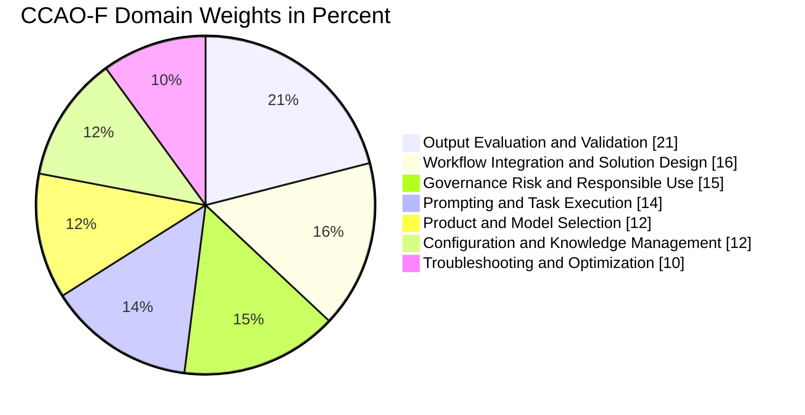
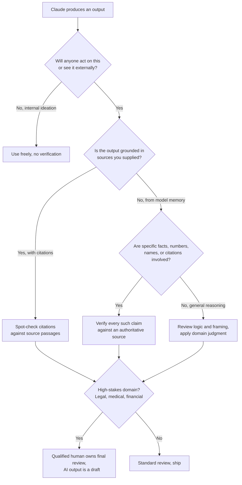
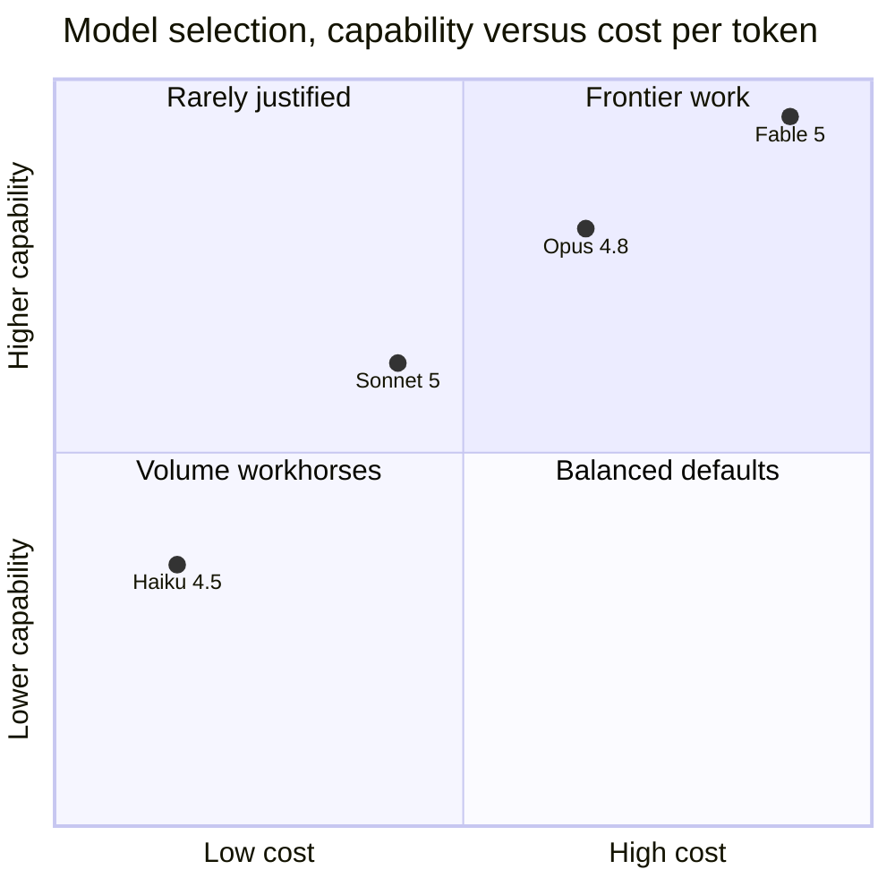

# The Claude Certified Associate Exam: A Complete Study Guide for CCAO-F

For most of the modern AI wave, "AI skills" was a phrase without an anchor. Everyone put it on their profile. Nobody could check it. A hiring manager reading "experienced with LLMs" learned exactly nothing, because the phrase covered everyone from a person who once asked ChatGPT for a recipe to someone who had shipped a production retrieval system. Certifications exist to solve precisely this signaling problem, and for two decades cloud vendors have run the playbook well. AWS, Google Cloud, and Microsoft built certification ladders that, whatever you think of exams, at least established a shared floor: this person has seen the whole surface of the platform, not just the corner they use daily.

On July 13, 2026, Anthropic joined that game seriously. What had been a single credential, the Claude Certified Architect launched earlier that year, expanded overnight into a four-exam program covering three roles at two levels. And the most interesting of the four is the least technical one: the **Claude Certified Associate, Foundations (CCAO-F)**, an exam aimed not at engineers but at the people around them. Consultants who scope Claude engagements. Operations leads who run Claude deployments. Product managers, marketers, educators, analysts. The people who decide what Claude should do, judge whether it did it, and answer for the consequences.

This post is the first in a three-part series covering the new Anthropic certification track, one post per rung: Associate, then Developer, then Architect Professional. I am starting at the bottom deliberately. The Associate exam's blueprint is, read carefully, a curriculum for something the industry has needed a name for: **operational AI literacy**. Not "can you build a transformer" and not "can you write a prompt," but can you take a probabilistic system that is fluent, capable, and occasionally confidently wrong, and integrate it into real work without hurting anyone.

My goal here is not "I passed, here are five tips." It is a complete study guide. We will walk through every exam domain in blueprint order, and for each one I will teach the actual underlying material, the way I covered the Google Cloud ladder in [my 2026 certification roadmap](https://juanlara18.github.io/portfolio/#/blog/google-cloud-certifications-2026-roadmap) and the ML exam content in [the ML cert review series](https://juanlara18.github.io/portfolio/#/blog/ml-cert-review-part-1-foundations). A reader who genuinely understands everything in this post should be able to pass CCAO-F. Then we close with preparation logistics and exam-day strategy.

---

## The Certification Landscape: Four Credentials, Two Levels, Three Roles

Before July 2026, Anthropic had exactly one certification: the Claude Certified Architect, Foundations, a scenario-heavy exam for people designing production Claude systems. The July 13 expansion turned that into a proper program.

| Credential | Code | Cost | Questions | Length | Who it targets |
|---|---|---|---|---|---|
| Claude Certified Associate, Foundations | CCAO-F | $99 | 60 | 120 min | Non-engineer professionals: consultants, ops, PM, marketing, education |
| Claude Certified Developer, Foundations | CCDV-F | $125 | 53 | 120 min | Engineers building with the Claude API, Claude Code, and MCP |
| Claude Certified Architect, Foundations | CCAR-F | $125 | 60 | 120 min | Solution architects designing production Claude systems |
| Claude Certified Architect, Professional | CCAR-P | $175 | 63 | 120 min | Senior architects governing Claude at enterprise scale |

A few structural observations that matter for planning.

**The roles are horizontal, the levels are vertical.** Associate, Developer, and Architect are different jobs, not difficulty tiers. The Associate exam is not "baby Developer." Its blueprint contains almost no API content, no MCP internals, no Claude Code configuration. It tests judgment about outputs, workflows, and governance. The Developer exam prerequisites recommend one to five years of engineering experience plus six months of hands-on Claude work; the Associate exam recommends fluency with Claude's end-user products and nothing else.

**Foundations versus Professional is the vertical axis.** Only the Architect track currently has a Professional level. Foundations proves you can work with Claude competently; Professional proves you can design and govern Claude solutions at enterprise scale. It is reasonable to expect Associate and Developer Professional exams eventually, but as of this writing they do not exist.

**Validity is short.** All four credentials are valid for twelve months. Compare that to three years for a Google Cloud Associate cert. This is not Anthropic being greedy; it is an honest admission that the product surface churns fast enough that a two-year-old credential certifies knowledge of a product that no longer exists in that form. Budget for annual renewal or accept a lapsed badge.

**One quiet catch.** The Associate credential, unlike the other three, does not count toward Claude Partner Network tier eligibility. It is an individual credential, a signal about you, not an organizational asset your employer can stack toward partner status. For the consultants who make up a large share of its audience, this matters when deciding who pays the $99.

Why start with the Associate exam even if you are an engineer? Two reasons. First, its domains are upstream of everything else: you cannot architect a Claude system well if you cannot evaluate Claude outputs, and the Associate blueprint is the only one that teaches evaluation as a first-class subject. Second, the exam is a cheap, low-stakes way to learn how Anthropic writes questions before you spend $175 on the Professional exam. The question style, scenario-based with plausible distractors, is consistent across the program.

---

## Exam Logistics: What You Are Actually Signing Up For

The mechanics, verified against Pearson VUE and the exam guide as of mid-2026:

- **Cost:** $99 USD.
- **Format:** 60 questions, multiple-choice and multiple-response, in 120 minutes. That is two minutes per question, which is generous; this exam is not a time-pressure exam.
- **Scoring:** scaled 100 to 1000, passing score **720**. Scaled scoring means you cannot compute "43 of 60 correct" from the passing score; harder forms are scaled more leniently. Plan for roughly 75 percent correct and you will clear it.
- **Delivery:** proctored, either at a Pearson VUE test center or online through OnVUE. Online proctoring means a webcam-monitored session: clean desk, no second monitor, no phone in reach, a room scan before you start, and a proctor who can pause your exam if someone walks in. If your home setup is chaotic, book the test center; a failed environment check burns the attempt.
- **Retakes:** 14-day wait after the first failed attempt, 30 days after the second, 90 days after the third, with a maximum of four attempts per rolling twelve months.
- **Validity:** 12 months, with a digital badge issued through Credly.
- **Booking:** registration starts in Anthropic Academy (the exam prep courses live there too), which hands you off to a Pearson VUE account for scheduling. Test center appointments can be rescheduled or cancelled up to 24 hours out.

The exam blueprint has seven domains. Weights tell you where to spend study time, so here they are, and note what tops the list.



Read that chart again, because it encodes the exam's whole philosophy. Prompting, the thing every LinkedIn course sells, is fourth at 14 percent. **Evaluating what comes back is first at 21 percent.** Anthropic is telling you, through blueprint weights, that the scarce skill in operating AI is not talking to the model. It is judging the model. The rest of this guide walks the domains in that order.

---

## Domain 1: Output Evaluation and Validation (21%)

The heaviest domain, and the one where non-engineers most often arrive with the weakest instincts, because nothing in ordinary software use prepares you for a tool that is sometimes wrong while being maximally articulate.

### Why models hallucinate, in one honest paragraph

A language model is trained to produce plausible continuations of text. Plausibility correlates with truth, often strongly, because true statements dominate well-curated training data. But the correlation is not identity. When the model lacks knowledge, the training objective still rewards producing something that reads like knowledge. The result is **hallucination**: fluent, confident, well-formatted output that is factually wrong. Modern Claude models hallucinate far less than their 2023 ancestors, decline to answer more readily, and cite more carefully. But the failure mode is reduced, not eliminated, and it concentrates exactly where you can least check it: obscure facts, precise numbers, citations, names, dates, and anything at the edge of the training distribution.

The exam expects you to know the canonical hallucination hotspots:

- **Citations and references.** Titles, authors, URLs, case numbers, statute references. A model can fabricate a perfectly formatted citation to a paper that does not exist. Any citation that will be relied on must be resolved to its source.
- **Numbers and arithmetic over source material.** A summary that says "revenue grew 12 percent" when the document says 21 is a transposition-shaped error models make and humans skim past.
- **Specific entities.** People, product names, versions, dates. The model interpolates between things it has seen.
- **Absence claims.** "The contract contains no termination clause" is far riskier than "the termination clause says X," because verifying absence requires reading everything.

### Grounding: the difference between recall and reading

The single most useful concept in this domain is **grounding**. An output is grounded when every claim in it is traceable to source material the model was actually given: an uploaded document, a Project knowledge file, a search result. An ungrounded output is drawn from the model's training memory, which is broad, dated, and unverifiable in the moment.

This gives you the operational question the exam loves: *for this task, is the model reading or remembering?* Summarizing a document you attached is reading; the failure modes are omission and distortion, and you check the output against the source. Answering "what does GDPR say about data portability" from nothing is remembering; the failure mode is fabrication, and you check the output against the world. The verification strategy is different in each case, and questions will present scenarios where the right answer hinges on noticing which mode the task is in.

A grounding check in practice is simple and mechanical: for each factual claim in the output, can you point to the sentence in the source that supports it? Claude's citation features in document-based workflows automate part of this, attaching claims to source passages. When citations are available, the check is "does the cited passage actually support the claim," which is fast. When they are not, the check is a claim-by-claim audit, which is slow, which is precisely why the workflow decision "require cited outputs for anything load-bearing" appears again and again in correct exam answers.

### Rubric-based evaluation: judging beyond correctness

Correctness is one axis. Real outputs are judged on several: is it complete, is it faithful to the source, is the tone right, does it follow the format, did it stay within scope. The professional tool here is a **rubric**: an explicit list of criteria, each independently checkable, applied the same way to every output. Rubrics matter for two reasons. They make evaluation consistent across people and across days. And they can be handed *back to a model*: LLM-as-judge, where one model scores another model's output against your criteria, is how evaluation scales past the volume a human can read. I covered the retrieval-specific version of this in [the RAGAS post](https://juanlara18.github.io/portfolio/#/blog/ragas-evaluating-rag); the Associate exam wants the general shape.

Here is the pattern as working code, because seeing it concrete makes the exam scenarios easy:

```python
"""Rubric-based evaluation of Claude outputs, using Claude as the judge.

Pattern: define explicit criteria, ask the judge model to score each
criterion independently with a justification, aggregate, and flag
anything below threshold for human review. The judge never sees the
score it is 'supposed' to give; each criterion is a fresh judgment.
"""
import anthropic
import json

RUBRIC = {
    "faithfulness": "Every factual claim in the answer is supported by "
                    "the provided source text. No claim goes beyond it.",
    "completeness": "The answer addresses every part of the question, "
                    "including multi-part questions.",
    "citation_validity": "Each citation points to a passage that "
                         "actually supports the attached claim.",
    "tone_compliance": "Professional, neutral tone suitable for an "
                       "external client audience.",
}

JUDGE_PROMPT = """You are evaluating an AI-generated answer against one
criterion. Score it from 1 to 5 and justify briefly.

<source>{source}</source>
<question>{question}</question>
<answer>{answer}</answer>
<criterion>{criterion}</criterion>

Respond with JSON only: {{"score": <1-5>, "justification": "<one sentence>"}}"""

client = anthropic.Anthropic()

def evaluate(source: str, question: str, answer: str,
             review_threshold: int = 4) -> dict:
    results = {}
    for name, criterion in RUBRIC.items():
        response = client.messages.create(
            model="claude-haiku-4-5",   # judging is a Haiku-class task
            max_tokens=200,
            messages=[{"role": "user", "content": JUDGE_PROMPT.format(
                source=source, question=question,
                answer=answer, criterion=criterion)}],
        )
        results[name] = json.loads(response.content[0].text)

    flagged = [n for n, r in results.items()
               if r["score"] < review_threshold]
    return {
        "scores": results,
        "needs_human_review": bool(flagged),
        "flagged_criteria": flagged,
    }
```

You will not write code on the exam. But you will face questions like "a team reviews 400 AI-drafted responses per day and quality is inconsistent across reviewers; what should they introduce?" and the answer is a rubric, possibly automated, with human review reserved for flagged items. Understanding the mechanism makes those questions trivial.

### Trust versus verify: calibrating effort to stakes

The final piece of this domain is the escalation decision, and it is worth internalizing as a two-factor judgment: **how bad is an undetected error, and how cheap is verification?** A brainstorm has near-zero error cost; verify nothing, flow freely. A client-facing number has high error cost and cheap verification; always check. A legal filing has catastrophic error cost; a qualified human reviews every word, and the AI draft is a draft.



Exam questions in this domain are scenario vignettes: a marketing manager pastes Claude's statistics into a press release, a paralegal receives a drafted brief with case citations, an analyst gets a summary of an earnings report. The correct answer is always the one that matches verification effort to error cost and exploits grounding when available. Distractors will be "trust it, the model is usually right" (under-verification) and "manually re-do the entire task" (verification so expensive it deletes the value of using AI). Both are wrong for the same reason: they ignore the stakes calculation.

---

## Domain 2: Workflow Integration and Solution Design (16%)

The second-heaviest domain asks a question most AI training skips entirely: given a real business process, where does Claude actually fit, and where does it not?

### Task decomposition: the core skill

The unit of AI value is not "the job" or even "the project." It is the **task**, and most jobs decompose into tasks with wildly different AI suitability. The exam wants you to decompose fluently. Take "produce the quarterly client report." That is not one task; it is: pull the numbers (deterministic, belongs in a query or a spreadsheet, not a language model), draft the narrative around the numbers (excellent Claude task, grounded in the data you pulled), format to the client template (good Claude task with the template supplied), and final sign-off (human, non-delegable). A candidate who proposes "have Claude do the quarterly report" fails the design question; the candidate who splits it and assigns each piece to the right executor passes.

Three properties make a task Claude-suitable, and they compound:

1. **The input is language or can be rendered as language.** Documents, transcripts, emails, code, tables pasted as text.
2. **The output is judgeable by the person requesting it.** You can look at a drafted email and know if it is right. You cannot necessarily look at a translated Finnish contract and know.
3. **Errors are recoverable.** The output passes through review, or feeds a process with a later checkpoint, rather than executing directly against the world.

Property two is the one people miss and the exam probes hardest. Delegating a task whose output you cannot evaluate is not automation, it is abdication. The correct designs route such outputs to someone who can judge them, or restructure the task until its output is checkable.

### Human-in-the-loop placement

Once tasks are decomposed, the design question becomes checkpoint placement. The vocabulary worth having: a **human-in-the-loop** design has a person approve each output before it takes effect; **human-on-the-loop** has the process run with a person monitoring aggregates and sampling outputs; **human-out-of-the-loop** is full automation. The Associate exam lives almost entirely in the first two, and the design rule mirrors Domain 1: checkpoint placement follows stakes. Approval gates go where errors are expensive and irreversible, monitoring covers where errors are cheap and visible. A design with approval gates everywhere is as wrong as one with none, because a gate a human rubber-stamps 200 times a day is not a control, it is theater. If this trade-off interests you beyond exam depth, I wrote a full field guide on it in [the agent guardrails post](https://juanlara18.github.io/portfolio/#/blog/agent-guardrails-field-guide).

### Knowing the boundary of your own credential

The most exam-specific skill in this domain is recognizing when a solution has outgrown the end-user product surface and needs engineering. The blueprint language for this is distinguishing "when Projects suffice versus requiring Developer or Architect handoff." The heuristics:

- **Volume.** A person pasting documents into a Project scales to dozens of documents. Thousands of documents, refreshed daily, is an API pipeline and a retrieval system. That is a handoff.
- **Integration.** "Claude helps me draft responses" is a workflow. "Claude drafts responses inside our ticketing system automatically" requires the API and an engineer.
- **Repetition.** The same prompt run manually forty times a day is a screaming signal that this should be an automated pipeline with programmatic evaluation.
- **Tool access.** The moment the solution needs Claude to query live systems, you are in [MCP](https://juanlara18.github.io/portfolio/#/blog/model-context-protocol) territory, and MCP server selection and deployment is Developer-exam material, not yours.

Scenario questions here describe a team's growing usage and ask what to recommend next. The wrong answers stretch the end-user tools past their design point ("upload all 12,000 contracts to a Project") or jump to engineering prematurely ("build a custom API integration" for a five-person team drafting emails). The right answer matches the tool tier to the actual scale and integration need, and says "hand off to a developer" when that is honestly the answer.

---

## Domain 3: Governance, Risk, and Responsible Use (15%)

Fifteen percent of the exam, and the domain where guessing from vibes fails most reliably, because the content is specific: policies have names, data has flow paths, and regulations have thresholds.

### The usage policy layer

Anthropic publishes a **Usage Policy** (the successor to what was long called the Acceptable Use Policy) that binds every Claude surface. You do not need to memorize it clause by clause, but you need its architecture: universal prohibitions (weapons development, CSAM, malicious code deployment against systems you do not own), high-risk domains that require human oversight and disclosure when Claude is used in them (legal advice, medical decisions, financial advice, employment decisions, insurance), and disclosure obligations when people are interacting with an AI without knowing it. The high-risk category is the exam-relevant one, because Associate-level scenarios live there: a team wants Claude to screen résumés, a clinic wants Claude to draft patient communications. The correct answers involve human review by a qualified person, disclosure, and often "this specific use requires controls the current design lacks."

### Data flow: where does your text actually go

This is the governance material an operator genuinely must know cold, and the exam tests it directly.

- **Consumer products** (Claude.ai Free and Pro): as of mid-2026, consumer conversations may be used for model training depending on your data settings, an option Anthropic introduced in late 2025 with explicit user choice. Knowing that this is a setting, and that it is the user's responsibility to configure, is exam material.
- **Commercial products** (Team, Enterprise, API): Anthropic does not train on commercial customer data by default. Enterprise adds SSO, domain capture, audit logs, and admin controls.
- **Retention and review:** flagged content may be retained longer for trust-and-safety review; enterprise admins, not Anthropic, control workspace retention policy.

The operational consequence, and the shape of several exam questions: **the sensitivity of what you paste must match the tier you are pasting it into.** An employee putting unreleased financials into a personal free-tier account is a governance failure even though the model, the quality, and the output are identical to the Enterprise tier. The failure is in the data flow, not the AI.

### PII and the minimization habit

For personally identifiable information, the exam expects the standard hierarchy: **do not send PII the task does not need** (data minimization, the principle underlying GDPR and most privacy law); **pseudonymize when the task needs structure but not identity** (replace names with tokens like CLIENT_A before processing, restore after); and when identity is genuinely needed, ensure the tier and the legal basis cover it. A question describing a support team pasting full customer records into Claude to draft replies has "strip the fields the draft does not require" somewhere in its correct answer.

### Constitutional AI, at exam depth

The blueprint expects a working sketch of how Claude is aligned, roughly one paragraph deep: Claude is trained with **Constitutional AI**, in which the model critiques and revises its own outputs against an explicit set of written principles, and reinforcement learning uses AI feedback guided by that constitution alongside human feedback. The exam consequence is behavioral, not architectural: Claude refuses some requests by design, hedges where it is uncertain by design, and these are properties to design workflows around rather than bugs to prompt past. A scenario where a user "found a prompt that gets Claude to skip its safety guidelines" has exactly one correct answer category, and it is not "document the prompt for the team."

---

## Domain 4: Prompting and Task Execution (14%)

The domain everyone expects to dominate the exam, at a modest 14 percent. The material is the closest to what circulates in public prompt-engineering courses, but Anthropic's version is specific and the exam rewards their vocabulary. Four techniques carry the weight.

**Clear, contextual instructions beat clever ones.** Anthropic's own guidance leads with this, and exam distractors exploit it: the "clever" prompt loses to the one that states the audience, the purpose, the format, and the constraints plainly. A prompt is a brief to a very capable new colleague with no context. "Summarize this" is a bad brief. "Summarize this vendor contract for our procurement lead, one page, focusing on renewal terms, liabilities, and anything unusual relative to a standard SaaS agreement" is a good one.

**Structure with XML tags.** Claude is specifically trained to respect XML-style delimiters. Wrap inputs in tags like `<contract>`, `<examples>`, `<instructions>` so instructions never blur into data. This matters most when the input is long or when it might itself contain instruction-like text. The tags are not magic keywords; any consistent tag names work. What is tested is knowing *why* delimitation matters: separation of instructions from data is also the first defense against prompt injection, where a processed document contains text like "ignore previous instructions," and the model treats quoted, delimited content as material to analyze rather than orders to follow.

**Few-shot examples.** Showing two or three input-output examples of the transformation you want outperforms paragraphs of description, especially for format and tone, which are easier to demonstrate than specify. The exam angle: examples are the highest-leverage fix when outputs are *consistently formatted wrong*, and a waste when the problem is missing knowledge, which examples cannot supply.

**Chain of thought.** Asking Claude to reason step by step before answering, or giving it a `<thinking>` scratchpad, measurably improves multi-step reasoning, math, and analysis against criteria. Two exam-relevant subtleties: the reasoning must come *before* the answer to help (an answer followed by a rationalization gains nothing), and extended-thinking modes on current models institutionalize the same idea as a product feature with a budget you can adjust. Chain of thought costs tokens and latency, so it is the tool for complex judgment tasks, not for reformatting a list.

Beyond the four, the blueprint's phrase "task execution" covers iteration discipline: refining a prompt based on what came back, changing one variable at a time, and knowing when to restart a conversation because accumulated context is steering the model somewhere unhelpful. A long chat in which Claude was corrected five times carries those corrections forward, for better or worse; a fresh conversation with an improved prompt is often the fastest fix. That last move, "start clean with what you learned," resolves a surprising number of scenario questions in both this domain and Domain 7.

---

## Domain 5: Product and Model Selection (12%)

Straight recall territory: you must know the Claude product surface and the model family well enough to match a scenario to a product and a model. This is the easiest domain to score full marks on, because it is finite.

### The product surface

- **Claude.ai** is the flagship end-user app on web, desktop, and mobile. Its features are exam vocabulary: **Projects** (persistent workspaces with instructions and knowledge, covered in Domain 6), **Artifacts** (a side panel where Claude builds documents, code, and small interactive apps you can iterate on), **Skills** (packaged instruction sets that specialize Claude for repeatable tasks), **connectors** (links to tools like Drive and Slack through MCP), and research and file-analysis capabilities.
- **Claude Code** is the agentic command-line and IDE tool for software work. Associate candidates need to know what it is and who it is for, not how to configure it; if you want the full depth anyway, that is [its own complete guide](https://juanlara18.github.io/portfolio/#/blog/claude-code-complete-guide) on this blog.
- **Claude Cowork** extends agentic, multi-step task execution to non-coding knowledge work, pointing Claude at folders of files to process autonomously.
- **The API and developer platform** is where engineered solutions live, including MCP for tool connectivity. Associate-level knowledge: it exists, it is metered per token, and it is the handoff destination from Domain 2.

Plans, at the level tested: **Free** (default models, modest limits), **Pro** (full model access, Projects, higher limits, the individual power-user tier), **Max** (multiples of Pro usage for heavy individual use), **Team** (per-seat, collaboration, central billing), and **Enterprise** (SSO, audit logs, admin data controls, the governance features from Domain 3). The recurring exam pattern: the moment a scenario mentions compliance requirements, audit, or centralized data control, the answer involves Enterprise, because the governance features are the product, not the model quality.

### The model family

As of mid-2026 the lineup is four tiers:

| Model | Tier position | Pricing per M tokens, in/out | Right for |
|---|---|---|---|
| Haiku 4.5 | Fast and cheap | $1 / $5 | High-volume, low-complexity: classification, extraction, routing, judging against rubrics |
| Sonnet 5 | Balanced default | $3 / $15 | The daily driver: drafting, analysis, coding, most workflows |
| Opus 4.8 | Most capable of the 4.x line | $5 / $25 | Hard reasoning, high-stakes analysis, complex agentic work |
| Fable 5 | Frontier flagship | $10 / $50 | The hardest problems where capability dominates cost |



The selection logic the exam rewards is boring and correct: **default to the balanced tier, drop down when volume dominates and the task is simple, step up when the task is genuinely hard and the output justifies the cost.** Distractor answers push the flagship for everything ("use the most capable model to be safe," which fails on cost and latency for volume tasks) or the cheap model for everything ("minimize cost," which fails on quality for judgment tasks). Notice also the pairing from Domain 1: a strong model produces, a cheap model judges at scale. That asymmetry, expensive generation with inexpensive evaluation, is a pattern worth carrying into several question types. For how these capability claims get measured at all, [the LLM benchmarks post](https://juanlara18.github.io/portfolio/#/blog/llm-benchmarks) covers the messy reality.

One more selection axis the exam touches: **knowledge cutoff and live information.** Every model's training data ends somewhere. Questions about current events, prices, or anything post-cutoff need web search or supplied documents, not model memory. A scenario where Claude "gave outdated information about a competitor's product line" is not a model-quality problem; it is a grounding problem with a product-feature answer.

---

## Domain 6: Configuration and Knowledge Management (12%)

Where Domain 5 asks "which product," Domain 6 asks "how do you set it up so it works every time." The center of gravity is Projects.

### Projects: persistent context as a product feature

A Project bundles three things: **a set of conversations**, **project instructions** that apply to every conversation inside it, and **project knowledge**, files uploaded once and available to all of them. The mental model that organizes everything: a Project converts per-conversation prompting effort into per-team, one-time configuration. The instructions you would otherwise paste at the top of every chat ("you are helping the procurement team; always cite the clause; flag anything unusual against our standard terms") live in one place, versioned by whoever owns the Project, applied automatically.

The design questions the exam probes:

- **What goes in instructions versus knowledge?** Instructions carry *behavior*: role, tone, format, rules, escalation criteria. Knowledge carries *facts*: the policy PDF, the product catalog, the style guide, the template. A common scenario shows a team pasting their style guide into instructions verbatim; the better design is the style guide as a knowledge file and a short instruction pointing at it.
- **What belongs in a Project at all?** Stable, shared, reused context. A document you will discuss once belongs in a conversation attachment, not project knowledge.
- **Staleness.** Project knowledge is a snapshot. The uploaded price list does not update when the real one does. Someone must own refresh, and "the Project gives outdated answers" scenarios resolve to ownership and refresh cadence, not to prompting.
- **Scale limits.** Project knowledge is capped; when the corpus outgrows it, retrieval kicks in rather than full-context reading, and beyond that you are in Domain 2's handoff territory: thousands of documents mean an engineered retrieval system, not a bigger upload button.

### The wider configuration surface

Around Projects sit the personalization layers: account-level **custom instructions and styles** (preferences that follow the individual user across conversations), **memory** where enabled (Claude retaining context across sessions, with controls to view and edit what is retained, plus incognito chats that bypass it), and **Skills** (packaged, reusable task specializations that can be shared across a team). The exam distinction worth having sharp: user-level configuration follows the *person*, project-level configuration follows the *work*, and team-shared assets like Skills follow the *task*. A scenario about inconsistent outputs across a team, where each member has private personal instructions and there is no shared Project, is asking you to move configuration up a level so it is owned once.

Connectors earn a mention here too: linking Drive, Slack, or calendars through MCP-based connectors brings live data into conversations, which partially answers the staleness problem, at the price of the access-control questions from Domain 3. A connector holds the permissions of the person who authorized it, and "the intern's Claude can read the finance folder" is a configuration failure with a governance flavor, exactly the kind of cross-domain question the exam enjoys.

---

## Domain 7: Troubleshooting and Optimization (10%)

The lightest domain, and mostly a synthesis of the previous six: given a described failure, diagnose the layer it lives in and pick the proportionate fix. The layers, in the order worth checking:

1. **Task framing.** Was the request ambiguous, compound, or missing context? Most "bad outputs" are underspecified inputs. Fix: Domain 4 techniques.
2. **Grounding.** Did the task need documents or live data the model did not have? Hallucinated specifics and outdated facts live here. Fix: attach sources, use search, cite.
3. **Context state.** Long conversations drift: earlier corrections, stale assumptions, and sheer length degrade responses, and very long chats hit context limits where early material effectively falls away. Fix: start a fresh conversation carrying forward only a distilled summary of decisions made.
4. **Configuration.** Conflicting project instructions, stale project knowledge, the wrong model tier for the task. Fix: Domain 6 hygiene.
5. **Capability boundary.** Some tasks genuinely exceed the model or the product tier. Recognizing "this needs a different design, not a better prompt" is the skill; escalation paths are Domain 2's handoffs.

Two recurring failure archetypes are worth naming because they anchor exam questions. **Inconsistency across runs**: the same prompt yields different structures on different days. This is not a bug to report; language models are stochastic, and the fix is constraining the output with format instructions, examples, or a template, not re-rolling until lucky. **Degradation over a long session**: response quality slides after an hour of iteration. The fix is the fresh-start move from Domain 4, and recognizing it also resolves the emotional framing some questions bait, where the user "argues" with the model. You do not argue with a stochastic process; you restate, restructure, or restart.

Optimization, the other half of the domain title, is mostly cost-and-effort proportionality: batch similar tasks so context is shared, push repeated tasks into Skills or Projects so setup cost amortizes, route volume work to cheaper models with rubric-based checks, and reserve expensive models and human attention for the outputs that warrant them. Every one of those is a sentence-length application of a domain already covered, which is what makes Domain 7 fast points for anyone who studied the rest.

---

## How to Prepare: A Plan That Fits in Two Weeks

For someone already using Claude weekly, this exam is a two-week prepare, not a two-month one. The blueprint is judgment-heavy rather than memorization-heavy, and you already own the judgment if you have operated AI in real work; what you need is Anthropic's vocabulary and the product-surface specifics.

**The official path.** Anthropic Academy hosts the recommended course sequence, free: *AI Fluency: Framework and Foundations* (the delegation-evaluation mindset that Domain 1 and 2 formalize), *AI Capabilities and Limitations* (Domains 1 and 7), *Claude 101* (Domains 5 and 6, and multiple exam takers report its concepts recurring across the whole exam), and *Introduction to Claude Cowork*. Registration for the exam itself flows through the Academy to Pearson VUE. A practice exam is available and worth its hour: it grades as you go, which calibrates you question by question, and question style familiarity is worth real points on scenario exams.

**A schedule that works:**

| Days | Focus | Output |
|---|---|---|
| 1 to 2 | Read the official exam guide; take the practice exam cold | A baseline and a per-domain gap list |
| 3 to 5 | Domains 1 and 2, the 37 percent | Write your own trust-versus-verify rules for three tasks you actually do |
| 6 to 7 | Domain 3 | Read the Usage Policy and your tier's data-handling terms, once, carefully |
| 8 to 9 | Domains 4 and 6 | Build one real Project with instructions plus knowledge; iterate one real prompt through all four techniques |
| 10 to 11 | Domains 5 and 7 | Memorize the product and model tables; drill scenario-to-tier matching |
| 12 to 13 | Practice exam again, review misses | Every miss traced to a domain and re-read |
| 14 | Rest, logistics check | OnVUE system test done, ID ready, desk clean |

The single highest-value preparation activity is not in any course: **do your own work through Claude for the two weeks, and narrate the exam's questions at yourself while you do it.** Which model tier is this task. Is this output grounded. What would I verify before sending this. Should this be a Project. The exam is scenario-based, and you are manufacturing scenarios with stakes all day long.

---

## Exam Day: Strategy for Scenario Questions

The CCAO-F question style follows the program's house pattern: a two-to-four sentence workplace vignette, a question asking for the *best* next action, and four options of which typically two are defensible. The wrong-but-plausible options are engineered, in Anthropic's own framing, to represent mistakes made by people who understand the concept but have not thought through the implications. That design dictates the tactics.

**Eliminate by principle, not by feel.** Nearly every distractor violates one of a short list of principles this guide has been building: verification effort must match stakes; configuration should live at the level of the work, not the person; data sensitivity must match product tier; the fix should target the failing layer; hand off when the tool tier is exceeded. When two answers both seem right, ask which principle each one bends. One of them bends one.

**Watch for the extremity tell.** "Always," "never," "every output," "fully automate," "manually verify everything" mark answers at the ends of a spectrum the exam wants you to stand in the middle of. The proportionate answer wins with high reliability.

**Respect the persona in the vignette.** If the scenario says a *marketing coordinator* is doing something, the correct action is one available to a marketing coordinator. "Implement an API-based evaluation pipeline" is a wrong answer for that persona even when it is good engineering, and "recommend handoff to the development team" is often right precisely because the exam is testing whether you know your credential's boundary.

**Budget time in three passes.** Two minutes per question is ample. Pass one: answer everything answerable in under a minute, flag the rest; expect this to cover 40-plus questions in 50 minutes. Pass two: work the flagged questions properly. Pass three: review flags only. Do not re-litigate confident answers; first-pass accuracy on scenario exams is better than post-hoc doubt. And answer everything, since there is no penalty for wrong answers and a blank is a guaranteed zero.

**Multiple-response hygiene.** A handful of questions ask for two or three correct options and tell you how many. Treat each option as an independent true-false against the scenario; do not let one obviously-correct option lower your bar for its neighbors.

If you clear 720, the badge lands via Credly, it holds for twelve months, and the next rung is the Developer exam: the API, MCP, tool use, and Claude Code in anger, which is where the next post in this series picks up. If you miss, the 14-day wait is short, the score report is broken down by domain, and the gap analysis writes your second-attempt study plan for you.

---

## Going Deeper

**Books:**
- Christopher, A. (2023). *The AI Product Manager's Handbook.* Packt.
  - Product-side framing for AI capability assessment and workflow fit, the Domain 2 material at book length.
- Huyen, C. (2025). *AI Engineering: Building Applications with Foundation Models.* O'Reilly.
  - The best single book on evaluation, prompting, and the model-selection trade-offs behind Domains 1, 4, and 5, written for practitioners.
- O'Neil, C. (2016). *Weapons of Math Destruction.* Crown.
  - The governance domain's conscience: what happens when opaque automated judgment meets high-stakes decisions without the controls Domain 3 demands.
- Kahneman, D., Sibony, O., & Sunstein, C. (2021). *Noise: A Flaw in Human Judgment.* Little, Brown.
  - Rubrics exist because unaided human judgment is inconsistent; this is the evidence base, and it will change how you review outputs.

**Online Resources:**
- [Anthropic Academy](https://www.anthropic.com/learn) — The official course home: AI Fluency, Claude 101, and the exam registration path.
- [Anthropic's prompt engineering documentation](https://docs.anthropic.com/en/docs/build-with-claude/prompt-engineering/overview) — The primary source behind Domain 4; the exam uses its vocabulary.
- [Claude Certification Program at Pearson VUE](https://www.pearsonvue.com/us/en/anthropic.html) — Scheduling, retake policy, and proctoring requirements, straight from the delivery vendor.
- [Anthropic's Usage Policy](https://www.anthropic.com/legal/aup) — Read it once before the exam; Domain 3 questions quote its categories.
- [Anthropic's Interactive Prompt Engineering Tutorial](https://github.com/anthropics/prompt-eng-interactive-tutorial) — Hands-on notebook version of the Domain 4 techniques with graded exercises.

**Videos:**
- [Anthropic's FREE 24-Min Prompt Engineering Workshop](https://www.youtube.com/watch?v=pQ6G9TQfGIA) — A compact walkthrough of Anthropic's prompting workshop material: clear instructions, XML structure, and examples.
- [Claude AI Tutorial: The ULTIMATE Guide to Prompt Engineering & Artifacts](https://www.youtube.com/watch?v=dG2iFVKdyhs) — End-user product surface in motion: Projects, Artifacts, and iteration workflows, useful for Domains 5 and 6.

**Academic Papers:**
- Bai, Y., et al. (2022). ["Constitutional AI: Harmlessness from AI Feedback."](https://arxiv.org/abs/2212.08073) *arXiv preprint.*
  - The alignment method behind Claude's refusal and hedging behavior; the primary source for the Domain 3 sketch.
- Kadavath, S., et al. (2022). ["Language Models (Mostly) Know What They Know."](https://arxiv.org/abs/2207.05221) *arXiv preprint.*
  - Model self-knowledge and calibration, the research substrate under every trust-versus-verify judgment in Domain 1.
- Zheng, L., et al. (2023). ["Judging LLM-as-a-Judge with MT-Bench and Chatbot Arena."](https://arxiv.org/abs/2306.05685) *NeurIPS Datasets and Benchmarks.*
  - The canonical study of using models to evaluate models, including where judge models agree with humans and where they systematically fail.

**Questions to Explore:**
- If credentials are valid for twelve months because the product changes that fast, is a certification measuring knowledge or measuring recency? What would a durable AI-literacy credential even test?
- The exam weights evaluation above prompting. Does your organization's AI training do the same, and if not, what does that inversion cost?
- Rubric-based LLM-as-judge evaluation uses a model to check a model. At what point does that loop need a human anchor, and how would you detect that it has drifted without one?
- The Associate credential certifies individuals but grants no partner-tier credit. What does it mean for a skill to be organizationally valuable but only individually certifiable?
- If "know when to hand off to a developer" is a tested skill, should engineering certifications symmetrically test "know when the right solution is no code at all"?
