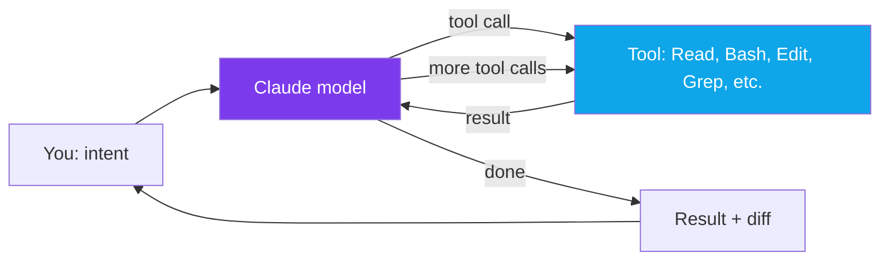
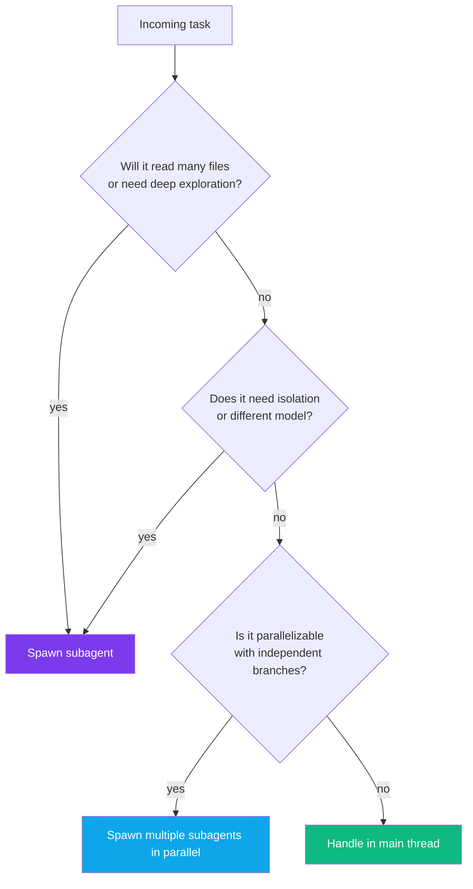
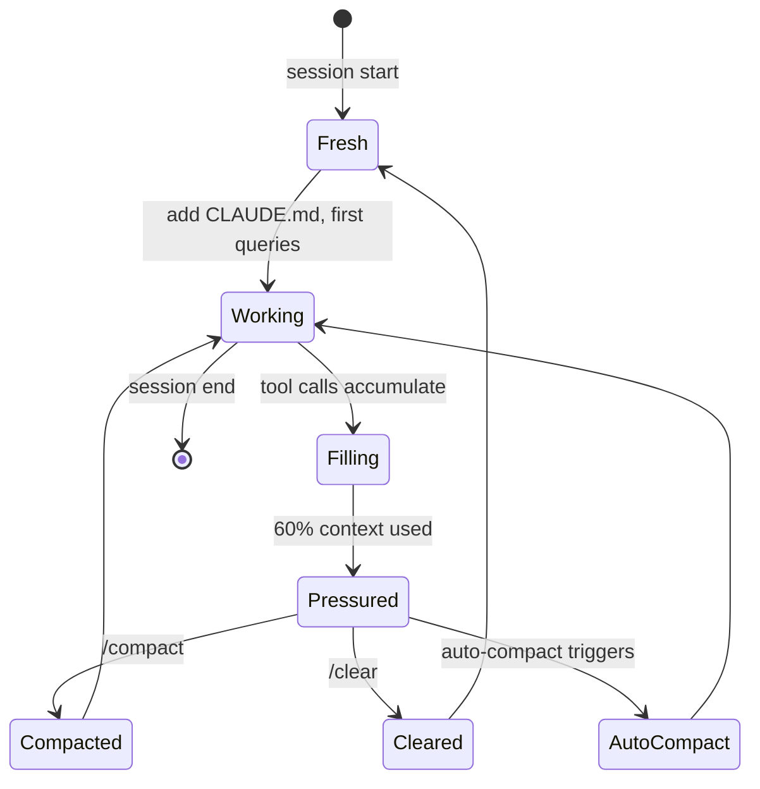
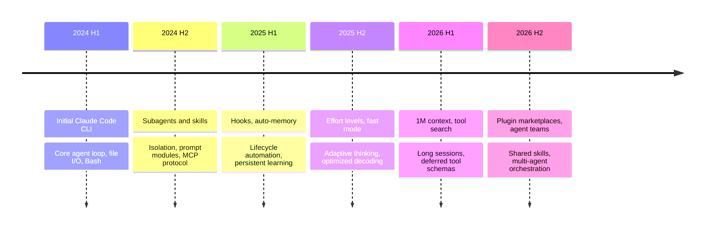

# Claude Code: The Complete Guide to Becoming a Power User of the AI That Codes With You

I've been using Claude Code as my primary development interface for long enough that reaching for a plain terminal now feels like switching from a keyboard back to a typewriter. Not because it writes code for me — I still think about architecture, still make the hard calls, still read every diff — but because the loop between "I want X" and "X is implemented, tested, and committed" has collapsed from hours to minutes for a huge category of tasks.

And yet most people I talk to are using maybe 20% of what Claude Code actually does. They treat it as a chat window with file access. They never touch subagents. They've never written a hook, never scoped a skill, never looked at `/context` to see why the session feels sluggish. They don't know that `CLAUDE.md` is loaded every turn or that `--dangerously-skip-permissions` exists or that the Agent tool is why the thing can search ten thousand files without melting the context window.

This post is the guide I wish I'd had on day one. It's long on purpose — Claude Code is genuinely a large system with many moving parts, and shallow coverage just breeds shallow use. I'll walk through the mental model, the core loop, the full configuration surface, and the half-dozen subsystems (CLAUDE.md, skills, subagents, MCP, hooks, permissions) that separate casual users from power users. Every section is grounded in actual behavior you can verify today.

Let's start with the thing most docs skip: what Claude Code fundamentally *is*.

## Part 1 — The Mental Model: What You're Actually Running

Claude Code is not a chatbot with file access. That framing is wrong in a way that will keep you stuck at surface-level productivity forever.

The right framing: **Claude Code is an agentic loop wrapped around a filesystem.** A language model sits in the center. Around it is a harness that lets the model call tools — read files, write files, grep, run shell commands, fetch URLs, spawn helpers — and feeds the results back into the model's context. The model decides what to do next based on what it just saw. Then it does that. Then it sees the result. Loop until done.

The three phases of every turn blend together but are conceptually distinct:

1. **Gather** — read files, run searches, inspect state
2. **Act** — edit code, run commands, call APIs
3. **Verify** — run tests, check output, look at diffs

A chat model answers questions. An agent model *operates on the world and reads the world back*. That difference sounds small until you watch Claude Code debug a failing test by reading the error, grepping for the relevant code, editing it, re-running the test, noticing a new failure, and fixing that too — all without you touching the keyboard. That's not autocomplete. That's a different mode of computing.



Three design decisions shape everything else about the product:

**It's a CLI, not an IDE plugin.** That matters because the filesystem is the source of truth. There's no proprietary project format, no "Claude Code workspace" file. It runs in your terminal, reads your actual files, commits via real git. Any language, any build system, any OS. It also means it composes with Unix: you can pipe into it, script it, run it in CI. The IDE extensions are nice layers on top, but the CLI is the product.

**It's model-first, tool-second.** The tools are the model's hands, not the other way around. There's no rule engine deciding what runs when. The model looks at your request, looks at the files, decides which tools to call and in what order. This is why prompting matters so much: you're not configuring a workflow, you're instructing an agent that will improvise.

**It's agentic but interruptible.** You can watch every action, reject any file write, rewind to any checkpoint, cancel mid-turn. The agent runs under your supervision by default. Power users shift toward more autonomy (auto-accept edits, allowed tool lists), but the safety rails are always there.

Everything else in this post — CLAUDE.md, skills, subagents, hooks, MCP, permissions — is machinery that lets you *shape* that loop. Tell it what to know. Tell it what it can touch. Tell it how to handle edge cases. Tell it when to delegate. The better you understand the loop, the better you can shape it.

## Part 2 — Installation and Authentication

Claude Code runs on macOS 13+, Windows 10 1809+, and modern Linux distros. On Windows you need Git for Windows installed (Claude Code uses Git Bash under the hood for shell operations).

The recommended install is the native script:

```bash
curl -fsSL https://claude.ai/install.sh | bash          # macOS/Linux/WSL
irm https://claude.ai/install.ps1 | iex                 # Windows PowerShell
brew install --cask claude-code                         # macOS/Linux via Homebrew
winget install Anthropic.ClaudeCode                     # Windows
```

The native install auto-updates. The older `npm install -g @anthropic-ai/claude-code` still works but doesn't auto-update and is slower to start.

After installing, `claude doctor` is the health check — it verifies auth, git, shell, and tool availability. I run it anytime something feels off.

**Authentication has six possible paths**, evaluated in this order:

1. Cloud provider credentials (Bedrock, Vertex, Foundry) if the relevant env var is set
2. `ANTHROPIC_AUTH_TOKEN` — bearer token for LLM gateways
3. `ANTHROPIC_API_KEY` — direct API key
4. `apiKeyHelper` script — dynamic credential fetching from a vault
5. `CLAUDE_CODE_OAUTH_TOKEN` — long-lived OAuth token (CI/headless)
6. Browser OAuth — the default for Pro/Max/Team/Enterprise

For individual use on a Pro or Max plan, just run `claude` the first time and a browser window opens. For CI, use `claude setup-token` to generate a one-year OAuth token and set `CLAUDE_CODE_OAUTH_TOKEN` in your CI secrets.

There's one subtlety worth flagging: **which plan you're on changes what models are available**. Pro has restricted access to Opus. Max and Team unlock Opus 4.6 with extended thinking and the 1M context window. Enterprise adds SSO, managed policies, and compliance features. If you're using Claude Code for serious work, the Max plan pays for itself within a week if your alternative is pay-as-you-go API billing — extended thinking on Opus is expensive at list price.

## Part 3 — The Core Loop: Tools as Hands

Every action Claude Code takes happens through a tool. There are no hidden paths. Understanding which tools exist and when the model reaches for them is the single highest-leverage thing you can learn after the mental model.

Here are the built-in tools, grouped by what they're for:

| Group | Tools | What they do |
|---|---|---|
| **File I/O** | `Read`, `Write`, `Edit`, `NotebookEdit` | Read files (with line numbers), write new files, surgical edits, Jupyter cell edits |
| **Search** | `Glob`, `Grep` | Find files by pattern, search content with ripgrep |
| **Execution** | `Bash`, `Monitor` | Run shell commands, stream output from long-running jobs |
| **Web** | `WebFetch`, `WebSearch` | Fetch a URL, search the web |
| **Orchestration** | `Agent`, `Skill`, `ToolSearch` | Spawn subagents, invoke skills, load deferred tool schemas |
| **Planning** | `EnterPlanMode`, `ExitPlanMode` | Enter/exit read-only planning mode |
| **Tasks** | `TaskCreate`, `TaskList`, `TaskUpdate` | Manage a checklist within a session |

Two tools deserve special attention because they're the ones that unlock the big productivity jumps.

**`Edit` is not a file rewrite.** It's a string-level surgical edit — you give it an `old_string` and a `new_string` and the tool replaces the first one with the second. This matters because it means Claude doesn't need to re-emit your whole file to change three lines, which would burn thousands of tokens and risk garbling untouched code. The model has to read the file first (the CLI enforces this), which is why you'll see Claude reach for `Read` before every `Edit`.

**`Agent` is how Claude delegates to itself.** When you ask "find every place we handle authentication in this repo," a naive model would try to read every file itself and blow through context. A well-trained agent calls the `Agent` tool with a prompt like "explore this codebase and return a list of authentication-related files." That spawns a subagent in a *separate context window*, which does the exploration, and returns a short summary. The main conversation stays clean. This is the single most important mechanism for working on large codebases without drowning in tokens.

You don't usually need to invoke these tools yourself — Claude picks them based on the task. But knowing they exist lets you prompt better. "Use a subagent to find X" is a legitimate instruction. So is "read the file first before editing" (which Claude does by default, but it's a good correction if you see it guessing).

## Part 4 — CLAUDE.md: Persistent Instructions

Every session starts fresh. The model has no memory of yesterday. What it does have is whatever is in `CLAUDE.md`, which loads automatically into every turn.

`CLAUDE.md` is a markdown file with project-specific instructions. Build commands, coding conventions, architectural decisions, gotchas — things the model can't infer from the code alone. It's the closest thing Claude Code has to long-term project memory.

There's a hierarchy. Files are concatenated top-down, higher priority first:

```
Enterprise policy:    /etc/claude-code/CLAUDE.md
User global:          ~/.claude/CLAUDE.md
Project shared:       ./CLAUDE.md or ./.claude/CLAUDE.md
Project local:        ./CLAUDE.local.md  (gitignored)
```

Same idea as git config layers. Enterprise admins can enforce policies across all users. Users can set personal preferences across all projects. Projects commit shared team standards. And `CLAUDE.local.md` is for your private notes on a project (add it to `.gitignore`).

The single most important rule: **keep it under 200 lines**. Past that, adherence drops fast. The model starts skipping rules, contradictions sneak in, and the file starts eating meaningful context budget every single turn.

Here's what belongs in a CLAUDE.md:

- Build and test commands (`npm test -- --coverage`, `pytest -xvs`)
- Code style rules that deviate from language defaults
- Architectural decisions specific to this repo ("all API responses use the `{ data, error }` envelope")
- Repo etiquette (branch naming, PR conventions, commit message format)
- Non-obvious gotchas ("the `legacy/` dir uses different conventions; ignore its patterns")
- Developer environment quirks (required env vars, virtualenv activation)

And what does *not* belong:

- Standard language conventions Claude already knows
- Long tutorials or explanations
- File-by-file descriptions (too verbose, rots fast)
- API documentation (link to it instead)
- Anything that changes weekly (use auto-memory for evolving context)

You can also use `@path` imports to reference external files without pasting them inline:

```markdown
# Architecture
See @docs/architecture.md for the full system overview.

# Conventions
@.claude/rules/api-style.md
@.claude/rules/testing.md
```

The imported files load into context only when Claude actually needs them (or when the import is unconditional). This is how you keep `CLAUDE.md` itself small while still surfacing deep reference material on demand.

For path-scoped rules, create files in `.claude/rules/` with a frontmatter that restricts when they activate:

```markdown
---
paths:
  - "src/api/**/*.ts"
---
# API Design Rules
- All endpoints return { data, error } envelope
- Use Zod for input validation
- Include OpenAPI comments on every handler
```

That file only loads when Claude touches a file matching the glob. You can have dozens of these without ever paying their token cost unless they're relevant.

Finally: there's a parallel system called **auto-memory** that writes memories *as Claude learns*. It lives at `~/.claude/projects/<project>/memory/` as a set of markdown files. An index (`MEMORY.md`) loads at session start; topic-specific files load on demand when Claude reads them. This is where the model saves things like "this repo uses pnpm not npm" or "the test suite requires `DATABASE_URL` to be set." You enable or disable it globally with `CLAUDE_CODE_DISABLE_AUTO_MEMORY=1` or per-session from the settings UI.

Treat `CLAUDE.md` as the authoritative spec you control. Treat auto-memory as the running notebook Claude maintains about your project over time. They're complementary.

## Part 5 — Permissions: The Safety Rail You Should Actually Learn

The permissions system is where most people's relationship with Claude Code gets frustrating. They bounce between "approve every single command" (slow) and "bypass all permissions" (terrifying). The right answer is to understand the rule system and configure it once.

There are four permission modes you cycle through with `Shift+Tab`:

| Mode | Reads | Bash | Edits | When to use |
|---|---|---|---|---|
| **Default** | free | ask first time | ask first time | Normal work |
| **Auto-accept edits** | free | ask | auto | You trust the edits, not the shell |
| **Plan mode** | free | none | none | Exploration and planning only |
| **Bypass permissions** | free | auto | auto | Isolated VMs, CI, throwaway containers |

Plan mode is underrated. It's the right starting point for any non-trivial task. You enter plan mode, Claude explores the codebase, proposes a plan, and then you review and approve it before anything gets written. It's the closest Claude Code gets to a design review.

Below the modes sit **permission rules**, which live in `settings.json` under `permissions.allow`, `permissions.ask`, and `permissions.deny`. Rule precedence is `deny > ask > allow`, first match wins.

```json
{
  "permissions": {
    "defaultMode": "default",
    "allow": [
      "Bash(npm run *)",
      "Bash(npm test *)",
      "Bash(git status)",
      "Bash(git diff *)",
      "Bash(git log *)",
      "Read(src/**/*)",
      "Edit(src/**/*)",
      "WebFetch(domain:docs.anthropic.com)"
    ],
    "ask": [
      "Bash(git push *)",
      "Bash(git commit *)"
    ],
    "deny": [
      "Bash(rm -rf *)",
      "Bash(sudo *)",
      "Edit(.env*)",
      "Edit(.git/**)"
    ]
  }
}
```

The Bash pattern matcher uses word boundaries by default — `Bash(npm run *)` matches `npm run test` but not `npm-run`. The `Read` and `Edit` matchers use gitignore-style globs.

Once you've got a reasonable rule set, the model stops pestering you for routine operations but still asks before anything destructive or unusual. That's the sweet spot. You can iterate on it over weeks: every time Claude asks permission for something you'd obviously allow, add the rule. Every time it does something risky, add a deny rule.

`--dangerously-skip-permissions` exists as an escape hatch for isolated environments. I use it inside Docker containers and ephemeral VMs where the entire environment is throwaway. I do not use it on my main machine. Ever. The name is deliberate.

## Part 6 — Slash Commands: The Control Surface

Slash commands are how you talk *to* Claude Code as opposed to talking *through* it. They configure the session, switch modes, inspect state, and invoke skills. Type `/` in any session and you'll see the full list.

The ones I use daily:

**Session control**
- `/clear` — reset the context window. Use this between unrelated tasks. Fresh context = faster, cheaper, less confused model.
- `/compact [focus hint]` — summarize the conversation so far to free context. Optional focus lets you bias what gets preserved.
- `/context` — show a detailed breakdown of what's using tokens. Indispensable when sessions feel sluggish.
- `/rewind` — open the checkpoint menu. Every turn creates a restore point. This is your undo button for the whole agent.

**Model and effort**
- `/model` — switch models mid-session. Opus for hard reasoning, Sonnet for bulk coding, Haiku for trivial tasks.
- `/effort low|medium|high|max` — adjust thinking budget. Higher = slower, more expensive, better reasoning. `max` is Opus-only.
- `/fast` — toggle fast mode on Opus 4.6. Same model, optimized output path.

**Configuration and state**
- `/permissions` — the permission rule editor. Also shows recently denied actions.
- `/memory` — view and edit CLAUDE.md and auto-memory files.
- `/mcp` — manage MCP servers, see their token cost.
- `/agents` — create and manage subagents.
- `/hooks` — view configured hooks.
- `/skills` — browse available skills.
- `/status` — account info, current model, session usage.
- `/cost` — current session spend.

**Workflows**
- `/init` — analyze a fresh codebase and generate a starter CLAUDE.md. Run this once per new project.
- `/review` — bundled code-review skill. Works on staged changes or a branch diff.
- `/test` — run your test suite with Claude watching output.

Custom commands are really just skills under the hood (more on that in a moment). If you find yourself repeating the same prompt pattern — "make a commit with a conventional-commits message that..." — promote it to a skill and invoke it with `/commit`.

## Part 7 — Skills: Prompt Modules with a Contract

Skills are the feature I wish more people used. They're prompt-based workflows that Claude invokes automatically when relevant or that you trigger manually with a slash command. They live at `.claude/skills/<name>/SKILL.md` (project) or `~/.claude/skills/<name>/SKILL.md` (user global).

The file has YAML frontmatter and a body:

```yaml
---
name: commit
description: Create a git commit with a conventional-commits message. Use when the user asks to commit changes.
argument-hint: "[optional scope]"
allowed-tools: "Bash(git status), Bash(git diff *), Bash(git log *), Bash(git add *), Bash(git commit *)"
---

Create a git commit following these steps:

1. Run `git status` to see all changes.
2. Run `git diff --staged` to see what's staged.
3. If nothing is staged, run `git diff` and ask the user which files to stage.
4. Look at `git log -5` for the repo's commit style.
5. Draft a conventional-commits message: `<type>(<scope>): <subject>`.
6. Use types: feat, fix, chore, docs, refactor, test, perf.
7. Create the commit. Do NOT push.

Focus the message on the *why*, not the *what*. One or two sentences max.
```

Key frontmatter fields:

- `name` — the slash-command name (`/commit`)
- `description` — when Claude should auto-use this; shown in the picker
- `allowed-tools` — space-separated allowlist; tools used by this skill bypass permission prompts
- `disable-model-invocation: true` — skill only runs when *you* invoke it
- `user-invocable: false` — skill only runs when Claude auto-invokes it (hidden from picker)
- `paths` — glob patterns; skill only activates when Claude touches matching files
- `context: fork` — run the skill in a subagent with isolated context
- `model`, `effort` — override session defaults for this skill

Skills enable two patterns worth calling out.

**Progressive disclosure.** A skill can have a short `SKILL.md` and a bunch of supporting files — `reference.md`, `examples/`, `scripts/` — that Claude loads on demand. Your slash command stays cheap (small frontmatter + short body) but has a library of deep reference material available when needed.

**Dynamic context injection.** Use `` !`command` `` in the skill body to run a shell command at invocation time and inject its output:

```markdown
## PR Context
- Branch: !`git branch --show-current`
- Diff: !`git diff main...HEAD`
- Failing tests: !`npm test 2>&1 | tail -20`

Review this PR for...
```

The commands run *before* Claude sees the prompt. Output replaces the placeholder. This lets you build slash commands that snapshot live state — current git branch, failing tests, recent logs — and feed it into the model without you pasting anything.

Skills are the main reason my `/commit`, `/review`, and `/ship` workflows take three keystrokes instead of three paragraphs.

## Part 8 — Subagents: Context Isolation and Specialization

I mentioned the `Agent` tool earlier but the full subagent system is deeper. Subagents are specialized assistants that run in their own context window, with their own tool access, their own model, and their own system prompt. When they finish, they return a short summary to the main conversation. Whatever they read, whatever they searched, whatever intermediate thinking they did — none of that bloats your main context.

There are built-in subagent types:

- **general-purpose** — default, full tool access
- **Explore** — read-only (Read, Grep, Glob); fast for codebase investigation
- **Plan** — read-only + planning tools; for architecture and strategy work

And you can define your own in `.claude/agents/<name>.md`:

```yaml
---
name: security-reviewer
description: Reviews code for vulnerabilities. Use when user asks for a security audit.
tools: Read, Grep, Glob, Bash
model: opus
---

You are a senior security engineer. Review code for:
- Injection vulnerabilities (SQL, command injection, XSS)
- Authentication and authorization flaws
- Secrets or credentials in code
- Insecure data handling
- CSRF, SSRF, XXE

For each finding, provide:
1. File and line reference
2. Severity (critical/high/medium/low)
3. Exploit scenario
4. Suggested fix with code
```

When to reach for a subagent versus doing the work in the main thread:



The parallel pattern is the one most people miss. If you need to audit three independent subsystems, spawn three subagents in one turn. They run concurrently in separate contexts, each returns a report, and the main thread consolidates. Ten minutes of work instead of thirty.

The flip side: subagent invocation has overhead. For a task where you know exactly which file to edit, spawning a subagent is pure waste. Subagents shine when the cost of exploration is high relative to the cost of the edit, or when you need context isolation to protect the main conversation.

## Part 9 — MCP: Extending Claude Beyond the Filesystem

Model Context Protocol is Anthropic's open standard for letting external systems expose tools to Claude. The filesystem, Git, Bash — those are built-in. Everything else — your database, your Linear board, your Figma files, your production logs, your Slack — lives behind an MCP server.

An MCP server is a process that speaks the MCP protocol (over stdio, HTTP, or SSE) and exposes a list of tools with typed inputs and outputs. Claude Code connects to the server, reads the tool list, and treats each tool as if it were built-in. When Claude calls one, the request goes to the server, which runs whatever code and returns the result.

Adding a server is either a CLI command or an edit to `.mcp.json` at the project root:

```bash
claude mcp add github stdio "npx @anthropic-ai/github-mcp"
claude mcp add linear http "https://api.linear.app/mcp"
```

Or in `.mcp.json`:

```json
{
  "mcpServers": {
    "github": {
      "command": "npx",
      "args": ["@anthropic-ai/github-mcp"],
      "env": { "GITHUB_TOKEN": "ghp_..." }
    },
    "sentry": {
      "command": "uvx",
      "args": ["sentry-mcp"],
      "env": { "SENTRY_AUTH_TOKEN": "..." }
    }
  }
}
```

Real-world servers I've seen in production use:

- **GitHub** — read PRs, leave comments, create issues
- **Linear** — query tickets, move them through states
- **Sentry** — pull recent errors, stack traces, breadcrumbs
- **Playwright** — drive a real browser for end-to-end testing
- **Slack** — read channels, post messages
- **Postgres / SQLite** — query databases directly
- **Figma** — read design files
- **Filesystem** — access directories outside the project root

The killer pattern is connecting Claude Code to your actual operational systems. "Look at the last 24h of Sentry errors, find the top three by volume, identify which code paths are responsible, propose fixes, and open PRs." That prompt is ridiculous in a chat interface. It's a ten-minute task with the right MCP servers wired up.

One subtlety: MCP servers consume context space even when you're not using them, because their tool schemas load into the prompt. Many servers = many schemas = context pressure. Claude Code mitigates this with **tool search** — tool *names* stay visible but full schemas are deferred until needed. You'll see a `ToolSearch` tool show up in your toolset when this is active. If you're running more than a handful of servers, this is what keeps it all tractable.

Check `/mcp` for a per-server cost breakdown and to see which ones are actually connected.

## Part 10 — Hooks: Deterministic Automation Around the Loop

Hooks are how you get *guaranteed* behavior around Claude Code's lifecycle. CLAUDE.md rules are advisory — the model might skip them. Hooks are deterministic — they run every time, no exceptions.

A hook is a shell script, HTTP endpoint, or LLM prompt that fires at a specific lifecycle event. The main events:

- `SessionStart` — session begins or resumes
- `SessionEnd` — session terminates
- `UserPromptSubmit` — before Claude processes your input
- `PreToolUse` — BEFORE a tool executes (can block or modify input)
- `PostToolUse` — AFTER a tool executes (can block or modify output)
- `Stop` — Claude finishes a turn

You configure hooks in `settings.json`:

```json
{
  "hooks": {
    "PreToolUse": [
      {
        "matcher": "Bash",
        "hooks": [
          {
            "type": "command",
            "command": "~/.claude/hooks/block-dangerous-bash.sh"
          }
        ]
      }
    ],
    "PostToolUse": [
      {
        "matcher": "Edit|Write",
        "hooks": [
          {
            "type": "command",
            "command": "~/.claude/hooks/format-and-lint.sh"
          }
        ]
      }
    ]
  }
}
```

The hook script receives tool metadata on stdin as JSON and can return a decision on stdout. For `PreToolUse`, you can allow, deny, or modify the input. For `PostToolUse`, you can block the result from being fed back to the model.

A real example — block destructive `rm` commands regardless of what the model thinks:

```bash
#!/bin/bash
COMMAND=$(jq -r '.tool_input.command')
if echo "$COMMAND" | grep -Eq '(^|\s)rm\s+-rf\s+/'; then
  jq -n '{
    hookSpecificOutput: {
      permissionDecision: "deny",
      permissionDecisionReason: "Destructive rm -rf blocked by policy"
    }
  }'
  exit 0
fi
exit 0
```

Another — auto-format and lint any TypeScript file after Claude edits it:

```bash
#!/bin/bash
FILE=$(jq -r '.tool_input.file_path')
if [[ "$FILE" == *.ts || "$FILE" == *.tsx ]]; then
  prettier --write "$FILE" >/dev/null 2>&1
  eslint --fix "$FILE" >/dev/null 2>&1
fi
exit 0
```

Hooks are where you enforce organizational policy (block pushes to main, require signed commits, ban certain dependencies), capture observability (log every Bash command to a central store for audit), or enforce quality gates (run a linter after every edit, reject PRs that don't pass typecheck).

They're also the right place to persist environment variables across Bash commands — a gotcha that trips everyone. Each Bash call runs in its own subprocess, so `export FOO=bar` in one call vanishes by the next. The fix is a `SessionStart` hook that writes the env to `$CLAUDE_ENV_FILE`, which every subsequent Bash command sources automatically.

## Part 11 — Context Management: The Skill That Separates Experts

Context is the most precious resource in an agentic session. Run out and everything slows down, gets dumber, and costs more. Manage it well and a single session can handle a full day of serious work.

The thing most people don't realize: your context is constantly filling up with tool results you no longer need. Every `Read`, every `Bash`, every subagent summary stays in the context window until the session ends or you compact it. After an hour of serious work, 60-80% of your context can be stale tool output.



Four tools for managing context:

**`/context`** — shows exactly what's eating your tokens. Use it any time the session feels sluggish. You'll often find one giant file or tool result you can drop.

**`/compact [focus]`** — summarizes the conversation so far. Preserves decisions and code snippets, drops intermediate tool output. The focus hint biases the summary toward what you care about. Use this when you want to continue the same task but the context is bloated.

**`/clear`** — nuke the conversation entirely. Only `CLAUDE.md` and auto-memory survive. Use this between unrelated tasks. It's faster and cheaper to start fresh than to drag a 100K-token session into a new problem domain.

**Subagents** — mentioned earlier but worth repeating. Delegate exploration to subagents so the main context only sees the final summary.

The habit that matters: get comfortable with `/clear`. Most people treat their session as sacred and accumulate hours of cruft. A session is cheap. Start a new one. The model doesn't care.

A related habit: name your sessions. `/rename oauth-refactor` lets you resume with `claude --resume oauth-refactor` days later. It's a small thing that compounds.

## Part 12 — Models, Effort Levels, and Fast Mode

Claude Code gives you three model families and four effort levels, and picking well matters for both cost and quality.

| Model | Best for | Rough cost |
|---|---|---|
| **Haiku 4.5** | Mechanical tasks, bulk refactors, simple edits | Low |
| **Sonnet 4.6** | Daily coding, reading/editing, routine debugging | Medium |
| **Opus 4.6** | Hard reasoning, architecture, tricky bugs, planning | High |

Switch with `/model` mid-session. There's also `opusplan`, which uses Opus for plan mode and Sonnet for execution — a nice hybrid that gives you strong reasoning during the design phase without paying Opus rates during implementation.

Effort levels control the thinking budget:

- `low` — fast, minimal reasoning, cheap
- `medium` — default on Pro and Max; balanced
- `high` — deep reasoning, slower
- `max` — deepest reasoning on Opus only, slowest and priciest

Set with `/effort high` or include "ultrathink" in a prompt for a one-off high-effort turn.

**Fast mode** (`/fast`) is a separate toggle — same Opus 4.6 model, but an optimized decoding path that produces output faster. Worth trying on long-running tasks where you're watching Claude work.

Track spending with `/cost`. On the Max plan with the all-you-can-eat OAuth, this matters less for individuals. On API billing, it matters a lot — a badly-managed session can rack up real money.

My default setup: Sonnet 4.6 medium effort, `/fast` on, switch to Opus for explicit planning or hard debugging, switch to Haiku for bulk mechanical tasks. That gives me the best cost/quality curve for my workload. Yours may differ.

## Part 13 — IDE and GitHub Integration

The VS Code and JetBrains extensions are thin wrappers over the CLI — same tools, same model, same agent loop. What they add is inline diffs, `@file` mentions with line ranges (`@src/auth.ts#40-60`), keyboard shortcuts, and a graphical plan-review panel. If you already live in VS Code, the extension is worth installing. If you're terminal-native, the CLI alone is fine.

The GitHub integration is more interesting. `/install-github-app` walks you through wiring up a GitHub App and a workflow. Once installed, you can `@claude` in any PR or issue comment and a Claude Code session runs in GitHub Actions, reads the context, and posts a reply.

```yaml
name: Claude Code
on:
  issue_comment:
    types: [created]
  pull_request_review_comment:
    types: [created]

jobs:
  claude:
    runs-on: ubuntu-latest
    steps:
      - uses: anthropics/claude-code-action@v1
        with:
          anthropic_api_key: ${{ secrets.ANTHROPIC_API_KEY }}
          claude_args: "--max-turns 5 --model sonnet"
```

You can also run Claude Code in CI without the `@claude` trigger — scheduled audits, automatic PR reviews, dependency updates, issue triage. The `claude -p "prompt"` headless mode is the primitive: non-interactive, single-turn, with `--output-format json` for structured parsing.

```bash
claude -p "Review the latest commit and summarize risks" \
  --output-format json \
  --max-turns 3 \
  --allowedTools "Read,Grep,Glob,Bash(git *)" \
  | jq '.messages[-1].content'
```

I use headless mode for nightly audits that scan for stale dependencies, security issues in recent changes, and TODOs that have aged past a threshold. The report lands in a Slack channel by morning.

## Part 14 — Best Practices: The Patterns That Actually Work

Everything above is mechanics. Here's the distilled field wisdom.

**Prompt with intent and verification.** The difference between "fix the auth bug" and "the login endpoint returns 401 even with correct credentials — reproduce with `curl -X POST /login -d '{...}'`, fix the issue, and confirm by re-running the curl" is the difference between an hour of flailing and a clean 10-minute fix. Always include:
1. What you want
2. Where to look
3. How to verify

**Use plan mode for anything non-trivial.** Enter plan mode. Let Claude explore. Let it propose. Review the plan carefully. *Then* execute. This catches misunderstandings before any code is written.

**Break big tasks across sessions.** Don't try to refactor the entire auth system in one session. Break it into sub-tasks, do each in a fresh session with a clear scope, commit between. The agent loop degrades as context fills; shorter sessions are faster and more accurate.

**Keep CLAUDE.md small and sharp.** Prune weekly. Every rule earns its place. If Claude follows a convention naturally, delete the rule about it.

**Trust the permission system.** Spend 30 minutes on your allow/ask/deny lists once. Never think about it again. Routine commands stop asking; dangerous commands still prompt.

**Use subagents for search.** "Find all places where we do X" is almost always a subagent task. It keeps your main context clean.

**Checkpoint before risk.** `/rewind` is your undo button. Before asking Claude to try something speculative, know that you can roll back cleanly.

**Review every diff.** Not because Claude is careless — it's usually good — but because *you* need to keep the mental model of the codebase in your head. If you're not reading the diffs, you're losing ownership of the code.

**Don't skip permissions on your main machine.** Ever. `--dangerously-skip-permissions` is for containers and VMs.

## Part 15 — Honest Limits and Gotchas

Claude Code is not magic. Here's where it struggles:

**Very long sessions get worse.** Context accumulates even with auto-compact. A 6-hour session is noticeably dumber than a 30-minute one. Start fresh more often than feels necessary.

**Tool-use hallucination at the edges.** Occasionally the model will try to call a tool that doesn't exist, especially after seeing a mention of it. Rare, but it happens. Correct it explicitly.

**Environment variables don't persist across Bash calls.** Each call is a fresh subprocess. Use a `SessionStart` hook with `$CLAUDE_ENV_FILE` to fix this.

**Permission glob patterns are subtle.** `Bash(npm run *)` matches `npm run test` but not `npm-run-all`. Word-boundary semantics catch people. When a rule isn't firing, check the exact pattern.

**MCP servers can silently eat context.** Every connected server loads tool schemas. With 10+ servers it adds up. Disconnect ones you're not using, or rely on tool-search deferral.

**Git worktree confusion.** Claude remembers the working directory across turns. If you switch branches outside the session without telling it, you can get stale reads. Use `--worktree` for isolated checkouts when working on multiple features at once.

**Large binary diffs break the UI.** Generated files, lockfiles, minified JS — don't let Claude read or diff these. Add them to `.gitignore`-style exclusion lists or just tell the model to skip them.

**The model is not deterministic.** Same prompt, different session, different solution. This is usually fine but can be frustrating when you're trying to reproduce a previous result. Save working prompts as skills.

## Part 16 — The Evolution: Where This Is Going

The pace of change here is the main reason this post will need regular updates. Quick timeline of what's been added recently:



Each of these changes the optimal workflow in small but real ways. Subagents made large-codebase work practical. Hooks made policy enforcement possible. Auto-memory made sessions less forgetful. The 1M context window made refactors across dozens of files viable in a single session. Tool search made "connect everything to Claude" feasible without drowning in schemas.

The direction is clear: more autonomy, more context, more integration with external systems, tighter feedback loops with CI and production. The boundary of what's agentically tractable keeps pushing outward. The question for you as a user is how quickly you learn to trust the new capabilities and how well you build the guardrails (hooks, permissions, CLAUDE.md) to make that trust safe.

I'll be updating this post as major features land. Bookmark it, check back quarterly, and treat it as a living reference.

## Going Deeper

**Books:**
- Humble, J., & Farley, D. (2010). *Continuous Delivery: Reliable Software Releases Through Build, Test, and Deployment Automation.* Addison-Wesley.
  - Not about AI, but the automation mindset it teaches is exactly what you want when wiring Claude Code into CI. Hooks, headless mode, and scheduled workflows all inherit from this lineage.
- Kim, G., Humble, J., Debois, P., & Willis, J. (2021). *The DevOps Handbook* (2nd ed.). IT Revolution.
  - Useful for thinking about where an agentic coder fits in your delivery pipeline — what parts you still own, what parts Claude handles, how to instrument the handoff.
- Raymond, E. S. (2003). *The Art of Unix Programming.* Addison-Wesley.
  - Claude Code is deeply Unix-philosophy: composable, filesystem-native, scriptable. Reading this makes the design choices feel inevitable.
- Fowler, M. (2018). *Refactoring: Improving the Design of Existing Code* (2nd ed.). Addison-Wesley.
  - Claude is a great refactoring partner but only if *you* know what good refactoring looks like. This is still the canonical reference.

**Online Resources:**
- [Claude Code Documentation](https://code.claude.com/docs/) — The official docs. Your first stop for any feature question.
- [Anthropic Engineering Blog](https://www.anthropic.com/engineering) — Posts on prompt caching, extended thinking, and agent design that explain *why* Claude Code works the way it does.
- [Model Context Protocol spec](https://modelcontextprotocol.io/) — The open standard Claude Code uses to talk to external tools. Read this if you want to write your own MCP server.
- [Claude Code GitHub issues](https://github.com/anthropics/claude-code/issues) — Where bugs and feature requests live. Skim it occasionally to see what's coming.
- [awesome-claude-code](https://github.com/hesreallyhim/awesome-claude-code) — Community-maintained list of skills, subagents, hooks, and MCP servers you can steal.

**Videos:**
- [Claude Code: A Guided Tour](https://www.youtube.com/watch?v=AJpK3YTTKZ4) by Anthropic — Official walkthrough of the core features. Good entry point for newcomers.
- [Mastering Claude Code in 30 minutes](https://www.youtube.com/watch?v=6eBSHbLKuN0) by Anthropic — Denser practitioner-level tour with concrete workflows.

**Academic Papers:**
- Yao, S., Zhao, J., Yu, D., Du, N., Shafran, I., Narasimhan, K., & Cao, Y. (2022). ["ReAct: Synergizing Reasoning and Acting in Language Models."](https://arxiv.org/abs/2210.03629) *ICLR 2023*.
  - The foundational paper behind tool-using agents. Claude Code is a very sophisticated descendant of the pattern ReAct introduced.
- Schick, T., et al. (2023). ["Toolformer: Language Models Can Teach Themselves to Use Tools."](https://arxiv.org/abs/2302.04761) *NeurIPS 2023*.
  - Key paper on how models learn when and how to call tools — the same capability Claude Code depends on.
- Shinn, N., Cassano, F., Berman, E., Gopinath, A., Narasimhan, K., & Yao, S. (2023). ["Reflexion: Language Agents with Verbal Reinforcement Learning."](https://arxiv.org/abs/2303.11366) *NeurIPS 2023*.
  - The "verify and iterate" half of Claude's loop traces to ideas like Reflexion — language-based self-correction from tool output.

**Questions to Explore:**
- How does the optimal prompt style change as models get better at tool use? The "be extremely explicit" advice of 2023 is already softening in 2026 — where does it end?
- What's the right separation of concerns between CLAUDE.md, skills, and auto-memory? They all store "things Claude should know about this project," but with different lifetimes and trigger patterns.
- When does it become worth building a custom MCP server versus using a CLI the agent already knows? The answer depends on how often you want Claude to use the tool and how much schema discipline you want.
- How should teams think about "Claude hygiene" the way they think about code hygiene? Shared CLAUDE.md files, shared skills, shared permission policies — what does a mature team practice look like?
- Is there a meaningful distinction between "using Claude Code as a tool" and "being managed by Claude Code as a colleague"? The honest answer as the loop tightens is starting to blur.
