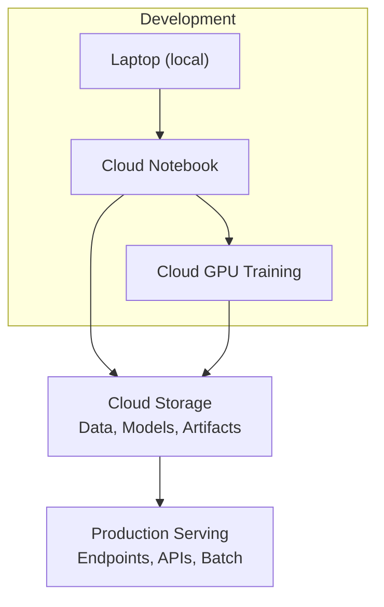
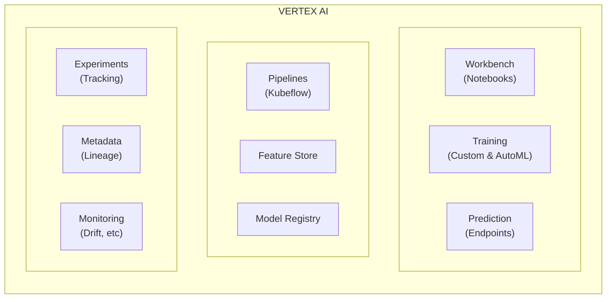
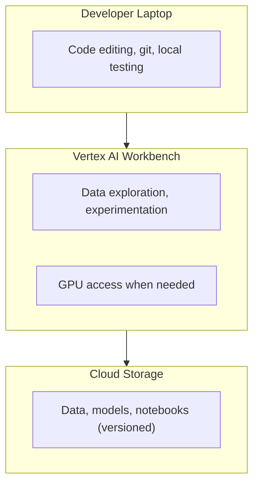
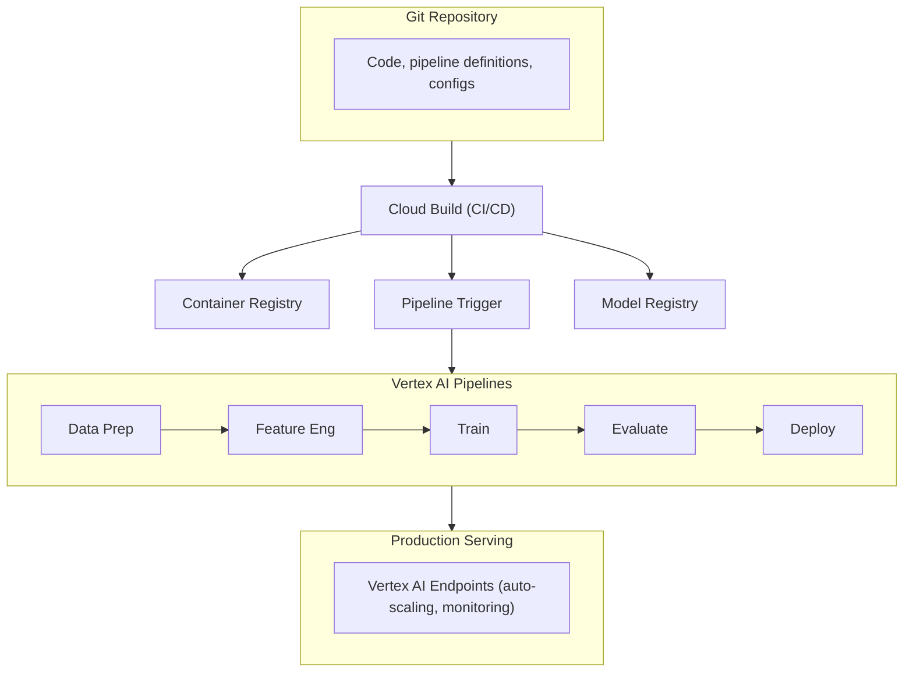
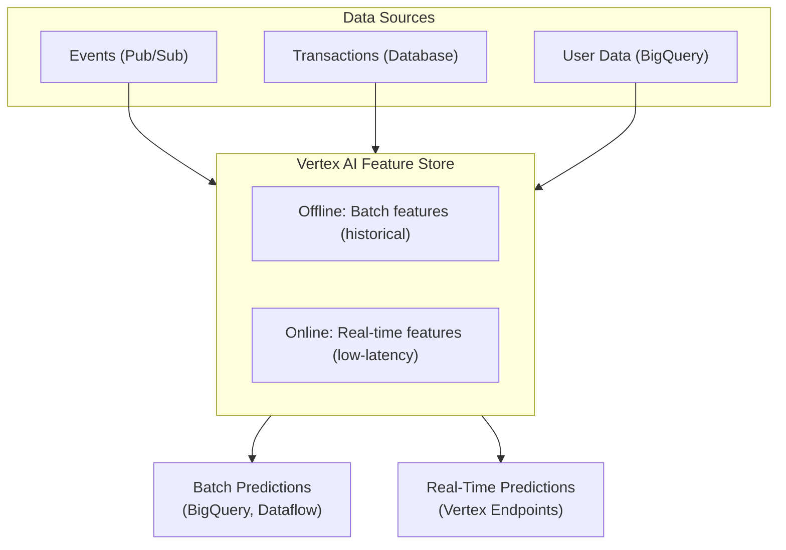
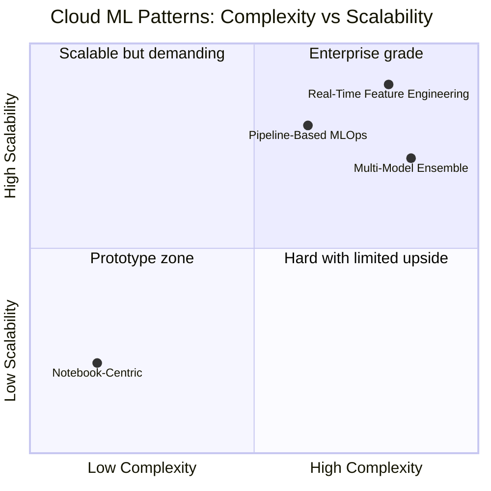
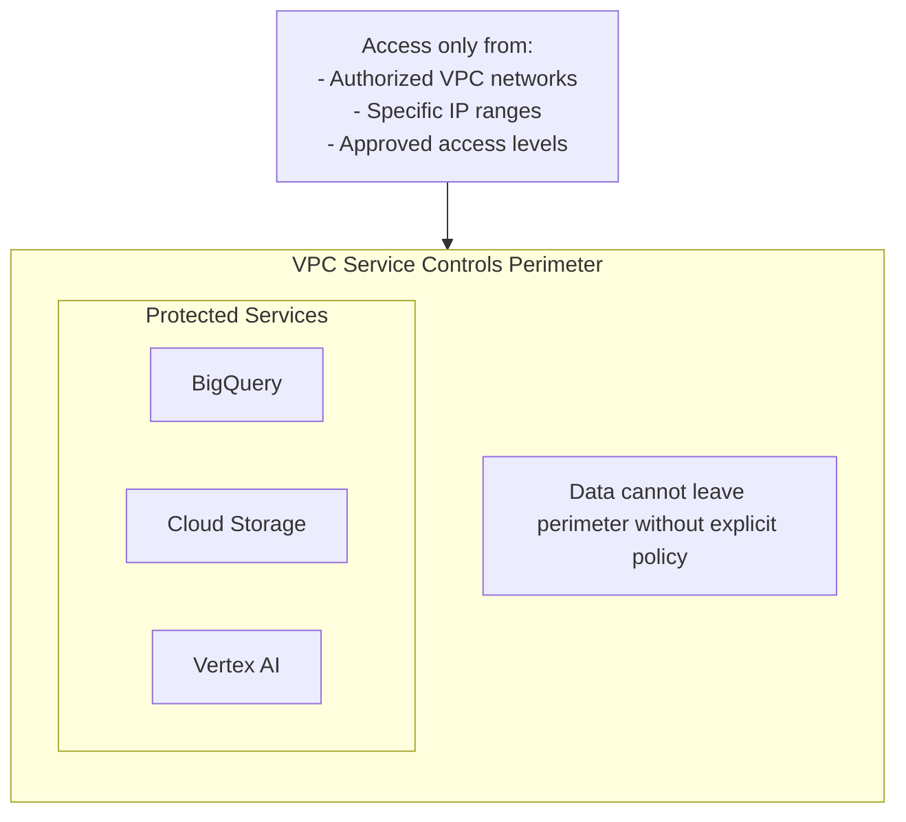
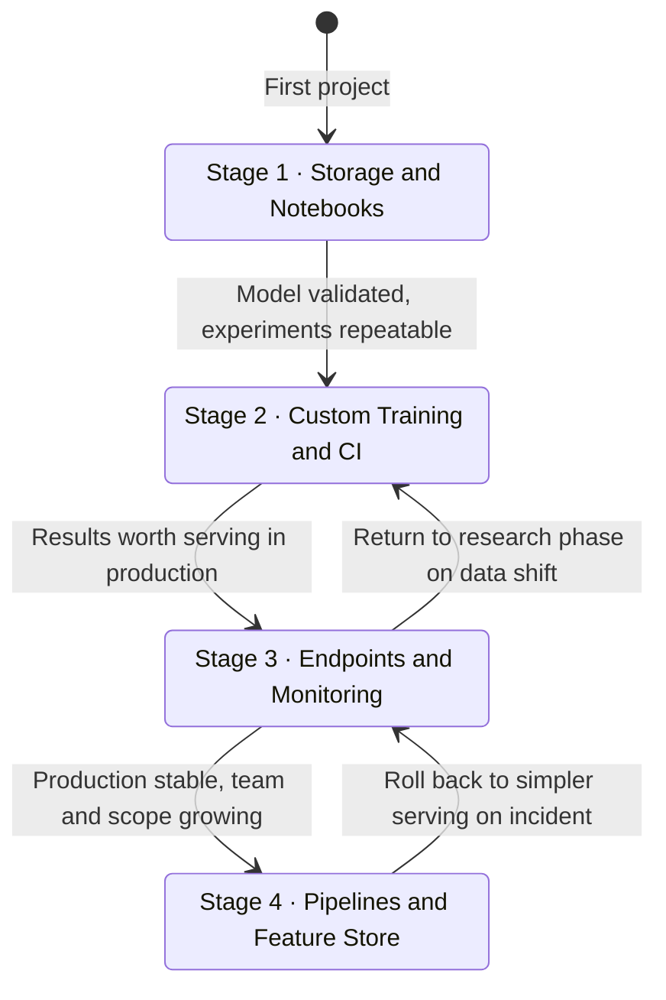

# Cloud Infrastructure for Machine Learning: From Local to Global Scale

## When Local Is Not Enough

There is a moment in every ML project when your laptop stops being sufficient. Maybe you need more GPU memory than your RTX card provides. Maybe training takes three days instead of three hours. Maybe your dataset no longer fits on a single disk. Maybe you need to serve predictions to thousands of users simultaneously.

This moment is not failure—it is success. Your project has grown beyond a prototype.

But the transition from local development to cloud infrastructure is fraught with risk. Stories of $50,000 surprise bills are not myths. Teams have shut down projects because cloud costs exceeded the value the ML system produced. The cloud amplifies both your capabilities and your mistakes.

This post is a guide to that transition. We will explore when cloud makes sense (and when it does not), map the landscape of cloud ML services, understand the cost structures that govern cloud pricing, and learn the architectural patterns that make ML systems both powerful and economical. The focus is on Google Cloud Platform, but with explicit mappings to AWS and Azure—because the concepts transfer, even when the service names differ.

This is the infrastructure knowledge that completes everything we have built in this series: the project structure, the Python expertise, the resource understanding, the model selection, the evaluation rigor. Now we scale it.

## The Cloud Decision Framework

### When to Stay Local

Cloud is not always the answer. Local development remains superior for:

| Scenario | Why Local |
|----------|-----------|
| Exploration and prototyping | Faster iteration, no cost per experiment |
| Small datasets (<10GB) | Fits in memory, no transfer needed |
| Quick training (<1 hour on laptop) | Cloud setup overhead exceeds time saved |
| Sensitive data with strict policies | Some data cannot leave premises |
| Continuous development | Avoiding constant upload/download cycles |
| Learning and experimentation | No risk of cost surprises |

### When Cloud Becomes Necessary

Cloud becomes essential when:

| Scenario | Why Cloud |
|----------|-----------|
| Training exceeds local GPU memory | Cloud offers 80GB+ VRAM (A100/H100) |
| Training takes days locally | Parallel training, faster GPUs |
| Need multiple experiments simultaneously | Horizontal scaling |
| Production inference at scale | Auto-scaling, global distribution |
| Team collaboration | Shared environments, reproducibility |
| Large datasets (100GB+) | Cloud storage is effectively infinite |
| Compliance requirements | Enterprise security, certifications |

### The Hybrid Reality

Most mature ML teams operate in hybrid mode:
- **Development**: Local machines or cloud notebooks
- **Training**: Cloud GPUs when local is insufficient
- **Data storage**: Cloud for large datasets, versioning
- **Production**: Cloud for serving at scale



## Cloud Provider Comparison: The Rosetta Stone

Understanding one cloud helps you understand all clouds. Here is the mapping:

### Core Compute Services

| Service Type | GCP | AWS | Azure |
|--------------|-----|-----|-------|
| Virtual Machines | Compute Engine | EC2 | Virtual Machines |
| Managed Kubernetes | GKE | EKS | AKS |
| Serverless Functions | Cloud Functions | Lambda | Azure Functions |
| Serverless Containers | Cloud Run | Fargate | Container Apps |
| GPU VMs | GPU VMs (A100, H100) | P4d, P5 instances | NC, ND series |

### ML-Specific Services

| Service Type | GCP | AWS | Azure |
|--------------|-----|-----|-------|
| ML Platform | Vertex AI | SageMaker | Azure ML |
| AutoML | Vertex AI AutoML | SageMaker Autopilot | Azure AutoML |
| Model Registry | Vertex AI Model Registry | SageMaker Model Registry | Azure ML Model Registry |
| Feature Store | Vertex AI Feature Store | SageMaker Feature Store | Azure ML Feature Store |
| Pipelines | Vertex AI Pipelines | SageMaker Pipelines | Azure ML Pipelines |
| Experiment Tracking | Vertex AI Experiments | SageMaker Experiments | MLflow on Azure |
| Model Monitoring | Vertex AI Model Monitoring | SageMaker Model Monitor | Azure ML Monitoring |

### Data Services

| Service Type | GCP | AWS | Azure |
|--------------|-----|-----|-------|
| Object Storage | Cloud Storage | S3 | Blob Storage |
| Data Warehouse | BigQuery | Redshift, Athena | Synapse Analytics |
| Data Lake | BigQuery, GCS | S3 + Glue | Data Lake Storage |
| Streaming | Pub/Sub, Dataflow | Kinesis | Event Hubs |
| ETL/ELT | Dataflow, Dataproc | Glue, EMR | Data Factory |

### Strengths by Provider

| Provider | Strengths | Best For |
|----------|-----------|----------|
| **GCP** | BigQuery (analytics), TPUs, Vertex AI integration, Kubernetes | Data-heavy ML, TensorFlow, analytics-driven teams |
| **AWS** | Mature ecosystem, market leader, broadest service selection | Enterprise, diverse workloads, existing AWS users |
| **Azure** | Microsoft integration, enterprise security, OpenAI partnership | Microsoft shops, enterprise compliance, GPT integration |

## GCP Deep Dive: The Essential Services

### Cloud Storage: Where Everything Lives

Cloud Storage is the foundation. Data, models, artifacts, logs—everything passes through storage.

**Storage Classes:**

| Class | Use Case | Price (per GB/month) | Retrieval Cost |
|-------|----------|---------------------|----------------|
| Standard | Frequent access | ~$0.020 | None |
| Nearline | Monthly access | ~$0.010 | Per-retrieval |
| Coldline | Quarterly access | ~$0.004 | Higher retrieval |
| Archive | Yearly access | ~$0.0012 | Highest retrieval |

```python
from google.cloud import storage

def upload_model_to_gcs(local_path: str, bucket_name: str, destination_blob: str):
    """Upload a model file to Cloud Storage."""
    client = storage.Client()
    bucket = client.bucket(bucket_name)
    blob = bucket.blob(destination_blob)
    
    blob.upload_from_filename(local_path)
    
    return f"gs://{bucket_name}/{destination_blob}"

def download_model_from_gcs(bucket_name: str, source_blob: str, local_path: str):
    """Download a model from Cloud Storage."""
    client = storage.Client()
    bucket = client.bucket(bucket_name)
    blob = bucket.blob(source_blob)
    
    blob.download_to_filename(local_path)

# Usage
model_uri = upload_model_to_gcs(
    "models/classifier.pt",
    "my-ml-project-models",
    "production/classifier/v1.0/model.pt"
)
```

**Recommended bucket structure:**

```
gs://project-name-ml/
├── data/
│   ├── raw/
│   ├── processed/
│   └── features/
├── models/
│   ├── experiments/
│   │   └── {experiment_id}/
│   └── production/
│       └── {model_name}/{version}/
├── artifacts/
│   ├── metrics/
│   └── visualizations/
└── pipelines/
    └── {pipeline_name}/{run_id}/
```

### BigQuery: Data Warehouse and ML in SQL

BigQuery is not just a data warehouse—it is an ML platform for tabular data.

**BigQuery ML allows training models with SQL:**

```sql
-- Create a classification model
CREATE OR REPLACE MODEL `project.dataset.customer_churn_model`
OPTIONS(
  model_type='LOGISTIC_REG',
  input_label_cols=['churned'],
  enable_global_explain=TRUE
) AS
SELECT
  customer_id,
  tenure_months,
  monthly_charges,
  total_charges,
  contract_type,
  payment_method,
  churned
FROM `project.dataset.customer_data`
WHERE _PARTITIONDATE BETWEEN '2024-01-01' AND '2024-12-31';

-- Evaluate the model
SELECT *
FROM ML.EVALUATE(MODEL `project.dataset.customer_churn_model`);

-- Make predictions
SELECT
  customer_id,
  predicted_churned,
  predicted_churned_probs
FROM ML.PREDICT(
  MODEL `project.dataset.customer_churn_model`,
  (SELECT * FROM `project.dataset.new_customers`)
);

-- Explain predictions
SELECT *
FROM ML.EXPLAIN_PREDICT(
  MODEL `project.dataset.customer_churn_model`,
  (SELECT * FROM `project.dataset.sample_customers`),
  STRUCT(3 AS top_k_features)
);
```

**BigQuery ML supported models:**

| Model Type | SQL Option | Use Case |
|------------|------------|----------|
| Linear Regression | LINEAR_REG | Continuous prediction |
| Logistic Regression | LOGISTIC_REG | Binary/multiclass |
| K-Means | KMEANS | Clustering |
| Matrix Factorization | MATRIX_FACTORIZATION | Recommendations |
| XGBoost | BOOSTED_TREE_CLASSIFIER/REGRESSOR | Tabular ML |
| Deep Neural Network | DNN_CLASSIFIER/REGRESSOR | Complex patterns |
| AutoML Tables | AUTOML_CLASSIFIER/REGRESSOR | Automated model selection |
| Time Series | ARIMA_PLUS | Forecasting |
| Imported TensorFlow | TENSORFLOW | Custom models |

**When to use BigQuery ML vs Vertex AI:**

| Scenario | BigQuery ML | Vertex AI |
|----------|-------------|-----------|
| Data already in BigQuery | Preferred | Requires export |
| Tabular data, standard models | Excellent | Overkill |
| Custom architectures | Limited | Full flexibility |
| Deep learning | Basic support | Full support |
| Unstructured data (images, text) | Not supported | Preferred |
| Real-time inference | Limited | Designed for this |
| Team knows SQL but not Python | Preferred | Requires Python |

### Vertex AI: The Unified ML Platform

Vertex AI consolidates Google's ML offerings into a single platform.

**Core Components:**



**Custom Training Job:**

```python
from google.cloud import aiplatform

def run_training_job(
    project: str,
    location: str,
    display_name: str,
    container_uri: str,
    model_serving_container: str,
    staging_bucket: str,
    args: list = None,
):
    """Run a custom training job on Vertex AI."""
    
    aiplatform.init(project=project, location=location, staging_bucket=staging_bucket)
    
    job = aiplatform.CustomContainerTrainingJob(
        display_name=display_name,
        container_uri=container_uri,
        model_serving_container_image_uri=model_serving_container,
    )
    
    model = job.run(
        replica_count=1,
        machine_type="n1-standard-8",
        accelerator_type="NVIDIA_TESLA_T4",
        accelerator_count=1,
        args=args,
    )
    
    return model

# Example usage
model = run_training_job(
    project="my-project",
    location="us-central1",
    display_name="my-training-job",
    container_uri="gcr.io/my-project/training:latest",
    model_serving_container="gcr.io/my-project/serving:latest",
    staging_bucket="gs://my-staging-bucket",
    args=["--epochs", "10", "--learning-rate", "0.001"],
)
```

**Deploying a Model to an Endpoint:**

```python
from google.cloud import aiplatform

def deploy_model(
    project: str,
    location: str,
    model_name: str,
    endpoint_name: str,
    machine_type: str = "n1-standard-4",
    min_replicas: int = 1,
    max_replicas: int = 5,
):
    """Deploy a model to a Vertex AI endpoint."""
    
    aiplatform.init(project=project, location=location)
    
    # Get or create endpoint
    endpoints = aiplatform.Endpoint.list(
        filter=f'display_name="{endpoint_name}"'
    )
    
    if endpoints:
        endpoint = endpoints[0]
    else:
        endpoint = aiplatform.Endpoint.create(display_name=endpoint_name)
    
    # Get model
    models = aiplatform.Model.list(filter=f'display_name="{model_name}"')
    if not models:
        raise ValueError(f"Model {model_name} not found")
    model = models[0]
    
    # Deploy
    model.deploy(
        endpoint=endpoint,
        machine_type=machine_type,
        min_replica_count=min_replicas,
        max_replica_count=max_replicas,
        traffic_percentage=100,
        sync=True,
    )
    
    return endpoint

# Make predictions
def predict(endpoint, instances: list):
    """Make predictions using a deployed endpoint."""
    response = endpoint.predict(instances=instances)
    return response.predictions
```

### Vertex AI Pipelines: Reproducible Workflows

Pipelines define the entire ML workflow as code:

```python
from kfp import dsl
from kfp.dsl import component, pipeline, Output, Model, Dataset
from google.cloud import aiplatform

@component(
    base_image="python:3.10",
    packages_to_install=["pandas", "scikit-learn", "google-cloud-storage"]
)
def prepare_data(
    input_path: str,
    output_dataset: Output[Dataset],
):
    """Load and prepare data."""
    import pandas as pd
    from sklearn.model_selection import train_test_split
    
    df = pd.read_csv(input_path)
    # Preprocessing...
    train, test = train_test_split(df, test_size=0.2)
    
    train.to_csv(output_dataset.path + "_train.csv", index=False)
    test.to_csv(output_dataset.path + "_test.csv", index=False)

@component(
    base_image="python:3.10",
    packages_to_install=["pandas", "scikit-learn", "joblib"]
)
def train_model(
    dataset: Dataset,
    output_model: Output[Model],
):
    """Train a model."""
    import pandas as pd
    from sklearn.ensemble import RandomForestClassifier
    import joblib
    
    train = pd.read_csv(dataset.path + "_train.csv")
    X = train.drop("target", axis=1)
    y = train["target"]
    
    model = RandomForestClassifier(n_estimators=100)
    model.fit(X, y)
    
    joblib.dump(model, output_model.path + ".joblib")

@component(
    base_image="python:3.10",
    packages_to_install=["pandas", "scikit-learn", "joblib"]
)
def evaluate_model(
    model: Model,
    dataset: Dataset,
) -> float:
    """Evaluate the model."""
    import pandas as pd
    from sklearn.metrics import accuracy_score
    import joblib
    
    test = pd.read_csv(dataset.path + "_test.csv")
    X = test.drop("target", axis=1)
    y = test["target"]
    
    clf = joblib.load(model.path + ".joblib")
    predictions = clf.predict(X)
    
    return accuracy_score(y, predictions)

@pipeline(
    name="training-pipeline",
    description="End-to-end training pipeline"
)
def training_pipeline(input_data_path: str):
    prepare_task = prepare_data(input_path=input_data_path)
    train_task = train_model(dataset=prepare_task.outputs["output_dataset"])
    evaluate_task = evaluate_model(
        model=train_task.outputs["output_model"],
        dataset=prepare_task.outputs["output_dataset"],
    )

# Compile and run
from kfp import compiler

compiler.Compiler().compile(
    training_pipeline,
    "pipeline.yaml"
)

# Submit to Vertex AI
job = aiplatform.PipelineJob(
    display_name="my-training-pipeline",
    template_path="pipeline.yaml",
    parameter_values={"input_data_path": "gs://my-bucket/data.csv"},
)
job.run()
```

### Artifact Registry: Container and Model Storage

Artifact Registry stores Docker containers and ML models:

```bash
# Configure Docker for Artifact Registry
gcloud auth configure-docker us-central1-docker.pkg.dev

# Build and push training container
docker build -t us-central1-docker.pkg.dev/PROJECT/ml-images/training:v1 .
docker push us-central1-docker.pkg.dev/PROJECT/ml-images/training:v1

# Build and push serving container
docker build -f Dockerfile.serving \
  -t us-central1-docker.pkg.dev/PROJECT/ml-images/serving:v1 .
docker push us-central1-docker.pkg.dev/PROJECT/ml-images/serving:v1
```

## Cost Management: The Make-or-Break Factor

### Understanding Cloud Pricing

Cloud costs come from:

1. **Compute**: VMs, GPUs, TPUs (hourly)
2. **Storage**: Data at rest (per GB/month)
3. **Network**: Data transfer (egress charges)
4. **Services**: Managed services (per use or per hour)

**GPU Pricing Comparison (approximate, 2025):**

| GPU | GCP (per hour) | AWS (per hour) | Azure (per hour) |
|-----|----------------|----------------|------------------|
| T4 | $0.35 | $0.53 | $0.45 |
| V100 | $2.48 | $3.06 | $3.06 |
| A100 40GB | $3.67 | $4.10 | $3.67 |
| A100 80GB | $4.00 | $5.12 | $4.00 |
| H100 | $8.00+ | $12.00+ | $10.00+ |

*Prices vary by region and change frequently. Always check current pricing.*

### Cost Optimization Strategies

**1. Use Preemptible/Spot Instances**

Preemptible VMs cost 60-91% less but can be terminated with 30 seconds notice.

```python
# Vertex AI training with preemptible
job = aiplatform.CustomTrainingJob(
    display_name="preemptible-training",
    script_path="train.py",
    container_uri="gcr.io/cloud-aiplatform/training/pytorch-gpu:latest",
)

job.run(
    replica_count=1,
    machine_type="n1-standard-8",
    accelerator_type="NVIDIA_TESLA_T4",
    accelerator_count=1,
    # Use preemptible VMs
    boot_disk_type="pd-ssd",
    boot_disk_size_gb=100,
    reduction_server_replica_count=0,
)
```

**2. Right-size Your Resources**

```python
# Start small, scale up if needed
MACHINE_TIERS = [
    {"type": "n1-standard-4", "gpu": "T4", "gpu_count": 1},
    {"type": "n1-standard-8", "gpu": "T4", "gpu_count": 2},
    {"type": "a2-highgpu-1g", "gpu": "A100", "gpu_count": 1},
    {"type": "a2-highgpu-2g", "gpu": "A100", "gpu_count": 2},
]

def estimate_resources(model_size_gb: float, dataset_size_gb: float) -> dict:
    """Estimate required resources based on model and data size."""
    
    # Rough heuristics
    required_vram = model_size_gb * 4  # Training multiplier
    
    for tier in MACHINE_TIERS:
        vram = get_gpu_vram(tier["gpu"]) * tier["gpu_count"]
        if vram >= required_vram:
            return tier
    
    return MACHINE_TIERS[-1]  # Largest available
```

**3. Use Lifecycle Policies for Storage**

```python
from google.cloud import storage

def set_lifecycle_policy(bucket_name: str):
    """Set lifecycle policy to move old data to cheaper storage."""
    
    client = storage.Client()
    bucket = client.get_bucket(bucket_name)
    
    bucket.lifecycle_rules = [
        # Move to nearline after 30 days
        {
            "action": {"type": "SetStorageClass", "storageClass": "NEARLINE"},
            "condition": {"age": 30, "matchesPrefix": ["experiments/"]}
        },
        # Move to coldline after 90 days
        {
            "action": {"type": "SetStorageClass", "storageClass": "COLDLINE"},
            "condition": {"age": 90, "matchesPrefix": ["experiments/"]}
        },
        # Delete after 365 days
        {
            "action": {"type": "Delete"},
            "condition": {"age": 365, "matchesPrefix": ["experiments/"]}
        },
    ]
    
    bucket.patch()
```

**4. Set Budget Alerts**

```python
from google.cloud import billing_budgets_v1

def create_budget_alert(
    project_id: str,
    billing_account: str,
    budget_amount: float,
    alert_thresholds: list = [0.5, 0.8, 1.0],
):
    """Create a budget alert to prevent cost overruns."""
    
    client = billing_budgets_v1.BudgetServiceClient()
    
    budget = billing_budgets_v1.Budget(
        display_name=f"{project_id}-ml-budget",
        budget_filter=billing_budgets_v1.Filter(
            projects=[f"projects/{project_id}"],
        ),
        amount=billing_budgets_v1.BudgetAmount(
            specified_amount={"units": int(budget_amount), "currency_code": "USD"}
        ),
        threshold_rules=[
            billing_budgets_v1.ThresholdRule(
                threshold_percent=threshold,
                spend_basis=billing_budgets_v1.ThresholdRule.Basis.CURRENT_SPEND,
            )
            for threshold in alert_thresholds
        ],
    )
    
    parent = f"billingAccounts/{billing_account}"
    created_budget = client.create_budget(parent=parent, budget=budget)
    
    return created_budget
```

**5. Auto-shutdown Idle Resources**

```python
# Cloud Function to stop idle notebooks
import functions_framework
from google.cloud import notebooks_v1

@functions_framework.cloud_event
def stop_idle_notebooks(cloud_event):
    """Stop Vertex AI Workbench notebooks that have been idle."""
    
    client = notebooks_v1.NotebookServiceClient()
    
    # List all instances
    parent = f"projects/{PROJECT}/locations/{LOCATION}"
    instances = client.list_instances(parent=parent)
    
    for instance in instances:
        # Check if instance is idle (implement your logic)
        if is_instance_idle(instance):
            client.stop_instance(name=instance.name)
            print(f"Stopped idle instance: {instance.name}")
```

### Cost Estimation Before Running

Always estimate costs before starting large jobs:

```python
def estimate_training_cost(
    hours: float,
    machine_type: str,
    gpu_type: str = None,
    gpu_count: int = 0,
    storage_gb: float = 100,
) -> dict:
    """Estimate training job cost."""
    
    # Approximate hourly rates (check current pricing)
    MACHINE_RATES = {
        "n1-standard-4": 0.19,
        "n1-standard-8": 0.38,
        "n1-standard-16": 0.76,
        "a2-highgpu-1g": 3.67,  # Includes A100
    }
    
    GPU_RATES = {
        "NVIDIA_TESLA_T4": 0.35,
        "NVIDIA_TESLA_V100": 2.48,
        "NVIDIA_TESLA_A100": 0,  # Included in a2 machine
    }
    
    STORAGE_RATE = 0.020 / 720  # Per GB per hour
    
    compute_cost = MACHINE_RATES.get(machine_type, 0.50) * hours
    gpu_cost = GPU_RATES.get(gpu_type, 0) * gpu_count * hours
    storage_cost = storage_gb * STORAGE_RATE * hours
    
    total = compute_cost + gpu_cost + storage_cost
    
    return {
        "compute": compute_cost,
        "gpu": gpu_cost,
        "storage": storage_cost,
        "total": total,
        "note": "Estimates only. Check console for actual pricing."
    }

# Example
cost = estimate_training_cost(
    hours=24,
    machine_type="n1-standard-8",
    gpu_type="NVIDIA_TESLA_T4",
    gpu_count=2,
    storage_gb=500
)
print(f"Estimated 24-hour training cost: ${cost['total']:.2f}")
```

## Architecture Patterns for ML in the Cloud

### Pattern 1: Notebook-Centric Development

Best for: Exploration, small teams, early-stage projects



### Pattern 2: Pipeline-Based MLOps

Best for: Production systems, larger teams, reproducibility requirements



### Pattern 3: Real-Time Feature Engineering

Best for: Recommendation systems, fraud detection, personalization



### Pattern 4: Multi-Model Ensemble

Best for: Complex decisions, risk-averse applications

```mermaid
flowchart TB
    API["API Gateway"] --> ORCH["Orchestration Layer<br/>(Cloud Run / Cloud Functions)"]
    
    ORCH --> MA["Model A<br/>Fraud Score"]
    ORCH --> MB["Model B<br/>Risk Score"]
    ORCH --> MC["Model C<br/>Anomaly"]
    
    MA --> ENSEMBLE["Ensemble Logic<br/>(Weighted voting, stacking)"]
    MB --> ENSEMBLE
    MC --> ENSEMBLE
    
    ENSEMBLE --> DECISION["Final Decision"]
```



The four patterns span a wide range of operational complexity. The quadrant below maps them by how complex they are to build and maintain versus how far they can scale—helping you match a pattern to your team's current maturity.



## Security and Compliance

### IAM: Who Can Do What

```python
# Minimal IAM roles for ML workflows

# Data Scientist
DATA_SCIENTIST_ROLES = [
    "roles/aiplatform.user",  # Use Vertex AI
    "roles/storage.objectViewer",  # Read data
    "roles/storage.objectCreator",  # Write results
    "roles/bigquery.dataViewer",  # Query data
]

# ML Engineer
ML_ENGINEER_ROLES = [
    "roles/aiplatform.admin",  # Full Vertex AI access
    "roles/storage.admin",  # Manage storage
    "roles/artifactregistry.admin",  # Push containers
    "roles/cloudbuild.builds.editor",  # Run builds
]

# Service Account for Pipelines
PIPELINE_SA_ROLES = [
    "roles/aiplatform.user",
    "roles/storage.objectAdmin",
    "roles/bigquery.dataEditor",
    "roles/artifactregistry.reader",
]
```

### VPC Service Controls

For sensitive data, restrict API access to within your network:



### Data Encryption

```python
# Client-side encryption for sensitive models
from google.cloud import kms
from google.cloud import storage
import base64

def encrypt_and_upload(
    data: bytes,
    bucket_name: str,
    blob_name: str,
    key_name: str,  # projects/PROJECT/locations/LOCATION/keyRings/RING/cryptoKeys/KEY
):
    """Encrypt data before uploading to Cloud Storage."""
    
    kms_client = kms.KeyManagementServiceClient()
    
    # Encrypt with Cloud KMS
    encrypt_response = kms_client.encrypt(
        request={
            "name": key_name,
            "plaintext": data,
        }
    )
    
    encrypted_data = encrypt_response.ciphertext
    
    # Upload encrypted data
    storage_client = storage.Client()
    bucket = storage_client.bucket(bucket_name)
    blob = bucket.blob(blob_name)
    blob.upload_from_string(encrypted_data)
    
    return f"gs://{bucket_name}/{blob_name}"
```

## The Progression Path: From Simple to Sophisticated

### Stage 1: Getting Started

**Timeline**: First project, 1-4 weeks

**Services to use:**
- Cloud Storage (data and models)
- Vertex AI Workbench (notebooks with GPU)
- BigQuery (data analysis)

**What to skip for now:**
- Pipelines (overkill for exploration)
- Feature Store (premature optimization)
- Complex IAM (use default service accounts)

```bash
# Quick start commands
gcloud auth login
gcloud config set project YOUR_PROJECT

# Create a bucket for data
gsutil mb gs://YOUR_PROJECT-ml-data

# Upload your data
gsutil cp data/*.csv gs://YOUR_PROJECT-ml-data/raw/

# Create a notebook instance
gcloud notebooks instances create my-notebook \
  --location=us-central1-a \
  --machine-type=n1-standard-4 \
  --accelerator-type=NVIDIA_TESLA_T4 \
  --accelerator-core-count=1
```

### Stage 2: Training at Scale

**Timeline**: Model development, 1-3 months

**Add:**
- Custom training jobs (for large experiments)
- Artifact Registry (container storage)
- Cloud Build (CI for containers)

```bash
# Build and push training container
gcloud builds submit --tag gcr.io/YOUR_PROJECT/training:v1

# Run training job
gcloud ai custom-jobs create \
  --region=us-central1 \
  --display-name=my-training \
  --config=training_config.yaml
```

### Stage 3: Production Deployment

**Timeline**: Going live, 1-2 months

**Add:**
- Vertex AI Endpoints (model serving)
- Model Registry (version control)
- Monitoring (performance tracking)

```python
# Deploy model
endpoint = aiplatform.Endpoint.create(display_name="production-endpoint")
model.deploy(endpoint=endpoint, machine_type="n1-standard-4")

# Set up monitoring
from google.cloud import aiplatform_v1beta1

model_monitoring_job = aiplatform_v1beta1.ModelMonitoringJobServiceClient()
# Configure drift detection, alerting, etc.
```

### Stage 4: MLOps Maturity

**Timeline**: Ongoing operations, 3+ months

**Add:**
- Vertex AI Pipelines (automated workflows)
- Feature Store (if real-time features needed)
- Experiment tracking (systematic optimization)

```python
# Full pipeline with automatic retraining triggers
@pipeline(name="production-ml-pipeline")
def ml_pipeline():
    data = load_data()
    features = engineer_features(data)
    model = train_model(features)
    metrics = evaluate_model(model, features)
    
    with dsl.Condition(metrics.outputs["accuracy"] > 0.95):
        deploy_model(model)
```

Each stage unlocks the next only when the previous one is stable—skip ahead and you pay with operational debt. The state diagram below shows the progression and the rollback path that every team eventually needs.



## Common Mistakes and How to Avoid Them

| Mistake | Consequence | Prevention |
|---------|-------------|------------|
| No budget alerts | Surprise bills | Set alerts at 50%, 80%, 100% |
| Running notebooks 24/7 | Wasted compute | Auto-shutdown, scheduled start/stop |
| Overprovisioning GPUs | Unnecessary cost | Start small, scale up |
| No lifecycle policies | Storage bloat | Archive/delete old data |
| Ignoring egress costs | Hidden charges | Keep processing near data |
| Hardcoded credentials | Security risk | Use service accounts, Secret Manager |
| No IAM planning | Access chaos | Principle of least privilege |
| Skipping staging | Production incidents | Always test in staging first |

## Quick Reference: GCP CLI Commands

```bash
# Authentication
gcloud auth login
gcloud auth application-default login  # For local development

# Project setup
gcloud config set project PROJECT_ID
gcloud config set compute/region us-central1

# Storage
gsutil mb gs://BUCKET_NAME
gsutil cp local_file gs://BUCKET/path/
gsutil ls gs://BUCKET/
gsutil rm gs://BUCKET/path/file

# Vertex AI
gcloud ai custom-jobs create --config=job.yaml
gcloud ai models list
gcloud ai endpoints list
gcloud ai endpoints predict ENDPOINT_ID --json-request=request.json

# BigQuery
bq mk DATASET
bq query --use_legacy_sql=false 'SELECT * FROM dataset.table'
bq load --source_format=CSV dataset.table gs://bucket/data.csv schema.json

# Notebooks
gcloud notebooks instances list
gcloud notebooks instances start INSTANCE
gcloud notebooks instances stop INSTANCE

# Artifact Registry
gcloud artifacts repositories create REPO --repository-format=docker
docker push REGION-docker.pkg.dev/PROJECT/REPO/IMAGE:TAG
```

---

## Summary

Cloud infrastructure transforms what is possible in ML—but only if used wisely.

The key principles:

1. **Start local, go cloud when necessary**. Cloud adds complexity and cost. Use it when the benefits exceed the overhead.

2. **Choose services based on needs, not hype**. BigQuery ML is simpler than Vertex AI. Notebooks are simpler than pipelines. Choose the right tool for your current stage.

3. **Cost awareness is not optional**. Set budgets, monitor spending, use preemptible instances, and clean up unused resources.

4. **Security is architecture**. Design IAM, encryption, and network controls from the beginning, not as an afterthought.

5. **The cloud providers are more similar than different**. Learn one deeply, and the others follow. GCP's Vertex AI maps to AWS SageMaker maps to Azure ML.

6. **Progress through stages**. Don't build MLOps infrastructure for your first model. Grow sophistication with your needs.

This post completes the infrastructure knowledge for modern ML systems. Combined with project structure, Python expertise, resource understanding, model selection, and evaluation rigor—you now have the complete toolkit to build ML systems that work at any scale.

Build something that matters.

---

## Going Deeper

**Books:**

- Huyen, C. (2022). *Designing Machine Learning Systems.* O'Reilly. — The best single book on ML infrastructure from an engineering perspective. Covers cloud deployment, data pipelines, feature stores, and monitoring with unusual clarity and practical honesty. Required reading for any ML engineer.

- Hapke, H., & Nelson, C. (2020). *Building Machine Learning Pipelines.* O'Reilly. — Focused specifically on TFX and Kubeflow but the conceptual framework applies to any pipeline system. Teaches you to think about ML systems as data pipelines, not models with wrappers.

- Gift, N., & Deza, A. (2021). *Practical MLOps.* O'Reilly. — More hands-on than Huyen's book. Covers GCP, AWS, and Azure with real code examples. Good companion for engineers learning a specific cloud.

**Courses:**

- ["Full Stack Deep Learning"](https://fullstackdeeplearning.com/) — The most rigorous free course on production ML systems. Covers infrastructure, deployment, monitoring, and team organization. Lecture notes and videos are both excellent.

- ["MLOps Zoomcamp"](https://github.com/DataTalksClub/mlops-zoomcamp) by DataTalks.Club — A free, project-based course covering experiment tracking, deployment, monitoring, and workflow orchestration with real tools (MLflow, Prefect, Grafana).

**Online Resources:**

- [Google Cloud Architecture: MLOps](https://cloud.google.com/architecture/mlops-continuous-delivery-and-automation-pipelines-in-machine-learning) — Google's reference architecture for ML systems, from level 0 (manual) through level 2 (full CI/CD). The clearest description of MLOps maturity levels available.
- [AWS SageMaker Documentation](https://docs.aws.amazon.com/sagemaker/) — Well-structured guides with end-to-end examples.
- [Practitioners Guide to MLOps (Google Whitepaper)](https://services.google.com/fh/files/misc/practitioners_guide_to_mlops_whitepaper.pdf) — A practical, 50-page guide from Google Cloud. Dense with useful patterns.

**Key Papers:**

- Sculley, D., et al. (2015). ["Hidden Technical Debt in Machine Learning Systems."](https://papers.nips.cc/paper_files/paper/2015/hash/86df7dcfd896fcaf2674f757a2463eba-Abstract.html) *NeurIPS 2015*. — The paper that coined the term "technical debt" for ML systems. The dependency problems it describes are the reason cloud ML platforms exist.

- Sato, D., Wider, A., & Windheuser, C. (2019). ["Continuous Delivery for Machine Learning."](https://martinfowler.com/articles/cd4ml.html) *Martin Fowler's blog*. — The article that popularized CD4ML as a discipline. Explains the difference between CI/CD for software and CI/CD for ML.

**Questions to Explore:**

When does managed infrastructure like Vertex AI or SageMaker start costing more than it saves? What is the cost model of cloud GPUs for training, and how do spot/preemptible instances change that calculation? What are the failure modes of a pipeline that works in development but fails silently in production?

