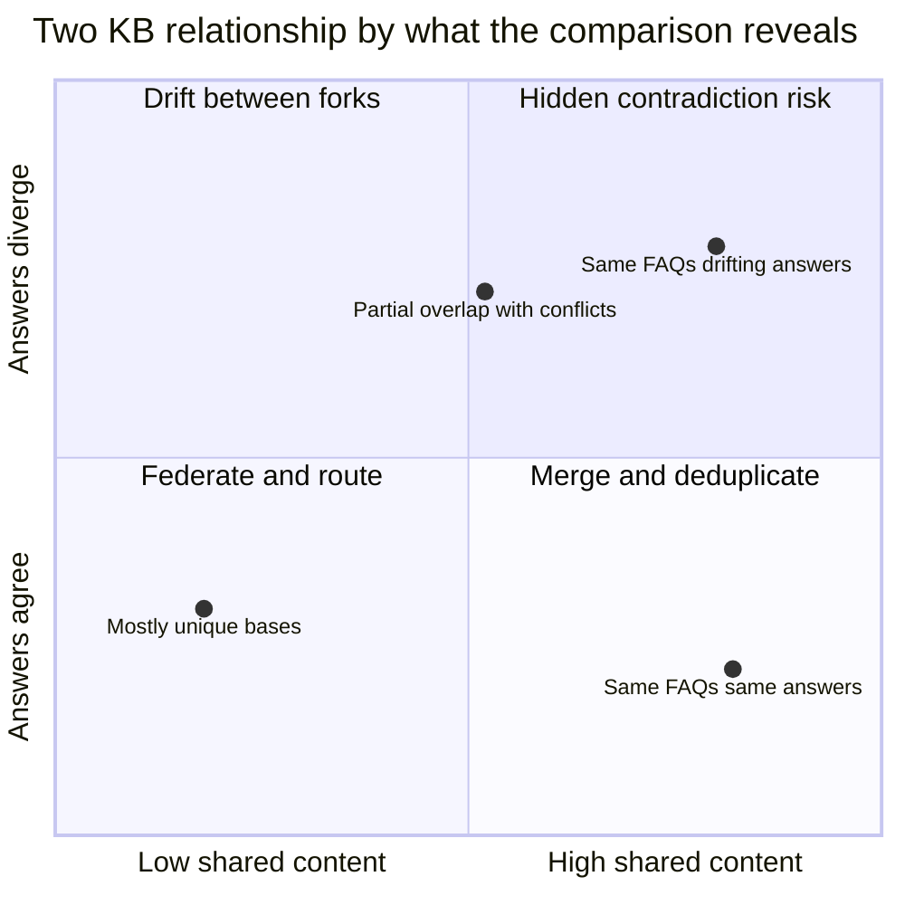
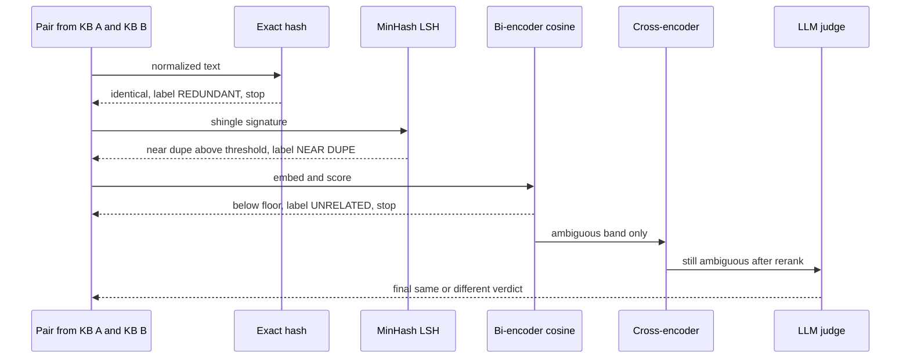
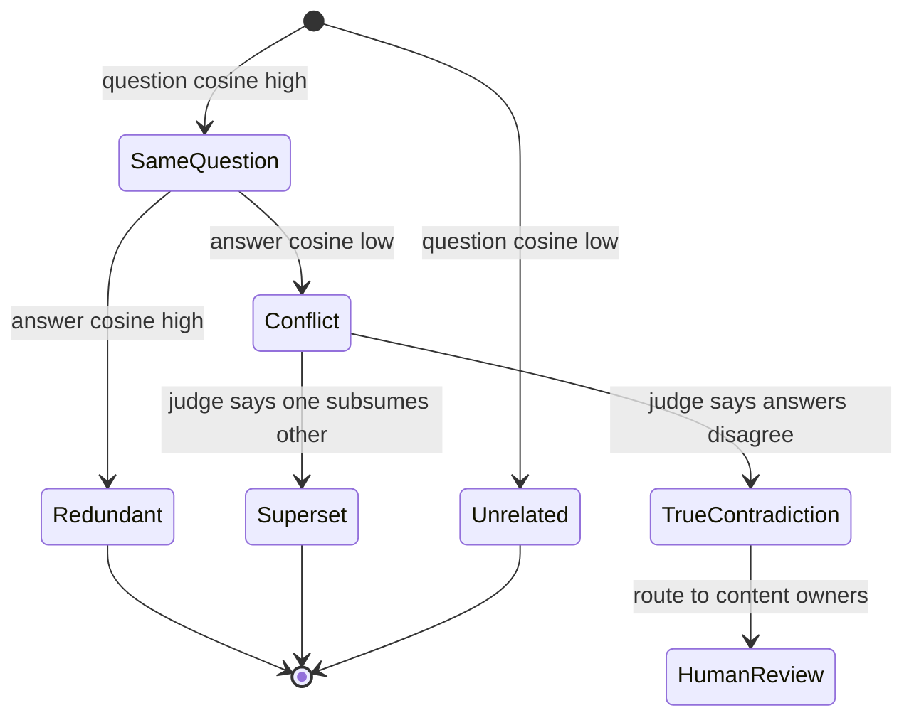
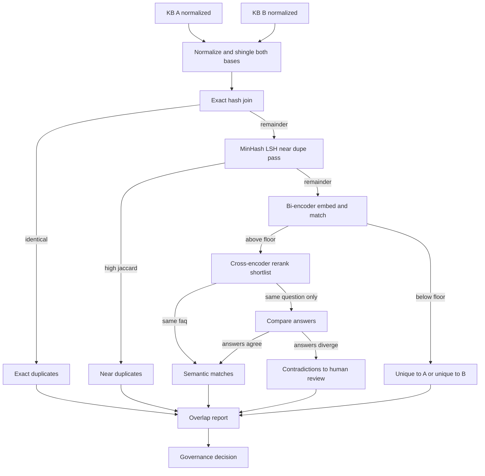

# Comparing Knowledge Bases: Detecting Semantic and Textual Overlap Between Knowledge Products

The kickoff meeting had two people in it who had never met, and both of them owned the company's knowledge base.

One ran the contact-center FAQ: a spreadsheet, four hundred rows, question in column A, approved answer in column B, last touched whenever a regulation changed. The other ran the "digital assistant" knowledge base: the same kind of content, vectorized, sitting behind a chat widget on the public site, maintained by a different team in a different building under a different budget line. Neither knew the other existed until a director noticed that the website and the call center sometimes gave customers different answers to the same question. The meeting existed to answer one deceptively simple question: are these two things the same knowledge base or not?

Nobody in the room could answer it. Not because they were unprepared, but because "are these the same" is not a yes-or-no question once you take it seriously. The two bases shared some FAQs verbatim. They shared more FAQs in spirit but with different wording. They each had content the other lacked. And — the finding that eventually justified the whole project — they contained perhaps thirty questions that were obviously the same question with materially different answers, which is to say the company had been telling customers two different things and calling both of them policy.

This post is about how you actually measure that. Given two knowledge bases, how do you rigorously study whether they share information, whether they are semantically talking about the same things, whether they literally contain the same FAQs, and whether they should be merged, federated, or kept apart. The bulk of it is the comparison machinery: lexical overlap, semantic overlap, corpus-level alignment, and contradiction detection. But to motivate why a knowledge base is even a thing you can compare, I have to start with what a knowledge base usually *is*, which is far humbler than the architecture diagrams suggest.

## The Most Common Knowledge Base Is a Spreadsheet

Forget the graph. Forget, for a moment, the vector index. In the overwhelming majority of large organizations, the most widely deployed, most operationally load-bearing knowledge base is an Excel file of frequently asked questions: a flat list of question and answer pairs, owned by a team that answers customers, maintained by hand. It is unglamorous and it works, which is exactly why it proliferates. Every team that touches customers eventually grows one. That is how you end up with several.

The [knowledge as a product](https://juanlara18.github.io/portfolio/#/blog/knowledge-as-a-product) post argues that knowledge should be treated as an owned, versioned, discoverable artifact rather than a heap of documents. An FAQ spreadsheet is the most primitive possible instance of that idea, and it is worth seeing the FAQ as the starting rung of a ladder, because each rung makes the comparison problem we care about both more tractable and more necessary.

**Rung one, clean and normalize.** The raw spreadsheet has duplicate rows, inconsistent casing, trailing whitespace, near-identical questions phrased three ways, and answers that contradict each other because two agents edited them in different quarters. Before a spreadsheet is a knowledge base it is a cleanup job. The [knowledge base curation](https://juanlara18.github.io/portfolio/#/blog/knowledge-base-curation) post is the full lifecycle for this: triage, deduplication, freshness pruning, quality gates. Notice that step one of building a *single* KB is already an intra-base version of the comparison problem.

**Rung two, vectorize.** Embed each FAQ so you can retrieve by meaning rather than keyword. Now "how do I reset my password" finds the row titled "I forgot my login credentials." This is the move that turns a lookup table into a retrieval system, and the [vector databases post](https://juanlara18.github.io/portfolio/#/blog/vector-databases-indexes-to-vertex-search) covers the index internals, so I will not re-explain HNSW here. The relevant point is that vectorization gives every FAQ a coordinate in a semantic space, and coordinates are comparable across bases.

**Rung three, structure.** Add fields. Category, product line, jurisdiction, effective date, owner, source document. Now the FAQ has a schema, and the schema is itself a small ontology, however informal. The [ontologies post](https://juanlara18.github.io/portfolio/#/blog/ontologies-building-knowledge-bases) covers the formal version. Structure is what lets you say "these two bases both have a `jurisdiction` field but call it different things," which is a comparison at the schema level rather than the content level.

**Rung four, expose.** Wrap the structured, vectorized, curated base in a tool interface so agents and applications can query it the same way, with the same contract. In 2027 that interface is increasingly an MCP server, and the [MCP in production](https://juanlara18.github.io/portfolio/#/blog/mcp-production-enterprise) post covers what it takes to run one for real. Once a KB is exposed as a tool, it has become a *knowledge product*: a thing with a name, an owner, and an interface.

That is the ladder, and it is genuinely useful. But here is the institutional reality it conveniently ignores: organizations do not climb the ladder once. They climb it several times in parallel, in different buildings, and arrive at the top with two or three knowledge products that the business treats as separate and that may, underneath, be the same knowledge wearing different clothes.

## The Real Question: Do Two Knowledge Bases Overlap?

So now you have two knowledge products. Call them A and B. A is the call-center FAQ, recently promoted up the ladder. B is the website assistant's vectorized base. The business wants to know whether to keep funding both. To answer responsibly, you have to decompose "do they overlap" into questions that have actual answers.

There are four distinct findings you are hunting for, and conflating them is the most common analytical mistake.

- **Coverage.** What fraction of A's content is also represented in B, and vice versa. This is a set-membership question and it is asymmetric: A can be eighty percent covered by B while B is forty percent covered by A, because B is larger.
- **Redundancy.** Where the two bases say the *same thing*. Redundancy is the case for deduplication or merge. It sounds like good news but it is a cost: two teams maintaining the same answer means two answers that drift apart.
- **Contradiction.** Where the two bases address the same question but give *different answers*. This is usually the single most valuable output of the whole exercise, because it is invisible until you compare and expensive once a customer or regulator finds it first.
- **Uniqueness.** What each base has that the other lacks. This is the case for federation rather than merge: if A and B mostly cover different ground, you do not want one big base, you want a router that knows which to ask.



Every method that follows is a way of populating that quadrant with evidence. We climb from the cheapest and most literal comparison to the most expensive and most semantic, because the cheap methods dispatch the easy cases and leave fewer pairs for the expensive ones to judge. That ordering is not just pedagogy. It is the actual architecture of a working pipeline.

A note on units before we start. Throughout, the atomic thing being compared is an FAQ: a question plus its answer. Sometimes you compare questions to questions, sometimes answers to answers, and the difference between those two comparisons is where contradictions live. Keep them separate in your head and, later, in your code.

## Textual Overlap: Exact, Shingled, and Near-Duplicate Detection

Start with the comparison a skeptic cannot argue with: are these two strings literally the same. A surprising amount of cross-base overlap is exact, because content gets copied between teams by people pasting from email.

### Exact duplicates are a hash join

Normalize each FAQ to a canonical form, hash it, and group by hash. This is the same content-addressing idea the [content-addressable hashing](https://juanlara18.github.io/portfolio/#/blog/content-addressable-hash-as-engineering-tool) post builds a whole engineering practice on: identical content collides to an identical key, so duplicate detection becomes a dictionary lookup instead of a comparison.

```python
import hashlib
import re

def normalize(text: str) -> str:
    """Canonicalize so trivial differences don't defeat exact matching.

    Lowercase, collapse whitespace, strip punctuation that doesn't carry
    meaning in an FAQ. Tune this per corpus; over-normalizing (e.g. dropping
    digits) will silently merge FAQs that differ on a number that matters.
    """
    text = text.lower().strip()
    text = re.sub(r"\s+", " ", text)            # collapse runs of whitespace
    text = re.sub(r"[^\w\s]", "", text)         # drop punctuation
    return text

def content_hash(text: str) -> str:
    return hashlib.sha256(normalize(text).encode("utf-8")).hexdigest()

def exact_overlap(kb_a: list[dict], kb_b: list[dict]) -> list[tuple]:
    """Return (a_id, b_id) pairs whose normalized question text is identical."""
    index_b = {}
    for row in kb_b:
        index_b.setdefault(content_hash(row["question"]), []).append(row["id"])
    matches = []
    for row in kb_a:
        h = content_hash(row["question"])
        for b_id in index_b.get(h, []):
            matches.append((row["id"], b_id))
    return matches
```

This is O(n + m), it is exact, and it will find the copy-paste overlap immediately. What it will not find is the FAQ that says "How do I reset my password?" in A and "How can I reset my password?" in B. One word of difference and the hashes diverge completely. Hashing has no notion of *almost*.

### Shingling and Jaccard for near-duplicates

To get a notion of *almost*, represent each text not as one atom but as a set of overlapping fragments — *shingles*. A $k$-shingle is a contiguous window of $k$ tokens; the document becomes the set of all its shingles. Two near-identical questions share most of their shingles. The overlap of two sets is measured by the Jaccard similarity:

$$
J(A, B) = \frac{|A \cap B|}{|A \cup B|}
$$

Identical sets give $J = 1$; disjoint sets give $J = 0$. For "how do I reset my password" versus "how can I reset my password," word-level 2-shingles share most elements, so Jaccard lands high. The technique traces directly to Broder's 1997 work on document resemblance, which introduced both shingling and the hashing trick that makes it scale.

```python
def shingles(text: str, k: int = 2) -> set[str]:
    """Word-level k-shingles of normalized text."""
    tokens = normalize(text).split()
    if len(tokens) < k:
        return {" ".join(tokens)}
    return {" ".join(tokens[i:i + k]) for i in range(len(tokens) - k + 1)}

def jaccard(a: set, b: set) -> float:
    if not a and not b:
        return 1.0
    return len(a & b) / len(a | b)
```

So far so good — for small bases. The trouble is scale. Comparing every FAQ in A against every FAQ in B is $O(n \times m)$ Jaccard computations. For two bases of ten thousand FAQs each, that is a hundred million set comparisons, and that is before you consider that you also want to deduplicate *within* each base. Naive pairwise comparison does not survive contact with a real corpus. You need a way to avoid computing similarity for the overwhelming majority of pairs that are obviously unrelated.

### MinHash and LSH: only compare pairs that might match

MinHash and Locality-Sensitive Hashing solve the two halves of that problem.

**MinHash** compresses each shingle set into a short signature of fixed length while preserving Jaccard similarity in expectation. Apply many independent hash functions to a set; for each, keep the minimum hash value over the set's elements. The beautiful property is that the probability two sets produce the same minimum under a random permutation equals their Jaccard similarity:

$$
\Pr[\,h_{\min}(A) = h_{\min}(B)\,] = J(A, B)
$$

So if you compare the two signatures element-wise and count agreements, the fraction of agreeing positions estimates $J(A,B)$ — but now you are comparing two fixed-length integer vectors instead of two arbitrary-size sets.

**LSH** solves the other half: not having to look at every pair at all. Split each signature into $b$ bands of $r$ rows. Two items are *candidates* if they collide in at least one band. The probability that two items with Jaccard $s$ become candidates is

$$
P(s) = 1 - \left(1 - s^{r}\right)^{b}
$$

which is an S-curve: tune $b$ and $r$ to place the steep part of the curve at your target threshold, and near-duplicates land in the same bucket while unrelated pairs almost never do. You only run exact Jaccard on the candidate pairs LSH surfaces, which is a tiny fraction of all pairs. The `datasketch` library implements this directly.

```python
from datasketch import MinHash, MinHashLSH

def to_minhash(text: str, num_perm: int = 128) -> MinHash:
    """Build a MinHash signature from a text's shingle set."""
    m = MinHash(num_perm=num_perm)
    for sh in shingles(text, k=2):
        m.update(sh.encode("utf-8"))
    return m

def near_duplicate_pairs(kb_a, kb_b, threshold: float = 0.7, num_perm: int = 128):
    """Find cross-base near-duplicate questions in roughly linear time.

    LSH buckets candidate pairs; we confirm with the MinHash Jaccard estimate.
    `threshold` is the Jaccard level at which LSH considers two items similar;
    it sets where the S-curve turns, not a hard guarantee.
    """
    lsh = MinHashLSH(threshold=threshold, num_perm=num_perm)
    sig_a = {}
    # Index base A.
    for row in kb_a:
        m = to_minhash(row["question"], num_perm)
        sig_a[row["id"]] = m
        lsh.insert(f"A::{row['id']}", m)

    results = []
    # Query each B item against the index; only A items in a shared bucket return.
    for row in kb_b:
        m_b = to_minhash(row["question"], num_perm)
        for key in lsh.query(m_b):
            a_id = key.split("::", 1)[1]
            est = sig_a[a_id].jaccard(m_b)        # estimated Jaccard, cheap
            results.append({"a_id": a_id, "b_id": row["id"], "jaccard_est": est})
    return results
```

There is one more tool for the gap between "near-duplicate" and "semantically related": **edit distance**. Levenshtein distance counts the single-character insertions, deletions, and substitutions to turn one string into another, and it catches fuzzy matches that shingling can miss when texts are short — typos, pluralization, a transposed clause. It is $O(\text{len} \times \text{len})$ per pair, so you only run it on the candidate pairs LSH already surfaced, never across the full cross-product.

Lexical methods, taken together, catch everything that is *the same words, mostly in the same order*. What they cannot catch is "Can I get a refund after thirty days?" versus "What is your policy on returns outside the one-month window?" Those share almost no shingles and have a large edit distance, yet they are plainly the same FAQ. For that you need meaning.

| Method | Catches | Cost | Use when |
|---|---|---|---|
| Exact hash | Identical normalized text | O(n + m), trivial | Always, as the first pass |
| Shingling + Jaccard | Reworded, same vocabulary | O(n * m) naive, expensive | Small bases or after LSH filtering |
| MinHash + LSH | Near-duplicates at scale | Roughly O(n + m) | Large bases, the workhorse near-dupe pass |
| Edit distance | Typos, short fuzzy variants | O(len^2) per pair | Confirming LSH candidates on short text |
| Embeddings + cosine | Paraphrases, different vocabulary | One encode per item plus ANN | Anything lexical methods miss |
| Cross-encoder judge | Subtle same or not decisions | One model call per pair | Final adjudication on a shortlist |

## Semantic Overlap: Embeddings, Thresholds, and the Cross-Encoder Judge

Semantic comparison replaces "do these share words" with "do these mean the same thing." You encode each FAQ into a dense vector with a sentence embedding model and compare vectors by cosine similarity:

$$
\cos(\mathbf{u}, \mathbf{v}) = \frac{\mathbf{u} \cdot \mathbf{v}}{\lVert \mathbf{u} \rVert \, \lVert \mathbf{v} \rVert}
$$

Two paraphrases land close together regardless of shared vocabulary, which is exactly the gap lexical methods leave. This is the **bi-encoder** approach: each text is encoded *independently* into a vector, so you can embed both bases once and compare any pair with a cheap dot product. Independence is what makes it scale — and it is also what lets you reuse the vector index from rung two of the ladder.

```python
from sentence_transformers import SentenceTransformer
import numpy as np

# A bi-encoder: encodes each text independently into a comparable vector.
model = SentenceTransformer("all-MiniLM-L6-v2")

def embed(texts: list[str]) -> np.ndarray:
    # normalize_embeddings=True makes cosine similarity a plain dot product.
    return model.encode(texts, normalize_embeddings=True, convert_to_numpy=True)

def semantic_matches(kb_a, kb_b, threshold: float):
    """Match A->B by cosine of question embeddings above a calibrated threshold.

    `threshold` is the load-bearing parameter. It is NOT 0.5. Calibrate it.
    """
    emb_a = embed([r["question"] for r in kb_a])
    emb_b = embed([r["question"] for r in kb_b])
    sims = emb_a @ emb_b.T                          # cosine, since normalized

    matches = []
    for i, row_a in enumerate(kb_a):
        j = int(np.argmax(sims[i]))                 # best B match for this A
        score = float(sims[i, j])
        if score >= threshold:
            matches.append({"a_id": row_a["id"], "b_id": kb_b[j]["id"],
                            "cosine": score})
    return matches
```

### The threshold is the whole problem

The line `if score >= threshold` hides the single hardest question in semantic comparison: *what cosine value means "same FAQ"?* It is tempting to pick 0.8 because it feels high. That is guessing. The right answer is empirical and it depends on your embedding model, your domain, and your text length. A general rule that has cost people dearly: cosine similarities from modern embedding models are compressed into a narrow high band. Unrelated FAQs often sit at 0.3 to 0.5; genuinely identical ones at 0.85 to 0.95; the interesting, ambiguous middle is narrow and model-specific. There is no universal cutoff.

So you calibrate. Label a few hundred candidate pairs by hand — same FAQ or not — then choose the threshold that best separates them. Treat it as a binary classification problem and pick the operating point your business can live with, trading precision against recall the way the [ML metrics post](https://juanlara18.github.io/portfolio/#/blog/ml-metrics-evaluation-monitoring) lays out.

```python
import numpy as np

def calibrate_threshold(pairs: list[dict]) -> dict:
    """Given labeled pairs [{cosine, is_same(bool)}], pick a threshold.

    Sweep candidate cutoffs, report precision/recall/F1 at each, and return
    the threshold that maximizes F1. In practice, bias toward precision for a
    merge decision (a false merge corrupts the base) and toward recall when
    the goal is to surface every possible contradiction for human review.
    """
    cosines = np.array([p["cosine"] for p in pairs])
    labels = np.array([p["is_same"] for p in pairs], dtype=bool)
    best = {"threshold": 0.5, "f1": -1.0}
    for t in np.linspace(0.4, 0.95, 56):
        pred = cosines >= t
        tp = int((pred & labels).sum())
        fp = int((pred & ~labels).sum())
        fn = int((~pred & labels).sum())
        precision = tp / (tp + fp) if tp + fp else 0.0
        recall = tp / (tp + fn) if tp + fn else 0.0
        f1 = 2 * precision * recall / (precision + recall) if precision + recall else 0.0
        if f1 > best["f1"]:
            best = {"threshold": round(float(t), 3), "f1": round(f1, 3),
                    "precision": round(precision, 3), "recall": round(recall, 3)}
    return best
```

### Asymmetry: one answer can be a superset of another

Cosine is symmetric, but knowledge overlap often is not. Base A's answer might be a two-sentence summary; base B's answer to the same question might be three paragraphs that *contain* A's answer plus edge cases. They are not contradictory and not redundant — B subsumes A. Symmetric cosine flags them as "somewhat similar" and moves on, missing the real relationship. Detecting containment needs an asymmetric signal: does A's content appear *within* B's, which is closer to a textual entailment or natural-language-inference question than a similarity one. This is exactly why the next stage exists.

### The cross-encoder, and the LLM judge above it

A bi-encoder is fast but imprecise: it compresses each text to a vector before it ever sees the other text, so it can never reason about the specific interaction between them. A **cross-encoder** feeds *both* texts through the model together and outputs a single relevance or similarity score. It cannot pre-index — you must run it per pair, which is far too expensive across the full cross-product — but it is markedly more accurate. The standard pattern, straight from the sentence-transformers playbook, is two-stage: the bi-encoder retrieves a shortlist of candidate matches cheaply, then the cross-encoder *re-ranks* and adjudicates that shortlist precisely. The [query routing post](https://juanlara18.github.io/portfolio/#/blog/query-routing-agent-decisions) uses the same retrieve-then-rerank shape for a different purpose.

```python
from sentence_transformers import CrossEncoder

# Outputs one calibrated similarity score per (text_a, text_b) pair.
reranker = CrossEncoder("cross-encoder/stsb-roberta-base")

def adjudicate(candidate_pairs: list[dict], kb_a_lookup, kb_b_lookup,
               accept: float = 0.8) -> list[dict]:
    """Re-score bi-encoder candidates with a cross-encoder.

    candidate_pairs come from semantic_matches (the cheap stage). Only a
    shortlist reaches here, so the per-pair cost is affordable.
    """
    inputs = [(kb_a_lookup[p["a_id"]]["question"],
               kb_b_lookup[p["b_id"]]["question"]) for p in candidate_pairs]
    scores = reranker.predict(inputs)
    out = []
    for p, s in zip(candidate_pairs, scores):
        out.append({**p, "rerank": float(s), "same_faq": bool(s >= accept)})
    return out
```

At the top of the stack sits the most expensive and most capable judge: an LLM, prompted to answer the genuinely semantic question "do these two FAQs answer the same underlying question, yes or no, and why." Reserve it for the small set of pairs that survived every cheaper filter and still sit in the ambiguous band. The discipline is the same one the [PoC evaluation post](https://juanlara18.github.io/portfolio/#/blog/ai-poc-enterprise-evaluation) preaches: do not pay for the expensive judge on cases a hash already settled.



## From Pairs to Sets: Measuring Corpus-Level Overlap

Everything so far answers "are these two FAQs the same." The business asked a different question: "how much do these two *bases* overlap." Moving from pairs to sets is its own problem, because a naive count of matching pairs double-counts and mismatches.

### Bipartite matching: one A to at most one B

Picture the FAQs of A on the left and B on the right, with an edge between any pair above your match threshold, weighted by similarity. Counting edges overstates overlap, because one popular A question might match five B questions. What you want is a *matching*: a set of edges where each FAQ is used at most once, so each A maps to its single best available B and vice versa.

The greedy version — repeatedly take the highest-scoring unused edge — is fast, good enough for a report, and easy to explain. The optimal version solves the assignment problem with the Hungarian algorithm, maximizing total matched similarity. Greedy gives you the headline coverage numbers; reach for Hungarian when you need the provably best alignment, for instance when the matching itself becomes the merge plan.

```python
import numpy as np
from scipy.optimize import linear_sum_assignment

def corpus_overlap(emb_a, emb_b, threshold: float) -> dict:
    """Coverage metrics via optimal one-to-one matching of FAQ embeddings."""
    sims = emb_a @ emb_b.T
    # Hungarian minimizes cost, so negate similarity to maximize it.
    row_idx, col_idx = linear_sum_assignment(-sims)
    matched = [(int(i), int(j)) for i, j in zip(row_idx, col_idx)
               if sims[i, j] >= threshold]
    n_a, n_b = sims.shape
    return {
        "matched_pairs": len(matched),
        "coverage_of_a": round(len(matched) / n_a, 3),   # frac of A found in B
        "coverage_of_b": round(len(matched) / n_b, 3),   # frac of B found in A
        "unique_to_a": n_a - len(matched),
        "unique_to_b": n_b - len(matched),
    }
```

Note the deliberate asymmetry in the output: coverage of A and coverage of B are different numbers, and reporting only one is how a project concludes "the bases are eighty percent the same" when the truth is "the small base is eighty percent inside the large one, which is forty percent unique."

### Clustering the union: do they cover the same topics?

Pairwise matching tells you about specific FAQs. A complementary view asks whether the two bases cover the same *topics* even where no single FAQ pairs up. Embed the union of both bases, cluster it, and look at how each cluster splits between A and B. A cluster that is all A is a topic only A covers; a fifty-fifty cluster is shared ground; the distribution of A-versus-B across clusters is a topic-level coverage map that survives wording differences entirely. This is the same union-and-compare logic the [data silos post](https://juanlara18.github.io/portfolio/#/blog/data-silos-breaking-information-barriers) applies to fragmented data stores, one level up.

### Optimal transport: comparing two clouds of embeddings

The most principled set-level question is "how far apart are these two *distributions* of meaning." Each base is a cloud of points in embedding space. Optimal transport, and its discrete form the Earth Mover's Distance, measures the minimum total cost to reshape one cloud into the other — informally, the least work to move probability mass from distribution $P$ to distribution $Q$ given a ground cost $c$ between points:

$$
\text{EMD}(P, Q) = \min_{\gamma \in \Gamma(P, Q)} \sum_{i,j} \gamma_{ij}\, c(\mathbf{x}_i, \mathbf{y}_j)
$$

where $\gamma$ is a transport plan whose marginals are $P$ and $Q$. Applied to documents over word embeddings this is the Word Mover's Distance of Kusner and colleagues; applied to whole-FAQ embeddings it gives a single, interpretable number for how semantically far the two bases are as bodies of knowledge. It is more expensive than the matching above and you would not run it per pair, but as a corpus-level summary statistic — "base A and base B are closer to each other than either is to the HR FAQ" — it is uniquely informative. Treat it as a dashboard metric, not a per-FAQ decision tool.

## Same Question, Different Answer: Detecting Contradictions

This is the finding that usually justifies the entire project, and it falls out almost for free once you have the machinery above — but only if you kept questions and answers separate, as promised earlier.

A contradiction has a precise signature: **high question similarity, low answer similarity**. The two bases agree on *what is being asked* and disagree on *the answer*. Compare question embeddings to find pairs that address the same thing; for each such pair, compare the *answer* embeddings; flag the pairs where the answer similarity is low. Those are the FAQs where your two knowledge bases tell the customer different things.

```python
def find_contradictions(kb_a, kb_b,
                        q_match: float = 0.80,
                        a_conflict: float = 0.55) -> list[dict]:
    """Same question, different answer.

    A pair is a contradiction candidate when the QUESTIONS are clearly the
    same (cosine >= q_match) but the ANSWERS are not (cosine < a_conflict).
    Both thresholds must be calibrated; the gap between them is the
    sensitivity knob. Output is a human-review queue, never an auto-fix.
    """
    qa = embed([r["question"] for r in kb_a])
    qb = embed([r["question"] for r in kb_b])
    aa = embed([r["answer"] for r in kb_a])
    ab = embed([r["answer"] for r in kb_b])

    q_sims = qa @ qb.T
    contradictions = []
    for i, row_a in enumerate(kb_a):
        j = int(np.argmax(q_sims[i]))
        if q_sims[i, j] < q_match:
            continue                              # not the same question
        answer_sim = float(aa[i] @ ab[j])
        if answer_sim < a_conflict:               # same question, divergent answers
            contradictions.append({
                "a_id": row_a["id"], "b_id": kb_b[j]["id"],
                "question_sim": round(float(q_sims[i, j]), 3),
                "answer_sim": round(answer_sim, 3),
                "a_answer": row_a["answer"], "b_answer": kb_b[j]["answer"],
            })
    return contradictions
```

Two caveats keep this honest. First, low answer similarity is *not* the same as logical contradiction — it can mean one answer is a superset (the asymmetry from earlier) or simply more detailed. So the embedding pass is a *candidate generator*, and the final adjudication belongs to the cross-encoder or LLM judge prompted specifically with "do these answers conflict, or is one merely a more complete version of the other." Second, this is precisely the kind of finding that must go to a human owner, never an automated reconciler. The point of the comparison is to surface the conflict to the people accountable for the content; deciding which answer is correct is a governance act, not a similarity computation.



## Aligning Structure: Schema and Ontology Matching

Everything above compared *content*. When both bases have climbed to rung three and carry structure — fields, categories, a taxonomy — there is a second, lighter comparison to run: aligning their *schemas*. If A has a column called `region` and B has one called `market`, the comparison is incomplete until you know those are the same field, because otherwise your content matching is blind to a dimension both bases actually share.

Schema and ontology matching is a mature field with two reliable signals. **Label similarity** compares the field and category names themselves — lexically (`region` versus `regions`) and, better, semantically by embedding the labels and their descriptions, the exact same cosine trick applied to metadata instead of content. **Structural similarity** compares the *shape*: two taxonomy nodes are more likely to align if their parents and children already align, so alignment propagates through the hierarchy. The strongest modern systems combine both with an LLM that reasons over candidate alignments. I am keeping this brief deliberately — the [ontologies post](https://juanlara18.github.io/portfolio/#/blog/ontologies-building-knowledge-bases) is the proper treatment, and the [TBox/ABox post](https://juanlara18.github.io/portfolio/#/blog/tbox-abox-schema-facts-distinction) draws the schema-versus-facts line that explains why schema alignment and content alignment are genuinely different jobs. The thing to remember is that schema alignment makes content alignment sharper: once you know `region` equals `market`, you can compare FAQs *within matched regions* and stop spuriously matching a European refund policy to an Asian one.

## Putting It Together: An Overlap-Report Pipeline

The methods compose into one pipeline that ingests two knowledge bases and emits a structured report. The architecture is a cost gradient: cheap, exact methods first to settle the easy cases, expensive semantic judges last on only what remains.



The report assembler is small, because every hard part was solved upstream. Its job is to collate the buckets and compute the headline numbers a governance review needs.

```python
def build_overlap_report(kb_a, kb_b, thresholds: dict) -> dict:
    """Assemble the full overlap report from the component detectors.

    `thresholds` carries the CALIBRATED cutoffs for this specific pair of
    bases and embedding model. Never hardcode them across projects.
    """
    exact = exact_overlap(kb_a, kb_b)
    near = near_duplicate_pairs(kb_a, kb_b, threshold=thresholds["lsh_jaccard"])
    emb_a = embed([r["question"] for r in kb_a])
    emb_b = embed([r["question"] for r in kb_b])
    coverage = corpus_overlap(emb_a, emb_b, threshold=thresholds["semantic"])
    conflicts = find_contradictions(
        kb_a, kb_b,
        q_match=thresholds["question_same"],
        a_conflict=thresholds["answer_conflict"],
    )
    return {
        "sizes": {"kb_a": len(kb_a), "kb_b": len(kb_b)},
        "exact_duplicates": len(exact),
        "near_duplicates": len(near),
        "coverage_of_a": coverage["coverage_of_a"],
        "coverage_of_b": coverage["coverage_of_b"],
        "unique_to_a": coverage["unique_to_a"],
        "unique_to_b": coverage["unique_to_b"],
        "contradictions": conflicts,            # the queue that matters most
        "recommendation": _recommend(coverage, conflicts),
    }

def _recommend(coverage: dict, conflicts: list) -> str:
    """Turn the numbers into a governance posture. A heuristic starting point,
    not a verdict; the owners make the call."""
    high = max(coverage["coverage_of_a"], coverage["coverage_of_b"])
    if high > 0.8 and len(conflicts) < 5:
        return "MERGE: bases are largely redundant with few conflicts"
    if high > 0.8 and len(conflicts) >= 5:
        return "DEDUPLICATE then RECONCILE: redundant but conflicting"
    if high < 0.3:
        return "FEDERATE: mostly distinct, route queries to the right base"
    return "REVIEW: partial overlap, decide per topic cluster"
```

### The governance decision

The report exists to drive one of four decisions, and the numbers map to them cleanly. **Merge** when coverage is high and conflicts are few: the bases are forks of one truth, so collapse them and assign a single owner. **Deduplicate and reconcile** when coverage is high but conflicts are many: the same content has drifted into disagreement, so resolve the conflicts *before* merging or you will merge a contradiction. **Federate** when coverage is low: the bases are genuinely complementary, so keep both and put a router in front that knows which to ask — the [query routing post](https://juanlara18.github.io/portfolio/#/blog/query-routing-agent-decisions) is exactly this. **Keep separate** when overlap is low *and* the bases serve different audiences or jurisdictions where merging would itself be a compliance problem.

And this is where the comparison closes the loop with the ladder. Once you can rigorously compare two knowledge bases, you are positioned to expose them as one *federated* knowledge product: a single MCP server whose tools route a query to A, to B, or to both, deduplicating and flagging conflicts at answer time. The [MCP in production](https://juanlara18.github.io/portfolio/#/blog/mcp-production-enterprise) post covers running that server; the comparison report is what tells you whether to build one federated tool or two separate ones, and which thirty FAQs to fix before you dare unify them.

### Prerequisites and gotchas

This pipeline assumes you are comfortable with embeddings, cosine similarity, and the difference between a vector store and a structured store — the [enterprise knowledge bases](https://juanlara18.github.io/portfolio/#/blog/enterprise-knowledge-bases) post is the right primer if any of that lands cold. Beyond the prerequisites, four pitfalls bite hardest in practice.

- **Embedding model mismatch.** If base A was vectorized with one model and base B with another, their vectors live in *different spaces* and cosine between them is meaningless. Always re-embed both bases with the *same* model before any semantic comparison. This is the most common and most silent failure of the whole exercise.
- **Threshold drift.** A threshold calibrated on this quarter's data degrades as content, phrasing, and the embedding model version change. Treat the threshold as a monitored parameter, not a constant, and recalibrate when you swap models or notice precision sliding, the way the [ML metrics post](https://juanlara18.github.io/portfolio/#/blog/ml-metrics-evaluation-monitoring) treats any production threshold.
- **Multilingual FAQs.** If A is in Spanish and B in English, lexical methods are useless and semantic methods only work with a genuinely multilingual embedding model. Verify your model is cross-lingual before trusting a single cosine score across languages, or you will read a low similarity as "different FAQ" when it just means "different language."
- **Question versus answer asymmetry.** Compare questions to find what is *addressed* in common; compare answers to find what is *said* in common. Collapsing the two — embedding the concatenated question-plus-answer — is what makes contradictions invisible, because a matching question drags the concatenated similarity up and hides the divergent answer underneath it.

## Going Deeper

**Books:**
- Leskovec, J., Rajaraman, A., and Ullman, J. (2020). *Mining of Massive Datasets* (3rd ed.). Cambridge University Press.
  - Chapter 3 is the canonical, careful treatment of shingling, MinHash, and LSH, including the band-and-row tuning math behind the S-curve. The whole book is free online from the authors.
- Manning, C., Raghavan, P., and Schütze, H. (2008). *Introduction to Information Retrieval.* Cambridge University Press.
  - The reference for near-duplicate detection, fingerprinting, and the IR foundations under every method in this post; also free online.
- Peyré, G., and Cuturi, M. (2019). *Computational Optimal Transport.* Foundations and Trends in Machine Learning.
  - The modern reference for optimal transport and Earth Mover's Distance, including the computational tricks that make it tractable on embedding clouds.

**Online Resources:**
- [datasketch documentation](https://ekzhu.com/datasketch/documentation.html) — The library used in the near-duplicate code here; covers MinHash, MinHashLSH, LSH Forest, and the on-disk variants for very large corpora.
- [Sentence Transformers documentation](https://www.sbert.net/docs/sentence_transformer/usage/usage.html) — The reference for bi-encoders, cross-encoders, semantic textual similarity, and the retrieve-then-rerank pattern.
- [Cross-Encoders guide](https://www.sbert.net/examples/cross_encoder/applications/README.html) — The official explanation of when to reach for a cross-encoder over a bi-encoder and how to combine them.
- [Near-duplicate Detection with LSH and Datasketch](https://yorko.github.io/2023/practical-near-dup-detection/) by Yury Kashnitsky — A practical, runnable walkthrough of shingling through LSH on a real corpus.

**Videos:**
- [LSH + MinHash + Jaccard Explained, Find Similar Documents FAST](https://www.youtube.com/watch?v=zl2sQagEcbo) — A focused walkthrough of how shingling, MinHash, and LSH fit together to find near-duplicates without pairwise comparison.
- [Train Sentence Transformers by Generating Queries (GenQ)](https://www.youtube.com/watch?v=J0cntjLKpmU) by James Briggs — Covers sentence embeddings and bi-encoder training for semantic search, the foundation of the semantic-overlap stage here.

**Academic Papers:**
- Broder, A. Z. (1997). ["On the Resemblance and Containment of Documents."](https://www.cs.princeton.edu/courses/archive/spring13/cos598C/broder97resemblance.pdf) *Proceedings of the Compression and Complexity of Sequences*, 21–29.
  - The origin of shingling and min-wise hashing; the "containment" half of the title is precisely the asymmetric-overlap question this post returns to.
- Kusner, M. J., Sun, Y., Kolkin, N. I., and Weinberger, K. Q. (2015). ["From Word Embeddings to Document Distances."](https://proceedings.mlr.press/v37/kusnerb15.pdf) *Proceedings of the 32nd International Conference on Machine Learning*, 957–966.
  - Introduces Word Mover's Distance, the application of optimal transport to document comparison that the corpus-level section builds on.

**Questions to Explore:**
- If two knowledge bases never overlap on content but constantly contradict each other on the rare shared FAQ, is the right intervention technical or organizational?
- Cosine similarity collapses meaning to one number. What relationships between FAQs — entailment, precondition, exception — are invisible to it, and what would it take to detect them at scale?
- When you merge two bases, whose threshold calibration survives, and how do you re-calibrate on a corpus whose distribution just changed by the act of merging?
- Should a federated knowledge product surface contradictions to the end user at answer time, or silently pick one source, and who is accountable for that choice?
- As embedding models improve, yesterday's "different FAQ" pairs start scoring as "same." How do you keep an overlap report reproducible across model versions when the very notion of similarity is drifting underneath it?
