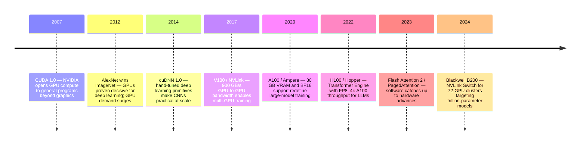
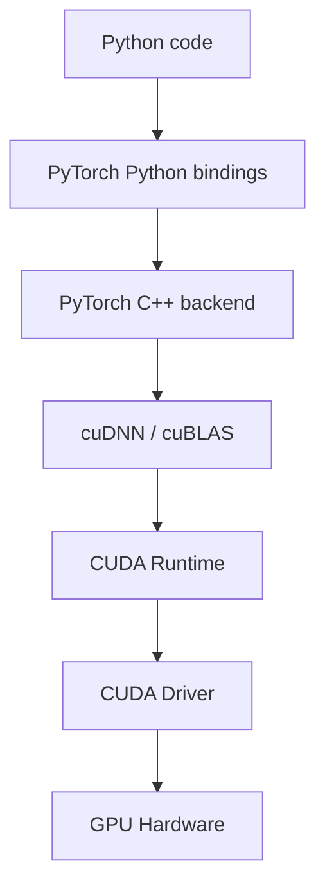
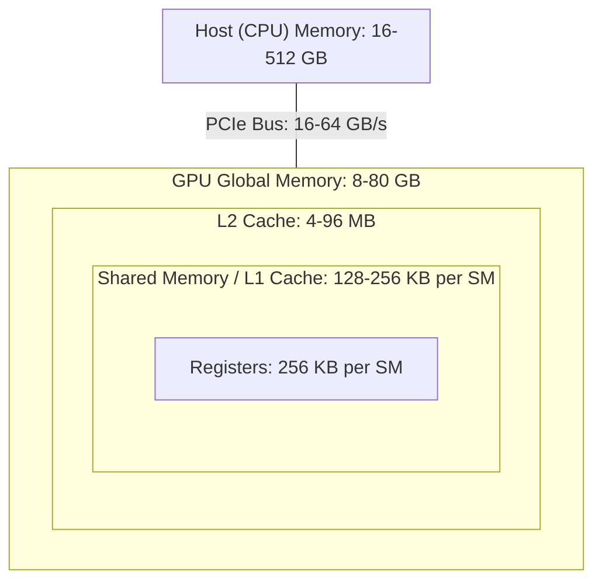
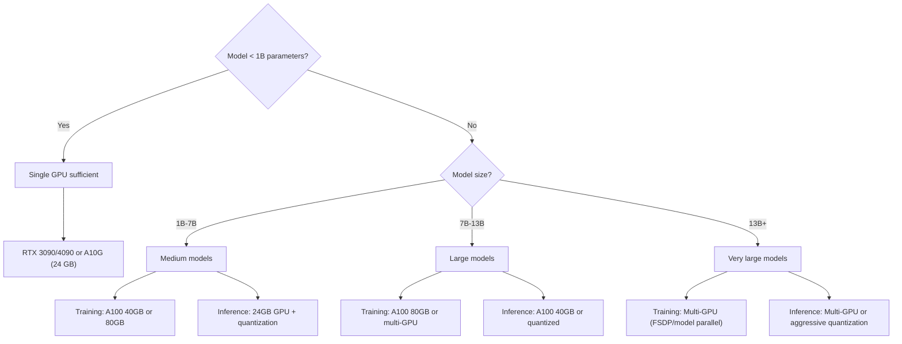
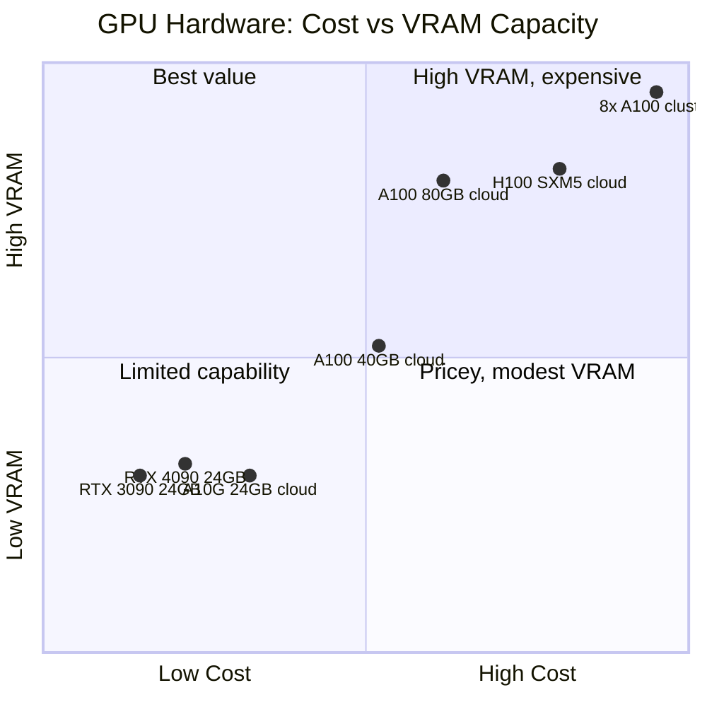

# Computational Resources for Machine Learning: From Silicon to Tensors

## The Invisible Foundation

Every machine learning tutorial begins the same way: import a library, load some data, call `.fit()`. The code is simple. The magic happens somewhere else—in layers of abstraction that transform your Python commands into billions of floating-point operations per second.

Most practitioners never look beneath this surface. They know that GPUs are faster than CPUs, that more memory is better, that CUDA is somehow involved. But when training fails with `CUDA out of memory`, when inference is slower than expected, when the cloud bill arrives—the abstractions crack, and the underlying reality demands attention.

This post strips away the magic. We will explore what actually happens when you run ML code, from the silicon executing your operations to the memory hierarchies storing your tensors. We will understand why GPUs dominate ML, what CUDA really does, how data types affect both speed and accuracy, and how to reason about whether your hardware is sufficient for your ambitions.

This is not about optimization tricks. This is about building a mental model that lets you make informed decisions before you write a single line of training code.

## The CPU-GPU Divide: Why Graphics Cards Train Neural Networks

### The Architecture Difference

A modern CPU has perhaps 8 to 64 cores, each capable of executing complex, sequential operations with sophisticated branch prediction, out-of-order execution, and deep cache hierarchies. A CPU core is a Swiss Army knife—capable of anything, optimized for nothing specific.

A modern GPU has thousands of simpler cores. An NVIDIA RTX 4090 has 16,384 CUDA cores. Each core is far less capable than a CPU core—it cannot do the complex branching and speculation that CPUs excel at. But it does not need to. GPU cores are designed for one thing: executing the same operation on many pieces of data simultaneously.

This is the fundamental insight: **neural network training is embarrassingly parallel**. When you multiply a weight matrix by an input vector, you are performing thousands of independent multiply-add operations. When you compute gradients, you are applying the same formula to millions of parameters. These operations do not depend on each other—they can all happen at once.

| Aspect | CPU | GPU |
|--------|-----|-----|
| Core Count | 8-64 | 1,000-16,000+ |
| Core Complexity | High (OoO, branch prediction) | Low (SIMT execution) |
| Clock Speed | 3-5 GHz | 1.5-2.5 GHz |
| Memory Bandwidth | 50-100 GB/s | 500-3,000 GB/s |
| Memory Size | 16-512 GB (system RAM) | 8-80 GB (VRAM) |
| Best For | Sequential, branching logic | Parallel, uniform operations |

### Memory Bandwidth: The Hidden Bottleneck

Raw compute power is not everything. Data must flow from memory to the processing cores, and this flow has a speed limit.

Consider matrix multiplication: `C = A @ B` where A is 4096x4096 and B is 4096x4096. At float32, each matrix occupies 64 MB. The output C is also 64 MB. Just moving this data requires 192 MB of memory bandwidth. The actual computation requires about 137 billion multiply-add operations.

A modern GPU can perform 80+ TFLOPS (80 trillion floating-point operations per second) but has memory bandwidth of "only" 2-3 TB/s. For many operations, the GPU is waiting for data, not computing. This ratio between compute and memory access is called **arithmetic intensity**, and it determines whether an operation is compute-bound or memory-bound.

```python
import torch

# Check your GPU's compute capability
if torch.cuda.is_available():
    device = torch.cuda.current_device()
    props = torch.cuda.get_device_properties(device)
    
    print(f"Device: {props.name}")
    print(f"CUDA Cores: ~{props.multi_processor_count * 128}")  # Approximate
    print(f"Memory: {props.total_memory / 1e9:.1f} GB")
    print(f"Compute Capability: {props.major}.{props.minor}")
```

### When CPUs Still Win

GPUs are not universally faster. They excel at:
- Large batch operations (matrix multiplications, convolutions)
- Operations with high arithmetic intensity
- Uniform operations across many data points

CPUs often win at:
- Small batch sizes or single-sample inference
- Operations with complex branching
- Tasks with irregular memory access patterns
- Preprocessing and data loading

A common mistake is moving *everything* to GPU. Data augmentation, tokenization, and complex preprocessing often run faster on CPU with proper parallelization.

The GPU architectures available to ML practitioners today are the product of two decades of rapid iteration. The milestones below show how each generation unlocked a new class of ML ambitions.



## CUDA: The Bridge Between Python and Silicon

### What CUDA Actually Is

CUDA (Compute Unified Device Architecture) is NVIDIA's parallel computing platform. It consists of:

1. **CUDA Toolkit**: Compilers, libraries, and tools for GPU programming
2. **CUDA Runtime**: APIs that your Python code (through PyTorch/TensorFlow) calls
3. **CUDA Driver**: Low-level interface between the OS and GPU hardware
4. **cuDNN**: A library of optimized primitives for deep learning

When you write `tensor.cuda()` in PyTorch, you trigger a cascade:



Each layer adds abstraction but also optimization. cuDNN contains hand-tuned implementations of convolutions, attention mechanisms, and other operations that would take years to write from scratch.

### The Version Triangle: Driver, Toolkit, cuDNN

One of the most frustrating aspects of GPU programming is version compatibility. Three versions must align:

| Component | What It Is | How to Check |
|-----------|-----------|--------------|
| NVIDIA Driver | OS-level GPU driver | `nvidia-smi` |
| CUDA Toolkit | Compiler and runtime | `nvcc --version` |
| cuDNN | Deep learning library | `torch.backends.cudnn.version()` |

The relationship is hierarchical:
- Newer drivers support older CUDA toolkit versions
- Each CUDA toolkit version requires a minimum driver version
- Each PyTorch/TensorFlow version is compiled against specific CUDA and cuDNN versions

```bash
# Check driver version and GPU status
nvidia-smi

# Output shows:
# - Driver Version: 535.104.05
# - CUDA Version: 12.2 (maximum supported by this driver)
# - GPU utilization, memory usage, temperature
```

```python
import torch

print(f"PyTorch version: {torch.__version__}")
print(f"CUDA available: {torch.cuda.is_available()}")
print(f"CUDA version: {torch.version.cuda}")
print(f"cuDNN version: {torch.backends.cudnn.version()}")
print(f"Number of GPUs: {torch.cuda.device_count()}")
```

### When CUDA Is Not Available

Not having an NVIDIA GPU does not mean ML is impossible. It means you have different options:

**Apple Silicon (M1/M2/M3)**:
Apple's chips include a powerful GPU accessible through Metal Performance Shaders. PyTorch supports this via the `mps` backend:

```python
if torch.backends.mps.is_available():
    device = torch.device("mps")
    tensor = torch.randn(1000, 1000, device=device)
```

**AMD GPUs**:
AMD's ROCm platform provides CUDA-like functionality. PyTorch has experimental ROCm support:

```python
# On a system with ROCm installed
if torch.cuda.is_available():  # ROCm presents as CUDA
    device = torch.device("cuda")
```

**Intel GPUs**:
Intel's oneAPI and the IPEX (Intel Extension for PyTorch) enable Intel GPU usage, though ecosystem maturity lags behind NVIDIA.

**CPU-Only Training**:
For small models and datasets, CPU training is viable. It will be slower, but not impossibly so:

```python
device = torch.device("cpu")
model = model.to(device)
# Training works, just slower
```

| Platform | Framework Support | Ecosystem Maturity | Use Case |
|----------|------------------|-------------------|----------|
| NVIDIA CUDA | Full | Excellent | Production, research |
| Apple MPS | Good | Growing | Development, small training |
| AMD ROCm | Experimental | Limited | Specific hardware scenarios |
| Intel oneAPI | Experimental | Limited | Intel-specific deployments |
| CPU | Full | N/A | Small models, preprocessing |

## Setting Up Your Environment: From Zero to Training

### Windows: The WSL Path

Native Windows CUDA development is possible but painful. The recommended path is Windows Subsystem for Linux (WSL2):

```powershell
# In PowerShell as Administrator
wsl --install -d Ubuntu

# After restart, open Ubuntu terminal
```

Inside WSL2, the NVIDIA driver from Windows is automatically available. You only need the CUDA toolkit:

```bash
# In WSL2 Ubuntu
# Install CUDA toolkit (check NVIDIA's website for current commands)
wget https://developer.download.nvidia.com/compute/cuda/repos/wsl-ubuntu/x86_64/cuda-keyring_1.1-1_all.deb
sudo dpkg -i cuda-keyring_1.1-1_all.deb
sudo apt-get update
sudo apt-get -y install cuda-toolkit-12-2

# Verify
nvidia-smi  # Should show your GPU
nvcc --version  # Should show CUDA compiler
```

### Linux: Native CUDA

On native Linux, you need both the driver and toolkit:

```bash
# Ubuntu example
# First, install the driver
sudo apt-get install nvidia-driver-535

# Reboot
sudo reboot

# Install CUDA toolkit
# Download from NVIDIA website or use package manager
sudo apt-get install cuda-toolkit-12-2

# Add to PATH (add to ~/.bashrc)
export PATH=/usr/local/cuda/bin:$PATH
export LD_LIBRARY_PATH=/usr/local/cuda/lib64:$LD_LIBRARY_PATH
```

### macOS: Metal Backend

macOS has no CUDA support. Use PyTorch with MPS:

```bash
# Install PyTorch with MPS support
pip install torch torchvision torchaudio

# In Python
import torch
device = torch.device("mps" if torch.backends.mps.is_available() else "cpu")
```

### Verifying Your Setup

A comprehensive verification script:

```python
import sys
import platform

def check_environment():
    print("=" * 50)
    print("SYSTEM INFORMATION")
    print("=" * 50)
    print(f"Python: {sys.version}")
    print(f"Platform: {platform.platform()}")
    
    print("\n" + "=" * 50)
    print("PYTORCH CONFIGURATION")
    print("=" * 50)
    
    try:
        import torch
        print(f"PyTorch version: {torch.__version__}")
        print(f"CUDA available: {torch.cuda.is_available()}")
        
        if torch.cuda.is_available():
            print(f"CUDA version: {torch.version.cuda}")
            print(f"cuDNN version: {torch.backends.cudnn.version()}")
            print(f"GPU count: {torch.cuda.device_count()}")
            
            for i in range(torch.cuda.device_count()):
                props = torch.cuda.get_device_properties(i)
                print(f"\nGPU {i}: {props.name}")
                print(f"  Memory: {props.total_memory / 1e9:.1f} GB")
                print(f"  Compute Capability: {props.major}.{props.minor}")
                print(f"  Multi-processors: {props.multi_processor_count}")
        
        if hasattr(torch.backends, 'mps') and torch.backends.mps.is_available():
            print("\nMPS (Apple Silicon) available: True")
        
        # Quick functionality test
        print("\n" + "=" * 50)
        print("FUNCTIONALITY TEST")
        print("=" * 50)
        
        if torch.cuda.is_available():
            device = torch.device("cuda")
        elif hasattr(torch.backends, 'mps') and torch.backends.mps.is_available():
            device = torch.device("mps")
        else:
            device = torch.device("cpu")
        
        print(f"Testing on device: {device}")
        
        x = torch.randn(1000, 1000, device=device)
        y = torch.randn(1000, 1000, device=device)
        z = x @ y
        
        print(f"Matrix multiplication test: PASSED")
        print(f"Result shape: {z.shape}")
        
    except ImportError:
        print("PyTorch not installed")
    except Exception as e:
        print(f"Error: {e}")

if __name__ == "__main__":
    check_environment()
```

## Memory: The Resource That Runs Out First

### GPU Memory Hierarchy

GPU memory (VRAM) is the most constrained resource in ML. Understanding its structure helps you work within its limits.



Each level is faster but smaller:
- **Registers**: Fastest, but tiny (256 KB per streaming multiprocessor)
- **Shared Memory/L1**: Fast, shared within a thread block (128-256 KB per SM)
- **L2 Cache**: Shared across all SMs (4-96 MB)
- **Global Memory**: Your VRAM (8-80 GB)
- **Host Memory**: System RAM (requires PCIe transfer)

### What Consumes GPU Memory

During training, GPU memory holds:

1. **Model Parameters**: Weights and biases
2. **Gradients**: Same size as parameters
3. **Optimizer States**: Adam stores 2 additional values per parameter (momentum and variance)
4. **Activations**: Intermediate values saved for backpropagation
5. **Temporary Buffers**: Workspace for operations like convolutions

```python
def estimate_training_memory(model, batch_size, sequence_length=None, dtype=torch.float32):
    """Estimate GPU memory needed for training."""
    
    bytes_per_element = {
        torch.float32: 4,
        torch.float16: 2,
        torch.bfloat16: 2,
    }[dtype]
    
    # Count parameters
    total_params = sum(p.numel() for p in model.parameters())
    trainable_params = sum(p.numel() for p in model.parameters() if p.requires_grad)
    
    # Memory components (in bytes)
    params_memory = total_params * bytes_per_element
    gradients_memory = trainable_params * bytes_per_element
    
    # Adam optimizer states (momentum + variance)
    optimizer_memory = trainable_params * 4 * 2  # Always float32
    
    # Activations are harder to estimate - rough heuristic
    # For transformers: ~batch_size * seq_len * hidden_dim * num_layers * 2
    # This is a very rough estimate
    activation_multiplier = 4  # Conservative estimate
    activations_memory = params_memory * activation_multiplier * batch_size
    
    total = params_memory + gradients_memory + optimizer_memory + activations_memory
    
    return {
        'parameters': total_params,
        'trainable': trainable_params,
        'params_memory_gb': params_memory / 1e9,
        'gradients_memory_gb': gradients_memory / 1e9,
        'optimizer_memory_gb': optimizer_memory / 1e9,
        'activations_estimate_gb': activations_memory / 1e9,
        'total_estimate_gb': total / 1e9,
    }
```

### The Activation Memory Problem

Activations often dominate memory usage. During forward pass, intermediate results must be saved for the backward pass. For a transformer with L layers, this means storing L sets of attention matrices and hidden states.

Consider a batch of 32 sequences of length 2048 with hidden dimension 4096:
- Single attention matrix: 32 * 2048 * 2048 * 4 bytes = 512 MB
- With 32 layers and multiple attention heads: several GB

This is why techniques like **gradient checkpointing** exist—they trade compute for memory by recomputing activations during backward pass instead of storing them.

```python
# Enable gradient checkpointing in transformers
from transformers import AutoModelForCausalLM

model = AutoModelForCausalLM.from_pretrained("model_name")
model.gradient_checkpointing_enable()  # Reduces memory, increases compute time
```

### Monitoring GPU Memory

Real-time monitoring is essential:

```python
import torch

def print_memory_stats():
    if not torch.cuda.is_available():
        print("CUDA not available")
        return
    
    allocated = torch.cuda.memory_allocated() / 1e9
    reserved = torch.cuda.memory_reserved() / 1e9
    max_allocated = torch.cuda.max_memory_allocated() / 1e9
    
    print(f"Allocated: {allocated:.2f} GB")
    print(f"Reserved:  {reserved:.2f} GB")
    print(f"Peak:      {max_allocated:.2f} GB")

# Call during training to track memory
print_memory_stats()
```

From the command line:

```bash
# Continuous monitoring
watch -n 1 nvidia-smi

# Or with more detail
nvidia-smi --query-gpu=memory.used,memory.total,utilization.gpu --format=csv -l 1
```

## Data Types: Precision, Speed, and Memory Trade-offs

### The Float Family

Not all floating-point numbers are created equal. The choice of data type affects memory usage, computation speed, and numerical precision.

| Data Type | Bits | Exponent | Mantissa | Range | Precision | Memory/Param |
|-----------|------|----------|----------|-------|-----------|--------------|
| float32 | 32 | 8 | 23 | ~1e-38 to ~3e38 | ~7 digits | 4 bytes |
| float16 | 16 | 5 | 10 | ~6e-5 to 65504 | ~3 digits | 2 bytes |
| bfloat16 | 16 | 8 | 7 | ~1e-38 to ~3e38 | ~2 digits | 2 bytes |
| float8 (E4M3) | 8 | 4 | 3 | ~0.001 to 448 | ~1 digit | 1 byte |
| float8 (E5M2) | 8 | 5 | 2 | ~1e-7 to 57344 | ~0.5 digit | 1 byte |

**float32** is the default. It has enough precision for almost any calculation and enough range for any value you will encounter in ML.

**float16** halves memory and can double throughput on modern GPUs (which have dedicated FP16 hardware). But the limited range causes problems—gradients can overflow (become infinity) or underflow (become zero).

**bfloat16** (brain floating point) keeps the same range as float32 but with less precision. This makes it much more stable for training while still being 16 bits. Google developed it specifically for ML.

```python
import torch

# Check available data types
print(f"float32 tensor: {torch.tensor([1.0]).dtype}")
print(f"float16 tensor: {torch.tensor([1.0], dtype=torch.float16).dtype}")
print(f"bfloat16 tensor: {torch.tensor([1.0], dtype=torch.bfloat16).dtype}")

# Memory comparison
size = (10000, 10000)
f32 = torch.randn(size, dtype=torch.float32)
f16 = torch.randn(size, dtype=torch.float16)
bf16 = torch.randn(size, dtype=torch.bfloat16)

print(f"\nMemory usage for {size} tensor:")
print(f"float32: {f32.element_size() * f32.numel() / 1e6:.1f} MB")
print(f"float16: {f16.element_size() * f16.numel() / 1e6:.1f} MB")
print(f"bfloat16: {bf16.element_size() * bf16.numel() / 1e6:.1f} MB")
```

### Mixed Precision Training

Modern training uses **mixed precision**: different operations use different precisions. The strategy:

1. Keep master weights in float32
2. Compute forward and backward passes in float16/bfloat16
3. Apply gradients to float32 master weights
4. Use loss scaling to prevent gradient underflow

```python
from torch.cuda.amp import autocast, GradScaler

# Mixed precision training
scaler = GradScaler()

for batch in dataloader:
    optimizer.zero_grad()
    
    # Forward pass in float16
    with autocast():
        outputs = model(batch['input'])
        loss = criterion(outputs, batch['target'])
    
    # Backward pass (scaler handles underflow)
    scaler.scale(loss).backward()
    scaler.step(optimizer)
    scaler.update()
```

The `autocast` context manager automatically chooses the appropriate precision for each operation. Matrix multiplications use float16; operations that need precision (like softmax) use float32.

### When Each Precision Makes Sense

| Scenario | Recommended Precision | Reason |
|----------|----------------------|--------|
| Training from scratch | Mixed (AMP) | Best speed/accuracy trade-off |
| Fine-tuning large models | bfloat16 | Stable, memory efficient |
| Inference | float16 or int8 | Speed and memory |
| Loss computation | float32 | Numerical stability |
| Gradient accumulation | float32 | Precision in accumulation |
| Normalization layers | float32 | Small values need precision |

### Integer Quantization

For inference, integer types offer even more compression:

| Type | Bits | Memory Savings | Speed Gain | Accuracy Impact |
|------|------|----------------|------------|-----------------|
| float32 | 32 | Baseline | Baseline | None |
| float16 | 16 | 2x | 1.5-2x | Minimal |
| int8 | 8 | 4x | 2-4x | Small |
| int4 | 4 | 8x | 2-4x | Noticeable |

Quantization converts weights (and sometimes activations) to lower precision integers. This requires calibration to determine the scaling factors.

```python
# PyTorch dynamic quantization (for inference)
import torch.quantization

model_fp32 = load_model()
model_int8 = torch.quantization.quantize_dynamic(
    model_fp32,
    {torch.nn.Linear},  # Quantize only Linear layers
    dtype=torch.qint8
)

# Compare sizes
def model_size_mb(model):
    torch.save(model.state_dict(), "/tmp/model.pt")
    import os
    size = os.path.getsize("/tmp/model.pt") / 1e6
    os.remove("/tmp/model.pt")
    return size

print(f"FP32 model: {model_size_mb(model_fp32):.1f} MB")
print(f"INT8 model: {model_size_mb(model_int8):.1f} MB")
```

## Model Size: From Parameters to Gigabytes

### Calculating Model Memory

The formula for model memory is deceptively simple:

```
Memory (bytes) = Parameters × Bytes per Parameter
```

For a 7 billion parameter model at float32:
```
7,000,000,000 × 4 = 28,000,000,000 bytes = 28 GB
```

But training requires more:

| Component | Memory Multiplier (relative to params) |
|-----------|---------------------------------------|
| Parameters | 1x |
| Gradients | 1x |
| Adam momentum | 1x |
| Adam variance | 1x |
| Activations | 2-10x (varies by architecture) |
| **Total for training** | **~6-14x parameters** |

```python
def calculate_model_memory(
    num_params: int,
    precision: str = "float32",
    optimizer: str = "adam",
    include_gradients: bool = True,
    activation_factor: float = 4.0
) -> dict:
    """Calculate memory requirements for a model."""
    
    bytes_per_param = {
        "float32": 4,
        "float16": 2,
        "bfloat16": 2,
        "mixed": 2,  # For mixed precision forward/backward
    }[precision]
    
    # Parameters in specified precision
    params_memory = num_params * bytes_per_param
    
    # Gradients (same precision as params during backward)
    gradients_memory = num_params * bytes_per_param if include_gradients else 0
    
    # Optimizer states (always float32)
    if optimizer == "adam":
        optimizer_memory = num_params * 4 * 2  # momentum + variance
    elif optimizer == "sgd":
        optimizer_memory = num_params * 4 if include_gradients else 0  # momentum only
    else:
        optimizer_memory = 0
    
    # Master weights for mixed precision (float32 copy)
    master_weights = num_params * 4 if precision == "mixed" else 0
    
    # Activations (rough estimate)
    activations_memory = params_memory * activation_factor
    
    total = params_memory + gradients_memory + optimizer_memory + master_weights + activations_memory
    
    return {
        "parameters_gb": params_memory / 1e9,
        "gradients_gb": gradients_memory / 1e9,
        "optimizer_gb": optimizer_memory / 1e9,
        "master_weights_gb": master_weights / 1e9,
        "activations_gb": activations_memory / 1e9,
        "total_gb": total / 1e9,
    }

# Examples
models = {
    "ResNet-50": 25_600_000,
    "BERT-base": 110_000_000,
    "GPT-2": 1_500_000_000,
    "LLaMA-7B": 7_000_000_000,
    "LLaMA-70B": 70_000_000_000,
}

print("Training Memory Requirements (with Adam, float32):")
print("-" * 60)
for name, params in models.items():
    mem = calculate_model_memory(params, "float32", "adam")
    print(f"{name:15} | {params/1e6:>7.0f}M params | {mem['total_gb']:>6.1f} GB total")

print("\n\nTraining Memory Requirements (with Adam, mixed precision):")
print("-" * 60)
for name, params in models.items():
    mem = calculate_model_memory(params, "mixed", "adam")
    print(f"{name:15} | {params/1e6:>7.0f}M params | {mem['total_gb']:>6.1f} GB total")
```

### Model Size Reference Table

Common models and their approximate memory requirements:

| Model | Parameters | Inference (FP16) | Training (Mixed) | Training (FP32) |
|-------|------------|------------------|------------------|-----------------|
| ResNet-50 | 26M | 0.05 GB | 0.5 GB | 1 GB |
| BERT-base | 110M | 0.2 GB | 2 GB | 4 GB |
| BERT-large | 340M | 0.7 GB | 6 GB | 12 GB |
| GPT-2 Small | 124M | 0.25 GB | 2.5 GB | 5 GB |
| GPT-2 XL | 1.5B | 3 GB | 24 GB | 48 GB |
| LLaMA-7B | 7B | 14 GB | 56 GB | 112 GB |
| LLaMA-13B | 13B | 26 GB | 104 GB | 208 GB |
| LLaMA-70B | 70B | 140 GB | 560 GB | 1120 GB |

These are approximations. Actual requirements depend on:
- Batch size (affects activations)
- Sequence length (affects activations for transformers)
- Gradient checkpointing (reduces activations)
- Specific architecture details

### Which GPU for Which Model?

| GPU | VRAM | Can Train (Mixed) | Can Infer (FP16) |
|-----|------|-------------------|------------------|
| RTX 3060 | 12 GB | BERT-large, GPT-2 Small | LLaMA-7B (tight) |
| RTX 3090 | 24 GB | GPT-2 XL | LLaMA-13B |
| RTX 4090 | 24 GB | GPT-2 XL (faster) | LLaMA-13B |
| A10G | 24 GB | GPT-2 XL | LLaMA-13B |
| A100 40GB | 40 GB | LLaMA-7B (batch=1) | LLaMA-33B |
| A100 80GB | 80 GB | LLaMA-7B (batch=8) | LLaMA-70B |
| H100 80GB | 80 GB | LLaMA-7B (faster) | LLaMA-70B |
| 8x A100 80GB | 640 GB | LLaMA-70B | Multiple 70B+ |

## Parallelism: When One Device Is Not Enough

### Data Parallelism

The simplest form: replicate the model on multiple GPUs, split the batch, average the gradients.

```python
import torch
import torch.nn as nn

# Simple DataParallel
model = nn.DataParallel(model)  # Uses all available GPUs
output = model(input_batch)

# DistributedDataParallel (recommended for multi-GPU)
import torch.distributed as dist
from torch.nn.parallel import DistributedDataParallel as DDP

dist.init_process_group("nccl")
model = DDP(model, device_ids=[local_rank])
```

Data parallelism scales batch size. If you have 4 GPUs and want batch size 32 per GPU, your effective batch size is 128.

| GPUs | Effective Batch | Speedup | Memory per GPU |
|------|-----------------|---------|----------------|
| 1 | 32 | 1x | Full model |
| 4 | 128 | ~3.8x | Full model |
| 8 | 256 | ~7.5x | Full model |

### Model Parallelism

When a model does not fit on one GPU, split it across GPUs.

**Pipeline Parallelism**: Different layers on different GPUs. GPU 0 runs layers 1-10, GPU 1 runs layers 11-20, etc.

```python
# Conceptual pipeline parallelism
class PipelinedModel(nn.Module):
    def __init__(self):
        self.stage1 = nn.Sequential(...).to('cuda:0')
        self.stage2 = nn.Sequential(...).to('cuda:1')
    
    def forward(self, x):
        x = self.stage1(x.to('cuda:0'))
        x = self.stage2(x.to('cuda:1'))
        return x
```

**Tensor Parallelism**: Individual operations split across GPUs. A single matrix multiplication is divided among multiple devices.

| Parallelism Type | What's Split | When to Use | Complexity |
|-----------------|--------------|-------------|------------|
| Data | Batches | Model fits on one GPU | Low |
| Pipeline | Layers | Model too large for one GPU | Medium |
| Tensor | Operations | Very large models, need max speed | High |
| FSDP | Parameters + gradients | Large models, memory constrained | Medium |

### Fully Sharded Data Parallelism (FSDP)

FSDP shards model parameters, gradients, and optimizer states across GPUs. Each GPU only holds a portion of the full state at any time.

```python
from torch.distributed.fsdp import FullyShardedDataParallel as FSDP

model = FSDP(model)
```

FSDP dramatically reduces per-GPU memory at the cost of communication overhead. It enables training models that would not fit on any single GPU.

## CPU Parallelism: Threading and Multiprocessing

### The Python Threading Reality

As discussed in the Python post, the GIL limits CPU parallelism for Python code. But this does not mean you cannot use multiple cores effectively.

**NumPy and PyTorch release the GIL** during computation. Matrix operations, convolutions, and other heavy lifting happen in C/C++/CUDA without GIL restrictions.

```python
import torch

# This uses multiple CPU cores despite the GIL
torch.set_num_threads(8)  # Use 8 CPU threads for CPU operations
x = torch.randn(10000, 10000)
y = x @ x.T  # Uses all 8 threads
```

### Multiprocessing for Data Loading

Data loading is the most common CPU bottleneck. PyTorch's DataLoader uses multiprocessing to parallelize this:

```python
from torch.utils.data import DataLoader

dataloader = DataLoader(
    dataset,
    batch_size=32,
    num_workers=8,      # 8 worker processes for data loading
    pin_memory=True,    # Faster CPU-to-GPU transfer
    prefetch_factor=2,  # Each worker prefetches 2 batches
)
```

The `num_workers` parameter controls how many parallel processes load data. More workers mean faster data loading, but also more CPU and memory usage.

A common rule of thumb: `num_workers = 4 * num_gpus`, but profile your specific case.

### Diagnosing CPU Bottlenecks

If your GPU utilization is low, the CPU might be the bottleneck:

```bash
# Check GPU utilization
nvidia-smi --query-gpu=utilization.gpu --format=csv -l 1

# If it's jumping between 0% and 100%, data loading is likely the bottleneck
```

```python
import torch
from torch.profiler import profile, ProfilerActivity

with profile(activities=[ProfilerActivity.CPU, ProfilerActivity.CUDA]) as prof:
    for batch in dataloader:
        output = model(batch)
        loss = criterion(output, target)
        loss.backward()
        optimizer.step()

print(prof.key_averages().table(sort_by="cuda_time_total", row_limit=10))
```

## Putting It Together: Decision Framework

### Before You Start Training

Ask these questions:

1. **How large is my model?** (Parameters)
2. **What precision can I use?** (FP32, Mixed, FP16)
3. **What batch size do I need?** (Affects activation memory)
4. **How long are my sequences?** (For transformers)

Calculate memory requirements:

```python
# Quick estimation
params = 7_000_000_000  # 7B parameters
precision = "mixed"
batch_size = 8
seq_length = 2048

# Base model memory (parameters + gradients + optimizer)
base_memory_gb = params * 2 / 1e9  # Mixed precision params
base_memory_gb += params * 2 / 1e9  # Gradients
base_memory_gb += params * 4 * 2 / 1e9  # Adam states (FP32)

# Activation memory (very rough for transformers)
hidden_dim = 4096
num_layers = 32
activation_memory_gb = batch_size * seq_length * hidden_dim * num_layers * 2 / 1e9

total_gb = base_memory_gb + activation_memory_gb
print(f"Estimated memory: {total_gb:.1f} GB")
```

### The Decision Tree



Choosing the right hardware for a given task means balancing two axes: how much VRAM you actually need versus what you are willing to spend. The chart below maps common options so you can see the trade-offs at a glance—the sweet spot for solo researchers and small teams is usually the top-left quadrant.



### When Cloud Makes Sense

Local hardware has limits. Cloud resources offer:

- **Flexibility**: Scale up for training, scale down for development
- **Access to hardware**: H100s and multi-GPU clusters without capital expense
- **Managed infrastructure**: No driver updates, no hardware failures to handle

The tradeoff is cost. A rough comparison:

| Hardware | Purchase Cost | Depreciation | Cloud Hourly | Break-even |
|----------|---------------|--------------|--------------|------------|
| RTX 4090 | $1,600 | 3 years | ~$0.40/hr | ~4,000 hours |
| A100 80GB | $15,000+ | 3 years | ~$4/hr | ~3,750 hours |
| 8x A100 | $150,000+ | 3 years | ~$32/hr | ~4,700 hours |

If you need the hardware continuously, buying makes sense. If you need it occasionally for training runs, cloud is cheaper.

The next post will explore cloud resources in depth—specifically how GCP, Vertex AI, and managed ML platforms change the economics and workflow of training and deployment.

## Quick Reference: Commands and Checks

### System Information

```bash
# GPU info
nvidia-smi

# CPU info (Linux)
lscpu

# Memory info (Linux)
free -h

# GPU info (detailed)
nvidia-smi -q

# Continuous GPU monitoring
watch -n 1 nvidia-smi
```

### Python Environment Checks

```python
import torch

# Device availability
print(f"CUDA: {torch.cuda.is_available()}")
print(f"MPS: {torch.backends.mps.is_available()}")

# GPU details
if torch.cuda.is_available():
    print(f"Device: {torch.cuda.get_device_name()}")
    print(f"Memory: {torch.cuda.get_device_properties(0).total_memory / 1e9:.1f} GB")

# Current memory usage
if torch.cuda.is_available():
    print(f"Allocated: {torch.cuda.memory_allocated() / 1e9:.2f} GB")
    print(f"Reserved: {torch.cuda.memory_reserved() / 1e9:.2f} GB")

# Thread settings
print(f"CPU threads: {torch.get_num_threads()}")
```

### Common Issues and Solutions

| Problem | Likely Cause | Solution |
|---------|--------------|----------|
| CUDA not available | Driver/toolkit mismatch | Check `nvidia-smi` and PyTorch CUDA version |
| Out of memory | Batch size too large | Reduce batch size, use gradient checkpointing |
| Low GPU utilization | Data loading bottleneck | Increase `num_workers`, use `pin_memory` |
| NaN in training | Precision issues | Use mixed precision with loss scaling |
| Slow training | Memory-bound operations | Profile and optimize data transfer |

---

## Summary

Understanding computational resources is not optional knowledge—it is the difference between training models efficiently and wasting time and money on misconfigurations.

The key insights:

1. **GPUs dominate ML because of parallelism**, not raw speed. Matrix operations across thousands of simple cores beat complex CPUs.

2. **Memory is usually the constraint**. Before training, calculate your memory requirements. Model parameters are just the start—gradients, optimizer states, and activations multiply the requirement.

3. **Data types matter**. Mixed precision training halves memory and speeds computation with minimal accuracy loss. Quantization enables inference on limited hardware.

4. **CUDA is an ecosystem**, not just a library. Driver, toolkit, and cuDNN versions must align with your framework.

5. **Parallelism has levels**. Data parallelism is simple but requires full model per GPU. Model parallelism and FSDP enable training larger models at the cost of complexity.

6. **Profile before optimizing**. GPU utilization, memory usage, and throughput tell you where the bottleneck is.

With this foundation, you can make informed decisions about hardware, precision, and parallelism strategies before writing training code. The next post will extend these concepts to cloud platforms, where the same principles apply but the implementation—and the cost model—changes significantly.

---

## Going Deeper

**Books:**

- Hwu, W.-m., Kirk, D., & Hajj, I. (2022). *Programming Massively Parallel Processors.* 4th ed. Morgan Kaufmann. — The canonical CUDA programming textbook. Teaches GPU architecture from the memory model up through optimization strategies. Dense but necessary for anyone writing CUDA kernels.

- Patterson, D., & Hennessy, J. (2019). *Computer Organization and Design: ARM Edition.* 5th ed. Morgan Kaufmann. — The foundational computer architecture textbook. Chapter on memory hierarchy explains cache coherence, DRAM bandwidth, and memory latency—concepts that directly govern GPU performance.

- Raschka, S. (2022). *Machine Learning with PyTorch and Scikit-Learn.* Packt. — Practical, well-explained ML engineering with strong chapters on training efficiency and hardware utilization.

**Videos:**

- ["GPU Programming"](https://www.youtube.com/watch?v=86FAWCzIe_4) by NVIDIA Deep Learning Institute — Conceptual walkthrough of CUDA programming model, warps, and memory hierarchy. Free and dense with practical insight.

- ["Making Deep Learning Go Brrrr From First Principles"](https://horace.io/brrr_intro.html) by Horace He — A highly cited blog post (with companion talk) that explains GPU performance bottlenecks through bandwidth and compute arithmetic. One of the most useful reads for understanding why optimizations work.

- ["Andrej Karpathy: Let's Build GPT from Scratch"](https://www.youtube.com/watch?v=kCc8FmEb1nY) — Not specifically about hardware, but Karpathy's live coding session shows exactly how GPU memory constraints shape implementation decisions in practice.

**Online Resources:**

- [NVIDIA CUDA Programming Guide](https://docs.nvidia.com/cuda/cuda-c-programming-guide/) — The authoritative documentation. The memory model and execution model sections are essential reading.
- [PyTorch Performance Tuning Guide](https://pytorch.org/tutorials/recipes/recipes/tuning_guide.html) — Concise actionable tips covering dataloader optimization, mixed precision, gradient checkpointing, and profiling.
- [Lambda Labs GPU Benchmarks](https://lambdalabs.com/gpu-benchmarks) — Up-to-date training throughput comparisons across GPU models. Useful for hardware selection decisions.
- [Hugging Face: Efficient Training on a Single GPU](https://huggingface.co/docs/transformers/perf_train_gpu_one) — A practical guide to squeezing maximum throughput from limited hardware.

**Key Papers:**

- Micikevicius, P., et al. (2018). ["Mixed Precision Training."](https://arxiv.org/abs/1710.03740) *ICLR 2018*. — The paper that established FP16 training as standard practice. The loss scaling technique described here is why mixed precision doesn't destroy model convergence.

- Rajbhandari, S., et al. (2020). ["ZeRO: Memory Optimizations Toward Training Trillion Parameter Models."](https://arxiv.org/abs/1910.02054) *SC 2020*. — The DeepSpeed paper. Introduces the partitioning strategy that enables models too large to fit on a single GPU to train across multiple GPUs without the communication overhead of naive model parallelism.

- Shoeybi, M., et al. (2019). ["Megatron-LM: Training Multi-Billion Parameter Language Models Using Model Parallelism."](https://arxiv.org/abs/1909.08053) — NVIDIA's approach to tensor parallelism for large language models. Together with ZeRO, defines the parallelism landscape for large-scale training.

**Questions to Explore:**

When is a model memory-bound vs compute-bound, and how does that distinction change your optimization strategy? What is the roofline model and how do you use it to identify bottlenecks? Why does batch size affect training throughput differently on a GPU than on a CPU?

