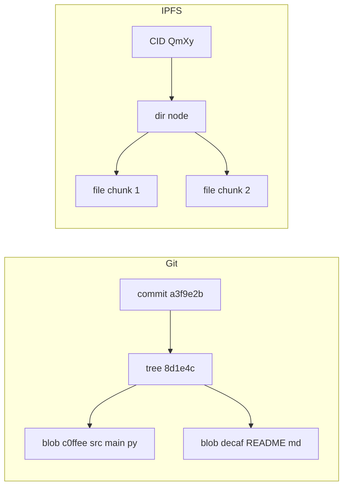
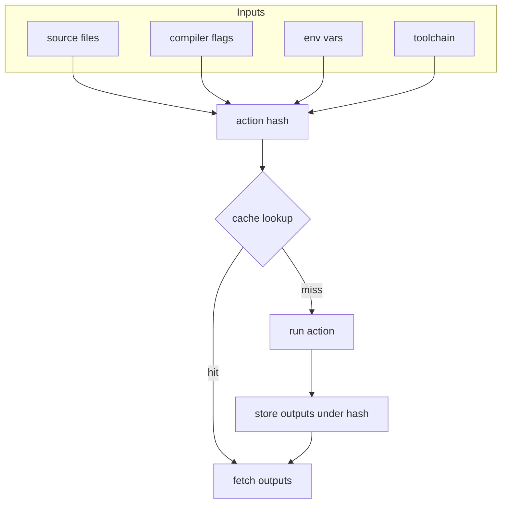
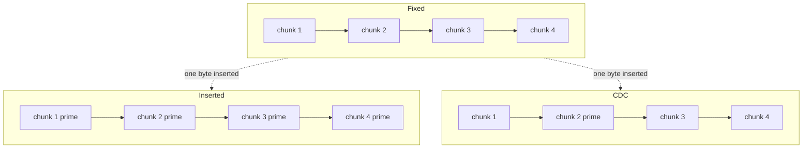
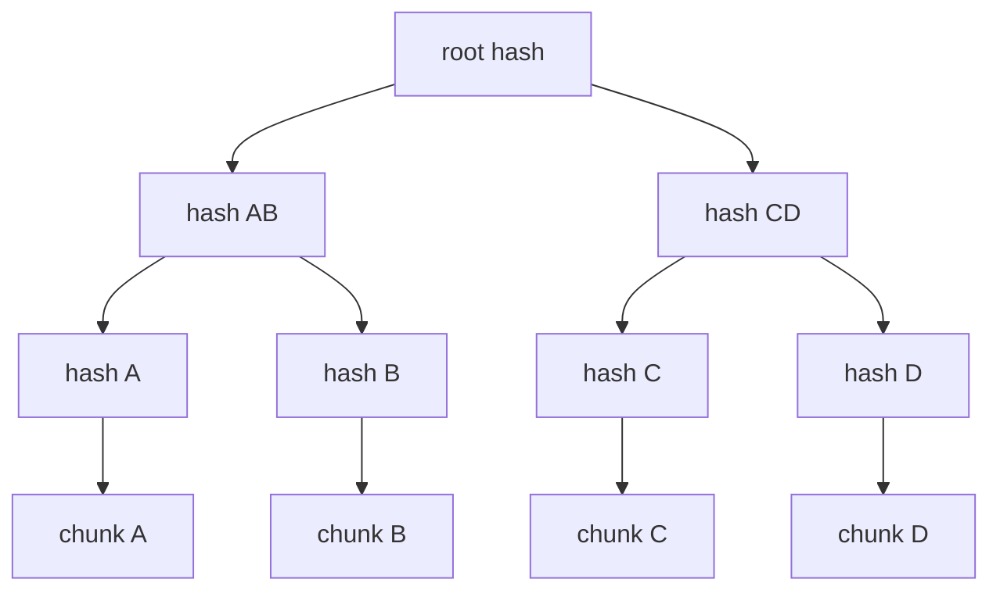
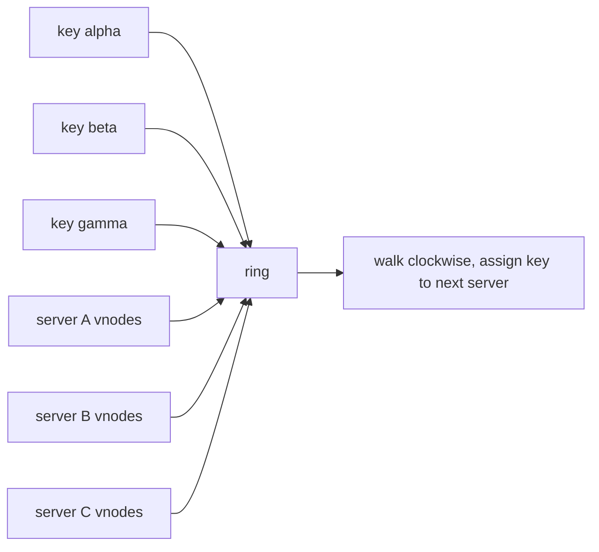
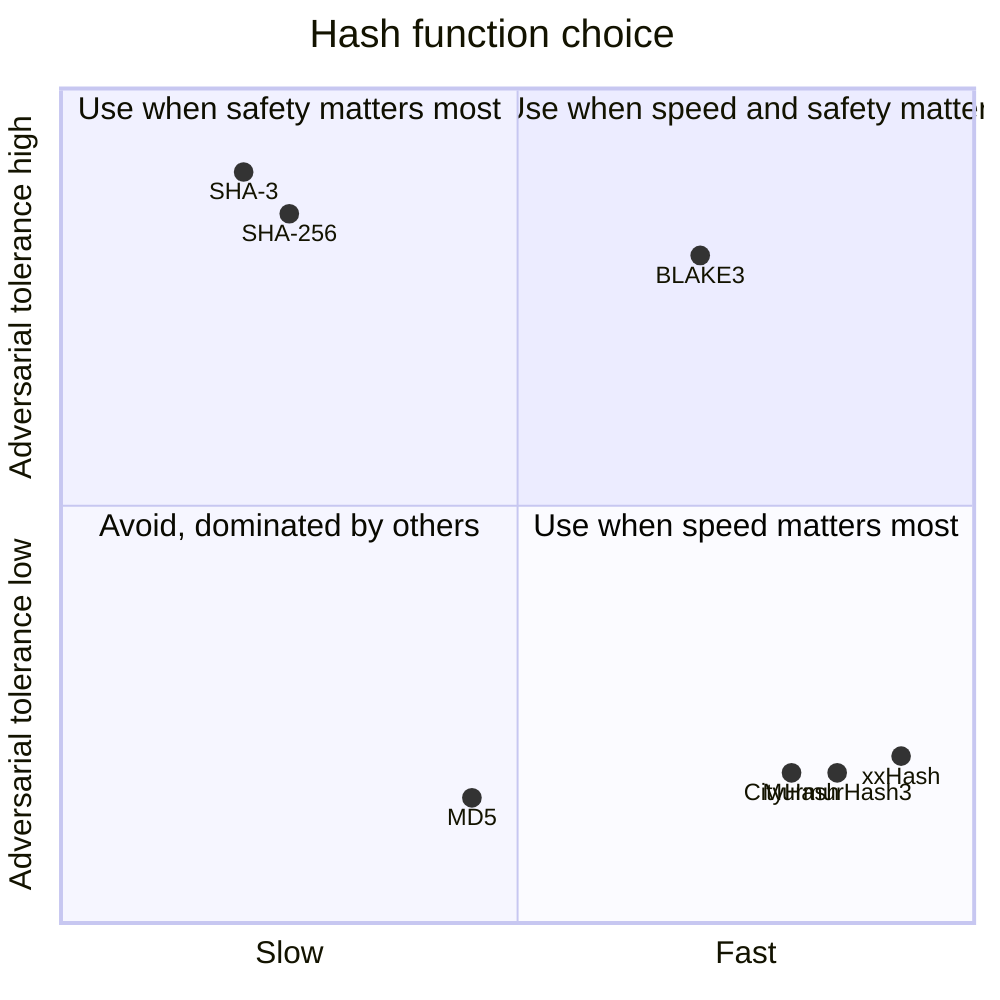

# The Hash as an Engineering Tool: Content Addressing, Caches, and the Quiet Primitive Behind Modern Systems

## A small scene

It is 11 p.m. and a deploy is stuck. Somewhere in a CI pipeline, a 3.2 GB container image is supposed to push to a registry in Frankfurt before a cron job wakes up. The network is fine. The registry is fine. Nothing is actually being uploaded.

On closer inspection, the upload finishes in forty seconds. Most of the layers the registry already has. The base image, the Python runtime, a pinned set of system libraries, a vendored model directory — all of it is identical to yesterday's build, which means all of it is already sitting in the registry, and the push only has to transfer one small application layer. What tells the registry "I already have this" is not a filename, not a timestamp, not a version tag. It is a hexadecimal string.

That string is a hash. It is doing something very specific: it is acting as a name for a blob of bytes, derived entirely from the bytes themselves, so that two machines on opposite sides of the ocean can agree that a thing they have never jointly seen is nevertheless the same thing. No coordination. No handshake. Just matching hex.

This post is about that trick, and all the other tricks like it. Most engineers learn hashing as "the algorithm under password storage and digital signatures," which is true but uninteresting. The interesting part is that hashes are an astonishingly general-purpose engineering primitive. They underlie Git, Docker, Bazel, Nix, IPFS, rsync, Bitcoin, most CDNs, most distributed caches, most backup systems, most build systems, and most database filters. Once you see a hash for what it is — a cheap, deterministic, fixed-size fingerprint of arbitrary data — you start reaching for it constantly. My aim is to push you toward that reflex.

## What a hash actually is

A hash function is a deterministic procedure that takes an input of any size and produces an output of fixed size, called a digest. Good hashes have three properties we care about in engineering: the same input always produces the same output (determinism), different inputs almost never produce the same output (low collision probability), and small changes to the input produce wildly different outputs (the avalanche property). Cryptographic hashes add more guarantees — preimage and collision resistance against a motivated adversary — at the cost of speed. Non-cryptographic hashes drop those guarantees and become very fast.

That is all. No magic. The hash is a lossy, irreversible, compressed label for its input. What makes it useful is that the label is stable, the same everywhere, and cheap to compute.

Everything below is a story about what happens when you treat that label as a first-class citizen in your system's design.

## Content addressing: naming things by what they are

The normal way to name data is by location. "The file at `/home/lara/notes.md`." "The row with id 42." "The object in bucket `models` at key `v3/final.safetensors`." Location names are convenient for humans and terrible for distributed systems, because they have no relationship to the content they name. The same location can point at different bytes tomorrow. The same bytes can live at a thousand locations.

Content addressing inverts this. You compute the hash of the bytes and use that hash as the name. `sha256:a3f9e2b1…` is not where the data lives, it is what the data is. Two machines that independently produce the same bytes will independently produce the same name. A machine asked for `sha256:a3f9e2b1…` does not need to trust where it came from — it can verify the answer by re-hashing.

The consequences ripple outward:

- **Deduplication is automatic.** Two identical blobs collapse into one entry because they collide on the name.
- **Integrity is free.** If the stored bytes do not hash to the name, they are corrupted or tampered.
- **Caching is trivial.** You never need to invalidate a content-addressed entry, because the name *is* a version.
- **Distribution is lock-free.** Two parties can independently create the same name for the same content and never need to coordinate.
- **Renaming is a no-op.** Moving a file does not change the hash of its contents, so there is nothing to update.

Git is the canonical example. When you commit, Git does not store a diff, it stores a *snapshot* of every file as a blob, and the blob's name is the SHA of its contents. A commit is an object that names a tree, which names sub-trees and blobs, all by hash. Branches are thin pointers — human-readable labels on top of a content-addressed graph. If you have ever wondered why `git rename` does not exist (you use `git mv`, which is really `rm`+`add`), this is why: there are no names to rename, only bytes whose hashes stay stable.



IPFS takes the same idea and builds a whole filesystem out of it. A CID (Content Identifier) is a hash plus some metadata about which hash function and codec were used. You can ask any peer on the network for `QmXy…` and any peer that has it can serve it — the request is content-addressed, not location-addressed. The protocol is simpler than HTTP because there is nothing to authenticate: the bytes verify themselves.

Docker and the OCI image spec do the same thing for container layers. A layer is a tar archive of filesystem changes; the layer's *diff ID* is the SHA-256 of the uncompressed tar, and the layer's *digest* is the SHA-256 of the compressed blob that actually gets shipped. When you `docker push`, the registry looks at each layer's digest, says "I already have that" for anything it recognizes, and only accepts the bytes it is missing. Pulling works the same way in reverse. The reason a base image shared across a hundred services only uses the disk space of one copy is entirely because of content addressing.

Here is a minimal sketch of what a content-addressable store looks like in Python. No ceremony, no abstraction layers, just the idea.

```python
import hashlib
from pathlib import Path

class CAS:
    """A minimal content-addressable store backed by the filesystem."""

    def __init__(self, root: str | Path):
        self.root = Path(root)
        self.root.mkdir(parents=True, exist_ok=True)

    def put(self, data: bytes) -> str:
        """Store bytes, return their SHA-256 digest as a hex string."""
        digest = hashlib.sha256(data).hexdigest()
        # Fan out across subdirectories so we don't blow up one folder
        # once we cross ~10k files. Git does the same trick.
        sub = self.root / digest[:2]
        sub.mkdir(exist_ok=True)
        path = sub / digest[2:]
        if not path.exists():
            # Write to a temp file then rename, so the store never
            # observes a partially-written object.
            tmp = path.with_suffix(".tmp")
            tmp.write_bytes(data)
            tmp.replace(path)
        return digest

    def get(self, digest: str) -> bytes:
        path = self.root / digest[:2] / digest[2:]
        data = path.read_bytes()
        # Verify on read. In a content-addressable store, trust is local.
        if hashlib.sha256(data).hexdigest() != digest:
            raise ValueError(f"corruption detected for {digest}")
        return data
```

Every property we listed falls out of this. Duplicate puts are idempotent. Corrupted reads are detected. Two processes writing the same bytes produce the same name. The store has no notion of "update" because there is nothing mutable to update. If this feels liberating compared to the databases you normally work with, good. That is the reflex I am trying to give you.

## Build caches: pay once, share forever

The next story is about build systems. A production codebase is a directed graph: source files feed into object files feed into libraries feed into binaries feed into containers feed into deployments. A naive build re-runs everything on every change. A smart build re-runs only the parts whose inputs changed. The hard question is: what counts as an input, and how do you know if it changed?

The modern answer is hashing, applied recursively. You hash every source file. You hash the compiler flags. You hash the environment variables that actually get read. You hash the compiler binary itself. You combine those hashes into an action hash — a single digest that represents "run this command with these inputs in this environment." You then look the action hash up in a cache keyed by that hash. If it is a hit, you pull the outputs and skip the work. If it is a miss, you run the work and store the outputs under the action hash.

This is what [Bazel's remote cache](https://bazel.build/remote/caching) actually does. The cache is split into two parts: an action cache that maps action hashes to output metadata, and a content-addressable store of the output files themselves. The split is there because two different actions can produce identical outputs, and we want to share the storage. Both parts live under digests — the whole system is content-addressed from top to bottom.

Nix takes an even more aggressive position. A Nix derivation is a recipe, and the path where its output lives — `/nix/store/abcdef…-hello-2.12` — literally contains the hash of the derivation's inputs. Change the inputs, change the path. This is how Nix achieves reproducibility: if two people on two machines build the same package from the same inputs, they get the same store path, and they can share the bytes. The store path is not a convention, it is a structural property.



Docker's layer cache is the third member of this family. When you write a Dockerfile, each instruction produces a new layer. BuildKit hashes the instruction together with the checksums of its inputs — the previous layer's digest, the files being copied in, the command being run — and uses that as a cache key. Rearrange two `COPY` lines and you invalidate everything downstream of the change, because the input hash flowed through. This is why the conventional wisdom for Dockerfile ordering ("put the things that change least near the top") is not just a best practice. It is a direct consequence of how the hash chain propagates invalidation.

Here is a toy version of an action cache you can put in front of any expensive pure function.

```python
import hashlib
import json
import pickle
from pathlib import Path
from typing import Callable, Any

class ActionCache:
    """A content-addressable cache for pure functions."""

    def __init__(self, root: str | Path):
        self.root = Path(root)
        self.root.mkdir(parents=True, exist_ok=True)

    def _action_hash(self, fn_name: str, args: tuple, kwargs: dict) -> str:
        # Canonical JSON gives us a stable byte representation for keys.
        # If your args aren't JSON-serializable, hash their pickle bytes —
        # just be aware pickle is not a stable serialization format
        # across Python versions.
        payload = {
            "fn": fn_name,
            "args": args,
            "kwargs": sorted(kwargs.items()),
        }
        blob = json.dumps(payload, sort_keys=True, default=repr).encode()
        return hashlib.sha256(blob).hexdigest()

    def memoize(self, fn: Callable) -> Callable:
        def wrapped(*args, **kwargs):
            key = self._action_hash(fn.__name__, args, kwargs)
            cache_file = self.root / f"{key}.pkl"
            if cache_file.exists():
                return pickle.loads(cache_file.read_bytes())
            result = fn(*args, **kwargs)
            cache_file.write_bytes(pickle.dumps(result))
            return result
        return wrapped


cache = ActionCache(".action-cache")

@cache.memoize
def expensive(x: int, y: int) -> int:
    print(f"computing {x} + {y}")
    return x + y
```

This is a toy. A production version would include a version tag for the function itself (so changing the function body invalidates its entries), would handle concurrency, and would probably store large outputs in a separate CAS instead of inline. But the shape is the whole insight: a hash of everything that matters becomes the cache key, and the cache never needs explicit invalidation.

## Chunk deduplication and the rolling hash trick

Now a subtler problem. Suppose you are building a backup system. You have a 50 GB virtual machine image, and tomorrow the user will boot it, edit a text file, and shut it down. The new image is 50 GB too, almost identical to yesterday's, differing in maybe a few kilobytes. How do you avoid re-uploading 50 GB?

The naive content-addressable answer is to hash the whole file and notice it changed. That is true but useless — the hash is different, so we must upload the whole thing. The next thought is fixed-size chunks: split the file into 4 MB pieces, hash each piece, upload only the chunks that changed. This works until the user does something inconvenient, like inserting a single byte near the beginning of the file. Now every subsequent 4 MB boundary shifts by one byte. Every chunk after the insertion has different bytes and a different hash, even though the actual content is nearly identical. You re-upload 50 GB to save a single insert.

The fix is called **content-defined chunking**, and it is the single most satisfying hash trick I know. Instead of picking chunk boundaries by position, you pick them by *content*. You slide a small window across the file, compute a rolling hash of the window at every position, and declare a chunk boundary whenever the hash's low bits happen to be zero modulo some target chunk size. Now an insertion near the beginning only disturbs the boundaries locally; once you reach the next content-defined boundary, everything downstream aligns again and the hashes match yesterday's.

This is the trick that makes rsync work. Rsync uses a rolling checksum based on [Mark Adler's adler-32](https://en.wikipedia.org/wiki/Rolling_hash) to find overlapping regions between source and destination files, then hashes those regions more rigorously to confirm. It is the same trick that powers [Restic](https://restic.net/blog/2015-09-12/restic-foundation1-cdc/), which uses a rolling Rabin hash over a 64-byte window, and Borg, which uses a cyclic polynomial (buzhash) hash with a 4095-byte window. All three are using content-defined chunking to turn "nearly identical files" into "nearly identical chunk sets," which the content-addressable storage layer underneath can then dedupe for free.



The same trick powers smart RAG chunkers. If you ingest a corpus, re-ingest it a week later with a few paragraphs added, and want to avoid re-embedding everything, content-defined chunking makes it so only the chunks near the insertion change. Everything else keeps its old hash and its old embedding. This is not science fiction — it is a direct transfer of a 25-year-old backup trick into the vector database era, and most RAG stacks still do not use it.

Here is a minimal rolling-hash chunker. The rolling hash function itself is simplistic but illustrates the shape.

```python
from typing import Iterator

class RollingHash:
    """A simple polynomial rolling hash over a sliding window."""
    BASE = 257
    MOD = (1 << 61) - 1  # a Mersenne prime keeps the modular math fast

    def __init__(self, window: int):
        self.window = window
        self.hash = 0
        self.buf: list[int] = []
        # Precompute BASE**window mod MOD so roll() stays O(1).
        self.base_pow = pow(self.BASE, window, self.MOD)

    def roll(self, byte: int) -> int:
        self.buf.append(byte)
        self.hash = (self.hash * self.BASE + byte) % self.MOD
        if len(self.buf) > self.window:
            old = self.buf.pop(0)
            self.hash = (self.hash - old * self.base_pow) % self.MOD
        return self.hash


def chunk_stream(data: bytes, target_size: int = 4096,
                 window: int = 48) -> Iterator[bytes]:
    """Yield content-defined chunks of roughly target_size bytes."""
    mask = target_size - 1  # target_size should be a power of two
    rh = RollingHash(window)
    start = 0
    for i, b in enumerate(data):
        rh.roll(b)
        # A boundary is whenever the rolling hash's low bits are zero.
        if i >= window and (rh.hash & mask) == 0:
            yield data[start:i + 1]
            start = i + 1
    if start < len(data):
        yield data[start:]
```

Feed this into a content-addressable store and you have the skeleton of Borg, Restic, or a deduplicating RAG ingester. The whole system is built from two hash tricks stacked: rolling hash for boundaries, strong hash for names.

## Merkle trees: verifying the uncooperative

Now the stakes get higher. Suppose you have a 1 TB dataset split into a million chunks, and a partner is supposed to send you their copy. How do you verify their copy matches yours without downloading all 1 TB?

You hash each chunk and send them the list of hashes. They hash their chunks and compare. That works, but it scales poorly — the list of hashes itself is big, and you pay bandwidth to move it. The real question is how little information the two sides can exchange to be certain the datasets match.

Merkle trees answer this. Hash each chunk. Pair up the hashes and hash each pair to produce a second layer. Pair those up and hash again. Keep going until you have a single root hash. The root is a fingerprint of the entire dataset, and because of the avalanche property, it will be different if even one chunk differs. The two parties exchange one hash — the root — and they either agree or they don't.

If they disagree and you need to find *which* chunk is wrong, the same tree gives you a logarithmic search. You walk down from the root, asking "which child hash differs?" at each level. After `log₂ n` questions, you have localized the disagreement to a single chunk. Total bandwidth: `O(log n)` hashes instead of `O(n)`.



This structure is older than blockchains, but the blockchain world made it famous. A Bitcoin block contains a Merkle root of all the transactions in that block; a light client can verify that a particular transaction is included without downloading the whole block, by asking for a *Merkle proof* — the sibling hashes along the path from the leaf to the root. That proof is logarithmic in the number of transactions, and once validated it cryptographically commits to the transaction's inclusion.

Git uses Merkle-like trees too. A Git tree object is a list of `(mode, name, hash)` entries, and each hash is either a blob or another tree. A commit names one root tree. Two commits with the same tree hash are, from the file-content perspective, identical snapshots. This is why Git's `diff` command can short-circuit whole subdirectories: if the tree hashes match, the subtrees are provably the same, and there is nothing to walk into.

rsync uses a two-level Merkle-ish strategy: the rolling hash finds candidate matches quickly, and a strong hash confirms them. Cassandra, DynamoDB, and similar databases use Merkle trees to detect divergence between replicas during anti-entropy repair. ZFS and Btrfs checksum blocks in a Merkle tree so that corruption in any single block invalidates its ancestors and can be detected with a single root comparison.

```python
import hashlib
from typing import Sequence

def merkle_root(chunks: Sequence[bytes]) -> bytes:
    """Compute the Merkle root of a list of byte chunks."""
    if not chunks:
        return hashlib.sha256(b"").digest()
    layer = [hashlib.sha256(c).digest() for c in chunks]
    while len(layer) > 1:
        # Duplicate the last node if the layer has odd length.
        # This is what Bitcoin does; other systems handle it differently.
        if len(layer) % 2 == 1:
            layer.append(layer[-1])
        layer = [
            hashlib.sha256(layer[i] + layer[i + 1]).digest()
            for i in range(0, len(layer), 2)
        ]
    return layer[0]


def merkle_proof(chunks: Sequence[bytes], index: int) -> list[bytes]:
    """Return the sibling hashes along the path from leaf `index` to root."""
    layer = [hashlib.sha256(c).digest() for c in chunks]
    proof: list[bytes] = []
    while len(layer) > 1:
        if len(layer) % 2 == 1:
            layer.append(layer[-1])
        sibling = layer[index ^ 1]
        proof.append(sibling)
        layer = [
            hashlib.sha256(layer[i] + layer[i + 1]).digest()
            for i in range(0, len(layer), 2)
        ]
        index //= 2
    return proof
```

The whole apparatus — ZFS's bit-rot detection, Bitcoin's light clients, Git's diff shortcut, rsync's efficient transfers — is the same pattern: fold a large collection of hashes into a single root via a tree, then use the tree as a logarithmic oracle for "what differs and where."

## Consistent hashing: the load-balancer problem

The next story is about distribution. Suppose you have a cluster of N cache servers, and you want to spread keys across them so each server holds roughly `1/N` of the data. The obvious answer is `server = hash(key) mod N`. This works beautifully until you add or remove a server. The moment N changes, almost every key moves. For a cluster of 10 servers growing to 11, roughly 90% of your keys get reassigned, which means 90% of your cache goes cold at once. In a production system serving millions of requests per second, that is a thundering herd straight into your database.

[Consistent hashing](https://en.wikipedia.org/wiki/Consistent_hashing), introduced by David Karger and colleagues in their 1997 paper on distributed caching, is the fix. Map both keys and servers to points on a circle — the hash output space wrapped around — and assign each key to the first server you meet walking clockwise from the key's position. When a server joins, it takes over only the arc of keys between itself and its clockwise neighbor. When a server leaves, its keys fall to the next server clockwise. On average, adding or removing one server out of N only disturbs `1/N` of the keys. This is the minimum possible disruption.

The basic version has a load-balancing problem: if servers happen to land near each other on the circle, one server will own a tiny arc and another will own a huge one. The fix is **virtual nodes**. Each physical server is mapped to many points on the circle — typically 100 to 1000 — by hashing `(server_id, i)` for `i` in some range. Now each physical server owns many small arcs scattered around the circle, the statistical distribution evens out, and the variance in load drops dramatically.



Consistent hashing is what [Akamai](https://en.wikipedia.org/wiki/Consistent_hashing) uses internally for their CDN, what memcached client libraries use for key distribution, what Cassandra and DynamoDB use for partitioning, and what nearly every modern distributed cache or object store uses under the hood. The idea is thirty years old and still quietly running most of the internet.

```python
import bisect
import hashlib

class ConsistentHashRing:
    def __init__(self, vnodes_per_server: int = 200):
        self.vnodes_per_server = vnodes_per_server
        self._ring: list[int] = []  # sorted hash points
        self._owners: dict[int, str] = {}  # hash point -> server id

    @staticmethod
    def _hash(key: str) -> int:
        # Non-cryptographic would be fine here; sha256 is plenty fast
        # and the determinism is what matters for this toy.
        return int(hashlib.sha256(key.encode()).hexdigest(), 16)

    def add_server(self, server_id: str) -> None:
        for i in range(self.vnodes_per_server):
            point = self._hash(f"{server_id}#{i}")
            bisect.insort(self._ring, point)
            self._owners[point] = server_id

    def remove_server(self, server_id: str) -> None:
        for i in range(self.vnodes_per_server):
            point = self._hash(f"{server_id}#{i}")
            self._ring.remove(point)
            del self._owners[point]

    def get_server(self, key: str) -> str:
        if not self._ring:
            raise RuntimeError("no servers on the ring")
        point = self._hash(key)
        idx = bisect.bisect(self._ring, point) % len(self._ring)
        return self._owners[self._ring[idx]]
```

Add a server, remove a server, and only a small fraction of keys shift owners. The cost of the operation is a constant number of hash computations and an `O(log n)` binary search per lookup. The beauty is that there is no coordination protocol: every client that agrees on the server list and the hash function independently computes the same assignment.

## Bloom filters: probabilistic membership at a hash per bit

Suppose you want to answer "have I seen this item before?" for a set of 100 million items, you have 200 MB of RAM, and you are willing to tolerate a small false positive rate. A hash set is out — even 64-bit pointers cost you 800 MB before the items themselves. A sorted array is out — you wanted constant-time lookups. The answer is a **bloom filter**, and it is built entirely out of hashes.

A bloom filter is an array of `m` bits, initially all zero, and `k` independent hash functions. To insert an item, you hash it `k` times, reduce each hash modulo `m`, and set those `k` bits. To query, you do the same and check whether all `k` bits are set. If any bit is zero, the item is definitely not in the set. If all bits are set, the item might be in the set — there is a false positive rate that depends on `m`, `k`, and the number of inserted items.

The math works out to roughly 10 bits per item for a 1% false positive rate. For 100 million items, that is 125 MB. No item data is stored — only bits. You cannot enumerate the set, you cannot delete from it (standard bloom filters don't support deletion), but you get astonishingly cheap "probably not" answers.

LSM-tree databases like Cassandra, RocksDB, and Bigtable use bloom filters in front of every SSTable to avoid going to disk on key lookups. If the bloom filter says "this SSTable definitely does not contain your key," the database skips the read entirely. Chrome used bloom filters for its malicious-URL blacklist. CDNs use them to avoid origin roundtrips on cache misses. Postgres uses a variant for its index-only scans. All of these exploit the same asymmetry: false negatives are impossible, false positives are cheap to verify against the authoritative source, and the filter itself is orders of magnitude smaller than the set it represents.

```python
import hashlib
import math

class BloomFilter:
    def __init__(self, capacity: int, error_rate: float = 0.01):
        self.capacity = capacity
        self.error_rate = error_rate
        # Optimal m and k for the desired false-positive rate.
        self.m = int(-capacity * math.log(error_rate) / (math.log(2) ** 2))
        self.k = max(1, int((self.m / capacity) * math.log(2)))
        self.bits = bytearray((self.m + 7) // 8)

    def _hashes(self, item: bytes) -> list[int]:
        # Kirsch-Mitzenmacher: two independent hashes can simulate k.
        # This is a standard trick that avoids paying for k separate hashes.
        h1 = int.from_bytes(hashlib.sha256(item).digest()[:8], "big")
        h2 = int.from_bytes(hashlib.sha256(item + b"\x00").digest()[:8], "big")
        return [(h1 + i * h2) % self.m for i in range(self.k)]

    def add(self, item: bytes) -> None:
        for idx in self._hashes(item):
            self.bits[idx // 8] |= 1 << (idx % 8)

    def __contains__(self, item: bytes) -> bool:
        return all(
            self.bits[idx // 8] & (1 << (idx % 8))
            for idx in self._hashes(item)
        )
```

The [Kirsch-Mitzenmacher trick](https://en.wikipedia.org/wiki/Bloom_filter) of simulating `k` hash functions from two is worth internalizing: because linear combinations `h1 + i * h2` distribute similarly to independent hash functions for bloom filter purposes, you can halve your hash computation cost at no measurable accuracy loss. This is the kind of micro-optimization that only falls out if you are willing to think of hashes as interchangeable number generators rather than sacred cryptographic objects.

## Cryptographic vs fast hashes

Everything in this post has silently assumed the hash function is "good enough," but there are two very different families of hash functions and the choice matters.

**Cryptographic hashes** — SHA-256, SHA-3, BLAKE3 — are designed against adversaries. They guarantee (to the best of current knowledge) that no polynomial-time attacker can find two inputs that collide, or invert the hash, or extend the hash of an unknown message. This costs speed. SHA-256 hashes in software at roughly 400-600 MB/s on a single core of a modern CPU, though hardware SHA instructions can push that substantially higher.

**Non-cryptographic hashes** — xxHash, MurmurHash, CityHash, FarmHash — are designed against accidents, not adversaries. They guarantee good distribution and low collision rates for "normal" data, and they go very fast. xxHash's XXH3 variant hashes at several GB/s per core, often 10x the speed of SHA-256 for long inputs, with a quality that is excellent for every application that does not need to resist a motivated attacker.

The rule is simple. Use a cryptographic hash when you need:

- **Integrity against adversaries** — Git, signed packages, blockchains, backups you distrust
- **Content addressing in systems where someone might want collisions** — Docker registries, CAS, reproducible builds
- **Commitments** — Merkle trees used in proofs

Use a non-cryptographic hash when you need:

- **Speed** — hash tables, bloom filters, consistent hashing for load balancing, sharding
- **Cache keys in trusted environments** — in-process memoization, local build caches
- **Sketching and sampling** — count-min, HyperLogLog, MinHash



BLAKE3 deserves a special mention: it is cryptographically strong and fast enough to compete with non-cryptographic hashes on long inputs, which makes it a genuinely good default for new systems. Git itself is migrating from SHA-1 to SHA-256 (with optional BLAKE3 support in some forks) because SHA-1 collisions are now practically achievable. Never design new systems around MD5 or SHA-1 — they are broken for adversarial use cases, and their speed advantage has been superseded by xxHash and BLAKE3.

## Pitfalls

Hashes are simple; the systems built from them are not. A short catalogue of the footguns.

**Collisions are possible.** With a 64-bit hash, the birthday bound says you should expect a collision around 2³² items — roughly 4 billion. That sounds like a lot until you realize a deduplicated backup system can easily hold that many chunks. For content addressing, never use less than 128 bits; 256 is the current default and it should be. For bloom filters and hash tables, 64 bits is fine because you tolerate collisions by design.

**Length-extension attacks.** Older hash functions like SHA-256 (but not SHA-3, BLAKE3, or HMAC constructions) are vulnerable to length extension: given `hash(secret || message)`, an attacker can compute `hash(secret || message || padding || extension)` without knowing the secret. If you are authenticating messages, always use HMAC or a modern MAC, never `hash(secret || message)`.

**Rehashing at scale.** If you pick a hash function today and ten years from now you want to change it, you are rewriting every stored name in your system. Git's SHA-1 to SHA-256 transition is the canonical example, and it is still partially in progress. Design for hash agility from day one: prefix every digest with the algorithm name (`sha256:a3f9…`), so that a future version can coexist with the old one.

**Unstable serialization.** The hash of an object is only as stable as the serialization you feed into it. `json.dumps({"a": 1, "b": 2})` and `json.dumps({"b": 2, "a": 1})` produce different strings and different hashes, even though they represent the same dict. Always canonicalize before hashing: sort keys, use a stable number format, fix the encoding. Cache misses from serialization instability are one of the most common and most confusing bugs in build caches.

**Poison inputs.** If an attacker controls the keys you are hashing into a hash table, they can craft many keys that collide and degrade your table to `O(n²)`. This is called a hash-flood attack. The defense is either a keyed hash (SipHash, used by most modern languages' dict implementations) or a data structure that resists collision attacks (balanced tree, skip list). Python, Ruby, Rust, Go, and most modern languages default to SipHash for their hash maps because of this.

**Adding to a keyed hash set does not change its identity.** This is a subtle one — a frozen set's hash is a function of its members, but two frozen sets with the same members can still hash differently across processes if the process-level hash randomization changes the member hashes. For cross-process identity, always re-hash with a stable algorithm.

### Testing and gotchas per style

A few quick notes on testing systems that use hashes as primitives. Always write golden tests that pin the hash outputs for known inputs — this catches both the "I accidentally changed the serialization" bug and the "I accidentally changed the hash algorithm" bug in one go. For bloom filters, test the false positive rate empirically against synthetic data, not just the theoretical formula; the formula underestimates slightly for real-world distributions. For consistent hashing, test that adding and removing a single server moves only the expected fraction of keys, not all of them — if you made the `mod N` mistake, this test catches it immediately. For content-addressable stores, write a property-based test: `put(data); assert get(put_result) == data`; this catches corruption, fanout bugs, and race conditions.

Prerequisites to getting real value out of this post: comfort with Python, a working mental model of how files and bytes relate, and ideally at least one encounter with Git's `.git/objects` directory so the content-addressable store pattern clicks viscerally. If you have never poked inside `.git/objects` with `git cat-file -p`, stop reading and do that now. It will change how you think about version control forever.

## Going Deeper

**Books:**

- Chacon, S. and Straub, B. (2014). *Pro Git* (2nd ed.). Apress.
  - The free online edition has a chapter on Git internals that walks through the content-addressable object model in exactly the level of detail you want. The best single exposition of content addressing in print.
- Kleppmann, M. (2017). *Designing Data-Intensive Applications.* O'Reilly.
  - Chapter 6 on partitioning covers consistent hashing and its alternatives with more depth than this post has room for. The whole book is the modern bible for distributed systems.
- Knuth, D. (1998). *The Art of Computer Programming, Volume 3: Sorting and Searching* (2nd ed.). Addison-Wesley.
  - Section 6.4 is the classical treatment of hash functions. Old but the foundations have not moved.

**Online Resources:**

- [Git Internals — Git Objects](https://git-scm.com/book/en/v2/Git-Internals-Git-Objects) — the Pro Git chapter on `git hash-object`, blobs, trees, and commits. Read this with a terminal open.
- [The restic CDC blog post](https://restic.net/blog/2015-09-12/restic-foundation1-cdc/) — the clearest short explanation of content-defined chunking I have found, written by someone who shipped it to production.
- [Bazel Remote Caching docs](https://bazel.build/remote/caching) — the action-cache + CAS split explained by the project itself. Short, concrete.
- [Erik Rigtorp's notes on choosing a non-cryptographic hash function](https://rigtorp.se/notes/hashing/) — practical benchmarks and guidance.
- [Rolling hash on Wikipedia](https://en.wikipedia.org/wiki/Rolling_hash) — a surprisingly good overview of Rabin fingerprints, cyclic polynomial, and adler-32, with references out to real implementations.

**Videos:**

- [Git Internals - How Git Works - Fear Not The SHA!](https://www.youtube.com/watch?v=P6jD966jzlk) — walks through Git's content-addressable object model from blobs through trees to commits. The clearest video treatment of how SHA hashing underpins version control.
- [Consistent Hashing Explained by ByteByteGo](https://www.youtube.com/watch?v=UF9Iqmg94tk) — a short animated explainer that covers the virtual nodes trick clearly.

**Academic Papers:**

- Karger, D., Lehman, E., Leighton, T., Panigrahy, R., Levine, M., and Lewin, D. (1997). ["Consistent Hashing and Random Trees: Distributed Caching Protocols for Relieving Hot Spots on the World Wide Web."](https://dl.acm.org/doi/10.1145/258533.258660) *Proceedings of the 29th Annual ACM Symposium on Theory of Computing.*
  - The paper that named consistent hashing and used it to solve web caching hotspots for what eventually became Akamai. Still relevant.
- Bloom, B. H. (1970). ["Space/time trade-offs in hash coding with allowable errors."](https://dl.acm.org/doi/10.1145/362686.362692) *Communications of the ACM*, 13(7), 422–426.
  - The original bloom filter paper. Four pages, entirely readable, still the best introduction.
- Merkle, R. C. (1987). ["A Digital Signature Based on a Conventional Encryption Function."](https://link.springer.com/chapter/10.1007/3-540-48184-2_32) *Advances in Cryptology — CRYPTO '87.*
  - Where Merkle trees enter the literature. The motivation is signature schemes, but the tree structure is what outlived the original application.

**Questions to Explore:**

- What would a modern file system look like if the inode were replaced with a content hash from the ground up? ZFS and Btrfs are close, but neither goes all the way. What gets harder, what gets easier?
- The hash function is the one part of a content-addressable system you cannot easily change. What does hash agility actually cost? Is the Git SHA-256 migration a cautionary tale or a template?
- Rolling hashes were invented for rsync thirty years ago. Why has it taken so long for them to show up in RAG pipelines, and what else should we be re-stealing from backup systems?
- Bloom filters trade memory for a small false positive rate. Cuckoo filters trade a bit more memory for the ability to delete. When is the memory-for-deletion trade worth it, and why do so few production systems make it?
- Consistent hashing solves the load-balancer problem for stateless requests. What is the analogous primitive for stateful requests — where moving a key means moving its data — and why is it so much harder to get right?