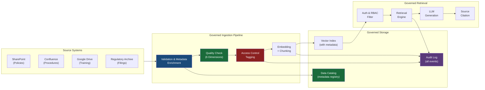
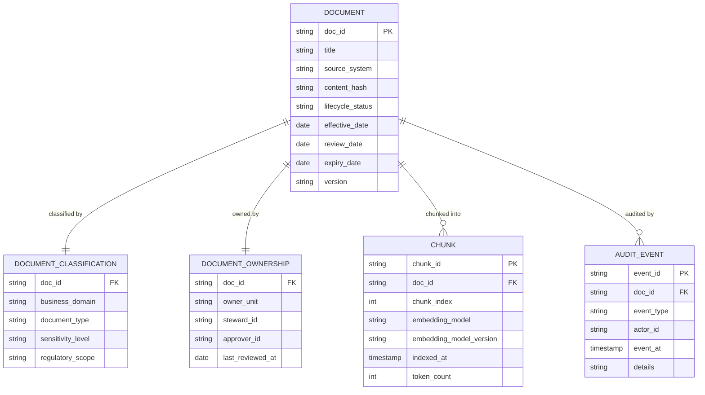
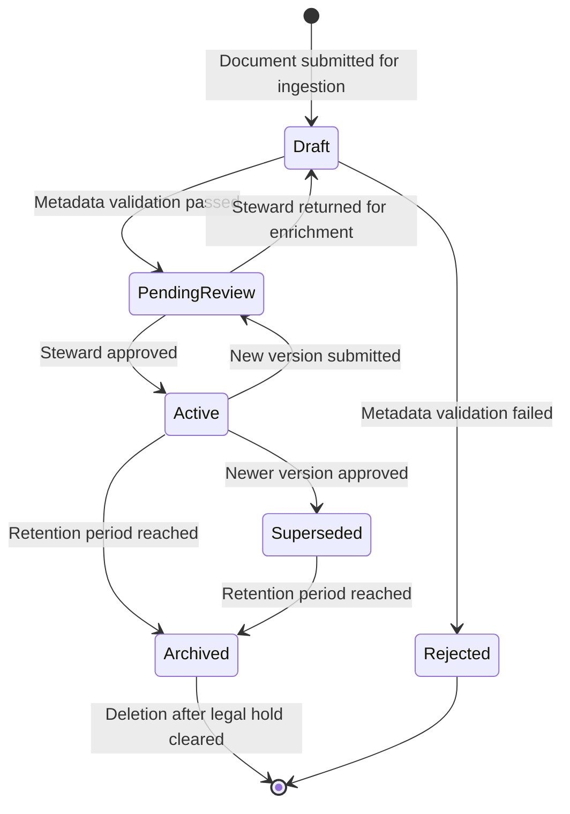
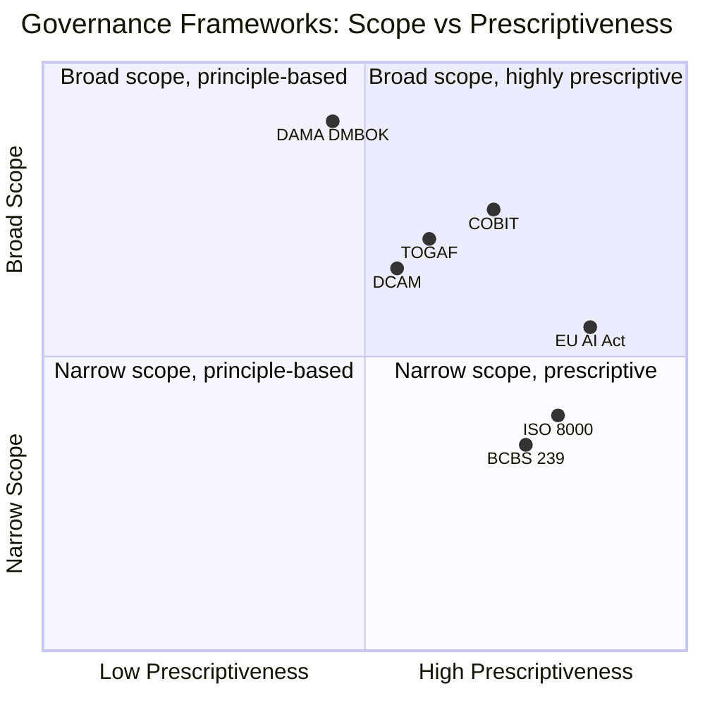

# DAMA DMBOK: The Data Governance Framework Every Data Engineer Should Know

Picture this: a large retail bank has decided to build a corporate knowledge base — a system where employees can ask questions in natural language and get accurate answers drawn from internal policy documents, regulatory filings, product manuals, and historical case records. The ambition is real and the use case is compelling. The engineering team builds a RAG pipeline, indexes thousands of documents, wires up a language model, and ships a demo that impresses everyone in the room.

Six months later, the system is a liability. Nobody knows which version of the AML policy is in the index. Documents from decommissioned products are returning as results. Customer PII from old case files is leaking into responses. The compliance team is furious. Nobody can answer the auditor's question: *who approved the ingestion of that document, and when?*

This is not an engineering failure. The models are working correctly. The retrieval is accurate. The failure is a **governance failure** — and it's the most common failure mode for enterprise AI systems that nobody talks about until it's too late.

DAMA DMBOK (the Data Management Body of Knowledge, published by the Data Management Association International) is the industry-standard framework that exists precisely to prevent this scenario. It's been around since 2009, updated to version 2.0 in 2017, and is currently undergoing a third revision (DMBOK 3.0, launched in 2025) that explicitly addresses AI, cloud-native architectures, and the new realities of language model pipelines.

Most engineers have heard the name. Few have internalized what it actually says. Let's change that.

## What is DAMA?

DAMA International is a non-profit association of information and data management professionals, founded in 1988. Think of it as the IEEE for data management — a professional body that publishes standards, certifications, and the canonical body of knowledge for the field.

The DMBOK is their flagship publication: a comprehensive guide covering every dimension of how organizations should manage data as a strategic asset. It defines what data management *is*, what its constituent disciplines are, and how those disciplines relate to one another. It's not a tool, a platform, or a vendor product. It's a vocabulary and a framework — the shared language that allows data engineers, CDOs, compliance officers, and auditors to talk about the same things with the same words.

The current standard is **DMBOK 2.0** (published 2017). It defines **11 knowledge areas** organized around a central concept: that data governance is not one activity among many, but the thread that runs through all of them.

## The DAMA Wheel: 11 Knowledge Areas

The visual centerpiece of DMBOK is the **DAMA Wheel** — a diagram showing data governance at the hub, with ten other knowledge areas arranged around it like spokes. The design is deliberate. Governance is not an afterthought applied on top of an existing data practice. It's the mechanism through which all other data management activities are coordinated, authorized, and held accountable.

Here's how the 11 knowledge areas are organized:

```mermaid
flowchart TD
    DG["🏛 Data Governance\n(Center — Policy, Roles, Standards)"]
    DA["1. Data Architecture"]
    DM["2. Data Modeling & Design"]
    DS["3. Data Storage & Operations"]
    DSec["4. Data Security"]
    DInt["5. Data Integration & Interoperability"]
    Meta["6. Metadata Management"]
    DQ["7. Data Quality Management"]
    MDM["8. Reference & Master Data"]
    DWA["9. Data Warehousing & Analytics"]
    DCM["10. Data Content Management"]

    DG --> DA
    DG --> DM
    DG --> DS
    DG --> DSec
    DG --> DInt
    DG --> Meta
    DG --> DQ
    DG --> MDM
    DG --> DWA
    DG --> DCM

    style DG fill:#1a4a7a,color:#ffffff
    style DA fill:#2d6a9f,color:#ffffff
    style DM fill:#2d6a9f,color:#ffffff
    style DS fill:#2d6a9f,color:#ffffff
    style DSec fill:#8b2020,color:#ffffff
    style DInt fill:#2d6a9f,color:#ffffff
    style Meta fill:#1a6b3a,color:#ffffff
    style DQ fill:#1a6b3a,color:#ffffff
    style MDM fill:#1a6b3a,color:#ffffff
    style DWA fill:#2d6a9f,color:#ffffff
    style DCM fill:#2d6a9f,color:#ffffff
```



This isn't a hierarchy — it's a dependency graph. Every knowledge area *produces* something that governance needs to oversee, and every knowledge area *requires* governance decisions to function properly. Let's walk through each one clearly.

### 1. Data Governance

**Definition:** The exercise of authority and control (planning, monitoring, and enforcement) over the management of data assets.

This is the central discipline. Data governance answers three questions:
- **Who decides** what happens to data? (authority)
- **How are those decisions enforced?** (control)
- **Are we doing it consistently?** (monitoring)

In practice, governance manifests as policies ("PII must be masked before ingestion into the knowledge base"), standards ("all documents must carry a `data_classification` metadata tag"), roles ("the Data Steward for Retail Banking approves all document additions to their domain"), and accountability mechanisms ("every ingestion event must produce an audit log entry").

Governance is not bureaucracy for its own sake. Every policy exists because someone, somewhere, suffered the consequences of not having it.

### 2. Data Architecture

**Definition:** The overall structure of an organization's data — how data flows, where it lives, and how systems connect.

Data architecture defines blueprints: the conceptual model of what data exists in the organization, the logical model of how entities relate to each other, and the physical model of where data actually sits. For a bank building a knowledge base, architecture answers questions like: which source systems own which documents? How does a policy document travel from the Legal SharePoint to the knowledge base vector index? What happens when it's updated?

### 3. Data Modeling & Design

**Definition:** The process of discovering, analyzing, and representing data requirements in precise form.

Data models are the schematic drawings of data. A conceptual model says "we have customers, products, and transactions." A logical model defines their attributes and relationships precisely. A physical model translates those into actual database tables, document schemas, or embedding metadata schemas.

For the knowledge base, data modeling governs things like: what fields does a `Document` record have? How do we represent the relationship between a document and the business domain it belongs to? What's the schema for chunk metadata?

### 4. Data Storage & Operations

**Definition:** The design, implementation, and support of stored data to maximize its value.

This covers everything from database administration to storage tiering, backup, archival, and performance tuning. In the knowledge base context: where are raw documents stored? Where do embeddings live? What's the retention policy for archived documents? How do you recover if the vector index is corrupted?

### 5. Data Security

**Definition:** Planning, development, and execution of security policies and procedures to provide proper authentication, authorization, access, and auditing of data.

Data security in DAMA is not just about firewalls. It's about ensuring that only the right people can see the right data at the right time, and that every access event is logged. For a bank this is non-negotiable — confidentiality of customer data, role-based access to sensitive documents (e.g., only credit analysts can retrieve credit policy), and audit trails for every query.

### 6. Data Integration & Interoperability

**Definition:** Processes related to the movement and consolidation of data within and between data stores, applications, and organizations.

This knowledge area covers ETL/ELT pipelines, API-based data exchange, real-time streaming, and the challenge of making data from different source systems speak the same language. In the knowledge base, integration governance means: how do documents from HR systems, legal repositories, product documentation, and regulatory filings all end up in a single index without conflicts? Who owns the transformation logic?

### 7. Metadata Management

**Definition:** Planning, implementation, and control of activities to enable access to high-quality, integrated metadata.

Metadata is data about data. The title of a document is metadata. Its author, creation date, classification, business domain, and last review date are all metadata. A document's chunk IDs, embedding model version, and index timestamp are technical metadata. Metadata management governs how this information is defined, maintained, and made discoverable. It's arguably the most critical knowledge area for knowledge base systems — we'll spend significant time on it below.

### 8. Data Quality Management

**Definition:** The planning, implementation, and control of activities that apply quality management techniques to data.

Data quality is about fitness for purpose. A document that's accurate but three years out of date is not quality data for a compliance query. Data quality management defines quality dimensions (more on this shortly), establishes measurement processes, and creates feedback loops for remediation. For the knowledge base: how do you know the information a user receives is current, accurate, and complete?

### 9. Reference & Master Data Management

**Definition:** Ongoing reconciliation and maintenance of core, shared data to support consistency across systems.

Reference data is the stable lookup tables that other data depends on: country codes, currency codes, product categories, regulatory classification codes. Master data is the single authoritative record for key business entities: a customer, a product, a counterparty. MDM ensures these are consistent across systems. In the knowledge base, reference data might include the taxonomy of business domains ("Retail Banking", "Institutional Banking", "Risk & Compliance") that documents are tagged with — if these aren't standardized, filtering and retrieval by domain becomes unreliable.

### 10. Data Warehousing & Business Intelligence

**Definition:** Planning, implementation, and control of processes to provide decision-support data.

This covers the analytics infrastructure — data warehouses, data marts, OLAP cubes, reporting dashboards. For a bank building a knowledge base, this knowledge area connects to how usage analytics are tracked (which documents are retrieved most? Which queries return no results?) and how that information feeds back into governance decisions.

### 11. Data Content Management

**Definition:** Planning, implementation, and control of activities to manage the lifecycle of data and information in any format.

This is the catch-all for unstructured and semi-structured content — documents, images, video, web pages, emails. It covers content creation standards, versioning, archival, and disposal. For a document-heavy knowledge base in a bank, this knowledge area is fundamental: document lifecycle governance, version control for policies, retention schedules mandated by regulation.

## Five Knowledge Areas That Define Your Knowledge Base

Not all 11 areas are equally relevant when you're building an AI knowledge base. Let's go deeper on the five that will make or break the project.

### Metadata Management: The Library Card of Your Data

Imagine a library with no catalog. Books are on shelves, but there's no card system, no ISBN, no subject index. You can see a book if you know exactly where to stand, but you can't discover it, can't tell if it's been updated, can't know if another shelf has a more recent edition of the same text. This is what a knowledge base without metadata management looks like.

Metadata management defines three types of metadata:

**Business metadata** answers "what does this data mean to the business?" For a document in the knowledge base: *What process does this policy govern? Which business unit owns it? Who approved the current version? What's the effective date?*

**Technical metadata** answers "how is this data structured and where does it live?" For an ingested chunk: *Which document did this come from? What chunking strategy was used? Which embedding model version produced the vector? When was it indexed?*

**Operational metadata** answers "what happened to this data?" For an ingestion event: *When was this document ingested? Who triggered the ingestion? Did any validation steps fail? What source system was it pulled from?*

The DAMA DMBOK defines a **metadata registry** as the central store for all metadata definitions — the "dictionary of dictionaries." In practice, this becomes your data catalog. Tools like Apache Atlas, Collibra, Alation, or even a well-maintained BigQuery schema with descriptive column comments serve this function.

### Data Quality: Six Dimensions That Matter

DAMA identifies 65 data quality dimensions in its full framework, but narrows to **six core dimensions** as the ones most directly tied to business outcomes:

| Dimension | Definition | Bank Knowledge Base Example |
|---|---|---|
| **Accuracy** | Data correctly represents real-world values | The interest rate in a product document matches the current rate in the core banking system |
| **Completeness** | No required data is missing | Every document has a business domain tag, author, and effective date |
| **Consistency** | No conflicting information about the same entity across sources | The AML policy has the same version number in the knowledge base and the legal repository |
| **Timeliness** | Data is sufficiently current for the task | A document superseded 18 months ago is not returned for compliance queries |
| **Uniqueness** | No unintended duplication | The same policy document hasn't been ingested twice under different filenames |
| **Validity** | Data conforms to defined format and business rules | Document classification values come from the approved taxonomy, not free-text strings |

These dimensions don't apply abstractly — you measure them with rules. A quality rule for *timeliness* might be: "no document with a `review_date` more than 24 months in the past may be returned in compliance-related queries." A quality rule for *completeness* might be: "documents missing `business_domain` or `effective_date` metadata are quarantined until enriched."

### Data Security: Access Control Is Not Optional

Banks operate under some of the strictest data security regimes of any industry. DAMA's data security knowledge area distinguishes between:

- **Authentication** — verifying who you are
- **Authorization** — determining what you're allowed to see
- **Access control** — enforcing those determinations at query time
- **Auditing** — recording what you accessed and when

For an AI knowledge base, these translate directly. A retail banker querying the system should not receive documents from the credit risk methodology library. A junior analyst should not retrieve documents marked `CONFIDENTIAL — EXECUTIVE ONLY`. And every single query-response pair should produce an audit log entry with the user identity, timestamp, retrieved document IDs, and response.

This is not a nice-to-have. The EU AI Act (fully effective August 2026) requires financial institutions deploying AI systems to maintain audit trails and demonstrate that outputs are traceable to their sources. DAMA's security framework gives you the governance scaffolding to build those audit mechanisms correctly.

### Reference & Master Data: The Taxonomy Is the Foundation

A knowledge base that can't reliably filter by business domain, document type, or regulatory classification is not an enterprise system — it's a prototype. Reference and master data management ensures that the controlled vocabularies your metadata tags draw from are stable, consistent, and centrally managed.

For the bank knowledge base, this means: who maintains the authoritative list of business domains? If one team calls it "Retail Banking" and another calls it "Personal Banking," queries filtered by domain will miss half the relevant documents. Reference data management designates an owner, defines the valid values, version-controls the vocabulary, and synchronizes it across all systems that use it.

### Data Content Management: Every Document Has a Lifecycle

Documents don't live forever — and in a regulated environment, they shouldn't. Data content management governs the full lifecycle: creation, review, publication, versioning, archival, and disposal. For the knowledge base this means:

- When a policy is updated, the previous version must be superseded (not deleted — archived with appropriate metadata)
- Regulatory retention schedules must be enforced (some documents must be retained for 7 years; some must be deleted after 3)
- The system must distinguish between `ACTIVE`, `SUPERSEDED`, `ARCHIVED`, and `DRAFT` documents — and behave differently for each

## The Bank Knowledge Base: Architecture Through a DAMA Lens

Let's make this concrete. The bank wants to build a knowledge base capable of answering questions across five content domains:

1. **Product documentation** — terms, fees, product guides
2. **Policy documents** — internal operating procedures, risk policies, credit policies
3. **Regulatory filings** — compliance reports, audit findings, regulatory correspondence
4. **Training materials** — onboarding content, process guides
5. **Case histories** — anonymized examples of past decisions (for compliance training)

Without DAMA thinking, this is a vector database indexing problem. With DAMA thinking, it becomes a governance problem with a vector database inside it.

Here's what the governed architecture looks like:



Every stage in this pipeline corresponds to a DAMA knowledge area. The source systems connection is **Data Integration**. The validation and metadata enrichment step exercises **Metadata Management** and **Data Quality**. The access control tagging is **Data Security**. The catalog is **Metadata Management** again. The audit log touches **Data Governance** itself. The RBAC filter at retrieval time is **Data Security** once more.

This is what DAMA means when it says governance is a thread running through every activity, not a box at the end.

## Metadata Schema Design: Turning Policy into Schema

The most concrete output of a governance project is a metadata schema — the formal definition of what fields every data object must carry. Here's what a governed document schema looks like for the bank knowledge base:



This schema is not arbitrary. Each field exists because a governance requirement demands it:

- `lifecycle_status` exists because data content management requires tracking document state
- `sensitivity_level` exists because data security requires access control decisions at retrieval time
- `steward_id` exists because governance requires accountability — someone's name is on every document
- `embedding_model_version` exists because technical metadata management requires traceability of AI artifacts
- `content_hash` exists because data quality management requires detecting duplicate ingestion

The AUDIT_EVENT table is not optional. It's the materialization of the governance principle that every state change must be recorded.

## Document Lifecycle Governance

Documents in the knowledge base aren't static. They're created, reviewed, approved, published, updated, superseded, and eventually archived or deleted. Each transition requires governance controls. The document lifecycle state machine, through a DAMA lens:



The key insight here: when a document moves from `Active` to `Superseded`, the old version is **not deleted**. It's retained with its status updated, so that audit queries (e.g., "what policy was in effect on March 14th, 2024 when this decision was made?") can still be answered correctly. This is a data content management requirement, and it's one that vector database engineers frequently forget to build.

## Data Stewardship in Practice: Roles and Responsibilities

DAMA defines **data stewardship** as the collection of practices that ensure data is accessible, usable, safe, and trusted. Stewards are the human accountability layer in a governance framework. Without them, governance is a set of documents nobody enforces.

For the bank knowledge base, a realistic stewardship structure looks like this:

| Role | Responsibility | Knowledge Area |
|---|---|---|
| **Chief Data Officer (CDO)** | Sets governance policy, owns the framework | Data Governance |
| **Data Domain Steward** | Approves document ingestion for their domain | Data Content Management, Data Governance |
| **Metadata Steward** | Maintains the data catalog and taxonomy | Metadata Management |
| **Data Quality Analyst** | Runs quality checks, investigates failures | Data Quality Management |
| **Data Security Officer** | Manages RBAC rules and access control policies | Data Security |
| **Data Architect** | Owns the metadata schema and pipeline design | Data Architecture, Data Modeling |
| **Knowledge Base Engineer** | Operates the pipeline and vector index | Data Storage, Data Integration |

The critical point: every document in the knowledge base has a named **Data Domain Steward** responsible for it. When the compliance team asks "who approved the ingestion of this AML policy," there is always a human answer. Stewardship is what makes governance auditable.

## From Governance to Code: Quality Rules as Pipeline Logic

Governance policies are only real when they're enforced in code. Here's what translating DAMA quality dimensions into an ingestion pipeline looks like in practice:

```python
from dataclasses import dataclass
from datetime import datetime, date
from enum import Enum
from typing import Optional
import hashlib

class LifecycleStatus(str, Enum):
    DRAFT = "draft"
    PENDING_REVIEW = "pending_review"
    ACTIVE = "active"
    SUPERSEDED = "superseded"
    ARCHIVED = "archived"
    REJECTED = "rejected"

# Controlled vocabulary for business domains — Reference Data Management
VALID_BUSINESS_DOMAINS = {
    "retail_banking", "institutional_banking", "risk_compliance",
    "credit", "treasury", "operations", "hr", "legal"
}

VALID_SENSITIVITY_LEVELS = {"public", "internal", "confidential", "restricted"}

VALID_DOCUMENT_TYPES = {
    "policy", "procedure", "regulatory_filing", "training_material",
    "product_guide", "case_study", "audit_report"
}

@dataclass
class DocumentMetadata:
    doc_id: str
    title: str
    source_system: str
    business_domain: str
    document_type: str
    sensitivity_level: str
    effective_date: date
    review_date: date
    steward_id: str
    version: str
    content_hash: str
    lifecycle_status: LifecycleStatus = LifecycleStatus.DRAFT

@dataclass
class QualityViolation:
    dimension: str   # which DAMA dimension was violated
    field: str
    rule: str
    severity: str    # "blocking" or "warning"

def validate_document_metadata(
    meta: DocumentMetadata,
    existing_hashes: set[str]
) -> list[QualityViolation]:
    """
    Applies DAMA data quality rules before ingestion.
    Returns violations; blocking violations prevent ingestion.
    """
    violations = []
    today = date.today()

    # Completeness: required fields must not be empty
    required_fields = {
        "title": meta.title,
        "business_domain": meta.business_domain,
        "document_type": meta.document_type,
        "sensitivity_level": meta.sensitivity_level,
        "steward_id": meta.steward_id,
        "version": meta.version,
    }
    for field, value in required_fields.items():
        if not value or not value.strip():
            violations.append(QualityViolation(
                dimension="completeness",
                field=field,
                rule=f"{field} must not be empty",
                severity="blocking"
            ))

    # Validity: values must come from controlled vocabularies
    if meta.business_domain not in VALID_BUSINESS_DOMAINS:
        violations.append(QualityViolation(
            dimension="validity",
            field="business_domain",
            rule=f"Must be one of {VALID_BUSINESS_DOMAINS}",
            severity="blocking"
        ))

    if meta.sensitivity_level not in VALID_SENSITIVITY_LEVELS:
        violations.append(QualityViolation(
            dimension="validity",
            field="sensitivity_level",
            rule=f"Must be one of {VALID_SENSITIVITY_LEVELS}",
            severity="blocking"
        ))

    if meta.document_type not in VALID_DOCUMENT_TYPES:
        violations.append(QualityViolation(
            dimension="validity",
            field="document_type",
            rule=f"Must be one of {VALID_DOCUMENT_TYPES}",
            severity="blocking"
        ))

    # Timeliness: documents with expired review dates need steward confirmation
    if meta.review_date < today:
        days_overdue = (today - meta.review_date).days
        violations.append(QualityViolation(
            dimension="timeliness",
            field="review_date",
            rule=f"Review date {meta.review_date} is {days_overdue} days past. Steward must confirm document is still current.",
            severity="blocking" if days_overdue > 180 else "warning"
        ))

    # Uniqueness: detect duplicate content via content hash
    if meta.content_hash in existing_hashes:
        violations.append(QualityViolation(
            dimension="uniqueness",
            field="content_hash",
            rule="Document with identical content already exists in index",
            severity="blocking"
        ))

    return violations


def compute_content_hash(content: str) -> str:
    # Normalize whitespace before hashing so formatting differences don't create false uniqueness
    normalized = " ".join(content.split())
    return hashlib.sha256(normalized.encode()).hexdigest()
```

This code is the materialization of governance policy. The `VALID_BUSINESS_DOMAINS` set is the reference data vocabulary managed by the Metadata Steward. The timeliness check enforces the 180-day maximum document age policy defined by the Data Quality team. The uniqueness check prevents the "same policy ingested twice under different filenames" failure mode that plagued the team in our opening story.

Notice that **blocking violations prevent ingestion**. The document doesn't just get a warning label and enter the index anyway — it gets routed to the `REJECTED` or `PENDING_REVIEW` state and the Data Domain Steward is notified. Governance only works if it has teeth.

## Access Control at Retrieval Time

Governance doesn't end at ingestion. Every query must respect access controls:

```python
from typing import Any

# Role-to-domain access mappings — managed by Data Security Officer
ROLE_ACCESS_POLICY: dict[str, dict[str, Any]] = {
    "retail_banker": {
        "allowed_domains": {"retail_banking", "hr", "operations"},
        "max_sensitivity": "internal",
        "excluded_types": {"audit_report", "regulatory_filing"},
    },
    "credit_analyst": {
        "allowed_domains": {"credit", "retail_banking", "risk_compliance"},
        "max_sensitivity": "confidential",
        "excluded_types": set(),
    },
    "compliance_officer": {
        "allowed_domains": VALID_BUSINESS_DOMAINS,  # full access
        "max_sensitivity": "restricted",
        "excluded_types": set(),
    },
    "executive": {
        "allowed_domains": VALID_BUSINESS_DOMAINS,
        "max_sensitivity": "restricted",
        "excluded_types": set(),
    },
}

SENSITIVITY_RANK = {"public": 0, "internal": 1, "confidential": 2, "restricted": 3}

def build_retrieval_filter(user_role: str, user_id: str) -> dict:
    """
    Translates DAMA security policy into a metadata filter
    applied at vector retrieval time.
    Every query runs through this — no exceptions.
    """
    policy = ROLE_ACCESS_POLICY.get(user_role)
    if not policy:
        # Unknown role: fail closed (deny all access)
        raise PermissionError(f"No access policy defined for role: {user_role}")

    max_rank = SENSITIVITY_RANK[policy["max_sensitivity"]]
    allowed_sensitivity = [
        level for level, rank in SENSITIVITY_RANK.items() if rank <= max_rank
    ]

    return {
        "must": [
            {"field": "lifecycle_status", "value": "active"},  # only active documents
            {"field": "business_domain", "values": list(policy["allowed_domains"])},
            {"field": "sensitivity_level", "values": allowed_sensitivity},
        ],
        "must_not": [
            {"field": "document_type", "values": list(policy["excluded_types"])}
        ] if policy["excluded_types"] else []
    }
```

The access filter is applied before the retrieval results are processed by the LLM. The model never sees documents the user isn't authorized to access — not because the LLM itself enforces security, but because the governance layer filters them out before the model touches them.

## DAMA 3.0: Where the Framework Is Heading

DAMA launched the DMBOK 3.0 initiative in 2025 as an "evergreening" effort — a structured update to address modern data realities that weren't on the horizon in 2017. Three major additions are shaping the revision:

**AI Governance integration.** DMBOK 3.0 explicitly addresses the AI model lifecycle as a data management problem. Models are trained on data, and the governance of that training data determines the model's behavior, biases, and compliance posture. The framework extends traditional data lineage concepts to cover model provenance: which dataset was this model trained on? Which version? Who approved its use in a production system?

**Cloud-native architecture.** The 2017 edition was written when most data infrastructure was on-premise. The 3.0 revision acknowledges that data now flows across cloud providers, SaaS systems, and hybrid architectures in ways that make traditional governance tooling insufficient. The framework addresses governance for event streams, data lakehouse architectures, and serverless pipelines.

**Responsible AI (RAI) requirements.** With the EU AI Act fully effective in August 2026 and state-level AI regulation expanding in the United States, DMBOK 3.0 codifies the governance practices needed to satisfy regulatory requirements: bias auditing, explainability documentation, human oversight mechanisms, and incident response procedures for AI failures.

The industry-wide responsible AI maturity score stood at 2.3/5.0 in 2026, up from 2.0 in 2025. Two-thirds of organizations are still operating below maturity level 3. DAMA provides the framework to close that gap — but frameworks only work when organizations commit to implementing them.

## Positioning DAMA Against Other Governance Frameworks

DAMA DMBOK doesn't exist in isolation. Organizations navigating governance choose from several frameworks, and they're not mutually exclusive:



**DAMA DMBOK** is the broadest-scope framework and moderately prescriptive — it tells you *what* to govern and *why*, but leaves the *how* to your organization's context.

**COBIT** (Control Objectives for Information and Related Technologies) is more prescriptive and focuses on IT governance broadly; many banks use COBIT for IT risk and DAMA for data management.

**BCBS 239** (Basel Committee on Banking Supervision Principles for Risk Data Aggregation) is specifically for banking risk data — a narrow but extremely prescriptive regulatory standard that DAMA governance practices support.

**ISO 8000** focuses specifically on data quality standards with detailed measurement criteria.

For a bank building a knowledge base, the practical answer is: use **DAMA as your operating framework**, implement **BCBS 239** compliance practices for any risk data that flows through the system, and ensure your audit capabilities satisfy **EU AI Act** requirements. They're not competing — they're complementary layers of the same governance stack.

## Practical Checklist: Is Your Knowledge Base DAMA-Compliant?

Before going to production, answer these questions. Each corresponds to a DAMA knowledge area:

**Data Governance**
- [ ] Who is the accountable owner (Data Domain Steward) for each document in the index?
- [ ] Is there a governance policy document defining quality rules, access control policies, and lifecycle procedures?
- [ ] Is there a process for handling governance violations (blocked ingestion, expired documents, access control changes)?

**Metadata Management**
- [ ] Does every document have complete business metadata (domain, type, sensitivity, owner, effective date)?
- [ ] Does every chunk have complete technical metadata (embedding model, version, index timestamp)?
- [ ] Is there a data catalog where users can browse what's in the knowledge base?

**Data Quality**
- [ ] Are the six DAMA quality dimensions translated into specific, enforceable rules?
- [ ] Are blocking violations actually blocking (documents don't enter the index until resolved)?
- [ ] Is there a quality dashboard showing the health of the document corpus?

**Data Security**
- [ ] Is access control enforced at retrieval time (not just at ingestion)?
- [ ] Is every query-response pair logged with user identity and retrieved document IDs?
- [ ] Are audit logs stored separately from the knowledge base and protected from tampering?

**Data Content Management**
- [ ] Is there a document lifecycle state machine with defined transition rules?
- [ ] When a document is updated, is the previous version archived (not deleted)?
- [ ] Are regulatory retention schedules implemented and enforced?

**Reference & Master Data**
- [ ] Are controlled vocabularies (business domain taxonomy, sensitivity levels, document types) centrally managed and version-controlled?
- [ ] Is there a process for updating vocabularies and propagating changes to existing documents?

If you can answer yes to all of these, you have a governed knowledge base. If you can't, you have a prototype.

## Going Deeper

**Books:**
- DAMA International. (2017). *DAMA-DMBOK: Data Management Body of Knowledge, 2nd Edition.* Technics Publications.
  - The canonical reference. Dense but comprehensive — read Part 1 (Data Governance) and the chapters on Metadata Management and Data Quality for knowledge base projects.

- Redman, T. C. (2016). *Data Driven: Profiting from Your Most Important Business Asset.* Harvard Business Review Press.
  - Accessible treatment of data quality as a business problem, not just a technical one. Excellent for making the governance case to non-technical stakeholders.

- Ladley, J. (2019). *Data Governance: How to Design, Deploy, and Sustain an Effective Data Governance Program.* Academic Press.
  - Practical guide to actually *implementing* governance programs, including the organizational change management that DMBOK describes but doesn't prescribe.

- Sebastian-Coleman, L. (2013). *Measuring Data Quality for Ongoing Improvement.* Morgan Kaufmann.
  - Deep treatment of data quality measurement frameworks compatible with DAMA's quality dimension model.

**Online Resources:**
- [DAMA International Official Site](https://dama.org) — The source of truth for DMBOK, CDMP certification, and DAMA 3.0 updates. The DAMA 3.0 project page tracks the ongoing revision.

- [Atlan DAMA DMBOK Guide](https://atlan.com/dama-dmbok-framework/) — Excellent overview of all 11 knowledge areas with practical context; good for quickly orienting a team new to the framework.

- [Enterprise Knowledge: Data Governance for RAG](https://enterprise-knowledge.com/data-governance-for-retrieval-augmented-generation-rag/) — Practical treatment of how traditional data governance principles apply specifically to RAG pipelines and vector database systems.

- [DATAVERSITY — What is the DMBOK?](https://www.dataversity.net/what-is-data-concepts/what-is-the-data-management-body-of-knowledge-dmbok/) — Good practitioner perspective on how the framework gets used in real organizations.

**Videos:**
- Search for "DAMA DMBOK 2.0 overview" on YouTube — DAMA chapter presentations and conference talks regularly appear from DAMA International's chapter meetings. The DAMA Greater Boston chapter has produced solid educational content.

- Search for "data governance RAG enterprise 2025" on YouTube — DataOps conferences and vendor-hosted webinars (Collibra, Alation, Informatica) regularly publish practical implementations of the patterns described in this post.

**Academic Papers:**
- Batini, C., Cappiello, C., Francalanci, C., & Maurino, A. (2009). ["Methodologies for Data Quality Assessment and Improvement."](https://dl.acm.org/doi/10.1145/1541880.1541883) *ACM Computing Surveys*, 41(3).
  - The foundational academic treatment of data quality dimensions and measurement methodology that influenced DAMA's quality framework.

- Sidi, F., Shariat Panahy, P. H., Affendey, L. S., Jabar, M. A., Ibrahim, H., & Mustapha, A. (2012). ["Data Quality: A Survey of Data Quality Dimensions."](https://ieeexplore.ieee.org/document/6420957) *International Conference on Information Retrieval & Knowledge Management*, IEEE.
  - Survey of the full landscape of data quality dimensions, useful for understanding how the 6 DAMA core dimensions were selected from a broader universe.

- Lewis, P., et al. (2020). ["Retrieval-Augmented Generation for Knowledge-Intensive NLP Tasks."](https://arxiv.org/abs/2005.11401) *NeurIPS 2020*.
  - The RAG paper itself — understanding the architecture helps frame why governance (particularly metadata, quality, and access control) is fundamental to making RAG systems trustworthy in production.

**Questions to Explore:**
- DAMA DMBOK was written before large language models existed. Which knowledge areas need the most fundamental revision to address AI systems as first-class data artifacts — and what would that revision look like?
- Data quality dimensions were defined for structured tabular data. When a document is "accurate" in a vector database context (the embedding faithfully represents the text), but the text itself is outdated, which quality dimension is failing — and is the current DAMA framework sufficient to capture this distinction?
- Master data management was built for entities like customers and products. Can the same discipline be applied to the entities in a knowledge graph (concepts, relationships, claims)? What would a "single source of truth" mean for a fact stored in an LLM's weights versus a document in a retrieval index?
- Governance frameworks assume that someone is accountable for data. In an agentic AI system where one agent autonomously ingests, transforms, and routes documents to a knowledge base, who is the Data Steward — and how does accountability work when the actor is not a human?
- The EU AI Act requires "high-risk" AI systems to maintain audit trails and support human oversight. Does DAMA DMBOK, as currently written, provide sufficient scaffolding to satisfy these requirements — or does it need to be extended with specific AI-governance controls?
