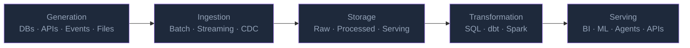
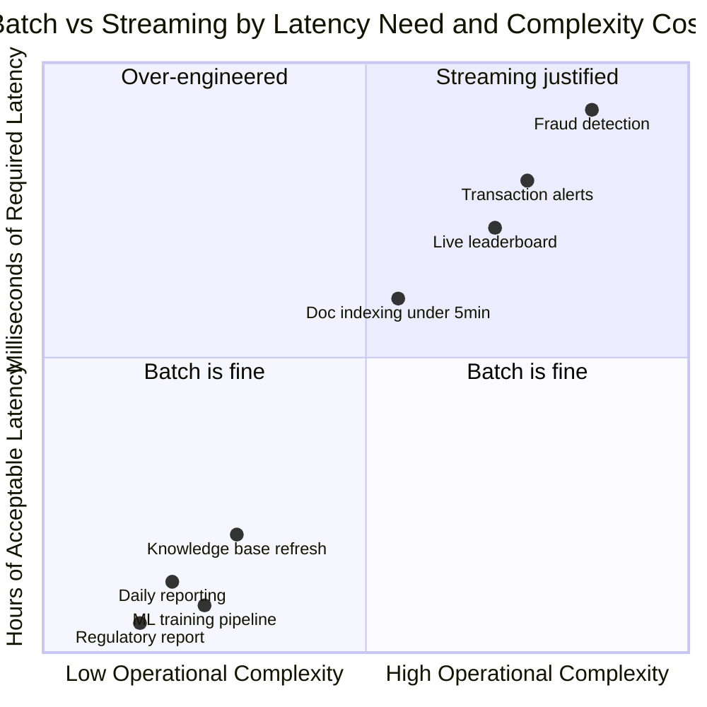
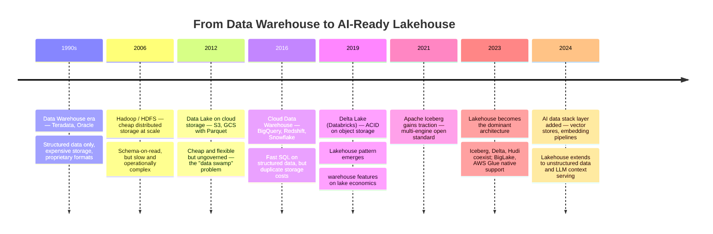
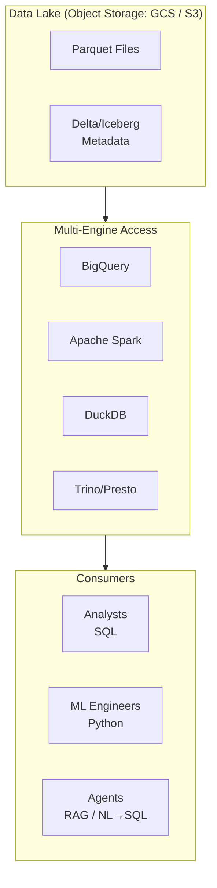
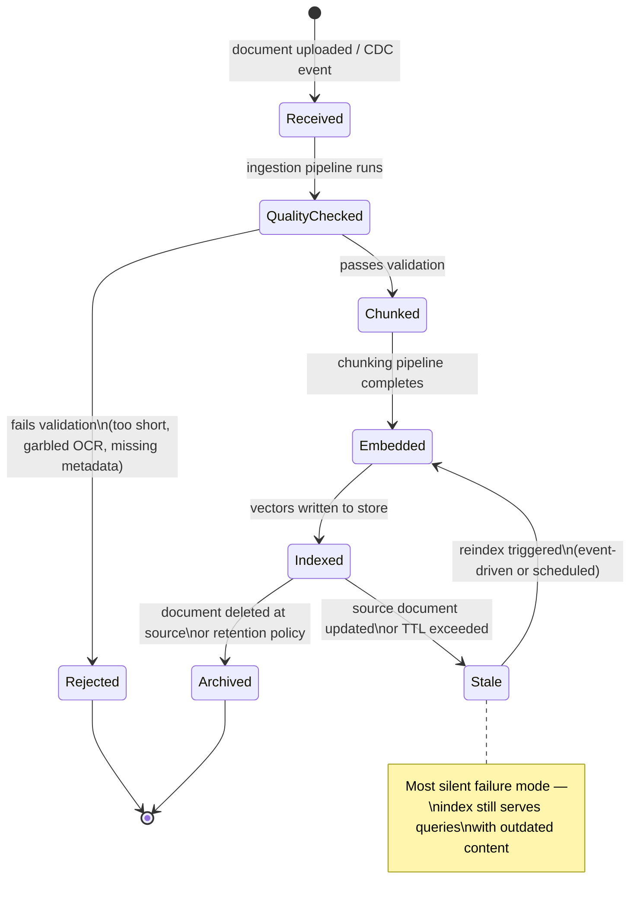

# Data Engineering Fundamentals: The Mental Model Every Engineer Needs

The failure wasn't in the model. The model was fine.

It was a production RAG pipeline — a knowledge base for a bank's internal operations team. Documents came in from seven different sources: a SharePoint site, three database tables, a nightly export from the core banking system, a folder of PDFs on a shared drive, and a real-time event stream for regulatory updates. The pipeline had been running for six weeks. The embeddings looked reasonable. The retrieval metrics were good. And then one day an agent started giving wrong answers — not hallucinated answers, but answers that were weeks out of date.

The investigation took three hours. The nightly export from the core banking system had silently changed its column schema on a routine maintenance window. An upstream team renamed `FECHA_ACTUALIZACION` to `FECHA_ULT_ACTUALIZACION`. The ingestion pipeline didn't fail — it just silently dropped that column and kept running. Six weeks of documents entered the knowledge base without their last-modified timestamps. The recency filter in the retrieval layer became useless. Fresh documents and stale documents looked identical to the retriever.

The model didn't know it was being lied to. How could it?

This is the actual job of a data engineer. Not moving files. Not writing SQL queries. Building systems so reliable, so observable, so governed that the data layer can be trusted the way a concrete foundation is trusted — without thinking about it, until the day you have to think about it very carefully.

The LLM era has made this harder and more important simultaneously. When an ML model consumes stale data, the consequences are statistical. When a language model does, the consequences are specific, confident, and wrong.

---

## What Data Engineers Actually Do

The job title is deceptive. "Data engineer" sounds like it means "engineer who works with data," which is too broad to be useful. A better description: **someone who designs and maintains the systems that move data from where it's generated to where it creates value, at scale, reliably, over time.**

Every word in that sentence carries weight.

**Systems** — not scripts. A pipeline you can't monitor, test, or recover from failure isn't a system, it's a risk.

**Move data** — but transformation is part of moving. Data is rarely useful in its raw form. The difference between raw click events and a daily active user count is a data engineer's work.

**Where it creates value** — data has no inherent value in storage. Value lives downstream: in a dashboard, in an ML model's training set, in an agent's retrieval corpus, in a regulatory report. Data engineering is always in service of something.

**At scale** — which changes everything. A SQL query that runs fine on a laptop hangs on 10 billion rows. A pipeline that works for one data source breaks in ways you didn't anticipate for fifty.

**Reliably, over time** — this is the hardest part. Data sources change. Schemas evolve. Upstream teams don't announce their changes. Downstream consumers add new requirements. The system that worked in January fails quietly in March because someone changed a field name.

In 2025, this job has expanded to include a new output: serving data to AI systems. Analysts used to be the primary consumer; now LLMs and agents are first-class downstream consumers with their own requirements — semantic structure, freshness windows, chunk quality, metadata completeness. This hasn't replaced data engineering; it's made it more consequential.

---

## The Data Lifecycle: Five Stages

Every data engineering problem sits somewhere in a five-stage lifecycle. Understanding which stage you're working on changes how you think about the problem.



### Stage 1: Generation

Data is generated constantly and everywhere — relational databases, IoT sensors, user interactions, file uploads, API calls, message queues. The data engineer rarely controls generation; the job is to consume it without breaking the source system and without losing fidelity.

The characteristics of generated data determine everything downstream. High-cardinality string columns blow up dictionary encoding. Inconsistent date formats are a perpetual source of NullPointerExceptions. Nested JSON from an API that changes structure without versioning is a reliability landmine. A data engineer who doesn't understand the source system is flying blind.

### Stage 2: Ingestion

Getting data into your infrastructure. This is where the batch vs. streaming decision lives (more on that shortly), and where connectors, CDC (change data capture), and event brokers live. Ingestion tools — Fivetran, Airbyte, Kafka Connect, Debezium — solve the "read from everywhere" problem.

The key insight in ingestion: **idempotency is not optional.** A pipeline that runs the same data twice must produce the same result. Network failures, infrastructure restarts, and operational mishaps make reruns inevitable. Design for them from day one.

### Stage 3: Storage

Raw data lands somewhere. Where and how it lands determines the rest. The modern answer is usually a lakehouse — cloud object storage with an open table format on top. The classic mistake is treating storage as an afterthought: dumping raw files into S3 or GCS without a schema, a retention policy, or a partition strategy, then wondering why queries are slow and nothing can be reproduced.

Storage has three logical layers that serve different purposes:

| Layer | Also Called | Purpose | Format |
|-------|-------------|---------|--------|
| Raw | Bronze, Landing | Full fidelity snapshot, audit trail | Parquet, JSON, Avro as-is |
| Processed | Silver, Cleaned | Validated, deduplicated, conformed | Parquet + Iceberg/Delta |
| Serving | Gold, Mart | Business-ready aggregates, feature tables | BigQuery tables, vector stores |

This three-layer pattern is the **medallion architecture**, popularized by Databricks and widely adopted. The value is clear separation between "what we received" (immutable) and "what we decided it means" (transformable).

### Stage 4: Transformation

Converting raw or processed data into forms that create value. This is where SQL, dbt, Spark, and Pandas live. It's also where most of the logic in a data system lives — business rules, metric definitions, deduplication, feature engineering.

The shift from ETL (transform before loading) to ELT (load then transform) has made this stage more powerful and more visible. When transformation happens inside the warehouse using SQL, every step is versioned, testable, and auditable.

### Stage 5: Serving

The output. Dashboards for analysts, training datasets for ML engineers, feature vectors for real-time inference, document chunks for a RAG pipeline, API responses for applications. The serving layer is where data creates value, and it's where data quality failures become visible to the business.

A data engineer who only thinks about storage and transformation and not about how data is consumed will build correct pipelines that serve the wrong thing.

---

## Batch or Streaming: The First Big Architectural Decision

Most engineers default to batch. They're right most of the time. But understanding when streaming is genuinely necessary — and when it's engineering theater — is a sign of seniority.

### What Batch Means in Practice

Batch processing runs on a schedule: every hour, every day, every fifteen minutes. You process a bounded dataset — all events from the last hour, all records updated since the last run — and produce output. Apache Spark is the canonical batch engine. BigQuery's scheduled queries, dbt transformations, Cloud Dataflow batch jobs: all batch.

Batch is predictable, debuggable, cheap, and mature. For the vast majority of reporting, ML training, and knowledge base pipelines, batch is the right answer.

### What Streaming Means in Practice

Stream processing handles unbounded data — data that keeps arriving. Each record (or small window of records) is processed as it arrives. Apache Kafka handles event transport; Apache Flink and Spark Structured Streaming handle computation.

The honest question to ask before choosing streaming: **what decision changes within the latency window of batch?**

If your fraud detection system needs to block a transaction in 200ms, you need streaming. If your knowledge base needs documents indexed within 5 minutes of upload, you need streaming. If your dashboard shows "last 24 hours" and refreshes every 15 minutes, batch is fine. Latency that doesn't change decisions is latency that doesn't justify the operational overhead.

### The Frameworks

| Framework | Primary Strength | Latency | Operational Complexity |
|-----------|-----------------|---------|------------------------|
| Apache Kafka | Event transport, durability | N/A (transport) | Medium |
| Apache Flink | True per-record streaming, exactly-once | Milliseconds | High |
| Spark Structured Streaming | Unified batch+stream API | Seconds (micro-batch) | Medium |
| Google Cloud Pub/Sub + Dataflow | Managed, GCP-native | Seconds | Low (managed) |
| Cloud Functions / Eventarc | Event-driven triggers | Near-real-time | Very low |

In December 2025, Spark 4.1 released a **Real-Time Mode** for Structured Streaming that targets millisecond latency — previously Flink's exclusive domain. The gap between the two engines has narrowed significantly.

What changes a decision about batch vs. streaming is latency — but latency requirements vary enormously by use case. Positioning them makes the choice more concrete than any rule of thumb:



Most use cases live in the bottom half — batch is the right answer. Streaming is justified when a human or automated system must act on data within seconds, and that action is impossible if the data arrives later.

### The Lambda Architecture and Why Teams Abandon It

The Lambda Architecture maintains two parallel pipelines: a batch layer for accuracy and a speed layer for low latency, with a serving layer that merges them. It sounds elegant in a slide deck. In practice, it means maintaining two codebases that must produce identical results but use different APIs, different semantics, and diverge over time as they're maintained by different people.

The **Kappa Architecture** — using a single streaming system for both historical reprocessing and real-time processing — is the cleaner answer when you genuinely need streaming. Most teams that have implemented Lambda and then switched have not looked back.

---

## Data Models: Beyond the Relational Table

A data model determines how data is structured, how it can be queried, and what trade-offs it makes. The relational model dominates because SQL is expressive, well-understood, and supported by every tool in the stack. But it's not the only model, and a data engineer who thinks only in tables will reach for SQL when a different structure would serve better.

### Relational Model

Tables, rows, columns, foreign keys, joins. The relational model has been around since 1970 (E.F. Codd's paper at IBM). Its strength is normalization — storing each fact exactly once — and the composability of joins. Its weakness is performance at scale: joins across billions of rows are expensive even with good indexes.

**When to use it:** Operational data (OLTP), anything with complex relationships that need to be queried dynamically, audit trails.

### Columnar Model

Still tables and rows conceptually, but stored column-by-column on disk rather than row-by-row. Parquet and ORC are columnar file formats. BigQuery and Redshift are columnar databases. The win is dramatic: a query that touches 3 of 200 columns reads 1.5% of the data that a row-oriented database would read.

**When to use it:** Analytical queries (OLAP), aggregate queries over many rows, anything in a data warehouse.

The insight is that read patterns determine storage layout. OLTP systems (many point lookups, small writes) want row orientation. OLAP systems (few queries, many rows, few columns) want column orientation.

### Document Model

Data stored as self-describing documents (JSON, BSON). No schema enforcement by default, flexible nested structures. Firestore, MongoDB, and Elasticsearch are document stores. The strength is schema flexibility and hierarchical data. The weakness is that ad-hoc analytical queries become expensive and error-prone without discipline.

**When to use it:** Semi-structured data with variable schemas, documents and configurations, content management.

### Time-Series Model

Data indexed primarily by time. InfluxDB, TimescaleDB, BigQuery's time-partitioned tables. The defining characteristic is that queries almost always have a time filter, and data is often downsampled or expired as it ages.

**When to use it:** Metrics, sensor data, logs, financial tick data, anything where "last 24 hours" is a natural query pattern.

### Graph Model

Entities as nodes, relationships as edges. Neo4j, Amazon Neptune, Google's Spanner Graph. Queries that follow relationship paths (find all accounts connected to this transaction within 3 hops) are inefficient in relational models but efficient in graph models.

**When to use it:** Fraud detection networks, knowledge graphs, social networks, permission hierarchies (see ReBAC in the Enterprise Knowledge Bases post).

### Vector Model

High-dimensional floating-point arrays representing semantic meaning. Each vector encodes a position in semantic space — close vectors have similar meaning. Pgvector in PostgreSQL, AlloyDB ScaNN, Qdrant, Weaviate, Pinecone. Queries are nearest-neighbor searches, not exact lookups.

**When to use it:** Semantic search, RAG retrieval, recommendation systems, anomaly detection on embeddings.

The vector model is the newest addition to this list and the one most data engineers are being asked to learn right now. Its key difference from all the others: **queries don't have a right answer, they have a best answer.** A vector search returns the k most similar vectors, not the exact match for a key. This probabilistic nature has implications for data quality, freshness management, and evaluation that don't have equivalents in the relational world.

```python
# The same "find recent product reviews about shipping" across models

# Relational (exact match on keywords)
query = """
SELECT review_id, content, created_at
FROM reviews
WHERE content ILIKE '%shipping%'
  AND created_at > NOW() - INTERVAL '30 days'
ORDER BY created_at DESC
LIMIT 10
"""

# Vector (semantic similarity — no keyword match needed)
embedding = embed("slow shipping, late delivery")
results = vector_db.query(
    collection="reviews",
    vector=embedding,
    filter={"created_at": {"$gte": thirty_days_ago}},
    limit=10
)
# Returns reviews semantically related to shipping problems
# even if they say "took forever to arrive" or "never showed up"
```

---

## The Lakehouse: When Lakes and Warehouses Merged



For a decade, organizations ran two parallel data systems. The **data warehouse** (Teradata, then BigQuery, Redshift, Snowflake) provided fast, structured, governed analytics over a managed schema. The **data lake** (S3 or GCS with Parquet files) provided cheap, flexible, schema-on-read storage for everything that didn't fit the warehouse — unstructured data, ML training data, logs.

These systems didn't talk to each other well. The warehouse was expensive to store everything in. The lake was cheap but ungoverned — teams nicknamed it the "data swamp." You needed the lake for storage economics and the warehouse for reliable analytics.

The **data lakehouse** is the architectural pattern that merges them. The idea: store everything in open formats on cheap object storage (GCS, S3, ADLS), then add a transactional metadata layer on top that gives you warehouse-like guarantees — ACID transactions, time travel, schema enforcement, efficient compaction.



### Open Table Formats: Iceberg, Delta Lake, Hudi

The metadata layer is provided by one of three open table formats. Understanding which one and why matters for any data engineer working in a modern stack.

**Apache Iceberg** is the format with the strongest vendor-neutral governance. Originally built at Netflix, donated to Apache in 2018. Its specification-first design means any engine (Spark, Flink, Trino, BigQuery, DuckDB) can read Iceberg tables without a proprietary SDK. In 2025, Iceberg is the format getting the most multi-vendor adoption. BigQuery natively reads BigLake Iceberg tables; Snowflake reads external Iceberg tables; AWS uses it in the Glue catalog.

**Delta Lake** was built at Databricks and is deeply integrated with the Databricks/Spark ecosystem. It's the easiest choice if you're already on Spark and don't need cross-engine access. Databricks introduced Delta 4.0 in 2025 with liquid clustering and improved streaming performance.

**Apache Hudi** (Hadoop Upserts Deletes and Incrementals) is optimized for record-level upserts and streaming ingestion patterns. Where Iceberg excels at analytics and schema evolution, Hudi excels at CDC (change data capture) pipelines that need frequent partial updates.

The pragmatic 2025 answer: **Iceberg if you need engine portability, Delta if you're on Databricks, Hudi if you have a streaming CDC-heavy workload.** In GCP specifically, BigLake with Iceberg is the supported lakehouse path.

### What Table Formats Give You

Beyond a schema, a table format adds:

- **ACID transactions** — concurrent writers don't corrupt each other's data
- **Time travel** — query the state of a table at any past point (`AS OF TIMESTAMP '2025-01-01'`)
- **Schema evolution** — add, rename, or drop columns without rewriting all data
- **Partition evolution** — change how data is partitioned without rewriting the table
- **Hidden partitioning** — Iceberg manages partition values without exposing them as explicit column filters
- **Small file compaction** — streaming writes produce many small files; the format handles merging them automatically

---

## ETL Is Dead, Long Live ELT

For decades, the standard pattern was Extract, Transform, Load: pull data from sources, transform it in a dedicated compute layer (Java/Scala jobs, SSIS packages, Informatica), then load the cleaned result into the warehouse. The transformation happened *before* reaching the destination.

This made sense when warehouse compute was expensive. You didn't want to load raw, unclean data into a system you were paying by the CPU-hour.

Two things changed this:

1. **Warehouse compute became cheap.** BigQuery charges per query, not per hour of idle compute. Snowflake's virtual warehouse model separates storage from compute. Running SQL transformations inside the warehouse is now economical.

2. **Cloud object storage became universal.** Loading raw data into a data lake costs almost nothing. The question of where to transform shifted from "where is compute?" to "where is the best transformation tool?"

The result: **ELT — Extract, Load, Transform.** Load raw data first. Transform it using SQL, inside the warehouse or lakehouse, versioned and auditable.

### dbt: The Transformation Layer That Changed Everything

dbt (data build tool) codified the ELT pattern. It turns SQL `SELECT` statements into a transformation DAG: each model is a query, dbt manages the dependencies between models, runs tests, generates documentation, and produces a lineage graph showing which tables depend on which.

```sql
-- models/silver/orders_cleaned.sql
-- dbt model: raw orders → validated, deduplicated orders

WITH source AS (
    SELECT * FROM {{ source('raw', 'orders') }}
),

validated AS (
    SELECT
        order_id,
        customer_id,
        CAST(order_date AS DATE) AS order_date,
        amount_cents / 100.0 AS amount_usd,
        status,
        created_at
    FROM source
    WHERE order_id IS NOT NULL
      AND customer_id IS NOT NULL
      AND amount_cents > 0
),

deduped AS (
    SELECT *,
        ROW_NUMBER() OVER (
            PARTITION BY order_id
            ORDER BY created_at DESC
        ) AS row_num
    FROM validated
)

SELECT * EXCEPT(row_num)
FROM deduped
WHERE row_num = 1
```

```yaml
# models/silver/schema.yml — tests run on every dbt build
models:
  - name: orders_cleaned
    columns:
      - name: order_id
        tests:
          - unique
          - not_null
      - name: amount_usd
        tests:
          - not_null
          - dbt_utils.accepted_range:
              min_value: 0
              max_value: 1000000
```

The shift dbt enabled: data transformations are now **software engineering artifacts**, not undocumented warehouse procedures. They live in git, have tests, get code reviews, produce documentation automatically, and show lineage. This changed data engineering from a craft practice to an engineering discipline.

### Reverse ETL

A newer pattern: after transforming data in the warehouse, pushing it *back* into operational systems — Salesforce, HubSpot, Slack, your bank's CRM. The warehouse becomes the source of truth, and operational tools become consumers. Tools like Hightouch and Census do this. For a bank, this means customer 360 data computed in BigQuery flowing back into the agent's context store.

---

## Orchestration: The Invisible Infrastructure

A data pipeline that runs once is a script. A data pipeline that runs reliably, on schedule, with retries on failure, alerting when something goes wrong, and a UI showing what ran and when — that's an orchestrated workflow.

Orchestration is the connective tissue of a data engineering system.

### What an Orchestrator Does

An orchestrator:
- **Schedules** tasks (cron expressions, event triggers, manual runs)
- **Manages dependencies** (task B runs after task A succeeds)
- **Handles failures** (retry with exponential backoff, alert on repeated failures, skip to next dependency)
- **Provides observability** (logs, run history, task duration, lineage)
- **Manages parallelism** (run 10 tasks concurrently without overwhelming upstream systems)

### The Landscape in 2025

**Apache Airflow** remains the most widely deployed orchestrator. Its DAG model — Python files that define task dependencies — is expressive but has a learning curve. The scheduler is complex. Dynamic DAGs (generating workflow structure at runtime) require workarounds. Cloud Composer on GCP is managed Airflow.

**Prefect** and **Dagster** emerged as modern alternatives with better developer experience. Dagster is opinionated about *data assets* — it models pipelines as transformations over data assets with built-in data quality checks and a software-defined catalog. For new greenfield projects, Dagster's asset-centric model is compelling.

**dbt Cloud** handles scheduling for dbt transformations specifically. If your transformation layer is entirely dbt, dbt Cloud's orchestration is often sufficient.

```python
# Dagster: data assets vs Airflow: tasks
# Dagster thinks in assets — what data does this produce?

from dagster import asset, AssetExecutionContext
import pandas as pd
from google.cloud import bigquery

@asset(
    description="Daily customer activity aggregated from raw events",
    tags={"layer": "silver", "domain": "customers"}
)
def customer_daily_activity(context: AssetExecutionContext) -> pd.DataFrame:
    client = bigquery.Client()
    query = """
    SELECT 
        customer_id,
        DATE(event_timestamp) AS activity_date,
        COUNT(*) AS event_count,
        COUNTIF(event_type = 'purchase') AS purchase_count
    FROM `project.raw.events`
    WHERE DATE(event_timestamp) = CURRENT_DATE() - 1
    GROUP BY 1, 2
    """
    df = client.query(query).to_dataframe()
    context.log.info(f"Loaded {len(df)} customer-day records")
    return df


@asset(
    description="Customer feature table for ML and agent retrieval",
    deps=[customer_daily_activity]
)
def customer_features(
    context: AssetExecutionContext,
    customer_daily_activity: pd.DataFrame
) -> pd.DataFrame:
    # Feature engineering on top of activity
    features = customer_daily_activity.groupby("customer_id").agg(
        avg_daily_events=("event_count", "mean"),
        total_purchases=("purchase_count", "sum"),
        active_days=("activity_date", "nunique")
    ).reset_index()
    return features
```

The asset-centric model Dagster promotes maps well to how data engineers should think: not "what tasks ran" but "what data was produced, when, from what inputs."

---

## Data Quality and Contracts

Bad data is more dangerous than no data. No data fails loudly. Bad data fails silently.

### Dimensions of Data Quality

The classical framework defines six dimensions:

| Dimension | Question | Example failure |
|-----------|----------|----------------|
| **Completeness** | Are all expected records present? | 10% of customer records missing email |
| **Accuracy** | Does the data match reality? | Account balance off by rounding |
| **Consistency** | Is the same fact the same across systems? | CRM says customer is active, warehouse says inactive |
| **Timeliness** | Is the data fresh enough for its use case? | Yesterday's embedding index serving today's queries |
| **Validity** | Does data conform to expected format/range? | Negative transaction amounts, future dates |
| **Uniqueness** | Are there unexpected duplicates? | Same transaction ID appearing twice |

For ML and agent systems, a seventh dimension has become critical: **semantic quality** — does the meaning encoded in a vector accurately represent the source content? A high-quality embedding of a low-quality document is still low-quality retrieval.

### Data Contracts: The Upstream Enforcement Layer

A data contract is a formal specification between a data producer and all downstream consumers. It documents: schema, expected null rates, acceptable value ranges, update frequency, and who to contact when something changes. Crucially, contracts are **enforced at the CI/CD level** — a producer cannot deploy a breaking change without the contract tests failing.

```yaml
# data-contract.yml — for the orders pipeline
apiVersion: 1.0.0
kind: DataContract
info:
  title: orders_raw
  owner: payments-team
  quality_tier: critical  # SLA: 99.9% freshness

schema:
  - name: order_id
    type: string
    required: true
    unique: true
    pattern: "^ORD-[0-9]{10}$"
  
  - name: amount_cents
    type: integer
    required: true
    minimum: 1
    maximum: 100000000
    
  - name: status
    type: string
    enum: ["pending", "confirmed", "shipped", "delivered", "cancelled"]
    
  - name: created_at
    type: timestamp
    required: true
    max_age_hours: 2  # must be ingested within 2 hours of creation

quality:
  freshness_sla_minutes: 120
  completeness_min_pct: 99.5
  null_rate_max:
    customer_id: 0.001
    amount_cents: 0.0
```

Tools like Soda, Great Expectations, and dbt tests implement the validation side. The cultural shift that makes contracts work: **data producers own data quality, not data consumers.**

This was the failure in the opening example. The upstream team that renamed `FECHA_ACTUALIZACION` wasn't malicious — they didn't know anyone depended on that exact column name. A data contract enforced in their deployment pipeline would have caught the breaking change before it reached production.

---

## Distributed Systems Concepts You Actually Need

Most data engineers don't need to implement distributed systems — the tools do that. But you need enough distributed systems vocabulary to reason about what the tools are trading off.

### Partitioning

Partitioning divides a large dataset across multiple machines (or files) so that queries can skip partitions that don't match the filter. In BigQuery, partitioning by date means a query for "last 30 days" scans 30 partitions instead of the whole table.

The key insight: **partition columns should match your most common query filters.** Partitioning by `created_date` when 80% of queries filter by `customer_region` is worse than no partitioning.

A rough sizing heuristic for BigQuery partitions: each partition should be between 1 GB and 1 TB after compression. Too small means excessive overhead; too large means poor pruning. For a time-partitioned table, this translates to a daily partition preference for data volumes in the tens to hundreds of GB per day:

$$\text{partition\_days} = \left\lceil \frac{\text{daily\_bytes}}{500 \text{ MB}} \right\rceil$$

But this is a starting point, not a formula — query patterns matter more than raw size.

### Replication

Replication keeps copies of data on multiple nodes for availability and durability. BigQuery, AlloyDB, and GCS handle replication transparently — you don't configure it. What you need to understand is the **replication lag**: in asynchronous replication, a replica can be milliseconds to seconds behind the primary. Reading from a replica while a write is in flight can produce stale results.

For most analytics workloads, this doesn't matter. For real-time serving (agent responses, live dashboards), it does.

### The CAP Theorem (What It Actually Means in Practice)

The CAP theorem states that a distributed system can guarantee at most two of three properties: **Consistency** (every read sees the most recent write), **Availability** (every request gets a response), **Partition tolerance** (the system keeps working when network partitions occur).

In practice, network partitions happen. So the real trade-off is C vs. A: when a partition occurs, does the system refuse requests to stay consistent, or does it return potentially stale data to stay available?

BigQuery is CP — it prioritizes consistency. A query always sees a consistent snapshot. Firestore in Datastore mode is CP by default. Cassandra is AP — it will serve requests even from a partitioned node, trading consistency for availability.

For a data engineer: know which consistency model your serving layer uses, and design downstream consumers accordingly.

### Idempotency and Exactly-Once Semantics

An idempotent operation produces the same result whether it runs once or a thousand times. This is the most practically important distributed systems concept for data engineering.

Every pipeline step should be idempotent:
- **Ingestion**: running the same ingestion twice should not produce duplicate records
- **Transformation**: rerunning a dbt model on the same data should produce the same output table
- **Loading**: upserting (not inserting) ensures reruns don't create duplicates

Exactly-once semantics in streaming means each event is processed exactly once even if the processing system crashes and restarts. Flink and Kafka provide exactly-once guarantees with careful configuration. They're operationally expensive — at-least-once with idempotent consumers is often sufficient and simpler.

---

## The Modern Data Stack in 2025

The "Modern Data Stack" (MDS) is a term for the set of cloud-native, composable tools that emerged in the 2018-2023 period as alternatives to monolithic data warehouses and ETL tools. By 2025, the stack has stabilized and is increasingly being augmented with AI-specific components.

```mermaid
flowchart LR
    subgraph sources["Sources"]
        S1[Operational DBs\nPostgres · MySQL · Oracle]
        S2[SaaS APIs\nSalesforce · Stripe]
        S3[Events\nKafka · Pub/Sub]
        S4[Files\nCSV · JSON · PDFs]
    end

    subgraph ingestion["Ingestion"]
        I1[Fivetran / Airbyte\nbatch connectors]
        I2[Debezium / Datastream\nCDC]
        I3[Kafka / Pub/Sub\nstreaming]
    end

    subgraph storage["Storage / Lakehouse"]
        ST1[GCS / S3\nobject storage]
        ST2[BigQuery / Snowflake\nwarehouse]
        ST3[Iceberg / Delta\ntable format]
    end

    subgraph transform["Transform"]
        T1[dbt\nSQL models + tests]
        T2[Spark / Dataflow\nheavy transforms]
    end

    subgraph orchestrate["Orchestrate"]
        O1[Cloud Composer\nmanaged Airflow]
        O2[Dagster\nasset-centric]
    end

    subgraph serve["Serve"]
        SV1[Looker / Metabase\nBI dashboards]
        SV2[Feature Store\nML training + inference]
        SV3[Vector DB\nRAG retrieval]
        SV4[NL→SQL Agent\noperational queries]
    end

    sources --> ingestion --> storage --> transform --> orchestrate
    transform --> serve
```



### The GCP Flavor

For a GCP-native stack — relevant for teams building on the Google Cloud ecosystem:

| Layer | Tool | Notes |
|-------|------|-------|
| Ingestion (CDC) | Datastream | Managed CDC from PostgreSQL, MySQL, Oracle to BigQuery |
| Ingestion (event) | Pub/Sub + Dataflow | Kafka-compatible streaming with managed Flink |
| Storage | GCS + BigLake | Object storage with Iceberg table format |
| Warehouse | BigQuery | Columnar, serverless, ACID (via BigQuery Storage API) |
| Transformation | dbt + BigQuery | dbt Cloud or self-hosted on Cloud Composer |
| Orchestration | Cloud Composer | Managed Airflow; Vertex AI Pipelines for ML workflows |
| Serving (BI) | Looker / Looker Studio | Google-native BI with semantic modeling |
| Serving (ML) | Vertex AI Feature Store | Online + offline feature serving |
| Serving (search) | AlloyDB + ScaNN | Vector + relational in one PostgreSQL-compatible DB |
| Serving (agents) | Vertex AI Agent Builder | Grounding with Google Search or custom data sources |

### AI Additions to the Stack

The LLM era has added three new first-class components:

**Vector stores** — AlloyDB, Vertex AI Vector Search, or self-hosted Qdrant/Weaviate on GKE. The data engineering challenge: embedding pipelines that keep the vector store fresh as source documents change. This is event-driven ingestion plus batch reindexing plus delta detection.

**Feature stores** — Vertex AI Feature Store manages the lifecycle of ML features: computation, serving, monitoring. The data engineer's job is ensuring feature pipelines are fresh, consistent across training and serving, and backfillable.

**Metadata and catalog** — Dataplex on GCP, Apache Atlas, OpenMetadata. With AI agents querying data directly via NL→SQL, the metadata layer becomes a retrieval corpus itself. A well-described table is a table an agent can query correctly without a human explaining the schema.

---

## Data Quality for AI: The New Frontier

Everything covered so far about data quality applies to analytics and ML. For AI agents, there are additional dimensions.

**Chunk quality matters differently than row quality.** In a relational pipeline, a null value is a known failure mode with known remediation. In an embedding pipeline, a chunk of poor-quality text — garbled OCR, HTML tags, encoding artifacts — becomes a semantically incorrect embedding. Its coordinates in vector space are wrong, but it doesn't look wrong to any schema validation.

**Metadata completeness is retrieval quality.** A vector with no `source_date` metadata can't be filtered by recency. A vector with no `department` metadata can't be scoped to permission-appropriate results. For RAG pipelines, metadata is not decorative — it is part of the retrieval contract.

**Freshness has a semantic component.** A stale row in a dashboard shows wrong numbers. A stale document in a RAG pipeline gives confident, specific, wrong answers. The business impact is categorically different.

The lifecycle of a document in an AI knowledge pipeline has more states than a row in a relational table — and each transition can fail silently:



```python
# Data quality validation for an embedding pipeline
from dataclasses import dataclass
from datetime import datetime, timedelta
from typing import Optional
import re

@dataclass
class DocumentQualityCheck:
    doc_id: str
    content: str
    source_date: Optional[datetime]
    department: Optional[str]
    language: Optional[str]

def validate_for_embedding(doc: DocumentQualityCheck) -> list[str]:
    """Returns list of quality issues. Empty list = document passes."""
    issues = []
    
    # Content quality
    if len(doc.content.strip()) < 100:
        issues.append("content_too_short")
    
    if len(re.findall(r'[^\x00-\x7F]', doc.content)) / max(len(doc.content), 1) > 0.3:
        issues.append("possible_encoding_corruption")
    
    html_density = len(re.findall(r'<[a-zA-Z][^>]*>', doc.content)) / max(len(doc.content.split()), 1)
    if html_density > 0.1:
        issues.append("html_not_stripped")
    
    # Metadata completeness
    if doc.source_date is None:
        issues.append("missing_source_date")  # breaks recency filtering
    
    elif doc.source_date < datetime.now() - timedelta(days=730):
        issues.append("source_date_older_than_2_years")  # may be stale
    
    if doc.department is None:
        issues.append("missing_department")  # breaks permission scoping
    
    if doc.language is None or doc.language not in ["es", "en"]:
        issues.append("unsupported_language")
    
    return issues


# In the ingestion pipeline
def ingest_document(doc: DocumentQualityCheck, index):
    issues = validate_for_embedding(doc)
    
    if "content_too_short" in issues or "html_not_stripped" in issues:
        # Hard failures: don't embed
        log_quality_failure(doc.doc_id, issues, severity="error")
        return
    
    if issues:
        # Soft failures: embed but flag
        log_quality_failure(doc.doc_id, issues, severity="warning")
    
    embedding = embed(doc.content)
    index.upsert(doc.doc_id, embedding, metadata={
        "source_date": doc.source_date.isoformat() if doc.source_date else None,
        "department": doc.department,
        "quality_issues": issues  # surfaced at retrieval time
    })
```

---

## Putting the Model Together

A data engineer doesn't specialize in any one stage or tool. The value is in understanding how stages connect — how a decision in ingestion constrains options in transformation, how a partition strategy chosen at storage time affects query performance at serving time, how a data quality failure at generation time compounds through every downstream system.

The mental model to hold:

**Data flows in one direction but quality failures flow in both.** Raw data moves forward: generate → ingest → store → transform → serve. But a quality issue in any stage propagates forward *and* the repair flows backward. When you find a stale document in a RAG index, you trace back to ingestion, then to the source schema change, then to the missing contract, then to the team that didn't know they had downstream consumers.

**Every abstraction hides a trade-off.** A managed service hides operational complexity but reduces observability (the AlloyDB RAG Engine's Spanner cost, described in the GCP post). ELT hides transformation complexity but increases warehouse costs. Streaming hides latency complexity but increases operational overhead.

**The job is building trust, not moving data.** The measure of a data pipeline's quality is not its throughput or its latency. It's whether the people and systems consuming its output trust it enough to make decisions without checking.

---

## Going Deeper

**Books:**

- Reis, J. & Housley M. (2022). *Fundamentals of Data Engineering.* O'Reilly Media.
  - The canonical modern text. Covers the full lifecycle with a tool-agnostic framework. Chapter 4 on "Choosing Technologies Across the Data Engineering Lifecycle" is worth reading twice.

- Kleppmann, M. (2017). *Designing Data-Intensive Applications.* O'Reilly Media.
  - The foundational text on distributed systems for practitioners. Chapters on replication, partitioning, and consistency are what every data engineer should understand. Despite the publication year, nothing in its fundamentals is outdated.

- Beauchemin, M. (2017). *Data Pipelines Pocket Reference.* O'Reilly Media.
  - A practical reference for pipeline patterns, not theory. Best kept open while building.

- Atwal, H. (2020). *Practical DataOps.* Apress.
  - Covers data quality, governance, and the organizational side of data engineering — the parts that don't fit neatly into technical books.

**Online Resources:**

- [Fundamentals of Data Engineering (course companion)](https://www.oreilly.com/library/view/fundamentals-of-data/9781098108298/) — The official O'Reilly companion with code examples.
- [dbt Documentation — Best Practices](https://docs.getdbt.com/best-practices) — The authoritative guide to SQL transformation patterns and dbt project structure.
- [Apache Iceberg Documentation](https://iceberg.apache.org/docs/latest/) — The spec and implementation docs. Understanding the metadata tree model (snapshots → manifests → data files) gives you the mental model for all other table formats.
- [The State of Data and AI Engineering 2025](https://lakefs.io/blog/the-state-of-data-ai-engineering-2025/) — lakeFS annual survey. Good signal on what's actually adopted vs. what's hyped.
- [Data Engineering Weekly Newsletter](https://www.dataengineeringweekly.com/) — Curated weekly with practical depth over marketing noise.

**Videos:**

- ["Data Engineering Fundamentals"](https://www.youtube.com/watch?v=VtzvF17ysbc) by Joe Reis (O'Reilly) — The Fundamentals of Data Engineering co-author walking through the book's core framework. Best first watch for the lifecycle model.
- [dbt Learn: Free Courses](https://courses.getdbt.com/) — The official dbt courses are production-quality and free. "dbt Fundamentals" and "Advanced dbt" cover the tool comprehensively with working exercises.

**Academic Papers:**

- Armbrust, M. et al. (2021). ["Lakehouse: A New Generation of Open Platforms that Unify Data Warehousing and Advanced Analytics."](https://www.cidrdb.org/cidr2021/papers/cidr2021_paper17.pdf) *CIDR 2021.*
  - The original Databricks paper defining the lakehouse architecture. Short and worth reading in full — the motivation for open table formats is laid out clearly here.

- Li, A. et al. (2024). ["Apache Iceberg: A Table Format for Huge Analytic Datasets."](https://arxiv.org/abs/2407.17418) *arXiv:2407.17418.*
  - The formal description of Iceberg's metadata model, partition spec evolution, and snapshot isolation. Understand this and you understand why Iceberg is winning.

- Shankar, S. et al. (2022). ["Operationalizing Machine Learning: An Interview Study."](https://arxiv.org/abs/2209.09125) *arXiv:2209.09125.*
  - Interviews with ML practitioners at major tech companies. The data quality sections are sobering — most production ML failures trace to data pipeline issues, not model issues.

**Questions to Explore:**

- The vector data model has no analog to foreign keys — there's no relational constraint between a chunk's vector and its source document's version. When a source document changes, the stale embedding remains in the index with no schema-level indication. How should the data engineering community design indexing pipelines that enforce referential integrity between vectors and their sources? What would a "vector foreign key" look like?

- The distinction between ETL and ELT presupposes a transformation layer that is separate from storage. What happens to this distinction in a world where LLMs can transform unstructured data in-line during ingestion — converting documents into structured extractions, normalizing schemas on the fly? Is there a name for this pattern, and what are its failure modes?

- Data contracts put quality enforcement at the producer. But for a bank with hundreds of upstream data producers — including legacy systems whose teams are long gone — enforcement at the source is not always possible. What are the architectural alternatives to source-level enforcement, and what guarantees can they actually provide?

- The lakehouse pattern decouples compute from storage, enabling multi-engine access to the same data. But this creates a consistency problem: Spark and BigQuery can both modify the same Iceberg table. How do open table formats prevent write conflicts, and what are the failure modes when two engines write concurrently in ways the ACID guarantees don't cover?

- Data observability platforms (Monte Carlo, Acceldata) position themselves as "data downtime" detectors, with the implicit analogy to infrastructure monitoring. But data quality failures are often gradual drifts rather than discrete outages — a column's null rate goes from 0.1% to 0.8% over three weeks. What alerting strategies distinguish signal from noise in data quality monitoring, and how should threshold-setting be approached for pipelines serving AI systems?
