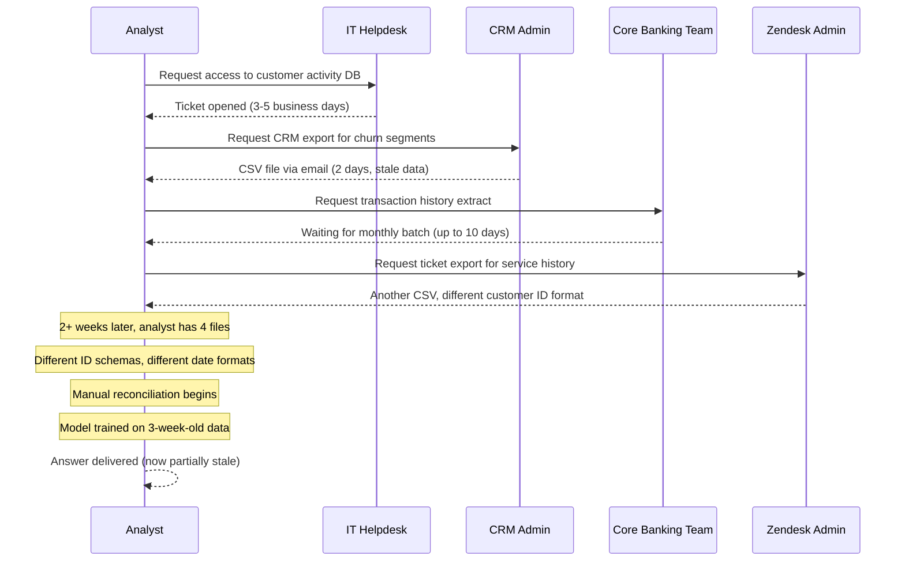
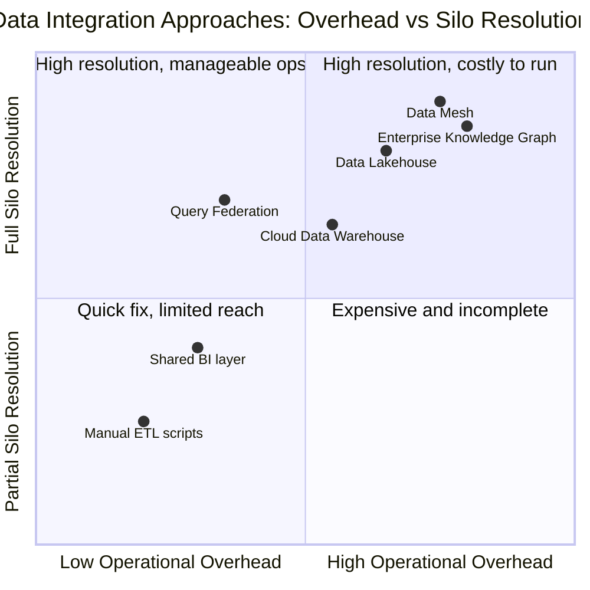
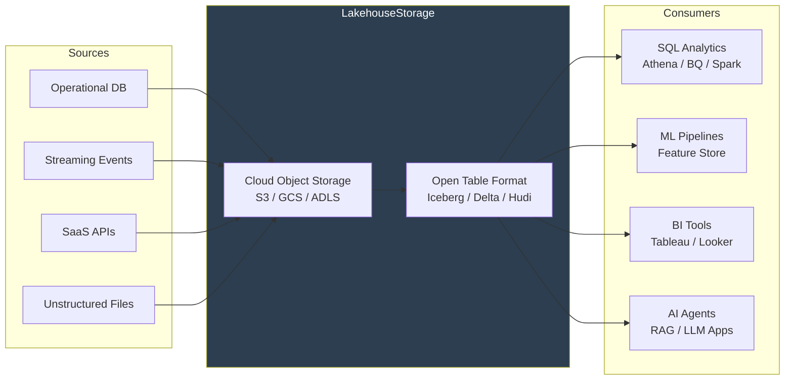
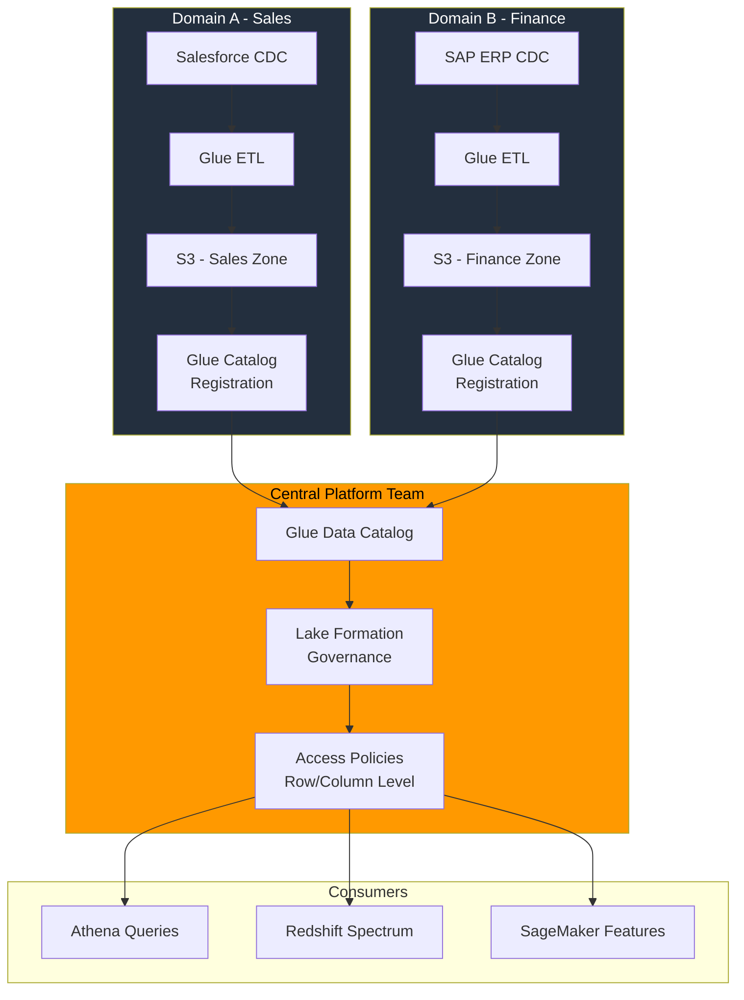
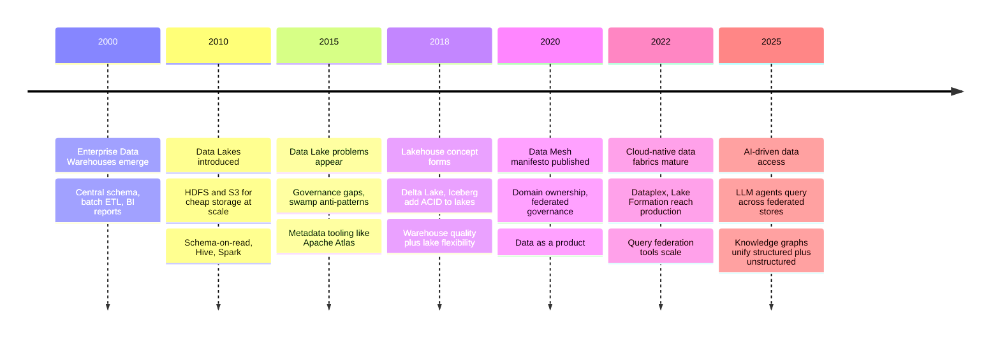

# Data Silos: The Silent Tax on Every Decision Your Company Makes

Picture a Monday morning leadership meeting. The CFO opens with revenue figures from the finance system. The VP of Sales counters with a different number from the CRM. The Head of Growth pulls up yet another figure from the marketing dashboard. Three people, same company, same week — three different answers to "how much did we sell?"

Nobody is lying. Nobody made a mistake. The systems are just not talking to each other.

This is what a data silo looks like from the inside. Not an abstract architectural problem, but a room full of intelligent professionals arguing about whose spreadsheet is right while the actual business problem goes unaddressed. The meeting ends with an action item: "let's align the numbers," which becomes a recurring agenda point that never quite resolves.

Data silos are warehouses of information that exist in isolation from each other. Every department builds its own repository — the marketing team in HubSpot, sales in Salesforce, finance in SAP, operations in a custom ERP, and the data science team in their own S3 buckets. Each tool is perfectly reasonable on its own. Together, they form an invisible tax on every decision the company makes: slower analysis, redundant work, inconsistent conclusions, and an increasing inability to answer even basic cross-functional questions.

This post is about understanding that tax, why the intuitive solution (just centralize everything) often fails, and how to think more carefully about federation — where data doesn't have to live in one place to be governed and accessed as if it did.

## How Silos Form (And Why They're Rational)

It's tempting to blame silos on poor planning or organizational dysfunction. But that misses something important: **silos usually form for good reasons**.

When the marketing team adopts HubSpot, they're solving a real problem — they need to track campaigns, leads, and conversions without depending on IT. When the finance team sticks with their legacy ERP, they have decades of institutional knowledge baked into those workflows. When the data science team builds their own feature store in S3, they're tired of waiting weeks for the data engineering queue to clear.

Each decision is locally rational. The dysfunction is emergent — a property of the system as a whole, not of any individual part.

The formation pattern is almost always the same:

1. **Autonomy to move fast**: A team adopts a tool that solves their immediate problem without waiting for central IT
2. **Success breeds depth**: The tool gets customized, extended, filled with team-specific logic
3. **Coupling increases**: Other workflows in that team start depending on this data in this system
4. **Gravity**: By the time anyone notices, the data has become deeply entangled with the team's processes. Migration is no longer free

This is the **accumulation phase**. The silo isn't born in a single decision — it crystallizes over hundreds of small ones.

The following diagram shows the typical architecture of a siloed organization. Notice how each system is internally consistent and valuable, but they share no common interface:

Each colored island is healthy on its own. The problem is what's missing: connections between them.

## A Day in the Life of a Siloed Organization

Let me make this concrete with a realistic scenario. Imagine a mid-size financial services company trying to answer a question that sounds simple: *"Which customers are at risk of churning, and what's their combined lifetime value?"*

To answer this, you need:
- Customer activity data → lives in the operational banking platform
- Transaction history → lives in the core banking system
- Customer service tickets → lives in Zendesk
- Product usage data → lives in an internal BI database
- Demographic and segment data → lives in the CRM

In a siloed world, here's what actually happens:

The question that should take hours takes weeks. And the answer is already aging by the time it's delivered. This is not hypothetical — it's the standard experience in organizations with mature silos.

The operational cost is enormous: Gartner estimates that 87% of organizations struggle with disconnected data sources, and roughly 67% of enterprise data goes unused precisely because it's locked in isolated systems. Case studies put the savings from breaking silos in the range of 80% reduction in report preparation time and up to 90 hours per week recovered from manual data aggregation tasks.

## Why "Just Centralize Everything" Fails

The instinctive response is centralization: build a single source of truth, move all data there, and enforce a unified schema. On a whiteboard, it's elegant. In practice, it runs into a specific set of hard problems.

### The Standardization Trap

Every system has its own data model. A "customer" in the CRM has different fields than a "customer" in the core banking system. When you try to merge them into a single canonical schema, you face a choice: use the lowest common denominator (losing information), or build a complex integration layer that reconciles the differences (expensive and brittle).

The common failure is forcing every system to conform to one master data model. The manufacturing team's ERP needs product data structured differently than the ecommerce platform. Forcing them to the same schema creates friction, resistance, and eventually workarounds — teams start exporting to spreadsheets, building shadow databases, or provisioning unsanctioned SaaS tools. You've traded one set of silos for another, and this one is harder to govern because it's hidden.

### The Bottleneck Problem

Centralization concentrates authority. Now every change request — a new column, a new data source, a schema evolution — has to go through the central data team. What used to be a domain team's autonomous decision becomes a ticket in a queue.

This pattern was documented extensively as the failure mode of first-generation enterprise data warehouses: "a business function would request to change a table, job, or report and then wait weeks or even months for the central team to respond." The business moves faster than the data team. Teams route around the bottleneck. Silos reform.

### The False Move Assumption

Naive centralization assumes you need to move data to centralize access. But data movement has real costs: storage duplication, synchronization complexity, latency, and governance complications (which copy is authoritative? which is current?). Moving petabytes of data to a central lake and then discovering that the lake has no governance is a common and expensive mistake — what started as a silo problem becomes a "data swamp" problem.

### The Cultural Dimension

None of the above is purely technical. The hardest part of breaking silos is cultural: departments view their data as an asset that gives them leverage. Asking the sales team to expose their pipeline data to the whole company is a political conversation as much as an architectural one. Without executive alignment and a genuine incentive structure that rewards data sharing, technical solutions land on hostile soil.

## Common Mistakes That Sink Centralization Projects

These are the failure modes that appear most consistently:

**Moving before mapping.** Teams start building pipelines before they understand what data exists, where it lives, and how it's used. A data discovery exercise is boring and feels like delay, but skipping it means building the wrong thing. You cannot centralize what you don't know exists.

**Treating the data lake as a destination, not a platform.** Dumping raw data into S3 or GCS is not centralization — it's a landfill. Without a governance layer, data lineage, access controls, and quality checks, the lake degrades into a swamp: full of data, usable by no one.

**Ignoring identity resolution.** When a "customer" in system A is identified by email and in system B by an internal UUID, joining them requires a reconciliation step that is often much harder than it looks. Phone numbers change, emails get reused, UUIDs are never globally unique. This is often the longest and most underestimated step.

**Underestimating ongoing maintenance.** Centralization projects are sometimes treated as one-time migrations. But source systems evolve: schemas change, new tools get adopted, old ones get retired. Without a living integration layer, the central repository goes stale. Data freshness is not a launch feature — it's operational work.

**Skipping access control design.** In regulated industries especially, you cannot just dump everything into one place and give everyone access. GDPR, HIPAA, PCI-DSS all impose constraints on who can see what. Building access control as an afterthought to centralization is a compliance risk and often requires expensive retrofits.

**Confusing centralized storage with centralized governance.** These are different things. You can have federated storage with centralized governance — and that's often the better design. The goal is that any authorized person can discover and query any data with appropriate controls, not that all data physically lives in one bucket.

The following chart positions common approaches along two dimensions that matter most: how much operational overhead they introduce and how much of the siloing problem they actually solve:

Query federation and lakehouses tend to offer the best balance — significant silo resolution without requiring massive operational investment upfront.

## The Solutions Landscape

Let's walk through the main architectural patterns, with honest trade-offs for each.

### Pattern 1: The Cloud Data Warehouse

The classic answer. You pick a warehouse (Snowflake, BigQuery, Redshift, Synapse), build ETL pipelines to ingest data from all your source systems, and define a unified schema. Teams query the warehouse instead of the source systems.

**What works:** Strong query performance, mature tooling, well-understood operational model. Good for structured data from a manageable number of source systems.

**What breaks down:** Schema-on-write means every schema change in a source system requires a pipeline update. Doesn't handle unstructured or semi-structured data well. Latency from batch ETL means data can be hours or days stale. Tends to create the bottleneck problem described above.

### Pattern 2: The Data Lake + Query Engine

Store everything in cloud object storage (S3, GCS) in open formats (Parquet, ORC), then layer a query engine on top (Athena, BigQuery external tables, Presto/Trino). You get flexibility without commitment to a fixed schema.

**What works:** Cheap storage, schema flexibility, handles unstructured data. Good for exploration and archival.

**What breaks down:** Without governance, it becomes a swamp. Performance degrades at scale without careful partitioning. Data quality is harder to enforce. No transactional guarantees.

### Pattern 3: The Lakehouse

The evolution that addresses the lake's original sins. Open table formats — Apache Iceberg, Delta Lake, and Apache Hudi — add a metadata layer on top of object storage that provides ACID transactions, schema evolution, time travel, and efficient query planning. You get warehouse-quality reliability with lake-level flexibility.

The lakehouse is now the default recommended architecture for new data infrastructure. It handles both the integration problem (all data in one store) and the governance problem (through the metadata layer).

**What works:** Best of both worlds — flexibility and reliability. Supports streaming and batch. Good ML integration. Increasingly well-supported by cloud providers.

**What breaks down:** Operational complexity is higher than a managed warehouse. Requires careful format selection and migration planning for existing data. Doesn't solve the cultural and political dimensions of silo-breaking.

### Pattern 4: Query Federation

Instead of moving data, bring the query to the data. A federation engine (Trino, Starburst, BigQuery Omni, Presto, Dremio) connects to multiple source systems and executes queries that span them, returning unified results without requiring physical data movement.

**What works:** No ETL, no data duplication, no synchronization lag. Data stays in source systems — which means access controls, compliance, and ownership remain with domain teams. Dramatically faster time to first query.

**What breaks down:** Query performance depends on source system performance and the network between them. Complex joins across systems can be slow. If source systems are under-indexed or poorly optimized, the federation layer can't compensate. Not a replacement for materialization when you need high-performance analytics.

### Pattern 5: Data Mesh

The conceptual inversion. Instead of moving data to a central team, make each domain responsible for producing and maintaining its own data products, with a shared platform (the "self-service infrastructure") and global governance standards (the "federated computational governance").

Data mesh doesn't eliminate centralization — it centralizes governance and discoverability while decentralizing ownership. The key insight is that the bottleneck in traditional centralization is the central team. Data mesh moves the work to where the domain knowledge lives.

| Dimension | Traditional Centralization | Data Mesh |
|-----------|---------------------------|-----------|
| Ownership | Central data team | Domain teams |
| Data movement | Required (ETL to central) | Optional (data products in place) |
| Schema authority | Central team | Domain teams with standards |
| Governance | Centralized | Federated (shared standards) |
| Bottleneck | Central team queue | None (domain teams move independently) |
| Discovery | Central catalog | Global catalog over distributed products |
| Best for | Smaller orgs, fewer domains | Large orgs, many autonomous domains |

Data mesh is not a product you buy — it's an organizational and architectural philosophy. Its success depends heavily on having domain teams with enough data engineering capability to own their data products. In organizations where that capability doesn't exist, data mesh creates fragmentation rather than reducing it.

## Cloud-Native Approaches: AWS and GCP

Both major cloud providers have invested heavily in tools that address the silo problem. Let's look at what they offer and how the pieces fit together.

### AWS: Lake Formation + Glue + Redshift

The AWS stack for breaking silos centers on three services:

**AWS Glue** handles the extraction, transformation, and loading. It includes a crawler that automatically discovers data in S3 and other sources and populates the Glue Data Catalog with schema information. This addresses the "moving before mapping" mistake — you get visibility before you commit to a migration.

**AWS Lake Formation** is the governance layer on top of the data lake. It provides fine-grained access control down to the column and row level, centralized permission management, and data lineage tracking. Critically, it lets you enforce who can see what without having to move data or change application code.

**Amazon Redshift with Data Sharing** addresses the pattern where you want different domains to have their own compute and schemas but still enable cross-domain analytics. Each domain gets its own Redshift cluster (isolation, performance predictability), but Redshift Data Sharing lets them expose specific datasets to each other through a shared namespace. Vanguard used this exact pattern to bridge data silos across bounded contexts while keeping domain teams in control of their data.

The AWS data mesh pattern assembles these pieces: domain teams own their data in S3, register it in the Glue Catalog, and expose it through Lake Formation with appropriate permissions. A central team manages the governance standards and the catalog infrastructure, but not the data itself.

### GCP: Dataplex + BigQuery + Data Fusion

Google Cloud's answer to the silo problem is more opinionated and, in some ways, more integrated.

**Google Cloud Dataplex** is what Google calls an "intelligent data fabric" — a governance and discovery layer that sits on top of your existing data without requiring migration. Dataplex organizes data into logical lakes, zones, and assets that abstract the underlying storage (which might be across BigQuery datasets, GCS buckets, and even external sources). You get:

- **Automated discovery and classification**: Dataplex crawls your storage and identifies structured, semi-structured, and unstructured data, inferring schemas and detecting sensitive content
- **Unified search**: A faceted search interface (they compare it to Gmail search) that lets anyone in the organization find data without knowing where it physically lives
- **Policy propagation**: Access policies defined at the Dataplex level propagate to the underlying storage systems — you define once, it enforces everywhere
- **Data quality rules**: Define and enforce quality constraints centrally without moving data
- **Lineage tracking**: Automatic lineage capture across BigQuery, Dataflow, and connected systems

The key Dataplex insight is that it supports both centralized data lake patterns and data mesh patterns with the same infrastructure — domain teams get zones within Dataplex lakes, maintaining ownership, while the platform team manages discovery and governance globally.

**BigQuery** serves as the analytics engine. BigQuery Omni extends this to data that lives in other clouds (AWS S3, Azure Blob Storage) without requiring migration — true federated querying across multi-cloud silos.

**Cloud Data Fusion** handles the ETL layer for integrating siloed on-premises and legacy systems. It's particularly relevant for organizations that have operational systems they can't move to the cloud immediately but need to integrate with cloud-native analytics.

### Choosing Between AWS and GCP

There's no universal winner — the choice depends on where you already are:

| Factor | AWS Advantage | GCP Advantage |
|--------|--------------|---------------|
| Existing data in cloud | If already on AWS | If already on GCP |
| Multi-cloud silos | Lake Formation + Glue | BigQuery Omni |
| ML/AI workloads | SageMaker ecosystem | Vertex AI + BigQuery ML |
| Data mesh maturity | Lake Formation data sharing | Dataplex zones + IAM |
| Governance depth | Lake Formation fine-grained | Dataplex unified + BigQuery policies |
| Unstructured data | S3 + Comprehend | GCS + Document AI |

If your organization is cloud-agnostic or multi-cloud, query federation tools like Starburst or Trino operate across both, letting you avoid cloud lock-in in the integration layer.

## The Right Mental Model: Federated Knowledge

Here's the reframe that changes how you approach silo problems: **the goal is not centralized storage, it's centralized discoverability and governance**.

Think of it like a library network. The books don't all have to be in one building — but any librarian should be able to tell you where to find any book, check it out on your behalf, and ensure you have the clearance to access it. What you centralize is the catalog and the access control, not necessarily the collection.

This maps directly to what makes a knowledge base useful in an enterprise context. The question "where is our customer data?" should have a single discoverable answer, even if the data lives in three different systems. The question "can I access it?" should be answerable in seconds, not days. The question "is it current?" should have a clear answer tied to the system's update frequency.

The architecture that achieves this has four components:

1. **Discovery**: A unified catalog that knows what data exists, where, with what schema, and at what freshness level. AWS Glue Data Catalog, GCP Dataplex, Apache Atlas, and DataHub all serve this role.

2. **Access control**: A governance layer that enforces consistent permissions regardless of where data lives. Column-level security for PII, row-level filtering for jurisdiction-specific data, audit logging for compliance.

3. **Quality**: Declared quality contracts on data products — SLAs on freshness, constraints on completeness, lineage tracking to trace issues upstream.

4. **Consumption**: Query engines that can reach across the catalog and execute federated queries, materialization pipelines for high-performance analytics, and APIs for application integration.

The domain teams own their data products. The platform team owns the catalog, governance, and consumption infrastructure. Nobody owns everything — and that's the point.

## A Practical Roadmap

Breaking down silos is a multi-year effort. Here's a sequencing that works in practice:

**Phase 1 — Discover (months 1-3)**

Before building anything, map what exists. Run automated discovery crawlers across your storage systems. Interview domain teams about what they own and what they need from others. Document data flow diagrams: who produces what, who consumes it, through what mechanism. The goal is a complete picture of your current-state architecture, including all the informal data flows that happen through email attachments and manual CSV exports.

This phase feels unproductive. It's the most important phase.

**Phase 2 — Quick wins (months 2-6)**

Pick two or three high-value integration points — the connections that, if solved, would eliminate the most pain. Don't try to solve everything at once. Build the integration layer for those specific cases, establish the catalog entry for the resulting data products, and validate that the governance model works. Demonstrate value before scaling.

**Phase 3 — Establish the platform (months 4-12)**

While domain teams are connecting their first data products, build the shared infrastructure: the catalog, the governance policy engine, the self-service tooling that lets domain teams onboard themselves without waiting for a central team. This is the investment that makes scaling possible.

**Phase 4 — Scale and govern (ongoing)**

Migrate remaining data flows onto the platform. Enforce data product standards. Monitor data quality contracts. Build the data literacy programs that help domain teams become effective data product owners. Start measuring the metrics that matter: time from question to answer, proportion of data that's discoverable, coverage of access control policies.

The timeline shows how the major paradigms evolved to address the exact problems introduced by the previous generation:

## What This Has to Do with Knowledge Bases

If you've read the [enterprise knowledge bases post](/blog/enterprise-knowledge-bases), you know that the hardest problems in building RAG systems for enterprises aren't about retrieval algorithms or embedding models — they're about getting the data into the system in the first place.

Silos are the upstream problem. You cannot build a useful knowledge base on top of siloed information. If the corporate knowledge base can only answer questions about documents in SharePoint, it will fail any question that requires connecting SharePoint content with data from the CRM, the ticketing system, or the operational database. The knowledge base is only as comprehensive as the data it can see.

The federated architecture described in this post is also the foundation for a comprehensive organizational knowledge layer. The catalog and governance infrastructure you build to break down data silos is the same infrastructure you need to power AI systems that reason across your organization's knowledge. Dataplex's discovery layer, Lake Formation's access controls, and Trino's query federation don't just enable better analytics — they enable a new class of AI applications that can actually operate across the full breadth of organizational knowledge.

The companies that will get the most out of AI in the next five years are the ones investing now in making their data federally discoverable and governable. Not because AI requires it, but because every good decision-making process — human or machine — requires it.

## Closing Thoughts

Data silos are not a technology problem. Technology is how you solve them, but the problem is organizational: departments optimizing locally, creating artifacts (tools, schemas, processes) that compound into systemic isolation over time.

The naive solution — centralize everything — fails because it tries to solve an organizational problem with an architectural edict. The right solution is to create the infrastructure for data to be discoverable, accessible, and trustworthy regardless of where it lives, while preserving the autonomy that domain teams need to move fast and stay close to their data.

Build the catalog. Enforce the governance. Federation over migration. Quality contracts over hope. And start small — pick the two data connections that, if solved today, would eliminate the most pain. Build those, learn from them, and expand.

The goal isn't a perfect unified data model. The goal is that when someone asks a cross-functional question, the answer is available in hours, not weeks — and everyone in the room is looking at the same number.

## Going Deeper

**Books:**

- Dehghani, Z. (2022). *Data Mesh: Delivering Data-Driven Value at Scale.* O'Reilly Media.
  - The definitive text on the data mesh paradigm. Covers domain ownership, data as a product, and federated computational governance. Essential reading for anyone designing at organizational scale.

- Inmon, W. H. (2005). *Building the Data Warehouse.* Wiley.
  - The original architecture for enterprise data centralization. Understanding its principles and limitations is necessary context for understanding why everything after it exists.

- Dama International. (2017). *DAMA-DMBOK: Data Management Body of Knowledge (2nd ed.).* Technics Publications.
  - The comprehensive reference for data governance, data quality, and master data management. Dense but thorough — useful as a reference when designing governance frameworks.

- Kleppmann, M. (2017). *Designing Data-Intensive Applications.* O'Reilly Media.
  - The best technical foundation for understanding how data systems work under the hood: replication, consistency, distributed transactions. Necessary background for understanding why integration is hard.

**Online Resources:**

- [AWS Big Data Blog: Bridging data silos with Amazon Redshift](https://aws.amazon.com/blogs/big-data/bridging-data-silos-cross-bounded-context-querying-with-vanguards-operational-read-only-data-store-ords-using-amazon-redshift/) — Detailed walkthrough of Vanguard's ORDS pattern using Redshift Data Sharing across bounded contexts. A real production case study worth reading in full.

- [Google Cloud Dataplex documentation](https://cloud.google.com/dataplex/docs) — The official reference for Dataplex's lakes, zones, assets, and governance features. Start with the conceptual overview before the API reference.

- [DataHub documentation and GitHub](https://datahubproject.io/) — The open-source metadata platform used widely as a data catalog. Good alternative to managed options for organizations that want cloud-agnostic discovery infrastructure.

- [The Data Mesh Principles and Logical Architecture](https://martinfowler.com/articles/data-mesh-principles.html) — Zhamak Dehghani's original post on Martin Fowler's blog. The clearest statement of what data mesh actually is and isn't.

**Videos:**

- [What is Data Mesh? by IBM Technology](https://www.youtube.com/watch?v=_bmYXl-Yve4) — Concise explainer on data mesh principles, domain ownership, and federated governance. Good starting point before reading the Dehghani book.

- [Apache Iceberg: The Definitive Guide by Tabular](https://www.youtube.com/watch?v=N4gAi_zpN88) — Deep dive into Iceberg's metadata architecture, time travel, and schema evolution. Relevant if you're choosing an open table format for your lakehouse.

**Academic Papers:**

- Hai, R., Quix, C., & Jarke, M. (2021). ["Data lake concept and systems: a survey."](https://arxiv.org/abs/2106.09592) *arXiv:2106.09592*.
  - Systematic survey of data lake architectures, metadata management approaches, and governance frameworks. Covers 60+ systems with a taxonomy that helps clarify the solution landscape.

- Nargesian, F., Zhu, E., Miller, R. J., Pu, K. Q., & Arocena, P. C. (2019). ["Data lake management: Challenges and opportunities."](https://dl.acm.org/doi/10.14778/3352063.3352116) *Proceedings of the VLDB Endowment*, 12(12).
  - Frames the academic challenges of data lake management: discovery, integration, governance, and query optimization. Good for understanding what "solved" and "unsolved" mean in this space.

- Sawadogo, P., & Darmont, J. (2021). ["On data lake architectures and metadata management."](https://link.springer.com/article/10.1007/s10844-020-00608-7) *Journal of Intelligent Information Systems*, 56(1).
  - Comprehensive review of metadata management approaches in data lakes. Connects governance theory to practical implementation patterns.

**Questions to Explore:**

- If domain teams own their data products, who is responsible when a data product produces incorrect results that propagate to business decisions downstream? How should accountability be designed into federated architectures?

- Query federation avoids data movement, but it also means each query depends on the health and performance of every source system it touches. How do you design for resilience when sources fail or degrade?

- Data silos often contain not just data but institutional knowledge — the quirks, exceptions, and business logic that live in team members' heads and inform how the data is used. When you break down a silo, how do you preserve that tacit knowledge?

- At what organizational size does a data mesh become more efficient than a centralized architecture? Is there a general principle, or is it entirely context-dependent?

- As AI agents gain the ability to query and reason across federated data stores autonomously, how does the governance model need to evolve? Is column-level access control sufficient when an LLM can infer sensitive information from the intersection of permitted columns?
