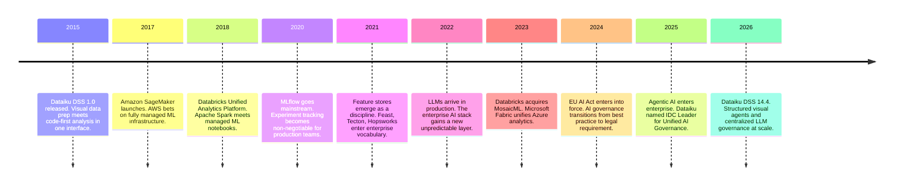
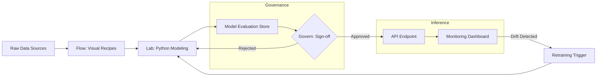
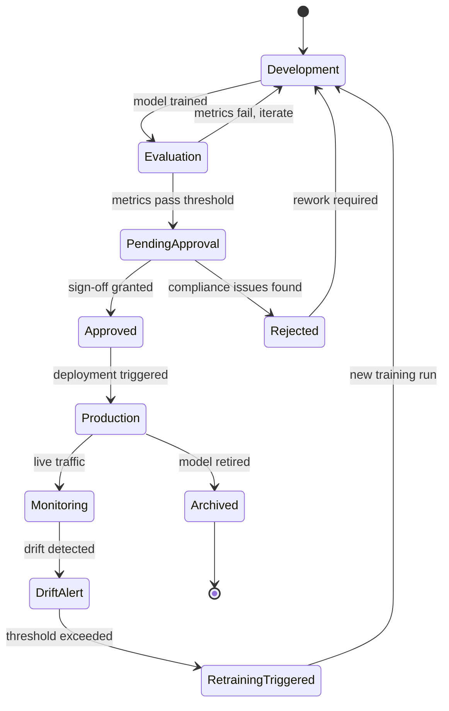
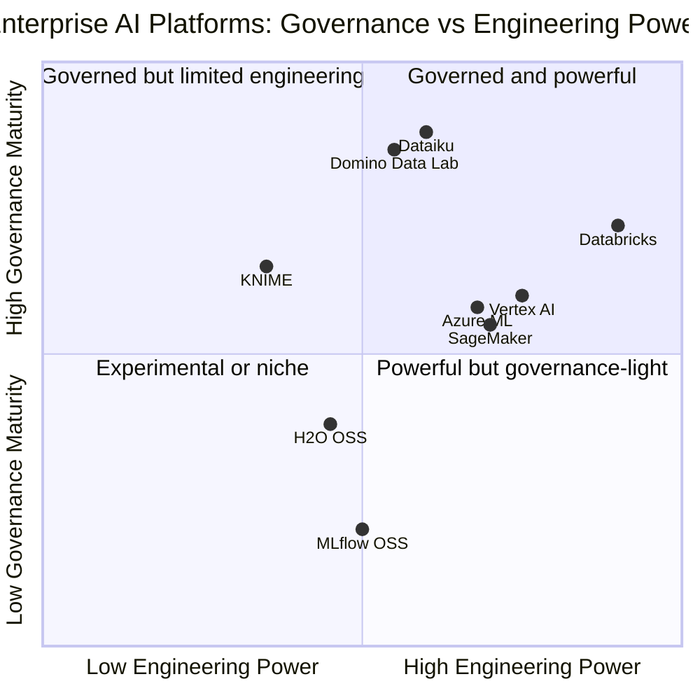
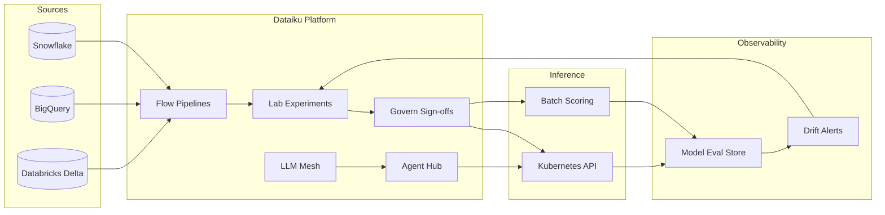

# Dataiku and the Enterprise AI Ecosystem: What Platforms Solve, What They Don't, and When to Use One

Every data organization hits the same wall. Not a technical wall — a coordination wall.

You have a data engineer spinning up Airflow DAGs, a data scientist building models in Jupyter notebooks, a DevOps engineer wrangling Kubernetes deployments, a compliance officer asking why there's no audit trail, and a business analyst who still gets answers from Excel because nobody has time to build them a proper interface. They're all working on the same project. They communicate by sending CSV files over Slack.

This isn't a skills problem. These are talented people. It's a tooling and coordination problem: the enterprise data + AI stack has no native concept of shared lifecycle management, governance, or cross-role collaboration. It was assembled piece by piece from tools that were each excellent at one thing. Integrating them is a full-time job in itself.

Dataiku positions itself as the answer to this. And for many organizations — especially in regulated industries or with mixed technical and business teams — it delivers. But it's not magic, it's not cheap, and it's not right for everyone. Let's look at the full picture.

## The Fragmentation Problem in Enterprise Data + AI

Before evaluating any platform, it's worth being honest about the problem being solved.

A typical enterprise data + AI stack in 2026 looks something like this: data lives in Snowflake or a cloud warehouse; pipelines are orchestrated with Airflow or Prefect; transformations happen in dbt; experimentation happens in Jupyter notebooks tracked (sometimes) in MLflow; models are deployed as REST APIs on Kubernetes; monitoring is either absent or stitched together from Prometheus metrics and Grafana dashboards; and governance is a wiki page that nobody updates.

Each of these tools is genuinely good at what it does. The problem is that they don't talk to each other in any meaningful way. A model in an MLflow experiment has no formal relationship to the dbt transformation that produced its training data. The Airflow DAG running the batch scorer has no awareness of the model's drift metrics. The compliance officer has no way to trace a prediction back to its raw data source without asking three different engineers to reconstruct the lineage manually.

This fragmentation creates real organizational costs:

- **Knowledge silos.** When the person who built a model leaves, the institutional knowledge of why it was built that way — what data it consumes, how it was validated, what edge cases were considered — often leaves with them.
- **Slow iteration.** Moving from exploration to production requires handoffs between teams with different tools, vocabularies, and incentives. Each handoff is a potential failure point.
- **Governance gaps.** Audit trails across disconnected systems are painful to reconstruct. In regulated industries, this isn't just inconvenient — it's a compliance risk.
- **Excluded stakeholders.** Business users who could contribute domain knowledge are locked out because everything requires code. The feedback loop between models and the people who understand the business problem stays broken.

The enterprise data + AI platform category — Dataiku, Databricks, Domino, Vertex AI, SageMaker — is essentially an answer to this fragmentation. The pitch: buy the integration layer instead of building it.

This is how the landscape evolved to reach its current shape:



## What Dataiku Is

Dataiku DSS (Data Science Studio) is an end-to-end platform for building and deploying data products and AI systems in enterprise environments. The current release is DSS 14.4 (early 2026), and the product has evolved significantly from its visual data preparation roots.

The platform is organized around several integrated modules:

**Flow** is the core of Dataiku. It's a visual, recipe-based pipeline designer where every transformation — SQL, Python, dbt, Spark, AutoML — is represented as a node in a directed acyclic graph. You can see the full data lineage from source to prediction at a glance. Non-technical users can contribute to Flow using visual recipes without writing code.

**Lab** is the experimentation environment: Jupyter-style notebooks with direct access to project datasets, experiment tracking, and the ability to promote models directly to production from the same interface. There's no separate "hand off to the deployment team" step — the lab and the deployment pipeline are the same system.

**Govern** is the compliance layer. It enforces mandatory sign-offs before models can be deployed, tracks role-based access across the organization, maintains column-level data lineage, and generates audit-ready reports. In regulated industries, this module is often the primary reason Dataiku is chosen.

**LLM Mesh** is Dataiku's answer to uncontrolled GenAI usage. Instead of teams connecting to Anthropic Claude, OpenAI, or Gemini independently, LLM Mesh acts as a centralized routing and governance layer: it enforces budget caps, logs every prompt and response, applies guardrails for PII and prompt injection filtering, and lets you switch underlying models at runtime without changing application code.

**Agent Hub** (introduced in DSS 14.2, significantly expanded in 14.4) is the platform for building, testing, and deploying AI agents with governance baked in. Structured Visual Agents let you wire together tools, conditionals, loops, and human-in-the-loop checkpoints graphically. Trace Explorer lets you inspect every tool call an agent made, in production, with full context.

## What Dataiku Actually Simplifies

The platform's value claims are broad. The reality is more targeted. Here's what it genuinely delivers.

### Collaboration Across the Skills Spectrum

This is Dataiku's most underappreciated strength. The same project can have a data analyst building a visual SQL recipe to prepare training data, a data scientist writing a custom Python model training script in Lab, a business user reviewing a dashboard output, and a compliance officer reviewing the deployment sign-off queue — all working in the same project workspace with shared lineage and shared history.

Most toolchains can't say this. Databricks requires SQL or PySpark. Jupyter notebooks are opaque to business users. Tableau dashboards have no formal connection to the underlying model. Dataiku's hybrid visual + code interface bridges these gaps.

Here's how a typical Dataiku project flows from raw data to monitored production:



The lineage is bidirectional and persistent. If a model degrades in production and triggers a retraining alert, you can trace back through the deployment to the experiment, to the training dataset, to the source transformation, and to the raw data — all within the same interface, without querying git history or asking three different people.

### Governance Without a Separate Team

In a DIY stack, governance is usually a post-hoc addition. Someone writes a runbook, someone else maintains a model card in a Confluence page, and audit trails are reconstructed from git history when something goes wrong. Dataiku bakes governance into the deployment path structurally — you literally cannot push a model to production without passing through the configured sign-off workflow.

This matters especially in regulated industries. Banks use Dataiku for fraud detection models that require compliance documentation per Basel III requirements. Pharmaceutical companies run clinical analytics pipelines with FDA-ready audit trails. Dataiku was recognized as an IDC MarketScape Leader for Unified AI Governance Platforms in December 2025 — a formal assessment across 20 vendors that explicitly evaluated governance architecture, enforcement mechanisms, and compliance coverage.

For LLMs specifically, LLM Mesh solves a problem that's genuinely painful right now. Every team independently connecting to external model APIs means different rate limits, no central billing visibility, no guardrails, no audit log of what was sent externally. LLM Mesh routes all GenAI calls through a single gateway with centralized policy enforcement and spend management.

### MLOps Without a Dedicated Platform Team

Setting up the full MLOps stack from scratch — model registry, serving infrastructure, drift detection, A/B testing, automated retraining — is a substantial engineering project. Done properly, it's a multi-quarter effort requiring ML engineering expertise. Dataiku packages this into the deployment workflow. The Model Evaluation Store tracks data drift, model drift, and prediction drift. Containerized deployment to Kubernetes is built in. Retraining can be automated when drift exceeds configured thresholds.

This doesn't mean you get MLOps for free. It means you get a reasonable MLOps foundation without dedicating an engineering team to building it from scratch. The trade-off is configurability: Dataiku's MLOps capabilities are less flexible than building your own stack, and you're working within the platform's model of how things should work rather than designing your own.

From the Dataiku Python API, interacting with datasets and models inside a project is straightforward:

```python
import dataiku
from dataiku import pandasutils
import pandas as pd

# Access a managed dataset inside the Dataiku project
dataset = dataiku.Dataset("customer_features")
df = dataset.get_dataframe()

# Access a deployed model endpoint directly from code
model_handle = dataiku.Model("churn_predictor_v3")
active_version = model_handle.get_active_version()

# Run predictions using the managed model version
predictor = active_version.get_predictor()
predictions = predictor.predict(df)

# Write results back to a Dataiku-managed output dataset
# (preserves full lineage in the Flow)
output_ds = dataiku.Dataset("churn_scores_daily")
output_ds.write_with_schema(predictions)
```

The key thing here is lineage preservation. Writing back through `dataiku.Dataset` instead of directly to a file or database means every transformation is tracked in the project's Flow — the output dataset knows which model version produced it, and the model version knows which training dataset was used. This is the governance layer working as designed.

## What You Still Own

Here's the part most vendor presentations skip. Dataiku is genuinely useful, but there's a category of problems that no platform can solve for you.

### Data Quality Upstream

Dataiku can detect that a distribution has drifted. It cannot fix a source system that's sending incorrect data. The garbage-in-garbage-out problem is a function of how your data engineering team works, what SLAs your source systems guarantee, and whether someone catches data quality issues before they reach the model — not of which platform you deploy models on.

The platform gives you the detection layer. The prevention layer is still your team's responsibility.

### Ground Truth for Drift Monitoring

This is a subtle but critical limitation. Drift monitoring works well for distribution drift — you can compare incoming feature distributions to training-time distributions without labels. But performance monitoring (is the model still accurate?) requires actual labels, which often arrive with significant lag or not at all.

If you're predicting customer churn, you might not know the actual outcome for 30-90 days. If you're predicting equipment failure, you know when the equipment fails — hopefully before it causes a larger problem. Dataiku's monitoring dashboards give you the infrastructure, but you have to solve the ground truth supply chain problem yourself. No platform solves this.

### Business Understanding and Feature Engineering

Dataiku has AutoML, visual preparation, and a Flow Assistant that generates pipelines from natural language. But the platform cannot tell you which features are meaningful for your specific prediction problem, why certain customer segments behave differently, or whether the business context has changed in a way that would invalidate a previously correct model.

Domain expertise is not automatable. A compliance analyst who understands the regulatory environment, a credit officer who understands credit cycles, a clinical data manager who understands how patients are coded in the EMR — these people's knowledge is irreplaceable. Dataiku gives them a better interface to participate. It doesn't substitute for them.

### Real-Time Inference at Scale

Dataiku's streaming support is explicitly experimental as of DSS 14.4. For batch scoring and standard REST API inference, the platform handles deployment well. But if your use case requires sub-100ms latency at high throughput, or Kafka-based streaming inference, you'll need to architect this outside Dataiku.

This is an honest limitation, not a disqualifying one. Most enterprise ML use cases — fraud scoring, recommendation generation, churn prediction, document classification — run on batch or moderate-latency APIs. The edge cases that need true streaming inference are a smaller fraction of the total, and for those cases, specialized inference infrastructure is the right answer regardless of which platform manages the broader workflow.

## The Lifecycle of a Project in Dataiku

Understanding how Dataiku manages project lifecycle helps clarify what the governance model actually enforces and where the guardrails are architectural rather than procedural.



The critical thing about this lifecycle is that `PendingApproval` is not optional. If your organization configures mandatory sign-offs for a project type, there's no way to skip the governance step and push directly to Production. This enforcement is architectural — built into the deployment path — not procedural, which is why compliance teams value it.

This also means that the governance infrastructure is only as good as the organization's willingness to configure and enforce it. Dataiku can require a sign-off; it can't force the reviewer to actually read the model card before clicking approve.

## The Agent Governance Layer

Dataiku's most interesting 2025-2026 evolution is its positioning for agentic AI governance. This is worth understanding separately because the challenge is genuinely different from classical MLOps.

Classical ML governance asks: Is this model performing within acceptable parameters? Is it producing predictions the compliance team can stand behind? Agent governance asks: What did this agent actually do? Which tools did it call? Did it access data it shouldn't have? Did it take actions that a human would not have approved?

Dataiku's answer has three layers. The **strategy layer** handles portfolio management — which agents exist, what risks they carry, what value they deliver. The **execution layer** provides the Visual Agent builder with approval workflows and quality gates. The **operations layer** includes Trace Explorer (inspect every tool call in production), Cost Guard (budget enforcement per agent or project), and Quality Guard (automated evaluation using golden datasets and LLM-as-judge methods).

For an enterprise running dozens of agents across business units, having centralized audit trails of agent actions is not a nice-to-have — it's a compliance requirement under frameworks like the EU AI Act, which explicitly requires traceability and human oversight for high-risk AI systems.

```python
import dataiku

# Connect to LLM Mesh - routes to the configured provider transparently
# Your code doesn't change when you swap from GPT-4 to Claude to Gemini
llm = dataiku.api_client().get_default_llm()

# All calls through LLM Mesh are automatically logged, guardrailed,
# and counted against the project's budget allocation
response = llm.new_completion() \
    .with_message("Summarize the following customer complaint for escalation: ...") \
    .execute()

# The trace is recorded: which model, what prompt, what response,
# token count, latency, any guardrail triggers - all in the audit log
print(response.text)
```

The practical consequence: when a regulator asks "what did your AI system do with customer data between March and April?", you have a searchable audit log. Without LLM Mesh, you have... server logs, maybe, if someone remembered to turn them on.

## Scenarios Where Dataiku Shines

**Regulated industries with audit requirements.** Healthcare, pharmaceuticals, financial services, insurance. These sectors have explicit documentation requirements for production models — who approved what, what data was used, what validations were run. Dataiku's Govern module, project standards, and audit trail are purpose-built for this. The Dataiku + Snowflake integration is explicitly certified for financial services and healthcare use cases. If you're building credit risk models under Basel III, or clinical decision support tools under FDA guidance, the governance layer pays for itself in audit preparation time alone.

**Organizations with mixed technical and business teams.** The marketing analyst who understands customer segmentation better than any data scientist, but who can't write Python. The credit officer who knows which features matter for loan performance but whose native environment is Excel. The operations manager who needs a custom analysis but can't wait for an engineering sprint. Dataiku's visual interface gives these people meaningful agency in data projects. This is actually rare — most platforms optimize for the ML engineer and treat the business user as a passive dashboard consumer.

**Enterprises deploying GenAI at scale with governance concerns.** LLM proliferation is a real enterprise problem right now: teams deploying different models with different guardrails, no central billing, no audit of what's been sent to external APIs, no visibility into cost allocation by use case. LLM Mesh solves this structurally. If you're an enterprise CTO who just discovered that twelve teams are calling external model APIs with twelve different keys and no PII controls, Dataiku's governance layer is what you were looking for.

**Multi-cloud deployments needing vendor neutrality.** Unlike SageMaker (AWS-native) or Vertex AI (GCP-native), Dataiku runs on AWS, Azure, GCP, and on-premise. If you're in a regulated industry that mandates data residency, or running a hybrid cloud environment across two providers, Dataiku's cloud-agnostic positioning is a genuine advantage.

## Scenarios Where Dataiku Isn't the Right Call

**Pure data engineering workloads.** If 70% of your work is large-scale data transformations, complex ETL, and big-data processing, Databricks is the better choice. Databricks is built on Apache Spark and optimized for data engineering at scale. Dataiku can connect to Spark and Databricks clusters, but it's fundamentally an analytics and ML platform — not a data engineering platform. For organizations where heavy data engineering dominates, the right architecture is often Databricks + dbt for data engineering with Dataiku added for governed analytics and ML if that layer is needed.

**Small startups and teams under 20 people.** Dataiku's entry pricing is $26,000+ per year, and enterprise deployments routinely reach $100,000+. For a team of five data scientists who communicate over Slack and deploy models to a single Kubernetes cluster, the open-source stack (dbt + Airflow + MLflow + Jupyter) is cheaper, more flexible, and has significantly lower cognitive overhead. The governance overhead that makes Dataiku valuable at scale becomes friction at small scale.

**ML research and rapid experimentation.** If your use case is "train 200 models, compare them, iterate fast," Dataiku's structured workflows introduce overhead that slows research velocity. Jupyter + MLflow + Weights & Biases is faster for this. Dataiku is optimized for production-grade, repeatable workflows — not exploration-first, publication-oriented research.

**Teams prioritizing maximum portability.** Dataiku uses a proprietary project format. Migrating an existing Dataiku project to a different platform is non-trivial. This is true of most enterprise platforms — Databricks has its own Delta Lake format, Vertex AI has its own model registry format — but it's worth acknowledging explicitly. Teams with a strong preference for fully portable, open-source-native toolchains will find Dataiku's proprietary abstraction layer frustrating over time.

## The Competitive Landscape

How does Dataiku compare to its main alternatives? Here's the honest map:

| Platform | Governance | Non-Technical Users | Data Engineering | GenAI Governance | Pricing Model |
|---|---|---|---|---|---|
| Dataiku DSS 14 | Excellent | Excellent | Moderate | Strong, LLM Mesh | Fixed, $26k+ |
| Databricks | Strong, Unity Catalog | Low | Excellent | Growing | Variable per DBU |
| Vertex AI | Good | Medium | Good | Strong, Gemini-native | Variable |
| Amazon SageMaker | Good | Low | Good | Growing | Variable, high |
| Azure ML + Fabric | Good | Medium | Good | Strong, Azure OpenAI | Variable |
| Domino Data Lab | Excellent | Low | Moderate | Moderate | Very high, fixed |
| H2O.ai | Moderate | Low | Moderate | Growing | Free OSS to moderate |
| KNIME | Good | Good | Low | Limited | Free, open-source |

Databricks holds the #1 position in Gartner's 2025 Magic Quadrant for Data Science and Machine Learning Platforms, with the highest "completeness of vision" score. Dataiku is in the Leaders quadrant but positioned differently: Databricks is winning the data engineering + ML engineering market; Dataiku is winning the governed analytics + cross-functional collaboration market. They're not perfect substitutes, and in practice many enterprises run both — Databricks for data engineering, Dataiku for governed ML and analytics.

Here's how each platform positions on governance maturity versus engineering power:



The quadrant reveals the market logic: Dataiku and Domino compete for the high-governance segment, Databricks dominates the high-engineering-power segment, and the cloud-native platforms occupy the middle ground tied to their respective cloud ecosystems. MLflow as a standalone tool represents the governance floor — useful but minimal.

## Where Dataiku Fits in Your Stack

Dataiku is typically not a replacement for your entire data stack. It's a collaboration and governance layer that integrates with existing infrastructure rather than replacing it.



Critically, Dataiku can wrap external models. A model trained in Databricks MLflow, deployed on SageMaker, or hosted on Vertex AI can be registered as an "external model" in Dataiku's Model Evaluation Store — you get centralized monitoring and governance without migrating your inference infrastructure. This is practically important for organizations with existing deployments they can't easily move.

The integration pattern in practice looks like this:

```python
import dataiku

# Register an externally-managed model (e.g., from SageMaker or Databricks)
# into Dataiku's Model Evaluation Store for unified monitoring
client = dataiku.api_client()
project = client.get_project("RISK_MODELS")

# Wrap the external endpoint for Dataiku monitoring without migrating inference
external_model = project.create_external_model_version(
    model_name="credit_scorer_v2",
    model_type="REGRESSION",
    metadata={
        "origin": "sagemaker",
        "endpoint_name": "credit-scorer-prod-v2",
        "training_date": "2026-06-12",
        "training_dataset": "s3://risk-data/credit_training_q2_2026"
    }
)

# From this point, Dataiku monitors drift + performance metrics centrally
# even though inference still runs on the external SageMaker endpoint
print(f"External model registered: {external_model.get_id()}")
```

This means you don't have to make an all-or-nothing decision. If you already have Vertex AI endpoints that work well, you can keep them and add Dataiku's governance layer on top, using Dataiku for monitoring, lineage, and sign-off workflows while leaving inference infrastructure untouched.

## The Make vs. Buy Decision

Here's the framework for deciding whether an enterprise AI platform like Dataiku is the right investment.

**Choose a managed platform when:**

- Your organization has more than 30 people working on data + AI and coordination is the bottleneck, not technical capability.
- You're in a regulated industry where audit trails, sign-off workflows, and compliance documentation are mandatory.
- You have mixed technical and business teams who need to collaborate on the same datasets and models.
- You're deploying GenAI at scale and need centralized governance of model routing, costs, and prompt guardrails.
- Your IT organization has limited capacity to maintain bespoke platform infrastructure.

**Choose open-source when:**

- You're a small team (fewer than 20 people) where coordination overhead is manageable.
- Your team is primarily ML engineers and data engineers comfortable with code and CLI tooling.
- Cost constraints are binding — the open-source stack (dbt + Airflow + MLflow) has near-zero licensing costs.
- Maximum portability and vendor independence are strong organizational preferences.
- Your use case is exploratory research rather than production deployment at scale.

**Choose a cloud-native platform (Vertex AI, SageMaker) when:**

- You're fully committed to a single cloud provider and want native integration with managed infrastructure.
- Your primary workload is training and serving ML models, not cross-functional analytics collaboration.
- You have the engineering capacity to manage infrastructure and piece together governance tooling separately.

These choices aren't mutually exclusive. Many large enterprises run Databricks for data engineering and Dataiku for governed analytics. Some run Vertex AI for model training and Dataiku's LLM Mesh for GenAI governance. The platform category is not winner-take-all — different tools address different coordination problems in the same organization.

## Pricing and Market Context

Dataiku starts at approximately $26,000 per year for a basic installation and routinely reaches $100,000+ for enterprise deployments with multiple users, advanced modules, and support SLAs. This is not a startup budget. The value calculation requires answering: what is the cost of not having governance, not having collaboration tooling, not having centralized MLOps — measured in compliance risk, engineering time, and coordination overhead?

In a regulated industry where a single compliance failure can cost more than a decade of Dataiku licensing, the math often works. In a growth-stage startup where the risk is moving too slowly, spending $100k per year on platform licensing is probably the wrong trade-off.

Dataiku crossed $350 million in annual recurring revenue in October 2025, which suggests the market has found the value proposition compelling for a specific segment. The company is targeting an IPO in 2026, which would be the first major independent data + AI platform IPO in several years. Whether that reflects sustainable market position or pressure to exit before competitive intensity increases is a reasonable question.

## The Cultural Layer

No platform — Dataiku, Databricks, or anything else — solves the organizational dynamics that make data + AI hard. Platform adoption requires change management. Governance workflows only work if people actually use them. Audit trails only matter if the process that creates them is followed consistently.

This is the hidden cost of enterprise platform purchases: the platform gives you the infrastructure for governance, not governance itself. An organization that struggles with data quality discipline, model ownership accountability, and cross-functional communication won't automatically fix those problems by switching from a DIY stack to Dataiku. The platform makes it easier to implement good practices; it doesn't install those practices by default.

The teams that extract the most value from Dataiku tend to be organizations that have already decided to invest in data + AI as an organizational capability — not a series of individual projects — and are looking for tooling that can scale that capability without requiring every team to maintain its own bespoke infrastructure.

If that description fits your situation, Dataiku is worth a serious evaluation. If it doesn't, the open-source alternatives are mature enough that the licensing premium is hard to justify.

## Going Deeper

**Books:**

- Huyen, C. (2022). *Designing Machine Learning Systems.* O'Reilly Media.
  - The closest thing to a comprehensive framework for production ML decision-making, including build vs. buy, team organization, and MLOps architecture. Essential context for evaluating any enterprise platform before purchasing one.

- Hulten, G. (2019). *Building Intelligent Systems: A Guide to Machine Learning Engineering.* Apress.
  - Pre-dates current platform maturity but still the best treatment of the full stack of concerns in production ML — data quality, model monitoring, feedback loops — that no platform fully automates.

- Raj, P., & Raman, A. (2019). *The Enterprise Big Data Lake.* O'Reilly Media.
  - Covers the architectural evolution from data warehouses to lakehouses, which is the context within which platforms like Dataiku operate. Useful for understanding what infrastructure Dataiku sits on top of.

- Kleppmann, M. (2017). *Designing Data-Intensive Applications.* O'Reilly Media.
  - Not about platforms specifically, but the foundational understanding of streaming, batch, and storage systems underpins every decision about where platform capabilities end and custom engineering begins.

**Online Resources:**

- [Dataiku Product Documentation — DSS 14](https://doc.dataiku.com/dss/latest/) — The official docs are genuinely good. The release notes for each major version give you an accurate picture of what's new and what's experimental. Reading the "experimental" sections tells you what not to use in production yet.

- [Gartner Peer Insights: Data Science and Machine Learning Platforms](https://www.gartner.com/reviews/market/data-science-and-machine-learning-platforms/vendor/dataiku) — 750+ verified reviews of Dataiku. The critical reviews are more useful than the marketing materials for understanding real deployment friction.

- [MLflow Documentation](https://mlflow.org/docs/latest/index.html) — If you're evaluating whether the open-source stack can meet your needs, MLflow's experiment tracking and model registry represent the open-source ceiling for MLOps capability without platform licensing. Understanding what MLflow can and can't do clarifies what you're paying platform vendors to add.

- [IDC MarketScape: Worldwide Unified AI Governance Platforms 2025–2026](https://www.businesswire.com/news/home/20251222140349/en/Dataiku-Recognized-as-a-Leader-in-IDC-MarketScape-for-Worldwide-Unified-AI-Governance-Platforms-2026) — The formal analyst assessment that placed Dataiku as a governance leader. Useful for understanding what the evaluation criteria for AI governance platforms actually are.

**Videos:**

- [Dataiku Product Overview: From Data to AI](https://www.youtube.com/watch?v=xaZZJqjDr38) by Dataiku — Official walkthrough of the Flow, Lab, and Govern modules. Good for getting a concrete feel for the interface before committing to an evaluation cycle.

- [MLOps: From Idea to Production](https://www.youtube.com/watch?v=oFQ6g0W9n0o) by Google Cloud Tech — Covers the production ML lifecycle including model monitoring, drift detection, and retraining — the problems that enterprise platforms are trying to industrialize. Useful baseline for evaluating any platform's MLOps claims.

**Academic Papers:**

- Sculley, D., Holt, G., Golovin, D., Davydov, E., Phillips, T., Ebner, D., Chaudhary, V., Young, M., Crespo, J.-F., & Dennison, D. (2015). ["Hidden Technical Debt in Machine Learning Systems."](https://proceedings.neurips.cc/paper/2015/hash/86df7dcfd896fcaf2674f757a2463eba-Abstract.html) *NeurIPS 2015.*
  - The classic paper on why ML systems accumulate technical debt faster than traditional software. The "glue code," "pipeline jungles," and "undeclared consumers" problems it identifies are exactly what enterprise platforms claim to mitigate. Worth reading before any platform evaluation.

- Shankar, S., Garcia, R., Hellerstein, J. M., & Parameswaran, A. G. (2022). ["Operationalizing Machine Learning: An Interview Study."](https://arxiv.org/abs/2209.09125) *arXiv:2209.09125.*
  - An empirical study of how ML practitioners actually deploy and maintain models in production. The gap between what platforms promise and what practitioners report needing is illuminating.

- Paleyes, A., Urma, R.-G., & Lawrence, N. D. (2022). ["Challenges in Deploying Machine Learning: A Survey of Case Studies."](https://dl.acm.org/doi/10.1145/3533378) *ACM Computing Surveys*, 55(6).
  - Comprehensive survey of real-world ML deployment challenges across industries. Useful calibration for which problems are genuinely platform-solvable versus organizational.

**Questions to Explore:**

- Dataiku sells governance as a feature, but governance without organizational buy-in is just an empty checkbox workflow. How do you actually measure whether a governance layer is being used meaningfully versus ceremonially — and what's the organizational intervention when it isn't?

- As Databricks expands into analytics and Dataiku expands into agentic AI, the two platforms are increasingly overlapping. Is the enterprise AI platform market moving toward consolidation around one or two dominant players, or does the heterogeneity of enterprise needs permanently sustain a multi-vendor ecosystem?

- The platform vs. open-source decision is often framed as cost vs. capability. But there's a third dimension: institutional knowledge. When a platform abstracts away the details of how ML systems work, does it create teams that are better at building data products, or teams that are dependent on the platform's model of the world?

- Dataiku's LLM Mesh centralizes GenAI governance by routing all LLM calls through a single gateway. But centralization creates a single point of failure and a potential bottleneck for innovation. How do you design enterprise AI governance that's protective without becoming bureaucratic?

- The EU AI Act creates explicit audit and transparency requirements for high-risk AI systems. If regulatory compliance becomes a near-universal requirement for enterprise AI, does that make the "buy a governance platform" decision effectively mandatory? And if so, who bears the cost of compliance — the companies deploying AI or the vendors selling governance tooling?
