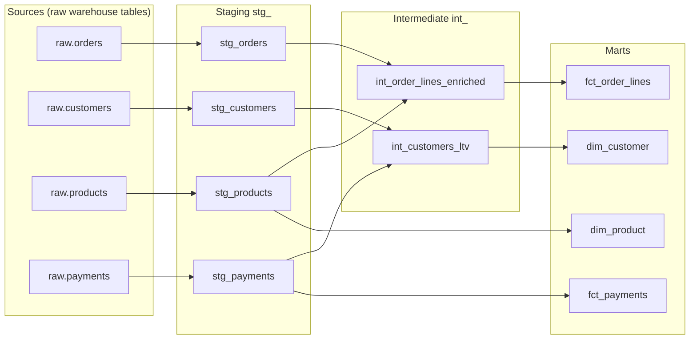
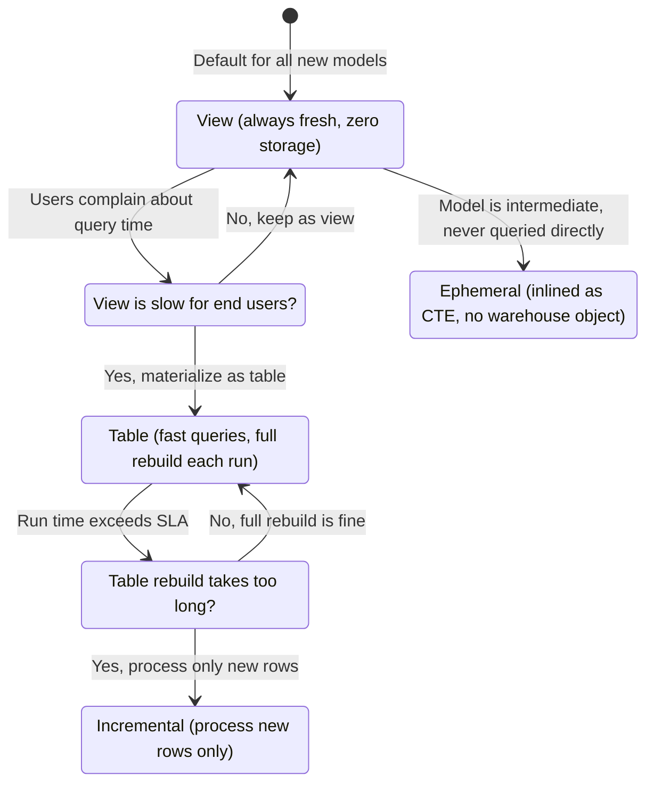
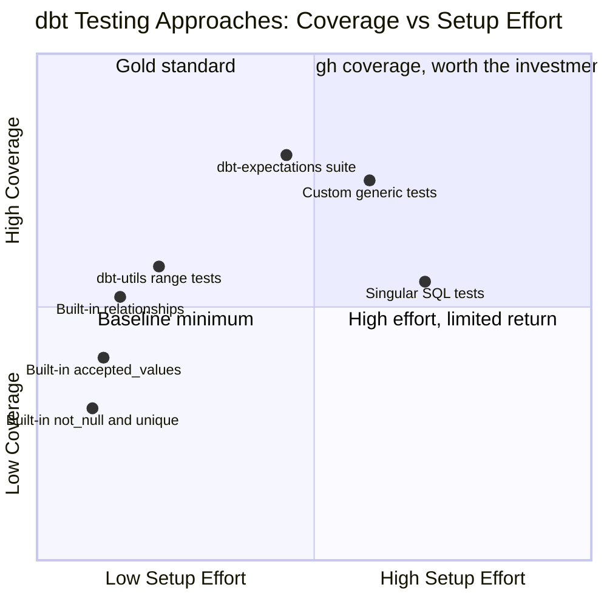

# dbt: The Analytics Engineering Tool That Turned SQL into Software

## The Transformation Spaghetti Problem

Every data team accumulates the same technical debt. It starts small: a SQL query in a notebook that calculates monthly revenue. A Tableau custom SQL field that someone added last quarter. A Python script that runs on a schedule and writes to a table that a dashboard depends on — but no one knows who owns it or when it last ran.

Six months in, you have a problem that feels embarrassingly common: four different definitions of "active customer" across four different tools, none of which match. A number changes on a dashboard and it takes three days to trace it back to a filter someone modified in a scheduled query that was not under version control. A new hire wants to understand the data pipeline and there is no documentation anywhere.

This is not a data quality problem. It is a software engineering problem applied to SQL. The transformations exist; they just exist as unversioned, untested, undocumented, loosely connected scripts that nobody fully owns.

**dbt** (data build tool) is the answer the analytics engineering community converged on. It treats SQL transformations as code: version-controlled, testable, documented, modular, with dependency resolution built in. It does not replace your warehouse — it compiles SQL and runs it *inside* your warehouse, leveraging BigQuery, Snowflake, Redshift, or Databricks for the actual computation.

The post you are reading is the natural continuation of [Dimensional Modeling with Kimball](/blog/dimensional-modeling-kimball). That post covered what to build — star schemas, fact and dimension tables, SCD types. This post covers how to build it reliably, repeatedly, and in a way your team can maintain.

---

## What dbt Is — and What It Is Not

dbt is a **transformation framework** that operates exclusively inside the T of ELT (Extract, Load, Transform). It does not extract data from sources. It does not load raw data into your warehouse. It takes data that is already in your warehouse and transforms it into models that analysts and BI tools can query.

This is the ELT pattern, and it is the industry standard in 2025: raw data lands in a staging area first (via Fivetran, Airbyte, or custom pipelines), and dbt transforms it in place.

What dbt adds on top of SQL:

| Without dbt | With dbt |
|---|---|
| SQL scripts run manually or via cron | Dependency-ordered DAG execution |
| No tests — errors discovered in dashboards | Built-in + custom data tests |
| Documentation lives in a wiki (or nowhere) | Auto-generated, code-adjacent docs |
| `SELECT *` from a table, hope it exists | `{{ ref('model_name') }}` with compile-time validation |
| One giant transformation script | Modular models, each with a single responsibility |
| "It worked yesterday" debugging | Column-level lineage, execution metadata |

The core primitive is the **model**: a `.sql` file containing a `SELECT` statement. dbt compiles that `SELECT` into a `CREATE TABLE AS` or `CREATE VIEW AS` statement, handles dependency ordering, and runs everything in the right sequence.

```sql
-- models/marts/fct_order_lines.sql
-- This is the entire file. dbt handles the CREATE TABLE part.
select
    order_line_key,
    product_key,
    customer_key,
    order_date_key,
    unit_price,
    quantity,
    unit_price * quantity as extended_price
from {{ ref('int_order_lines_enriched') }}
```

The `{{ ref('int_order_lines_enriched') }}` is a Jinja function that resolves to the correct schema and table name at compile time, and tells dbt that this model depends on `int_order_lines_enriched`. That dependency is what builds the DAG.

---

## Project Structure: Staging, Intermediate, Marts

A well-structured dbt project mirrors the transformation journey from raw source data to business-ready analytics. The official dbt convention defines three primary layers:

```
models/
├── staging/                    # stg_: one-to-one with source tables
│   ├── jaffle_shop/
│   │   ├── stg_orders.sql
│   │   ├── stg_customers.sql
│   │   └── _jaffle_shop__sources.yml
│   └── stripe/
│       ├── stg_payments.sql
│       └── _stripe__sources.yml
│
├── intermediate/               # int_: business logic, joins
│   ├── int_order_lines_enriched.sql
│   └── int_customers_with_ltv.sql
│
└── marts/                      # fct_ and dim_: dimensional model
    ├── fct_order_lines.sql
    ├── fct_order_lines.yml
    ├── dim_customer.sql
    ├── dim_customer.yml
    └── dim_date.sql
```

The DAG for a typical project flows like this:



### The Staging Layer

Staging models are the first point of contact with raw source data. The rules are strict and important:

1. **One staging model per source table** — no joining across sources here
2. **Rename columns to snake_case** — standardize to your warehouse's convention
3. **Cast types explicitly** — never trust source data types
4. **Materialize as views** — staging models are building blocks, not queried directly

```sql
-- models/staging/jaffle_shop/stg_orders.sql
with source as (
    select * from {{ source('jaffle_shop', 'orders') }}
),

renamed as (
    select
        -- identifiers
        id                          as order_id,
        user_id                     as customer_id,

        -- timestamps
        cast(created_at as timestamp)  as created_at,
        cast(updated_at as timestamp)  as updated_at,

        -- dimensions
        lower(status)               as status,
        lower(order_channel)        as order_channel,

        -- financials
        cast(amount as numeric)     as amount

    from source
)

select * from renamed
```

This model does exactly one thing: clean and rename `raw.orders`. No business logic. No joins. No aggregations.

### The Intermediate Layer

Intermediate models apply business logic and prepare data for the dimensional model. They often join across staging models for the first time.

```sql
-- models/intermediate/int_order_lines_enriched.sql
with orders as (
    select * from {{ ref('stg_orders') }}
),

order_items as (
    select * from {{ ref('stg_order_items') }}
),

products as (
    select * from {{ ref('stg_products') }}
),

enriched as (
    select
        oi.order_item_id,
        oi.order_id,
        oi.product_id,
        o.customer_id,
        o.created_at                             as order_created_at,
        o.status                                 as order_status,
        p.product_name,
        p.category,
        oi.unit_price,
        oi.quantity,
        oi.unit_price * oi.quantity              as extended_price,

        -- business logic: flag promotional orders
        case
            when o.order_channel = 'promo'
            then true
            else false
        end                                      as is_promotional

    from order_items oi
    inner join orders o on oi.order_id = o.order_id
    inner join products p on oi.product_id = p.product_id
)

select * from enriched
```

Intermediate models are typically **ephemeral** (inlined as CTEs, never materialized) or **views**. They exist for readability and modularity, not for end-user queries.

### The Marts Layer

Marts are the Kimball-shaped outputs: `fct_` and `dim_` tables, materialized as tables, documented, tested, and designed for BI consumption.

---

## Sources: Declaring Your Inputs

Before dbt can reference a raw table, you declare it as a **source**. This is what separates "we trust this table" from "we're using raw data without acknowledgment."

```yaml
# models/staging/jaffle_shop/_jaffle_shop__sources.yml
version: 2

sources:
  - name: jaffle_shop
    database: raw
    schema: jaffle_shop
    description: "Source data from the Jaffle Shop e-commerce platform"

    freshness:
      warn_after: {count: 12, period: hour}
      error_after: {count: 24, period: hour}
    loaded_at_field: _etl_loaded_at

    tables:
      - name: orders
        description: "One row per order placed on the platform"
        columns:
          - name: id
            description: "Primary key"
            tests:
              - not_null
              - unique

      - name: customers
        description: "One row per registered customer"
```

The `freshness` block is critical in production. Run `dbt source freshness` and dbt checks the `loaded_at_field` against your thresholds, warning you when source data has not arrived on schedule. This is the first line of defense against silent pipeline failures.

In models, you reference sources with `{{ source('jaffle_shop', 'orders') }}` — which dbt resolves to the correct `raw.jaffle_shop.orders` path and includes in the lineage graph.

---

## Materializations: How dbt Writes to Your Warehouse

A materialization is how dbt persists a model. The choice determines performance, cost, and freshness trade-offs.



### View

The default. Every `dbt run` recreates the view definition. No data is stored — the query runs fresh on each access.

**Use for:** Staging models, intermediate models that are queried infrequently, any model where freshness matters more than query speed.

### Table

Materializes the entire `SELECT` result into a physical table. Fast to query, but rebuilds completely on every `dbt run`.

**Use for:** Dimension tables, any mart model queried by dashboards, anything with aggregations that are expensive to compute at query time.

```yaml
# dbt_project.yml
models:
  my_project:
    marts:
      +materialized: table
    staging:
      +materialized: view
    intermediate:
      +materialized: ephemeral
```

### Incremental

The most nuanced materialization. On the first run, dbt builds the full table. On subsequent runs, it processes only new or updated rows and merges them into the existing table.

```sql
-- models/marts/fct_events.sql
{{
  config(
    materialized = 'incremental',
    unique_key = 'event_id',
    incremental_strategy = 'merge'
  )
}}

select
    event_id,
    user_id,
    event_type,
    occurred_at
from {{ ref('stg_events') }}


    -- On incremental runs: only process rows newer than what we have
    where occurred_at > (select max(occurred_at) from {{ this }})

```

The `` block is the core of the pattern — the filter only applies on incremental runs; the first run loads everything.

### Incremental Strategies

The strategy determines how new rows are merged into the existing table:

| Strategy | Behavior | Best for |
|---|---|---|
| `append` | Insert new rows, never update | Immutable event logs |
| `merge` | Upsert on unique_key — insert new, update existing | SCD Type 1 fact updates |
| `delete+insert` | Delete matching partition, then insert | Late-arriving data with Snowflake |
| `insert_overwrite` | Replace entire partitions | BigQuery, very large tables |

For BigQuery, `insert_overwrite` with partition configuration is dramatically cheaper than `merge` on large tables — teams report 100–200× cost reductions at scale. For Snowflake, `delete+insert` outperforms `merge` on tables with 500M+ rows by a factor of three or more.

```sql
-- BigQuery: partition-level replacement (cheapest at scale)
{{
  config(
    materialized = 'incremental',
    incremental_strategy = 'insert_overwrite',
    partition_by = {
      'field': 'event_date',
      'data_type': 'date'
    }
  )
}}
```

### Ephemeral

Not a real table or view — dbt inlines ephemeral models as CTEs in the models that reference them. They exist only in SQL at compile time.

**Use for:** Intermediate logic that is too complex to inline but too lightweight to materialize. Large numbers of ephemeral models can make debugging harder, so use sparingly.

---

## Testing: Data Quality as Code

dbt's testing framework treats data quality assertions as first-class citizens in the project. Tests run with `dbt test` and fail your CI pipeline like a broken unit test would.

### Built-in Generic Tests

Four tests ship with dbt and cover the majority of cases:

```yaml
# models/marts/fct_order_lines.yml
version: 2

models:
  - name: fct_order_lines
    columns:
      - name: order_line_key
        tests:
          - not_null
          - unique

      - name: product_key
        tests:
          - not_null
          - relationships:
              to: ref('dim_product')
              field: product_key

      - name: order_status
        tests:
          - accepted_values:
              values: ['placed', 'shipped', 'completed', 'cancelled']

      - name: extended_price
        tests:
          - not_null
```

`relationships` is the dbt equivalent of a foreign key constraint — it verifies referential integrity without needing database-level enforcement.

### dbt-utils and dbt-expectations

The community has built two indispensable testing packages:

**dbt-utils** adds macros and tests that dbt should have shipped with:

```yaml
# packages.yml
packages:
  - package: dbt-labs/dbt_utils
    version: [">=1.0.0", "<2.0.0"]
  - package: calogica/dbt_expectations
    version: [">=0.10.0", "<0.11.0"]
```

```yaml
columns:
  - name: extended_price
    tests:
      - dbt_utils.accepted_range:
          min_value: 0
          inclusive: true

  - name: order_date
    tests:
      - dbt_utils.not_null_proportion:
          at_least: 0.99    # Allow up to 1% nulls
```

**dbt-expectations** ports Great Expectations-style tests to dbt:

```yaml
  - name: customer_email
    tests:
      - dbt_expectations.expect_column_values_to_match_regex:
          regex: "^[a-zA-Z0-9._%+\\-]+@[a-zA-Z0-9.\\-]+\\.[a-zA-Z]{2,}$"

  - name: unit_price
    tests:
      - dbt_expectations.expect_column_values_to_be_between:
          min_value: 0
          max_value: 10000
          row_condition: "order_status != 'cancelled'"
```

### Custom Generic Tests

For assertions that don't fit existing packages, write your own in `tests/generic/`:

```sql
-- tests/generic/assert_column_sum_equals.sql


select count(*)
from {{ model }}
having sum({{ column_name }}) != {{ expected_sum }}


```

```yaml
# Usage
- name: quantity
  tests:
    - assert_column_sum_equals:
        expected_sum: 150000
```

The quadrant below maps the testing approaches by how much coverage they provide versus how much effort they require to set up:



---

## Documentation: The Catalog No One Has to Maintain

dbt generates documentation automatically from your YAML files and model descriptions. Run `dbt docs generate && dbt docs serve` to get a searchable site with lineage graphs, column-level descriptions, test results, and source freshness.

```yaml
# A well-documented model
models:
  - name: fct_order_lines
    description: >
      One row per order line item at the time of order placement.
      Grain: one order_item per order. Joins to dim_product,
      dim_customer, and dim_date via surrogate keys.

    meta:
      owner: "data-team@company.com"
      sla_hours: 4

    columns:
      - name: order_line_key
        description: "Surrogate key: MD5 hash of order_id and order_item_id"

      - name: extended_price
        description: >
          unit_price * quantity at time of order. Fully additive —
          safe to SUM across all dimensions.
```

The key discipline: **co-locate documentation with code**. Descriptions live in `.yml` files beside the `.sql` model. When someone changes the model, they change the description in the same PR.

**Exposures** extend lineage beyond dbt — declare which dashboards and tools consume which models:

```yaml
exposures:
  - name: revenue_dashboard
    type: dashboard
    maturity: high
    url: https://analytics.company.com/dashboards/revenue
    description: "Primary revenue reporting dashboard used by finance"
    owner:
      name: Finance Team
      email: finance@company.com
    depends_on:
      - ref('fct_order_lines')
      - ref('dim_customer')
      - ref('dim_date')
```

Now the lineage graph shows downstream dependencies: `raw.orders → stg_orders → fct_order_lines → Revenue Dashboard`. When a model changes, you know what breaks.

---

## Macros and Jinja: DRY SQL

dbt uses Jinja2 as a templating layer over SQL, enabling loops, conditionals, and reusable macros — the equivalent of functions in a programming language.

### Macros for Reusable Logic

```sql
-- macros/generate_surrogate_key.sql (simplified — dbt_utils provides this)

    ({{ column_name }} / 100)::numeric(16, {{ scale }})

```

```sql
-- Usage in a model
select
    {{ cents_to_dollars('amount_in_cents') }} as amount,
    {{ cents_to_dollars('tax_in_cents', scale=4) }} as tax_amount
from {{ ref('stg_payments') }}
```

### Dynamic SQL with Jinja

Jinja shines for cases where the SQL structure itself needs to change based on configuration:

```sql
-- models/marts/fct_revenue_by_region.sql
-- Pivot using a Jinja loop over a variable list of regions


select
    order_date,
    
    sum(case when region = '{{ region }}' then extended_price else 0 end)
        as revenue_{{ region }}
    ,
    
from {{ ref('fct_order_lines') }}
group by 1
```

The canonical use of Jinja in dbt is `{{ ref() }}` and `{{ source() }}`, but macros become essential for:
- Generating surrogate keys consistently (`dbt_utils.generate_surrogate_key`)
- Pivoting data dynamically
- Applying warehouse-specific functions without hard-coding
- Abstracting repetitive column transformations

---

## Seeds and Snapshots

Two more primitives worth knowing:

**Seeds** are CSV files that dbt loads into your warehouse as tables. Use them for small reference tables: country codes, product categories, cost centers, fiscal calendar mappings.

```
seeds/
└── country_codes.csv
```

```bash
dbt seed   # Loads CSV files as tables in your warehouse
```

**Snapshots** implement SCD Type 2 — they capture how a mutable source table changes over time. If you built the Kimball dimensional model from the previous post, snapshots are what feed your `dim_customer` SCD Type 2 history. (The mechanics are covered in detail in the [Kimball post](/blog/dimensional-modeling-kimball).)

---

## dbt Core vs dbt Cloud

dbt Core is the open-source engine — a Python package that compiles and runs your dbt project from a CLI. It is free, open source, and runs wherever Python runs: your laptop, a Docker container, Airflow, GitHub Actions.

dbt Cloud is the managed platform built around dbt Core. The transformation engine is identical; what changes is everything around it:

| Feature | dbt Core | dbt Cloud |
|---|---|---|
| Cost | Free | Paid (free tier for individuals) |
| IDE | Your editor | Browser-based IDE |
| Scheduling | You build it (Airflow, Prefect, cron) | Built-in job scheduler |
| CI/CD | You wire it (GitHub Actions, etc.) | Slim CI runs out of the box |
| Docs hosting | Self-hosted | Hosted automatically |
| Semantic layer | MetricFlow (open source, self-managed) | MetricFlow + hosted semantic layer |
| Explorer / lineage | `dbt docs serve` locally | dbt Explorer (full column-level lineage) |

For teams with engineering capacity, dbt Core + Airflow or dbt Core + GitHub Actions is the standard setup. For teams that want to move faster without building orchestration infrastructure, dbt Cloud eliminates weeks of setup. As of 2025, MetricFlow (the semantic layer engine) is open-sourced under Apache 2.0, narrowing the gap.

---

## When dbt Gets Hard

dbt solves real problems, but introduces complexity of its own at scale:

**Long build times.** A project with 500+ models can take 30-60 minutes to run fully. Solutions: incremental models, model-level tags for selective runs (`dbt run --select tag:daily`), and dbt Cloud's defer feature (run only changed models against a production manifest).

**Jinja complexity.** Macros that generate SQL dynamically are hard to debug. The compiled SQL lives in `target/compiled/`, which helps, but complex macros become their own maintenance burden. Prefer simple, readable SQL over clever Jinja.

**Test maintenance at scale.** Testing every column in a 50-table mart with dbt-expectations creates hundreds of tests that need maintenance as the schema evolves. Be deliberate: test primary keys (always), foreign keys (always), and business-critical constraints (selectively). Not every column needs four tests.

**The ref() abstraction leaks.** `{{ ref('dim_customer') }}` resolves to whatever schema your target environment points to. In development that might be `dev_jsmith.dim_customer`, in production `analytics.dim_customer`. When you need to use a model across multiple dbt projects, or reference an external table that is not in your dbt project, the abstraction breaks down — you must use `{{ source() }}` or raw SQL with a hard-coded path.

---

## Going Deeper

**Books:**

- Reis, J. & Housley, M. (2022). *Fundamentals of Data Engineering.* O'Reilly.
  - Chapter 8 on queries, modeling, and transformation covers the conceptual foundation for what dbt automates. Read the "transformation" sections alongside this post.

- Kimball, R. & Ross, M. (2013). *The Data Warehouse Toolkit.* 3rd ed. Wiley.
  - The dimensional models that dbt implements. The staging → intermediate → marts layer maps directly onto Kimball's methodology. Read this before going deep on dbt marts.

- Kleppmann, M. (2017). *Designing Data-Intensive Applications.* O'Reilly.
  - Chapter 3 on storage engines explains why materialization strategy matters in columnar warehouses — the foundation for understanding why `insert_overwrite` outperforms `merge` at scale in BigQuery.

- Karwin, B. (2010). *SQL Antipatterns.* Pragmatic Bookshelf.
  - A different angle: the SQL mistakes that dbt's modularity helps prevent. Understanding why monolithic transformation queries become unmaintainable deepens the appreciation for dbt's layered approach.

**Online Resources:**

- [dbt Developer Hub: How We Structure Our dbt Projects](https://docs.getdbt.com/best-practices/how-we-structure/1-guide-overview) — The official guide to the staging/intermediate/marts convention. The canonical reference for naming, materialization, and subdirectory organization.

- [dbt Developer Hub: Incremental Strategy](https://docs.getdbt.com/docs/build/incremental-strategy) — Complete reference for all incremental strategies, per-adapter differences, and when each applies. Essential before tuning incremental models for BigQuery or Snowflake at scale.

- [Building a Kimball Dimensional Model with dbt](https://docs.getdbt.com/blog/kimball-dimensional-model) — dbt Labs' end-to-end tutorial implementing a star schema with surrogate keys, schema tests, and YAML documentation. The most practical starting point for the marts layer.

- [dbt-utils Package Documentation](https://hub.getdbt.com/dbt-labs/dbt_utils/latest/) — The full reference for `generate_surrogate_key`, `accepted_range`, `not_null_proportion`, date spines, and the other macros every dbt project eventually needs.

**Videos:**

- ["dbt Tutorial for Beginners: Complete Course"](https://www.youtube.com/watch?v=toSAAgLUHuk) by Kahan Data Solutions — A full walkthrough from project setup through sources, models, tests, and documentation. Covers the staging/intermediate/marts structure with a real dataset.

- ["dbt Incremental Models Deep Dive"](https://www.youtube.com/watch?v=9kJgHuTPMXw) by dbt Labs (Coalesce) — Detailed coverage of all four incremental strategies, when each applies, late-arriving data edge cases, and real production patterns from teams at scale.

**Academic Papers / Key References:**

- dbt Labs. (2024). *The State of Analytics Engineering 2024.* — Annual survey of 2,000+ analytics engineers covering tool adoption, team structure, dbt usage patterns, and the analytics engineering discipline. Available at getdbt.com. Useful for understanding where the industry is heading.

- Linstedt, D. & Olschimke, M. (2015). *Building a Scalable Data Warehouse with Data Vault 2.0.* Morgan Kaufmann.
  - The alternative to Kimball + dbt. Understanding Data Vault clarifies the specific trade-offs dbt's conventions are optimized for — and when those conventions break down.

**Questions to Explore:**

- The `{{ ref() }}` abstraction resolves model names to the correct schema per environment. What happens when two separate dbt projects both need to produce and consume a `dim_customer` table? How do teams handle cross-project dependencies in practice?
- dbt's incremental models rely on a filter like `where updated_at > max(updated_at)`. What happens to late-arriving data — records where the `updated_at` is backdated because of an upstream bug? How do teams detect and recover from this?
- The staging layer rule is "one model per source table, no joins." As source systems become more complex (nested JSON columns, arrays, EAV schemas), where does this rule break down, and what does the right staging layer look like for a source with heavily nested structure?
- dbt tests fail your CI pipeline but do not prevent the model from being queried. When a test fails in production, should the downstream models be blocked from running? How do teams implement this "fail-forward vs fail-safe" decision?
- MetricFlow (dbt's semantic layer) defines metrics once and exposes them to any BI tool. Does a semantic layer make the dimensional model redundant, or does it complement it?
