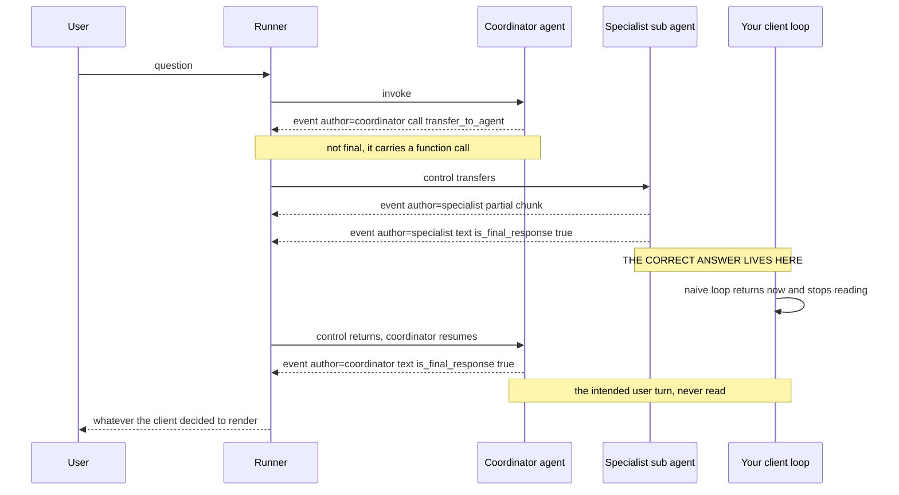
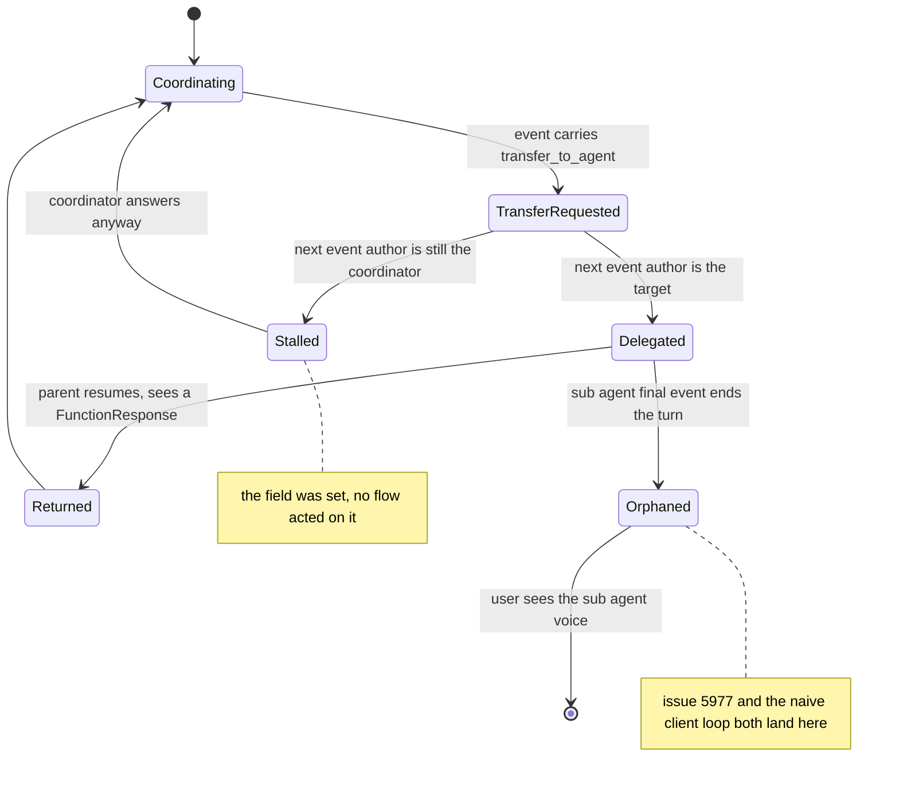
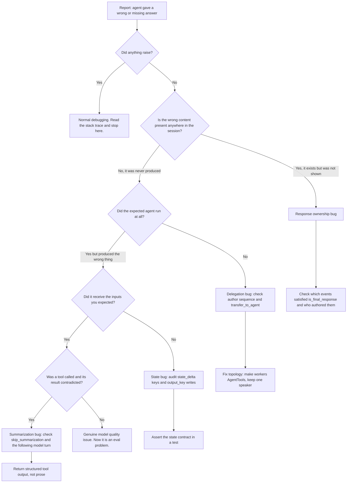

# Nothing Threw: Debugging Agent Flows in ADK 2.x

The shockwaves were always there. Every supersonic flight of every aircraft ever built has dragged that lattice of pressure discontinuities through the air behind it, and for most of aviation history nobody could see it. The instruments on board reported nothing wrong, because nothing *was* wrong. Mach number, fuel flow, control surface positions: all nominal, all green. The flow field was simply not something the instrumentation was built to represent.

Then someone pointed a camera at the aircraft with the desert floor behind it and used the tiny apparent displacement of the ground texture, caused by density gradients in the air, to render the shockwaves visible. Background-oriented schlieren. No new sensors, no new failure detected. Just an imaging technique aimed at the one thing the existing instrumentation structurally could not show.

That is the entire problem with debugging agents, and I am done with the metaphor now.

Here is the concrete claim. **The hardest bugs in a production agent return HTTP 200, complete in normal latency, log nothing above INFO, and produce a fluent answer that is wrong.** Or worse: a sub-agent computes exactly the right answer, that answer lands in the session as an event, and the user never sees it, because a different agent's event became the user-facing turn. Nothing threw. There is no stack trace, because there was no stack unwinding. Your exception tracker has zero entries for the incident a customer is currently on the phone about.

Debugging these requires a different surface than debugging code. The surface is the event stream, and most teams never look at it directly because the framework's default presentation is a chat transcript, precisely the projection that discards what you need.

Everything below was checked against `google-adk` **2.8.0**, released 2026-08-26, and against the ADK source on `main` as of September 2026. Where the docs and the source disagree, I went with the source and say so. One correction to the previous post in this series while we are here: the 1.x line is not frozen at 1.38.0. As of September 2026 the latest 1.x is **1.39.1**, released 2026-08-27, one day after 2.8.0. The two lines are still shipping in lockstep.

---

## Prerequisites

This post assumes you have shipped an ADK agent and are now operating it: sessions, events, tools, sub-agents, and the runner should all be familiar. For the ground floor, start with [Google ADK: Building Production Agents from First Principles](https://juanlara18.github.io/portfolio/#/blog/google-adk-agent-development-deep-dive).

If something in your codebase broke quietly during the 2.x upgrade, read [Migrating from ADK 1.x to 2.0](https://juanlara18.github.io/portfolio/#/blog/migrating-adk-1x-to-2x) first. Three of that migration's breaking changes are themselves flow errors; this post helps you find them but will not re-explain them. For the graph runtime explained rather than debugged, see [ADK Graph Workflows: Deterministic Orchestration for Agents](https://juanlara18.github.io/portfolio/#/blog/adk-graph-workflows-deterministic-orchestration) — I will use routes, nodes, and `node_info` freely without re-deriving them. And [Operating Agents at Scale: Evaluation and Observability](https://juanlara18.github.io/portfolio/#/blog/operating-agents-eval-observability-scale) is the platform-level companion to this post's framework-level focus.

---

## Code Errors and Flow Errors Are Different Bugs

A code error is a violated invariant inside one process. Something was `None`, an index was out of range, a socket timed out. The runtime detects it, unwinds the stack, and hands you a document describing the exact sequence of calls that produced it. Sixty years of tooling exists to make this pleasant.

A flow error is a violated invariant *across* the execution graph. Every individual step succeeded. Every function returned. Every model call came back well-formed. The composition is wrong, and composition has no stack, so it produces no trace.

The taxonomy below is the one I use when triaging. It is organized by *what diagnoses it*, because that is the only column that changes your afternoon.

| Flow error | Symptom the user sees | Where it surfaces | What the stack trace says | What actually diagnoses it |
| --- | --- | --- | --- | --- |
| Wrong edge taken | Plausible answer from the wrong branch | Nowhere; the happy path is usually the default route | Nothing | `actions.route` and `node_info.path` on the event stream |
| State key never written | Downstream agent improvises from an empty template variable | Nowhere; `{key?}` renders as empty string | Nothing | Union of all `actions.state_delta` keys across the invocation |
| Tool result summarized away | Confident answer contradicting the tool output | Nowhere; the tool call succeeded | Nothing | Diff `get_function_responses()` payload against the following model turn |
| Delegation that did not delegate | Coordinator answers a question it is not qualified for | Nowhere; the coordinator produced text | Nothing | Set of distinct `author` values in the invocation |
| Sub-agent answered, nobody surfaced it | Vague or truncated final turn | Nowhere | Nothing | Which event satisfied `is_final_response()` last, and who wrote it |
| Loop escalated silently | Answer produced after one iteration instead of converging | Nowhere; `escalate` is a normal signal | Nothing | `actions.escalate` position in the event sequence |
| History isolation hid the evidence | Sub-agent contradicts something established earlier | Nowhere | Nothing | `branch` on the events, and what the model actually received |

Notice the third and fourth columns. Every row says the same thing, and that is the definition of a flow error: **your existing failure detection is structurally incapable of representing it.**

This is not an ADK problem. Cemri, Pan, and colleagues built the first empirical taxonomy of multi-agent LLM failures from over 1600 annotated traces across seven frameworks, and the shape of their result is the shape of the table above: failures cluster into system design issues, inter-agent misalignment, and task verification, and almost none are things a runtime can detect for you. "Inter-agent misalignment" is an academic phrase for "agent A believed it had handed off and agent B believed it had not."

The practical consequence: **you must instrument for flow errors deliberately, because no default will surface them.** Let us start with what the defaults do show.

---

## What ADK Shows You by Default, and What It Hides

### The log levels, and the one that matters

ADK uses standard Python logging with five levels, and every ADK logger is namespaced under the `google_adk.` prefix, which makes filtering trivial. The interesting jump is INFO to DEBUG, because DEBUG is where the full LLM request and response appear: complete system instructions, conversation history as the model actually received it, the tool declarations in scope, function calls and responses, latency.

From the CLI:

```bash
# Dev UI with full framework debug output.
adk web --log_level DEBUG path/to/your/agents_dir
```

Programmatically, which is what you want in a service:

```python
import logging

# Turn the framework up without drowning in your web server's own DEBUG output.
logging.basicConfig(
    level=logging.INFO,
    format="%(asctime)s - %(levelname)s - %(name)s - %(message)s",
)
logging.getLogger("google_adk").setLevel(logging.DEBUG)
```

Splitting it that way matters. A blanket `basicConfig(level=logging.DEBUG)` in a service that also runs `httpx`, `sqlalchemy`, and `grpc` buries the thing you want under everything else. Raise `google_adk` alone.

### The elision, and the environment variable that lifts it

Here is the fact that surprises people the first time they turn DEBUG on and find their prompts replaced with placeholders: **prompt content is elided in ADK logs by default, for security.** DEBUG gives you the shape of the request, not the payload. To get the payload you must opt in explicitly:

```bash
export OTEL_INSTRUMENTATION_GENAI_CAPTURE_MESSAGE_CONTENT=true
```

The variable comes from the OpenTelemetry GenAI semantic conventions rather than from ADK, which is why it looks out of place next to ADK's own flags, and it takes more than a boolean. Supported values are `NO_CONTENT`, `EVENT_ONLY`, `SPAN_ONLY`, and `SPAN_AND_EVENT`. Passing `true` is interpreted as `EVENT_ONLY`.

That granularity is the useful part, and almost nobody uses it. `SPAN_ONLY` puts content on the trace span and keeps it out of your log stream; `EVENT_ONLY` does the reverse. If your traces go to a project-scoped Cloud Trace backend with short retention and your logs go to a shared aggregator half the organization can query, those are very different privacy postures and you get to pick.

### Doing this without creating an incident of your own

I work on agents inside a financial institution, so let me be practical rather than preachy. Turning on content capture means user prompts and model responses land in your logging backend verbatim: account numbers, client names, whatever someone pasted out of a spreadsheet at 4pm on a Friday. The docs say to set it to false in production, and they are right, but "false in production" is not an operating procedure, because production is exactly where the bug is.

What actually works:

```python
import os

# Content capture is a debugging switch, not a config value. Gate it on an
# explicit, short-lived, auditable flag rather than on the environment name.
DEBUG_SESSION_IDS = set(
    filter(None, os.environ.get("ADK_CONTENT_CAPTURE_SESSIONS", "").split(","))
)


def content_capture_enabled(session_id: str) -> bool:
    """Capture content only for sessions someone deliberately opted in."""
    return session_id in DEBUG_SESSION_IDS
```

Capture content for a named set of session IDs, not for an environment. Route those records to a separate sink with its own retention and access control. Have the flag expire. This turns "we enabled prompt logging in prod for two hours" from a policy violation into a documented, scoped, reversible diagnostic action, which is a conversation you can have with a compliance officer.

### Trace tab versus Events tab

The `adk web` dev UI presents two views of the same invocation, and the difference is not cosmetic.

The **Trace** tab is the timing and hierarchy view. Traces are grouped automatically by user message. Hovering a row highlights the corresponding chat message; clicking one opens a detail panel with four sub-tabs: **Event** (raw event data), **Request** (what was sent to the model), **Response** (what came back), and **Graph** (a visual rendering of the tool calls and agent logic flow). Blue rows are generated events.

The **Events** view is the sequential record: every event, in order, as the session stored it.

The rule I use: **Trace answers "where did the time go," Events answers "what actually happened."** For a latency investigation, start in Trace. For a flow error, start in Events, because a flow error has no time signature at all. It costs exactly as long as the correct behavior would have.

### What is not represented anywhere

This part defines the boundary of the built-in tooling.

- **Why a route was chosen.** The event records `actions.route` with the selected value. It does not record the alternatives, or the input values the routing function saw. If your routing function branches on three fields and picks wrong, the event tells you the outcome, not the evidence.
- **What the model did not see.** Events carry a `branch` field and, in 2.x, an internal isolation mechanism restricting which prior events an agent's context builder includes. So the session contains an event, the model that should have used it never received it, and the session records no trace of that omission. You infer it from the DEBUG-level request dump, or you never learn it.
- **State reads.** Writes are recorded as `state_delta` on the event that made them. Reads are recorded nowhere. An agent whose instruction template referenced a key that was never set produces exactly the same event as one whose key was set correctly.
- **The counterfactual final response.** When four agents participate in a turn and one event becomes the user-facing message, nothing records that the other three also produced final-shaped responses. More on this shortly.

Everything in that list is available if you instrument for it, and unavailable if you do not. That is the argument for the flow recorder later in this post.

---

## The Event Stream Is the Ground Truth

Every other view — the chat transcript, the trace waterfall, the Cloud Logging query — is a projection of the event stream, and projections discard information. When debugging a flow error, go to the source.

### Anatomy of an Event in 2.8.0

Reading `google/adk/events/event.py` on `main`, `Event` subclasses `LlmResponse` and adds the following. I list the source rather than the docs because the docs are one release behind on two of these.

| Field | Type | What it tells you |
| --- | --- | --- |
| `author` | `str` | `'user'` or the agent name that appended this event |
| `invocation_id` | `str` | Correlates every event in one user request cycle |
| `id` | `str` | Unique per event, assigned by the session |
| `timestamp` | `float` | Seconds since epoch, set at construction |
| `content` | `Content` | The payload: text, function calls, function responses |
| `partial` | `bool` | This is a streaming chunk and more text follows |
| `turn_complete` | `bool` | The conversational turn is finished |
| `actions` | `EventActions` | State deltas and control-flow signals; see below |
| `output` | `Any` | The workflow node's structured return value |
| `node_info` | `NodeInfo` | Graph position metadata, set by the runtime |
| `branch` | `str` | Hierarchy path like `agent_1.agent_2.agent_3` |
| `long_running_tool_ids` | `set[str]` | Which function calls are long-running |
| `error_code`, `error_message` | `str` | Inherited from `LlmResponse` |
| `isolation_scope` | `str` | Internal. Restricts which events an agent can see |

Two notes the documentation does not make loudly enough.

First, `isolation_scope` carries a warning directly in the source: do not use it, it is internal and may change without notice. It currently scopes a delegated task agent under the originating function-call id so it sees only its own task's events. **You will see it while debugging: read it, never write it.** If a sub-agent appears to be missing context that is plainly in the session, this field is the first place to look and the last place to touch.

Second, `node_info` is richer than "the node name." `NodeInfo` carries:

- `path`: the node's position in the workflow. In a workflow `A` with a node `B` directly underneath, an event from `B` has path `"A/B"`. Agent state events have the path of the containing workflow.
- `output_for`: node paths whose output this event represents. One event can be the output for a node *and* for its enclosing workflow, appearing as something like `["wf/A@1/B@1", "wf/A@1"]`.
- `message_as_output`: when true, this event's content *is* the node's output, so no separate output event follows.

Two derived properties are worth knowing: `node_info.name` gives the clean node name with the `@run_id` suffix stripped, and `node_info.run_id` gives the run identifier, which is how you distinguish the third iteration of a loop from the first.

### EventActions is where the control flow lives

If `content` is what was said, `actions` is what was *done*. From `event_actions.py` on `main`:

| Action field | Meaning when set |
| --- | --- |
| `state_delta` | Key-value pairs written to session state by this event |
| `artifact_delta` | Filename to version map for artifacts saved |
| `transfer_to_agent` | Name of the agent that should receive control |
| `escalate` | This agent is escalating to a higher level; terminates a loop |
| `skip_summarization` | Do not call the model to summarize this function response |
| `route` | Route key or keys for workflow graph edge matching |
| `end_of_agent` | This agent finished a run; can appear multiple times in a loop |
| `agent_state` | Checkpoint payload; set only by the ADK workflow runtime |
| `compaction` | A compacted span of prior events |
| `requested_auth_configs` | Tool responses requesting credentials |
| `requested_tool_confirmations` | Tool calls awaiting a human yes or no |
| `rewind_before_invocation_id` | Target invocation for a rewind event |
| `render_ui_widgets` | UI widgets the client should render |

The `route` field accepts a `bool`, `int`, `str`, or a list of them. The list form is easy to miss and matters when a node fans out to several branches at once.

Also worth knowing: `state_delta` and `agent_state` both use a wrapping serializer that falls back to a sanitized representation and logs a warning when a value is not JSON-serializable. **If you have ever put a callable or a client object into session state, you have a `Failed to serialize state_delta` warning in your logs and a string `repr` in your session where you expected an object.** That is a flow error with a log line, which makes it one of the friendlier ones.

### Reading a trace by hand

Before writing tooling, learn to read the raw stream. For a single reproducible bug this is faster than anything else:

```python
from google.adk.events import Event


def describe(event: Event) -> str:
    """One line per event, dense enough to scan a hundred of them."""
    kind = "text"
    if calls := event.get_function_calls():
        kind = "call:" + ",".join(c.name for c in calls)
    elif responses := event.get_function_responses():
        kind = "resp:" + ",".join(r.name for r in responses)
    elif event.partial:
        kind = "chunk"

    a = event.actions
    signals = []
    if a.state_delta:
        signals.append("state=" + ",".join(sorted(a.state_delta)))
    if a.transfer_to_agent:
        signals.append(f"transfer={a.transfer_to_agent}")
    if a.escalate:
        signals.append("escalate")
    if a.route is not None:
        signals.append(f"route={a.route}")
    if a.end_of_agent:
        signals.append("end_of_agent")

    return (
        f"{event.author:<20} {kind:<28} "
        f"path={event.node_info.path or '-':<24} "
        f"final={event.is_final_response()!s:<5} "
        f"{' '.join(signals)}"
    )


# session.events is the durable record. This is the same data the UI renders,
# minus the rendering decisions that hide half of it.
for e in session.events:
    print(describe(e))
```

Twelve lines of output from that function have resolved more agent bugs for me than any dashboard. Print it, read down the `author` column, and ask one question: **is the order of authors the order I designed?**

---

## Who Owns the User-Facing Turn

This is the section that motivated the post. The failure it describes is both extremely common and almost never diagnosed correctly on the first try, and the bug report is always some version of *"the agent knows the answer, I can see it in the logs, but the user got something else."*

### What `is_final_response()` actually means

The docs describe it as returning true when an event is suitable for user display. The source is more precise, and the precision changes how you should use it. From `event.py` on `main`:

```python
def is_final_response(self) -> bool:
    if self.actions.skip_summarization or self.long_running_tool_ids:
        return True
    return (
        not self.get_function_calls()
        and not self.get_function_responses()
        and not self.partial
        and not self.has_trailing_code_execution_result()
    )
```

Two things to extract. First, there are four negative conditions, not three: the documentation lists no function calls, no function responses, and not partial. The source adds `has_trailing_code_execution_result()`, so an event whose last content part is a code execution result is not final either. If you reimplemented this predicate in your own client — and many teams have, to avoid depending on the framework in a rendering layer — check whether you have that fourth condition. Reimplementations are a reliable source of duplicated or dropped final turns.

Second, the docstring, which is the most load-bearing sentence in the ADK event API and appears in no tutorial I have found:

> Note that when multiple agents participate in one invocation, there could be one event has `is_final_response()` as True for each participating agent.

Read that again. `is_final_response()` does **not** mean "this is the answer for the user." It means **"this agent has finished talking."** In a single-agent system those are the same statement, which is why the misunderstanding survives every tutorial. In a multi-agent system they are different, and the gap between them is where your answer disappears.

So a naive client loop is wrong in a way that stays invisible until you add your second agent:

```python
# WRONG in any multi-agent system. Silently picks whichever agent
# happened to finish first, which is usually a sub-agent.
async for event in runner.run_async(...):
    if event.is_final_response():
        return event.content.parts[0].text
```

The `return` fires on the first agent to finish, which in a coordinator-and-specialists topology is a specialist. Sometimes that is the answer you wanted. Sometimes the coordinator was about to reformat it, add a disclaimer, or combine it with a second specialist's output, and you just truncated the turn. The failure is not deterministic across inputs, which is why it survives testing.

Two corrections, both required:

```python
async def collect_turn(runner, **kwargs) -> tuple[str, str]:
    """Return the user-facing text and the agent that authored it.

    Handles two things the naive loop gets wrong: streaming accumulation,
    and the fact that every participating agent emits a final-shaped event.
    """
    buffer: dict[str, list[str]] = {}
    last_final: tuple[str, str] | None = None

    async for event in runner.run_async(**kwargs):
        text = _text_of(event)
        if event.partial and text:
            # Partial chunks must be accumulated per author. Two agents
            # streaming concurrently will interleave if you use one buffer.
            buffer.setdefault(event.author, []).append(text)
            continue

        if event.is_final_response():
            accumulated = "".join(buffer.pop(event.author, []))
            last_final = (event.author, accumulated + (text or ""))

    if last_final is None:
        raise RuntimeError("Invocation produced no final response event.")
    return last_final


def _text_of(event) -> str | None:
    if not event.content or not event.content.parts:
        return None
    return "".join(p.text for p in event.content.parts if p.text and not p.thought)
```

Taking the **last** final response rather than the first is the right default, because the outermost agent finishes last. Accumulating **per author** fixes the interleaving you get with parallel sub-agents. And filtering out `p.thought` parts matters on thinking models, where the reasoning trace is text on the same content object and will otherwise end up in your user-facing string.

Even "last one wins" is a heuristic. The rigorous version asserts on the author; see the testing section.

### The sequence, drawn



The two `is_final_response() == True` events in that diagram are the whole bug. Both are legitimate, both are exactly what the framework promises, and the framework never told you which one to render because it cannot know.

### When the framework itself drops the return

The client loop is your bug and you can fix it. There is a second version where the framework ends the flow early, and you should know about it before spending a day suspecting your own code.

Issue [`google/adk-python` #5977](https://github.com/google/adk-python/issues/5977), open and filed in June 2026, reports that when a `RemoteA2aAgent` is registered as a sub-agent of an `LlmAgent`, the parent's execution terminates as soon as the sub-agent completes and the parent LLM never processes the result. The docs frame remote agents as feeling like local tools, with the parent seeing results as regular tool output. The reported behavior does not match: `transfer_to_agent` acts as a permanent scheduler routing signal, while an A2A sub-agent is semantically a call-and-return. The reporter traces it to `_llm_agent_wrapper.py`, where detecting `transfer_to_agent` sets a flag that makes the outer loop return immediately instead of re-entering the LLM with the sub-agent's response as a `FunctionResponse`.

Same shape as the client-loop bug, one layer down: **the right answer existed and the wrong component decided the turn was over.** If you use A2A sub-agents and your parent's post-processing appears skipped, check this issue against your version before rewriting anything.

### A decision rule for who should be speaking

The durable fix is architectural, not a smarter client loop. Decide, per agent, whether it is a *speaker* or a *worker*, and make that decision structural.

| Property | Speaker | Worker |
| --- | --- | --- |
| Emits user-facing text | Yes | No |
| Wired as | Root, or a sub-agent that owns the whole turn after transfer | `AgentTool`, or a workflow node with an `output` |
| Return path | Its final event is the turn | Returns a value to a parent that speaks |
| Instruction contains | Tone, formatting, audience | Task and output schema only |
| Has `output_key` or `output_schema` | Usually not | Almost always |

The rule: **at most one speaker per turn, and it should be the outermost agent unless a transfer deliberately hands the whole turn away.** Everything else is a worker, and a worker should be structurally incapable of ending the turn — an `AgentTool` or a workflow node with a typed output, not a `sub_agent` reachable by transfer.

That reframing eliminates most of this failure class. If a worker cannot become the final response because it is invoked as a tool, the ambiguity never arises. And if you find yourself writing "and then the coordinator reformats it," you have just described a speaker with workers underneath, which is the shape you want.

A related trap: `output_key` writes an agent's response into session state so a *downstream agent* can read it. It has nothing to do with what the user sees. An agent can have a perfectly populated `output_key` and contribute nothing to the rendered turn. That is the design, not a bug. What is a bug is assuming the reverse.

---

## Delegation That Did Not Delegate

The second-largest category, with a specific trap and a five-year-old issue behind it.

### `transfer_to_agent` is a signal, not a call

`EventActions.transfer_to_agent` is a field on the actions payload, and it is natural to conclude that setting it performs a transfer. From arbitrary code, it does not.

Issue [`google/adk-python` #367](https://github.com/google/adk-python/issues/367) and its documentation counterpart [`google/adk-docs` #644](https://github.com/google/adk-docs/issues/644), both filed on 2025-04-23 and both still open as of September 2026, report exactly this. A developer extending `BaseAgent` to orchestrate sub-agents manually yields an `Event` with `EventActions(transfer_to_agent=...)` and observes, in their words, that "this will just return an `EventActions` object but will not actually transfer to the agent."

Transfer is honored when the LLM flow's transfer machinery produces it, as a consequence of the model calling the framework-provided `transfer_to_agent` tool. An event yielded from a custom agent body carries the field, the field is persisted, and the flow that would act on it is not running. The field is a record of a decision, not the mechanism that executes it.

That the docs issue is still open five years later is informative: this is a semantic gap between two reasonable readings of the same field, not a crash anyone will fix by accident. Treat `transfer_to_agent` on an event as **evidence that a transfer was requested**, and verify against the `author` of subsequent events whether one occurred.

In 2.x this is largely a non-problem for new code, where handoff should be an edge in a `Workflow`. It is a very live problem for 1.x code carried forward, and the symptom is precisely a flow error: the coordinator keeps talking, answers out of its depth, and nothing raises.

### `AgentTool` is reliable and opaque

Wrapping an agent as a tool is the pattern I recommended above, and it has one real cost: the dev UI does not render tool calls that happen *inside* an `AgentTool`. Issue [`google/adk-python` #1039](https://github.com/google/adk-python/issues/1039), closed, filed 2025-05-30, records this as expected behavior rather than a defect. Nested tool calls do not display; state changes from the wrapped agent do propagate to the parent's session.

So `AgentTool` buys reliable call-and-return semantics and costs UI visibility into what happened inside. That is a good trade, and the missing visibility is exactly what a plugin gives back, because plugin hooks fire regardless of nesting depth. This is one of the concrete reasons to write the flow recorder.

### Escalation, and why it is more legible

`actions.escalate` is a boolean that terminates a loop by signalling upward. Compared to transfer it has two debugging advantages: it is a single bit rather than a name that must resolve, and it appears at an unambiguous position in the sequence. "Did the loop exit early" is answered by finding the first event with `escalate` set and counting the iterations before it.

The related field is `end_of_agent`, which the source notes can appear multiple times for the same agent in one invocation when there is a loop, and which only the ADK workflow runtime sets. Counting `end_of_agent` events per author is the cheapest possible loop-iteration counter.

### Delegation as a state machine



Three of those five terminal states are bugs, and none of them raise. The diagnostic in every case is the same one line of information: **the sequence of `author` values.** If you build exactly one piece of custom tooling after reading this post, make it the thing that prints that sequence.

---

## State That Was Never Written

State bugs are the quietest of all, because ADK's instruction templating supports an optional form. Write `{feedback?}` and a missing key renders as empty rather than raising. That is a good feature. It also makes the difference between "the upstream agent wrote nothing" and "the upstream agent wrote an empty string" invisible at the point of use.

### The `output_key` no-op

Here is a genuinely non-obvious one, verified in `llm_agent.py` on `main` rather than in any documentation. The logic saving an agent's response to `output_key` runs only when **both** of these hold:

1. `event.is_final_response()` is true, and
2. the event's content has at least one part with `text` set and `thought` not set.

If there is no non-thought text part, the method returns early, deliberately, with a comment explaining that this avoids overwriting `state_delta` values already set — for example by an `after_tool_callback` with `skip_summarization` on a function-response-only event.

The consequences:

- An agent whose turn ends on a tool result rather than text writes **nothing** to its `output_key`. The key keeps its previous value, or stays absent.
- On a thinking model, an event whose only text parts are `thought` parts writes nothing.
- An agent in **task mode** skips `output_key` processing on text responses entirely, because task-mode agents deliver output through `finish_task`. If you set `mode="task"` and `output_key` stopped populating, that is why, and it is intentional.
- Streaming with tool calls produces non-partial events carrying text alongside a function call, which `is_final_response()` rejects. The framework accumulates those segments separately so they survive into state — a workaround whose existence tells you how narrow the happy path is.

None of this raises. The downstream agent's template renders empty and it improvises.

### Auditing state for an invocation

The union of `state_delta` keys across an invocation is the complete record of what was written. Nothing else is.

```python
from collections import defaultdict


def state_write_log(events) -> dict[str, list[tuple[str, object]]]:
    """Map each state key to the ordered list of (author, value) that wrote it.

    A key with one writer is fine. A key with two writers is an output_key
    collision. A key you expected and do not see here was never written.
    """
    writes: dict[str, list[tuple[str, object]]] = defaultdict(list)
    for e in events:
        for key, value in e.actions.state_delta.items():
            writes[key].append((e.author, value))
    return dict(writes)


def assert_state_contract(events, required: set[str]) -> None:
    """Fail loudly on the two silent state bugs: missing keys and collisions."""
    writes = state_write_log(events)

    missing = required - writes.keys()
    if missing:
        raise AssertionError(f"State keys never written: {sorted(missing)}")

    for key, writers in writes.items():
        authors = {author for author, _ in writers}
        if len(authors) > 1:
            raise AssertionError(
                f"output_key collision on {key!r}: written by {sorted(authors)}. "
                "Last writer wins and nothing warns you."
            )
```

The collision check earns its place. Two agents configured with the same `output_key` is a copy-paste mistake producing no error, no warning, and no log line. The second silently overwrites the first, and the first agent's work is gone. In a pipeline of six agents where two were adapted from the same template, this is close to inevitable.

One more thing while reading state deltas: the prefix system. `app:` keys are shared across all users and sessions, `user:` is per user across sessions, `temp:` is discarded when the invocation ends, and an unprefixed key lives for the session. A value that "disappeared between turns" was almost certainly `temp:`. A value that "leaked between users" was almost certainly `app:`.

---

## The Flow Recorder: A Plugin You Should Write Once

Everything above is diagnosis by inspection. At some point you want the machine to write the record for you, for every invocation, in a format you can replay and diff. That is what `BasePlugin` is for.

Plugins differ from agent callbacks in scope: a plugin registers once on the `Runner` and applies to every agent, tool, and model call underneath it, whereas an agent callback applies only to its own instance. Plugin callbacks also run **before** agent callbacks, and if a plugin-level agent callback returns anything other than `None`, the agent-level callback is skipped entirely. For observability you want plugin scope, and you want to return `None` from everything, always.

The full hook set, from the Python `BasePlugin` signatures:

| Hook | Fires |
| --- | --- |
| `on_user_message_callback` | A user sends a message |
| `before_run_callback` | Runner prepares to execute |
| `before_agent_callback` | Immediately before an agent's work begins |
| `after_agent_callback` | After an agent finishes its steps |
| `before_model_callback` | Before a model call |
| `after_model_callback` | After a successful model call |
| `on_model_error_callback` | A model call raised |
| `before_tool_callback` | Before a tool executes |
| `after_tool_callback` | After a tool succeeds |
| `on_tool_error_callback` | A tool raised |
| `on_event_callback` | An agent produced an output event |
| `after_run_callback` | After the runner completes |

That covers every boundary in the taxonomy table. Here is a recorder that uses it.

```python
"""A flow recorder for ADK. Registers once, records everything, returns None
from every hook so it can never change behavior.

Emits newline-delimited JSON, one record per boundary crossing, keyed by
invocation_id. The output is replayable: you can reconstruct the full
execution order from it without the original session store.
"""

from __future__ import annotations

import json
import os
import time
import uuid
from pathlib import Path
from typing import Any, Optional

from google.adk.agents.base_agent import BaseAgent
from google.adk.agents.callback_context import CallbackContext
from google.adk.agents.invocation_context import InvocationContext
from google.adk.events import Event
from google.adk.models.llm_request import LlmRequest
from google.adk.models.llm_response import LlmResponse
from google.adk.plugins.base_plugin import BasePlugin
from google.adk.tools.base_tool import BaseTool
from google.adk.tools.tool_context import ToolContext
from google.genai import types

# Keys whose values must never reach the recorder output. Extend for your
# domain. This list is the difference between a debugging artifact and an
# incident report about a debugging artifact.
REDACT_KEYS = {"ssn", "account_number", "card", "password", "token", "iban"}


def _redact(value: Any, capture_content: bool) -> Any:
    """Structural redaction. Shapes are preserved, payloads are not."""
    if isinstance(value, dict):
        return {
            k: ("<redacted>" if k.lower() in REDACT_KEYS else _redact(v, capture_content))
            for k, v in value.items()
        }
    if isinstance(value, (list, tuple)):
        return [_redact(v, capture_content) for v in value]
    if isinstance(value, str):
        if capture_content:
            return value
        # Keep the length. "empty string" and "4KB of JSON" are different bugs.
        return f"<str len={len(value)}>"
    return value


def _summarize_content(content: Optional[types.Content], capture: bool) -> Any:
    if content is None or not content.parts:
        return None
    parts = []
    for part in content.parts:
        if part.function_call is not None:
            parts.append(
                {
                    "kind": "function_call",
                    "name": part.function_call.name,
                    "args": _redact(dict(part.function_call.args or {}), capture),
                }
            )
        elif part.function_response is not None:
            parts.append(
                {
                    "kind": "function_response",
                    "name": part.function_response.name,
                    "response": _redact(part.function_response.response, capture),
                }
            )
        elif part.text is not None:
            parts.append(
                {
                    "kind": "thought" if part.thought else "text",
                    "text": _redact(part.text, capture),
                }
            )
        else:
            parts.append({"kind": "other"})
    return {"role": content.role, "parts": parts}


class FlowRecorder(BasePlugin):
    """Records every flow boundary to newline-delimited JSON.

    Args:
        out_dir: directory for the .jsonl files, one per process.
        capture_content: include raw text and tool payloads. Default False.
            Gate this on an explicit, expiring flag, never on the environment.
        sample_rate: fraction of invocations to record in full. Boundary
            records are cheap; content records are not.
    """

    def __init__(
        self,
        out_dir: str = "./flow-records",
        capture_content: bool = False,
        sample_rate: float = 1.0,
    ) -> None:
        super().__init__(name="flow_recorder")
        Path(out_dir).mkdir(parents=True, exist_ok=True)
        self._path = Path(out_dir) / f"flow-{os.getpid()}-{uuid.uuid4().hex[:8]}.jsonl"
        self._fh = self._path.open("a", encoding="utf-8")
        self._capture = capture_content
        self._sample_rate = sample_rate
        self._seq = 0
        # Wall-clock start per (invocation, boundary) so we can attribute time.
        self._open_spans: dict[tuple[str, str], float] = {}

    # ---------- writing ----------

    def _write(self, invocation_id: str, kind: str, **fields: Any) -> None:
        self._seq += 1
        record = {
            "seq": self._seq,
            "ts": time.time(),
            "invocation_id": invocation_id,
            "kind": kind,
            **fields,
        }
        self._fh.write(json.dumps(record, default=str) + "\n")
        self._fh.flush()  # flush: a crashed process must not lose the last record

    def _open(self, invocation_id: str, key: str) -> None:
        self._open_spans[(invocation_id, key)] = time.perf_counter()

    def _close(self, invocation_id: str, key: str) -> Optional[float]:
        start = self._open_spans.pop((invocation_id, key), None)
        return None if start is None else round(time.perf_counter() - start, 4)

    # ---------- run boundaries ----------

    async def on_user_message_callback(
        self, *, invocation_context: InvocationContext, user_message: types.Content
    ) -> Optional[types.Content]:
        self._write(
            invocation_context.invocation_id,
            "user_message",
            session_id=getattr(invocation_context.session, "id", None),
            content=_summarize_content(user_message, self._capture),
        )
        return None  # never modify the message

    async def before_run_callback(
        self, *, invocation_context: InvocationContext
    ) -> Optional[types.Content]:
        self._write(
            invocation_context.invocation_id,
            "run_start",
            root_agent=invocation_context.agent.name,
        )
        return None

    async def after_run_callback(
        self, *, invocation_context: InvocationContext
    ) -> None:
        self._write(invocation_context.invocation_id, "run_end")
        return None

    # ---------- agent boundaries ----------

    async def before_agent_callback(
        self, *, agent: BaseAgent, callback_context: CallbackContext
    ) -> None:
        inv = callback_context.invocation_id
        self._open(inv, f"agent:{agent.name}")
        self._write(inv, "agent_enter", agent=agent.name)
        return None

    async def after_agent_callback(
        self, *, agent: BaseAgent, callback_context: CallbackContext
    ) -> None:
        inv = callback_context.invocation_id
        self._write(
            inv,
            "agent_exit",
            agent=agent.name,
            elapsed_s=self._close(inv, f"agent:{agent.name}"),
        )
        return None

    # ---------- model boundaries ----------

    async def before_model_callback(
        self, *, callback_context: CallbackContext, llm_request: LlmRequest
    ) -> Optional[LlmResponse]:
        inv = callback_context.invocation_id
        self._open(inv, "model")
        # The count of contents is the cheap proxy for context growth, and it
        # is the number that explains most "it got worse after turn 40" reports.
        self._write(
            inv,
            "model_request",
            agent=callback_context.agent_name,
            model=getattr(llm_request, "model", None),
            n_contents=len(getattr(llm_request, "contents", []) or []),
            tools=sorted((llm_request.tools_dict or {}).keys())
            if getattr(llm_request, "tools_dict", None)
            else [],
        )
        return None

    async def after_model_callback(
        self, *, callback_context: CallbackContext, llm_response: LlmResponse
    ) -> None:
        inv = callback_context.invocation_id
        usage = getattr(llm_response, "usage_metadata", None)
        self._write(
            inv,
            "model_response",
            agent=callback_context.agent_name,
            elapsed_s=self._close(inv, "model"),
            finish_reason=str(getattr(llm_response, "finish_reason", None)),
            error_code=getattr(llm_response, "error_code", None),
            input_tokens=getattr(usage, "prompt_token_count", None),
            output_tokens=getattr(usage, "candidates_token_count", None),
            content=_summarize_content(llm_response.content, self._capture),
        )
        return None

    async def on_model_error_callback(
        self,
        *,
        callback_context: CallbackContext,
        llm_request: LlmRequest,
        error: Exception,
    ) -> Optional[LlmResponse]:
        self._write(
            callback_context.invocation_id,
            "model_error",
            agent=callback_context.agent_name,
            error_type=type(error).__name__,
            error=str(error)[:500],
        )
        return None  # do not suppress; let the runtime decide

    # ---------- tool boundaries ----------

    async def before_tool_callback(
        self, *, tool: BaseTool, tool_args: dict, tool_context: ToolContext
    ) -> None:
        inv = tool_context.invocation_id
        self._open(inv, f"tool:{tool.name}")
        self._write(
            inv,
            "tool_call",
            tool=tool.name,
            # AgentTool nests. This is the visibility the dev UI does not give you.
            agent=getattr(tool_context, "agent_name", None),
            args=_redact(tool_args, self._capture),
        )
        return None

    async def after_tool_callback(
        self, *, tool: BaseTool, tool_result: dict, tool_context: ToolContext
    ) -> None:
        inv = tool_context.invocation_id
        self._write(
            inv,
            "tool_result",
            tool=tool.name,
            elapsed_s=self._close(inv, f"tool:{tool.name}"),
            result=_redact(tool_result, self._capture),
        )
        return None

    async def on_tool_error_callback(
        self,
        *,
        tool: BaseTool,
        tool_args: dict[str, Any],
        tool_context: ToolContext,
        error: Exception,
    ) -> Optional[dict]:
        self._write(
            tool_context.invocation_id,
            "tool_error",
            tool=tool.name,
            error_type=type(error).__name__,
            error=str(error)[:500],
        )
        return None

    # ---------- the one that matters most ----------

    async def on_event_callback(
        self, *, invocation_context: InvocationContext, event: Event
    ) -> Optional[Event]:
        a = event.actions
        self._write(
            invocation_context.invocation_id,
            "event",
            event_id=event.id,
            author=event.author,
            branch=event.branch,
            node_path=event.node_info.path or None,
            partial=bool(event.partial),
            is_final=event.is_final_response(),
            # Every control-flow signal in one place. This is the record that
            # answers "which edge fired and who claimed the turn."
            route=a.route,
            transfer_to_agent=a.transfer_to_agent,
            escalate=a.escalate,
            end_of_agent=a.end_of_agent,
            skip_summarization=a.skip_summarization,
            state_keys=sorted(a.state_delta.keys()),
            artifact_keys=sorted(a.artifact_delta.keys()),
            error_code=event.error_code,
            content=_summarize_content(event.content, self._capture),
        )
        return None  # returning an Event here would rewrite the stream
```

Registration is one line:

```python
from google.adk.runners import InMemoryRunner

runner = InMemoryRunner(
    agent=root_agent,
    app_name="claims_assistant",
    plugins=[FlowRecorder(out_dir="./flow-records", capture_content=False)],
)
```

Four design decisions in there are load-bearing.

**Every hook returns `None`.** A non-`None` return changes behavior: `before_run_callback` returning `Content` halts the run, `on_model_error_callback` returning an `LlmResponse` suppresses the exception, and a plugin-level agent callback returning anything skips the agent-level one. An observability plugin that can change behavior is not an observability plugin, it is a source of the exact bug class you installed it to find.

**Content capture is a flag, structure is always recorded.** With `capture_content=False` you still get every author, route, state key, tool name, and timing. That diagnoses the majority of flow errors and contains no user data. Strings collapse to `<str len=N>` rather than disappearing, because "the tool returned an empty string" and "the tool returned 4KB" are different bugs.

**Flush on every write.** The invocations you most want a record for are the ones where the process died, and buffered output loses precisely the last few records.

**`on_event_callback` records the actions, not just the content.** The content is what the UI already shows. The actions are the flow, and no default view renders them.

Once you have the JSONL, analysis is trivial, which is the point:

```bash
# Who authored the final response, per invocation?
jq -r 'select(.kind=="event" and .is_final==true) | "\(.invocation_id) \(.author)"' \
  flow-records/*.jsonl | sort | uniq -c

# Which invocations had more than one agent claim a final response?
jq -r 'select(.kind=="event" and .is_final==true) | .invocation_id' \
  flow-records/*.jsonl | sort | uniq -c | awk '$1 > 1'

# Every route decision, in order.
jq -r 'select(.kind=="event" and .route != null) | "\(.seq) \(.node_path) -> \(.route)"' \
  flow-records/*.jsonl
```

That second query is a standing alert, not a one-off. Multiple final responses per invocation is not automatically a bug — the framework explicitly permits it — but a rate that *changes* is a topology change, and an unintended topology change is exactly what you want to hear about on the day it ships.

---

## Production: Traces, Not Print Statements

Local inspection stops working when the bug happens once in four thousand invocations across twelve pods. At that point you need sampling, correlation, and retention: you need tracing.

ADK implements the OpenTelemetry semantic conventions for GenAI and emits over the OTLP wire format, so any OTel-compatible backend works: Cloud Trace, Jaeger, Grafana Tempo, Datadog. The span hierarchy is a waterfall:

- `invoke_agent {agent.name}` at the root, covering the agent interaction lifecycle
- `invoke_workflow {workflow.name}` for a 2.x graph workflow
- `generate_content {model.name}` for model calls
- `execute_tool {tool.name}` for tool calls

Attributes follow the `gen_ai.*` conventions: `gen_ai.agent.name`, `gen_ai.operation.name`, and `gen_ai.conversation.id` on agent spans; `gen_ai.request.model`, `gen_ai.usage.input_tokens`, `gen_ai.usage.output_tokens`, and `gen_ai.response.finish_reasons` on model spans; `gen_ai.tool.name`, `gen_ai.tool.type`, `gen_ai.tool.call.id`, and `error.type` on tool spans. On Google Cloud you also get `gcp.vertex.agent.invocation_id` and `gcp.vertex.agent.event_id`, which is what lets you join a trace back to a specific event in your session store.

Setup is short:

```bash
# Any OTLP collector
export OTEL_EXPORTER_OTLP_TRACES_ENDPOINT="http://your-collector:4318/v1/traces"
export OTEL_SERVICE_NAME="claims-assistant"
adk web path/to/agents_dir

# Or straight to Cloud Trace
adk web --otel_to_cloud path/to/agents_dir
```

Programmatically in Python, or with `adk deploy agent_engine --trace_to_cloud` for Agent Engine:

```python
import os

from google.adk.telemetry.setup import maybe_set_otel_providers

os.environ["OTEL_EXPORTER_OTLP_TRACES_ENDPOINT"] = "http://collector:4318/v1/traces"
os.environ["OTEL_SERVICE_NAME"] = "claims-assistant"
maybe_set_otel_providers()
```

### The managed surface: Google Cloud Agent Observability

Listing Cloud Trace beside Jaeger and Tempo undersells what is available if you are already on Google Cloud. Agent Observability, part of Cloud Observability's Application Monitoring, is a purpose-built surface rather than a generic trace viewer, and its framing is worth quoting because it names the exact problem this post is about: agentic systems are non-deterministic and can drift, hallucinate, and regress silently.

What it adds on top of raw spans is derivation. It analyzes traces to produce agent-shaped metrics rather than making you assemble them: model call counts, total token usage, error rates on AI resources, and end-to-end latency broken down by individual step. It correlates those with logs and with prompt and response data for quality assessment, and it renders an application overview that identifies which of your services are agentic components rather than ordinary workloads.

Two properties matter for the debugging workflow in this post:

- **The instrumentation is the same instrumentation.** It is built on the OpenTelemetry GenAI semantic conventions, which is exactly what ADK already emits. You are not adopting a second telemetry stack, and the span and metric names above are the ones it consumes.
- **It is not limited to Agent Engine.** It also covers Gemini Enterprise Agent Platform, Agent Gateway, and Model Armor agents, so a fleet split across deployment targets still lands in one place.

The practical read: keep the OTLP export configured as above, and treat Agent Observability as the default first stop on Google Cloud, with the generic backends as the answer for multi-cloud or an existing Datadog or Grafana investment. I have not found explicit per-agent enablement flags documented on the Cloud Observability page itself, which points to separate instrumentation guides instead, so budget an afternoon to wire it and verify what actually lands rather than assuming it is automatic.

Worth knowing that the ecosystem is genuinely wide if you are not on Google Cloud. ADK documents seventeen observability integrations, including AgentOps, Arize AX, Datadog, Grafana Cloud, Langfuse, MLflow Tracing, Phoenix, and W&B Weave. Because they all consume OTel, the choice is reversible: the instrumentation work in this section is not vendor-specific, and switching backends is a change of exporter endpoint, not a rewrite.

### Naming is the whole feature

The ADK docs make one recommendation about traces that reads as trivially obvious and is, in my experience, the highest-leverage item on the list: use descriptive `agent.name` and `workflow.name` values so trace visualization is readable.

It matters because span names come directly from those fields. A trace view full of `invoke_workflow anonymous_graph_01` and `invoke_agent agent_2` is technically complete and practically useless — you cannot form a hypothesis from it, so you end up reading raw spans one at a time. A trace showing `invoke_workflow routing_workflow` containing `invoke_agent entitlement_check` containing `execute_tool fetch_entitlements` is a diagram of your system that someone who has never seen the code can reason about at 3am.

Name nodes after the *decision* they make, not their position. `check_disclosure_clause` beats `step_3`.

### Metrics, for the questions traces answer badly

ADK also emits GenAI-convention metrics, the right tool for rate and distribution questions:

| Metric | What it measures |
| --- | --- |
| `gen_ai.invoke_agent.duration` | Total time for an agent to process a prompt and respond |
| `gen_ai.invoke_workflow.duration` | Time to run a workflow |
| `gen_ai.execute_tool.duration` | Per-tool execution latency |
| `gen_ai.invoke_agent.inference_calls` | Model calls per agent invocation |
| `gen_ai.invoke_agent.tool_calls` | Tool calls per agent invocation |
| `gen_ai.client.operation.duration` | Latency of a single `generate_content` call |
| `gen_ai.client.token.usage` | Tokens per model call, split input and output |

`gen_ai.invoke_agent.inference_calls` deserves a dashboard of its own. It is the cheapest available detector for "the agent is looping," and unlike a trace it is aggregate, so a shift in its distribution shows up before any individual invocation looks anomalous. Enable metrics the same way, with `OTEL_EXPORTER_OTLP_METRICS_ENDPOINT`.

### The diagnostic decision tree

When a report comes in, this is the order that wastes the least time:



The first branch is the one people skip. **Confirm that nothing raised before you start looking for a flow error**, because half of all reports that sound like flow errors are ordinary exceptions being swallowed somewhere. And the last leaf is the honest one: sometimes the flow is perfect and the model is just wrong, at which point you need [the guardrails and evaluation toolkit](https://juanlara18.github.io/portfolio/#/blog/agent-guardrails-field-guide) instead.

---

## Catching Flow Errors Before Production

Everything so far has been forensic. The preventive version is trajectory evaluation, and ADK's eval framework is built around exactly the distinction this post is about.

ADK evaluates two dimensions. **Final response evaluation** assesses output quality independent of how it was reached. **Trajectory evaluation** analyzes the steps taken *before* responding: which tools were selected, in what order. A flow error is by definition a trajectory failure with a passing final response, which is why asserting only on the output string cannot catch it.

The metric here is `tool_trajectory_avg_score`, an exact match of the tool call trajectory: every matching tool scores 1, every mismatch 0, and the metric is the average. The default criteria apply it at a threshold of 1.0 alongside `response_match_score` at 0.8, which tells you where the framework's priorities are — the trajectory must be exact, the prose may vary.

An eval case's `intermediate_data` carries two fields that are the whole point: `tool_uses`, the chronological tool call trajectory, and `intermediate_responses`, the sub-agent outputs. Asserting on `intermediate_responses` is how you make "the sub-agent produced the right answer" a *positive* requirement rather than a happy accident.

And here is the trick that makes this work for delegation bugs. **`transfer_to_agent` appears in the trajectory as a tool call.** Issue [`google/adk-python` #3434](https://github.com/google/adk-python/issues/3434) is a report about `tool_trajectory_avg_score` matching on unpredictable tool call IDs, and buried in it is the useful fact: a transfer shows up in `tool_uses` as `{"name": "transfer_to_agent", "args": {"agent_name": "journal_agent"}}`. Delegation is directly assertable:

```json
{
  "eval_set_id": "claims_routing",
  "eval_cases": [
    {
      "eval_id": "disputed_charge_routes_to_disputes_agent",
      "conversation": [
        {
          "invocation_id": "inv-001",
          "user_content": {
            "role": "user",
            "parts": [{ "text": "I did not authorise the charge on 3 August." }]
          },
          "intermediate_data": {
            "tool_uses": [
              { "name": "transfer_to_agent", "args": { "agent_name": "disputes_agent" } },
              { "name": "fetch_transaction", "args": { "date": "2026-08-03" } }
            ],
            "intermediate_responses": []
          },
          "final_response": {
            "role": "model",
            "parts": [{ "text": "I have opened a dispute for the 3 August charge." }]
          }
        }
      ],
      "session_input": {
        "app_name": "claims_assistant",
        "user_id": "test-user",
        "state": {}
      }
    }
  ]
}
```

With `test_config.json` alongside it:

```json
{
  "criteria": {
    "tool_trajectory_avg_score": 1.0,
    "response_match_score": 0.8
  }
}
```

Run it:

```bash
adk eval \
    path/to/agent_module \
    path/to/claims_routing.evalset.json \
    --config_file_path=path/to/test_config.json \
    --print_detailed_results
```

Or from pytest, which is where it belongs in CI:

```python
import pytest
from google.adk.evaluation.agent_evaluator import AgentEvaluator


@pytest.mark.asyncio
async def test_disputed_charge_routes_correctly():
    """Asserts the path, not the prose. This is the flow-error regression test."""
    await AgentEvaluator.evaluate(
        agent_module="claims_assistant",
        eval_dataset_file_path_or_dir="tests/evalsets/claims_routing.evalset.json",
    )
```

One caveat from that issue, worth knowing before you spend an afternoon on it: eval sets recorded through the dev UI include tool call `id` fields, generated per run and unpredictable. If you hand-write an eval set, omit the `id`. If you record one from the UI and it fails on a mismatch you cannot explain, check whether the id is what is being compared on your version.

The habit to build: **for every flow bug you fix in production, add an eval case that asserts the trajectory, not the answer.** A test that checks the final string will pass again the moment the model gets slightly better at improvising around your broken routing, which is the worst possible property for a regression test to have.

---

## Gotchas

**`is_final_response()` is per agent, not per turn.** The docstring says so and every tutorial's client loop ignores it. In a multi-agent invocation take the last one, or better, assert on the author.

**Reimplementations of `is_final_response()` drift.** Four negative conditions in the source, three in the docs; `has_trailing_code_execution_result()` is the one people miss. If you copied this predicate into a rendering layer, re-derive it on every upgrade or just call the method.

**`output_key` is silent when there is no text part.** An agent whose turn ends on a tool result writes nothing. An agent whose only text is `thought` parts writes nothing. A `mode="task"` agent skips text-based `output_key` processing by design.

**Two agents with the same `output_key` do not warn.** Last writer wins, the first agent's output is gone, every log line is green. Audit for it, because you will not find it by reading code that was correct when it was written.

**`transfer_to_agent` on an `EventActions` you construct yourself does nothing.** Issue #367 and adk-docs #644, open since April 2025. The field records a decision; it is not the mechanism.

**Content capture is not a boolean.** `OTEL_INSTRUMENTATION_GENAI_CAPTURE_MESSAGE_CONTENT` takes `NO_CONTENT`, `EVENT_ONLY`, `SPAN_ONLY`, or `SPAN_AND_EVENT`, and `true` maps to `EVENT_ONLY`. `SPAN_ONLY` puts content in traces and keeps it out of logs, which is often the posture you want.

**DEBUG in production is a volume problem before it is a privacy problem.** Full request logging on a busy agent will find your logging backend's ingestion quota faster than it finds your bug. Scope it to session IDs.

**`AgentTool` nesting is invisible in the dev UI, by design.** Issue #1039. State propagates, tool calls do not render. Your plugin sees them, so if you lean on `AgentTool`, the flow recorder is not optional.

**A plugin hook returning non-`None` changes behavior.** `Content` from `before_run_callback` halts the runner; `LlmResponse` from `on_model_error_callback` suppresses the exception; anything from a plugin-level agent callback skips the agent-level one. Observability plugins return `None`.

**`temp:` state does not survive the invocation, and `app:` state is shared across every user.** The first explains values that vanish between turns; the second is a fine way to leak one customer's context into another's session.

**Non-serializable values in state produce a warning, not an error.** A callable in `state_delta` is replaced with its `repr` in the persisted event alongside a `Failed to serialize state_delta` warning. Grep for that warning; it is a real bug reported quietly.

**Unnamed workflows produce unreadable traces.** The span name is the workflow name. Name it after what it decides.

---

## Testing

The tests that catch flow errors assert on the *shape of the run*, never on the response text. Here is the set I would put in any multi-agent repository.

**Assert who authored the user-facing turn.** The direct regression test for the response-ownership failure:

```python
import pytest


@pytest.mark.asyncio
async def test_coordinator_owns_the_final_turn(runner, session):
    """The specialist may answer. The coordinator must be the one who speaks."""
    finals = []

    async for event in runner.run_async(
        session=session, new_message="I did not authorise the charge on 3 August."
    ):
        if event.is_final_response():
            finals.append(event.author)

    assert finals, "No event satisfied is_final_response()."
    assert finals[-1] == "claims_coordinator", (
        f"The turn was closed by {finals[-1]!r}, not the coordinator. "
        f"All final-shaped events: {finals}. If a specialist name appears last, "
        "either the client loop is rendering the wrong event or the parent "
        "flow ended early."
    )
```

The assertion message is the test. `finals == ['disputes_agent']` when you expected `['disputes_agent', 'claims_coordinator']` is the entire bug, visible in the failure output without a debugger.

**Assert the delegation actually happened.** Requesting a transfer and performing one are different events:

```python
@pytest.mark.asyncio
async def test_transfer_was_requested_and_honored(runner, session):
    authors, requested = [], []

    async for event in runner.run_async(session=session, new_message="Dispute a charge"):
        authors.append(event.author)
        if event.actions.transfer_to_agent:
            requested.append(event.actions.transfer_to_agent)

    assert requested == ["disputes_agent"], f"Transfers requested: {requested}"
    assert "disputes_agent" in authors, (
        "A transfer to disputes_agent was requested but disputes_agent never "
        "authored an event. The field was set and no flow acted on it."
    )
```

**Assert the state contract.** Reuse `assert_state_contract` from earlier:

```python
@pytest.mark.asyncio
async def test_pipeline_writes_every_key_downstream_agents_read(runner, session):
    events = [e async for e in runner.run_async(session=session, new_message="Review this")]

    # Every key any downstream instruction template references, listed once,
    # in one place, asserted on every run.
    assert_state_contract(events, required={"draft", "compliance_verdict", "final_memo"})
```

**Assert loop bounds.** `end_of_agent` per author is your iteration counter:

```python
@pytest.mark.asyncio
async def test_revision_loop_converges_within_three_iterations(runner, session):
    events = [e async for e in runner.run_async(session=session, new_message="Draft a memo")]

    iterations = sum(
        1 for e in events if e.actions.end_of_agent and e.author == "drafter"
    )
    escalated = any(e.actions.escalate for e in events)

    assert 1 <= iterations <= 3, f"drafter ran {iterations} times"
    assert not escalated, "The loop escalated instead of converging."
```

**Run the flow recorder in CI and diff the records.** Attach `FlowRecorder(capture_content=False)` to the runner in your integration suite and commit a golden JSONL of the `kind`, `author`, `node_path`, and `route` fields for a handful of canonical inputs. A diff on that file is a topology change, and a topology change nobody wrote in the PR description is the review comment you want to be making.

That last practice is the one I would fight for. Text output diffs are noisy because models are models. **Flow diffs are quiet, and every entry in one is a real change.**

---

## Going Deeper

**Books:**

- Zeller, A. (2009). *Why Programs Fail: A Guide to Systematic Debugging* (2nd ed.). Morgan Kaufmann.
  - The scientific method applied to debugging: hypothesis, prediction, experiment, refinement. Zeller's insistence that you must be able to *observe* a failure before you can isolate it is exactly the constraint this post is about.
- Majors, C., Fong-Jones, L., & Miranda, G. (2022). *Observability Engineering: Achieving Production Excellence.* O'Reilly.
  - The distinction between monitoring known failure modes and being able to ask new questions of a running system. Their argument for wide, high-cardinality structured events over pre-aggregated metrics is precisely the argument for the flow recorder over a dashboard.
- Agans, D. J. (2006). *Debugging: The 9 Indispensable Rules for Finding Even the Most Elusive Software and Hardware Problems.* AMACOM.
  - Rule two is "make it fail" and rule three is "quit thinking and look." Both are underrated for agent debugging, where the temptation to reason about what the model probably did is overwhelming and almost always slower than reading the event stream.
- Kleppmann, M. (2017). *Designing Data-Intensive Applications.* O'Reilly.
  - Read the chapter on event sourcing next to ADK's session model. `session.events` as the durable log and every view as a derived projection is exactly the pattern, and seeing it that way makes the "which projection am I looking at" question automatic.

**Online Resources:**

- [ADK Observability: Logging](https://adk.dev/observability/logging/) — Log levels, the `google_adk.` namespace, and content elision with `OTEL_INSTRUMENTATION_GENAI_CAPTURE_MESSAGE_CONTENT`. The only authoritative source on what is hidden by default.
- [ADK Observability: Traces](https://adk.dev/observability/traces/) — Span hierarchy, the `gen_ai.*` semantic conventions, and exporter setup for OTLP and Cloud Trace. The naming advice at the end is worth more than it looks.
- [ADK Events documentation](https://adk.dev/events/) — The `Event` contract and `EventActions`. Read it, then read `src/google/adk/events/event.py`, because the source carries fields and caveats the page does not.
- [ADK Plugins](https://adk.dev/plugins/) — The full `BasePlugin` hook list with exact Python signatures, plus the execution-order and return-value semantics that make a badly written plugin change behavior.
- [ADK Evaluation](https://adk.dev/evaluate/) — Trajectory versus final-response evaluation, the metric catalogue, the `EvalSet` schema, and the `adk eval` CLI.
- [OpenTelemetry Semantic Conventions for GenAI agent spans](https://github.com/open-telemetry/semantic-conventions/blob/main/docs/gen-ai/gen-ai-agent-spans.md) — The upstream specification ADK implements. Read it if you correlate ADK traces with a non-ADK service in the same request path.

**Videos:**

- [Agent Observability with Google ADK: Logging, Tracing and Cloud Monitoring for Multi-Agent AI Systems](https://www.youtube.com/watch?v=XNfAj4oO7CU) by George Alonge — Instrumenting a multi-agent ADK system end to end, the practical complement to this post's forensic angle.
- [Agent Observability with Google ADK: AgentOps](https://www.youtube.com/watch?v=FzDK3qjflLA) by George Alonge — Extending ADK's default telemetry with a purpose-built agent observability platform. Useful for seeing what a third-party backend adds over raw OTel.
- [ADK Community Call, May 2026: Python 2.0 GA, Kotlin and Android, Agents CLI, Skills](https://www.youtube.com/watch?v=vbqKmK0rArI) by Google Cloud Events — The GA call, with live questions from people who had already hit the 2.x event model in anger.

**Academic Papers:**

- Cemri, M., Pan, M. Z., et al. (2025). ["Why Do Multi-Agent LLM Systems Fail?"](https://arxiv.org/abs/2503.13657) arXiv:2503.13657.
  - The first empirical failure taxonomy for multi-agent LLM systems, from over 1600 annotated traces across seven frameworks, at inter-annotator agreement of 0.88. Fourteen failure modes in three categories: system design, inter-agent misalignment, task verification. If you want evidence that the failures in this post are structural rather than an ADK quirk, this is it.
- Sigelman, B. H., Barroso, L. A., Burrows, M., Stephenson, P., Plakal, M., Beaver, D., Jaspan, S., & Shanbhag, C. (2010). ["Dapper, a Large-Scale Distributed Systems Tracing Infrastructure."](https://research.google/pubs/dapper-a-large-scale-distributed-systems-tracing-infrastructure/) Google Technical Report.
  - The paper every modern tracing system descends from, the OTel conventions ADK emits included. Its constraints — low overhead, application-level transparency, ubiquitous deployment — are the same ones that make a flow recorder viable, and its treatment of sampling applies directly to deciding how much content to capture.
- Zeller, A., & Hildebrandt, R. (2002). ["Simplifying and Isolating Failure-Inducing Input."](https://ieeexplore.ieee.org/document/988498) *IEEE Transactions on Software Engineering*, 28(2), 183-200.
  - Delta debugging: systematically minimizing a failing input to the smallest thing that still fails. Underused on agents, where the analogue is minimizing a conversation or a tool set until the flow error disappears.
- Sculley, D., Holt, G., Golovin, D., Davydov, E., Phillips, T., Ebner, D., Chaudhary, V., Young, M., Crespo, J.-F., & Dennison, D. (2015). ["Hidden Technical Debt in Machine Learning Systems."](https://papers.nips.cc/paper/5656-hidden-technical-debt-in-machine-learning-systems) *Advances in Neural Information Processing Systems 28.*
  - The entanglement and undeclared-consumer sections describe `output_key` collisions a decade before `output_key` existed. Any state key written by one agent and read by another is an undeclared consumer relationship unless you assert on it.

**Questions to Explore:**

- If `is_final_response()` genuinely cannot know which agent should own the user-facing turn, should the framework require you to declare it? What would a `speaks_to_user: bool` on `BaseAgent` cost in flexibility, and would it eliminate this failure class or just move it into a field people set wrong?
- Flow errors are invisible because the runtime has no notion of intended topology to compare against actual topology. What would a declared, checkable flow contract look like, and could it be derived automatically from a `Workflow` edge list rather than written by hand?
- The `state_delta` record captures writes but not reads. Recording reads too would give you a full data-dependency graph of an invocation for free, and "this agent's instruction referenced a key nobody writes" would become a static check. What does that cost, and why does no agent framework do it?
- Content capture forces a genuine trade between debuggability and privacy, and the current answer is a global environment variable. What is the right unit of consent — a session, a user, a class of data, a time-boxed grant — and who in an organization should hold that switch?
- Trajectory evaluation asserts the agent took the path you expected. But part of the argument for agents is that they find paths you did not anticipate. How do you write a regression suite that catches wrong paths without freezing out better ones, and is that distinction decidable without a human in the loop?
