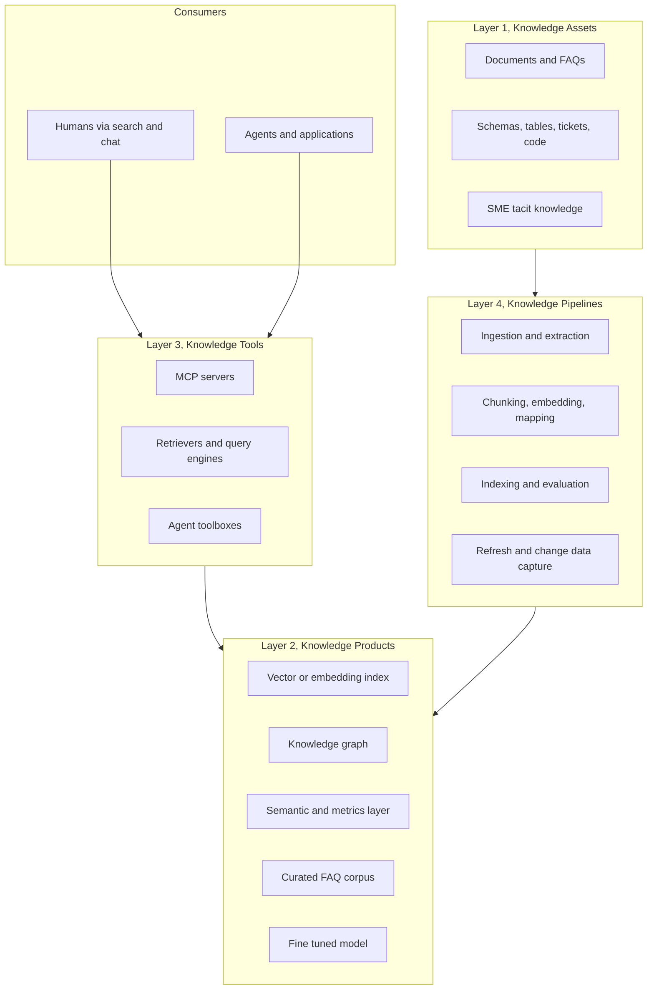
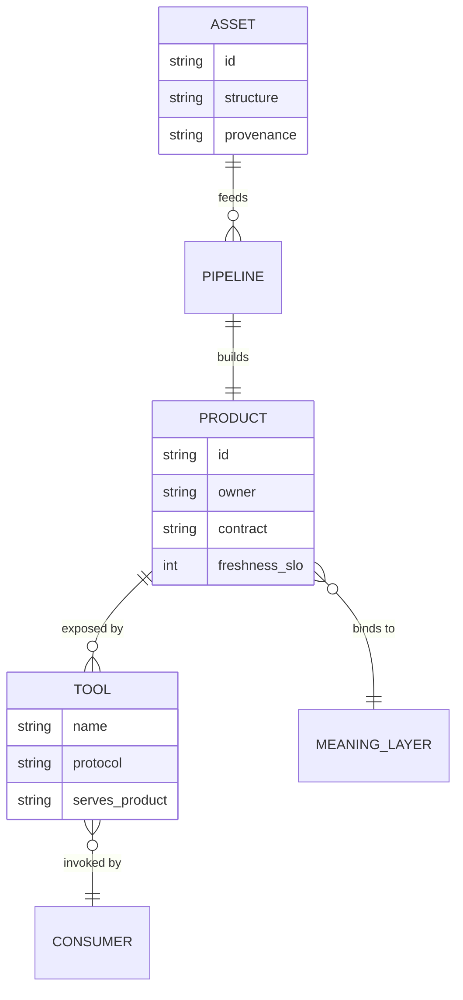
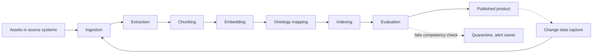
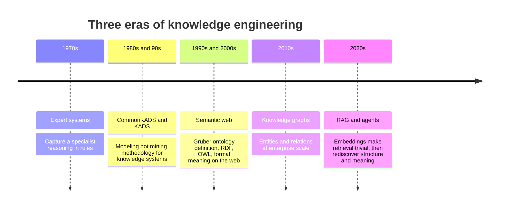

# Defining the Knowledge Stack: Assets, Products, Tools, and Pipelines

There is a road cut near where I used to drive to work, a place where the highway department blasted straight through a hill and left a clean vertical face of rock exposed. You can read the history of that hill in the wall. At the bottom, dense grey bedrock laid down under pressure over millions of years. Above it, a band of sandstone, coarser, the compacted remains of an old riverbed. Above that, a thin dark seam of organic matter, then loose soil, then the grass at the top that the deer graze on. A geologist can stand in front of that face and name every layer, say how it formed, and tell you which one sits on which. The layers are not interchangeable. The grass does not grow without the soil, the soil does not form without the rock beneath it, and you cannot understand any single band without understanding its place in the column.

Enterprise knowledge has strata too. We just refuse to name them. Walk into a planning meeting about "the knowledge base" and you will hear the word used, in a single hour, to mean a folder of PDFs, a vector index, a chatbot, a graph database, a metadata catalog, and the entire program that produces all of the above. People argue past each other for an afternoon and leave having agreed on nothing, because they were never talking about the same layer of the rock. The argument is not really about architecture. It is about vocabulary, and nobody noticed.

This post is the companion to [Knowledge as a Product](https://juanlara18.github.io/portfolio/#/blog/knowledge-as-a-product). That post makes an argument: in a large organization, knowledge has to be owned, versioned, and governed like a product, the way data mesh treats analytical data. It is a strong argument and I stand by it. But I noticed something while writing it. Half the disagreements it tries to resolve are not disagreements at all. They are people using one word for five different things. You cannot have a productive fight about whether knowledge should be a product until everyone agrees on what an *asset* is, what a *product* is, what a *tool* is, and what a *pipeline* is. The product argument assumes the vocabulary. This post supplies it.

So this is the definitional companion. No build tutorial, almost no code. Its single job is to give you a layered vocabulary precise enough that the harder questions, governance, comparison, ownership, become well-posed. I will define a knowledge base from the ground up, then read the strata one band at a time: assets, products, tools, pipelines, and the discipline of knowledge engineering that runs through all of them. At the end there is a glossary you can paste into your own org's documentation, because the real deliverable here is not an opinion. It is a set of words.

## Why Definitions First

There is an instinct, especially among engineers, to skip the vocabulary and get to the architecture. Definitions feel like throat-clearing, the boring preamble before the real work. I want to argue the opposite: in enterprise knowledge, the definitions *are* the architecture, and skipping them is how you end up rebuilding the same thing three times under three names.

Consider what actually happens without shared words. A team says "let's centralize the knowledge base." One person hears "let's put all our documents in one vector store." Another hears "let's build one canonical ontology everyone maps to." A third hears "let's stand up one search box over everything." All three nod. All three start building. Six months later they have a vector store, a half-finished ontology, and a search box that does not talk to either, and they are surprised that these do not compose, because at no point did anyone say which layer of the column they were operating on. The vector store is an asset-plus-product. The ontology is a meaning layer that should sit underneath the products. The search box is a tool. They are different strata. They were never going to be the same thing, and a one-sentence definition up front would have made that obvious.

This is not a new lesson. The discipline of [knowledge engineering](https://en.wikipedia.org/wiki/Knowledge_Acquisition_and_Documentation_Structuring) learned it the hard way in the 1980s. A 1989 study of why expert systems kept failing found that the dominant cause was not bad algorithms but the absence of methods for *structuring* knowledge, for getting expertise out of an expert's head and into a form a system could use. The field's response was CommonKADS, a methodology whose central slogan is worth tattooing on the wall of every knowledge program: knowledge engineering is *modeling, not mining*. You do not dig knowledge out of the ground fully formed. You build an explicit model of it, and a model needs a vocabulary of named parts. We forgot this lesson somewhere between the expert-systems winter and the RAG boom, and we are relearning it now at great expense.

There is also a precision argument that is easy to feel and hard to state, so let me state it. The reason [ontologies work](https://juanlara18.github.io/portfolio/#/blog/ontologies-building-knowledge-bases) is that they force you to say exactly what a `Customer` is, exactly what `holds` means, exactly which relations are allowed. That precision is not pedantry; it is the thing that lets a machine reason. The same precision, applied one level up to the *components* of a knowledge system rather than the concepts inside it, is what lets an *organization* reason about its own knowledge. A crisp definition of "knowledge product" is to an architecture review what a crisp definition of `DepositProduct` is to a retrieval query. Both turn a vague gesture into something you can act on without guessing.

So: definitions first. Not because it is tidy, but because it is load-bearing.

## What a Knowledge Base Actually Is

Here is the definition I want to defend, the one everything else hangs from.

**A knowledge base is the set of all knowledge assets an organization needs to synthesize knowledge and make it available.**

Read that slowly, because every word is doing work and the popular alternative gets all of them wrong. A knowledge base is a *set*, not a single store. It is the set of *assets*, not the set of documents, because assets include far more than documents. Its purpose is to *synthesize* knowledge, to combine raw inputs into something answerable, and to *make it available*, to expose that synthesis to a consumer. It is the whole organized collection plus the intent behind it, not any one container.

The common definition, the one the demos taught everyone, is "a knowledge base is a database you ask questions of," usually a vector store. This is wrong in a specific and consequential way: it confuses the base with one *product* derived from it. A vector index is something you build *from* your assets to make them available. It is one synthesized artifact, one band in the column, not the column itself. Calling the vector store "the knowledge base" is like a geologist pointing at the sandstone and calling it "the cliff." The sandstone is *in* the cliff. It is not the cliff.

Why insist on the set-of-assets framing instead of the convenient single-store one? Because the single-store framing makes whole categories of knowledge invisible. Your organization's knowledge does not live only in documents. It lives in the schema of your transactional database, which encodes years of decisions about what entities exist. It lives in the labeled examples your data scientists curated, in the embeddings you computed, in the resolved entities of your knowledge graph, in the support tickets that record every edge case a customer ever hit, and, most stubbornly, in the heads of the people who know which exceptions matter and have never written them down. If "knowledge base" means "the vector store," none of that counts, and you will keep being surprised when your chatbot cannot answer questions whose answers were never documents to begin with. The set-of-assets definition counts all of it, which is the first step to organizing all of it.

The framing also clarifies a confusion that the [enterprise knowledge bases post](https://juanlara18.github.io/portfolio/#/blog/enterprise-knowledge-bases) wrestles with from the inside: an organization does not have *a* knowledge base, singular, the way it has a logo. It has a knowledge base the way a library has a collection, an organized totality made of many discrete, owned, catalogued things. The question "what is in our knowledge base" has the same shape as "what is in our library." The answer is a catalog, not a pointer to a building.

With the base defined as a set of assets organized toward synthesis and availability, the strata fall out naturally. The assets are the inputs. The products are the synthesized, made-available artifacts. The tools are the interfaces that expose the products. The pipelines are the processes that turn assets into products and keep them current. And knowledge engineering is the discipline of designing all four to fit together. Here is the column, top to bottom, as a single picture before we read it layer by layer.



Notice that pipelines sit *beside* the products rather than above them in the consumption path. Consumers reach products through tools; pipelines feed products from below. That geometry matters, and we will come back to it. For now, start at the bottom of the cliff with the bedrock.

## Layer 1: Knowledge Assets

A **knowledge asset** is any artifact that carries organizational knowledge and can be made available, directly or after processing, to answer a question or inform a decision. The key word is *artifact*: an asset is a thing you can point at, name, own, and locate. The early-withdrawal-penalty rule, as a fact, is not an asset. The policy PDF that states it, the database column that encodes it, and the expert who can explain its exceptions are each assets. Assets are the bedrock. Everything above them is derived from them.

The mistake people make with assets is imagining a narrow slice, "documents", and missing the rest of the strata. A useful taxonomy cuts assets along three independent axes, and an asset has a position on all three at once.

**By structure.** *Structured* assets have a schema you can query exactly: relational tables, the columns of a transactional system, a CSV of labeled examples. *Semi-structured* assets carry partial structure: JSON logs, support tickets with fields plus a free-text body, Markdown with frontmatter. *Unstructured* assets are prose and media: policy PDFs, recorded calls, diagrams, the long tail that vector search was built for. Most enterprises overinvest in the unstructured pile because that is what the RAG demo used, and underinvest in the structured assets that often hold the most consequential knowledge, your schemas already encode what entities exist and how they relate.

**By explicitness.** *Explicit* assets are written down: documents, FAQs, code, schemas. *Tacit* assets live in people, the judgment calls and exceptions that never got recorded. The [knowledge-as-a-product post](https://juanlara18.github.io/portfolio/#/blog/knowledge-as-a-product) flags tacit knowledge as the hardest part of enterprise knowledge, and the asset framing tells you why: a tacit asset cannot be made available until a pipeline externalizes it, and most organizations have no such pipeline, so their most valuable knowledge is never an input to anything.

**By provenance.** A *source-of-truth* asset is authoritative: the legal team's signed policy, the system of record for accounts. A *derived* asset is computed from others: an embedding vector, an extracted entity, a summary. This axis is the one teams most often forget, and forgetting it is expensive. An embedding is a derived asset; it has no independent authority and must be regenerated when its source changes. Treating a derived asset as a source of truth, trusting last quarter's embeddings as if they were the policy, is how stale answers happen. Provenance is also what makes lineage possible: you can only trace an answer back to its authority if you tracked which assets were source and which were derived.

Here is the taxonomy as a quick reference, with the kind of asset most enterprises have a lot of in each cell.

| Axis | Value | Typical example | Made available by |
|---|---|---|---|
| Structure | Structured | Account tables, labeled training data | SQL interface, semantic layer |
| Structure | Semi-structured | Support tickets, JSON event logs | Extraction then index |
| Structure | Unstructured | Policy PDFs, call recordings, diagrams | Chunking and embedding |
| Explicitness | Explicit | Documents, code, schemas | Direct ingestion |
| Explicitness | Tacit | An expert's exception rules | Externalization loop, rarely built |
| Provenance | Source of truth | Signed legal policy, system of record | Cited directly |
| Provenance | Derived | Embeddings, extracted entities, summaries | Regenerated by a pipeline |

The discipline the asset layer demands is inventory. Before you can synthesize knowledge, you have to know what raw material you hold, where it lives, who owns it, and which axis cell it falls in. This is unglamorous and almost always skipped, and skipping it is why so many knowledge programs discover, late, that the answer they needed lived in a schema or a ticket queue nobody thought to count as knowledge. You cannot synthesize from assets you have not inventoried. The bedrock has to be surveyed before you build on it.

## Layer 2: Knowledge Products

This is the band where most of the confusion lives, so I want to draw the line hard. A **knowledge product** is a consumable, governed, versioned artifact that synthesizes one or more assets to make some knowledge available through a defined interface, with an owner, consumers, a contract, and quality guarantees.

The word that separates a product from mere data is not technical. It is *accountability*. A vector index sitting in a database is data. The same vector index becomes a product the moment it has a named owner, a documented contract describing what it answers and what it does not, an SLA on freshness, a known set of consumers, and a version you can pin to. Nothing about the bytes changed. What changed is that someone is now responsible for it, and a consumer can now trust it without reading the source code. The [knowledge-as-a-product post](https://juanlara18.github.io/portfolio/#/blog/knowledge-as-a-product) earns this distinction at length, borrowing the data-mesh idea that [a data product is a reusable asset with an owner, a lifecycle, quality expectations, and a clear purpose](https://martinfowler.com/articles/data-mesh-principles.html). The same five clauses make a knowledge artifact a product. I will not re-derive that argument; I want to use it to draw the boundary precisely.

The test for "is this a product or just data" comes down to whether you can answer six questions about it without asking a human:

- **Who owns it?** A named, accountable owner. No owner, not a product.
- **Who consumes it?** A known set of humans and agents it is built for.
- **What is its contract?** A documented interface, what it answers, in what shape, and explicitly what it does not answer.
- **What are its guarantees?** Stated freshness and quality SLOs, not aspirations.
- **What version is this?** A version with a changelog and a deprecation policy.
- **How do you report it wrong?** A feedback path back to the owner.

If you cannot answer all six, you have data, possibly very useful data, but not a product. This is the same bar the data-mesh literature writes as DATSIS, that a product be discoverable, addressable, trustworthy, self-describing, interoperable, and secure. The six questions are just that bar restated as an interrogation.

Crucially, a knowledge product is defined by these properties, *not* by its underlying technology. The same six questions apply whether the product is built on a vector store, a graph, a SQL view, or a fine-tuned model. This is why the product layer is the right unit of organization: it is technology-neutral. Here are the common kinds, each a genuine product when it carries the six properties.

A **vector or embedding index** is the canonical RAG product: curated chunks plus their embeddings, exposing similarity search over prose. The [vector databases post](https://juanlara18.github.io/portfolio/#/blog/vector-databases-indexes-to-vertex-search) is the inside of building one well, the index choices, the move from a raw index to a managed search service. As a product, what matters is not which index algorithm it uses but that it answers "what does the policy say about X," carries citations, and has an owner who keeps it fresh.

A **knowledge graph** is a product whose synthesis is entities and typed relations: `Customer` *holds* `Account`, `Account` *governed by* `Regulation`. It answers multi-hop relationship questions a vector index cannot. The graph is grounded in an [ontology](https://juanlara18.github.io/portfolio/#/blog/ontologies-building-knowledge-bases) that supplies the meaning of its node and edge types, which is why the graph and the ontology are distinct strata, one is the product, the other is the meaning layer the product binds to.

A **semantic layer or metrics layer** is a product whose synthesis is *definitions*: what "active customer" means, how "revenue" is computed, which join produces it. [A semantic layer is a translation layer between physical storage and business meaning](https://airbyte.com/blog/the-rise-of-the-semantic-layer-metrics-on-the-fly); the metrics layer is the part of it that holds the canonical metric definitions. As a knowledge product it gives the agent and the analyst one definition of a business concept, so "how much did we sell" has exactly one answer.

A **curated FAQ corpus** is the humblest product and often the most trusted: human-vetted question-answer pairs with owners and review dates. It synthesizes scattered policy into vetted answers. A **fine-tuned model** is a product too, an unusual one, because the synthesis is baked into weights rather than retrieved at query time, which makes its versioning and freshness story harder, you cannot cite a weight, and its contract has to be honest about that.

The line between asset and product is worth a side-by-side, because teams cross it without noticing and then wonder why nothing is trustworthy.

| Property | Knowledge asset | Knowledge product |
|---|---|---|
| What it is | A raw or derived input artifact | A synthesized, made-available artifact |
| Owner | An asset owner, often implicit | A named, accountable product owner |
| Interface | A file path, a table, a person | A documented contract with typed outputs |
| Consumers | Whoever can find it | A known, intended set of consumers |
| Guarantees | None inherent | Stated freshness and quality SLOs |
| Versioning | A file timestamp, maybe | A version, changelog, deprecation policy |
| Failure mode | Stale, duplicated, lost | Confidently wrong, breached contract |
| Unit of trust | None, you verify yourself | The contract, you trust by reference |

A small note on the artifact that makes a product real. In the companion post I write out a full product contract in YAML, the ownership, the interfaces, the freshness SLOs, the deprecation policy, and I will not repeat it here. The shape worth carrying into this post is just the minimal contract a product must publish, which you can model as a tiny dataclass without committing to any storage technology.

```python
from dataclasses import dataclass
from datetime import date

@dataclass(frozen=True)
class KnowledgeProduct:
    id: str                 # stable, addressable identifier
    owner: str              # accountable human or team, never empty
    consumers: list[str]    # who this is built for
    answers: str            # one sentence: what it makes available
    not_answers: str        # the out-of-scope boundary, equally important
    interface: str          # e.g. "mcp:deposits_policy.search"
    freshness_slo_days: int # the staleness guarantee
    version: str            # pinnable, with a changelog elsewhere
    last_refresh: date      # when the synthesis last ran
```

The point of the dataclass is not the code. It is that every field is mandatory. A product with an empty `owner` or a missing `not_answers` is not a product; it is data wearing a product's clothes. The contract is the boundary of the band.

## Layer 3: Knowledge Tools

A product exists to be consumed, but consumers, especially agents, do not reach into a product's storage. They reach through an interface. A **knowledge tool** is the interface that exposes a knowledge product to a consumer, a human or an agent, in a form that consumer can invoke. The tool is not the product. The tool is the door to the product, and you can put several doors on one product or one door in front of several products.

This distinction is subtle and worth a concrete contrast. A vector index with embeddings is a product. The `search(query) -> chunks` API in front of it is a tool. A retrieval endpoint, a text-to-SQL query engine over a semantic layer, a graph traversal API, an agent that orchestrates several of these, all of these are tools. They expose products; they are not the products. The same knowledge graph product might be reachable through a Cypher endpoint for engineers, a natural-language tool for an agent, and a visualization in a BI dashboard for an analyst, three tools, one product. Confusing the two leads to a predictable error: teams version and govern the tool, the API, while leaving the product, the actual synthesized knowledge behind it, ungoverned. You end up with a beautifully documented endpoint serving stale, unowned content.

The canonical knowledge tool in 2027 is an **MCP server**. The [Model Context Protocol](https://modelcontextprotocol.io/specification/2025-11-25) is an open standard, introduced by Anthropic in late 2024, for exposing capabilities and data to an LLM through a uniform interface, often described as a USB port for AI applications. Its specification defines a small set of server-side primitives, and two of them map directly onto our strata. A **tool** in MCP is a model-invocable function, the LLM decides when to call it, which is exactly our knowledge tool: the door an agent walks through to query a product. A **resource** in MCP is data the application can pull into the model's context, which is closer to handing the agent a slice of a product's content directly. MCP gives us a standardized way to say "here is a knowledge product, and here is the door." That standardization is the whole point: before MCP, every product needed a hand-rolled, bespoke integration for every agent framework, and the [production MCP post](https://juanlara18.github.io/portfolio/#/blog/mcp-production-enterprise) covers the auth and audit layer that makes exposing one safely in a regulated setting actually work.

A knowledge tool, expressed as an MCP tool, is small. What matters is that it names the product it serves and constrains what comes back.

```python
# An MCP-style tool that is the door to one knowledge product.
# It is NOT the product; it exposes the product's contract to an agent.
@mcp.tool()
def deposits_policy_search(query: str, top_k: int = 5) -> dict:
    """Search the deposits policy knowledge product.

    Answers what the policy says about deposit products: rates,
    penalties, eligibility. Does NOT answer a customer's balance.
    Every result carries a citation and an effective date.
    """
    product = registry.get("deposits-policy-kb")          # the product
    results = product.retrieve(query, top_k=top_k)         # synthesis
    return {
        "answers": [r.text for r in results],
        "citations": [r.citation for r in results],        # never empty
        "as_of": product.last_refresh.isoformat(),         # freshness
        "product_version": product.version,                # pinnable
    }
```

Read the docstring against the product contract from Layer 2 and you will see the tool is faithfully re-exposing the product's `answers`, `not_answers`, and guarantees. That fidelity is the tool's job: it is a thin, honest door, not a place where new behavior or new content appears. When a tool starts synthesizing knowledge itself, merging results, reformatting answers, adding logic, it has quietly become an unowned mini-product, and you have lost the boundary again. Keep tools thin. Push synthesis down into products where it can be owned. The [ontology-to-agent-toolbox arc](https://juanlara18.github.io/portfolio/#/blog/ontology-to-agent-toolbox) is the longer treatment of turning meaning into the toolbox an agent actually calls; here the one thing to hold is that the toolbox is doors, and the rooms are elsewhere.

The relationships among the strata are clean enough to draw as an entity model. An asset feeds a pipeline; a pipeline builds a product; a tool exposes a product; a consumer calls a tool; and a product binds to a meaning layer for its definitions.



One product, many tools. One tool, possibly many products it can reach. The cardinalities are the architecture, and they are only visible once the words are distinct.

## Layer 4: Knowledge Pipelines

A product is a snapshot of synthesis. Left alone, it ages, because the world changes and the assets underneath it change, and a product that does not change with them quietly becomes wrong. A **knowledge pipeline** is the process that turns assets into products and keeps them fresh, the machinery that gives a product its freshness and lineage guarantees. If the product is the photograph, the pipeline is the thing that keeps taking new photographs so the picture on the wall is never out of date.

This is why, in the stack diagram, pipelines sit beside products and feed them from below rather than sitting in the consumption path. A consumer never touches a pipeline. The consumer touches a tool, which touches a product, and the pipeline is what made that product trustworthy enough to touch. The pipeline's output is not an answer; it is the *guarantee behind the answer*. When a product's contract promises "every source re-verified within 90 days," the pipeline is the thing that has to actually run every 90 days for that promise to be true. A contract without a pipeline to enforce it is a lie with good formatting.

The stages of a knowledge pipeline are reasonably standard, and naming them is useful precisely because teams tend to build the first few and forget the last few. *Ingestion* pulls assets from their source systems. *Extraction* pulls structure out of unstructured assets, entities, fields, tables from a PDF. *Chunking* splits prose into retrievable units. *Embedding* turns chunks into vectors, a step that produces derived assets that must be regenerated when the source moves. *Entity and ontology mapping* aligns extracted entities to the canonical meaning layer, so "CDT" and "certificate of deposit" land on the same concept. *Indexing* writes the synthesized artifact into its serving store. *Evaluation* checks that the product still answers its competency questions correctly. And *refresh*, often via change data capture, re-runs the relevant stages when an upstream asset changes, so freshness is continuous rather than a quarterly heroics project.



Two stages are the ones organizations skip and then pay for, so I will name them twice. The first is *evaluation*. A pipeline that ingests, chunks, embeds, and indexes but never checks whether the resulting product actually answers correctly is a pipeline that ships regressions silently. Evaluation is what turns "we refreshed it" into "we refreshed it and it still works," and without it the freshness guarantee is hollow, you are promising the product is current, not that it is right. The second is *refresh and change data capture*. Most pipelines are built as one-shot loaders for a launch and then run by hand when someone remembers. That is not a pipeline; it is a migration. The [knowledge-as-a-product post](https://juanlara18.github.io/portfolio/#/blog/knowledge-as-a-product) makes this point sharply, that knowledge is operated, not migrated, and the pipeline is precisely where "operated" lives. A real pipeline notices when an upstream policy changes and re-synthesizes the affected product without a human in the loop.

The pipeline is also where *lineage* is produced. Because each stage records what it consumed and emitted, you can trace any answer in a product back through indexing, mapping, embedding, extraction, and ingestion to the source-of-truth asset it came from. That trace is what lets a regulator's question, where did this answer come from and is the source current, be answered by construction rather than by archaeology. Lineage is not a feature you add to a knowledge base; it is a byproduct of a pipeline that tracked its own work. No pipeline, no lineage, no defensible answer to the only question that ultimately matters.

## Knowledge Engineering: The Discipline That Ties It Together

Four layers, each with its own vocabulary. The discipline that designs all four to fit together coherently has a name, an old one. **Knowledge engineering** is the practice of designing knowledge assets, products, tools, and pipelines as a coherent system, modeling an organization's knowledge so it can be synthesized and made available reliably. It is to the knowledge stack what data engineering is to the data stack: the engineering discipline that makes the strata hold together rather than slide apart.

The name is old because the problem is old, and the history is genuinely useful for placing where we are. The discipline grew out of the expert-systems work of the 1970s, when the goal was to capture a human specialist's reasoning, a doctor's diagnostic logic, a geologist's mineral-prospecting heuristics, in a machine. It struggled, and the 1989 post-mortem on why expert systems failed pointed straight at the missing methods for structuring knowledge. The field's answer, in the 1980s and 90s, was [CommonKADS](https://dl.acm.org/doi/10.5555/347025), a full methodology for knowledge-based-system development that reframed the work from *mining* knowledge to *modeling* it, building explicit models of the organization, the task, and the knowledge before writing a line of inference code. Around the same time, Tom Gruber gave us the [definition of an ontology as a specification of a conceptualization](https://tomgruber.org/writing/ontolingua-kaj-1993.pdf), the single most cited idea in the field, and the semantic web tradition, RDF, OWL, SHACL, grew up to put formal meaning on the open web. Then came the LLM and RAG era, which made unstructured knowledge trivially retrievable and, in the rush, briefly forgot everything the earlier traditions knew about structure, meaning, and provenance. We are now stitching the two together: the retrieval power of embeddings with the rigor of ontologies and the discipline of pipelines.



The relationship to neighboring disciplines is worth stating plainly, because knowledge engineering is sometimes dismissed as a rebranding of one of them. It is not. *Data engineering* builds pipelines that move and shape data; knowledge engineering uses those pipelines but adds the meaning layer and the synthesis-toward-answers goal that data engineering does not own. The *semantic web tradition* contributes the formal modeling of meaning, ontologies, that grounds the products; knowledge engineering operationalizes it inside a serving stack rather than leaving it as triples on the open web. The modern *LLM and agent stack* contributes the retrieval and reasoning machinery; knowledge engineering supplies the structure that keeps that machinery from confidently lying. Knowledge engineering is the discipline that sits across all three and makes the four layers cohere. It is the difference between owning a pile of impressive components and owning a knowledge base in the full sense this post defined, the organized set of assets synthesized and made available, on purpose, by someone accountable.

## The Knowledge Stack: A Reference Model

Now the whole column, read as one model you can hold a real organization up against. The knowledge stack is five strata. **Assets** are the inputs, surveyed and inventoried. **Pipelines** turn assets into products and keep them fresh, producing lineage as they go. **Products** are the synthesized, owned, contracted artifacts, the unit of organization and the unit of trust. **Tools** are the thin doors that expose products to humans and agents, with MCP as the standard door. And **knowledge engineering** is the discipline running vertically through all four, designing them to cohere. The meaning layer, the ontology, sits alongside as the thing products bind to for their definitions.

To map your own organization, walk the layers and ask one question of each. For assets: do we have an inventory, and does it count schemas, tickets, and tacit knowledge, not just documents? For products: can we name an owner and a contract for each thing we call a knowledge base, and if not, is it actually just data? For tools: are our interfaces thin doors over owned products, or have they quietly become unowned mini-products? For pipelines: is each product fed by a process that refreshes and evaluates it, or is it a one-shot load aging in place? For the discipline: is anyone accountable for the coherence of the whole, or do we own impressive components that do not compose? The first place each answer is "no" is the first place the column is unstable.

The most common failure this model exposes is *compression*, collapsing several strata into one and losing the joints between them. "The vector store is our knowledge base" compresses asset, product, and tool into a single undifferentiated thing, which is why it cannot be governed, versioned, or trusted, there is no seam to attach ownership to. "The catalog handles meaning" compresses the catalog, a tool over metadata, with the ontology, a meaning layer, which is the [exact confusion the catalog-versus-ontology distinction exists to prevent](https://juanlara18.github.io/portfolio/#/blog/ontologies-building-knowledge-bases). Every one of these errors is a vocabulary error first and an architecture error second. Name the strata and the errors become visible. That is the whole return on defining the words.

Here is the glossary, the part you can lift straight into your own org's documentation. Every term is one this post defined; every definition is one sentence; every example is concrete.

| Term | One-line definition | Example |
|---|---|---|
| Knowledge base | The set of all knowledge assets needed to synthesize knowledge and make it available | A library collection, not a single store |
| Knowledge asset | A raw or derived artifact that carries knowledge and can be made available | A policy PDF, an account table, an embedding, an expert |
| Structured asset | An asset with a queryable schema | A relational table of accounts |
| Tacit asset | Knowledge in a person's head, not yet written down | An expert's rule for which exceptions matter |
| Source-of-truth asset | An authoritative asset others derive from | A signed legal policy document |
| Derived asset | An asset computed from others, with no independent authority | An embedding vector, an extracted entity |
| Knowledge product | A synthesized, owned, contracted, versioned artifact that makes knowledge available | A governed RAG corpus over deposits policy |
| Product contract | The documented interface, scope, guarantees, and owner of a product | A YAML spec with owner, SLOs, and out-of-scope list |
| Semantic or metrics layer | A product whose synthesis is canonical business definitions | The single definition of active customer |
| Knowledge tool | The interface that exposes a product to a consumer | An MCP search tool over the deposits product |
| MCP | An open standard for exposing tools and resources to an LLM or agent | The deposits_policy.search MCP tool |
| Knowledge pipeline | The process that turns assets into products and keeps them fresh | Ingest, chunk, embed, map, index, evaluate, refresh |
| Lineage | The traceable path from an answer back to its source-of-truth asset | This answer came from policy v4, section 3, current as of October |
| Ontology or meaning layer | The formal model of concepts and relations a product binds to | CDT and certificate of deposit map to one class |
| Knowledge engineering | The discipline of designing assets, products, tools, and pipelines coherently | Owning the whole column, not just components |

With these words in hand, the questions that the companion posts wrestle with stop being arguments and become well-posed engineering problems. The [knowledge-as-a-product post](https://juanlara18.github.io/portfolio/#/blog/knowledge-as-a-product) asks how to govern knowledge at enterprise scale; now you can see it is asking how to attach owners and contracts to the *product* layer, specifically, and federate that ownership while centralizing the catalog over it. A [companion post on comparing knowledge products](https://juanlara18.github.io/portfolio/#/blog/comparing-knowledge-bases-semantic-overlap), being published the same week, asks when two knowledge bases overlap; now you can see it is asking a precise question about whether two *products* synthesize the same *assets* into overlapping coverage, a question you can only pose once "product" and "asset" are distinct words. The vocabulary does not answer those questions. It makes them answerable, which is the only thing a vocabulary can do, and the most important thing, because you cannot structure what you cannot define.

Stand in front of the road cut again. The geologist's power is not that they can build the hill; nature did that. It is that they can name every layer, say how each formed, and tell you which sits on which, and from that reading they can predict where the water flows, where the rock will fail, where to dig. That is what a vocabulary buys you: not the knowledge itself, but the ability to reason about its structure. Name your strata. Then build.

## Going Deeper

**Books:**

- Schreiber, G., Akkermans, H., Anjewierden, A., de Hoog, R., Shadbolt, N., van de Velde, W., and Wielinga, B. (2000). *Knowledge Engineering and Management: The CommonKADS Methodology.* MIT Press. — The foundational methodology text for the discipline. Its "modeling not mining" stance and its layered model of knowledge are the intellectual ancestors of the strata in this post.
- Allemang, D., Hendler, J., and Gandon, F. (2020). *Semantic Web for the Working Ontologist* (3rd ed.). ACM Books. — The practical bridge from the semantic-web tradition to working systems. The clearest guide to the meaning layer that knowledge products bind to.
- Dehghani, Z. (2022). *Data Mesh: Delivering Data-Driven Value at Scale.* O'Reilly Media. — The source of the product-contract discipline this post borrows for the product layer. Written for data; the four principles transfer cleanly to knowledge.
- Kendall, E. F. and McGuinness, D. L. (2019). *Ontology Engineering.* Morgan and Claypool. — A compact modern treatment of building the formal models that ground the product layer's meaning. Useful right after the Allemang book.
- Stefik, M. (1995). *Introduction to Knowledge Systems.* Morgan Kaufmann. — A historical anchor from the expert-systems era. Reading it shows how much of today's "new" knowledge-engineering vocabulary is a rediscovery.

**Online Resources:**

- [Model Context Protocol Specification](https://modelcontextprotocol.io/specification/2025-11-25) — The authoritative spec for the canonical knowledge tool. Read the tools-versus-resources distinction directly; it maps onto the tool layer of this post.
- [Data Mesh Principles and Logical Architecture](https://martinfowler.com/articles/data-mesh-principles.html) — Dehghani's canonical free article. The DATSIS usability characteristics are the bar a knowledge product must clear.
- [What Is a Semantic Layer? (Airbyte)](https://airbyte.com/blog/the-rise-of-the-semantic-layer-metrics-on-the-fly) — A clear definition of the semantic and metrics layer as a translation between storage and meaning, the product kind most teams underuse.
- [Tom Gruber, A Translation Approach to Portable Ontology Specifications](https://tomgruber.org/writing/ontolingua-kaj-1993.pdf) — The original paper behind the most-cited definition of an ontology. Short, foundational, and still the cleanest statement of what the meaning layer is.

**Videos:**

- [The Model Context Protocol (MCP)](https://www.youtube.com/watch?v=CQywdSdi5iA) by Anthropic, with Theo Chu, David Soria Parra, and Alex Albert — The team behind MCP walking through the standard that this post frames as the canonical knowledge tool. The clearest articulation of the tool-versus-resource primitives.
- [The Missing Layer: Why Semantics and Knowledge Graphs Are Essential for AI-Ready Data Systems](https://www.youtube.com/watch?v=-udYsiECe3o) — A talk on why semantics, semantic layers, and knowledge graphs are necessary strata for AI-ready systems, complementary to the meaning-layer argument here.

**Academic Papers and Specs:**

- Gruber, T. R. (1993). ["A Translation Approach to Portable Ontology Specifications."](https://dl.acm.org/doi/10.1006/knac.1993.1008) *Knowledge Acquisition*, 5(2), 199-220. — The single most cited paper in the field, and the source of the ontology definition that grounds the meaning layer. The vocabulary lesson of this post is its lesson, one level up.
- Anthropic. (2024). [Introducing the Model Context Protocol.](https://www.anthropic.com/news/model-context-protocol) — The announcement and rationale for MCP. Read it for the "USB port for AI" framing that explains why the tool layer needed a standard in the first place.

**Questions to Explore:**

- This post defines the meaning layer (the ontology) as something products *bind to* rather than a sixth layer in the column. Is that the right call, or does meaning deserve to be its own stratum, with its own owner, contract, and pipeline, the way assets and products do?
- A tool is meant to be a thin door over a product. But agents increasingly orchestrate several tools and synthesize across them at query time. At what point does an agent stop being a tool and become an unowned, un-versioned knowledge product in its own right, and how would you detect the moment it crosses that line?
- The asset taxonomy treats tacit knowledge as an asset that "rarely" gets a pipeline to externalize it. Is there a defensible, repeatable pipeline that turns an expert's exception-handling into an owned product, or is the irreducibly tacit part a permanent ceiling on what any knowledge base can hold?
- If "knowledge base" is the whole set of assets and "knowledge product" is the synthesized unit, what is the right name for the organization-wide *catalog* that indexes every product? Is the catalog itself a product, a tool, or a sixth thing, and who owns it without becoming the monolith the product literature warns against?
- Lineage is described here as a byproduct of a well-built pipeline. For an answer produced by a fine-tuned model, where the synthesis is baked into weights rather than retrieved, what does lineage even mean, and can a weight-based product ever offer the same provenance guarantee as a retrieval-based one?
